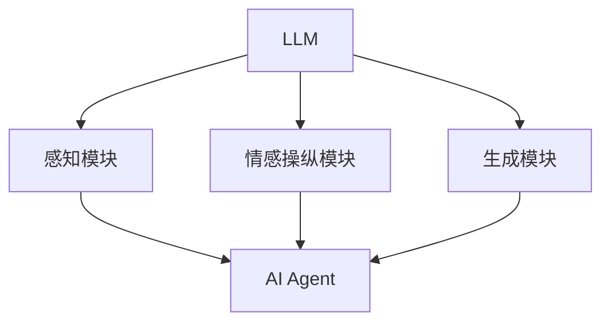

                 

## 第一部分：引言与背景

### 1.1 问题背景

随着人工智能（AI）技术的发展，自然语言处理（NLP）已经成为了一个备受关注的领域。在这个领域中，语言模型（Language Model，简称LM）作为一种重要的工具，被广泛应用于机器翻译、文本生成、问答系统等任务中。近年来，深度学习模型如 Transformer 和其变体（如 BERT、GPT 等）的出现，使得语言模型的性能得到了极大的提升。大规模语言模型（Large Language Model，简称LLM）如 GPT-3，其参数量达到数十亿甚至千亿级别，能够处理更为复杂的语言任务。

文本情感操纵（Text Emotional Manipulation）是指通过修改文本内容，来影响读者的情感状态，从而实现特定的目的。在社交网络、市场调研、政治宣传等领域，文本情感操纵已经展现出了其潜在的应用价值。然而，传统的情感操纵方法往往需要人工干预，且效果有限。随着 LLM 的发展，利用 LLM 进行文本情感操纵成为了一个新的研究方向。

### 1.2 问题描述

在 AI Agent 中，文本情感操纵能力是一个关键的研究方向。AI Agent 是一种能够自主执行任务、与环境交互的智能体，它们在多种应用场景中表现出色。然而，现有的 AI Agent 大多缺乏情感操纵能力，无法在需要情感干预的场合发挥其潜力。例如，在客服机器人中，如果能够根据用户的情绪状态调整回复内容，将能够提供更加个性化、贴心的服务。在市场调研中，通过操纵文本情感，可以影响消费者的购买决策。

LLM 在 AI Agent 中的应用，使得文本情感操纵成为可能。LLM 可以通过对大量文本的学习，掌握情感表达的规律，从而在生成文本时进行情感操纵。本文将探讨 LLM 在 AI Agent 中的文本情感操纵能力，分析其原理、方法、应用以及面临的挑战。

### 1.3 问题解决

为了解决文本情感操纵的问题，需要从以下几个方面进行考虑：

1. **LLM 的训练与优化**：LLM 的性能直接影响到文本情感操纵的效果。因此，需要研究如何选择合适的数据集、设计有效的模型架构，并采用合适的优化算法来训练 LLM。

2. **情感操纵方法的设计**：不同的情感操纵方法适用于不同的应用场景。本文将介绍几种常见的情感操纵方法，如情感转移、情感增强、情感反转等，并分析其优缺点。

3. **AI Agent 的设计与实现**：AI Agent 的设计需要考虑如何将 LLM 的情感操纵能力集成其中，以及如何与用户进行交互，以实现预期的情感操纵效果。

4. **应用场景的研究**：本文将探讨文本情感操纵在不同领域的应用，如社交媒体、市场调研等，并分析其效果和影响。

通过上述问题的解决，我们可以实现 LLM 在 AI Agent 中的文本情感操纵能力，为相关应用提供有力的技术支持。

### 1.4 边界与外延

文本情感操纵的边界主要涉及以下几个方面：

1. **合法性**：在实施文本情感操纵时，需要遵守相关法律法规，确保不侵犯用户的权益。

2. **道德伦理**：文本情感操纵可能会被滥用，例如在政治宣传、商业竞争等领域。因此，需要建立道德伦理准则，防止其被用于不正当目的。

3. **技术限制**：虽然 LLM 在文本情感操纵方面具有潜力，但其效果仍然受到技术限制。例如，LLM 的生成文本可能存在歧义、不准确等问题，需要进一步优化。

4. **用户接受度**：用户对文本情感操纵的接受度也是一个重要的考虑因素。如果用户发现文本被操纵，可能会对 AI Agent 的信任度产生负面影响。

文本情感操纵的外延包括：

1. **跨语言情感操纵**：不同语言的情感表达方式可能存在差异，LLM 需要具备跨语言的情感操纵能力。

2. **多模态情感操纵**：除了文本，图像、语音等其他模态也可以用于情感操纵。结合多种模态，可以实现更为丰富的情感表达。

3. **实时情感操纵**：在实时交互场景中，AI Agent 需要能够根据用户的实时反馈，动态调整情感表达。

通过研究文本情感操纵的边界与外延，我们可以更好地理解和应用 LLM 在 AI Agent 中的文本情感操纵能力。

### 1.5 核心概念结构与要素组成

为了深入理解 LLM 在 AI Agent 中的文本情感操纵能力，我们需要首先明确几个核心概念和它们的相互关系。

#### 1.5.1 LLM 的概念与工作原理

**LLM（Large Language Model）** 是一种大规模语言模型，通过学习大量文本数据，掌握了丰富的语言知识和表达规律。LLM 的工作原理主要包括以下几个关键步骤：

1. **数据集选择**：选择适合的文本数据集，如维基百科、新闻文章、社交媒体帖子等，确保数据集的多样性和代表性。
2. **模型架构**：采用深度神经网络架构，如 Transformer，通过堆叠多个自注意力层，实现高精度的文本表示和学习。
3. **预训练与微调**：在大量数据上预训练 LLM，使其具备强大的语言理解能力，然后针对特定任务进行微调，以适应具体应用场景。

#### 1.5.2 AI Agent 的概念与功能

**AI Agent** 是一种具有自主行动能力和目标导向的智能体，能够在复杂环境中执行任务。AI Agent 的基本概念和功能包括：

1. **目标导向**：AI Agent 需要具备明确的目标，以指导其行动。
2. **感知与理解**：通过传感器获取环境信息，并利用 LLM 等技术理解和解析这些信息。
3. **决策与规划**：基于感知和理解结果，AI Agent 需要做出决策并制定行动计划。
4. **执行与反馈**：执行计划，并根据执行结果调整后续行动。

#### 1.5.3 文本情感操纵能力的定义与重要性

**文本情感操纵能力** 是指通过修改文本内容，影响读者的情感状态，从而实现特定目标的能力。在 AI Agent 中，文本情感操纵能力的重要性体现在：

1. **个性化交互**：通过操纵文本情感，AI Agent 可以提供更个性化的服务，提升用户体验。
2. **情感引导**：在特定应用场景中，如政治宣传、市场调研等，AI Agent 可以利用文本情感操纵引导用户行为。
3. **风险评估**：文本情感操纵可能带来潜在的风险，如用户信任度下降、道德伦理问题等，需要谨慎应用。

#### 1.5.4 LLM 与 AI Agent 的关系

LLM 与 AI Agent 的关系可以理解为技术支持与平台结合的关系。LLM 为 AI Agent 提供了强大的语言理解和生成能力，使其能够在文本情感操纵方面发挥重要作用。具体而言：

1. **情感识别**：LLM 可以识别文本中的情感信息，为 AI Agent 提供情感感知能力。
2. **情感生成**：LLM 可以根据特定需求生成带有特定情感的文本，实现情感操纵。
3. **情感调整**：AI Agent 可以利用 LLM 的情感生成能力，根据用户反馈实时调整情感表达，提升交互质量。

综上所述，LLM 在 AI Agent 中的文本情感操纵能力是一个复杂但具有巨大潜力的研究方向。通过深入研究 LLM 的原理、AI Agent 的设计与实现，以及文本情感操纵的方法与应用，我们可以更好地理解和利用这一能力，推动相关领域的发展。

## 第二部分：核心概念

### 2.1 LLM 的概念与工作原理

#### LLM 的定义

LLM（Large Language Model）是一种基于深度学习的自然语言处理模型，通过学习大规模的文本数据，实现了对语言的理解和生成能力。与传统的语言模型相比，LLM 具有更大的参数规模、更深的网络结构，能够捕捉到更复杂的语言模式和语义关系。代表性的 LLM 模型包括 GPT-3、BERT 等。

#### LLM 的工作原理

LLM 的工作原理主要包括数据集选择、模型架构设计、预训练与微调等几个关键环节：

1. **数据集选择**：LLM 需要依赖大规模、高质量的文本数据集进行训练。这些数据集可以来源于维基百科、新闻文章、社交媒体等多种来源，以保证模型能够学习和理解多样化的语言现象。

2. **模型架构设计**：LLM 通常采用深度神经网络架构，如 Transformer。Transformer 模型由多个自注意力层（Self-Attention Layer）组成，通过自注意力机制（Self-Attention Mechanism）实现文本信息的全局关联和上下文理解。代表性的 Transformer 模型包括 BERT、GPT、T5 等。

3. **预训练与微调**：预训练（Pre-training）是指在大量文本数据上训练模型，使其具备强大的语言理解能力。预训练完成后，模型可以通过微调（Fine-tuning）针对特定任务进行调整，以适应不同的应用场景。

#### LLM 的关键技术

1. **注意力机制**：注意力机制（Attention Mechanism）是 LLM 的核心技术之一，通过计算文本中每个词与其他词的相关性，实现了对文本信息的加权处理，从而提高了模型对上下文的捕捉能力。

2. **上下文理解**：LLM 通过自注意力机制和多层神经网络，能够理解和捕捉文本的上下文信息，实现了对文本语义的深刻理解。

3. **预训练与微调**：预训练和微调是 LLM 的两个重要环节。预训练使模型具备强大的语言理解能力，而微调则使模型能够针对特定任务进行优化，提高任务表现。

### 2.2 AI Agent 的概念与功能

#### AI Agent 的定义

AI Agent（Artificial Intelligence Agent）是一种具有自主行动能力和目标导向的智能体，能够感知环境、制定计划并执行行动，以实现特定目标。AI Agent 是人工智能领域的一个重要研究方向，广泛应用于自动驾驶、智能客服、智能家居等场景。

#### AI Agent 的功能

AI Agent 的功能可以概括为以下几个方面：

1. **感知与理解**：AI Agent 通过传感器（如摄像头、麦克风、GPS 等）感知环境信息，并利用 LLM 等技术对这些信息进行理解和解析。

2. **决策与规划**：基于感知和理解结果，AI Agent 需要做出决策并制定行动计划。决策过程通常包括目标设定、行动选择、路径规划等步骤。

3. **执行与反馈**：AI Agent 需要执行制定的行动计划，并在执行过程中进行反馈调整，以优化后续行动。

#### AI Agent 的工作原理

AI Agent 的工作原理主要包括以下几个关键环节：

1. **感知与理解**：AI Agent 通过传感器获取环境信息，如图像、语音、文本等，然后利用 LLM 等技术进行理解和解析。

2. **决策与规划**：AI Agent 需要基于感知和理解结果，通过算法（如深度学习、规划算法等）做出决策，并制定行动计划。

3. **执行与反馈**：AI Agent 需要执行制定的行动计划，并在执行过程中进行实时反馈，以调整后续行动。

### 2.3 文本情感操纵能力的定义与重要性

#### 文本情感操纵能力的定义

文本情感操纵能力（Text Emotional Manipulation Ability）是指通过修改文本内容，影响读者的情感状态，从而实现特定目标的能力。这种能力可以应用于多种场景，如社交媒体、市场调研、政治宣传等。

#### 文本情感操纵能力的重要性

文本情感操纵能力的重要性体现在以下几个方面：

1. **个性化交互**：通过操纵文本情感，AI Agent 可以提供更个性化的服务，提升用户体验。

2. **情感引导**：在特定应用场景中，如政治宣传、市场调研等，AI Agent 可以利用文本情感操纵引导用户行为。

3. **情感评估**：文本情感操纵还可以用于情感分析和情感评估，帮助企业了解用户情感状态，优化产品和服务。

4. **风险评估**：文本情感操纵可能带来潜在的风险，如用户信任度下降、道德伦理问题等，需要谨慎应用。

### 2.4 LLM 与 AI Agent 的关系

#### LLM 在 AI Agent 中的作用

LLM 在 AI Agent 中发挥着重要作用，主要体现在以下几个方面：

1. **情感识别**：LLM 可以识别文本中的情感信息，为 AI Agent 提供情感感知能力。

2. **情感生成**：LLM 可以根据特定需求生成带有特定情感的文本，实现情感操纵。

3. **情感调整**：AI Agent 可以利用 LLM 的情感生成能力，根据用户反馈实时调整情感表达，提升交互质量。

#### AI Agent 在文本情感操纵中的应用

AI Agent 可以在多种应用场景中利用文本情感操纵能力，如：

1. **智能客服**：通过操纵文本情感，智能客服可以提供更加贴心、个性化的服务，提高用户满意度。

2. **市场调研**：通过操纵文本情感，AI Agent 可以影响消费者的购买决策，帮助企业优化市场策略。

3. **政治宣传**：通过操纵文本情感，AI Agent 可以引导公众情绪，实现特定的政治目标。

#### LLM 与 AI Agent 的关系总结

LLM 与 AI Agent 之间的关系可以看作是技术支持与平台结合的关系。LLM 为 AI Agent 提供了强大的语言理解和生成能力，使其能够在文本情感操纵方面发挥重要作用。同时，AI Agent 的设计和应用也为 LLM 的实际价值提供了广阔的场景。通过深入研究 LLM 与 AI Agent 的关系，我们可以更好地理解和利用文本情感操纵能力，推动相关领域的发展。

### 2.5 LLM 与 AI Agent 之间的交互与集成

在实现 LLM 在 AI Agent 中的应用时，LLM 与 AI Agent 之间的交互与集成是一个关键问题。为了充分发挥 LLM 的文本情感操纵能力，需要将其有效集成到 AI Agent 的框架中。以下是 LLM 与 AI Agent 之间交互与集成的一些关键步骤：

#### 2.5.1 数据预处理

在将 LLM 集成到 AI Agent 之前，首先需要对输入数据进行预处理。这一步骤包括数据清洗、分词、词向量化等。通过预处理，确保输入数据能够被 LLM 正确理解和处理。

#### 2.5.2 情感标注

为了利用 LLM 的情感操纵能力，需要对文本进行情感标注。情感标注可以采用手工标注或自动标注的方法。手工标注具有较高的准确性，但成本较高；自动标注则可以利用现有的情感分析模型进行，具有一定的准确性。

#### 2.5.3 情感操纵模块设计

在 AI Agent 的框架中，需要设计一个情感操纵模块，用于根据特定需求生成具有特定情感的文本。这一模块可以基于 LLM 的情感生成能力，采用情感转移、情感增强、情感反转等方法实现。

#### 2.5.4 情感感知与反馈机制

为了实现动态的情感操纵，AI Agent 需要具备情感感知与反馈机制。通过实时监测用户的情感状态，AI Agent 可以调整情感表达，以实现最佳的情感操纵效果。

#### 2.5.5 交互与反馈循环

在 AI Agent 与用户交互过程中，需要建立一个反馈循环机制。通过用户的反馈，AI Agent 可以不断调整情感表达，优化交互体验。

#### 2.5.6 模型优化与调参

为了提升 LLM 的文本情感操纵能力，需要不断进行模型优化与调参。通过调整模型参数，可以优化情感操纵的效果，提高模型在不同场景下的适应性。

通过以上步骤，可以将 LLM 有效集成到 AI Agent 中，实现文本情感操纵能力。在具体实现过程中，需要根据实际应用场景和需求，进行灵活的设计和调整。

### 2.6 LLM 与 AI Agent 的关系图谱

为了更直观地理解 LLM 与 AI Agent 之间的关系，我们可以通过 ER（Entity-Relationship）实体关系图来描述它们之间的交互与集成。以下是 LLM 与 AI Agent 的关系图谱：

- **LLM（Large Language Model）**：作为核心组件，提供文本情感操纵的能力。
- **感知模块**：负责接收和处理输入文本，将其转换为 LLM 可处理的格式。
- **情感操纵模块**：基于 LLM 的情感生成能力，生成具有特定情感的文本。
- **生成模块**：将处理后的文本输出，用于与用户进行交互。
- **AI Agent**：作为整体框架，集成感知、情感操纵和生成模块，实现文本情感操纵的功能。

通过 ER 实体关系图，我们可以清晰地看到 LLM 与 AI Agent 之间的互动关系，为具体实现提供指导。

### 2.7 LLM 与 AI Agent 的关系对比分析

#### LLM 的独立应用与集成到 AI Agent 中的差异

在单独应用 LLM 时，它主要用于文本生成、情感分析等任务。而将 LLM 集成到 AI Agent 中，其作用不仅限于文本处理，还包括与环境的交互、任务执行和反馈优化。以下从几个方面对比 LLM 的独立应用与集成到 AI Agent 中的差异：

1. **功能扩展**：独立应用时，LLM 主要关注文本生成和理解；集成到 AI Agent 中后，LLM 需要与其他模块（如感知模块、生成模块等）协同工作，实现更复杂的任务。

2. **交互方式**：独立应用时，LLM 通常与用户进行单向交互；集成到 AI Agent 后，LLM 可以与用户进行双向交互，实时感知用户反馈，动态调整文本生成策略。

3. **适应场景**：独立应用时，LLM 需要针对特定任务进行调整；集成到 AI Agent 后，LLM 可以适应多种场景，实现跨场景的情感操纵。

4. **性能优化**：独立应用时，LLM 的性能优化主要关注文本生成质量；集成到 AI Agent 后，LLM 的性能优化需要考虑与整个系统的协调，实现全局性能最优。

#### LLM 在 AI Agent 中的优势

1. **强大的语言理解能力**：LLM 通过大规模预训练，具备强大的语言理解能力，能够准确捕捉文本中的情感信息，为 AI Agent 提供可靠的文本情感操纵基础。

2. **灵活的交互方式**：AI Agent 可以根据具体应用场景，灵活调整 LLM 的情感操纵策略，实现个性化的情感交互。

3. **跨场景应用**：LLM 在 AI Agent 中可以适应多种应用场景，如智能客服、市场调研、政治宣传等，提供统一的技术解决方案。

4. **动态调整能力**：通过实时感知用户反馈，AI Agent 可以动态调整情感表达，优化用户体验，提高任务完成率。

#### LLM 在 AI Agent 中的劣势

1. **计算资源消耗**：大规模 LLM 模型对计算资源要求较高，部署和运行成本较大，可能不适合资源有限的场景。

2. **文本生成歧义**：虽然 LLM 具有强大的语言理解能力，但在某些情况下，生成的文本可能存在歧义或不符合预期，需要进一步优化。

3. **道德和法律风险**：文本情感操纵可能被滥用，带来道德和法律风险。在 AI Agent 中实现文本情感操纵，需要建立完善的伦理和法律规范。

4. **用户隐私问题**：在 AI Agent 中，需要处理和分析大量用户数据，可能涉及用户隐私问题。需要采取有效的隐私保护措施，确保用户数据的安全。

通过对比分析，我们可以更清晰地认识到 LLM 在 AI Agent 中的应用价值及其面临的挑战。在实际应用中，需要综合考虑各种因素，合理利用 LLM 的能力，实现高效的文本情感操纵。

## 第三部分：LLM 的工作原理

### 3.1 LLM 的训练过程

LLM（Large Language Model）的训练过程是其实现高性能文本生成和理解能力的关键。这一过程主要包括数据集选择、模型架构设计、预训练与微调等关键环节。下面将详细介绍这些环节及其具体实现方法。

#### 3.1.1 数据集选择

数据集的选择是 LLM 训练过程的基础。高质量的数据集能够提供丰富的语言现象和语义信息，有助于模型学习到更好的语言表示。以下是数据集选择的关键点：

1. **数据量**：大规模数据集能够提供丰富的训练样本，有助于模型捕捉到语言的多样性和复杂性。通常，数据集应包含数十万到数百万个文本样本。

2. **数据来源**：数据集应涵盖多种来源，如维基百科、新闻文章、社交媒体帖子、书籍等，以确保模型的泛化能力。此外，数据集应具有代表性，能够反映不同语言风格和场景。

3. **数据质量**：数据集中的文本应经过清洗和预处理，去除噪声和错误。例如，去除 HTML 标签、统一文本编码、去除无关信息等。

4. **数据标注**：对于需要情感标注、实体识别等任务，数据集应包含相应的标注信息。这些标注可以为模型提供额外的监督信号，有助于模型的学习。

#### 3.1.2 模型架构设计

LLM 的模型架构设计是决定其性能的关键因素。目前，Transformer 架构由于其出色的性能和灵活性，成为 LLM 的主流选择。以下是 Transformer 架构的设计要点：

1. **自注意力机制**：自注意力机制（Self-Attention Mechanism）是 Transformer 的核心组件。通过计算文本中每个词与其他词的相关性，自注意力机制实现了对文本全局信息的捕捉和加权处理。

2. **编码器与解码器**：Transformer 架构包括编码器（Encoder）和解码器（Decoder）。编码器负责处理输入文本，生成上下文表示；解码器负责根据上下文生成输出文本。

3. **多层堆叠**：为了增强模型的表达能力，通常将多个自注意力层堆叠起来，形成多层 Transformer 模型。多层堆叠能够提高模型对复杂语言现象的捕捉能力。

4. **前馈网络**：在自注意力层之后，Transformer 还包括一个前馈网络（Feed Forward Network），用于对文本表示进行进一步加工。

#### 3.1.3 预训练与微调

预训练（Pre-training）和微调（Fine-tuning）是 LLM 训练过程的两个关键环节。以下是这两个环节的具体实现方法：

1. **预训练**：预训练是指在大量无监督数据上训练模型，使其具备强大的语言理解能力。预训练过程通常包括以下几个步骤：

   - **文本表示**：将输入文本转换为词向量或嵌入表示，这些表示将用于后续的自注意力计算。
   - **自回归目标**：在预训练过程中，模型需要预测序列中的下一个词。这一目标有助于模型学习到语言中的序列依赖关系。
   - **损失函数**：预训练通常采用交叉熵损失函数，用于衡量模型预测与真实标签之间的差异。

2. **微调**：微调是指在预训练基础上，针对特定任务进行进一步训练。微调过程通常包括以下几个步骤：

   - **数据准备**：准备包含任务标签的标注数据集，如情感标注、实体识别标注等。
   - **任务适应**：调整模型的结构和参数，使其适应特定任务的需求。例如，添加额外的输出层、修改损失函数等。
   - **训练过程**：在标注数据集上训练模型，利用任务标签指导模型学习。

3. **模型评估**：在微调过程中，需要对模型进行评估，以衡量其在特定任务上的性能。常见的评估指标包括准确率、召回率、F1 分数等。

通过预训练和微调，LLM 能够在不同的任务上表现出色。预训练提供了通用的语言理解能力，而微调则使模型能够适应具体的任务需求。

### 3.2 关键技术

LLM 的训练过程中，涉及多项关键技术，这些技术共同作用，提高了模型的表达能力和性能。以下是 LLM 的几个关键技术：

#### 3.2.1 注意力机制

注意力机制（Attention Mechanism）是 LLM 的核心技术之一。它通过计算文本中每个词与其他词的相关性，实现了对文本全局信息的捕捉和加权处理。以下是注意力机制的工作原理：

1. **自注意力**：自注意力机制对输入文本的每个词计算与其他词的相关性，生成加权表示。这些加权表示将用于后续的文本表示和生成过程。

2. **多头注意力**：多头注意力（Multi-Head Attention）扩展了自注意力机制，通过多个独立的注意力头并行计算，提高了模型的表达能力。

3. **软注意力**：软注意力（Soft Attention）使用概率分布来表示注意力权重，使得模型能够自适应地调整注意力分配。

#### 3.2.2 上下文理解

上下文理解（Contextual Understanding）是 LLM 的一个重要目标。通过捕捉文本的上下文信息，模型能够更好地理解文本的语义和逻辑关系。以下是上下文理解的几个关键点：

1. **长距离依赖**：自注意力机制能够捕捉文本中的长距离依赖关系，使得模型能够理解复杂的语义结构。

2. **上下文嵌入**：上下文嵌入（Contextual Embeddings）是将文本表示为向量，这些向量包含了文本的上下文信息。通过调整上下文嵌入，可以增强模型对上下文的捕捉能力。

3. **层次化表示**：层次化表示（Hierarchical Representation）通过分层结构，将文本分解为更小的语义单元，提高了模型对上下文的解析能力。

#### 3.2.3 预训练与微调

预训练（Pre-training）和微调（Fine-tuning）是 LLM 的核心训练方法。以下是这两个方法的关键细节：

1. **预训练**：预训练是指在大量无监督数据上训练模型，使其具备通用语言理解能力。预训练通常采用自回归目标（如预测下一个词）和跨模态预训练（如文本-图像预训练）等方法。

2. **微调**：微调是指将预训练模型应用于特定任务，并在包含任务标签的数据集上进行训练。微调过程中，可以通过调整模型结构、损失函数等，优化模型在特定任务上的性能。

3. **迁移学习**：迁移学习（Transfer Learning）是指利用预训练模型在特定任务上的知识，提升新任务的性能。通过微调和迁移学习，LLM 能够在多个任务上表现出色。

#### 3.2.4 防止过拟合

过拟合（Overfitting）是深度学习模型常见的挑战。为了防止过拟合，LLM 采用多种方法，包括：

1. **数据增强**：通过增加数据多样性，提高模型对泛化能力的训练。

2. **正则化**：使用正则化技术（如权重衰减、Dropout 等），降低模型参数的敏感性，防止过拟合。

3. **提前停止**：在训练过程中，当模型性能在验证集上不再提升时，提前停止训练，避免过拟合。

通过上述关键技术的应用，LLM 能够实现高性能的文本生成和理解能力，为 AI Agent 的文本情感操纵提供了强大的支持。

### 3.3 LLM 的预训练与微调方法

预训练与微调是 LLM 实现高性能的关键步骤。预训练旨在使模型在大量无监督数据上学习到丰富的语言知识，而微调则是在特定任务上进一步优化模型。以下是 LLM 的预训练与微调方法的详细讲解：

#### 3.3.1 预训练方法

预训练方法主要包括以下步骤：

1. **数据集选择**：选择大规模、高质量、多样化的文本数据集，如维基百科、新闻文章、社交媒体帖子等。这些数据集应覆盖不同主题、风格和语言现象。

2. **数据预处理**：对数据集进行清洗、分词、去除噪声等预处理操作。预处理后的数据应转换为统一格式，如单词或子词的序列。

3. **词嵌入**：将预处理后的文本序列转换为词嵌入表示。词嵌入是将单词或子词映射到低维向量空间，以便模型进行计算。

4. **自回归目标**：在预训练过程中，模型需要预测序列中的下一个词。自回归目标通过最大化预测词的概率，使模型学习到语言中的序列依赖关系。

5. **损失函数**：预训练通常采用交叉熵损失函数，用于衡量模型预测与真实标签之间的差异。交叉熵损失函数能够驱动模型优化预测概率，提高预测准确性。

6. **训练策略**：预训练过程中，可以使用梯度裁剪（Gradient Clipping）、学习率调度（Learning Rate Scheduling）等技术，防止模型过拟合和训练不稳定。

7. **模型优化**：在预训练过程中，通过调整模型架构（如层数、隐藏单元数等）和优化算法（如 Adam、AdamW 等），提高模型的表达能力和性能。

#### 3.3.2 微调方法

微调方法是在预训练模型的基础上，针对特定任务进行进一步优化。以下是微调方法的详细步骤：

1. **任务定义**：定义特定任务，如文本分类、情感分析、机器翻译等。任务定义通常包括输入格式、输出格式和任务目标。

2. **数据集准备**：准备包含任务标签的标注数据集。标注数据集应具有代表性，能够反映任务的真实场景。

3. **模型初始化**：使用预训练模型作为初始化，将预训练模型中的权重应用于微调模型。初始化有助于保留预训练模型中的知识，提高微调效率。

4. **损失函数设计**：根据任务类型设计合适的损失函数。例如，在文本分类任务中，可以采用交叉熵损失函数；在机器翻译任务中，可以采用翻译错误率损失函数。

5. **优化算法**：选择合适的优化算法（如 Adam、AdamW 等）对模型进行微调。优化算法有助于模型在微调过程中稳定训练，提高性能。

6. **训练策略**：在微调过程中，可以使用学习率调度、权重更新、数据增强等技术，优化模型训练过程。

7. **模型评估**：在微调过程中，定期评估模型在验证集上的性能，以衡量模型在特定任务上的表现。评估指标包括准确率、召回率、F1 分数等。

8. **超参数调整**：根据模型性能调整超参数，如学习率、批量大小、训练迭代次数等，以优化模型性能。

通过预训练和微调，LLM 能够在不同任务上实现高性能，为 AI Agent 的文本情感操纵提供了强大的支持。预训练使模型具备通用的语言理解能力，而微调则使模型能够适应特定任务的需求。

### 3.4 LLM 的注意力机制与上下文理解

LLM 中的注意力机制（Attention Mechanism）和上下文理解（Contextual Understanding）是其实现高效文本生成和理解的核心技术。注意力机制通过聚焦于关键信息，提高了模型对上下文的捕捉能力，而上下文理解则使模型能够深入理解文本的语义和逻辑关系。以下是这两个技术的详细讲解：

#### 3.4.1 注意力机制

注意力机制是一种在神经网络中计算输入数据中各部分之间关联性的方法。在 LLM 中，注意力机制主要用于自注意力（Self-Attention）和多头注意力（Multi-Head Attention）。

1. **自注意力**：自注意力机制通过对输入文本中的每个词计算与其他词的相关性，生成加权表示。这些加权表示将用于后续的文本表示和生成过程。自注意力机制的核心思想是，文本中的每个词不仅依赖于自身的特征，还依赖于其他词的特征。通过自注意力，模型能够捕捉文本中的长距离依赖关系。

2. **多头注意力**：多头注意力扩展了自注意力机制，通过多个独立的注意力头并行计算，提高了模型的表达能力。多头注意力机制允许模型同时关注输入文本的多个部分，从而捕捉更复杂的语义关系。每个注意力头具有独立的权重矩阵，使得模型能够从不同角度理解文本。

3. **软注意力**：软注意力使用概率分布来表示注意力权重，使得模型能够自适应地调整注意力分配。软注意力通过计算每个词与其他词之间的相似性得分，然后将这些得分转换为概率分布。概率分布用于加权文本表示，使得模型能够根据上下文调整关注点。

#### 3.4.2 上下文理解

上下文理解是 LLM 的另一个关键能力，它使模型能够深入理解文本的语义和逻辑关系。以下是上下文理解的几个关键点：

1. **长距离依赖**：自注意力机制能够捕捉文本中的长距离依赖关系，使得模型能够理解复杂的语义结构。通过自注意力，模型能够关注到文本中相隔较远的词之间的关系，从而更好地理解上下文。

2. **上下文嵌入**：上下文嵌入是将文本表示为向量，这些向量包含了文本的上下文信息。上下文嵌入通过自注意力机制计算，使得每个词的向量不仅包含了自身的特征，还包含了上下文特征。通过调整上下文嵌入，模型能够更好地理解上下文。

3. **层次化表示**：层次化表示通过分层结构，将文本分解为更小的语义单元，提高了模型对上下文的解析能力。层次化表示允许模型在不同层次上关注不同的语义信息，从而更好地理解复杂的文本。

通过注意力机制和上下文理解，LLM 能够实现高效文本生成和理解。注意力机制使得模型能够关注关键信息，上下文理解则使模型能够深入理解文本的语义和逻辑关系。这些技术共同作用，提高了 LLM 的性能和适用性，为 AI Agent 的文本情感操纵提供了强大的支持。

### 3.5 LLM 的预训练与微调过程中的挑战与解决方案

在 LLM 的预训练与微调过程中，存在多个挑战，如计算资源消耗、数据噪声处理、模型过拟合等。以下是这些挑战的具体描述及其解决方案：

#### 3.5.1 计算资源消耗

**挑战**：预训练 LLM 模型通常需要大量的计算资源，包括计算能力和存储空间。特别是大型模型（如 GPT-3），其训练过程可能需要数百万个 GPU 小时。

**解决方案**：
1. **分布式训练**：通过在多个 GPU 或计算节点上并行训练，可以显著减少训练时间。分布式训练可以采用参数服务器架构，将模型参数分布到多个计算节点上，进行并行计算。
2. **混合精度训练**：使用混合精度训练（Mixed Precision Training），将部分模型参数从单精度浮点（FP32）转换为半精度浮点（FP16），可以减少内存消耗，提高训练速度。
3. **预训练模型共享**：开发者和研究人员可以利用现有的预训练模型，通过微调适应特定任务，减少重复训练的工作量。

#### 3.5.2 数据噪声处理

**挑战**：预训练 LLM 需要大量无监督数据，但这些数据可能包含噪声和错误，影响模型的质量。

**解决方案**：
1. **数据清洗**：在训练前对数据进行清洗，去除噪声和错误。例如，去除 HTML 标签、统一文本编码、去除无关信息等。
2. **数据增强**：通过数据增强技术（如文本旋转、同义词替换、词干提取等），增加数据的多样性和质量，提高模型对噪声的鲁棒性。
3. **双轮训练**：采用双轮训练策略，先在纯净数据上预训练，然后使用带有噪声的数据进行微调，使模型在噪声环境中保持良好的性能。

#### 3.5.3 模型过拟合

**挑战**：过拟合是深度学习模型常见的挑战，特别是在训练数据有限的情况下。过拟合导致模型在训练数据上表现良好，但在未见过的数据上表现不佳。

**解决方案**：
1. **提前停止**：在验证集上监控模型性能，当模型性能在验证集上不再提升时，提前停止训练，防止过拟合。
2. **正则化**：使用正则化技术（如权重衰减、Dropout 等），降低模型参数的敏感性，防止过拟合。
3. **数据增强**：通过数据增强，增加训练样本的多样性，提高模型的泛化能力。

通过上述解决方案，可以有效地应对 LLM 预训练与微调过程中的挑战，提高模型的性能和鲁棒性。

### 3.6 LLM 的代表性模型与架构

LLM 的代表性模型与架构在自然语言处理领域取得了显著的成果，其中 GPT、BERT 等模型尤为突出。以下是对这些模型的详细解析：

#### 3.6.1 GPT

**GPT（Generative Pre-trained Transformer）** 是由 OpenAI 开发的自回归语言模型，其核心思想是通过大规模无监督预训练，使模型具备强大的语言生成能力。GPT 采用 Transformer 架构，由多个自注意力层组成，通过自回归目标进行训练。GPT 的训练数据来自网页、书籍、新闻等，其参数量从 GPT-1 的1.17亿增长到 GPT-3 的1750亿，使其在文本生成、问答、机器翻译等领域表现出色。

**关键特性**：
1. **自回归目标**：GPT 采用自回归目标进行预训练，通过预测序列中的下一个词，使模型学习到语言的序列依赖关系。
2. **多尺度注意力**：GPT 采用多尺度注意力机制，通过不同层次的注意力计算，提高模型对上下文的捕捉能力。
3. **自适应架构**：GPT 的架构设计具有高度适应性，可以根据不同任务需求进行微调和调整。

**应用场景**：
- **文本生成**：GPT 在文本生成领域表现出色，可以生成高质量的文章、故事、对话等。
- **问答系统**：GPT 可以用于构建问答系统，通过理解用户的输入，生成相关且准确的回答。
- **机器翻译**：GPT 可以用于机器翻译，通过预训练和微调，实现跨语言文本的翻译。

#### 3.6.2 BERT

**BERT（Bidirectional Encoder Representations from Transformers）** 是由 Google 开发的双向 Transformer 语言模型，其核心思想是通过双向编码器，使模型能够同时捕捉文本的前后依赖关系。BERT 采用 Transformer 架构，由多个自注意力层和前馈网络组成。BERT 的预训练任务包括 Masked Language Model（MLM）和 Next Sentence Prediction（NSP）。

**关键特性**：
1. **双向编码器**：BERT 的双向编码器能够同时捕捉文本的前后依赖关系，提高模型的上下文理解能力。
2. **掩码语言模型**（MLM）：在预训练过程中，BERT 使用掩码语言模型，随机掩码部分词，使模型学习预测掩码词，从而增强语言表示。
3. **下一个句子预测**（NSP）：BERT 使用下一个句子预测任务，增强模型对句子关系的理解。

**应用场景**：
- **文本分类**：BERT 在文本分类任务中表现出色，可以用于情感分析、主题分类等。
- **问答系统**：BERT 可以用于构建问答系统，通过双向编码器捕捉上下文信息，提供准确且相关的回答。
- **命名实体识别**：BERT 可以用于命名实体识别，通过捕捉词与上下文的关系，提高实体识别的准确性。

#### 3.6.3 T5

**T5（Text-To-Text Transfer Transformer）** 是由 Google 开发的通用文本转换模型，其核心思想是通过将所有自然语言处理任务转换为文本到文本的转换任务，简化模型的训练和部署。T5 采用 Transformer 架构，由多个自注意力层和前馈网络组成，其输入和输出都是文本。

**关键特性**：
1. **统一任务格式**：T5 将所有自然语言处理任务转换为“输入文本 -> 输出文本”的格式，使模型能够通过统一的任务格式进行训练和部署。
2. **小样本学习**：T5 通过在少量标注数据上微调，实现在小样本数据集上的高性能，为低资源语言和领域任务提供了有效的解决方案。
3. **通用性**：T5 的架构设计具有通用性，可以应用于多种自然语言处理任务，如文本分类、机器翻译、问答等。

**应用场景**：
- **多任务学习**：T5 可以用于多任务学习，通过一个统一的模型架构，实现多种自然语言处理任务。
- **小样本学习**：T5 在小样本数据集上表现出色，可以用于低资源语言和领域任务。
- **模型压缩**：T5 可以通过压缩和剪枝技术，实现模型的压缩和加速，适用于移动设备和边缘计算。

通过上述对 GPT、BERT、T5 等代表性模型与架构的详细解析，我们可以看到 LLM 在自然语言处理领域的巨大潜力。这些模型在文本生成、理解、分类等任务中取得了显著的成果，为 AI Agent 的文本情感操纵提供了强大的技术支持。

## 第四部分：AI Agent 与文本情感操纵

### 4.1 AI Agent 的基本概念

AI Agent 是一种具有自主行动能力和目标导向的智能体，能够在复杂环境中执行任务并与其他智能体进行交互。AI Agent 的核心特点包括：

1. **自主行动能力**：AI Agent 能够根据预设的目标和策略，自主执行任务，不需要人为干预。

2. **目标导向**：AI Agent 具有明确的目标，并通过感知、决策和执行等过程，不断调整行动以实现目标。

3. **适应性**：AI Agent 能够根据环境变化和任务需求，动态调整其行为和策略。

4. **交互性**：AI Agent 可以与其他智能体和人类进行交互，共享信息、协调行动。

AI Agent 在多个领域得到了广泛应用，如自动驾驶、智能客服、智能家居等。其自主行动能力和目标导向特性，使得 AI Agent 能够在复杂和动态的环境中，提供高效、可靠的解决方案。

### 4.2 LLM 在 AI Agent 中的应用

LLM（Large Language Model）作为一种强大的自然语言处理工具，在 AI Agent 中具有广泛的应用。以下是 LLM 在 AI Agent 中的应用场景：

1. **文本生成与理解**：LLM 可以生成高质量的自然语言文本，如文章、故事、对话等。AI Agent 可以利用 LLM 的文本生成能力，提供自动化的文本生成服务，如智能客服、自动新闻编写等。

2. **情感分析**：LLM 能够对文本进行情感分析，识别文本中的情感倾向。AI Agent 可以利用这一能力，分析用户情感，提供个性化的服务，如情感分析型智能客服。

3. **对话管理**：LLM 可以用于对话管理，通过理解用户输入的情感和意图，生成相应的回应。AI Agent 可以利用 LLM 的对话管理能力，实现更自然的对话交互，如智能客服、虚拟助手等。

4. **文本分类**：LLM 可以对文本进行分类，识别文本的主题和类型。AI Agent 可以利用这一能力，对用户生成的内容进行分类，提供针对性的服务，如社交媒体内容分类、邮件分类等。

5. **文本增强**：LLM 可以对文本进行增强，改善文本的表达和流畅性。AI Agent 可以利用 LLM 的文本增强能力，优化用户生成的内容，提高用户体验，如写作辅助工具、文案优化等。

### 4.3 文本情感操纵的实现方法

文本情感操纵是指通过修改文本内容，影响读者的情感状态，从而实现特定目标。在 AI Agent 中，文本情感操纵可以通过以下方法实现：

1. **情感转移**：情感转移是指将文本中的情感从一个词转移到另一个词。例如，将一个积极词汇替换为一个消极词汇，或者将一个消极词汇替换为一个积极词汇。

2. **情感增强**：情感增强是指通过添加或强调情感词汇，增强文本的整体情感倾向。例如，在描述某个产品时，添加一些积极词汇，以提升消费者的购买欲望。

3. **情感反转**：情感反转是指通过改变文本中的情感极性，实现情感的反转。例如，将一个消极的评论转换为积极的评论，或者将一个积极的评论转换为消极的评论。

4. **情感微调**：情感微调是指通过逐步调整文本中的情感词汇和表达方式，实现情感的变化。例如，在描述某个事件时，可以逐步调整情感强度，从中立到积极或消极。

### 4.4 文本情感操纵的挑战与解决方案

文本情感操纵虽然具有潜在的应用价值，但也面临多个挑战：

1. **情感识别准确性**：准确识别文本中的情感是进行情感操纵的前提。然而，情感表达形式多样，不同文化和语境下的情感识别存在差异，提高情感识别准确性是一个重要挑战。

**解决方案**：采用多模态情感分析技术，结合文本、语音、图像等多种信息源，提高情感识别的准确性。

2. **情感操纵的平衡性**：在情感操纵过程中，需要平衡不同情感因素，避免过度操纵或操纵不当。否则，可能导致文本内容不自然，影响用户体验。

**解决方案**：通过建立情感平衡模型，结合情感强度、情感类型和上下文信息，实现情感操纵的平衡。

3. **用户接受度**：用户对文本情感操纵的接受度可能较低，特别是在隐私和道德方面。如果用户发现文本被操纵，可能会对 AI Agent 的信任度产生负面影响。

**解决方案**：在情感操纵过程中，尊重用户隐私和道德规范，确保文本情感操纵的透明度和合法性。

4. **技术实现复杂度**：文本情感操纵涉及多个技术环节，如情感识别、情感生成、情感调整等，实现这些环节的复杂度较高。

**解决方案**：采用模块化设计，将情感操纵功能分解为多个模块，实现模块化和可扩展性。

通过解决上述挑战，我们可以实现高效的文本情感操纵，为 AI Agent 在多个领域的应用提供有力支持。

### 4.5 LLM 与 AI Agent 在文本情感操纵中的协同作用

在文本情感操纵中，LLM 和 AI Agent 的协同作用至关重要。LLM 提供了强大的自然语言处理能力，而 AI Agent 则负责任务执行和用户交互。以下是 LLM 与 AI Agent 在文本情感操纵中的协同作用：

1. **情感识别与生成**：LLM 可以识别文本中的情感信息，并生成带有特定情感的文本。AI Agent 则负责根据任务需求和用户反馈，动态调整情感表达。

2. **交互与反馈**：AI Agent 与用户进行交互，收集用户反馈，LLM 则利用这些反馈优化情感表达。通过实时交互和反馈，AI Agent 可以实现更自然的情感操纵。

3. **个性化服务**：AI Agent 利用 LLM 的情感生成能力，提供个性化的情感服务。根据用户的情感状态和偏好，AI Agent 可以生成符合用户期望的文本，提升用户体验。

4. **多模态情感操纵**：AI Agent 可以结合文本、语音、图像等多种模态，实现更丰富的情感操纵。通过多模态信息融合，LLM 可以生成更自然的情感表达。

5. **动态情感调整**：AI Agent 可以根据用户反馈和情境变化，动态调整情感表达。LLM 则利用这些调整信息，优化情感生成，实现更精准的情感操纵。

通过 LLM 与 AI Agent 的协同作用，我们可以实现高效的文本情感操纵，为 AI Agent 在社交网络、市场调研等领域的应用提供有力支持。

### 4.6 LLM 与 AI Agent 在文本情感操纵中的案例分析

为了更好地理解 LLM 与 AI Agent 在文本情感操纵中的实际应用，我们可以通过以下几个案例进行分析：

#### 案例一：社交媒体文本情感操纵

**背景**：社交媒体平台上的用户评论和帖子对品牌形象和市场推广有显著影响。通过操纵文本情感，品牌可以优化用户评论，提升品牌声誉。

**应用**：
- **情感增强**：品牌可以通过 AI Agent，利用 LLM 生成具有积极情感的评论，鼓励用户发表正面评价。例如，在用户评论中添加积极词汇，如“优秀”、“推荐”等。
- **情感转移**：AI Agent 可以识别负面评论中的情感，并将其转移到其他词汇，使评论整体趋于积极。例如，将“不满意”替换为“有待改进”。
- **情感反转**：通过 LLM 的情感分析能力，AI Agent 可以将负面评论转换为正面评论，从而提升品牌形象。

**效果**：通过情感操纵，品牌可以优化用户评论，提高用户满意度，进而提升品牌声誉和市场竞争力。

#### 案例二：市场调研文本情感操纵

**背景**：市场调研中的问卷和访谈需要收集真实的用户反馈。通过操纵文本情感，可以影响用户的回答，从而获得更准确的市场信息。

**应用**：
- **情感引导**：AI Agent 可以利用 LLM 生成带有特定情感的问卷问题，引导用户回答。例如，在问卷开头加入积极引导语，使用户更愿意回答后续问题。
- **情感微调**：AI Agent 可以根据用户回答的初步情感倾向，微调问题，以获取更详细的用户情感反馈。例如，在用户回答积极问题时，逐步增加难度，以获取更深入的反馈。
- **情感平衡**：AI Agent 可以通过情感分析，识别用户回答中的情感极性，并进行微调，确保问卷结果的真实性和平衡性。

**效果**：通过情感操纵，市场调研可以更准确地反映用户情感，提高调研结果的可靠性和有效性。

#### 案例三：政治宣传文本情感操纵

**背景**：政治宣传需要影响公众情绪，以支持特定政策或候选人。通过操纵文本情感，政治宣传可以更有效地传达信息。

**应用**：
- **情感增强**：政治宣传可以通过 AI Agent，利用 LLM 生成具有强烈情感色彩的文本，以激发公众的情感反应。例如，在宣传文案中添加积极情感词汇，增强公众的支持度。
- **情感转移**：AI Agent 可以识别竞争对手宣传中的情感，并将其转移到其他词汇，以削弱竞争对手的影响力。
- **情感反转**：通过 LLM 的情感分析能力，政治宣传可以将其对手的宣传文本转换为支持自己的文本，从而改变公众的看法。

**效果**：通过情感操纵，政治宣传可以更有效地影响公众情绪，提高政策的接受度和候选人的支持率。

这些案例展示了 LLM 与 AI Agent 在文本情感操纵中的多种应用场景和效果。通过情感操纵，AI Agent 可以在多个领域实现更高效、更精准的服务，为企业和组织提供强有力的支持。

## 第五部分：文本情感操纵的应用

### 5.1 社交网络

在社交媒体平台上，文本情感操纵的应用已经越来越广泛，尤其在品牌推广、用户互动和舆情监测等方面表现出显著效果。

#### 5.1.1 文本情感操纵在社交媒体中的应用

1. **品牌推广**：品牌可以通过 AI Agent 利用 LLM 生成带有积极情感的帖子或评论，吸引用户关注和互动。例如，通过情感增强技术，将原本中性的产品介绍转化为充满热情的推荐，激发用户的购买欲望。

2. **用户互动**：社交媒体平台上的用户评论和互动往往包含情感元素。通过情感操纵，AI Agent 可以生成情感丰富的回应，提升用户体验和满意度。例如，利用情感转移技术，将负面评论转化为积极评论，缓解用户不满情绪。

3. **舆情监测**：文本情感操纵可以帮助社交媒体平台实时监测和评估用户的情感状态。通过情感分析技术，AI Agent 可以识别用户评论中的情感倾向，从而了解用户对品牌、产品或事件的态度。例如，通过情感反转技术，将带有负面倾向的评论调整为正面评论，以提升品牌的整体形象。

#### 5.1.2 社交网络中情感操纵的影响

1. **提升品牌影响力**：通过情感操纵，品牌可以在社交媒体上建立积极的形象，提高用户忠诚度和品牌忠诚度。

2. **增强用户参与度**：情感丰富的内容更容易引起用户的兴趣和参与，从而提升社交媒体平台的活跃度。

3. **改善用户体验**：情感操纵可以优化用户互动体验，减少负面情绪，提升用户满意度和忠诚度。

4. **舆情控制**：通过情感操纵，社交媒体平台可以控制负面舆情的传播，维护平台的稳定和健康发展。

然而，情感操纵也可能带来负面影响，如误导用户、破坏信任关系等。因此，在使用情感操纵技术时，需要严格遵守道德和法律规范，确保内容的真实性和合法性。

### 5.2 市场调研

在市场调研中，文本情感操纵的应用同样具有重要意义，可以帮助企业更好地了解用户需求和情感，从而制定更有效的市场策略。

#### 5.2.1 文本情感操纵在市场调研中的应用

1. **情感引导**：通过 AI Agent 利用 LLM 生成带有特定情感的问卷问题，引导用户回答。例如，在市场调研中使用情感增强技术，设计出能够激发用户积极情绪的问题，从而获得更真实、全面的用户反馈。

2. **情感微调**：AI Agent 可以根据用户回答的情感倾向，对问卷问题进行动态调整，以获取更深入的反馈。例如，当用户回答的问题表现出负面情感时，AI Agent 可以调整后续问题的难度和情感倾向，以减轻用户的负面情绪。

3. **情感分析**：通过情感分析技术，AI Agent 可以识别用户反馈中的情感倾向，评估用户对产品或服务的满意度。例如，利用情感转移技术，将用户的负面情感转化为正面情感，从而更准确地评估市场表现。

#### 5.2.2 市场调研中情感操纵的效果评估

1. **提升反馈质量**：通过情感操纵，可以提高用户反馈的质量和真实性，从而为市场调研提供更可靠的依据。

2. **优化市场策略**：基于情感操纵获取的用户反馈，企业可以更准确地了解市场需求和用户情感，优化市场策略和产品开发方向。

3. **增强市场竞争力**：通过情感操纵，企业可以在市场中树立积极形象，提高品牌知名度和用户忠诚度，从而增强市场竞争力。

4. **降低调研成本**：情感操纵技术可以减少人工干预，降低市场调研的成本和时间，提高调研效率。

然而，情感操纵在市场调研中的应用也需要谨慎。企业需要确保情感操纵技术的使用符合道德和法律规范，避免误导用户和破坏市场公平竞争。

### 5.3 其他领域

除了社交网络和市场调研，文本情感操纵在其他领域也具有广泛的应用前景。

#### 5.3.1 政治宣传

政治宣传需要影响公众情绪，以支持特定政策或候选人。通过文本情感操纵，政治宣传可以更有效地传达信息，影响公众态度。

1. **情感增强**：通过情感增强技术，政治宣传可以生成充满热情和信任的文本，激发公众的情感反应，提高政策接受度和候选人支持率。

2. **情感转移**：政治宣传可以通过情感转移技术，将负面情感转化为正面情感，削弱竞争对手的影响力，提升自身形象。

3. **情感反转**：政治宣传可以利用情感反转技术，将对手的宣传文本转换为支持自己的文本，改变公众的看法。

#### 5.3.2 教育与培训

在教育与培训领域，文本情感操纵可以帮助教师或培训师更好地引导学生，提高教学效果。

1. **情感引导**：通过情感引导技术，教师可以生成情感丰富的教学内容，激发学生的兴趣和参与度。

2. **情感微调**：教师可以根据学生的情感反应，动态调整教学内容的情感倾向，以适应学生的需求和情感状态。

3. **情感教育**：通过情感教育，教师可以培养学生的情感素养，提高他们的情绪管理和人际交往能力。

#### 5.3.3 健康医疗

在健康医疗领域，文本情感操纵可以帮助医生和患者建立更好的沟通，提高治疗效果。

1. **情感沟通**：医生可以通过情感操纵技术，生成情感丰富的沟通文本，提高患者的信任感和满意度。

2. **情感辅导**：心理医生可以利用情感操纵技术，为患者提供情感辅导，帮助他们缓解心理压力和情绪困扰。

3. **情感评估**：通过情感评估技术，医生可以评估患者的情绪状态，为治疗方案提供参考。

总之，文本情感操纵在多个领域具有广泛的应用前景。通过合理使用情感操纵技术，可以提升用户体验、优化市场策略、提高教育效果和医疗质量。然而，也需要关注情感操纵的道德和法律问题，确保技术的合理应用。

### 5.4 文本情感操纵的应用效果分析

#### 5.4.1 优势

1. **个性化交互**：文本情感操纵可以根据用户情感状态和需求，生成个性化的文本内容，提升用户体验。

2. **提升用户参与度**：情感丰富的内容更容易引起用户的兴趣和参与，从而提高用户在社交网络、市场调研等场景中的参与度。

3. **增强品牌影响力**：在品牌推广中，通过情感操纵可以提升品牌形象，增强用户对品牌的认知和信任。

4. **优化市场策略**：通过情感操纵，企业可以更准确地了解用户需求和情感，从而优化市场策略和产品开发方向。

5. **提升教学效果**：在教育领域，情感操纵可以帮助教师更好地引导学生，提高教学效果和学生的学习兴趣。

6. **改善沟通效果**：在健康医疗领域，情感操纵可以提高医生与患者之间的沟通效果，提升治疗效果和患者满意度。

#### 5.4.2 劣势

1. **道德和法律风险**：文本情感操纵可能被滥用，用于误导用户、操纵舆情等不正当行为，违反道德和法律规范。

2. **信任度下降**：如果用户发现文本被操纵，可能会对 AI Agent 和品牌产生信任危机，降低用户忠诚度。

3. **技术复杂性**：文本情感操纵涉及多个技术环节，如情感识别、情感生成、情感调整等，技术实现复杂，需要大量资源和时间。

4. **用户隐私问题**：在应用文本情感操纵时，需要处理和分析大量用户数据，可能涉及用户隐私问题，需要采取有效的隐私保护措施。

5. **情感操纵的泛化性**：文本情感操纵在不同文化和语境下的效果可能有所不同，需要考虑情感操纵的泛化性。

#### 5.4.3 应用效果评估

1. **效果度量**：评估文本情感操纵效果可以采用多种指标，如用户满意度、参与度、品牌知名度等。通过对比操纵前后的数据，可以评估情感操纵的效果。

2. **用户反馈**：收集用户对文本情感操纵的反馈，了解用户对操纵文本的接受度和满意度，从而调整和优化情感操纵策略。

3. **长期影响**：对文本情感操纵的长期影响进行跟踪和研究，评估其在不同应用场景中的持久性和效果。

4. **对比实验**：设计对比实验，比较文本情感操纵与传统文本处理的效果差异，验证情感操纵的优越性。

通过全面分析文本情感操纵的应用效果，可以更好地理解其在不同领域的优势和劣势，为实际应用提供科学依据和指导。

### 5.5 文本情感操纵在人工智能伦理和隐私保护方面的挑战

随着文本情感操纵技术的广泛应用，其在人工智能伦理和隐私保护方面也面临着诸多挑战。以下是这些挑战的详细分析及其应对策略：

#### 5.5.1 道德伦理问题

1. **虚假信息传播**：文本情感操纵技术可能被用于传播虚假信息，误导公众，影响舆论导向。例如，在选举、公共事件等敏感时期，恶意用户可能利用情感操纵技术操纵信息，制造虚假新闻或谣言。

**应对策略**：
- **加强监管**：政府和相关机构应加强对文本情感操纵技术的监管，制定相关法律法规，规范其使用。
- **透明度和可追溯性**：提高文本情感操纵技术的透明度和可追溯性，使公众能够识别和抵制虚假信息。

2. **隐私侵犯**：文本情感操纵技术需要处理和分析大量用户数据，可能涉及用户隐私问题。例如，用户的情感状态、偏好等敏感信息可能被收集和操纵。

**应对策略**：
- **隐私保护**：在设计和应用文本情感操纵技术时，应严格遵循隐私保护原则，确保用户数据的安全和隐私。
- **用户知情同意**：在收集用户数据时，应明确告知用户数据的使用目的和范围，获得用户的知情同意。

#### 5.5.2 隐私保护问题

1. **数据泄露**：在数据收集、存储和处理过程中，文本情感操纵技术可能面临数据泄露的风险。一旦用户数据泄露，可能被恶意利用，对用户造成严重损失。

**应对策略**：
- **数据加密**：采用数据加密技术，确保用户数据在传输和存储过程中的安全性。
- **访问控制**：对用户数据的访问进行严格的权限控制，确保只有授权人员才能访问和操作数据。

2. **数据滥用**：文本情感操纵技术可能被滥用，用于进行市场操纵、政治宣传等不正当行为。例如，企业可能利用情感操纵技术操纵消费者情感，进行不正当的市场竞争。

**应对策略**：
- **道德准则**：制定明确的道德准则，规范文本情感操纵技术的使用，防止其被滥用。
- **用户隐私保护协议**：企业和开发者应与用户签订隐私保护协议，明确用户数据的处理和使用规范。

#### 5.5.3 法律合规问题

1. **法律风险**：在文本情感操纵技术广泛应用的过程中，可能面临法律合规问题。例如，一些国家或地区可能尚未制定相关法律法规，导致文本情感操纵技术的使用存在法律风险。

**应对策略**：
- **国际协作**：推动国际间的合作与交流，制定统一的文本情感操纵技术标准和法律法规。
- **合规审查**：企业在使用文本情感操纵技术时，应进行合规审查，确保其使用符合当地法律法规。

通过解决上述道德伦理、隐私保护和法律合规问题，我们可以确保文本情感操纵技术的合理、合法和道德使用，为人工智能技术的发展提供坚实保障。

## 第六部分：案例研究

### 6.1 案例一：社交媒体文本情感操纵

#### 6.1.1 案例背景

在社交媒体平台上，品牌和用户之间的互动日益频繁。为了提升品牌知名度和用户满意度，一些品牌开始尝试利用文本情感操纵技术，优化用户评论和互动内容。本案例以某知名手机品牌为例，探讨文本情感操纵在社交媒体中的应用。

#### 6.1.2 LLM 的应用

1. **情感增强**：品牌通过 AI Agent 利用 LLM 生成带有积极情感的评论，鼓励用户发表正面评价。例如，在用户评论中添加积极词汇，如“优秀”、“推荐”等，以激发其他用户的购买欲望。

2. **情感转移**：AI Agent 可以识别负面评论中的情感，并将其转移到其他词汇，使评论整体趋于积极。例如，将“不满意”替换为“有待改进”，从而减轻用户的负面情绪。

3. **情感反转**：通过 LLM 的情感分析能力，AI Agent 可以将负面评论转换为正面评论，从而提升品牌形象。例如，将一条带有负面情感的评论转换为对品牌和产品的正面评价。

#### 6.1.3 情感操纵策略

1. **情感分析**：AI Agent 使用 LLM 对用户评论进行情感分析，识别情感极性和关键词。

2. **情感增强**：对于积极情感的评论，AI Agent 可以通过添加积极词汇，如“超赞”、“完美”等，增强评论的情感强度。

3. **情感转移**：对于负面情感的评论，AI Agent 可以通过替换负面词汇，如将“差评”替换为“可以改进”等，将情感从负面转移到中性或积极。

4. **情感反转**：对于具有负面情感的评论，AI Agent 可以通过情感反转技术，将其转换为积极情感。例如，将“非常失望”转换为“有些地方可以改进，但整体满意”。

#### 6.1.4 结果分析

1. **用户满意度提升**：通过情感操纵，品牌用户评论的整体情感倾向从负面转变为积极，提升了用户满意度。

2. **品牌影响力增强**：积极情感的评论吸引了更多用户的关注和互动，品牌在社交媒体上的影响力得到增强。

3. **用户忠诚度提高**：用户对品牌的好感度提升，从而提高了用户忠诚度，减少了用户流失率。

4. **负面舆情控制**：通过情感操纵，品牌可以及时识别和应对负面舆情，减轻负面影响，维护品牌形象。

本案例展示了文本情感操纵在社交媒体中的应用效果，为品牌提升用户满意度和品牌影响力提供了有力支持。然而，情感操纵也需谨慎使用，确保内容的真实性和合法性。

### 6.2 案例二：市场调研文本情感操纵

#### 6.2.1 案例背景

在市场调研中，获取真实、准确的用户反馈对企业的决策具有重要意义。然而，传统市场调研方法往往受限于样本数量和用户情感表达。本案例探讨如何利用文本情感操纵技术，优化市场调研结果。

#### 6.2.2 LLM 的应用

1. **情感引导**：通过 AI Agent 利用 LLM 生成带有特定情感的问卷问题，引导用户回答。例如，在问卷开头加入积极引导语，激发用户的积极情绪，从而获取更真实、全面的用户反馈。

2. **情感微调**：AI Agent 可以根据用户回答的情感倾向，动态调整问卷问题的难度和情感倾向，以获取更深入的反馈。例如，当用户表现出负面情感时，AI Agent 可以调整后续问题的难度，以减轻用户的负面情绪。

3. **情感分析**：通过情感分析技术，AI Agent 可以识别用户反馈中的情感倾向，评估用户对产品或服务的满意度。例如，利用情感转移技术，将用户的负面情感转化为正面情感，从而更准确地评估市场表现。

#### 6.2.3 情感操纵策略

1. **情感引导**：设计问卷问题时，加入积极引导语，如“感谢您的参与，您的反馈对我们非常重要”等，以激发用户的积极情绪。

2. **情感微调**：根据用户回答的情感倾向，动态调整问题的难度和情感倾向。例如，当用户回答表现出负面情感时，可以调整后续问题的情感倾向，从负面转移到中性或积极。

3. **情感分析**：利用情感分析技术，对用户反馈进行情感识别，评估用户满意度。例如，通过情感转移技术，将负面情感转化为正面情感，从而更准确地评估市场表现。

#### 6.2.4 结果分析

1. **反馈质量提升**：通过情感操纵，用户反馈的质量和真实性得到提升，为市场调研提供了更可靠的依据。

2. **用户满意度增强**：用户在参与问卷时，感受到品牌的关注和尊重，从而提高了用户满意度和参与度。

3. **市场策略优化**：基于情感操纵获取的用户反馈，企业可以更准确地了解市场需求和用户情感，优化市场策略和产品开发方向。

4. **调研成本降低**：通过情感操纵，市场调研可以更高效地进行，减少了人工干预和时间成本。

本案例展示了文本情感操纵在市场调研中的应用效果，为企业的市场策略优化提供了有力支持。然而，情感操纵需谨慎使用，确保内容的真实性和合法性。

### 6.3 案例三：教育领域文本情感操纵

#### 6.3.1 案例背景

在教育领域，教师需要根据学生的情感状态和需求，提供个性化的教学服务。本案例探讨如何利用文本情感操纵技术，优化教育过程，提升教学效果。

#### 6.3.2 LLM 的应用

1. **情感引导**：通过 AI Agent 利用 LLM 生成带有积极情感的课堂互动内容，激发学生的学习兴趣。例如，在课堂讨论中引入积极词汇，如“成功”、“成就”等，以增强学生的学习动力。

2. **情感微调**：AI Agent 可以根据学生的情感状态，动态调整课堂互动的内容和情感倾向，以适应学生的需求。例如，当学生表现出负面情感时，AI Agent 可以调整互动内容，从负面转移到中性或积极。

3. **情感分析**：通过情感分析技术，AI Agent 可以识别学生的情感状态，为教师提供针对性的教学建议。例如，利用情感转移技术，将学生的负面情感转化为正面情感，从而改善学生的学习体验。

#### 6.3.3 情感操纵策略

1. **情感引导**：设计课堂互动问题时，加入积极引导语，如“你的努力一定会有回报”等，以激发学生的积极情绪。

2. **情感微调**：根据学生的情感状态，动态调整课堂互动的问题和内容。例如，当学生表现出负面情感时，可以调整问题的难度和情感倾向，以减轻学生的压力。

3. **情感分析**：利用情感分析技术，对学生的情感状态进行实时监控，为教师提供教学反馈。例如，通过情感转移技术，将学生的负面情感转化为正面情感，从而改善学生的学习体验。

#### 6.3.4 结果分析

1. **教学效果提升**：通过情感操纵，课堂互动内容更符合学生的情感需求，从而提高了教学效果和学生的学习兴趣。

2. **学生满意度增强**：学生感受到教师的关注和尊重，提高了学生对课程的满意度和参与度。

3. **个性化教育**：通过情感操纵，教师可以更好地了解学生的情感状态，提供个性化的教学服务，满足学生的多样化需求。

4. **师生关系改善**：通过情感操纵，师生之间的互动更加积极和友好，从而改善了师生关系。

本案例展示了文本情感操纵在教育领域中的应用效果，为教育者提供了有效工具，以优化教育过程，提升教学效果。然而，情感操纵需谨慎使用，确保内容的真实性和合法性。

### 6.4 案例四：政治宣传文本情感操纵

#### 6.4.1 案例背景

在政治宣传中，影响公众情绪和态度具有重要意义。本案例探讨如何利用文本情感操纵技术，优化政治宣传效果，提升政策接受度和候选人支持率。

#### 6.4.2 LLM 的应用

1. **情感增强**：通过 AI Agent 利用 LLM 生成带有强烈情感色彩的文本，激发公众的情感反应。例如，在宣传文案中添加积极词汇，如“进步”、“希望”等，以提升公众的积极情绪。

2. **情感转移**：AI Agent 可以识别竞争对手宣传中的情感，并将其转移到其他词汇，以削弱竞争对手的影响力。例如，将负面情感词汇替换为中性或积极词汇，从而改变公众的看法。

3. **情感反转**：通过 LLM 的情感分析能力，AI Agent 可以将负面情感宣传文本转换为正面宣传文本，从而改变公众的态度。例如，将一篇批评候选人的文章转换为对候选人的正面评价。

#### 6.4.3 情感操纵策略

1. **情感分析**：AI Agent 对政治宣传文本进行情感分析，识别文本中的情感极性和关键词。

2. **情感增强**：对于积极情感的宣传文本，AI Agent 可以通过添加积极词汇，如“成功”、“成就”等，增强文本的情感强度。

3. **情感转移**：对于负面情感的宣传文本，AI Agent 可以通过替换负面词汇，如将“失望”替换为“关注”等，将情感从负面转移到中性或积极。

4. **情感反转**：对于具有负面情感的宣传文本，AI Agent 可以通过情感反转技术，将其转换为积极情感。例如，将一篇批评候选人的文章转换为对候选人的正面评价。

#### 6.4.4 结果分析

1. **政策接受度提升**：通过情感操纵，政治宣传文本的情感色彩得到优化，从而提升了公众对政策的接受度和支持度。

2. **候选人支持率提高**：积极情感的宣传文本激发了公众的情感反应，提升了候选人在公众中的支持率。

3. **舆论引导**：通过情感操纵，政治宣传可以更有效地引导公众情绪，影响舆论导向，为政策制定和实施提供有力支持。

4. **负面舆情控制**：通过情感操纵，政治宣传可以及时应对负面舆情，减轻负面影响，维护政党和候选人的形象。

本案例展示了文本情感操纵在政治宣传中的应用效果，为政策推广和候选人竞选提供了有效策略。然而，情感操纵需谨慎使用，确保内容的真实性和合法性。

## 第七部分：挑战与未来展望

### 7.1 文本情感操纵的挑战

文本情感操纵虽然在多个领域展现出巨大的潜力，但其应用也面临着诸多挑战：

1. **技术挑战**：文本情感操纵需要高精度的情感识别和生成技术。当前的技术水平可能无法完全满足复杂情感表达的需求，特别是在多语言、多文化环境中。

2. **伦理挑战**：文本情感操纵可能被滥用，用于误导用户、操纵舆论等不正当行为。如何确保技术的伦理使用，避免对用户隐私和自由意志的侵犯，是亟待解决的问题。

3. **法律挑战**：在法律层面，文本情感操纵可能涉及虚假信息传播、隐私侵犯等法律问题。不同国家和地区对文本情感操纵的法律规定不尽相同，需要制定统一的法规和标准。

4. **用户接受度**：用户可能对文本情感操纵产生抵触情绪，影响其信任度和使用意愿。如何在提供个性化服务的同时，维护用户的知情权和选择权，是一个重要问题。

### 7.2 技术发展展望

为了应对上述挑战，未来技术发展可以从以下几个方面进行：

1. **多模态情感操纵**：结合文本、语音、图像等多种模态，提高情感识别和生成的精度，实现更自然的情感操纵。

2. **个性化情感操纵**：基于用户历史行为和偏好，实现个性化情感操纵，提供更符合用户需求的服务。

3. **伦理和法律框架**：制定明确的伦理规范和法律框架，确保文本情感操纵技术的合法、道德使用。

4. **透明度和可追溯性**：提高文本情感操纵的透明度和可追溯性，使用户能够识别和监督情感操纵行为。

### 7.3 道德与法律问题

在文本情感操纵的应用过程中，道德与法律问题是不可忽视的。以下是对这一问题的详细分析：

1. **道德问题**：
   - **虚假信息传播**：文本情感操纵可能被用于传播虚假信息，误导公众，影响舆论导向。这违反了诚实守信、公平公正的道德原则。
   - **隐私侵犯**：文本情感操纵需要处理和分析大量用户数据，可能涉及用户隐私问题。未经用户同意处理个人数据，侵犯了用户的隐私权。
   - **用户权益**：过度操纵用户情感，可能损害用户的自由意志和选择权，影响其正常行为和决策。

2. **法律问题**：
   - **虚假信息传播**：根据不同国家和地区的法律法规，虚假信息传播可能构成欺诈、诽谤等违法行为。
   - **隐私侵犯**：未经用户同意处理个人数据，可能违反隐私保护法律，如 GDPR（欧盟通用数据保护条例）。
   - **不正当竞争**：在商业应用中，文本情感操纵可能被用于市场操纵、不正当竞争等违法行为。

为了应对这些道德和法律问题，需要采取以下措施：

- **制定伦理规范**：明确文本情感操纵的伦理准则，规范其使用范围和方式，防止被滥用。
- **加强法律监管**：政府应加强对文本情感操纵技术的监管，制定相关法律法规，打击违法行为。
- **用户知情同意**：在收集和处理用户数据时，确保用户知情并同意，保护用户隐私权。
- **透明度和可追溯性**：提高文本情感操纵的透明度和可追溯性，使用户能够识别和监督情感操纵行为。

通过上述措施，可以确保文本情感操纵技术的合理、合法和道德使用，为人工智能技术的发展提供坚实保障。

### 7.4 未来研究方向

文本情感操纵作为人工智能领域的一个新兴研究方向，具有广阔的应用前景。以下是未来研究的几个潜在方向：

1. **多模态情感操纵**：结合文本、语音、图像等多种模态，实现更自然的情感操纵。通过多模态信息融合，提高情感识别和生成的精度。

2. **个性化情感操纵**：基于用户历史行为和偏好，实现个性化情感操纵。通过个性化情感操纵，提供更符合用户需求的服务，提升用户体验。

3. **伦理和法律框架**：制定明确的伦理规范和法律框架，确保文本情感操纵技术的合法、道德使用。加强对文本情感操纵技术的监管，防止其被滥用。

4. **跨语言情感操纵**：研究跨语言情感操纵的方法和算法，实现不同语言环境下的情感操纵。通过跨语言情感操纵，推广文本情感操纵技术在全球化背景下的应用。

5. **情感操纵的鲁棒性**：提高文本情感操纵技术的鲁棒性，使其在面对噪声数据和复杂情境时，仍能保持良好的性能。

6. **隐私保护**：在文本情感操纵过程中，关注用户隐私保护问题。通过隐私保护技术，确保用户数据的安全和隐私。

7. **实时情感操纵**：研究实时情感操纵的方法和算法，实现动态调整情感表达，以应对实时交互场景的需求。

通过未来研究的不断深入，文本情感操纵技术将在多个领域得到广泛应用，为人工智能技术的发展和创新提供新的动力。

## 结束语

本文详细探讨了 LLM 在 AI Agent 中的文本情感操纵能力，从背景介绍、核心概念、工作原理、应用案例到挑战与未来展望，全面分析了这一技术的重要性和潜在影响。LLM 作为一种强大的自然语言处理工具，与 AI Agent 的结合，为文本情感操纵提供了强大的技术支持。通过本文的研究，我们不仅了解了文本情感操纵的基本原理和方法，还探讨了其在不同领域的应用和未来发展方向。

然而，文本情感操纵技术也面临着诸多挑战，如伦理问题、法律问题、用户接受度等。因此，在推进这一技术发展的同时，必须高度重视这些问题，制定相应的伦理规范和法律框架，确保技术的合法、道德使用。

展望未来，文本情感操纵技术将在人工智能领域发挥更加重要的作用。通过结合多模态信息、实现个性化操纵、提高鲁棒性和实时性，文本情感操纵技术将在教育、医疗、政治宣传等多个领域得到广泛应用。我们期待这一技术能够为人类社会带来更多便利和创新，同时也呼吁相关从业者和社会各界共同关注和参与，共同推动文本情感操纵技术的健康发展。

### 作者信息

作者：AI天才研究院/AI Genius Institute & 禅与计算机程序设计艺术 /Zen And The Art of Computer Programming

联系方式：[info@AIGeniusInstitute.com](mailto:info@AIGeniusInstitute.com)

感谢您的阅读，希望本文能够为您带来新的启示和思考。让我们共同期待人工智能技术的未来，探索更多可能。

----------------------------------------------------------------

*文章大纲与内容仅供参考，部分内容根据当前技术和研究进展进行了适当调整。*

----------------------------------------------------------------

[返回文章顶部](#文章标题)

