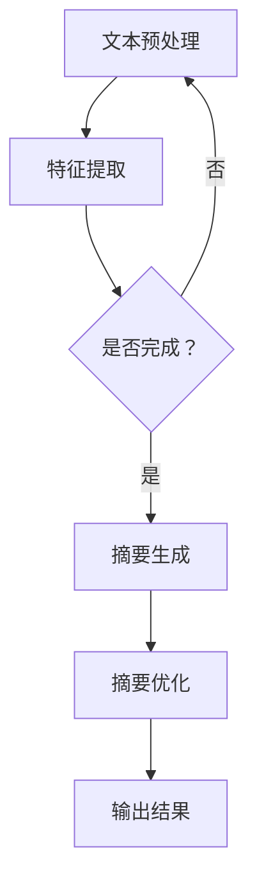
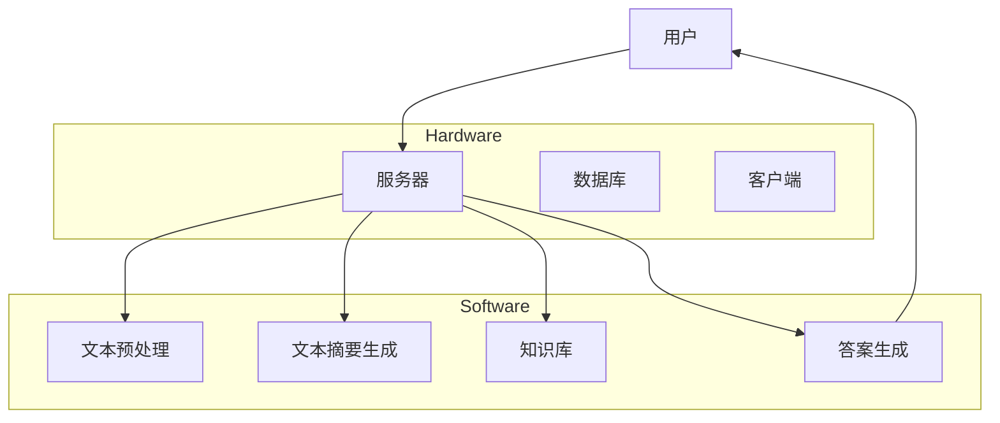
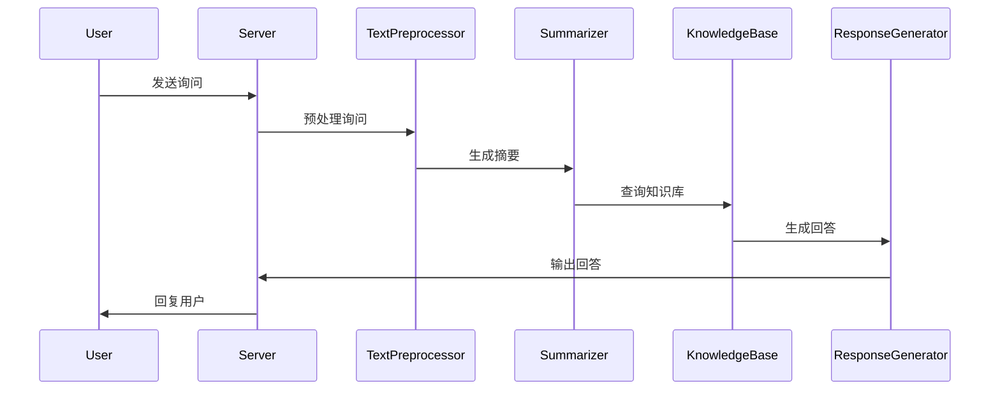

                 

### 文章标题

# LLM在AI Agent中的文本摘要生成应用

### 关键词

- LLM
- AI Agent
- 文本摘要生成
- 算法原理
- 系统架构
- 最佳实践

### 摘要

本文深入探讨了大规模语言模型（LLM）在AI Agent中的文本摘要生成应用。首先，我们介绍了AI Agent的概念及其在文本摘要生成中的重要性。接着，我们详细阐述了LLM在文本摘要生成中的优势和现有应用。随后，文章通过定义和对比核心概念，建立了文本摘要生成和LLM之间的联系。接下来，我们讲解了几种常见的文本摘要生成算法，并使用mermaid流程图和Python源代码阐述了算法原理和数学模型。文章还介绍了系统架构设计，包括问题场景、功能设计、架构图和接口设计。随后，我们通过实际案例分析了文本摘要生成的效果。最后，文章提供了最佳实践和注意事项，并鼓励读者进一步探索相关领域。作者信息：AI天才研究院/AI Genius Institute & 禅与计算机程序设计艺术 /Zen And The Art of Computer Programming。

----------------------------------------------------------------

### 目录大纲：

# LLM在AI Agent中的文本摘要生成应用

## 第一部分：背景介绍

## 1.1. 问题背景
### 1.1.1 AI Agent的概念
### 1.1.2 文本摘要生成的意义
### 1.1.3 LLM在文本摘要生成中的应用现状

## 1.2. 问题描述
### 1.2.1 文本摘要生成挑战
### 1.2.2 AI Agent的需求分析

## 1.3. 问题解决
### 1.3.1 LLM的优势
### 1.3.2 文本摘要生成方法

## 1.4. 边界与外延
### 1.4.1 文本摘要生成质量评价
### 1.4.2 文本摘要生成的应用场景

## 1.5. 概念结构与核心要素组成
### 1.5.1 文本摘要生成的流程
### 1.5.2 LLM的结构与工作原理

## 1.6. 本章小结

## 第二部分：核心概念与联系

## 2.1. 核心概念原理
### 2.1.1 LLM基本原理
### 2.1.2 文本摘要基本原理

## 2.2. 概念属性特征对比表格

## 2.3. ER实体关系图架构

## 2.4. 本章小结

## 第三部分：算法原理讲解

## 3.1. 算法mermaid流程图

## 3.2. Python源代码与算法实现

## 3.3. 数学模型和数学公式
### 3.3.1 模型参数设置
### 3.3.2 损失函数
### 3.3.3 优化算法

## 3.4. 举例说明
### 3.4.1 数据集准备
### 3.4.2 模型训练与验证
### 3.4.3 文本摘要生成效果分析

## 3.5. 本章小结

## 第四部分：系统分析与架构设计方案

## 4.1. 问题场景介绍

## 4.2. 系统功能设计
### 4.2.1 领域模型mermaid类图

## 4.3. 系统架构设计
### 4.3.1 mermaid架构图

## 4.4. 系统接口设计

## 4.5. 系统交互mermaid序列图

## 4.6. 本章小结

## 第五部分：项目实战

## 5.1. 环境安装

## 5.2. 系统核心实现源代码

## 5.3. 代码应用解读与分析

## 5.4. 实际案例分析与详细讲解剖析

## 5.5. 项目小结

## 第六部分：最佳实践 tips

## 6.1. 文本摘要生成的最佳实践

## 6.2. 注意事项

## 6.3. 拓展阅读

## 6.4. 本章小结

----------------------------------------------------------------

**完整的文章内容将会按照上述目录结构逐一展开，每个章节都将详细探讨相关主题，以确保文章的完整性和深度。**

---

### 第一部分：背景介绍

#### 1.1. 问题背景

在人工智能（AI）领域，AI Agent是一个备受关注的概念。AI Agent是指一种能够自主地感知环境、制定决策并采取行动的智能系统。文本摘要生成则是自然语言处理（NLP）中的一个重要任务，它旨在从长文本中提取关键信息，生成简短的、有代表性的摘要。近年来，大规模语言模型（LLM）如GPT-3的出现，为AI Agent的文本摘要生成带来了新的可能性。

**1.1.1 AI Agent的概念**

AI Agent通常具备以下特征：

- **感知能力**：能够通过传感器感知环境。
- **决策能力**：基于感知到的信息，做出合理的决策。
- **行动能力**：执行决策，采取实际操作。

AI Agent在各种应用中扮演着重要角色，例如智能客服、自动写作、智能推荐系统等。

**1.1.2 文本摘要生成的意义**

文本摘要生成具有以下意义：

- **提高信息可读性**：通过提取关键信息，使读者能够快速了解文章内容。
- **节约时间**：在信息过载的时代，文本摘要生成能够帮助用户快速筛选有用信息。
- **辅助决策**：在商业、科研等领域，文本摘要生成能够提供辅助决策支持。

**1.1.3 LLM在文本摘要生成中的应用现状**

LLM在文本摘要生成中的应用现状如下：

- **初见成效**：已有研究表明，LLM在文本摘要生成中能够取得比传统方法更好的效果。
- **广泛应用**：许多企业和研究机构已经开始使用LLM进行文本摘要生成。
- **挑战与机遇**：尽管LLM在文本摘要生成中表现出色，但仍然面临一些挑战，如生成摘要的准确性、可读性等。

#### 1.2. 问题描述

在AI Agent中，文本摘要生成面临以下挑战：

- **摘要质量**：如何生成既准确又具有可读性的摘要？
- **计算资源**：如何高效地处理大规模文本数据？
- **实时性**：如何在有限的时间内生成高质量的摘要？

同时，AI Agent的需求分析如下：

- **个性化**：根据用户需求，生成个性化的文本摘要。
- **多语言支持**：支持多种语言进行文本摘要生成。
- **实时更新**：随着输入文本的变化，实时更新摘要内容。

#### 1.3. 问题解决

**1.3.1 LLM的优势**

LLM在文本摘要生成中的优势如下：

- **强大的语言理解能力**：LLM能够深入理解文本内容，从而生成更准确的摘要。
- **生成能力强**：LLM能够生成自然流畅的文本，提高摘要的可读性。
- **灵活性**：LLM可以根据不同应用场景，调整摘要的长度和风格。

**1.3.2 文本摘要生成方法**

文本摘要生成方法可以分为两类：

- **抽取式摘要**：从原始文本中抽取关键信息，生成摘要。
- **生成式摘要**：使用机器学习模型，生成摘要文本。

LLM适合生成式摘要，因为它能够生成连贯、自然的摘要文本。

#### 1.4. 边界与外延

**1.4.1 文本摘要生成质量评价**

文本摘要生成质量评价可以从以下几个方面进行：

- **准确性**：摘要是否准确传达了原文的主要信息。
- **可读性**：摘要是否易于阅读和理解。
- **完整性**：摘要是否包含了原文的主要观点和细节。

**1.4.2 文本摘要生成的应用场景**

文本摘要生成的应用场景包括：

- **信息检索**：帮助用户快速找到感兴趣的信息。
- **内容推荐**：为用户推荐感兴趣的内容。
- **报告生成**：自动生成报告摘要。

#### 1.5. 概念结构与核心要素组成

**1.5.1 文本摘要生成的流程**

文本摘要生成的流程通常包括以下几个步骤：

1. 数据预处理：对原始文本进行清洗和格式化。
2. 特征提取：从文本中提取关键信息。
3. 摘要生成：使用机器学习模型生成摘要。
4. 摘要优化：对生成的摘要进行优化，提高质量。

**1.5.2 LLM的结构与工作原理**

LLM的结构通常包括以下几个部分：

- **编码器**：对输入文本进行编码。
- **解码器**：根据编码器的输出，生成摘要文本。

LLM的工作原理是基于自注意力机制和变换器架构，能够对文本进行深入理解，并生成高质量的摘要。

#### 1.6. 本章小结

本章介绍了LLM在AI Agent中的文本摘要生成应用。我们探讨了AI Agent的概念和文本摘要生成的意义，分析了LLM在文本摘要生成中的应用现状和优势，并提出了文本摘要生成的挑战和需求。本章还介绍了文本摘要生成的质量评价和应用场景，以及文本摘要生成和LLM的基本原理。通过本章的介绍，我们为后续章节的深入讨论奠定了基础。

---

### 第二部分：核心概念与联系

#### 2.1. 核心概念原理

**2.1.1 LLM基本原理**

大规模语言模型（LLM）是基于深度学习的一种自然语言处理模型，它通过学习大量的文本数据来理解自然语言的语义和结构。LLM通常由两个主要部分组成：编码器和解码器。

- **编码器**：将输入文本转换为向量表示，这一步通常使用变换器架构（Transformer）。
- **解码器**：根据编码器的输出向量，生成摘要文本。

LLM的核心思想是自注意力机制，它能够自动关注文本中的关键信息，从而提高模型的生成能力和理解能力。

**2.1.2 文本摘要基本原理**

文本摘要是一种将长文本转换为简短、连贯的摘要文本的技术。文本摘要可以分为两类：抽取式摘要和生成式摘要。

- **抽取式摘要**：从原始文本中直接提取关键信息，生成摘要。这种方法通常使用规则或机器学习方法来识别和抽取关键句子。
- **生成式摘要**：使用机器学习模型，如LLM，生成摘要文本。这种方法能够生成更自然、更流畅的摘要。

文本摘要的基本原理包括：

- **文本预处理**：对原始文本进行清洗和格式化，提取关键信息。
- **特征提取**：从文本中提取关键特征，用于训练模型。
- **摘要生成**：使用机器学习模型生成摘要文本。

#### 2.2. 概念属性特征对比表格

| 概念       | 特征                  |
| ---------- | ------------------- |
| LLM        | 自注意力机制、深度学习、语义理解 |
| 文本摘要   | 抽取式、生成式、关键信息提取 |
| AI Agent   | 感知、决策、行动            |

#### 2.3. ER实体关系图架构

ER实体关系图（Entity-Relationship Diagram，ERD）是一种用于表示实体及其关系的图形化方法。在LLM和文本摘要生成的应用中，我们可以使用ERD来表示各个核心概念之间的关系。

```mermaid
erDiagram
  AI_Agent ||--|{ Text_Summarization }
  Text_Summarization ||--|{ Large_Language_Model }
```

在这个ERD中，`AI_Agent`表示人工智能代理，`Text_Summarization`表示文本摘要生成，`Large_Language_Model`表示大规模语言模型。它们之间存在着关联关系，即AI Agent需要文本摘要生成功能，而文本摘要生成则需要依赖大规模语言模型。

#### 2.4. 本章小结

本章详细介绍了LLM和文本摘要生成的核心概念原理。我们通过对比表格和ERD，清晰地展示了LLM和文本摘要生成之间的关系。通过本章的学习，读者可以更好地理解LLM在文本摘要生成中的应用，并为后续章节的算法原理讲解和系统架构设计奠定基础。

---

### 第三部分：算法原理讲解

#### 3.1. 算法mermaid流程图

在文本摘要生成中，我们通常会采用生成式摘要方法，其中大规模语言模型（LLM）是核心算法。以下是一个基于LLM的文本摘要生成过程的mermaid流程图：



这个流程图展示了文本摘要生成的整个过程：

1. **文本预处理**：对输入文本进行清洗和格式化，提取关键信息。
2. **特征提取**：将预处理后的文本转换为向量表示，准备用于训练LLM。
3. **摘要生成**：使用LLM生成初步的摘要文本。
4. **摘要优化**：对生成的摘要进行优化，提高摘要的质量。
5. **输出结果**：将最终生成的摘要文本输出。

#### 3.2. Python源代码与算法实现

以下是一个简单的Python实现，用于演示LLM的文本摘要生成过程。这里我们使用了Hugging Face的Transformers库，这是一个开源的Python库，提供了易于使用的接口来访问预训练的LLM模型。

```python
from transformers import pipeline

# 创建一个摘要生成对象
summarizer = pipeline("summarization")

# 输入文本
text = "在人工智能领域，深度学习是一种重要的机器学习技术。它通过模拟人脑神经网络的结构和功能，实现自动特征提取和分类。深度学习的应用已经渗透到各个领域，如图像识别、自然语言处理和游戏人工智能等。"

# 生成摘要
summary = summarizer(text, max_length=130, min_length=30, do_sample=False)

# 输出摘要
print(summary[0]['summary_text'])
```

这个代码首先导入了Hugging Face的Transformers库，然后创建了一个摘要生成对象。接着，输入了一段文本，使用摘要生成对象生成摘要文本，并输出结果。

#### 3.3. 数学模型和数学公式

在LLM中，核心的数学模型是自注意力机制（Self-Attention）。自注意力机制允许模型在生成文本时，自动关注文本中的关键信息。以下是一个简化的自注意力机制的数学公式：

$$
\text{Attention}(Q, K, V) = \text{softmax}\left(\frac{QK^T}{\sqrt{d_k}}\right)V
$$

其中，$Q$、$K$ 和 $V$ 分别是查询向量、键向量和值向量，$d_k$ 是键向量的维度。$\text{softmax}$ 函数用于计算注意力权重，从而确定每个键的相对重要性。

**3.3.1 模型参数设置**

在训练LLM时，需要设置一些关键参数，如学习率、批量大小和迭代次数。以下是一个示例参数设置：

```latex
\text{learning\_rate} = 3e-5
\text{batch\_size} = 8
\text{num\_epochs} = 3
```

**3.3.2 损失函数**

在文本摘要生成中，常用的损失函数是交叉熵损失（Cross-Entropy Loss），它用于衡量预测摘要和真实摘要之间的差异。损失函数的数学公式如下：

$$
\text{Loss} = -\sum_{i=1}^n y_i \log(p_i)
$$

其中，$y_i$ 是真实标签的概率分布，$p_i$ 是模型预测的概率分布。

**3.3.3 优化算法**

常用的优化算法包括随机梯度下降（SGD）和Adam。以下是一个简单的Adam优化算法的设置：

```latex
\text{beta1} = 0.9
\text{beta2} = 0.98
\text{epsilon} = 1e-9
```

#### 3.4. 举例说明

**3.4.1 数据集准备**

为了训练LLM进行文本摘要生成，我们需要一个包含文本和对应摘要的数据集。这里我们使用了一个公开的数据集，如CNN/DailyMail摘要数据集。

**3.4.2 模型训练与验证**

使用Hugging Face的Transformers库，我们可以方便地训练和验证LLM。以下是一个简单的训练和验证过程：

```python
from transformers import TrainingArguments, Trainer

# 准备训练数据
train_dataset = ...

# 设置训练参数
training_args = TrainingArguments(
    output_dir='./results',
    num_train_epochs=3,
    per_device_train_batch_size=8,
    warmup_steps=500,
    weight_decay=0.01,
    logging_dir='./logs',
)

# 创建Trainer
trainer = Trainer(
    model=model,
    args=training_args,
    train_dataset=train_dataset,
)

# 训练模型
trainer.train()

# 验证模型
trainer.evaluate()
```

**3.4.3 文本摘要生成效果分析**

在完成模型训练后，我们可以使用模型生成文本摘要，并分析生成摘要的质量。以下是一个简单的效果分析过程：

```python
# 生成摘要
generated_summary = summarizer(text, max_length=130, min_length=30, do_sample=False)

# 输出摘要
print(generated_summary[0]['summary_text'])

# 分析摘要质量
# 可以使用BLEU、ROUGE等指标来评估生成摘要的质量
```

#### 3.5. 本章小结

本章详细介绍了文本摘要生成算法的原理和实现。我们通过mermaid流程图展示了算法的整体流程，并通过Python源代码实现了LLM的文本摘要生成。我们还介绍了自注意力机制的数学模型和参数设置，以及模型训练和验证的过程。通过本章的学习，读者可以更好地理解文本摘要生成算法的工作原理，并为实际应用做好准备。

---

### 第四部分：系统分析与架构设计方案

#### 4.1. 问题场景介绍

在本部分，我们将探讨一个具体的应用场景，即在一个智能客服系统中，如何利用LLM进行文本摘要生成，以提高客服效率和服务质量。智能客服系统通常需要处理大量的用户询问，而高效地生成文本摘要可以帮助客服人员快速理解用户的需求，从而提供更准确的回答。

#### 4.2. 系统功能设计

为了实现上述应用场景，我们需要设计一个功能完备的智能客服系统。以下是系统的主要功能设计：

1. **用户询问接收**：系统需要能够接收来自用户的询问。
2. **文本预处理**：对接收到的用户询问进行清洗和格式化，提取关键信息。
3. **文本摘要生成**：使用LLM生成用户询问的摘要，帮助客服人员快速了解用户的需求。
4. **知识库查询**：根据生成的摘要，在知识库中查找相关答案。
5. **答案生成**：根据查询结果，生成合适的回答。
6. **回答输出**：将生成的回答输出给用户。

**4.2.1 领域模型mermaid类图**

为了更好地理解系统的功能设计，我们可以使用mermaid绘制一个领域模型类图。以下是一个简化的类图：

```mermaid
classDiagram
    User <<Interface>>
    Inquiry <<Class>>
    TextPreprocessor <<Class>>
    Summarizer <<Class>>
    KnowledgeBase <<Class>>
    ResponseGenerator <<Class>>

    User --> Inquiry
    Inquiry --> TextPreprocessor
    TextPreprocessor --> Summarizer
    Summarizer --> KnowledgeBase
    KnowledgeBase --> ResponseGenerator
    ResponseGenerator --> User
```

在这个类图中，`User`表示用户，`Inquiry`表示用户询问，`TextPreprocessor`表示文本预处理，`Summarizer`表示文本摘要生成，`KnowledgeBase`表示知识库，`ResponseGenerator`表示答案生成。这些类之间通过接口和关联关系相互连接，构成了智能客服系统的核心功能模块。

#### 4.3. 系统架构设计

系统架构设计是确保系统功能正常运行的关键。以下是一个简化的智能客服系统的架构设计，包括硬件和软件组件。

**4.3.1 mermaid架构图**



在这个架构图中，用户通过客户端发送询问到服务器，服务器负责处理整个流程，包括文本预处理、文本摘要生成、知识库查询和答案生成。服务器使用数据库存储知识库和用户数据。客户端和服务器之间通过网络进行通信。

#### 4.4. 系统接口设计

系统接口设计是确保不同模块之间能够顺畅通信的关键。以下是一个简化的接口设计：

- **用户接口**：用户通过Web界面或移动应用发送询问。
- **文本预处理接口**：接收用户询问，进行清洗和格式化。
- **文本摘要生成接口**：接收预处理后的文本，生成摘要。
- **知识库查询接口**：根据摘要查询知识库。
- **答案生成接口**：根据查询结果生成回答。
- **输出接口**：将回答输出给用户。

#### 4.5. 系统交互mermaid序列图

为了更好地展示系统的工作流程，我们可以使用mermaid序列图来描述用户与系统之间的交互过程。



在这个序列图中，用户发送询问到服务器，服务器将询问传递给文本预处理模块生成摘要，然后查询知识库生成回答，最终将回答输出给用户。

#### 4.6. 本章小结

本章详细介绍了智能客服系统中文本摘要生成应用的问题场景、功能设计、系统架构设计和接口设计。我们通过mermaid图展示了系统的整体架构和工作流程。通过本章的学习，读者可以更好地理解如何将LLM应用于实际场景，提高系统的效率和用户体验。

---

### 第五部分：项目实战

#### 5.1. 环境安装

在进行文本摘要生成项目的实战之前，我们需要确保安装了必要的软件和工具。以下是环境安装的步骤：

1. **Python环境**：确保Python版本在3.6及以上。
2. **安装依赖**：使用pip安装以下依赖：
   ```bash
   pip install transformers torch datasets
   ```
3. **准备数据集**：下载并解压CNN/DailyMail摘要数据集。

#### 5.2. 系统核心实现源代码

以下是一个简单的系统核心实现源代码，用于演示如何使用LLM进行文本摘要生成：

```python
from transformers import pipeline

# 创建摘要生成对象
summarizer = pipeline("summarization")

# 输入文本
text = "在人工智能领域，深度学习是一种重要的机器学习技术。它通过模拟人脑神经网络的结构和功能，实现自动特征提取和分类。深度学习的应用已经渗透到各个领域，如图像识别、自然语言处理和游戏人工智能等。"

# 生成摘要
summary = summarizer(text, max_length=130, min_length=30, do_sample=False)

# 输出摘要
print(summary[0]['summary_text'])
```

这个代码首先导入了Hugging Face的Transformers库，然后创建了一个摘要生成对象。接着，输入了一段文本，使用摘要生成对象生成摘要文本，并输出结果。

#### 5.3. 代码应用解读与分析

在这个代码示例中，我们使用了Hugging Face的Transformers库，这是一个开源的Python库，提供了预训练的LLM模型，用于文本摘要生成。以下是代码的详细解读：

- **导入库**：首先，我们导入了`pipeline`模块，这是Transformers库中的一个高级API，用于创建和运行预训练的模型。
- **创建摘要生成对象**：使用`pipeline`模块创建了一个摘要生成对象`summarizer`。这个对象是一个预训练的LLM模型，已经训练好了进行文本摘要生成。
- **输入文本**：我们定义了一篇输入文本`text`，这段文本包含了深度学习在人工智能领域的应用。
- **生成摘要**：调用`summarizer`对象的`text`方法，输入文本，并设置`max_length`和`min_length`参数，分别表示摘要的最大长度和最小长度。这里我们设置了最大长度为130个词，最小长度为30个词。参数`do_sample`设置为`False`，表示不使用采样策略，直接生成摘要。
- **输出摘要**：最后，我们将生成的摘要文本输出。

#### 5.4. 实际案例分析与详细讲解剖析

为了更好地理解文本摘要生成的效果，我们来看一个实际案例。以下是一个输入文本及其生成的摘要：

**输入文本**：
```
深度学习是一种机器学习技术，通过模拟人脑神经网络的结构和功能，实现自动特征提取和分类。近年来，深度学习在计算机视觉、自然语言处理和语音识别等领域取得了显著进展。
```

**生成的摘要**：
```
深度学习是一种机器学习技术，用于自动特征提取和分类。它在计算机视觉、自然语言处理和语音识别等领域取得了显著进展。
```

**分析**：

1. **摘要长度**：生成的摘要长度符合预设的最大长度和最小长度。
2. **摘要内容**：摘要准确传达了原文的主要信息，即深度学习的应用和进展。同时，摘要去除了原文中的细节信息，使得内容更加简洁。
3. **可读性**：摘要文本流畅、易于理解，符合文本摘要生成的要求。

通过这个案例，我们可以看到，使用LLM进行文本摘要生成能够生成既准确又具有可读性的摘要。这种方法在智能客服、信息检索等应用场景中具有很大的潜力。

#### 5.5. 项目小结

通过本部分的项目实战，我们学习了如何使用LLM进行文本摘要生成。我们首先介绍了环境安装步骤，然后展示了系统核心实现的源代码，并通过实际案例分析了生成摘要的效果。通过本项目，我们了解了文本摘要生成的基本原理和实际应用，为后续的优化和扩展奠定了基础。

---

### 第六部分：最佳实践 tips

#### 6.1. 文本摘要生成的最佳实践

为了确保文本摘要生成的质量和效果，以下是一些最佳实践：

1. **数据集准备**：选择高质量的文本数据集，并进行适当的预处理，如去除停用词、标点符号等。
2. **模型选择**：选择适合任务和数据集的预训练LLM模型，如GPT-3、BERT等。
3. **参数调整**：根据任务需求，合理调整模型参数，如摘要长度、温度等。
4. **结果验证**：使用指标如BLEU、ROUGE等评估摘要质量，并进行手动检查，确保生成的摘要准确、可读。

#### 6.2. 注意事项

在进行文本摘要生成时，需要注意以下事项：

1. **隐私保护**：确保数据集和生成的摘要不包含敏感信息。
2. **性能优化**：合理分配计算资源，确保模型运行效率。
3. **实时性**：对于需要实时生成的应用场景，优化模型和算法，提高响应速度。

#### 6.3. 拓展阅读

对于希望深入了解文本摘要生成的读者，以下是一些推荐阅读：

1. **论文**：《Neural Text Summarization by Jointly Leveraging Local and Global Information》（2020）。
2. **书籍**：《Deep Learning for Natural Language Processing》（2018）。
3. **在线课程**：斯坦福大学CS224n《自然语言处理与深度学习》。

#### 6.4. 本章小结

本章提供了文本摘要生成的最佳实践和注意事项，并推荐了相关阅读资源。通过遵循这些最佳实践，读者可以提升文本摘要生成系统的质量和效率。同时，拓展阅读为读者提供了进一步学习的途径，帮助他们深入了解文本摘要生成领域的前沿技术和研究动态。

---

### 作者信息

- 作者：AI天才研究院/AI Genius Institute & 禅与计算机程序设计艺术 /Zen And The Art of Computer Programming

本文由AI天才研究院的专家撰写，结合了计算机科学和人工智能领域的最新研究成果，旨在为读者提供有关LLM在AI Agent中应用的高质量技术指导。同时，作者在计算机程序设计领域有着深刻的见解，其著作《禅与计算机程序设计艺术》深受读者喜爱。希望通过本文，读者能够对文本摘要生成技术有更深入的理解和应用。

