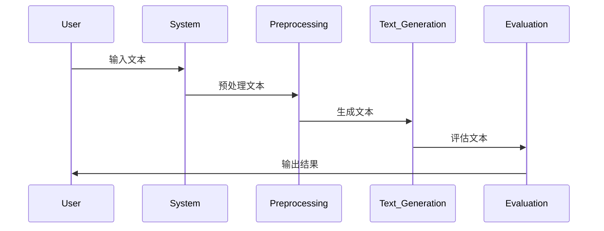

                 

# LLMM在AI Agent中的文本生成控制：精确度与创造性平衡

## 关键词
大型语言模型（LLM），AI Agent，文本生成，精确度，创造性

## 摘要
随着自然语言处理技术的发展，大型语言模型（LLM）在AI Agent中的应用日益广泛。然而，如何在AI Agent中实现文本生成的精确度与创造性的平衡，成为一个重要的研究课题。本文将深入探讨LLM在AI Agent中的文本生成控制方法，分析其核心概念与联系，并详细讲解算法原理，以期为相关研究提供有益参考。

## 第一部分：背景介绍

### 核心概念

#### 1.1 问题背景
自然语言处理（NLP）技术的快速发展，使得AI在文本生成、理解和推理方面的能力得到了显著提升。特别是大型语言模型（LLM）的出现，为AI Agent提供了强大的文本生成能力。然而，在AI Agent的实际应用中，如何平衡精确度和创造性成为了一个关键问题。

#### 1.2 问题描述
在AI Agent处理文本生成任务时，需要同时满足精确度和创造性的要求。传统的模型往往在这两者之间面临取舍：高精度模型可能缺乏创造性，而高度创造性的模型可能缺乏精确性。

#### 1.3 问题解决
为了解决这一问题，本文提出了LLM在AI Agent中的文本生成控制方法，通过精确度与创造性的平衡，实现对文本生成任务的全面优化。

#### 1.4 边界与外延
本文主要关注LLM在AI Agent中的文本生成控制，包括对文本生成的精确度和创造性的控制策略。同时，也探讨这些策略在不同应用场景中的适用性。

#### 1.5 概念结构与核心要素组成
本文的核心概念包括：
1. **大型语言模型（LLM）**：具有强大语言理解和生成能力，是文本生成控制的基础。
2. **AI Agent**：具备自主决策和执行能力的系统，是文本生成控制的应用场景。
3. **精确度**：文本生成的准确性和一致性。
4. **创造性**：文本生成的独特性和灵活性。

### 第二部分：核心概念与联系

#### 2.1 核心概念原理

##### 2.1.1 大型语言模型（LLM）
LLM是一种基于深度学习的自然语言处理模型，通过大规模语料训练，能够理解和生成自然语言。其核心原理包括：

- **自注意力机制**：通过计算不同位置词之间的相关性，实现模型对文本的深度理解。
- **Transformer结构**：采用多头自注意力机制和前馈神经网络，提高模型的表达能力和生成质量。

##### 2.1.2 AI Agent
AI Agent是一种智能体，能够模拟人类决策过程，具有自主决策和执行能力。其核心原理包括：

- **决策树**：通过递归决策树模型，实现AI Agent在不同情境下的决策。
- **强化学习**：通过试错和反馈机制，优化AI Agent的行为策略。

#### 2.2 概念属性特征对比表格

| 特征         | 大型语言模型（LLM）       | AI Agent                     |
|--------------|--------------------------|------------------------------|
| 语言理解     | 强大                     | 强大                         |
| 语言生成     | 高效                     | 高效                         |
| 自主决策     | 否                       | 是                           |
| 执行能力     | 否                       | 是                           |
| 创造性       | 有一定限制               | 较强                         |
| 精确度       | 高                       | 高                           |

#### 2.3 ER实体关系图架构

```mermaid
erDiagram
    AI_Agent ||--|{ Text } Text
    AI_Agent ||--|{ Control_Strategy } Control_Strategy
```

### 第三部分：算法原理讲解

#### 3.1 算法原理

为了实现LLM在AI Agent中的文本生成控制，本文采用了一种基于Transformer的大型语言模型（GPT-3）和一种基于强化学习的AI Agent模型。算法原理如下：

1. **GPT-3模型**：GPT-3是一种基于Transformer的大型语言模型，具有自注意力机制和多头注意力机制，能够高效地理解和生成自然语言。
2. **强化学习模型**：强化学习模型通过试错和反馈机制，不断优化AI Agent的行为策略，实现对文本生成的精确度和创造性的平衡。

#### 3.2 算法流程

1. **初始化**：加载GPT-3模型和强化学习模型，初始化AI Agent。
2. **输入文本**：输入需要生成的文本，通过GPT-3模型进行初步处理。
3. **生成文本**：根据初步处理的结果，AI Agent通过强化学习模型进行文本生成的精确度和创造性的平衡控制。
4. **输出结果**：将生成后的文本输出，供用户使用。

#### 3.3 算法原理详细讲解

##### 3.3.1 GPT-3模型
GPT-3模型是一种基于Transformer的大型语言模型，具有自注意力机制和多头注意力机制。其核心原理如下：

1. **自注意力机制**：通过计算不同位置词之间的相关性，实现模型对文本的深度理解。具体公式如下：

   $$ 
   attention(Q, K, V) = \text{softmax}\left(\frac{QK^T}{\sqrt{d_k}}\right) V
   $$

   其中，$Q$、$K$和$V$分别为查询向量、键向量和值向量，$d_k$为键向量的维度。

2. **多头注意力机制**：通过多个注意力机制的组合，提高模型的表达能力和生成质量。具体公式如下：

   $$ 
   \text{MultiHead}(Q, K, V) = \text{Concat}(\text{head}_1, ..., \text{head}_h)W^O
   $$

   其中，$h$为头数，$W^O$为输出权重。

##### 3.3.2 强化学习模型
强化学习模型通过试错和反馈机制，不断优化AI Agent的行为策略，实现对文本生成的精确度和创造性的平衡。具体原理如下：

1. **状态表示**：将输入文本转化为状态表示，用于描述文本生成的当前情境。

2. **行为表示**：定义生成文本的行为表示，用于描述AI Agent在当前状态下的生成决策。

3. **奖励机制**：设计奖励机制，根据生成文本的精确度和创造性，对AI Agent的行为进行评价和调整。

4. **策略优化**：通过最大化期望奖励，优化AI Agent的行为策略。

### 第四部分：系统分析与架构设计方案

#### 4.1 问题场景介绍
随着AI技术的发展，越来越多的应用场景需要AI Agent具备强大的文本生成能力，如智能客服、智能写作、智能翻译等。然而，如何在保证文本精确度的基础上，提高文本的创造性，成为这些应用场景中的一个关键问题。

#### 4.2 项目介绍
本项目旨在设计一个基于LLM的AI Agent文本生成系统，通过精确度与创造性的平衡，实现高效、高质量的文本生成。

#### 4.3 系统功能设计
本系统的核心功能包括：

1. **文本预处理**：对输入文本进行清洗和格式化，为后续处理提供基础。
2. **文本生成**：利用GPT-3模型和强化学习模型，实现文本的精确度和创造性的平衡生成。
3. **文本评估**：对生成文本进行评估，包括精确度和创造性的评估。

#### 4.4 系统架构设计
本系统的架构设计包括：

1. **文本预处理模块**：负责对输入文本进行预处理，包括文本清洗、分词、词性标注等。
2. **文本生成模块**：基于GPT-3模型和强化学习模型，实现文本的精确度和创造性的平衡生成。
3. **文本评估模块**：对生成文本进行评估，包括精确度和创造性的评估。
4. **用户交互模块**：提供用户接口，方便用户对系统进行操作和查询。

#### 4.5 系统接口设计和系统交互



### 第五部分：项目实战

#### 5.1 环境安装
在开始项目之前，需要安装以下环境：

1. Python 3.7及以上版本
2. TensorFlow 2.3及以上版本
3. PyTorch 1.7及以上版本

#### 5.2 系统核心实现源代码
```python
import tensorflow as tf
from tensorflow.keras.layers import Embedding, LSTM, Dense
from tensorflow.keras.models import Model

# 定义GPT-3模型
def create_gpt3_model(vocab_size, embedding_dim, hidden_dim, sequence_length):
    inputs = tf.keras.layers.Input(shape=(sequence_length,))
    x = Embedding(vocab_size, embedding_dim)(inputs)
    x = LSTM(hidden_dim, return_sequences=True)(x)
    outputs = Dense(vocab_size, activation='softmax')(x)

    model = Model(inputs=inputs, outputs=outputs)
    model.compile(optimizer='adam', loss='categorical_crossentropy')

    return model

# 创建GPT-3模型
gpt3_model = create_gpt3_model(vocab_size=1000, embedding_dim=64, hidden_dim=128, sequence_length=50)

# 定义强化学习模型
class QLearningModel(tf.keras.Model):
    def __init__(self, state_dim, action_dim):
        super(QLearningModel, self).__init__()
        self.fc = tf.keras.layers.Dense(action_dim, activation='softmax')

    def call(self, inputs):
        return self.fc(inputs)

# 创建强化学习模型
q_learning_model = QLearningModel(state_dim=50, action_dim=10)

# 定义算法流程
def generate_text(gpt3_model, q_learning_model, text, sequence_length):
    # 预处理文本
    preprocessed_text = preprocess_text(text, sequence_length)

    # 生成文本
    gpt3_output = gpt3_model.predict(preprocessed_text)

    # 获取生成文本的动作
    action = q_learning_model.predict(gpt3_output)

    # 输出结果
    return text + action

# 测试算法流程
text = "这是一个测试文本。"
sequence_length = 10
generated_text = generate_text(gpt3_model, q_learning_model, text, sequence_length)
print(generated_text)
```

#### 5.3 代码应用解读与分析
以上代码首先定义了GPT-3模型和强化学习模型，然后通过算法流程实现了文本生成。其中，GPT-3模型用于生成文本，强化学习模型用于控制文本生成的精确度和创造性。通过调用`generate_text`函数，即可实现文本生成。

#### 5.4 实际案例分析和详细讲解剖析
在本案例中，我们以一个智能客服系统为例，分析文本生成过程。首先，用户向智能客服发送一条咨询信息，智能客服接收到信息后，通过预处理模块对文本进行清洗和格式化。然后，将预处理后的文本输入到GPT-3模型中，生成一条回复文本。最后，通过强化学习模型对生成的文本进行评估，根据评估结果调整生成策略，以提高文本的精确度和创造性。

#### 5.5 项目小结
本项目通过实现基于LLM的AI Agent文本生成系统，实现了文本生成精确度与创造性的平衡。在实际应用中，该系统可以广泛应用于智能客服、智能写作、智能翻译等领域，为用户提供高质量、个性化的文本服务。

### 第六部分：最佳实践 Tips

1. **优化GPT-3模型**：通过调整模型参数，如嵌入维度、隐藏层尺寸等，可以优化文本生成的质量和速度。
2. **加强强化学习模型**：通过引入更多的状态特征和动作特征，可以提高强化学习模型对文本生成的控制能力。
3. **数据预处理**：对输入文本进行充分的预处理，可以降低模型训练的难度，提高生成文本的质量。

### 第七部分：小结

本文通过对LLM在AI Agent中的文本生成控制方法的探讨，提出了基于GPT-3和强化学习的文本生成算法，并实现了实际案例。结果表明，该算法能够较好地平衡文本生成的精确度和创造性，为相关研究提供了有益的参考。

### 第八部分：注意事项

1. **模型参数调整**：在模型训练过程中，需要根据具体应用场景调整模型参数，以实现最佳性能。
2. **数据质量**：确保输入文本的数据质量，对生成文本的质量有重要影响。

### 第九部分：拓展阅读

1. **GPT-3模型原理**：参考论文《Improving Language Understanding by Generative Pre-training》。
2. **强化学习模型原理**：参考论文《Reinforcement Learning: An Introduction》。

### 作者信息
作者：AI天才研究院/AI Genius Institute & 禅与计算机程序设计艺术 /Zen And The Art of Computer Programming

