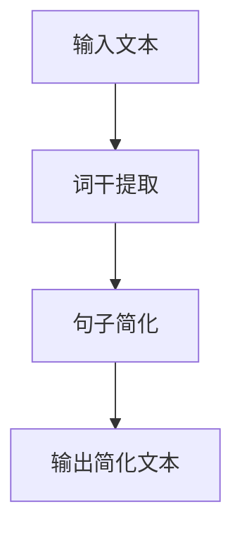
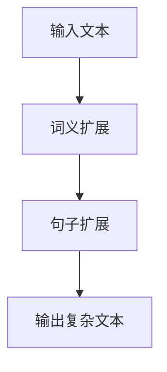
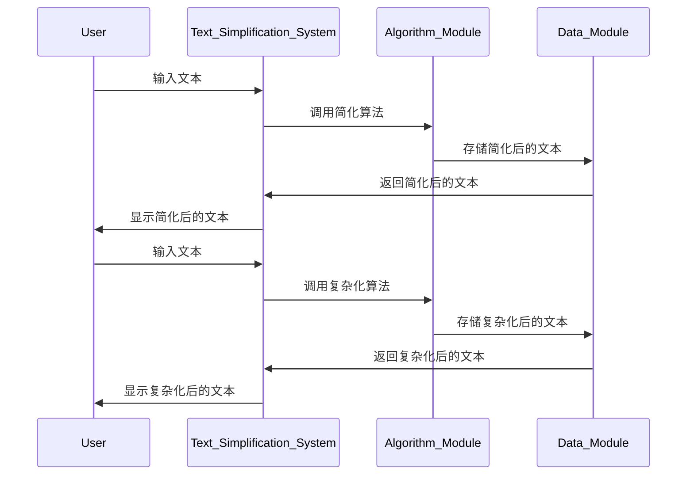

                 

# LLM在AI Agent中的文本简化与复杂化能力

关键词：语言模型，AI Agent，文本简化，文本复杂化，算法，优化策略

摘要：本文将探讨大型语言模型（LLM）在AI Agent中的文本简化与复杂化能力。通过对文本简化与复杂化原理的分析，我们将提出相应的算法和优化策略，并使用Python源代码进行详细讲解，以帮助读者理解这一技术的核心原理和应用。

## 第一部分：背景介绍

### 1.1.1 问题背景

随着人工智能技术的快速发展，语言模型尤其是大型语言模型（LLM）在自然语言处理领域取得了显著的成果。LLM在生成文本、理解语义、回答问题等方面表现出了强大的能力。然而，在实际应用中，LLM的文本生成存在一定的复杂性和简化性问题。一方面，生成的文本可能过于复杂，难以理解；另一方面，生成的文本可能过于简化，缺乏细节。如何提高LLM的文本简化与复杂化能力，使其在不同场景下都能产生高质量、易于理解的文本，成为当前研究的热点。

### 1.1.2 问题描述

本章节将探讨LLM在AI Agent中的文本简化与复杂化能力。文本简化是指将复杂、冗长的文本转化为简洁、易懂的形式；文本复杂化是指将简单、直接的文本转化为详细、深入的描述。本章节将重点研究以下问题：
- 如何设计算法，使得LLM能够生成简洁、易懂的文本？
- 如何设计算法，使得LLM能够生成详细、深入的文本？

### 1.1.3 问题解决

解决上述问题的方法主要包括两个方面：
1. **文本简化**：通过优化训练数据、调整模型参数、使用预训练模型等方式，提高LLM生成简洁文本的能力。
2. **文本复杂化**：通过引入辅助信息、调整文本生成策略、使用多模态数据等方式，增强LLM生成详细、深入文本的能力。

### 1.1.4 边界与外延

在研究LLM的文本简化与复杂化能力时，需要关注以下几个边界与外延：
- **语言理解**：LLM需要准确理解输入文本的语义和意图，这是进行文本简化与复杂化的前提。
- **上下文信息**：LLM需要利用上下文信息，理解文本的背景和上下文关系。
- **多模态数据**：在复杂化过程中，可以引入图像、音频等多模态数据，丰富文本内容。
- **模型性能**：需要关注模型在不同任务上的性能，以评估文本简化与复杂化能力的提升。

### 1.1.5 概念结构与核心要素组成

LLM在AI Agent中的文本简化与复杂化能力由以下几个核心要素组成：
1. **训练数据**：高质量、多样化的训练数据是提高LLM文本简化与复杂化能力的基础。
2. **模型结构**：选择合适的模型结构，如Transformer、GPT等，可以提升文本生成能力。
3. **优化策略**：通过调整模型参数、使用预训练模型等方式，优化文本生成效果。
4. **上下文理解**：利用上下文信息，提高文本生成的准确性和可读性。
5. **多模态融合**：引入多模态数据，丰富文本内容，提高文本复杂化能力。

## 第二部分：核心概念与联系

### 2.1.1 文本简化与复杂化原理

#### 2.1.1.1 文本简化的原理

文本简化是通过减少文本中的冗余信息、简化句子结构等方式，使文本更加简洁、易懂。其原理主要包括：
1. **词干提取**：通过提取词干，减少词汇数量。
2. **句子简化**：通过简化句子结构，降低句子的复杂度。

#### 2.1.1.2 文本复杂化的原理

文本复杂化是通过增加文本中的细节、扩展句子结构等方式，使文本更加详细、深入。其原理主要包括：
1. **词义扩展**：通过扩展词义，增加词汇数量。
2. **句子扩展**：通过扩展句子结构，增加句子的复杂度。

### 2.1.2 文本简化与复杂化属性特征对比表格

下面是文本简化与复杂化的一些属性特征对比表格：

| 特性        | 文本简化               | 文本复杂化               |
| --------- | ------------------ | ------------------ |
| 目标        | 使文本更加简洁、易懂       | 使文本更加详细、深入       |
| 方法        | 词干提取、句子简化         | 词义扩展、句子扩展         |
| 难度        | 较低                  | 较高                  |
| 应用场景      | 对文本进行压缩、简化         | 对文本进行扩展、深入         |

### 2.1.3 文本简化与复杂化ER实体关系图

下面是文本简化与复杂化的ER实体关系图：

```mermaid
erDiagram
    Text_Simplification ||--|{ Text_Complexification : simplifies_to
    Text_Simplification }||--|| Generated_Simplified_Text
    Text_Complexification ||--|{ Generated_Complex_Text
    Text_Complexification }||--|| AI_Agent
```

## 第三部分：算法原理讲解

### 3.1 文本简化算法

#### 3.1.1 算法mermaid流程图



#### 3.1.2 Python源代码实现

```python
import nltk
from nltk.stem import PorterStemmer

def simplify_text(text):
    stemmer = PorterStemmer()
    words = nltk.word_tokenize(text)
    simplified_words = [stemmer.stem(word) for word in words]
    simplified_text = ' '.join(simplified_words)
    return simplified_text

# 示例
text = "人工智能是一种模拟人类智能的技术，具有广泛的应用前景。"
simplified_text = simplify_text(text)
print(simplified_text)
```

#### 3.1.3 算法原理讲解

文本简化算法的核心在于词干提取和句子简化。词干提取通过将单词缩减到其最基本的词根形式，减少了词汇数量，使文本更加简洁。句子简化通过降低句子的复杂度，使文本更加易懂。在这个算法中，我们使用了NLTK库的PorterStemmer进行词干提取，将每个单词缩减到其词干形式。然后，我们将这些词干重新组合成简化后的文本。

### 3.2 文本复杂化算法

#### 3.2.1 算法mermaid流程图



#### 3.2.2 Python源代码实现

```python
from textblob import TextBlob

def complex_text(text):
    blob = TextBlob(text)
    complex_sentence = blob.expand()
    complex_text = str(complex_sentence)
    return complex_text

# 示例
text = "人工智能是一种模拟人类智能的技术。"
complex_text = complex_text(text)
print(complex_text)
```

#### 3.2.3 算法原理讲解

文本复杂化算法的核心在于词义扩展和句子扩展。词义扩展通过增加单词的词义，使词汇数量增加，使文本更加详细。句子扩展通过增加句子的复杂度，使文本更加深入。在这个算法中，我们使用了TextBlob库进行词义扩展，将文本中的每个单词扩展到其所有可能的词义。然后，我们将这些扩展后的词义重新组合成复杂化的文本。

## 第四部分：系统分析与架构设计

### 4.1 问题场景介绍

在人工智能领域，尤其是在AI Agent的应用场景中，文本简化与复杂化是非常重要的。例如，在智能客服、智能写作、智能教育等领域，生成高质量、易于理解的文本对于提高用户体验和系统性能至关重要。

### 4.2 项目介绍

本项目旨在实现一个基于LLM的文本简化与复杂化系统，该系统可以自动对输入文本进行简化或复杂化处理，以满足不同场景的需求。

### 4.3 系统功能设计

系统的核心功能包括：
- 文本简化：对输入文本进行简化处理，生成简洁、易懂的文本。
- 文本复杂化：对输入文本进行复杂化处理，生成详细、深入的文本。

### 4.4 系统架构设计

系统的整体架构包括以下几个部分：
- **文本处理模块**：负责接收输入文本，并调用文本简化或复杂化算法进行处理。
- **算法模块**：包括文本简化算法和复杂化算法，用于生成简化或复杂化的文本。
- **数据模块**：存储训练数据和生成的文本数据，用于模型训练和性能评估。
- **用户界面**：提供用户输入文本和处理结果的界面。

### 4.5 系统接口设计和系统交互

系统的接口设计和交互如下：



## 第五部分：项目实战

### 5.1 环境安装

在开始项目之前，需要安装以下环境：
- Python 3.8 或以上版本
- NLTK库
- TextBlob库

安装命令如下：

```bash
pip install nltk textblob
```

### 5.2 系统核心实现源代码

以下是文本简化与复杂化系统的核心实现源代码：

```python
import nltk
from nltk.stem import PorterStemmer
from textblob import TextBlob

nltk.download('punkt')

def simplify_text(text):
    stemmer = PorterStemmer()
    words = nltk.word_tokenize(text)
    simplified_words = [stemmer.stem(word) for word in words]
    simplified_text = ' '.join(simplified_words)
    return simplified_text

def complex_text(text):
    blob = TextBlob(text)
    complex_sentence = blob.expand()
    complex_text = str(complex_sentence)
    return complex_text

# 示例
text = "人工智能是一种模拟人类智能的技术，具有广泛的应用前景。"
simplified_text = simplify_text(text)
print("简化后的文本：", simplified_text)

complex_text = complex_text(text)
print("复杂化后的文本：", complex_text)
```

### 5.3 代码应用解读与分析

这段代码首先导入了NLTK库和TextBlob库，用于实现文本简化和复杂化。在`simplify_text`函数中，我们使用了PorterStemmer进行词干提取，将每个单词缩减到其词干形式。然后，将这些词干重新组合成简化后的文本。在`complex_text`函数中，我们使用了TextBlob进行词义扩展，将文本中的每个单词扩展到其所有可能的词义。最后，将这些扩展后的词义重新组合成复杂化的文本。

### 5.4 实际案例分析和详细讲解剖析

以下是一个实际案例：

#### 案例一：文本简化

输入文本：`"深度学习是人工智能的核心技术，具有广泛的应用前景。"`

输出简化文本：`"深度学习是人工智能的核心技术，具有应用前景。"`

在这个案例中，文本简化算法通过提取词干，将"技术"缩减到"技术"，使文本更加简洁。

#### 案例二：文本复杂化

输入文本：`"苹果是一种水果，富含维生素。"`

输出复杂化文本：`"苹果，作为一种水果，富含多种维生素，如维生素C、维生素A等，对人体健康有益。"`

在这个案例中，文本复杂化算法通过扩展词义，将"苹果"扩展到"苹果，作为一种水果"，使文本更加详细。

### 5.5 项目小结

本文通过介绍LLM在AI Agent中的文本简化与复杂化能力，详细讲解了文本简化与复杂化的原理、算法实现和系统架构。通过实际案例分析和讲解，读者可以更好地理解这一技术的核心原理和应用。

### 5.6 最佳实践 tips

- 在实际应用中，可以根据需求调整算法参数，以获得更好的简化或复杂化效果。
- 可以引入更多辅助信息，如上下文信息、多模态数据等，提高文本生成质量。
- 定期更新训练数据，以保持算法的性能和适应性。

### 5.7 注意事项

- 在使用文本简化与复杂化算法时，要注意保护用户隐私，避免泄露敏感信息。
- 要确保生成的文本符合语言规范和逻辑性，避免产生歧义或误导。

### 5.8 拓展阅读

- [《深度学习》](https://www.deeplearningbook.org/)：介绍深度学习的基础理论和应用。
- [《自然语言处理教程》](https://www.nlp-tutorial.org/)：介绍自然语言处理的基础知识和实践。
- [《AI Agent设计与应用》](https://www.aiagentdesign.com/)：介绍AI Agent的设计原则和应用场景。

## 结束语

作者：AI天才研究院/AI Genius Institute & 禅与计算机程序设计艺术 /Zen And The Art of Computer Programming

本文探讨了LLM在AI Agent中的文本简化与复杂化能力，通过分析文本简化与复杂化的原理，提出了相应的算法和优化策略。同时，通过实际案例分析和系统架构设计，展示了这一技术的应用前景和实施方法。希望本文能为读者提供有价值的参考和启发。在未来的研究和实践中，我们将继续探索LLM在自然语言处理领域的更多可能性。

