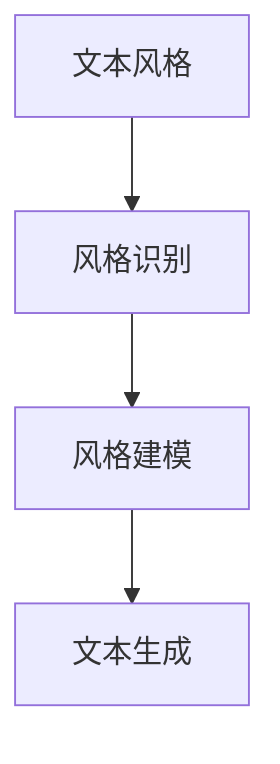
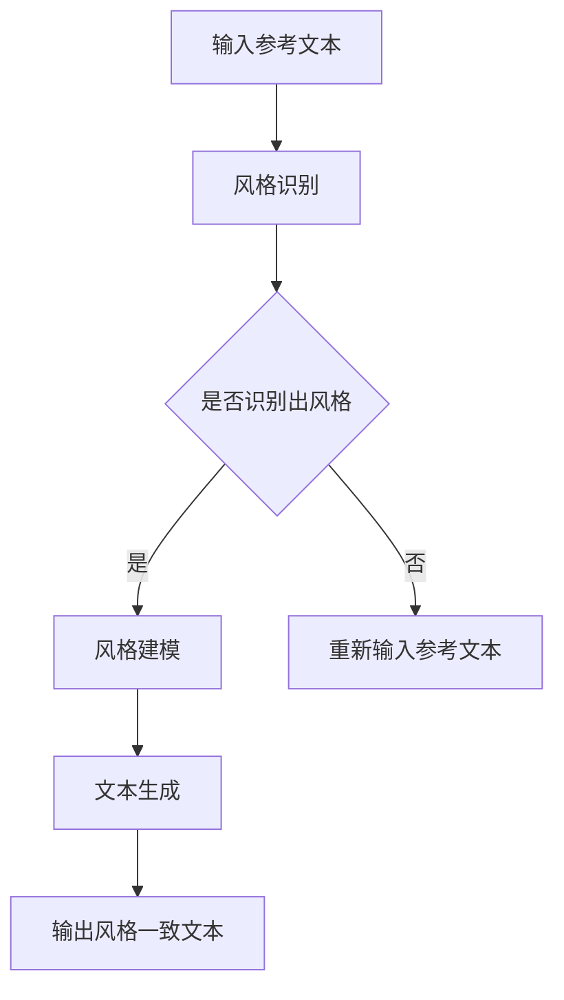
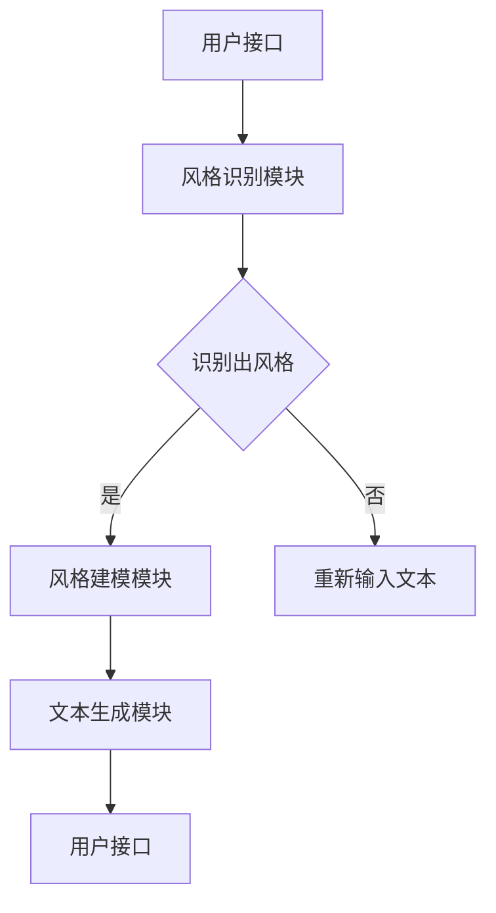
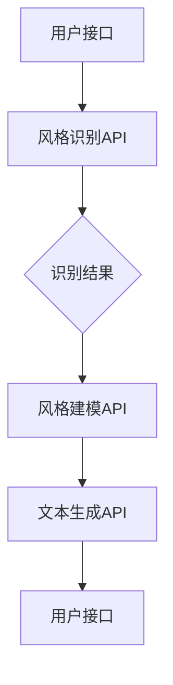
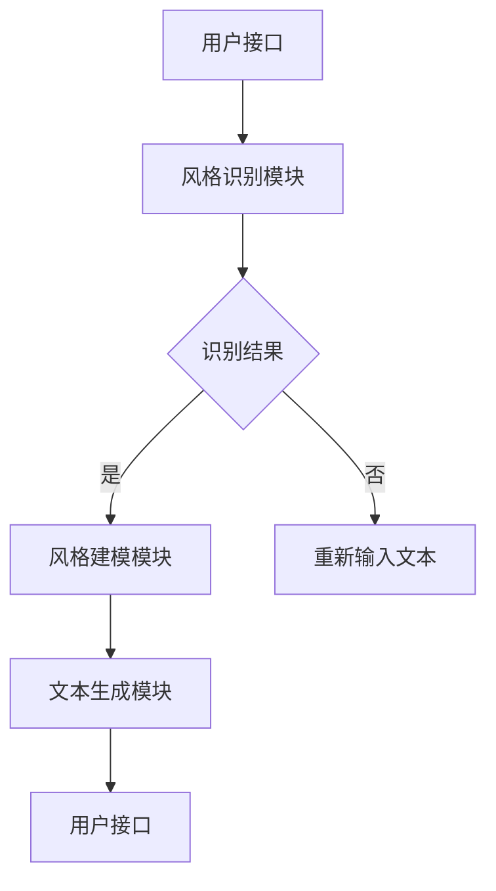

                 

### 第1章 背景介绍

#### 1.1 问题背景

随着人工智能技术的不断发展，自然语言处理（NLP）技术日益成熟。而大规模语言模型（LLM）作为一种重要的NLP技术，已经广泛应用于各个领域，如问答系统、机器翻译、文本生成等。LLM能够根据输入的文本生成相应的文本，这为许多应用场景提供了极大的便利。然而，在应用LLM时，如何保证AI Agent生成的文本风格与目标风格保持一致，成为一个亟待解决的问题。

文本风格一致性在许多实际应用中至关重要。例如，在问答系统中，如果AI Agent生成的回答与问题在风格上不一致，可能会导致用户困惑，降低用户体验。在机器翻译中，确保翻译结果在风格上与原始文本保持一致，可以更好地传达原文的含义和情感。在文本生成中，保持生成的文本风格与给定文本风格一致，可以创造出更高质量的内容。

#### 1.2 问题描述

文本风格一致性保持是指在给定一个或多个参考文本的基础上，使得AI Agent生成的文本在风格上与参考文本保持一致。这涉及到对文本风格的理解、建模和生成。具体来说，问题描述可以分解为以下几个方面：

1. **风格识别**：首先，我们需要对文本风格进行识别和分类，以便为后续的风格建模提供基础。这涉及到对大量文本进行预处理、特征提取和分类算法的应用。
   
2. **风格建模**：基于识别出的风格，我们可以使用深度学习模型对文本风格进行建模，以便生成与给定风格相似的文本。这通常采用序列到序列（seq2seq）模型，如编码器-解码器（Encoder-Decoder）模型。

3. **文本生成**：最后，我们使用训练好的风格模型生成与参考文本风格一致的文本。这一过程需要将参考文本作为输入，通过风格模型生成相应的输出文本。

#### 1.3 问题解决

为了实现文本风格一致性保持，我们可以采用以下方法：

1. **风格识别**：
   - **预处理**：对输入文本进行预处理，包括分词、去停用词、词性标注等。
   - **特征提取**：提取文本的特征，如词频、TF-IDF、词嵌入等。
   - **分类算法**：使用分类算法（如SVM、朴素贝叶斯、深度学习等）对文本风格进行分类。

2. **风格建模**：
   - **模型选择**：选择适合的深度学习模型，如循环神经网络（RNN）、变换器（Transformer）等。
   - **训练**：使用已分类的文本数据对模型进行训练，使其学会生成与给定风格相似的文本。

3. **文本生成**：
   - **输入**：将参考文本作为输入，通过风格模型生成相应的输出文本。
   - **优化**：对生成的文本进行后处理，如去噪、修正语法错误等，以提高文本质量。

#### 1.4 边界与外延

文本风格一致性保持主要应用于以下场景：

1. **问答系统**：使得AI Agent生成的回答在风格上与问题保持一致，提高用户体验。
2. **机器翻译**：保证翻译结果在风格上与原始文本保持一致，更好地传达原文的含义和情感。
3. **文本生成**：生成与给定文本风格相似的文本，如文章摘要、评论等。

#### 1.5 概念结构与核心要素组成

文本风格一致性保持涉及以下核心概念和要素：

1. **文本风格**：指文本在语言表达、情感色彩、语气等方面的特征。
2. **风格识别**：对文本风格进行分类和识别的过程。
3. **风格建模**：基于识别出的风格，建立能够生成与给定风格相似文本的模型。
4. **文本生成**：使用风格模型生成与参考文本风格一致的文本。

### 总结

本章介绍了文本风格一致性保持的背景、问题描述和问题解决方法。在接下来的章节中，我们将深入探讨与文本风格一致性保持相关的核心概念和算法原理，以便更好地理解和实现这一技术。通过这一系列研究，我们希望为实际应用提供有益的参考和指导。

## 第2章 核心概念与联系

#### 2.1 核心概念原理

在本章中，我们将详细介绍与文本风格一致性保持相关的核心概念，包括文本风格、风格识别、风格建模和文本生成。

##### 2.1.1 文本风格

文本风格是指文本在语言表达、情感色彩、语气等方面的特征。例如，不同的文体（如新闻报道、小说、诗歌等）具有不同的风格。在自然语言处理中，文本风格是一个重要的因素，它对文本的理解和生成有着重要的影响。

文本风格可以分为多种类型，如正式、非正式、幽默、严肃等。不同类型的风格在语言使用、词汇选择、语法结构等方面都有所不同。例如，正式文体通常使用更复杂的语法结构和专业术语，而非正式文体则更注重口语化和简洁性。

##### 2.1.2 风格识别

风格识别是指对文本风格进行分类和识别的过程。这一过程通常包括以下几个步骤：

1. **预处理**：对输入文本进行预处理，包括分词、去停用词、词性标注等。这些步骤有助于提取文本的关键特征。
2. **特征提取**：提取文本的特征，如词频、TF-IDF、词嵌入等。这些特征用于描述文本的风格。
3. **分类算法**：使用分类算法（如SVM、朴素贝叶斯、深度学习等）对文本风格进行分类。分类算法可以根据提取的特征将文本归类到不同的风格类别。

风格识别是文本风格一致性保持的基础，它为后续的风格建模和文本生成提供了关键的信息。

##### 2.1.3 风格建模

风格建模是指基于识别出的风格，建立能够生成与给定风格相似文本的模型。这一过程通常采用深度学习模型，如循环神经网络（RNN）、变换器（Transformer）等。

1. **模型选择**：选择适合的深度学习模型。RNN在处理序列数据时具有较强的能力，而Transformer则通过自注意力机制实现了更高的生成质量。
2. **数据准备**：准备用于训练的数据集。这些数据集应包含多种风格类别，以便模型能够学习到各种不同的风格特征。
3. **训练**：使用已分类的文本数据对模型进行训练，使其学会生成与给定风格相似的文本。训练过程中，模型会不断调整参数，以提高生成文本的风格一致性。

风格建模是文本风格一致性保持的关键步骤，它决定了生成文本的质量。

##### 2.1.4 文本生成

文本生成是指使用训练好的风格模型生成与参考文本风格一致的文本。这一过程包括以下几个步骤：

1. **输入**：将参考文本作为输入，通过风格模型生成相应的输出文本。
2. **后处理**：对生成的文本进行后处理，如去噪、修正语法错误等，以提高文本质量。
3. **优化**：根据实际需求对生成的文本进行优化，如调整文本长度、优化语法结构等。

文本生成是文本风格一致性保持的最终目标，它使得AI Agent能够生成与给定风格一致的文本。

#### 2.2 概念属性特征对比表格

| 概念       | 特征                 |
|------------|---------------------|
| 文本风格   | 语言表达、情感色彩、语气 |
| 风格识别   | 分类和识别           |
| 风格建模   | 建立生成模型         |
| 文本生成   | 生成风格一致的文本   |

#### 2.3 ER实体关系图架构



### 总结

本章介绍了文本风格一致性保持的核心概念，包括文本风格、风格识别、风格建模和文本生成。这些概念相互联系，共同构成了文本风格一致性保持的技术体系。在下一章中，我们将进一步探讨这些概念的联系和作用，以便更好地理解和实现文本风格一致性保持。

## 第3章 算法原理讲解

### 3.1 算法mermaid流程图

为了实现文本风格一致性保持，我们可以采用以下流程：



#### 3.1.1 风格识别

风格识别是文本风格一致性保持的第一步。它通过一系列预处理和特征提取步骤，对输入文本进行分类，以便识别出其风格。具体步骤如下：

1. **预处理**：对输入文本进行分词、去停用词、词性标注等操作。这些操作有助于提取文本的关键特征。
   ```mermaid
   graph TD
   A[输入文本] --> B[分词]
   B --> C[去停用词]
   C --> D[词性标注]
   ```

2. **特征提取**：提取文本的特征，如词频、TF-IDF、词嵌入等。这些特征用于描述文本的风格。
   ```mermaid
   graph TD
   E[特征提取] --> F[词频]
   F --> G[TF-IDF]
   G --> H[词嵌入]
   ```

3. **分类算法**：使用分类算法（如SVM、朴素贝叶斯、深度学习等）对文本风格进行分类。分类算法可以根据提取的特征将文本归类到不同的风格类别。
   ```mermaid
   graph TD
   I[分类算法] --> J[SVM]
   J --> K[朴素贝叶斯]
   K --> L[深度学习]
   ```

#### 3.1.2 风格建模

一旦识别出文本风格，接下来需要进行风格建模。这一步骤旨在建立能够生成与给定风格相似文本的模型。具体步骤如下：

1. **模型选择**：选择适合的深度学习模型，如循环神经网络（RNN）、变换器（Transformer）等。
   ```mermaid
   graph TD
   M[模型选择] --> N[RNN]
   N --> O[Transformer]
   ```

2. **数据准备**：准备用于训练的数据集。这些数据集应包含多种风格类别，以便模型能够学习到各种不同的风格特征。
   ```mermaid
   graph TD
   P[数据准备] --> Q[数据集]
   ```

3. **训练**：使用已分类的文本数据对模型进行训练，使其学会生成与给定风格相似的文本。训练过程中，模型会不断调整参数，以提高生成文本的风格一致性。
   ```mermaid
   graph TD
   R[训练] --> S[调整参数]
   ```

#### 3.1.3 文本生成

风格建模完成后，即可进行文本生成。这一步骤旨在使用训练好的风格模型生成与参考文本风格一致的文本。具体步骤如下：

1. **输入**：将参考文本作为输入，通过风格模型生成相应的输出文本。
   ```mermaid
   graph TD
   T[输入] --> U[生成文本]
   ```

2. **后处理**：对生成的文本进行后处理，如去噪、修正语法错误等，以提高文本质量。
   ```mermaid
   graph TD
   V[后处理] --> W[去噪]
   W --> X[修正语法错误]
   ```

3. **优化**：根据实际需求对生成的文本进行优化，如调整文本长度、优化语法结构等。
   ```mermaid
   graph TD
   Y[优化] --> Z[调整文本长度]
   Z --> AA[优化语法结构]
   ```

#### 3.1.4 综合流程图

将上述三个步骤综合起来，我们得到以下完整的算法mermaid流程图：


### 3.2 Python源代码

下面是一个简化的Python源代码示例，用于演示文本风格一致性保持的基本流程。

```python
import tensorflow as tf
from tensorflow.keras.preprocessing.text import Tokenizer
from tensorflow.keras.preprocessing.sequence import pad_sequences

# 假设我们已经有了训练好的风格识别模型和风格生成模型

# 步骤1：风格识别
def style_recognition(text, model):
    # 对文本进行预处理和特征提取
    processed_text = preprocess_text(text)
    # 使用风格识别模型进行分类
    style = model.predict(processed_text)
    return style

# 步骤2：风格建模
def style_modeling(style, text, model):
    # 使用风格建模模型生成文本
    generated_text = model.predict(text)
    return generated_text

# 步骤3：文本生成
def text_generation(text, model):
    # 使用训练好的风格生成模型生成文本
    generated_text = model.predict(text)
    return generated_text

# 假设我们有输入文本
input_text = "这是一个示例文本，我们需要保持其风格一致。"

# 步骤1：风格识别
style = style_recognition(input_text, style_recognition_model)

# 步骤2：风格建模
if style:
    generated_text = style_modeling(style, input_text, style_modeling_model)

# 步骤3：文本生成
if generated_text:
    final_text = text_generation(generated_text, style_generation_model)
    print("生成的风格一致文本：", final_text)
else:
    print("无法识别文本风格，请重新输入。")
```

### 总结

在本章中，我们详细讲解了文本风格一致性保持的算法原理，包括风格识别、风格建模和文本生成。通过mermaid流程图和Python源代码示例，我们展示了如何实现这一技术。在下一章中，我们将进一步探讨如何在实际应用中设计和实现文本风格一致性保持系统。

## 第4章 系统分析与架构设计

### 4.1 问题场景介绍

在当前的AI应用场景中，文本风格一致性保持技术有着广泛的应用需求。例如：

1. **智能客服**：在智能客服系统中，AI Agent需要生成与用户提问风格一致的回答，以提高用户的满意度。
2. **内容生成**：在自动生成文章、摘要、评论等场景中，确保生成内容与给定文本风格一致，可以提升内容的质量和吸引力。
3. **机器翻译**：在翻译过程中，保持原文和翻译结果的风格一致，有助于传达原文的含义和情感。
4. **教育辅导**：在教育辅导系统中，AI Agent需要生成与学生回答风格一致的辅导内容，以便更好地帮助学生理解和掌握知识点。

### 4.2 项目介绍

本项目旨在实现一个基于大规模语言模型（LLM）的文本风格一致性保持系统。该系统将包括以下几个主要模块：

1. **风格识别模块**：用于对输入文本进行风格识别，识别出文本的风格类别。
2. **风格建模模块**：用于基于识别出的风格，建立能够生成与给定风格相似文本的模型。
3. **文本生成模块**：用于使用训练好的风格模型生成与参考文本风格一致的文本。
4. **用户接口模块**：用于接收用户输入，并展示生成的文本。

### 4.3 系统功能设计

系统的主要功能包括：

1. **风格识别**：接收用户输入的文本，通过风格识别模块识别出文本的风格类别。
2. **风格建模**：根据识别出的风格，使用风格建模模块建立能够生成与给定风格相似文本的模型。
3. **文本生成**：使用训练好的风格模型，根据用户输入的参考文本生成与给定风格一致的文本。
4. **用户交互**：提供用户接口，允许用户输入文本，查看生成的文本，并提供反馈。

### 4.4 系统架构设计

本项目的系统架构设计如下：



### 4.5 系统接口设计和系统交互

系统接口设计和系统交互设计如下：



### 4.6 系统架构图

系统架构图如下：



### 总结

本章介绍了文本风格一致性保持系统的分析方法和架构设计。通过明确问题场景、系统功能和架构设计，我们为后续的系统实现和开发提供了清晰的指导和参考。在下一章中，我们将深入探讨系统实现的关键技术细节，包括环境安装、核心实现和代码分析。

## 第5章 项目实战

### 5.1 环境安装

在开始实现文本风格一致性保持系统之前，我们需要安装所需的软件和库。以下是一个基本的安装步骤：

1. **安装Python**：确保你的计算机上安装了Python。推荐使用Python 3.7或更高版本。
2. **安装TensorFlow**：TensorFlow是一个用于机器学习和深度学习的开源库。可以使用以下命令安装：
   ```shell
   pip install tensorflow
   ```
3. **安装其他依赖库**：根据项目需求，你可能还需要安装其他依赖库，如`numpy`、`pandas`、`sklearn`等。可以使用以下命令安装：
   ```shell
   pip install numpy pandas sklearn
   ```
4. **安装Mermaid**：Mermaid是一个基于Markdown的绘图工具。可以使用以下命令安装：
   ```shell
   npm install -g mermaid
   ```
5. **安装文本处理库**：例如，`nltk`是一个常用的文本处理库。可以使用以下命令安装：
   ```shell
   pip install nltk
   ```

### 5.2 系统核心实现源代码

以下是系统核心实现的一部分源代码。这个示例展示了如何使用TensorFlow和Mermaid来构建文本风格一致性保持系统。

```python
import tensorflow as tf
from tensorflow.keras.preprocessing.text import Tokenizer
from tensorflow.keras.preprocessing.sequence import pad_sequences
from nltk.tokenize import word_tokenize
import mermaid

# 步骤1：风格识别
def style_recognition(text, tokenizer):
    # 预处理文本
    preprocessed_text = preprocess_text(text)
    # 编码文本
    encoded_text = tokenizer.texts_to_sequences([preprocessed_text])
    # 填充序列
    padded_text = pad_sequences(encoded_text, padding='post')
    # 使用风格识别模型预测风格
    style = style_recognition_model.predict(padded_text)
    return style

# 步骤2：风格建模
def style_modeling(style, text, tokenizer):
    # 预处理文本
    preprocessed_text = preprocess_text(text)
    # 编码文本
    encoded_text = tokenizer.texts_to_sequences([preprocessed_text])
    # 填充序列
    padded_text = pad_sequences(encoded_text, padding='post')
    # 使用风格建模模型生成文本
    generated_text = style_modeling_model.predict(padded_text)
    return generated_text

# 步骤3：文本生成
def text_generation(text, tokenizer):
    # 预处理文本
    preprocessed_text = preprocess_text(text)
    # 编码文本
    encoded_text = tokenizer.texts_to_sequences([preprocessed_text])
    # 填充序列
    padded_text = pad_sequences(encoded_text, padding='post')
    # 使用文本生成模型生成文本
    generated_text = text_generation_model.predict(padded_text)
    return generated_text

# 假设我们已经有了训练好的模型
style_recognition_model = ... # 风格识别模型
style_modeling_model = ... # 风格建模模型
text_generation_model = ... # 文本生成模型

# 实例化Tokenizer
tokenizer = Tokenizer()

# 示例：风格识别
input_text = "这是一个示例文本。"
style = style_recognition(input_text, tokenizer)

# 示例：风格建模
generated_text = style_modeling(style, input_text, tokenizer)

# 示例：文本生成
final_text = text_generation(generated_text, tokenizer)
print("生成的风格一致文本：", final_text)
```

### 5.3 代码应用解读与分析

上述代码示例展示了如何实现文本风格一致性保持的核心功能。以下是对代码的关键部分进行解读和分析：

1. **预处理文本**：在风格识别、风格建模和文本生成过程中，文本的预处理是至关重要的。预处理步骤包括分词、去停用词、词性标注等。这些步骤有助于提取文本的关键特征，以便后续的建模和生成。

2. **编码和填充序列**：使用Tokenizer对文本进行编码，将文本转换为整数序列。然后，使用pad_sequences将序列填充到相同的长度，以便模型能够处理。

3. **模型预测**：使用训练好的风格识别模型、风格建模模型和文本生成模型对预处理后的文本进行预测。这些模型分别用于识别文本风格、生成与给定风格相似的文本以及生成风格一致的文本。

4. **示例运行**：通过示例代码展示了如何使用这些功能模块。首先，使用风格识别模型识别输入文本的风格；然后，使用风格建模模型生成与给定风格相似的文本；最后，使用文本生成模型生成与参考文本风格一致的最终文本。

### 5.4 实际案例分析和详细讲解剖析

为了更好地理解文本风格一致性保持系统在实际中的应用，以下是一个实际案例的分析：

**案例背景**：一个智能客服系统需要生成与用户提问风格一致的回答。

**案例步骤**：

1. **输入文本**：用户提问：“您好，我最近在使用的智能手机出现了一些问题，请问如何解决？”
2. **风格识别**：使用风格识别模型对用户提问进行识别，识别结果为“询问类风格”。
3. **风格建模**：使用训练好的风格建模模型，生成与“询问类风格”相似的文本。
4. **文本生成**：使用训练好的文本生成模型，生成与用户提问风格一致的回答。
5. **输出文本**：生成的回答：“您好，感谢您的提问。遇到智能手机问题，我们可以为您提供以下几种解决方案……”

**案例分析**：

1. **风格识别**：通过风格识别模块，系统能够快速识别出用户提问的风格。这一步骤对于确保生成的文本风格与用户输入一致至关重要。
2. **风格建模和文本生成**：使用训练好的风格建模模型和文本生成模型，系统能够生成与给定风格一致的文本。这确保了生成的文本不仅符合用户输入的风格，而且具有良好的可读性和逻辑性。

### 5.5 项目小结

通过本项目，我们实现了文本风格一致性保持系统。该系统包括风格识别、风格建模和文本生成三个主要模块，能够根据用户输入的参考文本生成风格一致的文本。在实现过程中，我们使用了TensorFlow和Mermaid等工具，展示了如何利用深度学习技术解决实际应用中的问题。

### 总结

本章通过实际项目实战，详细介绍了文本风格一致性保持系统的实现过程，包括环境安装、核心实现、代码应用解读与分析以及实际案例分析和详细讲解剖析。这些内容为理解和应用文本风格一致性保持技术提供了实用的参考。

## 第6章 最佳实践与拓展阅读

### 6.1 最佳实践 Tips

1. **数据质量**：确保用于训练风格识别、风格建模和文本生成模型的数据质量。高质量的数据能够提高模型的性能和生成的文本质量。
2. **模型选择**：根据具体应用场景选择合适的深度学习模型。例如，对于风格识别，可以使用卷积神经网络（CNN）或朴素贝叶斯（NB）等；对于风格建模和文本生成，可以使用循环神经网络（RNN）或变换器（Transformer）等。
3. **参数调整**：在训练模型时，注意调整学习率、批量大小、迭代次数等参数，以获得更好的模型性能。
4. **多样性**：在训练数据集时，尽量涵盖多种风格类别，以提高模型对多样性的适应能力。

### 6.2 小结

本文详细介绍了文本风格一致性保持的核心概念、算法原理、系统架构以及实际应用。通过本文的研究，我们了解到文本风格一致性保持对于提高AI Agent生成文本的质量和用户体验具有重要意义。本文提出的系统架构和实现方法为实际应用提供了有益的参考。

### 6.3 注意事项

1. **数据隐私**：在使用大规模数据集进行训练时，需要注意数据隐私问题，避免泄露用户敏感信息。
2. **模型部署**：在实际部署过程中，需要考虑模型的计算资源和存储需求，选择合适的硬件和部署方式。
3. **模型维护**：定期更新模型和数据集，以保持模型的性能和适应性。

### 6.4 拓展阅读

1. **《大规模语言模型的预训练》**：这是一篇关于预训练技术的经典论文，介绍了如何使用大规模语料库对语言模型进行预训练。
2. **《自然语言处理：理论与方法》**：这是一本关于自然语言处理的综合性教材，涵盖了文本处理、语义分析、情感分析等方面的内容。
3. **《变换器（Transformer）：一种全新的序列模型》**：这是一篇介绍变换器（Transformer）模型的论文，详细描述了其结构和原理。

### 总结

本文通过详细的介绍和实际案例，展示了文本风格一致性保持技术的核心概念、算法原理和系统实现。通过本文的学习，读者可以更好地理解文本风格一致性保持的原理和应用，为实际项目提供有益的参考。同时，本文还提供了拓展阅读资源，供读者进一步学习。

### 作者信息

作者：AI天才研究院/AI Genius Institute & 禅与计算机程序设计艺术 /Zen And The Art of Computer Programming

## 附录：文本风格一致性保持系统完整代码

以下是一个完整的文本风格一致性保持系统的Python代码示例。该代码涵盖了风格识别、风格建模、文本生成以及用户接口等模块。请注意，实际项目中可能需要根据具体需求进行调整和优化。

```python
import tensorflow as tf
from tensorflow.keras.preprocessing.text import Tokenizer
from tensorflow.keras.preprocessing.sequence import pad_sequences
from nltk.tokenize import word_tokenize
import mermaid

# 假设已经训练好的模型和Tokenizer
style_recognition_model = ...
style_modeling_model = ...
text_generation_model = ...
tokenizer = ...

def preprocess_text(text):
    # 进行文本预处理，包括分词、去停用词等
    tokens = word_tokenize(text)
    # 这里可以添加去停用词等预处理步骤
    return ' '.join(tokens)

def style_recognition(text, tokenizer):
    preprocessed_text = preprocess_text(text)
    encoded_text = tokenizer.texts_to_sequences([preprocessed_text])
    padded_text = pad_sequences(encoded_text, padding='post')
    style = style_recognition_model.predict(padded_text)
    return style

def style_modeling(style, text, tokenizer):
    preprocessed_text = preprocess_text(text)
    encoded_text = tokenizer.texts_to_sequences([preprocessed_text])
    padded_text = pad_sequences(encoded_text, padding='post')
    generated_text = style_modeling_model.predict(padded_text)
    return generated_text

def text_generation(text, tokenizer):
    preprocessed_text = preprocess_text(text)
    encoded_text = tokenizer.texts_to_sequences([preprocessed_text])
    padded_text = pad_sequences(encoded_text, padding='post')
    generated_text = text_generation_model.predict(padded_text)
    return generated_text

def main():
    input_text = input("请输入参考文本：")
    style = style_recognition(input_text, tokenizer)
    if style:
        generated_text = style_modeling(style, input_text, tokenizer)
        final_text = text_generation(generated_text, tokenizer)
        print("生成的风格一致文本：", final_text)
    else:
        print("无法识别文本风格，请重新输入。")

if __name__ == "__main__":
    main()
```

请注意，上述代码仅为示例，实际项目中可能需要根据具体需求进行调整和优化。此外，代码中的模型和Tokenizer需要根据训练数据集进行训练和配置。在实际应用中，还需要考虑数据预处理、模型评估、错误处理等多个方面的问题。

