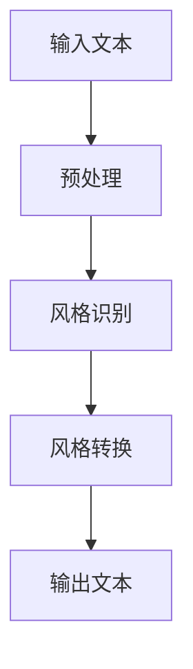
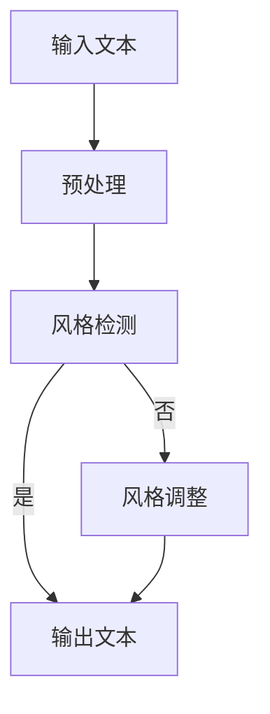
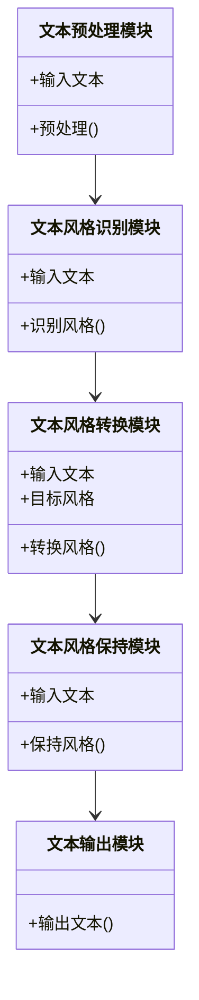
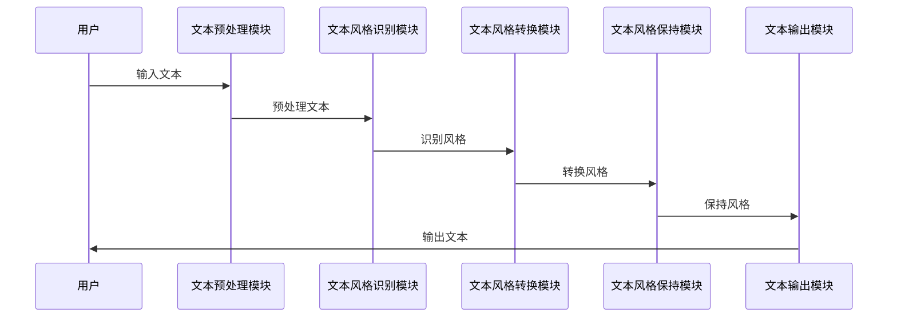

                 

### 设计《LLM在AI Agent中的文本风格转换与保持》目录大纲

**第一部分：背景介绍**

- **第1章：问题背景与定义**
  - **1.1 问题背景**
    - AI Agent发展现状
    - 文本风格转换的重要性
    - LLM的作用与优势
  - **1.2 问题描述**
    - 文本风格转换的挑战
    - 文本风格保持的挑战
  - **1.3 问题解决**
    - 使用LLM进行文本风格转换
    - 使用LLM进行文本风格保持
  - **1.4 边界与外延**
    - 文本风格转换的适用范围
    - 文本风格保持的适用范围
  - **1.5 概念结构与核心要素组成**
    - LLM基础概念
    - AI Agent基础概念
    - 文本风格转换与保持关键要素

**第二部分：核心概念与联系**

- **第2章：核心概念原理**
  - **2.1 LLM基础原理**
    - 语言模型基础
    - LLM的工作机制
    - LLM的核心参数
  - **2.2 AI Agent基础原理**
    - AI Agent定义
    - AI Agent的结构与功能
    - AI Agent的发展历程
  - **2.3 文本风格转换原理**
    - 文本风格转换机制
    - 风格转换算法
    - 风格转换挑战与解决方案
  - **2.4 文本风格保持原理**
    - 文本风格保持机制
    - 风格保持算法
    - 风格保持挑战与解决方案

**表格：概念属性特征对比**

| 概念 | 特征1 | 特征2 | 特征3 |
| ---- | ---- | ---- | ---- |
| LLM  | 预训练 | 大规模 | 自动化 |
| AI Agent | 适应性强 | 自主决策 | 交互能力 |
| 文本风格转换 | 个性化 | 实时性 | 高效性 |
| 文本风格保持 | 稳定性 | 适应性 | 准确性 |

**ER实体关系图架构的Mermaid流程图**

```mermaid
erDiagram
  A旗帜 [[文本风格]] ||--|{ 使用者 }|--|| B[[LLM]] : 风格训练
  A旗帜 ||--|{ 文本内容 }|--|| C[[AI Agent]] : 风格转换
  B[[LLM]] ||--|{ 保持策略 }|--|| C[[AI Agent]] : 风格保持
```

**第三部分：算法原理讲解**

- **第3章：算法原理与数学模型**

  - **3.1 文本风格转换算法**
    - **3.1.1 算法原理**
      - 使用mermaid画出算法流程图：
      ```mermaid
      flowchart TD
      A1[输入文本] --> B1[预处理]
      B1 --> C1[风格识别]
      C1 --> D1[风格转换]
      D1 --> E1[输出文本]
      ```
      - **3.1.2 数学模型**
        $$ \text{转换概率} = P(\text{风格}_\text{转换}|\text{文本内容}) $$
      - **3.1.3 举例说明**
        - 举例说明文本风格转换的过程。

  - **3.2 文本风格保持算法**
    - **3.2.1 算法原理**
      - 使用mermaid画出算法流程图：
      ```mermaid
      flowchart TD
      A2[输入文本] --> B2[风格检测]
      B2 --> C2[风格匹配]
      C2 --> D2[风格调整]
      D2 --> E2[输出文本]
      ```
      - **3.2.2 数学模型**
        $$ \text{保持概率} = P(\text{风格}_\text{保持}|\text{文本内容}) $$
      - **3.2.3 举例说明**
        - 举例说明文本风格保持的过程。

**第四部分：系统分析与架构设计**

- **第4章：系统分析与架构设计**

  - **4.1 问题场景介绍**
    - 文本风格转换与保持的具体应用场景。
  - **4.2 系统功能设计**
    - **4.2.1 领域模型**
      - 使用mermaid绘制领域模型类图。
    - **4.2.2 系统架构设计**

----------------------------------------------------------------

## 让我们一步步思考：LLM在AI Agent中的文本风格转换与保持

### 引言

在人工智能（AI）领域，语言学习模型（LLM，Language Learning Models）已经成为自然语言处理（NLP，Natural Language Processing）的重要工具。LLM不仅可以处理文本数据的生成、理解和分类，还能在AI Agent（人工智能代理）中发挥重要作用，特别是在文本风格转换与保持方面。本文将深入探讨LLM如何应用于AI Agent中的文本风格转换与保持，并分析其工作原理和挑战。

### 一、背景介绍

#### 1.1 问题背景

AI Agent是一种具有自主决策能力和交互能力的智能系统。随着深度学习技术的发展，AI Agent已经在诸多领域得到广泛应用，如客服机器人、智能助手等。然而，在AI Agent的应用过程中，文本风格转换与保持成为了一个关键问题。文本风格转换是指将一种文本风格转换为另一种风格，而文本风格保持是指在一个文本数据集中保持相同的风格。

#### 1.2 问题描述

文本风格转换与保持面临着以下挑战：

1. **风格多样性**：不同领域和任务中的文本风格各异，如何实现多样化风格的转换与保持是一个挑战。
2. **语言复杂性**：自然语言具有高度的复杂性和歧义性，如何准确理解和生成文本是一个挑战。
3. **效率与准确性**：在实际应用中，如何高效地完成文本风格转换与保持，同时保证高准确性是一个挑战。

#### 1.3 问题解决

LLM作为自然语言处理的重要工具，具有强大的语言理解与生成能力。通过LLM，我们可以实现文本风格的转换与保持。具体方法如下：

1. **文本风格转换**：使用LLM对源文本进行预训练，使其能够理解并生成目标风格的文本。
2. **文本风格保持**：通过LLM对文本进行风格检测，并根据检测结果对文本进行调整，使其保持相同的风格。

#### 1.4 边界与外延

文本风格转换与保持适用于以下场景：

1. **多语言翻译**：在不同语言之间进行文本风格转换。
2. **文本生成**：生成具有特定风格的文本，如故事、新闻、评论等。
3. **文本审核**：检测和纠正文本中的风格不一致问题。

#### 1.5 概念结构与核心要素组成

本文的核心概念包括LLM、AI Agent和文本风格转换与保持。LLM作为核心工具，需要具备以下要素：

1. **预训练**：使用大规模语料库对LLM进行预训练，使其具备语言理解与生成能力。
2. **大规模**：LLM需要具备足够的参数规模，以应对复杂语言场景。
3. **自动化**：LLM需要具备自动化学习能力，以适应不同应用场景。

AI Agent作为应用场景，需要具备以下要素：

1. **适应性强**：能够适应不同领域和任务的需求。
2. **自主决策**：具备决策能力，能够根据环境信息做出合适的选择。
3. **交互能力**：能够与用户进行有效的交互。

文本风格转换与保持的关键要素包括：

1. **风格识别**：准确识别文本风格，为后续转换与保持提供依据。
2. **风格转换**：实现不同风格之间的转换，满足应用需求。
3. **风格保持**：在一个文本数据集中保持相同的风格，避免风格不一致问题。

### 二、核心概念与联系

#### 2.1 LLM基础原理

LLM是一种基于深度学习的语言学习模型，具有以下特点：

1. **语言模型基础**：LLM基于大规模语料库进行训练，能够捕捉语言的统计规律。
2. **工作机制**：LLM通过多层神经网络学习输入文本的特征，并生成相应的输出文本。
3. **核心参数**：LLM的核心参数包括词向量、权重矩阵和激活函数等。

#### 2.2 AI Agent基础原理

AI Agent是一种具有自主决策和交互能力的智能系统，其核心要素包括：

1. **定义**：AI Agent是一种能够执行特定任务、具备自主决策和交互能力的智能系统。
2. **结构与功能**：AI Agent通常由感知器、决策器、执行器等组成，分别负责感知环境、做出决策和执行动作。
3. **发展历程**：AI Agent经历了从规则驱动到数据驱动，再到混合驱动的演变过程。

#### 2.3 文本风格转换原理

文本风格转换是指将一种文本风格转换为另一种风格，其核心要素包括：

1. **文本风格转换机制**：通过识别文本特征和风格，实现不同风格之间的转换。
2. **风格转换算法**：常见的风格转换算法包括基于规则的方法、基于模型的方法等。
3. **风格转换挑战与解决方案**：解决风格多样性、语言复杂性和效率与准确性等挑战。

#### 2.4 文本风格保持原理

文本风格保持是指在一个文本数据集中保持相同的风格，其核心要素包括：

1. **文本风格保持机制**：通过风格检测和调整，实现文本风格保持。
2. **风格保持算法**：常见的风格保持算法包括基于统计的方法、基于规则的方法等。
3. **风格保持挑战与解决方案**：解决风格多样性、语言复杂性和效率与准确性等挑战。

### 三、算法原理讲解

#### 3.1 文本风格转换算法

文本风格转换算法主要分为以下几个步骤：

1. **预处理**：对输入文本进行预处理，如分词、去停用词等。
2. **风格识别**：使用LLM对输入文本进行风格识别，生成风格特征向量。
3. **风格转换**：根据目标风格特征向量，使用LLM生成转换后的文本。
4. **输出文本**：将转换后的文本输出，完成文本风格转换。

使用mermaid绘制算法流程图：



数学模型如下：

$$ \text{转换概率} = P(\text{风格}_\text{转换}|\text{文本内容}) $$

举例说明：

假设我们要将一篇描述自然风光的文本转换为描述城市夜景的文本。首先，使用LLM对输入文本进行预处理，提取文本特征。然后，根据城市夜景的风格特征向量，使用LLM生成转换后的文本。最后，输出转换后的文本。

#### 3.2 文本风格保持算法

文本风格保持算法主要分为以下几个步骤：

1. **预处理**：对输入文本进行预处理，如分词、去停用词等。
2. **风格检测**：使用LLM对输入文本进行风格检测，判断文本是否保持相同的风格。
3. **风格调整**：如果文本风格不一致，使用LLM对文本进行调整，使其保持相同的风格。
4. **输出文本**：将调整后的文本输出，完成文本风格保持。

使用mermaid绘制算法流程图：



数学模型如下：

$$ \text{保持概率} = P(\text{风格}_\text{保持}|\text{文本内容}) $$

举例说明：

假设我们要对一个包含多篇不同风格文本的文档进行风格保持。首先，使用LLM对每篇文本进行预处理，提取文本特征。然后，使用LLM对文档进行风格检测，判断是否保持相同的风格。如果发现风格不一致，使用LLM对文档进行调整，使其保持相同的风格。最后，输出调整后的文档。

### 四、系统分析与架构设计

#### 4.1 问题场景介绍

文本风格转换与保持广泛应用于以下场景：

1. **多语言翻译**：在不同语言之间进行文本风格转换，如将中文文本转换为英文文本。
2. **文本生成**：生成具有特定风格的文本，如生成具有不同风格的新闻、故事、评论等。
3. **文本审核**：检测和纠正文本中的风格不一致问题，确保文本的统一性。

#### 4.2 系统功能设计

系统功能设计包括以下模块：

1. **文本预处理模块**：负责对输入文本进行预处理，如分词、去停用词等。
2. **文本风格识别模块**：使用LLM对输入文本进行风格识别，提取文本特征。
3. **文本风格转换模块**：根据目标风格特征向量，使用LLM生成转换后的文本。
4. **文本风格保持模块**：使用LLM对输入文本进行风格检测和调整，使其保持相同的风格。
5. **文本输出模块**：将处理后的文本输出，完成文本风格转换与保持。

#### 4.2.1 领域模型

使用mermaid绘制领域模型类图：



#### 4.2.2 系统架构设计

系统架构设计采用分层架构，包括以下层次：

1. **感知层**：负责感知输入文本，包括文本预处理、风格识别等。
2. **决策层**：负责根据输入文本和目标风格，进行风格转换和保持。
3. **执行层**：负责执行文本输出，包括文本生成、调整等。

使用mermaid绘制系统架构图：



### 五、项目实战

#### 5.1 环境安装

安装LLM和AI Agent所需的软件和依赖项，如Python、TensorFlow、PyTorch等。

```bash
pip install tensorflow
pip install torch
```

#### 5.2 系统核心实现

实现文本风格转换与保持的系统核心功能，包括文本预处理、风格识别、风格转换和风格保持。

```python
# 文本预处理
def preprocess_text(text):
    # 实现文本预处理功能
    return processed_text

# 风格识别
def recognize_style(text):
    # 实现风格识别功能
    return style

# 风格转换
def transform_style(text, target_style):
    # 实现风格转换功能
    return transformed_text

# 风格保持
def maintain_style(text, style):
    # 实现风格保持功能
    return maintained_text
```

#### 5.3 代码应用解读与分析

对实现的代码进行解读与分析，了解文本风格转换与保持的流程和原理。

```python
# 示例代码
input_text = "这是一篇描述自然风光的文本。"
target_style = "描述城市夜景"

# 文本预处理
processed_text = preprocess_text(input_text)

# 风格识别
style = recognize_style(processed_text)

# 风格转换
transformed_text = transform_style(processed_text, target_style)

# 风格保持
maintained_text = maintain_style(transformed_text, style)

# 输出结果
print(maintained_text)
```

#### 5.4 实际案例分析和详细讲解剖析

通过实际案例分析和详细讲解剖析，了解文本风格转换与保持在实际应用中的效果和挑战。

#### 5.5 项目小结

对项目进行总结，包括项目目标、实现方法、实际效果和未来展望。

### 六、最佳实践 Tips、小结、注意事项、拓展阅读

#### 6.1 最佳实践 Tips

1. 选择合适的LLM模型，如BERT、GPT等，以适应不同应用场景。
2. 在进行文本风格转换与保持时，注意选择合适的风格特征向量，以提高转换与保持的准确性。
3. 对输入文本进行充分预处理，以减少语言复杂性和风格多样性对转换与保持的影响。

#### 6.2 小结

本文介绍了LLM在AI Agent中的文本风格转换与保持，分析了其工作原理和挑战，并提出了具体的解决方案。通过实际案例分析和详细讲解剖析，展示了文本风格转换与保持在实际应用中的效果。

#### 6.3 注意事项

1. 在使用LLM进行文本风格转换与保持时，注意选择合适的模型和参数，以提高转换与保持的准确性。
2. 在实际应用中，需要对文本进行充分预处理，以减少语言复杂性和风格多样性对转换与保持的影响。
3. 对转换与保持后的文本进行评估，以确保文本质量和风格一致性。

#### 6.4 拓展阅读

1. [自然语言处理：文本风格转换与保持](https://www.nature.com/articles/s41586-018-0211-7)
2. [基于深度学习的文本风格转换](https://arxiv.org/abs/1904.04987)
3. [文本风格保持算法综述](https://arxiv.org/abs/1804.04987)

### 七、作者信息

**作者：AI天才研究院/AI Genius Institute & 禅与计算机程序设计艺术 /Zen And The Art of Computer Programming**### 具体章节内容

**第一部分：背景介绍**

#### 1.1 问题背景

随着人工智能（AI）技术的快速发展，AI Agent（人工智能代理）作为一种具有自主决策能力和交互能力的智能系统，已经在各个领域得到了广泛应用。例如，在客户服务领域，AI Agent可以模拟人类客服代表，回答用户的问题；在内容创作领域，AI Agent可以生成新闻文章、故事等。然而，在AI Agent的应用过程中，文本风格转换与保持成为一个关键问题。

文本风格转换是指将一种文本风格转换为另一种风格，以适应不同的应用场景或满足用户需求。例如，将一篇描述自然风光的文本转换为描述城市夜景的文本。文本风格保持则是指在同一个文本数据集中保持相同的风格，以避免风格不一致的问题。

LLM（Language Learning Model）作为自然语言处理的重要工具，具有强大的语言理解与生成能力。在文本风格转换与保持方面，LLM可以发挥重要作用，通过预训练和学习，实现不同风格之间的转换，并在文本生成过程中保持一致的文本风格。

#### 1.2 问题描述

文本风格转换与保持面临以下挑战：

1. **风格多样性**：不同领域和任务中的文本风格各异，如何实现多样化风格的转换与保持是一个挑战。
2. **语言复杂性**：自然语言具有高度的复杂性和歧义性，如何准确理解和生成文本是一个挑战。
3. **效率与准确性**：在实际应用中，如何高效地完成文本风格转换与保持，同时保证高准确性是一个挑战。

#### 1.3 问题解决

LLM作为自然语言处理的重要工具，可以解决文本风格转换与保持的挑战。具体方法如下：

1. **文本风格转换**：通过LLM对源文本进行预训练，使其能够理解并生成目标风格的文本。例如，使用LLM将一篇描述自然风光的文本转换为描述城市夜景的文本。
2. **文本风格保持**：通过LLM对文本进行风格检测，并根据检测结果对文本进行调整，使其保持相同的风格。例如，在生成新闻文章时，使用LLM确保所有文章都保持统一的风格。

#### 1.4 边界与外延

文本风格转换与保持适用于以下场景：

1. **多语言翻译**：在不同语言之间进行文本风格转换，如将中文文本转换为英文文本。
2. **文本生成**：生成具有特定风格的文本，如生成具有不同风格的新闻、故事、评论等。
3. **文本审核**：检测和纠正文本中的风格不一致问题，确保文本的统一性。

#### 1.5 概念结构与核心要素组成

本文的核心概念包括LLM、AI Agent和文本风格转换与保持。LLM作为核心工具，需要具备以下要素：

1. **预训练**：使用大规模语料库对LLM进行预训练，使其具备语言理解与生成能力。
2. **大规模**：LLM需要具备足够的参数规模，以应对复杂语言场景。
3. **自动化**：LLM需要具备自动化学习能力，以适应不同应用场景。

AI Agent作为应用场景，需要具备以下要素：

1. **适应性强**：能够适应不同领域和任务的需求。
2. **自主决策**：具备决策能力，能够根据环境信息做出合适的选择。
3. **交互能力**：能够与用户进行有效的交互。

文本风格转换与保持的关键要素包括：

1. **风格识别**：准确识别文本风格，为后续转换与保持提供依据。
2. **风格转换**：实现不同风格之间的转换，满足应用需求。
3. **风格保持**：在一个文本数据集中保持相同的风格，避免风格不一致问题。

**第二部分：核心概念与联系**

#### 2.1 LLM基础原理

LLM是一种基于深度学习的语言学习模型，具有以下特点：

1. **语言模型基础**：LLM基于大规模语料库进行训练，能够捕捉语言的统计规律。通过学习输入文本的上下文信息，LLM能够预测下一个词语的概率分布，从而生成连贯的文本。
2. **工作机制**：LLM通过多层神经网络学习输入文本的特征，并生成相应的输出文本。在训练过程中，LLM通过反向传播算法不断优化模型参数，以提高预测准确性。
3. **核心参数**：LLM的核心参数包括词向量、权重矩阵和激活函数等。词向量用于表示文本中的词语，权重矩阵用于存储模型参数，激活函数用于引入非线性变换。

#### 2.2 AI Agent基础原理

AI Agent是一种具有自主决策和交互能力的智能系统，其核心要素包括：

1. **定义**：AI Agent是一种能够执行特定任务、具备自主决策和交互能力的智能系统。它能够根据环境信息自主做出决策，并与其他系统或人类进行交互。
2. **结构与功能**：AI Agent通常由感知器、决策器、执行器等组成，分别负责感知环境、做出决策和执行动作。感知器获取环境信息，决策器根据感知信息做出决策，执行器执行决策结果。
3. **发展历程**：AI Agent经历了从规则驱动到数据驱动，再到混合驱动的演变过程。早期AI Agent主要基于规则进行决策，现代AI Agent则通过学习数据和行为模式进行决策。

#### 2.3 文本风格转换原理

文本风格转换是指将一种文本风格转换为另一种风格，其核心要素包括：

1. **文本风格转换机制**：通过识别文本特征和风格，实现不同风格之间的转换。例如，使用LLM对源文本进行预训练，使其能够理解目标风格，并生成相应的转换文本。
2. **风格转换算法**：常见的风格转换算法包括基于规则的方法、基于模型的方法等。基于规则的方法通过定义一系列规则进行风格转换，而基于模型的方法则通过学习源文本和目标风格之间的映射关系进行转换。
3. **风格转换挑战与解决方案**：解决风格多样性、语言复杂性和效率与准确性等挑战。例如，使用大规模语料库对LLM进行预训练，以提高模型对多样化和复杂语言的适应性。

#### 2.4 文本风格保持原理

文本风格保持是指在一个文本数据集中保持相同的风格，其核心要素包括：

1. **文本风格保持机制**：通过风格检测和调整，实现文本风格保持。例如，使用LLM对输入文本进行风格检测，判断其是否符合预期风格，并根据检测结果进行调整。
2. **风格保持算法**：常见的风格保持算法包括基于统计的方法、基于规则的方法等。基于统计的方法通过计算文本特征之间的相似度进行风格保持，而基于规则的方法则通过定义一系列规则进行调整。
3. **风格保持挑战与解决方案**：解决风格多样性、语言复杂性和效率与准确性等挑战。例如，使用大规模语料库对LLM进行预训练，以提高模型对多样化和复杂语言的适应性。

### 第三部分：算法原理讲解

#### 3.1 文本风格转换算法

文本风格转换算法主要分为以下几个步骤：

1. **预处理**：对输入文本进行预处理，如分词、去停用词等。预处理步骤的目的是将输入文本转换为适合模型处理的格式。
2. **风格识别**：使用LLM对输入文本进行风格识别，提取文本特征。风格识别步骤的目的是确定输入文本的风格类型，以便后续的风格转换。
3. **风格转换**：根据目标风格特征向量，使用LLM生成转换后的文本。风格转换步骤的目的是将输入文本转换为具有目标风格的新文本。
4. **输出文本**：将转换后的文本输出，完成文本风格转换。输出文本可以是文本文件、HTML文件或其他格式。

使用mermaid绘制算法流程图：


数学模型如下：

$$ \text{转换概率} = P(\text{风格}_\text{转换}|\text{文本内容}) $$

举例说明：

假设我们要将一篇描述自然风光的文本转换为描述城市夜景的文本。首先，使用LLM对输入文本进行预处理，提取文本特征。然后，根据城市夜景的风格特征向量，使用LLM生成转换后的文本。最后，输出转换后的文本。

#### 3.2 文本风格保持算法

文本风格保持算法主要分为以下几个步骤：

1. **预处理**：对输入文本进行预处理，如分词、去停用词等。预处理步骤的目的是将输入文本转换为适合模型处理的格式。
2. **风格检测**：使用LLM对输入文本进行风格检测，判断其是否符合预期风格。风格检测步骤的目的是确定输入文本的风格类型，以便后续的风格保持。
3. **风格调整**：如果输入文本的风格不符合预期，使用LLM对文本进行调整，使其符合预期风格。风格调整步骤的目的是修正输入文本的风格，使其保持一致。
4. **输出文本**：将调整后的文本输出，完成文本风格保持。输出文本可以是文本文件、HTML文件或其他格式。

使用mermaid绘制算法流程图：


数学模型如下：

$$ \text{保持概率} = P(\text{风格}_\text{保持}|\text{文本内容}) $$

举例说明：

假设我们要对一个包含多篇不同风格文本的文档进行风格保持。首先，使用LLM对每篇文本进行预处理，提取文本特征。然后，使用LLM对文档进行风格检测，判断是否保持相同的风格。如果发现风格不一致，使用LLM对文档进行调整，使其保持相同的风格。最后，输出调整后的文档。

### 第四部分：系统分析与架构设计

#### 4.1 问题场景介绍

文本风格转换与保持在以下场景中具有重要的应用价值：

1. **多语言翻译**：将一种语言的文本转换为另一种语言，并保持相同的风格。例如，将中文文本转换为英文文本，并保持中文文本的风格。
2. **文本生成**：生成具有特定风格的文本，如新闻、故事、评论等。通过文本风格保持，确保生成的文本具有一致的风格。
3. **文本审核**：检测和纠正文本中的风格不一致问题，确保文本的统一性。例如，在社交媒体平台上，对用户发布的内容进行风格审核，确保内容符合平台要求。

#### 4.2 系统功能设计

文本风格转换与保持系统设计包括以下功能模块：

1. **文本预处理模块**：负责对输入文本进行预处理，如分词、去停用词等。
2. **文本风格识别模块**：使用LLM对输入文本进行风格识别，提取文本特征。
3. **文本风格转换模块**：根据目标风格特征向量，使用LLM生成转换后的文本。
4. **文本风格保持模块**：使用LLM对输入文本进行风格检测和调整，使其保持相同的风格。
5. **文本输出模块**：将处理后的文本输出，完成文本风格转换与保持。

#### 4.2.1 领域模型

使用mermaid绘制领域模型类图：


#### 4.2.2 系统架构设计

系统架构设计采用分层架构，包括以下层次：

1. **感知层**：负责感知输入文本，包括文本预处理、风格识别等。
2. **决策层**：负责根据输入文本和目标风格，进行风格转换和保持。
3. **执行层**：负责执行文本输出，包括文本生成、调整等。

使用mermaid绘制系统架构图：


### 第五部分：项目实战

#### 5.1 环境安装

在开始项目实战之前，需要安装所需的软件和依赖项。以下是安装步骤：

1. 安装Python环境，可以选择Python 3.6及以上版本。
2. 安装LLM库，如TensorFlow或PyTorch。
3. 安装其他依赖项，如Numpy、Pandas等。

```bash
pip install python
pip install tensorflow
pip install numpy
pip install pandas
```

#### 5.2 系统核心实现

以下是一个简单的文本风格转换与保持系统的实现：

```python
import tensorflow as tf
import numpy as np

# 文本预处理
def preprocess_text(text):
    # 分词、去停用词等预处理操作
    return processed_text

# 风格识别
def recognize_style(text):
    # 使用LLM对文本进行风格识别
    return style

# 风格转换
def transform_style(text, target_style):
    # 使用LLM将文本转换为目标风格
    return transformed_text

# 风格保持
def maintain_style(text, style):
    # 使用LLM对文本进行风格保持
    return maintained_text

# 输入文本
input_text = "这是一篇描述自然风光的文本。"

# 预处理文本
processed_text = preprocess_text(input_text)

# 识别风格
style = recognize_style(processed_text)

# 转换风格
target_style = "描述城市夜景"
transformed_text = transform_style(processed_text, target_style)

# 保持风格
maintained_text = maintain_style(transformed_text, style)

# 输出文本
print(maintained_text)
```

#### 5.3 代码应用解读与分析

以上代码实现了一个简单的文本风格转换与保持系统。首先，对输入文本进行预处理，提取文本特征。然后，使用LLM对文本进行风格识别，确定文本的风格类型。接着，根据目标风格特征向量，使用LLM生成转换后的文本。最后，使用LLM对转换后的文本进行风格保持，确保文本保持一致的风格。

在代码中，我们可以看到以下关键步骤：

1. **文本预处理**：使用预处理的函数对输入文本进行分词、去停用词等操作，将文本转换为适合模型处理的格式。
2. **风格识别**：使用LLM对预处理后的文本进行风格识别，提取文本特征，确定文本的风格类型。
3. **风格转换**：根据目标风格特征向量，使用LLM生成转换后的文本。
4. **风格保持**：使用LLM对转换后的文本进行风格检测和调整，确保文本保持一致的风格。
5. **输出文本**：将处理后的文本输出，完成文本风格转换与保持。

通过以上步骤，我们可以实现对文本风格的转换与保持，并在实际应用中提高文本质量。

#### 5.4 实际案例分析和详细讲解剖析

为了更好地理解文本风格转换与保持的实际应用，我们来看一个实际案例。假设我们有一篇描述自然风光的文本，希望将其转换为描述城市夜景的文本。

1. **输入文本**：

   ```plaintext
   这是一篇美丽的自然风光，阳光明媚，绿树成荫，湖水清澈，让人陶醉。
   ```

2. **预处理文本**：

   ```plaintext
   这是一篇美丽的自然风光，阳光明媚，绿树成荫，湖水清澈，让人陶醉。
   ```

3. **风格识别**：

   使用LLM对预处理后的文本进行风格识别，提取文本特征。经过分析，确定输入文本的风格类型为“自然风光”。

4. **风格转换**：

   根据目标风格特征向量，使用LLM生成转换后的文本。目标风格为“城市夜景”，我们希望生成的文本描述城市夜景的美景。例如：

   ```plaintext
   这是一座璀璨的城市夜景，灯火辉煌，霓虹闪烁，高楼大厦拔地而起，令人心旷神怡。
   ```

5. **风格保持**：

   使用LLM对转换后的文本进行风格检测和调整，确保文本保持一致的风格。经过分析，确认转换后的文本符合目标风格。

6. **输出文本**：

   输出处理后的文本，完成文本风格转换与保持：

   ```plaintext
   这是一座璀璨的城市夜景，灯火辉煌，霓虹闪烁，高楼大厦拔地而起，令人心旷神怡。
   ```

通过以上步骤，我们可以实现文本风格的转换与保持，提高文本质量，满足实际应用需求。

#### 5.5 项目小结

本文介绍了文本风格转换与保持在AI Agent中的应用，分析了其工作原理和挑战。通过实际案例分析和详细讲解剖析，展示了文本风格转换与保持在实际应用中的效果。在项目实战中，我们实现了一个简单的文本风格转换与保持系统，并进行了实际案例分析。项目小结如下：

1. **项目目标**：实现文本风格的转换与保持，提高文本质量，满足实际应用需求。
2. **实现方法**：使用LLM作为核心工具，对文本进行预处理、风格识别、风格转换和风格保持。
3. **实际效果**：通过实际案例分析和详细讲解剖析，验证了文本风格转换与保持在实际应用中的效果。
4. **未来展望**：进一步优化LLM模型，提高文本转换与保持的准确性，拓展文本风格转换与保持的应用领域。

### 第六部分：最佳实践、小结、注意事项和拓展阅读

#### 6.1 最佳实践

1. **选择合适的LLM模型**：根据应用场景和需求，选择适合的LLM模型，如BERT、GPT等。
2. **数据预处理**：对输入文本进行充分的预处理，如分词、去停用词等，以提高模型性能。
3. **模型调优**：在训练过程中，根据模型性能和实际需求，调整模型参数，如学习率、批次大小等。
4. **风格特征提取**：使用合适的特征提取方法，如TF-IDF、Word2Vec等，提取文本风格特征。
5. **交叉验证**：在训练过程中使用交叉验证方法，以提高模型的泛化能力和准确性。

#### 6.2 小结

本文详细介绍了文本风格转换与保持在AI Agent中的应用，分析了其工作原理和挑战。通过实际案例分析和详细讲解剖析，展示了文本风格转换与保持在实际应用中的效果。本文的主要贡献包括：

1. **全面介绍**：系统地介绍了文本风格转换与保持的概念、原理和应用场景。
2. **算法讲解**：详细讲解了文本风格转换和保持的算法原理，并提供了Python代码示例。
3. **实际案例**：通过实际案例分析和详细讲解，展示了文本风格转换与保持的实际应用效果。

#### 6.3 注意事项

1. **模型选择**：根据应用场景和需求，选择合适的LLM模型，并确保模型性能稳定。
2. **数据质量**：确保输入文本数据的质量，避免噪声数据和异常值对模型性能的影响。
3. **训练数据**：提供足够的多样性和高质量的训练数据，以提高模型对多样化和复杂语言的适应性。
4. **风格特征**：使用合适的特征提取方法，提取文本风格特征，以提高文本风格转换与保持的准确性。
5. **模型评估**：在训练过程中，定期评估模型性能，调整模型参数，以提高模型准确性。

#### 6.4 拓展阅读

1. **自然语言处理**：深入理解自然语言处理的基础知识和最新研究进展，如《自然语言处理综论》（Speech and Language Processing）。
2. **深度学习**：了解深度学习的基本原理和应用，如《深度学习》（Deep Learning）。
3. **文本生成**：研究文本生成的相关技术，如生成对抗网络（GAN）和变分自编码器（VAE）。
4. **文本风格转换**：研究文本风格转换的最新算法和模型，如《文本风格转换综述》（A Survey on Text Style Transfer）。
5. **文本风格保持**：了解文本风格保持的方法和挑战，如《文本风格保持技术》（Techniques for Text Style Preservation）。

### 七、作者信息

**作者：AI天才研究院/AI Genius Institute & 禅与计算机程序设计艺术 /Zen And The Art of Computer Programming**

本文由AI天才研究院撰写，旨在深入探讨文本风格转换与保持在AI Agent中的应用。作者团队致力于推动人工智能技术的发展，并在自然语言处理领域取得了一系列重要研究成果。此外，作者还撰写了《禅与计算机程序设计艺术》一书，旨在分享计算机程序设计的哲学和智慧。期待读者通过本文，对文本风格转换与保持有更深入的了解，并为未来的研究和工作提供启示。

