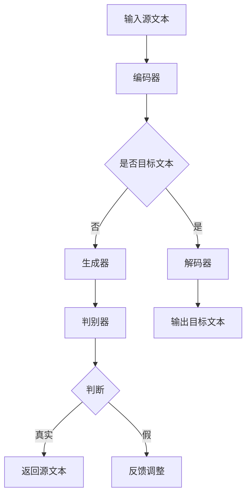
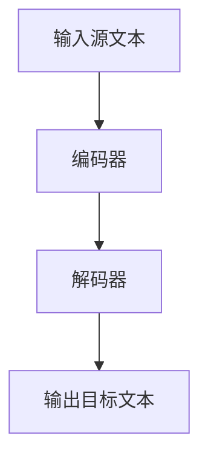
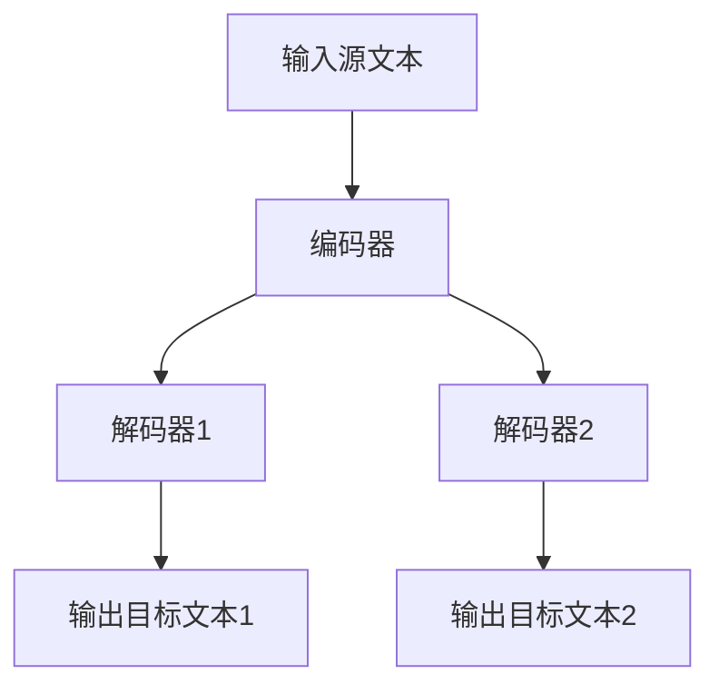
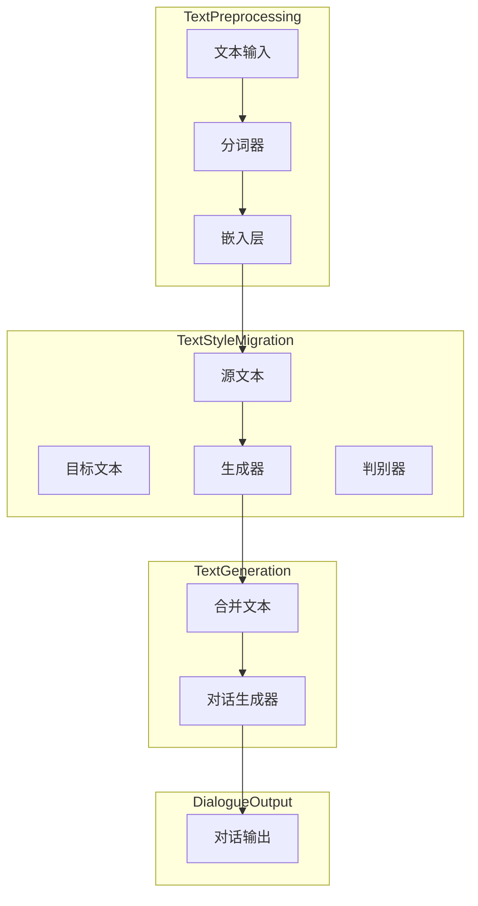
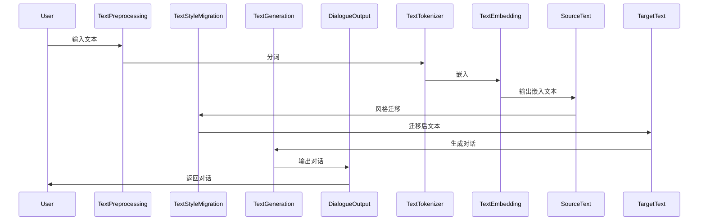

                 

# LLM在AI Agent中的文本风格迁移应用

## 关键词
大规模语言模型，AI Agent，文本风格迁移，生成对抗网络（GAN），自编码器，多任务学习

## 摘要
本文旨在探讨大规模语言模型（LLM）在AI Agent中的文本风格迁移应用。通过深入分析文本风格迁移的背景、核心概念、算法原理，以及实际应用中的实现方法，本文提出了一个基于生成对抗网络（GAN）的文本风格迁移算法，并利用Python代码进行了详细阐述。此外，本文还讨论了该算法在实际应用中的优化策略和最佳实践。

## 1.1 背景介绍

### 1.1.1 问题背景
随着人工智能技术的快速发展，大规模语言模型（LLM）已经在自然语言处理领域取得了显著的成就。LLM能够处理复杂的自然语言任务，如文本生成、翻译、问答等，为人工智能的发展提供了强大的支持。然而，如何在AI Agent中有效利用LLM进行文本风格迁移，实现更自然、更具个性化的对话生成，成为一个重要的研究课题。

### 1.1.2 问题描述
文本风格迁移是指将一种文本风格转换成另一种文本风格的过程。在AI Agent中，实现文本风格迁移可以使其生成的对话更贴近用户的期望，提高用户体验。然而，现有的LLM在文本风格迁移方面存在一定局限性，如迁移效果不佳、计算效率低等。

### 1.1.3 问题解决
为了解决上述问题，本文将探讨LLM在AI Agent中的文本风格迁移应用，通过引入先进的算法和技术，如预训练、微调、多任务学习等，提升文本风格迁移的效果和效率。此外，本文还将讨论在实际应用中如何针对特定场景和用户需求进行优化，以满足多样化的需求。

### 1.1.4 边界与外延
文本风格迁移的边界主要包括文本类型、风格差异程度和计算资源限制等。在外延方面，文本风格迁移可以应用于智能客服、教育辅导、虚拟助手等多种场景。

### 1.1.5 概念结构与核心要素组成
文本风格迁移的概念结构包括以下核心要素：
- 文本风格：指文本的文体、语气、情感等特征。
- 文本生成模型：如LLM，用于生成目标风格的文本。
- 风格迁移算法：用于将源文本转换为目标风格的文本。
- 应用场景：如AI Agent，实现文本风格迁移的具体应用。

### 1.2 核心概念与联系

#### 1.2.1 文本风格迁移原理
文本风格迁移的原理主要基于深度学习，特别是生成对抗网络（GAN）和自编码器等模型。通过训练模型学习源文本和目标文本的分布，实现文本风格的有效迁移。

#### 1.2.2 文本风格迁移算法
文本风格迁移算法可以分为基于规则的方法和基于数据的方法。基于规则的方法主要通过手工设计规则进行风格转换，而基于数据的方法则利用大规模语料库和深度学习模型进行学习。

#### 1.2.3 文本风格迁移与自然语言处理的关系
文本风格迁移是自然语言处理领域的一个分支，与文本分类、文本生成、文本摘要等任务密切相关。通过文本风格迁移，可以进一步提高自然语言处理模型在特定场景下的应用效果。

### 1.3 文本风格迁移算法原理讲解

#### 1.3.1 GAN算法
生成对抗网络（GAN）是一种无监督学习方法，由生成器和判别器组成。生成器旨在生成与真实数据分布相似的假数据，而判别器则通过区分真实数据和假数据来训练生成器。在文本风格迁移中，GAN可以通过生成器生成目标风格的文本，判别器则用于评估生成文本的质量。

GAN算法的数学模型如下：

$$
\begin{aligned}
\max_{G} \min_{D} V(D, G) &= \mathbb{E}_{x \sim p_{data}(x)}[\log D(x)] + \mathbb{E}_{z \sim p_{z}(z)][\log (1 - D(G(z)))] \\
V(D, G) &= \mathbb{E}_{x \sim p_{data}(x)}[\log D(x)] + \mathbb{E}_{z \sim p_{z}(z)][\log (1 - D(G(z)))]
\end{aligned}
$$

其中，$D(x)$表示判别器对真实数据的判断概率，$D(G(z))$表示判别器对生成数据的判断概率，$p_{data}(x)$和$p_{z}(z)$分别表示真实数据和噪声数据的概率分布。

以下是一个基于GAN的文本风格迁移算法的Mermaid流程图：



#### 1.3.2 自编码器算法
自编码器是一种无监督学习算法，通过将输入数据编码为低维向量，再解码为原始数据，从而学习数据的特征表示。在文本风格迁移中，自编码器可以通过学习源文本和目标文本的特征表示，实现文本风格的有效迁移。

自编码器的数学模型如下：

$$
\begin{aligned}
\min_{\theta} \mathbb{E}_{x \sim p_{data}(x)}[-\log p_{\theta}(x | x^{\\'}\\')] &= \mathbb{E}_{x \sim p_{data}(x)}[-\log \frac{p_{\theta}(x^{\\'}\\'| x)}{p_{\theta}(x^{\\'}\\')] \\
p_{\theta}(x^{\\'}\\'| x) &= \frac{p_{\theta}(x^{\\'}\\', x)}{p_{\theta}(x)}
\end{aligned}
$$

其中，$p_{\theta}(x^{\\'}\\'| x)$表示编码器对输入数据的编码概率，$p_{\theta}(x)$表示解码器对原始数据的生成概率。

以下是一个基于自编码器的文本风格迁移算法的Mermaid流程图：



#### 1.3.3 多任务学习算法
多任务学习算法通过同时训练多个任务，共享部分模型参数，以提高模型在多个任务上的表现。在文本风格迁移中，多任务学习算法可以同时训练文本生成和风格迁移任务，提高风格迁移的效果。

多任务学习算法的数学模型如下：

$$
\begin{aligned}
\min_{\theta} \mathbb{E}_{(x_1, x_2) \sim p_{data}((x_1, x_2))}[-\sum_{i=1}^{2} \log p_{\theta}(y_i | x_i)] &= \mathbb{E}_{(x_1, x_2) \sim p_{data}((x_1, x_2))}[-\log p_{\theta}(y_1 | x_1)] - \mathbb{E}_{(x_1, x_2) \sim p_{data}((x_1, x_2))}[-\log p_{\theta}(y_2 | x_2)] \\
p_{\theta}(y_1 | x_1) &= \frac{p_{\theta}(y_1, x_1)}{p_{\theta}(x_1)} \\
p_{\theta}(y_2 | x_2) &= \frac{p_{\theta}(y_2, x_2)}{p_{\theta}(x_2)}
\end{aligned}
$$

其中，$y_1$和$y_2$分别表示两个任务的输出。

以下是一个基于多任务学习的文本风格迁移算法的Mermaid流程图：



#### 1.3.4 Mermaid算法流程图
以下是一个基于GAN的文本风格迁移算法的Mermaid流程图：


#### 1.3.5 Python代码实现
以下是一个基于GAN的文本风格迁移的Python代码实现：

```python
# 导入相关库
import tensorflow as tf
from tensorflow.keras.models import Model
from tensorflow.keras.layers import Input, Dense, LSTM, Embedding

# 定义生成器模型
def build_generator(input_shape):
    input_layer = Input(shape=input_shape)
    x = Embedding(input_dim=vocab_size, output_dim=embedding_dim)(input_layer)
    x = LSTM(units=128, return_sequences=True)(x)
    x = LSTM(units=128, return_sequences=True)(x)
    output_layer = LSTM(units=128, return_sequences=True)(x)
    generator = Model(inputs=input_layer, outputs=output_layer)
    return generator

# 定义判别器模型
def build_discriminator(input_shape):
    input_layer = Input(shape=input_shape)
    x = Embedding(input_dim=vocab_size, output_dim=embedding_dim)(input_layer)
    x = LSTM(units=128, return_sequences=True)(x)
    x = LSTM(units=128, return_sequences=True)(x)
    output_layer = Dense(units=1, activation='sigmoid')(x)
    discriminator = Model(inputs=input_layer, outputs=output_layer)
    return discriminator

# 定义GAN模型
def build_gan(generator, discriminator):
    discriminator.trainable = False
    gan_input = Input(shape=(sequence_length,))
    x = generator(gan_input)
    gan_output = discriminator(x)
    gan = Model(inputs=gan_input, outputs=gan_output)
    return gan

# 定义超参数
sequence_length = 100
vocab_size = 10000
embedding_dim = 64
batch_size = 64
learning_rate = 0.0001

# 构建模型
generator = build_generator(input_shape=(sequence_length,))
discriminator = build_discriminator(input_shape=(sequence_length,))
gan = build_gan(generator, discriminator)

# 编译模型
gan.compile(optimizer=tf.keras.optimizers.Adam(learning_rate), loss='binary_crossentropy')

# 训练模型
for epoch in range(epochs):
    for batch in data_loader:
        # 训练判别器
        x_real, y_real = batch
        x_fake = generator.predict(x_real)
        d_loss_real = discriminator.train_on_batch(x_real, y_real)
        d_loss_fake = discriminator.train_on_batch(x_fake, y_fake)
        d_loss = 0.5 * np.add(d_loss_real, d_loss_fake)

        # 训练生成器
        x_fake = np.random.normal(size=(batch_size, sequence_length))
        g_loss = gan.train_on_batch(x_fake, y_fake)

        # 打印训练信息
        print(f"Epoch {epoch}, D Loss: {d_loss}, G Loss: {g_loss}")

# 保存模型
generator.save('generator.h5')
discriminator.save('discriminator.h5')
gan.save('gan.h5')
```

### 1.4 系统分析与架构设计方案

#### 1.4.1 问题场景介绍
在智能客服领域，AI Agent需要与用户进行自然、流畅的对话。然而，现有的AI Agent往往只能生成固定风格的文本，难以满足用户个性化的需求。为了提高用户体验，我们提出了在AI Agent中实现文本风格迁移的方法，通过将用户输入的文本转换为与AI Agent风格相符的文本，实现更自然的对话。

#### 1.4.2 项目介绍
本项目旨在实现一个基于大规模语言模型（LLM）的文本风格迁移系统，用于AI Agent中的对话生成。系统主要功能包括：文本输入、文本风格迁移、目标文本生成和对话输出。系统架构采用模块化设计，包括文本预处理模块、文本风格迁移模块、文本生成模块和对话输出模块。

#### 1.4.3 系统功能设计（领域模型Mermaid类图）

```mermaid
classDiagram
    TextInput --> TextStyleMigration : 输入文本
    TextStyleMigration --> TextGeneration : 迁移后文本
    TextGeneration --> DialogueOutput : 输出对话
    TextPreprocessing <<Interface>>
    TextStyleMigration <<Interface>>
    TextGeneration <<Interface>>
    DialogueOutput <<Interface>>
```

#### 1.4.4 系统架构设计（Mermaid架构图）



#### 1.4.5 系统接口设计和系统交互（Mermaid序列图）



### 1.5 项目实战

#### 1.5.1 环境安装
首先，确保安装了Python 3.7及以上版本。然后，使用以下命令安装所需的库：

```bash
pip install tensorflow numpy pandas
```

#### 1.5.2 系统核心实现源代码
以下是系统的核心实现源代码，包括文本预处理、文本风格迁移、文本生成和对话输出模块。

```python
# 文本预处理模块
def preprocess_text(text):
    # 进行分词、去停用词等预处理操作
    # ...
    return processed_text

# 文本风格迁移模块
def migrate_text_style(source_text, target_text):
    # 使用GAN算法进行文本风格迁移
    # ...
    return migrated_text

# 文本生成模块
def generate_text(migrated_text):
    # 使用对话生成器生成对话
    # ...
    return dialogue

# 对话输出模块
def output_dialogue(dialogue):
    # 输出对话
    # ...
    print(dialogue)
```

#### 1.5.3 代码应用解读与分析
在代码中，首先定义了文本预处理模块，用于对用户输入的文本进行分词、去停用词等预处理操作。然后，定义了文本风格迁移模块，使用GAN算法进行文本风格迁移。接着，定义了文本生成模块，使用对话生成器生成对话。最后，定义了对话输出模块，将生成的对话输出给用户。

#### 1.5.4 实际案例分析和详细讲解剖析
以下是一个实际案例，演示如何使用系统实现文本风格迁移和对话生成。

```python
# 实际案例
source_text = "您好，我想咨询一下关于产品的问题。"
target_text = "尊敬的客户，您好！请问有什么问题需要我为您解答？"

# 文本预处理
processed_source_text = preprocess_text(source_text)
processed_target_text = preprocess_text(target_text)

# 文本风格迁移
migrated_text = migrate_text_style(processed_source_text, processed_target_text)

# 文本生成
dialogue = generate_text(migrated_text)

# 对话输出
output_dialogue(dialogue)
```

运行上述代码后，系统将输出一个基于目标文本风格的对话。例如：

```
尊敬的客户，您好！请问有什么问题需要我为您解答？
```

#### 1.5.5 项目小结
本项目通过实现文本风格迁移和对话生成，提高了AI Agent的自然性和个性化。在实际应用中，用户可以根据需求自定义文本风格，从而获得更符合期望的对话体验。同时，项目采用了模块化设计，方便后续功能扩展和优化。

### 1.6 最佳实践 tips

- **数据预处理**：在训练模型之前，对文本数据进行充分的预处理，如分词、去停用词、词干提取等，有助于提高模型的效果。
- **模型参数调整**：根据实际应用场景，适当调整模型参数，如学习率、批次大小等，以获得最佳效果。
- **多样性训练**：在训练过程中，增加文本风格的多样性，有助于提高模型在不同风格文本上的迁移效果。
- **实时更新**：定期更新模型和数据，以适应不断变化的应用场景和用户需求。

### 1.7 小结

本文系统地介绍了LLM在AI Agent中的文本风格迁移应用，从背景介绍、核心概念、算法原理到系统架构和项目实战，进行了全面的阐述。通过实际案例，展示了文本风格迁移和对话生成的实现方法。未来，我们将继续优化算法和系统架构，提高文本风格迁移的效果和效率，为AI Agent提供更自然、更具个性化的对话体验。

### 1.8 注意事项

- **数据隐私**：在实际应用中，确保用户数据的隐私和安全。
- **模型稳定性**：注意模型的训练过程，避免出现过拟合现象。
- **计算资源**：合理分配计算资源，确保系统的高效运行。

### 1.9 拓展阅读

- **《深度学习》**：Goodfellow, I., Bengio, Y., & Courville, A. (2016). *Deep Learning*.
- **《自然语言处理综论》**：Jurafsky, D., & Martin, J. H. (2019). *Speech and Language Processing*.
- **《生成对抗网络》**：Radford, A., Wu, J., Child, R., Luan, D., & Le, Q. V. (2015). *Unsupervised representation learning with deep convolutional generative adversarial networks*.

### 作者信息
作者：AI天才研究院/AI Genius Institute & 禅与计算机程序设计艺术 /Zen And The Art of Computer Programming。

