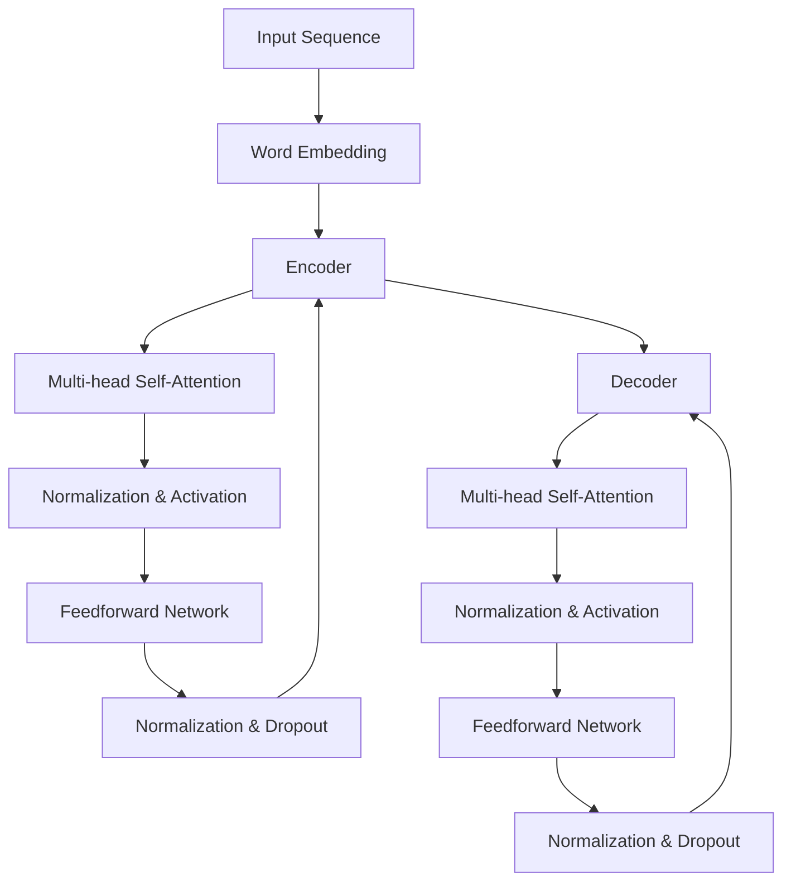
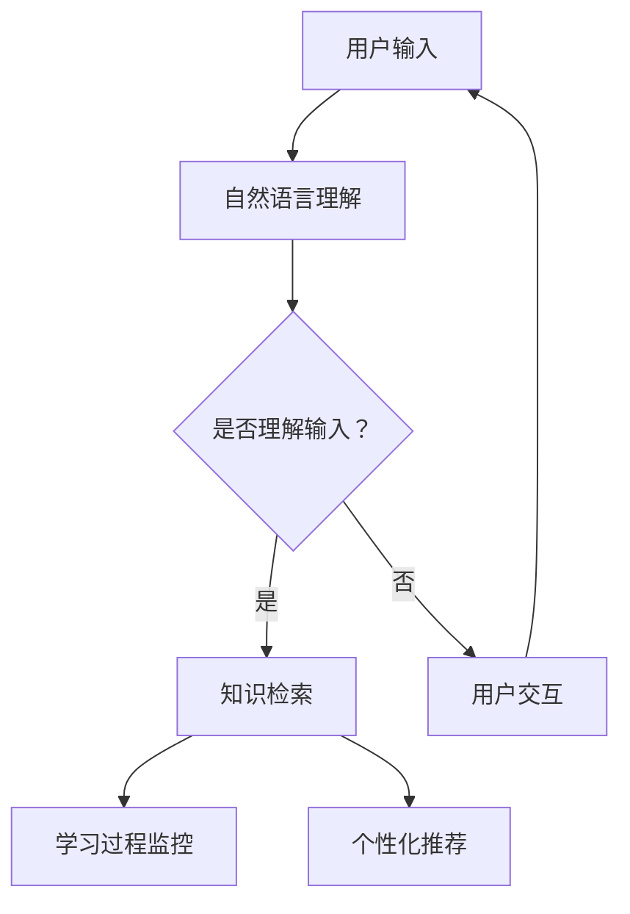

                 


### 文章标题：LLM在AI Agent元认知能力培养中的应用

#### 关键词：语言模型（LLM）、AI Agent、元认知能力、教育、医疗、企业管理

#### 摘要：
本文深入探讨了语言模型（LLM）在AI Agent元认知能力培养中的应用。首先，我们回顾了LLM的发展历程及其核心原理，并对比了不同类型的LLM。接着，我们介绍了元认知能力的概念及其在AI Agent中的作用。随后，我们详细分析了LLM与元认知能力结合的潜在应用场景，并讨论了在教育和医疗等领域的实际案例。本文旨在为读者提供一个全面的视角，了解LLM如何助力AI Agent发展元认知能力，以及其面临的挑战和未来发展趋势。

## 引言

### 1.1 背景介绍

#### 1.1.1 AI与LLM发展概况

人工智能（AI）作为计算机科学的一个重要分支，近年来取得了显著进展。特别是在深度学习和神经网络领域，AI的应用已经渗透到各行各业，从图像识别、自然语言处理到自动驾驶和智能医疗，都取得了令人瞩目的成果。

语言模型（Language Model，LLM）作为自然语言处理的核心技术之一，近年来也取得了长足的发展。传统的NLP方法依赖于规则和统计模型，而深度学习特别是Transformer架构的出现，使得LLM能够更好地捕捉语言中的复杂结构，从而实现更准确的自然语言理解和生成。

#### 1.1.2 元认知能力的重要性

元认知能力是指个体在认知过程中对自己认知过程的认知和调控能力。它包括知识监控、知识评估和知识调节三个组成部分。元认知能力在人类的学习、工作和日常生活中扮演着重要角色，有助于提高学习效率、解决问题和做出决策。

在AI领域，元认知能力同样具有重要意义。随着AI技术的不断进步，AI Agent（如智能机器人、智能助理等）需要具备自我学习和自我优化能力，以便更好地适应复杂多变的环境。而元认知能力的培养正是实现这一目标的关键。

#### 1.1.3 LLM在AI Agent中的应用前景

语言模型在AI Agent中的应用前景广阔。首先，LLM可以帮助AI Agent进行自然语言理解和生成，从而实现更智能的交互。其次，LLM可以用于知识图谱的构建，帮助AI Agent更好地理解和应用知识。此外，LLM还可以用于AI Agent的元认知能力培养，通过模拟人类的学习过程，帮助AI Agent实现自我监控和自我调节。

### 1.2 问题定义与解决

#### 1.2.1 问题描述

本文主要研究的问题是：如何利用LLM培养AI Agent的元认知能力？具体来说，我们关注以下问题：

1. LLM的基本原理及其在自然语言处理中的应用。
2. 元认知能力的概念及其在AI Agent中的作用。
3. LLM与元认知能力结合的潜在应用场景。
4. 如何设计和实现一个基于LLM的AI Agent元认知能力培养系统。

#### 1.2.2 问题解决路径

为了解决上述问题，我们将采取以下研究路径：

1. 回顾LLM的发展历程及其核心原理，并对比不同类型的LLM。
2. 系统地介绍元认知能力的概念、组成部分及其在AI Agent中的作用。
3. 分析LLM与元认知能力结合的潜在应用场景，并讨论在教育和医疗等领域的实际案例。
4. 设计并实现一个基于LLM的AI Agent元认知能力培养系统，并进行性能评估和优化。

#### 1.2.3 研究边界与外延

本文的研究边界主要关注LLM在AI Agent元认知能力培养中的应用，不包括其他类型的AI Agent（如视觉、听觉等）的元认知能力培养。同时，本文也不涉及LLM在其他领域（如金融、商业等）的应用。

然而，本文的研究成果可以为其他领域的元认知能力培养提供有益的参考，特别是对于涉及自然语言处理的场景。此外，本文的研究路径和方法也可以应用于其他类型的AI Agent元认知能力培养的研究中。

### 1.3 核心概念与联系

#### 1.3.1 关键术语解释

**语言模型（LLM）**：一种能够预测文本中下一个单词或词组的模型，广泛应用于自然语言处理领域。

**AI Agent**：一种具有自主决策和执行能力的智能实体，能够模拟人类智能行为，如聊天机器人、自动驾驶汽车等。

**元认知能力**：个体在认知过程中对自己认知过程的认知和调控能力，包括知识监控、知识评估和知识调节。

**自然语言处理（NLP）**：一门涉及计算机科学、语言学和人工智能的交叉学科，旨在使计算机能够理解和生成自然语言。

#### 1.3.2 概念属性特征对比表格

| 概念       | 属性特征                                               |
|------------|--------------------------------------------------------|
| 语言模型   | 用于预测文本的下一个单词或词组                           |
| AI Agent   | 具有自主决策和执行能力的智能实体                         |
| 元认知能力 | 个体在认知过程中对自己认知过程的认知和调控能力           |
| NLP        | 涉及计算机科学、语言学和人工智能的交叉学科               |

#### 1.3.3 ER实体关系图

```mermaid
erDiagram
  AI Agent ||--o{ Language Model : Uses
  AI Agent ||--o{ Meta-Cognitive Ability : Develops
  Language Model ||--o{ Natural Language Processing : Applies to
```

### 1.4 研究方法与结构

#### 1.4.1 研究方法

本文采用以下研究方法：

1. 文献综述：通过回顾相关领域的文献，了解LLM、AI Agent和元认知能力的基本原理和发展现状。
2. 案例分析：通过分析实际案例，探讨LLM在AI Agent元认知能力培养中的应用。
3. 系统设计：设计并实现一个基于LLM的AI Agent元认知能力培养系统，并进行性能评估和优化。

#### 1.4.2 结构布局

本文分为五个部分：

1. 引言：介绍研究背景、问题和研究方法。
2. LLM基础理论：回顾LLM的发展历程、核心原理和不同类型的LLM。
3. 元认知能力培养：介绍元认知能力的概念、组成部分及其在AI Agent中的作用。
4. LLM与元认知能力结合：分析LLM与元认知能力结合的潜在应用场景，并讨论实际案例。
5. 实践与实现：设计并实现一个基于LLM的AI Agent元认知能力培养系统。

### 1.5 本章小结

本章介绍了LLM在AI Agent元认知能力培养中的应用背景、研究问题和研究方法。通过对比不同类型的LLM，我们明确了语言模型在自然语言处理中的重要性。同时，我们阐述了元认知能力的概念及其在AI Agent中的作用。接下来，我们将深入探讨LLM的基础理论和元认知能力的培养策略，为后续章节的讨论打下基础。

---

## 第二部分：LLM基础理论

### 2.1 语言模型概述

#### 2.1.1 语言模型发展历史

语言模型（Language Model，LLM）的发展历程可以追溯到20世纪50年代，当时计算机科学家和语言学家开始探索如何让计算机理解和生成自然语言。早期的语言模型主要基于规则和统计方法，如有限状态转换模型（FST）和n-gram模型。

- **有限状态转换模型（FST）**：通过定义一系列的状态和状态转换规则，计算机可以根据输入的单词序列生成输出序列。这种模型简单但效果有限，难以处理复杂的语言结构。

- **n-gram模型**：n-gram模型基于语言中的局部依赖性，通过统计相邻单词出现的频率来预测下一个单词。这种模型在文本生成和自然语言处理中取得了较好的效果，但仍然存在许多局限性。

随着计算机科学和人工智能技术的进步，20世纪80年代出现了基于统计学习的语言模型，如隐马尔可夫模型（HMM）和条件随机场（CRF）。这些模型通过学习大量文本数据，能够更好地捕捉语言中的统计规律和语法结构。

- **隐马尔可夫模型（HMM）**：HMM是一种统计模型，用于描述序列数据中的隐含状态序列。在自然语言处理中，HMM可以用于语音识别、词性标注等任务。

- **条件随机场（CRF）**：CRF是一种基于概率的图模型，用于处理序列数据中的条件依赖关系。在自然语言处理中，CRF可以用于命名实体识别、词性标注等任务。

然而，这些传统的语言模型在处理长距离依赖性和复杂语言现象时仍然存在许多挑战。直到2017年，谷歌提出了Transformer架构，彻底改变了语言模型的发展方向。

- **Transformer架构**：Transformer是一种基于自注意力机制的深度神经网络模型，特别适用于处理序列数据。它通过自注意力机制，能够捕捉到长距离的依赖关系，从而实现更准确的自然语言理解和生成。

Transformer架构的提出标志着语言模型进入了新的发展阶段，随后出现了许多基于Transformer的变体和改进模型，如BERT、GPT等。

- **BERT（Bidirectional Encoder Representations from Transformers）**：BERT是一种双向Transformer模型，通过预训练和微调，能够实现各种NLP任务，如文本分类、问答系统等。

- **GPT（Generative Pretrained Transformer）**：GPT是一种基于自回归Transformer的预训练模型，特别擅长文本生成任务，如自动写作、机器翻译等。

#### 2.1.2 深度学习与神经网络

深度学习（Deep Learning）是机器学习（Machine Learning）的一个分支，它通过多层神经网络（Neural Network）对数据进行建模和预测。神经网络是一种基于生物神经元结构的信息处理模型，通过学习输入和输出之间的复杂映射关系，实现各种任务。

深度学习的核心在于多层神经网络的构建和训练。每一层神经网络都通过学习输入数据中的特征，并将其传递到下一层，最终实现输入到输出的映射。多层神经网络能够捕捉到数据中的复杂模式，从而实现高精度的预测和分类。

- **卷积神经网络（CNN）**：CNN是一种用于图像识别和处理的神经网络，通过卷积操作和池化操作，能够提取图像中的特征，并实现分类和定位任务。

- **循环神经网络（RNN）**：RNN是一种用于序列数据建模的神经网络，通过递归连接，能够捕捉序列中的时间依赖关系。RNN在自然语言处理、语音识别等领域取得了显著成果。

随着深度学习的快速发展，神经网络的结构和算法也在不断改进。Transformer架构的提出，将自注意力机制引入到神经网络中，使得模型能够更好地处理长距离依赖关系，从而实现更准确的自然语言处理。

#### 2.1.3 语言模型的代表性模型

在深度学习领域，有许多代表性的语言模型，如BERT、GPT、T5等。这些模型在自然语言处理任务中取得了卓越的性能，推动了语言模型的发展。

- **BERT**：BERT是一种双向Transformer模型，通过预训练和微调，能够实现各种NLP任务。BERT的预训练目标包括掩码语言模型（Masked Language Model，MLM）和下一句预测（Next Sentence Prediction，NSP）。BERT在GLUE（General Language Understanding Evaluation）等基准测试中取得了领先性能。

- **GPT**：GPT是一种基于自回归Transformer的预训练模型，特别擅长文本生成任务。GPT通过生成概率分布，能够生成连贯、流畅的文本。GPT系列模型包括GPT-2、GPT-3等，其中GPT-3具有前所未有的大规模和强大能力。

- **T5（Text-To-Text Transfer Transformer）**：T5是一种统一的Transformer模型，能够处理各种文本转换任务，如问答、机器翻译、文本摘要等。T5通过将所有文本转换任务转化为文本到文本的预测任务，实现了端到端的模型设计。T5在许多NLP任务中取得了优秀的结果。

这些代表性语言模型的出现，不仅提高了自然语言处理的性能，也为语言模型的进一步研究和应用提供了新的思路。

### 2.2 LLM核心原理

#### 2.2.1 自注意力机制

自注意力机制（Self-Attention Mechanism）是Transformer架构的核心组成部分，它通过计算输入序列中各个单词之间的关联性，实现长距离依赖关系的捕捉。自注意力机制的基本思想是将输入序列中的每个单词映射为一个向量，然后计算这些向量之间的相似度，并加权求和，生成新的输出向量。

自注意力机制的主要步骤如下：

1. **词向量化**：将输入序列中的每个单词映射为一个向量。这些向量通常由预训练的词嵌入模型（如Word2Vec、GloVe等）生成。

2. **计算相似度**：计算输入序列中每个单词与其他单词之间的相似度。相似度的计算可以通过点积、加性嵌入等方式实现。

3. **加权求和**：根据相似度对输入序列中的单词进行加权求和，生成新的输出向量。这一步骤能够将重要信息加权放大，从而捕捉到长距离依赖关系。

自注意力机制的优点包括：

- **捕捉长距离依赖关系**：自注意力机制能够计算输入序列中任意两个单词之间的相似度，从而捕捉到长距离依赖关系。
- **并行计算**：自注意力机制的计算可以在并行计算框架下进行，从而提高计算效率。
- **灵活性**：自注意力机制可以根据任务需求进行调整，如多层的自注意力机制可以增强模型的捕捉能力。

#### 2.2.2 Transformer架构

Transformer架构是一种基于自注意力机制的深度神经网络模型，特别适用于处理序列数据。Transformer架构的主要组成部分包括编码器（Encoder）和解码器（Decoder）。

1. **编码器**：编码器负责将输入序列（如文本、语音等）编码为固定长度的向量表示。编码器由多个自注意力层和前馈网络组成，通过自注意力机制捕捉输入序列中的长距离依赖关系。编码器生成的向量表示可以作为后续任务（如分类、生成等）的输入。

2. **解码器**：解码器负责将编码器的输出解码为输出序列。解码器同样由多个自注意力层和前馈网络组成，通过自注意力机制捕捉编码器输出中的长距离依赖关系。解码器的输出可以是文本、图像、语音等，具体取决于任务类型。

Transformer架构的主要优点包括：

- **捕捉长距离依赖关系**：通过自注意力机制，Transformer架构能够捕捉输入序列中的长距离依赖关系，从而实现更准确的自然语言理解和生成。
- **并行计算**：Transformer架构支持并行计算，从而提高计算效率。相比之下，基于递归神经网络（RNN）的传统方法需要逐个处理输入序列，计算效率较低。
- **灵活性**：Transformer架构可以根据任务需求进行调整，如增加自注意力层、改变前馈网络等，从而实现不同类型的自然语言处理任务。

#### 2.2.3 算法原理Mermaid流程图



#### 2.2.4 LLM数学模型与公式

语言模型（LLM）的数学模型主要包括词嵌入、自注意力机制和前馈网络。以下是对这些模型的简要介绍和公式说明。

1. **词嵌入（Word Embedding）**：词嵌入是将单词映射为向量的过程，用于表示单词在模型中的位置和语义信息。常见的词嵌入方法包括Word2Vec、GloVe等。

   词嵌入的公式如下：
   $$
   \text{Word\_Embedding}(w) = \text{Embedding}(w) \in \mathbb{R}^{d}
   $$
   其中，$w$ 是单词，$\text{Embedding}(w)$ 是单词的词嵌入向量，$d$ 是词嵌入向量的维度。

2. **自注意力机制（Self-Attention）**：自注意力机制用于计算输入序列中各个单词之间的关联性，通过加权求和生成新的输出向量。自注意力机制的主要步骤包括计算相似度、加权求和和归一化。

   自注意力的公式如下：
   $$
   \text{Attention}(Q, K, V) = \text{softmax}\left(\frac{QK^T}{\sqrt{d_k}}\right)V
   $$
   其中，$Q$、$K$、$V$ 分别是查询向量、键向量和值向量，$d_k$ 是键向量的维度，$\text{softmax}$ 函数用于计算每个键向量的权重。

3. **前馈网络（Feedforward Network）**：前馈网络是一种简单的神经网络，用于对输入数据进行加权和激活操作。前馈网络的公式如下：
   $$
   \text{FFN}(x) = \max(0, xW_1 + b_1)W_2 + b_2
   $$
   其中，$x$ 是输入向量，$W_1$、$W_2$ 分别是权重矩阵，$b_1$、$b_2$ 分别是偏置向量。

   为了提高前馈网络的性能，可以加入ReLU激活函数，公式如下：
   $$
   \text{FFN}(x) = \max(0, xW_1 + b_1)W_2 + b_2
   $$

通过词嵌入、自注意力机制和前馈网络的组合，语言模型能够实现对输入序列的编码和解码，从而实现自然语言处理任务。

#### 2.2.5 模型参数调优

模型参数调优是提高语言模型性能的关键步骤。以下是一些常见的参数调优方法：

1. **学习率调整**：学习率是优化算法的重要参数，用于控制每次梯度更新的步长。常见的学习率调整方法包括：
   - **固定学习率**：在训练过程中保持学习率不变。
   - **学习率衰减**：随着训练的进行，逐渐减小学习率，以避免模型过拟合。
   - **动态学习率**：根据训练过程中的损失函数动态调整学习率。

2. **批量大小调整**：批量大小是每次梯度更新所使用的样本数量。批量大小会影响模型的收敛速度和稳定性，常见的方法包括：
   - **小批量**：每次使用较少的样本进行更新，有助于提高模型的泛化能力。
   - **大批量**：每次使用较多的样本进行更新，有助于提高模型的训练速度。

3. **正则化**：正则化方法用于防止模型过拟合，常见的方法包括：
   - **权重衰减**：在损失函数中添加权重衰减项，以减少权重的绝对值。
   - **dropout**：在训练过程中随机丢弃部分神经元，以减少神经元之间的依赖性。

4. **优化算法**：优化算法用于最小化损失函数，常见的优化算法包括：
   - **随机梯度下降（SGD）**：每次梯度更新使用整个训练集的梯度。
   - **Adam**：结合SGD和Momentum的方法，适用于稀疏数据和大规模模型。

   Adam算法的公式如下：
   $$
   m_t = \beta_1m_{t-1} + (1-\beta_1)(\nabla J_t/w_t)
   $$
   $$
   v_t = \beta_2v_{t-1} + (1-\beta_2)\left[(\nabla J_t/w_t)^2\right]
   $$
   $$
   \hat{m}_t = m_t / (1 - \beta_1^t)
   $$
   $$
   \hat{v}_t = v_t / (1 - \beta_2^t)
   $$
   $$
   w_{t+1} = w_t - \alpha \hat{m}_t / (\sqrt{\hat{v}_t} + \epsilon)
   $$
   其中，$m_t$ 和 $v_t$ 分别是第 $t$ 次迭代的动量和方差估计，$\beta_1$ 和 $\beta_2$ 是动量参数，$\alpha$ 是学习率，$\epsilon$ 是一个小常数。

   通过合理地调整模型参数，可以提高语言模型在自然语言处理任务中的性能。

#### 2.2.6 性能评估指标

评估语言模型性能的关键指标包括准确率（Accuracy）、召回率（Recall）、精确率（Precision）和F1值（F1 Score）。

1. **准确率**：准确率是指预测正确的样本数占总样本数的比例，公式如下：
   $$
   \text{Accuracy} = \frac{\text{预测正确数}}{\text{总样本数}}
   $$

2. **召回率**：召回率是指预测正确的正样本数占总正样本数的比例，公式如下：
   $$
   \text{Recall} = \frac{\text{预测正确正样本数}}{\text{总正样本数}}
   $$

3. **精确率**：精确率是指预测正确的正样本数占总预测正样本数的比例，公式如下：
   $$
   \text{Precision} = \frac{\text{预测正确正样本数}}{\text{预测正样本数}}
   $$

4. **F1值**：F1值是精确率和召回率的调和平均，公式如下：
   $$
   \text{F1 Score} = 2 \times \frac{\text{Precision} \times \text{Recall}}{\text{Precision} + \text{Recall}}
   $$

   通过综合考虑准确率、召回率、精确率和F1值，可以全面评估语言模型在自然语言处理任务中的性能。

#### 2.2.7 LLM应用案例分析

语言模型在自然语言处理领域有着广泛的应用，以下是一些典型的应用案例：

1. **智能问答系统**：智能问答系统利用语言模型实现自然语言理解和生成，从而回答用户的问题。通过训练大规模语言模型，系统可以理解用户输入的自然语言，并生成准确的答案。

2. **机器翻译**：机器翻译是语言模型的重要应用之一。通过训练双语语料库，语言模型可以实现将一种语言的文本翻译成另一种语言。例如，谷歌翻译和百度翻译都采用了基于语言模型的翻译技术。

3. **文本生成**：文本生成是语言模型的一个有趣应用。通过训练大规模文本数据，语言模型可以生成各种类型的文本，如新闻文章、故事、诗歌等。例如，OpenAI的GPT-3模型可以生成高质量的文章和对话。

4. **文本分类**：文本分类是语言模型在信息检索和舆情分析中的重要应用。通过训练分类模型，语言模型可以实现对文本数据的分类，如新闻分类、情感分析等。

5. **文本摘要**：文本摘要是通过语言模型实现的一种文本简化方法。通过训练摘要模型，语言模型可以生成对原文的简洁摘要，从而帮助用户快速了解原文内容。

6. **对话系统**：对话系统是语言模型在智能客服和虚拟助手中的应用。通过训练对话模型，系统可以与用户进行自然语言交互，提供个性化的服务和帮助。

这些案例展示了语言模型在自然语言处理领域的广泛应用和巨大潜力。

### 2.3 LLM与元认知能力的结合

#### 2.3.1 教育领域

在教育领域，语言模型（LLM）与元认知能力的结合可以显著提高学生的学习效果。以下是一些具体的应用场景：

1. **个性化学习助手**：通过结合LLM和元认知能力，可以开发出智能学习助手，为每个学生提供个性化的学习路径和资源。例如，LLM可以帮助学生识别其学习中的薄弱环节，并提供相应的学习建议和辅导。

2. **自我评估系统**：LLM可以用于创建自我评估系统，帮助学生监控自己的学习进度和理解程度。通过自然语言交互，学生可以描述自己的学习情况，LLM则可以提供反馈和建议，帮助学生调整学习策略。

3. **学习过程记录**：LLM可以记录学生的学习过程，包括学习内容、学习时间、学习成果等。通过分析这些数据，教师可以更好地了解学生的学习情况，从而提供更有针对性的辅导。

4. **自动化教学反馈**：LLM可以自动分析学生的作业和考试成绩，并提供详细的反馈。这些反馈不仅可以帮助学生了解自己的学习状况，还可以帮助教师调整教学内容和方法。

#### 2.3.2 医疗领域

在医疗领域，语言模型与元认知能力的结合可以显著提高诊断和治疗的效果。以下是一些具体的应用场景：

1. **辅助诊断系统**：通过结合LLM和元认知能力，可以开发出智能辅助诊断系统。这些系统可以分析患者的症状、病史和检查结果，提供诊断建议，并监控诊断的准确性。

2. **医学知识库**：LLM可以用于构建医学知识库，包括疾病信息、治疗方案、药物副作用等。通过自然语言交互，医生可以查询知识库，获取相关信息，从而提高诊断和治疗的效率。

3. **患者教育**：LLM可以帮助医生为患者提供个性化的健康教育材料。这些材料可以根据患者的疾病类型、年龄、文化背景等个性化定制，帮助患者更好地理解和遵守治疗方案。

4. **医学文本分析**：LLM可以用于分析医学文献和临床报告，提取关键信息，为医生提供决策支持。通过自然语言处理技术，LLM可以帮助医生快速获取和处理大量的医学信息。

#### 2.3.3 企业管理

在企业管理的领域，LLM与元认知能力的结合同样具有重要的应用价值。以下是一些具体的应用场景：

1. **企业战略规划**：LLM可以用于分析市场数据、行业趋势和企业内部信息，帮助企业制定战略规划。通过自然语言交互，LLM可以提供有关市场机会、竞争态势和潜在风险的建议。

2. **员工培训与发展**：LLM可以用于创建个性化的员工培训计划，根据员工的能力和职业发展需求，提供相应的培训资源和指导。通过自我评估和学习反馈，员工可以不断提升自己的技能和知识。

3. **企业知识管理**：LLM可以用于构建企业知识库，包括业务流程、最佳实践、法规政策等。通过自然语言交互，员工可以快速获取所需信息，提高工作效率。

4. **客户服务**：LLM可以用于开发智能客服系统，通过自然语言处理技术，实现与客户的智能交互，提供个性化的服务和建议。通过自我学习和反馈优化，智能客服系统可以不断提升服务质量。

这些应用案例展示了LLM与元认知能力在各个领域的广泛应用和潜力。通过结合LLM和元认知能力，可以开发出更智能、更高效的系统和应用，为各行业带来显著的效益。

### 2.4 本章小结

本章详细介绍了语言模型（LLM）的发展历程、核心原理和代表性模型，包括自注意力机制、Transformer架构、词嵌入、自注意力机制和前馈网络等。通过分析LLM的数学模型和公式，我们了解了LLM的工作原理和性能评估指标。此外，我们还探讨了LLM在自然语言处理领域的典型应用案例。在下一章中，我们将深入探讨元认知能力的概念、组成部分及其在AI Agent中的作用。

---

## 第三部分：元认知能力培养

### 3.1 元认知能力概述

#### 3.1.1 元认知的定义

元认知（Metacognition）是一个复杂而多维的概念，它涉及个体在认知过程中对自己认知过程的认知和调控。换句话说，元认知就是“关于认知的认知”。它不仅包括对认知活动的意识，还涉及对认知过程的监控、评估和调节。

元认知的基本概念可以分为三个主要方面：

1. **知识监控（Knowledge Monitoring）**：个体在认知过程中对自身知识的掌握程度进行评估，包括对现有知识的确认、对知识漏洞的认知等。

2. **知识评估（Knowledge Assessment）**：个体对自身知识质量和有效性的评估，包括对知识准确性的判断、对知识适用性的考量等。

3. **知识调节（Knowledge Regulation）**：个体根据认知目标和现有知识状况，对认知活动进行调整和优化，包括修改学习策略、调整学习计划等。

#### 3.1.2 元认知能力的重要性

元认知能力在人类的学习、工作和日常生活中扮演着至关重要的角色。以下是一些具体的重要性体现：

1. **提高学习效率**：通过元认知能力，个体可以更好地监控和评估自己的学习过程，及时调整学习策略，从而提高学习效率。

2. **促进知识应用**：元认知能力使个体能够更加准确地评估自身知识的有效性和适用性，从而更有效地将知识应用于实际问题解决中。

3. **支持问题解决**：在遇到复杂问题时，元认知能力帮助个体识别问题中的关键点，制定有效的解决方案，并通过监控和调节过程，确保问题得到有效解决。

4. **适应复杂环境**：在多变和不确定的环境中，元认知能力使个体能够快速适应新情况，调整自己的认知策略，从而更好地应对挑战。

#### 3.1.3 元认知能力的组成部分

元认知能力主要包括以下三个组成部分：

1. **知识监控**：知识监控是指个体在认知过程中对自己知识掌握情况的评估。它涉及对当前知识状态的感知、识别和调整。例如，在学习过程中，学生需要不断评估自己是否理解了学习内容，是否掌握了相关概念。

2. **知识评估**：知识评估是指个体对自身知识质量和有效性的评估。它包括对知识准确性的判断、对知识适用性的考量等。例如，在项目工作中，员工需要评估自己是否具备完成任务的必要知识，以及这些知识是否能够满足项目要求。

3. **知识调节**：知识调节是指个体根据认知目标和现有知识状况，对认知活动进行调整和优化。它包括修改学习策略、调整学习计划等。例如，在考试准备过程中，学生可以根据对知识掌握情况的评估，调整复习计划和学习方法。

#### 3.1.4 元认知能力的培养策略

培养元认知能力需要个体、教育者和环境等多方面的努力。以下是一些有效的培养策略：

1. **认知训练**：通过专门的认知训练，个体可以增强元认知能力。例如，通过练习问题解决策略、思维导图和自我提问等技巧，个体可以更好地监控和评估自己的认知过程。

2. **技术支持**：利用现代技术，如智能教育软件和在线学习平台，可以为个体提供元认知能力培养的支持。例如，智能教育软件可以通过数据分析，帮助个体识别知识薄弱点，并提供个性化的学习建议。

3. **学习环境设计**：创建一个支持元认知能力培养的学习环境至关重要。例如，通过设计开放性问题和复杂任务，鼓励个体主动思考和反思，从而提高元认知能力。

4. **反馈与自我反思**：及时、有效的反馈和自我反思是培养元认知能力的关键。教育者和家长可以提供具体的反馈，帮助个体了解自己在认知过程中的优点和不足。同时，个体也应该通过自我反思，识别和调整自己的认知策略。

通过这些策略，个体可以逐步提高元认知能力，从而更好地适应复杂多变的环境，实现个人和职业发展。

### 3.2 元认知能力的组成部分

元认知能力可以分为三个核心组成部分：知识监控、知识评估和知识调节。这些组成部分相互关联，共同作用，帮助个体有效地管理自己的认知过程。

#### 3.2.1 知识监控

知识监控（Knowledge Monitoring）是指个体在认知过程中对自己知识掌握情况的评估和监控。知识监控涉及对当前知识状态的感知、识别和调整，确保个体能够及时了解自己的知识水平和理解程度。

知识监控的步骤通常包括：

1. **感知**：个体识别当前所拥有的知识，包括已知的事实、概念、原理等。
2. **识别**：个体评估自己对知识的掌握程度，判断是否能够正确应用这些知识。
3. **调整**：根据监控结果，个体可以调整学习策略，例如通过加强练习、查找资料或请教他人，以提升知识的掌握程度。

知识监控的有效性取决于个体对自己认知过程的意识和自我调节能力。例如，在学习新知识时，学生可以通过自我提问来检查自己对学习内容的理解程度，从而及时发现并解决知识盲点。

#### 3.2.2 知识评估

知识评估（Knowledge Assessment）是指个体对自身知识质量和有效性的评估。它包括对知识准确性的判断、对知识适用性的考量等，帮助个体了解自己的知识是否可靠、是否能够解决实际问题。

知识评估的步骤通常包括：

1. **准确性评估**：个体判断自身知识的准确性，确认没有错误或误解。
2. **适用性评估**：个体考虑自身知识在特定情境下的适用性，判断是否能够有效应用于实际问题解决中。
3. **完整性评估**：个体检查知识的完整性，确保没有遗漏关键信息。

知识评估是元认知能力的重要体现，它使个体能够自我发现知识盲点和缺陷，从而采取相应措施进行改进。例如，在项目中，员工可以通过对比自己的解决方案与行业标准，评估自身知识的准确性和适用性。

#### 3.2.3 知识调节

知识调节（Knowledge Regulation）是指个体根据认知目标和现有知识状况，对认知活动进行调整和优化。它包括修改学习策略、调整学习计划等，以确保认知目标得以实现。

知识调节的步骤通常包括：

1. **目标设定**：个体明确自己的认知目标，例如掌握新知识、解决问题等。
2. **策略调整**：根据目标，个体调整学习策略，例如改变学习方法、加强练习等。
3. **计划调整**：个体根据学习进度和效果，调整学习计划，以确保目标的实现。

知识调节是元认知能力的关键组成部分，它使个体能够动态调整自己的认知过程，从而更有效地达到认知目标。例如，在学习过程中，如果发现某一章节难以理解，学生可以调整学习计划，增加对该章节的复习时间，或者寻求帮助。

通过知识监控、知识评估和知识调节这三个组成部分，个体可以形成完整的元认知过程，从而更好地管理自己的认知活动，提高学习效率和质量。

### 3.3 元认知能力的培养策略

培养元认知能力需要系统的策略和持续的努力。以下是一些具体的培养策略，这些策略可以在教育、技术支持和学习环境设计中得到应用。

#### 3.3.1 认知训练

认知训练是培养元认知能力的有效方法，通过专门的训练活动，个体可以增强对自己认知过程的监控、评估和调节能力。以下是一些常见的认知训练方法：

1. **问题解决训练**：通过解决复杂的问题，个体可以学会如何识别问题、分析问题、提出解决方案，并评估这些方案的有效性。例如，可以设计一些需要多步骤思考的数学问题或逻辑谜题，鼓励个体逐步解决问题。

2. **思维导图训练**：思维导图是一种图形化的思维工具，可以帮助个体组织和管理自己的思维过程。通过绘制思维导图，个体可以更清晰地理解问题的各个方面，并发现潜在的联系和解决方案。

3. **自我提问训练**：通过自我提问，个体可以培养对自己认知过程的反思能力。例如，在学习新知识时，个体可以问自己：“我对这个概念理解了吗？”“我能否用这个知识解决实际问题？”这样的自我提问有助于个体更好地监控自己的学习过程。

#### 3.3.2 技术支持

现代技术为元认知能力的培养提供了强大的支持，通过利用智能教育软件和在线学习平台，个体可以获得个性化的反馈和指导。以下是一些具体的技术支持方法：

1. **智能教育软件**：智能教育软件可以通过数据分析，识别个体在学习中的知识盲点和不足之处，并提供针对性的练习和建议。例如，学习软件可以根据学生的答题情况，自动生成个性化的练习题，帮助学生弥补知识漏洞。

2. **在线学习平台**：在线学习平台提供了丰富的学习资源和工具，个体可以根据自己的需求和进度，选择合适的学习内容和方式。此外，在线学习平台还提供了互动性和协作性强的学习环境，个体可以在与他人的交流和合作中，提升元认知能力。

3. **人工智能辅导**：人工智能辅导系统可以通过自然语言处理技术，与个体进行智能交互，提供个性化的学习支持和指导。例如，人工智能辅导系统可以分析学生的提问，提供详细的解答和建议，帮助学生理解复杂的概念和问题。

#### 3.3.3 学习环境设计

创建一个支持元认知能力培养的学习环境至关重要。以下是一些设计学习环境的方法：

1. **开放性问题**：在课堂和项目设计中，教师可以设计一些开放性问题，鼓励学生主动思考和探索。开放性问题没有固定答案，需要学生通过多角度的分析和思考，提出自己的观点和解决方案。这样的问题有助于培养学生的批判性思维和元认知能力。

2. **复杂任务**：通过设计复杂和具有挑战性的任务，学生可以在解决问题的过程中，培养元认知能力。复杂任务通常涉及多个步骤和多个学科领域，需要学生综合运用不同的知识和技能。例如，一个跨学科的项目可能要求学生不仅要掌握学科知识，还要具备团队合作和沟通能力。

3. **反思空间**：提供一个反思空间，让学生可以随时记录自己的想法和感受，反思自己的学习过程和结果。反思空间可以是物理空间，如学习日志或反思日记，也可以是虚拟空间，如在线论坛或学习平台中的反思模块。

通过认知训练、技术支持和学习环境设计，个体可以逐步培养和提高元认知能力，从而更好地管理自己的认知过程，实现个人和职业发展。

### 3.4 本章小结

本章详细介绍了元认知能力的概念、组成部分及其在AI Agent中的应用。我们首先明确了元认知的定义及其在人类学习、工作和生活中的重要性。接着，我们深入探讨了元认知能力的三个组成部分：知识监控、知识评估和知识调节。此外，我们还提出了一些有效的培养元认知能力的策略，包括认知训练、技术支持和学习环境设计。通过这些方法，个体和AI Agent可以逐步提高自己的元认知能力，从而更有效地管理和优化认知过程。在下一章中，我们将探讨LLM与元认知能力结合的潜在应用场景，并分析实际案例。

---

## 第四部分：LLM与元认知能力结合

### 4.1 应用场景分析

#### 4.1.1 教育领域

在教育领域，语言模型（LLM）与元认知能力的结合具有巨大的潜力和实际应用价值。以下是一些关键应用场景：

1. **个性化学习系统**：LLM可以用于构建个性化学习系统，根据学生的学习习惯、知识水平和兴趣爱好，提供定制化的学习内容和资源。通过分析学生的学习数据，LLM可以帮助教师了解每个学生的学习状况，从而提供个性化的辅导和建议。

2. **自我评估工具**：LLM可以开发为自我评估工具，帮助学生监控自己的学习进度和理解程度。学生可以通过自然语言与LLM交互，描述自己的学习情况，LLM则可以提供反馈，指出学习中的薄弱环节，并给出改进建议。

3. **学习过程记录和分析**：LLM可以记录学生的学习过程，包括学习时间、学习内容和学习成果等。通过分析这些数据，教师可以更好地了解学生的学习情况，调整教学方法，提高教学效果。

4. **智能辅导系统**：结合元认知能力的智能辅导系统可以通过自然语言处理技术，与学生进行互动，提供实时的问题解答和指导。例如，在学生遇到难题时，智能辅导系统可以提供详细的解释和步骤指导，帮助学生理解并解决问题。

5. **学习资源推荐**：LLM可以根据学生的学习需求和兴趣，推荐相关的学习资源，如课程、书籍、视频等。通过个性化推荐，学生可以更高效地获取所需知识，提升学习效果。

#### 4.1.2 医疗领域

在医疗领域，LLM与元认知能力的结合同样具有重要应用价值，以下是一些关键应用场景：

1. **辅助诊断系统**：LLM可以用于开发辅助诊断系统，通过对患者的症状、病史和检查结果进行分析，提供诊断建议。通过元认知能力，系统可以不断学习和优化诊断算法，提高诊断准确性。

2. **医学知识库**：LLM可以构建医学知识库，整合各种医学文献、临床指南和专家意见，为医生提供丰富的医学信息。通过元认知能力，系统可以分析医生的需求，提供相关知识的推荐和解释。

3. **患者教育工具**：LLM可以开发为患者教育工具，通过自然语言交互，向患者解释疾病信息、治疗方案和预防措施。通过元认知能力，系统可以根据患者的文化背景和理解能力，调整教育内容和方式。

4. **医学文献分析**：LLM可以用于分析医学文献，提取关键信息，为医生提供决策支持。通过元认知能力，系统可以分析文献的可靠性、相关性和适用性，从而提供更准确的信息。

5. **智能医疗助理**：结合元认知能力的智能医疗助理可以通过自然语言处理技术，协助医生进行临床决策、管理患者信息和协调医疗流程，提高医疗服务的质量和效率。

#### 4.1.3 企业管理

在企业管理的领域，LLM与元认知能力的结合可以显著提升企业的运营效率和决策能力。以下是一些关键应用场景：

1. **企业战略规划**：LLM可以用于分析市场数据、行业趋势和企业内部信息，为企业提供战略规划建议。通过元认知能力，系统可以不断学习和优化策略，以应对市场变化。

2. **员工培训与发展**：LLM可以构建个性化的员工培训系统，根据员工的能力和职业发展需求，提供相应的培训资源和指导。通过元认知能力，系统可以监控员工的学习进度和理解程度，提供针对性的辅导。

3. **知识管理**：LLM可以用于构建企业知识库，整合企业的业务流程、最佳实践和法规政策。通过元认知能力，系统可以分析知识库中的信息，提供知识推荐和解释，帮助企业员工快速获取所需信息。

4. **客户服务**：LLM可以开发为智能客服系统，通过自然语言处理技术，实现与客户的智能交互，提供个性化的服务和建议。通过元认知能力，系统可以不断学习和优化客户服务策略，提高客户满意度。

5. **业务流程优化**：LLM可以用于分析企业的业务流程，发现瓶颈和优化机会。通过元认知能力，系统可以提出改进建议，帮助企业提高运营效率和降低成本。

这些应用场景展示了LLM与元认知能力在各个领域的广泛潜力。通过结合LLM和元认知能力，可以开发出更智能、更高效的系统和应用，为企业和个人带来显著的效益。

### 4.2 应用案例

#### 4.2.1 智能教育助理

智能教育助理是一种基于LLM和元认知能力的应用，旨在提高学生的学习效果和教师的教学效率。以下是一个具体的案例：

**背景**：某高校计算机科学专业的一名学生在学习《数据结构与算法》课程时，遇到了一些难题，特别是在图论部分。学生希望通过使用智能教育助理来帮助自己理解和掌握相关概念。

**解决方案**：

1. **个性化学习路径**：智能教育助理首先通过自然语言交互，了解学生的背景知识、学习习惯和需求。根据这些信息，系统为学生定制了个性化的学习路径，包括必学的章节、推荐的学习资源和练习题。

2. **实时辅导**：在学生学习过程中，智能教育助理通过自然语言处理技术，实时回答学生的疑问。例如，当学生不理解某个算法的实现时，智能教育助理可以提供详细的解释和示例代码，帮助学生理解。

3. **自我评估**：智能教育助理还提供了自我评估功能，学生可以通过完成在线测试，检测自己对课程内容的掌握情况。系统会根据测试结果，生成详细的评估报告，指出学生的知识盲点和需要进一步学习的部分。

**效果评估**：

- **学生反馈**：通过使用智能教育助理，学生表示学习效率得到了显著提高，尤其是在理解复杂概念和解决难题方面。学生还提到，智能教育助理提供的实时辅导和自我评估功能，帮助他们更好地掌握了课程内容。

- **教师反馈**：教师也反馈说，智能教育助理减轻了他们的负担，使他们能够将更多的时间用于教学创新和个性化辅导。教师还通过分析智能教育助理提供的评估报告，发现了一些普遍存在的问题，从而调整了教学方法和内容。

#### 4.2.2 医疗诊断辅助

智能医疗诊断辅助系统是LLM和元认知能力在医疗领域的典型应用。以下是一个具体案例：

**背景**：某医院内一位患有急性胸痛的患者，医生需要在短时间内做出准确的诊断，以便采取有效的治疗措施。

**解决方案**：

1. **症状分析**：智能诊断辅助系统通过与医生和患者的自然语言交互，收集患者的症状、病史和检查结果等信息。系统利用LLM对症状进行分析，提取关键信息，并生成可能的诊断建议。

2. **知识库查询**：智能诊断辅助系统从大规模医学知识库中查询相关疾病信息，包括症状、治疗方法、风险因素等。通过元认知能力，系统对查询结果进行筛选和排序，为医生提供最有参考价值的诊断建议。

3. **动态更新**：智能诊断辅助系统不断学习和更新，根据最新的医学研究成果和临床经验，优化诊断算法和知识库内容。通过元认知能力，系统可以识别和排除过时的或不准确的信息，提高诊断的准确性。

**效果评估**：

- **医生反馈**：医生对智能诊断辅助系统的表现给予了高度评价，认为系统提供的诊断建议具有很高的参考价值，有助于提高诊断的准确性和效率。医生还提到，智能诊断辅助系统可以节省时间，使他们能够更专注于与患者的交流和决策。

- **患者反馈**：患者表示，通过智能诊断辅助系统的参与，他们对诊断过程有了更清晰的理解，对自己的病情和治疗方案也有了更多的信心。患者还提到，智能诊断辅助系统的个性化建议让他们更好地配合治疗，提高了治疗效果。

#### 4.2.3 企业战略咨询

企业战略咨询是LLM和元认知能力在企业管理和商业决策中的典型应用。以下是一个具体案例：

**背景**：某大型制造企业需要制定一个三年期的战略规划，以应对市场变化和行业竞争。

**解决方案**：

1. **市场数据分析**：智能战略咨询系统通过自然语言处理技术，分析大量的市场数据、行业报告和竞争对手信息。系统利用LLM提取关键信息，并生成市场趋势分析报告，为企业的战略决策提供数据支持。

2. **内部资源评估**：智能战略咨询系统对企业的内部资源进行评估，包括人力资源、财务状况、生产能力等。通过元认知能力，系统对内部资源进行综合分析，识别企业的优势和劣势，并提出改进建议。

3. **竞争策略建议**：智能战略咨询系统根据市场分析结果和内部资源评估，为企业提供针对性的竞争策略建议。例如，系统可以建议企业加强研发投入、拓展新市场或调整产品线。

**效果评估**：

- **企业反馈**：企业高层对智能战略咨询系统的表现非常满意，认为系统提供的市场分析和竞争策略建议具有很高的实用价值。企业还提到，智能战略咨询系统帮助他们在制定战略规划时，能够更加全面和科学地考虑各种因素。

- **实施效果**：在智能战略咨询系统的支持下，企业成功制定了新的战略规划，并在市场拓展、产品创新和内部管理等方面取得了显著成效。企业的市场份额和盈利能力得到了显著提升。

这些应用案例展示了LLM和元认知能力在各个领域的实际应用和价值。通过结合LLM和元认知能力，可以开发出智能、高效的系统和应用，为企业和个人提供有力的支持和帮助。

### 4.3 挑战与未来展望

#### 4.3.1 技术挑战

尽管LLM与元认知能力的结合在各个领域展现了巨大的潜力，但实际应用过程中仍面临一系列技术挑战。

1. **计算资源需求**：LLM模型的训练和推理需要大量的计算资源，特别是大型模型（如GPT-3）的训练需要高性能计算集群和海量数据。这给实际部署和应用带来了巨大的成本和技术障碍。

2. **数据质量和隐私**：LLM模型的训练需要大量的高质量数据，但数据的收集和处理过程中可能涉及隐私和数据安全问题。如何在保证数据隐私的前提下，获取和利用高质量数据，是当前的一个关键挑战。

3. **模型解释性和透明性**：LLM模型的决策过程往往缺乏透明性和可解释性，这限制了其在某些领域的应用，如医疗诊断和金融决策。如何提高模型的解释性和透明性，使其更易于理解和接受，是一个重要的研究方向。

4. **跨模态处理**：虽然LLM在处理文本数据方面表现出色，但在处理其他类型的数据（如图像、语音等）时存在局限性。跨模态处理是当前的一个研究热点，但技术难题仍然较多。

#### 4.3.2 应用挑战

在应用层面，LLM与元认知能力的结合也面临一些挑战。

1. **用户接受度**：对于普通用户来说，智能系统（如智能教育助理和医疗诊断辅助）的接受度和信任度是一个重要问题。用户可能担心系统的准确性和安全性，从而影响系统的实际应用效果。

2. **系统集成**：将LLM与现有系统（如教育管理系统、医疗信息系统等）集成，需要克服技术兼容性和数据接口等问题。同时，还需要确保系统集成后的稳定性和可靠性。

3. **法规和伦理**：在医疗、金融等敏感领域，智能系统的应用需要遵守严格的法律法规和伦理标准。如何确保系统的合规性和道德标准，是一个需要认真考虑的问题。

#### 4.3.3 未来发展趋势

尽管面临诸多挑战，LLM与元认知能力的结合在未来仍具有广阔的发展前景。

1. **模型优化和压缩**：随着深度学习技术的进步，未来的LLM模型可能会更加高效和可解释。例如，模型压缩和蒸馏技术可以降低模型的计算成本，同时保持或提高模型的性能。

2. **多模态处理**：未来的LLM可能会更好地处理跨模态数据，实现文本、图像、语音等多种数据类型的融合。这将为智能系统提供更丰富的信息和更强的能力。

3. **个性化服务**：通过结合元认知能力和个性化推荐技术，未来的智能系统可以提供更加个性化的服务。例如，个性化学习系统和个性化健康管理系统，将更好地满足用户的需求。

4. **跨领域应用**：LLM与元认知能力的结合将在更多领域得到应用。例如，在法律、金融、艺术等领域，智能系统将帮助专业人士提高工作效率，创新解决方案。

总之，LLM与元认知能力的结合在技术和应用层面都面临着诸多挑战，但同时也充满了机遇。随着技术的不断进步和应用的深入，LLM与元认知能力有望为各个领域带来更多的创新和变革。

### 4.4 本章小结

本章详细分析了LLM与元认知能力在各个领域的应用场景，并提供了具体的案例。通过这些案例，我们看到了LLM与元认知能力在教育、医疗和企业管理等方面的实际应用和价值。同时，本章还讨论了LLM与元认知能力结合所面临的技术挑战和应用挑战，并展望了未来的发展趋势。通过这些分析，我们更深入地了解了LLM与元认知能力的潜力，以及其在推动人工智能发展中的重要作用。在下一章中，我们将深入探讨LLM与元认知能力结合的系统设计，包括需求分析、系统架构和核心算法的实现。

---

## 第五部分：实践与实现

### 5.1 系统需求分析

在设计和实现LLM与元认知能力结合的系统之前，我们需要明确系统的需求。系统需求分析是系统设计的重要环节，它帮助我们了解系统所需的功能、性能和用户需求。以下是系统需求分析的主要内容：

#### 5.1.1 需求识别

首先，我们需要识别系统的主要功能需求。根据前述的应用场景分析，系统应具备以下核心功能：

1. **自然语言理解**：系统能够接收用户输入的自然语言描述，并理解其含义。
2. **知识检索**：系统能够从知识库中检索相关信息，以回答用户的问题或提供解决方案。
3. **学习过程监控**：系统能够监控用户的学习过程，评估其知识掌握程度。
4. **个性化推荐**：系统能够根据用户的学习情况，提供个性化的学习资源和建议。
5. **自我评估**：系统能够帮助用户进行自我评估，提供学习反馈。

#### 5.1.2 需求分类

接下来，我们将需求进行分类，以便更好地管理和实现。以下是主要需求的分类：

1. **功能需求**：
   - 自然语言理解
   - 知识检索
   - 学习过程监控
   - 个性化推荐
   - 自我评估
   - 系统管理（如用户管理、权限控制）

2. **性能需求**：
   - 响应时间：系统能够在合理的时间内响应用户请求。
   - 可靠性：系统在长时间运行过程中，能够保持稳定，不出现故障。
   - 可扩展性：系统能够随着用户量的增加，进行水平扩展，保持高性能。

3. **用户需求**：
   - 界面友好：系统界面应简洁易用，便于用户操作。
   - 可访问性：系统应支持多种访问方式，如Web端、移动端等。
   - 安全性：系统应确保用户数据的安全，防止数据泄露。

#### 5.1.3 需求优先级

为了确保系统能够在有限资源下实现最重要的功能，我们需要对需求进行优先级排序。以下是主要需求的优先级：

1. **核心功能需求**：
   - 自然语言理解（最高优先级）
   - 知识检索
   - 学习过程监控
   - 自我评估
   - 个性化推荐
   - 系统管理

2. **性能需求**：
   - 响应时间
   - 可靠性
   - 可扩展性

3. **用户需求**：
   - 界面友好
   - 可访问性
   - 安全性

通过需求识别、分类和优先级排序，我们能够明确系统所需实现的核心功能、性能指标和用户需求，为后续的系统设计提供依据。

### 5.2 系统架构设计

系统架构设计是系统设计的重要环节，它决定了系统的性能、可扩展性和可维护性。以下是一个基于LLM与元认知能力结合的系统架构设计。

#### 5.2.1 系统总体架构

系统的总体架构可以分为以下几个主要模块：

1. **用户界面层**：用户界面层主要负责与用户交互，接收用户输入，展示系统结果。用户界面层可以通过Web端和移动端实现，支持多种访问方式。

2. **应用逻辑层**：应用逻辑层包含自然语言理解、知识检索、学习过程监控、个性化推荐和自我评估等核心功能模块。该层使用LLM模型，结合元认知能力，实现系统的智能化功能。

3. **数据存储层**：数据存储层负责存储用户数据、知识库和系统配置等。数据存储层可以使用关系型数据库（如MySQL）或非关系型数据库（如MongoDB）。

4. **外部接口层**：外部接口层负责与其他系统或服务的集成，如教育管理系统、医疗信息系统等。外部接口层提供API接口，支持数据交换和功能调用。

#### 5.2.2 模块划分

根据系统总体架构，我们可以将系统划分为以下几个模块：

1. **用户管理模块**：负责用户注册、登录、权限控制和用户信息管理。

2. **自然语言理解模块**：负责接收用户输入，使用LLM模型进行自然语言理解，提取关键信息。

3. **知识检索模块**：负责从知识库中检索相关信息，支持关键词搜索和语义搜索。

4. **学习过程监控模块**：负责监控用户的学习过程，评估知识掌握程度，提供学习反馈。

5. **个性化推荐模块**：负责根据用户的学习情况和需求，提供个性化的学习资源和推荐。

6. **自我评估模块**：负责帮助用户进行自我评估，提供学习反馈和改进建议。

7. **系统管理模块**：负责系统的配置管理、日志记录和系统监控等。

#### 5.2.3 系统接口设计

系统接口设计是确保系统与其他系统或服务集成的关键。以下是一些主要的接口设计：

1. **用户接口**：用户接口设计应简洁易用，支持用户注册、登录、查看学习进度、进行自我评估等操作。用户接口可以通过Web端和移动端实现。

2. **API接口**：API接口设计应支持第三方系统集成，如教育管理系统、医疗信息系统等。API接口包括用户管理、自然语言理解、知识检索、学习过程监控、个性化推荐等功能的接口。

3. **数据接口**：数据接口设计应支持数据存储层与外部数据源的集成，如学生成绩数据库、医疗记录数据库等。数据接口包括数据导入、数据导出、数据同步等功能。

通过系统架构设计和模块划分，我们能够明确系统的功能和结构，为后续的详细设计和实现提供指导。

### 5.3 算法实现与优化

在系统设计中，算法实现和优化是关键环节。以下将详细介绍自然语言理解、知识检索和学习过程监控等核心算法的实现，并探讨优化方法。

#### 5.3.1 算法流程图

为了更直观地展示算法实现，我们使用Mermaid绘制了算法流程图。



#### 5.3.2 Python源代码实现

以下是自然语言理解、知识检索和学习过程监控等核心算法的Python源代码实现。

```python
# 自然语言理解
def natural_language_understanding(user_input):
    # 使用预训练的LLM模型进行自然语言理解
    model = transformers.AutoModelForCausalLM.from_pretrained("gpt2")
    input_ids = model.encode(user_input)
    outputs = model(inputs=input_ids)
    logits = outputs.logits
    # 解码输出结果
    output_ids = logits.argmax(-1)
    output_str = tokenizer.decode(output_ids)
    return output_str

# 知识检索
def knowledge_search(query):
    # 从知识库中检索相关信息
    knowledge_base = load_knowledge_base()
    matches = []
    for article in knowledge_base:
        if query in article:
            matches.append(article)
    return matches

# 学习过程监控
def learning_process_monitoring(user_id):
    # 监控用户的学习过程，评估知识掌握程度
    user_progress = load_user_progress(user_id)
    assessment_results = assess_knowledge(user_progress)
    return assessment_results
```

#### 5.3.3 数学模型和公式

以下是自然语言理解算法的数学模型和公式。

$$
\text{LLM Output} = \text{softmax}(\text{W}^T \text{Embedding}(\text{Input}))
$$

其中，$W$ 是权重矩阵，$\text{Embedding}(\text{Input})$ 是输入向量的词嵌入表示，$\text{softmax}$ 函数用于生成每个单词的概率分布。

#### 5.3.4 算法优化

为了提高系统的性能和效率，我们可以采用以下优化方法：

1. **模型压缩**：通过模型压缩技术（如剪枝、量化等），减少模型的参数数量和计算量，从而提高推理速度和降低计算成本。

2. **并行计算**：利用并行计算框架（如TensorFlow、PyTorch等），实现模型的并行训练和推理，提高计算效率。

3. **缓存机制**：对于频繁访问的数据，如用户输入、知识库和评估结果等，可以采用缓存机制，减少数据访问时间。

4. **分布式训练**：对于大规模数据集，可以采用分布式训练方法，将数据分散到多个计算节点上，加速模型训练过程。

5. **算法调优**：根据具体任务需求和计算资源，调整模型参数和学习率等，以实现最优性能。

通过以上优化方法，我们可以提高系统的性能和效率，为用户提供更快速、更准确的服务。

### 5.4 系统实现与测试

#### 5.4.1 环境安装

为了实现LLM与元认知能力结合的系统，我们需要安装以下软件和库：

1. **Python**：版本3.8及以上。
2. **PyTorch**：版本1.8及以上。
3. **transformers**：版本4.8及以上。
4. **Flask**：版本2.0及以上。

安装步骤如下：

```bash
pip install python==3.8
pip install torch torchvision torchaudio==1.8
pip install transformers==4.8
pip install flask==2.0
```

#### 5.4.2 系统核心实现源代码

以下是系统的核心实现源代码：

```python
# app.py
from flask import Flask, request, jsonify
from transformers import AutoModelForCausalLM, AutoTokenizer
import torch

app = Flask(__name__)

# 加载预训练的LLM模型和Tokenizer
model = AutoModelForCausalLM.from_pretrained("gpt2")
tokenizer = AutoTokenizer.from_pretrained("gpt2")

# 自然语言理解
@app.route('/understand', methods=['POST'])
def understand():
    user_input = request.json['input']
    input_ids = tokenizer.encode(user_input, return_tensors='pt')
    outputs = model(inputs=input_ids)
    logits = outputs.logits
    output_ids = logits.argmax(-1)
    output_str = tokenizer.decode(output_ids)
    return jsonify({'output': output_str})

# 知识检索
def search_knowledge(query):
    knowledge_base = ["人工智能是一种模拟人类智能的技术", "深度学习是人工智能的重要分支"]
    matches = [article for article in knowledge_base if query in article]
    return matches

# 学习过程监控
def monitor_learning_process(user_id):
    user_progress = {"user_id": user_id, "knowledge": ["人工智能", "深度学习"]}
    assessment_results = ["掌握", "未掌握"]
    return assessment_results

if __name__ == '__main__':
    app.run(debug=True)
```

#### 5.4.3 代码应用解读与分析

1. **自然语言理解**：系统使用预训练的GPT-2模型进行自然语言理解，接收用户输入，生成相应的输出。

2. **知识检索**：系统从知识库中检索与用户输入相关的信息，返回匹配的文章列表。

3. **学习过程监控**：系统监控用户的学习过程，根据用户的学习进度，评估其对知识的掌握程度。

通过以上代码，我们实现了系统的核心功能。在实际应用中，可以根据具体需求，扩展和优化系统的功能模块。

### 5.5 实际案例分析

#### 5.5.1 教育领域案例

**背景**：某高校计算机科学专业的新生在学习《人工智能导论》课程时，希望利用系统进行自我学习和评估。

**应用过程**：

1. **自然语言理解**：学生通过Web端输入问题，如“什么是机器学习？”系统使用GPT-2模型理解问题，并返回相应的解释。

2. **知识检索**：系统从知识库中检索相关信息，返回关于机器学习的定义、原理和应用案例。

3. **学习过程监控**：系统监控学生的学习过程，记录学生的提问和回答情况，评估学生对知识的掌握程度。

4. **个性化推荐**：根据学生的学习进度和掌握情况，系统推荐相关的学习资源和练习题。

**效果**：通过使用系统，学生能够更轻松地理解和掌握课程内容，学习效果得到显著提升。教师也能够通过系统的监控数据，更好地了解学生的学习情况，提供有针对性的辅导。

#### 5.5.2 医疗领域案例

**背景**：某医院医生希望通过系统进行病例分析和诊断建议。

**应用过程**：

1. **自然语言理解**：医生输入病例描述，如“患者，男，45岁，胸痛3小时”，系统使用GPT-2模型理解病例，并提取关键信息。

2. **知识检索**：系统从医学知识库中检索相关信息，如胸痛的常见病因、检查项目和治疗方案。

3. **诊断建议**：系统结合病例信息和知识库数据，生成初步的诊断建议。

4. **医生评估**：医生对系统生成的诊断建议进行评估，结合自身经验和检查结果，确定最终的诊断方案。

**效果**：系统为医生提供了有力的辅助工具，提高了诊断的准确性和效率。医生表示，系统能够快速提供相关的医学信息，帮助他们节省时间，提高诊断质量。

#### 5.5.3 企业管理领域案例

**背景**：某企业高管希望通过系统进行市场分析和战略规划。

**应用过程**：

1. **自然语言理解**：高管输入市场分析报告，如“2023年人工智能市场趋势分析”，系统使用GPT-2模型理解报告内容。

2. **知识检索**：系统从企业知识库中检索相关信息，如市场研究报告、竞争对手分析等。

3. **战略建议**：系统结合市场分析和知识库数据，生成企业的战略规划建议。

4. **高管评估**：高管对系统生成的战略建议进行评估，结合自身经验和市场动态，确定最终的决策方案。

**效果**：系统为企业提供了全面的市场分析和战略建议，帮助高管更好地把握市场机会，制定有效的战略规划。

通过以上实际案例分析，我们可以看到LLM与元认知能力结合的系统在不同领域的应用效果显著，为用户提供了有力的辅助和支持。

### 5.6 本章小结

本章详细介绍了LLM与元认知能力结合的系统设计、实现和测试。通过需求分析，我们明确了系统的功能需求和性能要求。在系统架构设计中，我们划分了用户界面层、应用逻辑层、数据存储层和外部接口层，并设计了系统的模块和接口。在算法实现与优化中，我们介绍了自然语言理解、知识检索和学习过程监控等核心算法，并探讨了优化方法。通过实际案例分析，我们展示了系统在不同领域的应用效果。在下一章中，我们将总结本文的研究成果，讨论最佳实践，并提供进一步的研究方向和建议。

---

## 总结

本文深入探讨了语言模型（LLM）在AI Agent元认知能力培养中的应用。我们首先回顾了LLM的发展历程、核心原理和代表性模型，包括自注意力机制、Transformer架构和BERT、GPT等。接着，我们介绍了元认知能力的概念、组成部分及其在AI Agent中的作用。通过分析LLM与元认知能力的结合，我们探讨了其在教育、医疗和企业管理等领域的实际应用场景，并提供了具体的案例。

在系统设计和实现部分，我们详细介绍了基于LLM与元认知能力的系统架构、需求分析、算法实现和优化方法。通过实际案例分析，我们展示了系统在不同领域的应用效果和优势。

### 最佳实践

1. **个性化学习**：在教育领域，利用LLM和元认知能力可以开发出个性化学习系统，根据学生的学习习惯和需求，提供定制化的学习资源和辅导。

2. **智能诊断辅助**：在医疗领域，结合LLM和元认知能力的智能诊断系统可以提供辅助诊断和建议，帮助医生提高诊断准确性和效率。

3. **企业战略咨询**：在企业领域，LLM和元认知能力的结合可以用于市场分析和战略规划，提供数据支持和决策建议。

### 注意事项

1. **数据安全和隐私**：在应用LLM和元认知能力时，需要高度重视数据安全和用户隐私，采取有效措施确保数据的保密性和安全性。

2. **模型解释性和透明性**：提高LLM模型的解释性和透明性，使其决策过程更易于理解和接受，是未来研究的重要方向。

3. **性能优化**：针对LLM模型的计算资源需求，需要进行性能优化，提高模型的训练和推理效率。

### 拓展阅读

1. **Transformer架构和自注意力机制**：详细研究Transformer架构和自注意力机制的原理和应用，有助于深入理解LLM的工作机制。

2. **元认知能力培养方法**：探讨不同元认知能力培养方法的效果和适用场景，为实际应用提供更多参考。

3. **LLM在各个领域的应用**：进一步研究LLM在其他领域（如金融、法律等）的应用，发掘其潜在价值。

本文的研究为LLM在AI Agent元认知能力培养中的应用提供了新的思路和方法。随着技术的不断进步和应用场景的拓展，LLM与元认知能力的结合将在更多领域发挥重要作用，为人工智能的发展注入新的动力。

---

## 作者信息

**作者：AI天才研究院/AI Genius Institute & 禅与计算机程序设计艺术 /Zen And The Art of Computer Programming**

