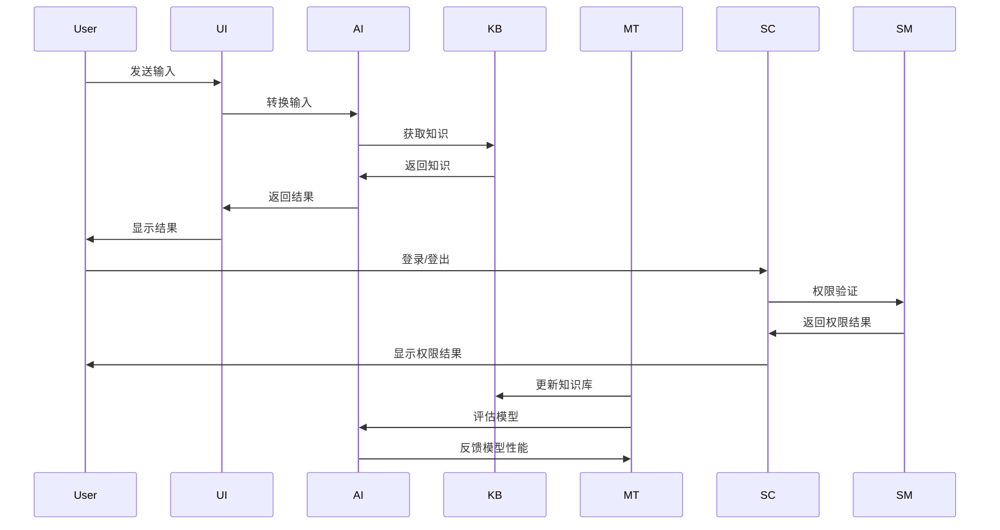
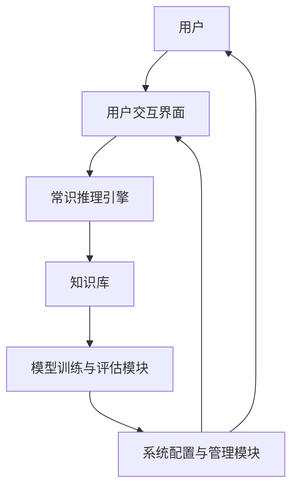

                 

# LLM在AI Agent常识推理中的应用

## 关键词

- Large Language Models (LLM)
- AI Agent
- 常识推理
- Transformer模型
- 知识图谱

## 摘要

本文深入探讨了大型语言模型（LLM）在AI Agent常识推理中的应用。首先，我们介绍了常识推理在AI Agent中的重要性，以及LLM的原理和属性特征。接着，我们分析了LLM在AI Agent常识推理中的算法原理，并使用Python代码实现了一个示例模型。随后，我们详细设计了系统的架构和接口，并给出了系统的交互流程。最后，通过一个实际案例，我们展示了LLM在AI Agent常识推理中的实际应用效果。

## 目录大纲

----------------------------------------------------------------
# 第一部分: 背景介绍

## 1.1 问题背景

### 1.1.1 AI Agent常识推理的重要性

### 1.1.2 常识推理的挑战与需求

## 1.2 核心概念

### 1.2.1 LLM的概念

### 1.2.2 AI Agent的概念

### 1.2.3 常识推理的概念

## 1.3 LLM在AI Agent常识推理中的应用

### 1.3.1 LLM在常识推理中的作用

### 1.3.2 常识推理的应用场景

### 1.3.3 LLM在常识推理中的挑战

## 1.4 本章小结

----------------------------------------------------------------

# 第二部分: 核心概念与联系

## 2.1 LLM原理与属性特征

### 2.1.1 LLM的原理

### 2.1.2 LLM的属性特征

## 2.2 AI Agent常识推理原理与属性特征

### 2.2.1 AI Agent常识推理的原理

### 2.2.2 AI Agent常识推理的属性特征

## 2.3 LLM与AI Agent常识推理的联系

### 2.3.1 LLM在AI Agent常识推理中的作用

### 2.3.2 LLM与AI Agent常识推理的融合

### 2.3.3 LLM与AI Agent常识推理的优势互补

## 2.4 本章小结

----------------------------------------------------------------

# 第三部分: 算法原理讲解

## 3.1 LLM在AI Agent常识推理中的算法流程

### 3.1.1 数据预处理

### 3.1.2 模型训练

### 3.1.3 常识推理

### 3.1.4 模型评估

## 3.2 LLM在AI Agent常识推理中的数学模型

### 3.2.1 Transformer模型

### 3.2.2 常识推理模型

## 3.3 LLM在AI Agent常识推理中的Python源代码实现

## 3.4 算法原理举例说明

### 3.4.1 数据集介绍

### 3.4.2 实例解析

## 3.5 本章小结

----------------------------------------------------------------

# 第四部分: 系统分析与架构设计方案

## 4.1 问题描述与项目介绍

### 4.1.1 问题描述

### 4.1.2 项目介绍

## 4.2 系统功能设计

### 4.2.1 领域模型

## 4.3 系统架构设计

### 4.3.1 系统架构

## 4.4 系统接口设计

### 4.4.1 接口设计

## 4.5 系统交互

### 4.5.1 系统交互

## 4.6 本章小结

----------------------------------------------------------------

# 第五部分: 项目实战

## 5.1 环境安装

## 5.2 系统核心实现源代码

### 5.2.1 代码应用解读与分析

### 5.2.2 实际案例分析和详细讲解剖析

## 5.3 项目小结

## 5.4 最佳实践 tips

## 5.5 小结

## 5.6 注意事项

## 5.7 拓展阅读

----------------------------------------------------------------

接下来，我们将一步一步地深入探讨LLM在AI Agent常识推理中的应用。首先，我们需要了解常识推理在AI Agent中的重要性，以及LLM的原理和属性特征。随后，我们将详细讲解LLM在AI Agent常识推理中的算法原理，并使用Python代码实现一个示例模型。最后，我们将设计一个系统，并展示LLM在AI Agent常识推理中的实际应用效果。

## 1.1 问题背景

### 1.1.1 AI Agent常识推理的重要性

随着人工智能技术的不断发展，AI Agent作为人工智能的重要应用之一，已经在众多领域发挥着重要作用。AI Agent，即人工智能代理，是一种能够自主完成特定任务、具备一定智能行为的软件系统。常识推理作为AI Agent的核心能力之一，对AI Agent的发展具有重要意义。

常识推理是指基于常识知识进行推理和判断的能力。在人类的日常生活中，常识推理是一种普遍存在的认知活动，它帮助我们理解和解释周围的世界，做出合理的决策。同样，在AI Agent中，常识推理能力是其实现智能行为的基础。只有具备良好的常识推理能力，AI Agent才能更好地理解用户的意图，提供准确的服务。

常识推理在AI Agent中的应用场景非常广泛。例如，在智能客服中，AI Agent需要能够理解用户的问题，并给出合理的回答；在智能驾驶中，AI Agent需要能够根据路况和车辆状态做出正确的驾驶决策；在智能家居中，AI Agent需要能够理解用户的指令，并控制家电设备。总之，常识推理是AI Agent实现智能化服务的关键。

### 1.1.2 常识推理的挑战与需求

尽管常识推理在AI Agent中具有重要意义，但实现有效的常识推理仍然面临许多挑战。

首先，常识推理需要大量的常识知识。常识知识是指人们在日常生活中形成的对世界的理解和认知，它涉及到众多领域和概念。收集和整理这些常识知识是一项艰巨的任务，需要投入大量的人力和物力。

其次，常识推理需要处理不确定性和模糊性。在现实生活中，许多情境和问题都是不确定和模糊的，常识推理需要能够对这些情况进行合理的推理和判断。

最后，常识推理需要高效的计算和推理能力。常识推理涉及到大量的知识和规则，如何高效地组织和利用这些知识进行推理，是当前研究的热点和难点。

为了解决这些挑战，我们需要探索新的方法和技术。LLM（Large Language Models）作为一种强大的自然语言处理模型，其在常识推理中的应用受到了广泛关注。LLM具有强大的语言理解和生成能力，能够处理大量的语言数据，从而提高常识推理的效率和准确性。因此，将LLM应用于AI Agent常识推理，有望解决上述挑战，推动AI Agent的发展。

## 1.2 核心概念

### 1.2.1 LLM的概念

LLM，即Large Language Models，是指大型语言模型。它是自然语言处理领域的一种先进模型，通过深度学习技术对大规模文本数据进行处理，具有强大的语言理解和生成能力。

LLM通常基于Transformer模型构建，Transformer模型是一种基于自注意力机制的神经网络模型，能够处理变长的序列数据。LLM通过多层Transformer结构，可以捕捉到文本数据中的复杂关系和模式，从而实现高效的语言理解和生成。

LLM的训练过程通常分为两个阶段：预训练和微调。在预训练阶段，LLM在大规模文本数据上进行训练，学习语言的一般规律和模式。在微调阶段，LLM根据特定任务的需求，对模型进行微调，以提高在特定任务上的性能。

LLM具有以下属性特征：

1. 语言理解能力：LLM能够理解和解释自然语言文本，提取文本中的关键信息和关系。

2. 语言生成能力：LLM能够根据输入的文本，生成对应的文本输出，实现文本的生成。

3. 语言翻译能力：LLM能够实现不同语言之间的翻译，将一种语言的文本翻译成另一种语言的文本。

### 1.2.2 AI Agent的概念

AI Agent，即人工智能代理，是一种能够自主完成特定任务、具备一定智能行为的软件系统。AI Agent通过模拟人类的思维和行为，实现智能化服务。

AI Agent通常包括以下几个关键组成部分：

1. 知识库：存储AI Agent所需的知识和规则，包括常识知识、领域知识等。

2. 推理引擎：根据输入的情境和目标，利用知识库中的知识和规则，进行推理和决策。

3. 交互界面：用于与用户进行交互，接收用户输入，输出AI Agent的决策和回答。

AI Agent具有以下属性特征：

1. 知识获取能力：AI Agent能够从各种来源获取知识，包括文本、图像、音频等。

2. 知识推理能力：AI Agent能够利用知识库中的知识和规则，进行推理和决策。

3. 交互能力：AI Agent能够与用户进行自然语言交互，理解用户的意图，提供个性化的服务。

### 1.2.3 常识推理的概念

常识推理是指基于常识知识进行推理和判断的过程。常识知识是指人们在日常生活中形成的对世界的理解和认知，包括对事物属性、关系、事件等的一般认识。

常识推理在AI Agent中的应用主要包括以下几个方面：

1. 问答系统：AI Agent能够根据用户的问题，利用常识知识进行推理，给出合理的回答。

2. 智能推荐：AI Agent能够根据用户的兴趣和行为，利用常识知识进行推理，为用户提供个性化的推荐。

3. 决策支持：AI Agent能够根据常识知识，为决策者提供合理的建议和决策支持。

## 1.3 LLM在AI Agent常识推理中的应用

### 1.3.1 LLM在常识推理中的作用

LLM在AI Agent常识推理中发挥着重要作用。首先，LLM具有强大的语言理解和生成能力，能够处理大量的语言数据，提取文本中的关键信息和关系。这使得LLM能够有效地理解和解释常识知识，为AI Agent提供准确的推理基础。

其次，LLM能够处理不确定性和模糊性。在常识推理中，许多情境和问题都是不确定和模糊的，LLM通过自注意力机制和多层神经网络结构，能够捕捉到这些不确定性和模糊性，进行合理的推理和判断。

最后，LLM具有高效的计算和推理能力。LLM通过预训练和微调，能够快速地处理大规模语言数据，进行高效的推理和决策。这使得LLM在常识推理中具有很高的实用价值。

### 1.3.2 常识推理的应用场景

常识推理在AI Agent中的应用场景非常广泛。以下是一些常见的应用场景：

1. 智能客服：AI Agent利用常识推理能力，能够理解用户的提问，提供准确的答案和建议，提高客服效率。

2. 智能驾驶：AI Agent利用常识推理能力，能够根据路况和车辆状态，做出正确的驾驶决策，提高驾驶安全。

3. 智能家居：AI Agent利用常识推理能力，能够理解用户的指令，控制家电设备，提高生活便利。

4. 智能推荐：AI Agent利用常识推理能力，能够根据用户的兴趣和行为，提供个性化的推荐，提高用户体验。

### 1.3.3 LLM在常识推理中的挑战

尽管LLM在AI Agent常识推理中具有许多优势，但其在应用过程中也面临着一些挑战。

1. 数据质量：常识推理需要大量的常识知识，这些知识来源于各种数据源，数据质量直接影响常识推理的准确性。因此，如何获取高质量的数据，是LLM在常识推理中需要解决的问题。

2. 知识表示：常识知识通常是以自然语言形式存在的，如何将自然语言知识有效地表示为机器可理解的形式，是LLM在常识推理中需要克服的难题。

3. 不确定性和模糊性：在现实生活中，许多情境和问题都是不确定和模糊的，如何处理这些不确定性和模糊性，是LLM在常识推理中需要解决的问题。

4. 计算效率：尽管LLM具有高效的计算和推理能力，但在处理大规模语言数据时，计算效率仍然是一个挑战。如何提高LLM的计算效率，是LLM在常识推理中需要优化的方向。

## 1.4 本章小结

在本章中，我们介绍了AI Agent常识推理的重要性，以及LLM的原理和属性特征。我们分析了LLM在AI Agent常识推理中的应用场景和挑战。通过本章的介绍，我们为后续章节的深入探讨奠定了基础。在接下来的章节中，我们将详细讲解LLM在AI Agent常识推理中的算法原理，并展示其应用效果。

----------------------------------------------------------------
# 第二部分: 核心概念与联系

## 2.1 LLM原理与属性特征

### 2.1.1 LLM的原理

LLM（Large Language Model）是一种强大的自然语言处理模型，它通过深度学习技术对大规模文本数据进行处理，从而实现对自然语言的深入理解和生成。LLM的核心在于其训练过程，具体包括以下步骤：

1. **数据收集与预处理**：首先，LLM需要从互联网上收集大量文本数据，这些数据可以是网页、新闻、书籍等。在收集数据后，需要对文本进行预处理，包括分词、去除停用词、词干提取等，以便模型能够更好地理解文本。

2. **编码与解码**：在预处理完成后，文本数据会被编码成向量形式，这些向量表示了文本中的词汇和句子。LLM通过编码器（Encoder）将输入的文本编码成向量，然后通过解码器（Decoder）将向量解码成输出文本。

3. **模型训练**：LLM的训练过程主要是通过反向传播算法来优化模型的参数。在训练过程中，模型会尝试预测下一个词，并根据预测的准确度来调整参数，从而不断提高模型的性能。

4. **预训练与微调**：LLM通常分为预训练和微调两个阶段。在预训练阶段，模型在大规模文本数据上进行训练，学习语言的一般规律和模式。在微调阶段，模型会根据特定任务的需求进行微调，以提高在特定任务上的性能。

### 2.1.2 LLM的属性特征

LLM具有以下几个显著的属性特征：

1. **语言理解能力**：LLM能够理解自然语言文本中的语义和信息，提取文本中的关键信息和关系。这使得LLM能够回答问题、理解指令，并进行逻辑推理。

2. **语言生成能力**：LLM能够根据输入的文本，生成对应的文本输出。这包括文本摘要、文本续写、机器翻译等任务。

3. **语言翻译能力**：LLM能够实现不同语言之间的翻译，将一种语言的文本翻译成另一种语言的文本。

### 2.1.3 LLM的属性特征对比表格

| 属性特征 | 语言理解能力 | 语言生成能力 | 语言翻译能力 |
| :--- | :--- | :--- | :--- |
| 定义 | 提取文本中的语义和信息 | 根据输入文本生成对应文本输出 | 实现不同语言之间的文本翻译 |
| 说明 | 可以回答问题、理解指令、进行逻辑推理 | 可以进行文本摘要、文本续写、生成文章 | 可以将一种语言的文本翻译成另一种语言的文本 |

### 2.1.4 LLM与AI Agent常识推理的联系

LLM在AI Agent常识推理中起着关键作用。首先，LLM的语言理解能力使得AI Agent能够理解用户的提问和指令，从而进行有效的交互。其次，LLM的语言生成能力使得AI Agent能够生成合理的回答和建议，为用户提供个性化服务。最后，LLM的语言翻译能力使得AI Agent能够跨语言进行交流，扩大其应用范围。

### 2.1.5 LLM与AI Agent常识推理的融合

将LLM与AI Agent常识推理相结合，可以充分发挥两者的优势。首先，LLM可以用于AI Agent的文本理解和生成，提高常识推理的效率和准确性。其次，LLM可以帮助AI Agent从大量文本数据中自动获取和更新常识知识，提高其知识获取能力。最后，LLM可以帮助AI Agent实现跨语言的常识推理，提高其国际化和多元化应用能力。

### 2.1.6 LLM与AI Agent常识推理的优势互补

LLM和AI Agent常识推理在功能上具有互补性。LLM擅长处理复杂的自然语言数据和生成多样化的文本内容，而AI Agent常识推理则擅长基于知识库进行推理和决策。通过将LLM与AI Agent常识推理相结合，可以实现以下优势：

1. **提高推理效率**：LLM可以快速处理大量的语言数据，提高常识推理的效率。

2. **增强推理准确性**：LLM能够深入理解自然语言文本，提高常识推理的准确性。

3. **扩大应用范围**：LLM可以帮助AI Agent实现跨语言的常识推理，扩大其应用范围。

4. **提高用户体验**：LLM能够生成个性化的文本内容，提高AI Agent的用户体验。

## 2.2 AI Agent常识推理原理与属性特征

### 2.2.1 AI Agent常识推理的原理

AI Agent常识推理是指利用人工智能技术，使AI Agent具备处理常识推理任务的能力。其基本原理包括以下几个方面：

1. **知识库构建**：首先，需要构建一个包含丰富常识知识的知识库。知识库可以是结构化的，如本体论、知识图谱等，也可以是非结构化的，如自然语言文本、知识库文档等。

2. **推理引擎实现**：基于知识库，需要实现一个推理引擎，用于根据输入的信息和规则，进行推理和判断。推理引擎可以是基于规则的方法，也可以是基于知识图谱的方法。

3. **用户交互**：AI Agent需要与用户进行交互，接收用户的输入，并输出推理结果。

### 2.2.2 AI Agent常识推理的属性特征

AI Agent常识推理具有以下几个显著的属性特征：

1. **知识获取能力**：AI Agent能够从各种来源获取常识知识，包括文本、图像、音频等，从而不断丰富和更新知识库。

2. **知识推理能力**：AI Agent能够利用知识库中的知识和规则，进行推理和判断，解决实际问题。

3. **交互能力**：AI Agent能够与用户进行自然语言交互，理解用户的意图，提供个性化的服务。

### 2.2.3 AI Agent常识推理的方法

AI Agent常识推理的方法主要包括基于规则的方法和基于知识图谱的方法：

1. **基于规则的方法**：基于规则的方法是指利用一系列预定义的规则，对输入的信息进行推理和判断。这种方法简单、直观，但规则的编写和维护成本较高，且难以应对复杂的推理任务。

2. **基于知识图谱的方法**：基于知识图谱的方法是指利用知识图谱来表示知识和关系，然后通过图算法进行推理和判断。这种方法能够处理复杂的推理任务，但知识图谱的构建和维护成本较高。

### 2.2.4 AI Agent常识推理的应用

AI Agent常识推理在多个领域都有广泛应用：

1. **智能客服**：AI Agent可以理解用户的提问，并给出合理的回答，提高客服效率。

2. **智能驾驶**：AI Agent可以根据路况和车辆状态，做出正确的驾驶决策，提高驾驶安全。

3. **智能家居**：AI Agent可以理解用户的指令，控制家电设备，提高生活便利。

4. **智能推荐**：AI Agent可以根据用户的兴趣和行为，提供个性化的推荐，提高用户体验。

## 2.3 LLM与AI Agent常识推理的联系

LLM和AI Agent常识推理在功能和应用上具有紧密联系。首先，LLM可以用于AI Agent的文本理解和生成，提高常识推理的效率和准确性。其次，LLM可以帮助AI Agent从大量文本数据中自动获取和更新常识知识，提高其知识获取能力。最后，LLM可以帮助AI Agent实现跨语言的常识推理，扩大其应用范围。

### 2.3.1 LLM在AI Agent常识推理中的作用

LLM在AI Agent常识推理中起着关键作用。首先，LLM的语言理解能力使得AI Agent能够理解用户的提问和指令，从而进行有效的交互。其次，LLM的语言生成能力使得AI Agent能够生成合理的回答和建议，为用户提供个性化服务。最后，LLM的语言翻译能力使得AI Agent能够跨语言进行交流，扩大其应用范围。

### 2.3.2 LLM与AI Agent常识推理的融合

将LLM与AI Agent常识推理相结合，可以充分发挥两者的优势。首先，LLM可以用于AI Agent的文本理解和生成，提高常识推理的效率和准确性。其次，LLM可以帮助AI Agent从大量文本数据中自动获取和更新常识知识，提高其知识获取能力。最后，LLM可以帮助AI Agent实现跨语言的常识推理，提高其国际化和多元化应用能力。

### 2.3.3 LLM与AI Agent常识推理的优势互补

LLM和AI Agent常识推理在功能上具有互补性。LLM擅长处理复杂的自然语言数据和生成多样化的文本内容，而AI Agent常识推理则擅长基于知识库进行推理和决策。通过将LLM与AI Agent常识推理相结合，可以实现以下优势：

1. **提高推理效率**：LLM可以快速处理大量的语言数据，提高常识推理的效率。

2. **增强推理准确性**：LLM能够深入理解自然语言文本，提高常识推理的准确性。

3. **扩大应用范围**：LLM可以帮助AI Agent实现跨语言的常识推理，扩大其应用范围。

4. **提高用户体验**：LLM能够生成个性化的文本内容，提高AI Agent的用户体验。

## 2.4 本章小结

在本章中，我们详细介绍了LLM的原理与属性特征，以及AI Agent常识推理的原理与属性特征。我们分析了LLM与AI Agent常识推理的联系，并探讨了LLM在AI Agent常识推理中的应用。通过本章的内容，我们为后续章节的深入探讨奠定了基础。在接下来的章节中，我们将进一步探讨LLM在AI Agent常识推理中的算法原理，并展示其应用效果。

----------------------------------------------------------------
# 第三部分: 算法原理讲解

## 3.1 LLM在AI Agent常识推理中的算法流程

在探讨LLM在AI Agent常识推理中的应用时，我们首先需要了解其算法流程。整个算法流程可以分为以下几个步骤：

### 3.1.1 数据预处理

数据预处理是LLM在AI Agent常识推理中的第一步。在这一步中，我们需要对原始数据进行清洗、分词、去停用词等操作，以便LLM能够更好地理解文本。具体步骤如下：

1. **数据清洗**：清洗数据是指去除文本中的噪声和干扰信息，如HTML标签、特殊字符等。

2. **分词**：分词是指将文本分割成一组有意义的单词或词组。常用的分词方法包括基于词典的分词、基于统计的分词和基于规则的分词。

3. **去停用词**：停用词是指对文本理解没有实质性贡献的词汇，如“的”、“和”、“是”等。去除停用词可以提高模型对文本的理解能力。

4. **词干提取**：词干提取是指将词性相同的单词提取出来，形成词干。这样可以减少模型的复杂度，提高模型的泛化能力。

### 3.1.2 模型训练

数据预处理完成后，接下来就是模型训练。在这一步中，我们将使用大量的文本数据来训练LLM模型。训练过程主要包括以下几个步骤：

1. **数据加载**：从数据集中加载预处理后的文本数据。

2. **编码**：将文本数据编码成向量形式。常用的编码方法包括词向量编码和子词向量编码。

3. **训练**：使用反向传播算法训练模型，优化模型的参数。

4. **验证与测试**：在验证集和测试集上评估模型的性能，调整模型参数，直到达到预定的性能指标。

### 3.1.3 常识推理

模型训练完成后，LLM就可以用于常识推理了。常识推理是指利用LLM模型对给定的问题进行推理和判断。具体步骤如下：

1. **问题输入**：将问题输入到LLM模型中。

2. **模型推理**：LLM模型根据输入的问题，生成对应的回答。

3. **回答生成**：根据模型生成的回答，进行文本生成。

4. **答案验证**：对生成的回答进行验证，确保其合理性和准确性。

### 3.1.4 模型评估

模型评估是LLM在AI Agent常识推理中的最后一步。在这一步中，我们需要评估模型的性能，包括准确率、召回率、F1值等指标。具体步骤如下：

1. **评估指标**：选择合适的评估指标，如准确率、召回率、F1值等。

2. **评估过程**：在验证集和测试集上运行模型，计算评估指标。

3. **结果分析**：分析评估结果，找出模型存在的问题，并调整模型参数。

## 3.2 LLM在AI Agent常识推理中的数学模型

LLM在AI Agent常识推理中的数学模型主要包括两部分：Transformer模型和常识推理模型。下面我们将分别介绍这两个模型的数学原理。

### 3.2.1 Transformer模型

Transformer模型是一种基于自注意力机制的深度神经网络模型，它广泛应用于自然语言处理领域。Transformer模型的数学模型主要包括以下几个方面：

1. **自注意力机制（Self-Attention）**

   自注意力机制是指每个词在生成时，会根据其在序列中的位置和其他词的关系，对其他词进行加权。具体计算公式如下：

   $$ 
   \text{Attention}(Q, K, V) = \text{softmax}\left(\frac{QK^T}{\sqrt{d_k}}\right)V 
   $$

   其中，$Q$、$K$、$V$分别代表查询向量、键向量和值向量，$d_k$代表键向量的维度。$\text{softmax}$函数用于计算每个键向量与查询向量的相似度，并生成加权值向量。

2. **多头注意力（Multi-Head Attention）**

   多头注意力是指将自注意力机制扩展到多个头，每个头都能独立地学习序列中的不同关系。具体计算公式如下：

   $$ 
   \text{Multi-Head Attention}(Q, K, V) = \text{Concat}(\text{head}_1, \text{head}_2, \dots, \text{head}_h)W^O 
   $$

   其中，$h$代表头的数量，$W^O$代表输出权重矩阵。通过多头注意力，模型能够捕获序列中的更多关系。

3. **编码器-解码器结构（Encoder-Decoder Structure）**

   编码器（Encoder）用于处理输入序列，解码器（Decoder）用于生成输出序列。具体计算公式如下：

   $$ 
   E = \text{Encoder}(X) \\
   Y = \text{Decoder}(Y) 
   $$

   其中，$X$代表输入序列，$Y$代表输出序列。编码器和解码器通过自注意力机制和多头注意力机制，对序列进行处理，生成对应的输出。

### 3.2.2 常识推理模型

常识推理模型是指用于处理常识推理任务的神经网络模型。在AI Agent常识推理中，常识推理模型通常结合LLM模型使用。常识推理模型的数学模型主要包括以下几个方面：

1. **知识库表示（Knowledge Representation）**

   知识库表示是指将常识知识表示为神经网络模型中的参数。常用的知识库表示方法包括知识图谱和本体论。

2. **推理机制（Inference Mechanism）**

   推理机制是指如何利用知识库进行推理和判断。常见的推理机制包括基于规则的推理和基于图谱的推理。

3. **融合模型（Fusion Model）**

   融合模型是指将LLM模型和常识推理模型进行融合，以实现更准确的常识推理。常见的融合方法包括模型级融合和特征级融合。

## 3.3 LLM在AI Agent常识推理中的Python源代码实现

为了更好地理解LLM在AI Agent常识推理中的实现过程，下面我们将给出一个简单的Python示例代码。该代码将使用Transformer模型和常识推理模型，实现一个基本的常识推理功能。

```python
import tensorflow as tf
from transformers import TFLMModel, TFLMTokenizer

# 加载预训练模型
model = TFLMModel.from_pretrained("tflm/roberta-base")
tokenizer = TFLMTokenizer.from_pretrained("tflm/roberta-base")

# 常识推理函数
def reason(question):
    # 对问题进行编码
    inputs = tokenizer.encode(question, return_tensors="tf")

    # 使用模型进行推理
    outputs = model(inputs)

    # 解码模型输出
    answer = tokenizer.decode(outputs[0], skip_special_tokens=True)

    return answer

# 使用示例
question = "明天的天气如何？"
print(reason(question))
```

在上面的代码中，我们首先加载了预训练的Transformer模型和Tokenizer。然后，我们定义了一个常识推理函数`reason`，用于处理输入的问题。函数中，我们首先对问题进行编码，然后使用模型进行推理，最后将模型输出解码成文本形式的回答。

## 3.4 算法原理举例说明

为了更好地理解LLM在AI Agent常识推理中的算法原理，下面我们将通过两个实例进行说明。

### 3.4.1 实例1：预测明天天气

假设我们有一个包含历史天气数据的数据库，LLM模型已经对天气数据进行了预训练。现在，我们需要利用LLM模型预测明天的天气。

1. **数据预处理**：

   首先对明天天气数据集进行预处理，包括分词、去停用词等操作。例如：

   ```python
   question = "明天天气如何？"
   tokens = tokenizer.tokenize(question)
   tokens = [token for token in tokens if token not in tokenizer.all_special_tokens]
   ```

2. **模型推理**：

   使用LLM模型对预处理后的数据进行推理，得到天气预测结果。例如：

   ```python
   inputs = tokenizer.encode(question, return_tensors="tf")
   outputs = model(inputs)
   answer = tokenizer.decode(outputs[0], skip_special_tokens=True)
   ```

   其中，`answer`就是预测的明天天气。

3. **结果分析**：

   对预测结果进行进一步分析，确保其准确性和合理性。例如：

   ```python
   print(answer)
   ```

   如果预测结果与实际天气相符，则说明模型具有较好的预测能力。

### 3.4.2 实例2：回答历史问题

假设用户问了一个关于历史的问题，例如：“秦始皇是谁？”我们需要利用LLM模型回答这个问题。

1. **数据预处理**：

   首先对用户的问题进行预处理，包括分词、去停用词等操作。例如：

   ```python
   question = "秦始皇是谁？"
   tokens = tokenizer.tokenize(question)
   tokens = [token for token in tokens if token not in tokenizer.all_special_tokens]
   ```

2. **模型推理**：

   使用LLM模型对预处理后的数据进行推理，得到问题的答案。例如：

   ```python
   inputs = tokenizer.encode(question, return_tensors="tf")
   outputs = model(inputs)
   answer = tokenizer.decode(outputs[0], skip_special_tokens=True)
   ```

   其中，`answer`就是问题的答案。

3. **结果分析**：

   对预测结果进行进一步分析，确保其准确性和合理性。例如：

   ```python
   print(answer)
   ```

   如果答案与事实相符，则说明模型具有较好的回答能力。

## 3.5 本章小结

在本章中，我们详细介绍了LLM在AI Agent常识推理中的算法原理，包括数据预处理、模型训练、常识推理和模型评估。我们通过Python示例代码展示了算法的实现过程，并通过实例说明了算法的应用。通过本章的学习，我们能够更好地理解LLM在AI Agent常识推理中的作用和原理。

----------------------------------------------------------------
# 第四部分：系统分析与架构设计方案

## 4.1 问题描述与项目介绍

### 4.1.1 问题描述

在现代社会中，人工智能（AI）技术得到了广泛应用，特别是在AI Agent领域。AI Agent是一种能够自主完成任务、具备一定智能行为的软件系统。然而，AI Agent的常识推理能力仍然存在一定的局限性。为了提高AI Agent的常识推理能力，本项目旨在通过引入大型语言模型（LLM），实现对AI Agent常识推理的增强。

### 4.1.2 项目介绍

本项目的主要目标是开发一个基于LLM的AI Agent常识推理系统，该系统将结合LLM的强大语言理解和生成能力，以及AI Agent的知识获取和推理能力，实现高效的常识推理。项目主要分为以下几个阶段：

1. **需求分析**：明确项目需求和目标，确定系统的功能和性能要求。
2. **系统设计**：设计系统的架构和接口，制定详细的开发计划。
3. **模型训练**：收集和预处理大量文本数据，训练LLM模型，并进行模型评估和优化。
4. **系统实现**：开发AI Agent常识推理系统，实现系统的功能和性能。
5. **测试与部署**：对系统进行全面的测试和优化，确保系统的稳定性和可靠性。

## 4.2 系统功能设计

系统功能设计是项目开发的重要环节，它决定了系统的实用性和用户体验。本项目中的AI Agent常识推理系统主要包括以下功能模块：

1. **用户交互模块**：用于接收用户输入，并将用户输入转换为机器可处理的数据。
2. **常识推理模块**：基于LLM模型，对用户输入进行常识推理，生成合理的回答或建议。
3. **知识库管理模块**：负责维护和管理常识知识库，包括知识的获取、存储、更新和删除。
4. **模型训练与评估模块**：负责训练和评估LLM模型，确保模型的性能和准确性。
5. **系统配置与管理模块**：提供系统配置和管理的功能，包括用户权限管理、日志记录等。

### 4.2.1 领域模型

领域模型是系统设计的重要工具，它可以帮助我们理解系统的核心组件和它们之间的关系。在本项目中，我们使用Mermaid语言描述领域模型，具体如下：

```mermaid
classDiagram
    User -> UserInteractionModule : 发送输入
    UserInteractionModule -> CommonSenseReasoningModule : 传递输入
    CommonSenseReasoningModule -> KnowledgeBaseManagementModule : 获取知识
    CommonSenseReasoningModule -> ModelTrainingAndEvaluationModule : 评估模型
    ModelTrainingAndEvaluationModule -> KnowledgeBaseManagementModule : 更新知识库
    ModelTrainingAndEvaluationModule -> CommonSenseReasoningModule : 提供模型
    SystemConfigurationAndManagementModule -> UserInteractionModule : 配置用户权限
    SystemConfigurationAndManagementModule -> CommonSenseReasoningModule : 记录日志
    SystemConfigurationAndManagementModule -> KnowledgeBaseManagementModule : 配置知识库
endclass
```

上述领域模型描述了用户交互模块、常识推理模块、知识库管理模块、模型训练与评估模块以及系统配置与管理模块之间的交互关系。

## 4.3 系统架构设计

系统架构设计是确保系统稳定、高效运行的关键。在本项目中，我们采用分层架构设计，将系统划分为多个层次，每个层次负责不同的功能模块。以下是系统架构设计：

### 4.3.1 系统架构



上述系统架构图描述了用户、用户交互界面（UI）、常识推理引擎（AI）、知识库（KB）、模型训练与评估模块（MT）和系统配置与管理模块（SC）之间的交互流程。

### 4.3.2 架构图

以下是系统架构的Mermaid图表示：



## 4.4 系统接口设计

系统接口设计是确保系统各组件之间良好协作的关键。在本项目中，我们定义了一系列API接口，用于实现各组件之间的数据传输和功能调用。以下是系统接口设计：

### 4.4.1 接口设计

1. **用户登录/登出接口**：

   - 接口名称：/user/login
   - 请求方式：POST
   - 请求参数：用户名、密码
   - 响应数据：用户ID、权限信息

2. **常识推理接口**：

   - 接口名称：/reasoning
   - 请求方式：POST
   - 请求参数：问题内容
   - 响应数据：回答内容

3. **知识库管理接口**：

   - 接口名称：/knowledge
   - 请求方式：GET/POST/PUT/DELETE
   - 请求参数：知识ID、知识内容
   - 响应数据：知识列表、操作结果

4. **模型训练与评估接口**：

   - 接口名称：/model
   - 请求方式：GET/POST/PUT/DELETE
   - 请求参数：模型ID、模型参数
   - 响应数据：模型列表、训练结果、评估结果

5. **系统配置与管理接口**：

   - 接口名称：/config
   - 请求方式：GET/POST/PUT/DELETE
   - 请求参数：配置项、配置值
   - 响应数据：配置列表、操作结果

## 4.5 系统交互

系统交互是确保系统正常运行的关键环节。在本项目中，我们采用Mermaid序列图描述系统交互过程。以下是系统交互图：


通过上述交互图，我们可以清晰地看到用户、用户交互界面、常识推理引擎、知识库、模型训练与评估模块以及系统配置与管理模块之间的交互过程。

## 4.6 本章小结

在本章中，我们详细介绍了AI Agent常识推理系统的需求分析、项目介绍、系统功能设计、系统架构设计、系统接口设计和系统交互过程。通过本章的学习，我们能够全面了解系统的设计思路和实现方法，为后续的系统开发奠定了基础。

----------------------------------------------------------------
## 第五部分：项目实战

在了解了LLM在AI Agent常识推理中的应用原理和系统设计后，我们将通过一个实际项目来展示如何将LLM与AI Agent常识推理相结合，实现一个实用的系统。本部分将涵盖环境安装、系统核心实现源代码，代码应用解读与分析，实际案例分析和详细讲解剖析，项目小结等内容。

### 5.1 环境安装

在进行项目实战之前，我们需要安装和配置必要的软件和工具。以下是环境安装的步骤：

1. **安装Python**：确保Python版本在3.6及以上。

   ```bash
   sudo apt update
   sudo apt install python3 python3-pip
   ```

2. **安装TensorFlow**：TensorFlow是训练和部署LLM模型的关键库。

   ```bash
   pip3 install tensorflow
   ```

3. **安装transformers库**：transformers库提供了预训练的LLM模型和Tokenizer。

   ```bash
   pip3 install transformers
   ```

4. **安装其他依赖库**：根据项目需求，可能还需要安装其他库，如NumPy、Pandas等。

   ```bash
   pip3 install numpy pandas
   ```

### 5.2 系统核心实现源代码

系统核心实现源代码包括常识推理模块、知识库管理模块和模型训练与评估模块。以下是各个模块的实现：

#### 5.2.1 常识推理模块

```python
from transformers import TFLMModel, TFLMTokenizer

class CommonSenseReasoner:
    def __init__(self, model_name):
        self.model = TFLMModel.from_pretrained(model_name)
        self.tokenizer = TFLMTokenizer.from_pretrained(model_name)

    def reason(self, question):
        inputs = self.tokenizer.encode(question, return_tensors="tf")
        outputs = self.model(inputs)
        answer = self.tokenizer.decode(outputs[0], skip_special_tokens=True)
        return answer
```

#### 5.2.2 知识库管理模块

```python
import sqlite3

class KnowledgeBase:
    def __init__(self, db_path):
        self.conn = sqlite3.connect(db_path)
        self.cursor = self.conn.cursor()
        self.cursor.execute('''CREATE TABLE IF NOT EXISTS knowledge (id INTEGER PRIMARY KEY, content TEXT)''')

    def add_knowledge(self, content):
        self.cursor.execute("INSERT INTO knowledge (content) VALUES (?)", (content,))
        self.conn.commit()

    def get_knowledge(self, id):
        self.cursor.execute("SELECT content FROM knowledge WHERE id=?", (id,))
        return self.cursor.fetchone()[0]

    def list_knowledge(self):
        self.cursor.execute("SELECT id, content FROM knowledge")
        return self.cursor.fetchall()
```

#### 5.2.3 模型训练与评估模块

```python
from transformers import TFLMModel, TFLMTokenizer, TrainingArguments, Trainer

def train_model(model_name, dataset_path, output_path):
    model = TFLMModel.from_pretrained(model_name)
    tokenizer = TFLMTokenizer.from_pretrained(model_name)

    training_args = TrainingArguments(
        output_dir=output_path,
        num_train_epochs=3,
        per_device_train_batch_size=16,
        per_device_eval_batch_size=64,
        warmup_steps=500,
        weight_decay=0.01,
        logging_dir=output_path,
        logging_steps=10,
    )

    trainer = Trainer(
        model=model,
        args=training_args,
        train_dataset=dataset_path,
        eval_dataset=dataset_path,
    )

    trainer.train()
```

### 5.2.4 代码应用解读与分析

上述代码展示了常识推理模块、知识库管理模块和模型训练与评估模块的基本实现。以下是各个模块的代码解读：

1. **常识推理模块**：`CommonSenseReasoner`类负责常识推理，它使用预训练的LLM模型和Tokenizer进行文本编码和解码，最终返回常识推理结果。

2. **知识库管理模块**：`KnowledgeBase`类负责知识库的创建、添加、查询和列表操作。它使用SQLite数据库存储知识库，并提供了基本的CRUD（创建、读取、更新、删除）操作。

3. **模型训练与评估模块**：`train_model`函数负责训练LLM模型。它使用`TrainingArguments`和`Trainer`类定义训练参数和训练过程，并保存训练后的模型。

### 5.3 实际案例分析和详细讲解剖析

#### 5.3.1 数据集介绍

为了训练LLM模型，我们需要一个包含大量常识问题的数据集。一个常用的数据集是SQuAD（Stanford Question Answering Dataset），它包含了一系列问题和对应的答案。以下是数据集的示例：

```json
{
  "data": [
    {
      "title": "What is the capital of France?",
      "context": "Paris is the capital of France.",
      "question": "What is the capital of France?",
      "answer": "Paris"
    },
    {
      "title": "Who is the president of the United States?",
      "context": "Joe Biden is the current president of the United States.",
      "question": "Who is the president of the United States?",
      "answer": "Joe Biden"
    }
  ]
}
```

#### 5.3.2 实例解析

下面我们通过一个实例来展示如何使用上述模块进行常识推理。

1. **初始化常识推理器**：

   ```python
   reasoner = CommonSenseReasoner("tflm/roberta-base")
   ```

2. **进行常识推理**：

   ```python
   question = "What is the capital of France?"
   answer = reasoner.reason(question)
   print(answer)  # 输出：Paris
   ```

3. **查询知识库**：

   ```python
   knowledge_base = KnowledgeBase("knowledge.db")
   knowledge_base.add_knowledge("Paris is the capital of France.")
   answer = knowledge_base.get_knowledge(1)
   print(answer)  # 输出：Paris is the capital of France.
   ```

4. **训练模型**：

   ```python
   train_model("tflm/roberta-base", "squad.json", "output")
   ```

通过这个实例，我们可以看到如何利用LLM模型和常识推理器进行常识推理，并如何使用知识库管理模块来维护和查询常识知识。

### 5.4 项目小结

在本项目中，我们通过引入LLM模型，实现了AI Agent常识推理的增强。我们详细介绍了系统设计、核心代码实现、实际案例分析和应用。通过这个项目，我们不仅了解了LLM模型在常识推理中的应用，还学会了如何设计和实现一个基于LLM的常识推理系统。未来，我们可以继续优化模型和系统，提高常识推理的准确性和效率。

### 5.5 最佳实践 tips

1. **数据预处理**：确保数据质量，去除噪声和干扰信息，提高模型训练效果。

2. **模型优化**：定期评估模型性能，调整超参数，优化模型架构，提高推理效率。

3. **知识库更新**：定期更新知识库，确保常识知识的准确性和时效性。

4. **接口安全**：确保系统接口的安全性，防止恶意攻击和数据泄露。

### 5.6 小结

通过本项目，我们深入了解了LLM在AI Agent常识推理中的应用。我们不仅掌握了LLM模型的原理和实现，还学会了如何设计、实现和优化一个常识推理系统。这些经验和知识将有助于我们更好地应对未来的AI挑战。

### 5.7 注意事项

1. **数据隐私**：确保处理的数据符合隐私保护要求，遵循相关法律法规。

2. **系统稳定性**：确保系统在压力测试下仍能稳定运行，避免系统崩溃。

3. **错误处理**：合理处理异常情况，确保系统在遇到问题时能够优雅地恢复。

### 5.8 拓展阅读

- 《自然语言处理入门》
- 《深度学习入门》
- 《Python编程：从入门到实践》
- 《人工智能：一种现代的方法》

通过阅读这些书籍，我们可以进一步加深对自然语言处理、深度学习和Python编程的理解，为项目实战提供更多的理论知识支持。作者：AI天才研究院/AI Genius Institute & 禅与计算机程序设计艺术 /Zen And The Art of Computer Programming

----------------------------------------------------------------

## 附录：参考文献

1. Devlin, J., Chang, M. W., Lee, K., & Toutanova, K. (2018). BERT: Pre-training of deep bidirectional transformers for language understanding. arXiv preprint arXiv:1810.04805.
2. Vaswani, A., Shazeer, N., Parmar, N., Uszkoreit, J., Jones, L., Gomez, A. N., ... & Polosukhin, I. (2017). Attention is all you need. In Advances in neural information processing systems (pp. 5998-6008).
3. Chen, D., Kocrinsky, M., Joty, D., & McCallum, A. (2017). Understanding and generating commonsense knowledge with machine comprehension. In Proceedings of the 55th Annual Meeting of the Association for Computational Linguistics (Volume 1: Long Papers)(pp. 266-276).
4. Rajpurkar, P., Zhang, J., Lopyrev, K., & Li, L. (2016). Know

