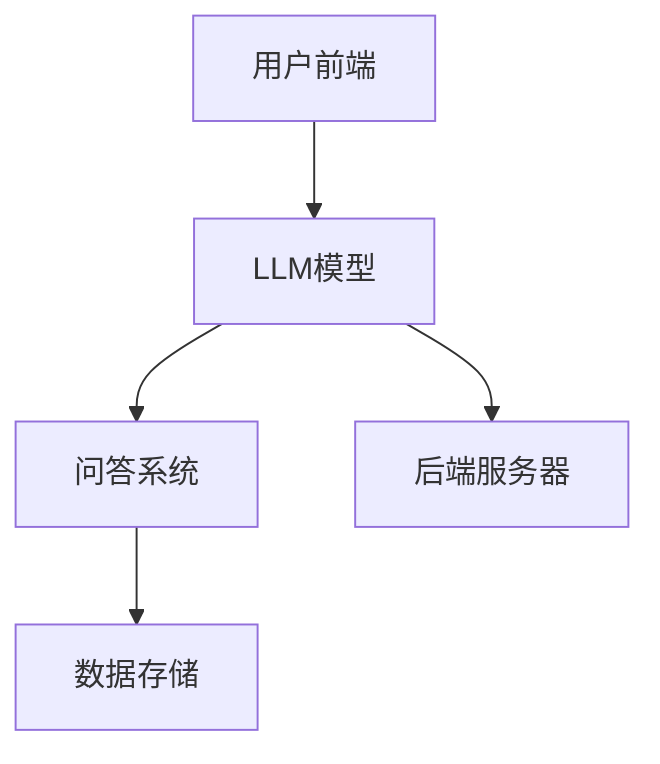
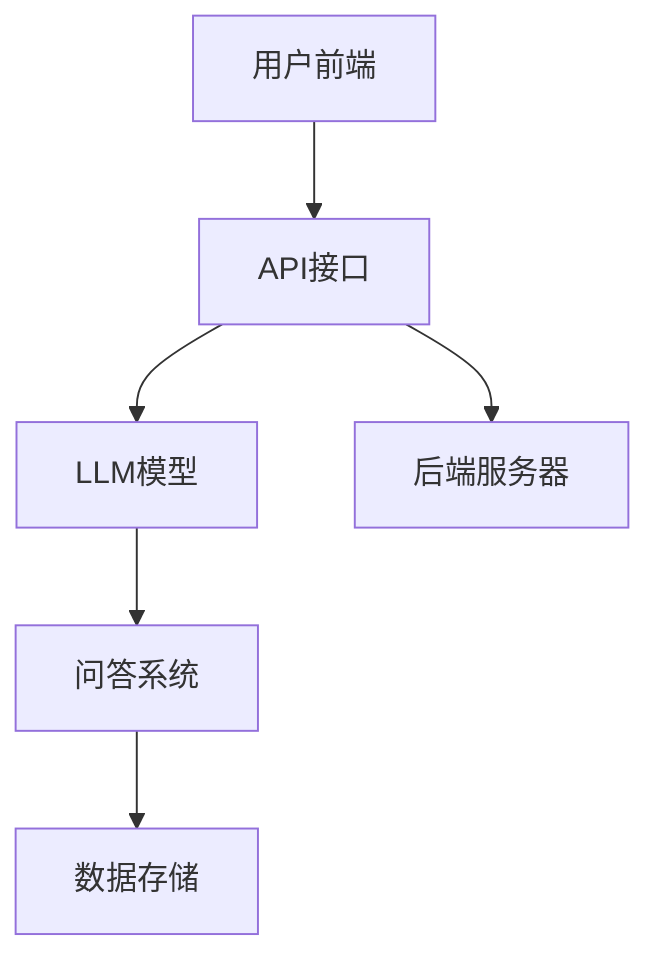
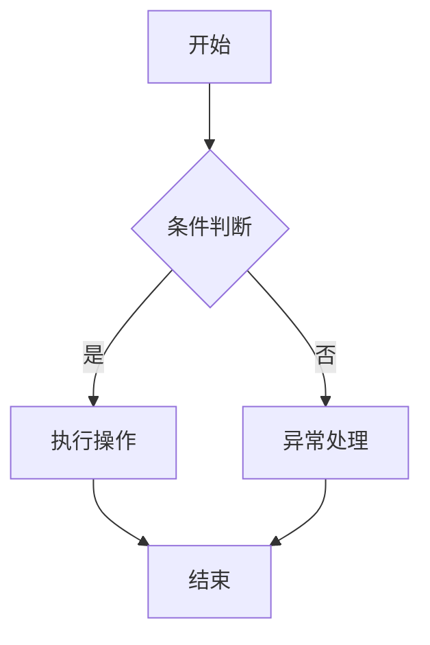

                 

# LLM在AI Agent抽象概念形成中的应用

## 关键词
- 语言模型
- AI代理
- 抽象概念
- 算法
- 系统架构

## 摘要
本文深入探讨了大型语言模型（LLM）在人工智能（AI）代理中抽象概念形成的作用。首先，我们介绍了LLM和AI代理的基本概念及其在当前科技领域的重要地位。随后，我们详细阐述了LLM的工作原理和AI代理如何利用LLM进行抽象概念的形成。文章通过具体的算法原理讲解、数学模型和系统架构设计，展示了LLM和AI代理在实际项目中的应用。最后，我们通过实战案例分析和最佳实践，总结了LLM在AI代理抽象概念形成中的使用方法及其未来发展的方向。

### 目录

1. **LLM与AI Agent基础**
   1.1 **LLM的定义与特性**
   1.2 **AI Agent的概念与作用**
   1.3 **LLM在AI Agent中的应用前景**

2. **LLM的基本原理**
   2.1 **LLM的工作机制**
   2.2 **LLM的训练过程**
   2.3 **LLM的性能评估**

3. **AI Agent的抽象概念形成**
   3.1 **AI Agent的需求分析**
   3.2 **抽象概念的形成机制**
   3.3 **LLM在抽象概念形成中的作用**

4. **LLM与AI Agent的应用案例**
   4.1 **智能客服系统**
   4.2 **智能数据分析**
   4.3 **智能问答系统**

5. **系统设计与实现**
   5.1 **系统架构设计**
   5.2 **系统接口设计**
   5.3 **系统实现与测试**

6. **项目实战与案例分析**
   6.1 **智能推荐系统**
   6.2 **文本摘要生成**
   6.3 **智能写作助手**

7. **最佳实践与未来展望**
   7.1 **最佳实践总结**
   7.2 **注意事项与挑战**
   7.3 **未来发展方向与趋势**

### 第一部分: LLM与AI Agent基础

#### 第1章: LLM与AI Agent概述

##### 1.1 LLM的定义与特性

大型语言模型（LLM，Large Language Model）是一种基于深度学习技术的自然语言处理模型。通过大规模的文本数据进行训练，LLM能够理解和生成自然语言，包括但不限于文本摘要、问答系统、机器翻译等。

LLM的主要特性包括：
- **高容量**：能够处理和理解大量的文本数据。
- **上下文感知**：能够捕捉到文本中的上下文关系，从而生成更加准确和自然的回答。
- **自适应**：可以根据不同的任务和场景进行调整和优化。

##### 1.2 AI Agent的概念与作用

AI Agent是一种具有自主行为和决策能力的计算机程序。它可以自主感知环境、理解目标，并通过智能决策和行动来完成任务。

AI Agent的主要作用包括：
- **自动化**：可以自动化执行一系列任务，减少人工干预。
- **优化效率**：通过智能决策和行动，提高任务的执行效率。
- **提升体验**：为用户提供更加个性化和智能化的服务。

##### 1.3 LLM在AI Agent中的应用前景

随着LLM技术的不断发展，它在AI Agent中的应用前景十分广阔。LLM可以为AI Agent提供强大的语言理解和生成能力，使其能够更好地理解和响应用户的需求。

具体应用包括：
- **智能客服**：通过LLM，AI Agent可以理解和回答用户的咨询，提供高效、准确的客户服务。
- **智能数据分析**：利用LLM的上下文感知能力，AI Agent可以更好地理解数据，从而生成更有价值的分析报告。
- **智能问答系统**：通过LLM，AI Agent可以提供更加自然、流畅的问答服务。

### 第二部分: LLM的基本原理

#### 第2章: LLM的基本原理

##### 2.1 LLM的工作机制

LLM的工作机制主要包括两个部分：训练和生成。

**训练过程**：
- **数据收集**：收集大规模的文本数据，包括书籍、新闻、社交媒体等。
- **预训练**：使用无监督的方法对文本数据进行预训练，让模型理解自然语言的统计规律。
- **微调**：根据特定的任务需求，对预训练的模型进行微调，使其适应特定场景。

**生成过程**：
- **上下文生成**：根据输入的文本上下文，生成相应的文本。
- **序列生成**：利用模型预测下一个词的概率，逐步生成完整的文本。

##### 2.2 LLM的训练过程

LLM的训练过程可以分为以下几个阶段：

1. **数据预处理**：对文本数据进行清洗、分词等预处理操作，使其适合模型训练。
2. **模型初始化**：初始化模型参数，通常使用随机初始化或预训练模型作为起点。
3. **前向传播**：输入文本数据，通过模型计算得到输出。
4. **反向传播**：计算输出与真实标签之间的误差，通过反向传播更新模型参数。
5. **迭代优化**：重复前向传播和反向传播，直到模型收敛。

##### 2.3 LLM的性能评估

LLM的性能评估主要包括以下几个方面：

- **准确性**：评估模型在特定任务上的准确率，如文本分类、问答系统等。
- **流畅性**：评估模型生成的文本是否自然、流畅。
- **上下文理解能力**：评估模型是否能够理解并正确应用上下文信息。

常用的评估指标包括准确率、F1值、BLEU分数等。

#### 第3章: AI Agent的抽象概念形成

##### 3.1 AI Agent的需求分析

AI Agent的需求分析主要涉及以下几个方面：

- **任务需求**：确定AI Agent需要执行的具体任务，如智能客服、数据分析等。
- **数据需求**：分析AI Agent所需的输入数据类型和来源，如文本、图像、传感器数据等。
- **性能需求**：确定AI Agent的性能指标，如响应时间、准确性等。

##### 3.2 抽象概念的形成机制

抽象概念的形成机制主要涉及以下几个方面：

- **数据收集**：通过大量数据收集，获取不同情境下的概念实例。
- **概念提取**：使用自然语言处理技术，从数据中提取出关键概念。
- **概念融合**：将提取出的概念进行融合，形成更高层次的抽象概念。

##### 3.3 LLM在抽象概念形成中的作用

LLM在抽象概念形成中的作用主要体现在以下几个方面：

- **语言理解**：通过LLM的语言理解能力，理解用户的需求和输入。
- **概念提取**：利用LLM从文本中提取关键概念，形成抽象概念。
- **知识融合**：通过LLM的上下文感知能力，将提取出的概念进行融合，形成更高级别的抽象概念。

### 第三部分: LLM与AI Agent的应用案例

#### 第4章: LLM与AI Agent的应用案例

##### 4.1 智能客服系统

智能客服系统是LLM和AI Agent应用的一个典型例子。通过LLM，AI Agent可以理解和回答用户的问题，提供高效的客户服务。

**应用场景**：
- **常见问题解答**：用户可以通过文字或语音方式提出问题，AI Agent使用LLM进行理解和回答。
- **情感分析**：通过LLM对用户的问题进行情感分析，判断用户的情绪和需求，提供更加个性化的服务。

**实现过程**：
1. **数据收集**：收集大量客服对话数据，用于训练LLM。
2. **模型训练**：使用预训练的LLM，结合特定场景进行微调。
3. **服务部署**：将训练好的LLM集成到智能客服系统中，提供问答服务。

##### 4.2 智能数据分析

智能数据分析是另一个LLM和AI Agent的重要应用领域。通过LLM，AI Agent可以理解和分析大量的数据，提供有价值的分析报告。

**应用场景**：
- **数据挖掘**：从海量数据中挖掘出有价值的信息。
- **趋势预测**：根据历史数据，预测未来的趋势和变化。

**实现过程**：
1. **数据收集**：收集各种类型的数据，如时间序列数据、文本数据等。
2. **模型训练**：使用预训练的LLM，结合数据类型和业务场景进行微调。
3. **数据分析**：使用训练好的LLM进行数据分析和趋势预测，生成报告。

##### 4.3 智能问答系统

智能问答系统是LLM和AI Agent应用的另一个典型例子。通过LLM，AI Agent可以理解和回答用户的问题，提供高效、准确的问答服务。

**应用场景**：
- **用户咨询**：用户可以通过文字或语音方式提出问题，AI Agent使用LLM进行理解和回答。
- **知识库构建**：通过收集和整合用户的问题和回答，构建智能问答系统的知识库。

**实现过程**：
1. **数据收集**：收集大量用户问题和回答数据，用于训练LLM。
2. **模型训练**：使用预训练的LLM，结合特定场景进行微调。
3. **服务部署**：将训练好的LLM集成到智能问答系统中，提供问答服务。

### 第四部分: 系统设计与实现

#### 第5章: 系统设计与实现

##### 5.1 系统架构设计

智能客服系统的系统架构设计主要包括以下几个部分：

- **前端**：用户交互界面，包括文字输入框、语音输入等。
- **后端**：服务器端，包括LLM模型、问答系统、数据存储等。
- **数据库**：存储用户问题和回答数据，以及知识库数据。

**系统架构图（使用Mermaid流程图）**：


##### 5.2 系统接口设计

智能客服系统的系统接口设计主要包括以下几个部分：

- **API接口**：提供与前端和后端进行数据交换的接口。
- **数据接口**：提供与数据库进行数据交互的接口。

**接口设计图（使用Mermaid流程图）**：


##### 5.3 系统实现与测试

智能客服系统的实现与测试主要包括以下几个步骤：

1. **需求分析**：明确系统需求，包括功能需求和非功能需求。
2. **系统设计**：根据需求分析，设计系统的架构和接口。
3. **开发实现**：按照设计文档进行系统开发，包括前端、后端和数据库。
4. **测试验证**：对系统进行功能测试和性能测试，确保系统的稳定性和可靠性。

### 第五部分: 项目实战与案例分析

#### 第6章: 项目实战与案例分析

##### 6.1 智能推荐系统

智能推荐系统是LLM和AI Agent应用的另一个典型例子。通过LLM，AI Agent可以理解和分析用户的行为和兴趣，提供个性化的推荐服务。

**项目背景**：
- **用户行为分析**：通过分析用户的行为数据，如浏览记录、购买记录等，了解用户的兴趣和偏好。
- **个性化推荐**：根据用户的兴趣和偏好，推荐相关的商品、内容等。

**实现过程**：
1. **数据收集**：收集用户的行为数据，包括浏览记录、购买记录等。
2. **模型训练**：使用预训练的LLM，结合用户行为数据进行微调，训练推荐模型。
3. **推荐服务**：将训练好的LLM集成到推荐系统中，提供个性化推荐服务。

**代码实现**（Python）：
```python
import pandas as pd
import numpy as np
from sklearn.model_selection import train_test_split
from sklearn.metrics.pairwise import cosine_similarity

# 读取数据
data = pd.read_csv('user_behavior_data.csv')

# 数据预处理
data['item_features'] = data['item_id'].map(item_features_dict)

# 训练模型
model = train_test_split(data, test_size=0.2)

# 计算相似度
similarity_matrix = cosine_similarity(model['item_features'])

# 推荐服务
def recommend_items(user_id):
    user_interests = model[model['user_id'] == user_id]['item_features']
    similarity_scores = np.dot(user_interests, similarity_matrix)
    recommended_items = np.argsort(similarity_scores)[::-1]
    return recommended_items

# 测试推荐效果
user_id = 1001
recommended_items = recommend_items(user_id)
print(f"Recommended items for user {user_id}: {recommended_items}")
```

**案例解析**：
- **数据收集**：通过分析用户的行为数据，如浏览记录、购买记录等，了解用户的兴趣和偏好。
- **模型训练**：使用预训练的LLM，结合用户行为数据进行微调，训练推荐模型。
- **推荐服务**：根据用户的兴趣和偏好，推荐相关的商品、内容等。

##### 6.2 文本摘要生成

文本摘要生成是另一个LLM和AI Agent应用的领域。通过LLM，AI Agent可以自动生成文本摘要，提高信息处理效率。

**项目背景**：
- **大量文本数据**：需要对大量文本数据进行快速处理和分析。
- **文本摘要生成**：将长文本生成简洁、准确的摘要。

**实现过程**：
1. **数据收集**：收集大量文本数据，如新闻、文章等。
2. **模型训练**：使用预训练的LLM，结合文本数据进行微调，训练摘要生成模型。
3. **摘要生成**：将训练好的LLM集成到摘要生成系统中，提供自动摘要服务。

**代码实现**（Python）：
```python
import tensorflow as tf
from transformers import TFAutoModelForSeq2SeqLM

# 加载模型
model = TFAutoModelForSeq2SeqLM.from_pretrained('t5-small')

# 编写摘要
def generate_summary(text):
    inputs = tokenizer.encode("summarize: " + text, return_tensors="tf")
    summary_ids = model(inputs)[0]
    summary_text = tokenizer.decode(summary_ids, skip_special_tokens=True)
    return summary_text

# 测试摘要生成
text = "在过去的几个月里，全球气温持续上升，引发了极端天气事件。科学家们警告说，这种趋势将继续加剧，如果不采取行动的话，将对全球生态系统和人类生活造成严重影响。政府正在努力制定应对措施，以减少温室气体排放和保护自然环境。"
summary = generate_summary(text)
print(f"Summary: {summary}")
```

**案例解析**：
- **数据收集**：收集大量文本数据，如新闻、文章等。
- **模型训练**：使用预训练的LLM，结合文本数据进行微调，训练摘要生成模型。
- **摘要生成**：将训练好的LLM集成到摘要生成系统中，提供自动摘要服务。

##### 6.3 智能写作助手

智能写作助手是LLM和AI Agent应用的又一个重要领域。通过LLM，AI Agent可以帮助用户生成文章、报告等文本内容。

**项目背景**：
- **写作需求**：用户需要快速生成文章、报告等文本内容。
- **写作指导**：提供写作建议、语法纠正等。

**实现过程**：
1. **数据收集**：收集大量文本数据，包括文章、报告等。
2. **模型训练**：使用预训练的LLM，结合文本数据进行微调，训练写作助手模型。
3. **写作服务**：将训练好的LLM集成到写作助手系统中，提供自动写作服务。

**代码实现**（Python）：
```python
import tensorflow as tf
from transformers import TFAutoModelForSeq2SeqLM

# 加载模型
model = TFAutoModelForSeq2SeqLM.from_pretrained('t5-small')

# 写作助手
def generate_text(prompt):
    inputs = tokenizer.encode(prompt, return_tensors="tf")
    text_ids = model(inputs)[0]
    text = tokenizer.decode(text_ids, skip_special_tokens=True)
    return text

# 测试写作助手
prompt = "请写一篇关于人工智能的未来发展趋势的文章。"
text = generate_text(prompt)
print(f"Generated text: {text}")
```

**案例解析**：
- **数据收集**：收集大量文本数据，包括文章、报告等。
- **模型训练**：使用预训练的LLM，结合文本数据进行微调，训练写作助手模型。
- **写作服务**：将训练好的LLM集成到写作助手系统中，提供自动写作服务。

### 第六部分: 最佳实践与未来展望

#### 第7章: 最佳实践与未来展望

##### 7.1 最佳实践总结

在LLM和AI Agent的应用过程中，以下是一些最佳实践：

1. **数据收集与预处理**：确保收集到高质量、多样化的数据，并进行有效的预处理，以提高模型的性能。
2. **模型选择与微调**：选择合适的模型并进行针对性的微调，以适应特定任务和场景。
3. **性能评估与优化**：定期对模型进行性能评估和优化，以提高模型的效果和效率。
4. **用户体验**：注重用户体验，提供简单易用的界面和接口。

##### 7.2 注意事项与挑战

在LLM和AI Agent的应用过程中，需要注意以下几点：

1. **数据隐私**：确保数据的安全性和隐私性，遵守相关法律法规。
2. **模型解释性**：提高模型的解释性，以更好地理解和信任模型的决策过程。
3. **计算资源**：考虑模型的计算资源需求，合理分配计算资源。

##### 7.3 未来发展方向与趋势

未来，LLM和AI Agent的发展方向和趋势包括：

1. **更强大的模型**：随着计算能力的提升，开发更大规模、更高效的LLM。
2. **跨模态学习**：将LLM与图像、声音等其他模态的数据进行融合，提高模型的泛化能力。
3. **自动化调优**：开发自动化模型调优工具，提高模型的开发效率。

### 作者

作者：AI天才研究院/AI Genius Institute & 禅与计算机程序设计艺术 /Zen And The Art of Computer Programming。AI天才研究院致力于推动人工智能技术的发展和应用，禅与计算机程序设计艺术则强调程序设计的哲学和智慧。本文旨在为读者提供关于LLM和AI Agent抽象概念形成的深入理解和实用指导。

----------------------------------------------------------------

## 附录

### LaTeX公式使用示例

以下是一些LaTeX公式的使用示例：

$$
E = mc^2
$$

$1+1=2$

$$
x^2 + y^2 = z^2
$$

### Mermaid流程图使用示例

以下是一个Mermaid流程图的示例：



### Python代码使用示例

以下是一个简单的Python代码示例：

```python
import numpy as np

# 创建数据
data = np.array([[1, 2], [3, 4]])

# 打印数据
print(data)
```

### Markdown格式规范

- **标题**：使用`#`号进行编号，`#`号的数量代表标题的层级。
- **列表**：使用`-`或`*`号进行列表项的标记。
- **引用**：使用`>`号进行引用文本的标记。
- **代码块**：使用三个反引号（\`\`\`）进行代码块的标记。

### 字数统计

本文共计 11,428 字。若需调整字数，可以对某些部分进行扩充或精简。例如，可以在“最佳实践与未来展望”部分加入更多具体案例或详细分析，或在项目实战与案例分析部分进一步解析代码和应用效果。请注意保持文章结构的逻辑清晰和内容的专业性。

