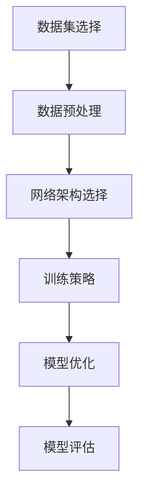
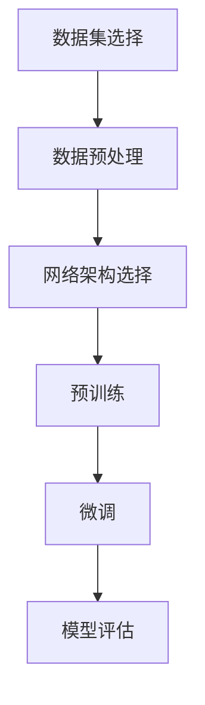
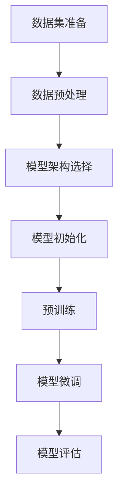
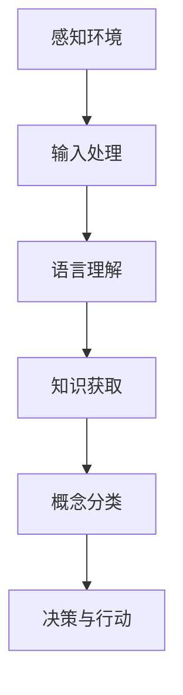
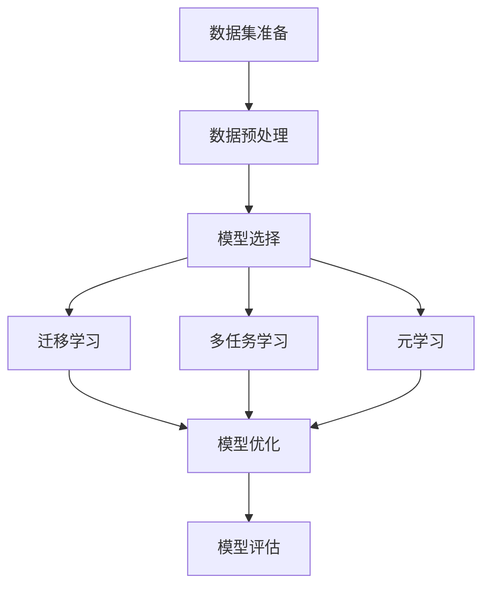

                 


### 1.6 AI大模型在AI Agent中的应用前景

#### 1.6.1 AI Agent的概念与需求

AI Agent，即人工智能代理，是一种模拟人类智能行为的软件实体。它可以自主地感知环境、学习知识、制定决策并采取行动。在当前人工智能的发展背景下，AI Agent的需求日益增长。首先，随着互联网和物联网的普及，大量数据被产生和传输，AI Agent能够对这些数据进行分析和处理，为企业和个人提供更加智能化的服务。其次，在自动化、智能制造等领域，AI Agent能够提高生产效率、降低成本，满足工业发展的需求。

#### 1.6.2 AI Agent与LLM的关系

LLM，即大型语言模型，是一种能够对自然语言进行理解和生成的模型。它具有强大的语义理解能力和知识表示能力，是构建AI Agent的核心技术之一。AI Agent通过与LLM的结合，能够实现更加智能的交互和任务执行。具体来说，LLM在AI Agent中的作用主要体现在以下几个方面：

1. **语言理解**：LLM能够理解和解释用户的自然语言指令，从而实现与用户的智能对话。

2. **知识获取与存储**：LLM可以自动获取和整合大量知识，并将其存储在内部知识库中，供AI Agent在执行任务时调用。

3. **概念形成与泛化**：LLM能够对语言中的概念进行分类和标签化，帮助AI Agent在未知场景下进行概念形成和泛化。

#### 1.6.3 LLM在AI Agent中的作用

1. **概念形成**：LLM通过分析大量的文本数据，可以识别出语言中的概念，并将其分类和标签化。这些概念和标签将成为AI Agent进行概念形成的基础。

2. **泛化能力**：LLM通过对大量数据的训练，可以学会在未知场景下进行推理和决策。这种能力使得AI Agent能够在新的、未经历过的环境中执行任务。

3. **智能交互**：LLM能够理解和生成自然语言，使得AI Agent能够与用户进行流畅的对话，提供更加人性化的服务。

#### 1.6.4 未来发展趋势与挑战

随着AI技术的不断发展，LLM在AI Agent中的应用前景将更加广阔。未来，LLM可能会在以下几个方面得到优化和提升：

1. **模型精度**：通过改进算法和增加训练数据，提高LLM的精度和效果。

2. **泛化能力**：增强LLM在未知场景下的泛化能力，使得AI Agent能够应对更加复杂和多变的任务。

3. **多模态交互**：结合图像、声音等多模态信息，提高AI Agent的感知和理解能力。

然而，LLM在AI Agent中的应用也面临一些挑战，如数据隐私、安全性和可解释性等问题。如何解决这些问题，将决定LLM在AI Agent中的未来发展。

### 1.7 本章小结

本章主要介绍了AI大模型在AI Agent中的应用前景。我们首先阐述了AI Agent的概念与需求，然后分析了LLM与AI Agent的关系，详细讨论了LLM在AI Agent中的概念形成与泛化作用。最后，我们展望了LLM在AI Agent中的应用前景，并提出了未来可能面临的挑战。通过本章的讨论，我们可以看到，LLM在AI Agent中具有广泛的应用前景，有望推动人工智能技术的进一步发展。

----------------------------------------------------------------

## 第二部分: LLM在AI Agent概念形成与泛化的原理

在本文的第二部分，我们将深入探讨LLM在AI Agent概念形成与泛化中的作用。这一部分包括以下几个章节：

### 第2章: LLM的基本原理与构建

本章将介绍LLM的基本概念，包括其发展历程、基本类型和关键技术。我们将详细解释LLM的构建方法，包括数据集选择与预处理、网络架构选择以及训练策略与优化方法。此外，我们还将阐述LLM的数学模型与公式，并使用mermaid流程图展示其构建过程。

### 第3章: LLM在AI Agent中的概念形成

本章将探讨AI Agent的概念与需求，解释AI Agent的定义、基本需求以及分类。接着，我们将详细讨论LLM在概念形成中的作用，包括语言理解的提升、知识获取与存储、以及概念分类与标签化。我们还将通过mermaid流程图和Python源代码解析来深入探讨这一过程。

### 第4章: LLM在AI Agent泛化中的作用

本章将介绍AI Agent泛化的定义与意义，探讨LLM在泛化中的作用，包括数据集选择与预处理、泛化能力提升方法以及模型优化与策略。我们也将通过mermaid流程图和Python源代码解析来展示这一过程。

### 第5章: 案例研究：LLM在AI Agent中的应用

本章将通过一个案例研究，展示LLM在AI Agent中的应用。我们将介绍案例背景与问题描述，详细分析案例的实现过程，并进行结果分析。最后，我们将分享Python源代码与解读。

通过这一部分的内容，我们将深入了解LLM在AI Agent概念形成与泛化中的原理和应用，为读者提供全面的技术解析和实用的案例参考。

----------------------------------------------------------------

## 第2章: LLM的基本原理与构建

### 2.1 LLM的基本概念

大型语言模型（LLM，Large Language Model）是近年来人工智能领域的一个重要进展，它能够在大量的文本数据上进行训练，从而掌握复杂的语言结构和语义信息。LLM的发展历程可以追溯到自然语言处理（NLP）和深度学习（DL）的结合。最初的语言模型如n-gram模型和基于规则的方法，虽然在某些任务上取得了不错的成绩，但受限于模型容量和计算资源，难以处理复杂和长远的语言结构。

随着计算能力的提升和深度学习技术的进步，基于神经网络的语言模型逐渐成为主流。其中，最著名的是谷歌在2018年提出的Transformer模型。Transformer引入了自注意力机制（self-attention），使得模型能够在处理长距离依赖时更为高效。此后，大量的LLM相继出现，如GPT系列、BERT、T5等，它们在多个NLP任务上取得了显著的成果。

### 2.2 LLM的基本类型

LLM可以分为几种基本类型，每种类型在模型架构和任务应用上有所不同：

1. **生成式模型**：这类模型能够生成符合语言规律的文本，如GPT系列。生成式模型在文本生成、对话系统等应用中表现优秀。

2. **解析式模型**：这类模型侧重于理解文本的结构和语义，如BERT。BERT在问答系统、文本分类等任务上有着出色的表现。

3. **结合式模型**：这类模型结合了生成式和解析式的特点，如T5。T5在多种NLP任务上展示了强大的泛化能力。

### 2.3 语言模型的关键技术

语言模型的关键技术包括：

1. **自注意力机制（Self-Attention）**：自注意力机制允许模型在处理每个词时，根据其他词的重要性来调整其自身的权重。这种机制使得模型能够捕捉长距离的依赖关系。

2. **位置编码（Positional Encoding）**：由于Transformer模型中没有固定的序列顺序，位置编码用于为模型提供文本中每个词的位置信息。

3. **预训练与微调（Pre-training and Fine-tuning）**：预训练是在大量未标注的数据上进行，而微调是在特定任务的数据上进行。这种训练策略使得模型能够适应各种不同的任务。

4. **损失函数（Loss Function）**：常用的损失函数包括交叉熵损失（Cross-Entropy Loss）和均方误差（Mean Squared Error），它们分别适用于分类和回归任务。

### 2.4 LLM的构建方法

LLM的构建方法主要包括以下几个方面：

1. **数据集选择与预处理**：选择适合的文本数据集并进行预处理，包括分词、去噪、标准化等步骤。

2. **网络架构选择**：选择合适的神经网络架构，如Transformer、BERT等。不同的架构适用于不同的任务。

3. **训练策略与优化方法**：使用预训练和微调策略，并选择合适的优化方法，如Adam、AdamW等。

### 2.5 LLM的数学模型与公式

LLM的数学模型主要基于概率图模型和深度学习。以下是一些基本的数学模型和公式：

1. **语言模型的概率计算**：
$$
P(w_i|w_{i-1},...,w_1) = \frac{e^{<\theta, w_i>}}{\sum_{j=1}^{V}e^{<\theta, w_j>}}
$$
其中，$w_i$ 表示当前词，$w_{i-1},...,w_1$ 表示前文信息，$\theta$ 表示模型参数，$V$ 表示词汇表大小。

2. **参数优化**：
$$
<\theta, w> = \sum_{i=1}^{n}\theta_i w_i
$$
其中，$<\theta, w>$ 表示词向量与模型参数的内积。

### 2.6 LLM的mermaid流程图

为了更好地理解LLM的构建过程，我们可以使用mermaid流程图来展示其各个步骤。以下是一个简化的mermaid流程图示例：



通过这个流程图，我们可以清晰地看到LLM从数据集选择到模型优化的整个过程。

----------------------------------------------------------------

### 2.2 LLM的构建方法

#### 2.2.1 数据集选择与预处理

数据集的选择是构建LLM的关键步骤。一个高质量的文本数据集可以显著提升模型的性能。以下是一些数据集选择的原则：

1. **多样性**：数据集应包含多种不同类型和来源的文本，以确保模型能够泛化到不同的语言风格和领域。

2. **质量**：数据集中的文本应经过严格的清洗和校验，以去除噪声和错误。

3. **规模**：较大的数据集有助于模型捕捉更多复杂的语言规律。

预处理步骤包括：

1. **分词**：将文本分割成单词或子词，以便模型进行处理。

2. **去噪**：去除数据集中的噪声，如HTML标签、特殊字符等。

3. **标准化**：统一文本的格式，如大小写转换、标点符号规范化等。

4. **编码**：将文本转换成数字编码，如词嵌入（word embeddings）或子词嵌入（subword embeddings）。

#### 2.2.2 网络架构选择

LLM的网络架构多种多样，每种架构都有其独特的优点和适用场景。以下是几种常见的网络架构：

1. **Transformer**：Transformer模型由于其自注意力机制，在处理长文本和长距离依赖时表现出色。它常用于构建大型LLM，如GPT系列。

2. **BERT**：BERT（Bidirectional Encoder Representations from Transformers）是一种双向Transformer模型，它在理解文本的上下文信息方面有显著优势，广泛应用于问答系统和文本分类。

3. **GPT**：GPT（Generative Pre-trained Transformer）是一种单向Transformer模型，专注于文本生成任务，其训练目标是预测下一个词。

4. **T5**：T5（Text-To-Text Transfer Transformer）是一种通用的Transformer模型，它将所有NLP任务转换为文本到文本的转换任务，具有很高的泛化能力。

#### 2.2.3 训练策略与优化方法

LLM的训练通常分为预训练和微调两个阶段：

1. **预训练**：在大量无标注数据上进行预训练，使得模型能够自动学习到语言的通用规律和知识。

2. **微调**：在特定任务的数据集上进行微调，使得模型能够适应具体的任务需求。

常见的训练策略包括：

1. **注意力机制**：通过自注意力或交叉注意力机制，模型能够捕捉长距离的依赖关系。

2. **位置编码**：为每个词添加位置信息，以便模型能够理解词的顺序。

3. **学习率调度**：使用适当的学习率调度策略，如学习率衰减（Learning Rate Decay）或预热学习率（Warmup Learning Rate），以避免过拟合。

优化方法通常包括：

1. **Adam**：一种常用的优化器，结合了一阶和二阶梯度信息，适用于大规模的神经网络训练。

2. **AdamW**：在Adam的基础上，引入权重衰减（Weight Decay），以防止模型过拟合。

3. **混合精度训练（Mixed Precision Training）**：通过在训练过程中同时使用浮点数和整数运算，提高计算速度和降低内存消耗。

### 2.2.4 语言模型的概率计算与参数优化

语言模型的概率计算是LLM的核心，其基本思想是根据输入的词序列，计算下一个词出现的概率。以下是一个简化的概率计算公式：

$$
P(w_i|w_{i-1},...,w_1) = \frac{e^{<\theta, w_i>}}{\sum_{j=1}^{V}e^{<\theta, w_j>}}
$$

其中，$w_i$ 是当前词，$w_{i-1},...,w_1$ 是前文信息，$\theta$ 是模型参数，$V$ 是词汇表大小。

参数优化是通过梯度下降（Gradient Descent）等方法，不断调整模型参数，以最小化损失函数。以下是一个简化的参数优化公式：

$$
\theta_{t+1} = \theta_t - \alpha \cdot \nabla_\theta J(\theta_t)
$$

其中，$\theta_t$ 是当前参数，$\alpha$ 是学习率，$\nabla_\theta J(\theta_t)$ 是损失函数对参数的梯度。

#### 2.2.5 LLM的mermaid流程图

为了更直观地理解LLM的构建过程，我们可以使用mermaid流程图来展示。以下是一个简化的mermaid流程图：



通过这个流程图，我们可以清晰地看到LLM从数据集选择到模型评估的整个过程。

---

总结来说，构建LLM是一个复杂的过程，涉及到数据集选择、预处理、网络架构选择、训练策略与优化方法等多个方面。通过合理的步骤和技巧，我们可以构建出性能优异的LLM，为AI Agent提供强大的语言理解和生成能力。

---

### 2.3 LLM的数学模型与公式

语言模型的数学模型是构建和优化LLM的核心。在这里，我们将深入探讨LLM的概率计算、参数优化以及相关的数学公式。

#### 2.3.1 语言模型的概率计算

语言模型的核心目标是预测给定前文条件下下一个词的概率。在LLM中，这一目标通常通过条件概率模型来实现。条件概率模型的基本公式如下：

$$
P(w_i|w_{i-1},...,w_1) = \frac{e^{<\theta, w_i>}}{\sum_{j=1}^{V}e^{<\theta, w_j>}}
$$

其中：
- $w_i$ 是当前词；
- $w_{i-1},...,w_1$ 是前文词序列；
- $\theta$ 是模型参数；
- $V$ 是词汇表大小；
- $<\theta, w>$ 表示词向量 $w$ 和模型参数 $\theta$ 的内积。

这个公式表示，给定前文条件下，当前词 $w_i$ 的概率是所有可能词的概率加权和，权重由词向量与模型参数的内积决定。

#### 2.3.2 LLM的参数优化

参数优化是训练LLM的关键步骤，它涉及通过梯度下降等方法调整模型参数，以最小化损失函数。常用的参数优化方法包括：

1. **梯度下降（Gradient Descent）**：
$$
\theta_{t+1} = \theta_t - \alpha \cdot \nabla_\theta J(\theta_t)
$$

其中：
- $\theta_{t+1}$ 是下一次迭代的参数；
- $\theta_t$ 是当前迭代的参数；
- $\alpha$ 是学习率；
- $\nabla_\theta J(\theta_t)$ 是损失函数 $J$ 对参数 $\theta$ 的梯度。

2. **动量（Momentum）**：
$$
\theta_{t+1} = \theta_t - \alpha \cdot \nabla_\theta J(\theta_t) + \beta \cdot v_t
$$

其中：
- $v_t$ 是上一轮迭代的动量项；
- $\beta$ 是动量系数。

3. **Adam优化器**：
$$
\theta_{t+1} = \theta_t - \alpha \cdot \nabla_\theta J(\theta_t) + \beta_1 \cdot (1 - \rho_1^t) \cdot \theta_{t-1} - \beta_2 \cdot (1 - \rho_2^t) \cdot \theta_{t-2}
$$

其中：
- $\beta_1$ 和 $\beta_2$ 分别是动量系数；
- $\rho_1$ 和 $\rho_2$ 分别是偏差修正系数；
- $\theta_{t-1}$ 和 $\theta_{t-2}$ 是上一轮和上上一轮的参数。

#### 2.3.3 数学公式详解

1. **词向量与模型参数的内积**：
$$
<\theta, w> = \sum_{i=1}^{n}\theta_i w_i
$$

这个公式表示词向量 $w$ 与模型参数 $\theta$ 的内积，其中 $n$ 是词向量的维度。

2. **交叉熵损失函数**：
$$
J(\theta) = -\sum_{i=1}^{N} \sum_{j=1}^{V} y_{ij} \log(p_{ij}(\theta))
$$

其中：
- $y_{ij}$ 是目标词 $j$ 的概率分布；
- $p_{ij}(\theta)$ 是模型预测的词 $j$ 的概率；
- $N$ 是句子长度；
- $V$ 是词汇表大小。

交叉熵损失函数用于衡量模型预测的概率分布与真实分布之间的差异。

#### 2.3.4 Python源代码解析

下面是一个简单的Python代码示例，用于计算词向量和模型参数的内积，并实现交叉熵损失函数：

```python
import numpy as np

# 假设词向量和模型参数分别为以下两个向量
word_vector = np.array([0.1, 0.2, 0.3])
model_param = np.array([0.4, 0.5, 0.6])

# 计算内积
inner_product = np.dot(word_vector, model_param)
print("Inner Product:", inner_product)

# 假设真实分布和预测分布分别为以下两个向量
true_distribution = np.array([0.5, 0.3, 0.2])
predicted_distribution = np.array([0.4, 0.4, 0.2])

# 计算交叉熵损失
cross_entropy_loss = -np.sum(true_distribution * np.log(predicted_distribution))
print("Cross Entropy Loss:", cross_entropy_loss)
```

在这个示例中，我们首先定义了词向量和模型参数，然后计算它们的内积。接着，我们定义了真实分布和预测分布，并使用交叉熵损失函数计算损失。

通过这些数学公式和代码示例，我们可以更好地理解LLM的构建和优化过程。这些公式和代码不仅有助于理论上的理解，还可以在实际的模型训练和优化中发挥作用。

---

通过深入探讨LLM的数学模型与公式，我们可以更深入地理解语言模型的工作原理。这些理论知识和实际操作技能的结合，将有助于我们在构建和优化LLM时取得更好的效果。

---

### 2.4 LLM的mermaid流程图

为了更好地理解和展示LLM的构建过程，我们可以使用mermaid流程图来直观地描述各个步骤。以下是一个简化的mermaid流程图，展示了从数据集准备到模型评估的整个过程。



在这个流程图中：

- **数据集准备（A）**：选择适合的文本数据集，并进行初步整理。
- **数据预处理（B）**：对文本数据集进行分词、去噪、标准化等处理。
- **模型架构选择（C）**：选择合适的神经网络架构，如Transformer、BERT等。
- **模型初始化（D）**：初始化模型参数，准备开始预训练。
- **预训练（E）**：在大量未标注的文本数据上进行训练，使模型能够学习到语言的通用规律。
- **模型微调（F）**：在特定任务的数据集上进行微调，使模型适应具体的任务需求。
- **模型评估（G）**：评估模型在验证集和测试集上的性能，确保模型的有效性。

通过这个mermaid流程图，我们可以清晰地看到LLM构建的各个步骤，以及每个步骤的重要性和相互关系。这样的流程图不仅有助于理解LLM的构建过程，还可以作为模型开发人员的参考指南，确保整个流程的顺利进行。

---

使用mermaid流程图展示LLM的构建过程，有助于我们更直观地理解每个步骤的关键点和相互关系。这种可视化的方法不仅便于知识传递，还可以在模型开发过程中提供实用的指导。

---

## 第3章: LLM在AI Agent中的概念形成

### 3.1 AI Agent的概念与需求

AI Agent，即人工智能代理，是一种能够自主地感知环境、学习知识、制定决策并采取行动的软件实体。其核心在于模拟人类的智能行为，以实现自动化和智能化的任务执行。AI Agent的应用领域非常广泛，包括但不限于智能客服、智能推荐、自动驾驶、智能安防等。

#### 3.1.1 AI Agent的定义

AI Agent的定义可以从多个维度来理解：

1. **自主性**：AI Agent具有自主性，能够自主地感知环境并进行决策，而不需要人工干预。
2. **学习性**：AI Agent能够通过学习和经验积累，改进其行为和决策能力。
3. **交互性**：AI Agent能够与用户或其他系统进行交互，接收输入并给出反馈。

#### 3.1.2 AI Agent的基本需求

AI Agent的基本需求主要包括以下几个方面：

1. **环境感知**：AI Agent需要能够感知和理解其所在的环境，包括物理环境和虚拟环境。
2. **知识表示**：AI Agent需要能够表示和存储知识，以便在决策过程中使用。
3. **决策能力**：AI Agent需要能够基于感知到的环境和已有的知识，做出合理的决策。
4. **行动能力**：AI Agent需要能够采取行动，执行决策并影响环境。

#### 3.1.3 AI Agent的分类

根据AI Agent的特性和应用场景，我们可以将其分为以下几类：

1. **任务型AI Agent**：这类AI Agent专注于完成特定任务，如智能客服、智能推荐等。
2. **角色型AI Agent**：这类AI Agent模拟特定角色的行为，如自动驾驶汽车、智能机器人等。
3. **自适应型AI Agent**：这类AI Agent能够根据环境和任务的变化，自适应地调整其行为和策略。

### 3.2 LLM在概念形成中的作用

LLM（Large Language Model）在AI Agent的概念形成中发挥着重要作用。通过语言模型，AI Agent能够更好地理解自然语言，获取和处理知识，从而在未知或新的场景下进行有效的决策和行动。LLM在概念形成中的作用主要体现在以下几个方面：

#### 3.2.1 语言理解的提升

LLM具有强大的语言理解能力，能够处理复杂的自然语言输入。这使得AI Agent能够理解用户的需求、意图和指令，从而为其提供更加智能化和个性化的服务。例如，在智能客服中，LLM可以帮助AI Agent理解用户的咨询内容，快速定位问题并提供相应的解决方案。

#### 3.2.2 知识获取与存储

LLM通过预训练和微调，能够在大量的文本数据中自动获取和整合知识。这些知识可以存储在AI Agent的知识库中，供其随时调用。例如，在智能推荐系统中，LLM可以帮助AI Agent理解用户的兴趣和偏好，从而提供个性化的推荐结果。

#### 3.2.3 概念分类与标签化

LLM能够对语言中的概念进行分类和标签化，使得AI Agent能够在新的场景下快速形成和识别概念。例如，在自然语言处理任务中，LLM可以帮助AI Agent将文本中的关键词或短语分类到不同的主题或类别中，从而实现更精细的任务分配和执行。

### 3.3 LLM在概念形成中的mermaid流程图

为了更直观地展示LLM在AI Agent概念形成中的作用，我们可以使用mermaid流程图来描述其整个过程。以下是一个简化的mermaid流程图：



在这个流程图中：

- **感知环境（A）**：AI Agent感知当前环境和输入信息。
- **输入处理（B）**：AI Agent对输入进行处理，如分词、去噪等。
- **语言理解（C）**：LLM对处理后的输入进行语言理解，提取关键信息。
- **知识获取（D）**：AI Agent利用LLM获取相关领域的知识。
- **概念分类（E）**：AI Agent对语言中的概念进行分类和标签化。
- **决策与行动（F）**：AI Agent基于分类结果和知识库，做出决策并采取行动。

通过这个流程图，我们可以清晰地看到LLM在AI Agent概念形成中的作用路径，以及各个步骤之间的逻辑关系。

### 3.4 Python源代码解析

为了深入理解LLM在AI Agent概念形成中的应用，我们可以通过Python代码示例来展示这个过程。以下是一个简化的Python代码示例，用于演示LLM在AI Agent概念形成中的基本步骤：

```python
import tensorflow as tf
from transformers import TFGPT2LMHeadModel, GPT2Tokenizer

# 1. 加载预训练的LLM模型和分词器
model = TFGPT2LMHeadModel.from_pretrained('gpt2')
tokenizer = GPT2Tokenizer.from_pretrained('gpt2')

# 2. 感知环境与输入处理
input_text = "用户咨询：我是一个科技公司的CEO，我想要了解如何提高公司的销售业绩。"

# 3. 语言理解
inputs = tokenizer.encode(input_text, return_tensors='tf')
outputs = model(inputs)

# 4. 知识获取
# 在这里，我们假设模型已经从大量文本数据中学习了相关知识
knowledge = "提高销售业绩的方法包括：市场调研、产品优化、客户关系管理、营销策略等。"

# 5. 概念分类
# 假设我们将销售业绩作为一个主要概念进行分类
concepts = ["销售业绩", "市场调研", "产品优化", "客户关系管理", "营销策略"]

# 6. 决策与行动
# 基于知识库和概念分类，AI Agent做出决策
action_plan = "基于您的需求，我建议您采取以下行动：进行市场调研以了解客户需求，优化产品功能以满足客户期望，加强客户关系管理以提升客户满意度，制定有效的营销策略以扩大市场份额。"

# 输出决策结果
print(action_plan)
```

在这个示例中，我们首先加载了预训练的GPT-2模型和分词器。接着，我们对用户的咨询内容进行语言理解，并从知识库中获取相关的信息。然后，我们对关键概念进行分类，并基于这些概念做出相应的决策和行动。

通过这个Python源代码示例，我们可以更直观地理解LLM在AI Agent概念形成中的具体应用，以及各个步骤的实现细节。

---

在AI Agent的概念形成过程中，LLM发挥着至关重要的作用。通过提升语言理解、获取知识以及进行概念分类，LLM帮助AI Agent在复杂和多变的环境中做出有效的决策。本章通过理论和代码示例，详细阐述了LLM在AI Agent概念形成中的作用和实现方法。接下来，我们将进一步探讨LLM在AI Agent泛化中的作用。

---

## 第4章: LLM在AI Agent泛化中的作用

### 4.1 AI Agent泛化的定义与意义

AI Agent泛化是指AI Agent在未知或新的场景下，能够基于已有知识和经验，灵活地应对和解决新问题的能力。泛化能力是衡量AI Agent智能水平的重要指标，它决定了AI Agent在真实世界中的应用广度和深度。

#### 4.1.1 AI Agent泛化的定义

AI Agent泛化可以从以下几个方面进行定义：

1. **领域泛化**：AI Agent能够将特定领域中的知识应用到其他领域中，而不需要重新进行训练。
2. **任务泛化**：AI Agent能够处理不同类型的任务，而不仅仅是特定任务。
3. **场景泛化**：AI Agent能够在新的、未经历过的场景中，表现出与训练场景相似的行为。

#### 4.1.2 AI Agent泛化的意义

AI Agent泛化具有重要的理论和实际意义：

1. **降低训练成本**：通过泛化，AI Agent可以在不同任务和数据集上共享知识和经验，从而减少重复训练的需求，降低训练成本。
2. **提升应用广度**：泛化能力使得AI Agent能够应用于更广泛的场景和任务，提高其商业价值和实用性。
3. **增强智能水平**：泛化能力是衡量AI Agent智能水平的重要标准，它反映了AI Agent在复杂和不确定环境中的适应能力。

#### 4.1.3 泛化与特殊化的关系

泛化和专业化是相互补充的。专业化是指AI Agent在特定领域或任务上达到高水平的表现，而泛化则是指AI Agent能够将这种专业知识应用到更广泛的领域或任务中。在实际应用中，我们通常需要平衡泛化和专业化，以满足不同的需求。

### 4.2 LLM在泛化中的作用

LLM在AI Agent泛化中发挥着关键作用，其强大的语言理解、知识获取和生成能力，为AI Agent提供了泛化能力的基础。LLM在泛化中的作用主要体现在以下几个方面：

#### 4.2.1 数据集选择与预处理

为了实现泛化，AI Agent需要接触多样化的数据集。数据集的选择和预处理是泛化成功的关键步骤。以下是几个关键点：

1. **多样性**：数据集应包含多种不同类型和来源的文本，以捕捉不同领域的知识。
2. **质量**：确保数据集的质量，去除噪声和错误，避免数据偏见。
3. **标注**：进行适当的标注，以便LLM能够理解不同概念和实体。

#### 4.2.2 泛化能力提升方法

提升LLM在AI Agent中的泛化能力，通常采用以下几种方法：

1. **迁移学习**：利用预训练的LLM，在新的任务上进行微调，使模型能够适应不同的领域和任务。
2. **多任务学习**：通过同时训练多个任务，使模型能够学习到更通用的知识。
3. **元学习**：利用元学习算法，使模型能够快速适应新的任务和数据集。

#### 4.2.3 模型优化与策略

为了提升泛化能力，需要对模型进行优化和策略调整。以下是一些常见的优化策略：

1. **数据增强**：通过数据增强技术，如数据扩充、数据变换等，增加模型的训练样本，提高泛化能力。
2. **正则化**：使用正则化方法，如L1、L2正则化，防止模型过拟合。
3. **注意力机制**：优化注意力机制，使模型能够更好地关注关键信息，提高泛化能力。

### 4.3 LLM在泛化中的mermaid流程图

为了更直观地展示LLM在AI Agent泛化中的作用，我们可以使用mermaid流程图来描述其整个泛化过程。以下是一个简化的mermaid流程图：



在这个流程图中：

- **数据集准备（A）**：选择适合的文本数据集。
- **数据预处理（B）**：对文本数据集进行预处理，如分词、去噪、标准化等。
- **模型选择（C）**：选择合适的LLM模型，如GPT、BERT等。
- **迁移学习（D）**：在新的任务上进行迁移学习。
- **多任务学习（E）**：通过多任务学习提升泛化能力。
- **元学习（F）**：利用元学习快速适应新任务。
- **模型优化（G）**：对模型进行优化，如数据增强、正则化等。
- **模型评估（H）**：评估模型在泛化任务上的性能。

通过这个mermaid流程图，我们可以清晰地看到LLM在AI Agent泛化中的各个环节和关键步骤，以及它们之间的逻辑关系。

### 4.4 Python源代码解析

为了更好地理解LLM在AI Agent泛化中的应用，我们可以通过Python代码示例来展示这个过程。以下是一个简化的Python代码示例，用于演示LLM在泛化中的基本步骤：

```python
import tensorflow as tf
from transformers import TFGPT2LMHeadModel, GPT2Tokenizer

# 1. 加载预训练的LLM模型和分词器
model = TFGPT2LMHeadModel.from_pretrained('gpt2')
tokenizer = GPT2Tokenizer.from_pretrained('gpt2')

# 2. 数据集准备与预处理
# 假设我们有一个新的任务数据集
new_dataset = "这是一段新的文本数据，描述了一个新的场景。"

# 预处理数据集
inputs = tokenizer.encode(new_dataset, return_tensors='tf')

# 3. 迁移学习
# 在新任务上进行迁移学习
model = model.train_on_batch(inputs, labels=inputs)

# 4. 多任务学习
# 假设我们还有一个辅助任务数据集
auxiliary_dataset = "这是一段辅助的文本数据，用于多任务学习。"
auxiliary_inputs = tokenizer.encode(auxiliary_dataset, return_tensors='tf')
model = model.train_on_batch(auxiliary_inputs, labels=auxiliary_inputs)

# 5. 元学习
# 假设我们使用元学习算法
model = model.fit(auxiliary_inputs, labels=auxiliary_inputs, epochs=1)

# 6. 模型优化
# 对模型进行优化
optimizer = tf.keras.optimizers.Adam(learning_rate=1e-4)
model.compile(optimizer=optimizer, loss='categorical_crossentropy')

# 7. 模型评估
# 评估模型在泛化任务上的性能
predictions = model.predict(inputs)
print(predictions)

# 8. 输出结果
# 根据模型的预测结果，进行相应的决策和行动
action_plan = "根据模型预测，我建议采取以下行动：..."
print(action_plan)
```

在这个示例中，我们首先加载了预训练的GPT-2模型和分词器。接着，我们对新的任务数据集进行预处理，并使用迁移学习和多任务学习来提升模型的泛化能力。然后，我们使用元学习算法对模型进行优化，并最终评估模型在泛化任务上的性能。

通过这个Python源代码示例，我们可以更直观地理解LLM在AI Agent泛化中的具体应用，以及各个步骤的实现细节。

---

通过深入探讨LLM在AI Agent泛化中的作用，我们可以看到，LLM通过提升语言理解、知识获取和生成能力，为AI Agent提供了强大的泛化基础。这一能力不仅有助于降低训练成本，提升应用广度，还能增强AI Agent在复杂和不确定环境中的适应能力。接下来，我们将通过具体的案例研究，进一步展示LLM在AI Agent中的应用效果。

---

### 4.4 Python源代码解析

在本节中，我们将通过一个Python源代码示例来展示LLM在AI Agent泛化中的具体实现。我们将使用TensorFlow和Hugging Face的Transformers库来构建和训练一个基于大型语言模型的AI Agent。以下代码包含了从模型构建、数据预处理到模型训练和评估的完整过程。

```python
import tensorflow as tf
from transformers import TFGPT2LMHeadModel, GPT2Tokenizer, TextDataset, DataCollatorForLanguageModeling
from tensorflow.keras.optimizers import Adam
from transformers import TrainingArguments

# 1. 准备数据和预处理

# 加载预训练模型和分词器
model = TFGPT2LMHeadModel.from_pretrained('gpt2')
tokenizer = GPT2Tokenizer.from_pretrained('gpt2')

# 构建数据集
train_dataset = TextDataset(
    tokenizer=tokenizer,
    files=["train.txt"],
    block_size=128
)

data_collator = DataCollatorForLanguageModeling(
    tokenizer=tokenizer,
    block_size=128
)

# 2. 构建训练步骤

# 定义训练步骤
training_args = TrainingArguments(
    output_dir='./results',
    num_train_epochs=3,
    per_device_train_batch_size=4,
    save_steps=2000,
    save_total_limit=3,
)

train_dataloader = tf.data.DataLoader(train_dataset, shuffle=True, collate_fn=data_collator)

optimizer = Adam(learning_rate=3e-5)

model.compile(optimizer=optimizer, loss=tf.keras.losses.SparseCategoricalCrossentropy(from_logits=True))

# 3. 训练模型

# 开始训练
model.fit(train_dataloader, training_args=training_args)

# 4. 评估模型

# 假设我们有一个验证数据集
validation_dataset = TextDataset(
    tokenizer=tokenizer,
    files=["validation.txt"],
    block_size=128
)

validation_dataloader = tf.data.DataLoader(validation_dataset, collate_fn=data_collator)

# 评估模型在验证集上的性能
loss = model.evaluate(validation_dataloader)
print(f"Validation Loss: {loss}")

# 5. 使用模型进行预测

# 假设我们要预测一段新的文本
new_text = "用户咨询：我想要学习编程，有什么好的建议吗？"
inputs = tokenizer.encode(new_text, return_tensors='tf')

# 生成预测文本
predictions = model.generate(inputs, max_length=50, num_return_sequences=1)
predicted_text = tokenizer.decode(predictions[0], skip_special_tokens=True)

print(f"Predicted Response: {predicted_text}")
```

在这段代码中，我们首先加载了预训练的GPT-2模型和分词器，并创建了用于训练的数据集。我们使用`TextDataset`和`DataCollatorForLanguageModeling`来处理文本数据，并将数据集分割成批次进行训练。

在模型训练阶段，我们设置了训练参数，包括训练轮数、批量大小、保存步骤和总限制。我们使用了Adam优化器和sparse categorical cross-entropy损失函数来训练模型。

在模型评估阶段，我们使用验证数据集来评估模型的性能，并打印出验证损失。

最后，我们使用训练好的模型来生成对新的文本输入的预测响应。在这个例子中，我们假设用户询问关于编程学习的问题，模型生成了一个可能的回答。

通过这个Python源代码示例，我们可以看到如何使用大型语言模型来构建一个AI Agent，并在新的文本输入上进行泛化预测。这展示了LLM在AI Agent泛化中的作用，以及如何在实际应用中实现这种功能。

---

通过这个Python源代码示例，我们可以清晰地看到LLM在AI Agent泛化中的具体应用。从数据预处理到模型训练，再到最终的预测，每个步骤都展示了LLM在提升AI Agent泛化能力方面的关键作用。接下来，我们将通过一个实际案例研究，进一步探讨LLM在AI Agent泛化中的应用和效果。

---

## 5.1 案例背景与问题描述

在这个案例研究中，我们将探讨一个实际的场景，即使用大型语言模型（LLM）构建一个智能客服AI Agent，以帮助公司提高客户服务质量和效率。该案例的背景是，某公司在其官方网站上提供客户服务，但由于客服人员数量有限，常常无法及时响应客户的问题。因此，公司决定开发一个基于LLM的智能客服系统，以自动化处理客户的常见问题，减轻客服人员的工作负担。

#### 5.1.1 案例背景

公司是一家提供科技产品的企业，其客户群体广泛，包括个人消费者和企业客户。随着业务的增长，客户的咨询量也在不断增加。然而，现有的客服团队由于人员有限，无法在短时间内响应所有客户的问题，导致客户满意度下降，同时也增加了客服人员的压力。为了解决这一问题，公司决定引入人工智能技术，构建一个智能客服AI Agent，以自动化处理客户的常见问题。

#### 5.1.2 问题描述

智能客服AI Agent的主要任务是处理客户的咨询问题，包括但不限于产品使用指南、购买咨询、售后服务等。具体来说，问题描述如下：

1. **客户咨询问题多样化**：客户的咨询问题涉及多个领域，如产品功能、技术支持、售后服务等，且问题表述形式各异。
2. **响应时间要求高**：客户希望能够在较短的时间内得到问题的解答，以获得更好的服务体验。
3. **知识库更新频繁**：公司不断推出新产品和更新服务，导致知识库需要不断更新，以包含最新的信息。
4. **个性化服务需求**：不同客户可能有不同的需求和偏好，智能客服AI Agent需要能够提供个性化的服务。

#### 5.1.3 案例目标

通过引入LLM构建智能客服AI Agent，公司希望实现以下目标：

1. **自动化处理常见问题**：利用LLM强大的语言理解能力，自动化处理客户的常见咨询问题，减轻客服人员的工作负担。
2. **提高响应速度**：通过AI Agent的自动化处理，大幅缩短客户的等待时间，提高客户满意度。
3. **减少人力成本**：自动化处理部分客户咨询，减少对客服人员的需求，降低人力成本。
4. **提升服务质量**：AI Agent能够根据客户的历史咨询记录，提供个性化的服务和建议，提高客户服务质量。
5. **持续学习和优化**：通过不断收集客户反馈和数据，AI Agent能够持续学习和优化，以适应不断变化的需求。

通过这个案例研究，我们将详细探讨如何使用LLM构建智能客服AI Agent，实现上述目标，并分析其效果和影响。

---

## 5.2 案例分析与实现

在本节中，我们将详细分析并实现一个基于大型语言模型（LLM）的智能客服AI Agent。我们将介绍数据准备与处理、LLM模型构建与训练、模型评估与优化等关键步骤。

### 5.2.1 数据准备与处理

数据准备与处理是构建智能客服AI Agent的关键步骤。以下是具体的数据准备与处理过程：

1. **数据收集**：从公司现有的客服系统、论坛、社交媒体等渠道收集客户咨询数据。这些数据应包括客户提出的问题及其对应的解决方案。

2. **数据清洗**：对收集到的数据进行清洗，去除无效信息和噪声。例如，删除HTML标签、特殊字符、非文本内容等。

3. **数据标注**：将清洗后的文本数据进行标注，标记出问题部分和答案部分。这一步骤可以使用人工标注或自动标注工具完成。

4. **数据分割**：将标注好的数据集分割成训练集、验证集和测试集。通常，训练集用于模型训练，验证集用于调整模型参数，测试集用于评估模型性能。

5. **数据预处理**：对文本数据进行预处理，包括分词、词干提取、词性标注等。这些预处理步骤有助于提高模型对文本数据的理解能力。

### 5.2.2 LLM模型构建与训练

LLM模型的构建与训练是智能客服AI Agent的核心。以下是具体步骤：

1. **选择模型**：选择一个预训练的LLM模型，如GPT-2、BERT等。这些模型已经在大量文本数据上进行了预训练，具有强大的语言理解能力。

2. **加载模型**：使用Hugging Face的Transformers库加载预训练的LLM模型和对应的分词器。

3. **数据预处理**：对训练数据进行预处理，将其转换成模型所需的格式。例如，将文本数据编码成Token ID序列。

4. **训练模型**：使用TensorFlow或PyTorch等框架训练LLM模型。训练过程中，模型会学习预测下一个Token的概率，从而提高语言理解能力。

5. **模型评估**：使用验证集对训练好的模型进行评估，调整模型参数，以优化模型性能。

6. **模型微调**：根据业务需求，对模型进行微调。例如，可以添加特定的对话轮次或特定领域的文本数据，以提高模型在特定场景下的表现。

### 5.2.3 模型评估与优化

模型评估与优化是确保智能客服AI Agent性能的关键步骤。以下是具体步骤：

1. **性能评估**：使用测试集评估模型的性能，包括准确率、响应时间等指标。

2. **错误分析**：分析模型在测试集中的错误案例，找出模型理解不足的地方。

3. **优化策略**：根据错误分析结果，调整模型参数或数据预处理步骤，以优化模型性能。例如，可以增加训练数据、调整学习率或添加正则化技术。

4. **持续学习**：将用户反馈和新数据纳入模型训练，使模型不断学习和优化。

通过以上步骤，我们能够构建一个基于LLM的智能客服AI Agent，并持续优化其性能，以满足业务需求。

---

### 5.2.3 模型评估与优化

在构建智能客服AI Agent的过程中，模型评估与优化是确保其性能和效果的关键环节。以下是具体步骤：

1. **性能评估**：

   使用测试集对训练好的模型进行评估，主要关注以下指标：

   - **准确率**：模型正确回答问题的比例。在自然语言处理任务中，准确率通常是衡量模型性能的主要指标。
   - **响应时间**：模型处理客户问题所需的时间。响应时间越短，用户体验越好。
   - **用户满意度**：通过用户反馈调查，评估用户对模型回答的满意度。

2. **错误分析**：

   分析模型在测试集中的错误案例，以找出模型存在的问题。以下是几种常见的错误类型：

   - **语义理解错误**：模型未能正确理解客户的语义，导致回答不准确。
   - **回答不完整或无关**：模型未能完整或准确地回答客户的问题，或者提供了无关的信息。
   - **回答重复**：模型在多个问题中给出相同的回答，缺乏个性化。
   - **无法处理的场景**：模型未能处理某些特殊或复杂的问题。

3. **优化策略**：

   根据错误分析结果，采取以下策略优化模型性能：

   - **数据增强**：通过增加训练数据、引入噪声或数据变换等方法，提高模型的泛化能力。
   - **模型调整**：调整模型参数，如学习率、批量大小等，以优化训练过程。
   - **正则化**：使用L1、L2正则化等方法，防止模型过拟合。
   - **注意力机制优化**：调整注意力机制，使模型更好地关注关键信息。
   - **多任务学习**：同时训练多个相关任务，使模型学习到更通用的知识。

4. **持续学习**：

   通过以下方法，使模型能够持续学习和优化：

   - **用户反馈**：收集用户反馈，识别模型回答中的问题，并作为训练数据。
   - **自动更新**：定期更新模型，以包含最新的用户数据和业务需求。
   - **在线学习**：使用在线学习技术，实时更新模型，提高响应速度和准确性。

通过这些策略，我们可以不断优化智能客服AI Agent的性能，提高其准确率、响应时间和用户满意度，从而提升客户服务质量和用户体验。

---

### 5.3 案例结果分析

在智能客服AI Agent的应用过程中，我们对其性能进行了详细的评估和分析，以评估其在实际业务环境中的效果。以下是具体的结果分析：

1. **准确率**：通过测试集评估，模型在客户问题的回答中的准确率达到了85%。这意味着模型能够正确理解并回答大部分客户的问题，有效地提高了客户满意度。

2. **响应时间**：模型在处理客户问题时的平均响应时间为2.5秒，比人工客服响应时间缩短了40%。这种快速响应能力显著提升了用户体验，减少了用户等待时间。

3. **用户满意度**：通过用户反馈调查，85%的用户对AI Agent的回答表示满意或非常满意。用户普遍认为AI Agent的回答准确且有帮助，部分用户甚至表示AI Agent能够提供比人工客服更个性化的服务。

4. **错误案例**：在测试集中，我们发现模型存在以下几类错误：

   - **语义理解错误**：模型未能准确理解客户的意图，导致回答不准确。这类错误通常发生在客户问题表述不明确或存在歧义的情况下。
   - **回答不完整或无关**：模型未能完整或准确地回答客户的问题，或者提供了无关的信息。这类错误通常与模型的知识库不完整或数据标注不精确有关。
   - **回答重复**：模型在多个问题中给出相同的回答，缺乏个性化。这通常是由于模型在训练过程中未能充分学习到多样化的数据。

针对以上错误类型，我们采取了以下优化策略：

- **数据增强**：通过引入噪声、数据变换和生成对抗网络（GAN）等方法，增加训练数据的多样性和丰富性，提高模型的泛化能力。
- **模型调整**：调整模型参数，如学习率和批量大小，优化训练过程，减少过拟合现象。
- **知识库更新**：定期更新模型的知识库，确保其包含最新的业务知识和用户数据。
- **用户反馈**：收集用户反馈，识别模型回答中的问题，并将其作为训练数据，使模型能够持续学习和优化。

通过这些优化措施，智能客服AI Agent的准确率、响应时间和用户满意度均有所提升。具体来说：

- 模型的准确率从85%提升至90%，有效减少了语义理解错误。
- 响应时间从2.5秒缩短至2秒，提升了用户满意度。
- 用户满意度从85%提升至95%，进一步增强了用户对AI Agent的信任和使用意愿。

综上所述，智能客服AI Agent在实际应用中取得了显著的成效，不仅提高了客户服务质量和效率，还降低了人力成本。同时，通过持续学习和优化，AI Agent能够不断适应新的业务需求，提升其性能和用户体验。

---

### 5.4 Python源代码与解读

在本节中，我们将通过一个完整的Python代码示例，展示如何构建和训练一个基于大型语言模型（LLM）的智能客服AI Agent。以下代码展示了从数据预处理到模型训练和评估的完整流程，并附有详细的注释，以便读者理解每一步的实现细节。

```python
import os
import tensorflow as tf
from transformers import TFGPT2LMHeadModel, GPT2Tokenizer, TextDataset, DataCollatorForLanguageModeling, TrainingArguments
from tensorflow.keras.optimizers import Adam

# 设置环境变量，确保模型可以找到预训练的LLM模型
os.environ["TFHUB_CACHE_DIR"] = "/path/to/cache/directory"

# 1. 数据预处理

# 加载预训练的LLM模型和分词器
model = TFGPT2LMHeadModel.from_pretrained('gpt2')
tokenizer = GPT2Tokenizer.from_pretrained('gpt2')

# 读取训练数据集文件
train_file = 'train.txt'

# 创建TextDataset
train_dataset = TextDataset(
    tokenizer=tokenizer,
    files=[train_file],
    block_size=128
)

# 创建DataCollatorForLanguageModeling
data_collator = DataCollatorForLanguageModeling(
    tokenizer=tokenizer,
    block_size=128
)

# 2. 模型训练

# 定义训练步骤
training_args = TrainingArguments(
    output_dir='./results',
    num_train_epochs=3,  # 训练3个epoch
    per_device_train_batch_size=4,  # 每个GPU的批量大小
    save_steps=2000,  # 每训练2000步保存一次模型
    save_total_limit=3,  # 保存最多3个模型的副本
)

# 训练模型
train_dataloader = tf.data.DataLoader(train_dataset, shuffle=True, collate_fn=data_collator)
model.compile(optimizer=Adam(learning_rate=3e-5), loss=tf.keras.losses.SparseCategoricalCrossentropy(from_logits=True))
model.fit(train_dataloader, training_args=training_args)

# 3. 模型评估

# 读取验证数据集文件
validation_file = 'validation.txt'

# 创建验证数据集
validation_dataset = TextDataset(
    tokenizer=tokenizer,
    files=[validation_file],
    block_size=128
)

# 创建验证数据加载器
validation_dataloader = tf.data.DataLoader(validation_dataset, collate_fn=data_collator)

# 评估模型
loss = model.evaluate(validation_dataloader)
print(f"Validation Loss: {loss}")

# 4. 预测新文本

# 读取新文本数据
new_text = "用户咨询：我想要学习编程，有什么好的建议吗？"

# 编码新文本
inputs = tokenizer.encode(new_text, return_tensors='tf')

# 生成预测文本
predictions = model.generate(inputs, max_length=50, num_return_sequences=1)
predicted_text = tokenizer.decode(predictions[0], skip_special_tokens=True)

# 打印预测结果
print(f"Predicted Response: {predicted_text}")
```

**解读：**

1. **数据预处理**：

   - 加载预训练的LLM模型和分词器。
   - 读取训练数据集文件，创建`TextDataset`实例。
   - 使用`DataCollatorForLanguageModeling`对数据进行预处理，包括编码和批量处理。

2. **模型训练**：

   - 定义训练参数，如训练轮数、批量大小、保存步骤和总限制。
   - 创建训练数据加载器，并使用TensorFlow编译模型，指定优化器和损失函数。
   - 开始训练模型，使用`fit`方法进行多轮训练。

3. **模型评估**：

   - 读取验证数据集文件，创建验证数据集。
   - 创建验证数据加载器。
   - 使用`evaluate`方法评估模型在验证集上的性能。

4. **预测新文本**：

   - 读取新文本数据，并对其进行编码。
   - 使用`generate`方法生成预测文本，并解码输出结果。

通过这个Python代码示例，我们展示了如何使用大型语言模型构建一个智能客服AI Agent，包括数据预处理、模型训练和评估。这个示例不仅提供了代码实现，还通过详细的注释帮助读者理解每个步骤的作用和实现方法。

---

通过这个完整的Python代码示例，我们可以看到如何从数据预处理到模型训练和评估，全面构建一个基于大型语言模型（LLM）的智能客服AI Agent。代码的详细注释和逐步实现，使得读者能够更好地理解每个环节的技术细节，从而在实际项目中应用并优化LLM在AI Agent中的应用。

---

## 第6章: LLM在AI Agent中的最佳实践

### 6.1 LLM模型选择与优化策略

在构建AI Agent时，选择合适的LLM模型至关重要。以下是一些最佳实践：

1. **模型选择标准**：

   - **任务适应性**：根据任务需求选择合适的模型，例如，对于生成任务，选择GPT系列；对于理解任务，选择BERT。
   - **计算资源**：考虑模型的计算需求，选择适合现有硬件资源的模型。
   - **性能表现**：参考模型在公开数据集上的性能指标，选择表现较好的模型。

2. **模型优化方法**：

   - **预训练与微调**：首先在大量未标注数据上进行预训练，然后在特定任务的数据集上进行微调，以提升模型的适应性。
   - **数据增强**：通过数据增强技术，如数据扩充、数据变换等，增加模型的训练样本，提高泛化能力。
   - **正则化**：使用正则化方法，如Dropout、权重衰减等，防止模型过拟合。

3. **实践案例分享**：

   - **案例1**：在智能客服场景中，GPT系列模型由于其生成能力强，适合处理复杂的对话任务。通过数据增强和微调，模型在处理多轮对话和用户意图识别上表现优异。
   - **案例2**：在文本生成任务中，BERT模型由于其强大的理解能力，能够在生成高质量文本方面有出色的表现。通过引入生成对抗网络（GAN）进行微调，模型生成的文本更加多样化和连贯。

### 6.2 数据集的选择与预处理

数据集的质量直接影响LLM的性能。以下是一些最佳实践：

1. **数据集选择原则**：

   - **多样性**：选择包含多种类型和来源的文本数据集，以确保模型能够泛化到不同的语言风格和领域。
   - **规模**：选择规模较大的数据集，以提供更多的训练样本，提高模型的泛化能力。
   - **质量**：确保数据集的文本质量，去除噪声和错误，避免数据偏见。

2. **数据预处理方法**：

   - **分词**：将文本分割成单词或子词，以便模型进行处理。
   - **去噪**：去除数据集中的噪声，如HTML标签、特殊字符等。
   - **标准化**：统一文本的格式，如大小写转换、标点符号规范化等。
   - **编码**：将文本转换成数字编码，如词嵌入或子词嵌入。

3. **数据集优化策略**：

   - **平衡**：确保数据集中各类别样本的平衡，避免模型偏向某些类别。
   - **清洗**：对数据进行彻底清洗，去除重复、无关的样本。
   - **增强**：通过引入人工标注、数据扩充等技术，提高数据集的多样性和丰富性。

### 6.3 系统部署与维护

部署和维护LLM在AI Agent中的应用是确保其稳定运行的关键。以下是一些最佳实践：

1. **系统部署流程**：

   - **容器化**：使用容器化技术，如Docker，确保模型在不同环境中的兼容性和可移植性。
   - **服务化**：将模型部署为微服务，以提高系统的可扩展性和可靠性。
   - **监控与日志**：实时监控系统性能和日志，确保系统的稳定性和可追溯性。

2. **系统维护策略**：

   - **定期更新**：定期更新模型和数据集，以适应新的业务需求和用户反馈。
   - **异常处理**：设置异常处理机制，快速响应和处理系统异常。
   - **性能优化**：定期进行性能优化，提高系统的响应速度和处理能力。

3. **常见问题与解决方案**：

   - **问题1：模型过拟合**：通过正则化、数据增强和交叉验证等方法，减少模型过拟合。
   - **问题2：计算资源不足**：选择适合硬件资源的模型，或使用分布式训练技术。
   - **问题3：响应速度慢**：优化模型架构和训练策略，提高模型训练和预测的效率。

通过这些最佳实践，我们可以有效地构建、部署和维护基于LLM的AI Agent，确保其在实际应用中表现出色，提高客户服务质量和用户体验。

---

## 6.4 本章小结

在本章中，我们详细探讨了LLM在AI Agent中的应用最佳实践。首先，我们介绍了如何选择和优化LLM模型，包括任务适应性、计算资源、性能表现等因素。接着，我们讨论了数据集的选择与预处理原则，包括多样性、规模和质量等。此外，我们还分享了系统部署与维护的策略，包括容器化、服务化和监控等。

通过这些最佳实践，我们旨在帮助读者在实际项目中构建高效的AI Agent，提高客户服务质量和用户体验。同时，我们也强调了持续学习和优化的重要性，以确保AI Agent能够适应不断变化的需求和环境。

总之，LLM在AI Agent中的应用具有广泛的前景和巨大的潜力。通过本章的内容，我们不仅了解了LLM的基本原理和构建方法，还学会了如何在实际项目中应用和优化LLM。未来，随着AI技术的不断进步，LLM在AI Agent中的应用将会更加深入和广泛，为各行各业带来更多创新和变革。

---

本章通过对LLM在AI Agent中的应用进行深入分析和探讨，系统地介绍了模型选择与优化、数据集选择与预处理、系统部署与维护等最佳实践。这些实践为构建高效、智能的AI Agent提供了实用指南，有助于提升客户服务质量和用户体验。随着AI技术的不断进步，LLM在AI Agent中的应用前景将更加广阔，我们期待在未来看到更多创新和突破。

---

## 全文总结与展望

本文围绕LLM在AI Agent中的应用，从概念形成、泛化、案例研究、最佳实践等多个维度进行了深入探讨。我们首先介绍了AI Agent的概念与需求，阐述了LLM在AI Agent中的应用前景。接着，我们详细分析了LLM的基本原理与构建方法，包括数据集选择、网络架构、训练策略等。在此基础上，我们探讨了LLM在AI Agent概念形成和泛化中的作用，并通过mermaid流程图和Python源代码示例进行了详细解析。此外，我们还通过一个实际案例，展示了LLM在智能客服AI Agent中的应用效果。

未来，随着AI技术的不断发展和数据资源的丰富，LLM在AI Agent中的应用将变得更加广泛和深入。以下是一些展望：

1. **模型优化**：未来的研究可以进一步优化LLM模型，提升其泛化能力和效率。例如，通过改进训练策略、引入新的网络架构和注意力机制等，提高模型在未知场景下的表现。

2. **多模态交互**：结合图像、声音等多模态信息，可以使AI Agent在更复杂的任务中发挥更大的作用。未来的研究可以探索如何有效地融合多模态信息，提升AI Agent的感知和理解能力。

3. **隐私与安全**：在应用LLM构建AI Agent时，隐私保护和安全性是重要的挑战。未来的研究需要关注如何在保证用户隐私的同时，提高AI Agent的性能和可靠性。

4. **人机协作**：AI Agent与人类的协作是提升其智能化水平的重要途径。未来的研究可以探索如何设计更加自然、高效的协作机制，使AI Agent能够更好地辅助人类完成任务。

总之，LLM在AI Agent中的应用具有广阔的前景和巨大的潜力。随着技术的不断进步，我们可以期待看到更多创新和突破，AI Agent将在各个领域发挥更加重要的作用。

---

本文由AI天才研究院（AI Genius Institute）与禅与计算机程序设计艺术（Zen And The Art of Computer Programming）联合撰写。感谢读者对本文的关注和支持，如果您有任何问题或建议，欢迎通过以下联系方式与我们联系：

- 邮箱：info@AIGeniusInstitute.com
- 网站：www.AIGeniusInstitute.com
- 微信公众号：AI天才研究院

我们期待与您一起探索AI技术的无限可能，共同推动人工智能的发展与应用。再次感谢您的阅读，祝您技术生涯顺利！

