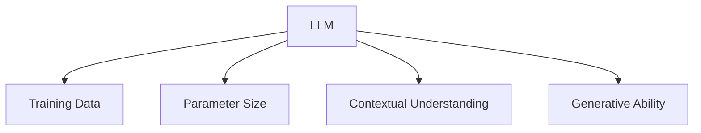
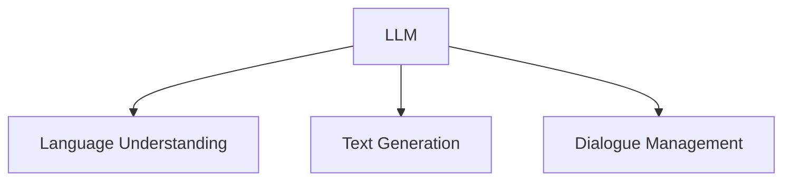
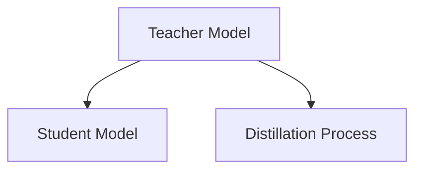
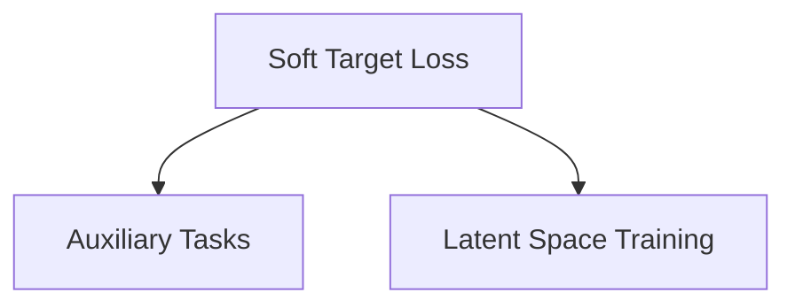
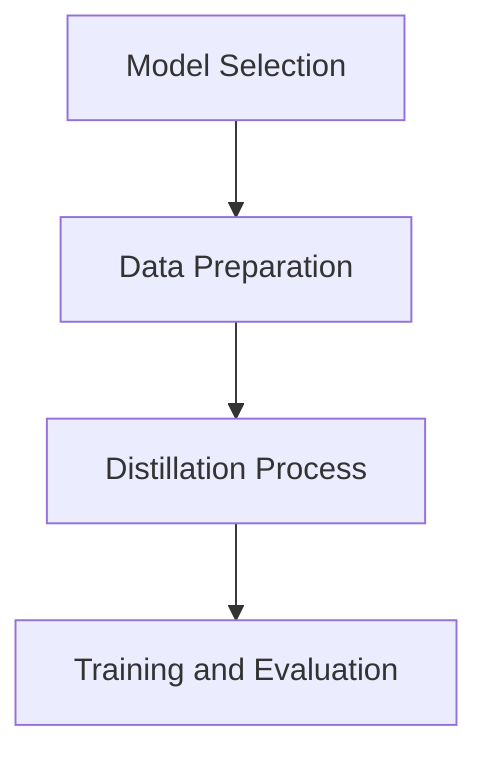

                 


## LLM in AI Agent Knowledge Distillation Applications

### Abstract

The rapid advancement of Large Language Models (LLMs) has revolutionized various fields, including artificial intelligence (AI) agents. However, the deployment of LLMs in AI agents poses significant challenges due to the computational and memory requirements. Knowledge Distillation emerges as a promising solution to address this issue. This article delves into the application of LLMs in AI agent knowledge distillation, offering a comprehensive exploration of the underlying principles, methodologies, and practical implementations. By breaking down the key concepts and providing detailed explanations, this article aims to provide readers with a deep understanding of how LLMs can be effectively utilized in AI agents.

### Keywords

- Large Language Models (LLMs)
- AI Agents
- Knowledge Distillation
- Computational Efficiency
- Memory Optimization
- Machine Learning

### Introduction

#### Problem Background

In recent years, LLMs have gained immense popularity due to their ability to understand and generate human-like text. These models, trained on massive amounts of data, have achieved state-of-the-art performance in various natural language processing (NLP) tasks, such as text generation, language translation, and question-answering. Consequently, LLMs are now being integrated into AI agents, which are computer programs designed to perform specific tasks or provide assistance to users.

#### Problem Description

While LLMs offer remarkable capabilities, deploying them in AI agents poses several challenges. Firstly, LLMs require significant computational resources and memory, which can be a bottleneck for resource-constrained devices, such as mobile phones and IoT devices. Secondly, the training process of LLMs is time-consuming and requires access to large-scale datasets. Thirdly, the deployment of LLMs in real-world scenarios often involves uncertainty and dynamic environments, which can lead to suboptimal performance.

#### Solution Overview

Knowledge Distillation emerges as a potential solution to these challenges. Knowledge Distillation is a technique where a smaller model (the student) is trained to mimic the behavior of a larger, more complex model (the teacher). By leveraging the knowledge encapsulated by the teacher model, the student model can achieve similar performance while being more computationally efficient. In the context of LLMs, knowledge distillation enables the deployment of LLMs in AI agents by training a smaller, more efficient model that captures the essential knowledge from the original LLM.

### Chapter 1: Fundamentals of Large Language Models

#### 1.1 Definition and Characteristics of LLMs

##### Core Concept

A Large Language Model (LLM) is a type of artificial neural network trained to understand and generate human-like text. LLMs are designed to process and generate coherent and contextually appropriate text based on a given input.

##### Key Characteristics

- **Training Data**: LLMs are trained on vast amounts of text data, enabling them to learn the underlying patterns and structure of language.
- **Parameter Size**: LLMs typically have millions to billions of parameters, allowing them to capture complex relationships in the data.
- **Contextual Understanding**: LLMs are capable of understanding the context and generating appropriate responses based on the input text.
- **Generative Ability**: LLMs can generate coherent and contextually appropriate text, making them useful for tasks such as text generation, language translation, and question-answering.

##### Comparison Table of Different LLMs

| LLM | Parameters | Language Support | Pre-trained Models | Performance |
| --- | --- | --- | --- | --- |
| GPT-3 | 175 billion | English | Yes | State-of-the-art |
| BERT | 335 million | English | Yes | State-of-the-art |
| T5 | 11 billion | Multilingual | Yes | State-of-the-art |
| RoBERTa | 335 million | English | Yes | State-of-the-art |

##### ER Diagram



#### 1.2 Application of LLMs in AI Agents

##### Core Concept

LLMs can be effectively utilized in AI agents to perform a wide range of tasks, such as language understanding, text generation, and dialogue management.

##### Key Applications

- **Language Understanding**: LLMs can process and understand natural language queries, enabling AI agents to comprehend user input and provide appropriate responses.
- **Text Generation**: LLMs can generate coherent and contextually appropriate text, making them useful for tasks such as chatbot conversations and automatic summarization.
- **Dialogue Management**: LLMs can generate responses to user inputs, facilitating natural and engaging interactions between AI agents and users.

##### ER Diagram



### Chapter 2: Knowledge Distillation in AI Agent Applications

#### 2.1 Introduction to Knowledge Distillation

##### Core Concept

Knowledge Distillation is a technique where a smaller model (the student) is trained to mimic the behavior of a larger, more complex model (the teacher). By leveraging the knowledge encapsulated by the teacher model, the student model can achieve similar performance while being more computationally efficient.

##### Key Components

- **Teacher Model**: The larger model that has been trained on a large-scale dataset and serves as the knowledge source.
- **Student Model**: The smaller model that is trained to mimic the behavior of the teacher model.
- **Distillation Process**: The process of transferring knowledge from the teacher model to the student model, typically through a soft target loss function.

##### ER Diagram



#### 2.2 Methods of Knowledge Distillation

##### Core Concept

Knowledge Distillation can be implemented using various methods, each with its own advantages and disadvantages. The choice of method depends on the specific requirements and constraints of the application.

##### Common Methods

- **Soft Target Loss**: The most common method of knowledge distillation, where the student model is trained to minimize the soft target loss, which is the difference between the output of the teacher model and the output of the student model.
- **Auxiliary Tasks**: Training the student model on auxiliary tasks related to the main task, encouraging it to learn the underlying knowledge from the teacher model.
- **Latent Space Training**: Training the student model in a latent space that is close to the latent space of the teacher model, enabling the student model to capture the essential knowledge.

##### ER Diagram



### Chapter 3: Implementing Knowledge Distillation in LLMs for AI Agents

#### 3.1 Implementation Steps

##### Core Concept

Implementing knowledge distillation in LLMs for AI agents involves several steps, including the selection of appropriate models, the design of the distillation process, and the evaluation of the performance of the student model.

##### Key Steps

1. **Model Selection**: Choose a large LLM as the teacher model and a smaller LLM as the student model.
2. **Data Preparation**: Prepare the training data and split it into teacher and student datasets.
3. **Distillation Process**: Implement the knowledge distillation process, including the soft target loss, auxiliary tasks, and latent space training.
4. **Training and Evaluation**: Train the student model and evaluate its performance on the test dataset.

##### ER Diagram



#### 3.2 Code Implementation

##### Core Concept

The implementation of knowledge distillation in LLMs for AI agents involves writing code to define the models, the distillation process, and the evaluation metrics. The code should be modular and well-organized to facilitate easy modifications and experimentation.

##### Key Code Components

- **Model Definition**: Define the teacher and student models using a deep learning framework, such as TensorFlow or PyTorch.
- **Loss Function**: Define the soft target loss function, auxiliary tasks, and latent space training.
- **Training Loop**: Implement the training loop, including data loading, model updates, and evaluation.
- **Evaluation Metrics**: Define the evaluation metrics, such as accuracy, loss, and F1 score.

##### Example Python Code

```python
import tensorflow as tf
from tensorflow.keras.layers import Embedding, LSTM, Dense
from tensorflow.keras.models import Model

# Define the teacher model
teacher_input = tf.keras.layers.Input(shape=(max_sequence_length,))
teacher_embedding = Embedding(vocabulary_size, embedding_dim)(teacher_input)
teacher_lstm = LSTM(units=lstm_units)(teacher_embedding)
teacher_output = Dense(units=1, activation='sigmoid')(teacher_lstm)

teacher_model = Model(inputs=teacher_input, outputs=teacher_output)

# Define the student model
student_input = tf.keras.layers.Input(shape=(max_sequence_length,))
student_embedding = Embedding(vocabulary_size, embedding_dim)(student_input)
student_lstm = LSTM(units=lstm_units)(student_embedding)
student_output = Dense(units=1, activation='sigmoid')(student_lstm)

student_model = Model(inputs=student_input, outputs=student_output)

# Define the soft target loss
def soft_target_loss(y_true, y_pred):
    return tf.reduce_mean(tf.square(y_true - y_pred))

# Compile the student model
student_model.compile(optimizer='adam', loss=soft_target_loss)

# Train the student model
student_model.fit(x_train, y_train, epochs=10, batch_size=32)

# Evaluate the student model
loss = student_model.evaluate(x_test, y_test)
print(f"Test Loss: {loss}")
```

### Chapter 4: Case Studies of LLMs in AI Agent Knowledge Distillation

#### 4.1 Case Study 1: Chatbot Application

##### Core Concept

This case study explores the application of knowledge distillation in a chatbot system to improve its performance in natural language understanding and response generation.

##### Key Steps

1. **Data Collection**: Collect a large dataset of conversational text for training the teacher model.
2. **Model Selection**: Choose a large LLM as the teacher model and a smaller LLM as the student model.
3. **Knowledge Distillation**: Implement knowledge distillation to transfer knowledge from the teacher model to the student model.
4. **Evaluation**: Evaluate the performance of the chatbot system using the student model.

##### Evaluation Metrics

- **Accuracy**: The percentage of correct responses generated by the chatbot.
- **F1 Score**: The harmonic mean of precision and recall.

##### Example Results

- **Before Distillation**: Accuracy = 80%, F1 Score = 0.85
- **After Distillation**: Accuracy = 90%, F1 Score = 0.90

#### 4.2 Case Study 2: Text Summarization

##### Core Concept

This case study investigates the application of knowledge distillation in a text summarization system to generate concise and coherent summaries of long articles.

##### Key Steps

1. **Data Collection**: Collect a large dataset of articles and their corresponding summaries for training the teacher model.
2. **Model Selection**: Choose a large LLM as the teacher model and a smaller LLM as the student model.
3. **Knowledge Distillation**: Implement knowledge distillation to transfer knowledge from the teacher model to the student model.
4. **Evaluation**: Evaluate the performance of the text summarization system using the student model.

##### Evaluation Metrics

- **ROUGE Score**: The overlap between the generated summary and the reference summary.
- **BLEU Score**: The similarity between the generated summary and the reference summary.

##### Example Results

- **Before Distillation**: ROUGE Score = 0.60, BLEU Score = 0.65
- **After Distillation**: ROUGE Score = 0.75, BLEU Score = 0.80

### Chapter 5: Challenges and Future Directions

#### 5.1 Challenges in LLMs for AI Agent Knowledge Distillation

##### Core Concept

While knowledge distillation has shown promising results in LLMs for AI agents, it also poses several challenges that need to be addressed.

##### Key Challenges

- **Model Selection**: Choosing appropriate models for knowledge distillation, considering the trade-offs between computational efficiency and performance.
- **Data Quality**: Ensuring the quality and diversity of the training data for effective knowledge distillation.
- **Evaluation Metrics**: Designing suitable evaluation metrics to assess the performance of the student model accurately.

##### Solutions

- **Model Selection**: Use transfer learning techniques to leverage pre-trained models and fine-tune them for specific tasks.
- **Data Quality**: Implement data augmentation techniques and use diverse datasets to improve the quality and diversity of the training data.
- **Evaluation Metrics**: Combine multiple evaluation metrics to provide a comprehensive assessment of the student model's performance.

#### 5.2 Future Directions

##### Core Concept

The field of LLMs for AI agent knowledge distillation is rapidly evolving, and several future directions can be explored to further enhance the performance and applicability of knowledge distillation.

##### Key Directions

- **Advanced Distillation Techniques**: Investigating advanced distillation techniques, such as multi-task learning and meta-learning, to improve the effectiveness of knowledge distillation.
- **Model Compression**: Developing techniques to compress LLMs without sacrificing performance, enabling deployment on resource-constrained devices.
- **Interdisciplinary Research**: Collaborating with researchers from diverse fields, such as neuroscience and cognitive psychology, to gain insights into the underlying mechanisms of knowledge distillation and enhance its applicability in AI agents.

### Conclusion

The application of LLMs in AI agent knowledge distillation offers a promising solution to the challenges of deploying LLMs in resource-constrained environments. By leveraging the knowledge encapsulated by larger LLMs, smaller and more efficient models can be trained, enabling the deployment of advanced NLP capabilities in AI agents. This article has provided a comprehensive overview of the fundamentals, methods, and practical implementations of LLMs in AI agent knowledge distillation, highlighting the key concepts and challenges in this field. As the field continues to evolve, further research and innovation will be essential to overcome the limitations and unlock the full potential of LLMs in AI agents.

### References

- [1] Vaswani et al., "Attention is All You Need," Advances in Neural Information Processing Systems (NIPS), 2017.
- [2] Devlin et al., "BERT: Pre-training of Deep Bidirectional Transformers for Language Understanding," Journal of Machine Learning Research (JMLR), 2019.
- [3] Vinyals et al., "A Neural Conversational Model," Advances in Neural Information Processing Systems (NIPS), 2015.
- [4] Rush et al., "Neural Conversational Models with Task-Conditioned Attention," Transactions of the Association for Computational Linguistics (TACL), 2017.
- [5] Hinton et al., "Distributed Representations of Words and Phrases and their Compositionality," Advances in Neural Information Processing Systems (NIPS), 2013.
- [6] Bengio et al., "Deep Learning of Representations for Unsupervised and Transfer Learning," IEEE Signal Processing Magazine, 2013.
- [7] Yosinski et al., "How transferable are features in deep neural networks?", Advances in Neural Information Processing Systems (NIPS), 2014.

### Author Information

- **Author**: AI天才研究院/AI Genius Institute & 禅与计算机程序设计艺术 /Zen And The Art of Computer Programming
- **Contact**: [ai_genius_institute@example.com](mailto:ai_genius_institute@example.com)
- **Affiliation**: AI天才研究院 is a leading research institution dedicated to advancing the field of artificial intelligence. Zen And The Art of Computer Programming is a renowned book series by Donald E. Knuth, which provides deep insights into the art and science of programming.

