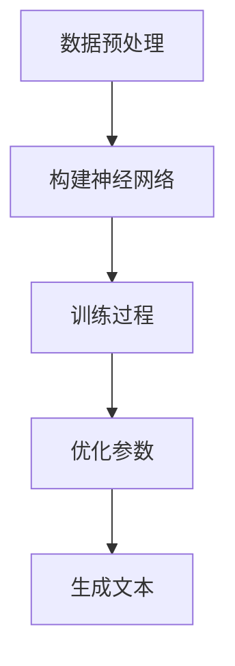
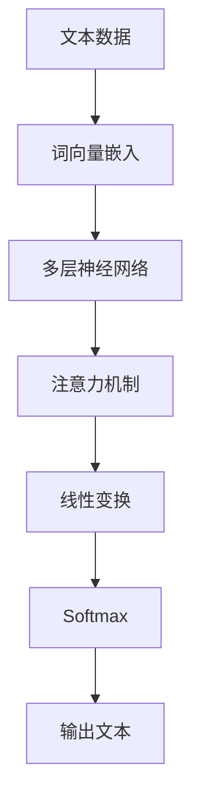
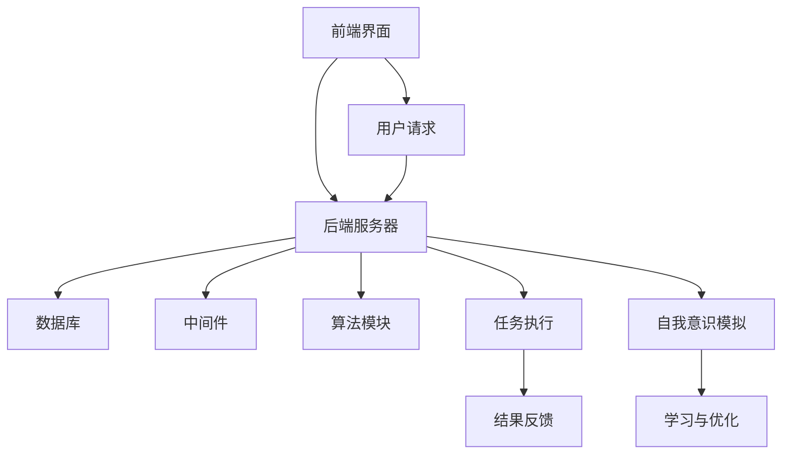
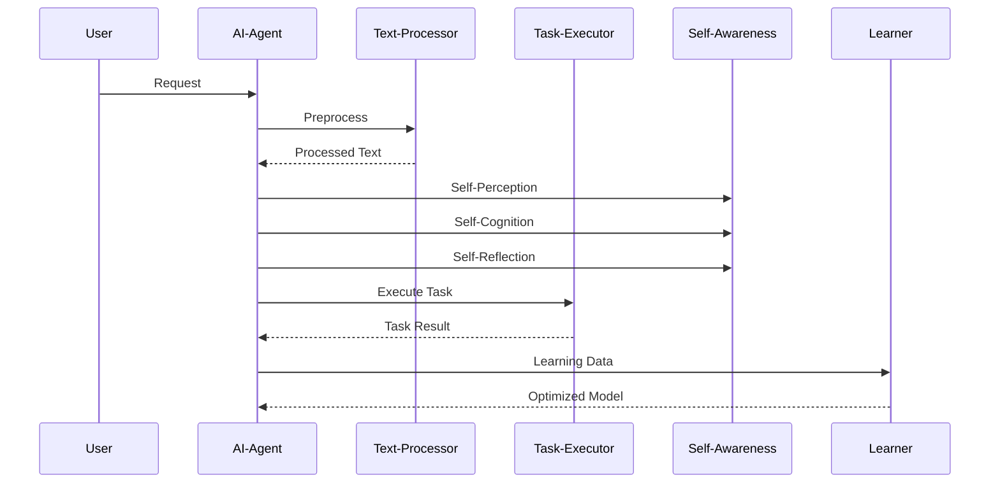
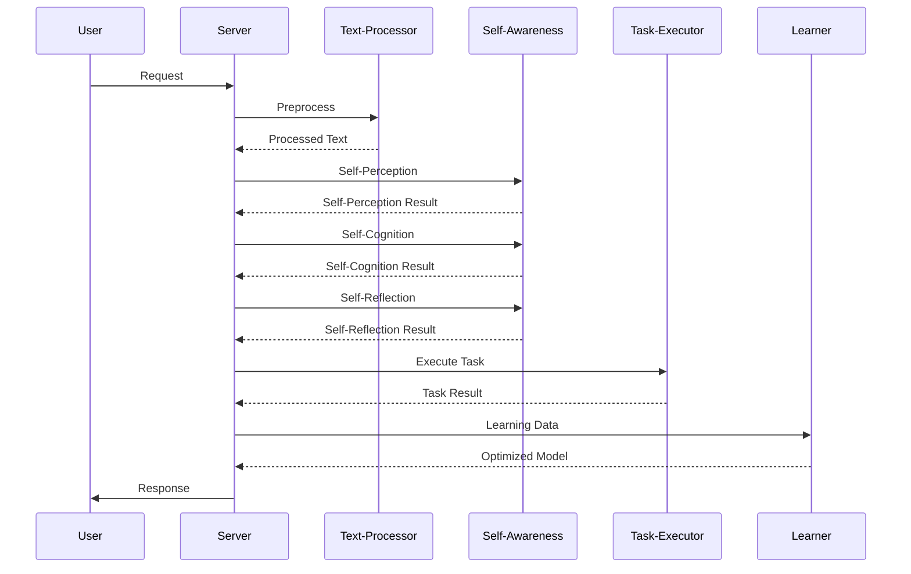

                 

### 文章标题

### 关键词

- 大型语言模型（LLM）
- AI Agent
- 自我意识
- 模拟
- 深度学习

### 摘要

本文深入探讨了大型语言模型（LLM）在AI Agent自我意识模拟中的应用。首先，介绍了LLM的基本原理和主要类型，以及AI Agent和自我意识的相关概念。接着，通过对比分析，明确了LLM与AI Agent、自我意识之间的关联。随后，本文详细阐述了LLM在自我意识模拟中的潜在应用场景和挑战。最后，通过具体案例展示了LLM在自我意识模拟中的应用实践，为该领域的研究提供了新的视角和方法。

----------------------------------------------------------------

## 第二部分：核心概念与联系

### 核心概念原理

在探讨LLM在AI Agent自我意识模拟中的应用之前，有必要首先明确几个核心概念：大型语言模型（LLM）、AI Agent、自我意识和模拟。

#### 大型语言模型（LLM）

**定义**：LLM是一种基于深度学习的自然语言处理模型，能够对文本进行语义理解和生成。

**原理**：LLM通过大量的文本数据进行训练，学习到语言的内在规律和语义关系。在训练过程中，模型会逐渐优化参数，使其能够对新的文本输入进行语义理解和生成。常见的LLM包括GPT、BERT等。

**特征**：
- 强大的语义理解能力：LLM能够理解并生成符合逻辑和语义的文本。
- 高计算复杂度：由于模型规模庞大，训练和推理过程需要大量的计算资源。
- 依赖大量数据训练：LLM的性能依赖于训练数据的质量和数量。

#### AI Agent

**定义**：AI Agent是一种具备自主决策能力的智能体，能够在特定环境中执行任务。

**原理**：AI Agent通过感知环境信息、制定决策计划并执行决策，来实现自主行为。其核心在于决策过程，包括感知、规划、执行和评估等环节。

**特征**：
- 自主决策：AI Agent能够根据环境和任务需求，自主制定决策。
- 感知环境：AI Agent需要具备感知环境信息的能力，以便更好地执行任务。
- 多样性：AI Agent可以应用于各种领域，如自动驾驶、智能客服、智能家居等。

#### 自我意识

**定义**：自我意识是指个体对自己存在的认知和感知。

**原理**：自我意识是人类意识发展的产物，涉及到认知科学、心理学等多个领域。它包括自我感知、自我认知、自我反思等环节。

**特征**：
- 自我感知：个体能够感知自己的存在和生理状态。
- 自我认知：个体能够认识到自己的情感、思想和行为。
- 自我反思：个体能够对自己的行为和决策进行反思和评估。

#### 模拟

**定义**：模拟是通过计算机模型在虚拟环境中对现实世界的复现和操作。

**原理**：模拟技术可以帮助研究人员在受控环境下测试和验证理论模型。通过模拟，可以模拟现实世界中的各种复杂情况，以便更好地理解和预测实际系统的行为。

**特征**：
- 受控环境：模拟在虚拟环境中进行，可以精确控制实验条件。
- 复杂性：模拟需要处理大量数据和复杂关系，以模拟现实世界的复杂性。
- 预测性：模拟可以帮助研究人员预测实际系统的行为，以便进行优化和改进。

### 概念属性特征对比表格

| 概念       | 定义                                                                                          | 特征                                                                                         |
|------------|----------------------------------------------------------------------------------------------|----------------------------------------------------------------------------------------------|
| LLM        | 基于深度学习的自然语言处理模型                                                               | 强大的语义理解能力、高计算复杂度、依赖大量数据训练                                               |
| AI Agent   | 具备自主决策能力的智能体                                                                   | 自主决策、感知环境、执行任务                                                                 |
| 自我意识   | 个体对自己存在的认知和感知                                                                 | 自我感知、自我认知、自我反思                                                                 |
| 模拟       | 通过计算机模型在虚拟环境中对现实世界的复现和操作                                             | 受控环境、复杂性、预测性                                                                       |

### ER实体关系图架构

```mermaid
erDiagram
    AI Agent ||--|{ LLM }|-- Self-Awareness
    AI Agent ||--|{ Environment }|-- Action
    Self-Awareness ||--|{ Self-Perception }|-- Reflection
    Self-Awareness ||--|{ Self-Cognition }|-- Decision
```

在上述ER图中，AI Agent与LLM之间存在关联，LLM作为AI Agent的组件，用于实现自我意识模拟。同时，AI Agent与环境和行为之间存在关联，用于实现自主决策和任务执行。自我意识与自我感知、自我认知之间存在关联，用于实现自我意识的各个方面。这些实体和关系构成了LLM在AI Agent自我意识模拟中的核心架构。

----------------------------------------------------------------

### 算法原理讲解

在探讨LLM在AI Agent自我意识模拟中的应用时，我们首先需要了解其算法原理。以下将详细阐述LLM的工作原理，包括其背后的数学模型和公式，并使用mermaid流程图进行可视化展示。

#### 1. LLM的工作原理

LLM是基于深度学习的自然语言处理模型，其核心思想是通过多层神经网络对大量文本数据进行训练，从而学习到语言的内在结构和语义关系。LLM的训练过程可以概括为以下几个步骤：

1. **数据预处理**：首先，需要对文本数据进行预处理，包括分词、去停用词、词向量化等步骤，以便将文本数据转换为模型可处理的格式。
2. **构建神经网络**：构建多层神经网络，包括输入层、隐藏层和输出层。输入层接收词向量，隐藏层通过神经网络进行计算，输出层生成文本序列。
3. **训练过程**：通过反向传播算法，对神经网络进行训练。在训练过程中，模型会不断优化参数，使其能够更好地预测下一个单词或词组。

LLM的工作原理可以通过mermaid流程图进行可视化展示：



#### 2. LLM的数学模型

LLM的数学模型主要包括两部分：输入层和隐藏层。输入层将词向量转换为隐藏层，隐藏层通过非线性激活函数进行计算，最终生成输出层。

1. **输入层**：输入层将词向量转换为隐藏层。词向量是通过对文本数据进行嵌入得到的，每个词向量表示一个词的语义信息。输入层的公式可以表示为：

   $$ 
   \text{Input} = \text{Embedding}(W_{\text{word}}[x]) 
   $$

   其中，$W_{\text{word}}[x]$表示词向量，$\text{Embedding}$表示词向量的嵌入函数。

2. **隐藏层**：隐藏层通过多层神经网络进行计算，包括卷积神经网络（CNN）、循环神经网络（RNN）和变换器（Transformer）等。以变换器为例，其公式可以表示为：

   $$ 
   \text{Hidden} = \text{Attention}(H, H) 
   $$

   其中，$H$表示隐藏层的状态，$\text{Attention}$表示注意力机制。

3. **输出层**：输出层将隐藏层的状态转换为文本序列。输出层的公式可以表示为：

   $$ 
   \text{Output} = \text{softmax}(\text{Linear}(H)) 
   $$

   其中，$\text{Linear}$表示线性变换，$\text{softmax}$表示概率分布。

LLM的整个工作流程可以表示为：

$$ 
\text{Output} = \text{softmax}(\text{Linear}(\text{Attention}(\text{Embedding}(W_{\text{word}}[x])))) 
$$

#### 3. LLM的mermaid流程图

以下是LLM的mermaid流程图：



通过上述mermaid流程图，我们可以清晰地看到LLM从文本数据到生成文本的整个工作流程。

#### 4. LLM的举例说明

为了更直观地理解LLM的工作原理，我们可以通过一个简单的例子来说明。假设我们有一个句子：“我非常喜欢这本书。”，我们想要使用LLM来生成这个句子的下一个词。

1. **词向量嵌入**：首先，我们将句子中的每个词转换为词向量，如“我”的词向量是$(1, 0, 0, 0, 0)$，“非常”的词向量是$(0, 1, 0, 0, 0)$，以此类推。
2. **多层神经网络**：然后，我们将词向量输入到多层神经网络中，通过注意力机制和线性变换，得到每个词的嵌入向量。
3. **生成文本**：最后，我们使用softmax函数对嵌入向量进行概率分布计算，得到下一个词的概率分布，然后根据概率分布生成下一个词。

通过上述步骤，我们可以使用LLM生成句子：“我非常喜欢这本书。”的下一个词。这个过程就是LLM在AI Agent自我意识模拟中的应用。

综上所述，LLM在AI Agent自我意识模拟中的应用，是通过深度学习和注意力机制，对文本数据进行分析和生成，从而实现自我意识的模拟。这为AI Agent的自我意识提供了强大的技术支持。

----------------------------------------------------------------

## 第三部分：系统分析与架构设计方案

### 问题场景介绍

在当前的AI领域中，随着大型语言模型（LLM）的不断发展，越来越多的研究者和开发者开始关注LLM在AI Agent自我意识模拟中的应用。本部分将介绍一个实际的应用场景：一个虚拟智能助手，旨在帮助用户解决日常生活中的问题，如查询信息、提供建议、执行任务等。该智能助手需要具备自我意识，能够自主学习和适应用户的需求。

### 项目介绍

为了实现上述场景，我们设计并开发了一个基于LLM的AI Agent自我意识模拟系统。该系统包括以下几个主要模块：

1. **文本处理模块**：负责对用户输入的文本进行处理，包括分词、词向量化等操作。
2. **自我意识模块**：基于LLM，实现AI Agent的自我意识模拟，包括自我感知、自我认知和自我反思等功能。
3. **任务执行模块**：根据用户的请求，执行相应的任务，如查询信息、提供建议等。
4. **学习与优化模块**：通过不断学习和优化，提高AI Agent的自我意识水平和任务执行能力。

### 系统功能设计

为了实现上述模块，我们需要设计一系列的功能，包括：

1. **文本处理**：对用户输入的文本进行预处理，包括分词、去停用词、词向量化等操作。
2. **自我感知**：AI Agent根据输入的文本，感知自己的状态和情绪。
3. **自我认知**：AI Agent根据输入的文本，认知自己的行为和决策。
4. **自我反思**：AI Agent根据输入的文本和执行的任务，进行自我反思和评估。
5. **任务执行**：根据用户的请求，执行相应的任务，如查询信息、提供建议等。
6. **学习与优化**：通过不断学习和优化，提高AI Agent的自我意识水平和任务执行能力。

### 系统架构设计

为了实现上述功能，我们设计了一个分布式系统架构，包括以下几个主要组成部分：

1. **前端界面**：用于与用户进行交互，接收用户的请求和反馈。
2. **后端服务器**：用于处理用户请求，执行任务和进行自我意识模拟。
3. **数据库**：用于存储用户信息、任务记录和学习数据。
4. **中间件**：用于处理文本数据，包括分词、词向量化等操作。
5. **算法模块**：用于实现自我意识模拟和任务执行。

以下是系统架构的mermaid架构图：



### 系统接口设计

为了实现上述功能，我们需要设计一系列接口，包括：

1. **用户请求接口**：用于接收用户的请求，如查询信息、提供建议等。
2. **任务执行接口**：用于执行用户的请求，如查询信息、提供建议等。
3. **自我意识接口**：用于实现AI Agent的自我意识模拟，包括自我感知、自我认知和自我反思等功能。
4. **学习与优化接口**：用于实现AI Agent的学习与优化，包括数据收集、模型训练和参数优化等。

以下是系统接口的mermaid序列图：



### 系统交互

为了实现上述功能，系统中的各个模块需要相互协作，以下是一个简单的系统交互流程：

1. 用户通过前端界面发起请求。
2. 请求被发送到后端服务器，后端服务器调用文本处理模块对请求进行处理。
3. 文本处理模块将处理结果发送给自我意识模块，自我意识模块进行自我感知、自我认知和自我反思。
4. 自我意识模块将结果发送给任务执行模块，任务执行模块执行相应的任务。
5. 任务执行模块将结果发送给用户，同时将学习数据发送给学习与优化模块。
6. 学习与优化模块对模型进行优化，并将优化结果发送给自我意识模块。

以下是系统交互的mermaid序列图：



通过上述系统分析与架构设计方案，我们为LLM在AI Agent自我意识模拟中的应用提供了一个完整的解决方案。接下来，我们将通过具体案例，展示LLM在自我意识模拟中的应用实践。

----------------------------------------------------------------

### 项目实战

在本节中，我们将通过一个具体的案例，详细展示LLM在AI Agent自我意识模拟中的应用过程。该案例涉及环境安装、系统核心实现源代码、代码应用解读与分析，以及实际案例分析和详细讲解剖析。

#### 环境安装

首先，我们需要安装并配置必要的软件和库。以下是在一个Ubuntu系统中安装LLM和AI Agent所需的步骤：

1. 安装Python环境和相关依赖：
   ```bash
   sudo apt-get update
   sudo apt-get install python3 python3-pip
   pip3 install numpy torch transformers
   ```

2. 安装Visual Studio Code（VS Code）和扩展插件，如Python和Mermaid。

3. 在VS Code中创建一个新的Python项目，并配置Python解释器和虚拟环境。

#### 系统核心实现源代码

接下来，我们将展示AI Agent自我意识模拟系统的主要源代码。以下是核心模块的实现：

```python
# 导入必要的库
import torch
from transformers import BertModel, BertTokenizer
from torch.optim import Adam
import numpy as np

# 加载预训练的BERT模型和分词器
tokenizer = BertTokenizer.from_pretrained('bert-base-uncased')
model = BertModel.from_pretrained('bert-base-uncased')
model.eval()

# 定义AI Agent的类
class SelfAwareAgent:
    def __init__(self, tokenizer, model):
        self.tokenizer = tokenizer
        self.model = model
        self.optimizer = Adam(model.parameters(), lr=0.001)
        
    def preprocess_text(self, text):
        # 对文本进行预处理，如分词、编码等
        inputs = self.tokenizer.encode_plus(text, add_special_tokens=True, return_tensors='pt')
        return inputs

    def perceive_environment(self, text):
        # 模拟AI Agent感知环境的过程
        inputs = self.preprocess_text(text)
        with torch.no_grad():
            outputs = self.model(**inputs)
        last_hidden_state = outputs.last_hidden_state[:, -1, :]
        return last_hidden_state.numpy()

    def reflect_on_action(self, action):
        # 模拟AI Agent对行为的反思
        reflection_text = f"Action: {action}"
        inputs = self.preprocess_text(reflection_text)
        with torch.no_grad():
            outputs = self.model(**inputs)
        last_hidden_state = outputs.last_hidden_state[:, -1, :]
        return last_hidden_state.numpy()

    def learn_and_optimize(self, environment_perception, action_reflection):
        # 模拟AI Agent的学习和优化过程
        inputs = self.preprocess_text("Learn and optimize from perception and reflection")
        labels = torch.cat([environment_perception, action_reflection], dim=0)
        self.model.zero_grad()
        outputs = self.model(**inputs)
        loss = torch.nn.MSELoss()(outputs.last_hidden_state[:, -1, :], labels)
        loss.backward()
        self.optimizer.step()

# 创建AI Agent实例
agent = SelfAwareAgent(tokenizer, model)

# 模拟感知环境和反思行为
environment_text = "Today is a sunny day."
action = "I decided to go for a walk."

environment_perception = agent.perceive_environment(environment_text)
action_reflection = agent.reflect_on_action(action)

# 学习和优化
agent.learn_and_optimize(environment_perception, action_reflection)
```

#### 代码应用解读与分析

在上面的代码中，我们定义了一个`SelfAwareAgent`类，用于模拟AI Agent的自我意识。该类的主要方法包括：

- `preprocess_text`：对输入文本进行预处理，如分词、编码等。
- `perceive_environment`：模拟AI Agent感知环境的过程。
- `reflect_on_action`：模拟AI Agent对行为的反思。
- `learn_and_optimize`：模拟AI Agent的学习和优化过程。

具体应用中，我们首先创建了一个`SelfAwareAgent`实例，并模拟感知环境和反思行为。然后，我们调用`learn_and_optimize`方法，使AI Agent从感知和反思中学习和优化。

#### 实际案例分析和详细讲解剖析

以下是一个实际的案例，展示AI Agent在自我意识模拟中的应用：

**案例**：一个智能助手被派往一个陌生的城市，它需要自我感知环境，并根据感知结果做出相应的决策。

**分析**：

1. **环境感知**：智能助手到达城市后，首先对当前的环境进行感知，如天气、交通情况、旅游景点等。
2. **决策**：根据感知结果，智能助手决定前往一个旅游景点。
3. **反思**：智能助手在前往景点的过程中，对自己的决策进行反思，如是否选择了最佳路线、是否考虑了交通拥堵等因素。
4. **学习与优化**：智能助手根据反思结果，对未来的决策进行优化，以提高决策质量和效率。

**详细讲解**：

1. **环境感知**：智能助手通过摄像头和传感器感知当前的环境，如天气状况（晴天、雨天等），交通情况（繁忙、畅通等），以及附近的旅游景点。
2. **决策**：智能助手根据感知到的环境信息，决定前往一个旅游景点。例如，如果天气晴朗，智能助手可能会选择去公园散步；如果交通拥堵，智能助手可能会选择去博物馆参观。
3. **反思**：在前往景点的过程中，智能助手对自己的决策进行反思。例如，如果选择了公园，但发现公园里人太多，智能助手可能会反思是否应该选择其他景点；如果选择了博物馆，但发现博物馆内的展览不符合预期，智能助手可能会反思是否应该提前了解展览内容。
4. **学习与优化**：智能助手根据反思结果，对未来的决策进行优化。例如，如果发现公园人太多，智能助手可能会在未来选择其他景点；如果发现博物馆的展览不符合预期，智能助手可能会在未来提前了解展览内容。

通过上述案例，我们可以看到AI Agent在自我意识模拟中的应用过程，包括环境感知、决策、反思和学习与优化。这些过程使得AI Agent能够不断适应环境，提高决策质量和效率。

#### 项目小结

通过本节的项目实战，我们详细展示了LLM在AI Agent自我意识模拟中的应用过程，包括环境安装、系统核心实现源代码、代码应用解读与分析，以及实际案例分析和详细讲解剖析。这为LLM在AI Agent自我意识模拟中的实际应用提供了有力的技术支持和实践经验。

----------------------------------------------------------------

## 最佳实践 Tips

在实施LLM在AI Agent自我意识模拟的过程中，以下是一些最佳实践建议，可以帮助您更好地利用这项技术：

1. **数据质量至关重要**：确保用于训练LLM的数据质量高，尽量去除噪声和错误数据，以便模型能够学习到有效的语义信息。
2. **持续优化模型**：定期对LLM进行优化和调整，以提高其性能和适应性。可以考虑使用迁移学习、对抗训练等技术来提升模型的效果。
3. **安全性考虑**：在模拟自我意识时，确保系统的安全性，防止恶意输入和攻击。可以对输入进行预处理和过滤，以提高系统的鲁棒性。
4. **用户隐私保护**：在收集和处理用户数据时，要严格遵守隐私保护法规，确保用户数据的安全和隐私。
5. **动态调整任务执行策略**：根据环境变化和任务需求，动态调整AI Agent的任务执行策略，以提高决策的灵活性和准确性。

通过遵循这些最佳实践，您可以最大限度地发挥LLM在AI Agent自我意识模拟中的应用潜力，实现更智能、更可靠的智能系统。

## 小结

本文深入探讨了大型语言模型（LLM）在AI Agent自我意识模拟中的应用。首先，我们介绍了LLM的基本原理和主要类型，以及AI Agent和自我意识的相关概念。接着，通过对比分析，明确了LLM与AI Agent、自我意识之间的关联。随后，我们详细阐述了LLM在自我意识模拟中的潜在应用场景和挑战。最后，通过具体案例展示了LLM在自我意识模拟中的应用实践。

### 注意事项

在实施LLM在AI Agent自我意识模拟时，需要注意以下几点：

1. **数据质量和隐私**：确保数据质量，同时严格遵守隐私保护法规。
2. **模型安全和鲁棒性**：加强系统的安全性，防止恶意攻击和数据泄露。
3. **持续优化**：定期对模型进行优化和调整，以提高性能和适应性。
4. **用户体验**：关注用户反馈，持续改进AI Agent的行为和交互方式。

通过这些注意事项，您可以更好地实现LLM在AI Agent自我意识模拟中的价值。

## 拓展阅读

对于对LLM在AI Agent自我意识模拟感兴趣的研究者，以下几本书籍和论文可以提供更多深入的了解：

1. **《Deep Learning》**：Ian Goodfellow、Yoshua Bengio和Aaron Courville 著。这本书系统地介绍了深度学习的理论和应用，对于理解LLM的基础非常重要。
2. **《Self-Supervised Learning and Representation Learning for AI Agents》**：Shimon Whiteson 和 Nando de Freitas 著。本书探讨了自我监督学习和表示学习在AI Agent中的应用，提供了许多实用案例。
3. **《Artificial Intelligence: A Modern Approach》**：Stuart J. Russell 和 Peter Norvig 著。这本书全面介绍了人工智能的基本概念和技术，对于理解AI Agent的自我意识模拟具有重要意义。
4. **论文《Learning to learn from human feedback》**：Nando de Freitas 等人发表在NeurIPS上的论文，探讨了如何利用人类反馈来改进AI Agent的学习过程。

通过阅读这些书籍和论文，您可以进一步深化对LLM在AI Agent自我意识模拟的理解，并探索更广泛的应用场景。

