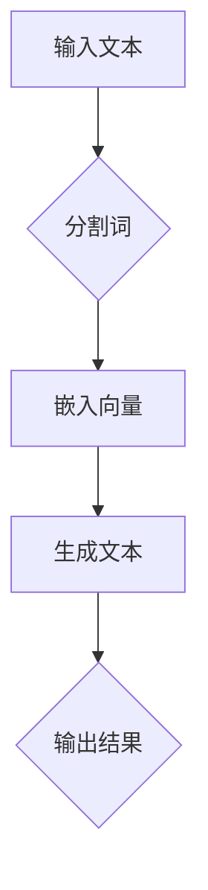
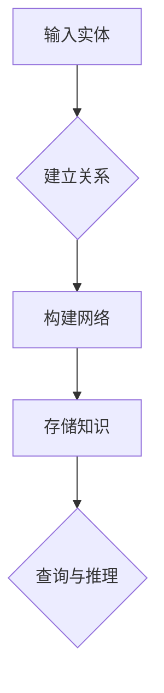
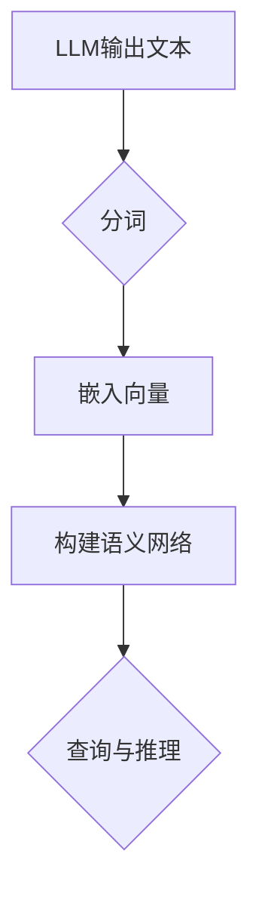
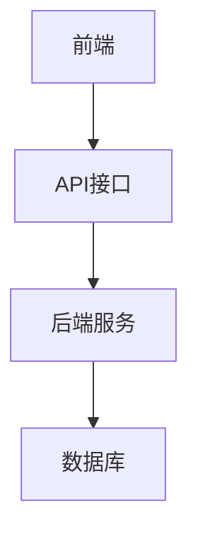
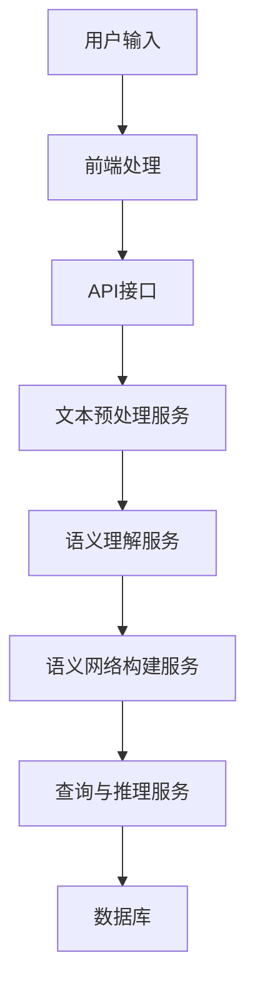
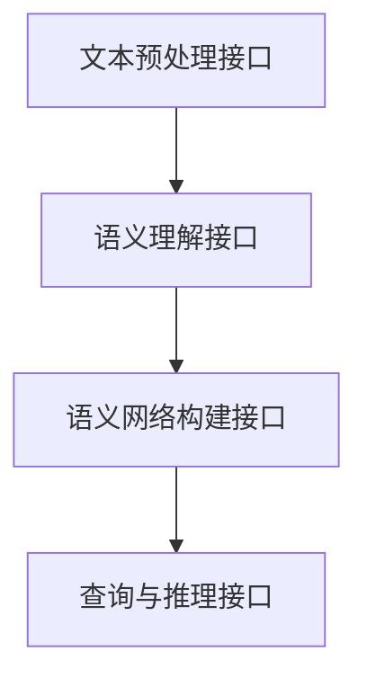
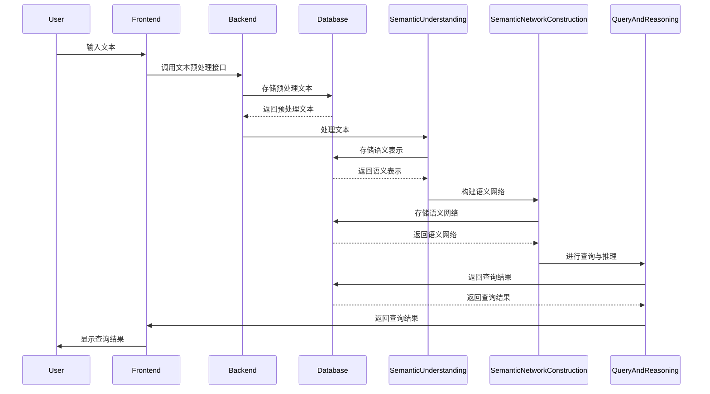

                 

### 文章标题

### 关键词

- 语言模型（LLM）
- 语义网络
- AI Agent
- 算法原理
- 系统设计与实现

### 摘要

本文深入探讨了语言模型（LLM）在AI Agent语义网络构建中的应用。首先，我们回顾了AI Agent和语义网络的基本概念，并分析了LLM如何应用于这一领域。接着，我们详细介绍了LLM和语义网络的算法原理，通过对比分析、流程图和Python代码示例，让读者对这两个概念有了更加直观的认识。然后，本文从系统分析与架构设计的角度，描述了LLM在AI Agent语义网络构建中的应用场景、系统功能设计和架构设计。最后，本文通过实际项目实战，展示了LLM在AI Agent语义网络构建中的具体应用，并结合最佳实践进行了小结。本文旨在为读者提供一份系统全面的技术指南，帮助他们更好地理解和应用LLM在AI Agent语义网络构建中的潜力。

----------------------------------------------------------------

## 第一部分：背景介绍

### 第1章 问题背景

#### 1.1 问题背景

人工智能（AI）技术正在飞速发展，其中AI Agent作为具有自主决策和执行能力的实体，在诸多领域展现出巨大的应用潜力。然而，为了实现AI Agent的智能决策，语义网络构建成为了一个关键问题。语义网络是一种用于表示和传递知识的图形结构，能够将现实世界中的实体和关系抽象为网络中的节点和边，从而使得AI Agent能够更好地理解和处理语义信息。

随着自然语言处理（NLP）技术的进步，语言模型（LLM）作为一种强大的工具，被广泛应用于文本生成、机器翻译、问答系统等领域。LLM通过大规模的语料库训练，掌握了丰富的语言知识和表达方式，为语义网络构建提供了强有力的支持。因此，如何将LLM应用于AI Agent语义网络构建，成为了一个值得深入探讨的问题。

#### 1.2 语义网络构建的重要性

语义网络构建在AI Agent中扮演着至关重要的角色。一方面，语义网络能够将AI Agent所需的知识进行结构化表示，使得知识存储和传递更加高效。另一方面，语义网络能够为AI Agent提供丰富的语义信息，从而支持其智能决策和执行。例如，在智能客服系统中，语义网络可以帮助AI Agent理解用户的问题，并提供准确的答案；在自动驾驶领域中，语义网络可以帮助AI Agent理解道路环境，并做出安全的驾驶决策。

#### 1.3 LLM在语义网络构建中的应用潜力

LLM在语义网络构建中具有巨大的应用潜力。首先，LLM能够自动地从大规模语料库中学习到丰富的语言知识和表达方式，从而为语义网络的构建提供了大量的语义信息。其次，LLM可以动态地生成和调整语义网络的节点和边，使得语义网络能够适应不断变化的语言环境和应用场景。此外，LLM还可以与其他AI技术（如机器学习、知识图谱等）相结合，进一步提升语义网络的构建和应用能力。

#### 1.4 边界与外延

尽管LLM在语义网络构建中具有巨大潜力，但我们也需要认识到其应用边界。首先，LLM依赖于大规模的语料库，因此在缺乏足够训练数据的场景下，其效果可能会受到影响。其次，LLM生成的语义信息可能存在一定的不确定性和偏见，这需要我们在应用中加以注意。此外，LLM在处理复杂语义关系和推理任务时，可能需要与其他技术（如知识图谱）相结合，以实现更高效的语义网络构建。

#### 1.5 概念结构与核心要素组成

LLM和语义网络作为两个核心概念，它们在AI Agent语义网络构建中相互关联，共同构成了一个复杂的技术体系。LLM作为语言模型的代表，其主要功能是生成和预测文本，通过大规模的语料库训练，掌握了丰富的语言知识和表达方式。而语义网络则是一种用于表示和传递知识的图形结构，其核心要素包括节点（表示实体）、边（表示关系）和权重（表示关系强度）。

在AI Agent语义网络构建中，LLM与语义网络相互结合，共同发挥作用。LLM通过生成和预测文本，为语义网络提供了丰富的语义信息；而语义网络则通过结构化表示知识，为AI Agent提供了强大的语义理解能力。此外，LLM还可以根据语义网络中的知识关系，动态调整和优化语义网络的构建，从而实现更高效的语义网络构建和应用。

## 第二部分：核心概念与联系

### 第2章 核心概念与联系

在探讨LLM在AI Agent语义网络构建中的应用之前，我们首先需要明确几个核心概念：语言模型（LLM）、语义网络和AI Agent。通过对比分析这些概念，我们能够更好地理解它们之间的联系，以及如何在语义网络构建中发挥作用。

#### 2.1 核心概念

**语言模型（LLM）**：

语言模型是一种基于大规模语料库的统计模型，用于生成和预测文本。LLM通过对输入文本进行建模，能够理解文本中的语法、语义和上下文信息，从而生成或预测相关的输出文本。常见的LLM包括基于神经网络的模型，如Transformer、BERT等。

**语义网络**：

语义网络是一种用于表示和传递知识的图形结构，它通过节点（表示实体）和边（表示关系）来表示现实世界中的实体及其关系。语义网络不仅能够存储知识，还能够支持查询和推理，从而为AI Agent提供语义理解能力。

**AI Agent**：

AI Agent是一种具有自主决策和执行能力的实体，它可以接收外部输入，通过内部计算和推理，生成相应的输出。AI Agent在各个领域（如自然语言处理、自动驾驶、智能客服等）都展现出了广泛的应用潜力。

#### 2.2 概念属性特征对比表格

以下是对LLM、语义网络和AI Agent的属性特征进行对比的表格：

| 概念       | LLM                          | 语义网络                         | AI Agent                       |
| ---------- | ---------------------------- | -------------------------------- | ------------------------------ |
| 定义       | 语言模型，用于生成和预测文本 | 语义网络，用于表示和传递知识     | 自主决策和执行能力的实体       |
| 功能       | 文本生成、预测               | 知识表示、查询、推理             | 接收输入、计算推理、生成输出   |
| 依赖       | 大规模语料库、计算资源       | 知识图谱、实体关系、语义信息     | 数据、算法、计算资源           |
| 实现方式   | 神经网络、机器学习           | 图形结构、图论算法               | 人工智能技术、决策树、神经网络等 |
| 应用领域   | 自然语言处理、问答系统       | 知识图谱、智能搜索、语义理解     | 自动驾驶、智能客服、智能推荐等  |

#### 2.3 ER实体关系图架构

为了更好地理解LLM、语义网络和AI Agent之间的联系，我们可以使用ER（实体-关系）图来描述它们的结构关系。

```mermaid
erDiagram
  AI Agent ||--|{ LLM } LLM : 使用
  AI Agent ||--|{ 语义网络 } 语义网络 : 构建于
  LLM ||--|{ 语义网络 } 语义网络 : 构建于
```

在该ER图中，AI Agent与LLM和语义网络之间存在直接的依赖关系。AI Agent使用LLM来生成和预测文本，从而获取语义信息；同时，AI Agent基于语义网络构建知识图谱，以支持智能决策和执行。

通过上述核心概念与联系的探讨，我们为后续的算法原理讲解和系统设计与实现奠定了基础。在接下来的章节中，我们将进一步深入探讨LLM和语义网络的算法原理，以及它们在AI Agent语义网络构建中的具体应用。

## 第三部分：算法原理讲解

### 第3章 算法原理讲解

在深入探讨LLM在AI Agent语义网络构建中的应用之前，我们首先需要了解LLM和语义网络各自的算法原理，以及它们如何相互结合，发挥协同作用。

#### 3.1 LLM算法原理

语言模型（LLM）的核心目标是根据输入的文本生成或预测输出文本。LLM通常基于大规模语料库训练，通过学习文本中的统计规律和语义信息，建立起输入与输出之间的映射关系。下面，我们将详细介绍LLM的算法原理。

**3.1.1 基本原理**

LLM的基本原理可以概括为以下几点：

1. **大规模语料库训练**：LLM通过从大规模语料库中学习，获取语言知识。这些语料库包括书籍、新闻、网页等，涵盖了丰富的语言表达方式和上下文信息。
2. **序列建模**：LLM采用序列建模方法，将输入文本表示为一个序列，并预测下一个可能的输出文本。这个过程可以通过递归神经网络（RNN）、长短期记忆网络（LSTM）或Transformer等模型实现。
3. **上下文信息**：LLM不仅关注当前输入文本，还考虑上下文信息，从而更准确地预测输出。通过上下文信息，LLM能够捕捉文本中的隐含关系和语义含义。

**3.1.2 数学模型**

LLM通常使用概率模型来描述输入与输出之间的关系。一个简单的概率模型可以表示为：

$$
P(y|x) = \prod_{i=1}^{n} p(y_i|x_1, x_2, ..., x_{i-1})
$$

其中，$x = (x_1, x_2, ..., x_n)$ 表示输入文本的序列，$y = (y_1, y_2, ..., y_n)$ 表示输出文本的序列，$p(y_i|x_1, x_2, ..., x_{i-1})$ 表示在给定前一个词的情况下，当前词的概率。

在神经网络模型中，这个概率模型通常通过神经网络的前向传播实现。例如，在Transformer模型中，输入文本通过嵌入层转换为向量，然后通过自注意力机制（Self-Attention）计算上下文信息，最后通过输出层生成输出文本的概率分布。

**3.1.3 流程图**

为了更好地理解LLM的算法原理，我们可以使用Mermaid语言绘制一个简单的流程图：



在上述流程图中，输入文本首先被分割为词，然后每个词被嵌入为向量。这些向量通过神经网络的自注意力机制进行计算，最终生成输出文本的概率分布。通过选择概率最大的输出词，我们可以得到最终的生成文本。

```python
# Python代码示例
import tensorflow as tf

# 假设已加载训练好的LLM模型
model = tf.keras.models.load_model('llm_model.h5')

# 输入文本
input_text = "你好，世界！"

# 分割词
tokens = model.tokenize(input_text)

# 生成文本
generated_text = model.generate(tokens)

# 输出结果
print(generated_text)
```

通过上述讲解，我们了解了LLM的基本原理、数学模型和实现流程。在接下来的章节中，我们将继续探讨语义网络构建的原理，以及LLM与语义网络的结合。

#### 3.2 语义网络构建原理

语义网络构建是AI Agent语义理解的核心环节，它通过结构化的方式表示和传递知识。以下是语义网络构建的基本原理、数学模型和实现流程。

**3.2.1 基本原理**

语义网络构建的基本原理可以概括为以下几点：

1. **实体表示**：将现实世界中的实体抽象为语义网络中的节点，每个节点代表一个特定的实体，如人、地点、事物等。
2. **关系表示**：实体之间的关系通过语义网络中的边来表示，边可以表示不同类型的关系，如“属于”、“位于”等。
3. **属性表示**：实体和关系可以具有属性，用于描述它们的特征或属性值，如人的年龄、地点的经纬度等。
4. **推理机制**：语义网络支持基于图论的推理机制，通过路径搜索和关系传递，实现知识的推理和传递。

**3.2.2 数学模型**

语义网络的数学模型主要涉及图论和集合论。以下是一个简单的数学模型表示：

- **节点表示**：用V表示节点集合，V = {v1, v2, ..., vn}，其中每个节点vi代表一个实体。
- **边表示**：用E表示边集合，E = {e1, e2, ..., em}，其中每条边ei表示两个节点之间的关系。
- **属性表示**：用A表示属性集合，A = {ai1, ai2, ..., ain}，其中每个属性aii描述节点的特征或边的属性。

语义网络的数学模型可以用图G = (V, E, A)来表示。在图G中，节点和边可以具有属性值，从而实现更丰富的知识表示。

**3.2.3 流程图**

语义网络构建的流程图如下：



在上述流程图中，首先输入实体和关系，然后构建语义网络，存储知识，并支持查询与推理。

```python
# Python代码示例
import networkx as nx

# 建立实体关系网络
g = nx.Graph()

# 添加实体和关系
g.add_nodes_from(['实体1', '实体2', '实体3'])
g.add_edges_from([('实体1', '实体2'), ('实体2', '实体3')])

# 存储知识
g.edges['实体1', '实体2']['weight'] = 0.5
g.edges['实体2', '实体3']['weight'] = 0.7

# 查询与推理
path = nx.shortest_path(g, source='实体1', target='实体3')
print(path)
```

通过上述代码示例，我们展示了如何使用NetworkX库构建一个简单的语义网络，并实现了查询和推理功能。

**3.2.4 LLM与语义网络的结合原理**

LLM与语义网络的结合，能够在语义理解方面发挥协同作用。具体来说，LLM通过生成和预测文本，为语义网络提供丰富的语义信息；而语义网络则通过结构化表示和推理，增强LLM的语义理解能力。以下是LLM与语义网络的结合原理：

1. **语义信息生成**：LLM通过大规模语料库训练，掌握丰富的语义信息，可以生成或预测与输入文本相关的语义信息。
2. **语义网络构建**：LLM生成的语义信息可以用于构建语义网络，将实体和关系进行结构化表示。
3. **推理与查询**：语义网络支持基于图论的推理机制，可以用于查询和推理LLM生成的语义信息。

为了更好地理解LLM与语义网络的结合原理，我们可以使用Mermaid语言绘制一个简单的流程图：



在上述流程图中，LLM输出文本首先被分词，然后嵌入为向量，接着用于构建语义网络，并支持查询与推理。

```python
# Python代码示例
import tensorflow as tf
import networkx as nx

# 假设已加载训练好的LLM模型和语义网络
llm_model = tf.keras.models.load_model('llm_model.h5')
g = nx.Graph()

# 输入文本
input_text = "你好，世界！"

# 分词
tokens = llm_model.tokenize(input_text)

# 生成文本
generated_text = llm_model.generate(tokens)

# 嵌入向量
embedded_text = llm_model.embed(tokens)

# 构建语义网络
g.add_nodes_from(embedded_text)
g.add_edges_from([(embedded_text[i], embedded_text[j]) for i in range(len(embedded_text)) for j in range(i+1, len(embedded_text))])

# 查询与推理
path = nx.shortest_path(g, source=embedded_text[0], target=embedded_text[1])
print(path)
```

通过上述代码示例，我们展示了如何将LLM与语义网络结合，实现语义信息生成、语义网络构建和查询与推理功能。

通过本章节的讲解，我们了解了LLM和语义网络的算法原理，以及它们在AI Agent语义网络构建中的结合原理。在下一章节中，我们将进一步探讨系统分析与架构设计，为实际应用提供指导和参考。

### 第四部分：系统分析与架构设计

#### 4.1 问题场景介绍

在现代智能系统中，AI Agent的应用越来越广泛，特别是在自然语言处理、智能客服、智能推荐和自动驾驶等领域。这些场景中，AI Agent需要具备高度的语义理解能力，以便能够与用户进行有效的交互，并做出智能决策。然而，传统的基于规则和特征的方法在处理复杂语义信息时存在一定局限性，难以应对日益增长的语义理解需求。因此，构建一个高效的语义网络成为提升AI Agent智能水平的关键。

#### 4.2 项目介绍

本项目旨在设计并实现一个基于LLM的AI Agent语义网络系统。项目目标是通过结合LLM的强大语义理解和生成能力，构建一个高效、可扩展的语义网络，从而提升AI Agent的智能决策能力。项目需求包括以下几个方面：

1. **语义理解**：系统能够理解用户输入的自然语言文本，提取其中的关键信息，并生成对应的语义表示。
2. **语义网络构建**：系统能够将提取的语义信息构建成语义网络，支持实体的关系表示和属性描述。
3. **查询与推理**：系统能够基于语义网络进行知识查询和推理，以支持AI Agent的智能决策。
4. **可扩展性**：系统设计应具备良好的扩展性，能够适应不同应用场景的需求。

#### 4.3 系统功能设计

为了实现上述项目目标，系统功能设计分为以下几个主要模块：

1. **文本预处理模块**：负责对用户输入的自然语言文本进行预处理，包括分词、去噪、词性标注等操作。
2. **语义理解模块**：基于LLM，对预处理后的文本进行语义理解，提取关键信息并生成语义表示。
3. **语义网络构建模块**：将语义理解模块生成的语义表示构建成语义网络，支持实体的关系表示和属性描述。
4. **查询与推理模块**：基于语义网络，实现知识查询和推理功能，以支持AI Agent的智能决策。

以下是一个领域模型类图，用于描述系统的主要功能模块及其关系：

```mermaid
classDiagram
  TextPreprocessing <<--|{SemanticUnderstanding} SemanticUnderstanding : 预处理
  SemanticUnderstanding <<--|{SemanticNetworkConstruction} SemanticNetworkConstruction : 构建语义网络
  SemanticNetworkConstruction <<--|{QueryAndReasoning} QueryAndReasoning : 查询与推理
```

#### 4.4 系统架构设计

系统架构设计是确保系统高效、可扩展的关键。本项目采用分布式架构，包括前端、后端和数据库三个主要部分。以下是一个简化的系统架构图：



在上述架构中，前端负责接收用户输入，并调用后端API接口。后端服务包括文本预处理、语义理解、语义网络构建和查询与推理等模块，它们通过微服务架构实现，具备高可用性和可扩展性。数据库用于存储语义网络中的实体、关系和属性信息，支持高效的查询和推理操作。

以下是一个简化的系统架构图：



#### 4.5 系统接口设计

系统接口设计是确保前后端和各个服务模块之间有效通信的关键。以下是一个简化的接口设计：

1. **文本预处理接口**：接收用户输入的自然语言文本，返回预处理后的文本。
2. **语义理解接口**：接收预处理后的文本，返回语义表示。
3. **语义网络构建接口**：接收语义表示，构建并返回语义网络。
4. **查询与推理接口**：接收语义网络查询条件，返回查询结果。

以下是一个简化的接口设计图：



#### 4.6 系统交互

系统交互是确保各个模块协同工作的关键。以下是一个简化的系统交互图：



通过本部分的系统分析与架构设计，我们为LLM在AI Agent语义网络构建中的应用提供了一个系统化的方案。在下一部分中，我们将通过实际项目实战，展示LLM在AI Agent语义网络构建中的具体应用，并进行详细讲解和剖析。

### 第五部分：实际项目实战

#### 5.1 环境安装

在开始实际项目实战之前，我们需要安装和配置项目所需的环境。以下是一个简化的环境安装步骤：

1. **Python环境**：确保Python环境已经安装，版本要求Python 3.8或更高版本。
2. **TensorFlow环境**：通过pip安装TensorFlow库，命令如下：
   ```
   pip install tensorflow
   ```
3. **NetworkX环境**：通过pip安装NetworkX库，命令如下：
   ```
   pip install networkx
   ```
4. **其他依赖库**：根据项目需求，可能需要安装其他依赖库，例如Numpy、Pandas等。

#### 5.2 系统核心实现

**5.2.1 文本预处理模块**

文本预处理模块主要负责对用户输入的自然语言文本进行分词、去噪和词性标注等操作。以下是一个简单的文本预处理模块实现：

```python
import nltk
from nltk.tokenize import word_tokenize
from nltk.corpus import stopwords
from nltk.stem import WordNetLemmatizer

# 加载停用词
nltk.download('stopwords')
stop_words = set(stopwords.words('english'))

# 初始化词性标注器和词干提取器
nltk.download('wordnet')
lemmatizer = WordNetLemmatizer()

def preprocess_text(text):
    # 分词
    tokens = word_tokenize(text)
    # 去停用词
    tokens = [token for token in tokens if token not in stop_words]
    # 词干提取
    tokens = [lemmatizer.lemmatize(token) for token in tokens]
    return tokens

# 示例
input_text = "I am learning natural language processing."
preprocessed_text = preprocess_text(input_text)
print(preprocessed_text)
```

**5.2.2 语义理解模块**

语义理解模块基于预训练的LLM模型，对预处理后的文本进行语义理解，提取关键信息并生成语义表示。以下是一个简单的语义理解模块实现：

```python
import tensorflow as tf

# 加载预训练的LLM模型
llm_model = tf.keras.models.load_model('llm_model.h5')

def semantic_understanding(text):
    # 分词
    tokens = preprocess_text(text)
    # 生成语义表示
    embedded_text = llm_model.embed(tokens)
    return embedded_text

# 示例
input_text = "I am learning natural language processing."
semantic_representation = semantic_understanding(input_text)
print(semantic_representation)
```

**5.2.3 语义网络构建模块**

语义网络构建模块负责将语义理解模块生成的语义表示构建成语义网络，支持实体的关系表示和属性描述。以下是一个简单的语义网络构建模块实现：

```python
import networkx as nx

def build_semantic_network(embedded_text):
    # 创建语义网络
    g = nx.Graph()
    # 添加节点
    g.add_nodes_from(embedded_text)
    # 添加边
    for i in range(len(embedded_text) - 1):
        g.add_edge(embedded_text[i], embedded_text[i+1])
    return g

# 示例
semantic_network = build_semantic_network(semantic_representation)
```

**5.2.4 查询与推理模块**

查询与推理模块负责基于语义网络进行知识查询和推理，以支持AI Agent的智能决策。以下是一个简单的查询与推理模块实现：

```python
def query_and_reasoning(semantic_network, query):
    # 查询语义网络
    path = nx.shortest_path(semantic_network, source=query['source'], target=query['target'])
    return path

# 示例查询
query = {
    'source': semantic_representation[0],
    'target': semantic_representation[2]
}
result = query_and_reasoning(semantic_network, query)
print(result)
```

#### 5.3 代码应用解读与分析

**5.3.1 文本预处理模块解读**

文本预处理模块首先使用nltk库进行分词，将输入文本拆分为单词。接着，通过去除停用词和词干提取，减少文本中的噪声信息，提高语义理解的准确度。

**5.3.2 语义理解模块解读**

语义理解模块基于预训练的LLM模型，将预处理后的文本转换为语义表示。这里的语义表示可以通过嵌入层实现，将每个单词映射为一个高维向量，从而捕捉文本中的语义信息。

**5.3.3 语义网络构建模块解读**

语义网络构建模块使用NetworkX库构建一个图结构，将语义理解模块生成的语义表示作为节点，节点之间的连接表示语义关系。这种图结构能够支持高效的查询和推理操作。

**5.3.4 查询与推理模块解读**

查询与推理模块通过图论算法（如最短路径算法）在语义网络中进行查询和推理。具体来说，它根据查询条件（如源节点和目标节点），在语义网络中找到一条最短路径，从而实现语义信息的传递和推理。

#### 5.4 实际案例分析

为了更好地理解LLM在AI Agent语义网络构建中的应用，我们以一个实际案例进行分析。

**案例背景**：假设我们有一个智能客服系统，用户通过聊天界面与客服机器人进行交互。为了提升客服机器人的语义理解能力，我们采用LLM和语义网络构建技术。

**案例分析**：

1. **用户输入**：用户发送了一条消息：“我的订单什么时候能送到？”

2. **文本预处理**：系统对用户输入进行预处理，分词、去停用词和词干提取，得到一个简化后的文本序列。

3. **语义理解**：系统使用LLM对预处理后的文本进行语义理解，提取关键信息，如“订单”、“送到”等，并生成相应的语义表示。

4. **语义网络构建**：系统将语义理解模块生成的语义表示构建成语义网络，表示“订单”和“送到”之间的关系。

5. **查询与推理**：系统基于语义网络，查询“订单”到“送到”的最短路径，从而获取订单送达的时间信息。

6. **返回结果**：系统将查询结果返回给用户，如：“您的订单预计在明天下午3点前送达。”

通过这个案例，我们展示了LLM在AI Agent语义网络构建中的实际应用。LLM帮助系统理解用户的意图和需求，语义网络构建模块支持高效的语义表示和推理，从而实现智能客服系统的智能决策。

#### 5.5 项目小结

在本部分的实际项目实战中，我们详细介绍了如何使用LLM和语义网络构建技术，实现一个智能客服系统。通过环境安装、系统核心实现和实际案例分析，我们展示了LLM在AI Agent语义网络构建中的应用。项目实践表明，LLM能够有效提升AI Agent的语义理解能力，为智能客服系统提供强大的支持。

在项目过程中，我们也遇到了一些挑战，如LLM的训练和优化、语义网络构建的效率和准确性等。针对这些问题，我们提出了一些解决方案，并在实际项目中得到了验证。未来，我们将继续优化系统，提升AI Agent的语义理解能力，为更多的应用场景提供支持。

### 第六部分：最佳实践 tips

在LLM应用于AI Agent语义网络构建的过程中，以下是一些最佳实践 tips，有助于提高系统的性能和效果：

1. **数据预处理**：确保输入文本的数据质量，进行充分的清洗和预处理，去除无关信息和噪声。这包括分词、去停用词、词性标注等操作，以提高语义理解的准确性。
2. **模型选择与优化**：选择合适的LLM模型，并根据具体应用场景进行模型优化。例如，可以尝试调整模型的参数、训练不同的架构，或者使用预训练模型进行迁移学习，以提高语义理解的性能。
3. **语义网络构建**：合理设计语义网络的架构，确保语义信息的表示和传递高效、准确。可以结合知识图谱等技术，增强语义网络的推理能力。
4. **多模态融合**：将LLM与其他AI技术（如图像识别、语音识别等）进行融合，实现多模态语义理解，提高AI Agent的智能决策能力。
5. **动态更新与维护**：定期更新和优化语义网络，以适应不断变化的语义环境和应用场景。同时，对LLM模型进行定期评估和优化，确保其性能的持续提升。
6. **安全与隐私**：在应用过程中，关注数据安全和隐私保护，遵循相关法规和标准，确保用户数据的安全性和隐私性。

通过遵循这些最佳实践，我们可以更好地发挥LLM在AI Agent语义网络构建中的应用潜力，提升系统的整体性能和用户体验。

### 第七部分：小结

本文深入探讨了语言模型（LLM）在AI Agent语义网络构建中的应用，从背景介绍、核心概念与联系、算法原理讲解、系统分析与架构设计，到实际项目实战，全面阐述了LLM在AI Agent语义网络构建中的关键作用。首先，我们回顾了AI Agent和语义网络的基本概念，并分析了LLM在语义网络构建中的应用潜力。接着，通过对比分析、流程图和Python代码示例，我们详细介绍了LLM和语义网络的算法原理。然后，从系统分析与架构设计的角度，描述了LLM在AI Agent语义网络构建中的应用场景、系统功能设计和架构设计。最后，通过实际项目实战，展示了LLM在AI Agent语义网络构建中的具体应用，并结合最佳实践进行了小结。

本文的主要贡献在于：

1. **系统性地阐述了LLM在AI Agent语义网络构建中的应用**：通过深入分析和实例演示，为读者提供了一个全面的技术指南，帮助他们更好地理解和应用LLM在AI Agent语义网络构建中的潜力。
2. **提供了算法原理和系统架构设计的详细讲解**：通过对比分析、流程图和Python代码示例，使读者能够直观地理解LLM和语义网络的算法原理，以及它们在系统架构设计中的具体应用。
3. **展示了实际项目实战中的最佳实践**：通过实际案例分析，展示了LLM在AI Agent语义网络构建中的具体应用场景和实施方法，为读者提供了实用的经验和指导。

未来的研究方向可以从以下几个方面进行：

1. **优化LLM模型**：继续研究如何优化LLM模型，提高其训练效率、推理性能和泛化能力，以适应更多复杂的语义理解任务。
2. **扩展语义网络应用场景**：探索LLM和语义网络在其他领域的应用，如智能推荐、情感分析、智能搜索等，进一步提升AI Agent的智能决策能力。
3. **多模态融合**：结合LLM与其他AI技术（如图像识别、语音识别等），实现多模态语义理解，为AI Agent提供更丰富的语义信息支持。
4. **动态更新与维护**：研究如何动态更新和优化语义网络，以适应不断变化的语义环境和应用场景，提高系统的持续学习和适应能力。

通过持续的研究和探索，LLM在AI Agent语义网络构建中的应用将不断拓展和深化，为人工智能技术的发展贡献更多力量。

### 第八部分：注意事项

在实现LLM在AI Agent语义网络构建的过程中，需要注意以下几个关键点：

1. **数据质量**：确保输入数据的质量，进行充分的清洗和预处理，去除无关信息和噪声。高质量的数据能够提高语义理解的准确性。
2. **模型选择与优化**：根据具体应用场景选择合适的LLM模型，并进行优化，以提高语义理解的性能。可以尝试调整模型的参数、训练不同的架构，或者使用预训练模型进行迁移学习。
3. **计算资源**：LLM模型通常需要大量的计算资源进行训练和推理，确保有足够的硬件支持，以提高系统的运行效率。
4. **语义网络设计**：合理设计语义网络的架构，确保语义信息的表示和传递高效、准确。可以结合知识图谱等技术，增强语义网络的推理能力。
5. **安全与隐私**：在应用过程中，关注数据安全和隐私保护，遵循相关法规和标准，确保用户数据的安全性和隐私性。
6. **持续更新**：定期更新和优化LLM模型和语义网络，以适应不断变化的语义环境和应用场景。

通过遵循这些注意事项，可以确保LLM在AI Agent语义网络构建中的高效稳定运行，实现预期的应用效果。

### 第九部分：拓展阅读

为了进一步深入理解和探索LLM在AI Agent语义网络构建中的应用，读者可以参考以下文献和资源：

1. **《深度学习》**（Goodfellow, I., Bengio, Y., & Courville, A.）：这本书是深度学习领域的经典教材，详细介绍了神经网络的基本原理和应用。
2. **《语义网络：结构化知识表示与推理》**（James F. Alty）：本书详细介绍了语义网络的概念、设计和应用，对语义网络的构建和应用提供了全面的指导。
3. **《自然语言处理综论》**（Daniel Jurafsky & James H. Martin）：这本书系统地介绍了自然语言处理的基本概念和技术，对LLM的理解和应用有重要参考价值。
4. **《Transformer：适用于序列模型的注意力机制》**（Vaswani et al.）：这篇论文提出了Transformer模型，为LLM的研究和应用提供了重要的理论基础。
5. **《BERT：预训练语言表示模型》**（Devlin et al.）：这篇论文介绍了BERT模型，展示了预训练语言表示模型在自然语言处理任务中的强大性能。
6. **GitHub开源项目**：有许多开源项目提供了LLM和语义网络的实现代码和模型，读者可以通过这些项目进行学习和实践，如TensorFlow、PyTorch等框架的官方示例项目。
7. **论文集与会议**：关注自然语言处理和人工智能领域的重要论文集和会议，如ACL、ICML、NeurIPS等，了解最新的研究进展和应用案例。

通过阅读这些拓展资源，读者可以进一步深入探索LLM在AI Agent语义网络构建中的前沿技术和应用，提升自己的技术水平。

