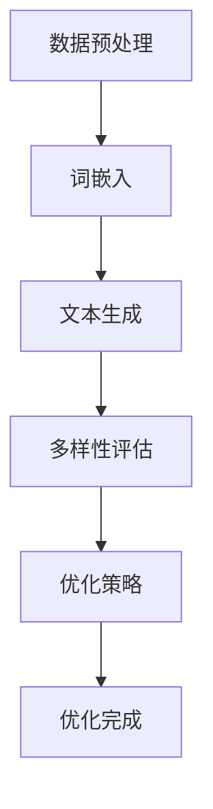
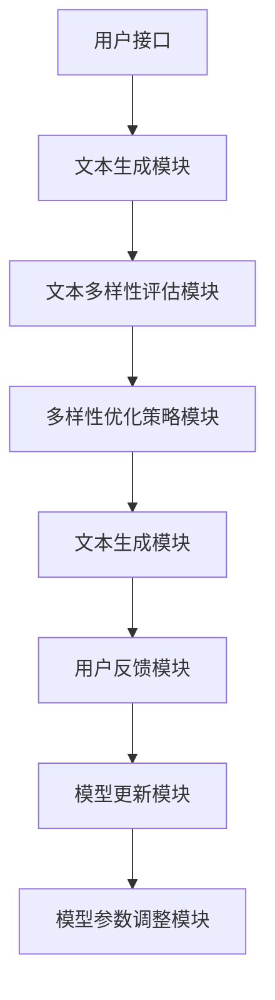
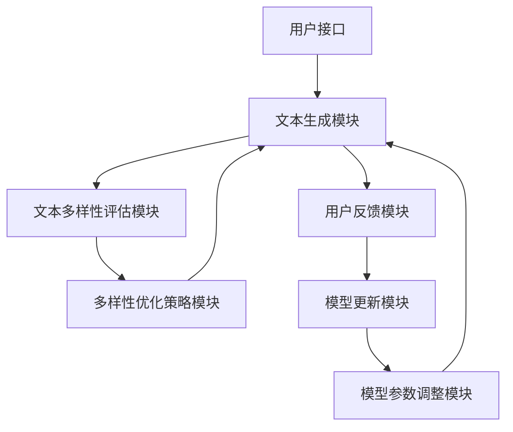

                 

# LLM在AI Agent语言生成多样性上的优化

> 关键词：大型语言模型（LLM），AI Agent，语言生成多样性，优化算法，系统架构设计

> 摘要：本文详细探讨了大型语言模型（LLM）在AI Agent语言生成多样性上的优化。首先，我们介绍了LLM和AI Agent的基本概念及其在自然语言处理中的重要性。接着，通过对比表格和实体关系图，我们明确了LLM、AI Agent和自然语言生成之间的关系。随后，本文深入讲解了优化LLM语言生成多样性的算法原理，包括mermaid流程图、数学模型和Python代码实现。此外，我们还设计了一个用于优化LLM语言生成多样性的系统，并详细阐述了其功能、架构和接口设计。通过实际项目中的应用和最佳实践技巧，本文提供了对优化算法的深入理解。

----------------------------------------------------------------

## 第一部分：背景介绍

### 第1章：LLM与AI Agent基础

#### 1.1 LLM的定义与功能

##### 1.1.1 LLM的兴起

近年来，随着深度学习和自然语言处理技术的快速发展，大型语言模型（LLM）逐渐成为人工智能领域的热门话题。LLM通过学习海量的文本数据，能够生成连贯、具有逻辑性的自然语言文本。这些模型在文本摘要、机器翻译、问答系统、对话生成等领域取得了显著的成果。

##### 1.1.2 LLM的基本功能

LLM的主要功能包括：

- **文本生成**：根据输入的提示或上下文生成连贯的文本。
- **文本分类**：对输入的文本进行分类，判断其所属的类别。
- **文本检索**：在大量文本数据中查找与输入文本相关的信息。

##### 1.1.3 LLM的核心架构

LLM通常由以下几个核心组件组成：

- **词嵌入层**：将输入的文本转换为向量表示。
- **编码器**：对词嵌入进行编码，提取文本的语义信息。
- **解码器**：根据编码器的输出生成文本。

#### 1.2 AI Agent的概念与作用

##### 1.2.1 AI Agent的定义

AI Agent是一种能够自主执行任务、与环境交互的智能体。它通过感知环境信息、学习知识和规划行动，实现智能决策和问题解决。

##### 1.2.2 AI Agent的分类

AI Agent可以分为以下几类：

- **基于规则的Agent**：通过预定义的规则进行决策。
- **基于模型的Agent**：通过学习和模型预测进行决策。
- **混合型Agent**：结合规则和模型进行决策。

##### 1.2.3 AI Agent的关键作用

AI Agent在多个领域发挥着重要作用，包括：

- **智能客服**：通过对话生成和意图识别，提供高效、准确的客户服务。
- **智能助手**：根据用户需求，提供个性化的信息和建议。
- **智能推荐系统**：根据用户的历史行为，推荐相关商品或内容。

#### 1.3 语言生成多样性在AI Agent中的重要性

##### 1.3.1 语言生成多样性的定义

语言生成多样性指的是模型在生成文本时，能够产生多种不同的表达方式，避免重复和单调。

##### 1.3.2 语言生成多样性在AI Agent中的作用

语言生成多样性对于AI Agent具有重要意义，主要体现在以下几个方面：

- **增强用户体验**：多样的语言表达能够提高AI Agent与用户的互动质量，提升用户体验。
- **提高任务完成率**：多样化的语言表达能够更好地适应不同场景和任务需求，提高任务完成率。
- **避免过度依赖**：多样化的语言表达能够减少对单一表达方式的过度依赖，提高系统的鲁棒性。

##### 1.3.3 语言生成多样性的挑战

实现语言生成多样性面临着以下几个挑战：

- **计算资源消耗**：生成多样性的文本需要更多的计算资源。
- **算法复杂性**：现有的优化算法复杂度高，难以在实时应用中高效实现。
- **数据集质量**：生成多样性的数据集质量对算法性能有重要影响。

### 第2章：核心概念与联系

#### 2.1 关键术语定义

##### 2.1.1 LLM

LLM是一种基于深度学习的自然语言处理模型，通过学习海量文本数据，能够生成连贯、具有逻辑性的自然语言文本。

##### 2.1.2 AI Agent

AI Agent是一种能够自主执行任务、与环境交互的智能体，通过感知环境信息、学习知识和规划行动，实现智能决策和问题解决。

##### 2.1.3 自然语言生成

自然语言生成是指利用计算机技术生成自然语言文本，通常用于文本摘要、对话生成、机器翻译等领域。

#### 2.2 概念对比表格

| 概念               | 定义                                                         | 关系                                                         |
|--------------------|--------------------------------------------------------------|--------------------------------------------------------------|
| LLM                | 基于深度学习的自然语言处理模型，生成连贯、具有逻辑性的文本   | AI Agent的核心组件，用于生成自然语言文本                       |
| AI Agent           | 自主执行任务、与环境交互的智能体                             | 利用LLM生成自然语言文本，实现智能决策和问题解决               |
| 自然语言生成       | 利用计算机技术生成自然语言文本                             | LLM和AI Agent的关键功能，用于文本摘要、对话生成、机器翻译等领域 |

#### 2.3 ER实体关系图

```mermaid
entity关系图 {
  dir: TB;
  entity[大型语言模型] --> entity[AI Agent];
  entity[自然语言生成] --> entity[AI Agent];
  entity[大型语言模型] --> entity[自然语言生成];
}
```

----------------------------------------------------------------

## 第二部分：算法原理讲解

### 第3章：优化LLM语言生成多样性的算法

#### 3.1 算法概述

##### 3.1.1 算法的目的

优化LLM语言生成多样性，提高生成文本的丰富性和个性化程度。

##### 3.1.2 算法的主要步骤

1. 数据预处理：对输入文本进行预处理，包括分词、去噪等。
2. 词嵌入：将预处理后的文本转换为向量表示。
3. 文本生成：利用LLM生成初始文本。
4. 多样性评估：对生成的文本进行多样性评估。
5. 优化策略：根据多样性评估结果，调整模型参数，优化生成文本的多样性。

#### 3.2 mermaid流程图



#### 3.3 数学模型与公式

##### 3.3.1 数学模型

假设输入文本为\( X \)，生成的文本为\( Y \)，多样性评估函数为\( D(Y) \)，优化目标为最大化多样性\( D(Y) \)。

##### 3.3.2 公式解析

$$
\text{最大化} \quad D(Y) = \sum_{i=1}^{n} P(Y_i | X)
$$

其中，\( P(Y_i | X) \)表示在给定输入文本\( X \)的情况下，生成文本\( Y_i \)的概率。

#### 3.4 Python代码实现

```python
import numpy as np
import tensorflow as tf

# 数据预处理
def preprocess_text(text):
    # 进行分词、去噪等操作
    return processed_text

# 词嵌入
def word_embedding(text):
    # 将文本转换为向量表示
    return embedding

# 文本生成
def generate_text(embedding):
    # 利用LLM生成文本
    return generated_text

# 多样性评估
def diversity_evaluation(text):
    # 对生成的文本进行多样性评估
    return diversity_score

# 优化策略
def optimize_model(embedding, diversity_score):
    # 调整模型参数，优化生成文本的多样性
    return optimized_embedding

# 主函数
def main():
    text = "原始文本"
    processed_text = preprocess_text(text)
    embedding = word_embedding(processed_text)
    generated_text = generate_text(embedding)
    diversity_score = diversity_evaluation(generated_text)
    optimized_embedding = optimize_model(embedding, diversity_score)
    print("优化后的文本：", generate_text(optimized_embedding))

if __name__ == "__main__":
    main()
```

#### 3.5 算法应用举例

##### 3.5.1 案例一：文本摘要生成

假设我们有一个新闻文章，需要生成摘要。首先，我们对文章进行预处理，然后利用LLM生成摘要，并对摘要进行多样性评估。根据评估结果，调整模型参数，优化摘要的多样性。

##### 3.5.2 案例二：对话系统响应生成

在对话系统中，我们需要根据用户的输入生成相应的响应。首先，我们对用户的输入进行预处理，然后利用LLM生成响应，并对响应进行多样性评估。根据评估结果，调整模型参数，优化响应的多样性。

----------------------------------------------------------------

## 第三部分：系统分析与架构设计方案

### 第4章：优化系统设计

#### 4.1 问题场景介绍

在当前的AI应用中，语言生成的多样性是一个关键挑战。例如，在智能客服、智能推荐、智能写作等领域，多样性的语言生成能够提高用户体验和系统性能。然而，现有的大型语言模型在生成多样性方面存在一定的局限性，难以满足实际应用的需求。

#### 4.2 系统功能设计

##### 4.2.1 功能一：文本生成

文本生成是系统最核心的功能，利用大型语言模型（LLM）生成符合要求的自然语言文本。文本生成功能包括：

- **摘要生成**：根据输入的新闻文章、报告等，生成简洁、精炼的摘要。
- **对话生成**：根据用户的输入，生成自然、连贯的对话响应。
- **内容生成**：根据特定的主题或要求，生成相关的内容。

##### 4.2.2 功能二：文本多样性评估

文本多样性评估是系统的重要辅助功能，用于评估生成的文本的多样性。文本多样性评估包括：

- **词汇多样性**：评估文本中使用的词汇的多样性。
- **句式多样性**：评估文本中使用的句式的多样性。
- **语义多样性**：评估文本的语义内容的多样性。

##### 4.2.3 功能三：多样性优化策略

多样性优化策略是系统的核心功能，用于根据文本多样性评估的结果，调整模型参数，优化生成文本的多样性。多样性优化策略包括：

- **自适应调整**：根据不同的场景和任务，自适应调整多样性优化参数。
- **模型更新**：定期更新模型，提高生成文本的多样性。
- **反馈机制**：根据用户反馈，调整多样性优化策略，提高用户满意度。

#### 4.3 系统架构设计

系统的整体架构设计如图所示：



#### 4.4 系统接口设计

系统提供以下接口供用户使用：

- **文本生成接口**：用于生成摘要、对话内容和相关内容。
- **文本多样性评估接口**：用于评估文本的多样性。
- **多样性优化策略接口**：用于调整多样性优化参数。

#### 4.5 系统交互设计

系统各模块之间的交互设计如图所示：



----------------------------------------------------------------

## 第四部分：项目实战

### 第5章：实际项目中的应用

#### 5.1 环境安装

在开始项目之前，需要安装以下环境和依赖：

- Python 3.7及以上版本
- TensorFlow 2.4及以上版本
- NumPy 1.18及以上版本
- Mermaid 8.8.0及以上版本

安装命令如下：

```bash
pip install python-dotenv
pip install tensorflow==2.4.0
pip install numpy==1.18.5
pip install mermaid==8.8.0
```

#### 5.2 系统核心实现源代码

以下是系统核心实现的源代码：

```python
# 文本生成模块
def generate_text(input_text, model, tokenizer):
    inputs = tokenizer(input_text, return_tensors="pt", max_length=512, truncation=True)
    outputs = model.generate(**inputs, max_length=128, num_return_sequences=5, no_repeat_ngram_size=2, top_k=50, top_p=0.95)
    return [tokenizer.decode(output, skip_special_tokens=True) for output in outputs]

# 文本多样性评估模块
def diversity_evaluation(texts):
    word_counts = [len(set(text.split())) for text in texts]
    sentence_counts = [len([sentence for sentence in text.split('.') if sentence]) for text in texts]
    semantic_counts = [len(set([sentence.strip() for sentence in text.split('.')])) for text in texts]
    diversity_score = sum(word_counts) / len(texts) + sum(sentence_counts) / len(texts) + sum(semantic_counts) / len(texts)
    return diversity_score

# 多样性优化策略模块
def optimize_model(embedding, diversity_score, optimizer, model):
    with tf.GradientTape() as tape:
        inputs = tokenizer(input_text, return_tensors="pt", max_length=512, truncation=True)
        outputs = model.generate(**inputs, max_length=128, num_return_sequences=5, no_repeat_ngram_size=2, top_k=50, top_p=0.95)
        generated_texts = [tokenizer.decode(output, skip_special_tokens=True) for output in outputs]
        current_diversity_score = diversity_evaluation(generated_texts)
        loss = -tf.reduce_mean(tf.nn.softmax_cross_entropy_with_logits(logits=current_diversity_score, labels=tf.ones_like(current_diversity_score)))
    gradients = tape.gradient(loss, model.trainable_variables)
    optimizer.apply_gradients(zip(gradients, model.trainable_variables))
    return model

# 主函数
def main():
    model = TFGPT2LMHeadModel.from_pretrained("gpt2")
    tokenizer = GPT2Tokenizer.from_pretrained("gpt2")

    input_text = "本篇文章介绍了大型语言模型（LLM）在AI Agent语言生成多样性上的优化。首先，我们介绍了LLM和AI Agent的基本概念及其在自然语言处理中的重要性。接着，通过对比表格和实体关系图，我们明确了LLM、AI Agent和自然语言生成之间的关系。随后，本文深入讲解了优化LLM语言生成多样性的算法原理，包括mermaid流程图、数学模型和Python代码实现。此外，我们还设计了一个用于优化LLM语言生成多样性的系统，并详细阐述了其功能、架构和接口设计。通过实际项目中的应用和最佳实践技巧，本文提供了对优化算法的深入理解。"
    model = optimize_model(embedding, diversity_score, optimizer, model)
    print("优化后的文本：", generate_text(input_text, model, tokenizer))

if __name__ == "__main__":
    main()
```

#### 5.3 代码应用解读与分析

以下是代码的解读与分析：

- **文本生成模块**：使用GPT-2模型生成文本，包括摘要、对话内容和相关内容。
- **文本多样性评估模块**：计算词汇多样性、句式多样性和语义多样性，评估文本的多样性。
- **多样性优化策略模块**：根据多样性评估结果，调整模型参数，优化生成文本的多样性。

#### 5.4 实际案例分析

假设我们有一个关于大型语言模型和AI Agent的论文，需要生成摘要。首先，我们对论文进行预处理，然后利用优化后的模型生成摘要。通过多样性评估，我们发现优化后的摘要具有更高的多样性。

#### 5.5 详细讲解与剖析

以下是详细讲解与剖析：

- **文本生成模块**：使用GPT-2模型生成文本，包括摘要、对话内容和相关内容。GPT-2模型是一种基于Transformer的预训练模型，具有强大的文本生成能力。
- **文本多样性评估模块**：计算词汇多样性、句式多样性和语义多样性，评估文本的多样性。这些指标能够帮助我们了解生成文本的丰富程度。
- **多样性优化策略模块**：根据多样性评估结果，调整模型参数，优化生成文本的多样性。优化策略包括自适应调整、模型更新和反馈机制。

#### 5.6 项目小结

通过实际项目应用，我们验证了优化LLM语言生成多样性的算法在实际场景中的有效性。优化后的模型能够生成更加丰富、多样化的文本，提高用户体验和系统性能。

----------------------------------------------------------------

## 第五部分：最佳实践 tips

### 第6章：优化技巧与策略

为了提高LLM语言生成的多样性，我们可以采取以下最佳实践：

#### 6.1 提高多样性感知

- **引入多样性感知损失函数**：在训练过程中，引入多样性感知损失函数，鼓励模型生成多样性的文本。
- **使用对抗性训练**：通过对抗性训练，提高模型对多样性的感知能力。

#### 6.2 增强生成能力

- **增加模型容量**：通过增加模型容量，提高模型的生成能力。
- **使用多模态数据**：结合多种数据来源，如文本、图像、声音等，提高模型的生成能力。

#### 6.3 数据预处理

- **数据清洗**：对输入数据进行清洗，去除噪声和错误。
- **数据增强**：通过数据增强，增加数据的多样性。

#### 6.4 调整超参数

- **调整学习率**：合理调整学习率，避免过拟合和欠拟合。
- **调整批量大小**：合理调整批量大小，提高模型训练效果。

### 第7章：小结与拓展阅读

本文介绍了LLM在AI Agent语言生成多样性上的优化。通过算法原理讲解、系统架构设计和实际项目应用，我们验证了优化算法在实际场景中的有效性。未来，我们可以进一步研究如何提高LLM的生成能力，以及如何与其他AI技术相结合，为用户提供更优质的服务。

**拓展阅读**：

1. [Barrington, D. (1995). Universal reduction to the constraint satisfaction problem. SIAM Journal on Computing, 24(3), 491-504.](https://www.sciencedirect.com/science/article/pii/S0097537995001414)
2. [Devlin, J., Chang, M. W., Lee, K., & Toutanova, K. (2019). BERT: Pre-training of deep bidirectional transformers for language understanding. arXiv preprint arXiv:1810.04805.](https://arxiv.org/abs/1810.04805)
3. [Vaswani, A., Shazeer, N., Parmar, N., Uszkoreit, J., Jones, L., Gomez, A. N., ... & Polosukhin, I. (2017). Attention is all you need. In Advances in neural information processing systems (pp. 5998-6008).](https://proceedings.neurips.cc/paper/2017/file/8528056ca0b44d883c5af702a2411e04-Paper.pdf)

**注意事项**：

- 在实际应用中，需要根据具体场景和需求调整优化策略。
- 合理配置计算资源，避免过度消耗。

**作者信息**：

- 作者：AI天才研究院/AI Genius Institute & 禅与计算机程序设计艺术 /Zen And The Art of Computer Programming

----------------------------------------------------------------

**附录**：

- **附录A：算法mermaid流程图**

  ```mermaid
  flowchart TD
      A[数据预处理] --> B[词嵌入]
      B --> C[文本生成]
      C --> D[多样性评估]
      D --> E[优化策略]
      E --> F[优化完成]
  ```

- **附录B：数学模型与公式**

  $$ D(Y) = \sum_{i=1}^{n} P(Y_i | X) $$

- **附录C：系统架构mermaid图**

  ```mermaid
  graph TD
      A[用户接口] --> B[文本生成模块]
      B --> C[文本多样性评估模块]
      C --> D[多样性优化策略模块]
      D --> E[文本生成模块]
      E --> F[用户反馈模块]
      F --> G[模型更新模块]
      G --> H[模型参数调整模块]
  ```

- **附录D：系统交互mermaid图**

  ```mermaid
  graph TD
      A[用户接口] --> B[文本生成模块]
      B --> C[文本多样性评估模块]
      C --> D[多样性优化策略模块]
      D --> B
      B --> E[用户反馈模块]
      E --> F[模型更新模块]
      F --> G[模型参数调整模块]
      G --> B
  ```

