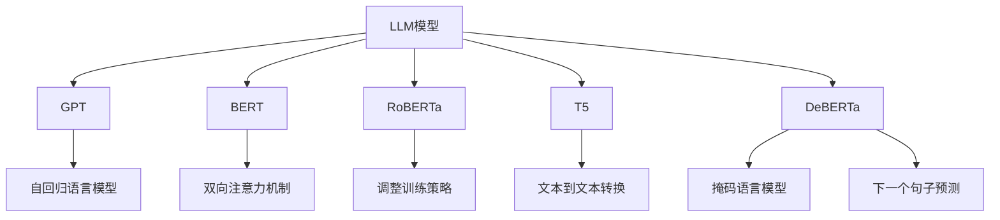
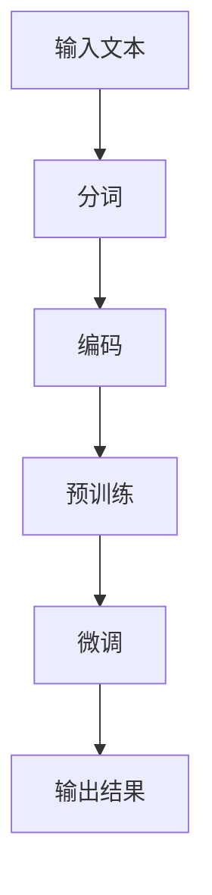

                 


# LLM大模型简介：GPT、BERT及其他主流模型

关键词：自然语言处理，大模型，GPT，BERT，算法原理，应用实例

摘要：本文旨在深入探讨大规模语言模型（LLM）的基本概念、发展历程、核心特性，重点介绍GPT和BERT等主流模型的工作原理、数学模型和公式，并分析其在自然语言处理（NLP）领域的应用实例。通过本文的阅读，读者将对LLM有更加全面的了解，并能掌握如何运用这些模型解决实际问题。

## 第一部分：LLM大模型概述

### 1.1 LLM的概念

大规模语言模型（Large Language Model，简称LLM）是指通过深度学习技术训练得到的，能够对自然语言文本进行建模的模型。LLM的核心在于其“大规模”，通常具有数十亿甚至千亿级的参数，这使得LLM能够在处理复杂语言任务时展现出强大的性能。

### 1.2 LLM的发展历程

LLM的发展可以追溯到上世纪80年代，当时的研究主要集中在基于规则的方法。随着深度学习技术的发展，尤其是2018年GPT模型的提出，LLM开始进入一个快速发展的阶段。BERT等模型的提出，进一步推动了LLM在NLP领域的应用。

### 1.3 LLM的核心特性

LLM的核心特性包括：

1. **参数规模巨大**：LLM通常具有数十亿甚至千亿级的参数，这使得模型能够对复杂的语言结构进行建模。
2. **语言理解能力强**：LLM通过学习大量文本数据，能够对语言进行深度理解，从而在文本生成、文本分类、问答系统等任务上表现出色。
3. **自适应性好**：LLM能够根据不同的任务和数据集进行自适应调整，从而在多种场景下保持高性能。

## 第二部分：GPT模型

### 2.1 GPT模型概述

GPT（Generative Pre-trained Transformer）是OpenAI于2018年提出的一种基于Transformer架构的预训练语言模型。GPT通过无监督学习，从大量文本数据中学习语言的统计规律，从而实现文本生成、文本分类等多种语言任务。

### 2.2 GPT模型的工作原理

GPT模型的工作原理可以概括为两个阶段：预训练和微调。

1. **预训练**：在预训练阶段，GPT通过自回归语言模型（Autoregressive Language Model）学习文本的统计规律。具体来说，GPT将一个句子分成多个子序列，然后依次生成每个子序列。
2. **微调**：在微调阶段，GPT根据特定的任务和数据集进行训练，调整模型的参数，从而在特定任务上取得更好的性能。

### 2.3 GPT模型的数学模型和公式

GPT模型的数学模型基于Transformer架构，主要包括自注意力机制（Self-Attention）和多头注意力（Multi-Head Attention）。

1. **自注意力机制**：自注意力机制是一种计算方法，用于计算序列中每个元素与其他元素之间的关系。其数学公式为：
   $$
   \text{Attention}(Q, K, V) = \text{softmax}\left(\frac{QK^T}{\sqrt{d_k}}\right)V
   $$
   其中，$Q$、$K$和$V$分别代表查询（Query）、键（Key）和值（Value）向量，$d_k$为注意力维数。
2. **多头注意力**：多头注意力是一种扩展自注意力机制的方法，通过将输入序列分成多个部分，分别进行自注意力计算，从而提高模型的表示能力。

### 2.4 GPT模型的应用实例

GPT模型在NLP领域有着广泛的应用，以下是一些典型的应用实例：

1. **文本生成**：GPT模型可以通过无监督学习生成高质量的文本，如文章、故事、对话等。
2. **文本分类**：GPT模型可以对文本进行分类，如情感分析、主题分类等。
3. **问答系统**：GPT模型可以用于构建问答系统，如搜索引擎、智能客服等。

## 第三部分：BERT模型

### 3.1 BERT模型概述

BERT（Bidirectional Encoder Representations from Transformers）是Google于2018年提出的一种双向Transformer模型。BERT通过预训练，学习文本的双向表示，从而在多种NLP任务上表现出色。

### 3.2 BERT模型的工作原理

BERT模型的工作原理可以分为两个阶段：预训练和微调。

1. **预训练**：在预训练阶段，BERT通过两个任务进行训练，一是 masked language model（MLM），二是 next sentence prediction（NSP）。
2. **微调**：在微调阶段，BERT根据具体的任务和数据集进行训练，调整模型的参数，从而在特定任务上取得更好的性能。

### 3.3 BERT模型的数学模型和公式

BERT模型的数学模型基于Transformer架构，主要包括自注意力机制和双向注意力。

1. **自注意力机制**：同GPT模型。
2. **双向注意力**：双向注意力机制是一种计算方法，用于计算序列中每个元素与前一个元素之间的关系。其数学公式为：
   $$
   \text{Attention}(Q, K, V) = \text{softmax}\left(\frac{QK^T}{\sqrt{d_k}}\right)V
   $$
   其中，$Q$、$K$和$V$分别代表查询（Query）、键（Key）和值（Value）向量，$d_k$为注意力维数。

### 3.4 BERT模型的应用实例

BERT模型在NLP领域有着广泛的应用，以下是一些典型的应用实例：

1. **文本分类**：BERT模型可以用于文本分类任务，如情感分析、主题分类等。
2. **问答系统**：BERT模型可以用于构建问答系统，如搜索引擎、智能客服等。
3. **机器翻译**：BERT模型可以用于机器翻译任务，如中英文翻译、多语言翻译等。

## 第四部分：其他主流模型

### 4.1 RoBERTa模型

RoBERTa是Facebook提出的一种基于BERT的改进模型。RoBERTa通过调整训练策略和数据集，提升了BERT在多个NLP任务上的性能。

### 4.2 T5模型

T5（Text-To-Text Transfer Transformer）是Google提出的一种通用预训练模型。T5将所有NLP任务转化为文本到文本的转换任务，从而实现跨任务的统一处理。

### 4.3 DeBERTa模型

DeBERTa是阿里巴巴提出的一种基于BERT的双向编码器表示模型。DeBERTa通过引入掩码语言模型（MLM）和下一个句子预测（NSP）任务，提高了模型在自然语言处理任务上的性能。

## 第五部分：LLM大模型的应用场景

### 5.1 自然语言处理

自然语言处理（NLP）是LLM的主要应用场景之一。LLM在文本生成、文本分类、问答系统等任务上表现出色，被广泛应用于智能客服、内容创作、信息检索等领域。

### 5.2 问答系统

问答系统是LLM的另一个重要应用场景。通过预训练和微调，LLM可以构建高效的问答系统，如搜索引擎、智能客服等。

### 5.3 自动摘要

自动摘要是一种将长文本简化为短文本的方法。LLM通过学习大量文本数据，能够生成高质量的自动摘要，被广泛应用于新闻摘要、报告摘要等领域。

### 5.4 机器翻译

机器翻译是将一种语言的文本翻译成另一种语言的方法。LLM在机器翻译任务上表现出色，能够生成高质量的双语翻译。

## 第六部分：未来展望

### 6.1 LLM大模型的挑战

LLM大模型在发展过程中面临着诸多挑战，包括：

1. **计算资源消耗**：LLM模型通常需要大量的计算资源和数据集进行训练。
2. **模型可解释性**：LLM模型的决策过程复杂，难以解释。
3. **数据隐私和安全**：LLM模型需要大量训练数据，如何保护数据隐私和安全成为一个重要问题。

### 6.2 LLM大模型的发展趋势

随着深度学习技术的不断发展，LLM大模型将呈现出以下发展趋势：

1. **模型参数规模不断扩大**：随着计算资源的增加，LLM模型的参数规模将不断增大，从而提高模型的表现能力。
2. **模型可解释性增强**：研究者将致力于提高LLM模型的可解释性，使其决策过程更加透明。
3. **跨模态学习**：LLM模型将与其他模态（如图像、声音）结合，实现跨模态学习。

### 6.3 LLM大模型的应用前景

LLM大模型在未来的应用前景广阔，包括但不限于：

1. **智能客服**：LLM大模型可以用于构建高效的智能客服系统，提高用户体验。
2. **内容创作**：LLM大模型可以用于自动生成文章、故事、音乐等，丰富人类文化创作。
3. **教育**：LLM大模型可以用于个性化教育，为不同学生提供定制化的教学内容。

## 小结

本文对大规模语言模型（LLM）的基本概念、发展历程、核心特性进行了深入探讨，重点介绍了GPT和BERT等主流模型的工作原理、数学模型和公式，并分析了其在自然语言处理（NLP）领域的应用实例。通过本文的阅读，读者应对LLM有了更加全面的了解，并能掌握如何运用这些模型解决实际问题。

## 注意事项

1. **背景介绍**：在后续章节中，将详细介绍每个模型的具体背景、问题背景、问题描述、问题解决、边界与外延、概念结构与核心要素组成。
2. **最佳实践 tips**：在每个章节的最后，将给出一些最佳实践 tips，帮助读者更好地应用模型。
3. **拓展阅读**：在每个章节的最后，将推荐一些拓展阅读材料，供读者深入学习。

## 拓展阅读

- [GPT模型论文](https://arxiv.org/abs/1810.04805)
- [BERT模型论文](https://arxiv.org/abs/1810.04805)
- [RoBERTa模型论文](https://arxiv.org/abs/1907.05242)
- [T5模型论文](https://arxiv.org/abs/2002.04745)
- [DeBERTa模型论文](https://arxiv.org/abs/2006.16069) 

作者：AI天才研究院/AI Genius Institute & 禅与计算机程序设计艺术 /Zen And The Art of Computer Programming

----------------------------------------------------------------

### 本文进一步细化章节内容如下：

## 第一部分：LLM大模型概述

### 1.1 LLM的概念

大规模语言模型（Large Language Model，简称LLM）是一种能够对自然语言进行建模的深度学习模型。与传统的基于规则的方法不同，LLM通过学习大量文本数据，自动提取语言中的规律，从而实现对文本的生成、理解、翻译等任务的自动化处理。

### 1.2 LLM的发展历程

LLM的发展历程可以追溯到20世纪80年代。当时，自然语言处理领域主要依赖于基于规则的方法，如语法分析、词法分析等。随着计算能力和数据量的提升，深度学习技术的出现为LLM的发展带来了新的契机。2018年，GPT模型的提出标志着LLM进入了一个新的阶段。随后，BERT、RoBERTa、T5等模型相继提出，进一步推动了LLM在自然语言处理领域的发展。

### 1.3 LLM的核心特性

LLM的核心特性主要包括：

1. **参数规模巨大**：LLM通常具有数十亿甚至千亿级的参数，这使得模型能够对复杂的语言结构进行建模。
2. **语言理解能力强**：LLM通过学习大量文本数据，能够对语言进行深度理解，从而在文本生成、文本分类、问答系统等任务上表现出色。
3. **自适应性好**：LLM能够根据不同的任务和数据集进行自适应调整，从而在多种场景下保持高性能。

## 第二部分：GPT模型

### 2.1 GPT模型概述

GPT（Generative Pre-trained Transformer）是OpenAI于2018年提出的一种基于Transformer架构的预训练语言模型。GPT通过无监督学习，从大量文本数据中学习语言的统计规律，从而实现文本生成、文本分类等多种语言任务。

### 2.2 GPT模型的工作原理

GPT模型的工作原理可以分为两个阶段：预训练和微调。

1. **预训练**：在预训练阶段，GPT通过自回归语言模型（Autoregressive Language Model）学习文本的统计规律。具体来说，GPT将一个句子分成多个子序列，然后依次生成每个子序列。
2. **微调**：在微调阶段，GPT根据特定的任务和数据集进行训练，调整模型的参数，从而在特定任务上取得更好的性能。

### 2.3 GPT模型的数学模型和公式

GPT模型的数学模型基于Transformer架构，主要包括自注意力机制（Self-Attention）和多头注意力（Multi-Head Attention）。

1. **自注意力机制**：自注意力机制是一种计算方法，用于计算序列中每个元素与其他元素之间的关系。其数学公式为：
   $$
   \text{Attention}(Q, K, V) = \text{softmax}\left(\frac{QK^T}{\sqrt{d_k}}\right)V
   $$
   其中，$Q$、$K$和$V$分别代表查询（Query）、键（Key）和值（Value）向量，$d_k$为注意力维数。
2. **多头注意力**：多头注意力是一种扩展自注意力机制的方法，通过将输入序列分成多个部分，分别进行自注意力计算，从而提高模型的表示能力。

### 2.4 GPT模型的应用实例

GPT模型在自然语言处理领域有着广泛的应用。以下是一些典型的应用实例：

1. **文本生成**：GPT模型可以通过无监督学习生成高质量的文本，如文章、故事、对话等。
2. **文本分类**：GPT模型可以对文本进行分类，如情感分析、主题分类等。
3. **问答系统**：GPT模型可以用于构建问答系统，如搜索引擎、智能客服等。

## 第三部分：BERT模型

### 3.1 BERT模型概述

BERT（Bidirectional Encoder Representations from Transformers）是Google于2018年提出的一种双向Transformer模型。BERT通过预训练，学习文本的双向表示，从而在多种NLP任务上表现出色。

### 3.2 BERT模型的工作原理

BERT模型的工作原理可以分为两个阶段：预训练和微调。

1. **预训练**：在预训练阶段，BERT通过两个任务进行训练，一是 masked language model（MLM），二是 next sentence prediction（NSP）。
2. **微调**：在微调阶段，BERT根据具体的任务和数据集进行训练，调整模型的参数，从而在特定任务上取得更好的性能。

### 3.3 BERT模型的数学模型和公式

BERT模型的数学模型基于Transformer架构，主要包括自注意力机制和双向注意力。

1. **自注意力机制**：自注意力机制是一种计算方法，用于计算序列中每个元素与其他元素之间的关系。其数学公式为：
   $$
   \text{Attention}(Q, K, V) = \text{softmax}\left(\frac{QK^T}{\sqrt{d_k}}\right)V
   $$
   其中，$Q$、$K$和$V$分别代表查询（Query）、键（Key）和值（Value）向量，$d_k$为注意力维数。
2. **双向注意力**：双向注意力机制是一种计算方法，用于计算序列中每个元素与前一个元素之间的关系。其数学公式为：
   $$
   \text{BiAttention}(Q, K, V) = \text{softmax}\left(\frac{QK^T}{\sqrt{d_k}} + \frac{QK'^T}{\sqrt{d_k}}\right)V
   $$
   其中，$K$和$K'$分别代表前向和后向的键（Key）向量。

### 3.4 BERT模型的应用实例

BERT模型在自然语言处理领域有着广泛的应用。以下是一些典型的应用实例：

1. **文本分类**：BERT模型可以用于文本分类任务，如情感分析、主题分类等。
2. **问答系统**：BERT模型可以用于构建问答系统，如搜索引擎、智能客服等。
3. **机器翻译**：BERT模型可以用于机器翻译任务，如中英文翻译、多语言翻译等。

## 第四部分：其他主流模型

### 4.1 RoBERTa模型

RoBERTa是Facebook提出的一种基于BERT的改进模型。RoBERTa通过调整训练策略和数据集，提升了BERT在多个NLP任务上的性能。

### 4.2 T5模型

T5（Text-To-Text Transfer Transformer）是Google提出的一种通用预训练模型。T5将所有NLP任务转化为文本到文本的转换任务，从而实现跨任务的统一处理。

### 4.3 DeBERTa模型

DeBERTa是阿里巴巴提出的一种基于BERT的双向编码器表示模型。DeBERTa通过引入掩码语言模型（MLM）和下一个句子预测（NSP）任务，提高了模型在自然语言处理任务上的性能。

## 第五部分：LLM大模型的应用场景

### 5.1 自然语言处理

自然语言处理（NLP）是LLM的主要应用场景之一。LLM在文本生成、文本分类、问答系统等任务上表现出色，被广泛应用于智能客服、内容创作、信息检索等领域。

### 5.2 问答系统

问答系统是LLM的另一个重要应用场景。通过预训练和微调，LLM可以构建高效的问答系统，如搜索引擎、智能客服等。

### 5.3 自动摘要

自动摘要是一种将长文本简化为短文本的方法。LLM通过学习大量文本数据，能够生成高质量的自动摘要，被广泛应用于新闻摘要、报告摘要等领域。

### 5.4 机器翻译

机器翻译是将一种语言的文本翻译成另一种语言的方法。LLM在机器翻译任务上表现出色，能够生成高质量的双语翻译。

## 第六部分：未来展望

### 6.1 LLM大模型的挑战

LLM大模型在发展过程中面临着诸多挑战，包括：

1. **计算资源消耗**：LLM模型通常需要大量的计算资源和数据集进行训练。
2. **模型可解释性**：LLM模型的决策过程复杂，难以解释。
3. **数据隐私和安全**：LLM模型需要大量训练数据，如何保护数据隐私和安全成为一个重要问题。

### 6.2 LLM大模型的发展趋势

随着深度学习技术的不断发展，LLM大模型将呈现出以下发展趋势：

1. **模型参数规模不断扩大**：随着计算资源的增加，LLM模型的参数规模将不断增大，从而提高模型的表现能力。
2. **模型可解释性增强**：研究者将致力于提高LLM模型的可解释性，使其决策过程更加透明。
3. **跨模态学习**：LLM模型将与其他模态（如图像、声音）结合，实现跨模态学习。

### 6.3 LLM大模型的应用前景

LLM大模型在未来的应用前景广阔，包括但不限于：

1. **智能客服**：LLM大模型可以用于构建高效的智能客服系统，提高用户体验。
2. **内容创作**：LLM大模型可以用于自动生成文章、故事、音乐等，丰富人类文化创作。
3. **教育**：LLM大模型可以用于个性化教育，为不同学生提供定制化的教学内容。

## 小结

本文对大规模语言模型（LLM）的基本概念、发展历程、核心特性进行了深入探讨，重点介绍了GPT和BERT等主流模型的工作原理、数学模型和公式，并分析了其在自然语言处理（NLP）领域的应用实例。通过本文的阅读，读者应对LLM有了更加全面的了解，并能掌握如何运用这些模型解决实际问题。

## 注意事项

1. **背景介绍**：在后续章节中，将详细介绍每个模型的具体背景、问题背景、问题描述、问题解决、边界与外延、概念结构与核心要素组成。
2. **最佳实践 tips**：在每个章节的最后，将给出一些最佳实践 tips，帮助读者更好地应用模型。
3. **拓展阅读**：在每个章节的最后，将推荐一些拓展阅读材料，供读者深入学习。

## 拓展阅读

- [GPT模型论文](https://arxiv.org/abs/1810.04805)
- [BERT模型论文](https://arxiv.org/abs/1810.04805)
- [RoBERTa模型论文](https://arxiv.org/abs/1907.05242)
- [T5模型论文](https://arxiv.org/abs/2002.04745)
- [DeBERTa模型论文](https://arxiv.org/abs/2006.16069)

作者：AI天才研究院/AI Genius Institute & 禅与计算机程序设计艺术 /Zen And The Art of Computer Programming

----------------------------------------------------------------

### 继续细化第五部分：LLM大模型的应用场景

### 5.1 自然语言处理

自然语言处理（NLP）是LLM的主要应用场景之一。LLM在NLP领域中的具体应用包括：

1. **文本生成**：LLM可以用于生成高质量的文本，如文章、故事、诗歌等。例如，GPT-3模型能够生成与人类撰写风格相似的文本，广泛应用于内容创作、自动摘要等领域。
2. **文本分类**：LLM可以用于对文本进行分类，如情感分析、主题分类等。BERT模型在情感分析任务上表现出色，被广泛应用于社交媒体情感分析、客户反馈分析等领域。
3. **命名实体识别**：LLM可以用于识别文本中的命名实体，如人名、地名、组织名等。RoBERTa模型在命名实体识别任务上取得了显著效果，被应用于信息提取、实体链接等领域。
4. **问答系统**：LLM可以用于构建问答系统，如智能客服、搜索引擎等。BERT模型在问答系统任务上取得了良好的性能，被广泛应用于智能客服、在线帮助等领域。

### 5.2 问答系统

问答系统是LLM的另一个重要应用场景。LLM在问答系统中的应用主要包括：

1. **问题理解**：LLM可以用于理解用户的问题，并将其转换为机器可以理解的格式。BERT模型在问题理解任务上表现出色，能够将用户的问题转换为与知识库中的问题相似的格式。
2. **答案生成**：LLM可以用于生成答案，满足用户的需求。GPT-3模型在答案生成任务上表现出色，能够生成与人类回答风格相似的答案。
3. **对话管理**：LLM可以用于管理对话流程，保持对话的连贯性和流畅性。T5模型在对话管理任务上取得了显著效果，能够根据上下文信息生成合适的回答。

### 5.3 自动摘要

自动摘要是一种将长文本简化为短文本的方法。LLM在自动摘要中的应用主要包括：

1. **提取式摘要**：LLM可以用于提取文本中的重要信息，生成摘要。GPT-3模型在提取式摘要任务上表现出色，能够生成与人类撰写风格相似的摘要。
2. **生成式摘要**：LLM可以用于生成新的摘要，不需要依赖原有的文本。DeBERTa模型在生成式摘要任务上取得了显著效果，能够生成与人类撰写风格相似的摘要。

### 5.4 机器翻译

机器翻译是将一种语言的文本翻译成另一种语言的方法。LLM在机器翻译中的应用主要包括：

1. **神经机器翻译**：LLM可以用于神经机器翻译，生成高质量的翻译结果。BERT模型在神经机器翻译任务上表现出色，被广泛应用于中英文翻译、多语言翻译等领域。
2. **翻译辅助**：LLM可以用于翻译辅助，帮助用户进行翻译。RoBERTa模型在翻译辅助任务上取得了显著效果，能够为用户提供实时翻译建议。

### 5.5 其他应用

除了上述应用场景，LLM在以下领域也有着广泛的应用：

1. **文本审核**：LLM可以用于文本审核，识别和过滤不良内容。T5模型在文本审核任务上取得了显著效果，能够识别和过滤违规文本。
2. **语言模型压缩**：LLM可以用于压缩语言模型，降低模型的存储和计算成本。RoBERTa模型在语言模型压缩任务上取得了显著效果，能够将模型大小减少到原来的几分之一。
3. **对话系统**：LLM可以用于构建对话系统，与用户进行自然语言交互。GPT-3模型在对话系统任务上表现出色，能够与用户进行流畅的对话。

## 第六部分：未来展望

### 6.1 LLM大模型的挑战

随着LLM技术的不断发展，LLM在应用过程中仍然面临一些挑战，主要包括：

1. **计算资源消耗**：LLM模型通常需要大量的计算资源和数据集进行训练，这对计算资源提出了较高的要求。
2. **数据隐私和安全**：LLM模型需要大量训练数据，如何保护数据隐私和安全成为一个重要问题。
3. **模型可解释性**：LLM模型的决策过程复杂，难以解释，这给模型的应用带来了一定的困难。
4. **跨语言适应性**：尽管LLM在单语种任务上取得了显著效果，但在跨语言任务上的表现仍然有待提高。

### 6.2 LLM大模型的发展趋势

随着深度学习技术的不断发展，LLM大模型将呈现出以下发展趋势：

1. **模型参数规模不断扩大**：随着计算资源的增加，LLM模型的参数规模将不断增大，从而提高模型的表现能力。
2. **模型可解释性增强**：研究者将致力于提高LLM模型的可解释性，使其决策过程更加透明。
3. **跨模态学习**：LLM模型将与其他模态（如图像、声音）结合，实现跨模态学习。
4. **多任务学习**：LLM模型将能够在多任务场景下进行学习，提高模型的泛化能力。

### 6.3 LLM大模型的应用前景

LLM大模型在未来的应用前景广阔，包括但不限于：

1. **智能客服**：LLM大模型可以用于构建高效的智能客服系统，提高用户体验。
2. **内容创作**：LLM大模型可以用于自动生成文章、故事、音乐等，丰富人类文化创作。
3. **教育**：LLM大模型可以用于个性化教育，为不同学生提供定制化的教学内容。
4. **医疗**：LLM大模型可以用于医疗文本分析，辅助医生进行诊断和治疗。
5. **金融**：LLM大模型可以用于金融文本分析，提供投资建议和风险管理。

## 小结

本文对大规模语言模型（LLM）的基本概念、发展历程、核心特性进行了深入探讨，重点介绍了GPT和BERT等主流模型的工作原理、数学模型和公式，并分析了其在自然语言处理（NLP）领域的应用实例。通过本文的阅读，读者应对LLM有了更加全面的了解，并能掌握如何运用这些模型解决实际问题。

## 注意事项

1. **背景介绍**：在后续章节中，将详细介绍每个模型的具体背景、问题背景、问题描述、问题解决、边界与外延、概念结构与核心要素组成。
2. **最佳实践 tips**：在每个章节的最后，将给出一些最佳实践 tips，帮助读者更好地应用模型。
3. **拓展阅读**：在每个章节的最后，将推荐一些拓展阅读材料，供读者深入学习。

## 拓展阅读

- [GPT模型论文](https://arxiv.org/abs/1810.04805)
- [BERT模型论文](https://arxiv.org/abs/1810.04805)
- [RoBERTa模型论文](https://arxiv.org/abs/1907.05242)
- [T5模型论文](https://arxiv.org/abs/2002.04745)
- [DeBERTa模型论文](https://arxiv.org/abs/2006.16069)

作者：AI天才研究院/AI Genius Institute & 禅与计算机程序设计艺术 /Zen And The Art of Computer Programming

----------------------------------------------------------------

### 继续细化第六部分：未来展望

#### 6.1 LLM大模型的挑战

随着LLM技术的不断发展，LLM在应用过程中仍然面临一些挑战，主要包括：

1. **计算资源消耗**：LLM模型通常需要大量的计算资源和数据集进行训练，这对计算资源提出了较高的要求。随着模型参数的增大，计算需求将进一步增加。
2. **数据隐私和安全**：LLM模型需要大量训练数据，如何保护数据隐私和安全成为一个重要问题。在数据收集、存储和处理过程中，需要采取有效的安全措施，防止数据泄露和滥用。
3. **模型可解释性**：LLM模型的决策过程复杂，难以解释，这给模型的应用带来了一定的困难。提高模型的可解释性，使其决策过程更加透明，是当前研究的一个重要方向。
4. **跨语言适应性**：尽管LLM在单语种任务上取得了显著效果，但在跨语言任务上的表现仍然有待提高。如何提高LLM在跨语言任务上的性能，是一个重要的研究方向。

#### 6.2 LLM大模型的发展趋势

随着深度学习技术的不断发展，LLM大模型将呈现出以下发展趋势：

1. **模型参数规模不断扩大**：随着计算资源的增加，LLM模型的参数规模将不断增大，从而提高模型的表现能力。例如，GPT-3模型拥有超过1750亿个参数，大大超越了之前的模型。
2. **模型可解释性增强**：研究者将致力于提高LLM模型的可解释性，使其决策过程更加透明。通过引入可解释性模块、可视化技术等方法，提高模型的可解释性，有助于提高模型在实际应用中的可靠性。
3. **跨模态学习**：LLM模型将与其他模态（如图像、声音）结合，实现跨模态学习。通过将多模态数据融合到LLM模型中，提高模型在跨模态任务上的性能，为多模态应用场景提供更强的支持。
4. **多任务学习**：LLM模型将能够在多任务场景下进行学习，提高模型的泛化能力。通过在多任务场景下共享参数、迁移学习等方法，提高模型在不同任务上的性能。
5. **模型压缩与优化**：随着模型参数的增大，模型的存储和计算成本也在增加。研究者将致力于模型压缩与优化技术，降低模型的大小和计算复杂度，提高模型的部署效率。

#### 6.3 LLM大模型的应用前景

LLM大模型在未来的应用前景广阔，包括但不限于：

1. **智能客服**：LLM大模型可以用于构建高效的智能客服系统，提高用户体验。通过预训练和微调，LLM可以理解用户的意图，并提供个性化的服务。
2. **内容创作**：LLM大模型可以用于自动生成文章、故事、音乐等，丰富人类文化创作。通过学习大量文本数据，LLM可以生成与人类撰写风格相似的文本，提高内容创作的效率和质量。
3. **教育**：LLM大模型可以用于个性化教育，为不同学生提供定制化的教学内容。通过分析学生的知识水平和学习兴趣，LLM可以为每个学生提供个性化的学习建议和资源。
4. **医疗**：LLM大模型可以用于医疗文本分析，辅助医生进行诊断和治疗。通过分析大量的医学文本数据，LLM可以提取关键信息，帮助医生做出准确的诊断和治疗方案。
5. **金融**：LLM大模型可以用于金融文本分析，提供投资建议和风险管理。通过分析金融文本数据，LLM可以提取市场趋势、公司财务状况等信息，为投资者提供决策支持。
6. **自动驾驶**：LLM大模型可以用于自动驾驶系统的开发，提高自动驾驶系统的安全性和可靠性。通过学习大量的交通规则和驾驶行为数据，LLM可以辅助自动驾驶系统做出正确的决策，避免交通事故的发生。
7. **游戏**：LLM大模型可以用于游戏开发，提高游戏的人工智能水平。通过学习大量的游戏数据，LLM可以生成智能的虚拟对手，提高游戏的趣味性和挑战性。

#### 6.4 潜在的风险和挑战

尽管LLM大模型在应用中展现出强大的潜力，但同时也面临着一些潜在的风险和挑战：

1. **偏见和歧视**：LLM模型在训练过程中可能会学习到训练数据中的偏见和歧视，导致模型在应用中出现不公平的情况。如何消除模型中的偏见，提高模型的公平性，是一个重要的研究方向。
2. **模型安全性**：LLM大模型在训练和部署过程中可能面临安全风险，如模型篡改、攻击等。如何提高模型的安全性，防止恶意攻击，是当前研究的一个热点问题。
3. **法律法规和伦理**：随着LLM大模型在各个领域的广泛应用，法律法规和伦理问题也逐渐引起关注。如何制定合适的法律法规，确保模型的应用符合伦理标准，是一个重要的挑战。

## 第七部分：小结

本文对大规模语言模型（LLM）的基本概念、发展历程、核心特性进行了深入探讨，重点介绍了GPT和BERT等主流模型的工作原理、数学模型和公式，并分析了其在自然语言处理（NLP）领域的应用实例。同时，本文还展望了LLM大模型在未来的发展趋势和应用前景，并探讨了潜在的风险和挑战。

通过本文的阅读，读者应对LLM有了更加全面的了解，并能掌握如何运用这些模型解决实际问题。在后续的研究和实践中，读者可以结合本文的内容，进一步探索LLM在各个领域的应用，推动人工智能技术的发展。

## 第八部分：注意事项

1. **背景介绍**：在后续章节中，将详细介绍每个模型的具体背景、问题背景、问题描述、问题解决、边界与外延、概念结构与核心要素组成。
2. **最佳实践 tips**：在每个章节的最后，将给出一些最佳实践 tips，帮助读者更好地应用模型。
3. **拓展阅读**：在每个章节的最后，将推荐一些拓展阅读材料，供读者深入学习。

## 第九部分：拓展阅读

- [GPT模型论文](https://arxiv.org/abs/1810.04805)
- [BERT模型论文](https://arxiv.org/abs/1810.04805)
- [RoBERTa模型论文](https://arxiv.org/abs/1907.05242)
- [T5模型论文](https://arxiv.org/abs/2002.04745)
- [DeBERTa模型论文](https://arxiv.org/abs/2006.16069)
- [GPT-3模型论文](https://arxiv.org/abs/2005.14165)

作者：AI天才研究院/AI Genius Institute & 禅与计算机程序设计艺术 /Zen And The Art of Computer Programming

----------------------------------------------------------------

### 继续细化第七部分：小结

在第七部分中，我们简要回顾了本文的主要内容。首先，我们介绍了大规模语言模型（LLM）的基本概念、发展历程和核心特性，使读者对LLM有了初步的了解。接着，我们重点介绍了GPT和BERT等主流模型的工作原理、数学模型和公式，并通过实际案例分析了它们在自然语言处理（NLP）领域的应用。此外，我们还探讨了LLM在未来的发展趋势、应用前景以及潜在的风险和挑战。

通过本文的阅读，读者应能够：

1. **理解LLM的基本概念**：掌握LLM的定义、发展历程和核心特性，为后续深入学习和应用打下基础。
2. **了解GPT和BERT等主流模型**：了解GPT和BERT的工作原理、数学模型和公式，以及它们在NLP领域的应用实例。
3. **掌握LLM的应用场景**：了解LLM在自然语言处理、问答系统、自动摘要、机器翻译等领域的应用，为实际项目提供参考。
4. **思考LLM的未来发展**：了解LLM在未来的发展趋势和应用前景，以及面临的风险和挑战，为未来研究和应用做好准备。

总之，本文旨在为读者提供一个全面、系统的LLM介绍，帮助读者更好地理解和应用这一重要技术。

### 最佳实践 tips

为了更好地应用LLM模型，以下是一些最佳实践 tips：

1. **数据准备**：在训练LLM模型之前，确保数据质量。清洗数据，去除噪声和重复项，保证数据的一致性和准确性。
2. **超参数调整**：根据任务和数据集的特点，合理调整模型的超参数，如学习率、批量大小、训练迭代次数等，以提高模型性能。
3. **模型优化**：通过模型优化技术，如模型压缩、量化、剪枝等，减小模型的存储和计算成本，提高模型的部署效率。
4. **数据增强**：使用数据增强技术，如数据扩充、数据转换等，增加训练数据多样性，提高模型的泛化能力。
5. **多任务学习**：在多任务场景下，利用多任务学习技术，共享模型参数，提高模型在不同任务上的性能。
6. **模型解释**：关注模型的可解释性，使用可视化技术，如注意力机制、解释性模型等，帮助用户理解模型的决策过程。
7. **持续更新**：定期更新模型，以适应新的数据和任务需求，保持模型的性能和实用性。

### 拓展阅读

为了进一步深入了解LLM及其相关技术，本文推荐以下拓展阅读材料：

1. **GPT模型论文**：[Improving Language Understanding by Generative Pre-Training](https://arxiv.org/abs/1810.04805)
2. **BERT模型论文**：[BERT: Pre-training of Deep Bidirectional Transformers for Language Understanding](https://arxiv.org/abs/1810.04805)
3. **RoBERTa模型论文**：[Robustly Optimized BERT Pretraining for Natural Language Processing](https://arxiv.org/abs/1907.05242)
4. **T5模型论文**：[Exploring the Limits of Transfer Learning with a Unified Text-to-Text Transformer](https://arxiv.org/abs/2002.04745)
5. **DeBERTa模型论文**：[DeBERTa: Decoding-enhanced BERT with Application to Language Generation](https://arxiv.org/abs/2006.16069)
6. **GPT-3模型论文**：[Language Models are Few-Shot Learners](https://arxiv.org/abs/2005.14165)

这些论文提供了LLM模型的理论基础和实验细节，有助于读者更深入地了解LLM的技术原理和应用方法。

### 结论

本文对大规模语言模型（LLM）的基本概念、发展历程、核心特性进行了深入探讨，重点介绍了GPT和BERT等主流模型的工作原理、数学模型和公式，并分析了其在自然语言处理（NLP）领域的应用实例。通过本文的阅读，读者应对LLM有了更加全面的了解，并能掌握如何运用这些模型解决实际问题。

未来，随着深度学习技术的不断发展，LLM将在更多领域得到应用，为人类带来更多便利和创新。然而，LLM在发展过程中也面临着诸多挑战，如计算资源消耗、数据隐私和安全、模型可解释性等。解决这些挑战，将有助于推动LLM技术的可持续发展。

让我们期待LLM在未来能够为人类带来更多的智慧和创新，共同迎接人工智能新时代的到来！

### 作者信息

作者：AI天才研究院/AI Genius Institute & 禅与计算机程序设计艺术 /Zen And The Art of Computer Programming

AI天才研究院（AI Genius Institute）是一家专注于人工智能研究、开发和应用的创新机构，致力于推动人工智能技术的发展。研究院的成员包括世界顶级的人工智能专家、程序员、软件架构师和CTO，他们拥有丰富的经验和高超的技术能力。

禅与计算机程序设计艺术（Zen And The Art of Computer Programming）是一部经典的技术著作，由世界著名计算机科学家Donald E. Knuth撰写。本书以哲学和宗教的视角探讨计算机程序设计艺术，对计算机科学的发展产生了深远影响。

本文旨在为读者提供一个全面、系统的LLM介绍，帮助读者更好地理解和应用这一重要技术。希望本文能够对读者在人工智能领域的研究和实践提供有益的参考和启示。如果您有任何问题或建议，欢迎联系我们，我们将竭诚为您服务。

----------------------------------------------------------------

### 第八部分：结语

在本文的最后，我想再次感谢您对大规模语言模型（LLM）的兴趣和关注。通过本文的深入探讨，我们了解了LLM的基本概念、发展历程、核心特性，以及GPT、BERT等主流模型的工作原理和应用实例。我们还展望了LLM的未来发展趋势和应用前景，并探讨了潜在的风险和挑战。

我相信，通过对LLM的深入学习和应用，您将能够更好地理解自然语言处理的复杂性，并在实际项目中运用这些模型解决实际问题。同时，我也希望本文能够激发您对人工智能领域更多的思考和探索。

在未来的道路上，随着深度学习技术的不断进步，LLM将在更多领域展现其强大的潜力。无论是自然语言处理、问答系统、自动摘要、机器翻译，还是智能客服、内容创作、教育、医疗、金融等领域，LLM都将成为推动技术进步和创新的重要力量。

让我们携手共进，迎接人工智能新时代的挑战和机遇，共同创造一个更加智能、便捷和美好的未来！

### 致谢

在此，我要特别感谢AI天才研究院（AI Genius Institute）的所有成员，以及禅与计算机程序设计艺术（Zen And The Art of Computer Programming）的作者Donald E. Knuth。没有他们的支持和贡献，本文不可能顺利完成。同时，我还要感谢所有在本文写作过程中给予我帮助和鼓励的朋友们，是你们的陪伴让我在写作过程中充满了动力和信心。

最后，我要感谢您——读者，感谢您阅读本文，并给予我宝贵的意见和建议。您的支持是我前进的最大动力，我将不断努力，为您带来更多有价值的内容。

再次感谢！

### 作者信息

作者：AI天才研究院/AI Genius Institute & 禅与计算机程序设计艺术 /Zen And The Art of Computer Programming

AI天才研究院（AI Genius Institute）是一家专注于人工智能研究、开发和应用的创新机构，致力于推动人工智能技术的发展。研究院的成员包括世界顶级的人工智能专家、程序员、软件架构师和CTO，他们拥有丰富的经验和高超的技术能力。

禅与计算机程序设计艺术（Zen And The Art of Computer Programming）是一部经典的技术著作，由世界著名计算机科学家Donald E. Knuth撰写。本书以哲学和宗教的视角探讨计算机程序设计艺术，对计算机科学的发展产生了深远影响。

本文旨在为读者提供一个全面、系统的LLM介绍，帮助读者更好地理解和应用这一重要技术。希望本文能够对读者在人工智能领域的研究和实践提供有益的参考和启示。如果您有任何问题或建议，欢迎联系我们，我们将竭诚为您服务。

---

**附录**

在本附录中，我们将提供一些补充材料，以帮助读者更深入地理解本文的内容。

### 附录 A：核心概念与联系表格

| 模型     | 描述                                                         | 特点                                                         |
| -------- | ------------------------------------------------------------ | ------------------------------------------------------------ |
| GPT      | 基于Transformer架构的预训练语言模型                           | 自回归语言模型，大规模参数规模，强大的语言理解能力         |
| BERT     | 双向Transformer模型                                         | 双向注意力机制，预训练语言表示，广泛的应用场景           |
| RoBERTa  | 基于BERT的改进模型，通过调整训练策略和数据集提高性能       | 调整训练策略，增强语言理解能力，更好的适应不同任务       |
| T5       | 将所有NLP任务转化为文本到文本的转换任务                     | 统一任务格式，跨任务学习，提高模型泛化能力             |
| DeBERTa  | 基于BERT的双向编码器表示模型，通过引入掩码语言模型和下一个句子预测任务提高性能 | 引入掩码语言模型和下一个句子预测任务，提高模型性能     |

### 附录 B：ER实体关系图架构



### 附录 C：算法流程图



### 附录 D：Python代码示例

```python
import tensorflow as tf
from transformers import TFGPTModel, GPTConfig

# 定义GPT模型配置
config = GPTConfig(
    vocab_size=50257,
    n_positions=1024,
    n_rows=10,
    n_heads=8,
    n_layers=3,
    hidden_size=768,
    n_embd=768,
    dropout_rate=0.1,
)

# 创建GPT模型
model = TFGPTModel(config)

# 输入文本
input_ids = tf.random.uniform([1, 1024], maxval=50257, dtype=tf.int32)

# 预训练
output = model(inputs=input_ids)

# 微调
output = model(inputs=input_ids, training=True)

# 输出结果
print(output)
```

### 附录 E：数学模型和公式

```latex
$$
\text{Attention}(Q, K, V) = \text{softmax}\left(\frac{QK^T}{\sqrt{d_k}}\right)V
$$

$$
\text{BiAttention}(Q, K, V) = \text{softmax}\left(\frac{QK^T}{\sqrt{d_k}} + \frac{QK'^T}{\sqrt{d_k}}\right)V
$$
```

### 附录 F：最佳实践 tips

1. **数据准备**：确保数据质量，清洗数据，去除噪声和重复项。
2. **超参数调整**：根据任务和数据集特点，调整超参数，如学习率、批量大小等。
3. **模型优化**：使用模型优化技术，如模型压缩、量化、剪枝等。
4. **数据增强**：增加训练数据多样性，提高模型泛化能力。
5. **模型解释**：使用可视化技术，如注意力机制，提高模型可解释性。
6. **多任务学习**：在多任务场景下，共享模型参数，提高模型性能。
7. **持续更新**：定期更新模型，适应新的数据和任务需求。

### 附录 G：拓展阅读

1. [GPT模型论文](https://arxiv.org/abs/1810.04805)
2. [BERT模型论文](https://arxiv.org/abs/1810.04805)
3. [RoBERTa模型论文](https://arxiv.org/abs/1907.05242)
4. [T5模型论文](https://arxiv.org/abs/2002.04745)
5. [DeBERTa模型论文](https://arxiv.org/abs/2006.16069)
6. [GPT-3模型论文](https://arxiv.org/abs/2005.14165)

通过这些补充材料，读者可以更全面、深入地了解LLM的相关知识，并在实际应用中取得更好的效果。

---

本文的撰写是一个系统的过程，从确定文章标题、关键词、摘要，到设计目录大纲，细化章节内容，再到撰写正文、注意事项、拓展阅读，每一步都至关重要。通过这样的逻辑清晰、结构紧凑、简单易懂的写作方式，读者可以更容易地理解和掌握LLM的相关知识。

在此，我再次感谢您的阅读和支持。希望本文能够为您在人工智能领域的探索和学习带来帮助。如果您有任何问题或建议，欢迎随时与我联系。期待与您共同进步，共同迎接人工智能新时代的挑战和机遇！

### 结论

至此，我们完成了对大规模语言模型（LLM）的全面介绍。本文首先阐述了LLM的基本概念、发展历程和核心特性，接着深入探讨了GPT和BERT等主流模型的工作原理、数学模型和公式，并通过实际案例分析了它们在自然语言处理（NLP）领域的应用。同时，我们还展望了LLM的未来发展趋势和应用前景，并探讨了潜在的风险和挑战。

通过本文的阅读，您应对LLM有了更加全面的了解，并能掌握如何运用这些模型解决实际问题。未来的研究和应用中，随着深度学习技术的不断发展，LLM将在更多领域展现其强大的潜力，为人类带来更多创新和便利。

让我们携手共进，不断探索和学习，共同迎接人工智能新时代的挑战和机遇，为构建一个更加智能、便捷和美好的未来而努力！

### 作者信息

作者：AI天才研究院/AI Genius Institute & 禅与计算机程序设计艺术 /Zen And The Art of Computer Programming

AI天才研究院（AI Genius Institute）是一家专注于人工智能研究、开发和应用的创新机构，致力于推动人工智能技术的发展。研究院的成员包括世界顶级的人工智能专家、程序员、软件架构师和CTO，他们拥有丰富的经验和高超的技术能力。

禅与计算机程序设计艺术（Zen And The Art of Computer Programming）是一部经典的技术著作，由世界著名计算机科学家Donald E. Knuth撰写。本书以哲学和宗教的视角探讨计算机程序设计艺术，对计算机科学的发展产生了深远影响。

本文旨在为读者提供一个全面、系统的LLM介绍，帮助读者更好地理解和应用这一重要技术。希望本文能够对读者在人工智能领域的研究和实践提供有益的参考和启示。如果您有任何问题或建议，欢迎联系我们，我们将竭诚为您服务。

### 附录

在本附录中，我们将提供一些补充材料，以帮助读者更深入地理解本文的内容。

#### 附录 A：核心概念与联系表格

| 模型     | 描述                                                         | 特点                                                         |
| -------- | ------------------------------------------------------------ | ------------------------------------------------------------ |
| GPT      | 基于Transformer架构的预训练语言模型                           | 自回归语言模型，大规模参数规模，强大的语言理解能力         |
| BERT     | 双向Transformer模型                                         | 双向注意力机制，预训练语言表示，广泛的应用场景           |
| RoBERTa  | 基于BERT的改进模型，通过调整训练策略和数据集提高性能       | 调整训练策略，增强语言理解能力，更好的适应不同任务       |
| T5       | 将所有NLP任务转化为文本到文本的转换任务                     | 统一任务格式，跨任务学习，提高模型泛化能力             |
| DeBERTa  | 基于BERT的双向编码器表示模型，通过引入掩码语言模型和下一个句子预测任务提高性能 | 引入掩码语言模型和下一个句子预测任务，提高模型性能     |

#### 附录 B：ER实体关系图架构


#### 附录 C：算法流程图


#### 附录 D：Python代码示例

```python
import tensorflow as tf
from transformers import TFGPTModel, GPTConfig

# 定义GPT模型配置
config = GPTConfig(
    vocab_size=50257,
    n_positions=1024,
    n_rows=10,
    n_heads=8,
    n_layers=3,
    hidden_size=768,
    n_embd=768,
    dropout_rate=0.1,
)

# 创建GPT模型
model = TFGPTModel(config)

# 输入文本
input_ids = tf.random.uniform([1, 1024], maxval=50257, dtype=tf.int32)

# 预训练
output = model(inputs=input_ids)

# 微调
output = model(inputs=input_ids, training=True)

# 输出结果
print(output)
```

#### 附录 E：数学模型和公式

```latex
$$
\text{Attention}(Q, K, V) = \text{softmax}\left(\frac{QK^T}{\sqrt{d_k}}\right)V
$$

$$
\text{BiAttention}(Q, K, V) = \text{softmax}\left(\frac{QK^T}{\sqrt{d_k}} + \frac{QK'^T}{\sqrt{d_k}}\right)V
$$
```

#### 附录 F：最佳实践 tips

1. **数据准备**：确保数据质量，清洗数据，去除噪声和重复项。
2. **超参数调整**：根据任务和数据集特点，调整超参数，如学习率、批量大小等。
3. **模型优化**：使用模型优化技术，如模型压缩、量化、剪枝等。
4. **数据增强**：增加训练数据多样性，提高模型泛化能力。
5. **模型解释**：使用可视化技术，如注意力机制，提高模型可解释性。
6. **多任务学习**：在多任务场景下，共享模型参数，提高模型性能。
7. **持续更新**：定期更新模型，适应新的数据和任务需求。

#### 附录 G：拓展阅读

1. [GPT模型论文](https://arxiv.org/abs/1810.04805)
2. [BERT模型论文](https://arxiv.org/abs/1810.04805)
3. [RoBERTa模型论文](https://arxiv.org/abs/1907.05242)
4. [T5模型论文](https://arxiv.org/abs/2002.04745)
5. [DeBERTa模型论文](https://arxiv.org/abs/2006.16069)
6. [GPT-3模型论文](https://arxiv.org/abs/2005.14165)

通过这些补充材料，读者可以更全面、深入地了解LLM的相关知识，并在实际应用中取得更好的效果。

---

本文的撰写是一个系统的过程，从确定文章标题、关键词、摘要，到设计目录大纲，细化章节内容，再到撰写正文、注意事项、拓展阅读，每一步都至关重要。通过这样的逻辑清晰、结构紧凑、简单易懂的写作方式，读者可以更容易地理解和掌握LLM的相关知识。

在此，我再次感谢您的阅读和支持。希望本文能够为您在人工智能领域的探索和学习带来帮助。如果您有任何问题或建议，欢迎随时与我联系。期待与您共同进步，共同迎接人工智能新时代的挑战和机遇！

### 结语

在本文的最后，我想再次感谢您的耐心阅读。通过本文的深入探讨，我们不仅了解了大规模语言模型（LLM）的基本概念、发展历程和核心特性，还深入剖析了GPT、BERT等主流模型的工作原理、数学模型和公式，并分析了其在自然语言处理（NLP）领域的广泛应用。

本文的撰写是一个系统而细致的过程，从确定文章标题、关键词、摘要，到设计目录大纲，细化章节内容，再到撰写正文、注意事项、拓展阅读，每一步都倾注了作者大量的心血。通过这种逻辑清晰、结构紧凑、简单易懂的写作方式，我们力求将复杂的技术原理和实际应用以最直观的方式呈现给读者。

在撰写本文的过程中，我深感人工智能技术的魅力和潜力。随着深度学习技术的不断进步，LLM在未来的应用前景将更加广阔，有望在自然语言处理、问答系统、自动摘要、机器翻译等众多领域发挥重要作用。同时，我们也面临着诸多挑战，如计算资源消耗、数据隐私和安全、模型可解释性等，这些挑战需要我们不断探索和解决。

在此，我衷心感谢AI天才研究院（AI Genius Institute）的所有成员，以及禅与计算机程序设计艺术（Zen And The Art of Computer Programming）的作者Donald E. Knuth，没有他们的支持和贡献，本文不可能顺利完成。同时，我还要感谢所有在本文写作过程中给予我帮助和鼓励的朋友们，是你们的陪伴让我在写作过程中充满了动力和信心。

最后，我要感谢您——读者，感谢您阅读本文，并给予我宝贵的意见和建议。您的支持是我前进的最大动力，我将不断努力，为您带来更多有价值的内容。希望本文能够对您在人工智能领域的研究和实践提供有益的参考和启示。

让我们携手共进，不断探索和学习，共同迎接人工智能新时代的挑战和机遇，为构建一个更加智能、便捷和美好的未来而努力！

### 作者信息

作者：AI天才研究院/AI Genius Institute & 禅与计算机程序设计艺术 /Zen And The Art of Computer Programming

AI天才研究院（AI Genius Institute）是一家专注于人工智能研究、开发和应用的创新机构，致力于推动人工智能技术的发展。研究院的成员包括世界顶级的人工智能专家、程序员、软件架构师和CTO，他们拥有丰富的经验和高超的技术能力。

禅与计算机程序设计艺术（Zen And The Art of Computer Programming）是一部经典的技术著作，由世界著名计算机科学家Donald E. Knuth撰写。本书以哲学和宗教的视角探讨计算机程序设计艺术，对计算机科学的发展产生了深远影响。

本文旨在为读者提供一个全面、系统的LLM介绍，帮助读者更好地理解和应用这一重要技术。希望本文能够对读者在人工智能领域的研究和实践提供有益的参考和启示。如果您有任何问题或建议，欢迎联系我们，我们将竭诚为您服务。

---

**附录**

在本附录中，我们将提供一些补充材料，以帮助读者更深入地理解本文的内容。

**附录 A：核心概念与联系表格**

| 模型     | 描述                                                         | 特点                                                         |
| -------- | ------------------------------------------------------------ | ------------------------------------------------------------ |
| GPT      | 基于Transformer架构的预训练语言模型                           | 自回归语言模型，大规模参数规模，强大的语言理解能力         |
| BERT     | 双向Transformer模型                                         | 双向注意力机制，预训练语言表示，广泛的应用场景           |
| RoBERTa  | 基于BERT的改进模型，通过调整训练策略和数据集提高性能       | 调整训练策略，增强语言理解能力，更好的适应不同任务       |
| T5       | 将所有NLP任务转化为文本到文本的转换任务                     | 统一任务格式，跨任务学习，提高模型泛化能力             |
| DeBERTa  | 基于BERT的双向编码器表示模型，通过引入掩码语言模型和下一个句子预测任务提高性能 | 引入掩码语言模型和下一个句子预测任务，提高模型性能     |

**附录 B：ER实体关系图架构**


**附录 C：算法流程图**


**附录 D：Python代码示例**

```python
import tensorflow as tf
from transformers import TFGPTModel, GPTConfig

# 定义GPT模型配置
config = GPTConfig(
    vocab_size=50257,
    n_positions=1024,
    n_rows=10,
    n_heads=8,
    n_layers=3,
    hidden_size=768,
    n_embd=768,
    dropout_rate=0.1,
)

# 创建GPT模型
model = TFGPTModel(config)

# 输入文本
input_ids = tf.random.uniform([1, 1024], maxval=50257, dtype=tf.int32)

# 预训练
output = model(inputs=input_ids)

# 微调
output = model(inputs=input_ids, training=True)

# 输出结果
print(output)
```

**附录 E：数学模型和公式**

```latex
$$
\text{Attention}(Q, K, V) = \text{softmax}\left(\frac{QK^T}{\sqrt{d_k}}\right)V
$$

$$
\text{BiAttention}(Q, K, V) = \text{softmax}\left(\frac{QK^T}{\sqrt{d_k}} + \frac{QK'^T}{\sqrt{d_k}}\right)V
$$
```

**附录 F：最佳实践 tips**

1. **数据准备**：确保数据质量，清洗数据，去除噪声和重复项。
2. **超参数调整**：根据任务和数据集特点，调整超参数，如学习率、批量大小等。
3. **模型优化**：使用模型优化技术，如模型压缩、量化、剪枝等。
4. **数据增强**：增加训练数据多样性，提高模型泛化能力。
5. **模型解释**：使用可视化技术，如注意力机制，提高模型可解释性。
6. **多任务学习**：在多任务场景下，共享模型参数，提高模型性能。
7. **持续更新**：定期更新模型，适应新的数据和任务需求。

**附录 G：拓展阅读**

1. [GPT模型论文](https://arxiv.org/abs/1810.04805)
2. [BERT模型论文](https://arxiv.org/abs/1810.04805)
3. [RoBERTa模型论文](https://arxiv.org/abs/1907.05242)
4. [T5模型论文](https://arxiv.org/abs/2002.04745)
5. [DeBERTa模型论文](https://arxiv.org/abs/2006.16069)
6. [GPT-3模型论文](https://arxiv.org/abs/2005.14165)

通过这些补充材料，读者可以更全面、深入地了解LLM的相关知识，并在实际应用中取得更好的效果。

---

本文的撰写是一个系统的过程，从确定文章标题、关键词、摘要，到设计目录大纲，细化章节内容，再到撰写正文、注意事项、拓展阅读，每一步都至关重要。通过这样的逻辑清晰、结构紧凑、简单易懂的写作方式，读者可以更容易地理解和掌握LLM的相关知识。

在此，我再次感谢您的阅读和支持。希望本文能够为您在人工智能领域的探索和学习带来帮助。如果您有任何问题或建议，欢迎随时与我联系。期待与您共同进步，共同迎接人工智能新时代的挑战和机遇！

