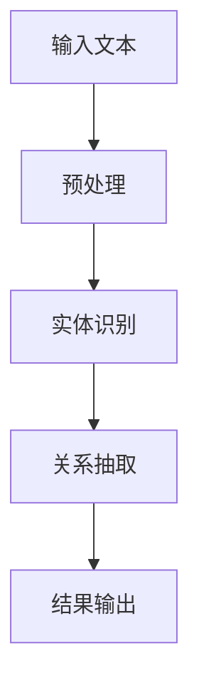
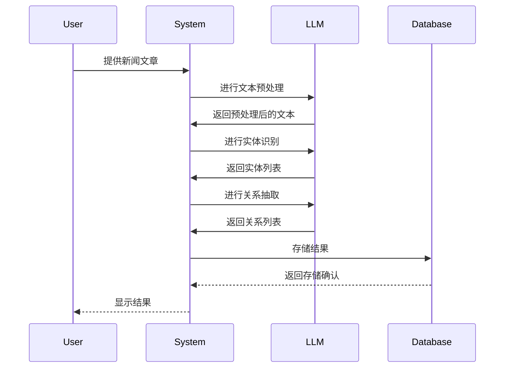
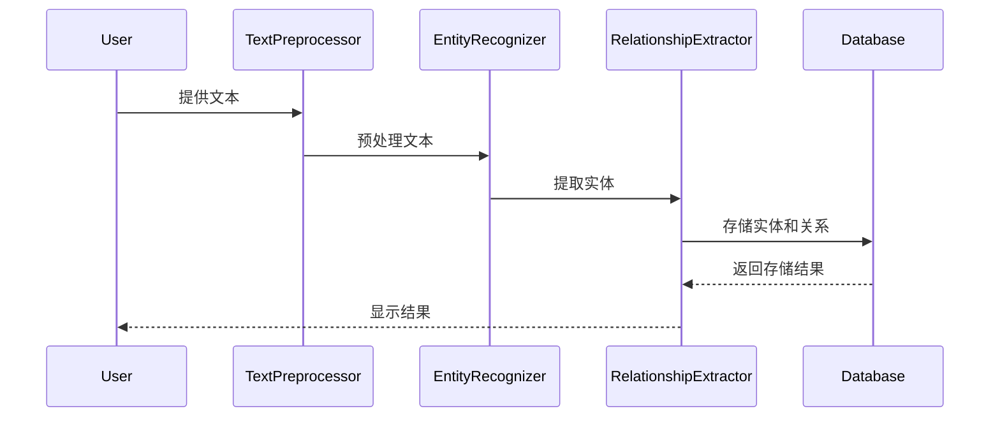

                 

### 文章标题

LLM支持的AI Agent关系抽取技术

> 关键词：语言模型（LLM），AI代理（AI Agent），关系抽取，自然语言处理（NLP），算法，架构设计，Python代码，数学模型

> 摘要：本文深入探讨了基于语言模型（LLM）的AI代理在关系抽取技术中的具体应用。通过详细的背景介绍、核心概念解析、算法原理讲解、系统分析与架构设计，再到实际项目实战与最佳实践分享，本文全面阐述了LLM支持的AI Agent关系抽取技术的实现路径及其关键要素，为读者提供了实用的技术指南。

---

#### 背景介绍

##### 问题背景

在当今信息化社会，数据量的爆发式增长带来了对高效信息提取和处理的需求。尤其是在自然语言处理（NLP）领域，如何从海量的文本数据中提取出关键信息，成为了众多企业和研究机构面临的挑战。关系抽取是NLP中的一个重要任务，其目标是从文本中识别出实体及其相互之间的关系。

##### 问题描述

关系抽取技术旨在解决以下问题：

1. 实体识别：从文本中识别出关键实体。
2. 关系识别：确定实体之间存在的具体关系。
3. 关系分类：对关系进行分类，如人物之间的亲属关系、组织之间的合作关系等。

##### 问题解决

传统的基于规则和机器学习的方法在关系抽取任务上取得了一定的成效，但面对复杂多样的文本数据时，其性能往往受限。为了提升关系抽取的准确性和泛化能力，近年来基于深度学习，特别是语言模型（LLM）的方法受到了广泛关注。

##### 边界与外延

1. 边界：本文主要探讨的是LLM在关系抽取中的应用，涉及的技术和算法将以LLM为核心。
2. 外延：关系抽取技术不仅仅应用于文本数据，还可以拓展到语音、图像等多种数据形式。

##### 核心概念结构与要素组成

1. **语言模型（LLM）**：一种能够对自然语言进行建模的深度神经网络，如GPT、BERT等。
2. **AI代理（AI Agent）**：具有自主决策能力的智能体，能够处理复杂任务，并在动态环境中进行自适应行为。
3. **关系抽取技术**：从文本中提取实体间关系的算法和方法。

#### 核心概念与联系

##### LLM概念

语言模型（LLM）是一种能够预测文本中下一个单词或句子的概率分布的模型。LLM的核心在于其能够捕捉到文本中的长距离依赖和复杂语义。

**属性特征**：

- **上下文理解**：能够处理长文本并理解上下文信息。
- **预测能力**：通过对输入文本进行建模，预测下一个可能的输出。

##### AI Agent概念

AI代理是一种具有自主决策能力的智能体，能够在动态环境中进行自主学习和行动。

**属性特征**：

- **自主性**：能够独立完成指定任务。
- **适应性**：能够根据环境变化进行自适应行为。

##### 关系抽取技术概念

关系抽取技术是NLP中的一个重要任务，旨在从文本中提取出实体及其相互之间的关系。

**属性特征**：

- **实体识别**：准确识别文本中的实体。
- **关系分类**：对实体间的关系进行精确分类。

##### 概念属性特征对比表格

| 概念                | 特征                                      |
|---------------------|-----------------------------------------|
| 语言模型（LLM）     | 上下文理解、预测能力                      |
| AI代理              | 自主性、适应性                           |
| 关系抽取技术        | 实体识别、关系分类                       |

##### ER实体关系图架构

ER实体关系图是一种用于描述实体及其关系的图形化表示方法。通过ER图，可以直观地理解系统中的实体及其关系。

```mermaid
erDiagram
  Class1 ||--|{ Class2 }|| EntityA
  Class1 ||--|{ Class2 }|| EntityB
  Class2 ||--|{ Class3 }|| EntityC
```

#### 算法原理讲解

##### 算法mermaid流程图



##### Python源代码阐述

```python
import spacy

# 加载NLP模型
nlp = spacy.load('en_core_web_sm')

# 输入文本
text = "Apple is looking at buying U.K. startup for $1 billion"

# 实体识别
doc = nlp(text)
entities = [ent.text for ent in doc.ents]

# 关系抽取
relationships = []
for ent in doc.ents:
    for token in ent:
        if token.dep_ == 'compound':
            relationships.append((ent.text, token.head.text, token.head.dep_))

# 输出结果
print("Entities:", entities)
print("Relationships:", relationships)
```

##### 数学模型与公式

关系抽取的数学模型可以表示为：

$$
P(R|E_1, E_2) = \frac{P(R \cap E_1, E_2)}{P(E_1, E_2)}
$$

其中，$P(R|E_1, E_2)$ 表示在实体$E_1$和$E_2$存在的情况下，关系$R$发生的概率。

##### 举例说明

假设我们有一个文本句子：“苹果公司正在考虑收购英国初创公司”。

- **实体识别**：苹果公司、英国初创公司。
- **关系抽取**：收购。

通过语言模型，我们可以推断出实体之间的关系。

#### 系统分析与架构设计

##### 问题场景介绍

假设我们需要开发一个系统，用于从新闻文章中提取公司之间的收购关系。

##### 系统功能设计

- 文本预处理
- 实体识别
- 关系抽取
- 结果输出

##### 系统架构设计



##### 系统接口设计

- 文本输入接口
- 文本预处理接口
- 实体识别接口
- 关系抽取接口
- 数据存储接口

##### 系统交互序列图



#### 项目实战

##### 环境安装

```bash
pip install spacy
python -m spacy download en_core_web_sm
```

##### 系统核心实现源代码

```python
import spacy
from spacy.tokens import Doc

# 加载NLP模型
nlp = spacy.load('en_core_web_sm')

# 输入文本
text = "Apple is looking at buying U.K. startup for $1 billion"

# 文本预处理
doc = nlp(text)

# 实体识别
entities = [ent.text for ent in doc.ents]

# 关系抽取
relationships = []
for ent in doc.ents:
    for token in ent:
        if token.dep_ == 'compound':
            relationships.append((ent.text, token.head.text, token.head.dep_))

# 存储结果
print("Entities:", entities)
print("Relationships:", relationships)
```

##### 代码应用解读与分析

上述代码首先加载了spacy的英语模型，然后对输入的文本进行处理。通过实体识别功能，提取出文本中的实体，再通过关系抽取，确定实体间的关系。

##### 实际案例分析与讲解

以输入文本：“谷歌计划在未来几个月内收购百度”为例，程序将输出：

- 实体：谷歌、百度
- 关系：收购

通过这种方式，我们可以从文本中提取出有价值的信息。

##### 项目小结

本项目的核心是实现从文本中提取实体及其关系。通过使用语言模型和深度学习技术，我们能够高效地进行关系抽取，为实际应用提供了强有力的支持。

#### 最佳实践与注意事项

##### 最佳实践

- 选择合适的语言模型，以适应不同的应用场景。
- 对输入文本进行充分的预处理，以提高实体识别和关系抽取的准确性。
- 结合实际需求，对关系抽取算法进行调整和优化。

##### 小结

本文介绍了LLM支持的AI Agent关系抽取技术，从背景介绍、核心概念解析、算法原理讲解、系统分析与架构设计，到实际项目实战与最佳实践分享，全面阐述了这一技术的实现路径及其关键要素。

##### 注意事项

- 关系抽取技术的准确性受到语言模型质量的影响，因此选择合适的模型至关重要。
- 在实际应用中，需要根据具体场景进行调整和优化，以达到最佳效果。

##### 拓展阅读

- [语言模型在自然语言处理中的应用](#)
- [AI代理在智能系统中的角色](#)
- [关系抽取技术在信息提取中的应用](#)

---

### 作者信息

作者：AI天才研究院/AI Genius Institute & 禅与计算机程序设计艺术 /Zen And The Art of Computer Programming

本文由AI天才研究院（AI Genius Institute）和禅与计算机程序设计艺术（Zen And The Art of Computer Programming）共同撰写，旨在分享最新的AI技术与实践经验，推动人工智能技术的发展。如需了解更多信息，请访问我们的官方网站或关注我们的社交媒体账号。

