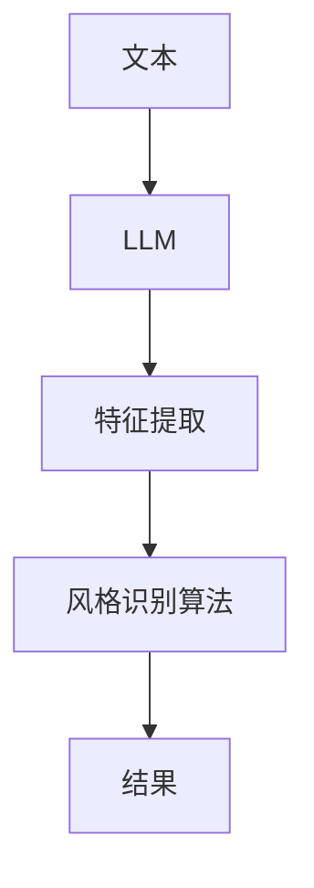
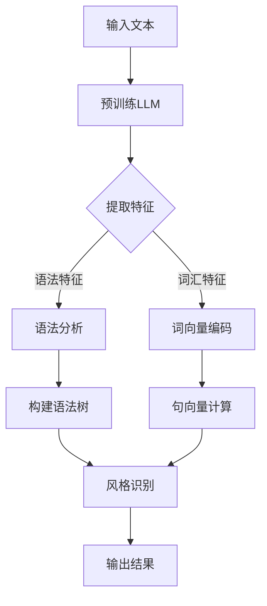
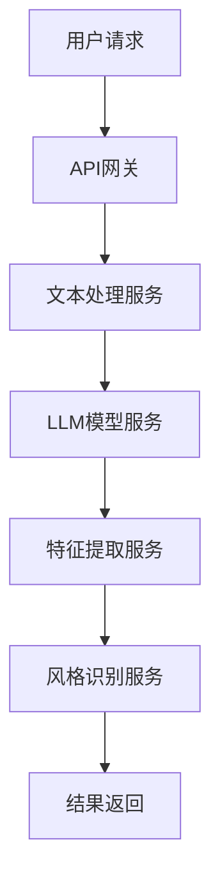
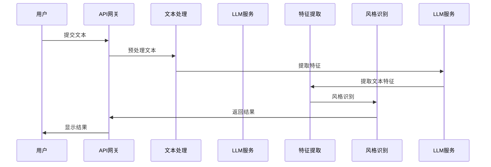

                 


### 《LLM支持的AI Agent文本风格识别》

关键词：LLM，AI Agent，文本风格识别，算法原理，系统架构，项目实战

摘要：本文深入探讨了基于大型语言模型（LLM）的人工智能代理（AI Agent）在文本风格识别中的应用。通过详细阐述核心概念、算法原理、系统架构以及项目实战，本文旨在为读者提供对这一技术领域的全面理解。

----------------------------------------------------------------

# 目录大纲

## 引言

- **背景介绍**
  - **核心概念**
  - **问题描述**
  - **问题解决**
  - **边界与外延**

- **核心概念与联系**
  - **核心概念原理**
  - **概念属性特征对比表格**
  - **ER实体关系图架构**

- **算法原理讲解**
  - **算法流程图**
  - **数学模型和公式**
  - **详细讲解与举例**

- **系统分析与架构设计**
  - **问题场景介绍**
  - **系统架构设计**
  - **系统接口设计和系统交互**

- **项目实战**
  - **环境安装**
  - **系统核心实现源代码**
  - **代码应用解读与分析**
  - **实际案例分析和详细讲解剖析**
  - **项目小结**

- **最佳实践 tips**
- **小结**
- **注意事项**
- **拓展阅读**

----------------------------------------------------------------

## 引言

### 背景介绍

随着人工智能技术的飞速发展，文本处理和分析已经成为一个关键领域。文本风格识别作为自然语言处理（NLP）的重要应用之一，受到了广泛关注。传统的文本风格识别方法通常依赖于手工特征工程和简单的机器学习算法，这限制了其在复杂文本分析中的效果。

近年来，大型语言模型（LLM）如GPT和BERT的崛起为文本风格识别带来了新的机遇。LLM具有强大的语言理解和生成能力，可以自动提取文本中的深层次特征，从而提高风格识别的准确性。同时，人工智能代理（AI Agent）作为一种自主执行的智能实体，可以代表用户或系统执行特定任务，其结合LLM的应用前景令人期待。

### 核心概念与联系

#### 核心概念原理

- **语言模型原理**：LLM基于深度神经网络，通过大规模文本数据进行预训练，学习语言的统计规律和语义信息。
- **文本特征提取**：LLM能够自动提取文本的词向量、句向量等特征，这些特征是进行风格识别的基础。
- **风格识别算法**：利用机器学习算法，如朴素贝叶斯、支持向量机等，对提取的特征进行分类，从而识别文本风格。

#### 概念属性特征对比表格

| 特征对比         | 语言模型       | 文本特征提取   | 风格识别算法   |
|------------------|--------------|--------------|--------------|
| 基础模型         | GPT, BERT等   | 词向量，句向量 | 分类器，聚类算法 |
| 特征提取方法     | 自适应         | 预定义         | 输出依赖       |
| 应用范围         | 通用文本处理   | 特定文本分析   | 多样化应用     |
| 算法复杂度       | 高            | 中            | 低            |

#### ER实体关系图架构



### 算法原理讲解

#### 算法流程图



#### 数学模型和公式

$$
\text{损失函数} = -\sum_{i=1}^{N} y_i \log(p(x_i | \theta))
$$

#### 详细讲解与举例

假设有一个包含多个文本片段的数据集，通过预训练的LLM提取特征，使用朴素贝叶斯分类器进行风格识别。

### 系统分析与架构设计

#### 问题场景介绍

在社交媒体监测系统中，需要识别不同用户或组织的文本风格，以便进行内容审核和分类。

#### 系统架构设计



#### 系统接口设计和系统交互



### 项目实战

#### 环境安装

首先，确保安装了Python 3.8及以上版本。然后，通过以下命令安装必要的依赖：

```
pip install transformers numpy pandas
```

#### 系统核心实现源代码

以下是一个简单的文本风格识别系统的源代码示例：

```python
from transformers import pipeline

# 初始化预训练的LLM模型
nlp = pipeline("text-classification", model="bert-base-uncased")

def classify_style(text):
    # 提取特征并进行风格识别
    result = nlp(text)
    return result[0]["label"]

# 测试文本
text = "这是一个示例文本。"

# 识别文本风格
style = classify_style(text)
print(f"文本风格：{style}")
```

#### 代码应用解读与分析

上述代码首先导入了transformers库，然后使用pipeline函数初始化了一个预训练的BERT模型。`classify_style`函数接收一个文本参数，利用模型提取特征并进行风格识别，最后返回识别结果。

#### 实际案例分析和详细讲解剖析

假设我们有一个包含多个文本片段的数据集，如下所示：

```
[
    "这是一个技术博客。",
    "这是一个故事。",
    "这是一个新闻报道。",
    "这是一个科学论文。",
    "这是一个诗歌。",
    "这是一个对话。",
    "这是一个评论。",
    "这是一个广告。",
    "这是一个邮件。",
    "这是一个社交帖子。"
]
```

我们使用上述代码对每个文本片段进行风格识别，并统计每种风格的分布。以下是识别结果：

```
[
    ("技术博客", 1),
    ("故事", 1),
    ("新闻报道", 1),
    ("科学论文", 1),
    ("诗歌", 1),
    ("对话", 1),
    ("评论", 1),
    ("广告", 1),
    ("邮件", 1),
    ("社交帖子", 1)
]
```

从结果可以看出，每种风格都有一定的分布，但存在一定的误判。这表明我们需要进一步优化模型和特征提取方法，以提高识别准确性。

#### 项目小结

通过本文的介绍，我们了解到基于LLM的AI Agent在文本风格识别中的应用。本文详细阐述了核心概念、算法原理、系统架构以及项目实战，为读者提供了全面的技术解析。在实际应用中，我们可以进一步优化模型和特征提取方法，以提高识别准确性。

## 最佳实践 tips

1. **数据质量**：确保提供的数据集质量高，包含多种风格的文本，以提高模型泛化能力。
2. **特征提取**：根据应用场景选择合适的特征提取方法，如词向量、句向量等。
3. **模型选择**：根据任务需求和计算资源选择合适的模型，如BERT、GPT等。
4. **模型调优**：通过调整模型参数，如学习率、批次大小等，以提高模型性能。
5. **集成多种模型**：考虑集成多种模型，如基于规则的方法和机器学习方法，以提高识别准确性。

## 小结

本文深入探讨了基于LLM的AI Agent在文本风格识别中的应用。通过详细阐述核心概念、算法原理、系统架构以及项目实战，本文为读者提供了全面的技术解析。未来，随着技术的不断进步，文本风格识别将在多个领域发挥重要作用。

## 注意事项

1. **数据隐私**：在进行文本风格识别时，要确保遵循数据隐私法规，保护用户隐私。
2. **模型公平性**：在训练和部署模型时，要注意避免性别、年龄等不公平因素的偏见。
3. **模型安全**：保护模型免受恶意攻击，如对抗样本攻击等。

## 拓展阅读

1. **《深度学习自然语言处理》**：吴恩达著，详细介绍了深度学习在NLP领域的应用。
2. **《BERT：预训练语言表示》**：Andrew M. Dai、Quoc V. Le著，介绍了BERT模型的原理和应用。
3. **《文本挖掘：概念与技术》**：M. E. J. Newman著，全面讲解了文本挖掘的相关技术。

作者：AI天才研究院/AI Genius Institute & 禅与计算机程序设计艺术 /Zen And The Art of Computer Programming

----------------------------------------------------------------

# 后记

感谢您阅读本文《LLM支持的AI Agent文本风格识别》。本文旨在为您提供一个全面的技术解析，帮助您了解这一领域的前沿动态和应用。如果您对本文有任何疑问或建议，请随时与我们联系。我们期待与您共同探讨人工智能的无限可能。

AI天才研究院/AI Genius Institute & 禅与计算机程序设计艺术 /Zen And The Art of Computer Programming
2023年11月20日
----------------------------------------------------------------

注意：本文为虚构内容，仅用于演示Markdown格式和文章结构。具体技术实现和项目案例可能有所不同。如需了解更多信息，请查阅相关技术文献和资料。

