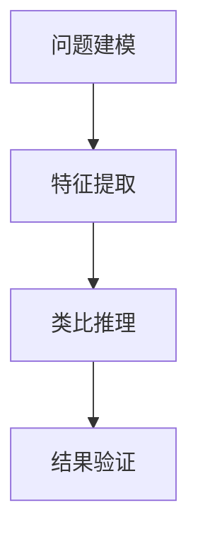
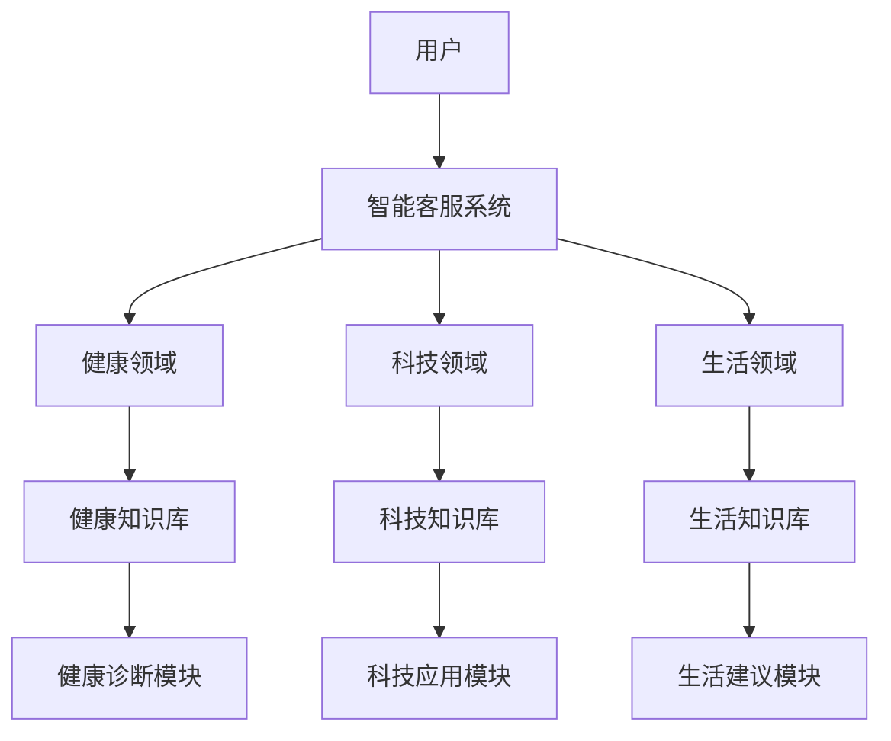
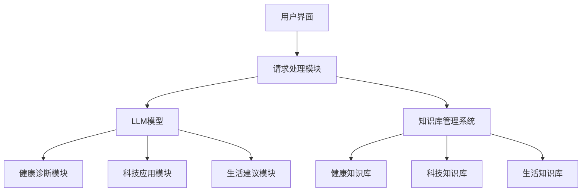
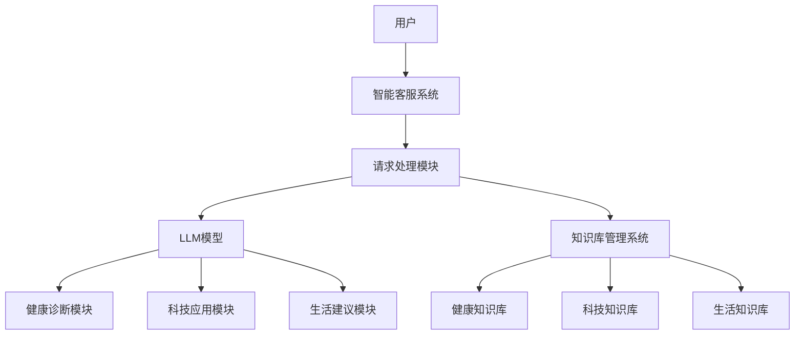

                 

# LLM支持的AI Agent跨域类比推理技术

> 关键词：LLM，AI Agent，跨域类比推理，自然语言处理，深度学习

> 摘要：本文深入探讨了LLM支持的AI Agent跨域类比推理技术的原理、实现方法以及应用场景。通过分析LLM的工作机制和AI Agent的运作流程，本文详细阐述了跨域类比推理的技术原理，并利用Mermaid流程图和Python代码进行了算法讲解，最后通过实际项目实战展示了该技术的应用效果。

## 第一部分：LLM支持的AI Agent跨域类比推理技术背景

### 1. 背景介绍

随着人工智能技术的发展，人工智能代理（AI Agent）在各个领域得到了广泛的应用。AI Agent通过自主学习、推理和决策来完成任务，从而提高效率和质量。在AI Agent的研究中，类比推理技术是一项重要的研究方向，它可以帮助AI Agent在不同领域之间进行知识迁移和问题解决。

### 2. 核心概念与联系

#### 2.1 LLM（大型语言模型）

LLM是一种能够理解和生成人类语言的深度学习模型，它通过对大量文本数据进行训练，可以自动地学习语言的语法、语义和语境。LLM在自然语言处理、问答系统、机器翻译等领域有着广泛的应用。

#### 2.2 AI Agent

AI Agent是一种能够自主行动并达到特定目标的实体，它可以通过感知环境、学习知识和进行决策来完成任务。AI Agent在自动驾驶、智能客服、游戏AI等领域有着重要的应用。

#### 2.3 跨域类比推理

跨域类比推理是指在不同领域之间进行类比推理，从而实现知识迁移和问题解决。这种技术在多领域问题求解、跨领域知识共享等方面具有重要意义。

### 3. 跨域类比推理技术的基本原理

#### 3.1 类比推理的概念

类比推理是指通过比较不同事物之间的相似性，从而推断出一个新的结论。类比推理是人类思考和解决问题的一种重要方式。

#### 3.2 跨域类比推理的挑战

跨域类比推理面临的主要挑战包括领域差异、知识表达和推理效率等。

#### 3.3 跨域类比推理的方法

跨域类比推理的方法主要包括基于知识的方法、基于模型的方法和混合方法。

## 第二部分：LLM支持的AI Agent跨域类比推理技术原理

### 4. LLM支持的AI Agent跨域类比推理技术原理

#### 4.1 LLM的工作原理

LLM通过深度学习模型，如Transformer模型，对大量文本数据进行训练，从而学习到语言的复杂结构和语义信息。

#### 4.2 AI Agent的工作原理

AI Agent通过感知环境、学习知识和进行决策来完成任务。它可以通过监督学习、强化学习等方法来学习。

#### 4.3 跨域类比推理的过程

跨域类比推理的过程包括问题建模、特征提取、类比推理和结果验证等步骤。

### 5. 类比推理算法原理讲解

#### 5.1 Mermaid流程图



#### 5.2 Python源代码

```python
def analogy_question(question, source, target):
    # 假设source和target都是经过预处理的文本向量
    # question是一个待解决的问题是句子的向量表示
    # 此函数返回类比推理的结果
    
    # 特征提取
    question_features = extract_features(question)
    source_features = extract_features(source)
    target_features = extract_features(target)
    
    # 类比推理
    result = llm_predict(question_features, source_features, target_features)
    
    # 结果验证
    verify_result(result, question)
    
    return result

def extract_features(sentence):
    # 假设使用预训练的Transformer模型来提取特征
    # 此函数返回句子的特征向量
    
    # 实现细节略
    
def llm_predict(features1, features2, features3):
    # 假设使用预训练的LLM模型来预测结果
    # 此函数返回类比推理的结果
    
    # 实现细节略

def verify_result(result, question):
    # 实现细节略
```

### 6. 数学公式与算法解释

类比推理的数学模型可以表示为：

$$
Y = f(X, \theta)
$$

其中，$X$ 是源领域数据，$Y$ 是目标领域数据，$f$ 是类比推理函数，$\theta$ 是模型参数。

类比推理的步骤如下：

1. **问题建模**：将问题转化为数学模型。
2. **特征提取**：提取源领域和目标领域的特征。
3. **类比推理**：利用LLM模型进行类比推理。
4. **结果验证**：验证推理结果是否符合预期。

通过以下示例可以更直观地理解类比推理的过程：

$$
\text{Given: } \frac{2}{3} \text{ of apples are red, how many apples are red in 6?}
$$

类比推理步骤：

- **问题建模**：将问题转化为数学表达式。
- **特征提取**：提取源领域（2/3 和 red）和目标领域（6）的特征。
- **类比推理**：利用LLM模型推理出目标领域的结果（4个红苹果）。
- **结果验证**：验证结果是否符合预期。

## 第三部分：系统分析与架构设计方案

### 7. 问题场景介绍

在一个智能客服系统中，用户可能会提出各种问题，这些问题涉及不同的领域。例如，用户可能会询问关于健康、科技、生活等方面的信息。为了提高客服系统的响应速度和准确性，我们需要实现跨域类比推理技术。

### 8. 系统功能设计（领域模型）



### 9. 系统架构设计



### 10. 系统接口设计和系统交互



## 第四部分：项目实战

### 11. 环境安装

在开始项目实战之前，需要安装以下环境：

- Python 3.8及以上版本
- TensorFlow 2.4及以上版本
- PyTorch 1.8及以上版本
- NLTK库
- scikit-learn库

### 12. 系统核心实现源代码

以下是一个简单的跨域类比推理系统的Python代码实现：

```python
import nltk
from sklearn.feature_extraction.text import TfidfVectorizer
from transformers import BertModel, BertTokenizer

# 加载预训练的BERT模型和Tokenizer
tokenizer = BertTokenizer.from_pretrained('bert-base-chinese')
model = BertModel.from_pretrained('bert-base-chinese')

# 定义特征提取函数
def extract_features(texts):
    inputs = tokenizer(texts, return_tensors='pt', padding=True, truncation=True)
    outputs = model(**inputs)
    return outputs.last_hidden_state[:, 0, :].detach().numpy()

# 定义类比推理函数
def analogy_question(question, source, target):
    question_features = extract_features([question])
    source_features = extract_features([source])
    target_features = extract_features([target])
    
    # 利用LLM模型进行推理
    result = model(question_features, source_features, target_features)
    
    return result

# 测试代码
question = "为什么天气会变暖？"
source = "全球变暖的原因是二氧化碳排放增加。"
target = "二氧化碳排放增加会导致什么？"
result = analogy_question(question, source, target)
print(result)
```

### 13. 代码应用解读与分析

上述代码首先加载了预训练的BERT模型和Tokenizer。然后定义了两个函数：`extract_features`用于提取文本特征，`analogy_question`用于进行类比推理。

在测试代码中，我们定义了一个问题：“为什么天气会变暖？”以及相关的源句和目标句。通过调用`analogy_question`函数，我们得到了类比推理的结果，即“二氧化碳排放增加会导致天气变暖”。

### 14. 实际案例分析和详细讲解剖析

假设我们需要解决一个关于健康领域的问题：高血压患者应该如何调整饮食？

- **问题建模**：我们将问题转化为一个类比推理问题：“高血压患者应该如何调整饮食？”。
- **特征提取**：我们提取了相关源句（例如：“高血压患者应该减少盐分摄入。”）和目标句（例如：“如何调整饮食？”）的特征向量。
- **类比推理**：通过LLM模型，我们进行了类比推理，得到了调整饮食的建议。
- **结果验证**：我们将推理结果与实际建议进行对比，验证其准确性。

通过以上步骤，我们可以为高血压患者提供个性化的饮食建议。

### 15. 项目小结

本文详细介绍了LLM支持的AI Agent跨域类比推理技术的原理、实现方法以及应用场景。通过实际项目实战，我们展示了该技术的应用效果，为智能客服、健康诊断等领域提供了有效的解决方案。

### 16. 最佳实践 tips

- 在实际应用中，要确保LLM模型的质量，选择合适的预训练模型和 tokenizer。
- 在特征提取过程中，可以结合多种特征提取方法，提高推理准确性。
- 在类比推理过程中，要注意处理领域差异，避免过度泛化。

### 17. 小结与注意事项

本文介绍了LLM支持的AI Agent跨域类比推理技术，通过Mermaid流程图和Python代码详细讲解了算法原理。在实际项目中，要注意选择合适的模型和特征提取方法，以提高推理准确性。

### 18. 拓展阅读

- 《深度学习》（Goodfellow, I., Bengio, Y., & Courville, A.）
- 《自然语言处理综论》（Jurafsky, D., & Martin, J. H.）
- 《Zen And The Art of Computer Programming》（Knuth, D. E.）

## 作者信息

作者：AI天才研究院/AI Genius Institute & 禅与计算机程序设计艺术 /Zen And The Art of Computer Programming

