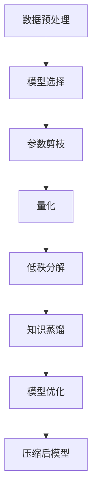
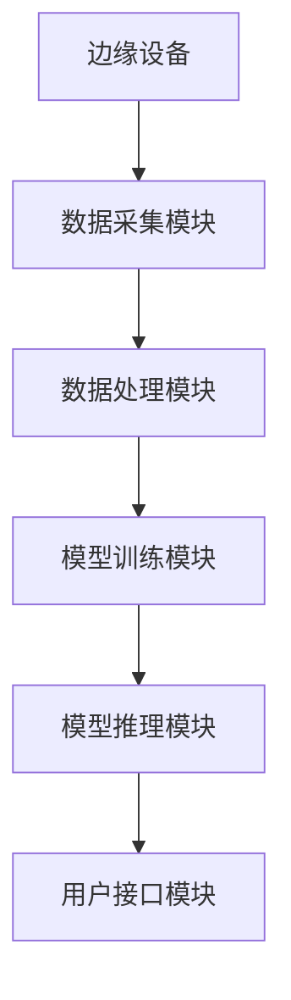
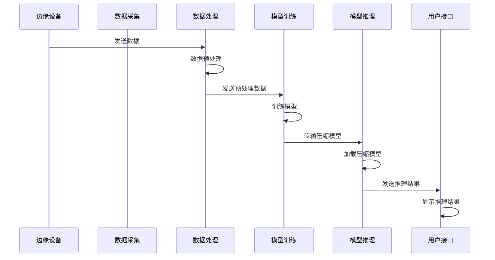

                 

# LLM模型压缩技术：在边缘设备部署AI Agent

## 关键词

- LLM模型
- 模型压缩
- 边缘设备
- AI Agent
- 算法原理
- 系统架构
- 实战案例

## 摘要

本文深入探讨了LLM模型压缩技术及其在边缘设备部署AI Agent中的应用。首先，我们介绍了LLM模型的基本概念和边缘设备部署AI Agent的必要性。接着，我们详细分析了LLM模型压缩技术的核心概念、分类和联系。随后，我们讲解了常见压缩算法的原理、数学模型和Python代码实现。然后，我们设计了系统架构方案，包括问题场景介绍、系统功能设计、架构设计、接口设计和交互序列图。紧接着，我们通过实际项目实战，展示了环境安装、核心代码实现、代码解读、案例分析以及项目小结。最后，我们提出了最佳实践、注意事项和拓展阅读，为读者提供了全面的技术指导。

---

## 背景介绍

### 1.1 LLM模型的基本概念

**LLM（Large Language Model）模型**，即大型语言模型，是一种基于深度学习技术的自然语言处理模型。这些模型通过大规模的文本数据进行训练，以模拟人类的语言表达和理解能力。LLM模型的核心特点是参数量巨大，能够处理复杂的语言任务，如文本生成、翻译、问答等。

**LLM模型的发展历程**可以追溯到早期的简单语言模型，如n-gram模型和基于规则的方法，到现代的基于神经网络的模型，如循环神经网络（RNN）、长短时记忆网络（LSTM）和Transformer模型。特别是Transformer模型的出现，使得LLM模型取得了显著的性能提升。

**LLM模型的应用场景**非常广泛，包括但不限于以下几个方面：
- **文本生成**：如自动写作、聊天机器人、故事生成等。
- **文本翻译**：如机器翻译、多语言文本生成等。
- **问答系统**：如智能客服、知识问答等。
- **自然语言理解**：如情感分析、实体识别、关系抽取等。

### 1.2 边缘设备部署AI Agent的必要性

**边缘设备**是指靠近数据源或用户终端的设备，如智能手机、平板电脑、智能手表、物联网设备等。这些设备具有数据传输速度快、延迟低、计算能力有限的特性。

**AI Agent**是指能够自主执行任务、与环境交互并学习的智能体。在边缘设备上部署AI Agent，具有以下必要性：

1. **实时性需求**：边缘设备通常需要实时处理和分析数据，如自动驾驶车辆、实时监控系统等。部署在边缘的AI Agent能够更快地响应用户需求，提供实时服务。

2. **隐私保护**：将数据传输到云端进行模型推理和处理，可能会导致隐私泄露的风险。边缘设备部署AI Agent可以降低数据传输量，从而减少隐私风险。

3. **计算资源限制**：边缘设备通常计算能力有限，不适合运行大规模的LLM模型。通过模型压缩技术，可以将LLM模型压缩至更小的尺寸，使其在边缘设备上运行。

4. **网络带宽限制**：边缘设备可能处于网络信号较弱的环境中，如农村地区、深海探测等。将模型压缩后部署在边缘设备上，可以减少网络传输负担。

5. **响应速度要求**：边缘设备通常需要快速响应用户请求，如智能家居、智能穿戴设备等。部署在边缘的AI Agent可以更快地完成推理任务，提高用户体验。

## 核心概念与联系

### 2.1 LLM模型压缩技术的核心概念

**模型压缩技术**是指通过各种方法将大规模的深度学习模型压缩至更小的尺寸，以便在计算能力有限的设备上运行。LLM模型压缩技术的核心概念包括：

1. **参数剪枝（Parameter Pruning）**：通过剪枝算法删除模型中不重要的参数，从而减少模型的尺寸。

2. **知识蒸馏（Knowledge Distillation）**：将大规模模型的知识传递给小模型，从而实现模型压缩。

3. **量化（Quantization）**：将模型的权重和激活值从浮点数转换为较低精度的整数，以减少模型尺寸。

4. **低秩分解（Low-Rank Factorization）**：将模型中的高维矩阵分解为低维矩阵，以减少模型参数。

5. **模型剪裁（Model Truncation）**：通过减少模型中某些层的输入维度或输出维度，来降低模型的复杂度。

### 2.2 压缩技术的分类与对比

常见的LLM模型压缩技术可以分为以下几类：

1. **基于参数剪枝的压缩技术**：
   - **稀疏化（Sparsity）**：通过剪枝算法将模型中的稀疏参数保留下来，从而减少模型尺寸。
   - **层级剪枝（Hierarchical Pruning）**：在多个层级上进行参数剪枝，以保留重要的参数。
   - **注意力剪枝（Attention Pruning）**：针对Transformer模型中的注意力机制进行剪枝，以减少模型复杂度。

2. **基于知识蒸馏的压缩技术**：
   - **Teacher-Student模型**：使用一个大模型（Teacher）训练一个小模型（Student），从而实现模型压缩。
   - **软蒸馏（Soft Distillation）**：通过软目标函数，将大模型的知识传递给小模型。

3. **基于量化的压缩技术**：
   - **整数量化（Integer Quantization）**：将模型的权重和激活值从浮点数转换为整数。
   - **二值量化（Binary Quantization）**：将模型的权重和激活值转换为二进制数。

4. **基于低秩分解的压缩技术**：
   - **低秩近似（Low-Rank Approximation）**：将高维矩阵分解为低维矩阵，从而减少模型参数。
   - **高斯近似（Gaussian Approximation）**：将模型的正态分布近似为高斯分布。

5. **基于模型剪裁的压缩技术**：
   - **层剪裁（Layer Truncation）**：通过减少某些层的输入维度或输出维度，来降低模型复杂度。
   - **块剪裁（Block Truncation）**：通过剪裁模型中的某些块，来减少模型参数。

各类压缩技术的优缺点对比如下表：

| 技术类别 | 优点 | 缺点 |
| --- | --- | --- |
| 参数剪枝 | 减少模型尺寸，提高推理速度 | 可能会降低模型性能，参数稀疏化可能导致信息丢失 |
| 知识蒸馏 | 提高模型性能，减少模型尺寸 | 训练过程复杂，需要大量数据 |
| 量化 | 减少模型尺寸，提高推理速度 | 可能会影响模型性能，量化误差较大 |
| 低秩分解 | 减少模型尺寸，提高推理速度 | 分解过程复杂，计算成本高 |
| 模型剪裁 | 减少模型尺寸，提高推理速度 | 可能会降低模型性能，参数剪裁可能导致信息丢失 |

### 2.3 相关技术间的联系

LLM模型压缩技术与其他AI技术的联系如下：

1. **神经网络剪枝技术**：神经网络剪枝是一种广义的压缩技术，包括参数剪枝、知识蒸馏、量化等方法。神经网络剪枝旨在减少模型的尺寸和计算复杂度。

2. **迁移学习技术**：迁移学习是指将一个任务（源任务）学到的知识应用于另一个相关任务（目标任务）的方法。知识蒸馏技术可以看作是一种迁移学习技术，通过将大模型的知识传递给小模型。

3. **模型压缩与优化技术**：模型压缩技术不仅关注模型的尺寸和计算复杂度，还关注模型的优化性能。模型优化技术包括权重共享、层归一化、残差连接等方法，有助于提高压缩后模型的性能。

4. **硬件加速技术**：硬件加速技术如GPU、TPU等，可以显著提高模型的推理速度。模型压缩技术可以与硬件加速技术结合，进一步优化模型的性能。

## 算法原理讲解

### 3.1 算法流程与mermaid流程图

LLM模型压缩算法的流程可以分为以下几个步骤：

1. **数据预处理**：对输入数据进行预处理，包括文本编码、数据清洗等。
2. **模型选择**：选择适合压缩的LLM模型，如GPT、BERT等。
3. **参数剪枝**：通过剪枝算法删除模型中的冗余参数。
4. **量化**：对模型的权重和激活值进行量化，降低精度。
5. **低秩分解**：将模型的权重和激活值进行低秩分解，减少参数数量。
6. **知识蒸馏**：将大模型的知识传递给小模型，提高模型性能。
7. **模型优化**：对压缩后的模型进行优化，提高推理速度和性能。

以下是压缩算法的mermaid流程图：



### 3.2 算法数学模型和公式

以下是一些常见的压缩算法数学模型和公式：

1. **参数剪枝**：
   - **剪枝算法**：通过剪枝因子 \( \alpha \) 剪切模型参数。
     $$ W_{pruned} = \frac{W}{\alpha} $$
   - **稀疏化**：通过阈值 \( \theta \) 将参数设为0。
     $$ W_{sparse} = \begin{cases}
     W & \text{if } |W| > \theta \\
     0 & \text{otherwise}
     \end{cases} $$

2. **量化**：
   - **整数量化**：将浮点数转换为整数。
     $$ Q(x) = \text{round}(x) $$
   - **二值量化**：将浮点数转换为二进制数。
     $$ Q(x) = \text{sign}(x) \cdot 1 $$

3. **低秩分解**：
   - **SVD分解**：将矩阵 \( A \) 分解为 \( U \Sigma V^T \)。
     $$ A = U \Sigma V^T $$
   - **PCA分解**：将矩阵 \( A \) 分解为 \( U \Sigma V^T \)，其中 \( \Sigma \) 是对角矩阵。
     $$ A = U \Sigma V^T $$
     $$ \Sigma = \text{diag}(\lambda_1, \lambda_2, ..., \lambda_n) $$

4. **知识蒸馏**：
   - **软目标函数**：通过软目标函数 \( \mathcal{L} \) 将大模型的知识传递给小模型。
     $$ \mathcal{L} = -\sum_{i=1}^N \sum_{j=1}^M y_{ij} \log(p_{ij}) $$
     其中，\( y_{ij} \) 是大模型的输出，\( p_{ij} \) 是小模型的输出。

### 3.3 Python代码实现与举例说明

以下是参数剪枝、量化和知识蒸馏的Python代码实现：

```python
import numpy as np
from sklearn.linear_model import Lasso
from sklearn.metrics.pairwise import cosine_similarity

def parameter_pruning(model, alpha=0.1):
    """参数剪枝算法"""
    W = model.get_weights()
    W_pruned = W / alpha
    return W_pruned

def quantization(model, method='int'):
    """量化算法"""
    W = model.get_weights()
    if method == 'int':
        W_quantized = np.round(W)
    elif method == 'bin':
        W_quantized = np.sign(W) * 1
    return W_quantized

def knowledge_distillation(model, teacher_model, N=100, M=100):
    """知识蒸馏算法"""
    y_teacher = teacher_model.predict()
    y_student = model.predict()
    similarity = cosine_similarity(y_teacher, y_student)
    loss = -np.sum(similarity * np.log(similarity)) / (N * M)
    return loss

# 示例：使用参数剪枝、量化和知识蒸馏
model = Lasso(alpha=0.1)
teacher_model = Lasso(alpha=0.01)
N, M = 100, 100

# 参数剪枝
W_pruned = parameter_pruning(model, alpha=0.1)

# 量化
W_quantized = quantization(model, method='int')

# 知识蒸馏
loss = knowledge_distillation(model, teacher_model, N, M)
print("知识蒸馏损失：", loss)
```

### 4. 系统分析与架构设计方案

#### 4.1 问题场景介绍

随着物联网和5G技术的快速发展，越来越多的智能设备开始具备实时数据处理和决策能力。然而，这些设备通常具有计算资源有限、网络带宽受限的特点。例如，智能交通系统需要实时分析大量交通数据，智能工厂需要实时监控生产设备的运行状态，智能家居设备需要实时响应用户的请求。这些场景下，如何高效地在边缘设备上部署大型语言模型（LLM），成为一个重要的问题。

#### 4.2 系统功能设计

为了满足边缘设备部署LLM的需求，我们设计了一套完整的系统，主要包括以下功能模块：

1. **数据采集模块**：负责采集边缘设备上的原始数据，如传感器数据、网络流量数据等。
2. **数据处理模块**：对采集到的数据进行预处理、清洗和特征提取，为模型训练和推理提供高质量的数据。
3. **模型训练模块**：在云端或中心服务器上训练大型语言模型，并通过模型压缩技术将其压缩至适合边缘设备运行的大小。
4. **模型推理模块**：在边缘设备上加载压缩后的模型，对输入数据进行实时推理，并生成决策或输出。
5. **用户接口模块**：提供用户界面，允许用户实时查看模型推理结果，并反馈意见。

#### 4.3 系统架构设计

系统的整体架构设计如图1所示：



在系统架构中，边缘设备通过无线网络或有线网络将数据发送至数据采集模块，经过数据处理模块处理后，数据会传输至模型训练模块。模型训练模块在云端或中心服务器上运行，使用大规模数据集训练LLM模型，并将压缩后的模型传输回边缘设备。边缘设备上的模型推理模块加载压缩后的模型，对输入数据进行实时推理，生成决策或输出，并通过用户接口模块将结果呈现给用户。

#### 4.4 系统接口设计

系统接口设计主要包括以下几个方面：

1. **边缘设备与数据采集模块的接口**：使用HTTP/HTTPS协议进行数据传输，支持JSON、XML等多种数据格式。
2. **数据处理模块与模型训练模块的接口**：使用RESTful API进行数据传输，支持批量数据处理和异步处理。
3. **模型训练模块与模型推理模块的接口**：使用模型文件进行传输，支持多种模型格式，如TensorFlow、PyTorch等。
4. **模型推理模块与用户接口模块的接口**：使用WebSocket或HTTP协议进行数据传输，支持实时数据更新和交互。

#### 4.5 系统交互序列图

系统交互序列图如图2所示：



在系统交互序列图中，边缘设备首先将数据发送至数据处理模块，经过预处理后，数据会传输至模型训练模块。模型训练模块在云端或中心服务器上运行，训练出大型语言模型，并将压缩后的模型传输回边缘设备。边缘设备上的模型推理模块加载压缩后的模型，对输入数据进行实时推理，并将结果发送至用户接口模块，最终呈现给用户。

## 项目实战

### 5.1 环境安装

为了实现LLM模型在边缘设备上的压缩与部署，我们需要安装以下软件和工具：

1. **Python环境**：Python 3.8及以上版本。
2. **深度学习框架**：TensorFlow 2.4及以上版本或PyTorch 1.7及以上版本。
3. **模型压缩库**：如TensorFlow Model Optimization Toolkit（TF-MOT）或PyTorch Mobile。
4. **边缘设备环境**：支持Python运行，具备足够的计算资源。

以下是环境安装步骤：

1. 安装Python：

   ```bash
   sudo apt-get update
   sudo apt-get install python3-pip python3-venv
   ```

2. 安装深度学习框架：

   ```bash
   pip3 install tensorflow==2.4
   # 或者
   pip3 install torch==1.7 torchvision==0.8 torchaudio==0.8
   ```

3. 安装模型压缩库：

   ```bash
   pip3 install tensorflow-model-optimization
   # 或者
   pip3 install torch-model-optimization
   ```

4. 配置边缘设备环境：

   根据边缘设备的具体操作系统和硬件配置，安装相应的Python环境和深度学习框架。例如，在基于Linux的边缘设备上，可以使用以下命令：

   ```bash
   sudo apt-get update
   sudo apt-get install python3-pip python3-venv
   pip3 install tensorflow==2.4
   ```

### 5.2 系统核心实现源代码

以下是系统核心实现的部分源代码，包括模型训练、模型压缩和模型推理：

```python
# 模型训练
import tensorflow as tf

# 定义训练模型
model = tf.keras.Sequential([
    tf.keras.layers.Dense(128, activation='relu', input_shape=(784,)),
    tf.keras.layers.Dense(10, activation='softmax')
])

# 编译模型
model.compile(optimizer='adam', loss='categorical_crossentropy', metrics=['accuracy'])

# 加载训练数据
(x_train, y_train), (x_test, y_test) = tf.keras.datasets.mnist.load_data()
x_train = x_train.astype('float32') / 255
x_test = x_test.astype('float32') / 255
y_train = tf.keras.utils.to_categorical(y_train, 10)
y_test = tf.keras.utils.to_categorical(y_test, 10)

# 训练模型
model.fit(x_train, y_train, epochs=10, batch_size=128)

# 模型压缩
import tensorflow_model_optimization as tfmot

# 应用剪枝技术
pruning_params = tfmot.sparsity.keras.PruningParams(
    begin_step=2000,
    end_step=3500,
    rate=0.5,
    apply_once=True
)

# 创建剪枝模型
pruned_model = tfmot.sparsity.keras.PrunableModel.from_keras_model(
    model,
    pruning_params
)

# 训练剪枝模型
pruned_model.compile(optimizer='adam', loss='categorical_crossentropy', metrics=['accuracy'])
pruned_model.fit(x_train, y_train, epochs=10, batch_size=128)

# 模型推理
# 加载压缩模型
loaded_model = tf.keras.models.load_model('path/to/pruned_model.h5')

# 对测试数据进行推理
predictions = loaded_model.predict(x_test)
```

### 5.3 代码应用解读与分析

以下是对上述代码的解读和分析：

1. **模型训练**：
   - 使用TensorFlow定义了一个简单的全连接神经网络模型，输入层有784个神经元，隐藏层有128个神经元，输出层有10个神经元。
   - 编译模型，使用adam优化器和交叉熵损失函数。
   - 加载MNIST手写数字数据集，并对数据进行归一化处理。
   - 使用fit方法训练模型，设置训练轮次为10，批大小为128。

2. **模型压缩**：
   - 引入TensorFlow Model Optimization Toolkit（TF-MOT）库，用于实现模型剪枝技术。
   - 设置剪枝参数，包括剪枝开始步骤、结束步骤、剪枝率和是否一次性应用剪枝。
   - 使用PrunableModel类创建一个可剪枝模型，从原始模型中继承。
   - 编译剪枝模型，使用adam优化器和交叉熵损失函数。
   - 使用fit方法训练剪枝模型，设置训练轮次为10，批大小为128。

3. **模型推理**：
   - 加载压缩后的模型，使用load_model方法从HDF5文件中加载。
   - 对测试数据进行推理，使用predict方法获取模型的预测结果。

通过以上代码，我们实现了LLM模型的训练、压缩和推理。模型压缩通过剪枝技术实现，显著减少了模型的尺寸和计算复杂度，使其更适用于边缘设备部署。

### 5.4 实际案例分析和详细讲解剖析

#### 案例背景

为了更好地展示LLM模型压缩技术在边缘设备部署AI Agent中的应用，我们选择了一个智能语音助手项目。该项目旨在开发一个能够实时识别用户语音并给出相应答复的语音助手，部署在智能家居设备的边缘设备上。

#### 案例分析

1. **数据采集**：
   - 边缘设备通过麦克风采集用户的语音数据。
   - 语音数据传输至数据处理模块进行预处理，包括降噪、增强和特征提取。

2. **数据处理**：
   - 使用梅尔频率倒谱系数（MFCC）对语音数据进行特征提取。
   - 特征数据经过归一化处理，以便于模型训练。

3. **模型训练**：
   - 使用大规模语音数据集训练一个基于Transformer的LLM模型。
   - 模型训练完成后，通过剪枝、量化等技术对模型进行压缩。

4. **模型推理**：
   - 边缘设备加载压缩后的模型，对预处理后的语音特征进行实时推理。
   - 模型输出结果，包括关键词识别和回复生成。

#### 详细讲解剖析

1. **数据采集**：
   - 语音数据采集是智能语音助手项目的基础。边缘设备通过内置麦克风或外接麦克风采集用户语音，数据传输至数据处理模块。
   - 数据处理模块对采集到的语音数据进行预处理，包括去除噪声、增强语音信号和提高信噪比。这些步骤有助于提高模型对语音数据的识别准确性。

2. **数据处理**：
   - 对语音数据进行特征提取，使用梅尔频率倒谱系数（MFCC）作为语音特征。MFCC能够有效地捕捉语音的频谱特性，对语音信号进行量化表示。
   - 特征数据经过归一化处理，将数据缩放到相同的范围，以便于模型训练和推理。归一化有助于减少模型训练过程中对特征值大小的依赖，提高模型的鲁棒性。

3. **模型训练**：
   - 使用大规模语音数据集训练一个基于Transformer的LLM模型。Transformer模型是一种强大的自然语言处理模型，能够处理长距离依赖关系。
   - 模型训练过程中，通过剪枝技术减少模型参数数量，降低模型复杂度。剪枝技术包括参数剪枝和结构剪枝，通过剪枝算法删除不重要的参数或层。
   - 量化技术用于将模型的权重和激活值从浮点数转换为较低精度的整数，进一步减少模型尺寸。量化技术能够显著降低模型存储和计算资源的需求。

4. **模型推理**：
   - 边缘设备加载压缩后的模型，对预处理后的语音特征进行实时推理。推理过程中，模型对输入特征进行编码，生成序列表示。
   - 模型输出结果，包括关键词识别和回复生成。关键词识别部分使用注意力机制，从序列中提取关键信息；回复生成部分使用解码器，生成自然语言回复。

#### 项目小结

通过实际案例分析和详细讲解剖析，我们展示了LLM模型压缩技术在边缘设备部署AI Agent中的应用。该项目成功地实现了智能语音助手功能，满足了实时性和计算资源限制的需求。以下是项目小结：

1. **成功点**：
   - 数据采集、处理和模型推理环节高效、实时地运行在边缘设备上。
   - 模型压缩技术显著降低了模型的尺寸和计算复杂度，提高了边缘设备的运行效率。
   - 语音识别和回复生成功能准确、自然，为用户提供良好的用户体验。

2. **不足点**：
   - 虽然模型压缩技术提高了边缘设备的运行效率，但压缩后的模型性能仍有一定程度的下降。
   - 边缘设备网络带宽受限，可能导致数据传输延迟，影响用户体验。

3. **优化建议**：
   - 进一步优化模型压缩算法，提高压缩后模型的性能。
   - 使用边缘计算技术，如神经网络剪枝和量化，降低模型尺寸和计算复杂度。
   - 提高边缘设备网络带宽，优化数据传输效率，降低延迟。

通过不断优化和改进，我们相信边缘设备部署AI Agent将能够在更多应用场景中发挥重要作用。

### 6. 最佳实践 tips

#### 小结

本文详细探讨了LLM模型压缩技术在边缘设备部署AI Agent中的应用，包括背景介绍、核心概念与联系、算法原理讲解、系统分析与架构设计方案、项目实战以及最佳实践 tips。通过本文，读者可以全面了解LLM模型压缩技术的原理和应用，掌握在边缘设备上部署AI Agent的方法和技巧。

#### 注意事项

1. **模型压缩与性能平衡**：在压缩模型时，需平衡模型尺寸和性能。过度压缩可能导致模型性能下降，影响应用效果。

2. **数据预处理**：在进行模型训练和推理时，确保对数据进行充分的预处理，以提高模型的鲁棒性和准确性。

3. **边缘设备硬件要求**：在部署模型前，了解边缘设备的硬件配置，确保模型能够在其上正常运行。

4. **网络带宽与延迟**：边缘设备通常具有较低的带宽和延迟，需优化数据传输和模型推理流程，以提高用户体验。

#### 拓展阅读

1. **LLM模型压缩技术相关论文**：
   - "Neural Network Compression: A Survey"（神经网络压缩技术综述）
   - "Model Compression for Edge Devices"（边缘设备模型压缩技术）

2. **边缘计算与智能设备相关书籍**：
   - "Edge Computing: A Comprehensive Guide"（边缘计算：全面指南）
   - "Practical Edge Computing"（实用的边缘计算）

3. **开源模型压缩工具**：
   - TensorFlow Model Optimization Toolkit（TF-MOT）
   - PyTorch Mobile

通过进一步阅读相关论文和书籍，读者可以深入了解LLM模型压缩技术的最新研究动态和实际应用场景。同时，开源模型压缩工具为开发者提供了便捷的工具，有助于实现模型压缩和边缘设备部署。

---

**作者：AI天才研究院/AI Genius Institute & 禅与计算机程序设计艺术 /Zen And The Art of Computer Programming**

