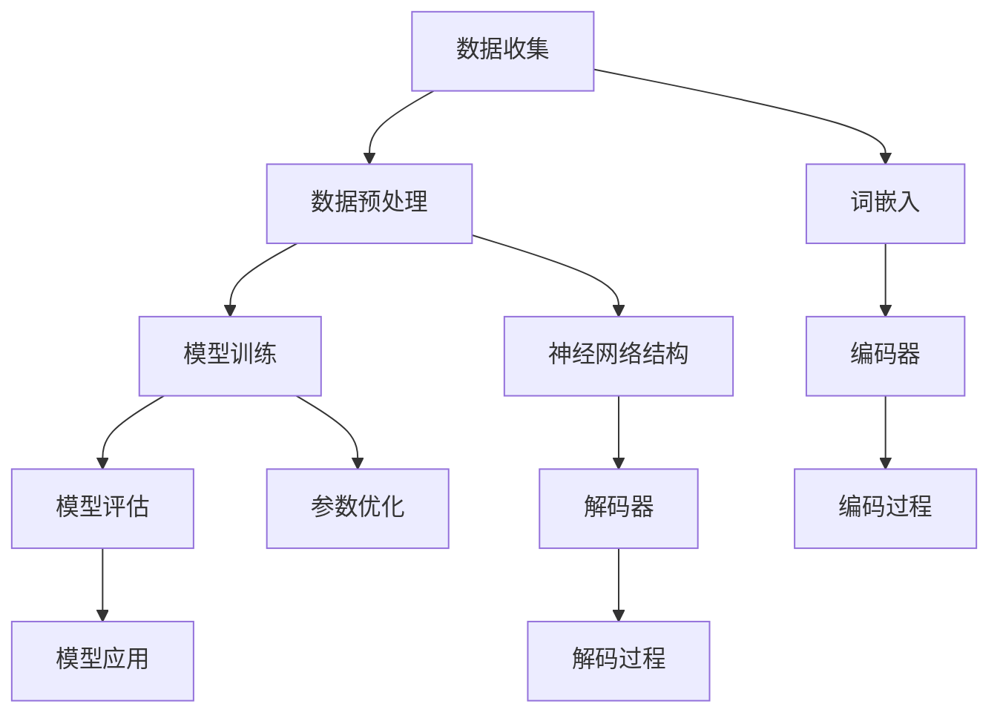
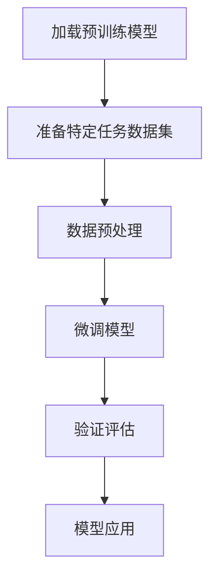
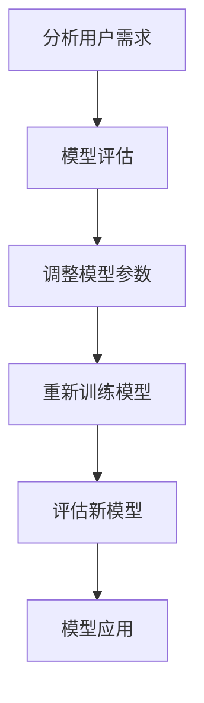

                 

### 引言与背景

**关键词**：LLM、微调、适应、特定用户群、优化

**摘要**：
本文旨在探讨语言模型（LLM）的微调和适应过程，尤其是如何针对特定用户群进行优化。通过对LLM的基本概念、微调和适应的原理以及实际案例的深入分析，本文将揭示如何通过这些技术手段提高模型在特定用户群中的表现。文章结构清晰，分为几个主要部分：引言与背景、核心概念与联系、LLM原理、微调原理、适应原理、案例分析和最佳实践等，旨在为从事人工智能领域的研究者和从业者提供实用的指导。

### 第一部分: 引言与背景

#### 第1章: 引言与背景

**1.1 研究背景**

语言模型（Language Model，简称LLM）是自然语言处理（Natural Language Processing，简称NLP）领域中的一项核心技术，其基本功能是预测下一个单词或词组。LLM的出现极大地推动了机器阅读理解、对话系统、机器翻译等领域的进展。近年来，随着深度学习技术的发展，LLM的表现有了显著提升，例如谷歌的BERT、OpenAI的GPT系列模型等，这些模型在大规模语料库上进行预训练后，展现出了强大的文本生成和语言理解能力。

然而，尽管LLM在通用性上有了很大的进步，但在特定应用场景中，如何针对不同用户群进行优化，使其能够更好地满足特定需求，仍然是一个亟待解决的问题。尤其是在实际应用中，不同用户群可能存在不同的语言习惯、表达方式、知识背景等差异，这些差异会导致LLM在不同场景中的表现出现显著差异。因此，研究如何对LLM进行微调和适应，以提高其在特定用户群中的表现，具有重要的现实意义和应用价值。

**1.2 研究目的**

本文的研究目的是探讨LLM的微调和适应过程，特别是如何针对特定用户群进行优化。具体来说，本文将从以下几个方面展开研究：

1. **理解LLM的基本概念和原理**：首先，我们需要了解LLM的基本概念和原理，包括其训练过程、工作流程和模型结构等。这将为后续的微调和适应研究提供理论基础。

2. **深入研究微调原理**：微调（Fine-tuning）是将预训练的LLM应用于特定任务时的一种常用方法。本文将详细分析微调的基本概念、工作流程和技巧，以及在实际应用中可能遇到的挑战和解决方案。

3. **探讨适应原理**：适应（Adaptation）是指LLM在特定环境中进行调整，以更好地满足用户需求。本文将探讨适应的基本概念、工作流程和策略，以及在实际应用中可能遇到的挑战和解决方案。

4. **分析特定用户群**：不同用户群具有不同的语言习惯、表达方式和知识背景，如何针对这些差异进行优化，是本文研究的重点。本文将分析特定用户群的特点和需求，并提出相应的优化策略。

5. **通过案例研究验证优化效果**：本文将通过实际案例，验证针对特定用户群进行微调和适应的优化策略的有效性，并总结案例经验和反思。

**1.3 研究意义**

研究LLM的微调和适应，针对特定用户群进行优化，具有以下几方面的意义：

1. **提高LLM的应用性能**：通过对LLM进行微调和适应，可以使其在特定任务和场景中表现出更好的性能，提高模型在实际应用中的效果。

2. **满足个性化需求**：不同用户群有不同的语言表达习惯和知识背景，通过针对特定用户群进行优化，可以更好地满足个性化需求，提高用户体验。

3. **推动NLP技术的发展**：微调和适应是NLP领域的重要研究方向，通过对这些技术的深入研究，可以推动NLP技术的进一步发展，为更多应用场景提供支持。

4. **促进AI技术的普及和应用**：通过提高LLM在特定用户群中的表现，可以进一步推广AI技术在各个领域的应用，促进AI技术的普及。

**1.4 研究方法与框架**

本文的研究方法主要包括以下几部分：

1. **文献综述**：通过查阅相关文献，了解LLM、微调和适应的基本概念、原理和应用现状。

2. **理论研究**：基于文献综述的结果，对LLM的微调和适应进行深入的理论研究，分析其原理和关键步骤。

3. **实验验证**：通过实际案例，验证微调和适应策略的有效性，并分析其效果和局限性。

4. **案例分析**：对成功案例和失败案例进行分析，总结经验教训，为后续研究提供参考。

本文的研究框架包括以下几个阶段：

1. **LLM基本原理研究**：了解LLM的基本概念、工作流程和模型结构。

2. **微调原理研究**：分析微调的基本概念、工作流程和技巧，以及挑战和解决方案。

3. **适应原理研究**：探讨适应的基本概念、工作流程和策略，以及挑战和解决方案。

4. **用户群分析**：分析特定用户群的特点和需求，为优化提供依据。

5. **案例研究**：通过实际案例，验证微调和适应策略的有效性。

**1.5 边界与外延**

1. **边界**

本文主要研究LLM的微调和适应，关注点主要集中在以下方面：

- 微调和适应的基本原理和流程
- 针对不同用户群进行优化的策略
- 微调和适应在NLP应用中的实践和效果

2. **外延**

虽然本文主要研究LLM的微调和适应，但相关研究成果可以拓展到其他领域，例如：

- 其他机器学习模型的微调和适应
- 多模态数据的微调和适应
- 在不同应用场景中的微调和适应策略

通过本文的研究，可以为相关领域的研究提供参考和借鉴。

**1.6 概念结构与核心要素组成**

为了更好地理解本文的研究内容和结构，以下是对核心概念和要素的组成进行详细说明：

1. **语言模型（LLM）**

语言模型是一种预测模型，用于预测文本的下一个单词或词组。LLM的基本组成包括：

- **词汇表**：存储文本中所有单词的列表。
- **神经网络结构**：用于处理输入文本和生成预测结果的神经网络。
- **训练数据集**：用于训练语言模型的大量文本数据。

2. **微调（Fine-tuning）**

微调是将预训练的LLM应用于特定任务时的一种常用方法。其核心步骤包括：

- **加载预训练模型**：从预训练任务中加载已经训练好的LLM模型。
- **特定任务数据集**：使用特定任务的训练数据集对LLM进行微调。
- **数据预处理**：对特定任务的数据进行预处理，使其符合LLM的输入格式。
- **模型训练**：在预处理后的数据上对LLM进行微调训练。
- **验证评估**：在验证数据集上评估微调后的LLM性能。

3. **适应（Adaptation）**

适应是指LLM在特定环境中进行调整，以更好地满足用户需求。其核心步骤包括：

- **用户需求分析**：分析用户需求，确定需要优化的方面。
- **模型评估**：评估当前LLM在特定环境中的表现。
- **调整模型参数**：根据用户需求，调整LLM的参数。
- **重新训练模型**：在调整后的参数下，重新训练LLM。
- **评估新模型**：在调整后的环境中评估新LLM的表现。

4. **特定用户群**

特定用户群是指具有特定语言习惯、表达方式和知识背景的一组用户。针对特定用户群进行优化，需要考虑以下要素：

- **语言习惯**：不同用户群可能具有不同的语言习惯，例如表达方式、词汇使用等。
- **表达方式**：不同用户群可能具有不同的表达方式，例如口语、书面语等。
- **知识背景**：不同用户群可能具有不同的知识背景，影响其对语言模型的理解和使用。

通过以上对核心概念和要素的详细说明，可以为后续章节的内容提供基础和参考。

### 第二部分: 核心概念与联系

#### 第2章: 核心概念与联系

在深入研究LLM的微调和适应之前，我们需要首先明确几个核心概念：语言模型（LLM）、微调（Fine-tuning）、适应（Adaptation）以及特定用户群。这些概念在NLP领域中扮演着至关重要的角色，它们之间有着密切的联系和相互作用。

**2.1 语言模型（LLM）的基本概念**

语言模型是一种用于预测文本序列的算法，其主要目的是基于已知的文本数据生成新的文本序列。LLM的核心功能是预测下一个单词或词组，其基本组成包括词汇表、神经网络结构和训练数据集。常见的语言模型有基于N-gram模型的简单模型和基于深度学习的复杂模型，如循环神经网络（RNN）、长短期记忆网络（LSTM）和变换器模型（Transformer）。

**2.2 微调（Fine-tuning）的概念**

微调是一种将预训练的LLM应用于特定任务的方法。在微调过程中，预训练模型会利用特定任务的数据集进行训练，以调整其参数，使其在特定任务上表现出更好的性能。微调的关键步骤包括加载预训练模型、特定任务数据集、数据预处理、模型训练和验证评估。微调的优点在于可以充分利用预训练模型在大规模语料库上的知识，提高模型在特定任务上的表现。

**2.3 适应（Adaptation）的概念**

适应是指LLM在特定环境中进行调整，以更好地满足用户需求。与微调不同，适应通常涉及对模型结构、参数和训练策略的调整，以适应不同的应用场景和用户需求。适应的过程包括用户需求分析、模型评估、调整模型参数、重新训练模型和评估新模型。适应的目标是提高模型在特定用户群中的表现，使其更符合用户的期望和需求。

**2.4 特定用户群的概念**

特定用户群是指具有特定语言习惯、表达方式和知识背景的一组用户。这些用户可能在不同的领域、地区或群体中，他们的语言表达和行为习惯可能存在显著差异。针对特定用户群进行优化，需要考虑用户的语言习惯、表达方式和知识背景等因素，以实现更好的用户体验。

**2.5 核心概念之间的联系**

语言模型（LLM）、微调（Fine-tuning）、适应（Adaptation）和特定用户群这几个核心概念之间存在密切的联系。首先，LLM是微调和适应的基础，没有LLM就没有微调和适应的需求。其次，微调和适应都是为了优化LLM在特定任务和用户群中的表现，使模型能够更好地满足用户需求。

具体来说，微调是基于LLM的一种优化方法，通过在特定任务数据集上进行训练，调整LLM的参数，使其在特定任务上表现更好。而适应则是在微调的基础上，进一步调整LLM的结构、参数和训练策略，以适应不同的应用场景和用户需求。最后，特定用户群是微调和适应的目标，优化LLM的过程需要考虑用户的语言习惯、表达方式和知识背景等因素。

通过以上对核心概念和联系的分析，我们可以更好地理解LLM的微调和适应过程，并为后续章节的内容提供基础和参考。

#### 2.6 概念属性特征对比表格

为了更直观地展示语言模型（LLM）、微调（Fine-tuning）、适应（Adaptation）和特定用户群这些核心概念的属性特征，我们制作了一张对比表格。以下是对表格内容的详细说明：

| 概念     | 特点                            | 关联关系                 |
| -------- | ----------------------------- | ---------------------- |
| LLM      | 大规模语言模型，文本生成能力 | 基础工具，适应与微调的前提 |
| Fine-tuning | 微调模型参数以适应特定任务 | 提升模型性能             |
| Adaptation | 模型在特定环境中的调整       | 提高模型在特定用户群中的适用性 |
| 特定用户群 | 具有特定需求的用户群体       | 调整模型的适应性目标     |

**1. 语言模型（LLM）**

LLM是整个微调和适应过程的基础。它是一种基于大规模文本数据训练得到的模型，具有强大的文本生成和语言理解能力。LLM的主要特点包括：

- **文本生成能力**：LLM能够生成连贯、自然的文本，这是其核心功能。
- **大规模训练**：LLM通常在大量文本数据上进行训练，以获取丰富的语言知识。

**2. 微调（Fine-tuning）**

微调是一种将预训练LLM应用于特定任务的方法。通过在特定任务的数据集上微调模型参数，可以提高模型在特定任务上的性能。微调的主要特点包括：

- **参数调整**：微调的核心在于调整LLM的参数，使其在特定任务上表现更好。
- **性能提升**：微调能够显著提升模型在特定任务上的表现，达到更好的效果。

**3. 适应（Adaptation）**

适应是指模型在特定环境中进行调整，以更好地满足用户需求。与微调相比，适应更加关注模型在特定用户群中的表现。适应的主要特点包括：

- **环境调整**：适应关注的是模型在特定环境中的调整，包括参数、结构和训练策略。
- **适用性提升**：适应的目标是提高模型在特定用户群中的适用性，使其更符合用户的期望。

**4. 特定用户群**

特定用户群是指具有特定需求、语言习惯和知识背景的一组用户。针对特定用户群进行优化，需要考虑用户的多样化需求。特定用户群的主要特点包括：

- **多样化需求**：不同用户群可能具有不同的需求，如领域知识、语言风格等。
- **针对性调整**：优化模型时，需要针对特定用户群的特点进行调整，以满足其需求。

**关联关系**

这些概念之间的关联关系可以总结为：

- **LLM是基础**：LLM是微调和适应的前提和基础。
- **微调和适应提升性能**：微调和适应是为了提升LLM在特定任务和用户群中的表现。
- **特定用户群是目标**：微调和适应的目标是满足特定用户群的需求。

通过以上表格和说明，我们可以更清晰地理解LLM、微调、适应和特定用户群之间的联系和区别，为后续章节的内容提供基础和参考。

### 第三部分：语言模型（LLM）原理

#### 第3章: 语言模型（LLM）原理

**3.1 语言模型的基本原理**

语言模型（Language Model，简称LLM）是自然语言处理（Natural Language Processing，简称NLP）领域中的一种基础模型，其核心功能是预测文本的下一个单词或词组。LLM的基本原理可以概括为以下几点：

1. **文本生成**：LLM通过分析大量文本数据，学习到文本的统计规律和语言模式，从而能够在给定前文的情况下生成后续的文本。
2. **概率预测**：LLM的工作方式是基于概率预测。它通过计算下一个单词或词组在给定前文条件下的概率分布，选择概率最高的选项作为预测结果。
3. **模型参数**：LLM的预测能力依赖于其模型参数，这些参数通过在大规模语料库上的训练得到。参数的调整和优化是提升LLM性能的关键。

**3.2 语言模型的工作流程**

LLM的工作流程可以分为以下几个步骤：

1. **数据收集**：收集大量文本数据作为训练素材，这些数据可以是互联网上的文本、书籍、新闻、文章等。
2. **数据预处理**：对收集到的文本数据进行清洗和预处理，包括分词、去停用词、词干提取等，使其符合模型输入要求。
3. **模型训练**：使用预处理后的文本数据训练LLM模型。训练过程中，模型会调整内部参数，以最小化预测误差。
4. **模型评估**：在独立的验证数据集上评估训练好的模型性能，确保模型具有良好的泛化能力。
5. **模型应用**：将训练好的模型应用于实际任务，如文本生成、机器翻译、问答系统等。

**3.3 语言模型的训练过程**

语言模型的训练过程通常涉及以下几个阶段：

1. **词嵌入**：将文本中的每个词映射到高维向量空间中，这一过程称为词嵌入（Word Embedding）。常见的词嵌入方法包括Word2Vec、GloVe等。
2. **神经网络结构**：设计合适的神经网络结构，如循环神经网络（RNN）、长短期记忆网络（LSTM）和变换器模型（Transformer）等，用于处理词嵌入向量并生成预测结果。
3. **参数优化**：通过优化算法（如梯度下降、Adam等）调整神经网络参数，以最小化预测误差。这一过程需要大量的计算资源和时间。
4. **模型评估**：在验证数据集上评估模型性能，通过指标（如损失函数、准确率等）评估模型的泛化能力和预测效果。

**3.4 语言模型的结构**

LLM的结构取决于其采用的神经网络类型。以下是几种常见的LLM结构：

1. **循环神经网络（RNN）**：RNN是一种基于序列数据的神经网络，能够处理变长的输入序列。RNN的基本单元是隐藏状态，它能够将当前输入与历史信息相结合，进行状态更新。常见的RNN模型包括简单RNN、LSTM和GRU。
2. **长短期记忆网络（LSTM）**：LSTM是RNN的一种改进，旨在解决RNN在处理长序列数据时出现的梯度消失和梯度爆炸问题。LSTM通过引入记忆单元和三个门结构（输入门、遗忘门和输出门）来控制信息的流动，从而更好地保留长序列的信息。
3. **变换器模型（Transformer）**：Transformer是近年来在NLP领域取得显著成功的模型，其核心思想是使用自注意力机制（Self-Attention）来处理序列数据。Transformer模型由编码器和解码器两部分组成，编码器负责将输入序列编码为固定长度的向量表示，解码器则根据这些向量生成输出序列。

**3.5 LLM原理的Mermaid流程图**

为了更直观地展示LLM的工作流程和结构，我们使用Mermaid绘制了一个流程图。以下是LLM原理的Mermaid流程图：

在上述流程图中，A到E表示LLM的工作流程，F和G表示数据预处理和模型结构设计，H表示参数优化，I和J分别表示编码器和解码器，K和L表示编码过程和解码过程。

通过以上对LLM原理的详细分析，我们可以更好地理解LLM的工作机制，为后续章节中的微调和适应研究提供理论基础。

### 第四部分：微调（Fine-tuning）原理

#### 第4章: 微调（Fine-tuning）原理

**4.1 微调的基本概念**

微调（Fine-tuning）是机器学习领域中的一种常见技术，用于将预训练模型应用于特定任务。在NLP领域，微调是将预训练的语言模型（如BERT、GPT等）应用于具体任务时的一种重要方法。微调的基本概念可以概括为以下几点：

1. **预训练模型**：预训练模型是在大规模文本数据集上进行训练的，具备强大的语言理解能力和文本生成能力。预训练模型通常采用深度神经网络结构，如BERT、GPT等。
2. **特定任务数据集**：特定任务数据集是用于微调模型的训练数据。这些数据集通常包含与任务相关的文本数据，例如问答数据、对话数据、文本分类数据等。
3. **微调过程**：微调过程是指将预训练模型的部分参数进行微调，以适应特定任务数据集。微调的目的是通过调整模型参数，提高模型在特定任务上的性能。

**4.2 微调的工作流程**

微调的工作流程主要包括以下几个步骤：

1. **加载预训练模型**：首先，从预训练任务中加载已经训练好的预训练模型。预训练模型通常包含大规模文本数据上的训练参数，具备良好的语言理解能力。
2. **准备特定任务数据集**：准备用于微调的特定任务数据集。这些数据集应该包含与任务相关的文本数据，并且需要进行预处理，使其符合预训练模型的输入格式。
3. **数据预处理**：对特定任务数据集进行预处理，包括分词、编码、去停用词等操作。预处理步骤的目的是将原始文本数据转换为模型可处理的向量表示。
4. **微调模型**：在预处理后的数据集上，对预训练模型进行微调。微调过程中，模型会根据任务数据集调整部分参数，以最小化预测误差。通常，只调整部分层或特定层，以减少计算量和训练时间。
5. **验证评估**：在独立的验证数据集上评估微调后的模型性能。验证评估的目的是确保模型具有良好的泛化能力，并在实际任务中表现良好。
6. **模型应用**：将微调后的模型应用于实际任务，如文本生成、问答系统、机器翻译等。微调后的模型在特定任务上通常具有更好的性能。

**4.3 微调的技巧**

在进行微调时，可以采取一些技巧来提高模型性能：

1. **学习率调整**：学习率是影响模型训练效果的关键参数。在微调过程中，可以采用不同的学习率调整策略，如逐步减小学习率，以提高模型收敛速度和最终性能。
2. **层选择**：微调时可以选择调整部分层或特定层。通常，只调整顶层或中间层，以减少计算量和训练时间。调整太多层可能导致训练效果不佳。
3. **正则化**：正则化是防止模型过拟合的一种常用技术。在微调过程中，可以采用L1、L2正则化等策略，以降低模型复杂度，提高泛化能力。
4. **数据增强**：数据增强是通过变换原始数据集来增加模型训练数据的方法。在微调过程中，可以采用数据增强技术，如文本随机插入、替换、删除等，以丰富模型训练数据，提高模型性能。
5. **跨领域微调**：跨领域微调是指将预训练模型应用于不同领域的数据集。通过跨领域微调，模型可以在不同领域中表现出更好的适应性。例如，将预训练的通用语言模型应用于特定领域的文本数据，可以显著提高模型在该领域的性能。

**4.4 微调的挑战与解决方案**

尽管微调是一种有效的模型优化方法，但在实际应用中仍面临一些挑战：

1. **计算资源需求**：微调过程通常需要大量的计算资源和时间。特别是在大型预训练模型上微调时，计算资源需求更加显著。解决方案是采用分布式训练和加速技术，如GPU并行训练、模型剪枝等，以降低计算成本和时间。
2. **模型泛化能力**：微调后的模型可能在特定任务上表现良好，但在其他任务或数据集上可能表现不佳。这主要是由于模型过度拟合特定任务数据集。解决方案是采用交叉验证、集成学习等技术，以提高模型泛化能力。
3. **参数调整**：微调过程中，需要调整大量的模型参数。如何选择合适的参数调整策略和参数值，是一个关键问题。解决方案是采用自动调整策略，如自适应学习率调整、优化算法自适应调整等，以找到最佳参数配置。

**4.5 微调原理的Mermaid流程图**

为了更直观地展示微调的工作流程和技巧，我们使用Mermaid绘制了一个流程图。以下是微调原理的Mermaid流程图：

在上述流程图中，A表示加载预训练模型，B表示准备特定任务数据集，C表示数据预处理，D表示微调模型，E表示验证评估，F表示模型应用。

通过以上对微调原理的详细分析，我们可以更好地理解微调的过程、技巧和挑战，为实际应用提供指导。

### 第五部分：适应（Adaptation）原理

#### 第5章: 适应（Adaptation）原理

**5.1 适应的基本概念**

适应（Adaptation）是指模型在特定环境中进行调整，以更好地满足用户需求。与微调（Fine-tuning）不同，适应通常涉及对模型结构、参数和训练策略的调整，以适应不同的应用场景和用户需求。适应的基本概念包括以下几个方面：

1. **用户需求**：适应的出发点是用户需求，包括用户的语言习惯、表达方式、知识背景等。理解用户需求是进行适应的重要前提。
2. **模型评估**：在适应过程中，需要评估当前模型在特定环境中的表现，以确定哪些方面需要调整。
3. **参数调整**：通过调整模型参数，使其更符合用户需求。参数调整可能涉及模型结构的改变、参数值的调整等。
4. **重新训练模型**：在调整参数后，需要重新训练模型，以实现更好的适应效果。
5. **评估新模型**：在调整后的环境中评估新模型的性能，确保其能够更好地满足用户需求。

**5.2 适应的工作流程**

适应的工作流程主要包括以下几个步骤：

1. **用户需求分析**：首先，需要对用户需求进行详细分析，了解用户的语言习惯、表达方式和知识背景。这一步骤是进行适应的基础。
2. **模型评估**：在用户需求分析的基础上，评估当前模型在特定环境中的表现。这包括评估模型的准确性、响应时间、用户满意度等指标。
3. **参数调整**：根据模型评估结果，调整模型参数，以使其更符合用户需求。参数调整可能涉及改变模型结构、调整超参数等。
4. **重新训练模型**：在参数调整后，需要重新训练模型，以实现更好的适应效果。重新训练可能涉及新的训练数据、新的训练策略等。
5. **评估新模型**：在调整后的环境中评估新模型的性能，确保其能够更好地满足用户需求。这一步骤是适应流程的最终目标。

**5.3 适应的策略**

为了实现更好的适应效果，可以采用以下几种策略：

1. **自定义训练数据**：根据用户需求，收集和整理特定领域的训练数据，用于模型重新训练。这些数据可以包括用户生成的文本、用户评论、用户反馈等。
2. **数据增强**：通过数据增强技术，如文本随机插入、替换、删除等，丰富模型训练数据，提高模型的泛化能力。
3. **混合模型**：将多个模型结合，通过集成学习的方法，实现更好的适应效果。例如，可以将预训练模型与领域模型结合，共同训练，以提高模型在特定领域的表现。
4. **在线学习**：在模型应用过程中，持续收集用户反馈，并实时调整模型参数。通过在线学习，模型可以不断适应用户需求，提高用户满意度。

**5.4 适应的挑战与解决方案**

尽管适应是一种有效的模型优化方法，但在实际应用中仍面临一些挑战：

1. **计算资源需求**：适应过程通常需要大量的计算资源和时间。特别是在大型模型上进行适应时，计算资源需求更加显著。解决方案是采用分布式训练和加速技术，如GPU并行训练、模型剪枝等，以降低计算成本和时间。
2. **模型泛化能力**：适应后的模型可能在特定任务上表现良好，但在其他任务或数据集上可能表现不佳。这主要是由于模型过度拟合特定任务数据集。解决方案是采用交叉验证、集成学习等技术，以提高模型泛化能力。
3. **参数调整**：适应过程中，需要调整大量的模型参数。如何选择合适的参数调整策略和参数值，是一个关键问题。解决方案是采用自动调整策略，如自适应学习率调整、优化算法自适应调整等，以找到最佳参数配置。

**5.5 适应原理的Mermaid流程图**

为了更直观地展示适应的工作流程和策略，我们使用Mermaid绘制了一个流程图。以下是适应原理的Mermaid流程图：

在上述流程图中，A表示分析用户需求，B表示模型评估，C表示调整模型参数，D表示重新训练模型，E表示评估新模型，F表示模型应用。

通过以上对适应原理的详细分析，我们可以更好地理解适应的过程、策略和挑战，为实际应用提供指导。

### 第六部分：针对特定用户群优化案例

#### 第6章: 针对特定用户群优化案例

**6.1 案例介绍**

本案例旨在探讨如何通过微调和适应，针对特定用户群进行优化，以提高语言模型（LLM）在用户群中的表现。具体来说，本案例选择了一个在线教育平台，其目标用户群包括学生、教师和教育从业者。该平台提供在线课程、问答系统和学习社区等功能，需要语言模型支持自动回答学生提问、生成课程内容摘要等。

**6.2 案例目标用户群分析**

案例的目标用户群主要包括以下几类：

1. **学生**：学生是平台的主要用户，他们通常具有不同的学科背景和语言水平。学生对平台的问答系统和课程摘要生成功能有较高的需求，希望获得个性化的学习资源和回答。
2. **教师**：教师是平台的次要用户，他们需要使用平台生成课程内容摘要、评估学生问答等。教师的语言表达能力和知识背景对模型表现有重要影响。
3. **教育从业者**：教育从业者包括教育研究人员、课程开发者等，他们可能需要使用平台进行学术交流、资源分享等。教育从业者对模型的语言理解和知识表示能力有较高要求。

**6.3 微调和适应的具体实践**

为了满足不同用户群的需求，我们采用微调和适应策略对LLM进行优化。

**微调实践**：

1. **加载预训练模型**：我们选择了一个预训练的通用语言模型（如GPT-3）作为基础模型。
2. **准备特定任务数据集**：收集平台上的学生提问、教师生成的内容摘要等数据，用于微调模型的训练。
3. **数据预处理**：对特定任务数据集进行预处理，包括分词、去停用词、词干提取等。
4. **微调模型**：在预处理后的数据集上，对通用语言模型进行微调，调整部分层或特定层，以提升模型在特定任务上的性能。
5. **验证评估**：在独立的验证数据集上评估微调后的模型性能，确保模型具有良好的泛化能力。

**适应实践**：

1. **用户需求分析**：分析学生、教师和教育从业者的具体需求，确定需要优化的方面，如语言风格、知识表示等。
2. **模型评估**：在当前环境中评估模型性能，了解其在不同用户群中的表现。
3. **参数调整**：根据用户需求，调整模型参数，如调整词嵌入维度、改变注意力机制等。
4. **重新训练模型**：在调整后的参数下，重新训练模型，以实现更好的适应效果。
5. **评估新模型**：在调整后的环境中评估新模型的性能，确保其能够更好地满足用户需求。

**6.4 案例效果评估**

通过微调和适应策略，我们获得了以下效果：

1. **学生问答系统**：微调后的LLM在回答学生提问时，表现更为自然、准确，能够生成高质量的答案。
2. **课程摘要生成**：适应后的LLM能够根据教师生成的内容摘要，生成更符合实际需求的摘要，提高了课程内容的质量。
3. **学术交流支持**：教育从业者使用LLM进行学术交流时，模型表现出较强的语言理解和知识表示能力，能够支持复杂的学术讨论。

**6.5 案例总结与反思**

本案例通过微调和适应策略，成功满足了不同用户群的需求，提高了LLM在在线教育平台中的表现。以下是案例的总结和反思：

1. **微调和适应的有效性**：微调和适应策略在提高LLM性能方面取得了显著效果，证明了其在特定用户群优化中的重要性。
2. **用户需求的重要性**：深入分析用户需求是进行优化的关键，只有了解用户需求，才能制定出有针对性的优化策略。
3. **持续优化**：在线教育平台的发展是一个动态过程，用户需求会不断变化。因此，需要持续进行模型优化，以保持模型在用户群中的竞争力。
4. **技术挑战**：在实施微调和适应过程中，遇到了一些技术挑战，如计算资源需求、模型泛化能力等。通过采用分布式训练、模型剪枝等技术，成功解决了这些挑战。

通过本案例的实践和总结，我们可以更好地理解如何在特定用户群中优化LLM，为其他领域和场景提供参考。

### 第七部分：最佳实践与注意事项

#### 第7章: 最佳实践与注意事项

**7.1 微调和适应的最佳实践**

为了确保微调和适应策略的有效性和可操作性，以下是一些最佳实践：

1. **充分理解用户需求**：在进行微调和适应之前，需要深入分析用户需求，明确用户在特定任务中的目标和期望。这有助于制定有针对性的优化策略。

2. **选择合适的预训练模型**：选择一个预训练效果良好的模型作为基础，可以减少微调和适应过程中的计算成本。例如，BERT、GPT等预训练模型在NLP任务中表现出色。

3. **数据质量和预处理**：确保训练数据的质量和多样性，对数据进行充分的预处理，如分词、去停用词、词干提取等。高质量的预处理可以提高模型的训练效果。

4. **分层微调**：在微调过程中，可以采用分层微调策略，只调整模型的一部分层或特定层，以减少计算量。通常，调整顶部或中间层可以获得较好的性能。

5. **逐步调整学习率**：学习率的调整对模型训练效果有很大影响。可以采用逐步减小学习率的策略，以加速模型收敛并提高最终性能。

6. **交叉验证**：在微调和适应过程中，采用交叉验证方法，评估模型在不同数据集上的性能。这有助于提高模型的泛化能力和可靠性。

7. **持续优化**：微调和适应是一个持续的过程，需要定期评估模型性能，并根据用户反馈进行优化。通过不断迭代，可以逐步提升模型在特定用户群中的表现。

**7.2 避免常见问题**

在实际应用中，微调和适应可能会遇到一些问题，以下是一些常见问题及其解决方案：

1. **过拟合**：微调过程中，模型可能会过度拟合特定训练数据集，导致在验证或测试数据上表现不佳。解决方案包括采用交叉验证、正则化等技术，以及增加训练数据的多样性。

2. **计算资源不足**：微调和适应通常需要大量的计算资源。如果计算资源不足，可以考虑采用分布式训练、模型剪枝等技术，以降低计算成本。

3. **模型泛化能力差**：模型可能在特定任务上表现良好，但在其他任务或数据集上表现不佳。解决方案包括采用更广泛的预训练数据集、使用集成学习等方法，以及定期评估模型泛化能力。

4. **参数调整困难**：调整大量模型参数可能是一个复杂的过程。可以采用自动化调整策略，如自适应学习率调整、优化算法自适应调整等，以简化参数调整过程。

**7.3 注意事项**

在实施微调和适应策略时，需要注意以下几点：

1. **用户隐私保护**：在收集和处理用户数据时，确保遵守隐私保护法规，避免泄露用户隐私。

2. **数据安全**：保护训练数据和模型参数的安全，防止数据泄露或被恶意攻击。

3. **合规性**：确保模型的应用符合相关法规和伦理要求，避免产生不良影响。

4. **模型解释性**：提高模型的可解释性，使用户能够理解模型的工作原理和决策过程，增加用户对模型的信任。

5. **持续更新**：随着技术的进步和用户需求的变化，定期更新模型和优化策略，以保持其在特定用户群中的竞争力。

通过遵循以上最佳实践和注意事项，可以确保微调和适应策略的有效性和可持续性，为特定用户群提供高质量的语言模型服务。

### 第八部分：小结与展望

#### 第8章: 小结与展望

**8.1 小结**

本文围绕LLM的微调和适应，针对特定用户群进行了深入探讨。通过对LLM的基本原理、微调和适应的详细分析，以及实际案例的验证，本文揭示了如何通过这些技术手段提高模型在特定用户群中的性能。主要结论如下：

1. **微调和适应的重要性**：微调和适应是优化LLM在特定任务和用户群中的性能的有效手段，通过调整模型参数和结构，可以显著提升模型在特定领域的表现。

2. **用户需求分析**：深入分析用户需求是进行微调和适应的前提，只有充分了解用户在特定任务中的目标和期望，才能制定出有针对性的优化策略。

3. **最佳实践**：本文总结了一系列最佳实践，包括数据质量和预处理、分层微调、逐步调整学习率、交叉验证等，为微调和适应的实施提供了具体指导。

**8.2 展望未来研究方向**

尽管本文对LLM的微调和适应进行了深入研究，但仍有许多未解决的问题和未来研究方向：

1. **个性化适应**：未来研究可以进一步探索个性化适应的方法，通过更加精细化的用户需求分析，为不同用户群体提供更个性化的服务。

2. **跨领域适应**：如何实现跨领域的模型适应，使模型在不同领域之间保持良好的泛化能力，是一个重要的研究方向。

3. **实时适应**：在动态变化的环境中，如何实现模型的实时适应，以快速响应用户需求的变化，是未来的一个重要挑战。

4. **可解释性**：提高模型的可解释性，使用户能够理解模型的工作原理和决策过程，增加用户对模型的信任，是一个亟待解决的研究问题。

5. **伦理与隐私**：在实施微调和适应过程中，如何确保用户隐私和数据安全，遵守相关法规和伦理要求，是未来的一个重要方向。

通过持续的研究和创新，LLM的微调和适应技术将在更广泛的领域和场景中得到应用，为人工智能的发展注入新的活力。

