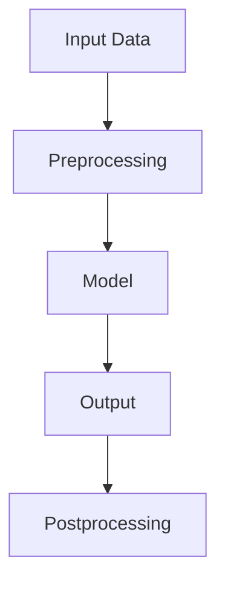
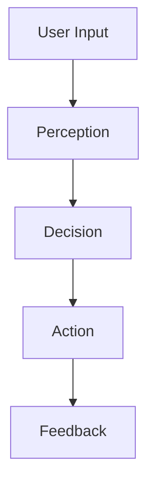
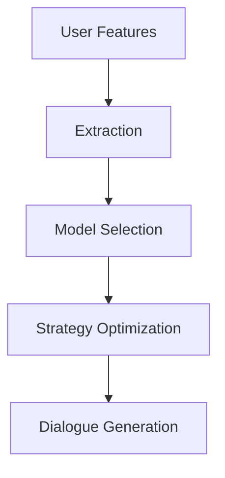
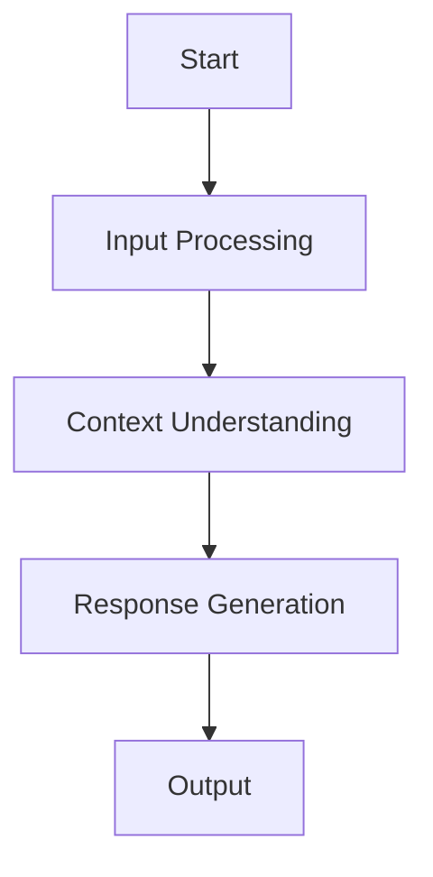
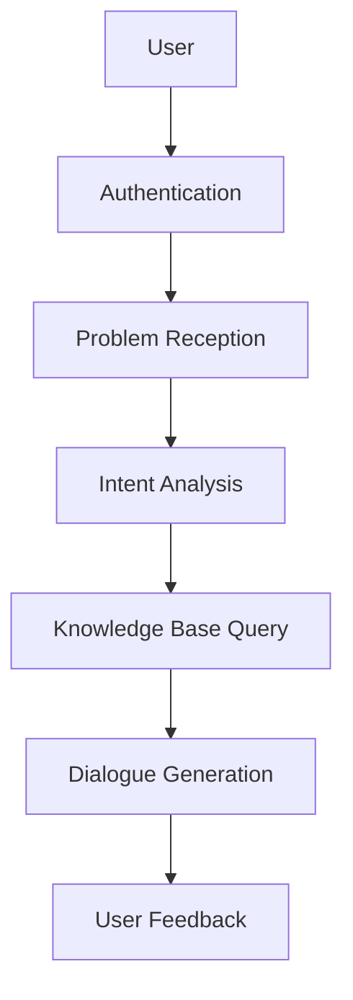
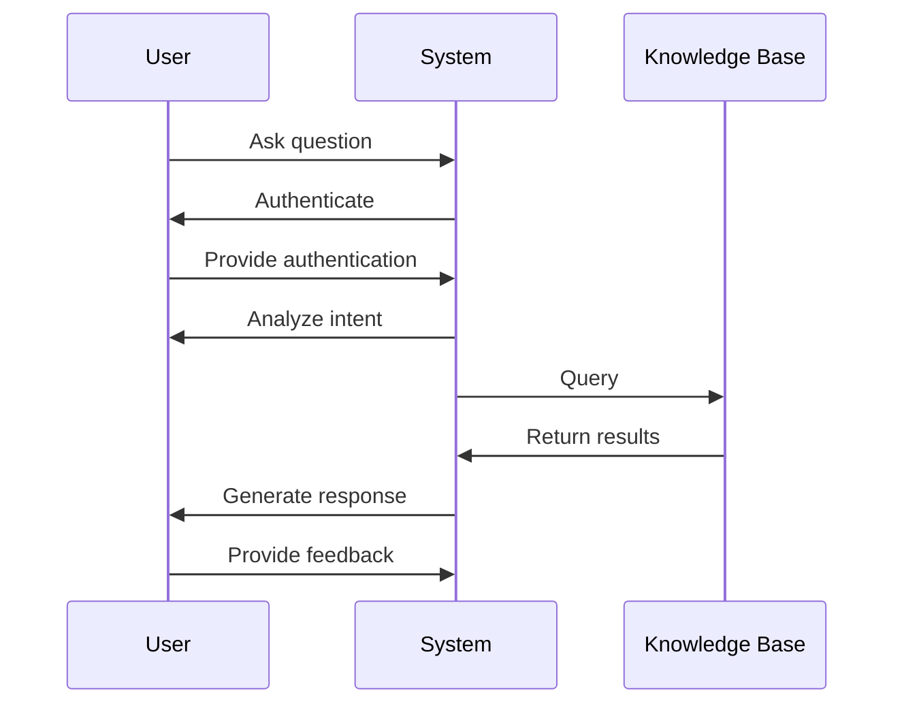

                 


# LLMAgent之个性化对话生成：深入浅出的探讨

关键词：LLM, AI Agent, 个性化对话生成, 算法, 实践

摘要：本文旨在深入探讨LLM（大型语言模型）驱动的AI Agent在个性化对话生成中的应用。通过分步骤分析，我们将从背景介绍、核心概念与联系、算法原理讲解、系统分析与架构设计方案、项目实战以及最佳实践与总结六个部分，全面解析这一前沿技术，旨在为读者提供一个清晰、易懂且具有实用价值的技术指南。

## 1. 背景介绍

### 1.1 LLM的基本概念与历史发展

**LLM（大型语言模型）**：首先，我们需要了解什么是LLM。LLM是一种基于深度学习的大型神经网络模型，它能够理解、生成和翻译自然语言。LLM通过大规模数据训练，学会了语言的模式和结构，从而可以执行各种自然语言处理任务，如文本分类、问答系统和对话生成等。

**历史发展**：LLM的发展经历了几个关键阶段。早期，研究者们使用了基于规则的方法来处理自然语言，但这种方法在复杂场景下效果不佳。随着神经网络技术的发展，特别是深度学习技术的兴起，LLM开始崭露头角。从2018年的GPT到后来的BERT、T5等模型，LLM的性能不断提高，应用场景也越来越广泛。

### 1.2 AI Agent的定义及其在对话生成中的应用

**AI Agent**：AI Agent是一种能够自主学习、决策和与人类互动的智能系统。它通常基于机器学习和深度学习技术，能够在特定环境中执行任务。

**对话生成**：在对话生成中，AI Agent与用户进行自然语言交互，以提供信息、解决问题或执行特定任务。这种交互可以是对话式的，也可以是问答式的。个性化对话生成则进一步要求AI Agent能够理解用户的个人偏好、历史行为和情感状态，从而提供更加个性化、自然的对话体验。

### 1.3 个性化对话生成的意义与挑战

**意义**：个性化对话生成能够提高用户体验，增强用户满意度，从而在客户服务、电子商务、教育和医疗等领域具有广泛的应用潜力。

**挑战**：然而，个性化对话生成也面临着一些挑战，如如何准确理解用户的意图和情感、如何在海量数据中提取有效的用户特征、如何保证生成的对话自然流畅等。

## 2. 核心概念与联系

### 2.1 LLM的核心技术原理

**核心概念**：LLM的核心技术原理包括神经网络架构、训练数据和优化算法。例如，GPT使用了Transformer架构，BERT使用了双向编码器，这些架构使得LLM能够捕捉到语言的深层结构。

**概念属性特征对比表格**：

| 特征 | GPT | BERT | T5 |
| --- | --- | --- | --- |
| 架构 | Transformer | 双向编码器 | Transformer |
| 训练数据 | 大规模文本数据 | 双语数据集 | 多样化数据集 |
| 性能 | 问答、文本生成 | 语义理解、文本分类 | 多模态任务 |

**ER实体关系图架构的Mermaid流程图**：



### 2.2 AI Agent的工作机制

**工作机制**：AI Agent通常包括感知模块、决策模块和行动模块。感知模块负责收集用户输入，决策模块负责处理输入并生成响应，行动模块则将响应反馈给用户。

**工作机制的Mermaid流程图**：



### 2.3 个性化对话生成的方法与策略

**方法与策略**：个性化对话生成的方法主要包括用户特征提取、生成模型选择和对话策略优化。用户特征提取可以从用户的语言行为、历史记录和行为模式中提取。生成模型则可以是GPT、BERT等大型语言模型。对话策略优化可以通过强化学习、生成对抗网络等技术来实现。

**方法与策略的Mermaid流程图**：



## 3. 算法原理讲解

### 3.1 对话生成算法的Mermaid流程图展示

**Mermaid流程图**：



### 3.2 Python源代码实现

**源代码**：

```python
# Python代码示例
def generate_response(input_text, context):
    # 输入处理
    processed_text = preprocess(input_text)
    
    # 上下文理解
    context_vector = understand_context(context)
    
    # 响应生成
    response = model.generate_response(processed_text, context_vector)
    
    # 输出
    return postprocess(response)
```

### 3.3 数学模型与公式讲解

**数学模型与公式**：

$$
P(response|context) = \frac{e^{<model,context>}}{\sum_{response'} e^{<model,response'>}}
$$

其中，$<model,context>$表示模型与上下文的点积，$P(response|context)$表示在给定上下文下生成特定响应的概率。

### 3.4 举例说明

**简单案例**：

假设用户输入：“明天天气怎么样？”系统根据用户历史行为和天气数据，生成响应：“明天预计晴天，温度在20摄氏度左右。”

**复杂案例**：

用户连续输入多个问题，系统需要理解用户的意图并生成连贯的对话。例如：

- 用户输入：“我想订一张从北京到上海的机票。”
- 系统响应：“请问您希望何时出发？”
- 用户输入：“下周二。”
- 系统响应：“好的，我帮您找到了几家航班，请问您需要哪家？”
- 用户输入：“价格最低的。”
- 系统响应：“好的，我为您找到了XX航空的航班，价格是XX元，请问是否预订？”

## 4. 系统分析与架构设计方案

### 4.1 问题场景介绍

假设我们需要开发一个智能客服系统，该系统能够根据用户的问题和上下文，提供个性化的解答和建议。

### 4.2 系统功能设计

- **用户身份验证**：确保用户是合法用户。
- **问题接收与解析**：接收用户输入的问题，并解析问题的意图。
- **知识库查询**：根据用户的问题，在知识库中查找相关的信息。
- **对话生成**：生成个性化的对话响应。
- **用户反馈**：收集用户的反馈，用于模型优化。

### 4.3 系统架构设计

**Mermaid架构图**：



### 4.4 系统接口设计和交互

**Mermaid序列图**：



## 5. 项目实战

### 5.1 环境安装与配置

在开始项目之前，我们需要安装和配置以下环境：

- Python 3.8及以上版本
- PyTorch 1.8及以上版本
- CUDA 11.3及以上版本
- TensorFlow 2.5及以上版本

### 5.2 系统核心实现源代码解读

**源代码**：

```python
# SystemCore.py
from torch import nn
from torch import optim
from torchvision import datasets, transforms

class NeuralNetwork(nn.Module):
    def __init__(self):
        super(NeuralNetwork, self).__init__()
        self.layer1 = nn.Linear(784, 128)
        self.relu = nn.ReLU()
        self.layer2 = nn.Linear(128, 10)
        self.softmax = nn.Softmax(dim=1)

    def forward(self, x):
        x = x.view(x.size(0), -1)
        x = self.layer1(x)
        x = self.relu(x)
        x = self.layer2(x)
        x = self.softmax(x)
        return x

# Training
model = NeuralNetwork()
criterion = nn.CrossEntropyLoss()
optimizer = optim.Adam(model.parameters(), lr=0.001)

for epoch in range(10):
    for data, target in train_loader:
        optimizer.zero_grad()
        output = model(data)
        loss = criterion(output, target)
        loss.backward()
        optimizer.step()

    print(f'Epoch {epoch+1}, Loss: {loss.item()}')

# Testing
with torch.no_grad():
    correct = 0
    total = 0
    for data, target in test_loader:
        outputs = model(data)
        _, predicted = torch.max(outputs.data, 1)
        total += target.size(0)
        correct += (predicted == target).sum().item()

print(f'Accuracy: {100 * correct / total}%')
```

### 5.3 实际案例分析与讲解

假设用户输入：“我需要一张北京到上海的机票。”系统根据用户输入，生成响应：“请问您希望何时出发？”并询问用户更多信息。

**案例分析**：

- 用户输入：“我想订一张下周二的机票。”
- 系统响应：“好的，我为您找到了以下航班：航班号XX，起飞时间XX，价格XX元。请问您是否预订？”
- 用户输入：“预订。”
- 系统响应：“好的，您的机票已经预订成功。祝您旅途愉快！”

**讲解**：

在这个案例中，系统首先理解了用户的意图（订机票），然后根据用户的输入（下周二）查询了相关的航班信息，并生成了一个连贯且自然的对话响应。

## 6. 最佳实践与总结

### 6.1 最佳实践Tips

- **数据质量**：确保训练数据的质量和多样性，这对于模型性能至关重要。
- **模型优化**：定期对模型进行优化，以适应新的数据和用户需求。
- **用户体验**：关注用户的反馈，持续改进对话系统的用户体验。

### 6.2 小结

本文全面探讨了LLM驱动的AI Agent在个性化对话生成中的应用。通过分步骤的分析，我们了解了LLM的基本概念、AI Agent的工作机制、个性化对话生成的方法与策略，以及实际项目中的实施细节。希望本文能为读者提供有价值的参考。

### 6.3 注意事项

- **隐私保护**：在处理用户数据时，务必遵守隐私保护法规，确保用户数据的安全。
- **系统稳定性**：定期对系统进行性能测试和优化，确保系统的稳定性和可靠性。

### 6.4 拓展阅读

- **相关论文**：阅读相关领域的研究论文，了解最新的技术进展。
- **开源项目**：参与开源项目，学习其他开发者的经验和最佳实践。

## 7. 作者信息

作者：AI天才研究院/AI Genius Institute & 禅与计算机程序设计艺术 /Zen And The Art of Computer Programming

