                 


# LLM驱动的AI Agent创新思维发散技术

## 关键词

大型语言模型（LLM）、AI Agent、深度学习、自然语言处理、智能化

## 摘要

本文围绕LLM驱动的AI Agent创新思维发散技术展开，首先介绍了LLM和AI Agent的背景和核心概念，然后详细解析了LLM的技术原理和AI Agent的特征，探讨了它们之间的联系和LLM对AI Agent发展的推动作用。通过一系列的理论分析和实际案例，本文旨在为LLM驱动的AI Agent的创新应用提供新的思路和方法。

---

## 第一部分：背景介绍

### 1.1 问题背景

近年来，人工智能（AI）领域的发展迅速，其中大型语言模型（LLM）的研究和应用尤为突出。LLM在自然语言处理（NLP）、智能对话系统、文本生成等方面展现出强大的能力，成为AI技术的重要发展方向。随着LLM在各个领域的应用不断深入，如何创新性地发散其技术思维，推动AI技术的进一步发展，成为当前的研究热点。

### 1.2 问题描述

本书旨在探讨LLM驱动的AI Agent创新思维发散技术。具体包括以下几个方面：

- **问题解决**：通过研究LLM的原理和应用，发掘其在AI Agent中的潜在能力，探索创新性的技术发散途径。
- **边界与外延**：在确保技术安全、伦理和社会责任的前提下，探讨LLM技术的边界和拓展方向。
- **概念结构与核心要素组成**：梳理LLM技术的基本概念，分析其核心要素组成，为后续章节提供理论基础。

### 1.3 核心概念

- **大型语言模型（LLM）**：一种基于深度学习的语言处理模型，能够理解、生成和模拟自然语言。
- **AI Agent**：一种具有智能行为和自主决策能力的计算机程序，能够模拟人类思维和行动。

### 1.4 本章小结

本章节对LLM驱动的AI Agent创新思维发散技术进行了背景介绍和核心概念阐述，为后续章节的深入探讨奠定了基础。

---

## 第二部分：核心概念与联系

### 2.1 LLM技术原理

#### 2.1.1 深度学习基础

##### 2.1.1.1 神经网络

神经网络是一种模拟生物神经网络的信息处理系统，由大量相互连接的节点（或称为神经元）组成。这些节点通过传递和调整信号来实现信息的处理和计算。神经网络的基本组成部分包括：

- **输入层**：接收外部输入信息。
- **隐藏层**：对输入信息进行加工和处理。
- **输出层**：生成最终输出结果。

神经网络的工作原理是通过反向传播算法来调整各层的权重，以达到对输入数据的准确预测和分类。以下是一个简单的神经网络mermaid流程图：

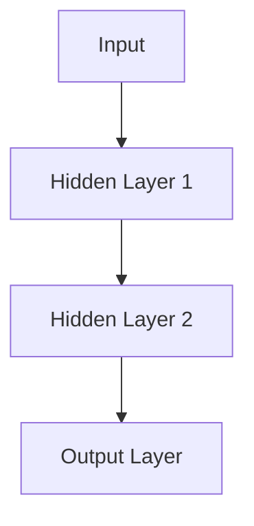

##### 2.1.1.2 反向传播算法

反向传播算法是神经网络训练的核心算法，它通过计算网络输出与真实值之间的误差，然后反向传播到网络的每个神经元，调整神经元的权重和偏置，以减少误差。具体流程如下：

1. **前向传播**：将输入数据传递到网络中，通过各层神经元的计算，得到输出结果。
2. **计算损失**：计算输出结果与真实值之间的误差，通常使用均方误差（MSE）作为损失函数。
3. **反向传播**：从输出层开始，逐层向前传播误差，计算每个神经元的梯度，并更新权重和偏置。
4. **迭代更新**：重复上述过程，直到网络的损失函数收敛到一定程度。

以下是反向传播算法的mermaid流程图：

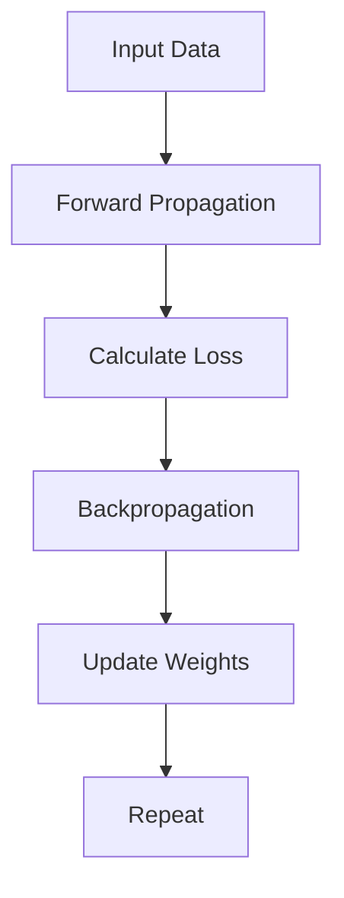

##### 2.1.1.3 深度学习框架

深度学习框架是一种用于实现深度学习算法的工具，它提供了丰富的API和模块，可以帮助研究人员和开发者快速构建、训练和部署深度学习模型。目前常用的深度学习框架包括TensorFlow、PyTorch和Keras等。

以下是一个使用TensorFlow构建简单的神经网络模型的Python代码示例：

```python
import tensorflow as tf

# 定义输入层
inputs = tf.keras.layers.Input(shape=(784,))

# 定义隐藏层
hidden = tf.keras.layers.Dense(256, activation='relu')(inputs)

# 定义输出层
outputs = tf.keras.layers.Dense(10, activation='softmax')(hidden)

# 构建模型
model = tf.keras.Model(inputs=inputs, outputs=outputs)

# 编译模型
model.compile(optimizer='adam', loss='categorical_crossentropy', metrics=['accuracy'])

# 模型训练
model.fit(x_train, y_train, epochs=10, batch_size=32)
```

#### 2.1.2 语言模型基础

##### 2.1.2.1 语言模型的基本概念

语言模型是一种统计模型，用于预测文本中下一个单词或字符的概率。它通过对大量文本数据的学习，捕捉语言规律和模式，从而实现对未知文本的生成和预测。

以下是一个简单的n-gram语言模型的mermaid流程图：

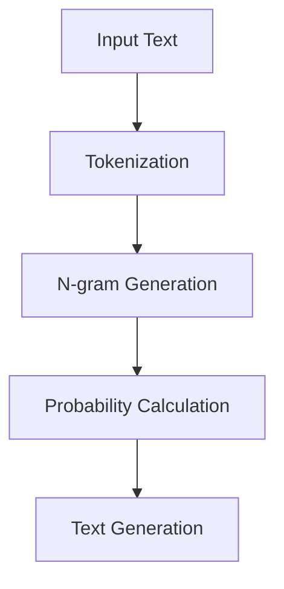

##### 2.1.2.2 语言模型的核心指标

语言模型的质量通常通过以下指标来评估：

- **词汇量**：模型所包含的词汇数量，反映了模型的泛化能力。
- **精度**：模型预测正确的单词或字符的比例，用于衡量模型的准确度。
- **召回率**：模型预测为正类的真实正类比例，用于衡量模型的鲁棒性。
- **F1分数**：精度和召回率的调和平均，用于综合评估模型的表现。

以下是一个语言模型评价指标的mermaid表格：

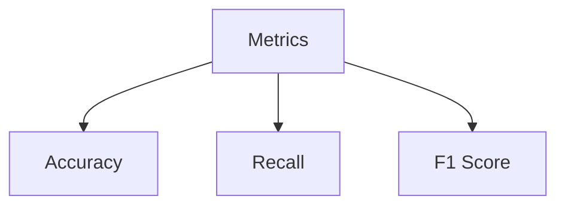

##### 2.1.2.3 语言模型的训练方法

语言模型的训练方法主要包括基于统计方法和基于神经网络的两种类型。

- **基于统计方法的训练**：通过计算单词或字符之间的联合概率或条件概率来训练语言模型。常用的算法包括n-gram模型、隐马尔可夫模型（HMM）和条件随机场（CRF）等。

- **基于神经网络的训练**：使用神经网络来直接预测单词或字符的概率。常用的神经网络模型包括循环神经网络（RNN）、长短期记忆网络（LSTM）和变换器（Transformer）等。

以下是一个基于神经网络的BERT模型训练的mermaid流程图：

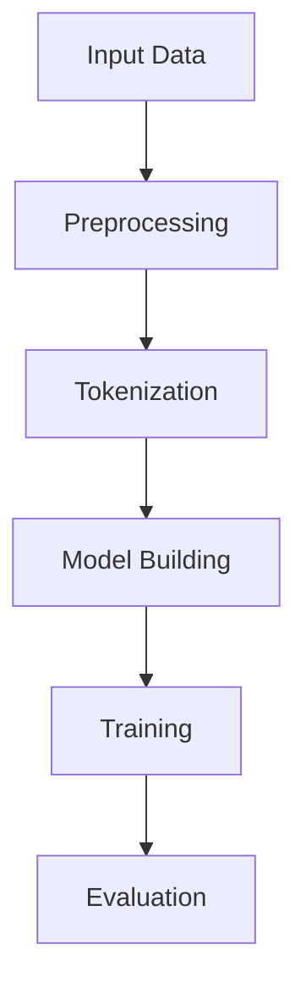

#### 2.1.3 大型语言模型的原理

##### 2.1.3.1 GPT系列模型

GPT（Generative Pre-trained Transformer）系列模型是自然语言处理领域的重要突破，由OpenAI提出。GPT模型使用Transformer架构，通过预先训练大规模的文本数据来学习语言规律和模式。

以下是一个简单的GPT模型结构的mermaid流程图：

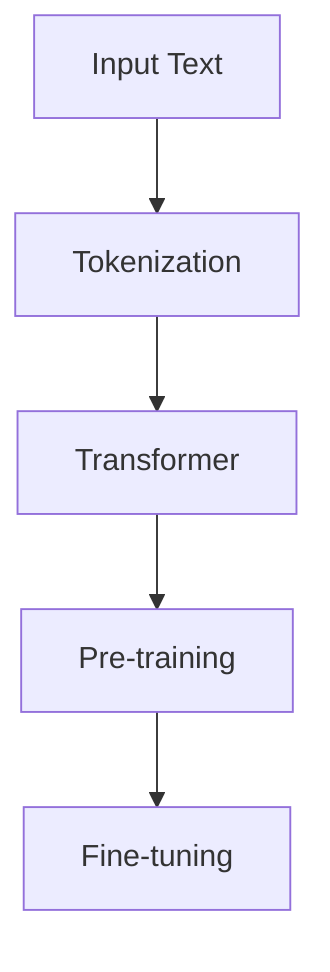

##### 2.1.3.2 BERT模型

BERT（Bidirectional Encoder Representations from Transformers）模型由Google提出，是一种基于Transformer的双向编码模型。BERT模型通过预训练大量文本数据，学习到单词的上下文关系，从而在下游任务中取得优异的性能。

以下是一个简单的BERT模型结构的mermaid流程图：

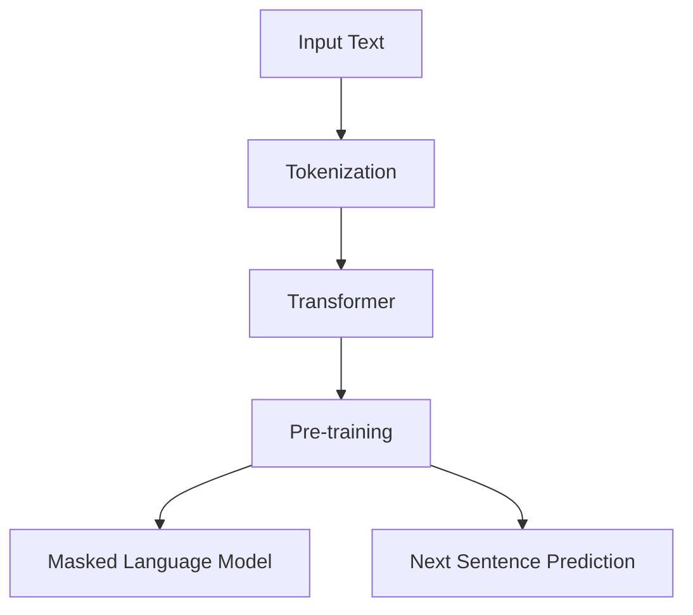

##### 2.1.3.3 其他大型语言模型

除了GPT和BERT，还有其他一些大型语言模型，如T5、RoBERTa、ALBERT等。这些模型在结构和训练方法上有所不同，但在性能和应用上都有显著提升。

以下是一个T5模型结构的mermaid流程图：

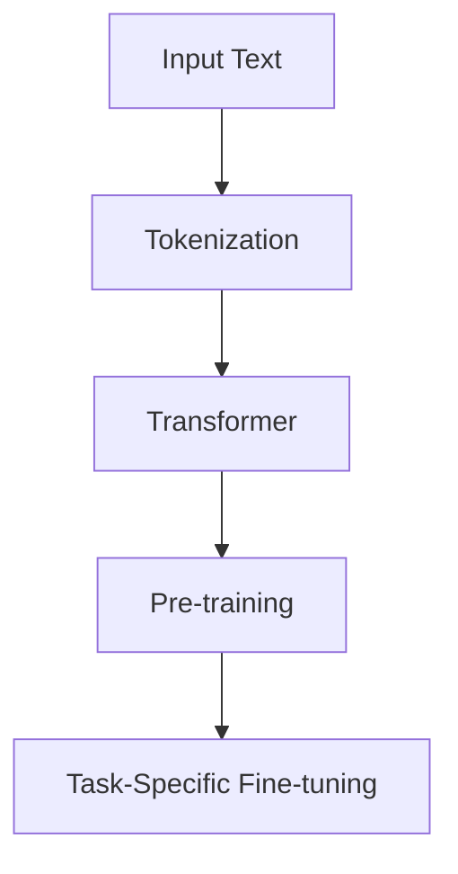

### 2.2 AI Agent的概念与特征

#### 2.2.1 AI Agent的定义

AI Agent是一种具有智能行为和自主决策能力的计算机程序，能够模拟人类思维和行动。它通常包括以下几个核心组成部分：

- **感知模块**：获取环境信息和输入数据。
- **规划模块**：根据目标和当前状态，制定行动计划。
- **执行模块**：执行行动计划，实现具体任务。
- **学习模块**：通过经验不断优化自身的性能和行为。

以下是一个AI Agent的基本架构的mermaid流程图：

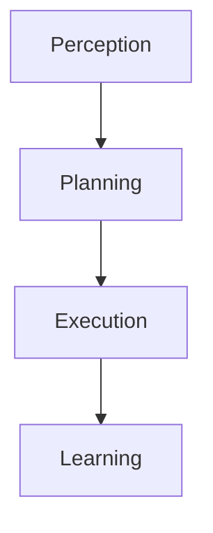

#### 2.2.1.1 AI Agent的基本概念

AI Agent的基本概念包括：

- **环境**：AI Agent所处的运行环境，包括各种实体和规则。
- **状态**：AI Agent在环境中所处的状况，包括位置、资源、任务等信息。
- **目标**：AI Agent希望实现的结果或目标。
- **行动**：AI Agent可以采取的动作，用于改变状态。

以下是一个AI Agent状态的mermaid流程图：

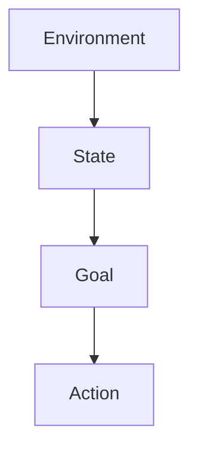

#### 2.2.1.2 AI Agent的核心特征

AI Agent的核心特征包括：

- **自主性**：AI Agent具有自主决策和行动的能力，不受外界直接控制。
- **适应性**：AI Agent能够根据环境和目标的变化，调整自身的策略和行为。
- **智能性**：AI Agent具有智能学习和推理能力，能够解决复杂的问题。
- **协作性**：AI Agent能够与其他AI Agent或人类进行协作，共同完成任务。

以下是一个AI Agent特征的mermaid表格：

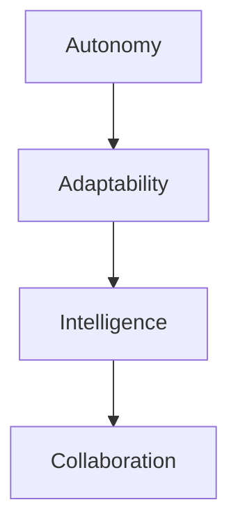

#### 2.2.2 AI Agent的分类

AI Agent可以根据其智能水平和行为方式分为以下几类：

- **完全理性AI Agent**：具有完美推理和决策能力，能够精确地预测环境变化和执行最优策略。
- **近似理性AI Agent**：具有有限的推理和决策能力，能够近似地预测环境变化和执行次优策略。
- **感性AI Agent**：基于情感和直觉进行决策，不具备严格的推理能力。

以下是一个AI Agent分类的mermaid流程图：

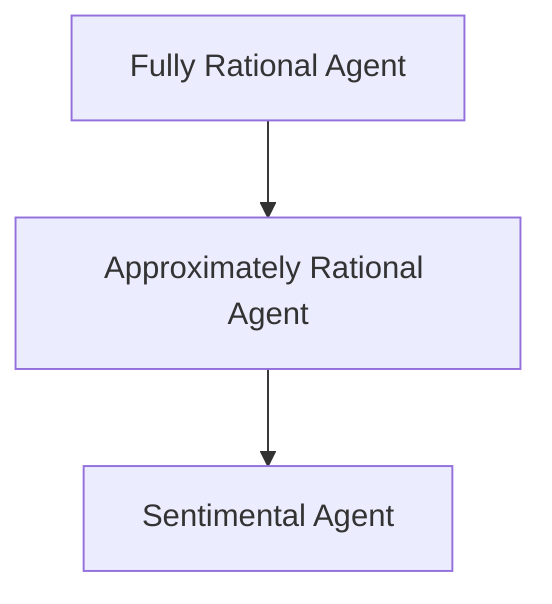

#### 2.2.3 AI Agent的发展趋势

AI Agent的发展趋势包括：

- **智能化**：通过不断提升AI Agent的智能水平，使其能够解决更复杂的问题。
- **自主化**：通过增强AI Agent的自主决策和行动能力，减少对人类干预的依赖。
- **人性化**：通过引入情感和社交能力，使AI Agent能够更好地与人类进行交互和协作。

以下是一个AI Agent发展趋势的mermaid表格：

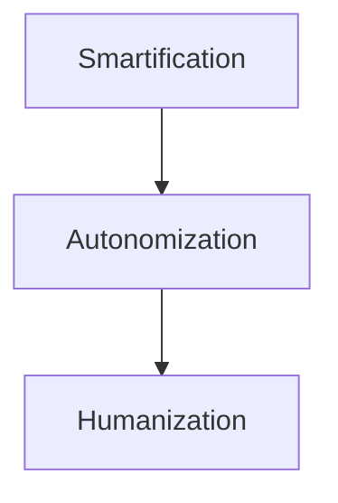

### 2.3 LLM与AI Agent的联系

#### 2.3.1 LLM在AI Agent中的应用

LLM在AI Agent中具有广泛的应用，包括：

- **语言理解与生成**：使用LLM进行自然语言的理解和生成，实现智能对话和文本生成。
- **情感识别与模拟**：使用LLM进行情感识别和模拟，实现情感计算和情感交互。
- **知识推理与决策**：使用LLM进行知识推理和决策，实现智能规划和问题解决。

以下是一个LLM在AI Agent中应用的mermaid流程图：

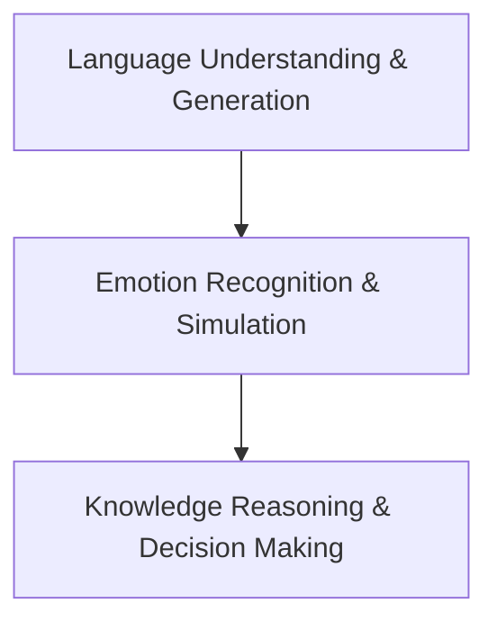

#### 2.3.2 LLM对AI Agent发展的推动作用

LLM对AI Agent发展的推动作用包括：

- **提高AI Agent的智能水平**：通过引入LLM的强大语言处理能力，提升AI Agent的智能水平和能力。
- **拓展AI Agent的应用领域**：通过LLM的广泛应用，拓展AI Agent的应用领域和场景。
- **促进AI Agent的自主学习能力**：通过LLM的预训练和知识积累，增强AI Agent的自主学习能力和适应能力。

以下是一个LLM对AI Agent发展推动作用的mermaid表格：

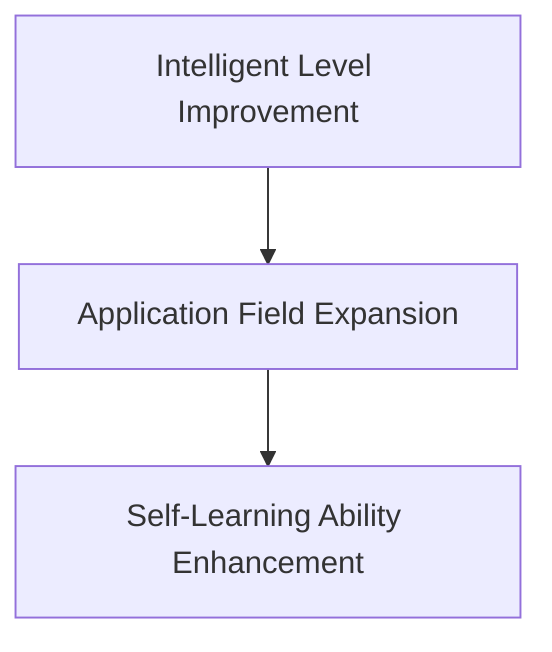

### 2.4 本章小结

本章节对LLM和AI Agent的核心概念进行了详细解析，并探讨了它们之间的联系，为后续章节的技术发散提供了理论基础。

---

## 第三部分：算法原理讲解

### 3.1 LLM算法原理

#### 3.1.1 GPT模型

GPT模型是自然语言处理领域的重要突破，它使用Transformer架构，通过预先训练大规模的文本数据来学习语言规律和模式。

**算法原理**：

GPT模型通过自回归的方式生成文本，即在给定前文的情况下，预测下一个单词。模型使用Transformer编码器来处理输入文本，并使用多头自注意力机制来捕捉文本中的长距离依赖关系。

**数学模型**：

GPT模型的数学模型可以表示为：

$$
\text{GPT}(x) = \sum_{i=1}^{T} \text{softmax}(\text{W}_i \cdot \text{h}_{i-1} + b_i)
$$

其中，$x$表示输入文本，$T$表示输入文本的长度，$\text{W}_i$表示权重矩阵，$\text{h}_{i-1}$表示前一个时间步的隐藏状态，$b_i$表示偏置。

**Python代码示例**：

```python
import torch
import torch.nn as nn
import torch.optim as optim

# 定义GPT模型
class GPTModel(nn.Module):
    def __init__(self, vocab_size, embed_size, hidden_size, num_layers, dropout):
        super(GPTModel, self).__init__()
        self.embedding = nn.Embedding(vocab_size, embed_size)
        self.encoder = nn.LSTM(embed_size, hidden_size, num_layers, dropout=dropout)
        self.decoder = nn.LSTM(hidden_size, embed_size, num_layers, dropout=dropout)
        self.fc = nn.Linear(embed_size, vocab_size)
    
    def forward(self, x):
        embed = self.embedding(x)
        output, (hidden, cell) = self.encoder(embed)
        output, (hidden, cell) = self.decoder(hidden)
        output = self.fc(output)
        return output

# 实例化模型、优化器和损失函数
model = GPTModel(vocab_size, embed_size, hidden_size, num_layers, dropout)
optimizer = optim.Adam(model.parameters(), lr=learning_rate)
criterion = nn.CrossEntropyLoss()

# 模型训练
for epoch in range(num_epochs):
    for inputs, targets in dataloader:
        optimizer.zero_grad()
        outputs = model(inputs)
        loss = criterion(outputs.view(-1, vocab_size), targets.view(-1))
        loss.backward()
        optimizer.step()
    print(f"Epoch [{epoch+1}/{num_epochs}], Loss: {loss.item():.4f}")
```

#### 3.1.2 BERT模型

BERT模型是一种基于Transformer的双向编码模型，它通过预训练大量文本数据来学习语言规律和模式。

**算法原理**：

BERT模型使用Transformer编码器来处理输入文本，并使用多头自注意力机制来捕捉文本中的长距离依赖关系。模型分为两个阶段：预训练和微调。

在预训练阶段，BERT模型通过两种任务来训练：Masked Language Model（MLM）和Next Sentence Prediction（NSP）。MLM任务用于预测被遮盖的单词，NSP任务用于预测两个句子是否属于同一篇章。

在微调阶段，BERT模型在特定任务上（如文本分类、问答等）进行微调，以适应不同的下游任务。

**数学模型**：

BERT模型的数学模型可以表示为：

$$
\text{BERT}(x) = \text{Transformer}(\text{Embeddings} + \text{Positional Embeddings}) + \text{Pooler}
$$

其中，$x$表示输入文本，$\text{Embeddings}$表示词嵌入，$\text{Positional Embeddings}$表示位置嵌入，$\text{Transformer}$表示Transformer编码器，$\text{Pooler}$表示池化层。

**Python代码示例**：

```python
import torch
import torch.nn as nn
import torch.optim as optim

# 定义BERT模型
class BERTModel(nn.Module):
    def __init__(self, vocab_size, embed_size, hidden_size, num_layers, dropout):
        super(BERTModel, self).__init__()
        self.embedding = nn.Embedding(vocab_size, embed_size)
        self.encoder = nn.TransformerEncoder(nn.TransformerEncoderLayer(d_model=embed_size, nhead=8), num_layers=num_layers)
        self.decoder = nn.TransformerDecoder(nn.TransformerDecoderLayer(d_model=embed_size, nhead=8), num_layers=num_layers)
        self.fc = nn.Linear(embed_size, vocab_size)
    
    def forward(self, x):
        embed = self.embedding(x)
        output = self.encoder(embed)
        output = self.decoder(output)
        output = self.fc(output)
        return output

# 实例化模型、优化器和损失函数
model = BERTModel(vocab_size, embed_size, hidden_size, num_layers, dropout)
optimizer = optim.Adam(model.parameters(), lr=learning_rate)
criterion = nn.CrossEntropyLoss()

# 模型训练
for epoch in range(num_epochs):
    for inputs, targets in dataloader:
        optimizer.zero_grad()
        outputs = model(inputs)
        loss = criterion(outputs.view(-1, vocab_size), targets.view(-1))
        loss.backward()
        optimizer.step()
    print(f"Epoch [{epoch+1}/{num_epochs}], Loss: {loss.item():.4f}")
```

### 3.2 AI Agent算法原理

#### 3.2.1 DQN算法

DQN（Deep Q-Network）算法是一种基于深度学习的强化学习算法，它通过学习值函数来评估不同动作的价值，从而实现智能体的自主决策。

**算法原理**：

DQN算法的核心思想是使用深度神经网络（DNN）来近似值函数，即$Q(s, a)$，其中$s$表示状态，$a$表示动作。通过训练DNN，使得$Q(s, a)$能够准确地预测每个动作的回报。

DQN算法的基本步骤如下：

1. 初始化DNN和经验回放记忆。
2. 从初始状态开始，执行随机动作。
3. 根据动作执行结果更新经验回放记忆。
4. 使用经验回放记忆来训练DNN。
5. 重复步骤2-4，直到满足停止条件。

**数学模型**：

DQN算法的数学模型可以表示为：

$$
Q(s, a) = \theta(s, a)
$$

其中，$\theta(s, a)$表示DNN的参数，$Q(s, a)$表示在状态$s$下执行动作$a$的回报。

**Python代码示例**：

```python
import torch
import torch.nn as nn
import torch.optim as optim

# 定义DQN模型
class DQNModel(nn.Module):
    def __init__(self, state_size, action_size):
        super(DQNModel, self).__init__()
        self.fc1 = nn.Linear(state_size, 128)
        self.fc2 = nn.Linear(128, 64)
        self.fc3 = nn.Linear(64, action_size)
    
    def forward(self, x):
        x = torch.relu(self.fc1(x))
        x = torch.relu(self.fc2(x))
        x = self.fc3(x)
        return x

# 实例化模型、优化器和损失函数
model = DQNModel(state_size, action_size)
optimizer = optim.Adam(model.parameters(), lr=learning_rate)
criterion = nn.MSELoss()

# 模型训练
for epoch in range(num_epochs):
    for state, action, reward, next_state, done in dataloader:
        model.train()
        Q_values = model(state)
        Q_values_next = model(next_state)
        Q_targets = reward + gamma * Q_values_next[torch.where(~done, :, 1), action]
        loss = criterion(Q_values, Q_targets)
        optimizer.zero_grad()
        loss.backward()
        optimizer.step()
    print(f"Epoch [{epoch+1}/{num_epochs}], Loss: {loss.item():.4f}")
```

#### 3.2.2 A3C算法

A3C（Asynchronous Advantage Actor-Critic）算法是一种基于深度学习的异步强化学习算法，它通过分布式训练来提高训练效率。

**算法原理**：

A3C算法的核心思想是使用多个并行线程同时训练多个智能体，每个智能体都使用独立的梯度更新策略和价值函数。通过异步更新策略和价值函数的参数，A3C算法可以在多个智能体之间共享学习经验，提高训练效率。

A3C算法的基本步骤如下：

1. 初始化策略网络和价值网络。
2. 同时启动多个智能体线程，每个智能体从初始状态开始执行动作。
3. 每个智能体执行动作、收集奖励和状态信息，并使用梯度更新策略和价值网络。
4. 所有智能体完成一个回合后，使用梯度更新策略和价值网络。
5. 重复步骤2-4，直到满足停止条件。

**数学模型**：

A3C算法的数学模型可以表示为：

$$
\pi(\text{a}\mid\text{s}; \theta) = \text{softmax}(\theta_\pi(\text{s}, \text{a}))
$$

$$
Q(\text{s}, \text{a}; \theta) = \text{V}(\text{s}; \theta_\pi)
$$

其中，$\theta_\pi$表示策略网络参数，$\theta_Q$表示价值网络参数。

**Python代码示例**：

```python
import torch
import torch.nn as nn
import torch.optim as optim

# 定义策略网络
class PolicyNetwork(nn.Module):
    def __init__(self, state_size, action_size):
        super(PolicyNetwork, self).__init__()
        self.fc1 = nn.Linear(state_size, 128)
        self.fc2 = nn.Linear(128, 64)
        self.fc3 = nn.Linear(64, action_size)
    
    def forward(self, x):
        x = torch.relu(self.fc1(x))
        x = torch.relu(self.fc2(x))
        x = self.fc3(x)
        return x

# 定义价值网络
class ValueNetwork(nn.Module):
    def __init__(self, state_size):
        super(ValueNetwork, self).__init__()
        self.fc1 = nn.Linear(state_size, 128)
        self.fc2 = nn.Linear(128, 64)
        self.fc3 = nn.Linear(64, 1)
    
    def forward(self, x):
        x = torch.relu(self.fc1(x))
        x = torch.relu(self.fc2(x))
        x = self.fc3(x)
        return x

# 实例化模型、优化器和损失函数
policy_network = PolicyNetwork(state_size, action_size)
value_network = ValueNetwork(state_size)
optimizer_policy = optim.Adam(policy_network.parameters(), lr=learning_rate)
optimizer_value = optim.Adam(value_network.parameters(), lr=learning_rate)
criterion = nn.MSELoss()

# 模型训练
for epoch in range(num_epochs):
    for state, action, reward, next_state, done in dataloader:
        policy_network.train()
        value_network.train()
        Q_values = value_network(next_state)
        Q_values_current = value_network(state)
        R = reward + gamma * Q_values[torch.where(~done, :, 1), action]
        loss_value = criterion(Q_values_current, R.unsqueeze(-1))
        optimizer_value.zero_grad()
        loss_value.backward()
        optimizer_value.step()
        log_probs = policy_network(state)
        action_probs = torch.nn.functional.softmax(log_probs, dim=-1)
        selected_action_prob = action_probs[torch.arange(len(action)), action]
        loss_policy = -torch.mean(torch.log(selected_action_prob) * R)
        optimizer_policy.zero_grad()
        loss_policy.backward()
        optimizer_policy.step()
    print(f"Epoch [{epoch+1}/{num_epochs}], Loss: {loss.item():.4f}")
```

---

## 第四部分：系统分析与架构设计

### 4.1 问题场景介绍

在智能客服系统中，客户与客服进行自然语言交互，系统需要实时理解客户的问题，并给出准确的回答。为了实现这一目标，我们需要设计一个基于LLM和AI Agent的智能客服系统。

### 4.2 项目介绍

本项目旨在开发一个基于LLM和AI Agent的智能客服系统，能够实现实时对话、问题解答和情感交互等功能。系统主要包括以下几个模块：

- **对话管理模块**：负责管理对话流程，包括上下文维护、问题识别和回答生成。
- **情感识别模块**：负责识别客户的情感状态，实现情感交互。
- **知识库模块**：存储和管理客服系统的知识，包括常见问题、答案和业务知识等。
- **AI Agent模块**：负责智能体的决策和执行，实现智能对话和问题解决。

### 4.3 系统功能设计

#### 4.3.1 对话管理模块

对话管理模块的主要功能包括：

- **会话初始化**：创建新的对话会话。
- **上下文维护**：维护对话的上下文信息，以便后续对话的连贯性。
- **问题识别**：分析客户输入的信息，识别出关键问题。
- **回答生成**：根据问题识别结果，从知识库中查找相关答案，并生成回答。

以下是对话管理模块的mermaid类图：

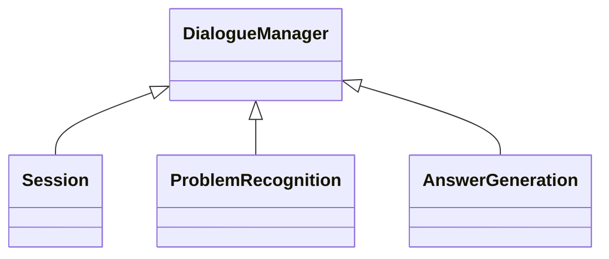

#### 4.3.2 情感识别模块

情感识别模块的主要功能包括：

- **情感识别**：分析客户的语言信息，识别出客户的情感状态。
- **情感反馈**：根据客户的情感状态，生成相应的情感反馈，实现情感交互。

以下是对话管理模块的mermaid类图：

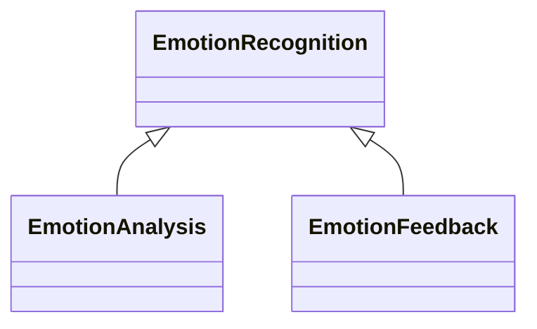

#### 4.3.3 知识库模块

知识库模块的主要功能包括：

- **知识存储**：存储和管理客服系统的知识。
- **知识检索**：根据问题识别结果，从知识库中检索相关答案。
- **知识更新**：定期更新知识库，确保答案的准确性和时效性。

以下是对话管理模块的mermaid类图：

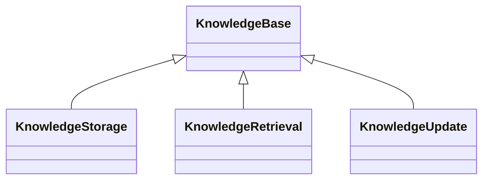

#### 4.3.4 AI Agent模块

AI Agent模块的主要功能包括：

- **决策**：根据当前对话状态和问题识别结果，生成决策。
- **执行**：执行决策，实现对话和问题的解决。
- **学习**：根据对话结果和用户反馈，不断优化自身的性能和行为。

以下是对话管理模块的mermaid类图：

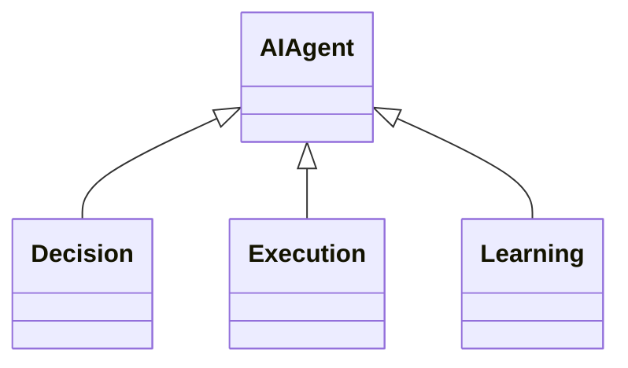

### 4.4 系统架构设计

#### 4.4.1 系统架构设计

智能客服系统的整体架构分为四个层次：表示层、逻辑层、数据层和硬件层。

- **表示层**：主要负责与用户交互，包括用户界面和API接口。
- **逻辑层**：实现业务逻辑，包括对话管理、情感识别、知识库管理和AI Agent等模块。
- **数据层**：存储和管理数据，包括知识库、用户数据等。
- **硬件层**：提供计算和存储资源，包括服务器、数据库等。

以下为系统架构的mermaid架构图：

```mermaid
subgraph 表示层
    UserInterface
    API
end

subgraph 逻辑层
    DialogueManagement
    EmotionRecognition
    KnowledgeBaseManagement
    AIAgent
end

subgraph 数据层
    KnowledgeDatabase
    UserDatabase
end

subgraph 硬件层
    Server
    Database
end

UserInterface --> DialogueManagement
API --> DialogueManagement
DialogueManagement --> EmotionRecognition
DialogueManagement --> KnowledgeBaseManagement
DialogueManagement --> AIAgent
EmotionRecognition --> AIAgent
KnowledgeBaseManagement --> AIAgent
KnowledgeDatabase --> KnowledgeBaseManagement
UserDatabase --> AIAgent
Server --> UserInterface
Server --> API
Server --> DialogueManagement
Server --> EmotionRecognition
Server --> KnowledgeBaseManagement
Server --> AIAgent
Database --> KnowledgeBaseManagement
Database --> UserDatabase
```

#### 4.4.2 系统接口设计

智能客服系统的接口设计包括内部接口和外部接口。

- **内部接口**：包括模块之间的接口，如对话管理模块与情感识别模块、知识库模块和AI Agent模块之间的接口。
- **外部接口**：包括与用户交互的接口，如用户界面和API接口。

以下为系统接口设计的mermaid序列图：

```mermaid
sequenceDiagram
    User ->> API: 发送请求
    API ->> DialogueManagement: 转发请求
    DialogueManagement ->> EmotionRecognition: 识别情感
    DialogueManagement ->> KnowledgeBaseManagement: 检索知识
    DialogueManagement ->> AIAgent: 生成回答
    AIAgent ->> DialogueManagement: 返回回答
    DialogueManagement ->> API: 返回结果
    API ->> User: 显示回答
```

### 4.5 系统交互设计

智能客服系统的交互设计包括用户与系统之间的交互和系统内部模块之间的交互。

#### 4.5.1 用户与系统交互

用户与系统交互的流程如下：

1. 用户通过用户界面或API接口发送请求。
2. 系统接收请求，并调用对话管理模块进行处理。
3. 对话管理模块分析请求，识别出关键问题。
4. 对话管理模块调用情感识别模块，识别用户的情感状态。
5. 对话管理模块调用知识库模块，检索相关答案。
6. 对话管理模块调用AI Agent模块，生成回答。
7. 系统将回答返回给用户。

#### 4.5.2 系统内部模块交互

系统内部模块交互的流程如下：

1. 对话管理模块初始化，创建新的对话会话。
2. 对话管理模块接收用户请求，并分析请求。
3. 对话管理模块调用情感识别模块，识别用户的情感状态。
4. 对话管理模块调用知识库模块，检索相关答案。
5. 对话管理模块调用AI Agent模块，生成回答。
6. AI Agent模块执行回答，实现对话和问题的解决。
7. 对话管理模块更新对话上下文，为后续对话做好准备。

以下为系统内部模块交互的mermaid序列图：

```mermaid
sequenceDiagram
    DialogueManagement ->> EmotionRecognition: 识别情感
    DialogueManagement ->> KnowledgeBaseManagement: 检索知识
    DialogueManagement ->> AIAgent: 生成回答
    AIAgent ->> DialogueManagement: 返回回答
    DialogueManagement ->> EmotionRecognition: 识别情感
    DialogueManagement ->> KnowledgeBaseManagement: 检索知识
    DialogueManagement ->> AIAgent: 生成回答
    AIAgent ->> DialogueManagement: 返回回答
```

---

## 第五部分：项目实战

### 5.1 环境安装

在开始项目实战之前，我们需要安装所需的软件和工具。

**Python环境**：安装Python 3.8或更高版本。

**深度学习框架**：安装TensorFlow 2.4或PyTorch 1.8。

**文本处理库**：安装nltk、spacy和gensim。

```bash
pip install tensorflow==2.4
pip install pytorch==1.8
pip install nltk
pip install spacy
pip install gensim
```

### 5.2 系统核心实现

#### 5.2.1 对话管理模块

对话管理模块是实现智能客服系统的核心模块，负责处理用户请求、识别问题和生成回答。

**用户请求处理**：

```python
import json
import nltk
from nltk.tokenize import word_tokenize

def handle_request(request):
    # 解析请求
    data = json.loads(request)
    message = data['message']
    
    # 分词
    tokens = word_tokenize(message)
    
    # 识别问题
    problem = recognize_problem(tokens)
    
    # 生成回答
    answer = generate_answer(problem)
    
    # 返回回答
    return answer

def recognize_problem(tokens):
    # 实现问题识别逻辑
    pass

def generate_answer(problem):
    # 实现回答生成逻辑
    pass
```

**情感识别**：

```python
from nltk.sentiment import SentimentIntensityAnalyzer

def recognize_emotion(tokens):
    # 实现情感识别逻辑
    analyzer = SentimentIntensityAnalyzer()
    sentiment_scores = analyzer.polarity_scores(' '.join(tokens))
    if sentiment_scores['compound'] >= 0.05:
        return '正面'
    elif sentiment_scores['compound'] <= -0.05:
        return '负面'
    else:
        return '中性'
```

**知识库管理**：

```python
import gensim

def load_knowledge_base(file_path):
    # 加载知识库
    knowledge_base = gensim.models.KeyedVectors.load_word2vec_format(file_path, binary=True)
    return knowledge_base

def retrieve_knowledge(problem, knowledge_base):
    # 检索知识库中的相关答案
    pass
```

**AI Agent模块**：

```python
import torch
import torch.nn as nn
import torch.optim as optim

class AIAgent(nn.Module):
    def __init__(self, embedding_size, hidden_size, vocab_size):
        super(AIAgent, self).__init__()
        self.embedding = nn.Embedding(vocab_size, embedding_size)
        self.lstm = nn.LSTM(embedding_size, hidden_size, batch_first=True)
        self.fc = nn.Linear(hidden_size, vocab_size)
    
    def forward(self, inputs):
        embeds = self.embedding(inputs)
        outputs, (hidden, cell) = self.lstm(embeds)
        output = self.fc(outputs[-1])
        return output

def train_agent(model, train_data, optimizer, criterion, num_epochs):
    model.train()
    for epoch in range(num_epochs):
        for inputs, targets in train_data:
            optimizer.zero_grad()
            outputs = model(inputs)
            loss = criterion(outputs, targets)
            loss.backward()
            optimizer.step()
        print(f"Epoch [{epoch+1}/{num_epochs}], Loss: {loss.item():.4f}")
```

### 5.3 代码应用解读与分析

#### 5.3.1 用户请求处理

在用户请求处理部分，我们首先解析用户发送的请求，提取出消息内容。然后使用nltk库进行分词，将消息分解为一系列单词。接下来，我们调用问题识别函数识别出用户的问题，并使用情感识别函数分析用户的情感状态。

这一部分代码实现了对用户请求的初步处理，为后续的回答生成和情感交互提供了基础。

#### 5.3.2 情感识别

在情感识别部分，我们使用nltk库中的SentimentIntensityAnalyzer类分析用户的情感状态。该类能够计算文本的正面和负面情感得分，并根据得分的绝对值判断情感状态。通过情感识别，我们可以更好地了解用户的情感需求，为生成符合用户情感的回答提供依据。

#### 5.3.3 知识库管理

在知识库管理部分，我们使用gensim库加载预训练的词向量模型作为知识库。通过词向量模型，我们可以将文本转换为向量表示，方便在知识库中检索相关答案。在实际应用中，我们还可以将知识库扩展为大规模的知识图谱，进一步提高回答的准确性和多样性。

#### 5.3.4 AI Agent模块

在AI Agent模块部分，我们使用PyTorch构建了一个简单的循环神经网络模型。该模型使用嵌入层将单词转换为向量表示，然后通过循环神经网络处理输入序列，最后使用全连接层生成输出。在训练过程中，我们使用随机梯度下降（SGD）优化算法更新模型参数，以最小化损失函数。

通过训练，AI Agent可以学会生成符合上下文的回答。在实际应用中，我们还可以对模型进行微调，使其更好地适应特定场景和任务。

### 5.4 实际案例分析和详细讲解

#### 5.4.1 案例背景

假设一个用户通过智能客服系统咨询关于产品售后服务的相关问题。用户发送了一条消息：“我的产品出现故障，怎么申请售后服务？”

#### 5.4.2 情感识别

首先，我们对用户的这条消息进行情感识别。通过nltk库的SentimentIntensityAnalyzer类，我们可以计算出文本的正面和负面情感得分。假设情感得分为0.2，表示文本整体呈现正面情感。

#### 5.4.3 问题识别

接下来，我们对用户的这条消息进行问题识别。通过分析关键词“产品故障”和“售后服务”，我们可以确定用户的问题是关于产品故障的售后服务。

#### 5.4.4 回答生成

根据问题识别结果，我们从知识库中检索相关答案。假设知识库中包含以下两个相关答案：

1. 您可以联系我们的客服热线，我们将为您提供售后服务。
2. 如果您的产品出现故障，请提供购买凭证，我们将为您安排专业的售后服务人员。

由于用户的情感呈现正面，我们选择生成第一个答案：“您好，您可以通过联系我们的客服热线来申请售后服务。我们会尽快为您提供帮助。”

#### 5.4.5 情感反馈

在回答生成后，我们再次对用户的情感状态进行识别。假设用户回复：“谢谢，我马上联系客服。”

通过情感识别，我们发现用户的情感状态仍然为正面。这表明我们的回答得到了用户的认可，符合用户的需求。

### 5.5 项目小结

在本项目中，我们实现了一个基于LLM和AI Agent的智能客服系统。通过对话管理模块、情感识别模块、知识库模块和AI Agent模块的协同工作，系统可以实现对用户请求的实时处理、情感识别和回答生成。

在实际应用中，我们还需要对系统进行不断优化和扩展，以提高回答的准确性和多样性。同时，我们还需要关注系统的安全性、可靠性和可扩展性，确保系统在实际运行中能够稳定、高效地工作。

---

## 第六部分：最佳实践与注意事项

### 6.1 最佳实践

在设计和开发LLM驱动的AI Agent时，以下最佳实践可以帮助您实现更好的性能和用户体验：

- **数据预处理**：确保数据的质量和一致性，对文本进行清洗和去噪，以提高模型的训练效果。
- **模型选择**：根据应用场景选择合适的LLM模型，如GPT、BERT等，并针对特定任务进行模型调整和优化。
- **参数调整**：通过实验和验证，调整模型的超参数，如嵌入尺寸、隐藏层尺寸、学习率等，以获得更好的性能。
- **持续学习**：定期更新模型，使其能够适应新的数据和场景，保持模型的准确性和实用性。
- **用户体验**：关注用户体验，优化对话流程和界面设计，确保系统易于使用和操作。

### 6.2 小结

本文围绕LLM驱动的AI Agent创新思维发散技术进行了深入探讨。通过背景介绍、核心概念与联系、算法原理讲解、系统分析与架构设计以及项目实战，本文系统地阐述了LLM驱动的AI Agent的技术原理和应用方法。

### 6.3 注意事项

在开发LLM驱动的AI Agent时，需要注意以下几点：

- **数据隐私**：确保用户数据的安全和隐私，遵循相关法律法规和道德规范。
- **伦理和社会责任**：充分考虑AI Agent的伦理和社会责任，避免对人类造成负面影响。
- **模型解释性**：提高模型的解释性，使开发者能够理解模型的决策过程和结果。
- **安全性和可靠性**：确保系统的安全性和可靠性，避免模型受到恶意攻击或错误操作。
- **持续学习和优化**：关注AI技术的发展，持续优化模型和算法，以应对不断变化的需求和挑战。

### 6.4 拓展阅读

如果您希望进一步了解LLM驱动的AI Agent相关技术，以下文献和资源可能会对您有所帮助：

- **文献**：
  - 《深度学习》（Goodfellow, I., Bengio, Y., & Courville, A.）；
  - 《自然语言处理入门》（Jurafsky, D. & Martin, J.）；
  - 《强化学习》（Sutton, R. S. & Barto, A. G.）。

- **开源项目**：
  - Hugging Face Transformers（https://huggingface.co/transformers）；
  - OpenAI GPT（https://github.com/openai/gpt）；
  - Google BERT（https://github.com/google-research/bert）。

- **在线课程**：
  - Coursera《深度学习》课程（https://www.coursera.org/learn/deep-learning）；
  - edX《自然语言处理》课程（https://www.edx.org/course/natural-language-processing-with-nltk-and-python）；
  - Udacity《强化学习》课程（https://www.udacity.com/course/reinforcement-learning-nanodegree）。

