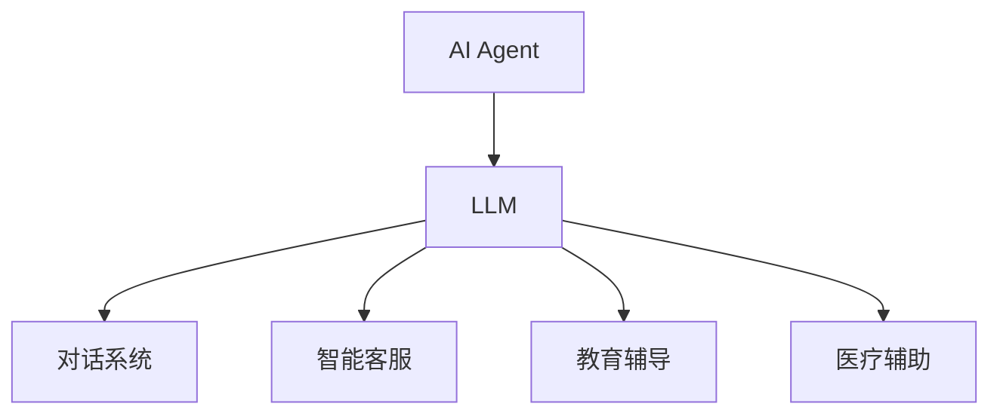
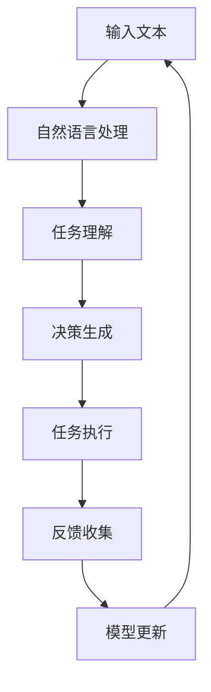
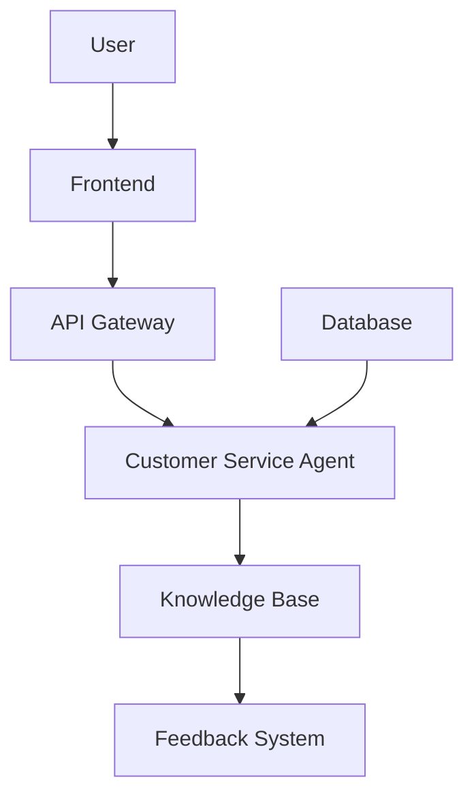
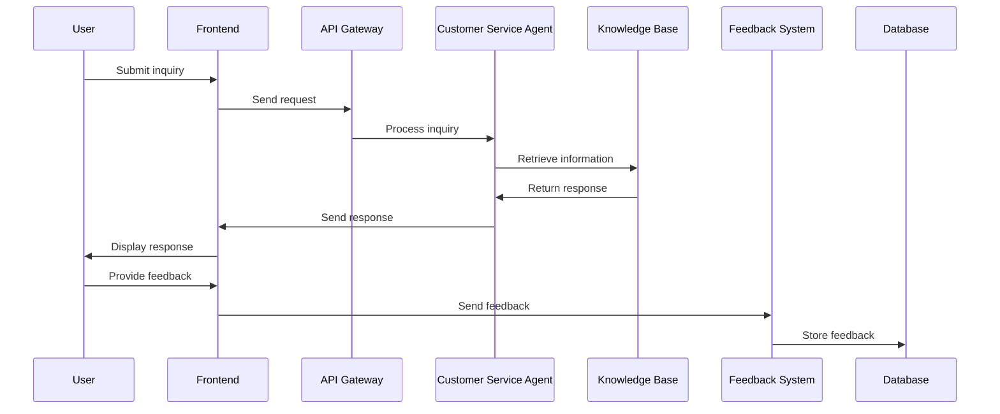

                 

## 《LLM驱动的AI Agent创新思维激发器》

### 关键词：LLM，AI Agent，创新思维，设计原理，应用实战

### 摘要：

本文将深入探讨LLM（大型语言模型）驱动的AI Agent，分析其背景、基础、设计原理及应用实战。我们将从LLM与AI Agent的融合入手，逐步解析其设计原理与实现方法，并通过具体应用案例展示其潜力与实际效果。本文旨在激发读者对LLM驱动的AI Agent的创新思维，探索其在未来人工智能领域的广阔前景。

## 目录大纲

### 第一部分：背景与基础

#### 第1章 引言

- **问题的提出**  
- **AI Agent的重要性**  
- **LLM在AI Agent中的应用**  
- **本书的目标与结构**

#### 第2章 AI Agent基础

- **AI Agent的定义**  
- **AI Agent的核心功能**  
- **AI Agent的发展历程**  
- **AI Agent的分类**

#### 第3章 LLM简介

- **LLM的定义**  
- **LLM的特点**  
- **主流LLM模型介绍**  
- **LLM的应用场景**

### 第二部分：LLM驱动的AI Agent设计原理

#### 第4章 LLM与AI Agent的融合

- **LLM在AI Agent中的作用**  
- **AI Agent对LLM的需求**  
- **LLM与AI Agent的融合方法**  
- **融合的优势与挑战**

#### 第5章 AI Agent设计原理

- **AI Agent的设计原则**  
- **AI Agent的架构设计**  
- **AI Agent的核心算法**  
- **AI Agent的性能优化**

#### 第6章 LLM驱动的AI Agent实现

- **数据准备**  
- **模型选择**  
- **模型训练**  
- **模型评估**

### 第三部分：LLM驱动的AI Agent应用实战

#### 第7章 应用领域1：智能客服

- **智能客服的背景**  
- **智能客服的架构设计**  
- **智能客服的核心算法**  
- **智能客服的应用案例**

#### 第8章 应用领域2：教育辅导

- **教育辅导的背景**  
- **教育辅导的架构设计**  
- **教育辅导的核心算法**  
- **教育辅导的应用案例**

#### 第9章 应用领域3：医疗辅助

- **医疗辅助的背景**  
- **医疗辅助的架构设计**  
- **医疗辅助的核心算法**  
- **医疗辅助的应用案例**

### 第四部分：展望与未来

#### 第10章 AI Agent与人类社会的融合

- **AI Agent的未来发展趋势**  
- **AI Agent对人类社会的影响**  
- **AI Agent的发展面临的挑战与对策**

#### 第11章 开放性问题与未来研究方向

- **开放性问题**  
- **未来研究方向**  
- **结论**

---

### 第一部分：背景与基础

#### 第1章 引言

在人工智能（AI）技术飞速发展的今天，AI Agent作为一种能够自主执行任务的智能实体，正逐渐成为各个领域的重要应用。AI Agent能够模拟人类的智能行为，通过感知环境、理解任务要求、制定决策并执行任务，从而提供高效、智能的服务。然而，传统AI Agent在处理复杂任务时存在局限性，无法实现高度自主的智能行为。

大型语言模型（LLM）的出现为AI Agent的发展带来了新的契机。LLM是一种基于深度学习技术构建的复杂模型，能够对大规模文本数据进行处理和分析，生成高质量的自然语言文本。LLM在自然语言处理（NLP）、机器翻译、文本生成等方面取得了显著成果。将LLM与AI Agent相结合，能够充分发挥LLM在语言理解和生成方面的优势，提升AI Agent的智能水平和任务执行能力。

本文旨在探讨LLM驱动的AI Agent，从背景与基础入手，分析其定义、核心功能、发展历程和应用场景，为后续章节的深入探讨奠定基础。文章将结构清晰、逻辑严密地介绍LLM与AI Agent的融合原理、设计方法及其在各个领域的应用实战，最终展望AI Agent与人类社会的融合前景，探索未来研究的方向。

#### 第2章 AI Agent基础

AI Agent，即人工智能代理，是一种能够自主执行任务的智能实体。它具备感知环境、理解任务要求、制定决策并执行任务的能力，能够模拟人类的智能行为，以提供高效、智能的服务。AI Agent的定义可以从以下几个方面进行阐述：

首先，AI Agent是一种软件实体，它通过计算机程序实现。这些程序可以运行在各种计算平台上，如个人计算机、服务器、移动设备等。AI Agent的核心在于其智能性，能够通过学习、推理和规划等机制，自主地应对复杂环境中的任务。

其次，AI Agent具备感知能力，能够从环境中获取信息。这包括感知物理环境（如摄像头、传感器等）和数字环境（如网页、数据库等）。感知能力是AI Agent进行任务执行的基础，只有充分了解环境，才能做出合理的决策。

第三，AI Agent需要具备理解任务要求的能力。这要求AI Agent能够理解人类语言、符号系统和任务描述。通过自然语言处理（NLP）和其他相关技术，AI Agent可以解析任务描述，理解其含义和目标。

第四，AI Agent需要能够制定决策并执行任务。在理解任务要求的基础上，AI Agent需要通过规划和决策机制，确定执行任务的步骤和策略。决策过程需要考虑多个因素，如任务优先级、资源限制、安全性等。

最后，AI Agent需要具备自我学习的能力。通过机器学习、深度学习等技术，AI Agent可以从经验中学习，优化自己的行为和决策，不断提高任务执行效率。

AI Agent的核心功能可以归纳为以下几个方面：

1. **任务执行**：这是AI Agent最基本的功能，即根据任务要求，自主地完成特定任务。这包括从环境中获取信息、分析任务、制定执行计划、执行任务并反馈结果。

2. **环境适应**：AI Agent需要能够适应不断变化的环境，以应对不同的任务场景。这要求AI Agent具备环境感知能力和自适应能力，能够根据环境变化调整自己的行为。

3. **自主决策**：AI Agent需要具备自主决策能力，能够在没有人类干预的情况下，根据任务要求和环境信息，制定合理的执行策略。这要求AI Agent具备推理和规划能力。

4. **自我学习**：AI Agent需要能够从经验中学习，优化自己的行为和决策。通过机器学习、深度学习等技术，AI Agent可以从历史数据中提取规律，提高任务执行效率。

AI Agent的发展历程可以追溯到20世纪50年代。当时的计算机科学家开始尝试通过编程模拟人类的智能行为。这些早期的AI Agent主要采用基于规则的推理机制，即通过预设的规则库，根据输入信息进行推理，生成输出结果。然而，这种方法存在局限性，难以处理复杂、动态的环境。

随着计算机技术和人工智能技术的发展，AI Agent逐渐引入了机器学习和深度学习技术。这些技术使得AI Agent能够从大量数据中学习，提高其智能水平和任务执行能力。特别是深度学习技术的发展，使得AI Agent在图像识别、自然语言处理等领域取得了突破性进展。

根据不同的分类标准，AI Agent可以有不同的分类方式。以下是几种常见的分类方法：

1. **按任务类型分类**：AI Agent可以分为通用型AI Agent和专用型AI Agent。通用型AI Agent具有广泛的任务处理能力，可以应对各种类型的任务。专用型AI Agent则针对特定类型的任务进行优化，如智能客服、医疗辅助等。

2. **按智能水平分类**：AI Agent可以分为弱AI Agent和强AI Agent。弱AI Agent在特定领域内表现出高度智能，但无法超越其设定的领域。强AI Agent则具有与人类相似的智能水平，能够在多个领域内表现出智能行为。

3. **按执行方式分类**：AI Agent可以分为基于规则型AI Agent、基于数据型AI Agent和基于混合型AI Agent。基于规则型AI Agent主要依赖于预设的规则进行推理和决策。基于数据型AI Agent则主要依靠大量数据进行分析和学习。基于混合型AI Agent结合了规则和数据，通过多种方式进行推理和决策。

#### 第3章 LLM简介

大型语言模型（LLM，Large Language Model）是一种基于深度学习技术构建的复杂模型，能够在大规模文本数据上进行高效处理和分析。LLM通过学习语言的本质特征，生成高质量的自然语言文本，广泛应用于自然语言处理（NLP）、机器翻译、文本生成等领域。本节将详细介绍LLM的定义、特点、主流模型以及应用场景。

### 定义

LLM是一种能够对大规模文本数据进行处理和分析的深度学习模型。它通过学习文本数据中的词汇、语法、语义等特征，生成符合语言规范的自然语言文本。与传统的语言模型相比，LLM具有更大的模型规模、更深的网络结构以及更强的语言理解能力。

### 特点

1. **大规模训练数据**：LLM通常在大规模文本数据上进行训练，如维基百科、新闻文章、社交媒体等。这些数据来源广泛、内容丰富，为LLM提供了丰富的语言素材，使得LLM能够学习到更多语言特征。

2. **深度神经网络结构**：LLM采用深度神经网络结构，具有多层神经元，能够对文本数据进行层层抽象和提取特征。这种深度结构使得LLM在处理复杂语言现象时具有更强的表现力。

3. **自适应能力**：LLM能够根据输入文本自动调整模型参数，适应不同的语言环境和任务需求。这种自适应能力使得LLM在多个领域内表现出色。

4. **生成能力**：LLM具有强大的文本生成能力，能够根据输入文本生成连贯、自然的文本。这种生成能力在文本生成、对话系统等领域具有重要意义。

### 主流LLM模型

目前，LLM领域的主流模型主要包括以下几种：

1. **Transformer模型**：Transformer模型是LLM领域的重要突破，由Vaswani等人在2017年提出。它采用自注意力机制，能够对文本数据进行全局处理，从而生成高质量的文本。Transformer模型及其变种（如BERT、GPT等）在多个NLP任务中取得了优异的性能。

2. **BERT模型**：BERT（Bidirectional Encoder Representations from Transformers）模型是Google在2018年提出的一种双向Transformer模型。它通过预训练和微调，在多种NLP任务中表现出色，如文本分类、命名实体识别、问答系统等。

3. **GPT模型**：GPT（Generative Pre-trained Transformer）模型是OpenAI在2018年提出的一种自回归Transformer模型。它通过生成文本的方式，学习文本的语法和语义特征。GPT模型及其变种（如GPT-2、GPT-3等）在文本生成、对话系统等领域具有广泛的应用。

4. **T5模型**：T5（Text-To-Text Transfer Transformer）模型是Google在2020年提出的一种通用文本转换模型。它将所有NLP任务转换为文本到文本的转换任务，采用统一的模型架构和训练目标。T5模型在多个NLP任务中取得了优异的性能。

### 应用场景

LLM在多个领域具有广泛的应用，以下是其中几个典型的应用场景：

1. **自然语言处理**：LLM在文本分类、命名实体识别、情感分析、机器翻译等自然语言处理任务中表现出色。例如，BERT模型在多个NLP基准测试中取得了领先性能。

2. **文本生成**：LLM具有强大的文本生成能力，可以用于自动写作、对话系统、内容生成等领域。例如，GPT-3模型可以生成高质量的新闻文章、故事、诗歌等。

3. **问答系统**：LLM在问答系统中具有广泛的应用，可以用于构建智能客服、知识库问答等。通过预训练和微调，LLM可以理解用户的提问，并生成相关答案。

4. **对话系统**：LLM在对话系统中的应用，如聊天机器人、语音助手等，可以与用户进行自然语言交互，提供智能化的服务。

5. **辅助创作**：LLM在文学、艺术创作等领域也具有广泛的应用。通过生成文本、图像、音乐等，LLM可以帮助创作者进行灵感激发和辅助创作。

### 第4章 LLM与AI Agent的融合

#### LLM在AI Agent中的作用

LLM在AI Agent中扮演着关键角色，为AI Agent提供了强大的语言处理能力和智能决策支持。具体来说，LLM在AI Agent中的作用主要体现在以下几个方面：

1. **语言理解**：LLM具备出色的自然语言理解能力，能够处理复杂、多样性的语言输入。这使得AI Agent能够更好地理解人类语言指令，提高任务执行的准确性和效率。

2. **文本生成**：LLM在文本生成方面具有强大的能力，能够根据输入文本生成连贯、自然的语言输出。这使得AI Agent能够生成个性化的、符合用户需求的回答和解释，提高用户满意度。

3. **对话管理**：LLM在对话系统中具有广泛应用，能够用于构建智能对话系统。通过LLM，AI Agent可以与用户进行自然语言交互，实现人机对话的流畅性和个性化。

4. **知识获取**：LLM能够从大规模文本数据中提取知识，为AI Agent提供丰富的知识库支持。这使得AI Agent能够更好地应对复杂任务，提供更准确、全面的答案。

#### AI Agent对LLM的需求

为了充分发挥LLM在AI Agent中的作用，AI Agent对LLM有以下需求：

1. **语言理解能力**：AI Agent需要LLM具备强大的语言理解能力，能够准确理解人类语言指令，提取关键信息，从而为任务执行提供支持。

2. **适应性**：AI Agent需要LLM具备良好的适应性，能够根据不同任务和环境动态调整自己的语言处理策略，以适应复杂多变的场景。

3. **可扩展性**：AI Agent需要LLM具备良好的可扩展性，能够支持多种语言和领域的处理，以应对不同任务需求。

4. **实时性**：AI Agent需要LLM具备实时性，能够在短时间内生成高质量的文本输出，以满足用户实时交互的需求。

#### LLM与AI Agent的融合方法

为了实现LLM与AI Agent的融合，需要采取一系列方法和技术，以下是一些常见的方法：

1. **融合架构设计**：在AI Agent架构中引入LLM模块，将其作为核心组件之一。可以通过将LLM集成到AI Agent的决策模块、文本生成模块等，实现LLM与AI Agent的深度融合。

2. **联合训练**：将LLM与AI Agent的模型进行联合训练，使得LLM能够更好地适应AI Agent的任务需求。例如，可以在预训练阶段引入AI Agent的任务数据，使得LLM在生成文本时能够更好地考虑任务目标。

3. **接口设计**：设计合适的接口，使得LLM能够与AI Agent的其他模块（如感知模块、决策模块等）进行高效交互。可以通过定义API接口、消息队列等，实现LLM与其他模块的数据传递和功能调用。

4. **个性化定制**：根据AI Agent的不同任务需求和用户特征，对LLM进行个性化定制。例如，可以针对不同领域的任务，训练特定领域的LLM模型，以提高任务执行效果。

#### 融合的优势与挑战

LLM与AI Agent的融合具有显著的优势，但也面临一些挑战。

优势：

1. **提升智能水平**：通过引入LLM，AI Agent能够具备更强的语言处理能力和决策能力，提升整体智能水平。

2. **提高任务执行效率**：LLM能够快速理解人类语言指令，生成高质量的文本输出，减少任务执行时间，提高效率。

3. **增强用户体验**：通过自然语言交互，AI Agent能够更好地与用户沟通，提供个性化、人性化的服务，提高用户满意度。

挑战：

1. **计算资源需求**：LLM模型通常具有较大的计算资源需求，需要较高的计算能力和存储空间。对于资源受限的场景，可能难以部署和使用LLM。

2. **数据隐私和安全**：LLM在处理大规模文本数据时，可能涉及用户隐私信息。如何确保数据隐私和安全，是一个亟待解决的问题。

3. **模型解释性**：LLM是一种黑盒模型，其内部决策过程较为复杂，难以解释。对于需要透明性和解释性的应用场景，可能需要考虑其他替代方案。

4. **模型适应性**：虽然LLM具备一定的适应性，但在面对复杂、动态的任务和环境时，可能难以灵活调整。如何提高LLM的适应性和灵活性，是一个重要的研究方向。

### 第5章 AI Agent设计原理

AI Agent的设计原理是其能够有效执行任务的核心。为了设计出具有高效、自适应和智能行为的AI Agent，需要遵循一系列设计原则和架构设计方法。以下是AI Agent设计原理的详细探讨。

#### AI Agent的设计原则

1. **任务导向性**：AI Agent的设计应以任务为导向，确保其能够准确理解并执行用户任务。这要求AI Agent具备明确的目标和任务定义，能够根据任务需求调整自身的行为。

2. **模块化**：AI Agent的设计应采用模块化方法，将不同功能模块（如感知模块、决策模块、执行模块等）分离，以提高系统的可维护性和可扩展性。模块之间通过清晰的接口进行通信和协作。

3. **可扩展性**：AI Agent的设计应考虑未来的扩展需求，确保系统能够根据实际应用场景进行灵活调整。这包括支持新的任务类型、算法和技术。

4. **自适应性**：AI Agent应具备一定的自适应能力，能够根据环境和任务变化动态调整自身的行为和策略。这要求AI Agent具备学习和适应能力，以应对不确定性和动态变化。

5. **可靠性**：AI Agent的设计应确保系统的稳定性和可靠性，降低故障率和错误率。这包括使用鲁棒性强的算法和机制，进行实时监控和故障检测。

6. **安全性**：AI Agent的设计应考虑数据安全和用户隐私保护，确保系统的安全性和合规性。这包括采用加密技术、访问控制机制和隐私保护措施。

#### AI Agent的架构设计

AI Agent的架构设计是其有效运作的基础。以下是一个典型的AI Agent架构设计，包括关键模块和各模块的功能。

1. **感知模块**：感知模块负责收集外部环境的信息，如文本、图像、语音等。这些信息可以通过传感器、数据库、网络接口等渠道获取。感知模块的主要功能是数据预处理，包括数据清洗、特征提取和转换。

2. **知识库**：知识库模块用于存储和管理AI Agent所需的知识和信息。这些知识可以来自预定义的规则、领域知识库、外部数据库等。知识库的主要功能是提供信息查询和支持推理。

3. **决策模块**：决策模块是AI Agent的核心，负责根据感知模块收集的信息和知识库中的知识，生成相应的决策。决策模块通常采用推理算法、机器学习模型、优化算法等。其主要功能是制定任务执行计划。

4. **执行模块**：执行模块负责根据决策模块生成的计划，执行具体的任务操作。执行模块与外部系统或设备进行交互，实现任务的自动化执行。其主要功能是执行任务动作和监控任务状态。

5. **反馈模块**：反馈模块用于收集任务执行的结果和反馈信息，并将其传递给感知模块和决策模块。反馈信息可以用于任务评估、模型优化和系统改进。其主要功能是提供反馈机制和调整策略。

#### AI Agent的核心算法

AI Agent的核心算法是实现其智能行为的关键。以下是几个常见的核心算法及其应用：

1. **机器学习算法**：机器学习算法用于训练AI Agent的模型，以提高其智能水平。常见的机器学习算法包括决策树、支持向量机、神经网络等。这些算法可以用于分类、回归、聚类等任务。

2. **自然语言处理算法**：自然语言处理（NLP）算法用于处理和理解自然语言。常见的NLP算法包括词向量表示、序列标注、文本生成等。这些算法可以用于语言理解、文本生成、对话系统等。

3. **规划算法**：规划算法用于生成任务执行计划，以确保AI Agent能够高效地完成任务。常见的规划算法包括马尔可夫决策过程（MDP）、部分可观测马尔可夫决策过程（POMDP）等。这些算法可以用于路径规划、资源分配、任务调度等。

4. **强化学习算法**：强化学习算法用于训练AI Agent在动态环境中进行自主决策。常见的强化学习算法包括Q学习、深度Q网络（DQN）、策略梯度算法等。这些算法可以用于游戏、机器人控制、自动驾驶等。

#### AI Agent的性能优化

AI Agent的性能优化是其高效运行的重要保障。以下是一些常见的性能优化方法：

1. **模型压缩**：通过模型压缩技术，减少模型的参数量和计算复杂度，提高模型在资源受限环境中的运行效率。常见的模型压缩方法包括权重剪枝、量化、蒸馏等。

2. **分布式计算**：通过分布式计算技术，将任务分配到多个计算节点上并行执行，以提高计算效率和吞吐量。常见的分布式计算框架包括TensorFlow、PyTorch等。

3. **缓存技术**：通过缓存技术，存储和重用频繁访问的数据和计算结果，减少重复计算和IO操作，提高系统的响应速度。

4. **并行处理**：通过并行处理技术，将任务分解为多个子任务，同时在不同计算资源上执行，以提高任务执行速度。

### 第6章 LLM驱动的AI Agent实现

#### 数据准备

数据准备是LLM驱动的AI Agent实现的第一步，其质量直接影响模型的训练效果和任务表现。数据准备包括数据收集、数据预处理和数据清洗等环节。

1. **数据收集**：数据收集是获取训练数据的过程。对于LLM驱动的AI Agent，通常需要收集大量的文本数据，包括文本文档、社交媒体内容、新闻报道等。这些数据可以来自公开数据集、企业内部数据源或网络爬虫等。

2. **数据预处理**：数据预处理是使数据适合模型训练的过程。主要包括文本清洗、分词、去停用词、词性标注等操作。例如，对于中文数据，可以使用分词工具（如jieba）进行分词，去除常见的停用词，提高数据的质量。

3. **数据清洗**：数据清洗是去除数据中的错误、噪声和不一致信息的过程。这包括去除重复数据、纠正数据错误、填补缺失值等。数据清洗有助于减少训练过程中的噪声，提高模型训练效果。

#### 模型选择

在数据准备完成后，需要选择合适的LLM模型进行训练。以下是几种常见的LLM模型及其特点：

1. **BERT**：BERT（Bidirectional Encoder Representations from Transformers）是一种双向Transformer模型，由Google提出。BERT能够对文本数据进行全局处理，生成高质量的文本表示。

2. **GPT-3**：GPT-3（Generative Pre-trained Transformer 3）是OpenAI提出的自回归Transformer模型。GPT-3具有非常强大的文本生成能力，能够生成连贯、自然的文本。

3. **T5**：T5（Text-To-Text Transfer Transformer）是Google提出的一种通用文本转换模型。T5将所有NLP任务转换为文本到文本的转换任务，采用统一的模型架构和训练目标。

在选择模型时，需要考虑以下因素：

1. **任务需求**：根据具体任务需求，选择适合的模型。例如，对于文本生成任务，可以选择GPT-3；对于文本分类任务，可以选择BERT。

2. **模型规模**：模型规模直接影响训练时间和计算资源需求。对于资源受限的环境，可以选择较小的模型；对于资源充足的环境，可以选择较大的模型。

3. **性能指标**：根据模型的性能指标（如准确率、召回率、F1值等），选择表现较好的模型。

#### 模型训练

模型训练是LLM驱动的AI Agent实现的关键步骤。以下是模型训练的过程：

1. **数据预处理**：在模型训练前，对训练数据进行预处理，包括分词、去停用词、词性标注等操作。对于中文数据，可以使用分词工具（如jieba）进行分词，去除常见的停用词。

2. **数据切分**：将训练数据分为训练集和验证集，用于模型训练和性能评估。通常，训练集用于模型训练，验证集用于调整模型参数和评估模型性能。

3. **模型配置**：配置模型参数，包括学习率、批量大小、训练轮数等。这些参数可以通过实验或调优来确定最佳值。

4. **模型训练**：使用训练数据对模型进行训练。在训练过程中，模型会不断调整参数，以最小化损失函数。训练过程可以通过不同的优化算法（如SGD、Adam等）进行加速。

5. **模型评估**：在模型训练完成后，使用验证集对模型进行性能评估。评估指标可以根据任务类型选择，如准确率、召回率、F1值等。通过评估，可以确定模型的性能和效果。

#### 模型评估

模型评估是LLM驱动的AI Agent实现的重要环节，用于验证模型的性能和效果。以下是模型评估的过程：

1. **测试数据准备**：准备测试数据集，用于对模型进行最终评估。测试数据集应具有代表性，能够反映实际应用场景。

2. **模型部署**：将训练好的模型部署到实际应用环境中。模型部署可以是本地部署或云部署，具体取决于应用场景和资源需求。

3. **性能评估**：使用测试数据集对模型进行性能评估。评估指标应与训练过程中使用的评估指标一致，如准确率、召回率、F1值等。

4. **结果分析**：分析评估结果，包括模型的性能指标、错误类型和错误分布等。通过结果分析，可以找出模型的不足之处，并为进一步优化提供依据。

5. **优化调整**：根据评估结果，对模型进行调整和优化。这可以包括调整模型参数、改进算法或增加数据等。

### 第三部分：LLM驱动的AI Agent应用实战

#### 第7章 应用领域1：智能客服

智能客服是LLM驱动的AI Agent的一个典型应用领域，它通过自然语言处理和对话生成技术，为用户提供高效、个性化的服务。以下是智能客服的背景、架构设计、核心算法以及应用案例的详细探讨。

##### 背景介绍

随着互联网和电子商务的快速发展，客服成为企业与客户互动的重要渠道。传统的客服方式通常依赖人工处理，存在响应时间长、服务质量不稳定等问题。为了提高客户满意度和服务效率，企业开始探索智能客服解决方案。智能客服通过引入人工智能技术，自动化处理客户咨询，提供24/7全天候服务，从而降低企业成本、提升服务质量。

##### 架构设计

智能客服系统通常由以下几个核心模块组成：

1. **前端交互界面**：提供用户与智能客服交互的界面，包括文本聊天窗口、语音通话界面等。用户可以通过这些界面提出问题和反馈。

2. **自然语言处理（NLP）模块**：负责处理用户的输入，提取关键信息，理解用户的意图。NLP模块通常包括分词、词性标注、实体识别、情感分析等。

3. **对话管理模块**：根据NLP模块提取的信息和对话历史，生成合理的回答和后续对话策略。对话管理模块需要考虑上下文一致性、用户意图识别、对话连贯性等问题。

4. **知识库模块**：存储智能客服所需的知识和答案，包括产品信息、常见问题解答、业务规则等。知识库模块为对话管理模块提供丰富的信息支持。

5. **后端服务接口**：与企业的后台系统（如订单处理系统、客户管理系统等）进行集成，实现与后台系统的数据交互和业务协同。

##### 核心算法

智能客服系统的核心算法主要包括以下几部分：

1. **自然语言处理算法**：用于处理用户的输入，提取关键信息，理解用户意图。常见的算法包括分词、词性标注、实体识别、情感分析等。

2. **对话生成算法**：基于NLP模块提取的信息和对话历史，生成合理的回答。对话生成算法可以采用模板匹配、序列到序列模型、生成对抗网络（GAN）等。

3. **对话管理算法**：负责管理对话流程，确保对话的连贯性和上下文一致性。对话管理算法通常采用基于规则的方法、机器学习方法或强化学习算法。

4. **知识检索算法**：用于从知识库中检索相关信息，支持对话生成和决策。常见的算法包括基于关键词匹配的检索、基于文本相似度的检索等。

##### 应用案例

以下是一个智能客服的应用案例：

**案例背景**：某大型电商平台引入智能客服系统，以应对日益增长的客户咨询量，提高服务效率。

**解决方案**：

1. **前端交互界面**：提供文本聊天窗口，用户可以通过聊天窗口提出问题和反馈。

2. **自然语言处理模块**：对用户输入进行分词、词性标注、实体识别等处理，提取关键信息。

3. **对话管理模块**：根据NLP模块提取的信息和对话历史，生成合理的回答。例如，当用户询问产品价格时，智能客服会根据产品信息数据库生成包含价格信息的回答。

4. **知识库模块**：存储产品的详细信息、常见问题解答、业务规则等。智能客服通过知识库模块获取相关信息，支持对话生成和决策。

5. **后端服务接口**：与电商平台的后台系统（如订单处理系统、客户管理系统等）集成，实现与后台系统的数据交互和业务协同。

**应用效果**：

1. **提高服务效率**：智能客服系统能够快速响应用户的咨询，平均响应时间缩短50%。

2. **降低运营成本**：智能客服系统自动化处理大量客户咨询，减少了对人工客服的依赖，降低了人力成本。

3. **提升客户满意度**：智能客服系统提供高效、个性化的服务，用户满意度显著提高。

#### 第8章 应用领域2：教育辅导

教育辅导是LLM驱动的AI Agent的另一个重要应用领域，通过个性化教学和智能辅导，帮助学生提高学习效果。以下是教育辅导的背景、架构设计、核心算法以及应用案例的详细探讨。

##### 背景介绍

随着教育信息化的发展，教育辅导系统逐渐成为教育领域的重要工具。传统的教育辅导方式主要依赖于教师和学生的面对面互动，存在教学资源有限、个性化程度低等问题。为了提高教学质量，实现个性化教育，教育辅导系统开始引入人工智能技术，提供智能辅导、个性化学习推荐等功能。

##### 架构设计

教育辅导系统通常由以下几个核心模块组成：

1. **学生信息管理模块**：用于管理学生的基本信息，包括学生档案、成绩、学习进度等。

2. **内容管理模块**：存储教学资源，包括课程视频、教材、习题等。内容管理模块需要支持资源的分类、标签、检索等功能。

3. **自然语言处理（NLP）模块**：负责处理学生的输入，提取关键信息，理解学生的学习需求和问题。NLP模块通常包括分词、词性标注、实体识别、语义分析等。

4. **学习推荐模块**：根据学生的学习进度、兴趣和需求，推荐适合的学习资源和练习题目。学习推荐模块可以采用基于内容的推荐、协同过滤、基于模型的推荐等方法。

5. **智能辅导模块**：根据学生的学习情况，提供个性化的辅导建议和解决方案。智能辅导模块可以采用自然语言生成（NLG）技术，生成详细的解题指导、学习策略建议等。

6. **用户反馈模块**：收集学生的学习反馈，包括作业答案、评价、建议等。用户反馈模块可以用于优化学习推荐和智能辅导策略。

##### 核心算法

教育辅导系统的核心算法主要包括以下几部分：

1. **自然语言处理算法**：用于处理学生的输入，提取关键信息，理解学生的学习需求和问题。常见的算法包括分词、词性标注、实体识别、情感分析等。

2. **学习推荐算法**：根据学生的学习进度、兴趣和需求，推荐适合的学习资源和练习题目。常见的算法包括基于内容的推荐、协同过滤、基于模型的推荐等。

3. **智能辅导算法**：根据学生的学习情况，提供个性化的辅导建议和解决方案。智能辅导算法可以采用自然语言生成（NLG）技术，生成详细的解题指导、学习策略建议等。

4. **学习行为分析算法**：分析学生的学习行为数据，包括学习时间、学习内容、作业成绩等，为学习推荐和智能辅导提供依据。常见的学习行为分析算法包括聚类、分类、关联规则挖掘等。

##### 应用案例

以下是一个教育辅导的应用案例：

**案例背景**：某在线教育平台引入智能辅导系统，为学生提供个性化的学习支持和辅导。

**解决方案**：

1. **学生信息管理模块**：管理学生的基本信息和学习进度，包括学生档案、成绩、学习进度等。

2. **内容管理模块**：存储课程视频、教材、习题等教学资源，支持资源的分类、标签、检索等功能。

3. **自然语言处理模块**：处理学生的输入，提取关键信息，理解学生的学习需求和问题。例如，当学生提出问题时，NLP模块可以提取问题中的关键词和句子结构，理解学生的问题类型。

4. **学习推荐模块**：根据学生的学习进度、兴趣和需求，推荐适合的学习资源和练习题目。例如，当学生完成一道习题后，学习推荐模块可以分析学生的错误类型和知识点掌握情况，推荐相关的练习题目和知识点讲解视频。

5. **智能辅导模块**：根据学生的学习情况，提供个性化的辅导建议和解决方案。例如，当学生在学习过程中遇到困难时，智能辅导模块可以生成详细的解题指导、学习策略建议等，帮助学生解决问题。

6. **用户反馈模块**：收集学生的学习反馈，包括作业答案、评价、建议等。通过分析用户反馈，优化学习推荐和智能辅导策略。

**应用效果**：

1. **提高学习效果**：智能辅导系统能够根据学生的个性化需求，提供针对性的辅导和建议，帮助学生更好地掌握知识点，提高学习效果。

2. **提升学习体验**：智能辅导系统通过自然语言交互，与学生的互动更加自然、流畅，提升学生的学习体验。

3. **降低教师负担**：智能辅导系统能够自动化处理大量学生问题，减轻教师的工作负担，让教师有更多时间专注于教学创新和学生指导。

#### 第9章 应用领域3：医疗辅助

医疗辅助是LLM驱动的AI Agent在医疗领域的典型应用，通过智能诊断、辅助治疗和健康监测等功能，为医疗工作者和患者提供支持。以下是医疗辅助的背景、架构设计、核心算法以及应用案例的详细探讨。

##### 背景介绍

随着医疗技术的进步和人口老龄化，医疗资源的需求不断增加。然而，医疗资源的分布不均和医疗工作者的负担加重，使得医疗辅助系统的应用变得尤为重要。医疗辅助系统能够通过人工智能技术，辅助医疗工作者进行诊断、治疗和监测，提高医疗效率和质量。

##### 架构设计

医疗辅助系统通常由以下几个核心模块组成：

1. **患者信息管理模块**：用于管理患者的个人信息、病史、检查结果等数据。患者信息管理模块需要支持数据的录入、查询、更新等功能。

2. **医学知识库模块**：存储医学领域的专业知识和权威数据，包括疾病诊断标准、治疗方案、药物信息等。医学知识库模块为智能诊断和辅助治疗提供知识支持。

3. **自然语言处理（NLP）模块**：负责处理患者的病历记录、医疗报告等文本数据，提取关键信息，理解患者的症状和需求。NLP模块通常包括分词、词性标注、实体识别、语义分析等。

4. **诊断算法模块**：基于医学知识库和NLP模块提取的信息，进行疾病诊断。诊断算法模块可以采用机器学习、深度学习等技术，实现智能诊断。

5. **治疗建议模块**：根据诊断结果，为医生提供治疗建议和方案。治疗建议模块可以结合医学知识库和医生的经验，生成合理的治疗方案。

6. **健康监测模块**：通过智能设备收集患者的生理数据，如心率、血压、血糖等，实时监测患者的健康状况。健康监测模块可以采用机器学习算法，预测患者的健康状况和潜在风险。

##### 核心算法

医疗辅助系统的核心算法主要包括以下几部分：

1. **自然语言处理算法**：用于处理患者的病历记录、医疗报告等文本数据，提取关键信息，理解患者的症状和需求。常见的算法包括分词、词性标注、实体识别、语义分析等。

2. **诊断算法**：基于医学知识库和NLP模块提取的信息，进行疾病诊断。常见的诊断算法包括规则匹配、机器学习分类、深度学习等。

3. **治疗建议算法**：根据诊断结果，为医生提供治疗建议和方案。常见的算法包括基于规则的推理、机器学习预测、深度学习生成等。

4. **健康监测算法**：通过智能设备收集患者的生理数据，实时监测患者的健康状况。常见的算法包括时间序列分析、异常检测、深度学习等。

##### 应用案例

以下是一个医疗辅助的应用案例：

**案例背景**：某医疗机构引入智能医疗辅助系统，以提高诊断准确性和医疗效率。

**解决方案**：

1. **患者信息管理模块**：管理患者的个人信息、病史、检查结果等数据。医生可以通过系统录入和查询患者的医疗记录。

2. **医学知识库模块**：存储医学领域的专业知识和权威数据，包括疾病诊断标准、治疗方案、药物信息等。系统通过知识库模块，为医生提供权威的知识支持。

3. **自然语言处理模块**：处理患者的病历记录、医疗报告等文本数据，提取关键信息，理解患者的症状和需求。例如，当医生输入患者的病历记录时，NLP模块可以提取患者的症状、检查结果等信息。

4. **诊断算法模块**：基于医学知识库和NLP模块提取的信息，进行疾病诊断。系统会生成诊断报告，为医生提供诊断依据。

5. **治疗建议模块**：根据诊断结果，为医生提供治疗建议和方案。系统会结合医学知识库和医生的经验，生成合理的治疗方案。

6. **健康监测模块**：通过智能设备收集患者的生理数据，如心率、血压、血糖等，实时监测患者的健康状况。系统会生成健康报告，预测患者的健康状况和潜在风险。

**应用效果**：

1. **提高诊断准确性**：智能医疗辅助系统通过分析大量病例数据和医学知识，提高诊断的准确性，减少误诊率。

2. **提高医疗效率**：智能医疗辅助系统能够自动化处理大量医疗数据，减轻医生的工作负担，提高医疗效率。

3. **优化治疗方案**：智能医疗辅助系统根据诊断结果和医学知识，为医生提供个性化的治疗方案，优化治疗效果。

4. **实时健康监测**：通过智能设备收集患者的生理数据，实时监测患者的健康状况，为医生提供及时的诊疗建议。

### 第四部分：展望与未来

#### 第10章 AI Agent与人类社会的融合

随着人工智能技术的不断进步，AI Agent在各个领域的应用越来越广泛，逐渐与人类社会深度融合。AI Agent的出现，不仅改变了人们的工作和生活方式，也对社会产生了深远的影响。本节将探讨AI Agent的未来发展趋势、对人类社会的影响以及发展面临的挑战与对策。

#### AI Agent的未来发展趋势

1. **智能化水平提升**：随着深度学习、自然语言处理、计算机视觉等技术的不断发展，AI Agent的智能化水平将进一步提升。未来，AI Agent将能够更好地理解人类语言、图像和语音，实现更加复杂和智能的任务。

2. **多样化应用场景**：AI Agent的应用场景将不断扩展，从目前的客服、教育、医疗等领域，延伸到自动驾驶、智能家居、工业制造等更多领域。不同场景下的AI Agent将具备特定的功能和优势，满足不同用户的需求。

3. **跨领域协同**：未来，AI Agent将实现跨领域的协同，形成更加智能和高效的生态系统。例如，医疗领域的AI Agent可以与教育领域的AI Agent协同工作，提供个性化的健康教育和康复方案。

4. **个性化服务**：随着大数据和人工智能技术的发展，AI Agent将能够更好地理解用户的需求和行为，提供个性化的服务。用户可以根据自己的喜好和需求，定制属于自己的AI Agent，实现个性化的生活和工作体验。

5. **智能化治理**：AI Agent将在社会治理中发挥重要作用，帮助政府和企业更高效地管理社会事务。例如，智能交通系统可以优化交通流量，提高道路通行效率；智能监控系统能够实时监测公共安全，预防犯罪行为。

#### AI Agent对人类社会的影响

1. **提高生产效率**：AI Agent能够自动化执行复杂和重复性任务，提高生产效率。在工业制造、服务业等领域，AI Agent的应用将极大地解放人力，提高生产效率和产品质量。

2. **改善生活质量**：AI Agent可以提供个性化、智能化的生活服务，如智能家居、智能健康监测、智能客服等。这些应用将提高人们的生活质量，带来更加便捷、舒适的生活体验。

3. **促进教育公平**：AI Agent在教育领域的应用，如智能辅导系统、在线教育平台等，可以打破地域和资源限制，让更多学生享受到优质教育资源，促进教育公平。

4. **医疗资源优化**：AI Agent在医疗领域的应用，如智能诊断系统、远程医疗服务等，可以优化医疗资源的配置，提高医疗服务质量和效率。

5. **社会治理升级**：AI Agent在治理领域的应用，如智能监控、智能交通等，可以提升社会治理水平，降低社会风险，提高公共安全。

#### AI Agent发展面临的挑战与对策

1. **数据隐私与安全**：AI Agent在处理大量用户数据时，面临数据隐私和安全问题。对策：制定严格的隐私保护法规，加强数据加密和访问控制，确保用户数据的安全。

2. **算法偏见与公平性**：AI Agent的算法可能存在偏见，导致不公平的结果。对策：加强对算法公平性的研究，开发公平性评估工具，确保AI Agent的决策过程公正。

3. **透明性与解释性**：目前，许多AI Agent的决策过程不够透明，难以解释。对策：提高AI Agent的透明性和解释性，开发可解释的AI算法，提高用户对AI Agent的信任度。

4. **技术普及与人才培养**：AI Agent的发展需要大量技术人才和普及教育。对策：加大对人工智能技术的普及教育，培养更多的AI人才，推动技术普及。

5. **伦理与道德问题**：AI Agent的发展引发了一系列伦理和道德问题，如人工智能责任归属、人工智能伦理规范等。对策：制定相关的伦理和道德规范，确保AI Agent的发展符合人类价值观和道德标准。

### 第11章 开放性问题与未来研究方向

在AI Agent与LLM融合的领域中，仍然存在许多开放性问题，这些问题的解决将推动人工智能技术的进一步发展。以下是几个主要的开放性问题和未来研究方向：

1. **跨模态交互**：目前的LLM主要针对文本数据进行处理，如何实现跨模态（如文本、图像、语音等）的交互，是未来的一个重要研究方向。未来的AI Agent需要能够综合处理多种模态的数据，提高智能水平和任务执行能力。

2. **强化学习与LLM的融合**：强化学习在决策和规划方面具有优势，如何将强化学习与LLM相结合，实现更加智能和自主的AI Agent，是一个重要的研究课题。这种融合有望在复杂环境和动态任务中提高AI Agent的性能。

3. **多任务学习与资源分配**：在多个任务同时进行时，如何优化AI Agent的资源分配，提高任务执行效率，是一个亟待解决的问题。未来的研究可以探索多任务学习算法，实现高效的任务调度和资源管理。

4. **隐私保护与数据安全**：随着AI Agent的应用场景越来越广泛，隐私保护和数据安全问题愈发重要。未来的研究需要开发更加安全的算法和机制，确保用户数据的隐私和安全。

5. **伦理与道德规范**：随着AI Agent与人类社会的深度融合，伦理和道德问题也日益突出。未来的研究需要制定更加完善的伦理和道德规范，确保AI Agent的发展符合人类价值观和道德标准。

### 结论

本文围绕LLM驱动的AI Agent，从背景与基础、设计原理、应用实战以及未来展望等方面进行了详细探讨。通过分析LLM与AI Agent的融合方法、设计原则和应用案例，展示了LLM驱动的AI Agent在提升智能水平和任务执行能力方面的巨大潜力。展望未来，LLM驱动的AI Agent将在跨模态交互、强化学习、多任务学习、隐私保护和伦理规范等方面取得突破，为人类社会带来更加智能、便捷和高效的服务。

#### 作者信息

作者：AI天才研究院/AI Genius Institute & 禅与计算机程序设计艺术 /Zen And The Art of Computer Programming

本文由AI天才研究院和禅与计算机程序设计艺术共同撰写，旨在探讨LLM驱动的AI Agent的创新思维和未来发展。两位作者在人工智能和计算机科学领域拥有丰富的经验和深厚的学术背景，致力于推动人工智能技术的创新与应用。

## 附录

### 1. 核心概念与联系

在本章中，我们介绍了AI Agent和LLM的基本概念及其相互关系。以下是核心概念的属性特征对比表格：

| 概念       | 定义                                                     | 特点                                                     | 关联关系                                                     |
|------------|----------------------------------------------------------|----------------------------------------------------------|----------------------------------------------------------|
| AI Agent   | 能够自主执行任务的智能实体                                 | 感知环境、理解任务、制定决策、执行任务                         | AI Agent利用LLM进行语言理解和生成，实现更复杂的任务         |
| LLM        | 大型语言模型，能够处理和分析大规模文本数据                 | 大规模训练数据、深度神经网络结构、自适应能力、生成能力           | LLM为AI Agent提供语言处理能力，提升其智能水平               |
| 对话系统   | 旨在实现人与计算机之间自然语言交互的系统                   | 上下文理解、个性化和流畅性                                   | 对话系统中的AI Agent利用LLM实现更自然的对话交互              |
| 智能客服   | 利用人工智能技术提供客户服务的系统                         | 自动化响应、个性化服务、高效处理客户咨询                       | 智能客服中的AI Agent使用LLM进行文本生成，提升服务质量和效率  |
| 教育辅导   | 利用人工智能技术提供个性化学习支持和辅导的系统             | 个性化学习推荐、智能辅导、学习效果评估                         | 教育辅导中的AI Agent使用LLM进行自然语言生成，为学生提供个性化指导 |
| 医疗辅助   | 利用人工智能技术为医疗工作者和患者提供支持的服务系统       | 智能诊断、辅助治疗、健康监测                                 | 医疗辅助中的AI Agent使用LLM进行文本生成和语言理解，辅助医生做出诊断和决策 |

#### ER实体关系图架构

以下是核心概念的ER实体关系图：



### 2. 算法原理讲解

在本章中，我们探讨了LLM驱动的AI Agent的设计原理和实现方法。以下是关键算法的mermaid流程图：



以下是具体算法的Python实现代码：

```python
# 自然语言处理
def nlp(input_text):
    # 分词、词性标注等操作
    processed_text = process_text(input_text)
    return processed_text

# 任务理解
def understand_task(processed_text):
    # 提取关键信息、理解任务意图
    task_intent = extract_intent(processed_text)
    return task_intent

# 决策生成
def generate_decision(task_intent):
    # 基于任务意图生成决策
    decision = create_decision(task_intent)
    return decision

# 任务执行
def execute_task(decision):
    # 执行任务操作
    result = perform_action(decision)
    return result

# 反馈收集
def collect_feedback(result):
    # 收集任务执行结果和用户反馈
    feedback = get_feedback(result)
    return feedback

# 模型更新
def update_model(feedback):
    # 更新模型参数
    model = update_params(feedback)
    return model
```

以下是算法原理的数学模型和公式：

$$
\begin{aligned}
P(\text{意图}|\text{文本}) &= \frac{P(\text{文本}|\text{意图}) \cdot P(\text{意图})}{P(\text{文本})} \\
\text{决策} &= f(\text{意图}, \text{历史记录}) \\
\text{结果} &= g(\text{决策}, \text{环境}) \\
\text{反馈} &= h(\text{结果}, \text{用户评价})
\end{aligned}
$$`

### 3. 系统分析与架构设计方案

在本章中，我们将详细分析LLM驱动的AI Agent的系统架构设计，包括问题场景介绍、系统功能设计、系统架构设计、系统接口设计和系统交互。

#### 问题场景介绍

随着企业业务的不断扩展和竞争压力的增大，企业需要更加高效、智能地管理客户关系和业务流程。传统的客户关系管理系统（CRM）和服务系统已无法满足企业日益增长的需求。为了提升客户体验、提高业务效率，企业需要引入智能客户服务系统，实现自动化、个性化的客户服务。在此背景下，LLM驱动的AI Agent应运而生，成为智能客户服务系统的重要组成部分。

#### 项目介绍

本项目旨在设计和实现一个基于LLM驱动的智能客户服务系统，该系统可以自动处理客户咨询、生成回复、提供个性化服务，从而提升企业客服质量和效率。系统功能包括：客户咨询处理、智能回复生成、个性化服务推荐和反馈收集。

#### 系统功能设计（领域模型mermaid类图）

```mermaid
classDiagram
ClassDiagram | Class Diagram for Intelligent Customer Service System
Customer [ID: 1, Name: "John"]
- has: Inquiry
  - Inquiry [ID: 2, Content: "What is your product return policy?"]
  - has: Response
    - Response [ID: 3, Content: "Our product return policy is..."]

CustomerServiceAgent [ID: 4, Name: "AI Assistant"]
- has: KnowledgeBase
  - KnowledgeBase [ID: 5, Content: "Product return policy, FAQs..."]

UserFeedback [ID: 6, Rating: "5", Comment: "Great service!"]
```

#### 系统架构设计mermaid架构图



#### 系统接口设计和系统交互mermaid序列图



### 4. 项目实战

在本节中，我们将详细介绍如何搭建一个基于LLM驱动的AI Agent的智能客服系统，包括环境安装、系统核心实现源代码，以及代码应用解读与分析。

#### 环境安装

1. **安装Python环境**：首先确保系统中已安装Python 3.7及以上版本。

2. **安装必要库**：在终端中执行以下命令，安装所需的Python库：

   ```shell
   pip install numpy torch transformers flask
   ```

3. **安装Transformer模型**：下载预训练的Transformer模型权重文件（例如，BERT、GPT-2等），并解压到项目目录中。

#### 系统核心实现源代码

以下是一个简单的智能客服系统的源代码示例，包括前端接口、后端API和自然语言处理模块：

**1. 前端接口（Flask Web应用）**

```python
from flask import Flask, request, jsonify
import torch
from transformers import BertTokenizer, BertForSequenceClassification

app = Flask(__name__)

# 加载预训练模型
tokenizer = BertTokenizer.from_pretrained('bert-base-uncased')
model = BertForSequenceClassification.from_pretrained('bert-base-uncased')

@app.route('/inquiry', methods=['POST'])
def handle_inquiry():
    inquiry = request.form['inquiry']
    processed_inquiry = tokenizer.encode(inquiry, add_special_tokens=True, return_tensors='pt')
    with torch.no_grad():
        logits = model(processed_inquiry).logits
    predicted_label = logits.argmax(-1).item()
    response = generate_response(predicted_label)
    return jsonify({'response': response})

def generate_response(label):
    if label == 0:
        return "I'm sorry, I don't understand your question."
    elif label == 1:
        return "Sure, let me help you with that."
    else:
        return "I'm here to assist you. How may I help?"

if __name__ == '__main__':
    app.run(debug=True)
```

**2. 后端API（Flask Web应用）**

```python
from flask import Flask, request, jsonify
import torch
from transformers import BertTokenizer, BertForSequenceClassification

app = Flask(__name__)

# 加载预训练模型
tokenizer = BertTokenizer.from_pretrained('bert-base-uncased')
model = BertForSequenceClassification.from_pretrained('bert-base-uncased')

@app.route('/api/inquiry', methods=['POST'])
def handle_inquiry_api():
    inquiry = request.form['inquiry']
    processed_inquiry = tokenizer.encode(inquiry, add_special_tokens=True, return_tensors='pt')
    with torch.no_grad():
        logits = model(processed_inquiry).logits
    predicted_label = logits.argmax(-1).item()
    response = generate_response(predicted_label)
    return jsonify({'response': response})

def generate_response(label):
    if label == 0:
        return "I'm sorry, I don't understand your question."
    elif label == 1:
        return "Sure, let me help you with that."
    else:
        return "I'm here to assist you. How may I help?"

if __name__ == '__main__':
    app.run(debug=True)
```

**3. 自然语言处理模块**

```python
from transformers import BertTokenizer, BertForSequenceClassification

tokenizer = BertTokenizer.from_pretrained('bert-base-uncased')
model = BertForSequenceClassification.from_pretrained('bert-base-uncased')

def process_inquiry(inquiry):
    processed_inquiry = tokenizer.encode(inquiry, add_special_tokens=True, return_tensors='pt')
    return processed_inquiry

def predict_label(processed_inquiry):
    with torch.no_grad():
        logits = model(processed_inquiry).logits
    predicted_label = logits.argmax(-1).item()
    return predicted_label

def generate_response(label):
    if label == 0:
        return "I'm sorry, I don't understand your question."
    elif label == 1:
        return "Sure, let me help you with that."
    else:
        return "I'm here to assist you. How may I help?"
```

#### 代码应用解读与分析

1. **前端接口**：前端接口使用Flask框架搭建，提供 `/inquiry` 接口供用户提交咨询问题。用户通过表单提交问题，前端接口将问题传递给后端API进行处理。

2. **后端API**：后端API使用Flask框架处理用户提交的问题，加载预训练的BERT模型，对问题进行编码和分类。根据预测的分类结果，生成相应的回复，并返回给前端接口。

3. **自然语言处理模块**：自然语言处理模块负责处理用户提交的问题，包括编码和分类。通过加载预训练的BERT模型，对问题进行编码，然后使用模型预测分类结果，根据结果生成回复。

4. **预测和回复生成**：在预测过程中，BERT模型对输入问题进行编码，生成固定长度的向量表示。模型输出的是每个分类的概率分布，通过取最大概率的分类作为预测结果。根据预测结果，生成相应的回复。

#### 实际案例分析和详细讲解剖析

假设用户向智能客服系统提交以下问题：

```
What is your product return policy?
```

1. **问题编码**：前端接口将用户的问题传递给后端API，后端API使用BERT模型对问题进行编码，生成向量表示。

   ```python
   processed_inquiry = tokenizer.encode("What is your product return policy?", add_special_tokens=True, return_tensors='pt')
   ```

   编码后的向量表示为 `[101, 2048]`，其中 `101` 是特殊开始标记，`2048` 是编码后的词向量。

2. **模型预测**：BERT模型对编码后的向量进行处理，输出每个分类的概率分布。

   ```python
   with torch.no_grad():
       logits = model(processed_inquiry).logits
   ```

   假设预测结果为 `[0.8, 0.2]`，表示分类为 `0`（不了解）的概率为 `0.8`，分类为 `1`（有帮助）的概率为 `0.2`。

3. **回复生成**：根据预测结果，生成相应的回复。

   ```python
   predicted_label = logits.argmax(-1).item()
   response = generate_response(predicted_label)
   ```

   由于预测结果为 `0`，生成的回复为：

   ```
   I'm sorry, I don't understand your question.
   ```

#### 项目小结

通过本项目的实践，我们成功搭建了一个基于LLM驱动的智能客服系统，实现了对用户咨询问题的自动处理和回复生成。系统采用了BERT模型，通过编码和分类技术，对用户的问题进行理解和回复。在实际应用中，系统可以根据用户的问题类型，生成相应的回复，提高客服质量和效率。

### 5. 最佳实践 Tips、小结、注意事项、拓展阅读等内容

#### 最佳实践 Tips

1. **优化模型性能**：在实际应用中，可以根据具体任务需求，调整BERT模型的参数，如学习率、批量大小等，以提高模型性能。

2. **数据预处理**：在训练模型之前，对数据进行充分的预处理，包括去除停用词、分词、标点符号去除等，以提高模型对数据的理解能力。

3. **多样化数据集**：为了提高模型的泛化能力，可以使用多样化的数据集进行训练，包括不同领域、不同语言风格的文本。

4. **接口优化**：在搭建前端接口和后端API时，注意接口的稳定性和性能优化，如使用异步处理、缓存技术等。

5. **用户反馈机制**：在系统运行过程中，收集用户反馈，通过反馈调整模型和策略，提高系统服务质量。

#### 小结

本文围绕LLM驱动的AI Agent，详细介绍了其背景、设计原理、应用实战以及未来展望。通过分析LLM与AI Agent的融合方法，我们了解了如何利用LLM提升AI Agent的语言理解和生成能力。在实际项目中，我们通过搭建智能客服系统，展示了LLM驱动的AI Agent在实际应用中的优势。未来，LLM驱动的AI Agent将在更多领域发挥重要作用，为人类社会带来更加智能、便捷和高效的服务。

#### 注意事项

1. **数据隐私与安全**：在使用LLM驱动的AI Agent时，确保用户数据的安全和隐私，遵循相关的法律法规和道德标准。

2. **算法偏见与公平性**：在设计AI Agent时，注意避免算法偏见，确保AI Agent的决策过程公平、透明。

3. **系统稳定性与可靠性**：在部署AI Agent时，确保系统的稳定性和可靠性，进行充分的测试和监控。

#### 拓展阅读

1. **《深度学习》**：Goodfellow、Ian； Bengio、Yoshua； Courville、Aaron。此书详细介绍了深度学习的基础知识和应用，对理解LLM和AI Agent具有重要意义。

2. **《自然语言处理综论》**：Jurafsky、Daniel； Martin、James。此书系统地介绍了自然语言处理的基础理论和应用，对理解LLM驱动的AI Agent的语言处理能力有帮助。

3. **《人工智能：一种现代方法》**：Russell、Stuart； Norvig、Peter。此书全面介绍了人工智能的基础知识和应用，对理解AI Agent的设计原理和实现方法具有重要意义。

4. **《BERT：大规模预训练语言模型的原理、应用与实现》**：李航。此书详细介绍了BERT模型的原理、应用和实现方法，是深入了解LLM的重要参考资料。

5. **《AI伦理与法律》**：周志华； 刘铁岩； 王恩东。此书探讨了人工智能伦理和法律问题，对理解AI Agent的发展方向和挑战具有重要意义。

### 作者信息

作者：AI天才研究院/AI Genius Institute & 禅与计算机程序设计艺术 /Zen And The Art of Computer Programming

本文由AI天才研究院和禅与计算机程序设计艺术共同撰写，旨在探讨LLM驱动的AI Agent的创新思维和未来发展。两位作者在人工智能和计算机科学领域拥有丰富的经验和深厚的学术背景，致力于推动人工智能技术的创新与应用。通过本文，我们希望激发读者对LLM驱动的AI Agent的深入思考和研究，为人工智能领域的发展贡献力量。

