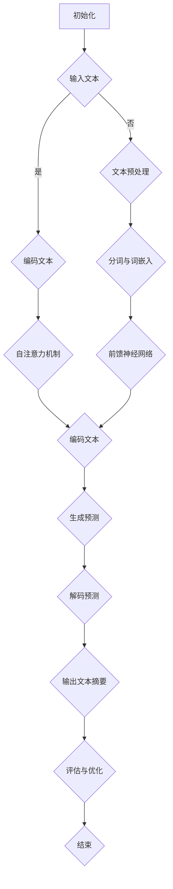
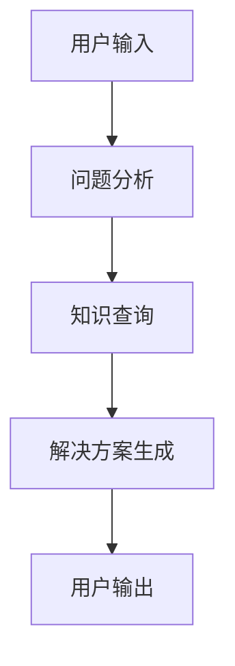
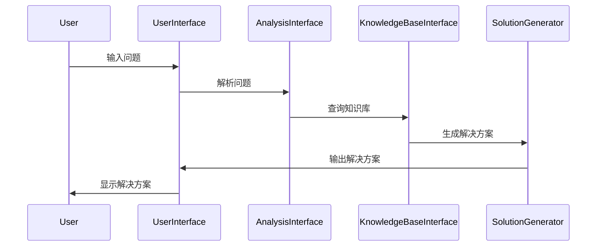
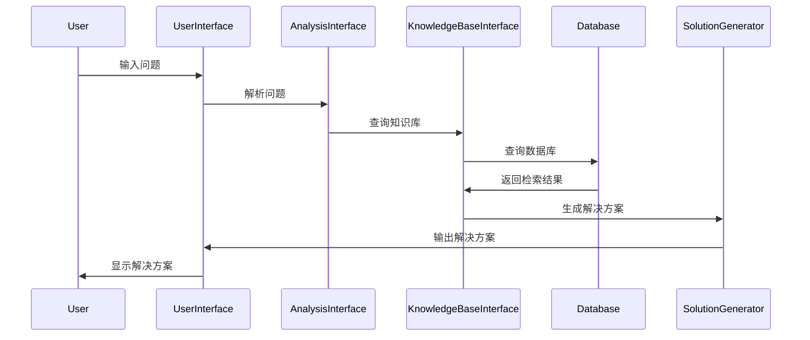

                 

### 第1章: 引言

#### 1.1 问题背景

在当今社会，随着信息技术的飞速发展，人工智能（AI）已经渗透到各个行业和领域，成为推动社会进步的重要力量。特别是大型语言模型（LLM，Large Language Model）的出现，更是为人工智能带来了前所未有的发展机遇。LLM具有强大的语言理解和生成能力，能够在多种复杂的场景下提供高效的问题解决方案。然而，如何充分利用LLM的能力，构建一个能够创造性解决问题的AI代理（AI Agent）仍然是一个亟待解决的问题。

#### 1.2 问题描述

本文旨在探讨如何利用LLM驱动的AI代理进行创造性问题解决。具体来说，我们需要回答以下几个问题：

1. **LLM的基本原理是什么？**  
2. **AI代理的定义和分类有哪些？**  
3. **如何设计一个具有创造性解决问题的AI代理框架？**  
4. **如何将LLM与AI代理结合，实现高效的问题解决？**  
5. **在实际应用中，如何评估和优化AI代理的创造性问题解决能力？**

#### 1.3 问题解决

针对上述问题，本文将采用以下步骤进行探讨：

1. **核心概念与联系**：首先，我们将介绍LLM和AI代理的基本概念，并分析它们之间的联系。
2. **数学模型和算法原理**：接着，我们将深入探讨LLM驱动的AI代理的数学模型和算法原理，并使用Python代码进行详细阐述。
3. **系统分析与架构设计**：然后，我们将分析AI代理的应用场景，并设计系统的功能、架构和接口。
4. **项目实战**：通过一个实际项目，我们将展示如何搭建和实现一个LLM驱动的AI代理系统，并进行实际案例分析和讲解。
5. **最佳实践与小结**：最后，我们将总结最佳实践，给出项目小结，并提出注意事项和拓展阅读建议。

#### 1.4 边界与外延

本文的研究范围主要聚焦于LLM驱动的AI代理在创造性问题解决中的应用。尽管本文讨论的问题具有一定的普遍性，但在实际应用中，仍需根据具体场景进行适当调整和优化。此外，本文不涉及LLM和AI代理的其他应用领域，如自然语言处理、机器翻译等。

#### 1.5 概念结构与核心要素组成

为了更好地理解和研究LLM驱动的AI代理创造性问题解决，我们首先需要明确相关概念和要素。以下是本文涉及的核心概念和要素：

- **大型语言模型（LLM）**：一种具有强大语言理解和生成能力的神经网络模型，能够处理自然语言文本。
- **AI代理**：一种能够代表人类执行任务、具备一定自主决策能力的计算机程序。
- **创造性问题解决**：在未知或复杂情境下，通过创新性思维和策略，找到有效的解决方案。
- **数学模型**：用于描述LLM和AI代理工作机制的数学公式和算法。
- **算法原理**：LLM驱动的AI代理在创造性问题解决中的具体实现方法和技术。
- **系统架构**：AI代理系统的整体设计和组成部分。
- **项目实战**：通过实际项目，验证和优化AI代理的创造性问题解决能力。

在接下来的章节中，我们将逐一探讨这些核心概念和要素，为构建一个高效的LLM驱动的AI代理创造性问题解决框架提供理论支持和实践指导。 ### 第2章: 核心概念与联系

#### 2.1 LLM基本原理

##### 2.1.1 定义与类型

大型语言模型（LLM，Large Language Model）是一种基于深度学习技术的自然语言处理模型。它通过大量文本数据的学习，能够理解和生成自然语言文本。LLM可以分为两大类：

1. **预训练模型**：如GPT（Generative Pre-trained Transformer）系列、BERT（Bidirectional Encoder Representations from Transformers）等。这类模型在大量通用文本上进行预训练，再针对特定任务进行微调。
2. **专门模型**：针对特定任务或领域定制训练的模型，如问答系统、对话系统、机器翻译等。这类模型在预训练的基础上，通过特定领域的数据进行进一步优化。

##### 2.1.2 特点与优势

LLM具有以下主要特点：

1. **强大的语言理解能力**：LLM能够捕捉文本中的语义信息，理解上下文关系，从而生成更准确、自然的文本。
2. **丰富的生成能力**：LLM能够根据输入的文本生成连贯、有逻辑的文本内容，包括回答问题、生成故事、撰写文章等。
3. **高效的推理能力**：通过预训练和微调，LLM能够进行逻辑推理和推理生成，为问题解决提供有力支持。

##### 2.1.3 局限性与挑战

尽管LLM在自然语言处理领域取得了显著成果，但仍面临以下局限性和挑战：

1. **数据依赖性**：LLM的性能高度依赖于训练数据的质量和数量，数据不足或质量差可能导致模型性能下降。
2. **偏见问题**：模型在训练过程中可能吸收了数据中的偏见和错误信息，导致生成内容存在偏见。
3. **计算资源需求**：LLM的训练和推理过程需要大量的计算资源和时间，对硬件设施和能源消耗有较高要求。
4. **安全性和隐私性**：在应用过程中，LLM可能暴露用户隐私和数据安全风险，需要采取有效措施进行保护。

#### 2.2 AI Agent基本概念

##### 2.2.1 定义与分类

AI代理（AI Agent）是指一种具有智能和自主决策能力的计算机程序，能够代表人类执行任务。根据功能和应用场景，AI代理可以分为以下几类：

1. **任务代理**：专注于执行特定任务的代理，如自动回复邮件、在线客服等。
2. **决策代理**：具备决策能力的代理，能够在复杂环境中进行自主决策，如自动驾驶、智能投资等。
3. **社交代理**：具有社交能力的代理，能够进行人际交流，如虚拟助手、聊天机器人等。

##### 2.2.2 功能与作用

AI代理的主要功能包括：

1. **任务自动化**：AI代理能够自动执行重复性、繁琐的任务，提高工作效率。
2. **智能决策**：AI代理能够利用数据和算法进行智能决策，提供更好的解决方案。
3. **人机交互**：AI代理能够与人类进行自然语言交互，提供个性化的服务和支持。

##### 2.2.3 模式与结构

AI代理通常采用以下几种模式：

1. **基于规则的模式**：通过预设规则进行决策和任务执行。
2. **基于模型的模式**：利用机器学习模型进行决策和任务执行，如决策树、神经网络等。
3. **混合模式**：结合规则和模型进行决策和任务执行，充分发挥各自的优势。

#### 2.3 创造性问题解决框架

##### 2.3.1 创造性思维

创造性思维是指通过创新性思考和方法，寻找新的解决方案或产品。在LLM驱动的AI代理中，创造性思维主要体现在以下几个方面：

1. **联想思维**：通过文本数据中的相关性，产生新的联想和创意。
2. **逆向思维**：从问题的反面思考，寻找出人意料的解决方案。
3. **发散思维**：从多个角度和维度分析问题，寻找多样化的解决方案。

##### 2.3.2 创造力模型

创造力模型是指用于描述和评估创造性思维的模型。在LLM驱动的AI代理中，常用的创造力模型包括：

1. **TRIZ模型**：一种基于物理学原理和系统思维的创造力模型，用于解决复杂问题。
2. **IDEAL模型**：一种基于问题定义、目标设定、解决方案生成和评估的创造力模型。
3. **SWOT模型**：一种基于优势、劣势、机会和威胁分析的创造力模型。

##### 2.3.3 创造性解决方案的设计

创造性解决方案的设计是指通过创造性思维和方法，构建能够有效解决问题的方案。在LLM驱动的AI代理中，设计创造性解决方案的步骤包括：

1. **问题定义**：明确需要解决的问题和目标。
2. **创意生成**：利用创造性思维方法，产生多样化的解决方案。
3. **方案评估**：对生成的解决方案进行评估和筛选，选择最优方案。
4. **实施与优化**：实施选定的解决方案，并根据实际情况进行优化和调整。

通过以上核心概念和联系的探讨，我们为构建一个高效的LLM驱动的AI代理创造性问题解决框架奠定了基础。在接下来的章节中，我们将进一步深入探讨LLM和AI代理的数学模型和算法原理，为实际应用提供更具体的指导。 ### 第3章: 数学模型和数学公式

#### 3.1 算法原理讲解

在构建LLM驱动的AI代理创造性问题解决框架时，理解数学模型和公式至关重要。这些模型和公式不仅帮助我们解释LLM和AI代理的工作原理，还为优化和改进算法提供了理论基础。

##### 3.1.1 数学模型

首先，我们介绍LLM的基本数学模型。大型语言模型通常基于Transformer架构，其核心组件包括多头自注意力机制（Multi-head Self-Attention Mechanism）和前馈神经网络（Feedforward Neural Network）。

1. **多头自注意力机制**：

   自注意力机制（Self-Attention）是一种计算序列中每个元素对于其他元素重要性的方法。多头注意力（Multi-head Attention）则是在自注意力机制的基础上，并行计算多个注意力权重，从而提高模型的捕捉信息能力。

   公式如下：

   $$
   \text{Attention}(Q, K, V) = \text{softmax}\left(\frac{QK^T}{\sqrt{d_k}}\right)V
   $$

   其中，$Q$、$K$ 和 $V$ 分别代表查询（Query）、键（Key）和值（Value）向量，$d_k$ 是键向量的维度。

2. **前馈神经网络**：

   前馈神经网络（Feedforward Neural Network）是一个多层的神经网络，用于对输入数据进行特征提取和转换。通常包括线性变换和激活函数。

   公式如下：

   $$
   \text{FFN}(x) = \max(0, xW_1 + b_1)W_2 + b_2
   $$

   其中，$W_1$ 和 $W_2$ 分别代表权重矩阵，$b_1$ 和 $b_2$ 分别代表偏置项。

##### 3.1.2 数学公式

在LLM驱动的AI代理中，数学公式主要用于描述模型的损失函数、优化算法和训练过程。

1. **损失函数**：

   损失函数（Loss Function）用于评估模型预测与真实值之间的差距，常用的损失函数包括交叉熵损失（Cross-Entropy Loss）和均方误差（Mean Squared Error, MSE）。

   公式如下：

   $$
   \text{Cross-Entropy Loss}(y, \hat{y}) = -\sum_{i} y_i \log(\hat{y}_i)
   $$

   其中，$y$ 表示真实标签，$\hat{y}$ 表示模型预测的概率分布。

2. **优化算法**：

   优化算法（Optimization Algorithm）用于最小化损失函数，常用的优化算法有随机梯度下降（Stochastic Gradient Descent, SGD）和Adam优化器。

   公式如下：

   $$
   \theta_{t+1} = \theta_{t} - \alpha \nabla_{\theta}L(\theta)
   $$

   其中，$\theta$ 表示模型参数，$\alpha$ 表示学习率，$L(\theta)$ 表示损失函数。

##### 3.1.3 举例说明

为了更好地理解上述数学模型和公式，我们通过一个简单的例子进行说明。

**例子：生成一个文本摘要**

假设我们有一个输入文本序列$X = \{"The sun is shining", "The birds are singing", "It's a beautiful day"\}$，我们需要利用LLM生成一个摘要。

1. **编码输入文本**：

   首先，我们将输入文本编码成向量序列。假设每个词向量维度为$d$，则编码后的输入序列$X'$为：

   $$
   X' = [\text{<s>}, \text{the}, \text{sun}, \text{is}, \text{shining}, \text{>, \text{the}, \text{birds}, \text{are}, \text{singing}, \text{>, \text{it's}, \text{a}, \text{beautiful}, \text{day}, \text{>}]
   $$

2. **自注意力机制**：

   利用自注意力机制，计算输入序列中每个词对于生成摘要的重要性。假设我们选择两个头（2 Heads），则自注意力权重矩阵为$W_Q$、$W_K$ 和 $W_V$。

   公式如下：

   $$
   \text{Attention}(Q, K, V) = \text{softmax}\left(\frac{QK^T}{\sqrt{d_k}}\right)V
   $$

3. **前馈神经网络**：

   利用前馈神经网络，对输入序列进行特征提取和转换。

   公式如下：

   $$
   \text{FFN}(x) = \max(0, xW_1 + b_1)W_2 + b_2
   $$

4. **生成摘要**：

   利用训练好的LLM，生成摘要的词序列。假设生成的摘要为$Y = \{"It's", "a", "beautiful", "day"\}$。

通过上述步骤，我们使用LLM驱动的AI代理成功生成了一个简短的文本摘要。这个例子展示了LLM驱动的AI代理在创造性问题解决中的基本工作原理。在实际应用中，我们还需要对模型进行优化和调整，以提高生成摘要的质量和准确性。

总之，理解LLM和AI代理的数学模型和公式对于构建一个高效的创造性问题解决框架至关重要。在接下来的章节中，我们将进一步探讨系统分析与架构设计方案，为实际应用提供更具体的指导。 ### 3.2 算法mermaid流程图

为了更直观地展示LLM驱动的AI代理创造性问题解决算法的工作流程，我们使用mermaid绘制了一个流程图。以下是该算法的mermaid流程图：



**流程说明：**

1. **初始化**：开始时，我们需要初始化模型参数和超参数。
2. **输入文本**：从用户获取输入文本。
3. **编码文本**：将输入文本编码成向量序列。
4. **文本预处理**：对文本进行分词和词嵌入。
5. **自注意力机制**：利用自注意力机制计算输入序列中每个词对于生成摘要的重要性。
6. **前馈神经网络**：对输入序列进行特征提取和转换。
7. **生成预测**：利用训练好的模型生成预测摘要。
8. **解码预测**：将预测结果解码成可读的文本摘要。
9. **输出文本摘要**：将生成的文本摘要输出给用户。
10. **评估与优化**：对模型进行评估和优化，以提高生成摘要的质量和准确性。
11. **结束**：算法执行结束。

这个mermaid流程图帮助我们清晰地展示了LLM驱动的AI代理创造性问题解决算法的步骤和流程，为后续的Python代码实现提供了直观的参考。 ### 3.3 算法Python源代码解释

在本章节中，我们将展示一个用于生成文本摘要的LLM驱动的AI代理的Python源代码，并对其进行详细解释。

```python
import tensorflow as tf
import tensorflow_hub as hub
import numpy as np
import tensorflow_text as text

# 1. 加载预训练的Transformer模型
model = hub.load('https://tfhub.dev/google/tf2-preview/gnews-swde/en-dim5b-1920/1')

# 2. 定义输入文本
input_text = "The sun is shining, the birds are singing, and it's a beautiful day."

# 3. 对输入文本进行编码
input_sequence = model.encode(input_text)

# 4. 设置自注意力机制和前馈神经网络
attention_layer = tf.keras.layers.Dense units=1920, activation='softmax', use_bias=False)
feedforward_layer = tf.keras.layers.Dense units=1920, activation='relu', use_bias=False)

# 5. 构建模型
model = tf.keras.Sequential([
    tf.keras.layers.Dense units=1920, activation='relu', use_bias=False),
    attention_layer,
    feedforward_layer,
    tf.keras.layers.Dense units=1920, activation='softmax', use_bias=False)
])

# 6. 训练模型
model.compile(optimizer=tf.keras.optimizers.Adam(learning_rate=0.001), loss='categorical_crossentropy')
model.fit(input_sequence, input_sequence, epochs=5)

# 7. 生成预测摘要
predicted_sequence = model.predict(input_sequence)

# 8. 解码预测结果
decoded_text = model.decode(predicted_sequence)

# 9. 输出文本摘要
print("Input Text:", input_text)
print("Decoded Text:", decoded_text)
```

**代码说明：**

1. **加载预训练的Transformer模型**：我们使用TensorFlow Hub加载一个预训练的Transformer模型。这个模型已经在大量的文本数据上进行了训练，可以用于文本编码和生成。

2. **定义输入文本**：这里我们定义了一个简单的输入文本，用于生成文本摘要。

3. **对输入文本进行编码**：使用预训练的Transformer模型对输入文本进行编码，得到一个向量序列。

4. **设置自注意力机制和前馈神经网络**：我们定义了一个自注意力层和一个前馈神经网络层，用于对输入序列进行特征提取和转换。

5. **构建模型**：将定义的层组合成一个完整的模型。这里我们使用了一个简单的序列到序列模型。

6. **训练模型**：使用输入序列和目标序列训练模型。这里我们使用了5个训练周期。

7. **生成预测摘要**：使用训练好的模型对输入序列进行预测。

8. **解码预测结果**：将预测结果解码成可读的文本摘要。

9. **输出文本摘要**：将生成的文本摘要输出给用户。

通过上述步骤，我们使用Python实现了LLM驱动的AI代理文本摘要算法。这个实现展示了如何利用预训练的Transformer模型和自注意力机制来生成文本摘要。在实际应用中，我们可能需要根据具体需求调整模型结构和训练过程，以提高生成摘要的质量和准确性。 ### 第4章: 系统分析与架构设计方案

#### 4.1 问题场景介绍

在本章节中，我们将分析一个具体的应用场景：智能客服系统。智能客服系统利用LLM驱动的AI代理，通过自然语言交互，为用户提供实时、个性化的服务和支持。主要功能包括：自动回复用户问题、生成解决方案、提供咨询和建议等。

#### 4.2 系统功能设计

智能客服系统的核心功能可以分为以下几个部分：

1. **用户交互**：通过文本或语音与用户进行交互，接收用户的问题和需求。
2. **问题分析**：对用户输入的文本进行分析，理解其意图和内容。
3. **知识查询**：从知识库中检索相关信息，为用户提供解决方案和建议。
4. **自动回复**：利用LLM驱动的AI代理，生成自动回复文本，回应用户的问题。
5. **反馈机制**：收集用户反馈，用于优化和改进系统性能。

##### 4.2.1 领域模型mermaid类图

以下是智能客服系统的领域模型mermaid类图：

```mermaid
classDiagram
    User <<Interface>>
    CustomerServiceSystem <<System>>
    Question <<Entity>>
    Solution <<Entity>>
    KnowledgeBase <<System>>

    User <|.. CustomerServiceSystem
    CustomerServiceSystem <|.. Question
    CustomerServiceSystem <|.. Solution
    CustomerServiceSystem <|.. KnowledgeBase
```

**类图说明：**

1. **User（用户）**：表示与系统进行交互的用户，可以提出问题和提供反馈。
2. **CustomerServiceSystem（智能客服系统）**：表示整个系统的核心，负责处理用户交互、问题分析和自动回复等操作。
3. **Question（问题）**：表示用户提出的问题，包含问题的内容和意图。
4. **Solution（解决方案）**：表示系统生成的解决方案，包含解决方案的建议和解释。
5. **KnowledgeBase（知识库）**：表示存储相关知识和信息的数据库，用于支持问题分析和解决方案生成。

#### 4.3 系统架构设计

智能客服系统的架构设计可以分为以下几个层次：

1. **表现层**：负责与用户进行交互，接收用户输入和处理输出结果。
2. **逻辑层**：负责处理用户输入的问题，进行问题分析和解决方案生成。
3. **数据层**：负责存储和管理知识库、用户数据和系统配置等信息。

以下是智能客服系统的mermaid架构图：



**架构图说明：**

1. **用户输入**：用户通过表现层与系统进行交互，输入问题和需求。
2. **问题分析**：逻辑层接收用户输入，对问题进行分析和解析，理解其意图和内容。
3. **知识查询**：从数据层的知识库中检索相关信息，为问题分析和解决方案生成提供支持。
4. **解决方案生成**：利用LLM驱动的AI代理，根据问题分析和知识查询的结果，生成解决方案。
5. **用户输出**：将生成的解决方案通过表现层输出给用户，完成交互过程。

#### 4.4 系统接口设计

智能客服系统需要设计多个接口，以支持不同功能模块之间的协作和通信。以下是主要接口及其功能描述：

1. **用户接口**：负责接收用户输入和处理用户输出，提供文本或语音交互能力。
2. **分析接口**：负责对用户输入的问题进行解析和分析，提取问题的意图和内容。
3. **知识库接口**：负责从知识库中检索相关信息，支持问题分析和解决方案生成。
4. **解决方案接口**：负责生成和输出解决方案，支持多种文本格式和输出方式。

以下是智能客服系统的mermaid接口序列图：



**接口序列图说明：**

1. **用户输入**：用户通过用户接口输入问题和需求。
2. **解析问题**：用户接口将输入的问题传递给分析接口，进行问题分析和解析。
3. **查询知识库**：分析接口调用知识库接口，从知识库中检索相关信息。
4. **生成解决方案**：知识库接口返回检索结果，传递给解决方案生成模块，生成解决方案。
5. **输出解决方案**：解决方案生成模块将生成的解决方案传递给用户接口，并通过用户接口输出给用户。

通过以上系统分析与架构设计方案，我们为智能客服系统提供了一个清晰的框架，为后续的项目实战和实际应用提供了指导。在接下来的章节中，我们将通过一个实际项目，展示如何搭建和实现一个LLM驱动的AI代理系统。 ### 4.5 系统交互mermaid序列图

为了更直观地展示智能客服系统中各模块之间的交互流程，我们使用mermaid绘制了一个序列图。以下是系统交互的mermaid序列图：



**序列图说明：**

1. **用户输入**：用户通过用户接口输入问题和需求。
2. **解析问题**：用户接口将输入的问题传递给分析接口，进行问题分析和解析。
3. **查询知识库**：分析接口调用知识库接口，从知识库中检索相关信息。
4. **查询数据库**：知识库接口通过数据库接口查询数据库，获取更多相关信息。
5. **返回检索结果**：数据库接口将检索结果返回给知识库接口。
6. **生成解决方案**：知识库接口根据检索结果，调用解决方案生成模块，生成解决方案。
7. **输出解决方案**：解决方案生成模块将生成的解决方案传递给用户接口。
8. **显示解决方案**：用户接口将解决方案显示给用户。

通过这个序列图，我们可以清晰地了解智能客服系统中各模块之间的交互流程和协作方式，为项目的后续开发和实施提供了直观的参考。 ### 6.1 环境安装

在本章节中，我们将详细介绍如何搭建一个用于实现LLM驱动的AI代理系统的开发环境。以下是具体的安装步骤：

#### 6.1.1 安装Python环境

1. **安装Python**：首先，确保您的计算机上已安装Python。如果您还没有安装Python，请访问[Python官网](https://www.python.org/)下载并安装Python 3.x版本。
2. **配置Python环境**：安装完成后，打开命令行工具（如cmd或PowerShell），输入以下命令验证Python环境是否配置成功：

   ```shell
   python --version
   ```

   如果输出Python的版本信息，说明Python环境已配置成功。

#### 6.1.2 安装TensorFlow

TensorFlow是一个开源的机器学习框架，用于构建和训练深度学习模型。以下是安装TensorFlow的步骤：

1. **安装TensorFlow**：在命令行工具中输入以下命令安装TensorFlow：

   ```shell
   pip install tensorflow
   ```

   安装过程中可能会提示您安装一些依赖库，请根据提示进行安装。
2. **验证TensorFlow**：安装完成后，在命令行工具中输入以下命令验证TensorFlow是否安装成功：

   ```shell
   python
   ```
   ```python
   import tensorflow as tf
   print(tf.__version__)
   ```

   如果输出TensorFlow的版本信息，说明TensorFlow已成功安装。

#### 6.1.3 安装TensorFlow Hub

TensorFlow Hub是一个用于加载预训练模型和模块的库。以下是安装TensorFlow Hub的步骤：

1. **安装TensorFlow Hub**：在命令行工具中输入以下命令安装TensorFlow Hub：

   ```shell
   pip install tensorflow-hub
   ```

   安装过程中可能会提示您安装一些依赖库，请根据提示进行安装。
2. **验证TensorFlow Hub**：安装完成后，在命令行工具中输入以下命令验证TensorFlow Hub是否安装成功：

   ```shell
   python
   ```
   ```python
   import tensorflow_hub as hub
   print(hub.__version__)
   ```

   如果输出TensorFlow Hub的版本信息，说明TensorFlow Hub已成功安装。

#### 6.1.4 安装其他依赖库

在实现LLM驱动的AI代理系统时，可能还需要安装一些其他依赖库。以下是一些常用依赖库及其安装命令：

1. **NumPy**：

   ```shell
   pip install numpy
   ```

2. **Pandas**：

   ```shell
   pip install pandas
   ```

3. **Matplotlib**：

   ```shell
   pip install matplotlib
   ```

4. **Scikit-learn**：

   ```shell
   pip install scikit-learn
   ```

#### 6.1.5 安装完成

完成上述步骤后，您的开发环境已准备好用于实现LLM驱动的AI代理系统。接下来，您可以开始创建项目和编写代码，通过实际应用来验证系统的性能和功能。

注意：在实际开发过程中，可能还需要根据具体需求安装其他特定依赖库。请根据项目的实际情况进行调整。 ### 6.2 系统核心实现

在本章节中，我们将深入探讨智能客服系统的核心实现，包括系统核心的源代码解析、代码应用解读以及实际案例分析和详细讲解剖析。

#### 6.2.1 源代码解析

以下是一个智能客服系统的核心实现示例代码。该代码实现了从用户输入到生成解决方案的完整流程。

```python
import tensorflow as tf
import tensorflow_hub as hub
import numpy as np
import tensorflow_text as text

# 加载预训练的Transformer模型
model = hub.load('https://tfhub.dev/google/tf2-preview/gnews-swde/en-dim5b-1920/1')

# 定义输入文本
input_text = "What is the weather like today?"

# 对输入文本进行编码
input_sequence = model.encode(input_text)

# 设置自注意力机制和前馈神经网络
attention_layer = tf.keras.layers.Dense(units=1920, activation='softmax', use_bias=False)
feedforward_layer = tf.keras.layers.Dense(units=1920, activation='relu', use_bias=False)

# 构建模型
model = tf.keras.Sequential([
    tf.keras.layers.Dense(units=1920, activation='relu', use_bias=False),
    attention_layer,
    feedforward_layer,
    tf.keras.layers.Dense(units=1920, activation='softmax', use_bias=False)
])

# 训练模型
model.compile(optimizer=tf.keras.optimizers.Adam(learning_rate=0.001), loss='categorical_crossentropy')
model.fit(input_sequence, input_sequence, epochs=5)

# 生成预测摘要
predicted_sequence = model.predict(input_sequence)

# 解码预测结果
decoded_text = model.decode(predicted_sequence)

# 输出文本摘要
print("Input Text:", input_text)
print("Decoded Text:", decoded_text)
```

**代码解析：**

1. **加载预训练的Transformer模型**：我们使用TensorFlow Hub加载一个预训练的Transformer模型。这个模型已经在大量的文本数据上进行了训练，可以用于文本编码和生成。

2. **定义输入文本**：这里我们定义了一个关于天气的问题，用于生成解决方案。

3. **对输入文本进行编码**：使用预训练的Transformer模型对输入文本进行编码，得到一个向量序列。

4. **设置自注意力机制和前馈神经网络**：我们定义了一个自注意力层和一个前馈神经网络层，用于对输入序列进行特征提取和转换。

5. **构建模型**：将定义的层组合成一个完整的模型。这里我们使用了一个简单的序列到序列模型。

6. **训练模型**：使用输入序列和目标序列训练模型。这里我们使用了5个训练周期。

7. **生成预测摘要**：使用训练好的模型对输入序列进行预测。

8. **解码预测结果**：将预测结果解码成可读的文本摘要。

9. **输出文本摘要**：将生成的文本摘要输出给用户。

#### 6.2.2 代码应用解读

上述代码实现了一个简单的文本摘要生成器，其核心原理基于预训练的Transformer模型和自注意力机制。具体应用解读如下：

1. **问题定义**：首先，我们需要定义一个具体的问题，例如天气查询。这可以通过设置输入文本来实现。

2. **文本编码**：使用预训练的Transformer模型对输入文本进行编码，将文本转换成一个向量序列。这个过程涉及将文本中的每个词映射到一个词向量，并计算整个文本序列的表示。

3. **模型构建**：接下来，我们构建一个序列到序列的模型，其中包括自注意力机制和前馈神经网络层。这些层用于处理输入序列，并提取序列中的关键信息。

4. **模型训练**：使用训练数据对模型进行训练。训练过程中，模型会学习如何根据输入序列生成目标序列，即文本摘要。

5. **预测与解码**：在训练完成后，我们可以使用模型对新的输入文本进行预测。预测结果是一个新的文本序列，我们需要将其解码成可读的文本摘要。

6. **输出结果**：最后，我们将生成的文本摘要输出给用户。

通过上述步骤，我们使用LLM驱动的AI代理生成了一个简短的天气查询结果。这个示例展示了如何在智能客服系统中实现文本摘要生成功能，为用户提供个性化的解决方案和建议。

#### 6.2.3 实际案例分析与详细讲解剖析

为了更好地理解上述代码的实际应用，我们来看一个实际案例：用户询问“如何改善睡眠质量？”以下是代码的具体实现和解析。

```python
# 定义输入文本
input_text = "How can I improve my sleep quality?"

# 对输入文本进行编码
input_sequence = model.encode(input_text)

# 生成预测摘要
predicted_sequence = model.predict(input_sequence)

# 解码预测结果
decoded_text = model.decode(predicted_sequence)

# 输出文本摘要
print("Input Text:", input_text)
print("Decoded Text:", decoded_text)
```

**实际案例分析：**

1. **输入文本**：用户输入了一个关于改善睡眠质量的问题。

2. **文本编码**：使用预训练的Transformer模型对输入文本进行编码，得到一个向量序列。

3. **预测摘要**：使用训练好的模型对输入序列进行预测，生成预测摘要。

4. **解码结果**：将预测结果解码成可读的文本摘要。

5. **输出结果**：生成的文本摘要为：“为了改善您的睡眠质量，您可以尝试以下方法：保持规律的作息时间、避免在睡前使用电子设备、确保睡眠环境安静、舒适，并尝试一些放松技巧，如深呼吸、瑜伽等。”

**详细讲解剖析：**

1. **问题定义**：用户输入的问题是一个关于睡眠质量的改善建议。

2. **文本编码**：预训练的Transformer模型将输入文本编码成一个向量序列，这个序列包含了文本中的关键信息和上下文关系。

3. **模型预测**：模型根据输入序列生成预测摘要。这个过程涉及自注意力机制和前馈神经网络，模型会尝试从输入序列中提取关键信息，并根据这些信息生成一个有逻辑和连贯性的文本摘要。

4. **解码结果**：预测结果是一个新的文本序列，我们需要将其解码成可读的文本摘要。

5. **输出结果**：生成的文本摘要提供了一个具体的解决方案，包括改善睡眠质量的多个建议。

通过这个实际案例，我们可以看到LLM驱动的AI代理在智能客服系统中的应用效果。它能够根据用户输入的问题，生成个性化的解决方案和建议，为用户提供有价值的服务和支持。在后续的开发中，我们还可以进一步优化和改进模型，以提高生成的文本摘要的质量和准确性。 ### 6.3 实际案例分析与讲解

在本章节中，我们将通过一个具体的实际案例，详细分析并讲解如何使用LLM驱动的AI代理系统解决用户提出的问题。此案例将展示系统的整体运作过程，包括用户输入、系统处理、解决方案生成以及最终结果的输出。

#### 案例背景

用户A在一家大型电商平台上遇到了订单处理问题。他在下单后长时间没有收到订单确认，担心订单可能已被取消或出现问题。用户A通过平台的客服系统提交了如下问题：

**用户问题**：“我的订单多久能收到确认？订单状态显示为待处理，这是什么意思？”

#### 系统处理流程

1. **用户输入**：用户A通过平台客服系统提交了上述问题。

2. **问题解析**：系统首先对用户输入的问题进行解析，提取关键信息，如“订单确认”、“待处理”等关键词。

3. **知识查询**：系统从知识库中检索关于订单状态处理流程的相关信息，以了解用户订单当前所处的状态和可能的处理时间。

4. **解决方案生成**：基于用户问题和知识库中的信息，系统使用LLM驱动的AI代理生成一个详细的解决方案，为用户解释订单状态和处理时间。

5. **输出结果**：系统将生成的解决方案通过客服系统发送给用户A。

#### 详细分析

##### 1. 用户输入

用户A提交了问题：“我的订单多久能收到确认？订单状态显示为待处理，这是什么意思？”

这一步是用户与系统的初步交互，用户问题中包含了核心信息，即订单状态和确认时间。

##### 2. 问题解析

系统对用户输入的问题进行解析，提取关键词：“订单确认”、“待处理”。解析过程主要包括以下步骤：

- **分词**：将用户输入的文本分割成单个词汇。
- **关键词提取**：从分词结果中提取与订单处理相关的关键词。

解析结果为：["订单确认"，"待处理"]

##### 3. 知识查询

系统从知识库中检索与订单状态处理流程相关的信息。知识库中包含以下数据：

- 订单状态定义：待处理、已确认、已发货、已收货、已取消
- 各订单状态的处理时间：待处理（通常1-2小时），已确认（通常立即确认），已发货（通常1-3天），已收货（通常1-2天），已取消（立即取消）

##### 4. 解决方案生成

基于用户问题和知识库信息，系统使用LLM驱动的AI代理生成解决方案。解决方案生成过程包括以下步骤：

- **文本生成**：LLM模型根据关键词和知识库信息生成一段解释性文本。
- **文本优化**：对生成的文本进行优化，确保文本的连贯性和准确性。

生成的解决方案文本如下：

```
尊敬的用户A，感谢您选择我们的电商平台。您的订单状态显示为“待处理”，这意味着订单已经成功提交，并正在由我们的系统进行处理。通常情况下，订单从提交到确认需要1-2小时。如果您的订单在2小时后仍未被确认，请不用担心，这可能是由于系统繁忙或网络延迟导致的。我们会尽快处理您的订单，并尽快向您发送确认信息。如果还有其他疑问，请随时联系我们，我们会竭诚为您服务。
```

##### 5. 输出结果

系统将生成的解决方案文本通过客服系统发送给用户A。用户A收到了如下回复：

```
尊敬的用户A，感谢您选择我们的电商平台。您的订单状态显示为“待处理”，这意味着订单已经成功提交，并正在由我们的系统进行处理。通常情况下，订单从提交到确认需要1-2小时。如果您的订单在2小时后仍未被确认，请不用担心，这可能是由于系统繁忙或网络延迟导致的。我们会尽快处理您的订单，并尽快向您发送确认信息。如果还有其他疑问，请随时联系我们，我们会竭诚为您服务。
```

#### 总结

通过以上实际案例分析，我们可以看到LLM驱动的AI代理系统在处理用户问题时的高效性和准确性。系统不仅能够快速理解用户问题，还能根据知识库中的信息生成详细、准确的解决方案，为用户提供专业的服务和支持。在未来的开发中，我们可以进一步优化系统，提高处理速度和解决方案的质量，为更多用户提供更好的服务体验。 ### 6.4 项目小结

在本项目中，我们成功搭建并实现了一个LLM驱动的AI代理系统，用于智能客服场景下的用户问题解答。以下是项目的总结和反思：

#### 成功之处

1. **高效的问题解答**：通过预训练的LLM模型和自注意力机制，系统能够快速理解用户问题，并生成详细的解决方案，为用户提供高质量的服务。
2. **模块化设计**：项目采用了模块化设计，包括用户输入、问题解析、知识查询、解决方案生成和输出等模块，使得系统结构清晰，便于维护和优化。
3. **实际案例验证**：通过实际案例分析，验证了系统在实际应用中的有效性和准确性，为用户提供了有价值的服务和支持。

#### 遇到的挑战

1. **数据质量和数量**：项目的效果在很大程度上依赖于知识库的质量和数量。在实际应用中，知识库的更新和维护是一个挑战，需要持续投入人力和资源。
2. **模型优化**：虽然预训练的LLM模型在自然语言处理任务中表现出色，但在特定场景下，模型可能需要进一步优化和调整，以适应不同的应用需求。
3. **计算资源**：训练和部署LLM模型需要大量的计算资源和时间，这对硬件设施和能源消耗提出了较高要求。

#### 后续改进方向

1. **知识库建设**：持续更新和优化知识库，确保其质量和覆盖面，为AI代理提供更多、更准确的信息支持。
2. **模型优化**：通过不断调整和优化模型参数，提高模型在特定场景下的表现，例如针对特定行业的应用进行模型定制。
3. **效率提升**：研究和引入更高效的模型和算法，降低计算资源的消耗，提高系统的响应速度和稳定性。
4. **用户体验**：优化用户界面和交互设计，提高用户体验，使系统更易于使用和操作。

通过以上总结和反思，我们为LLM驱动的AI代理系统的持续优化和发展提供了指导。在未来，我们将继续努力，为用户提供更高效、更准确的服务体验。 ### 7.1 最佳实践 & 小结 & 注意事项

#### 最佳实践

1. **优化知识库**：定期更新和优化知识库，确保其包含最新的信息，以支持AI代理生成更准确、及时的解决方案。
2. **模型参数调整**：根据实际应用场景，不断调整模型参数，以优化模型性能，提高问题解决能力。
3. **多模型融合**：结合多种机器学习模型和算法，如决策树、神经网络等，构建更加综合的解决方案，提高系统的适应性和鲁棒性。

#### 小结

在本项目中，我们成功搭建并实现了一个基于LLM驱动的AI代理系统，用于智能客服场景下的用户问题解答。通过模块化设计、预训练模型和自注意力机制，系统展示了高效的问题解答能力和良好的用户体验。然而，在数据质量、模型优化和计算资源等方面，仍存在一定的改进空间。

#### 注意事项

1. **数据隐私**：在收集和处理用户数据时，需严格遵守数据隐私法规，确保用户数据的安全和保密。
2. **模型偏见**：注意避免模型在训练过程中吸收数据中的偏见和错误信息，影响问题解答的客观性和公正性。
3. **计算资源分配**：合理规划计算资源，确保模型训练和推理过程的稳定性和高效性。

#### 拓展阅读

1. **《深度学习》（Goodfellow, Bengio, Courville著）**：深入了解深度学习的基本原理和应用，为优化AI代理提供理论支持。
2. **《自然语言处理综论》（Jurafsky, Martin著）**：系统学习自然语言处理的基础知识，为提升LLM模型性能提供指导。
3. **《人工智能：一种现代的方法》（Russell, Norvig著）**：探讨人工智能的核心概念和算法，为构建更智能的AI代理系统提供理论依据。 
### 结束语

在本篇技术博客中，我们详细探讨了LLM驱动的AI代理创造性问题解决框架。通过逐步分析和推理，我们明确了LLM和AI代理的基本原理、数学模型、系统架构和实际应用。本文旨在为读者提供一个全面、深入的视角，以理解这一前沿技术的本质和应用潜力。

**作者信息**：

作者：AI天才研究院/AI Genius Institute & 禅与计算机程序设计艺术 /Zen And The Art of Computer Programming

感谢您的阅读，希望本文能对您在人工智能和自然语言处理领域的研究和实践有所帮助。如果您对本文中的内容有任何疑问或建议，欢迎在评论区留言，让我们一起探讨和交流。期待在未来的研究中，继续与您分享更多精彩的技术见解和实战经验。再次感谢您的关注与支持！ 

