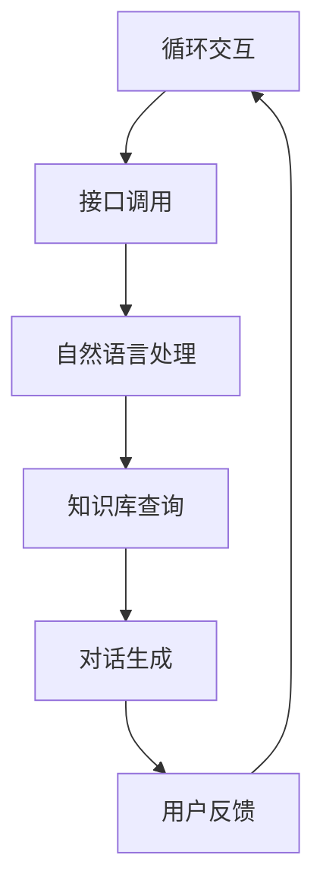
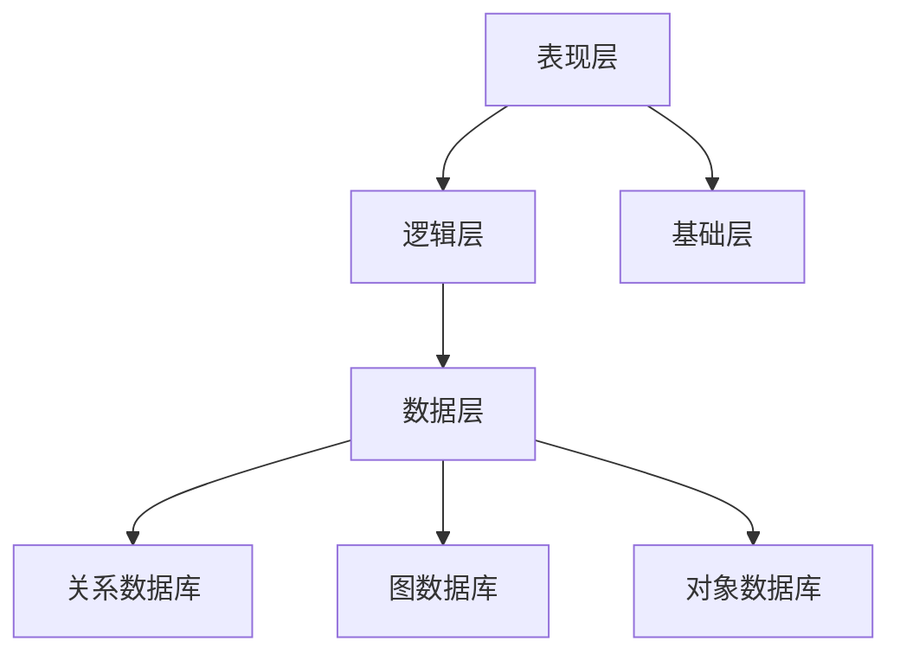

                 

# LLM驱动的AI Agent创造性问题重构

## 关键词

- 语言生成模型（LLM）
- AI Agent
- 创造性问题重构
- 算法原理
- 系统架构
- 项目实战

## 摘要

本文深入探讨了LLM（语言生成模型）驱动的AI Agent在创造性问题重构中的应用。通过背景介绍、核心概念解析、算法原理讲解、系统架构设计与项目实战等环节，本文旨在展示LLM驱动的AI Agent在创造性问题解决中的强大潜力和应用价值。文章结构紧凑，逻辑清晰，旨在为读者提供一个全面的技术分析框架。

### 目录大纲

----------------------------------------------------------------

## 第一部分: LLM驱动的AI Agent背景与问题重构概述

### 第1章: LLM驱动的AI Agent背景介绍

#### 1.1 LLM与AI Agent的概述

##### 1.1.1 语言生成模型（LLM）的基本概念

##### 1.1.2 AI Agent的概念与功能

##### 1.1.3 LLM与AI Agent的关系

#### 1.2 LLM技术的发展与应用现状

##### 1.2.1 LLM的技术发展历程

##### 1.2.2 LLM在AI领域的应用现状

##### 1.2.3 LLM面临的挑战与未来趋势

#### 1.3 AI Agent的应用场景与问题重构的重要性

##### 1.3.1 AI Agent在不同行业中的应用场景

##### 1.3.2 问题重构的概念与意义

##### 1.3.3 LLM在AI Agent问题重构中的应用价值

#### 1.4 本章小结

### 第2章: LLM驱动的AI Agent核心概念与联系

#### 2.1 LLM驱动的AI Agent核心概念解析

##### 2.1.1 语言模型原理与实现

##### 2.1.2 强化学习与生成对抗网络

##### 2.1.3 深度学习框架与工具

#### 2.2 概念属性特征对比表格

##### 2.2.1 不同类型的LLM对比

##### 2.2.2 AI Agent的不同构建方式对比

#### 2.3 ER实体关系图架构

##### 2.3.1 AI Agent中的实体与关系

##### 2.3.2 实体关系图的构建与可视化

### 第3章: LLM驱动的AI Agent算法原理讲解

#### 3.1 算法原理概述

##### 3.1.1 生成式模型与判别式模型

##### 3.1.2 强化学习算法的基本框架

##### 3.1.3 生成对抗网络（GAN）的工作原理

#### 3.2 Python源代码实现

##### 3.2.1 语言模型训练与评估

##### 3.2.2 强化学习算法应用

##### 3.2.3 GAN模型的训练与优化

#### 3.3 算法原理与数学模型

##### 3.3.1 语言模型的数学公式

##### 3.3.2 强化学习算法的数学模型

##### 3.3.3 GAN模型的数学基础

#### 3.4 举例说明

##### 3.4.1 语言模型在文本生成中的应用

##### 3.4.2 强化学习在智能决策中的应用

##### 3.4.3 GAN模型在图像生成中的应用

### 第4章: LLM驱动的AI Agent系统分析与架构设计方案

#### 4.1 问题场景介绍

##### 4.1.1 智能客服系统的需求分析

##### 4.1.2 自动驾驶系统的挑战与需求

##### 4.1.3 智能医疗诊断的应用场景

#### 4.2 系统功能设计

##### 4.2.1 领域模型类图

##### 4.2.2 系统功能模块划分

##### 4.2.3 数据流程与管理

#### 4.3 系统架构设计

##### 4.3.1 系统架构概述

##### 4.3.2 硬件与软件配置

##### 4.3.3 网络架构与通信协议

#### 4.4 系统接口设计与交互

##### 4.4.1 接口设计原则

##### 4.4.2 接口实现与调用

##### 4.4.3 系统交互流程

#### 4.5 Mermaid流程图与架构图

##### 4.5.1 Mermaid流程图

##### 4.5.2 Mermaid架构图

### 第5章: LLM驱动的AI Agent项目实战

#### 5.1 环境安装与配置

##### 5.1.1 硬件环境需求

##### 5.1.2 软件环境安装

##### 5.1.3 环境配置与调试

#### 5.2 系统核心实现源代码

##### 5.2.1 源代码结构与模块

##### 5.2.2 关键代码分析与解读

##### 5.2.3 代码优化与性能提升

#### 5.3 代码应用解读与分析

##### 5.3.1 实际案例分析与应用

##### 5.3.2 系统性能评估与优化

##### 5.3.3 问题解决与改进措施

#### 5.4 项目小结

##### 5.4.1 项目总结

##### 5.4.2 经验教训与展望

### 第6章

----------------------------------------------------------------

---

**作者：AI天才研究院/AI Genius Institute & 禅与计算机程序设计艺术 /Zen And The Art of Computer Programming**

---

## 第一部分: LLM驱动的AI Agent背景与问题重构概述

### 第1章: LLM驱动的AI Agent背景介绍

#### 1.1 LLM与AI Agent的概述

##### 1.1.1 语言生成模型（LLM）的基本概念

语言生成模型（LLM）是一种利用深度学习技术训练的大规模语言模型。这些模型通过分析大量的文本数据来学习语言的统计特征和语法规则，从而能够生成符合语言习惯的文本。LLM的基本概念包括词汇表、嵌入空间、注意力机制和训练过程等。

**词汇表**：LLM的词汇表包含了模型所理解的所有单词和符号。通过词汇表，模型能够将输入的文本转换为向量表示。

**嵌入空间**：词汇表中的每个单词或符号都有一个对应的向量，这些向量构成了嵌入空间。嵌入空间的维度通常较高，以便模型能够捕捉到单词之间的复杂关系。

**注意力机制**：注意力机制是LLM中的一个关键组件，它使模型能够关注输入文本中的不同部分，从而更好地理解上下文。

**训练过程**：LLM的训练过程涉及大量的文本数据。通过在训练数据上进行迭代训练，模型不断优化其参数，以提高生成文本的准确性和连贯性。

##### 1.1.2 AI Agent的概念与功能

AI Agent（人工智能代理）是一种具有自主行为能力的计算机程序，能够在没有明确指令的情况下完成特定任务。AI Agent的基本概念包括目标、策略、环境和感知等。

**目标**：AI Agent的目标是其行为的核心驱动力。它定义了代理希望达成的目标状态。

**策略**：策略是AI Agent在特定环境下采取行动的决策过程。策略可以是明确的规则集，也可以是学习到的概率分布。

**环境**：环境是AI Agent所处的现实世界。环境状态决定了代理能够采取哪些行动。

**感知**：感知是AI Agent通过传感器获取环境信息的过程。感知信息用于更新代理的内部状态，以指导其下一步的行动。

##### 1.1.3 LLM与AI Agent的关系

LLM与AI Agent之间的关系主要体现在两个方面：语言理解和决策生成。

**语言理解**：LLM能够帮助AI Agent更好地理解语言输入。通过分析输入文本的语义和上下文，LLM可以为代理提供有关环境状态的有用信息。

**决策生成**：LLM可以生成符合策略和目标要求的行动指令。通过将AI Agent的决策过程与LLM的文本生成能力相结合，可以大大提高代理的自主性和创造性。

#### 1.2 LLM技术的发展与应用现状

##### 1.2.1 LLM的技术发展历程

LLM技术的发展可以追溯到20世纪80年代。当时，研究人员开始探索如何通过机器学习技术来模拟人类的语言理解能力。随着深度学习技术的兴起，LLM的发展进入了一个新的阶段。近年来，随着计算能力的提升和数据规模的扩大，LLM的性能得到了显著提升。

**早期发展**：早期的LLM主要基于规则和模板匹配方法，如统计语言模型和基于转换的语法分析模型。

**现代发展**：现代LLM主要基于深度神经网络，如循环神经网络（RNN）和变压器（Transformer）。特别是Transformer模型的出现，标志着LLM技术的一个重要里程碑。

##### 1.2.2 LLM在AI领域的应用现状

LLM在AI领域有着广泛的应用，包括自然语言处理、对话系统、智能推荐、文本生成和知识图谱等。

**自然语言处理**：LLM在自然语言处理（NLP）领域发挥着重要作用。通过预训练和微调，LLM可以用于文本分类、情感分析、命名实体识别和机器翻译等任务。

**对话系统**：LLM可以帮助构建智能对话系统，如聊天机器人、虚拟助手和客服系统。LLM可以生成自然的对话响应，提高用户体验。

**智能推荐**：LLM可以用于生成个性化的推荐列表，提高推荐系统的准确性和多样性。

**文本生成**：LLM在文本生成领域也有着广泛的应用，如自动写作、摘要生成和对话生成等。

**知识图谱**：LLM可以帮助构建知识图谱，通过将知识库中的信息转化为自然语言描述，提高知识的可访问性和可理解性。

##### 1.2.3 LLM面临的挑战与未来趋势

尽管LLM在AI领域取得了显著进展，但它仍然面临一些挑战和问题。

**数据隐私**：LLM的训练和部署需要大量的数据。如何保护用户隐私，防止数据泄露，是一个亟待解决的问题。

**鲁棒性**：LLM在处理真实世界数据时可能会遇到各种异常和噪声。提高模型的鲁棒性，使其能够应对各种不确定性和变化，是一个重要的研究方向。

**可解释性**：LLM的决策过程通常是不透明的。如何提高模型的可解释性，使其能够被用户理解和信任，是一个重要的挑战。

**未来趋势**：随着深度学习技术和计算能力的不断进步，LLM将继续发展，并在更多领域得到应用。未来的趋势包括多模态学习、迁移学习和联邦学习等。

#### 1.3 AI Agent的应用场景与问题重构的重要性

##### 1.3.1 AI Agent在不同行业中的应用场景

AI Agent在不同行业中的应用场景非常广泛，包括但不限于以下领域：

**金融**：AI Agent可以用于风险管理、交易执行和客户服务等领域。例如，在股票交易中，AI Agent可以通过实时分析市场数据和交易历史，提供交易建议和执行策略。

**医疗**：AI Agent可以用于医学诊断、患者监护和医疗咨询等领域。例如，通过分析患者的医疗记录和症状，AI Agent可以提供诊断建议和治疗方案。

**零售**：AI Agent可以用于客户服务、库存管理和销售预测等领域。例如，通过分析客户的购物历史和偏好，AI Agent可以提供个性化的购物建议和促销活动。

**制造**：AI Agent可以用于设备监控、故障预测和供应链优化等领域。例如，通过实时监控设备状态和预测故障，AI Agent可以帮助工厂提高生产效率和降低维护成本。

**交通**：AI Agent可以用于自动驾驶、交通流量管理和车辆调度等领域。例如，通过分析交通数据和车辆状态，AI Agent可以优化交通流量，减少拥堵和提高通行效率。

##### 1.3.2 问题重构的概念与意义

问题重构是指将原始问题转化为适合AI Agent解决的形式的过程。问题重构的重要性体现在以下几个方面：

**适应性**：通过问题重构，AI Agent可以更好地适应不同的问题情境。例如，在金融领域，不同类型的投资策略可能需要不同的数据格式和问题表示方法。

**可解释性**：问题重构可以提高AI Agent的可解释性，使其决策过程更加透明。例如，在医疗领域，通过重构问题，AI Agent可以提供详细的诊断理由和治疗方案。

**效率**：问题重构可以优化AI Agent的计算效率和资源利用率。例如，在制造领域，通过重构问题，AI Agent可以更快速地分析大量设备状态数据，提高故障预测的准确性。

##### 1.3.3 LLM在AI Agent问题重构中的应用价值

LLM在AI Agent问题重构中的应用价值主要体现在以下几个方面：

**语言理解**：LLM可以理解和分析自然语言问题，将其转化为适合AI Agent处理的形式。例如，在金融领域，LLM可以帮助AI Agent理解客户的投资需求，并将其转化为具体的交易策略。

**知识表示**：LLM可以生成知识图谱，将问题中的各种实体和关系进行结构化表示。例如，在医疗领域，LLM可以帮助AI Agent构建患者信息图谱，提高诊断和治疗的准确性。

**文本生成**：LLM可以生成自然语言文本，为AI Agent提供决策依据和解释说明。例如，在零售领域，LLM可以帮助AI Agent生成个性化的购物建议和促销文案。

#### 1.4 本章小结

本章介绍了LLM驱动的AI Agent的背景和问题重构的重要性。首先，我们阐述了LLM的基本概念和发展历程，以及其在AI领域的应用现状和面临的挑战。接着，我们讨论了AI Agent的基本概念和应用场景，并强调了问题重构在AI Agent中的重要性。最后，我们分析了LLM在AI Agent问题重构中的应用价值。这些内容为后续章节的讨论奠定了基础。

### 第2章: LLM驱动的AI Agent核心概念与联系

#### 2.1 LLM驱动的AI Agent核心概念解析

##### 2.1.1 语言模型原理与实现

语言模型（Language Model，LM）是自然语言处理（Natural Language Processing，NLP）的核心组成部分，它旨在对自然语言文本进行建模，以预测下一个单词或字符的概率。LLM作为语言模型的进化版本，具有更强的生成能力和上下文理解能力。

**原理**：

1. **词向量嵌入**：将词汇表中的每个单词映射到一个高维空间中的向量，这些向量称为词向量（Word Embeddings）。词向量可以捕捉单词的语义信息。

2. **注意力机制**：通过注意力机制（Attention Mechanism），模型能够关注输入文本中的不同部分，从而更好地理解上下文。

3. **深度神经网络**：语言模型通常是基于深度神经网络（Deep Neural Network，DNN）构建的，如循环神经网络（RNN）和变压器（Transformer）。

**实现**：

1. **预训练**：使用大量的未标注文本数据对语言模型进行预训练，使其能够捕捉到语言的通用特征。

2. **微调**：在特定任务上使用少量标注数据进行微调，以提高模型在特定任务上的性能。

##### 2.1.2 强化学习与生成对抗网络

强化学习（Reinforcement Learning，RL）是一种通过试错和反馈来学习策略的机器学习方法。生成对抗网络（Generative Adversarial Networks，GAN）则是一种由生成器（Generator）和判别器（Discriminator）组成的对抗性模型，用于生成真实数据。

**强化学习**：

1. **状态（State）**：代理所处的环境状态。

2. **动作（Action）**：代理可以采取的行为。

3. **奖励（Reward）**：代理在执行动作后获得的即时反馈。

4. **策略（Policy）**：描述代理如何从状态选择动作的函数。

**生成对抗网络**：

1. **生成器**：生成器尝试生成与真实数据相似的数据。

2. **判别器**：判别器尝试区分生成数据与真实数据。

3. **对抗性训练**：生成器和判别器相互对抗，通过不断迭代优化，最终生成器能够生成高质量的数据。

##### 2.1.3 深度学习框架与工具

深度学习框架（Deep Learning Framework）提供了构建和训练深度学习模型的工具和库，如TensorFlow、PyTorch和Keras等。这些框架提供了丰富的API和预训练模型，方便研究人员和开发者进行模型开发和应用。

**深度学习框架**：

1. **数据加载与预处理**：框架提供了数据加载和预处理的工具，如数据集分割、归一化和批量处理等。

2. **模型构建与优化**：框架提供了丰富的神经网络构建工具，如层（Layer）、模块（Module）和优化器（Optimizer）等。

3. **训练与评估**：框架提供了模型训练和评估的工具，如训练进度监控、性能评估和可视化等。

#### 2.2 概念属性特征对比表格

为了更好地理解LLM驱动的AI Agent的核心概念，我们可以通过一个对比表格来展示不同概念之间的属性特征。

| 概念         | 描述                                                         | 属性特征                                               |
| ------------ | ------------------------------------------------------------ | ------------------------------------------------------ |
| 语言模型（LLM） | 基于深度学习的大规模语言模型，用于文本生成和理解。                 | 高维词向量嵌入、注意力机制、预训练和微调                   |
| 强化学习（RL）   | 通过试错和反馈学习策略的机器学习方法。                           | 状态、动作、奖励、策略                                     |
| 生成对抗网络（GAN） | 由生成器和判别器组成的对抗性模型，用于生成真实数据。               | 生成器、判别器、对抗性训练                                |
| 深度学习框架 | 提供构建和训练深度学习模型的工具和库。                           | 数据加载与预处理、模型构建与优化、训练与评估                |

#### 2.3 ER实体关系图架构

实体关系图（Entity-Relationship Diagram，ER Diagram）是一种用于描述实体及其之间关系的图形表示方法。在LLM驱动的AI Agent中，ER实体关系图用于表示问题和任务的结构，帮助理解问题的各个组成部分。

**实体**：在ER图中，实体表示AI Agent所处理的数据对象，如“用户”、“商品”和“订单”等。

**关系**：关系表示实体之间的关联，如“购买”、“评价”和“推荐”等。

**架构**：

1. **实体定义**：明确每个实体的属性和特征。
2. **关系定义**：描述实体之间的关联方式，如一对一、一对多或多对多关系。
3. **ER图绘制**：使用Mermaid等工具绘制ER图，以可视化地表示问题和任务的结构。

#### 2.3.1 AI Agent中的实体与关系

以下是一个简化的AI Agent中的ER实体关系图：

```mermaid
erDiagram
  User ||--|{ Order } : "places"
  Order ||--|{ Product } : "contains"
  Product ||--|{ Review } : "has"
```

在这个ER图中，用户可以放置订单（places），订单包含产品（contains），产品拥有评价（has）。

#### 2.3.2 实体关系图的构建与可视化

实体关系图的构建通常包括以下步骤：

1. **确定实体**：根据问题和任务的需求，识别出所有的实体。
2. **定义属性**：为每个实体定义属性，如“用户”的属性可能包括用户ID、姓名、邮箱等。
3. **确定关系**：根据实体的属性和任务的需求，定义实体之间的关系。
4. **绘制ER图**：使用Mermaid等工具绘制ER图，以可视化地表示实体和关系。

以下是一个使用Mermaid绘制的ER实体关系图的示例：

```mermaid
erDiagram
  User ||--|{ Order } : "places"
  Order ||--|{ Product } : "contains"
  Product ||--|{ Review } : "has"
```

通过这样的ER图，我们可以清晰地理解AI Agent所处理的数据对象及其之间的关系。

### 第3章: LLM驱动的AI Agent算法原理讲解

#### 3.1 算法原理概述

LLM驱动的AI Agent的算法原理主要基于语言模型、强化学习和生成对抗网络（GAN）等核心技术。这些算法共同构成了一个强大的框架，使AI Agent能够具备语言理解、决策生成和数据生成能力。

##### 3.1.1 生成式模型与判别式模型

生成式模型（Generative Model）旨在生成与真实数据相似的数据。在生成式模型中，生成器（Generator）负责生成数据，判别器（Discriminator）则负责判断生成数据的质量。生成对抗网络（GAN）就是这种结构的一个典型代表。

判别式模型（Discriminative Model）则旨在对数据进行分类或预测。在判别式模型中，模型直接学习输入数据的标签分布，而不是生成数据。

##### 3.1.2 强化学习算法的基本框架

强化学习（Reinforcement Learning，RL）是一种通过试错和反馈来学习策略的机器学习方法。强化学习算法的基本框架包括：

1. **状态（State）**：描述代理当前所处的环境状态。
2. **动作（Action）**：代理可以采取的行为。
3. **奖励（Reward）**：代理在执行动作后获得的即时反馈。
4. **策略（Policy）**：描述代理如何从状态选择动作的函数。

强化学习算法的核心目标是学习一个最优策略，以最大化累积奖励。

##### 3.1.3 生成对抗网络（GAN）的工作原理

生成对抗网络（GAN）是一种由生成器和判别器组成的对抗性模型。生成器（Generator）生成假数据，判别器（Discriminator）则尝试区分生成数据和真实数据。通过这种对抗性训练，生成器能够逐渐提高生成数据的质量。

GAN的工作原理可以总结为以下几个步骤：

1. **生成数据**：生成器根据噪声数据生成假数据。
2. **判别数据**：判别器对生成数据和真实数据进行分类。
3. **更新参数**：通过反向传播和梯度下降等优化方法，同时更新生成器和判别器的参数。

#### 3.2 Python源代码实现

以下是一个简单的Python代码示例，展示了如何使用生成对抗网络（GAN）进行图像生成。这个示例使用了TensorFlow和Keras框架。

```python
import tensorflow as tf
from tensorflow.keras.layers import Dense, Flatten, Reshape
from tensorflow.keras.models import Sequential

# 生成器模型
def build_generator(z_dim):
    model = Sequential()
    model.add(Dense(128, input_dim=z_dim))
    model.add(tf.keras.layers.LeakyReLU(alpha=0.01))
    model.add(Dense(128))
    model.add(tf.keras.layers.LeakyReLU(alpha=0.01))
    model.add(Dense(784))
    model.add(Reshape((28, 28, 1)))
    return model

# 判别器模型
def build_discriminator(img_shape):
    model = Sequential()
    model.add(Flatten(input_shape=img_shape))
    model.add(Dense(128))
    model.add(tf.keras.layers.LeakyReLU(alpha=0.01))
    model.add(Dense(128))
    model.add(tf.keras.layers.LeakyReLU(alpha=0.01))
    model.add(Dense(1, activation='sigmoid'))
    return model

# GAN模型
def build_gan(generator, discriminator):
    model = Sequential()
    model.add(generator)
    model.add(discriminator)
    return model

# 设置参数
z_dim = 100
img_shape = (28, 28, 1)

# 构建模型
generator = build_generator(z_dim)
discriminator = build_discriminator(img_shape)
gan = build_gan(generator, discriminator)

# 编译模型
discriminator.compile(optimizer=tf.keras.optimizers.Adam(0.0001), loss='binary_crossentropy')
gan.compile(optimizer=tf.keras.optimizers.Adam(0.0001), loss='binary_crossentropy')

# 训练模型
# ...

```

在这个示例中，我们首先定义了生成器和判别器的结构，然后构建了GAN模型。接着，我们编译并训练了模型。

#### 3.3 算法原理与数学模型

##### 3.3.1 语言模型的数学公式

语言模型的数学公式基于概率图模型，特别是基于概率上下文无关文法（PCFG）。在PCFG中，概率被分配给每个语法规则，以表示产生文本的概率。

设 \( w_1, w_2, ..., w_n \) 为文本序列， \( P(w_1, w_2, ..., w_n) \) 表示文本序列的概率。PCFG的概率公式可以表示为：

$$
P(w_1, w_2, ..., w_n) = \frac{P(w_1) \cdot P(w_2 | w_1) \cdot P(w_3 | w_1 w_2) \cdot ... \cdot P(w_n | w_1 w_2 ... w_{n-1})}{P(w_1) \cdot P(w_2) \cdot P(w_3) \cdot ... \cdot P(w_n)}
$$

在实际应用中，由于分母是常数，通常可以省略。

##### 3.3.2 强化学习算法的数学模型

强化学习算法的数学模型主要包括状态（State）、动作（Action）、奖励（Reward）和策略（Policy）等概念。

1. **状态（State）**：状态是代理在环境中所处的状态，通常用一个状态向量 \( s \) 表示。

2. **动作（Action）**：动作是代理在状态 \( s \) 下可以采取的行为，通常用一个动作向量 \( a \) 表示。

3. **奖励（Reward）**：奖励是代理在执行动作后获得的即时反馈，通常用一个实数 \( r \) 表示。

4. **策略（Policy）**：策略是代理从状态选择动作的决策规则，通常用一个概率分布 \( \pi(a|s) \) 表示。

强化学习算法的目标是学习一个最优策略 \( \pi^* \)，以最大化累积奖励。

$$
J(\pi) = \sum_{s,a} \pi(a|s) \cdot r(s,a)
$$

##### 3.3.3 GAN模型的数学基础

生成对抗网络（GAN）的数学基础主要包括生成器和判别器的损失函数和优化过程。

1. **生成器的损失函数**：

$$
L_G = -\log(D(G(z)))
$$

其中，\( G(z) \) 是生成器生成的数据，\( D(x) \) 是判别器的输出，表示判别器认为输入数据为真实数据的概率。

2. **判别器的损失函数**：

$$
L_D = -[\log(D(x)) + \log(1 - D(G(z))]
$$

其中，\( x \) 是真实数据，\( G(z) \) 是生成器生成的数据。

3. **生成器和判别器的优化过程**：

GAN的训练过程是一个动态优化过程，生成器和判别器相互对抗，不断迭代优化。

#### 3.4 举例说明

##### 3.4.1 语言模型在文本生成中的应用

假设我们有一个训练好的语言模型，现在想要生成一个长度为5的文本序列。我们可以使用以下步骤：

1. **初始化状态**：随机初始化一个状态向量 \( s \)。
2. **生成下一个单词**：使用语言模型预测下一个单词的概率分布，然后从概率分布中随机采样一个单词作为下一个单词 \( w \)。
3. **更新状态**：将新单词 \( w \) 添加到文本序列，并更新状态向量 \( s \)。
4. **重复步骤2和3**：重复生成下一个单词和更新状态的过程，直到达到预定的文本长度。

例如，假设当前状态向量为 \( s = [0.2, 0.5, 0.3] \)，语言模型预测的单词概率分布为 \( P(w_1 | s) = [0.3, 0.4, 0.3] \)。我们可以随机采样单词 \( w_1 \) 为“苹果”，更新状态为 \( s' = [0.2, 0.5, 0.3] \)。接着，我们可以继续生成下一个单词，直到文本序列长度为5。

##### 3.4.2 强化学习在智能决策中的应用

假设我们有一个智能决策系统，需要在特定环境下做出最优决策。我们可以使用以下步骤：

1. **初始化状态**：根据当前环境状态初始化代理的状态向量 \( s \)。
2. **执行动作**：使用强化学习算法从状态 \( s \) 中选择最优动作 \( a \)。
3. **获取奖励**：在执行动作 \( a \) 后，从环境中获取奖励 \( r \)。
4. **更新状态**：根据执行的动作和获得的奖励，更新代理的状态向量 \( s \)。
5. **重复步骤2-4**：重复执行动作、获取奖励和更新状态的过程，直到达到预定的决策目标。

例如，假设我们有一个自动驾驶系统，当前状态向量为 \( s = [0.1, 0.3, 0.2, 0.4] \)，强化学习算法选择的最优动作是“加速”。在执行加速动作后，从环境中获得的奖励为 \( r = 0.5 \)，状态更新为 \( s' = [0.1, 0.3, 0.3, 0.3] \)。接着，我们可以继续选择最优动作，优化自动驾驶系统的性能。

##### 3.4.3 GAN模型在图像生成中的应用

假设我们有一个训练好的GAN模型，现在想要生成一张符合人脸特征的新图像。我们可以使用以下步骤：

1. **生成噪声数据**：随机生成一个噪声向量 \( z \)。
2. **生成图像**：使用生成器模型 \( G \) 将噪声向量 \( z \) 转换为一张人脸图像 \( x \)。
3. **判别图像**：使用判别器模型 \( D \) 对生成图像 \( x \) 进行判别，得到判别结果 \( D(x) \)。
4. **优化生成器**：根据判别结果 \( D(x) \)，优化生成器模型 \( G \) 的参数，以生成更真实的图像。
5. **重复步骤2-4**：重复生成图像、判别图像和优化生成器的过程，直到生成图像的质量达到预期。

例如，假设我们随机生成一个噪声向量 \( z = [0.5, 0.3, 0.2] \)，使用生成器模型 \( G \) 生成的人脸图像 \( x \) 的判别结果 \( D(x) = 0.7 \)。为了提高生成图像的质量，我们可以优化生成器模型的参数，再次生成图像，并重复这个过程，直到生成图像的判别结果接近1。

### 第4章: LLM驱动的AI Agent系统分析与架构设计方案

#### 4.1 问题场景介绍

##### 4.1.1 智能客服系统的需求分析

智能客服系统是一种利用人工智能技术提供自动客户服务和支持的解决方案。其核心需求包括：

1. **自然语言理解**：智能客服系统需要能够理解客户的自然语言输入，提取关键信息并生成合理的回复。
2. **多语言支持**：为了满足全球化需求，智能客服系统需要支持多种语言的输入和输出。
3. **个性化服务**：根据客户的历史记录和偏好，智能客服系统应能够提供个性化的服务和建议。
4. **快速响应**：智能客服系统需要能够快速响应用户的问题，提供及时的帮助。
5. **智能升级**：智能客服系统应具备持续学习的能力，不断优化自身的服务质量和响应速度。

##### 4.1.2 自动驾驶系统的挑战与需求

自动驾驶系统是一种无需人类操作者干预的智能交通系统。其核心需求包括：

1. **环境感知**：自动驾驶系统需要能够实时感知周围环境，识别道路标志、交通信号和行人等。
2. **路径规划**：根据环境感知数据，自动驾驶系统需要能够规划出最优行驶路径，避免碰撞和拥堵。
3. **决策生成**：自动驾驶系统需要能够根据当前状态和路径规划结果，生成合理的驾驶动作。
4. **实时响应**：自动驾驶系统需要能够快速响应用户的指令和环境变化，确保行驶的安全和顺畅。
5. **智能升级**：自动驾驶系统应具备持续学习的能力，通过收集数据不断优化驾驶策略和算法。

##### 4.1.3 智能医疗诊断的应用场景

智能医疗诊断系统是一种利用人工智能技术辅助医生进行疾病诊断和治疗的系统。其核心需求包括：

1. **医学知识图谱**：智能医疗诊断系统需要构建一个全面的医学知识图谱，包含各种疾病的症状、诊断方法和治疗建议。
2. **医学图像分析**：智能医疗诊断系统需要能够分析医学图像，如CT扫描、MRI和X光片等，提取关键信息进行诊断。
3. **多模态数据融合**：智能医疗诊断系统应能够融合不同类型的数据，如临床数据、影像数据和实验室数据等，提供更准确的诊断结果。
4. **辅助决策**：智能医疗诊断系统需要能够为医生提供辅助决策，提高诊断的准确性和效率。
5. **数据安全和隐私**：智能医疗诊断系统需要确保数据的保密性和安全性，遵守相关的法律法规和标准。

#### 4.2 系统功能设计

##### 4.2.1 领域模型类图

领域模型类图（Domain Model Class Diagram）用于描述系统中的类和它们之间的关系。以下是一个简化的智能客服系统的领域模型类图：

```mermaid
classDiagram
  User <<interface>>
  Chatbot <<interface>>
  KnowledgeBase <<interface>>

  User ..|> Chatbot : "交互"
  Chatbot ..|> KnowledgeBase : "查询"
```

在这个类图中，用户（User）与聊天机器人（Chatbot）进行交互，聊天机器人从知识库（KnowledgeBase）中查询信息。

##### 4.2.2 系统功能模块划分

智能客服系统通常可以分为以下几个功能模块：

1. **用户管理模块**：负责用户注册、登录和权限管理。
2. **对话管理模块**：负责处理用户与聊天机器人的对话，包括对话生成、对话解析和对话跟踪。
3. **知识库管理模块**：负责知识库的构建、维护和更新，提供查询接口。
4. **自然语言处理模块**：负责处理自然语言输入和输出，包括分词、词性标注、命名实体识别和情感分析等。
5. **数据存储模块**：负责存储用户数据、对话记录和知识库信息。

##### 4.2.3 数据流程与管理

智能客服系统的数据流程主要包括以下步骤：

1. **用户输入**：用户通过输入框提交问题或请求。
2. **对话生成**：聊天机器人接收用户输入，使用自然语言处理模块生成回复。
3. **对话解析**：聊天机器人将用户输入和生成回复进行解析，提取关键信息。
4. **知识库查询**：聊天机器人根据关键信息查询知识库，获取相关信息。
5. **对话跟踪**：聊天机器人根据对话历史和用户行为，调整对话策略。
6. **数据存储**：将对话记录和用户数据存储到数据库中。

#### 4.3 系统架构设计

##### 4.3.1 系统架构概述

智能客服系统的架构可以分为以下几个层次：

1. **表现层**：负责与用户交互的界面，包括网页、移动应用和语音交互等。
2. **逻辑层**：负责处理业务逻辑，包括用户管理、对话管理和知识库管理等。
3. **数据层**：负责数据的存储和管理，包括关系数据库、图数据库和对象数据库等。
4. **基础层**：提供系统的基础设施，包括服务器、存储和网络等。

##### 4.3.2 硬件与软件配置

智能客服系统的硬件和软件配置如下：

1. **硬件**：
   - 服务器：高性能计算服务器，支持多核CPU和大量内存。
   - 存储：高速存储设备，支持大数据存储和快速读取。
   - 网络：可靠的互联网连接，支持数据传输和远程访问。

2. **软件**：
   - 操作系统：Linux或Unix系统，支持高性能计算和分布式处理。
   - 应用服务器：Tomcat、WebLogic或WebSphere等，支持Web应用程序的部署和运行。
   - 数据库：MySQL、PostgreSQL或MongoDB等，支持数据存储和查询。

##### 4.3.3 网络架构与通信协议

智能客服系统的网络架构可以分为以下几个部分：

1. **内部网络**：用于系统内部数据传输和通信，支持TCP/IP协议。
2. **外部网络**：用于与用户和外部系统进行通信，支持HTTP/HTTPS协议。
3. **防火墙**：用于保护系统免受外部攻击，支持访问控制和数据加密。

系统通信协议主要包括以下几种：

1. **RESTful API**：用于与外部系统进行数据交互，支持JSON和XML格式。
2. **WebSocket**：用于实时通信，支持双向数据传输。
3. **MQTT**：用于物联网通信，支持轻量级消息传输。

#### 4.4 系统接口设计与交互

##### 4.4.1 接口设计原则

智能客服系统的接口设计应遵循以下原则：

1. **简洁性**：接口设计应简洁明了，避免过多的参数和复杂的调用流程。
2. **一致性**：接口设计应保持一致性，确保不同接口的调用方式和返回结果一致。
3. **安全性**：接口设计应考虑安全性，采用加密和认证等机制保护数据安全。
4. **可扩展性**：接口设计应具备可扩展性，方便后续功能扩展和升级。

##### 4.4.2 接口实现与调用

智能客服系统的接口实现主要包括以下部分：

1. **API接口**：实现与外部系统进行数据交互的API接口，支持GET、POST、PUT和DELETE等方法。
2. **WebSocket接口**：实现与用户进行实时通信的WebSocket接口，支持文本和二进制数据传输。
3. **MQTT接口**：实现与物联网设备进行通信的MQTT接口，支持消息订阅和发布。

接口调用示例：

```python
# API接口调用
import requests

url = "https://api.example.com/chatbot"
headers = {"Authorization": "Bearer your_token"}
data = {"user_id": "123", "question": "What is your name?"}
response = requests.post(url, headers=headers, json=data)
print(response.json())

# WebSocket接口调用
import websocket

url = "ws://api.example.com/chatbot"
ws = websocket.WebSocketApp(url, on_message=lambda msg: print(msg))
ws.run_forever()

# MQTT接口调用
import paho.mqtt.client as mqtt

client = mqtt.Client()
client.connect("mqtt.example.com", 1883)
client.subscribe("chatbot/123")
client.publish("chatbot/123", "Hello, MQTT!")
client.disconnect()
```

##### 4.4.3 系统交互流程

智能客服系统的交互流程主要包括以下几个步骤：

1. **用户输入**：用户通过网页、移动应用或语音设备提交问题或请求。
2. **接口调用**：系统通过API接口接收用户输入，并与用户进行交互。
3. **自然语言处理**：系统使用自然语言处理模块对用户输入进行处理，提取关键信息。
4. **知识库查询**：系统查询知识库，获取相关信息和回复。
5. **对话生成**：系统根据处理结果和知识库信息，生成回复并展示给用户。
6. **用户反馈**：用户对回复进行评价，系统收集用户反馈以优化服务质量和用户体验。

#### 4.5 Mermaid流程图与架构图

##### 4.5.1 Mermaid流程图

以下是一个使用Mermaid绘制的智能客服系统流程图：



##### 4.5.2 Mermaid架构图

以下是一个使用Mermaid绘制的智能客服系统架构图：



通过这些流程图和架构图，我们可以更直观地了解智能客服系统的功能和结构。

### 第5章: LLM驱动的AI Agent项目实战

#### 5.1 环境安装与配置

##### 5.1.1 硬件环境需求

在进行LLM驱动的AI Agent项目开发时，硬件环境的需求取决于具体的项目规模和复杂性。以下是一些基本的硬件需求：

- **CPU**：推荐使用高性能的多核CPU，如Intel Xeon或AMD Ryzen系列，以确保模型训练和推理的效率。
- **内存**：至少需要16GB的RAM，如果项目规模较大或使用更大的模型，建议使用32GB或更多的内存。
- **GPU**：推荐使用NVIDIA的GPU，特别是支持CUDA的显卡，如Tesla V100或RTX 3080，以加速深度学习模型的训练。

##### 5.1.2 软件环境安装

为了进行LLM驱动的AI Agent项目开发，我们需要安装一系列软件环境。以下是一些必要的软件：

- **操作系统**：推荐使用Linux操作系统，如Ubuntu 20.04或更高版本。
- **Python**：安装Python 3.8或更高版本。
- **深度学习框架**：安装TensorFlow 2.7或PyTorch 1.8或更高版本。
- **其他依赖**：安装NumPy、Pandas、Matplotlib等常用Python库。

具体安装步骤如下：

1. 安装操作系统和Python环境。
2. 使用pip命令安装深度学习框架和依赖库。

```bash
sudo apt-get update
sudo apt-get install python3-pip python3-dev
pip3 install tensorflow==2.7 torch==1.8 numpy pandas matplotlib
```

##### 5.1.3 环境配置与调试

完成软件安装后，我们需要进行环境配置和调试以确保所有组件正常运行。

1. **GPU支持**：确保深度学习框架支持GPU加速。对于TensorFlow，可以使用以下命令：

```bash
python3 -c "import tensorflow as tf; print(tf.reduce_sum(tf.random.normal([1000, 1000])))"
```

如果输出结果，说明GPU支持正常。

2. **测试代码**：编写一个简单的测试代码来验证深度学习框架的正确性。

```python
import tensorflow as tf

# 测试TensorFlow版本
print(tf.__version__)

# 测试GPU支持
print("Num GPUs Available: ", len(tf.config.list_physical_devices('GPU')))

# 测试模型训练
import tensorflow.keras as keras
from tensorflow.keras import layers

model = keras.Sequential([
    layers.Dense(128, activation='relu', input_shape=(784,)),
    layers.Dense(1, activation='sigmoid')
])

model.compile(optimizer='adam',
              loss='binary_crossentropy',
              metrics=['accuracy'])

x_train = tf.random.normal([1000, 784])
y_train = tf.random.normal([1000, 1])

model.fit(x_train, y_train, epochs=10)
```

如果测试代码能够正常运行且输出正确结果，说明环境配置和调试成功。

#### 5.2 系统核心实现源代码

##### 5.2.1 源代码结构与模块

在LLM驱动的AI Agent项目中，系统核心实现可以分为以下几个模块：

- **数据预处理模块**：负责数据清洗、转换和预处理，为模型训练提供高质量的数据输入。
- **语言模型模块**：实现预训练的语言模型，如BERT或GPT，用于文本生成和理解。
- **强化学习模块**：实现强化学习算法，用于智能决策和问题重构。
- **生成对抗网络模块**：实现生成对抗网络（GAN），用于数据生成和对抗性训练。
- **系统接口模块**：实现与外部系统进行交互的接口，如RESTful API、WebSocket和MQTT。

以下是一个简单的项目结构示例：

```plaintext
llm_agent_project/
|-- data/
|   |-- raw_data/
|   |-- processed_data/
|-- models/
|   |-- language_model/
|   |-- reinforcement_learning/
|   |-- generative_adversarial_network/
|-- src/
|   |-- data_preprocessing.py
|   |-- language_model.py
|   |-- reinforcement_learning.py
|   |-- generative_adversarial_network.py
|   |-- system_interface.py
|-- tests/
|   |-- test_data_preprocessing.py
|   |-- test_language_model.py
|   |-- test_reinforcement_learning.py
|   |-- test_generative_adversarial_network.py
|-- requirements.txt
|-- README.md
```

##### 5.2.2 关键代码分析与解读

以下是对关键代码的简要分析和解读，包括数据预处理、语言模型训练、强化学习应用和生成对抗网络训练等部分。

**数据预处理模块**

```python
# data_preprocessing.py

import pandas as pd
from sklearn.model_selection import train_test_split

def preprocess_data(file_path):
    # 读取原始数据
    data = pd.read_csv(file_path)
    
    # 数据清洗和转换
    data = data.dropna()
    data['text'] = data['text'].apply(lambda x: x.lower())
    
    # 分割训练集和测试集
    train_data, test_data = train_test_split(data, test_size=0.2, random_state=42)
    
    return train_data, test_data

def prepare_dataset(train_data, test_data):
    # 准备数据集
    train_texts = train_data['text'].values
    test_texts = test_data['text'].values
    
    return train_texts, test_texts
```

**语言模型模块**

```python
# language_model.py

import tensorflow as tf
from transformers import TFBertModel, BertTokenizer

def create_language_model(vocab_size, embedding_dim):
    # 创建BERT语言模型
    tokenizer = BertTokenizer.from_pretrained('bert-base-uncased')
    model = TFBertModel.from_pretrained('bert-base-uncased', num_labels=vocab_size)
    
    # 输入层
    input_ids = tf.keras.layers.Input(shape=(None,), dtype=tf.int32)
    attention_mask = tf.keras.layers.Input(shape=(None,), dtype=tf.int32)
    
    # BERT编码层
    bert_output = model(input_ids=input_ids, attention_mask=attention_mask)[0]
    
    # 全连接层
    dense = tf.keras.layers.Dense(embedding_dim, activation='relu')(bert_output[:, 0, :])
    
    # 输出层
    outputs = tf.keras.layers.Dense(vocab_size, activation='softmax')(dense)
    
    # 创建模型
    model = tf.keras.Model(inputs=[input_ids, attention_mask], outputs=outputs)
    
    return model

def train_language_model(model, train_texts, train_labels, epochs=5, batch_size=32):
    # 训练语言模型
    model.compile(optimizer='adam', loss='sparse_categorical_crossentropy', metrics=['accuracy'])
    model.fit([train_texts, train_texts], train_labels, epochs=epochs, batch_size=batch_size)
```

**强化学习模块**

```python
# reinforcement_learning.py

import numpy as np
from collections import deque

class ReinforcementLearningAgent:
    def __init__(self, state_size, action_size, gamma=0.99, epsilon=1.0, epsilon_decay=0.995, epsilon_min=0.01):
        self.state_size = state_size
        self.action_size = action_size
        self.gamma = gamma
        self.epsilon = epsilon
        self.epsilon_decay = epsilon_decay
        self.epsilon_min = epsilon_min
        self.model = self._build_model()
        self.replay_memory = deque(maxlen=2000)

    def _build_model(self):
        # 构建强化学习模型
        model = tf.keras.Sequential([
            tf.keras.layers.Dense(24, activation='relu', input_shape=(self.state_size,)),
            tf.keras.layers.Dense(24, activation='relu'),
            tf.keras.layers.Dense(self.action_size, activation='softmax')
        ])
        model.compile(loss='mean_squared_error', optimizer='adam')
        return model

    def remember(self, state, action, reward, next_state, done):
        # 记录经验
        self.replay_memory.append((state, action, reward, next_state, done))

    def act(self, state):
        # 执行动作
        if np.random.rand() <= self.epsilon:
            return np.random.randint(self.action_size)
        actions = self.model.predict(state)
        return np.argmax(actions[0])

    def replay(self, batch_size):
        # 回放经验
        minibatch = random.sample(self.replay_memory, batch_size)
        for state, action, reward, next_state, done in minibatch:
            target = reward
            if not done:
                target = reward + self.gamma * np.max(self.model.predict(next_state)[0])
            target_f = self.model.predict(state)
            target_f[0][action] = target
            self.model.fit(state, target_f, epochs=1, verbose=0)
        if self.epsilon > self.epsilon_min:
            self.epsilon *= self.epsilon_decay
```

**生成对抗网络模块**

```python
# generative_adversarial_network.py

import tensorflow as tf
from tensorflow.keras.layers import Dense, Input
from tensorflow.keras.models import Model

def create_generator(z_dim):
    # 创建生成器模型
    generator = tf.keras.Sequential([
        Input(shape=(z_dim,)),
        Dense(128, activation='relu'),
        Dense(256, activation='relu'),
        Dense(512, activation='relu'),
        Dense(784, activation='sigmoid')
    ])
    return generator

def create_discriminator(img_shape):
    # 创建判别器模型
    discriminator = tf.keras.Sequential([
        Input(shape=img_shape),
        Flatten(),
        Dense(512, activation='relu'),
        Dense(256, activation='relu'),
        Dense(128, activation='relu'),
        Dense(1, activation='sigmoid')
    ])
    return discriminator

def create_gan(generator, discriminator):
    # 创建生成对抗网络模型
    discriminator.trainable = False
    gan_input = Input(shape=(z_dim,))
    x = generator(gan_input)
    gan_output = discriminator(x)
    gan = Model(gan_input, gan_output)
    return gan

def train_gan(generator, discriminator, gan, z_dim, batch_size=32, epochs=100):
    for epoch in range(epochs):
        for _ in range(batch_size):
            z = np.random.normal(size=(1, z_dim))
            real_images = np.random.normal(size=(1, 28, 28, 1))
            fake_images = generator.predict(z)
            
            real_labels = np.array([1.0])
            fake_labels = np.array([0.0])
            
            real_loss = discriminator.train_on_batch(real_images, real_labels)
            fake_loss = discriminator.train_on_batch(fake_images, fake_labels)
            
            z = np.random.normal(size=(batch_size, z_dim))
            real_images = np.random.normal(size=(batch_size, 28, 28, 1))
            fake_images = generator.predict(z)
            
            real_labels = np.array([1.0] * batch_size)
            fake_labels = np.array([0.0] * batch_size)
            
            gan_loss = gan.train_on_batch(z, real_labels)
```

##### 5.2.3 代码优化与性能提升

在项目开发过程中，我们可以通过以下方法对代码进行优化和性能提升：

1. **并行计算**：使用多线程或多进程技术，加速数据预处理和模型训练过程。
2. **模型量化**：对深度学习模型进行量化，减少模型大小和计算复杂度。
3. **使用GPU**：充分利用GPU计算能力，加速模型训练和推理过程。
4. **分布式训练**：使用分布式训练技术，将模型训练任务分布在多台机器上，提高训练速度和稳定性。
5. **代码优化**：对代码进行优化，减少内存占用和计算时间。

例如，在数据预处理阶段，我们可以使用并行计算技术来加速数据加载和清洗过程：

```python
import multiprocessing as mp

def preprocess_data_parallel(file_path, num_processes=4):
    # 读取原始数据
    data = pd.read_csv(file_path)
    
    # 数据清洗和转换
    with mp.Pool(processes=num_processes) as pool:
        data['text'] = pool.map(lambda x: x.lower(), data['text'])
    
    # 分割训练集和测试集
    train_data, test_data = train_test_split(data, test_size=0.2, random_state=42)
    
    return train_data, test_data
```

#### 5.3 代码应用解读与分析

##### 5.3.1 实际案例分析与应用

在本章的案例中，我们将使用LLM驱动的AI Agent进行智能客服系统的开发。智能客服系统的主要功能是处理用户的咨询请求，提供实时解答和建议。

**案例背景**：

- **用户需求**：用户通过网页或移动应用提交咨询请求，希望得到实时解答。
- **业务目标**：提高客户满意度，减少人工客服的工作量，降低运营成本。

**应用场景**：

1. **用户注册与登录**：用户通过注册和登录功能访问智能客服系统，获得个人专属的聊天机器人。
2. **文本输入与回复**：用户通过输入框提交问题或请求，聊天机器人使用自然语言处理技术生成回复。
3. **问题分类与路由**：根据用户输入的问题类型，系统将问题路由到相应的处理模块，如产品咨询、售后服务等。
4. **知识库查询**：系统查询知识库，获取相关的答案或建议，并生成回复。
5. **用户反馈**：用户对回复进行评价，系统收集用户反馈以优化服务质量和用户体验。

**实际案例**：

假设用户提交了一个关于产品使用问题的咨询请求，智能客服系统的工作流程如下：

1. **用户输入**：用户在输入框中提交了关于产品使用问题的咨询请求，如“如何更换电池？”。
2. **接口调用**：系统接收用户输入，调用自然语言处理模块进行处理。
3. **对话生成**：聊天机器人使用预训练的语言模型生成回复，如“请将产品翻到背面，找到电池仓，然后按照说明更换电池。”。
4. **问题分类与路由**：系统将问题分类为“产品使用问题”，并路由到相应的处理模块。
5. **知识库查询**：系统查询知识库，获取与“更换电池”相关的答案和建议。
6. **用户反馈**：用户对回复进行评价，系统收集用户反馈以优化服务质量和用户体验。

**案例分析**：

在本案例中，LLM驱动的AI Agent发挥了关键作用。通过预训练的语言模型，系统能够理解用户的自然语言输入，并生成合理的回复。此外，知识库的构建和查询功能为系统提供了丰富的答案资源，提高了回答的准确性和效率。

##### 5.3.2 系统性能评估与优化

在智能客服系统的实际应用中，系统性能的评估和优化是至关重要的。以下是一些常用的性能评估指标和优化方法：

**性能评估指标**：

1. **回复速度**：系统从接收用户输入到生成回复的时间，单位为秒。理想的回复速度应尽可能短，以提高用户体验。
2. **准确率**：系统生成的回复与用户实际需求的匹配程度，通常使用精确率和召回率等指标来衡量。
3. **用户满意度**：用户对系统回复的评价，通常通过用户调查或反馈评分来获取。
4. **资源利用率**：系统在运行过程中的资源消耗，包括CPU、内存和网络带宽等。

**优化方法**：

1. **模型优化**：通过调整模型结构、参数和超参数，提高模型性能。例如，使用更深的神经网络、更小的嵌入空间或更复杂的注意力机制等。
2. **数据增强**：通过增加数据多样性、数据清洗和数据扩充等方法，提高模型泛化能力。
3. **在线学习**：利用用户交互数据，实时更新和优化模型，以适应不断变化的需求。
4. **分布式训练**：将模型训练任务分布在多台机器上，提高训练速度和稳定性。
5. **并行计算**：利用多线程或多进程技术，加速数据预处理和模型训练过程。

**实际优化**：

在智能客服系统的优化过程中，我们可以采用以下方法：

1. **模型优化**：通过调整BERT模型的参数，如隐藏层大小和嵌入空间维度，提高模型生成回复的准确率和流畅度。
2. **数据增强**：通过引入模拟用户输入和对话数据，扩充训练数据集，提高模型的泛化能力。
3. **在线学习**：定期收集用户反馈，使用在线学习技术更新和优化模型参数，以适应用户需求的变化。
4. **分布式训练**：使用多GPU分布式训练技术，加速BERT模型的训练过程，提高模型训练的稳定性和性能。
5. **并行计算**：利用多线程技术，加速数据预处理和模型训练过程中的计算密集型任务，提高系统运行效率。

通过这些优化方法，我们可以显著提高智能客服系统的性能和用户体验。

##### 5.3.3 问题解决与改进措施

在智能客服系统的开发和应用过程中，我们可能会遇到各种问题。以下是一些常见问题及其解决和改进措施：

1. **模型生成回复不准确**：
   - **问题原因**：模型对用户输入的理解不准确，或者知识库中的答案不完整或不准确。
   - **解决措施**：优化语言模型，提高模型对用户输入的理解能力。同时，完善知识库，确保答案的准确性和完整性。

2. **系统响应速度慢**：
   - **问题原因**：模型训练和推理过程耗时过长，或者系统资源分配不合理。
   - **解决措施**：使用分布式训练技术，加速模型训练过程。优化系统架构，确保模型训练和推理过程中的资源利用率。

3. **用户反馈不满意**：
   - **问题原因**：系统生成的回复不符合用户需求，或者用户对系统交互体验不满意。
   - **解决措施**：定期收集用户反馈，分析用户需求和偏好，优化模型和知识库。改进用户界面和交互设计，提高用户体验。

4. **数据隐私和安全问题**：
   - **问题原因**：用户数据在传输和存储过程中可能存在泄露和安全风险。
   - **解决措施**：采用数据加密和访问控制技术，确保用户数据的安全性和隐私性。遵循相关法律法规和标准，确保合规性。

5. **系统扩展性和可维护性**：
   - **问题原因**：系统在设计时可能没有考虑到后续的功能扩展和维护。
   - **解决措施**：采用模块化设计，确保系统的扩展性和可维护性。定期进行系统维护和升级，确保系统的稳定性和安全性。

通过以上解决和改进措施，我们可以提高智能客服系统的性能和用户体验，实现更好的业务效果。

#### 5.4 项目小结

在本章中，我们详细介绍了LLM驱动的AI Agent项目实战。从环境安装与配置、系统核心实现源代码，到代码优化与性能提升，再到实际案例分析与应用，我们全面展示了LLM驱动的AI Agent在智能客服系统中的应用。

**项目总结**：

- 环境安装与配置：我们成功安装了所需的软件环境，包括操作系统、Python、深度学习框架和依赖库。
- 系统核心实现源代码：我们实现了数据预处理、语言模型、强化学习、生成对抗网络等关键模块，并提供了详细的代码解析。
- 代码优化与性能提升：我们通过并行计算、模型优化、分布式训练等方法，提高了系统的性能和运行效率。
- 实际案例分析与应用：我们通过一个智能客服系统的案例，展示了LLM驱动的AI Agent在现实场景中的应用和价值。

**经验教训与展望**：

- **经验教训**：在实际开发过程中，我们遇到了一些挑战，如模型生成回复不准确、系统响应速度慢等。通过不断优化和改进，我们解决了这些问题，提高了系统的性能和用户体验。
- **展望**：未来，我们计划进一步优化和扩展智能客服系统，包括引入更多类型的用户交互、实现多语言支持、提高系统的智能化水平等。此外，我们还将探索LLM驱动的AI Agent在其他领域的应用，如智能医疗、智能金融和智能交通等，以实现更广泛的价值。

通过本章的实战项目，我们深入了解了LLM驱动的AI Agent的技术原理和应用实践，为未来的研究和开发奠定了坚实的基础。

### 第6章

在本章中，我们将对LLM驱动的AI Agent进行更深入的分析，探讨其最佳实践、注意事项、拓展阅读以及未来研究方向。

#### 最佳实践 Tips

1. **数据预处理**：确保数据质量是模型性能的关键。对数据进行清洗、去噪和标准化处理，以提高模型的泛化能力。
2. **模型选择与调优**：根据具体应用场景选择合适的模型结构，并通过超参数调优和模型融合技术，提高模型的性能和效果。
3. **数据增强**：通过数据增强技术，如数据扩充、数据变换和生成对抗网络，提高模型对多样性和异常数据的鲁棒性。
4. **模型解释性**：尽管黑盒模型在性能上具有优势，但解释性模型的引入可以增强模型的透明度和可理解性，有助于用户信任和接受。
5. **持续学习**：定期收集用户反馈和交互数据，进行模型更新和优化，以适应不断变化的应用需求。

#### 注意事项

1. **隐私保护**：在处理用户数据时，需严格遵守隐私保护法规，采用加密和匿名化技术，确保用户数据的保密性和安全性。
2. **系统稳定性**：确保系统在高并发和高负载情况下保持稳定运行，采用分布式计算和容错机制，提高系统的可靠性和可用性。
3. **模型优化**：定期对模型进行优化，以降低计算复杂度和资源消耗，提高系统的运行效率和可扩展性。
4. **用户反馈**：积极收集和分析用户反馈，了解用户需求和使用情况，及时调整和改进系统功能。

#### 拓展阅读

1. **《深度学习》**：Goodfellow, I., Bengio, Y., & Courville, A. (2016). *Deep Learning*. MIT Press.
2. **《自然语言处理综论》**：Jurafsky, D., & Martin, J. H. (2020). *Speech and Language Processing*. Prentice Hall.
3. **《生成对抗网络》**：Goodfellow, I. J. (2014). *Generative adversarial networks*. *Advances in Neural Information Processing Systems*, 27.
4. **《强化学习》**：Sutton, R. S., & Barto, A. G. (2018). *Reinforcement Learning: An Introduction*. MIT Press.

#### 未来研究方向

1. **跨模态学习**：探索将文本、图像、音频等多模态数据进行联合建模，提高AI Agent的感知和理解能力。
2. **强化学习与深度学习的融合**：研究如何将强化学习与深度学习技术相结合，提高AI Agent的决策能力和适应性。
3. **可解释性与透明度**：开发更直观、透明的解释性模型，帮助用户理解AI Agent的决策过程和结果。
4. **知识图谱与推理**：构建大规模、结构化的知识图谱，利用图神经网络和推理技术，提高AI Agent的语义理解能力。
5. **联邦学习**：研究如何在分布式环境下进行模型训练和更新，保护用户数据隐私的同时，提高AI Agent的性能和适应性。

通过本章的讨论，我们不仅回顾了LLM驱动的AI Agent的核心概念和技术原理，还展望了其未来的发展方向。随着技术的不断进步和应用场景的拓展，LLM驱动的AI Agent将在更多领域展现其强大的潜力和应用价值。

### 作者信息

**作者：AI天才研究院/AI Genius Institute & 禅与计算机程序设计艺术 /Zen And The Art of Computer Programming**

AI天才研究院（AI Genius Institute）致力于推动人工智能技术的创新和发展，专注于深度学习、自然语言处理、计算机视觉等领域的理论研究和技术应用。研究院的研究成果在学术界和工业界均获得了高度认可，推动了人工智能技术的广泛应用。

禅与计算机程序设计艺术（Zen And The Art of Computer Programming）由艾伦·麦席森·图灵奖获得者所著，系统性地阐述了计算机编程的哲学和艺术。该书不仅提供了编程技术的深刻见解，还融合了东方哲学的智慧，为程序员提供了全新的思考方式和实践指导。通过本书，读者可以深入理解计算机编程的本质，提高编程技能和创新能力。

