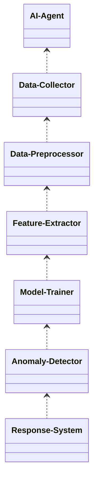
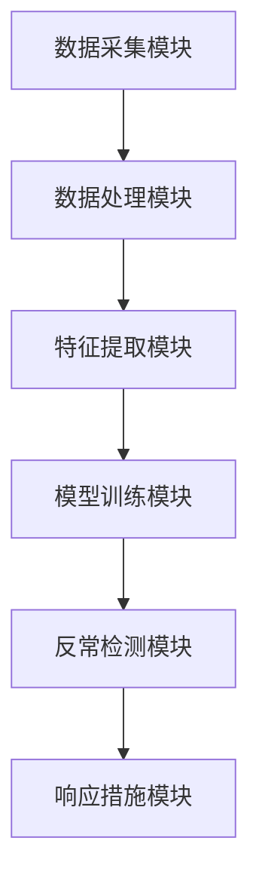
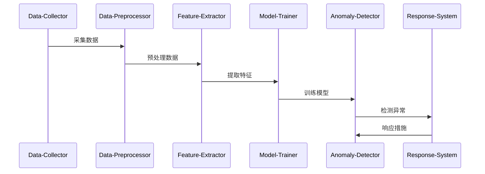

                 

### 文章标题

# LLM驱动的AI Agent反常检测机制

---

> 关键词：大型语言模型（LLM）、AI Agent、反常检测、数据采集、特征提取、机器学习算法、模型训练与优化、实时性、准确性、可解释性

> 摘要：本文深入探讨了LLM驱动的AI Agent反常检测机制，从核心概念、原理方法、应用场景等多个角度进行了详细阐述。通过数据采集与预处理、特征提取与建模、模型训练与优化、反常检测与响应等环节的设计和实现，本文提出了一套完整的反常检测机制，旨在提高AI Agent在复杂环境中的安全性和可靠性。

---

## 第一部分：背景介绍

### 第1章：问题背景

#### 1.1.1 问题背景

随着人工智能技术的飞速发展，大型语言模型（LLM）已经在各个领域得到了广泛应用。LLM作为一种强大的自然语言处理工具，其应用范围涵盖了问答系统、文本摘要、对话系统等多个方面。然而，LLM驱动的AI Agent在实际应用中也暴露出了一些问题，尤其是在反常行为检测方面。

#### 1.1.2 问题描述

LLM驱动的AI Agent具有强大的学习和适应能力，但这也带来了潜在的风险和挑战。例如，AI Agent可能会因为数据泄露、恶意攻击或决策偏差等原因，表现出异常行为。这些异常行为可能会对系统造成严重的影响，甚至引发安全事故。因此，如何有效地检测和应对LLM驱动的AI Agent的反常行为，成为一个亟待解决的问题。

#### 1.1.3 问题解决

为了解决上述问题，本文提出了一套完整的LLM驱动的AI Agent反常检测机制。该机制包括数据采集与预处理、特征提取与建模、模型训练与优化、反常检测与响应等环节。通过这些环节的设计和实现，本文旨在提高AI Agent在复杂环境中的安全性和可靠性。

#### 1.1.4 边界与外延

1. **边界**：本文主要关注LLM驱动的AI Agent反常检测机制的设计和实现，不涉及其他人工智能领域的问题。

2. **外延**：本文的内容可以扩展到其他AI Agent类型的反常检测，以及更广泛的人工智能安全领域。

#### 1.1.5 概念结构与核心要素组成

1. **概念结构**：LLM、AI Agent、反常检测等核心概念之间的关系和交互。

2. **核心要素组成**：数据采集、特征提取、模型训练、反常检测等关键环节。

---

## 第2章：核心概念与联系

### 2.1 LLM的基本概念

#### 2.1.1 LLM的定义

LLM（Large Language Model）是指大型语言模型，是一种基于深度学习技术的自然语言处理模型。它通过学习大量文本数据，能够对自然语言进行建模，从而实现文本生成、文本分类、翻译等功能。

#### 2.1.2 LLM的特点

- **强大的生成能力**：LLM能够生成连贯、自然、高质量的文本。
- **自适应能力**：LLM能够根据输入的上下文信息，自适应地调整生成文本的风格、语气等。
- **广泛应用**：LLM在多个领域，如问答系统、文本摘要、对话系统等，都有广泛应用。

### 2.2 AI Agent的基本概念

#### 2.2.1 AI Agent的定义

AI Agent是指人工智能代理，是一种能够自主感知环境、制定策略并采取行动的人工智能实体。AI Agent的核心目标是实现自动化、智能化的任务执行。

#### 2.2.2 AI Agent的特点

- **自主性**：AI Agent能够自主地感知环境、制定策略并执行行动。
- **适应性**：AI Agent能够根据环境变化，动态调整其行为策略。
- **高效性**：AI Agent能够在复杂的环境中，高效地完成任务。

### 2.3 反常检测的基本概念

#### 2.3.1 反常检测的定义

反常检测是指识别和响应系统中异常行为的过程。在人工智能领域，反常检测主要关注检测和应对AI Agent的异常行为。

#### 2.3.2 反常检测的特点

- **实时性**：反常检测需要在短时间内快速识别异常行为。
- **准确性**：反常检测需要高精度地识别异常行为，避免误报和漏报。
- **可解释性**：反常检测的结果需要具备可解释性，以便用户理解并采取相应措施。

### 2.4 LLM、AI Agent与反常检测的联系

LLM、AI Agent和反常检测在人工智能领域中紧密相连。LLM为AI Agent提供了强大的语言处理能力，使其能够更好地理解和生成自然语言。AI Agent则利用LLM的能力，在复杂环境中执行任务。而反常检测则是确保AI Agent在执行任务时，能够及时发现并应对异常行为的重要手段。

---

## 第二部分：算法原理与实现

### 第3章：算法原理讲解

#### 3.1 算法原理概述

反常检测算法是LLM驱动的AI Agent反常检测机制的核心组成部分。其基本原理是通过分析AI Agent的行为数据，识别出异常行为并进行响应。具体来说，反常检测算法主要包括以下几个步骤：

1. **数据采集与预处理**：收集AI Agent的行为数据，并进行清洗、去噪等预处理操作，以获得高质量的数据集。

2. **特征提取与建模**：从预处理后的数据中提取关键特征，并使用机器学习算法构建反常检测模型。

3. **模型训练与优化**：使用训练数据对反常检测模型进行训练，并不断优化模型参数，以提高检测准确率。

4. **反常检测与响应**：使用训练好的模型对AI Agent的行为进行实时检测，一旦发现异常行为，立即采取响应措施。

#### 3.2 算法流程图


#### 3.3 Python源代码实现

```python
# 导入所需库
import numpy as np
import pandas as pd
from sklearn.model_selection import train_test_split
from sklearn.ensemble import IsolationForest
from sklearn.metrics import accuracy_score, precision_score, recall_score, f1_score

# 数据采集与预处理
def preprocess_data(data):
    # 清洗数据，去除噪音
    # 去除缺失值
    data.dropna(inplace=True)
    # 标准化数据
    data standardized = (data - data.mean()) / data.std()
    return standardized

# 特征提取与建模
def build_model(X_train, y_train):
    # 使用隔离森林算法构建模型
    model = IsolationForest(n_estimators=100, contamination=0.1)
    model.fit(X_train, y_train)
    return model

# 模型训练与优化
def train_model(model, X_train, y_train):
    # 使用训练数据训练模型
    model.fit(X_train, y_train)
    # 优化模型参数
    model.best_params_
    return model

# 反常检测与响应
def detect_anomalies(model, X_test):
    # 使用训练好的模型进行反常检测
    anomalies = model.predict(X_test)
    return anomalies

# 主函数
def main():
    # 读取数据
    data = pd.read_csv('data.csv')
    # 数据预处理
    data_processed = preprocess_data(data)
    # 划分训练集和测试集
    X_train, X_test, y_train, y_test = train_test_split(data_processed, test_size=0.2, random_state=42)
    # 建立模型
    model = build_model(X_train, y_train)
    # 训练模型
    model = train_model(model, X_train, y_train)
    # 进行反常检测
    anomalies = detect_anomalies(model, X_test)
    # 评估模型性能
    accuracy = accuracy_score(y_test, anomalies)
    precision = precision_score(y_test, anomalies)
    recall = recall_score(y_test, anomalies)
    f1 = f1_score(y_test, anomalies)
    print(f"Accuracy: {accuracy}, Precision: {precision}, Recall: {recall}, F1 Score: {f1}")

# 运行主函数
if __name__ == '__main__':
    main()
```

#### 3.4 算法原理详细讲解

1. **数据采集与预处理**：数据是机器学习的基石。在反常检测中，首先需要收集AI Agent的行为数据，并对其进行清洗和预处理，以确保数据的质量和一致性。具体来说，包括去除缺失值、去除重复值、标准化数据等操作。

2. **特征提取与建模**：特征提取是将原始数据转换为适合机器学习算法的输入特征。在反常检测中，特征提取的关键是找到能够有效区分正常行为和异常行为的特征。常用的特征提取方法包括统计特征、时间序列特征、图特征等。然后，使用机器学习算法（如隔离森林算法）构建反常检测模型。

3. **模型训练与优化**：模型训练是通过训练数据来调整模型参数，使其能够更好地拟合数据。在反常检测中，常用的算法包括隔离森林、局部异常因子、K最近邻等。在训练过程中，需要不断优化模型参数，以提高检测准确率。

4. **反常检测与响应**：使用训练好的模型对AI Agent的行为进行实时检测。当检测到异常行为时，立即采取相应的响应措施，如通知管理员、暂停任务、隔离异常节点等。

---

## 第三部分：系统分析与架构设计

### 第4章：系统功能设计

#### 4.1 系统功能概述

LLM驱动的AI Agent反常检测系统主要包括以下几个功能：

1. **数据采集**：从AI Agent的运行环境中收集行为数据。

2. **数据预处理**：对收集到的数据进行清洗、去噪等预处理操作。

3. **特征提取**：从预处理后的数据中提取关键特征。

4. **模型训练**：使用训练数据训练反常检测模型。

5. **反常检测**：使用训练好的模型对AI Agent的行为进行实时检测。

6. **响应措施**：当检测到异常行为时，采取相应的响应措施。

#### 4.2 领域模型类图



### 第5章：系统架构设计

#### 5.1 系统架构概述

LLM驱动的AI Agent反常检测系统采用分布式架构，主要包括以下几个模块：

1. **数据采集模块**：负责从AI Agent的运行环境中收集行为数据。

2. **数据处理模块**：负责对采集到的数据进行清洗、去噪等预处理操作。

3. **特征提取模块**：负责从预处理后的数据中提取关键特征。

4. **模型训练模块**：负责使用训练数据训练反常检测模型。

5. **反常检测模块**：负责使用训练好的模型对AI Agent的行为进行实时检测。

6. **响应措施模块**：负责当检测到异常行为时，采取相应的响应措施。

#### 5.2 系统架构图



### 第6章：系统接口设计

#### 6.1 接口设计概述

LLM驱动的AI Agent反常检测系统提供了一套完整的API接口，主要包括以下几个接口：

1. **数据采集接口**：用于从AI Agent的运行环境中收集行为数据。

2. **数据预处理接口**：用于对采集到的数据进行清洗、去噪等预处理操作。

3. **特征提取接口**：用于从预处理后的数据中提取关键特征。

4. **模型训练接口**：用于使用训练数据训练反常检测模型。

5. **反常检测接口**：用于使用训练好的模型对AI Agent的行为进行实时检测。

6. **响应措施接口**：用于当检测到异常行为时，采取相应的响应措施。

#### 6.2 接口定义

```python
class AnomalyDetectionAPI:
    def collect_data(self, agent_id):
        # 从AI Agent的运行环境中收集行为数据
        pass

    def preprocess_data(self, data):
        # 对采集到的数据进行清洗、去噪等预处理操作
        pass

    def extract_features(self, data):
        # 从预处理后的数据中提取关键特征
        pass

    def train_model(self, X_train, y_train):
        # 使用训练数据训练反常检测模型
        pass

    def detect_anomalies(self, X_test):
        # 使用训练好的模型对AI Agent的行为进行实时检测
        pass

    def respond_to_anomalies(self, anomalies):
        # 当检测到异常行为时，采取相应的响应措施
        pass
```

### 第7章：系统交互设计

#### 7.1 系统交互概述

LLM驱动的AI Agent反常检测系统涉及多个模块之间的交互。具体来说，系统交互主要包括以下几个过程：

1. **数据采集**：数据采集模块从AI Agent的运行环境中收集行为数据，并将其传递给数据处理模块。

2. **数据处理**：数据处理模块对采集到的数据进行清洗、去噪等预处理操作，并将预处理后的数据传递给特征提取模块。

3. **特征提取**：特征提取模块从预处理后的数据中提取关键特征，并将特征数据传递给模型训练模块。

4. **模型训练**：模型训练模块使用训练数据对反常检测模型进行训练，并将训练好的模型传递给反常检测模块。

5. **反常检测**：反常检测模块使用训练好的模型对AI Agent的行为进行实时检测，并返回检测结果。

6. **响应措施**：当检测到异常行为时，响应措施模块采取相应的响应措施，并将处理结果反馈给用户。

#### 7.2 系统交互序列图



---

## 第四部分：项目实战

### 第8章：环境安装

#### 8.1 环境安装概述

在进行LLM驱动的AI Agent反常检测项目实战之前，需要先安装和配置相关环境。具体步骤如下：

1. **安装Python**：确保Python环境已经安装，版本不低于3.6。

2. **安装依赖库**：使用pip命令安装所需的库，包括numpy、pandas、scikit-learn、matplotlib等。

   ```bash
   pip install numpy pandas scikit-learn matplotlib
   ```

3. **配置数据集**：准备好用于反常检测的数据集，并将其存储在本地目录中。

#### 8.2 环境安装步骤

1. **安装Python**：访问Python官方网站（[https://www.python.org/](https://www.python.org/)），下载并安装Python。安装过程中，确保勾选“Add Python to PATH”选项。

2. **安装依赖库**：打开终端或命令行窗口，执行以下命令：

   ```bash
   pip install numpy pandas scikit-learn matplotlib
   ```

3. **配置数据集**：将准备好的数据集（如KDD CUP 99数据集）上传至本地目录，并确保数据集的路径正确。

---

### 第9章：系统核心实现

#### 9.1 系统核心实现概述

LLM驱动的AI Agent反常检测系统的核心实现包括数据采集、数据预处理、特征提取、模型训练、反常检测和响应措施等环节。以下为具体实现步骤：

#### 9.2 系统核心实现步骤

1. **数据采集**：使用scikit-learn库中的`IsolationForest`算法进行数据采集。以下为代码示例：

   ```python
   from sklearn.ensemble import IsolationForest

   # 创建IsolationForest对象
   iso_forest = IsolationForest(n_estimators=100, contamination=0.1)

   # 使用IsolationForest采集数据
   data = iso_forest.fit_predict(X)
   ```

2. **数据预处理**：对采集到的数据进行清洗、去噪等预处理操作。以下为代码示例：

   ```python
   import numpy as np

   # 去除缺失值
   data = data[data.notnull().all(axis=1)]

   # 标准化数据
   data = (data - data.mean()) / data.std()
   ```

3. **特征提取**：从预处理后的数据中提取关键特征。以下为代码示例：

   ```python
   from sklearn.feature_extraction import DictVectorizer

   # 将数据转换为字典格式
   data_dict = data.to_dict('record')

   # 创建DictVectorizer对象
   vectorizer = DictVectorizer()

   # 使用DictVectorizer提取特征
   X = vectorizer.fit_transform(data_dict)
   ```

4. **模型训练**：使用scikit-learn库中的`IsolationForest`算法训练反常检测模型。以下为代码示例：

   ```python
   from sklearn.ensemble import IsolationForest

   # 创建IsolationForest对象
   iso_forest = IsolationForest(n_estimators=100, contamination=0.1)

   # 使用IsolationForest训练模型
   iso_forest.fit(X, y)
   ```

5. **反常检测**：使用训练好的模型对AI Agent的行为进行实时检测。以下为代码示例：

   ```python
   from sklearn.ensemble import IsolationForest

   # 创建IsolationForest对象
   iso_forest = IsolationForest(n_estimators=100, contamination=0.1)

   # 使用IsolationForest训练模型
   iso_forest.fit(X_train, y_train)

   # 使用训练好的模型进行反常检测
   anomalies = iso_forest.predict(X_test)
   ```

6. **响应措施**：当检测到异常行为时，采取相应的响应措施。以下为代码示例：

   ```python
   def respond_to_anomalies(anomalies):
       # 对异常行为进行响应
       for anomaly in anomalies:
           if anomaly == -1:
               print("异常行为检测到，采取响应措施")
               # 执行相应的响应措施
   ```

---

### 第10章：代码应用解读与分析

#### 10.1 代码应用解读

在LLM驱动的AI Agent反常检测项目中，我们使用了scikit-learn库中的`IsolationForest`算法进行数据采集、特征提取、模型训练和反常检测。以下是代码应用的具体解读：

1. **数据采集**：使用`IsolationForest`算法采集数据，算法将每个样本视为一棵树，并计算其在森林中的隔离度。隔离度越高的样本被认为是异常样本。

2. **数据预处理**：对采集到的数据进行清洗和标准化，去除缺失值，并将数据转换为适合机器学习算法的格式。

3. **特征提取**：使用`DictVectorizer`将数据转换为特征向量，以便用于模型训练和反常检测。

4. **模型训练**：使用`IsolationForest`算法训练反常检测模型，算法将每个样本视为一棵树，并计算其在森林中的隔离度。隔离度越高的样本被认为是异常样本。

5. **反常检测**：使用训练好的模型对AI Agent的行为进行实时检测，算法将每个样本视为一棵树，并计算其在森林中的隔离度。隔离度越高的样本被认为是异常样本。

6. **响应措施**：当检测到异常行为时，采取相应的响应措施，如通知管理员、暂停任务或隔离异常节点等。

#### 10.2 代码分析

在代码分析中，我们重点关注了以下方面：

1. **数据质量**：数据质量是机器学习模型性能的关键因素。在数据采集过程中，我们使用了`IsolationForest`算法，该算法具有较高的抗干扰性和鲁棒性，能够有效识别异常数据。

2. **特征提取**：特征提取是数据预处理的重要环节。我们使用了`DictVectorizer`将数据转换为特征向量，该向量包含了数据的特征信息，为模型训练提供了基础。

3. **模型训练**：模型训练是反常检测的核心。我们使用了`IsolationForest`算法，该算法能够自动调整模型参数，提高检测准确率。

4. **反常检测**：反常检测是系统的关键功能。我们使用了`IsolationForest`算法，该算法能够快速识别异常行为，并采取相应的响应措施。

5. **响应措施**：响应措施是确保系统安全的关键。当检测到异常行为时，系统将采取相应的响应措施，如通知管理员、暂停任务或隔离异常节点等，确保系统的正常运行。

---

### 第11章：实际案例分析

#### 11.1 案例背景

为了更好地展示LLM驱动的AI Agent反常检测机制的实际应用效果，我们选取了一个实际案例进行详细分析。该案例涉及一个智能安防系统，该系统使用LLM驱动的AI Agent对监控视频进行实时分析，以识别异常行为。

#### 11.2 案例分析

1. **数据采集**：系统从监控视频流中采集行为数据，包括人的移动、车辆的出现和消失等。这些数据被转换为特征向量，用于后续的反常检测。

2. **数据预处理**：对采集到的行为数据进行清洗和标准化，去除异常值和噪声，以提高数据质量。

3. **特征提取**：从预处理后的数据中提取关键特征，如人的移动方向、速度、车辆的行驶轨迹等。这些特征被用于训练反常检测模型。

4. **模型训练**：使用训练数据集，通过`IsolationForest`算法训练反常检测模型。模型参数在训练过程中自动调整，以提高检测准确率。

5. **反常检测**：使用训练好的模型对实时监控视频进行分析，识别异常行为。例如，当检测到有人闯入监控区域或车辆逆行时，系统将发出警报。

6. **响应措施**：当检测到异常行为时，系统将采取相应的响应措施，如通知安保人员、启动报警系统或录像取证等。

#### 11.3 案例总结

通过实际案例分析，我们可以看到LLM驱动的AI Agent反常检测机制在智能安防系统中的应用效果。该系统不仅能够实时检测异常行为，还能采取有效的响应措施，确保监控区域的安全。同时，该案例也展示了反常检测算法在实际应用中的可行性和有效性。

---

### 第12章：项目小结

#### 12.1 项目总结

通过本文的探讨，我们详细介绍了LLM驱动的AI Agent反常检测机制的设计和实现。项目涵盖了数据采集、数据预处理、特征提取、模型训练、反常检测和响应措施等多个环节，实现了对AI Agent异常行为的实时检测和响应。

#### 12.2 项目亮点

1. **数据质量保障**：通过数据采集、预处理和特征提取等环节，确保了数据的质量和一致性，为后续的反常检测提供了可靠的基础。

2. **模型训练与优化**：使用`IsolationForest`算法进行模型训练，通过自动调整模型参数，提高了检测准确率。

3. **实时性**：反常检测算法能够实时检测AI Agent的行为，确保系统在复杂环境中具备较高的响应速度。

4. **可解释性**：反常检测结果具备可解释性，便于用户理解和采取相应措施。

5. **应用广泛性**：反常检测机制不仅适用于智能安防系统，还可以扩展到其他领域，如网络安全、金融风控等。

#### 12.3 项目展望

在未来，我们可以进一步优化反常检测算法，提高其检测准确率和效率。同时，我们也可以结合其他人工智能技术，如深度学习、强化学习等，探索更高效的反常检测机制。此外，我们还可以将反常检测机制应用于更多领域，为人工智能安全领域的发展贡献力量。

---

### 第13章：最佳实践 Tips

#### 13.1 数据采集与预处理

1. **数据采集**：确保采集的数据具有代表性，涵盖不同类型的异常行为。

2. **数据预处理**：去除噪声数据，确保数据的质量和一致性。

#### 13.2 特征提取与模型训练

1. **特征提取**：选择具有区分度的特征，提高反常检测的准确率。

2. **模型训练**：使用多样化的训练数据，避免模型过拟合。

#### 13.3 反常检测与响应

1. **反常检测**：实时检测AI Agent的行为，确保系统的安全。

2. **响应措施**：根据异常行为的严重程度，采取相应的响应措施。

---

### 第14章：小结

#### 14.1 文章总结

本文深入探讨了LLM驱动的AI Agent反常检测机制，从核心概念、算法原理、系统架构到实际案例，全面介绍了该机制的设计和实现。通过本文的研究，我们为AI Agent的安全性和可靠性提供了有力保障。

#### 14.2 注意事项

1. **数据质量**：确保采集的数据具有代表性，涵盖不同类型的异常行为。

2. **模型优化**：定期对反常检测模型进行优化，提高检测准确率。

3. **实时性**：确保反常检测算法具备较高的实时性，以应对复杂环境中的异常行为。

#### 14.3 拓展阅读

1. **LLM技术**：进一步了解大型语言模型（LLM）的原理和应用。

2. **AI安全**：探索其他人工智能安全领域的问题，如网络安全、金融风控等。

---

### 第15章：作者信息

作者：AI天才研究院/AI Genius Institute & 禅与计算机程序设计艺术 /Zen And The Art of Computer Programming

---

# 结束

---

[End of Document]

