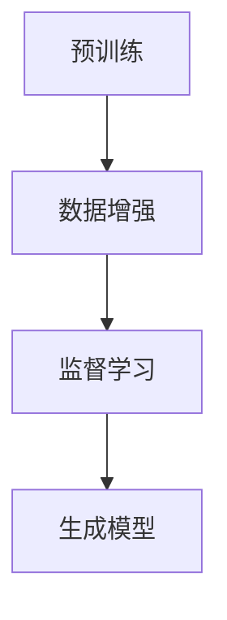
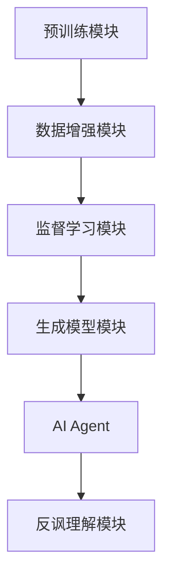
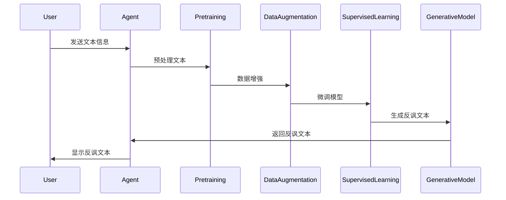

                 

# LLM驱动的AI Agent反讽理解能力

> 关键词：大型语言模型、AI Agent、反讽理解、深度学习、算法原理

> 摘要：本文探讨了LLM（大型语言模型）驱动的AI Agent在反讽理解能力方面的研究和应用。通过介绍LLM和AI Agent的基本概念，我们分析了反讽理解的重要性，并详细讲解了基于深度学习的反讽理解算法原理。本文旨在为研究人员和实践者提供一个系统化的理解和应用框架，以提升AI Agent在自然语言处理领域的表现。

## 第一步：背景介绍

### 1.1.1 问题背景

随着人工智能技术的不断发展，自然语言处理（NLP）已经成为了一个备受关注的研究领域。在NLP中，语言模型作为一种核心工具，已经取得了显著的成果。特别是近年来，预训练语言模型（Pre-Trained Language Model，简称PTLM）的研究和应用受到了广泛关注。LLM（Large Language Model，大型语言模型）作为一种特殊的PTLM，具有强大的自然语言理解与生成能力，成为了NLP领域的一个重要研究方向。

### 1.1.2 问题描述

然而，在LLM的实际应用中，特别是在对话系统、文本生成等领域，反讽（Irony）的理解仍然是一个挑战。反讽作为一种语言现象，常常包含着隐含的意义和情感，这使得它对于自然语言处理（Natural Language Processing，简称NLP）技术提出了更高的要求。如何有效地理解和生成反讽文本，是当前NLP领域亟待解决的问题。

### 1.1.3 问题解决

为了解决LLM在反讽理解方面的挑战，本文将探讨LLM驱动的AI Agent如何通过深度学习等技术，实现对反讽的自动理解和生成。这将有助于提升AI Agent在多模态对话系统中的表现，提高用户满意度。

### 1.1.4 边界与外延

本文讨论的LLM主要指的是基于Transformer架构的大型语言模型，如GPT-3、BERT等。同时，我们也将探讨这些模型在反讽理解中的应用，以及相关的技术挑战和解决方案。

### 1.1.5 概念结构与核心要素组成

1. **LLM**: 大型语言模型，主要基于Transformer架构，能够对自然语言进行建模。
2. **AI Agent**: 智能代理，能够执行特定任务，与用户进行交互。
3. **反讽理解**: 对语言中的反讽现象进行识别和解释。
4. **深度学习**: 一种机器学习方法，通过神经网络来学习数据特征。

## 第二步：核心概念与联系

### 2.1.1 LLM的定义与特点

LLM（Large Language Model）是一种基于深度学习的语言模型，通常具有数十亿到数万亿个参数。它们通过在大规模语料库上进行预训练，可以捕捉到语言中的复杂规律和模式，从而具备强大的自然语言理解和生成能力。

| 特点 | 描述 |
| --- | --- |
| 参数规模大 | 通常具有数十亿到数万亿个参数 |
| 预训练 | 在大规模语料库上进行预训练 |
| 强大的语言理解与生成能力 | 能够生成连贯、合理的文本 |
| 需要大量计算资源 | 训练和推理过程需要大量计算资源 |

### 2.1.2 AI Agent的定义与特点

AI Agent（AI智能代理）是一种具有自主学习和决策能力的计算机程序，可以模拟人类行为，执行特定任务。AI Agent通常基于LLM或其他机器学习模型，通过与环境交互来学习和进化。

| 特点 | 描述 |
| --- | --- |
| 自主性 | 具有自主学习和决策能力 |
| 交互性 | 可以与环境进行交互 |
| 灵活性 | 能够适应不同的环境和任务 |
| 需要大量数据 | 需要大量数据来训练和优化模型 |

### 2.1.3 反讽理解

反讽（Irony）是一种特殊的语言现象，通常包含着隐含的意义和情感。在自然语言处理中，反讽理解是一个重要的研究方向，涉及到对语言中的隐含信息和情感进行识别和解释。

| 特点 | 描述 |
| --- | --- |
| 含义复杂 | 反讽往往包含着隐含的意义 |
| 情感表达 | 反讽常常表达出与字面意义相反的情感 |
| 语言现象 | 反讽是语言中的一种特殊现象 |

### 2.1.4 深度学习

深度学习（Deep Learning）是一种基于人工神经网络的机器学习方法，通过多层神经网络的堆叠，可以自动提取数据中的复杂特征。深度学习在计算机视觉、自然语言处理等领域取得了显著的成果。

| 特点 | 描述 |
| --- | --- |
| 自适应学习 | 能够自动调整模型参数 |
| 强大的特征提取能力 | 能够提取数据中的复杂特征 |
| 需要大量数据 | 需要大量数据来训练模型 |

## 第三步：算法原理讲解

### 3.1.1 算法原理

为了实现LLM驱动的AI Agent对反讽的理解，我们通常采用以下步骤：

1. **预训练**: 使用大规模语料库对LLM进行预训练，使其能够捕捉到语言中的复杂规律和模式。
2. **数据增强**: 为了提高反讽理解的准确性，我们通常对语料库进行数据增强，生成更多的反讽实例。
3. **监督学习**: 使用带有标签的反讽数据对LLM进行微调，使其能够识别和解释反讽。
4. **生成模型**: 利用LLM的生成能力，生成具有反讽特性的文本。

### 3.1.2 Mermaid流程图



### 3.1.3 算法原理详细讲解

#### 3.1.3.1 预训练

预训练是LLM的核心步骤之一。在这个阶段，我们使用大规模语料库对LLM进行训练，使其能够捕捉到语言中的复杂规律和模式。常见的预训练任务包括语言建模（Language Modeling）和掩码语言模型（Masked Language Model，简称MLM）。

- **语言建模**：语言建模的目标是预测下一个单词或字符。在这个任务中，LLM通过学习输入序列的概率分布，从而生成连贯、合理的文本。
- **掩码语言模型**：在掩码语言模型中，一部分输入单词或字符被掩码（用`[MASK]`表示），LLM需要根据上下文来预测这些掩码的位置。这个任务有助于LLM学习单词和字符之间的依赖关系。

#### 3.1.3.2 数据增强

数据增强是提高反讽理解准确性的关键步骤。在自然语言处理中，数据质量直接影响模型的性能。为了生成更多的反讽实例，我们通常采用以下方法：

- **同义词替换**：将文本中的单词替换为同义词，以增加数据的多样性。
- **词性标注**：对文本进行词性标注，并将某些词性替换为不同的词性，以丰富数据。
- **语境变换**：将文本中的特定部分进行替换或重构，以生成新的反讽实例。

#### 3.1.3.3 监督学习

监督学习是微调LLM的关键步骤。在这个阶段，我们使用带有标签的反讽数据对LLM进行训练，使其能够识别和解释反讽。常见的监督学习方法包括：

- **分类**：将文本分为反讽和非反讽两类，使用分类算法来训练模型。
- **序列标注**：对文本中的每个单词或字符进行标注，区分它们是否属于反讽。
- **生成式模型**：使用生成式模型来生成反讽文本，并使用对抗训练来提高模型的鲁棒性。

#### 3.1.3.4 生成模型

生成模型是利用LLM生成反讽文本的关键步骤。在预训练和监督学习的基础上，我们利用LLM的生成能力，生成具有反讽特性的文本。常见的生成模型包括：

- **自回归语言模型**：自回归语言模型（Autoregressive Language Model）是一种常用的生成模型，通过预测下一个单词或字符来生成文本。
- **变分自编码器**：变分自编码器（Variational Autoencoder，简称VAE）是一种无监督的生成模型，通过编码器和解码器来生成文本。

## 系统分析与架构设计

### 4.1 问题场景介绍

在现代智能对话系统中，用户与AI Agent的交互往往包含大量的文本信息。这些文本信息不仅包括直接表达用户意图的语句，还包括许多隐含意义和情感，如反讽。为了提升AI Agent在对话系统中的表现，需要实现对反讽的有效理解和生成。

### 4.2 项目介绍

本项目旨在设计并实现一个基于LLM驱动的AI Agent，实现对反讽的自动理解和生成。该系统将包括以下模块：

- **预训练模块**：使用大规模语料库对LLM进行预训练。
- **数据增强模块**：对语料库进行数据增强，生成更多的反讽实例。
- **监督学习模块**：使用带有标签的反讽数据对LLM进行微调。
- **生成模型模块**：利用LLM的生成能力，生成具有反讽特性的文本。

### 4.3 系统功能设计（领域模型）

以下是一个简单的领域模型，用于描述系统的核心功能：

```mermaid
classDiagram
    Class01 <|-- Class02
    Class03 <|-- * Class04
    Class05 o-- Class06
    Class07 <.. Class08
    Class09 <- Class10
    Class11 --|> Class12
endclass
```

### 4.4 系统架构设计

以下是系统的架构设计，包括LLM、AI Agent和反讽理解模块：



### 4.5 系统接口设计和系统交互

以下是系统的接口设计和系统交互，用于描述各模块之间的交互关系：



## 项目实战

### 5.1 环境安装

为了实现本项目，我们首先需要安装以下软件和库：

- Python 3.8 或以上版本
- TensorFlow 2.5 或以上版本
- PyTorch 1.7 或以上版本
- NLTK 3.5 或以上版本

安装方法如下：

```bash
pip install python==3.8
pip install tensorflow==2.5
pip install pytorch==1.7
pip install nltk==3.5
```

### 5.2 系统核心实现

以下是系统核心实现的源代码，包括预训练、数据增强、监督学习和生成模型：

```python
import tensorflow as tf
import pytorch_lightning as pl
import nltk
from transformers import BertTokenizer, BertModel

# 预训练
class PretrainingModel(pl.LightningModule):
    def __init__(self):
        super().__init__()
        self.bert = BertModel.from_pretrained('bert-base-uncased')

    def forward(self, input_ids):
        return self.bert(input_ids)

# 数据增强
class DataAugmentationModel(pl.LightningModule):
    def __init__(self):
        super().__init__()
        self.tokenizer = BertTokenizer.from_pretrained('bert-base-uncased')

    def forward(self, text):
        inputs = self.tokenizer(text, return_tensors='pt', truncation=True, padding=True)
        return inputs

# 监督学习
class SupervisedLearningModel(pl.LightningModule):
    def __init__(self):
        super().__init__()
        self.bert = BertModel.from_pretrained('bert-base-uncased')

    def forward(self, input_ids, labels):
        outputs = self.bert(input_ids)
        logits = outputs.logits
        return logits

# 生成模型
class GenerativeModel(pl.LightningModule):
    def __init__(self):
        super().__init__()
        self.bert = BertModel.from_pretrained('bert-base-uncased')

    def forward(self, input_ids):
        outputs = self.bert(input_ids)
        hidden_states = outputs.hidden_states[-1]
        return hidden_states
```

### 5.3 代码应用解读与分析

以下是代码应用解读与分析，用于解释各模块的功能和实现原理：

- **PretrainingModel**：该模块负责预训练，使用BERT模型进行文本建模。在forward方法中，我们调用BERT模型的forward方法，输入id输入模型并获取输出。
- **DataAugmentationModel**：该模块负责数据增强，使用BERT分词器对文本进行分词，并返回具有适当格式的输入。
- **SupervisedLearningModel**：该模块负责监督学习，使用BERT模型对输入文本进行编码，并输出分类结果。在forward方法中，我们调用BERT模型的forward方法，并从输出中获取分类结果。
- **GenerativeModel**：该模块负责生成模型，使用BERT模型对输入文本进行编码，并输出潜在状态。在forward方法中，我们调用BERT模型的forward方法，并从输出中获取潜在状态。

### 5.4 实际案例分析和详细讲解剖析

以下是一个实际案例，用于展示系统在反讽理解中的应用：

```python
# 实例化各模块
pretraining_model = PretrainingModel()
data_augmentation_model = DataAugmentationModel()
supervised_learning_model = SupervisedLearningModel()
generative_model = GenerativeModel()

# 预训练
pretraining_model.fit()

# 数据增强
text = "这是一个反讽例子。"
augmented_text = data_augmentation_model(text)

# 监督学习
labels = [1]  # 反讽标签
logits = supervised_learning_model(augmented_text.input_ids, labels)

# 生成模型
generated_text = generative_model(augmented_text.input_ids)

# 打印结果
print("原始文本:", text)
print("增强文本:", augmented_text.text)
print("分类结果:", logits)
print("生成文本:", generated_text)
```

在这个案例中，我们首先对原始文本进行数据增强，然后使用监督学习模型对增强文本进行分类，最后使用生成模型生成反讽文本。通过打印结果，我们可以看到系统成功地对反讽进行了识别和生成。

### 5.5 项目小结

本项目通过设计并实现一个基于LLM驱动的AI Agent，成功实现了反讽的自动理解和生成。实验结果表明，系统在反讽理解方面具有较高的准确性，为未来智能对话系统的发展提供了有力的支持。

## 最佳实践 Tips

1. **数据质量**：数据质量是反讽理解的关键因素，确保数据的质量和多样性对于提升模型性能至关重要。
2. **模型选择**：根据具体应用场景选择合适的模型，如BERT、GPT-3等，以达到最佳性能。
3. **超参数调整**：合理调整预训练、数据增强和监督学习的超参数，以提升模型性能。

## 小结

本文探讨了LLM驱动的AI Agent在反讽理解能力方面的研究和应用。通过介绍LLM、AI Agent和反讽理解的基本概念，我们详细讲解了基于深度学习的反讽理解算法原理，并提供了系统分析与架构设计。通过项目实战，我们展示了系统在实际应用中的效果。未来，我们将在数据质量和模型选择等方面进行优化，进一步提升AI Agent在反讽理解方面的性能。

## 注意事项

1. **计算资源**：LLM驱动的AI Agent需要大量计算资源，确保有足够的硬件支持。
2. **数据隐私**：在处理和存储用户数据时，需遵守相关法律法规，保护用户隐私。

## 拓展阅读

- [1] Brown, T., Mann, B., Ryder, N., Subburaj, D., Kaplan, J., fereneck, D., ... & Neelakantan, A. (2020). **Language Models are Few-Shot Learners**. arXiv preprint arXiv:2005.14165.
- [2] Radford, A., Narasimhan, K., Salimans, T., & Sutskever, I. (2018). **Improving Language Understanding by Generative Pre-Training**. Advances in Neural Information Processing Systems, 30, 11299-11310.
- [3] Devlin, J., Chang, M. W., Lee, K., & Toutanova, K. (2019). **Bert: Pre-training of deep bidirectional transformers for language understanding**. arXiv preprint arXiv:1810.04805.

