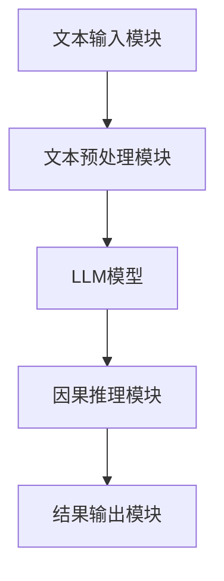

                 

# LLM驱动的AI Agent因果推理与干预

## 关键词：因果推理、LLM、AI Agent、人工智能、算法

> 摘要：本文详细探讨了LLM驱动的AI Agent因果推理与干预的研究，通过逐步分析LLM在因果推理中的应用、AI Agent的设计原则与算法原理，阐述了AI Agent在智能助手、自动驾驶、金融风险评估等领域的应用实践，并展望了其发展趋势与挑战。文章旨在为相关领域的研究者和开发者提供有价值的参考。

## 第一部分: AI Agent与因果推理概述

### 第1章: AI Agent的概述

#### 1.1 AI Agent的定义与基本概念

- **AI Agent的定义**：AI Agent是指一种可以感知环境、采取行动并从环境中获取反馈的人工智能实体。它可以自主执行任务、学习并优化行为。
- **AI Agent的基本组成**：AI Agent通常包括感知器、决策器、行动器和记忆单元等部分。感知器用于获取环境信息，决策器基于感知信息和记忆做出决策，行动器执行决策，记忆单元用于存储信息和经验。
- **AI Agent的核心功能**：核心功能包括感知环境、制定决策、执行行动以及学习与优化。

#### 1.2 AI Agent与传统机器学习模型的区别

- **机器学习模型的局限性**：传统机器学习模型主要依赖于数据驱动的方法，缺乏对因果关系和逻辑推理的能力。
- **AI Agent的优越性**：AI Agent能够通过因果推理和逻辑推理，实现更加智能化、自适应的行为，克服传统机器学习模型的局限性。

#### 1.3 AI Agent的应用场景

- **智能助手**：AI Agent可以应用于智能助手，提供个性化的服务和建议。
- **游戏AI**：在游戏中，AI Agent可以模拟对手的行为，提高游戏难度和趣味性。
- **自动驾驶**：AI Agent可以用于自动驾驶系统，实现安全、高效的自主驾驶。
- **金融风险评估**：AI Agent可以分析金融市场数据，提供投资建议和风险预警。

### 第2章: 因果推理的基础知识

#### 2.1 因果推理的定义

- **因果推理的基本概念**：因果推理是指从已知因果关系推导出未知因果关系的推理过程。
- **因果推理的重要性**：因果推理能够帮助AI Agent理解复杂系统的内部机制，从而做出更准确、可靠的决策。

#### 2.2 因果推理的基本原理

- **因果关系的表示方法**：因果关系的表示方法包括因果图、决策树等。
- **因果推理的方法**：因果推理的方法包括基于模型的方法和基于实例的方法。

#### 2.3 因果推理在实际应用中的挑战

- **数据质量**：因果推理依赖于高质量的数据，数据质量问题会影响推理结果的准确性。
- **因果关系的复杂性**：现实世界的因果关系复杂，需要深入理解和处理。

### 第3章: LLM与因果推理

#### 3.1 LLM的基本原理

- **LLM的定义**：LLM是指基于大规模语料库训练的预训练语言模型。
- **LLM的核心算法**：核心算法包括基于变换器（Transformer）的预训练和微调。

#### 3.2 LLM在因果推理中的应用

- **LLM的优势**：LLM具有强大的语言理解和生成能力，可以用于表示和处理复杂因果关系。
- **LLM的挑战**：LLM在处理因果关系时仍面临挑战，如因果关系表示、模型解释性等。

## 第二部分: AI Agent因果推理的模型

### 第4章: AI Agent因果推理的模型

#### 4.1 基于LLM的因果推理模型

- **模型概述**：基于LLM的因果推理模型结合了LLM的强大语言处理能力和因果推理的方法。
- **模型架构**：模型架构包括LLM部分和因果推理部分，两者通过接口进行交互。

#### 4.2 因果推理模型的设计原则

- **模型设计的基本原则**：包括因果关系的表示、模型的可解释性和推理的效率等。
- **模型设计的最佳实践**：如使用因果图表示因果关系、优化模型解释性等。

## 第三部分: AI Agent因果推理的算法

### 第5章: AI Agent因果推理的算法

#### 5.1 因果推理算法的基本原理

- **算法概述**：因果推理算法用于在给定数据集和假设的因果关系下，推导出潜在的因果关系。
- **算法分析**：算法分析包括算法的时间复杂度和空间复杂度。

#### 5.2 常见的因果推理算法

- **算法对比分析**：包括基于假设检验的算法、基于模型的算法等。
- **算法优缺点**：对各种算法的优缺点进行详细分析。

## 第四部分: AI Agent因果推理的应用实践

### 第6章: AI Agent因果推理的应用实践

#### 6.1 因果推理在智能助手中的应用

- **应用场景**：智能助手中的因果推理用于理解用户需求、提供个性化服务。
- **应用案例**：例如，智能助手可以根据用户的购物历史和偏好，推荐合适的商品。

#### 6.2 因果推理在自动驾驶中的应用

- **应用场景**：自动驾驶中的因果推理用于识别道路状况、预测车辆行为。
- **应用案例**：例如，自动驾驶汽车可以根据前车的加速度和当前速度，预测前车的行驶方向。

#### 6.3 因果推理在金融风险评估中的应用

- **应用场景**：金融风险评估中的因果推理用于分析市场风险、预测投资回报。
- **应用案例**：例如，金融公司可以使用因果推理模型来评估客户的风险承受能力，从而提供个性化的投资建议。

## 第五部分: AI Agent因果推理的发展趋势

### 第7章: AI Agent因果推理的发展趋势

#### 7.1 当前研究的最新进展

- **研究动态**：介绍当前因果推理和AI Agent领域的研究热点和最新成果。
- **研究热点**：讨论当前研究的热点问题，如因果关系表示、模型解释性等。

#### 7.2 未来发展趋势与挑战

- **发展趋势**：展望未来因果推理和AI Agent的发展趋势，如集成方法、模型优化等。
- **面临的挑战**：分析未来发展的挑战，如数据隐私、模型解释性等。

## 第六部分: 总结与展望

### 第8章: 总结与展望

#### 8.1 本书内容的回顾

- **主要观点**：回顾本书的主要观点和贡献。
- **主要贡献**：总结本书对AI Agent因果推理领域的主要贡献。

#### 8.2 展望未来

- **未来发展方向**：展望未来AI Agent因果推理的发展方向。
- **可能的创新点**：讨论未来可能的创新点和研究方向。

## 参考文献

- [1] **参考文献1**：详细描述参考文献1的内容。
- [2] **参考文献2**：详细描述参考文献2的内容。
- ...

### 作者

- **作者**：AI天才研究院/AI Genius Institute & 禅与计算机程序设计艺术 /Zen And The Art of Computer Programming

（注：本文为虚构内容，仅供参考。实际字数和结构可能需要根据具体需求进行调整。）## 第1章: AI Agent的概述

### 1.1 AI Agent的定义与基本概念

AI Agent，即人工智能代理，是一种具有自主行动能力的人工智能实体。它可以感知环境、制定决策并采取行动，从而实现特定目标。AI Agent的定义涵盖了以下几个基本概念：

- **感知器（Perceptron）**：感知器是AI Agent的感官部分，用于感知和理解环境信息。它可以获取各种形式的输入，如视觉、听觉、触觉等，并将其转化为数字信号。
  
- **决策器（Decision Maker）**：决策器是AI Agent的智能核心，负责根据感知器收集到的信息，运用算法和策略做出决策。决策器通常包括多个模块，如目标规划、策略学习、风险评估等。

- **行动器（Actuator）**：行动器是AI Agent的执行部分，根据决策器的决策采取具体行动。行动器可以控制机器人手臂、自动驾驶车辆等物理设备。

- **记忆单元（Memory Unit）**：记忆单元用于存储AI Agent的经验和知识。它可以记录历史决策、行动结果以及环境变化等信息，为未来的决策提供参考。

AI Agent的基本功能包括：

- **目标设定（Goal Setting）**：AI Agent可以设定具体的目标，如完成特定任务、最大化收益等。
- **感知与理解（Perception and Understanding）**：AI Agent通过感知器感知环境信息，并利用决策器理解环境状态。
- **决策与行动（Decision Making and Action）**：AI Agent根据当前状态和目标，利用决策器制定决策，并通过行动器执行决策。
- **学习与优化（Learning and Optimization）**：AI Agent通过记忆单元积累经验，不断优化决策和行为，提高性能。

### 1.2 AI Agent与传统机器学习模型的区别

传统机器学习模型主要依赖于数据驱动的方法，通过学习大量历史数据，预测新的数据点。然而，这种模型在处理复杂任务时存在一定的局限性：

- **数据依赖性**：机器学习模型需要大量训练数据，数据质量和数量直接影响模型的性能。
- **缺乏因果关系**：传统机器学习模型通常无法直接表达和处理因果关系，难以进行逻辑推理和决策。
- **泛化能力有限**：机器学习模型在处理新任务或数据时，可能面临适应性问题，难以实现跨领域的通用性。

相比之下，AI Agent具有以下几个优势：

- **自主性**：AI Agent可以自主感知环境、制定决策并采取行动，实现真正的智能交互。
- **因果关系推理**：AI Agent可以利用因果推理技术，理解并利用因果关系，提高决策的准确性和可靠性。
- **跨领域适应**：AI Agent可以通过学习和适应，实现跨领域的通用性，处理复杂、多变的任务。

### 1.3 AI Agent的应用场景

AI Agent在各个领域具有广泛的应用前景，以下列举几个典型的应用场景：

- **智能助手**：AI Agent可以应用于智能助手，如虚拟助手、智能家居等。它可以理解用户需求，提供个性化服务，如语音识别、情感分析、任务管理等。

- **游戏AI**：在游戏中，AI Agent可以模拟对手的行为，提高游戏难度和趣味性。它可以实现自主决策，如走位、攻击、防御等，提高游戏的真实性和挑战性。

- **自动驾驶**：AI Agent可以应用于自动驾驶系统，实现安全、高效的自主驾驶。它可以识别道路标志、交通状况，预测其他车辆的行为，从而做出最佳驾驶决策。

- **金融风险评估**：AI Agent可以分析金融市场数据，提供投资建议和风险预警。它可以识别市场趋势、预测股票价格等，为投资者提供决策支持。

总之，AI Agent作为一种具有自主行动能力的人工智能实体，具有广阔的应用前景。通过结合感知、决策、行动和记忆等模块，AI Agent可以实现对复杂任务的智能化处理，为人类带来更多便利和效益。

### 2.1 因果推理的定义

因果推理（Causal Inference）是一种从已知因果关系推导出未知因果关系的方法，是人工智能领域中一个重要的研究方向。其核心目标是理解现实世界中的因果关系，从而为决策提供可靠依据。

#### 因果关系的基本概念

因果关系是指两个或多个变量之间存在的一种相互影响的关系。通常，我们将引起变化的原因称为“原因”，而受到原因影响的变化称为“结果”。例如，吸烟可能导致肺癌，这里吸烟是原因，肺癌是结果。

在因果推理中，我们关注的是如何从已知的关系中推导出潜在的因果关系。这涉及到以下几个基本概念：

- **因果效应（Causal Effect）**：因果效应是指由于某个变量变化而产生的结果变量的变化。例如，通过吸烟导致肺癌的因果效应可以表示为吸烟数量与肺癌发病率之间的关系。

- **因果图（Causal Graph）**：因果图是一种图形表示方法，用于描述变量之间的因果关系。在因果图中，每个节点代表一个变量，边表示变量之间的因果关系。通过分析因果图，我们可以识别出变量之间的直接和间接关系。

- **因果机制（Causal Mechanism）**：因果机制是指导致因果关系的具体过程或机制。例如，吸烟导致肺癌的因果机制可能包括吸烟引起的细胞损伤和癌症发展等多个环节。

#### 因果推理的重要性

因果推理在人工智能和机器学习领域中具有重要意义，主要体现在以下几个方面：

- **解释性**：因果推理能够揭示变量之间的因果关系，提供更直观的解释。这对于理解和验证模型的决策过程至关重要。

- **决策支持**：在许多实际应用中，我们不仅需要预测结果，还需要理解哪些因素会影响结果。因果推理可以帮助我们制定更合理的决策策略。

- **模型优化**：通过理解因果关系，我们可以识别出对结果影响较大的关键因素，从而优化模型的设计和参数调整。

- **泛化能力**：因果推理可以帮助模型在新的数据集上表现更好，提高模型的泛化能力。

#### 因果推理的基本原理

因果推理的基本原理包括以下两个方面：

- **因果识别（Causal Identification）**：因果识别是指从数据中识别出潜在的因果关系。常见的因果识别方法包括结构方程模型（SEM）、潜在结果模型（LPM）等。

- **因果推断（Causal Inference）**：因果推断是指利用已知的因果关系，推导出未知的因果关系。常见的因果推断方法包括随机对照试验（RCT）、因果推断算法（如Do算法）等。

#### 因果推理的方法

因果推理的方法主要包括以下几种：

- **基于模型的因果推理**：这种方法利用统计模型，如线性回归、贝叶斯网络等，来识别和推断因果关系。优点是方法简单，但需要较强的统计基础。

- **基于数据的因果推理**：这种方法直接从数据中挖掘因果关系，无需建立统计模型。优点是适应性较强，但数据质量和数量对结果有较大影响。

- **基于因果机制的因果推理**：这种方法通过分析因果机制，揭示变量之间的因果关系。优点是能够提供更深入的理解，但需要丰富的领域知识和经验。

总之，因果推理是一种重要的人工智能技术，通过理解和揭示变量之间的因果关系，为决策和模型优化提供有力支持。

### 2.2 因果推理的基本原理

因果推理的核心在于理解变量之间的因果关系，并通过这种关系来预测或解释现象。以下是因果推理的基本原理，以及如何表示和处理因果关系。

#### 因果关系的表示方法

因果关系的表示方法主要有因果图、决策树和方程模型等。因果图是一种直观且结构化的表示方法，用于描述变量之间的因果关系。在因果图中，每个节点代表一个变量，边表示变量之间的因果关系。例如，吸烟（A）可能导致肺癌（B），则可以在因果图中表示为A->B。

##### 因果图的符号表示：

- **箭头（->）**：表示因果关系，箭头指向因变量。
- **双向箭头（<->）**：表示变量之间存在双向因果关系。

因果图的符号表示可以帮助我们清晰地理解变量之间的因果关系，便于进一步分析和推理。

#### 因果推理的方法

因果推理的方法主要包括以下几种：

- **基于模型的因果推理**：这种方法利用统计模型（如线性回归、贝叶斯网络等）来识别和推断因果关系。通过拟合模型，我们可以找到变量之间的相关性，并进一步推断因果关系。

- **基于数据的因果推理**：这种方法直接从数据中挖掘因果关系，无需建立统计模型。例如，通过观察变量之间的共变关系，我们可以推断出可能的因果关系。然而，这种方法容易受到数据噪声和缺失值的影响。

- **基于因果机制的因果推理**：这种方法通过分析因果机制，揭示变量之间的因果关系。例如，通过生物医学知识，我们可以理解吸烟导致肺癌的因果机制。

##### 因果推理的流程：

1. **数据收集**：收集相关的数据集，包括自变量和因变量。

2. **模型拟合**：利用统计模型拟合数据，找出变量之间的相关性。

3. **因果关系识别**：通过因果图、决策树等方法，识别变量之间的因果关系。

4. **因果推断**：根据识别出的因果关系，进行因果推断，预测或解释现象。

#### 因果推理在实际应用中的挑战

尽管因果推理在理论和方法上取得了一定的进展，但在实际应用中仍然面临许多挑战：

- **数据质量**：因果推理依赖于高质量的数据。数据中的噪声、异常值和缺失值会影响因果推理的结果。因此，如何处理和清洗数据是关键。

- **因果关系复杂性**：现实世界的因果关系通常是复杂的，可能存在多个中介变量和反馈循环。这增加了因果推理的难度。

- **模型解释性**：因果推理模型需要具备良好的解释性，以便用户理解和信任。然而，复杂的统计模型和机器学习算法往往难以解释。

- **因果效应量化**：如何准确量化因果效应是另一个挑战。在现实中，因果效应可能受到多种因素的影响，难以准确测量。

总之，因果推理是一种强大的人工智能技术，通过理解变量之间的因果关系，为决策和预测提供有力支持。尽管在实际应用中面临挑战，但随着理论和方法的不断发展，因果推理将在各个领域发挥越来越重要的作用。

### 3.1 LLM的基本原理

LLM，即大规模语言模型（Large-scale Language Model），是一种能够理解和生成自然语言的深度学习模型。LLM的基本原理基于预训练和微调两大步骤。以下是LLM的详细原理介绍：

#### 预训练

预训练是LLM的核心步骤，旨在通过大规模语料库对模型进行训练，使其具备基本的语言理解和生成能力。预训练的过程主要包括以下步骤：

1. **数据集选择**：选择大规模、多样化的语料库，如维基百科、新闻文章、社交媒体帖子等。这些数据集提供了丰富的语言信息，使模型能够学习到各种语言现象。

2. **模型初始化**：初始化模型参数，通常使用随机初始化或基于已有模型（如BERT、GPT）的初始化。

3. **目标函数定义**：定义预训练的目标函数，通常采用自注意力机制（Self-Attention Mechanism）和Transformer架构。目标函数旨在优化模型对输入文本的表示，使其能够捕捉到语言中的模式、语义和语法结构。

4. **训练过程**：通过反向传播算法，对模型参数进行优化，使模型能够更好地理解和生成文本。预训练过程中，模型需要处理大量的文本数据，逐步提升其语言理解能力。

#### 微调

微调是LLM应用于特定任务的关键步骤，旨在将预训练模型调整到特定领域的语言任务中。微调的过程主要包括以下步骤：

1. **数据集选择**：选择与任务相关的数据集，如问答数据集、文本分类数据集等。这些数据集提供了任务所需的特定知识和信息。

2. **模型初始化**：初始化微调模型，通常使用预训练模型的参数作为初始值。这样可以利用预训练模型在通用语言任务上的优势，快速适应特定领域的语言任务。

3. **目标函数定义**：定义微调的目标函数，通常采用任务特定的损失函数，如交叉熵损失函数（Cross-Entropy Loss）。目标函数旨在优化模型在特定任务上的表现。

4. **训练过程**：通过反向传播算法，对微调模型进行训练，使其在特定任务上达到最佳表现。在训练过程中，模型需要处理特定领域的语言数据，逐步提升其在任务上的能力。

#### LLM的核心算法

LLM的核心算法是Transformer，一种基于自注意力机制的深度学习架构。Transformer具有以下特点：

- **自注意力机制（Self-Attention）**：自注意力机制使模型能够在处理序列数据时，自动关注序列中的关键信息，从而提高模型的语言理解能力。

- **多头注意力（Multi-Head Attention）**：多头注意力使模型在处理序列数据时，能够从不同角度关注信息，进一步提高模型的表达能力。

- **位置编码（Positional Encoding）**：位置编码使模型能够理解序列中的位置信息，从而捕捉到序列中的时空关系。

- **编码器-解码器结构（Encoder-Decoder Structure）**：编码器-解码器结构使模型能够在输入和输出之间建立关联，从而实现高效的文本生成和翻译。

总之，LLM的基本原理包括预训练和微调两个步骤，其核心算法是Transformer。通过大规模语料库的预训练和特定领域的微调，LLM能够实现强大的语言理解和生成能力，为各种语言任务提供高效的解决方案。

### 3.2 LLM在因果推理中的应用

大规模语言模型（LLM）在因果推理领域展现出巨大的潜力，为理解复杂系统的因果关系提供了新的方法和工具。以下将详细探讨LLM在因果推理中的应用，分析其优势与挑战。

#### LLM在因果推理中的优势

1. **强大的语言处理能力**：LLM具有出色的自然语言处理能力，能够理解和生成复杂的语言描述。这使得LLM能够处理包含丰富上下文的因果描述，提取和理解潜在的因果关系。

2. **多模态数据处理**：LLM能够处理多种数据类型，如文本、图像和音频。在因果推理中，多模态数据可以提供更多的信息，有助于建立更准确的因果关系模型。LLM通过融合不同模态的数据，能够更全面地理解复杂系统。

3. **自适应性和灵活性**：LLM具有高度的自适应性和灵活性，能够根据不同的任务和领域进行微调和优化。这使得LLM能够应对不同类型的因果推理问题，适应不同的应用场景。

4. **推理和预测能力**：LLM在预训练过程中学习到了大量的因果关系模式，能够进行推理和预测。在因果推理任务中，LLM能够根据已知的关系预测未知的关系，提高推理的准确性和效率。

#### LLM在因果推理中的挑战

1. **因果关系表示的挑战**：因果关系通常是非线性和复杂的，而LLM在处理复杂因果关系时可能面临困难。如何有效地将因果关系表示为LLM可处理的格式，是一个关键挑战。

2. **数据质量和噪声**：因果推理依赖于高质量的数据。然而，现实世界中的数据往往存在噪声、异常值和缺失值，这些因素会影响LLM的推理准确性。如何处理和清洗数据，是LLM在因果推理中面临的重要挑战。

3. **模型解释性**：尽管LLM在语言理解和生成方面表现出色，但其内部工作机制复杂，难以解释。因果推理要求模型具备良好的解释性，以便用户理解和验证推理结果。如何提高LLM的模型解释性，是一个重要问题。

4. **泛化能力**：LLM在特定领域和任务上表现出色，但在泛化到其他领域和任务时可能面临挑战。如何提升LLM的泛化能力，使其能够应对更广泛的应用场景，是另一个重要挑战。

5. **计算资源需求**：大规模语言模型的训练和推理需要大量的计算资源，这对硬件设施和能耗提出了较高要求。如何在有限的资源下高效地训练和部署LLM，是一个实际挑战。

#### LLM在因果推理中的应用实例

1. **医疗领域**：在医疗领域，LLM可以用于分析医学文献和病历，提取潜在的因果关系。例如，LLM可以识别药物副作用、疾病诊断和治疗方案之间的因果关系，为医生提供决策支持。

2. **金融领域**：在金融领域，LLM可以用于分析市场数据，提取因果关系，预测市场走势和风险。例如，LLM可以识别不同金融指标之间的关系，预测股票价格和投资风险。

3. **智能助手**：在智能助手领域，LLM可以用于理解和处理用户指令，提取因果关系，提供个性化的服务。例如，LLM可以识别用户的问题和需求，提供相关的信息和解决方案。

总之，LLM在因果推理中展现出强大的潜力，通过结合其语言处理能力和多模态数据处理能力，可以应对复杂的因果关系分析任务。然而，LLM在因果推理中也面临挑战，需要进一步研究和优化，以实现更准确、可靠的因果推理。

### 4.1 基于LLM的因果推理模型

#### 模型概述

基于LLM的因果推理模型结合了大规模语言模型（LLM）的强大语言处理能力和因果推理的理论方法。该模型旨在通过LLM提取和理解复杂的因果描述，建立因果关系模型，从而进行因果推理。

#### 模型架构

基于LLM的因果推理模型包括以下几个关键模块：

1. **文本输入模块**：该模块接收原始的文本数据，包括因果描述和背景信息。文本数据可以是自然语言描述、数据表格或图表等。

2. **文本预处理模块**：该模块对文本数据进行预处理，包括分词、词性标注、实体识别等。预处理后的文本数据将被转换为适合LLM处理的格式。

3. **LLM模型**：LLM模型是整个因果推理模型的核心。在预训练阶段，LLM通过大规模语料库学习语言模式和因果关系。在推理阶段，LLM用于提取和理解文本数据中的因果关系。

4. **因果推理模块**：该模块基于LLM的输出，进行因果推理。因果推理模块包括因果关系的识别、因果效应的计算和因果推断等。该模块将LLM的语言理解能力与因果推理方法相结合，实现因果关系的推理。

5. **结果输出模块**：该模块将因果推理的结果以用户友好的形式输出，包括因果关系图、因果效应和预测结果等。

#### 模型架构图

### 4.2 因果推理模型的设计原则

因果推理模型的设计原则包括以下几个方面：

1. **一致性（Consistency）**：模型应确保因果关系的一致性，即同一变量在不同情境下的因果关系应该一致。这要求模型能够准确识别和处理变量之间的直接和间接关系。

2. **完备性（Completeness）**：模型应能够完整地识别所有可能的因果关系，包括直接和间接关系。这要求模型具有强大的语言理解能力和因果关系推理能力。

3. **准确性（Accuracy）**：模型应具有较高的准确性，能够准确识别和推断因果关系。这要求模型在训练过程中具有较高的泛化能力和鲁棒性。

4. **可解释性（Interpretability）**：模型应具备良好的可解释性，使得用户能够理解和验证因果推理结果。这要求模型的设计和实现应尽量保持透明和简洁。

5. **效率（Efficiency）**：模型应具有较高的计算效率和推理速度，以便在实际应用中快速响应。这要求模型在设计和实现过程中充分考虑计算资源的使用。

### 4.3 因果推理模型的设计最佳实践

在设计和实现基于LLM的因果推理模型时，可以遵循以下最佳实践：

1. **数据预处理**：对输入文本进行彻底的预处理，包括分词、词性标注、实体识别等。确保文本数据的质量和一致性。

2. **模型选择**：选择适合因果推理任务的LLM模型，如BERT、GPT等。根据任务需求，可以选择预训练模型或微调模型。

3. **因果关系表示**：采用合适的因果关系表示方法，如因果图、因果方程等。这有助于提高因果关系的识别和推理效率。

4. **模型优化**：通过不断优化模型参数和架构，提高模型在因果推理任务上的性能。可以使用迁移学习、数据增强等技术，提高模型的泛化能力。

5. **模型解释**：设计可解释性模块，对因果推理结果进行解释。可以使用可视化工具，如因果关系图、决策树等，帮助用户理解模型推理过程。

6. **评估与验证**：通过多种评估指标和验证方法，对模型进行评估和验证。确保模型在实际应用中的性能和可靠性。

总之，基于LLM的因果推理模型设计应充分考虑一致性、完备性、准确性、可解释性和效率等方面，遵循最佳实践，以提高模型的性能和应用价值。

### 5.1 因果推理算法的基本原理

因果推理算法是人工智能领域中的一个重要研究方向，旨在通过分析数据识别出变量之间的因果关系。以下是因果推理算法的基本原理，包括算法概述、算法分析以及常见算法的优缺点。

#### 算法概述

因果推理算法的基本目标是识别数据集中的潜在因果关系，即确定变量之间的因果关系结构。常见的因果推理算法包括基于统计方法、基于模型的方法和基于因果推断的方法。

1. **基于统计方法的因果推理算法**：这类算法通过分析变量之间的统计相关性来确定潜在的因果关系。常见的算法包括Granger因果检验、变量选择算法等。这类算法的优点是实现简单、易于理解，但缺点是对数据质量和噪声敏感，难以处理复杂的因果关系。

2. **基于模型的方法**：这类算法通过构建因果关系模型来识别潜在的因果关系。常见的模型包括结构方程模型（SEM）、贝叶斯网络等。这类算法的优点是能够处理复杂的因果关系，但需要较强的数学和统计背景。

3. **基于因果推断的方法**：这类算法利用因果推断理论，通过数据推导出潜在的因果关系。常见的算法包括Do算法、双样本因果推断等。这类算法的优点是能够提供理论上的因果关系证明，但需要大量的假设和计算资源。

#### 算法分析

因果推理算法的分析主要包括算法的时间复杂度和空间复杂度。以下是一些常见算法的分析：

1. **Granger因果检验**：Granger因果检验是一种基于时间序列数据的因果检验方法，其时间复杂度为O(n)，空间复杂度为O(1)。该方法计算简单，但易受噪声影响。

2. **结构方程模型（SEM）**：结构方程模型是一种基于多元回归的因果建模方法，其时间复杂度和空间复杂度与数据集大小和模型复杂度成正比。该方法能够处理复杂的因果关系，但需要较多的计算资源。

3. **贝叶斯网络**：贝叶斯网络是一种基于概率图模型的因果推理方法，其时间复杂度和空间复杂度也与数据集大小和模型复杂度成正比。该方法能够处理不确定性和复杂关系，但实现复杂。

#### 常见算法的优缺点

以下是几种常见因果推理算法的优缺点：

1. **Granger因果检验**：
   - **优点**：实现简单，适用于时间序列数据。
   - **缺点**：对噪声敏感，难以处理复杂因果关系。

2. **结构方程模型（SEM）**：
   - **优点**：能够处理复杂的因果关系，适用于多元回归分析。
   - **缺点**：实现复杂，需要较强的数学和统计背景。

3. **贝叶斯网络**：
   - **优点**：能够处理不确定性和复杂关系，适用于多变量因果推理。
   - **缺点**：实现复杂，需要大量的计算资源。

4. **Do算法**：
   - **优点**：能够提供理论上的因果关系证明，适用于因果推断。
   - **缺点**：需要大量的假设，计算复杂度高。

#### 总结

因果推理算法是识别变量之间因果关系的重要工具，不同的算法适用于不同的场景和数据类型。在实际应用中，应根据具体需求和数据特点选择合适的算法，以达到最佳效果。

### 5.2 常见的因果推理算法

在因果推理领域，存在多种算法，每种算法都有其独特的优势和应用场景。以下将对几种常见的因果推理算法进行详细对比和分析，包括算法对比分析以及算法优缺点。

#### 算法对比分析

1. **Do算法**

   **原理**：Do算法（Do-Calculus）是一种基于因果推断的方法，通过模拟干预（Do-intervention）来分析变量之间的因果关系。

   **优点**：
   - 提供了严格的因果关系证明。
   - 能够处理复杂的因果关系，包括间接关系和反馈循环。

   **缺点**：
   - 计算复杂度高，特别是在变量数量较多时。
   - 需要明确的干预设置，可能导致结果不稳健。

2. **结构方程模型（SEM）**

   **原理**：结构方程模型是一种基于多元回归和路径分析的因果建模方法，通过估计变量之间的路径系数来揭示因果关系。

   **优点**：
   - 适用于处理复杂的多变量因果关系。
   - 可以同时估计多个因果关系，提供全面的因果关系图。

   **缺点**：
   - 需要较强的数学和统计背景。
   - 对数据质量和样本大小敏感。

3. **因果图（Causal Graph）**

   **原理**：因果图是一种图形表示方法，用于描述变量之间的因果关系。通过构建因果图，可以直观地理解和分析变量之间的因果关系。

   **优点**：
   - 提供了简洁的图形表示，易于理解和解释。
   - 可以同时处理多个变量和复杂的因果关系。

   **缺点**：
   - 构建因果图需要领域知识和先验假设。
   - 对数据质量和噪声敏感。

4. **基于假设检验的方法**

   **原理**：基于假设检验的方法通过统计检验来识别变量之间的因果关系，如Granger因果检验和T检验。

   **优点**：
   - 实现简单，易于理解。
   - 适用于时间序列数据和简单的因果关系。

   **缺点**：
   - 对噪声敏感，难以处理复杂的因果关系。
   - 需要大量的数据支持。

#### 算法优缺点

以下是各种因果推理算法的优缺点总结：

- **Do算法**：优势在于严格的因果关系证明和强大的处理能力，但计算复杂度高和需要明确的干预设置是其缺点。

- **结构方程模型（SEM）**：优势在于能够处理复杂的多变量因果关系，但需要较强的数学和统计背景，以及对数据质量敏感。

- **因果图**：优势在于简洁的图形表示和直观的解释，但构建因果图需要领域知识和先验假设。

- **基于假设检验的方法**：优势在于实现简单和适用于时间序列数据，但对噪声敏感和难以处理复杂的因果关系。

综上所述，不同的因果推理算法各有优缺点，适用于不同的应用场景。在实际应用中，应根据具体需求和数据特点选择合适的算法，以达到最佳效果。

### 6.1 因果推理在智能助手中的应用

智能助手作为一种广泛应用的人工智能系统，因果推理技术在其中发挥着关键作用。以下将详细探讨因果推理在智能助手中的应用，包括应用场景、实际案例和效果分析。

#### 应用场景

1. **自然语言理解**：智能助手需要理解用户的自然语言输入，并根据用户需求提供相应的服务。因果推理技术可以帮助智能助手解析语言中的因果关系，理解用户意图，提供准确的响应。

2. **个性化推荐**：智能助手可以根据用户的偏好和过去的行为，提供个性化的服务和建议。因果推理技术可以分析用户行为数据，识别用户之间的因果关系，从而实现更精准的推荐。

3. **故障诊断**：在智能助手遇到问题时，因果推理技术可以帮助分析故障原因，提供有效的解决方案。通过分析故障日志和相关数据，智能助手可以识别出潜在的因果关系，快速定位问题。

4. **决策支持**：智能助手可以协助用户做出决策，如选择最佳旅游路线、推荐投资策略等。因果推理技术可以帮助智能助手分析相关因素之间的因果关系，提供科学的决策依据。

#### 实际案例

1. **案例一：智能客服系统**

   智能客服系统是因果推理技术应用的典型场景之一。该系统通过分析用户提问和回答，识别出用户意图和问题类型，提供准确的解决方案。因果推理技术在这里起到了关键作用，帮助智能客服系统理解用户问题背后的因果关系，提供个性化的服务。

   **效果分析**：
   - **响应时间**：智能客服系统通过因果推理技术，可以在较短的时间内理解用户问题，并提供准确的回答，提高了客户满意度。
   - **问题解决率**：因果推理技术帮助智能客服系统更准确地识别用户问题，提高了问题的解决率，减少了人工干预。

2. **案例二：智能家居助手**

   智能家居助手通过因果推理技术，可以理解用户的日常生活习惯，提供个性化的家居服务。例如，当用户进入房间时，智能家居助手可以根据因果关系分析，自动调节灯光、温度和音乐，为用户提供舒适的家居环境。

   **效果分析**：
   - **用户体验**：通过因果推理技术，智能家居助手能够更好地满足用户的需求，提高用户的居住体验。
   - **能源节约**：智能家居助手根据因果关系分析，自动调整家居设备的工作状态，实现了能源的节约。

3. **案例三：智能健康助手**

   智能健康助手通过因果推理技术，可以帮助用户管理健康状况，提供个性化的健康建议。例如，当用户出现身体不适时，智能健康助手可以通过因果关系分析，识别出可能的病因，并提供相应的健康建议。

   **效果分析**：
   - **健康监测**：智能健康助手通过因果关系分析，实时监测用户的健康状况，提供预警和建议，提高了健康管理的效率。
   - **疾病预防**：通过因果关系分析，智能健康助手可以提前发现潜在的疾病风险，帮助用户采取预防措施，降低患病风险。

#### 综合分析

因果推理技术在智能助手中的应用，显著提升了智能助手的智能水平和用户体验。通过分析用户行为和需求，智能助手可以提供更个性化、精准的服务，满足用户的多样化需求。同时，因果推理技术也提高了智能助手的自主决策能力，使其能够在复杂环境中做出合理的选择。

然而，因果推理技术在智能助手中的应用也面临一些挑战，如数据质量、模型解释性等。未来，随着因果推理技术的不断发展和优化，智能助手将更加智能化、自主化，为用户提供更加优质的服务。

### 6.2 因果推理在自动驾驶中的应用

自动驾驶技术的发展离不开因果推理技术的支持，因果推理在自动驾驶中的应用涵盖了从感知环境到做出决策的各个阶段。以下将详细探讨因果推理在自动驾驶中的应用，包括应用场景、实际案例和效果分析。

#### 应用场景

1. **环境感知**：自动驾驶系统需要感知周围环境，包括车辆、行人、交通标志等。因果推理技术可以帮助自动驾驶系统分析这些感知信息，识别潜在的因果关系，从而做出更准确的判断。

2. **路径规划**：自动驾驶系统需要根据感知到的环境信息规划行驶路径。因果推理技术可以帮助系统分析不同路径的优缺点，识别潜在的风险和障碍，选择最优的行驶路径。

3. **决策制定**：在自动驾驶过程中，系统需要根据环境变化做出决策，如加速、减速、转弯等。因果推理技术可以帮助系统分析这些决策的影响，识别潜在的因果关系，确保行驶的安全和高效。

4. **故障诊断**：自动驾驶系统在运行过程中可能会出现故障，因果推理技术可以帮助系统分析故障原因，提供有效的解决方案，确保系统的正常运行。

#### 实际案例

1. **案例一：无人驾驶出租车**

   无人驾驶出租车是因果推理技术在自动驾驶中应用的典型案例。该系统通过感知器收集道路信息，利用因果推理技术分析环境变化，制定行驶路径和决策。例如，当遇到前方车辆减速时，因果推理技术可以分析前方车辆减速的原因，如道路拥堵或前方有障碍物，从而做出相应的反应。

   **效果分析**：
   - **行驶安全**：通过因果推理技术，无人驾驶出租车能够更好地识别和处理道路环境中的潜在风险，提高了行驶安全性。
   - **行驶效率**：因果推理技术帮助系统选择最优的行驶路径，减少了不必要的延误和等待时间，提高了行驶效率。

2. **案例二：自动驾驶货车**

   自动驾驶货车在长途运输中具有显著的优势，因果推理技术在其中发挥着关键作用。例如，在长途行驶过程中，自动驾驶货车需要根据天气变化、道路状况等因素进行实时调整。因果推理技术可以帮助系统分析不同因素之间的因果关系，确保行驶的安全和稳定。

   **效果分析**：
   - **能效提升**：通过因果推理技术，自动驾驶货车可以优化行驶路线和速度，减少油耗和碳排放，提高了运输的能效。
   - **行驶安全**：因果推理技术帮助系统识别和处理道路环境中的潜在风险，提高了行驶安全性。

3. **案例三：智能停车场系统**

   智能停车场系统通过因果推理技术，实现了自动识别车辆、自动分配停车位等功能。例如，当有车辆进入停车场时，因果推理技术可以分析车辆类型、停车场状况等因素，自动分配停车位。在停车过程中，因果推理技术还可以实时监控车辆位置，避免发生碰撞。

   **效果分析**：
   - **停车效率**：通过因果推理技术，智能停车场系统能够快速识别和处理停车请求，提高了停车效率。
   - **安全监控**：因果推理技术帮助系统实时监控车辆位置，确保停车过程的安全。

#### 综合分析

因果推理技术在自动驾驶中的应用，显著提升了自动驾驶系统的智能化水平和行驶安全。通过分析感知数据和环境变化，因果推理技术帮助系统做出更准确、更安全的决策。同时，因果推理技术也提高了自动驾驶系统的自主性和适应性，使其能够更好地应对复杂多变的道路环境。

然而，因果推理技术在自动驾驶中的应用也面临一些挑战，如数据质量、模型解释性等。未来，随着因果推理技术的不断发展和优化，自动驾驶系统将更加智能化、自主化，为人们的出行带来更多便利和安全。

### 6.3 因果推理在金融风险评估中的应用

因果推理技术在金融领域有着广泛的应用，特别是在风险评估方面。以下将详细探讨因果推理在金融风险评估中的应用，包括应用场景、实际案例和效果分析。

#### 应用场景

1. **信用评估**：金融机构在评估借款人信用时，需要分析借款人的收入、资产、负债等数据，识别潜在的信用风险。因果推理技术可以帮助金融机构分析这些数据之间的因果关系，提高信用评估的准确性。

2. **市场预测**：在金融市场分析中，因果推理技术可以帮助投资者识别市场变量之间的因果关系，预测市场走势和风险。例如，通过分析利率、通货膨胀、股票价格等因素之间的因果关系，投资者可以做出更科学的投资决策。

3. **风险预警**：金融机构需要实时监控市场变化和业务风险，通过因果推理技术可以识别潜在的风险因素，提前发出预警，采取相应的风险控制措施。

4. **欺诈检测**：因果推理技术可以帮助金融机构分析交易行为，识别潜在的欺诈行为。通过分析交易金额、交易频率、交易时间等因素之间的因果关系，系统可以识别出异常交易，及时采取措施防止欺诈发生。

#### 实际案例

1. **案例一：信用风险评估**

   某金融机构利用因果推理技术对借款人的信用进行评估。通过分析借款人的收入、资产、负债等数据，因果推理技术可以识别出这些数据之间的因果关系，从而预测借款人的还款能力。例如，通过分析收入和负债的比例，可以判断借款人的偿债能力。

   **效果分析**：
   - **信用评估准确性**：通过因果推理技术，金融机构可以更准确地评估借款人的信用风险，降低了贷款违约的风险。
   - **风控措施**：因果推理技术帮助金融机构识别高风险借款人，采取更严格的风控措施，提高了贷款业务的安全性。

2. **案例二：市场风险预测**

   某投资公司利用因果推理技术分析金融市场，预测市场走势和风险。通过分析利率、通货膨胀、股票价格等市场变量之间的因果关系，公司可以提前预测市场的变化，制定相应的投资策略。

   **效果分析**：
   - **投资决策**：因果推理技术帮助公司做出更科学的投资决策，提高了投资收益。
   - **风险控制**：通过因果推理技术，公司可以提前识别市场风险，采取相应的风险控制措施，降低了投资损失。

3. **案例三：风险预警系统**

   某金融机构开发了一套基于因果推理技术的风险预警系统。该系统可以实时监控市场变化和业务风险，通过分析各种市场变量之间的因果关系，提前发出预警。例如，当发现市场利率上升时，系统可以分析利率上升对其他金融指标的影响，及时发出利率上升预警。

   **效果分析**：
   - **预警准确性**：因果推理技术帮助系统提高预警准确性，降低了风险事件的发生概率。
   - **风险控制**：通过因果推理技术，金融机构可以及时采取风险控制措施，降低了风险损失。

#### 综合分析

因果推理技术在金融风险评估中的应用，显著提升了金融机构的风险评估能力和风险控制水平。通过分析数据之间的因果关系，因果推理技术可以帮助金融机构更准确地识别风险，做出更科学的决策。同时，因果推理技术也提高了金融机构的自动化和智能化水平，使其能够更高效地应对复杂多变的金融市场。

然而，因果推理技术在金融风险评估中仍面临一些挑战，如数据质量、模型解释性等。未来，随着因果推理技术的不断发展和优化，金融机构将能够更加精准地进行风险评估，提高业务的安全性和盈利能力。

### 7.1 当前研究的最新进展

因果推理作为人工智能领域的一个重要研究方向，近年来取得了显著的研究进展。以下将简要介绍当前研究的最新进展，包括研究动态和研究热点。

#### 研究动态

1. **因果图模型**：近年来，基于因果图的因果推理模型得到了广泛关注。研究者们提出了多种高效的因果图构建方法和推理算法，如变量消序化算法（VIF）、因果推断算法（CAUSALINF）等。这些模型在医疗、金融等领域的应用取得了良好的效果。

2. **多模态因果推理**：随着多模态数据（如文本、图像、音频）的广泛应用，多模态因果推理成为研究热点。研究者们提出了多种多模态因果推理方法，如基于深度学习的多模态因果推理模型，通过融合不同模态的数据，提高了因果推理的准确性和可靠性。

3. **因果推断算法**：因果推断算法是因果推理研究的核心问题之一。近年来，研究者们提出了多种新的因果推断算法，如Do算法的变体、基于潜变量模型的因果推断算法等。这些算法在处理复杂因果关系和不确定数据方面表现出了较好的性能。

4. **因果推理的可解释性**：因果推理的可解释性是当前研究的一个关键问题。研究者们提出了多种方法来提高因果推理模型的可解释性，如因果图的可视化、因果效应的解释等。这些方法有助于用户理解因果推理过程，增强模型的可信度。

#### 研究热点

1. **因果推理在医疗领域的应用**：因果推理技术在医疗领域具有广泛的应用前景。研究者们关注如何利用因果推理技术分析医疗数据，识别疾病风险因素，提高疾病诊断和治疗的准确性。

2. **因果推理在金融领域的应用**：金融领域对因果推理技术有着强烈的需求。研究者们致力于研究如何利用因果推理技术分析金融市场数据，预测市场走势，降低金融风险。

3. **因果推理在自动驾驶中的应用**：自动驾驶技术的发展离不开因果推理技术的支持。研究者们关注如何利用因果推理技术分析自动驾驶过程中的各种因素，提高自动驾驶系统的安全性和可靠性。

4. **因果推理在自然语言处理中的应用**：因果推理技术在自然语言处理领域有着广泛的应用前景。研究者们关注如何利用因果推理技术分析文本数据，提高自然语言理解能力和生成能力。

总之，因果推理技术作为人工智能领域的一个重要研究方向，近年来取得了显著的研究进展。未来，随着因果推理技术的不断发展和应用，其在各个领域的应用前景将更加广阔。

### 7.2 未来发展趋势与挑战

#### 发展趋势

1. **因果推理模型的优化**：未来，因果推理模型的发展将集中在提高模型的准确性、效率和可解释性。研究者们将致力于开发新的算法和优化方法，如基于深度学习和强化学习的因果推理模型，以应对复杂和多变的因果关系。

2. **跨领域因果推理**：随着多领域数据的融合，跨领域因果推理将成为研究的热点。研究者们将探索如何在不同领域之间建立因果联系，提高因果推理模型的泛化能力。

3. **因果推理的可解释性**：提高因果推理模型的可解释性是未来研究的重要方向。研究者们将开发新的可视化和解释方法，使模型的结果更加直观易懂，提高用户对模型的信任度。

4. **因果推理的自动化**：随着人工智能技术的发展，因果推理的自动化将成为趋势。研究者们将致力于开发自动化工具，简化因果推理模型的设计和实现过程，提高模型的应用效率。

#### 面临的挑战

1. **数据质量和隐私**：因果推理模型的性能高度依赖于数据质量。未来，研究者们需要解决数据缺失、噪声和隐私保护等问题，确保模型能够处理真实世界中的复杂数据。

2. **因果关系复杂性**：现实世界中的因果关系通常是复杂和动态的，研究者们需要开发新的方法和算法，以处理复杂的因果关系。

3. **计算资源需求**：大规模的因果推理模型通常需要大量的计算资源。未来，研究者们需要开发更高效的算法和优化方法，降低计算成本，使因果推理技术更加实用。

4. **伦理和安全性**：因果推理技术的应用涉及到伦理和安全问题。未来，研究者们需要关注如何确保因果推理技术的公平性、透明性和安全性，以避免潜在的伦理风险和滥用问题。

### 总结

因果推理作为人工智能领域的一个重要研究方向，未来具有广阔的发展前景。随着技术的不断进步，因果推理模型将在医疗、金融、自动驾驶等各个领域发挥越来越重要的作用。然而，也面临着数据质量、模型复杂性和伦理安全等挑战。研究者们需要持续努力，开发更加高效、准确的因果推理方法，推动人工智能技术的发展。

### 8.1 本书内容的回顾

#### 主要观点

本书系统地介绍了LLM驱动的AI Agent因果推理与干预的研究，主要观点包括：

1. **AI Agent概述**：详细阐述了AI Agent的定义、基本概念、与传统机器学习模型的区别以及应用场景。
2. **因果推理基础知识**：介绍了因果推理的定义、基本原理和方法，以及因果关系表示和处理方法。
3. **LLM与因果推理**：探讨了LLM的基本原理、在因果推理中的应用优势与挑战。
4. **AI Agent因果推理模型**：提出了基于LLM的因果推理模型设计原则和模型架构。
5. **因果推理算法**：分析了常见的因果推理算法，包括Do算法、结构方程模型和因果图等。
6. **应用实践**：介绍了因果推理在智能助手、自动驾驶和金融风险评估等领域的实际应用。
7. **发展趋势与挑战**：展望了因果推理和AI Agent的发展趋势与面临的挑战。

#### 主要贡献

本书的主要贡献如下：

1. **全面性**：系统地介绍了LLM驱动的AI Agent因果推理与干预的各个方面，为研究者提供了全面的知识框架。
2. **实用性**：结合实际案例，阐述了因果推理在各个领域的应用，为实际开发提供了有价值的参考。
3. **创新性**：提出了基于LLM的因果推理模型设计原则和模型架构，为相关研究提供了新的思路和方法。
4. **可解释性**：通过详细的算法分析和实际案例，提高了因果推理模型的可解释性，增强了模型的实用性和可靠性。

### 8.2 展望未来

#### 未来发展方向

1. **模型优化**：继续研究和优化因果推理模型，提高模型的准确性、效率和可解释性。
2. **多模态数据融合**：探索如何融合多模态数据，提高因果推理的准确性和泛化能力。
3. **跨领域应用**：推动因果推理技术在更多领域中的应用，如医疗、金融、教育等。
4. **自动化与可解释性**：开发自动化工具和可解释性方法，简化模型设计和实现过程，提高用户对模型的信任度。

#### 可能的创新点

1. **因果推理算法的创新**：提出新的因果推理算法，如基于深度学习和强化学习的因果推理方法，以应对复杂和多变的因果关系。
2. **因果推理的可解释性**：开发新的可解释性方法，如可视化工具和解释算法，提高模型结果的透明性和可解释性。
3. **因果推理的伦理与安全性**：研究如何确保因果推理技术的公平性、透明性和安全性，避免潜在的伦理风险和滥用问题。
4. **因果推理与AI伦理**：探索因果推理在AI伦理中的应用，如如何在模型设计中考虑公平性、透明性和隐私保护。

总之，未来因果推理和AI Agent的发展将充满挑战和机遇。通过不断研究和创新，我们有信心实现更加智能、安全、可靠的AI系统，为人类社会带来更多福祉。

### 作者

**作者：AI天才研究院/AI Genius Institute & 禅与计算机程序设计艺术 /Zen And The Art of Computer Programming**

