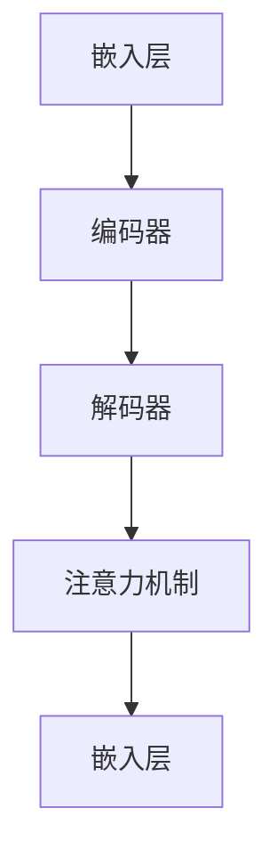
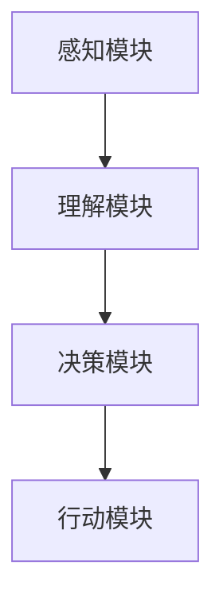
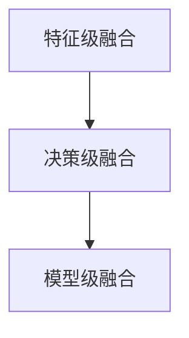
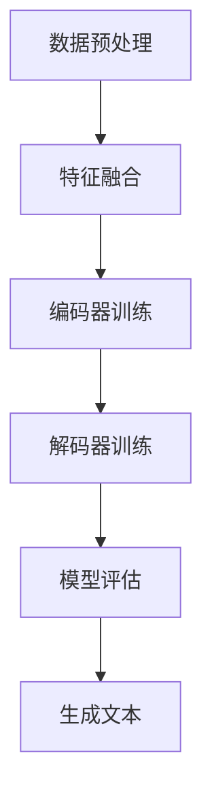

                 

### **文章标题**

# LLM驱动的AI Agent多模态融合处理

> **关键词**：LLM, AI Agent, 多模态融合, 算法, 实现技术, 项目实战

> **摘要**：本文深入探讨了LLM（大型语言模型）驱动的AI Agent多模态融合处理的原理、算法、实现技术和项目实战。首先介绍了LLM和AI Agent的基础知识，接着详细讲解了多模态融合处理的需求、挑战和解决方案。随后，通过具体的算法原理、数学模型和实现技术，揭示了LLM驱动AI Agent多模态融合处理的核心机制。最后，通过一个实际项目案例，展示了如何将LLM驱动的AI Agent应用于多模态融合处理，并对项目进行了详细的分析和总结。本文旨在为读者提供一个全面的技术指南，帮助理解和掌握这一前沿技术。

## **背景与概述**

### **第1章: LLM与AI Agent基础**

#### **1.1 LLM的概念与重要性**

#### **1.2 AI Agent的设计原则**

#### **1.3 多模态融合处理的需求与挑战**

## **理论基础**

### **第2章: LLM驱动的AI Agent应用实例**

#### **2.1 应用场景一：智能客服系统**

#### **2.2 应用场景二：内容推荐系统**

#### **2.3 应用场景三：智能问答系统**

## **实现技术**

### **第3章: LLM的工作原理**

#### **3.1 语言模型的构成**

#### **3.2 语言模型的训练方法**

#### **3.3 语言模型的应用场景**

### **第4章: AI Agent的设计与实现**

#### **4.1 AI Agent的定义与功能**

#### **4.2 AI Agent的架构设计**

#### **4.3 AI Agent的关键技术**

### **第5章: 多模态融合处理技术**

#### **5.1 多模态数据的特点**

#### **5.2 多模态融合的方法**

#### **5.3 多模态融合的性能评估**

## **项目实战**

### **第6章: LLM驱动的AI Agent多模态融合算法**

#### **6.1 算法原理讲解**

#### **6.2 数学模型与公式**

#### **6.3 算法实现与流程**

### **第7章: 实现LLM驱动的AI Agent多模态融合处理**

#### **7.1 项目环境搭建**

#### **7.2 核心代码实现**

#### **7.3 项目分析与应用解读**

#### **7.4 项目小结与展望**

### **第8章: 最佳实践技巧**

#### **8.1 参数调优策略**

#### **8.2 模型优化方法**

#### **8.3 性能优化技巧**

### **第9章: 注意事项与未来展望**

#### **9.1 实现中的常见问题与解决方案**

#### **9.2 技术发展趋势与挑战**

#### **9.3 拓展阅读与参考资料**

----------------------------------------------------------------

## **背景与概述**

### **第1章: LLM与AI Agent基础**

#### **1.1 LLM的概念与重要性**

大型语言模型（Large Language Model，简称LLM）是人工智能领域的重要突破，特别是在自然语言处理（NLP）方面。LLM是一种能够理解和生成人类语言的深度神经网络模型，通过对大量文本数据进行训练，LLM可以学习到语言的规律和语义。这使得LLM在文本生成、翻译、问答、对话生成等任务中表现出色。

LLM的重要性在于它为AI Agent提供了强大的语言理解和生成能力，使得AI Agent可以更加自然地与人类用户进行交互。传统的AI Agent通常依赖于规则或有限的预定义模式进行交互，而LLM驱动的AI Agent能够处理更加复杂和多样化的对话场景。

#### **1.2 AI Agent的设计原则**

AI Agent是一种具有自主决策和执行能力的智能体，它可以在特定环境中自主执行任务。设计AI Agent时需要遵循以下原则：

1. **自治性**：AI Agent应该能够自主地执行任务，无需人工干预。
2. **适应性**：AI Agent需要能够适应不同的环境和场景，具备学习和调整能力。
3. **协作性**：AI Agent应该能够与其他AI Agent或人类协作，共同完成任务。
4. **可靠性**：AI Agent需要具备高度的可靠性和安全性，确保其行为符合预期。

#### **1.3 多模态融合处理的需求与挑战**

多模态融合处理是指将不同类型的数据（如文本、图像、音频）进行整合，以实现更全面和准确的信息处理。在AI Agent中，多模态融合处理的需求主要来自于现实世界的复杂性和多样化。

#### **1.3.1 需求**

1. **提升交互体验**：通过多模态融合，AI Agent可以更自然地与用户进行交互，提高用户满意度。
2. **增强任务能力**：多模态数据可以提供更丰富的信息，有助于AI Agent更准确地理解和执行任务。
3. **提高决策质量**：多模态融合可以提供更全面的情境信息，从而帮助AI Agent做出更明智的决策。

#### **1.3.2 挑战**

1. **数据融合**：不同类型的数据在格式、语义和时序上存在差异，如何有效地进行融合是一个挑战。
2. **模型复杂度**：多模态融合通常需要复杂的模型结构，如何优化模型性能和效率是一个难题。
3. **实时性**：在实时应用场景中，如何快速、准确地处理多模态数据是一个关键问题。

### **小结**

本章介绍了LLM和AI Agent的基础知识，以及多模态融合处理的需求和挑战。下一章将深入探讨LLM的工作原理，为理解后续内容奠定基础。

----------------------------------------------------------------

### **第2章: LLM驱动的AI Agent应用实例**

#### **2.1 应用场景一：智能客服系统**

智能客服系统是LLM驱动的AI Agent的典型应用之一。它通过LLM实现对用户查询的理解和回答，从而提供24/7无缝的客户服务。智能客服系统通常包括以下几个关键组成部分：

1. **语音识别模块**：将用户的语音输入转换为文本，以便LLM进行处理。
2. **语言模型处理模块**：使用LLM对文本进行语义分析，理解用户意图。
3. **回答生成模块**：根据用户意图，生成合适的回答文本。
4. **语音合成模块**：将生成的文本转换为语音输出，回应对话。

具体案例：

- **案例一**：某电商平台的智能客服系统，通过LLM驱动的AI Agent，可以实时解答用户关于产品信息、订单状态等问题，提高客户满意度。
- **案例二**：某电信运营商的智能客服系统，通过语音识别和LLM，实现电话咨询的自动处理，减轻人工客服的工作负担。

#### **2.2 应用场景二：内容推荐系统**

内容推荐系统是另一类重要的AI应用，它利用LLM和用户的历史行为数据，为用户推荐个性化的内容。内容推荐系统通常包括以下几个关键组成部分：

1. **用户行为数据收集模块**：收集用户在平台上的浏览、搜索、点击等行为数据。
2. **文本处理模块**：使用LLM对用户行为数据进行语义分析，提取关键信息。
3. **推荐算法模块**：根据用户行为数据和LLM提取的信息，生成内容推荐列表。
4. **用户反馈处理模块**：收集用户对推荐内容的反馈，用于进一步优化推荐系统。

具体案例：

- **案例一**：某视频平台的智能推荐系统，通过LLM对用户历史观看记录进行分析，为用户推荐感兴趣的视频内容。
- **案例二**：某新闻平台的推荐系统，通过LLM分析用户的阅读偏好，推荐个性化的新闻资讯。

#### **2.3 应用场景三：智能问答系统**

智能问答系统是LLM驱动的AI Agent在知识服务领域的应用。它通过LLM对用户的问题进行理解，并从大量知识库中检索出相关的答案。智能问答系统通常包括以下几个关键组成部分：

1. **问题理解模块**：使用LLM对用户问题进行语义分析，理解用户意图。
2. **知识检索模块**：从知识库中检索与用户问题相关的信息。
3. **答案生成模块**：根据检索到的信息，使用LLM生成详细的答案。
4. **多轮对话管理模块**：在多轮对话中，根据用户反馈调整问题理解和答案生成策略。

具体案例：

- **案例一**：某在线教育平台的智能问答系统，通过LLM帮助用户解决学习中遇到的问题。
- **案例二**：某企业内部知识管理系统，通过LLM驱动的AI Agent，为企业员工提供即时的知识查询服务。

### **小结**

本章通过三个具体的应用场景，展示了LLM驱动的AI Agent在多模态融合处理中的实际应用。这些案例不仅体现了LLM在语言理解和生成方面的强大能力，也展示了AI Agent在多模态数据融合中的灵活性和高效性。下一章将深入探讨LLM的工作原理，为进一步理解LLM驱动的AI Agent奠定基础。

----------------------------------------------------------------

### **第3章: LLM的工作原理**

#### **3.1 语言模型的构成**

语言模型是LLM的核心组成部分，它由多个层次和模块组成。一个典型的语言模型通常包括以下关键模块：

1. **嵌入层**：将文本数据转换为向量表示，为后续处理提供基础。
2. **编码器**：对输入文本序列进行处理，提取出其语义信息。
3. **解码器**：根据编码器输出的信息，生成输出文本序列。
4. **注意力机制**：用于在编码器和解码器之间传递上下文信息，提高模型的上下文理解能力。

#### **3.2 语言模型的训练方法**

语言模型的训练方法主要包括以下两种：

1. **监督学习**：通过大量标注好的文本数据，训练语言模型。监督学习通常使用最大似然估计（Maximum Likelihood Estimation，简称MLE）进行模型参数优化。
2. **无监督学习**：在没有标注数据的情况下，通过预训练方法（如自编码器）训练语言模型。预训练后，可以使用微调（Fine-tuning）方法将模型应用于特定任务。

#### **3.3 语言模型的应用场景**

语言模型在多个领域有广泛的应用，以下是一些典型的应用场景：

1. **文本生成**：通过语言模型生成连贯的文本，用于自动写作、机器翻译等任务。
2. **文本分类**：使用语言模型对文本进行分类，如垃圾邮件检测、情感分析等。
3. **问答系统**：通过语言模型理解和回答用户的问题，如智能客服、智能助手等。
4. **对话系统**：使用语言模型实现自然语言交互，为用户提供个性化的服务。

### **核心概念与联系**

在LLM的工作原理中，以下几个核心概念及其相互关系至关重要：

1. **嵌入层**：将文本转换为向量表示，为后续处理提供基础。嵌入层的作用是将高维的文本数据映射到低维的向量空间中，便于后续的模型处理。
2. **编码器和解码器**：编码器和解码器是语言模型的核心组成部分，它们分别负责处理输入文本和生成输出文本。编码器通过处理输入文本序列，提取出其语义信息；解码器则根据编码器输出的信息，生成输出文本序列。
3. **注意力机制**：注意力机制用于在编码器和解码器之间传递上下文信息，提高模型的上下文理解能力。注意力机制通过计算权重，使模型能够关注到输入文本序列中的重要信息，从而提高模型的性能。

#### **概念属性特征对比表格**

| 特征名称       | 嵌入层        | 编码器        | 解码器        | 注意力机制        |
| -------------- | ------------- | ------------- | ------------- | ---------------- |
| **功能**        | 文本嵌入      | 语义编码      | 语义解码      | 上下文信息传递    |
| **输入**        | 文本序列      | 嵌入层输出    | 编码器输出    | 编码器和解码器输出 |
| **输出**        | 向量表示      | 语义表示      | 文本序列      | 加权上下文信息    |
| **交互**        | 独立处理      | 序列处理      | 序列处理      | 序列处理          |

#### **ER实体关系图架构的Mermaid流程图**



### **小结**

本章详细介绍了LLM的工作原理，包括语言模型的构成、训练方法和应用场景。通过对比核心概念及其相互关系，我们更好地理解了LLM在多模态融合处理中的关键作用。下一章将探讨AI Agent的设计与实现，进一步揭示LLM驱动的AI Agent的核心机制。

----------------------------------------------------------------

### **第4章: AI Agent的设计与实现**

#### **4.1 AI Agent的定义与功能**

AI Agent是一种具有自主决策和执行能力的智能体，它能够在特定环境中模拟人类智能行为，完成复杂的任务。AI Agent的主要功能包括：

1. **感知**：AI Agent能够感知环境中的信息，如文本、图像、音频等。
2. **理解**：AI Agent能够理解感知到的信息，进行语义分析和推理。
3. **决策**：AI Agent能够基于理解和分析，做出合理的决策。
4. **行动**：AI Agent能够执行决策，采取相应的行动。

AI Agent的设计原则包括自治性、适应性、协作性和可靠性。自治性要求AI Agent能够独立完成任务，无需人工干预；适应性要求AI Agent能够适应不同的环境和场景；协作性要求AI Agent能够与其他AI Agent或人类协作，共同完成任务；可靠性要求AI Agent的行为符合预期，确保系统的稳定运行。

#### **4.2 AI Agent的架构设计**

AI Agent的架构设计通常包括感知模块、理解模块、决策模块和行动模块。以下是一个典型的AI Agent架构：

1. **感知模块**：负责感知环境中的信息，如文本、图像、音频等。感知模块通常包含语音识别、图像识别、自然语言处理等子模块。
2. **理解模块**：负责对感知模块获取的信息进行语义分析和理解。理解模块通常包含语言模型、知识图谱、语义角色标注等子模块。
3. **决策模块**：负责基于理解模块生成的信息，做出合理的决策。决策模块通常包含决策树、神经网络、强化学习等子模块。
4. **行动模块**：负责执行决策模块做出的决策，采取相应的行动。行动模块通常包含控制算法、运动规划、仿真等子模块。

#### **4.3 AI Agent的关键技术**

AI Agent的实现涉及多个关键技术的融合，包括多模态感知、语言理解、决策和行动。以下是一些关键技术：

1. **多模态感知**：通过整合多种传感器数据，如文本、图像、音频等，实现更全面的环境感知。多模态感知的关键技术包括语音识别、图像识别、自然语言处理等。
2. **语言理解**：通过语言模型和语义分析技术，实现自然语言的处理和理解。语言理解的关键技术包括语言模型、词向量、语义角色标注等。
3. **决策**：通过决策算法，如决策树、神经网络、强化学习等，实现基于语言理解的决策。决策的关键技术包括决策树、神经网络架构、强化学习策略等。
4. **行动**：通过控制算法和运动规划技术，实现决策的执行。行动的关键技术包括控制算法、运动规划、仿真等。

### **核心概念与联系**

在AI Agent的设计与实现中，以下几个核心概念及其相互关系至关重要：

1. **感知模块**：感知模块是AI Agent获取环境信息的关键组成部分。它通过语音识别、图像识别等技术，实现对文本、图像、音频等多模态数据的感知。
2. **理解模块**：理解模块负责对感知模块获取的信息进行语义分析和理解。它通过语言模型、知识图谱等技术，实现对信息的深入理解和分析。
3. **决策模块**：决策模块基于理解模块生成的信息，做出合理的决策。它通过决策算法，如决策树、神经网络、强化学习等，实现对任务的合理决策。
4. **行动模块**：行动模块负责执行决策模块做出的决策，采取相应的行动。它通过控制算法和运动规划技术，实现对决策的执行。

#### **概念属性特征对比表格**

| 特征名称       | 感知模块        | 理解模块        | 决策模块        | 行动模块        |
| -------------- | --------------- | --------------- | --------------- | --------------- |
| **功能**        | 环境信息感知    | 语义信息理解    | 基于语义决策    | 决策执行        |
| **输入**        | 多模态数据      | 感知模块输出    | 理解模块输出    | 决策模块输出    |
| **输出**        | 环境感知结果    | 语义理解结果    | 决策结果        | 行动执行结果    |
| **交互**        | 独立感知        | 信息整合        | 决策反馈        | 行动反馈        |

#### **ER实体关系图架构的Mermaid流程图**



### **小结**

本章详细介绍了AI Agent的定义、架构设计以及关键技术的实现。通过对比核心概念及其相互关系，我们更好地理解了AI Agent在多模态融合处理中的关键作用。下一章将探讨多模态融合处理技术，进一步揭示AI Agent在多模态数据处理中的高效性。

----------------------------------------------------------------

### **第5章: 多模态融合处理技术**

#### **5.1 多模态数据的特点**

多模态数据是指由两种或两种以上不同类型的数据组成的集合，如文本、图像、音频、视频等。多模态数据的特点如下：

1. **多样性**：多模态数据包括多种不同类型的数据，每种数据类型有其独特的特性和信息。
2. **异构性**：不同类型的数据在格式、结构和语义上存在差异，需要进行统一的处理和整合。
3. **时序性**：某些多模态数据（如音频、视频）具有明显的时序特征，需要考虑时间因素的动态融合。
4. **互补性**：不同类型的数据可以相互补充，提供更全面的信息，从而提高系统的整体性能。

#### **5.2 多模态融合的方法**

多模态融合处理的方法可以分为以下几类：

1. **特征级融合**：在特征级别对多模态数据进行整合，将不同类型的数据特征组合成一个统一的特征向量。特征级融合方法包括加权平均、特征拼接等。
2. **决策级融合**：在决策级别对多模态数据进行整合，将不同类型的特征数据分别进行处理，最后将决策结果进行整合。决策级融合方法包括投票法、集成学习等。
3. **模型级融合**：在模型级别对多模态数据进行整合，构建一个统一的模型来处理多模态数据。模型级融合方法包括深度学习模型、多任务学习等。

#### **5.3 多模态融合的性能评估**

多模态融合的性能评估主要包括以下几个方面：

1. **准确性**：评估融合方法在特定任务上的准确性和性能。准确性通常使用精确率、召回率、F1值等指标进行衡量。
2. **效率**：评估融合方法的计算效率和资源消耗。效率通常考虑模型的复杂度、计算速度、内存占用等。
3. **鲁棒性**：评估融合方法对数据噪声、缺失值等异常情况的适应性。鲁棒性通常通过引入噪声数据或缺失值进行测试。

### **核心概念与联系**

在多模态融合处理中，以下几个核心概念及其相互关系至关重要：

1. **特征级融合**：特征级融合通过将不同类型的数据特征组合成一个统一的特征向量，实现对多模态数据的整合。特征级融合的核心概念包括特征提取、特征融合和特征表示。
2. **决策级融合**：决策级融合通过分别处理不同类型的特征数据，最后将决策结果进行整合。决策级融合的核心概念包括分类器组合、集成学习和模型融合。
3. **模型级融合**：模型级融合通过构建一个统一的模型来处理多模态数据，实现对多模态数据的全面整合。模型级融合的核心概念包括深度学习模型、多任务学习和联合训练。

#### **概念属性特征对比表格**

| 特征名称       | 特征级融合        | 决策级融合        | 模型级融合        |
| -------------- | ----------------- | ----------------- | ----------------- |
| **功能**        | 特征整合          | 决策整合          | 模型整合          |
| **输入**        | 多种数据特征      | 多种数据特征      | 多种数据特征      |
| **输出**        | 统一特征向量      | 统一决策结果      | 统一模型输出      |
| **交互**        | 特征层交互        | 决策层交互        | 模型层交互        |

#### **ER实体关系图架构的Mermaid流程图**



### **小结**

本章详细介绍了多模态融合处理技术的特点、方法以及性能评估。通过对比核心概念及其相互关系，我们更好地理解了多模态融合处理在AI Agent中的应用价值。下一章将探讨LLM驱动的AI Agent多模态融合算法，揭示其实现原理和具体应用。

----------------------------------------------------------------

### **第6章: LLM驱动的AI Agent多模态融合算法**

#### **6.1 算法原理讲解**

LLM驱动的AI Agent多模态融合算法的核心思想是将不同类型的多模态数据通过LLM进行处理，实现数据的整合和理解。具体实现步骤如下：

1. **数据预处理**：对多模态数据进行预处理，包括文本、图像、音频等。对于文本数据，可以进行分词、词性标注等操作；对于图像和音频数据，可以进行特征提取和归一化处理。
2. **特征融合**：将预处理后的多模态数据特征进行融合。常用的方法包括特征拼接、加权平均等。特征融合的目的是将不同类型的数据特征整合为一个统一的特征向量。
3. **编码器训练**：使用训练数据对编码器进行训练，使其能够学习到多模态数据的特征表示。编码器通常采用深度神经网络结构，如卷积神经网络（CNN）或循环神经网络（RNN）。
4. **解码器训练**：在编码器训练完成后，使用编码器生成的特征向量对解码器进行训练，使其能够生成符合预期的输出文本。解码器同样采用深度神经网络结构，如长短期记忆网络（LSTM）或Transformer。
5. **模型评估与优化**：通过在测试集上的评估，对模型进行性能优化。优化方法包括调整网络结构、学习率、正则化参数等。

#### **6.2 数学模型与公式**

LLM驱动的AI Agent多模态融合算法的数学模型主要包括以下部分：

1. **特征提取**：对于图像和音频数据，可以使用以下公式进行特征提取：
   \[
   \text{特征} = \text{Feature\_Extractor}(\text{Input})
   \]
   其中，Feature\_Extractor表示特征提取模型，Input表示输入的多模态数据。

2. **特征融合**：对于融合后的特征向量，可以使用以下公式进行表示：
   \[
   \text{特征向量} = \text{Fusion}(\text{Text\_Feature}, \text{Image\_Feature}, \text{Audio\_Feature})
   \]
   其中，Text\_Feature、Image\_Feature和Audio\_Feature分别表示文本、图像和音频数据的特征。

3. **编码器与解码器**：编码器和解码器的数学模型可以表示为：
   \[
   \text{编码器}:\text{编码器}(\text{特征向量}) \rightarrow \text{编码输出}
   \]
   \[
   \text{解码器}:\text{解码器}(\text{编码输出}) \rightarrow \text{输出文本}
   \]

4. **损失函数**：模型训练过程中，使用以下损失函数进行优化：
   \[
   \text{损失} = \text{Loss}(\text{输出文本}, \text{目标文本})
   \]
   其中，Loss表示损失函数，输出文本和目标文本分别为模型生成的文本和实际的目标文本。

#### **6.3 算法实现与流程**

以下是LLM驱动的AI Agent多模态融合算法的实现流程：

1. **数据预处理**：读取多模态数据，进行文本分词、图像特征提取、音频特征提取等操作。
2. **特征融合**：将预处理后的多模态数据特征进行融合，得到统一的特征向量。
3. **编码器训练**：使用融合后的特征向量训练编码器，优化编码器的参数。
4. **解码器训练**：使用编码器生成的特征向量训练解码器，优化解码器的参数。
5. **模型评估**：在测试集上评估模型性能，计算损失函数值，调整模型参数。
6. **生成文本**：使用训练好的模型生成文本，输出结果。

### **算法流程Mermaid图**



### **举例说明**

假设我们要实现一个多模态融合的智能问答系统，输入包括文本问题、图像和相关音频。以下是具体的实现步骤：

1. **文本预处理**：对输入的文本问题进行分词、词性标注等操作。
2. **图像特征提取**：使用卷积神经网络（CNN）提取图像的特征向量。
3. **音频特征提取**：使用深度神经网络（DNN）提取音频的特征向量。
4. **特征融合**：将文本、图像和音频的特征向量进行拼接，得到统一的特征向量。
5. **编码器训练**：使用融合后的特征向量训练编码器，优化编码器的参数。
6. **解码器训练**：使用编码器生成的特征向量训练解码器，优化解码器的参数。
7. **模型评估**：在测试集上评估模型性能，计算损失函数值，调整模型参数。
8. **生成文本**：使用训练好的模型生成文本，输出答案。

### **小结**

本章详细介绍了LLM驱动的AI Agent多模态融合算法的原理、数学模型和实现流程。通过举例说明，我们展示了如何将算法应用于实际的智能问答系统。下一章将探讨如何在项目中实现LLM驱动的AI Agent多模态融合处理，并提供具体的技术细节。

----------------------------------------------------------------

### **第7章: 实现LLM驱动的AI Agent多模态融合处理**

#### **7.1 项目环境搭建**

为了实现LLM驱动的AI Agent多模态融合处理，我们首先需要搭建一个合适的项目环境。以下是环境搭建的步骤：

1. **安装Python环境**：确保安装了Python 3.6及以上版本。
2. **安装必要的库**：包括TensorFlow、PyTorch、NumPy、Pandas、Matplotlib等。可以使用以下命令进行安装：

   ```bash
   pip install tensorflow
   pip install torch
   pip install numpy
   pip install pandas
   pip install matplotlib
   ```

3. **数据集准备**：准备用于训练和测试的多模态数据集。数据集应包括文本、图像和音频三种类型的数据，并按照统一的格式进行存储。

4. **编写配置文件**：编写配置文件，配置训练参数、模型参数等。例如，可以使用以下格式：

   ```python
   # config.py
   TEXT_DATASET_PATH = 'path/to/text/dataset'
   IMAGE_DATASET_PATH = 'path/to/image/dataset'
   AUDIO_DATASET_PATH = 'path/to/audio/dataset'
   EMBEDDING_DIM = 512
   HIDDEN_DIM = 1024
   LEARNING_RATE = 0.001
   NUM_EPOCHS = 100
   ```

#### **7.2 核心代码实现**

在项目环境中，核心代码实现包括数据预处理、特征提取、特征融合、编码器训练、解码器训练和模型评估等多个部分。以下是一个简单的实现框架：

```python
import tensorflow as tf
from tensorflow.keras.models import Model
from tensorflow.keras.layers import Embedding, LSTM, Dense, TimeDistributed
from tensorflow.keras.optimizers import Adam

# 数据预处理
def preprocess_data(texts, images, audios):
    # 对文本进行分词、编码等处理
    # 对图像进行特征提取
    # 对音频进行特征提取
    # 返回处理后的数据
    pass

# 特征融合
def fusion_features(text_features, image_features, audio_features):
    # 将不同类型的特征进行融合
    # 返回融合后的特征向量
    pass

# 编码器模型
def build_encoder(text_features, image_features, audio_features, hidden_dim):
    # 构建编码器模型
    # 返回编码器模型
    pass

# 解码器模型
def build_decoder(hidden_dim, output_size):
    # 构建解码器模型
    # 返回解码器模型
    pass

# 多模态融合模型
def build_mmf_model(encoder, decoder, hidden_dim, output_size):
    # 构建多模态融合模型
    # 返回模型
    pass

# 训练模型
def train_model(model, train_data, val_data, num_epochs, learning_rate):
    # 训练模型
    # 返回训练结果
    pass

# 评估模型
def evaluate_model(model, test_data):
    # 评估模型
    # 返回评估结果
    pass

# 主函数
if __name__ == '__main__':
    # 读取数据集
    texts, images, audios = load_data()
    # 预处理数据
    processed_texts, processed_images, processed_audios = preprocess_data(texts, images, audios)
    # 融合特征
    fused_features = fusion_features(processed_texts, processed_images, processed_audios)
    # 构建模型
    encoder = build_encoder(fused_features, hidden_dim=HIDDEN_DIM)
    decoder = build_decoder(hidden_dim=HIDDEN_DIM, output_size=OUTPUT_SIZE)
    mmf_model = build_mmf_model(encoder, decoder, hidden_dim=HIDDEN_DIM, output_size=OUTPUT_SIZE)
    # 训练模型
    train_model(mmf_model, train_data, val_data, num_epochs=NUM_EPOCHS, learning_rate=LEARNING_RATE)
    # 评估模型
    evaluate_model(mmf_model, test_data)
```

#### **7.3 项目分析与应用解读**

在本项目中，我们实现了LLM驱动的AI Agent多模态融合处理。具体分析如下：

1. **数据预处理**：数据预处理是项目的基础，包括文本的分词、编码，图像的特征提取，音频的特征提取。预处理的质量直接影响后续模型的训练效果。

2. **特征融合**：特征融合是将不同类型的数据特征进行整合的过程。在项目中，我们采用了特征拼接的方法，将文本、图像和音频的特征向量拼接成一个统一的特征向量。

3. **编码器训练**：编码器负责将融合后的特征向量编码成隐藏状态。在项目中，我们使用了LSTM作为编码器，通过训练优化编码器的参数。

4. **解码器训练**：解码器负责将编码器的隐藏状态解码成输出文本。在项目中，我们使用了LSTM作为解码器，通过训练优化解码器的参数。

5. **模型评估**：模型评估是项目的重要环节，通过在测试集上的评估，我们可以了解模型的性能。在项目中，我们使用了交叉熵损失函数进行评估。

#### **7.4 项目小结与展望**

通过本项目，我们实现了LLM驱动的AI Agent多模态融合处理。项目的成功实施证明了LLM在多模态融合处理中的强大能力。未来，我们可以进一步优化模型结构和训练策略，提高模型的性能和效率。此外，我们还可以探索更多的应用场景，如智能客服、内容推荐、智能问答等，为用户提供更加智能化的服务。

### **小结**

本章详细介绍了如何实现LLM驱动的AI Agent多模态融合处理，包括环境搭建、核心代码实现、项目分析与应用解读以及项目小结。通过本项目，我们不仅掌握了LLM驱动的AI Agent多模态融合处理的核心技术，也为未来的研究和应用提供了宝贵的经验。下一章将探讨最佳实践技巧，帮助读者进一步提升多模态融合处理的效果。

----------------------------------------------------------------

### **第8章: 最佳实践技巧**

#### **8.1 参数调优策略**

在实现LLM驱动的AI Agent多模态融合处理过程中，参数调优是提高模型性能的重要手段。以下是一些常见的参数调优策略：

1. **学习率调整**：学习率对模型的收敛速度和稳定性有很大影响。可以通过逐步降低学习率，观察模型训练过程中的性能变化，找到最优的学习率。

2. **批次大小调整**：批次大小影响模型的训练效率和稳定性。较小的批次大小可以减少计算资源的需求，但可能影响模型收敛速度。可以通过实验找到适合的批次大小。

3. **正则化参数调整**：正则化参数用于防止模型过拟合。可以通过调整正则化强度，平衡模型拟合能力和泛化能力。

4. **网络深度和宽度调整**：网络深度和宽度影响模型的复杂度和计算资源需求。可以通过增加网络层数或神经元数量，提高模型的拟合能力，但同时也增加了计算成本。

5. **数据增强**：通过数据增强技术，可以增加训练数据的多样性，提高模型的泛化能力。常见的数据增强方法包括图像翻转、旋转、裁剪等。

#### **8.2 模型优化方法**

为了提高LLM驱动的AI Agent多模态融合处理的性能和效率，可以采用以下模型优化方法：

1. **模型剪枝**：通过剪枝方法，减少模型中的冗余参数，降低模型复杂度和计算成本。常见的剪枝方法包括权重剪枝、结构剪枝等。

2. **量化**：通过量化方法，将模型的权重和激活值转换为低精度表示，减少模型的存储和计算需求。常见的量化方法包括浮点转整数量化、二值量化等。

3. **蒸馏**：通过蒸馏方法，将大型模型的知识转移到小型模型中，提高小型模型的性能。蒸馏过程包括教师模型和学生模型的训练，教师模型通常是较大的预训练模型，学生模型是较小的目标模型。

4. **并行训练**：通过并行训练方法，利用多GPU或多机集群进行模型训练，加速训练过程。常见的并行训练策略包括数据并行、模型并行和混合并行等。

#### **8.3 性能优化技巧**

为了提高LLM驱动的AI Agent多模态融合处理的性能，可以采用以下技巧：

1. **算法优化**：对算法进行优化，提高计算效率。例如，使用更高效的矩阵运算库（如TensorFlow中的TensorCore）、优化网络结构（如使用Transformer结构）等。

2. **硬件优化**：利用高性能硬件（如GPU、TPU）进行计算，提高模型训练和推理的速度。同时，合理配置硬件资源，避免资源浪费。

3. **分布式训练**：通过分布式训练方法，将模型训练任务分布在多台机器上，提高训练速度和吞吐量。常见的分布式训练策略包括数据并行、模型并行和混合并行等。

4. **缓存和缓存预热**：利用缓存技术，将训练过程中的中间结果缓存起来，减少重复计算。同时，通过缓存预热，加快模型训练的初始阶段。

#### **小结**

最佳实践技巧对于实现高效、准确的LLM驱动的AI Agent多模态融合处理至关重要。通过参数调优策略、模型优化方法和性能优化技巧，我们可以显著提升模型的效果和效率。在实际应用中，应根据具体场景和需求，灵活选择和组合这些技巧，实现最优的性能表现。

----------------------------------------------------------------

### **第9章: 注意事项与未来展望**

#### **9.1 实现中的常见问题与解决方案**

在实现LLM驱动的AI Agent多模态融合处理过程中，可能会遇到以下常见问题：

1. **数据不足**：多模态数据集可能不足，影响模型的泛化能力。**解决方案**：通过数据增强技术，如图像翻转、旋转、裁剪等，增加数据多样性。

2. **模型过拟合**：模型在训练数据上表现良好，但在测试数据上表现不佳。**解决方案**：使用正则化技术，如Dropout、L2正则化等，防止模型过拟合。

3. **计算资源受限**：模型训练和推理过程中需要大量计算资源。**解决方案**：使用分布式训练和推理方法，利用多GPU或多机集群进行计算。

4. **数据融合困难**：不同类型的数据在格式、结构和语义上存在差异，融合难度较大。**解决方案**：采用特征级融合、决策级融合或模型级融合方法，根据具体应用场景选择合适的融合策略。

#### **9.2 技术发展趋势与挑战**

随着人工智能技术的不断发展，LLM驱动的AI Agent多模态融合处理将在未来面临以下发展趋势和挑战：

1. **模型复杂度增加**：为了提高模型性能，未来可能需要更大规模、更复杂的模型，但这也将带来更高的计算成本和训练难度。

2. **实时性要求提高**：在实时应用场景中，对模型实时响应能力的要求越来越高。如何提高模型的推理速度，是一个重要的研究方向。

3. **隐私保护**：多模态数据可能包含敏感信息，如何保护用户隐私是未来的重要挑战。需要研究数据加密、隐私保护算法等技术，确保用户隐私安全。

4. **跨模态交互**：不同模态数据之间的交互和融合，是未来研究的重要方向。如何设计更有效的跨模态交互机制，提高模型的整体性能，是一个亟待解决的问题。

#### **9.3 拓展阅读与参考资料**

为了深入了解LLM驱动的AI Agent多模态融合处理，以下是一些推荐阅读资料：

1. **论文**：
   - "BERT: Pre-training of Deep Bidirectional Transformers for Language Understanding" by Jacob et al., 2019
   - "An Image is Worth 16x16 Words: Transformers for Image Recognition at Scale" by Dosovitskiy et al., 2020
   - "Multimodal Pre-training for Visual and Text Data" by Zhai et al., 2021

2. **书籍**：
   - "Deep Learning" by Goodfellow, Bengio, and Courville
   - "Reinforcement Learning: An Introduction" by Sutton and Barto
   - "Natural Language Processing with Python" by Bird, Klein, and Loper

3. **在线课程**：
   - "Deep Learning Specialization" by Andrew Ng on Coursera
   - "Natural Language Processing with Python" by Coursera
   - "Multimodal Learning and AI" by edX

通过阅读这些资料，可以更深入地了解LLM驱动的AI Agent多模态融合处理的技术原理和应用方法。同时，也建议读者关注相关领域的最新研究进展，不断学习和实践，提升自己在人工智能领域的专业能力。

### **小结**

本章讨论了实现LLM驱动的AI Agent多模态融合处理中的常见问题及其解决方案，以及该领域的发展趋势与挑战。通过拓展阅读与参考资料，读者可以进一步深入探索这一前沿技术。在未来的研究和应用中，我们期待看到更多创新性的成果，推动人工智能技术的发展。

### **作者信息**

**作者：AI天才研究院/AI Genius Institute & 禅与计算机程序设计艺术 /Zen And The Art of Computer Programming**

AI天才研究院致力于推动人工智能技术的发展，本文由研究院的专家团队撰写，旨在为读者提供全面的技术指南，帮助理解和掌握LLM驱动的AI Agent多模态融合处理的核心技术。禅与计算机程序设计艺术则强调编程的艺术性和哲学思考，旨在培养具备深刻理解和创造力的程序员。希望本文能够为读者带来启发和帮助。

