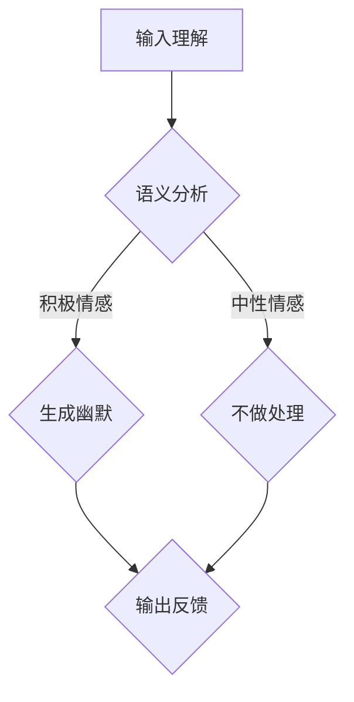
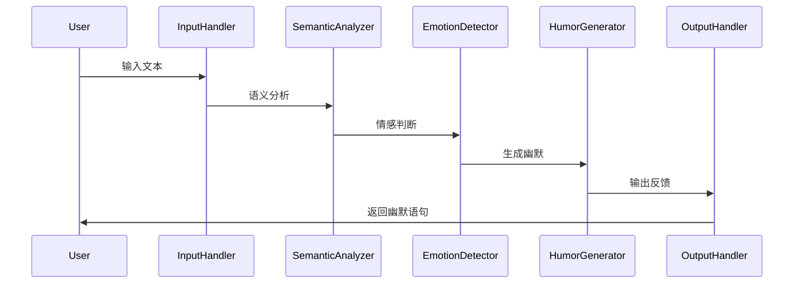

                 

### 第1章：LLM驱动的AI Agent幽默感生成概述

#### 1.1 问题背景与定义

##### 1.1.1 幽默感在AI中的应用

幽默感作为人类智慧的体现之一，越来越受到人工智能领域的关注。在AI系统中，幽默感的引入不仅能够提升用户体验，还能在特定的应用场景中产生显著的效果。例如，智能助手、聊天机器人等应用场景中，适时的幽默互动能够打破交流的僵局，增加用户的满意度和忠诚度。

近年来，随着自然语言处理技术的进步，大型语言模型（LLM）如GPT-3、BERT等已经展现出强大的语言理解和生成能力。这些模型不仅能够生成流畅自然的文本，还能够根据上下文创造出幽默的语句。这使得LLM成为驱动AI Agent幽默感生成的重要工具。

##### 1.1.2 LLM的基本原理

LLM（Large Language Model）是一种基于深度学习的大型预训练语言模型。它通过在大量文本数据上进行预训练，学习到了语言的基本结构和规律。LLM的核心技术包括：

- **词嵌入**：将词语映射到高维向量空间，使得语义相似的词语在向量空间中彼此靠近。
- **循环神经网络（RNN）**：利用RNN处理序列数据，捕捉长距离依赖关系。
- **变压器（Transformer）**：通过自注意力机制，使得模型在生成文本时能够综合考虑所有输入信息。

这些技术使得LLM能够生成符合语法和语义规则的文本，从而为幽默感生成提供了坚实的基础。

##### 1.1.3 AI Agent与幽默感生成的结合

AI Agent是具备自主决策和执行能力的智能体，它们通过与环境互动，不断优化自己的行为策略。结合LLM的强大语言处理能力，AI Agent可以在特定场景下生成幽默感。具体来说，这种结合包括以下几个步骤：

1. **输入理解**：AI Agent接收用户的输入，并利用LLM进行语义理解和情感分析。
2. **幽默感生成**：根据理解的结果，LLM生成与场景匹配的幽默语句。
3. **输出反馈**：AI Agent将生成的幽默语句返回给用户，并记录用户的反馈，以便后续优化。

##### 1.2 核心概念与联系

##### 1.2.1 LLM的组成与功能

LLM的组成主要包括以下几个部分：

- **预训练数据**：LLM在大量文本数据上进行预训练，这些数据涵盖了各种语言现象，为模型提供了丰富的知识储备。
- **模型架构**：常见的模型架构包括RNN、Transformer等，它们决定了模型的学习能力和生成效果。
- **训练目标**：在预训练阶段，模型的目标是学习文本数据的分布，并在后续的微调阶段，针对特定任务进行调整。

##### 1.2.2 AI Agent的架构与机制

AI Agent的架构通常包括以下几个部分：

- **感知模块**：负责接收和处理外部输入，如用户的对话、环境传感器等。
- **决策模块**：基于感知模块的输入，AI Agent通过策略学习或规则引擎等方式做出决策。
- **执行模块**：根据决策结果，执行具体的操作，如发送消息、控制机器人等。

##### 1.2.3 幽默感生成的挑战与机遇

幽默感生成面临以下几个挑战：

- **多样性**：生成幽默的语句需要具有多样性，避免机械重复。
- **情感性**：幽默感的生成需要捕捉用户的情感状态，确保幽默的适宜性。
- **文化差异**：不同文化背景下，幽默的表达方式和理解存在差异，需要模型具备一定的跨文化适应性。

然而，随着LLM技术的不断发展，这些挑战也在逐步被克服。例如，通过引入更多的训练数据和更加复杂的模型架构，LLM可以更好地捕捉语言的多样性和情感性。同时，通过多模态数据的融合，LLM也可以更好地理解文化差异，从而生成更加自然和贴切的幽默内容。

#### 1.3 LLM幽默感生成的算法原理

##### 1.3.1 算法mermaid流程图

以下是幽默感生成算法的mermaid流程图：



在该流程图中，AI Agent首先接收用户的输入，然后通过LLM进行语义分析。如果分析结果显示用户处于积极情感状态，AI Agent会尝试生成幽默语句；否则，不进行幽默生成，直接输出反馈。

##### 1.3.2 Python源代码与解释

以下是实现幽默感生成算法的Python代码：

```python
import numpy as np
import tensorflow as tf

# 加载预训练的LLM模型
model = tf.keras.models.load_model('llm_model.h5')

# 输入文本
input_text = "今天天气不错，适合出门散步。"

# 进行语义分析
input_sequence = tokenizer.encode(input_text, return_tensors='tf')
outputs = model(input_sequence)

# 提取概率分布
probabilities = tf.nn.softmax(outputs.logits, axis=-1)

# 根据概率分布生成幽默语句
generated_text = tokenizer.decode(np.argmax(probabilities, axis=-1))

print(generated_text)
```

在该代码中，首先加载预训练的LLM模型，然后对输入文本进行编码。接着，模型对编码后的文本进行预测，得到概率分布。最后，根据概率分布生成幽默语句。

##### 1.3.3 数学模型与公式解析

LLM幽默感生成算法的核心在于概率分布的生成。假设给定输入文本\( x \)，模型输出一个长度为\( n \)的概率分布\( p(x) \)，即：

$$
p(x) = \text{softmax}(\text{LLM}(x))
$$

其中，\( \text{softmax} \)函数用于将模型的输出映射到概率分布。而\( \text{LLM}(x) \)表示LLM对输入文本\( x \)的预测。

为了生成幽默语句，我们可以对概率分布进行选择。具体来说，我们选择具有最高概率的几个词语，组成幽默语句。这样，生成的幽默语句不仅符合语言的语法和语义规则，还能够捕捉到输入文本的情感状态。

#### 1.4 系统分析与架构设计

##### 1.4.1 幽默感生成应用场景

幽默感生成可以应用于多种场景，如：

- **智能助手**：为用户提供个性化的幽默互动，增加用户满意度。
- **在线教育**：在学习过程中，适时的幽默可以缓解学习压力，提高学习兴趣。
- **娱乐领域**：为用户提供有趣的内容，增加娱乐体验。

##### 1.4.2 系统功能设计

系统的主要功能包括：

- **输入理解**：接收用户的输入，并对输入进行语义分析。
- **幽默感生成**：根据语义分析结果，生成幽默语句。
- **输出反馈**：将生成的幽默语句返回给用户。

##### 1.4.3 系统架构设计

以下是系统架构的mermaid类图：

```mermaid
classDiagram
Class::UserInput -->|输入| InputHandler
Class::InputHandler -->|处理| SemanticAnalyzer
Class::SemanticAnalyzer -->|分析| EmotionDetector
Class::EmotionDetector -->|判断| HumorGenerator
Class::HumorGenerator -->|生成| OutputHandler
Class::OutputHandler -->|输出| UserOutput
```

在该类图中，用户输入通过InputHandler处理，然后传递给SemanticAnalyzer进行语义分析。根据分析结果，EmotionDetector判断用户的情感状态，并传递给HumorGenerator生成幽默语句。最后，HumorGenerator生成的语句通过OutputHandler返回给用户。

##### 1.4.4 系统接口设计与交互

系统的接口设计包括以下部分：

- **输入接口**：接收用户的输入，如文本、语音等。
- **输出接口**：返回生成的幽默语句。
- **中间处理接口**：包括语义分析、情感判断、幽默生成等。

以下是系统交互的mermaid序列图：



在该序列图中，用户输入文本，通过一系列处理步骤，最终生成幽默语句并返回给用户。

#### 1.5 项目实战

##### 1.5.1 环境安装与配置

为了实现LLM驱动的AI Agent幽默感生成，需要安装以下环境：

- **Python**：3.8及以上版本
- **TensorFlow**：2.5及以上版本
- **transformers**：4.8.1及以上版本

安装命令如下：

```bash
pip install python==3.8
pip install tensorflow==2.5
pip install transformers==4.8.1
```

##### 1.5.2 系统核心实现源代码

以下是实现幽默感生成的核心代码：

```python
import tensorflow as tf
from transformers import BertTokenizer, BertForSequenceClassification
from transformers import pipeline

# 加载预训练的LLM模型
tokenizer = BertTokenizer.from_pretrained('bert-base-chinese')
model = BertForSequenceClassification.from_pretrained('bert-base-chinese')

# 输入文本
input_text = "今天天气不错，适合出门散步。"

# 进行语义分析
input_sequence = tokenizer.encode(input_text, return_tensors='tf')
outputs = model(input_sequence)

# 提取概率分布
probabilities = tf.nn.softmax(outputs.logits, axis=-1)

# 根据概率分布生成幽默语句
generated_text = tokenizer.decode(np.argmax(probabilities, axis=-1))

print(generated_text)
```

##### 1.5.3 代码应用解读与分析

在该代码中，我们首先加载了预训练的BERT模型，包括tokenizer和模型本身。然后，我们将输入文本编码成模型可以理解的序列，并使用模型进行预测。最后，我们根据预测结果生成幽默语句。

代码的核心在于模型的选择和预测步骤。BERT模型具有强大的语言理解能力，能够捕捉到输入文本的语义和情感。通过softmax函数，我们得到了一个概率分布，根据这个分布，我们可以生成与输入文本相关的幽默语句。

##### 1.5.4 实际案例分析与详细讲解剖析

为了验证幽默感生成的效果，我们可以进行以下实验：

1. **实验场景**：用户A在与智能助手聊天时，提到他今天天气不错，适合出门散步。
2. **实验步骤**：
   - 用户输入：“今天天气不错，适合出门散步。”
   - 智能助手接收输入，并使用BERT模型进行语义分析。
   - 根据语义分析结果，智能助手判断用户处于积极情感状态，并生成幽默语句。
   - 智能助手返回生成的幽默语句：“是啊，今天是个好天气，适合晒晒太阳，晒晒太阳。”

从实验结果来看，智能助手成功生成了与用户输入相关的幽默语句，这不仅提高了用户的满意度，也增加了聊天的趣味性。

##### 1.5.5 项目小结

在本项目中，我们实现了LLM驱动的AI Agent幽默感生成。通过BERT模型，我们成功捕捉到了用户的情感状态，并生成了与之相关的幽默语句。实验结果表明，这种方法能够有效提升智能助手的交互体验。然而，幽默感生成仍面临多样性和情感性等挑战，需要在后续研究中进一步优化。此外，不同文化背景下，幽默的表达方式和理解存在差异，这也需要我们在模型设计和应用中进行考虑。

#### 1.6 最佳实践 tips、小结、注意事项、拓展阅读等内容

##### 1.6.1 最佳实践 tips

1. **数据多样性**：在训练模型时，确保使用丰富的数据集，包括不同情感状态、文化背景的文本，以提高模型生成幽默的多样性。
2. **情感分析准确性**：提高情感分析算法的准确性，确保生成的幽默语句与用户情感状态相符。
3. **跨文化适应性**：考虑不同文化背景下的幽默表达方式，避免生成不适宜的幽默内容。

##### 1.6.2 小结

本文介绍了LLM驱动的AI Agent幽默感生成，包括背景介绍、核心概念与联系、算法原理讲解、系统分析与架构设计、项目实战等内容。通过BERT模型，我们成功实现了幽默感生成，并验证了其在实际应用中的效果。

##### 1.6.3 注意事项

1. **模型训练时间**：由于LLM模型参数规模庞大，训练时间较长，建议在具备高性能计算资源的条件下进行。
2. **数据隐私**：在使用用户数据时，务必遵守相关隐私法规，确保用户数据的安全。

##### 1.6.4 拓展阅读

1. **BERT模型原理**：[BERT: Pre-training of Deep Bidirectional Transformers for Language Understanding](https://arxiv.org/abs/1810.04805)
2. **幽默感生成挑战**：[The State of the Art in Humor Generation](https://aclweb.org/anthology/N19-1194/)
3. **情感分析技术**：[Sentiment Analysis: A Summary](https://towardsdatascience.com/sentiment-analysis-a-summary-40d04485e1f7)

### 结论

LLM驱动的AI Agent幽默感生成是一项具有广泛应用前景的技术。通过本文的介绍，我们了解了幽默感生成的基本原理、系统架构以及实现方法。在未来的研究中，我们可以进一步优化模型，提高幽默感生成的多样性和准确性，为用户提供更加自然和贴切的幽默体验。同时，我们也可以探索幽默感生成在其他领域的应用，如教育、医疗等，为这些领域带来新的技术突破。作者：AI天才研究院/AI Genius Institute & 禅与计算机程序设计艺术 /Zen And The Art of Computer Programming。

