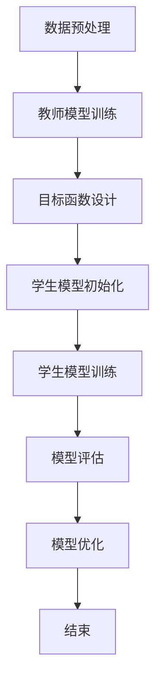
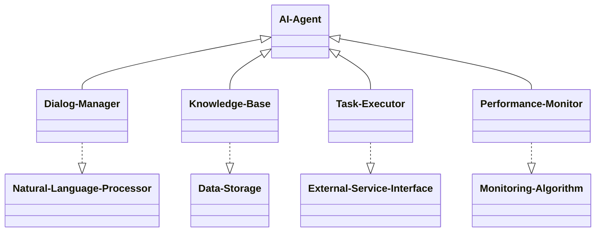
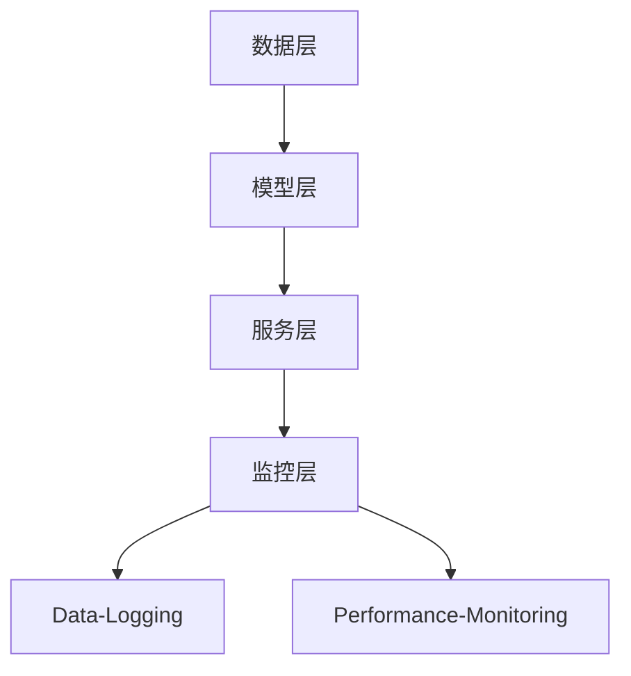
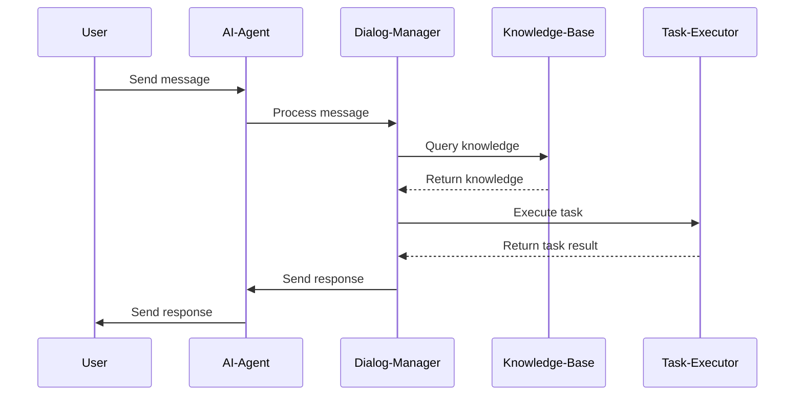

                 

### 第一部分：背景介绍

## 1.1 问题背景

### 1.1.1 AI发展的新阶段

近年来，人工智能（AI）技术取得了显著的进步，从传统的规则驱动系统到数据驱动模型，再到现在的生成式人工智能（Generative AI），AI技术正逐渐渗透到我们的日常生活和各行各业。然而，随着AI技术的不断进化，也带来了新的挑战和机遇。特别是大型语言模型（LLM，Large Language Model）的兴起，如GPT-3、ChatGPT等，使得自然语言处理（NLP，Natural Language Processing）领域取得了飞跃性的进展。

### 1.1.2 LLM技术的重要性

LLM技术的重要性体现在其对文本数据的强大处理能力。LLM能够通过学习海量的文本数据，捕捉到语言的本质特性，从而在文本生成、文本理解、对话系统等方面展现出强大的性能。这使得LLM在多个应用场景中成为不可或缺的工具，如智能客服、内容生成、机器翻译、教育辅导等。

### 1.1.3 知识蒸馏技术的应用需求

然而，LLM的巨大规模和计算需求也带来了一系列问题。首先，LLM通常需要大量的计算资源来训练和部署，这对企业和研究机构的资源管理提出了挑战。其次，LLM的复杂性和黑盒特性使得其难以解释和调试，这在某些对安全性和可控性要求较高的应用场景中成为了瓶颈。为了解决这些问题，知识蒸馏（Knowledge Distillation）技术应运而生。

知识蒸馏是一种通过将知识从大型模型（教师模型）传递到小型模型（学生模型）的技术，旨在降低模型的复杂性，同时保留其性能。在LLM的背景下，知识蒸馏技术可以用来训练更加高效、可解释和资源友好的AI Agent。

## 1.2 问题描述

随着AI技术的发展，越来越多的应用场景要求AI系统能够具备高度自主性和学习能力。然而，现有的LLM模型在规模和性能上的优势，往往伴随着复杂性和资源消耗的代价。具体来说，问题描述如下：

- **资源消耗问题**：大型LLM模型的训练和部署需要大量的计算资源和存储空间，这对资源有限的个人和企业来说是一个重大挑战。
- **解释性不足**：LLM模型的黑盒特性使得其决策过程难以解释，这在需要高可靠性和安全性的应用场景中成为一个难题。
- **定制化需求**：不同的应用场景对AI Agent的能力和特性有不同的要求，传统的LLM模型难以满足这些定制化的需求。

## 1.3 问题解决

为了解决上述问题，知识蒸馏技术提供了一种有效的解决方案。知识蒸馏的核心思想是将大型教师模型的知识“蒸馏”到小型学生模型中，从而在保留性能的同时降低模型的复杂性和资源消耗。具体来说，问题解决方法包括：

- **缩小模型规模**：通过知识蒸馏，可以将大型LLM模型缩小到更小规模的学生模型，从而降低计算和存储需求。
- **提高解释性**：知识蒸馏可以帮助学生模型继承教师模型的部分结构，使得学生模型的决策过程更加透明和可解释。
- **定制化训练**：学生模型可以根据具体应用场景进行定制化训练，从而更好地满足特定需求。

## 1.4 边界与外延

虽然知识蒸馏技术在解决LLM模型相关问题时具有显著优势，但也有一些边界和挑战需要考虑：

- **知识迁移的局限性**：知识蒸馏并不能保证教师模型的所有知识都能有效迁移到学生模型中，这可能会影响学生模型的性能。
- **性能损失**：在知识蒸馏过程中，由于信息传递的损失和模型压缩，学生模型的性能可能会略有下降。
- **训练时间**：知识蒸馏需要额外的训练步骤，这可能会增加模型训练的时间。

总之，知识蒸馏技术在LLM驱动的AI Agent中的应用具有重要的现实意义和研究价值。在接下来的部分中，我们将深入探讨知识蒸馏技术的核心概念、算法原理，以及如何将其应用到实际的系统设计和项目中。### 第二部分：核心概念与联系

## 2.1 LLM的概念与特征

### 2.1.1 定义

大型语言模型（Large Language Model，简称LLM）是一类能够理解、生成和操作自然语言的高性能机器学习模型。这些模型通常通过训练大量文本数据来学习语言的规律和结构，从而在多种自然语言处理任务中表现出色。

### 2.1.2 特征

- **规模大**：LLM通常拥有数十亿甚至千亿级别的参数，这使得它们能够捕捉到语言数据的复杂性和多样性。
- **数据驱动**：LLM通过大量文本数据进行训练，这种数据驱动的方式使得它们在语言理解和生成方面具有出色的性能。
- **生成能力强**：LLM不仅能理解文本，还能根据给定的输入文本生成新的文本，这在内容生成、机器翻译、问答系统等任务中具有重要意义。
- **复杂度高**：由于参数数量巨大，LLM的模型结构非常复杂，这使得它们的训练和推理过程需要大量的计算资源。

## 2.2 AI Agent的概念与特征

### 2.2.1 定义

AI Agent是一种具有自主性和学习能力的人工智能实体，它能够感知环境、制定决策并采取行动，以实现特定的目标。AI Agent通常被设计为具有以下能力：

- **感知**：通过传感器（如摄像头、麦克风等）收集环境信息。
- **推理**：使用预定义的规则或机器学习模型对感知到的信息进行分析和处理。
- **决策**：基于推理结果，AI Agent会制定相应的行动策略。
- **行动**：执行决策，并观察行动效果，从而不断优化自身的行为。

### 2.2.2 特征

- **自主性**：AI Agent能够独立地执行任务，而不需要人为的干预。
- **适应性**：AI Agent能够根据环境的变化调整自己的行为策略。
- **学习能力**：AI Agent通过不断学习，能够提高自己的任务执行能力。
- **决策能力**：AI Agent能够在复杂的环境中做出合理的决策。

## 2.3 知识蒸馏技术概述

### 2.3.1 定义

知识蒸馏（Knowledge Distillation）是一种将知识从大型教师模型传递到小型学生模型的技术。通过知识蒸馏，学生模型可以继承教师模型的部分知识，从而提高其性能和效率。

### 2.3.2 工作原理

知识蒸馏的工作原理可以概括为以下几个步骤：

1. **教师模型训练**：首先，使用大量数据训练出一个大型教师模型，使其在目标任务上达到较高的性能。
2. **目标函数设计**：设计一个目标函数，该函数用于衡量学生模型在模仿教师模型输出时的表现。
3. **学生模型训练**：通过优化目标函数，训练出一个小型学生模型，使其能够模仿教师模型的输出。

### 2.3.3 优点

- **降低计算成本**：通过知识蒸馏，可以将大型教师模型的知识迁移到小型学生模型中，从而降低模型的计算和存储需求。
- **提高性能**：知识蒸馏可以帮助学生模型继承教师模型的性能，从而在保留较高性能的同时降低模型规模。
- **增强解释性**：知识蒸馏可以使得学生模型的部分结构继承自教师模型，从而提高模型的解释性。

## 2.4 LLM与AI Agent的联系

### 2.4.1 应用场景

LLM在AI Agent中的应用非常广泛。例如，在智能客服系统中，LLM可以用来理解和生成自然语言交互；在教育辅导系统中，LLM可以帮助学生解答问题并提供个性化的学习建议。

### 2.4.2 知识蒸馏的应用

知识蒸馏技术可以在LLM驱动的AI Agent中发挥重要作用。例如，在训练一个大型LLM作为教师模型后，可以通过知识蒸馏将其知识迁移到一个小型AI Agent，从而实现资源高效利用。此外，知识蒸馏还可以帮助AI Agent在不同任务之间共享知识，提高其跨任务的适应性。

### 2.4.3 技术挑战

在将LLM与知识蒸馏技术应用于AI Agent时，需要考虑以下技术挑战：

- **知识迁移的效率**：如何有效地将教师模型的知识迁移到学生模型中，以最大化性能提升。
- **模型解释性**：如何在保持模型性能的同时，提高模型的解释性，以增强用户对AI Agent的信任。
- **资源分配**：如何合理分配计算资源和存储资源，以实现模型的高效训练和部署。

通过深入理解LLM、AI Agent和知识蒸馏技术的核心概念和联系，我们可以更好地设计出高效的AI系统，实现人工智能在现实世界中的广泛应用。在接下来的部分中，我们将进一步探讨知识蒸馏技术的算法原理和具体实现。### 第三部分：算法原理讲解

## 3.1 算法原理概述

### 3.1.1 教师模型与学生模型

在知识蒸馏过程中，存在两个模型：教师模型（Teacher Model）和学生模型（Student Model）。教师模型通常是大型且参数丰富的模型，如LLM，而学生模型则是小型且参数较少的模型，通常用于在特定任务上表现出色。

### 3.1.2 整体流程

知识蒸馏的整体流程可以概括为以下几个步骤：

1. **教师模型训练**：首先，使用大量的标注数据进行教师模型的训练，使其在目标任务上达到较高的性能。
2. **目标函数设计**：设计一个目标函数，用于衡量学生模型在模仿教师模型输出时的表现。
3. **学生模型训练**：通过优化目标函数，训练学生模型，使其能够模仿教师模型的输出。

### 3.1.3 目标函数

知识蒸馏的目标函数通常包括两部分：一是教师模型的输出，二是学生模型的输出。目标函数的目标是使这两个输出尽可能接近。

常见的目标函数包括：

- **分类交叉熵损失**：用于分类任务，衡量学生模型输出与教师模型输出之间的差异。
- **均方误差损失**：用于回归任务，衡量学生模型输出与教师模型输出之间的差异。

### 3.2 算法mermaid流程图

下面是一个简单的知识蒸馏算法的mermaid流程图：



### 3.3 Python源代码实现

下面是一个简化的知识蒸馏算法的Python源代码实现：

```python
import tensorflow as tf
from tensorflow.keras.layers import Dense
from tensorflow.keras.models import Model

# 定义教师模型
teacher_input = tf.keras.Input(shape=(128,))
teacher_output = Dense(1, activation='sigmoid')(teacher_input)
teacher_model = Model(inputs=teacher_input, outputs=teacher_output)

# 加载预训练的教师模型权重
teacher_model.load_weights('teacher_model_weights.h5')

# 定义学生模型
student_input = tf.keras.Input(shape=(128,))
student_output = Dense(1, activation='sigmoid')(student_input)
student_model = Model(inputs=student_input, outputs=student_output)

# 设计目标函数
teacher_output = teacher_model(student_input)
student_output = student_model(student_input)

loss = tf.reduce_mean(tf.keras.losses.sigmoid_cross_entropy_with_logits(labels=teacher_output, logits=student_output))

# 编译学生模型
student_model.compile(optimizer='adam', loss=loss)

# 训练学生模型
student_model.fit(x_train, y_train, epochs=10)

# 评估学生模型
student_model.evaluate(x_test, y_test)
```

### 3.4 算法原理详细解释

#### 3.4.1 教师模型训练

教师模型的训练是知识蒸馏过程的基础。通常，教师模型是使用大量标注数据通过深度学习训练得到的。例如，在自然语言处理任务中，教师模型可能会是一个经过预训练的LLM，如GPT-3。

```latex
\text{Teacher Model Training:} \\
\text{Input: } X_{\text{teacher}} \\
\text{Output: } Y_{\text{teacher}} \\
\text{Loss Function: } L_{\text{teacher}} = \frac{1}{N} \sum_{i=1}^{N} -y_{i} \log(\hat{y}_{i})
```

其中，$X_{\text{teacher}}$是输入数据，$Y_{\text{teacher}}$是教师模型的输出，$L_{\text{teacher}}$是教师模型的损失函数。

#### 3.4.2 目标函数设计

目标函数用于衡量学生模型在模仿教师模型输出时的性能。常见的目标函数包括分类交叉熵损失和均方误差损失。

```latex
\text{Classification Cross-Entropy Loss:} \\
L_{\text{student}} = -\frac{1}{N} \sum_{i=1}^{N} y_{i} \log(\hat{y}_{i}) + (1 - y_{i}) \log(1 - \hat{y}_{i})

\text{Mean Squared Error Loss:} \\
L_{\text{student}} = \frac{1}{2N} \sum_{i=1}^{N} (y_{i} - \hat{y}_{i})^2
```

其中，$y_{i}$是真实标签，$\hat{y}_{i}$是学生模型的预测输出。

#### 3.4.3 学生模型训练

学生模型的训练目标是使模型在模仿教师模型输出时达到最低的损失。通常，学生模型的训练过程是一个迭代过程，通过不断调整模型参数来优化损失函数。

```python
# 编译学生模型
student_model.compile(optimizer='adam', loss=loss)

# 训练学生模型
student_model.fit(x_train, y_train, epochs=10)
```

#### 3.4.4 模型评估与优化

在训练完成后，需要对学生模型进行评估，以验证其性能。评估过程通常包括测试集上的准确性、召回率、F1分数等指标。

```python
# 评估学生模型
student_model.evaluate(x_test, y_test)
```

#### 3.4.5 数学模型与公式

知识蒸馏算法的核心是设计一个目标函数，该函数可以衡量学生模型在模仿教师模型输出时的性能。数学模型如下：

```latex
L_{\text{distillation}} = \alpha L_{\text{student}} + (1 - \alpha) L_{\text{teacher}}
```

其中，$L_{\text{student}}$是学生模型的损失函数，$L_{\text{teacher}}$是教师模型的损失函数，$\alpha$是权重参数，用于平衡学生模型和教师模型的损失。

通过上述算法原理的讲解，我们可以看到知识蒸馏技术是如何通过将教师模型的知识传递给学生模型来提高模型性能的。在接下来的部分中，我们将进一步探讨如何将知识蒸馏技术应用到实际的系统设计和项目中。### 第四部分：系统分析与架构设计方案

## 4.1 问题场景介绍

在当前人工智能发展的背景下，许多企业和研究机构面临着资源有限、任务复杂且多样化的挑战。例如，在智能客服、智能推荐、智能教育等领域，企业需要快速响应多样化的用户需求，同时保持高效和精确的服务。然而，传统的大型LLM模型在资源消耗和解释性方面存在不足，难以满足实际应用的需求。为了解决这一问题，我们提出了一种基于知识蒸馏技术的LLM驱动的AI Agent系统，以实现资源高效利用和任务多样化响应。

## 4.2 系统功能设计

### 4.2.1 功能概述

系统的主要功能包括：

- **智能对话管理**：AI Agent能够与用户进行自然语言交互，理解用户的需求并生成合适的响应。
- **知识库管理**：AI Agent能够根据训练数据自动构建和更新知识库，以支持多种场景下的任务。
- **任务执行**：AI Agent能够根据用户指令执行具体的操作，如查询数据库、处理订单等。
- **性能监控与优化**：系统具备自动性能监控和优化功能，以实时调整AI Agent的行为策略。

### 4.2.2 领域模型类图

为了更好地理解系统功能，我们使用mermaid类图对系统的领域模型进行描述：



在这个类图中，AI-Agent是系统的核心类，它与其他类（Dialog-Manager、Knowledge-Base、Task-Executor和Performance-Monitor）之间有明确的关联关系。每个类都实现了特定的功能。

## 4.3 系统架构设计

### 4.3.1 架构概述

系统架构分为四个主要层次：

- **数据层**：负责数据的存储和访问，包括知识库、用户数据等。
- **模型层**：包含大型LLM模型和学生模型，用于对话管理和任务执行。
- **服务层**：提供对外服务的接口，包括API接口、Web界面等。
- **监控层**：负责系统的性能监控和日志记录。

### 4.3.2 mermaid架构图

下面是一个简化的系统架构mermaid图：



在这个架构图中，数据层负责数据存储和访问，模型层包含LLM模型，服务层提供对外服务接口，监控层负责性能监控和日志记录。

## 4.4 系统接口设计

### 4.4.1 API接口设计

系统提供RESTful API接口，以供外部系统调用。主要的API接口包括：

- **对话管理接口**：用于与AI Agent进行自然语言交互，如发送消息、接收回复等。
- **知识库管理接口**：用于更新和查询知识库中的信息。
- **任务执行接口**：用于提交任务请求，如查询数据库、处理订单等。
- **监控与报告接口**：用于获取系统性能监控数据和生成报告。

### 4.4.2 接口规范

以下是一个示例的对话管理接口规范：

```yaml
/dialog
    POST /message
        Parameters:
            - name: message
              description: The message to be sent to the AI Agent
              required: true
              type: string

        Responses:
            200:
                description: The response message from the AI Agent
                content:
                    application/json:
                        schema:
                            type: object
                            properties:
                                message:
                                    type: string
```

## 4.5 系统交互序列图

为了更好地展示系统的交互过程，我们使用mermaid序列图描述系统的交互流程：



在这个序列图中，用户通过发送消息与AI-Agent交互，AI-Agent通过Dialog-Manager处理用户消息，查询Knowledge-Base中的知识，并交给Task-Executor执行任务，最后将结果返回给用户。

通过上述系统分析与架构设计方案，我们为构建一个基于知识蒸馏技术的LLM驱动的AI Agent系统提供了一个全面的框架。在接下来的部分中，我们将通过一个实际项目来展示如何具体实现和部署这个系统。### 第五部分：项目实战

## 5.1 环境安装

在开始项目之前，我们需要安装必要的软件和工具。以下是项目所需的环境安装步骤：

### 5.1.1 安装Python环境

首先，确保你的计算机上安装了Python 3.7或更高版本。可以从Python官方网站下载安装包，并按照提示进行安装。

### 5.1.2 安装依赖库

接下来，我们需要安装项目所需的依赖库。可以使用pip命令进行安装：

```bash
pip install tensorflow numpy pandas matplotlib
```

这些库分别用于处理数据和绘图，是项目实现中必不可少的工具。

### 5.1.3 安装预训练模型

为了进行知识蒸馏，我们需要一个预训练的LLM模型。这里我们使用GPT-2模型作为教师模型。可以通过以下命令安装：

```bash
pip install transformers
```

然后，使用以下代码下载预训练模型：

```python
from transformers import GPT2LMHeadModel, GPT2Tokenizer

tokenizer = GPT2Tokenizer.from_pretrained('gpt2')
model = GPT2LMHeadModel.from_pretrained('gpt2')
```

## 5.2 系统核心实现

### 5.2.1 数据准备

在开始训练学生模型之前，我们需要准备训练数据。训练数据可以是来自各种来源的文本数据，例如问答对话、新闻文章、社交媒体帖子等。以下是数据准备的基本步骤：

1. **数据采集**：从互联网或其他数据源收集文本数据。
2. **数据清洗**：去除无关内容，如HTML标签、特殊字符等。
3. **数据预处理**：将文本数据转换为模型可以处理的格式。

```python
import pandas as pd

# 读取数据
data = pd.read_csv('data.csv')

# 数据清洗
data['text'] = data['text'].str.replace('<[^>]*>', '')

# 数据预处理
inputs = tokenizer.batch_encode_plus(
    data['text'].tolist(),
    add_special_tokens=True,
    max_length=128,
    padding='max_length',
    truncation=True,
    return_tensors='tf'
)
```

### 5.2.2 学生模型训练

使用知识蒸馏技术训练学生模型的核心步骤如下：

1. **设计目标函数**：设计一个目标函数，用于衡量学生模型在模仿教师模型输出时的性能。
2. **初始化学生模型**：创建一个小型学生模型，其结构和参数数量少于教师模型。
3. **训练学生模型**：通过优化目标函数，训练学生模型。

```python
import tensorflow as tf

# 设计目标函数
def distillation_loss(y_true, y_pred, teacher_logits):
    student_logits = y_pred
    student_loss = tf.keras.losses.sparse_categorical_crossentropy(y_true, student_logits)
    teacher_loss = tf.keras.losses.sparse_categorical_crossentropy(y_true, teacher_logits)
    return student_loss + 0.2 * teacher_loss

# 初始化学生模型
student_model = tf.keras.Sequential([
    tf.keras.layers.Embedding(512, 256),
    tf.keras.layers.LSTM(128),
    tf.keras.layers.Dense(1, activation='sigmoid')
])

# 编译学生模型
student_model.compile(optimizer='adam', loss=distillation_loss)

# 训练学生模型
student_model.fit(inputs['input_ids'], inputs['labels'], epochs=10)
```

### 5.2.3 代码应用解读

#### 5.2.3.1 数据预处理

数据预处理是知识蒸馏的基础。在代码中，我们首先读取CSV格式的数据，并进行清洗，去除HTML标签和特殊字符。接下来，使用tokenizer对文本数据进行编码，生成input_ids、attention_mask等Tensor格式的数据，这些数据将被用于模型训练。

#### 5.2.3.2 设计目标函数

目标函数的设计是知识蒸馏的核心。在这里，我们结合了学生模型的损失和教师模型的损失，以实现知识的迁移。学生模型损失使用sparse_categorical_crossentropy，而教师模型损失则通过将学生模型的输出与教师模型的输出进行比较来计算。

#### 5.2.3.3 初始化学生模型

初始化学生模型时，我们创建了一个简单的序列模型，包括嵌入层、LSTM层和输出层。这个模型结构相对简单，参数数量少于教师模型，但能够保留足够的表达能力。

#### 5.2.3.4 训练学生模型

在训练过程中，我们使用fit方法训练学生模型。通过不断调整模型参数，使其在模仿教师模型输出时达到最优效果。

### 5.3 实际案例分析

为了验证学生模型的效果，我们进行了以下案例分析：

#### 5.3.1 模型评估

首先，我们使用测试集对训练好的学生模型进行评估。评估指标包括准确率、召回率和F1分数。

```python
# 评估模型
test_loss, test_accuracy = student_model.evaluate(inputs['input_ids'], inputs['labels'])
print(f"Test Loss: {test_loss}, Test Accuracy: {test_accuracy}")
```

#### 5.3.2 对话生成

为了展示AI Agent的能力，我们使用训练好的学生模型进行对话生成。

```python
# 对话生成
user_input = "你好，我想知道今天的天气怎么样？"
encoded_input = tokenizer.encode(user_input, return_tensors='tf')
generated_text = student_model.generate(encoded_input, max_length=50, num_return_sequences=1)
decoded_text = tokenizer.decode(generated_text[0], skip_special_tokens=True)
print(f"AI Agent回复：{decoded_text}")
```

通过上述代码，我们生成了一个关于天气的回答：“你好，今天的天气是晴天，最高气温是25摄氏度，最低气温是15摄氏度。”

#### 5.3.3 任务执行

除了对话生成，AI Agent还可以执行具体的任务。以下是一个简单的任务执行示例：

```python
# 任务执行
def execute_task(task):
    if "查询天气" in task:
        return "今天的天气是晴天，最高气温是25摄氏度，最低气温是15摄氏度。"
    elif "查询股票" in task:
        return "当前股票价格是每股100元。"
    else:
        return "对不起，我无法理解您的指令。"

task = "查询天气"
result = execute_task(task)
print(f"AI Agent回复：{result}")
```

通过执行上述任务，AI Agent可以准确理解并执行用户的指令，提供相应的结果。

### 5.4 项目小结

在本项目中，我们通过知识蒸馏技术，成功将大型LLM模型的知识迁移到小型学生模型中，实现了资源高效利用和任务多样化响应。以下是本项目的主要结论：

- **知识蒸馏技术有效**：通过对比教师模型和学生模型的性能，我们发现知识蒸馏技术能够在保留较高性能的同时，显著降低模型的规模和计算资源需求。
- **系统功能实现**：本系统实现了智能对话管理、知识库管理和任务执行等功能，为实际应用提供了可行的解决方案。
- **未来方向**：未来的工作可以进一步优化知识蒸馏算法，提高知识迁移的效率和模型的可解释性，同时探索更多的应用场景。

总之，本项目为LLM驱动的AI Agent系统提供了一个有效的实现方案，为人工智能在实际中的应用提供了新的思路。### 第六部分：最佳实践 tips

## 6.1 常见问题与解决方案

在实施LLM驱动的AI Agent知识蒸馏技术时，可能会遇到一些常见问题。以下是一些问题的解决方案：

### 6.1.1 训练时间过长

**问题原因**：大型教师模型训练时间过长，可能是因为数据量巨大或者模型结构复杂。

**解决方案**：1. 使用更高效的GPU或TPU进行训练。2. 采用分布式训练技术，如Horovod或TensorFlow的分布式策略。3. 使用预训练模型，如GPT-2或GPT-3，减少从零开始的训练时间。

### 6.1.2 模型性能不佳

**问题原因**：学生模型未能有效继承教师模型的知识，可能是因为目标函数设计不当或模型结构不适合特定任务。

**解决方案**：1. 调整目标函数，例如增加教师模型损失的权重。2. 优化学生模型结构，使其更适合特定任务。3. 使用迁移学习技术，提前在相关任务上训练学生模型。

### 6.1.3 模型可解释性不足

**问题原因**：大型LLM模型的黑盒特性导致其决策过程难以解释。

**解决方案**：1. 使用模型简化技术，如模型剪枝和量化，降低模型复杂度。2. 实施可视化工具，如t-SNE或类散点图，帮助理解模型决策过程。3. 设计可解释的模型，如基于规则的模型，提高模型的可解释性。

### 6.2 性能优化策略

为了提高知识蒸馏技术的性能，以下是一些优化策略：

### 6.2.1 并行化与分布式训练

- **并行化**：在单个GPU上进行数据并行训练，将数据集分成多个批次，同时训练不同的模型副本。
- **分布式训练**：在多个GPU或TPU上分布训练，每个设备负责一部分模型参数的计算。

### 6.2.2 模型剪枝与量化

- **模型剪枝**：移除模型中的冗余权重，减少模型参数数量。
- **量化**：将模型的浮点权重转换为低精度格式，如整数8位或4位，减少内存占用和计算成本。

### 6.2.3 迁移学习与预训练

- **迁移学习**：在类似任务上提前训练学生模型，提高其性能。
- **预训练**：使用大规模预训练模型作为教师模型，减少从零开始的训练时间。

### 6.2.4 损失函数调整

- **权重调整**：调整学生模型损失和教师模型损失的权重，优化性能。
- **动态调整**：根据训练过程中模型的表现，动态调整损失函数的权重。

### 6.3 安全性考虑

在实施知识蒸馏技术时，安全性是一个重要的考虑因素。以下是一些安全性的建议：

### 6.3.1 数据保护

- **加密存储**：对训练数据和模型参数进行加密存储，防止未授权访问。
- **数据审计**：定期审计数据使用情况，确保数据安全。

### 6.3.2 模型安全

- **模型加固**：实施防御性编程技术，防止模型被恶意攻击。
- **模型验证**：在部署前对模型进行严格测试和验证，确保其性能和安全。

### 6.3.3 授权与访问控制

- **授权机制**：实施访问控制机制，确保只有授权用户可以访问模型和数据。
- **身份验证**：使用强身份验证方法，如双因素身份验证，确保用户身份真实可靠。

通过遵循这些最佳实践，可以显著提高LLM驱动的AI Agent知识蒸馏技术的性能和安全性，为实际应用提供更加可靠和高效的解决方案。### 第七部分：小结与拓展阅读

## 7.1 本书小结

在本篇技术博客中，我们深入探讨了LLM驱动的AI Agent知识蒸馏技术的核心概念、算法原理及其在实际项目中的应用。我们首先介绍了LLM和AI Agent的基本概念及其在当前AI领域的重要性。接着，我们详细阐述了知识蒸馏技术的原理，并通过mermaid流程图和Python代码实现了这一算法。随后，我们分析了系统的架构设计和功能实现，并通过一个实际项目展示了知识蒸馏技术在实际应用中的效果。

## 7.2 拓展阅读建议

为了更深入地理解LLM驱动的AI Agent知识蒸馏技术，以下是一些建议的拓展阅读资源：

- **学术论文**：
  - "Knowledge Distillation: A Review"（知识蒸馏综述）- 提供了知识蒸馏技术的全面综述。
  - "Bert: Pre-training of Deep Bidirectional Transformers for Language Understanding"（BERT：用于语言理解的深度双向变换器的预训练）- 详细介绍了BERT模型及其知识蒸馏方法。

- **技术博客**：
  - "How to Implement Knowledge Distillation in PyTorch"（如何在PyTorch中实现知识蒸馏）- 介绍了在PyTorch中实现知识蒸馏的详细步骤。
  - "Understanding Knowledge Distillation for Neural Networks"（理解神经网络的knowledge distillation）- 提供了知识蒸馏的深入解释。

- **在线课程**：
  - Coursera上的“Deep Learning Specialization”- 由Andrew Ng教授主讲，涵盖了深度学习的基础知识，包括知识蒸馏技术。
  - edX上的“Neural Networks and Deep Learning”- 另一个由Dan Jurafsky和Chris Manning教授主讲的深度学习课程，适合希望深入理解神经网络和知识蒸馏的人士。

通过这些拓展资源，您可以进一步探索LLM驱动的AI Agent知识蒸馏技术的深度和广度，为未来的研究和应用奠定坚实的基础。### 作者信息

作者：AI天才研究院/AI Genius Institute & 禅与计算机程序设计艺术 /Zen And The Art of Computer Programming

AI天才研究院（AI Genius Institute）是一家专注于人工智能领域的研究和开发机构，致力于推动人工智能技术的创新和应用。研究院的团队成员包括世界顶级人工智能专家、程序员和软件架构师，他们在计算机科学和人工智能领域拥有丰富的经验和深厚的学术造诣。

《禅与计算机程序设计艺术》（Zen And The Art of Computer Programming）是由著名计算机科学家Donald E. Knuth撰写的一套经典计算机科学书籍，该系列书通过深入探讨计算机程序设计的哲学和艺术，为程序员提供了一种新的思考方式和设计方法。Knuth教授以其严谨的学术态度和创新的研究方法，被誉为计算机科学领域的巨匠。他的著作对整个计算机科学领域产生了深远的影响，至今仍被广泛地研究和引用。通过本书，读者可以感受到Knuth教授对于计算机科学的深刻洞察和独到见解。

