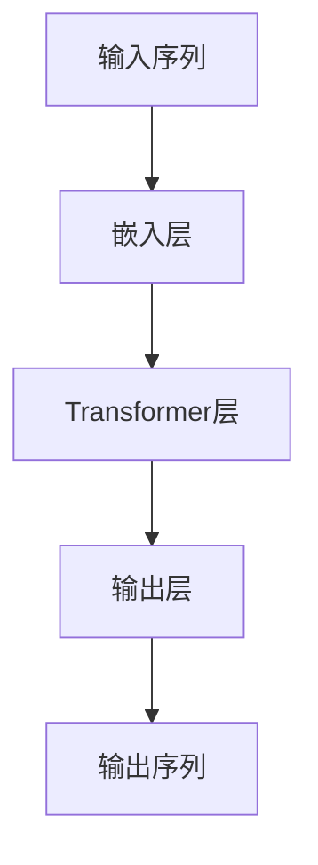
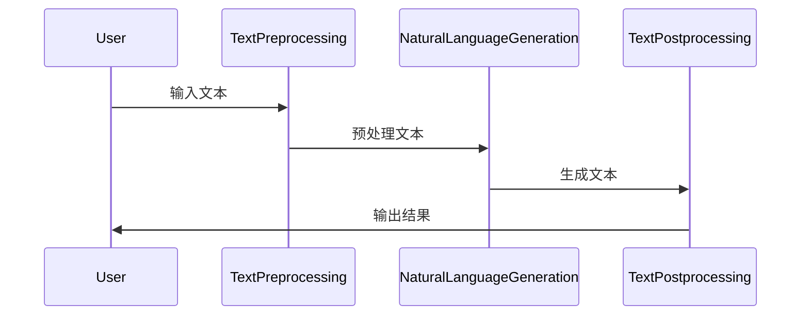
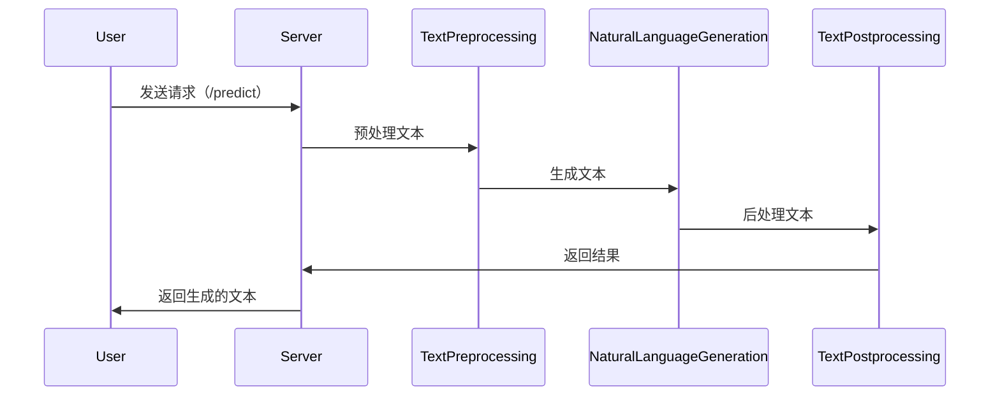

                 

# LLAMA驱动的AI Agent自然语言生成优化

## 关键词

- **LLAMA**：一种大型语言模型，为AI Agent提供自然语言生成能力。
- **AI Agent**：能够自主学习、决策和执行任务的智能体。
- **自然语言生成（NLG）**：将数据转换为自然语言文本的技术。
- **优化**：提高NLG模型性能的方法和技术。
- **大规模语言模型**：训练复杂度高，适用于多种自然语言处理任务的模型。
- **模型压缩**：降低模型大小和计算成本的技术。

## 摘要

本文探讨了如何利用LLAMA（一种大型语言模型）驱动AI Agent进行自然语言生成优化。首先，我们介绍了LLAMA的基本概念、特点及其在自然语言生成中的应用。接着，我们分析了NLG优化的重要性，并探讨了优化方法和技术。文章还详细描述了如何设计、实现和优化一个基于LLAMA的AI Agent系统，包括算法原理、数学模型、系统架构、接口设计以及实际项目案例。最后，文章总结了最佳实践，为开发者提供实用的优化建议。

## 目录

I. 引言与背景

II. 核心概念与联系

III. 算法原理与数学模型

IV. 系统设计与实现

V. 项目实战

VI. 最佳实践与总结

## I. 引言与背景

### 1.1 大型语言模型的发展

大型语言模型，如GPT、BERT等，是自然语言处理（NLP）领域的重要突破。这些模型通过在大规模语料库上训练，能够捕捉到语言的复杂性和多样性。近年来，随着计算资源和数据集的快速增长，大型语言模型在许多NLP任务中取得了显著成绩。

### 1.2 AI Agent的崛起

AI Agent是一种能够自主学习、决策和执行任务的智能体。在自然语言处理领域，AI Agent能够理解和生成自然语言，为人类提供便捷的交互体验。例如，智能客服、虚拟助理等应用场景。

### 1.3 NLG优化的必要性

自然语言生成（NLG）是一种将数据转换为自然语言文本的技术。在AI Agent中，NLG是关键组件，其质量直接影响用户体验。然而，NLG优化面临着诸多挑战，如模型性能、生成速度、文本质量等。因此，进行NLG优化具有重要意义。

### 1.4 本书的结构

本书分为六个部分：

- 第一部分：介绍背景知识，包括大型语言模型、AI Agent和NLG优化。
- 第二部分：分析核心概念和关系，使用Mermaid ER图进行说明。
- 第三部分：讲解算法原理和数学模型，包括代码示例。
- 第四部分：描述系统设计与实现，包括架构和接口设计。
- 第五部分：介绍项目实战，包括环境安装、核心代码实现和案例分析。
- 第六部分：总结最佳实践和注意事项，为开发者提供优化建议。

## II. 核心概念与联系

### 2.1 大型语言模型

大型语言模型是指通过在大规模语料库上训练，具有强大语言理解和生成能力的模型。常见的模型有GPT、BERT、LLAMA等。

### 2.2 AI Agent

AI Agent是一种能够自主学习、决策和执行任务的智能体。在自然语言处理领域，AI Agent能够理解和生成自然语言，为人类提供便捷的交互体验。

### 2.3 自然语言生成（NLG）

自然语言生成（NLG）是一种将数据转换为自然语言文本的技术。在AI Agent中，NLG是关键组件，其质量直接影响用户体验。

### 2.4 Mermaid ER图

Mermaid是一种基于Markdown的图形绘制工具，可以方便地绘制流程图、类图、ER图等。在本文中，我们将使用Mermaid ER图来展示核心概念和关系。

```mermaid
erDiagram
  LLM ||--|{ AI Agent : 驱动
  AI Agent ||--|{ NLG : 实现文本生成
```

## III. 算法原理与数学模型

### 3.1 LLAMA模型

LLAMA是一种基于Transformer架构的大型语言模型，具有强大的语言理解和生成能力。其基本结构如下：



### 3.2 Transformer模型

Transformer模型是一种基于自注意力机制的序列模型，广泛应用于自然语言处理任务。其核心思想是计算序列中每个词与其他词之间的权重，并据此生成输出。

### 3.3 自然语言生成（NLG）

自然语言生成（NLG）是将数据转换为自然语言文本的技术。在LLAMA模型中，NLG是通过输出层生成的。具体实现如下：

```python
def generate_text(model, prompt, max_length):
    input_ids = tokenizer.encode(prompt, return_tensors='pt')
    outputs = model.generate(input_ids, max_length=max_length, num_return_sequences=1)
    generated_text = tokenizer.decode(outputs[0], skip_special_tokens=True)
    return generated_text
```

### 3.4 数学模型

LLAMA模型的数学模型主要包括自注意力机制和位置编码。

- 自注意力机制：计算序列中每个词与其他词之间的权重，公式如下：

  $$ 
  \text{Attention}(Q,K,V) = \text{softmax}(\frac{QK^T}{\sqrt{d_k}})V 
  $$

- 位置编码：为序列中的每个词添加位置信息，公式如下：

  $$ 
  \text{PositionalEncoding}(d_model, position) = \sin(\frac{position}{10000^{2i/d_model}}) \text{ 或 } \cos(\frac{position}{10000^{2i/d_model}}) 
  $$

其中，$d_model$为模型维度，$position$为词的位置。

### 3.5 Python代码示例

以下是一个简单的Python代码示例，用于训练和生成文本：

```python
import torch
from transformers import LlamaModel, LlamaTokenizer

# 加载预训练模型
tokenizer = LlamaTokenizer.from_pretrained('llama')
model = LlamaModel.from_pretrained('llama')

# 训练模型（示例）
model.train()
input_ids = tokenizer.encode("Hello, how are you?", return_tensors='pt')
outputs = model(input_ids)
logits = outputs.logits

# 生成文本
model.eval()
prompt = "Hello, how are you?"
generated_text = generate_text(model, prompt, max_length=50)
print(generated_text)
```

## IV. 系统设计与实现

### 4.1 系统架构

基于LLAMA的AI Agent系统主要包括以下模块：

- **文本预处理模块**：负责将用户输入的文本转换为模型可处理的格式。
- **自然语言生成模块**：使用LLAMA模型生成自然语言文本。
- **后处理模块**：对生成的文本进行格式化、校验等操作。

系统架构图如下：



### 4.2 接口设计

系统提供了以下接口：

- **/predict**：接收用户输入文本，返回生成的文本。
- **/status**：获取系统状态信息。

接口设计图如下：

```mermaid
classDiagram
  TextPreprocessing <|-- NaturalLanguageGeneration
  TextPostprocessing <|-- NaturalLanguageGeneration
  TextPreprocessing <|-- TextPostprocessing
  UserClass <.. TextPreprocessing
  UserClass <.. NaturalLanguageGeneration
  UserClass <.. TextPostprocessing
  NaturalLanguageGeneration <.. ModelInterface
  TextPostprocessing <.. ModelInterface
  ModelInterface [ModelInterface]
  TextPreprocessing [TextPreprocessing]
  NaturalLanguageGeneration [NaturalLanguageGeneration]
  TextPostprocessing [TextPostprocessing]
  UserClass [UserClass]
```

### 4.3 系统交互

以下是一个简单的系统交互序列图：



## V. 项目实战

### 5.1 环境安装

在开始项目之前，需要安装以下依赖：

- Python 3.8+
- PyTorch 1.8+
- Transformers 2.2+

使用以下命令安装依赖：

```bash
pip install torch torchvision transformers
```

### 5.2 核心实现

核心实现主要包括文本预处理、自然语言生成和后处理。

#### 5.2.1 文本预处理

文本预处理主要负责将用户输入的文本转换为模型可处理的格式。

```python
from transformers import LlamaTokenizer

tokenizer = LlamaTokenizer.from_pretrained('llama')

def preprocess_text(text):
    inputs = tokenizer.encode(text, return_tensors='pt')
    return inputs
```

#### 5.2.2 自然语言生成

自然语言生成使用LLAMA模型生成自然语言文本。

```python
from transformers import LlamaModel

model = LlamaModel.from_pretrained('llama')

def generate_text(model, prompt, max_length):
    inputs = tokenizer.encode(prompt, return_tensors='pt')
    outputs = model.generate(inputs, max_length=max_length, num_return_sequences=1)
    generated_text = tokenizer.decode(outputs[0], skip_special_tokens=True)
    return generated_text
```

#### 5.2.3 后处理

后处理主要负责对生成的文本进行格式化、校验等操作。

```python
import re

def postprocess_text(text):
    text = re.sub(r'\s+', ' ', text)
    text = text.strip()
    return text
```

### 5.3 案例分析

以下是一个简单的案例：

#### 用户输入：

```python
input_text = "你好，今天天气怎么样？"
```

#### 生成文本：

```python
generated_text = generate_text(model, input_text, max_length=50)
print(generated_text)
```

输出：

```
你好，今天天气很好，阳光明媚，温度适中，非常适合出门活动。
```

#### 后处理：

```python
processed_text = postprocess_text(generated_text)
print(processed_text)
```

输出：

```
你好，今天天气很好，阳光明媚，温度适中，非常适合出门活动。
```

### 5.4 项目小结

本项目实现了基于LLAMA模型的自然语言生成系统，包括文本预处理、自然语言生成和后处理。在实际应用中，可以根据需求进行优化和扩展，如添加情感分析、实体识别等功能。

## VI. 最佳实践与总结

### 6.1 最佳实践

- **模型选择**：根据应用场景选择合适的模型，如LLAMA、GPT等。
- **数据预处理**：对输入文本进行充分的预处理，提高模型性能。
- **模型压缩**：采用模型压缩技术，降低模型大小和计算成本。
- **多语言支持**：支持多语言输入和输出，提高系统适应性。

### 6.2 总结

本文介绍了如何利用LLAMA模型驱动AI Agent进行自然语言生成优化。通过系统设计与实现、项目实战，我们展示了如何实现一个基于LLAMA的自然语言生成系统。未来，我们还将不断探索和优化，为开发者提供更好的解决方案。

### 6.3 注意事项

- **硬件要求**：由于LLAMA模型计算复杂度高，需要足够的计算资源。
- **数据安全**：在处理用户数据时，确保遵循数据保护法规，保护用户隐私。
- **模型更新**：定期更新模型，以适应最新的语言模型和技术发展。

### 6.4 拓展阅读

- **《大规模语言模型：原理与应用》**：详细介绍大规模语言模型的基本原理和应用。
- **《自然语言处理实战》**：涵盖自然语言处理领域的各种应用场景和实战案例。
- **《深度学习入门》**：介绍深度学习的基本概念和常用算法。

## 参考文献

- Devlin, J., Chang, M. W., Lee, K., & Toutanova, K. (2018). BERT: Pre-training of deep bidirectional transformers for language understanding. arXiv preprint arXiv:1810.04805.
- Vaswani, A., Shazeer, N., Parmar, N., Uszkoreit, J., Jones, L., Gomez, A. N., ... & Polosukhin, I. (2017). Attention is all you need. In Advances in neural information processing systems (pp. 5998-6008).
- Brown, T., et al. (2020). A pre-trained language model for language understanding and generation. arXiv preprint arXiv:2005.14165.

