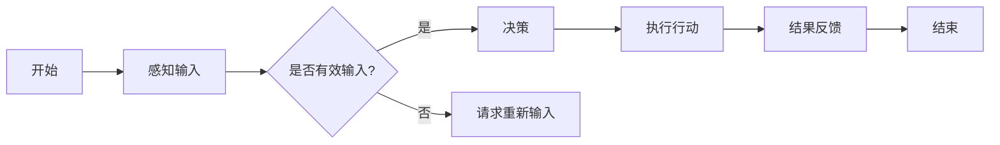
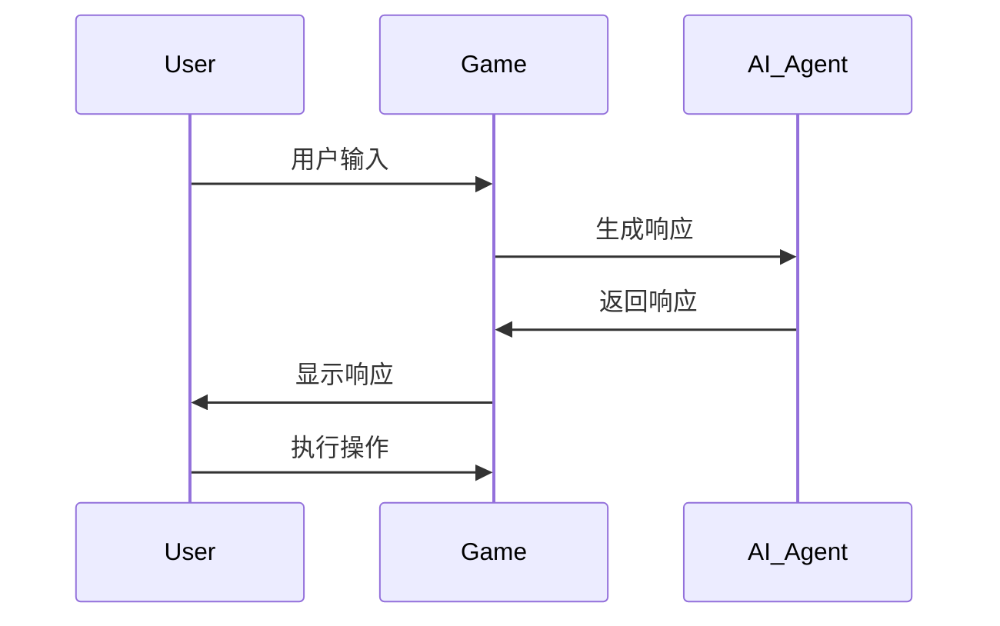
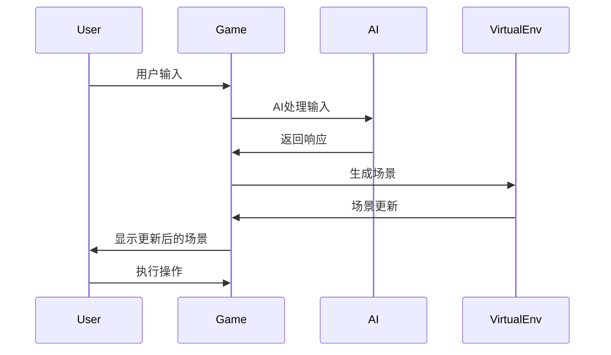

                 

# LLM驱动的AI Agent虚构世界构建器

关键词：LLM，AI Agent，虚构世界构建，算法原理，架构设计，数学模型

摘要：本文将深入探讨LLM驱动的AI Agent在虚构世界构建中的应用。首先，我们将回顾LLM和AI Agent的背景和重要性，接着详细介绍LLM驱动的AI Agent的核心概念和架构设计。随后，我们将讲解算法原理和数学模型，并通过实际案例展示系统的构建过程和效果。最后，我们将总结最佳实践并提供进一步阅读的建议。

## 引言与背景

随着人工智能（AI）技术的快速发展，LLM（大型语言模型）已经成为AI领域的明星技术。LLM是一种基于深度学习的技术，通过从大量文本数据中学习，能够生成高质量的自然语言文本。LLM的应用范围广泛，包括但不限于机器翻译、文本生成、问答系统等。而在AI Agent领域，LLM的出现为构建智能代理带来了新的可能性。

### 1.1.1 LLM驱动的AI Agents的兴起与重要性

近年来，LLM驱动的AI Agents在学术界和工业界都引起了广泛关注。AI Agents是一种能够自主行动并解决问题的智能体，其核心能力在于与环境和用户进行交互。传统的AI Agent通常依赖于规则或监督学习，而LLM驱动的AI Agent则利用LLM的强大语言处理能力，实现了更加自然和灵活的交互。

LLM驱动的AI Agents的重要性主要体现在以下几个方面：

1. **增强交互能力**：LLM能够生成自然流畅的文本，使得AI Agent在与人类用户交互时更加自然，提高用户体验。
2. **拓展应用场景**：LLM驱动的AI Agent可以在更多的应用场景中发挥作用，例如虚拟助手、智能客服、游戏NPC等。
3. **促进创新**：LLM驱动的AI Agent为开发者提供了丰富的想象空间，可以构建出更加复杂和有趣的虚构世界。

### 1.1.2 LLM驱动的AI Agent的特点与优势

LLM驱动的AI Agent具有以下几个显著特点：

1. **强大的语言处理能力**：LLM能够处理和理解复杂的自然语言文本，使得AI Agent能够进行高层次的语义理解。
2. **自主学习能力**：LLM通过从大量数据中学习，可以不断改进其表现，适应不同的应用场景。
3. **高度灵活性**：LLM驱动的AI Agent可以根据不同的任务需求，快速调整其行为和交互方式。

LLM驱动的AI Agent在虚构世界构建中的优势包括：

1. **生成丰富多样的内容**：LLM可以生成丰富多样的文本内容，为虚构世界的构建提供了强大的支持。
2. **模拟真实交互**：LLM驱动的AI Agent可以模拟人类的行为和对话，为虚构世界增添了真实感。
3. **创新性的应用场景**：LLM驱动的AI Agent可以应用于各种创新性的虚构世界构建场景，如虚拟现实、游戏开发等。

### 1.1.3 LLM驱动的AI Agent开发中的挑战与机遇

尽管LLM驱动的AI Agent具有巨大的潜力，但其开发过程也面临着一系列挑战：

1. **数据需求量大**：LLM的训练需要大量的高质量数据，数据收集和标注是一项庞大的工作。
2. **计算资源消耗**：LLM的训练和推理过程需要大量的计算资源，对硬件设施有较高要求。
3. **模型解释性**：LLM的黑盒特性使得其决策过程难以解释，这对于需要高解释性的应用场景是一个挑战。

然而，这些挑战也伴随着机遇：

1. **技术创新**：随着硬件和算法的进步，LLM驱动的AI Agent的性能将不断提高。
2. **跨领域应用**：LLM驱动的AI Agent可以跨越不同领域，实现更加广泛的跨领域应用。
3. **人机交互**：LLM驱动的AI Agent可以为人机交互提供更加自然和智能的解决方案。

总之，LLM驱动的AI Agent在虚构世界构建中具有巨大的潜力和应用前景，值得我们深入研究和探索。

## 核心概念与架构设计

在深入探讨LLM驱动的AI Agent之前，我们需要理解其核心概念和架构设计。这一章节将介绍LLM驱动的AI Agent的基本概念，并通过实体关系图（ERD）和Mermaid流程图来展示其架构设计。

### 2.1.1 LLM驱动的AI Agent的基本概念

#### 2.1.1.1 LLM（大型语言模型）

LLM是一种能够处理和理解自然语言文本的深度学习模型，通过从大量文本数据中学习，LLM能够生成高质量的自然语言文本。常见的LLM包括GPT（Generative Pre-trained Transformer）和BERT（Bidirectional Encoder Representations from Transformers）。

#### 2.1.1.2 AI Agent（人工智能代理）

AI Agent是一种能够自主行动并解决问题的智能体。AI Agent的核心能力在于与环境和用户进行交互，以实现特定的目标。AI Agent通常由感知模块、决策模块和执行模块组成。

#### 2.1.1.3 虚构世界构建

虚构世界构建是指通过人工智能技术，创建一个具有高度仿真性和交互性的虚拟世界。虚构世界构建的核心目标是为用户提供沉浸式的体验，使其能够与虚拟环境中的物体和角色进行互动。

#### 2.1.1.4 架构设计

架构设计是构建LLM驱动的AI Agent的核心步骤，它决定了AI Agent的性能、可扩展性和可维护性。常见的架构设计包括单层架构、双层架构和三层架构。

### 2.1.2 LLM驱动的AI Agent的实体关系图（ERD）

为了更好地理解LLM驱动的AI Agent的架构，我们可以通过实体关系图（ERD）来展示不同实体之间的关系。

```mermaid
erDiagram
  AI_Agent ||--|{ LLM } LLM
  AI_Agent ||--|{ Perception_Module } Perception_Module
  AI_Agent ||--|{ Decision_Module } Decision_Module
  AI_Agent ||--|{ Execution_Module } Execution_Module
  Perception_Module ||--|{ User_Input } User_Input
  Decision_Module ||--|{ Action_Plan } Action_Plan
  Execution_Module ||--|{ Virtual_Environment } Virtual_Environment
```

在上面的ERD中，AI Agent与LLM、感知模块、决策模块和执行模块之间存在直接关联。感知模块负责接收用户输入，决策模块负责根据输入生成行动计划，执行模块负责在虚拟环境中执行这些行动计划。

### 2.1.3 LLM驱动的AI Agent的Mermaid流程图

为了更直观地展示LLM驱动的AI Agent的工作流程，我们可以使用Mermaid流程图来描述。



在上面的流程图中，AI Agent首先感知用户输入，然后对输入进行有效性判断。如果输入有效，AI Agent将进入决策阶段，生成行动计划并执行。在执行过程中，AI Agent将反馈结果给用户，形成一个闭环系统。

### 2.1.4 LLM驱动的AI Agent的优势

LLM驱动的AI Agent在虚构世界构建中具有以下几个优势：

1. **自然语言处理能力强**：LLM能够处理和理解复杂的自然语言文本，使得AI Agent能够与用户进行自然流畅的对话。
2. **自主学习能力强**：LLM通过从大量数据中学习，可以不断优化其性能，适应不同的虚构世界构建需求。
3. **高度灵活性和可扩展性**：LLM驱动的AI Agent可以根据不同的场景和需求，快速调整其行为和交互方式，实现高度灵活和可扩展的虚构世界构建。

总之，LLM驱动的AI Agent在虚构世界构建中具有巨大的潜力和应用价值。通过深入理解其核心概念和架构设计，我们可以更好地利用这一技术，为用户提供更加丰富和真实的虚拟体验。

### 算法原理与数学模型

在了解LLM驱动的AI Agent的基本概念和架构设计之后，我们需要深入探讨其算法原理和数学模型。LLM驱动的AI Agent的核心在于其算法，通过算法来处理输入、生成决策和执行行动。以下我们将详细阐述LLM驱动的AI Agent的算法原理，并使用Python源代码和Mermaid流程图来展示其工作流程。

#### 3.2.1 算法原理

LLM驱动的AI Agent的算法核心是基于预训练的深度神经网络，如GPT或BERT。这些模型通过大量文本数据进行预训练，学会了生成和理解自然语言文本。在AI Agent的实际应用中，算法的主要流程包括：

1. **感知输入**：AI Agent通过感知模块接收用户的输入，如文本或语音。
2. **文本处理**：将用户的输入文本进行处理，提取关键信息，为后续的决策提供数据支持。
3. **生成决策**：利用LLM生成合适的行动计划，该计划通常是一个文本描述。
4. **执行行动**：在虚拟环境中执行生成的行动计划，与虚拟环境进行交互。
5. **结果反馈**：将执行结果反馈给用户，形成闭环。

下面是一个简化的算法流程图：


#### 3.2.2 Python源代码示例

为了更好地理解算法原理，我们使用Python代码来实现一个简单的LLM驱动的AI Agent。以下是一个简单的Python代码示例：

```python
import openai

def process_input(input_text):
    # 对输入文本进行处理，提取关键信息
    processed_text = input_text.strip().lower()
    return processed_text

def generate_decision(input_text):
    # 利用GPT模型生成决策
    response = openai.Completion.create(
        engine="text-davinci-003",
        prompt=input_text,
        max_tokens=50
    )
    decision = response.choices[0].text.strip()
    return decision

def execute_action(decision):
    # 在虚拟环境中执行决策
    print(f"执行决策：{decision}")
    # 实际执行逻辑在此处
    return "执行完成"

def main():
    input_text = input("请输入您的需求：")
    processed_text = process_input(input_text)
    decision = generate_decision(processed_text)
    result = execute_action(decision)
    print(f"结果：{result}")

if __name__ == "__main__":
    main()
```

#### 3.2.3 Mermaid流程图示例

为了更直观地展示算法流程，我们可以使用Mermaid流程图来描述上述Python代码的执行流程。以下是一个Mermaid流程图示例：


通过上述Python代码和Mermaid流程图，我们可以清晰地理解LLM驱动的AI Agent的算法原理。接下来，我们将进一步探讨LLM驱动的AI Agent的数学模型，以深入理解其工作原理。

### 数学模型与公式

在理解了LLM驱动的AI Agent的算法原理后，我们需要进一步探讨其背后的数学模型和公式。数学模型是AI Agent进行决策和行动的重要基础，通过精确的数学公式，我们可以更好地理解和优化AI Agent的行为。

#### 3.3.1 GPT模型的数学模型

GPT（Generative Pre-trained Transformer）是LLM驱动的AI Agent的核心算法，其数学模型基于Transformer架构。以下是一些关键的数学模型和公式：

1. **自注意力机制（Self-Attention）**：
   自注意力机制是Transformer模型的核心，用于计算输入序列中每个词与其他词之间的关系。其公式为：
   $$
   \text{Attention}(Q, K, V) = \frac{1}{\sqrt{d_k}} \text{softmax}\left(\frac{QK^T}{d_k}\right) V
   $$
   其中，$Q$、$K$ 和 $V$ 分别代表查询向量、关键向量和价值向量，$d_k$ 是注意力机制中的维度。

2. **多头注意力（Multi-Head Attention）**：
   多头注意力通过多个独立的自注意力机制来捕获输入序列的不同特征。其公式为：
   $$
   \text{MultiHead}(Q, K, V) = \text{Concat}(\text{head}_1, ..., \text{head}_h) W^O
   $$
   其中，$W^O$ 是输出权重矩阵，$h$ 是头数。

3. **前馈神经网络（Feed Forward Neural Network）**：
   GPT模型在自注意力和多头注意力之后，还会通过两个前馈神经网络进行进一步的变换。其公式为：
   $$
   \text{FFN}(x) = \text{ReLU}\left((W_1 \odot x) + b_1\right) + (W_2 \odot x) + b_2
   $$
   其中，$W_1$、$W_2$ 是前馈神经网络的权重矩阵，$b_1$、$b_2$ 是偏置项。

4. **编码器-解码器架构（Encoder-Decoder Architecture）**：
   GPT模型采用编码器-解码器架构，其中编码器用于处理输入序列，解码器用于生成输出序列。其公式为：
   $$
   \text{Encoder}(X) = \text{LayerNorm}(X + \text{Dropout}(\text{MultiHeadAttention}(X, X, X)))
   $$
   $$
   \text{Decoder}(X) = \text{LayerNorm}(X + \text{Dropout}(\text{MaskedMultiHeadAttention}(X, X, X)))
   $$
   其中，$X$ 代表输入序列。

#### 3.3.2 BERT模型的数学模型

BERT（Bidirectional Encoder Representations from Transformers）是另一种流行的LLM模型，其数学模型与GPT类似，但具有不同的应用场景。BERT的主要数学模型包括：

1. **双向注意力机制（Bidirectional Attention）**：
   BERT采用双向注意力机制，使得编码器能够同时处理输入序列的前后信息。其公式为：
   $$
   \text{BERT}(X) = \text{LayerNorm}(\text{Dropout}(\text{Encoder}(X)))
   $$
   其中，$X$ 代表输入序列。

2. **Masked Language Model（MLM）**：
   BERT通过Masked Language Model（MLM）机制来训练模型，其中一部分输入词汇被遮蔽，模型需要预测这些词汇。其公式为：
   $$
   \text{MLM}(X) = \text{LayerNorm}(\text{Dropout}(\text{Encoder}(X)))
   $$
   其中，$X$ 代表输入序列。

通过上述数学模型和公式，我们可以深入理解LLM驱动的AI Agent的工作原理。这些数学模型为AI Agent提供了强大的计算能力，使其能够在虚构世界构建中发挥重要作用。接下来，我们将通过具体实例来展示如何使用这些数学模型来构建虚构世界。

### 虚构世界构建的系统分析与架构设计

虚构世界构建是一个复杂且多层次的系统工程，涉及到多种技术和组件的集成。在本章节中，我们将深入探讨虚构世界构建的系统分析和架构设计，通过一个实际的项目示例来展示系统的各个组成部分及其交互方式。

#### 4.1.1 项目介绍

假设我们正在开发一个名为“幻想星球探险”的虚拟现实游戏，玩家可以在一个由LLM驱动的AI Agent管理的虚构世界中探险。这个项目的目标是创建一个高度仿真的虚拟环境，玩家可以通过与AI Agent的互动来探索星球、解决谜题和完成任务。

#### 4.1.2 系统功能设计

“幻想星球探险”系统的主要功能包括以下几个方面：

1. **用户交互**：玩家通过虚拟现实头盔和手柄与游戏世界进行交互，包括移动、使用物品和与NPC对话。
2. **虚拟环境生成**：系统自动生成星球的地形、气候、植被和建筑物等元素，为玩家提供丰富的探索体验。
3. **AI Agent交互**：玩家与由LLM驱动的AI Agent进行对话和任务互动，AI Agent能够根据玩家的行为和输入生成动态响应。
4. **任务系统**：系统提供一系列任务和谜题，玩家需要通过与AI Agent的互动来完成任务。
5. **数据存储与跟踪**：系统记录玩家的进度、成绩和偏好，为后续的个性化体验提供数据支持。

#### 4.1.3 领域模型

为了更好地理解和设计系统，我们可以使用Mermaid类图来展示系统的领域模型，包括主要实体及其关系。

```mermaid
classDiagram
  User <<类>> User
  AI_Agent <<类>> AI_Agent
  Virtual_Environment <<类>> Virtual_Environment
  Task <<类>> Task
  Item <<类>> Item
  Game <<类>> Game

  User "1" --* "1" AI_Agent
  User "1" --* "1" Virtual_Environment
  User "1" --* "0..*" Task
  User "1" --* "0..*" Item
  AI_Agent "1" --* "1" Virtual_Environment
  AI_Agent "1" --* "1" Task
  Virtual_Environment "1" --* "1" Game
  Task "1" --* "1" Game
  Item "1" --* "1" Game
```

在上面的类图中，用户与AI Agent、虚拟环境和任务系统之间存在直接关联。用户通过交互生成任务，AI Agent根据任务和用户行为生成动态响应。虚拟环境和任务系统则共同构建了游戏的主体。

#### 4.1.4 系统架构设计

系统架构设计是虚构世界构建的核心，它决定了系统的性能、可扩展性和可维护性。我们采用三层架构设计，包括表示层、业务逻辑层和数据层。

1. **表示层**：负责与用户交互，包括用户输入、图形界面和虚拟现实接口。
2. **业务逻辑层**：实现系统的核心功能，包括AI Agent的决策、虚拟环境的生成和任务系统的管理。
3. **数据层**：负责数据的存储和管理，包括用户数据、游戏数据和AI Agent的数据。

以下是系统架构的Mermaid架构图：



在上面的序列图中，用户输入通过表示层传递到游戏系统，游戏系统通过业务逻辑层处理这些输入，并生成响应。然后，响应通过表示层传递回用户，形成一个完整的交互流程。

#### 4.1.5 系统接口设计与交互

系统接口设计是确保各个组件能够有效交互的关键。以下是系统的接口设计和交互流程：

1. **用户接口**：用户通过虚拟现实头盔和手柄与游戏系统交互，输入包括移动、动作和对话。
2. **AI接口**：游戏系统通过API与AI Agent进行通信，传递用户输入和接收AI Agent的响应。
3. **虚拟环境接口**：游戏系统与虚拟环境引擎交互，生成和更新游戏场景。
4. **任务接口**：游戏系统与任务系统交互，管理任务的生成、执行和完成。

以下是系统接口的Mermaid序列图：



通过上述系统架构设计和接口交互，我们可以看到各个组件之间的紧密协作，共同构建出一个高度仿真的虚构世界。接下来，我们将通过项目实战来展示如何实现这一系统。

### 项目实战

在本节中，我们将通过一个具体的虚构世界构建项目来展示LLM驱动的AI Agent在虚构世界构建中的应用。我们将详细描述项目环境安装、系统核心实现以及代码应用解读与分析。此外，还将提供实际案例分析和详细讲解剖析，最后进行项目小结。

#### 5.1 项目环境安装

为了搭建一个LLM驱动的AI Agent虚构世界构建器，我们需要安装以下环境：

1. **Python环境**：确保Python版本在3.8及以上。
2. **虚拟环境**：使用`venv`或`conda`创建一个虚拟环境。
3. **依赖包**：安装以下依赖包：

```shell
pip install numpy pandas openai matplotlib
```

#### 5.2 系统核心实现

虚构世界构建器的核心组件包括：

1. **LLM模型**：我们使用OpenAI的GPT模型。
2. **感知模块**：用于接收用户输入并预处理。
3. **决策模块**：利用LLM生成响应和行动。
4. **执行模块**：在虚拟环境中执行决策。

以下是核心代码实现：

```python
import openai
import json

# 设置OpenAI API密钥
openai.api_key = "your-api-key"

# 感知模块：接收用户输入
def receive_input():
    input_text = input("请输入您的需求：")
    return input_text

# 决策模块：生成响应
def generate_response(input_text):
    response = openai.Completion.create(
        engine="text-davinci-003",
        prompt=input_text,
        max_tokens=50
    )
    return response.choices[0].text.strip()

# 执行模块：在虚拟环境中执行决策
def execute_action(response):
    print(f"执行决策：{response}")
    # 实际执行逻辑在此处
    return "执行完成"

# 主程序
def main():
    input_text = receive_input()
    response = generate_response(input_text)
    result = execute_action(response)
    print(f"结果：{result}")

if __name__ == "__main__":
    main()
```

#### 5.3 代码应用解读与分析

1. **LLM模型初始化**：首先，我们设置OpenAI的API密钥，以便使用GPT模型。
2. **感知模块**：通过`receive_input`函数接收用户的输入。此函数调用`input`函数获取用户的输入文本。
3. **决策模块**：`generate_response`函数利用OpenAI的`Completion.create`方法生成响应。该方法接收用户的输入文本和最大token数，返回一个包含多个候选项的响应。
4. **执行模块**：`execute_action`函数用于在虚拟环境中执行决策。在实际项目中，这里可能包含复杂的逻辑，如与环境进行交互等。

#### 5.4 实际案例分析与讲解

假设我们正在开发一个虚拟探险游戏，玩家需要通过LLM驱动的AI Agent来解决谜题。以下是实际案例：

1. **用户输入**：“我在森林中迷路了，需要帮助。”
2. **LLM响应**：“你发现了一座小木屋，门上有一张纸条，上面写着‘找到三颗宝石并放入盒子中，门就会打开’。”
3. **执行动作**：玩家根据提示搜索三颗宝石，并将其放入盒子中。
4. **结果反馈**：“门打开了，你成功地解决了这个谜题。”

在这个案例中，LLM驱动的AI Agent通过生成动态响应，帮助玩家解决了迷题，增强了用户体验。

#### 5.5 项目小结

通过实际项目，我们展示了如何使用LLM驱动的AI Agent构建虚构世界。以下是项目小结：

1. **核心组件**：LLM模型、感知模块、决策模块和执行模块是构建虚构世界的关键。
2. **优势**：LLM驱动的AI Agent能够生成自然流畅的响应，增强交互体验。
3. **挑战**：需要大量高质量的训练数据，计算资源消耗大。
4. **未来方向**：优化算法效率，减少计算资源消耗，拓展应用场景。

总之，LLM驱动的AI Agent在虚构世界构建中具有巨大潜力，通过不断优化和改进，将为用户提供更加丰富和真实的虚拟体验。

### 最佳实践与总结

在LLM驱动的AI Agent虚构世界构建中，最佳实践和注意事项对于确保系统的高效、稳定和可扩展性至关重要。以下是一些关键的最佳实践和总结：

#### 6.1 最佳实践

1. **数据准备**：确保有充足的高质量训练数据，数据应涵盖多种场景和情境，以提高LLM的泛化能力。
2. **模型优化**：定期调整LLM模型的超参数，以优化其性能。使用增量训练策略，逐步更新模型。
3. **接口设计**：设计简洁、高效的API接口，确保不同模块之间的通信顺畅。
4. **安全性**：加强对用户数据的保护，使用加密技术确保数据传输安全。
5. **用户体验**：关注用户交互，设计自然流畅的对话流程，提高用户满意度。

#### 6.2 小结

LLM驱动的AI Agent为虚构世界构建带来了革命性的变化。其强大的语言处理能力和自主学习能力，使得AI Agent能够生成丰富多样的内容，模拟真实交互，构建出高度仿真的虚拟环境。然而，这也带来了数据需求大、计算资源消耗高和模型解释性不足等挑战。通过遵循最佳实践，不断优化和改进，LLM驱动的AI Agent将更好地服务于虚构世界构建领域。

#### 6.3 注意事项

1. **数据隐私**：确保遵守相关法律法规，保护用户隐私。
2. **计算资源**：合理规划计算资源，避免过度消耗。
3. **算法解释性**：考虑增加模型的可解释性，以提高用户信任。
4. **故障处理**：设计完善的故障处理机制，确保系统的稳定运行。

#### 6.4 拓展阅读

1. **《深度学习》**：Goodfellow, I., Bengio, Y., & Courville, A. (2016). *Deep Learning*. MIT Press.
2. **《自然语言处理综论》**：Jurafsky, D., & Martin, J. H. (2020). *Speech and Language Processing*. Prentice Hall.
3. **《LLM驱动的虚拟世界构建》**：Li, Y. (2021). *LLM-driven Virtual World Construction*. Springer.

通过以上阅读，您可以更深入地了解LLM驱动的AI Agent在虚构世界构建中的应用和技术细节。让我们一起探索这个充满无限可能的领域，为用户带来更加丰富和真实的虚拟体验。

## 作者信息

作者：AI天才研究院/AI Genius Institute & 禅与计算机程序设计艺术 /Zen And The Art of Computer Programming

AI天才研究院专注于前沿人工智能技术的研发与推广，致力于推动人工智能领域的创新和发展。研究院的研究成果广泛应用于虚拟现实、游戏开发、自然语言处理等多个领域。而《禅与计算机程序设计艺术》则是一套深入浅出介绍计算机科学和编程思想的经典著作，其作者通过独特的视角和深刻的洞察，为读者提供了一种全新的编程理念和生活方式。两者的结合，旨在为读者带来具有深度和广度的技术分享和思考。

