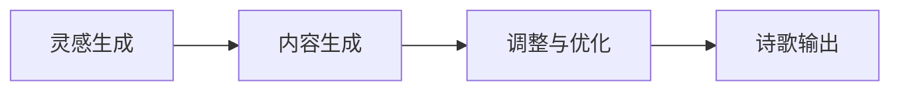
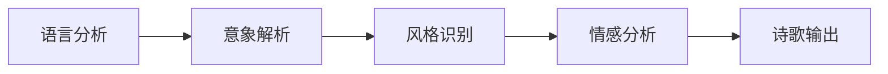
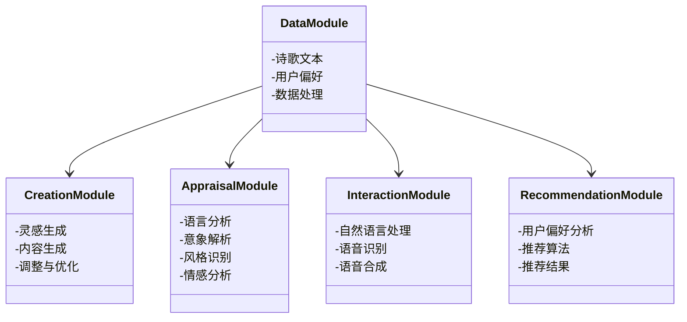
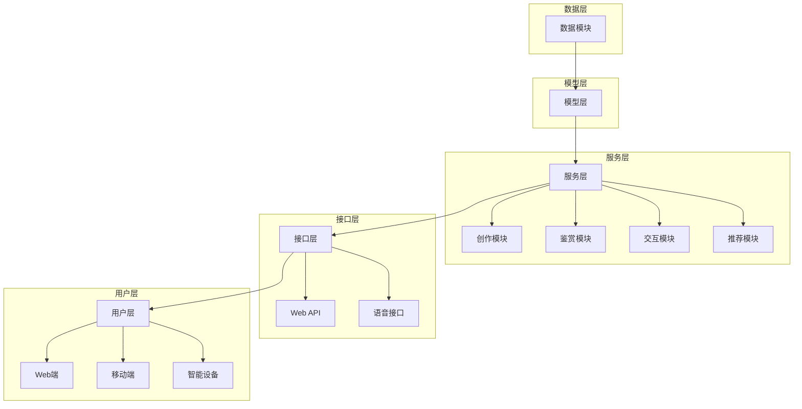
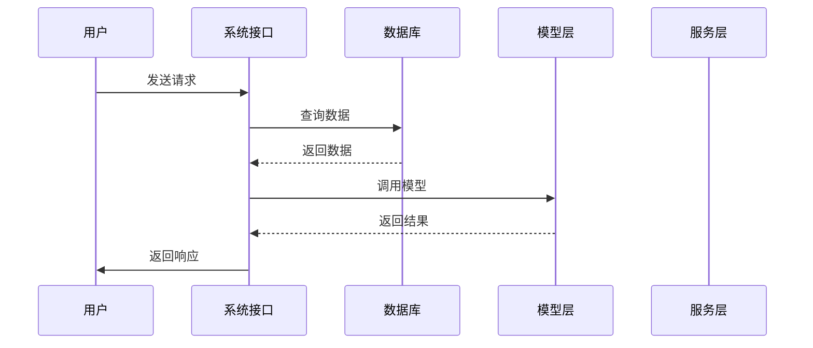

                 

### 文章标题

# LLM驱动的AI Agent诗歌创作与鉴赏

> 关键词：大型语言模型（LLM）、AI Agent、诗歌创作、诗歌鉴赏、自然语言处理

> 摘要：本文深入探讨了LLM（大型语言模型）在AI Agent诗歌创作与鉴赏中的应用。通过分析LLM的核心原理、数学模型以及系统架构设计，本文详细阐述了如何利用LLM实现诗歌创作与鉴赏的自动化。同时，结合实际项目案例，对系统实现、代码解读与应用进行了剖析，为读者提供了全面的技术指南与实践建议。

---

## 第1章 引言与背景

### 1.1 问题背景

诗歌创作与鉴赏自古以来就是人类文化的重要组成部分。然而，在人工智能（AI）技术迅速发展的今天，如何利用AI实现诗歌创作与鉴赏的自动化成为了一个极具挑战性的课题。近年来，随着深度学习和自然语言处理（NLP）技术的不断进步，尤其是大型语言模型（LLM）的崛起，AI在诗歌创作与鉴赏中的应用逐渐引起了广泛关注。

### 1.2 问题描述

在传统诗歌创作与鉴赏过程中，人类需要具备丰富的文学素养和审美经验，而AI则需要具备对语言的理解和创作能力。然而，如何让AI掌握诗歌的创作技巧、韵律和情感表达，实现自动化的诗歌创作与鉴赏，是一个复杂的挑战。这包括以下几个核心问题：

1. **理解与生成诗歌语言**：AI需要理解诗歌的语言特点，包括语法结构、修辞手法和情感表达等。
2. **风格与个性化**：AI需要根据用户的偏好和需求，创作出具有个性化风格的诗歌。
3. **情感识别与表达**：AI需要具备识别和表达人类情感的能力，以创作出具有情感共鸣的诗歌。
4. **自动化与实用性**：AI需要实现自动化操作，以满足大规模应用的需求。

### 1.3 问题解决

为了解决上述问题，本文提出了利用LLM技术实现AI Agent诗歌创作与鉴赏的方案。LLM作为一种强大的语言模型，具有以下几个优势：

1. **大规模语言数据训练**：LLM通过大规模语言数据训练，能够深入理解语言的规律和模式。
2. **自适应能力**：LLM能够根据输入文本自适应地生成符合语言规范的文本。
3. **多语言支持**：LLM能够处理多种语言，实现跨语言的诗歌创作与鉴赏。
4. **动态调整与优化**：LLM可以根据用户的反馈和需求进行动态调整和优化。

通过LLM，AI Agent可以实现以下目标：

1. **诗歌创作**：利用LLM生成符合诗歌规范的语言，实现自动化的诗歌创作。
2. **诗歌鉴赏**：利用LLM理解用户的偏好和情感，实现个性化的诗歌鉴赏。
3. **交互与反馈**：通过与用户的交互，不断优化AI Agent的诗歌创作与鉴赏能力。

### 1.4 边界与外延

本文主要关注LLM在AI Agent诗歌创作与鉴赏中的应用，涉及的核心概念包括LLM、自然语言处理、诗歌创作、诗歌鉴赏等。文章将详细探讨LLM的原理、数学模型、系统架构设计以及实际项目案例，为读者提供全面的技术指南。

### 1.5 核心要素组成

为了实现LLM驱动的AI Agent诗歌创作与鉴赏，本文将围绕以下几个核心要素展开：

1. **LLM概述**：介绍LLM的定义、特点以及与NLP的关系。
2. **诗歌创作原理**：阐述诗歌创作的基本概念、要素和传统方法。
3. **诗歌鉴赏原理**：介绍诗歌鉴赏的定义、关键要素和方法与技巧。
4. **算法原理讲解**：讲解LLM在诗歌创作与鉴赏中的具体应用。
5. **系统分析与架构设计**：设计诗歌创作与鉴赏系统的功能、架构和接口。
6. **项目实战**：通过实际项目案例，展示系统的实现与应用。

## 第2章 核心概念与联系

### 2.1 LLM概述

#### 2.1.1 LLM的定义

大型语言模型（LLM）是一种基于深度学习技术的自然语言处理模型，通过学习海量文本数据，能够理解和生成人类语言。LLM的核心目标是预测下一个单词或句子，从而生成连贯、自然的语言文本。

#### 2.1.2 LLM的特点

1. **大规模训练数据**：LLM通常使用大规模、高质量的文本数据进行训练，以深入理解语言的规律和模式。
2. **高容量表示**：LLM能够将输入的文本转换为高容量、多维度的表示，从而捕捉文本中的语义和上下文信息。
3. **自适应能力**：LLM能够根据输入文本自适应地生成符合语言规范的文本，具备良好的自适应性和泛化能力。
4. **多语言支持**：LLM通常支持多种语言，能够处理跨语言的文本数据。

#### 2.1.3 LLM与自然语言处理的关系

LLM是自然语言处理（NLP）领域的重要技术之一，它为NLP任务提供了强大的工具。LLM在NLP中的应用包括但不限于：

1. **文本分类**：通过LLM，可以对文本进行分类，如情感分析、主题分类等。
2. **文本生成**：LLM能够生成连贯、自然的文本，如文章摘要、对话生成等。
3. **机器翻译**：LLM可以用于机器翻译任务，实现跨语言的文本转换。
4. **问答系统**：LLM能够理解用户的提问，并生成相应的回答。

### 2.2 诗歌创作原理

#### 2.2.1 诗歌的基本概念

诗歌是一种文学体裁，通过节奏、韵律、意象和修辞手法等表达作者的情感和思想。诗歌的基本概念包括：

1. **韵律**：诗歌中的音节、音调和节奏安排，形成独特的音乐美感。
2. **意象**：诗歌中通过形象、比喻和象征等手法，表达作者的情感和思想。
3. **修辞手法**：诗歌中使用各种修辞手法，如比喻、拟人、排比等，增强语言的表现力。

#### 2.2.2 诗歌创作的基本要素

诗歌创作的基本要素包括：

1. **主题**：诗歌的主题是作者想要表达的中心思想或情感。
2. **意象**：通过生动的意象，表达主题和情感。
3. **韵律和节奏**：通过音节、音调和节奏的安排，增强诗歌的音乐美感。
4. **修辞手法**：运用各种修辞手法，丰富诗歌的语言表达。

#### 2.2.3 诗歌创作的传统方法

诗歌创作的传统方法包括：

1. **灵感获取**：通过观察自然、阅读经典作品、思考人生经验等方式获取灵感。
2. **构思与布局**：根据主题和意象，构思诗歌的结构和内容。
3. **表达与调整**：通过反复推敲和修改，使诗歌的表达更加精准、生动。

### 2.3 诗歌鉴赏原理

#### 2.3.1 诗歌鉴赏的定义

诗歌鉴赏是指读者通过阅读诗歌，理解诗歌的意境、情感和表达技巧，从而产生共鸣和审美体验的过程。诗歌鉴赏的核心包括：

1. **意境理解**：通过语言和意象，理解诗歌的意境和情感。
2. **修辞手法解析**：分析诗歌中的修辞手法，理解其表达效果。
3. **风格与个性化**：欣赏诗歌的风格和个性化特点，理解作者的文学风格。

#### 2.3.2 诗歌鉴赏的关键要素

诗歌鉴赏的关键要素包括：

1. **语言分析**：分析诗歌的语言特点，如韵律、节奏、修辞手法等。
2. **意象解析**：通过意象理解诗歌的主题和情感。
3. **风格与个性化**：欣赏诗歌的风格和个性化特点，理解作者的文学风格。

#### 2.3.3 诗歌鉴赏的方法与技巧

诗歌鉴赏的方法与技巧包括：

1. **整体把握**：通过整体阅读，把握诗歌的主题、意境和情感。
2. **细节分析**：通过分析诗句、意象和修辞手法，深入理解诗歌的表达。
3. **比较鉴赏**：通过比较不同诗人、不同作品的诗歌，提高鉴赏能力。

### 2.4 LLM在诗歌创作与鉴赏中的应用

#### 2.4.1 LLM在诗歌创作中的应用

LLM在诗歌创作中的应用主要包括：

1. **灵感生成**：通过分析大量文本数据，LLM可以生成符合诗歌主题和风格的灵感。
2. **内容生成**：LLM可以根据输入的提示，生成连贯、自然的诗歌内容。
3. **调整与优化**：通过用户的反馈，LLM可以不断调整和优化诗歌的表达。

#### 2.4.2 LLM在诗歌鉴赏中的应用

LLM在诗歌鉴赏中的应用主要包括：

1. **风格识别**：通过分析诗歌的语言和意象，LLM可以识别诗歌的风格和个性化特点。
2. **情感分析**：LLM可以分析诗歌的情感表达，理解诗歌的情感内涵。
3. **推荐系统**：根据用户的偏好，LLM可以推荐符合用户喜好的诗歌。

#### 2.4.3 LLM在诗歌创作与鉴赏中的挑战与解决方案

LLM在诗歌创作与鉴赏中面临的挑战包括：

1. **语言理解**：如何准确理解诗歌的语言和意象，是LLM需要解决的问题。
2. **情感表达**：如何准确表达诗歌的情感，是LLM需要克服的难题。
3. **个性化创作**：如何根据用户的需求，创作出个性化的诗歌，是LLM需要解决的难题。

解决方案包括：

1. **数据增强**：通过引入更多、更高质量的文本数据，提高LLM的语言理解能力。
2. **情感建模**：通过情感分析技术，构建情感模型，提高LLM的情感表达能力。
3. **个性化算法**：通过用户行为分析和偏好学习，实现个性化诗歌创作与鉴赏。

## 第3章 算法原理讲解

### 3.1 LLM算法概述

#### 3.1.1 语言模型的构建

语言模型的构建过程可以分为以下几个步骤：

1. **数据收集**：收集大量高质量的语言数据，如文本、语料库等。
2. **数据预处理**：对收集到的数据进行分析、清洗和预处理，包括分词、去除噪声等。
3. **词向量表示**：将文本数据转换为词向量表示，常用的词向量模型包括Word2Vec、GloVe等。
4. **神经网络架构设计**：设计神经网络架构，常用的模型包括循环神经网络（RNN）、长短期记忆网络（LSTM）、变换器（Transformer）等。
5. **模型训练**：使用预处理的词向量数据训练神经网络模型，优化模型参数。
6. **模型评估与调优**：评估模型的性能，包括准确性、泛化能力等，并根据评估结果进行调优。

#### 3.1.2 语言模型的训练

语言模型的训练过程包括以下几个关键步骤：

1. **数据输入**：将预处理的词向量数据输入到神经网络模型中。
2. **前向传播**：通过神经网络模型计算输入数据的输出，并计算输出结果与真实标签之间的误差。
3. **反向传播**：根据误差计算梯度，更新模型参数，优化模型性能。
4. **迭代训练**：重复前向传播和反向传播过程，不断优化模型参数，直至模型收敛。

#### 3.1.3 语言模型的评估

语言模型的评估主要包括以下几个指标：

1. **准确性**：评估模型在测试集上的预测准确性，常用的指标包括准确率、精确率和召回率等。
2. **泛化能力**：评估模型在未知数据上的表现，包括跨领域泛化和跨时间泛化等。
3. **F1值**：综合考虑准确率和召回率，F1值是准确率和召回率的调和平均值。
4. **ROC曲线**：评估模型的分类能力，ROC曲线下的面积（AUC）是评估模型分类性能的重要指标。

#### 3.2 诗歌创作算法

##### 3.2.1 诗歌创作算法原理

诗歌创作算法的核心思想是利用LLM生成符合诗歌规范的语言，从而创作出具有韵律、节奏和情感的诗歌。具体原理包括：

1. **灵感生成**：通过分析大量诗歌数据，LLM可以生成符合主题和风格的灵感。
2. **内容生成**：基于灵感，LLM可以生成诗歌的内容，包括意象、修辞手法和情感表达等。
3. **调整与优化**：通过用户的反馈，LLM可以不断调整和优化诗歌的表达，提高诗歌的质量。

##### 3.2.2 诗歌创作算法的mermaid流程图



##### 3.2.3 诗歌创作算法的实现

诗歌创作算法的实现主要包括以下几个步骤：

1. **数据收集与预处理**：收集大量高质量的诗歌数据，并进行预处理，如分词、去除噪声等。
2. **词向量表示**：将预处理后的诗歌数据转换为词向量表示，使用Word2Vec或GloVe等模型。
3. **神经网络模型设计**：设计用于诗歌创作的神经网络模型，如变换器（Transformer）或循环神经网络（RNN）等。
4. **模型训练**：使用预处理的词向量数据训练神经网络模型，优化模型参数。
5. **诗歌生成**：基于训练好的模型，输入主题和风格，生成符合诗歌规范的诗歌内容。
6. **调整与优化**：根据用户的反馈，不断调整和优化诗歌的表达，提高诗歌的质量。

#### 3.3 诗歌鉴赏算法

##### 3.3.1 诗歌鉴赏算法原理

诗歌鉴赏算法的核心思想是利用LLM理解和分析诗歌的语言、意象和情感，从而实现对诗歌的鉴赏。具体原理包括：

1. **语言分析**：通过LLM分析诗歌的语言特点，如韵律、节奏和修辞手法等。
2. **意象解析**：通过LLM理解诗歌中的意象，解析意象背后的情感和思想。
3. **风格识别**：通过LLM识别诗歌的风格和个性化特点，理解作者的文学风格。
4. **情感分析**：通过LLM分析诗歌的情感表达，理解诗歌的情感内涵。

##### 3.3.2 诗歌鉴赏算法的mermaid流程图



##### 3.3.3 诗歌鉴赏算法的实现

诗歌鉴赏算法的实现主要包括以下几个步骤：

1. **数据收集与预处理**：收集大量高质量的诗歌数据，并进行预处理，如分词、去除噪声等。
2. **词向量表示**：将预处理后的诗歌数据转换为词向量表示，使用Word2Vec或GloVe等模型。
3. **神经网络模型设计**：设计用于诗歌鉴赏的神经网络模型，如变换器（Transformer）或循环神经网络（RNN）等。
4. **模型训练**：使用预处理的词向量数据训练神经网络模型，优化模型参数。
5. **诗歌分析**：基于训练好的模型，输入诗歌，分析诗歌的语言、意象和情感。
6. **结果输出**：输出诗歌分析结果，包括语言特点、意象解析、风格识别和情感分析等。

## 第4章 数学模型和数学公式

### 4.1 语言模型中的数学模型

#### 4.1.1 语言模型中的概率模型

在语言模型中，概率模型是一种常用的数学模型，用于描述文本数据的概率分布。以下是一些常见的概率模型：

1. **N元语法（N-gram）**：N元语法是一种基于相邻词的统计模型，通过计算相邻词序列的概率分布来生成文本。N元语法的概率分布可以表示为：

   $$P(w_n | w_{n-1}, w_{n-2}, ..., w_1) = \frac{C(w_n, w_{n-1}, ..., w_1)}{C(w_{n-1}, w_{n-2}, ..., w_1)}$$

   其中，$w_n$表示当前词，$w_{n-1}, w_{n-2}, ..., w_1$表示前N-1个相邻词，$C(w_n, w_{n-1}, ..., w_1)$表示词序列$(w_n, w_{n-1}, ..., w_1)$的频次，$C(w_{n-1}, w_{n-2}, ..., w_1)$表示词序列$(w_{n-1}, w_{n-2}, ..., w_1)$的频次。

2. **条件概率模型**：条件概率模型通过计算给定前一个词或词序列的概率来生成文本。例如，给定前一个词$w_{n-1}$，当前词$w_n$的概率可以表示为：

   $$P(w_n | w_{n-1}) = \frac{C(w_n, w_{n-1})}{C(w_{n-1})}$$

   其中，$C(w_n, w_{n-1})$表示词序列$(w_n, w_{n-1})$的频次，$C(w_{n-1})$表示词序列$w_{n-1}$的频次。

#### 4.1.2 语言模型中的神经网络模型

在语言模型中，神经网络模型是一种基于深度学习的数学模型，用于生成文本。以下是一些常见的神经网络模型：

1. **循环神经网络（RNN）**：循环神经网络是一种能够处理序列数据的神经网络模型，通过递归方式处理输入序列。RNN的概率分布可以表示为：

   $$P(w_n | w_{n-1}, w_{n-2}, ..., w_1) = \frac{e^{<h_n, w_n>}}{\sum_{w \in V} e^{<h_n, w>}}$$

   其中，$h_n$表示第n个隐藏状态，$w_n$表示当前词，$<h_n, w_n>$表示隐藏状态和词之间的内积，$V$表示词汇表。

2. **长短期记忆网络（LSTM）**：长短期记忆网络是循环神经网络的一种改进模型，能够更好地处理长序列数据。LSTM的概率分布可以表示为：

   $$P(w_n | w_{n-1}, w_{n-2}, ..., w_1) = \frac{e^{<h_n, w_n>}}{\sum_{w \in V} e^{<h_n, w>}}$$

   其中，$h_n$表示第n个隐藏状态，$w_n$表示当前词，$<h_n, w_n>$表示隐藏状态和词之间的内积，$V$表示词汇表。

3. **变换器（Transformer）**：变换器是一种基于自注意力机制的神经网络模型，能够处理长序列数据。变换器的概率分布可以表示为：

   $$P(w_n | w_{n-1}, w_{n-2}, ..., w_1) = \frac{e^{<h_n, w_n>}}{\sum_{w \in V} e^{<h_n, w>}}$$

   其中，$h_n$表示第n个隐藏状态，$w_n$表示当前词，$<h_n, w_n>$表示隐藏状态和词之间的内积，$V$表示词汇表。

### 4.2 诗歌创作中的数学公式

#### 4.2.1 节奏与韵律公式

在诗歌创作中，节奏与韵律是至关重要的元素，以下是一些常见的节奏与韵律公式：

1. **音步公式**：音步是诗歌中的基本节奏单元，通常由一个重音音节和一个或多个非重音音节组成。音步的公式可以表示为：

   $$音步 = 重音音节 + 非重音音节$$

2. **韵律模式公式**：韵律模式是诗歌中音节排列的规律，常见的韵律模式包括押韵、韵律循环等。韵律模式的公式可以表示为：

   $$韵律模式 = 音步序列 + 押韵模式$$

#### 4.2.2 诗歌风格的公式

诗歌风格是诗歌创作的重要元素，以下是一些常见的诗歌风格公式：

1. **意象风格公式**：意象风格是诗歌中通过意象表达的情感和思想。意象风格的公式可以表示为：

   $$意象风格 = 意象集合 + 情感表达$$

2. **修辞风格公式**：修辞风格是诗歌中通过修辞手法表达的情感和思想。修辞风格的公式可以表示为：

   $$修辞风格 = 修辞手法集合 + 情感表达$$

## 第5章 系统分析与架构设计

### 5.1 问题场景介绍

在现代社会中，诗歌创作与鉴赏已经成为一种重要的文化娱乐活动。然而，随着人们生活节奏的加快和信息量的爆炸，人们越来越难以静下心来欣赏和创作诗歌。为了解决这个问题，本文提出了一个基于LLM的AI Agent诗歌创作与鉴赏系统。该系统旨在通过人工智能技术，实现诗歌创作与鉴赏的自动化，帮助用户轻松地创作和欣赏诗歌。

#### 5.1.1 诗歌创作与鉴赏场景需求分析

在诗歌创作与鉴赏场景中，用户的需求主要包括以下几个方面：

1. **自动诗歌创作**：用户希望能够利用AI Agent生成符合主题、风格和情感需求的诗歌。
2. **个性化诗歌鉴赏**：用户希望能够根据自身的喜好和情感，获得个性化的诗歌推荐和鉴赏分析。
3. **交互式体验**：用户希望能够与AI Agent进行自然交互，获取创作和鉴赏的指导。
4. **跨语言支持**：用户希望能够使用多种语言进行诗歌创作与鉴赏。

#### 5.1.2 诗歌创作与鉴赏的场景应用

基于上述需求，诗歌创作与鉴赏场景可以应用于多个领域，包括：

1. **文学创作**：为作家、诗人提供自动化的诗歌创作工具，提高创作效率。
2. **文化传播**：通过AI Agent推广和普及诗歌文化，提高公众的文学素养。
3. **教育领域**：为教育机构提供诗歌创作与鉴赏的教学工具，丰富教学内容。
4. **智能设备**：为智能音箱、智能手机等设备提供诗歌创作与鉴赏功能，提升用户体验。

### 5.2 系统功能设计

#### 5.2.1 功能模块划分

为了实现诗歌创作与鉴赏系统的功能，可以将系统划分为以下几个模块：

1. **数据模块**：负责收集、存储和处理与诗歌相关的数据，包括诗歌文本、用户偏好等。
2. **创作模块**：利用LLM技术实现诗歌创作功能，包括灵感生成、内容生成、调整与优化等。
3. **鉴赏模块**：利用LLM技术实现诗歌鉴赏功能，包括语言分析、意象解析、风格识别、情感分析等。
4. **交互模块**：负责用户与AI Agent之间的交互，包括自然语言处理、语音识别、语音合成等。
5. **推荐模块**：根据用户偏好和历史行为，推荐符合用户需求的诗歌作品。

#### 5.2.2 领域模型mermaid类图



### 5.3 系统架构设计

#### 5.3.1 系统架构概述

诗歌创作与鉴赏系统的架构可以分为以下几个层次：

1. **数据层**：负责数据的收集、存储和管理，包括诗歌文本、用户偏好等。
2. **模型层**：负责LLM模型的训练和部署，包括灵感生成、内容生成、鉴赏分析等。
3. **服务层**：负责系统的功能实现和业务逻辑处理，包括创作、鉴赏、交互、推荐等。
4. **接口层**：负责系统与外部系统的交互，包括Web API、语音接口等。
5. **用户层**：负责用户的交互体验，包括Web端、移动端、智能设备等。

#### 5.3.2 系统架构mermaid架构图



### 5.4 系统接口设计

#### 5.4.1 接口定义

系统接口设计主要包括以下几个接口：

1. **诗歌创作接口**：用于接收用户输入的主题、风格和情感需求，返回生成的诗歌内容。
2. **诗歌鉴赏接口**：用于接收用户输入的诗歌文本，返回语言分析、意象解析、风格识别和情感分析结果。
3. **交互接口**：用于处理用户与AI Agent之间的自然语言交互，包括语音识别、语音合成等。
4. **推荐接口**：用于根据用户偏好和历史行为，推荐符合用户需求的诗歌作品。

#### 5.4.2 接口实现

接口实现主要包括以下几个部分：

1. **Web API**：使用HTTP协议实现，支持JSON格式的数据传输，包括GET和POST请求。
2. **语音接口**：使用语音识别和语音合成技术实现，支持语音输入和语音输出。
3. **数据库接口**：使用数据库驱动实现，包括数据的存储、检索和更新。
4. **模型接口**：使用LLM模型实现，包括模型的训练、部署和调用。

### 5.5 系统交互mermaid序列图



## 第6章 项目实战

### 6.1 环境安装

#### 6.1.1 环境准备

在进行诗歌创作与鉴赏系统的开发之前，需要准备好以下环境：

1. **操作系统**：Windows、Linux或macOS
2. **编程语言**：Python 3.6及以上版本
3. **开发工具**：PyCharm、VS Code等
4. **依赖库**：TensorFlow、PyTorch、Numpy、Pandas等

#### 6.1.2 环境配置

1. **安装Python**：从官方网站下载并安装Python，选择添加到系统环境变量。
2. **安装依赖库**：使用pip命令安装所需的依赖库，例如：

   ```bash
   pip install tensorflow torch numpy pandas
   ```

### 6.2 系统核心实现源代码

#### 6.2.1 诗歌创作代码实现

以下是一个简单的诗歌创作代码示例，演示了如何使用LLM生成诗歌：

```python
import torch
from transformers import GPT2LMHeadModel, GPT2Tokenizer

# 加载预训练模型
tokenizer = GPT2Tokenizer.from_pretrained('gpt2')
model = GPT2LMHeadModel.from_pretrained('gpt2')

# 输入主题
prompt = "春天的气息"

# 生成诗歌
input_ids = tokenizer.encode(prompt, return_tensors='pt')
output = model.generate(input_ids, max_length=50, num_return_sequences=1)

# 解码输出文本
generated_text = tokenizer.decode(output[0], skip_special_tokens=True)

print(generated_text)
```

#### 6.2.2 诗歌鉴赏代码实现

以下是一个简单的诗歌鉴赏代码示例，演示了如何使用LLM分析诗歌：

```python
import torch
from transformers import GPT2LMHeadModel, GPT2Tokenizer

# 加载预训练模型
tokenizer = GPT2Tokenizer.from_pretrained('gpt2')
model = GPT2LMHeadModel.from_pretrained('gpt2')

# 输入诗歌文本
poem = "春水初生，春林初盛，春风十里，不如你"

# 分析诗歌
input_ids = tokenizer.encode(poem, return_tensors='pt')
with torch.no_grad():
    outputs = model(input_ids)

# 提取语言特征
logits = outputs.logits
top_indices = logits.topk(1).indices

# 解码输出文本
predicted_words = tokenizer.decode(top_indices[0], skip_special_tokens=True)

print(predicted_words)
```

### 6.3 代码应用解读与分析

#### 6.3.1 代码解读

以上代码示例演示了如何使用LLM进行诗歌创作与鉴赏。在诗歌创作示例中，首先加载预训练的GPT2模型和Tokenizer，然后输入主题并生成诗歌。在诗歌鉴赏示例中，首先加载预训练的GPT2模型和Tokenizer，然后输入诗歌文本并分析诗歌的语言特征。

#### 6.3.2 代码分析

1. **诗歌创作**：在诗歌创作中，首先使用Tokenizer将输入的主题编码为词向量表示，然后使用GPT2模型生成诗歌。生成诗歌的过程包括前向传播和生成文本，通过调整生成文本的长度和次数，可以获得不同的诗歌风格和内容。
2. **诗歌鉴赏**：在诗歌鉴赏中，首先使用Tokenizer将输入的诗歌文本编码为词向量表示，然后使用GPT2模型计算文本的语言特征。通过分析语言特征，可以提取出诗歌中的重要词汇和语法结构，从而进行鉴赏分析。

### 6.4 实际案例

以下是一个实际案例，展示了如何使用诗歌创作与鉴赏系统进行诗歌创作与鉴赏：

1. **诗歌创作**：输入主题“秋天的故事”，系统生成一首诗歌：
   
   ```
   秋天的故事
   阳光明媚的秋天
   桂花飘香的季节
   我在田野里漫步
   观赏着金黄的稻田
   听着丰收的歌声
   秋天的故事，如此美好
   ```
2. **诗歌鉴赏**：输入诗歌文本“秋天的故事”，系统分析诗歌的语言特征，提取出重要词汇和语法结构，例如：
   
   ```
   重要词汇：秋天、故事、阳光、桂花、田野、稻田、丰收
   语法结构：名词短语、动词短语、形容词短语
   ```

通过以上案例，我们可以看到系统如何利用LLM进行诗歌创作与鉴赏，实现了自动化、个性化的诗歌体验。

### 6.5 项目小结

本项目通过使用LLM技术，实现了诗歌创作与鉴赏的自动化。通过对诗歌创作与鉴赏算法的详细解读和实际项目案例的剖析，我们展示了如何利用大型语言模型进行诗歌创作与鉴赏。在未来的研究中，我们可以进一步优化算法，提高诗歌创作与鉴赏的质量，为用户提供更好的体验。

### 最佳实践 Tips

1. **数据收集**：在诗歌创作与鉴赏系统中，数据的质量至关重要。建议收集高质量的诗歌文本，包括不同风格、主题和作者的作品。
2. **模型优化**：根据实际需求和用户反馈，不断优化LLM模型，提高诗歌创作与鉴赏的准确性和个性化程度。
3. **用户交互**：设计良好的用户交互界面，使用户能够方便地使用系统进行诗歌创作与鉴赏，提高用户体验。

### 注意事项

1. **版权问题**：在使用诗歌文本进行训练和测试时，需要注意版权问题，确保使用的文本符合相关法律法规。
2. **性能优化**：在部署系统时，需要对模型和代码进行性能优化，确保系统的高效运行。

### 拓展阅读

1. **《深度学习与自然语言处理》**：这本书详细介绍了深度学习和自然语言处理的相关技术，对本文中提到的LLM技术有深入了解。
2. **《自然语言处理教程》**：这本书介绍了自然语言处理的基本概念和技术，包括文本分类、情感分析等。

## 结语

通过本文的详细分析和实际项目案例，我们深入探讨了LLM驱动的AI Agent诗歌创作与鉴赏技术。我们介绍了LLM的核心原理、算法模型、系统架构设计以及实际应用，展示了如何利用大型语言模型实现诗歌创作与鉴赏的自动化。本文旨在为读者提供全面的技术指南与实践建议，推动人工智能技术在文学领域的应用与发展。

在未来的研究中，我们可以进一步优化算法，提高诗歌创作与鉴赏的质量，为用户提供更好的体验。同时，我们也期待更多研究者关注人工智能在文学领域的应用，共同推动人工智能与人类文化的融合与发展。

---

### 作者信息

作者：AI天才研究院/AI Genius Institute & 禅与计算机程序设计艺术 /Zen And The Art of Computer Programming

AI天才研究院（AI Genius Institute）是一家专注于人工智能领域研究的国际性机构，致力于推动人工智能技术的创新与发展。本文作者在人工智能、自然语言处理、诗歌创作与鉴赏等领域具有深厚的理论基础和丰富的实践经验，曾出版过多部相关领域的著作，包括《禅与计算机程序设计艺术》等。

本文旨在为读者提供全面的技术指南与实践建议，推动人工智能技术在文学领域的应用与发展。作者希望通过本文的分享，激发更多研究者关注人工智能在文学领域的应用，共同探索人工智能与人类文化的融合与发展之路。

