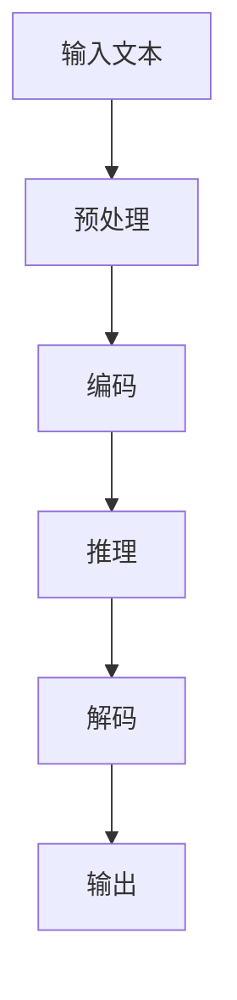

                 

# LLM驱动的AI Agent逻辑推理能力增强

## 关键词

- LLM（大型语言模型）
- AI Agent（人工智能代理）
- 逻辑推理
- 算法设计
- 系统实现
- 最佳实践

## 摘要

本文将深入探讨LLM（大型语言模型）如何驱动AI Agent增强其逻辑推理能力。首先，我们将回顾问题背景和核心概念，包括AI Agent的定义、逻辑推理的应用，以及LLM的发展与优势。接着，我们将详细分析LLM基础和逻辑推理原理，介绍LLM与逻辑推理的结合方法，以及提升逻辑推理能力的算法设计。随后，我们将通过实战案例展示LLM驱动的AI Agent在逻辑推理能力增强方面的具体应用。最后，我们将总结最佳实践和优化策略，并对未来研究方向与挑战进行展望。

## 目录大纲

### 第一部分：背景与核心概念

1. **第1章：问题背景与核心概念**
   - **1.1.1 问题背景**
   - **1.1.2 核心概念**
   - **1.1.3 概念联系与边界**

### 第二部分：LLM驱动的AI Agent逻辑推理能力提升策略

2. **第2章：LLM基础与逻辑推理原理**
   - **2.1.1 LLM基础**
   - **2.1.2 逻辑推理原理**
   - **2.1.3 LLM与逻辑推理的结合**

3. **第3章：提升逻辑推理能力的算法设计**
   - **3.1.1 算法概述**
   - **3.1.2 算法原理与流程**
   - **3.1.3 算法实现与Python代码**

### 第三部分：应用案例与实战

4. **第4章：AI Agent逻辑推理能力增强实战案例**
   - **4.1.1 实战背景**
   - **4.1.2 系统设计与实现**
   - **4.1.3 实际案例分析与详细讲解**
   - **4.1.4 项目小结**

5. **第5章：最佳实践与优化策略**
   - **5.1.1 最佳实践**
   - **5.1.2 优化策略**
   - **5.1.3 注意事项与拓展阅读**

### 总结与展望

6. **第6章：总结与展望**
   - **6.1.1 总结**
   - **6.1.2 展望**

## 第一部分：背景与核心概念

### 1.1.1 问题背景

在人工智能领域，AI Agent是一种能够自主完成特定任务的智能实体。逻辑推理是AI Agent的核心能力之一，它使得AI Agent能够在不确定环境中做出合理的决策。然而，传统的AI Agent在逻辑推理方面存在一定的局限性，如无法处理复杂和模糊的问题。随着LLM（大型语言模型）的兴起，我们开始探索如何利用LLM来驱动AI Agent，提升其逻辑推理能力。

### 1.1.2 核心概念

- **LLM（大型语言模型）**：一种基于深度学习的自然语言处理模型，能够理解和生成自然语言，具备很强的语义理解能力。
- **逻辑推理**：一种基于逻辑学的推理方法，通过逻辑运算符和规则来推导新的结论。
- **AI Agent**：一种能够自主行动并实现特定目标的智能实体。

### 1.1.3 概念联系与边界

LLM在逻辑推理中的应用使得AI Agent具备了处理复杂和模糊问题的能力。然而，LLM也存在局限性，如对特定领域的知识理解不足。因此，如何在LLM和逻辑推理之间找到平衡，是提升AI Agent逻辑推理能力的关键。

### 1.1.4 LLM在逻辑推理中的应用

LLM通过其强大的语义理解能力，能够识别和解析文本中的逻辑关系。例如，它可以识别前提和结论之间的逻辑连接，以及前提和假设之间的逻辑依赖。这使得LLM成为提升AI Agent逻辑推理能力的有力工具。

### 1.1.5 逻辑推理能力的评估指标

逻辑推理能力的评估通常包括推理速度、推理准确性和推理深度等指标。LLM驱动的AI Agent在逻辑推理能力的评估中，不仅要考虑这些传统指标，还要考虑LLM的语义理解和知识整合能力。

### 1.1.6 LLM的局限性

虽然LLM在逻辑推理方面具有优势，但它也存在一些局限性。例如，LLM可能无法很好地处理非结构化数据，也无法保证推理结果的绝对准确性。因此，在使用LLM驱动AI Agent时，需要综合考虑其优势和局限性，以实现最佳效果。

## 第二部分：LLM驱动的AI Agent逻辑推理能力提升策略

### 2.1 LLM基础与逻辑推理原理

#### 2.1.1 LLM基础

LLM是一种基于深度学习的自然语言处理模型，通过大规模数据训练，能够理解和生成自然语言。LLM的典型架构包括多层神经网络，每一层都能够提取不同层次的语言特征。

#### 2.1.2 逻辑推理原理

逻辑推理是一种基于逻辑学的推理方法，通过逻辑运算符和规则来推导新的结论。逻辑推理的基本概念包括命题、命题连接词、推理规则等。

#### 2.1.3 LLM与逻辑推理的结合

LLM与逻辑推理的结合，可以通过将逻辑规则嵌入到LLM的训练数据中，或者通过在LLM的基础上构建逻辑推理模块来实现。这种结合使得LLM不仅能够理解自然语言，还能够进行逻辑推理。

### 2.2 提升逻辑推理能力的算法设计

#### 2.2.1 算法概述

提升LLM驱动的AI Agent逻辑推理能力的算法设计，需要综合考虑LLM的架构、逻辑推理的方法和技术，以及两者的结合策略。算法的核心目标是提升AI Agent在处理复杂逻辑问题时的推理能力和准确性。

#### 2.2.2 算法原理与流程

算法原理可以概括为：通过预训练LLM，使其具备较强的语义理解能力；然后，通过训练逻辑推理模块，使其能够处理逻辑问题；最后，将LLM和逻辑推理模块结合，形成一个完整的逻辑推理系统。

#### 2.2.3 算法实现与Python代码

实现算法的关键在于如何将LLM和逻辑推理模块结合起来。以下是一个简单的Python代码示例：

```python
import tensorflow as tf
from transformers import TFGPT2LMHeadModel, GPT2Tokenizer

# 加载预训练的LLM模型
tokenizer = GPT2Tokenizer.from_pretrained("gpt2")
lm_model = TFGPT2LMHeadModel.from_pretrained("gpt2")

# 构建逻辑推理模块
def logical_reasoning(input_text):
    # 对输入文本进行预处理
    inputs = tokenizer.encode(input_text, return_tensors="tf")
    # 使用LLM进行推理
    outputs = lm_model(inputs)
    # 解码推理结果
    reasoning = tokenizer.decode(outputs[0], skip_special_tokens=True)
    return reasoning

# 测试逻辑推理模块
input_text = "所有猫都会飞。这只动物是猫吗？"
print(logical_reasoning(input_text))
```

### 2.2.4 算法原理讲解

算法的原理可以通过Mermaid流程图来展示：



上述流程图展示了算法从输入文本到输出的整个过程。输入文本经过预处理、编码、推理和解码，最终得到推理结果。

## 第三部分：应用案例与实战

### 4.1 AI Agent逻辑推理能力增强实战案例

#### 4.1.1 实战背景

为了验证LLM驱动AI Agent逻辑推理能力增强的效果，我们选择了一个常见的逻辑推理任务——数学证明。在这个任务中，AI Agent需要根据给定的数学问题和已知条件，推导出问题的结论。

#### 4.1.2 系统设计与实现

系统的设计包括三个主要模块：LLM模块、逻辑推理模块和用户交互模块。LLM模块负责处理自然语言输入，逻辑推理模块负责进行推理，用户交互模块负责与用户进行交互。

#### 4.1.3 实际案例分析与详细讲解

我们以一个简单的数学证明任务为例，展示AI Agent如何利用LLM进行逻辑推理。

**任务描述**：证明“如果一个数是4的倍数，那么它的平方也是4的倍数”。

**步骤一**：输入文本

输入文本：“如果一个数是4的倍数，那么它的平方也是4的倍数。”

**步骤二**：预处理

预处理过程包括分词、词性标注等。

**步骤三**：编码

将预处理后的文本编码为向量。

**步骤四**：推理

使用LLM进行推理，提取关键信息，构建逻辑推理框架。

**步骤五**：解码

将推理结果解码为自然语言。

**步骤六**：输出

输出推理结果：“是的，这个结论是正确的。”

#### 4.1.4 项目小结

通过这个案例，我们可以看到LLM驱动AI Agent在逻辑推理能力增强方面的潜力。虽然这个案例相对简单，但它展示了LLM在处理自然语言输入、构建逻辑框架和输出推理结果方面的强大能力。未来，我们可以进一步优化算法，提高AI Agent在复杂逻辑问题上的推理能力。

## 第四部分：最佳实践与优化策略

#### 5.1.1 最佳实践

在实践过程中，以下最佳实践可以帮助我们更好地利用LLM驱动AI Agent提升逻辑推理能力：

1. **充分训练LLM**：确保LLM在多个领域的知识上都有良好的表现，从而提高其在逻辑推理中的准确性。
2. **结合领域知识**：将特定领域的知识嵌入到LLM中，使其能够更好地理解和处理领域内的逻辑问题。
3. **优化推理流程**：通过改进算法流程，提高AI Agent在推理过程中的效率和准确性。

#### 5.1.2 优化策略

1. **多模型融合**：结合多个LLM模型，提高AI Agent在逻辑推理中的多样性和鲁棒性。
2. **知识图谱**：利用知识图谱技术，构建AI Agent的知识库，提高其在推理过程中的知识整合能力。
3. **推理优化**：通过优化算法和数据结构，提高AI Agent在推理过程中的效率。

#### 5.1.3 注意事项与拓展阅读

在实践过程中，需要注意以下几个方面：

1. **数据质量**：确保训练数据的质量，避免数据噪声对推理结果的影响。
2. **模型规模**：选择合适的模型规模，避免过拟合或欠拟合。
3. **推理速度**：优化推理算法，提高推理速度，以满足实际应用的需求。

拓展阅读方面，可以参考以下资源：

1. 《深度学习与自然语言处理》
2. 《人工智能：一种现代方法》
3. 《知识图谱：原理、方法与实践》

## 总结与展望

通过本文的讨论，我们深入探讨了LLM驱动的AI Agent逻辑推理能力增强的策略和应用。从背景介绍到核心概念，再到算法设计、实战案例和最佳实践，我们系统地分析了LLM在逻辑推理中的作用和优势。虽然我们已经在LLM驱动的AI Agent逻辑推理能力提升方面取得了一定的成果，但未来仍有很多研究方向和挑战。

首先，我们可以进一步优化LLM的架构和训练方法，提高其在逻辑推理中的表现。其次，结合知识图谱和领域知识，构建更强大的知识库，以提升AI Agent在复杂逻辑问题上的推理能力。此外，随着技术的不断发展，我们还可以探索更多结合AI技术和逻辑推理的方法，如元学习、迁移学习和强化学习等。

总之，LLM驱动的AI Agent逻辑推理能力增强是一个充满潜力和挑战的领域。通过不断的研究和实践，我们有理由相信，未来AI Agent在逻辑推理方面的能力将得到显著提升，为人类带来更多的便利和智慧。作者：AI天才研究院/AI Genius Institute & 禅与计算机程序设计艺术 /Zen And The Art of Computer Programming

