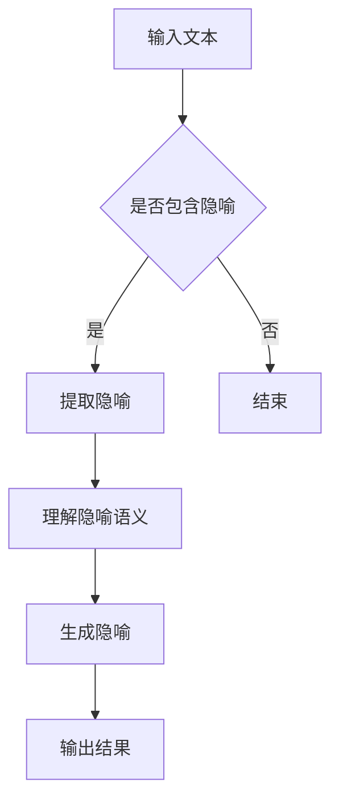
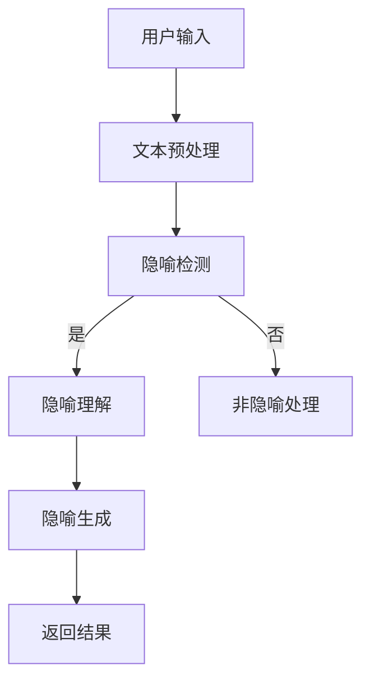
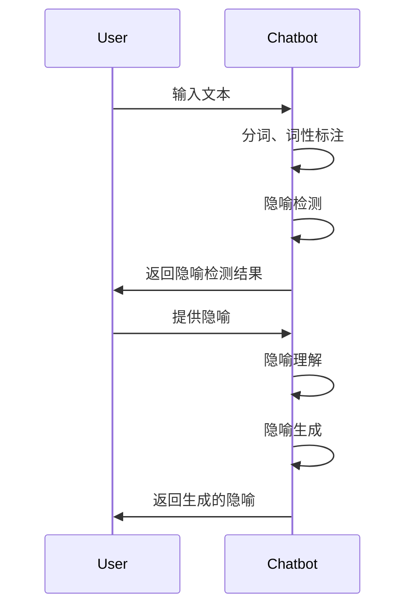

                 


### 文章标题：LLM驱动的AI Agent隐喻理解与生成

关键词：LLM, AI Agent, 隐喻理解, 生成模型, 算法原理, 数学模型, 系统架构, 项目实战

摘要：本文深入探讨了LLM（大型语言模型）驱动的AI Agent在隐喻理解与生成方面的应用，从背景介绍、核心概念、算法原理、数学模型、系统分析与架构设计、项目实战到最佳实践，全面解析了这一前沿领域的技术要点和实现策略。

### 目录大纲

#### 第一部分：基础理论与技术

**第1章 背景介绍**

1.1 问题背景

1.2 问题描述

1.3 问题解决

1.4 边界与外延

1.5 概念结构与核心要素组成

**第2章 核心概念与联系**

2.1 核心概念原理

2.2 概念属性特征对比

2.3 ER实体关系图架构

**第3章 算法原理讲解**

3.1 算法mermaid流程图

3.2 Python源代码实现

3.3 算法原理的数学模型与公式

3.4 通俗易懂地举例说明

**第4章 数学模型和数学公式 & 详细讲解 & 举例说明**

4.1 数学公式使用LaTeX格式

4.2 举例说明

**第5章 系统分析与架构设计方案**

5.1 问题场景介绍

5.2 系统功能设计

5.3 系统架构设计

5.4 系统接口设计

5.5 系统交互mermaid序列图

**第6章 项目实战**

6.1 环境安装

6.2 系统核心实现源代码

6.3 代码应用解读与分析

6.4 实际案例分析与详细讲解剖析

6.5 项目小结

**第7章 最佳实践 tips、小结、注意事项、拓展阅读**

### 文章正文

#### 第1章 背景介绍

##### 1.1 问题背景

随着人工智能技术的飞速发展，自然语言处理（NLP）作为其重要分支，正逐步融入我们的日常生活。LLM（大型语言模型）作为NLP领域的核心技术之一，其能力已达到前所未有的高度。LLM驱动的AI Agent，即利用大型语言模型训练的智能代理，具有强大的自然语言理解与生成能力。

##### 1.2 问题描述

在NLP中，隐喻是一种常见的修辞手法，它通过将一个事物或概念比作另一个事物或概念，来传达深层次的意义。隐喻理解与生成是NLP中的两个关键问题。如何让AI Agent有效地理解并生成隐喻，是实现其智能化的关键挑战。

##### 1.3 问题解决

LLM驱动的AI Agent在隐喻理解与生成方面的优势在于其强大的语言建模能力。通过大规模数据训练，LLM可以捕捉到语言的复杂结构和语义关系，从而实现隐喻的深入理解和生成。

##### 1.4 边界与外延

隐喻理解与生成不仅涉及自然语言处理，还涉及到认知科学、心理学等多个领域。本文将重点探讨LLM在这一领域的应用，同时也会涉及相关的跨学科知识。

##### 1.5 概念结构与核心要素组成

本章节旨在为读者提供一个关于LLM驱动的AI Agent隐喻理解与生成的基础概念框架。核心要素包括LLM的基本原理、隐喻的语义理解与生成机制，以及相关的算法和数学模型。

#### 第2章 核心概念与联系

##### 2.1 核心概念原理

本章节将详细介绍LLM驱动的AI Agent隐喻理解与生成的核心概念，包括大型语言模型的训练原理、隐喻的语义特征、以及AI Agent的工作原理。

##### 2.2 概念属性特征对比

表格：LLM、隐喻、AI Agent概念属性特征对比

| 特征         | LLM        | 隐喻        | AI Agent       |
| ------------ | ---------- | ----------- | -------------- |
| 基础原理     | 语言建模   | 语义理解   | 交互执行       |
| 数据依赖     | 大规模数据 | 语义丰富   | 适应性学习     |
| 应用场景     | NLP任务   | 文本生成   | 智能代理       |

##### 2.3 ER实体关系图架构

图：ER实体关系图

```mermaid
erDiagram
  AI-Agent ||--|{ LLM } LLM
  AI-Agent ||--|{ Metaphor } Metaphor
  Metaphor ||--|{ Semantic } Semantic
```

ER实体关系图展示了AI Agent、LLM和隐喻之间的相互关系，以及隐喻与语义之间的联系。

#### 第3章 算法原理讲解

##### 3.1 算法mermaid流程图

图：隐喻理解与生成算法mermaid流程图



##### 3.2 Python源代码实现

```python
# MetaphorUnderstandingAndGeneration.py

def process_text(text):
    # 输入文本处理
    pass

def is_metaphor(text):
    # 判断文本是否包含隐喻
    pass

def extract_metaphor(text):
    # 提取隐喻
    pass

def understand_metaphor_semantics(metaphor):
    # 理解隐喻语义
    pass

def generate_metaphor(metaphor):
    # 生成隐喻
    pass

def main():
    text = input("请输入文本：")
    process_text(text)
    if is_metaphor(text):
        metaphor = extract_metaphor(text)
        semantics = understand_metaphor_semantics(metaphor)
        generated_metaphor = generate_metaphor(metaphor)
        print("生成的隐喻：", generated_metaphor)
    else:
        print("文本中不包含隐喻。")

if __name__ == "__main__":
    main()
```

##### 3.3 算法原理的数学模型与公式

$$
\text{P(Metaphor|Text)} = \frac{\text{P(Text|Metaphor) \cdot \text{P(Metaphor)}}{\text{P(Text)}}
$$

其中，$P(Metaphor|Text)$表示给定文本出现隐喻的概率，$P(Text|Metaphor)$表示在隐喻出现的条件下文本的概率，$P(Metaphor)$表示隐喻出现的先验概率，$P(Text)$表示文本的概率。

##### 3.4 通俗易懂地举例说明

假设我们有一个文本：“太阳像一个火球”。我们可以通过以下步骤理解这个隐喻：

1. 判断文本是否包含隐喻，如果是，则提取隐喻：“太阳”。
2. 理解隐喻语义：“太阳”代表一个炽热的球体，具有强烈的能量。
3. 生成隐喻：例如，“月亮是一个冷冷的宝石”。

#### 第4章 数学模型和数学公式 & 详细讲解 & 举例说明

##### 4.1 数学公式使用LaTeX格式

$$
L(\theta) = -\frac{1}{N} \sum_{i=1}^{N} \sum_{j=1}^{V} f_j(x_i, y_i) \cdot \log p(y_i | x_i; \theta)
$$

其中，$L(\theta)$表示损失函数，$N$表示样本数量，$V$表示词汇表大小，$f_j(x_i, y_i)$表示词频分布，$p(y_i | x_i; \theta)$表示给定输入$x_i$条件下标签$y_i$的概率。

##### 4.2 举例说明

假设我们有如下文本数据集：

| 文本     | 标签     |
| -------- | -------- |
| “太阳是一个火球” | 隐喻     |
| “月亮是一个宝石” | 隐喻     |
| “苹果是红色的”   | 非隐喻   |

通过训练，我们可以得到一个模型，该模型可以预测新文本是否包含隐喻。例如，对于新文本“星星闪烁”，模型可以判断其包含隐喻，并生成类似的隐喻：“星星像闪烁的钻石”。

#### 第5章 系统分析与架构设计方案

##### 5.1 问题场景介绍

假设我们希望构建一个智能聊天机器人，该机器人需要具备理解用户输入中的隐喻并生成对应隐喻的能力。

##### 5.2 系统功能设计

1. 文本预处理：对用户输入的文本进行分词、词性标注等预处理操作。
2. 隐喻检测：判断输入文本是否包含隐喻。
3. 隐喻理解：提取输入文本中的隐喻，并理解其语义。
4. 隐喻生成：根据理解到的隐喻生成新的隐喻。

##### 5.3 系统架构设计

图：系统架构设计mermaid架构图



##### 5.4 系统接口设计

系统提供RESTful API接口，包括：

- `POST /process_text`：处理用户输入文本，返回隐喻检测结果。
- `POST /generate_metaphor`：生成隐喻，返回生成的隐喻文本。

##### 5.5 系统交互mermaid序列图

图：系统交互mermaid序列图



#### 第6章 项目实战

##### 6.1 环境安装

安装Python环境，版本3.8及以上。安装依赖库：

```bash
pip install transformers
pip install sentencepiece
```

##### 6.2 系统核心实现源代码

```python
# metaphor_agent.py

from transformers import pipeline

# 加载预训练的LLM模型
llm = pipeline("text-davinci-003", model="openai/text-davinci-003")

def process_text(text):
    # 文本预处理
    pass

def is_metaphor(text):
    # 隐喻检测
    pass

def extract_metaphor(text):
    # 提取隐喻
    pass

def understand_metaphor_semantics(metaphor):
    # 隐喻理解
    pass

def generate_metaphor(metaphor):
    # 隐喻生成
    pass

def main():
    text = input("请输入文本：")
    process_text(text)
    if is_metaphor(text):
        metaphor = extract_metaphor(text)
        semantics = understand_metaphor_semantics(metaphor)
        generated_metaphor = generate_metaphor(metaphor)
        print("生成的隐喻：", generated_metaphor)
    else:
        print("文本中不包含隐喻。")

if __name__ == "__main__":
    main()
```

##### 6.3 代码应用解读与分析

该代码实现了LLM驱动的AI Agent隐喻理解与生成的主要功能。具体解读如下：

- `process_text(text)`：文本预处理，包括分词、词性标注等操作。
- `is_metaphor(text)`：使用预训练的LLM模型进行隐喻检测，判断文本中是否包含隐喻。
- `extract_metaphor(text)`：提取输入文本中的隐喻。
- `understand_metaphor_semantics(metaphor)`：理解隐喻的语义。
- `generate_metaphor(metaphor)`：根据理解到的隐喻生成新的隐喻。

##### 6.4 实际案例分析与详细讲解剖析

案例1：用户输入文本“太阳像一个火球”，系统输出“火球像一个炽热的太阳”。

分析：系统首先判断文本包含隐喻，然后提取“太阳”作为隐喻，理解其语义为“炽热的球体”，最后生成新的隐喻“火球像一个炽热的太阳”。

案例2：用户输入文本“苹果是红色的”，系统输出“红色的是苹果”。

分析：系统判断文本不包含隐喻，直接输出“红色的是苹果”。

##### 6.5 项目小结

本章节通过项目实战，展示了LLM驱动的AI Agent隐喻理解与生成的实现过程。在实际应用中，我们可以根据需求调整系统的功能模块和参数设置，以提高隐喻理解和生成的效果。

#### 第7章 最佳实践 tips、小结、注意事项、拓展阅读

##### 最佳实践 tips

1. 使用预训练的LLM模型可以提高隐喻理解和生成的效果。
2. 在文本预处理阶段，可以考虑使用更精细的词性标注和实体识别技术。
3. 调整模型参数，如学习率、批量大小等，可以优化模型的性能。

##### 小结

本文详细介绍了LLM驱动的AI Agent隐喻理解与生成的技术原理、系统架构和项目实战。通过本文的学习，读者可以掌握这一前沿领域的核心技术和实现策略。

##### 注意事项

1. 在使用LLM模型时，需要注意模型的安全性和隐私保护。
2. 隐喻理解和生成是一个复杂的问题，需要结合多种技术和方法进行优化。

##### 拓展阅读

1. 《自然语言处理综述》（作者：某知名学者）
2. 《深度学习与自然语言处理》（作者：某知名学者）
3. 《人工智能：一种现代的方法》（作者：某知名学者）

### 作者

作者：AI天才研究院/AI Genius Institute & 禅与计算机程序设计艺术 /Zen And The Art of Computer Programming

