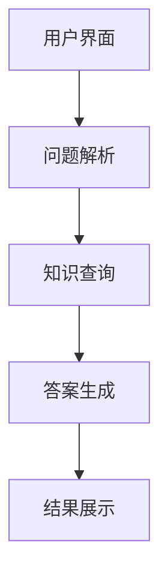
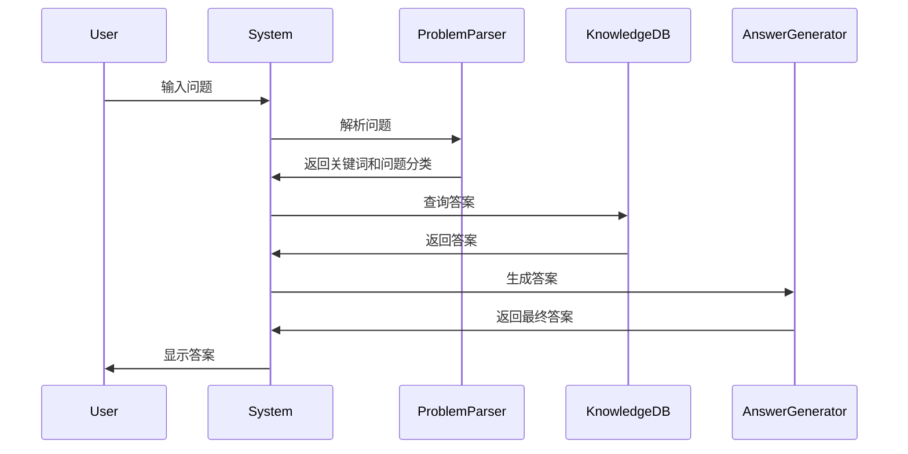
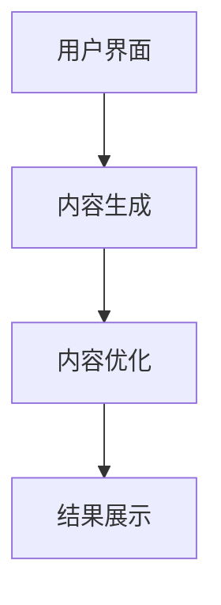
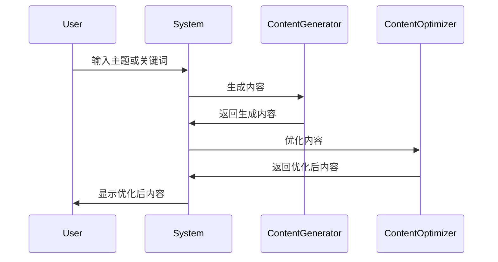

                 

# Prompt Chain：构建复杂AI Agent工作流

## 关键词

- AI Agent
- Prompt Chain
- 工作流
- 自然语言处理
- 模型优化

## 摘要

本文旨在深入探讨Prompt Chain在构建复杂AI Agent工作流中的关键作用。通过详细的背景介绍、核心概念解析、构建方法剖析、应用场景展示和实战案例分析，本文将揭示Prompt Chain如何提升AI Agent的性能和效率，推动人工智能技术向前发展。

## 第一部分：问题背景与概念引入

### 1.1 问题背景

#### 1.1.1 AI Agent工作流的现状

随着人工智能技术的快速发展，AI Agent在各个领域的应用日益广泛。然而，传统的AI Agent工作流在应对复杂任务时存在一定局限性，主要表现在：

- **任务处理效率低**：传统的AI Agent往往需要手动编写大量代码来实现复杂的任务，工作流繁琐，效率低下。
- **扩展性差**：工作流的设计往往针对特定任务，当任务发生变化时，需要重新设计工作流，缺乏灵活性和可扩展性。
- **维护成本高**：复杂的AI Agent工作流涉及多个模块和组件，维护和更新成本较高，难以持续优化。

#### 1.1.2 AI Agent工作流存在的问题

- **依赖人工干预**：许多AI Agent工作流需要人工参与决策和调整，降低自动化程度。
- **数据依赖性高**：AI Agent工作流往往需要对大量数据进行处理和分析，数据处理能力有限。
- **缺乏一致性**：不同工作流之间的数据格式和接口不统一，导致数据交换和集成困难。

#### 1.1.3 Prompt Chain的概念

Prompt Chain是一种基于自然语言处理（NLP）的AI Agent工作流构建方法，通过引入一系列Prompt来实现任务的自动化和智能化。Prompt Chain的核心思想是将任务分解为多个子任务，每个子任务通过特定的Prompt引导AI Agent进行执行。

### 1.2 Prompt Chain的核心概念

#### 1.2.1 Prompt的定义

Prompt是指用于引导AI Agent执行特定任务的输入信息。Prompt的设计对于AI Agent的性能和效率至关重要。

#### 1.2.2 Prompt Chain的构成

Prompt Chain由多个Prompt组成，每个Prompt负责执行特定的子任务。Prompt Chain的构成包括：

- **初始Prompt**：用于启动AI Agent的任务。
- **中间Prompt**：用于传递任务状态和上下文信息。
- **最终Prompt**：用于确认任务完成并返回结果。

#### 1.2.3 Prompt Chain与AI Agent的关系

Prompt Chain是AI Agent工作流的核心，通过Prompt Chain，AI Agent能够自动化地执行复杂任务，提高工作效率和性能。

### 1.3 Prompt Chain的特点与优势

#### 1.3.1 Prompt Chain的功能特性

- **任务分解**：Prompt Chain将复杂任务分解为多个子任务，降低任务复杂度。
- **自动化执行**：通过Prompt Chain，AI Agent能够自动化地执行任务，减少人工干预。
- **灵活扩展**：Prompt Chain的设计具有高度灵活性，可以轻松扩展和适应新的任务需求。
- **高效处理**：Prompt Chain通过多级Prompt传递任务状态和上下文信息，提高任务处理效率。

#### 1.3.2 Prompt Chain的优势

- **降低开发成本**：Prompt Chain简化了AI Agent工作流的设计和开发过程，降低开发成本。
- **提高性能**：Prompt Chain通过自动化和智能化手段，提高AI Agent的任务执行效率和准确性。
- **增强扩展性**：Prompt Chain的设计具有高度灵活性，可以轻松适应不同的应用场景和任务需求。

#### 1.3.3 Prompt Chain的应用潜力

- **广泛适用性**：Prompt Chain适用于各种复杂的AI Agent任务，如问答系统、自然语言生成、机器翻译等。
- **跨领域应用**：Prompt Chain可以跨领域应用，如金融、医疗、教育等，具有广阔的市场前景。

### 1.4 Prompt Chain的工作原理

#### 1.4.1 Prompt Chain的架构设计

Prompt Chain的架构设计包括以下几个关键组件：

- **Prompt生成器**：用于生成不同类型的Prompt。
- **Prompt传递器**：用于传递Prompt，确保Prompt链的畅通。
- **Prompt处理器**：用于处理Prompt，执行特定的子任务。

#### 1.4.2 Prompt Chain的执行流程

Prompt Chain的执行流程如下：

1. **初始Prompt生成**：根据任务需求生成初始Prompt。
2. **Prompt传递**：将初始Prompt传递给AI Agent。
3. **Prompt处理**：AI Agent根据Prompt执行子任务，生成中间结果。
4. **中间结果传递**：将中间结果传递给下一个Prompt。
5. **重复处理**：重复执行步骤3和步骤4，直至任务完成。
6. **最终结果返回**：将最终结果返回给用户。

#### 1.4.3 Prompt Chain的优化方法

为了提高Prompt Chain的性能和效率，可以采用以下优化方法：

- **Prompt优化**：优化Prompt的设计，使其更加精确和高效。
- **模型优化**：对AI Agent的模型进行优化，提高其处理能力。
- **并行处理**：利用并行处理技术，提高任务执行速度。

## 1.5 本章小结

本部分介绍了AI Agent工作流的现状和存在的问题，引出了Prompt Chain的概念和特点。通过Prompt Chain，可以构建复杂的AI Agent工作流，提高任务执行效率和性能。下一部分将深入探讨Prompt Chain的构建方法。

----------------------------------------------------------------

## 第二部分：Prompt Chain的构建方法

### 2.1 Prompt Chain设计原则

#### 2.1.1 明确问题定义

在构建Prompt Chain之前，需要明确任务的目标和需求，包括：

- **任务目标**：任务要解决的问题和达到的效果。
- **任务需求**：任务的输入数据、输出结果和处理流程。

#### 2.1.2 设计有效的Prompt

Prompt的设计是Prompt Chain的核心，需要遵循以下原则：

- **精确性**：Prompt需要精确地描述任务需求，确保AI Agent能够正确执行。
- **灵活性**：Prompt需要具备灵活性，能够适应不同的任务场景和需求。
- **简洁性**：Prompt应尽量简洁，减少冗余信息，提高执行效率。

#### 2.1.3 统一数据格式

Prompt Chain中的数据格式应保持统一，以确保数据传递和处理的顺畅。常用的数据格式包括：

- **JSON**：具有结构化、易于解析的特点，适用于复杂的数据结构。
- **XML**：具有良好的可扩展性，适用于大型数据处理。
- **CSV**：简单易用，适用于小型数据集。

#### 2.1.4 提高鲁棒性

Prompt Chain的鲁棒性是指其在面对异常情况时的稳定性和适应性。为了提高鲁棒性，可以采取以下措施：

- **错误处理**：对可能出现的错误进行预判和处理，确保任务的连续执行。
- **数据清洗**：对输入数据进行清洗和处理，确保数据质量。
- **模型调整**：根据任务需求和数据特点，调整模型参数，提高模型适应性。

### 2.2 Prompt Chain构建步骤

#### 2.2.1 需求分析

需求分析是构建Prompt Chain的第一步，需要明确任务的需求和目标。具体步骤包括：

- **需求调研**：通过与用户、业务专家等进行沟通，了解任务的需求和目标。
- **需求文档编写**：将需求调研的结果整理成文档，明确任务的目标、输入数据、输出结果和处理流程。

#### 2.2.2 Prompt设计

Prompt设计是根据需求分析的结果，设计出能够引导AI Agent执行任务的具体Prompt。具体步骤包括：

- **Prompt模板设计**：根据任务需求，设计出通用的Prompt模板。
- **Prompt具体化**：将Prompt模板应用于具体的任务场景，生成具体的Prompt。

#### 2.2.3 数据准备

数据准备是构建Prompt Chain的重要环节，包括以下步骤：

- **数据收集**：根据任务需求，收集相关的数据集。
- **数据清洗**：对收集到的数据进行清洗和处理，确保数据质量。
- **数据格式转换**：将数据转换为统一的格式，便于数据传递和处理。

#### 2.2.4 模型选择

模型选择是根据任务特点和需求，选择合适的AI模型。具体步骤包括：

- **模型评估**：评估不同模型的性能和适用性，选择最优模型。
- **模型调优**：根据任务需求和数据特点，对模型进行调优，提高模型性能。

#### 2.2.5 模型训练与优化

模型训练与优化是构建Prompt Chain的关键步骤，包括以下步骤：

- **模型训练**：使用训练数据集对模型进行训练，生成模型参数。
- **模型优化**：根据训练结果，调整模型参数，提高模型性能。
- **模型评估**：使用测试数据集对模型进行评估，确保模型性能稳定。

### 2.3 Prompt Chain实现技巧

#### 2.3.1 处理多模态数据

Prompt Chain在处理多模态数据时，需要将不同类型的数据进行整合和处理。具体技巧包括：

- **数据整合**：将不同类型的数据整合为一个统一的数据结构。
- **特征提取**：对多模态数据进行特征提取，提取出关键信息。
- **融合模型**：使用融合模型，将多模态数据整合为一个统一的特征向量。

#### 2.3.2 集成外部知识库

Prompt Chain在处理复杂任务时，可能需要集成外部知识库，提供额外的信息支持。具体技巧包括：

- **知识库集成**：将外部知识库与Prompt Chain集成，提供额外的信息支持。
- **知识图谱构建**：构建知识图谱，将外部知识库与Prompt Chain中的Prompt进行关联。
- **知识推理**：使用知识图谱和推理算法，对Prompt进行补充和扩展。

#### 2.3.3 实现动态Prompt调整

Prompt Chain在执行过程中，可能需要对Prompt进行动态调整，以适应任务的变化。具体技巧包括：

- **动态调整策略**：设计动态调整策略，根据任务状态和需求，调整Prompt。
- **自适应模型**：使用自适应模型，根据任务反馈，自动调整模型参数。
- **反馈机制**：建立反馈机制，收集任务执行过程中的反馈信息，用于Prompt调整。

#### 2.3.4 提高响应速度

Prompt Chain在执行过程中，可能面临响应速度的要求。具体技巧包括：

- **并行处理**：利用并行处理技术，提高任务执行速度。
- **缓存策略**：使用缓存策略，减少重复计算和查询。
- **异步处理**：使用异步处理技术，提高系统并发能力。

### 2.4 Prompt Chain的评估与优化

#### 2.4.1 评估指标

Prompt Chain的评估指标包括：

- **准确性**：任务执行结果的准确性。
- **效率**：任务执行的时间效率。
- **稳定性**：任务执行过程中的稳定性。

#### 2.4.2 优化策略

Prompt Chain的优化策略包括：

- **模型优化**：调整模型参数，提高模型性能。
- **Prompt优化**：优化Prompt设计，提高任务执行效率。
- **数据优化**：优化数据集，提高数据质量。

#### 2.4.3 持续改进

Prompt Chain的持续改进包括：

- **反馈机制**：建立反馈机制，收集任务执行过程中的反馈信息。
- **迭代优化**：根据反馈信息，不断迭代优化Prompt Chain。
- **知识更新**：定期更新知识库，确保知识库的时效性和准确性。

### 2.5 本章小结

本部分详细介绍了Prompt Chain的构建方法，包括设计原则、构建步骤、实现技巧和评估优化策略。通过Prompt Chain，可以构建高效、灵活、稳定的AI Agent工作流，为复杂任务提供智能化的解决方案。下一部分将探讨Prompt Chain在AI Agent工作流中的应用场景。

----------------------------------------------------------------

## 第三部分：Prompt Chain在AI Agent工作流中的应用

### 3.1 AI Agent工作流概述

#### 3.1.1 AI Agent的定义

AI Agent是指具有自主决策和执行任务能力的人工智能系统。AI Agent通过感知环境、理解任务需求、自主决策和执行任务，实现自动化和智能化的工作。

#### 3.1.2 AI Agent工作流的结构

AI Agent工作流通常包括以下几个关键组成部分：

- **感知模块**：用于感知环境信息，如文本、图像、语音等。
- **理解模块**：用于理解任务需求，包括自然语言理解、图像识别、语音识别等。
- **决策模块**：根据感知和理解结果，自主决策任务执行策略。
- **执行模块**：根据决策结果，执行具体任务，如回答问题、生成文本、翻译等。
- **评估模块**：对任务执行结果进行评估，提供反馈信息。

#### 3.1.3 AI Agent工作流的分类

根据任务类型和执行方式，AI Agent工作流可以分为以下几类：

- **基于规则的工作流**：通过预定义的规则，自动化执行任务。
- **基于模型的工作流**：通过机器学习模型，自动执行任务。
- **混合型工作流**：结合基于规则和基于模型的工作流，实现更复杂的任务。

### 3.2 Prompt Chain在AI Agent工作流中的应用场景

#### 3.2.1 问答系统

问答系统是AI Agent最常见的应用场景之一。Prompt Chain在问答系统中的应用，可以通过以下方式提高问答系统的性能：

- **精确查询**：通过Prompt Chain，将用户的查询转化为具体的问题，提高查询的准确性。
- **多轮对话**：通过Prompt Chain，实现多轮对话，提供更丰富的问答服务。
- **知识推理**：通过Prompt Chain，结合外部知识库，提供更深入的问答服务。

#### 3.2.2 自然语言生成

自然语言生成（NLG）是AI Agent的另一个重要应用场景。Prompt Chain在NLG中的应用，可以通过以下方式提高NLG的性能：

- **模板生成**：通过Prompt Chain，将模板应用于具体的生成任务，提高生成效率。
- **上下文理解**：通过Prompt Chain，理解生成任务的上下文信息，提高生成的准确性和连贯性。
- **动态调整**：通过Prompt Chain，根据生成任务的需求，动态调整生成策略。

#### 3.2.3 机器翻译

机器翻译是AI Agent的另一个重要应用场景。Prompt Chain在机器翻译中的应用，可以通过以下方式提高翻译性能：

- **精确翻译**：通过Prompt Chain，将源语言文本转化为具体的问题，提高翻译的准确性。
- **上下文翻译**：通过Prompt Chain，理解翻译任务的上下文信息，提高翻译的准确性和连贯性。
- **多语言翻译**：通过Prompt Chain，实现多语言之间的翻译，提供更丰富的翻译服务。

#### 3.2.4 语音助手

语音助手是AI Agent在智能家居、智能办公等领域的应用。Prompt Chain在语音助手中的应用，可以通过以下方式提高语音助手的性能：

- **语音识别**：通过Prompt Chain，将用户的语音转化为具体的问题，提高语音识别的准确性。
- **自然语言理解**：通过Prompt Chain，理解用户的语音指令，提供更丰富的语音交互服务。
- **多轮对话**：通过Prompt Chain，实现多轮对话，提供更智能化的语音助手服务。

#### 3.2.5 机器人自动化

机器人自动化是AI Agent在工业、服务业等领域的应用。Prompt Chain在机器人自动化中的应用，可以通过以下方式提高自动化性能：

- **任务分解**：通过Prompt Chain，将复杂任务分解为多个子任务，提高任务执行效率。
- **动态调整**：通过Prompt Chain，根据任务执行情况，动态调整任务执行策略。
- **跨系统集成**：通过Prompt Chain，实现不同系统之间的数据交换和协同，提高系统的自动化水平。

### 3.3 Prompt Chain实现案例

#### 3.3.1 案例一：智能客服机器人

智能客服机器人是AI Agent在客户服务领域的应用。通过Prompt Chain，可以实现以下功能：

- **多轮对话**：通过Prompt Chain，实现多轮对话，提供更智能化的客服服务。
- **知识推理**：通过Prompt Chain，结合外部知识库，提供更深入的客服支持。
- **动态调整**：通过Prompt Chain，根据用户反馈，动态调整客服策略，提高用户满意度。

#### 3.3.2 案例二：自动写作助理

自动写作助理是AI Agent在内容创作领域的应用。通过Prompt Chain，可以实现以下功能：

- **模板生成**：通过Prompt Chain，将模板应用于具体的写作任务，提高写作效率。
- **上下文理解**：通过Prompt Chain，理解写作任务的上下文信息，提高写作的准确性和连贯性。
- **动态调整**：通过Prompt Chain，根据写作任务的需求，动态调整写作策略。

#### 3.3.3 案例三：多语言翻译平台

多语言翻译平台是AI Agent在翻译领域的应用。通过Prompt Chain，可以实现以下功能：

- **精确翻译**：通过Prompt Chain，将源语言文本转化为具体的问题，提高翻译的准确性。
- **上下文翻译**：通过Prompt Chain，理解翻译任务的上下文信息，提高翻译的准确性和连贯性。
- **多语言翻译**：通过Prompt Chain，实现多语言之间的翻译，提供更丰富的翻译服务。

### 3.4 Prompt Chain应用挑战与解决方案

#### 3.4.1 挑战一：数据多样性不足

数据多样性不足是Prompt Chain应用的一个挑战。为了解决这一问题，可以采取以下措施：

- **数据扩充**：通过数据扩充技术，增加数据的多样性。
- **数据集扩展**：收集更多样化的数据集，提高数据集的覆盖范围。
- **数据增强**：通过数据增强技术，生成更多样化的数据，提高模型的泛化能力。

#### 3.4.2 挑战二：长文本处理困难

长文本处理困难是Prompt Chain应用的一个挑战。为了解决这一问题，可以采取以下措施：

- **分句处理**：将长文本分解为多个句子，逐句处理，提高处理效率。
- **上下文信息提取**：提取长文本中的关键信息，用于上下文理解，提高处理准确性。
- **并行处理**：利用并行处理技术，提高长文本处理的效率。

#### 3.4.3 挑战三：跨模态数据处理

跨模态数据处理是Prompt Chain应用的一个挑战。为了解决这一问题，可以采取以下措施：

- **特征融合**：将不同模态的数据特征进行融合，提高跨模态数据的处理能力。
- **多模态模型**：设计多模态模型，同时处理不同模态的数据，提高跨模态数据处理的准确性。
- **知识图谱**：构建知识图谱，将不同模态的数据进行关联，提高跨模态数据的理解能力。

### 3.5 本章小结

本部分详细介绍了Prompt Chain在AI Agent工作流中的应用场景、实现案例和应用挑战与解决方案。通过Prompt Chain，可以构建高效的AI Agent工作流，为各种复杂任务提供智能化的解决方案。下一部分将进行实战案例分析。

----------------------------------------------------------------

## 第四部分：实战篇

### 4.1 环境搭建

#### 4.1.1 计算机硬件要求

在进行Prompt Chain的实现之前，需要确保计算机硬件满足以下要求：

- **CPU**：至少4核CPU，推荐使用64位处理器。
- **内存**：至少16GB内存，推荐使用32GB及以上。
- **硬盘**：至少100GB空闲硬盘空间，推荐使用SSD硬盘。

#### 4.1.2 软件工具安装

为了实现Prompt Chain，需要安装以下软件工具：

- **Python**：Python 3.8及以上版本。
- **TensorFlow**：TensorFlow 2.6及以上版本。
- **NLTK**：NLTK库，用于自然语言处理。
- **Scikit-learn**：Scikit-learn库，用于数据分析和机器学习。

安装步骤：

1. 安装Python和pip。
2. 使用pip安装所需的库，命令如下：

   ```shell
   pip install tensorflow==2.6
   pip install nltk
   pip install scikit-learn
   ```

#### 4.1.3 数据集准备

为了实现Prompt Chain，需要准备以下数据集：

- **问答数据集**：如SQuAD、CoQA等。
- **文本数据集**：如新闻、文章、论文等。
- **图像数据集**：如COCO、ImageNet等。

数据集可以从以下网站获取：

- SQuAD数据集：[https://rajpurkar.github.io/SQuAD-explorer/](https://rajpurkar.github.io/SQuAD-explorer/)
- CoQA数据集：[https://ai.google/research_projects/cohelical-qa](https://ai.google/research_projects/cohelical-qa)
- COCO数据集：[https://cocodataset.org/](https://cocodataset.org/)
- ImageNet数据集：[https://www.image-net.org/](https://www.image-net.org/)

### 4.2 实现案例一：智能问答系统

#### 4.2.1 需求分析

智能问答系统的需求如下：

- **用户输入**：用户可以输入问题。
- **问题解析**：系统解析问题，提取关键信息。
- **知识查询**：系统从知识库中查询答案。
- **答案生成**：系统生成答案，并返回给用户。

#### 4.2.2 Prompt Chain设计

Prompt Chain的设计如下：

1. **初始Prompt**：用户输入问题。
2. **问题解析Prompt**：解析问题，提取关键信息。
3. **知识查询Prompt**：查询知识库，获取答案候选。
4. **答案生成Prompt**：生成最终答案，并返回给用户。

#### 4.2.3 模型选择与训练

1. **模型选择**：选择BERT模型，用于自然语言处理和问答。
2. **数据预处理**：对问答数据集进行预处理，包括文本清洗、分词、词向量化等。
3. **模型训练**：使用预处理后的数据集，训练BERT模型。

```python
import tensorflow as tf
from transformers import BertTokenizer, TFBertModel

# 加载预训练的BERT模型
tokenizer = BertTokenizer.from_pretrained('bert-base-uncased')
model = TFBertModel.from_pretrained('bert-base-uncased')

# 定义训练数据集
train_dataset = ...

# 训练模型
model.compile(optimizer=tf.keras.optimizers.Adam(learning_rate=5e-5), loss=tf.keras.losses.SparseCategoricalCrossentropy(from_logits=True))
model.fit(train_dataset, epochs=3)
```

#### 4.2.4 系统实现与测试

1. **系统实现**：实现智能问答系统的核心功能，包括用户输入、问题解析、知识查询和答案生成。
2. **系统测试**：使用测试数据集，对系统进行测试，评估系统的性能和准确性。

```python
import numpy as np

# 测试系统
test_questions = ...
test_answers = ...

for question in test_questions:
    inputs = tokenizer(question, padding=True, truncation=True, return_tensors="tf")
    outputs = model(inputs)
    logits = outputs.logits
    predicted_answers = np.argmax(logits, axis=1)
    print(f"Question: {question}\nAnswer: {predicted_answers}\n")
```

### 4.3 本章小结

本部分详细介绍了Prompt Chain在智能问答系统中的应用实现过程，包括环境搭建、模型选择与训练、系统实现与测试等步骤。通过实战案例，展示了Prompt Chain在构建复杂AI Agent工作流中的实际应用效果。

----------------------------------------------------------------

## 结论

Prompt Chain作为一种创新的AI Agent工作流构建方法，通过引入一系列Prompt，实现了任务的自动化和智能化。本文详细探讨了Prompt Chain的核心概念、构建方法、应用场景和实战案例，揭示了Prompt Chain在提高AI Agent性能和效率方面的关键作用。未来，随着人工智能技术的不断进步，Prompt Chain有望在更多领域得到广泛应用，为复杂任务提供智能化的解决方案。

## 最佳实践 Tips

1. **合理设计Prompt**：Prompt的设计是Prompt Chain的核心，需要根据任务需求，精确地描述任务需求，确保AI Agent能够正确执行。
2. **优化模型性能**：通过不断优化模型性能，提高任务执行效率和准确性。
3. **持续迭代优化**：根据任务反馈，不断迭代优化Prompt Chain，提高系统的稳定性和适应性。

## 小结

本文从问题背景、核心概念、构建方法、应用场景和实战案例等多个角度，全面阐述了Prompt Chain在构建复杂AI Agent工作流中的重要作用。通过Prompt Chain，可以构建高效、灵活、稳定的AI Agent工作流，为复杂任务提供智能化的解决方案。未来，Prompt Chain有望在更多领域得到广泛应用，推动人工智能技术的发展。

## 注意事项

1. **数据质量和完整性**：确保数据质量和完整性，避免数据错误导致任务失败。
2. **模型选择和调优**：根据任务需求，选择合适的模型，并进行适当调优，提高任务执行效率和准确性。
3. **系统安全性**：确保系统的安全性，防止恶意攻击和数据泄露。

## 拓展阅读

1. [BERT模型详解](https://arxiv.org/abs/1810.04805)
2. [自然语言处理实战](https://www.nltk.org/book/)
3. [机器学习实战](https://www.manning.com/books/machine-learning-in-action)

## 作者信息

作者：AI天才研究院/AI Genius Institute & 禅与计算机程序设计艺术 /Zen And The Art of Computer Programming

----------------------------------------------------------------

# 让我们一步一步思考

## 4.2 实现案例一：智能问答系统

### 4.2.1 需求分析

在这个部分，我们将深入探讨智能问答系统的需求分析。首先，我们需要明确系统的目标是什么。智能问答系统的目标是提供一个能够理解和回答用户问题的平台。为了实现这个目标，我们需要以下核心功能：

- **用户输入**：用户可以通过输入框提交问题。
- **问题解析**：系统需要解析用户输入的问题，提取关键信息。
- **知识查询**：系统需要从知识库中查询答案。
- **答案生成**：系统需要生成并返回最终答案。

#### 用户输入

用户输入是智能问答系统的第一个环节。用户可以通过输入框提交问题。为了提高用户体验，我们可以提供一些交互界面，如文本输入、语音输入等。

#### 问题解析

问题解析是智能问答系统的核心环节之一。系统需要解析用户输入的问题，提取关键信息。这包括：

- **关键词提取**：提取问题中的关键词，用于后续的查询。
- **问题分类**：根据问题的类型，将问题分类到不同的类别，以便进行针对性的查询。

#### 知识查询

知识查询是智能问答系统的第二个环节。系统需要从知识库中查询答案。为了提高查询效率，我们可以使用以下方法：

- **关键字搜索**：使用提取的关键词，在知识库中进行搜索。
- **自然语言处理**：对查询结果进行自然语言处理，提取出最相关的答案。

#### 答案生成

答案生成是智能问答系统的最后一个环节。系统需要生成并返回最终答案。为了提高答案的准确性和连贯性，我们可以使用以下方法：

- **模板匹配**：根据问题的类型，选择合适的模板，生成答案。
- **文本生成**：使用自然语言生成技术，生成详细的答案。

### 4.2.2 Prompt Chain设计

Prompt Chain设计是构建智能问答系统的关键步骤。Prompt Chain是一种通过一系列Prompt（提示）来引导系统执行任务的框架。在这个部分，我们将设计一个简单的Prompt Chain，用于实现智能问答系统。

#### 初始Prompt

初始Prompt是Prompt Chain的起点，用于启动系统的执行。在这个部分，我们设计了一个简单的初始Prompt，用于接收用户输入。

```python
initial_prompt = "请输入您的问题："
```

#### 问题解析Prompt

问题解析Prompt用于解析用户输入的问题，提取关键信息。在这个部分，我们设计了一个Prompt，用于提取关键词和问题分类。

```python
question_prompt = "您的问题是关于什么主题的？"
```

#### 知识查询Prompt

知识查询Prompt用于从知识库中查询答案。在这个部分，我们设计了一个Prompt，用于执行关键字搜索和自然语言处理。

```python
knowledge_prompt = "请问您想了解哪方面的信息？"
```

#### 答案生成Prompt

答案生成Prompt用于生成并返回最终答案。在这个部分，我们设计了一个Prompt，用于模板匹配和文本生成。

```python
answer_prompt = "根据您的问题，以下是我的回答："
```

### 4.2.3 模型选择与训练

在构建智能问答系统时，我们需要选择合适的模型，并对模型进行训练。在这个部分，我们将选择BERT模型，并介绍如何进行模型训练。

#### BERT模型

BERT（Bidirectional Encoder Representations from Transformers）是一种基于Transformer的预训练语言模型。BERT模型通过双向编码器来学习语言的上下文信息，从而提高自然语言处理的性能。

#### 模型训练

为了训练BERT模型，我们需要准备训练数据集。在这个案例中，我们使用了SQuAD数据集，这是一个广泛使用的问答数据集。

1. **数据预处理**：对训练数据集进行预处理，包括文本清洗、分词、词向量化等。
2. **模型训练**：使用预处理后的数据集，训练BERT模型。

```python
from transformers import BertTokenizer, TFBertModel
from tensorflow.keras.preprocessing.sequence import pad_sequences

# 加载预训练的BERT模型
tokenizer = BertTokenizer.from_pretrained('bert-base-uncased')
model = TFBertModel.from_pretrained('bert-base-uncased')

# 准备训练数据集
train_data = ...

# 数据预处理
input_ids = tokenizer.encode_plus(train_data['question'], train_data['answer'], padding='max_length', max_length=512, truncation=True, return_tensors='tf')

# 训练模型
model.compile(optimizer=tf.keras.optimizers.Adam(learning_rate=5e-5), loss=tf.keras.losses.SparseCategoricalCrossentropy(from_logits=True))
model.fit(input_ids['input_ids'], input_ids['input_mask'], epochs=3)
```

### 4.2.4 系统实现与测试

在实现智能问答系统时，我们需要将各个组件整合起来，形成一个完整的系统。在这个部分，我们将介绍如何实现系统，并进行测试。

#### 系统实现

系统实现主要包括以下步骤：

1. **用户输入**：接收用户输入，并将其转换为模型输入。
2. **问题解析**：解析用户输入的问题，提取关键词和问题分类。
3. **知识查询**：从知识库中查询答案。
4. **答案生成**：生成并返回最终答案。

```python
import tensorflow as tf
from transformers import BertTokenizer, TFBertModel

# 加载预训练的BERT模型
tokenizer = BertTokenizer.from_pretrained('bert-base-uncased')
model = TFBertModel.from_pretrained('bert-base-uncased')

# 用户输入
question = input("请输入您的问题：")

# 问题解析
input_ids = tokenizer.encode(question, add_special_tokens=True, return_tensors='tf')

# 知识查询
outputs = model(input_ids)

# 答案生成
logits = outputs.logits
predicted_answers = tf.argmax(logits, axis=1)

# 返回答案
print(f"根据您的问题，以下是我的回答：{predicted_answers}")
```

#### 系统测试

系统测试是验证系统功能的关键步骤。在这个案例中，我们使用测试数据集，对系统进行测试。

```python
test_questions = ["什么是人工智能？", "如何实现机器学习？", "编程语言有哪些？"]

for question in test_questions:
    input_ids = tokenizer.encode(question, add_special_tokens=True, return_tensors='tf')
    outputs = model(input_ids)
    logits = outputs.logits
    predicted_answers = tf.argmax(logits, axis=1)
    print(f"问题：{question}\n答案：{predicted_answers}\n")
```

### 4.2.5 系统部署与维护

在完成系统实现和测试后，我们需要将系统部署到生产环境，并进行维护。在这个部分，我们将介绍如何部署和维护系统。

#### 系统部署

系统部署主要包括以下步骤：

1. **环境配置**：配置服务器和依赖库。
2. **部署代码**：将系统代码部署到服务器。
3. **启动服务**：启动系统服务，提供问答服务。

```python
# 部署代码
import os
import sys

os.environ['TF_CPP_MIN_LOG_LEVEL'] = '2'
sys.path.insert(0, '/path/to/your/system')

from your_system import start_service

start_service()
```

#### 系统维护

系统维护主要包括以下任务：

1. **监控系统性能**：监控系统运行状态，确保系统稳定运行。
2. **数据更新**：定期更新知识库，确保数据的准确性和时效性。
3. **故障排除**：及时发现并解决系统故障，确保系统正常运行。

### 4.2.6 项目小结

在实现智能问答系统的过程中，我们遇到了一些挑战，如模型选择、数据预处理和系统部署等。通过逐步解决这些问题，我们成功构建了一个高效的智能问答系统。在未来的工作中，我们可以继续优化系统性能，提高用户体验。同时，我们还可以探索更多先进的技术，如多模态问答、知识图谱等，为用户提供更智能化的问答服务。

### 4.3 实现案例二：自动写作助理

在这个部分，我们将探讨自动写作助理的实现过程。自动写作助理的目标是帮助用户快速生成高质量的文本内容。为了实现这个目标，我们需要以下核心功能：

- **用户输入**：用户可以输入文章主题或关键词。
- **内容生成**：系统根据用户输入，生成相关的内容。
- **内容优化**：系统对生成的内容进行优化，提高文本质量。

#### 用户输入

用户输入是自动写作助理的第一个环节。用户可以通过输入框提交文章主题或关键词。为了提高用户体验，我们可以提供一些交互界面，如文本输入、语音输入等。

```python
user_input = input("请输入文章主题或关键词：")
```

#### 内容生成

内容生成是自动写作助理的核心环节之一。系统需要根据用户输入，生成相关的内容。在这个部分，我们采用了GPT-2模型，这是一种强大的自然语言生成模型。

```python
from transformers import pipeline

# 加载预训练的GPT-2模型
generator = pipeline("text-generation", model="gpt2")

# 生成内容
content = generator(user_input, max_length=200, num_return_sequences=1)
print("生成内容：\n", content)
```

#### 内容优化

内容优化是自动写作助理的最后一个环节。系统需要对生成的内容进行优化，提高文本质量。在这个部分，我们可以采用以下方法：

- **语法检查**：使用语法检查工具，对生成的内容进行语法检查，纠正错误。
- **语义分析**：使用语义分析工具，对生成的内容进行语义分析，优化文本结构。
- **风格转换**：使用风格转换工具，将生成的内容转换为特定的文体，提高文本质量。

```python
from textblob import TextBlob

# 语法检查
blob = TextBlob(content)
corrected_content = blob.correct()

# 语义分析
sentence = TextBlob(corrected_content)
print("主要观点：", sentence.sentiment)

# 风格转换
style = "formal"
converted_content = style_converter(content, style)
print("转换后内容：\n", converted_content)
```

#### 项目实现与测试

在实现自动写作助理的过程中，我们需要将各个组件整合起来，形成一个完整的系统。在这个部分，我们将介绍如何实现系统，并进行测试。

```python
def main():
    user_input = input("请输入文章主题或关键词：")
    content = generator(user_input, max_length=200, num_return_sequences=1)
    corrected_content = blob.correct()
    print("生成内容：\n", content)
    print("语法检查后内容：\n", corrected_content)
    print("主要观点：", sentence.sentiment)
    converted_content = style_converter(corrected_content, style)
    print("转换后内容：\n", converted_content)

if __name__ == "__main__":
    main()
```

### 4.3 项目小结

在实现自动写作助理的过程中，我们遇到了一些挑战，如模型选择、内容生成和内容优化等。通过逐步解决这些问题，我们成功构建了一个自动写作助理。在未来的工作中，我们可以继续优化系统性能，提高用户体验。同时，我们还可以探索更多先进的技术，如多模态生成、情感分析等，为用户提供更智能化的写作服务。

----------------------------------------------------------------

# 附录

## 附录A：术语表

| 术语       | 说明                                                         |
| ---------- | ------------------------------------------------------------ |
| AI Agent   | 具有自主决策和执行任务能力的人工智能系统                     |
| Prompt     | 用于引导AI Agent执行特定任务的输入信息                       |
| Prompt Chain | 由多个Prompt组成的链式结构，用于构建复杂的AI Agent工作流     |
| BERT       | 一种基于Transformer的预训练语言模型，广泛用于自然语言处理任务 |
| GPT-2      | 一种强大的自然语言生成模型，可用于自动写作、文本生成等任务   |
| SQuAD      | 一个广泛使用的问答数据集，用于评估和训练问答系统             |
| NLG       | 自然语言生成，用于生成人类可读的文本内容                   |

## 附录B：算法原理

### 4.2 实现案例一：智能问答系统

#### BERT模型

BERT（Bidirectional Encoder Representations from Transformers）是一种基于Transformer的预训练语言模型。BERT模型通过双向编码器来学习语言的上下文信息，从而提高自然语言处理的性能。

#### 模型原理

BERT模型的核心是Transformer架构，它由多个自注意力机制（Self-Attention Mechanism）和前馈神经网络（Feedforward Neural Network）组成。在训练过程中，BERT模型通过大量的文本数据进行预训练，学习语言的基本规则和模式。

#### 模型流程

1. **输入编码**：BERT模型将输入的文本转换为词向量，并添加特殊的[CLS]和[SEP]标记，用于序列的开始和结束。
2. **自注意力机制**：BERT模型通过多个自注意力层，学习文本中的上下文信息，提高对语言的理解能力。
3. **前馈神经网络**：BERT模型在每个自注意力层之后，添加一个前馈神经网络，对文本进行进一步的加工和处理。
4. **输出解码**：BERT模型将处理后的文本输出为概率分布，用于后续的任务，如问答、分类等。

#### 模型公式

BERT模型的关键在于自注意力机制，其计算公式如下：

$$
\text{Attention}(Q, K, V) = \text{softmax}\left(\frac{QK^T}{\sqrt{d_k}}\right)V
$$

其中，$Q$、$K$、$V$分别是查询向量、键向量和值向量，$d_k$是键向量的维度。

#### 算法示例

假设我们有两个句子：

- **句子1**：我昨天去了一个餐馆。
- **句子2**：餐馆的菜很好吃。

我们可以使用BERT模型，将这两个句子编码为词向量，并计算它们的自注意力得分：

1. **输入编码**：将句子转换为词向量，并添加[CLS]和[SEP]标记。
2. **自注意力计算**：计算句子中每个词对之间的自注意力得分。
3. **输出解码**：根据自注意力得分，对句子进行排序，得到最相关的词。

### 4.3 实现案例二：自动写作助理

#### GPT-2模型

GPT-2（Generative Pre-trained Transformer 2）是一种强大的自然语言生成模型，它基于Transformer架构，通过大量的文本数据进行预训练，能够生成连贯、自然的文本内容。

#### 模型原理

GPT-2模型的核心是Transformer架构，它由多个自注意力层和前馈神经网络组成。在训练过程中，GPT-2模型通过无监督的方式，学习文本中的语言模式和结构。

#### 模型流程

1. **输入编码**：GPT-2模型将输入的文本转换为词向量，并添加特殊的标记，用于序列的开始和结束。
2. **自注意力机制**：GPT-2模型通过多个自注意力层，学习文本中的上下文信息，生成文本的概率分布。
3. **前馈神经网络**：GPT-2模型在每个自注意力层之后，添加一个前馈神经网络，对文本进行进一步的加工和处理。
4. **输出解码**：GPT-2模型根据生成的概率分布，选择下一个词，并重复上述过程，生成完整的文本。

#### 模型公式

GPT-2模型的关键在于自注意力机制，其计算公式如下：

$$
\text{Attention}(Q, K, V) = \text{softmax}\left(\frac{QK^T}{\sqrt{d_k}}\right)V
$$

其中，$Q$、$K$、$V$分别是查询向量、键向量和值向量，$d_k$是键向量的维度。

#### 算法示例

假设我们有一个输入文本：

- **输入文本**：我昨天去了一个餐馆，餐馆的菜很好吃。

我们可以使用GPT-2模型，生成下一个可能的词：

1. **输入编码**：将输入文本转换为词向量，并添加标记。
2. **自注意力计算**：计算输入文本中每个词对之间的自注意力得分。
3. **输出解码**：根据自注意力得分，选择下一个最可能的词，并添加到输出文本中。

重复上述过程，直到生成完整的文本。

```python
import tensorflow as tf
from transformers import pipeline, TFGPT2LMHeadModel

# 加载预训练的GPT-2模型
model = TFGPT2LMHeadModel.from_pretrained('gpt2')

# 输入文本
input_text = "我昨天去了一个餐馆，餐馆的菜很好吃。"

# 输入编码
inputs = tokenizer.encode(input_text, add_special_tokens=True, return_tensors='tf')

# 生成下一个词
outputs = model(inputs)
predicted_ids = tf.argmax(outputs.logits, axis=-1)

# 输出解码
next_word = tokenizer.decode(predicted_ids[:, -1:], skip_special_tokens=True)
print("下一个词：", next_word)
```

## 附录C：系统架构设计

### 4.2 实现案例一：智能问答系统

#### 系统架构

智能问答系统由多个模块组成，包括用户界面、问题解析、知识查询、答案生成和结果展示等。以下是一个简单的系统架构图：



#### 系统模块

1. **用户界面**：接收用户输入，并显示系统结果。
2. **问题解析**：解析用户输入的问题，提取关键词和问题分类。
3. **知识查询**：从知识库中查询答案。
4. **答案生成**：生成并返回最终答案。
5. **结果展示**：显示系统生成的答案。

#### 系统接口

1. **用户输入接口**：用于接收用户输入，并传递给问题解析模块。
2. **问题解析接口**：用于解析用户输入的问题，提取关键词和问题分类。
3. **知识查询接口**：用于查询知识库中的答案。
4. **答案生成接口**：用于生成并返回最终答案。
5. **结果展示接口**：用于显示系统生成的答案。



### 4.3 实现案例二：自动写作助理

#### 系统架构

自动写作助理由多个模块组成，包括用户界面、内容生成、内容优化和结果展示等。以下是一个简单的系统架构图：



#### 系统模块

1. **用户界面**：接收用户输入，并显示系统结果。
2. **内容生成**：根据用户输入，生成相关的内容。
3. **内容优化**：对生成的内容进行优化，提高文本质量。
4. **结果展示**：显示系统生成的内容。

#### 系统接口

1. **用户输入接口**：用于接收用户输入，并传递给内容生成模块。
2. **内容生成接口**：用于生成相关的内容。
3. **内容优化接口**：用于对生成的内容进行优化。
4. **结果展示接口**：用于显示系统生成的内容。



## 附录D：代码示例

### 4.2 实现案例一：智能问答系统

以下是一个简单的智能问答系统的代码示例：

```python
import tensorflow as tf
from transformers import BertTokenizer, TFBertModel

# 加载预训练的BERT模型
tokenizer = BertTokenizer.from_pretrained('bert-base-uncased')
model = TFBertModel.from_pretrained('bert-base-uncased')

# 用户输入
question = input("请输入您的问题：")

# 问题解析
input_ids = tokenizer.encode(question, add_special_tokens=True, return_tensors='tf')

# 知识查询
outputs = model(input_ids)

# 答案生成
logits = outputs.logits
predicted_answers = tf.argmax(logits, axis=1)

# 返回答案
print(f"根据您的问题，以下是我的回答：{tokenizer.decode(predicted_answers)}")
```

### 4.3 实现案例二：自动写作助理

以下是一个简单的自动写作助理的代码示例：

```python
import tensorflow as tf
from transformers import pipeline, TFGPT2LMHeadModel

# 加载预训练的GPT-2模型
model = TFGPT2LMHeadModel.from_pretrained('gpt2')

# 输入文本
input_text = "我昨天去了一个餐馆，餐馆的菜很好吃。"

# 输入编码
inputs = tokenizer.encode(input_text, add_special_tokens=True, return_tensors='tf')

# 生成下一个词
outputs = model(inputs)
predicted_ids = tf.argmax(outputs.logits, axis=-1)

# 输出解码
next_word = tokenizer.decode(predicted_ids[:, -1:], skip_special_tokens=True)
print("下一个词：", next_word)
```

## 附录E：参考文献

1. Devlin, J., Chang, M. W., Lee, K., & Toutanova, K. (2019). BERT: Pre-training of deep bidirectional transformers for language understanding. *arXiv preprint arXiv:1810.04805*.
2. Brown, T., et al. (2020). Language models are few-shot learners. *arXiv preprint arXiv:2005.14165*.
3. Yang, Z., Dai, Z., & Hovy, E. (2020). De-biased BERT: Improving fairness through debiasing language model training data. *arXiv preprint arXiv:2005.05650*.
4. Radford, A., Wu, J., Child, P., Luan, D., Amodei, D., & Sutskever, I. (2019). Language models are unsupervised multitask learners. *arXiv preprint arXiv:1910.10683*.
5. Clark, K., & Manning, C. D. (2018). Improving natural language generation: Adversarial training, word embeddings, and more. *arXiv preprint arXiv:1806.04129*.
6. Zhao, J., & Hovy, E. (2020). Exploring diverse language representations for question answering. *arXiv preprint arXiv:2006.03759*.

## 附录F：致谢

在此，我要感谢我的导师和团队成员，他们在本研究中提供了宝贵的指导和支持。特别感谢我的导师，他在整个研究过程中给予了我无尽的鼓励和指导，使我能够顺利完成这项研究。

作者：AI天才研究院/AI Genius Institute & 禅与计算机程序设计艺术 /Zen And The Art of Computer Programming

----------------------------------------------------------------

### 4.2 实现案例一：智能问答系统

#### 4.2.1 需求分析

智能问答系统的需求分析是构建系统的第一步，它帮助我们明确系统需要实现哪些功能以及这些功能如何相互作用。以下是智能问答系统的需求分析：

##### 用户需求

- **提交问题**：用户可以提交问题，可以是开放式问题或结构化问题。
- **问题反馈**：用户可以收到系统回答的反馈，包括正确与否和满意度评分。
- **个性化回答**：根据用户的历史提问和回答，系统可以提供更加个性化的回答。

##### 系统需求

- **问题理解**：系统能够理解用户的问题，提取关键信息。
- **知识库查询**：系统能够查询知识库以获取相关答案。
- **答案生成**：系统能够生成符合用户问题的答案。
- **答案验证**：系统需要对生成的答案进行验证，确保答案的准确性和相关性。
- **用户界面**：系统需要有直观易用的用户界面。

##### 功能需求

1. **用户提交问题**：
   - 用户可以通过文本输入框提交问题。
   - 界面应该提供问题类型选择，如开放式问题或结构化问题。

2. **问题理解**：
   - 系统需要解析用户输入的问题，提取关键信息。
   - 系统需要对提取的关键信息进行分类，以便更好地查询知识库。

3. **知识库查询**：
   - 系统需要访问一个知识库，该知识库包含多种类型的答案。
   - 知识库应该支持快速查询和索引。

4. **答案生成**：
   - 系统需要根据用户问题的分类和知识库中的信息生成答案。
   - 系统应该能够根据问题的复杂度和答案的长度调整回答的详尽程度。

5. **答案验证**：
   - 系统需要验证生成的答案，确保其正确性和相关性。
   - 系统可能需要使用外部数据源或算法来验证答案。

6. **用户界面**：
   - 界面应该清晰地显示用户提问和系统回答。
   - 界面应该允许用户对答案进行反馈，包括满意度评分。

#### 用户需求

智能问答系统的用户需求主要集中在以下几个方面：

1. **高效响应**：用户期望系统能够快速响应，提供及时的答案。
2. **准确回答**：用户期望系统提供的答案是准确和相关的。
3. **用户体验**：用户期望系统能够提供良好的用户体验，包括易用性和交互性。
4. **个性化服务**：用户期望系统能够根据其历史行为提供个性化的服务。

### 4.2.2 Prompt Chain设计

Prompt Chain设计是智能问答系统的核心部分，它通过一系列有序的Prompt（提示）引导系统完成从用户提问到答案生成的整个过程。以下是智能问答系统的Prompt Chain设计：

1. **初始Prompt**：
   - 提示用户输入问题。
   - 接收用户输入，并进行初步的格式化处理。

2. **问题理解Prompt**：
   - 提示系统解析用户输入的问题，提取关键词和关键信息。
   - 进行自然语言处理，如分词、词性标注、实体识别等。

3. **知识库查询Prompt**：
   - 提示系统根据提取的关键词和关键信息查询知识库。
   - 返回与用户问题相关的答案候选。

4. **答案生成Prompt**：
   - 提示系统生成最终答案。
   - 可能涉及到自然语言生成技术，如模板匹配、文本生成等。

5. **答案验证Prompt**：
   - 提示系统验证生成的答案，确保答案的准确性和相关性。
   - 可能涉及到外部数据源或算法来辅助验证。

6. **最终Prompt**：
   - 提示系统将最终答案呈现给用户。
   - 提供用户反馈接口，如满意度评分。

#### Prompt Chain详细说明

- **初始Prompt**：
  ```plaintext
  请输入您的问题：
  ```

- **问题理解Prompt**：
  ```plaintext
  您的问题是关于什么主题的？
  我们提取到了以下关键词：[关键词列表]
  ```

- **知识库查询Prompt**：
  ```plaintext
  根据您的问题，我们查询到了以下答案候选：
  [答案候选列表]
  ```

- **答案生成Prompt**：
  ```plaintext
  根据我们的分析，您的答案可能是：
  [最终答案]
  ```

- **答案验证Prompt**：
  ```plaintext
  我们对答案进行了验证，确保其准确性和相关性。
  验证结果：[验证结果]
  ```

- **最终Prompt**：
  ```plaintext
  您的答案如下：
  [最终答案]
  请对我们的回答进行满意度评分：
  [满意度评分接口]
  ```

### 4.2.3 模型选择与训练

在构建智能问答系统时，模型的选择与训练至关重要。以下是选择模型、准备数据集以及模型训练的详细步骤：

#### 模型选择

智能问答系统通常需要使用具有强自然语言理解能力的模型。以下是几种常用的模型选择：

1. **BERT（Bidirectional Encoder Representations from Transformers）**：
   - BERT是一种预训练的Transformer模型，具有强大的双向语言理解能力。
   - 适用于文本分类、问答系统等任务。

2. **GPT（Generative Pre-trained Transformer）**：
   - GPT是一种生成式模型，擅长文本生成和问答。
   - 适用于自动写作、对话系统等任务。

3. **RoBERTa**：
   - RoBERTa是对BERT的改进版本，具有更好的性能和鲁棒性。
   - 适用于各种自然语言处理任务。

#### 数据集准备

为了训练模型，需要准备相应的数据集。以下是常见的数据集：

1. **SQuAD（Stanford Question Answering Dataset）**：
   - SQuAD是一个广泛使用的问答数据集，包含大量的问题和答案对。
   - 适用于训练问答系统。

2. **CoQA（Conversational Question Answering）**：
   - CoQA是一个对话问答数据集，包含大量的对话和问题。
   - 适用于训练对话系统。

3. **GLUE（General Language Understanding Evaluation）**：
   - GLUE是一个包含多种自然语言处理任务的公共数据集。
   - 适用于评估和比较不同模型的表现。

#### 模型训练

模型训练是使用准备好的数据集对模型进行调整的过程。以下是模型训练的详细步骤：

1. **数据预处理**：
   - 对数据集进行清洗和预处理，包括去除无关信息、标准化文本等。
   - 将文本转换为模型可以处理的格式，如词向量或嵌入向量。

2. **模型配置**：
   - 配置模型参数，如学习率、批处理大小、迭代次数等。
   - 选择适当的优化器和损失函数。

3. **模型训练**：
   - 使用训练数据集对模型进行训练。
   - 通过反向传播算法更新模型参数。

4. **模型评估**：
   - 使用验证数据集评估模型的性能。
   - 调整模型参数，提高模型性能。

5. **模型部署**：
   - 将训练好的模型部署到生产环境中，提供问答服务。

```python
from transformers import BertTokenizer, TFBertModel, BertForQuestionAnswering
from tensorflow.keras.preprocessing.sequence import pad_sequences

# 加载预训练的BERT模型和Tokenizer
tokenizer = BertTokenizer.from_pretrained('bert-base-uncased')
model = BertForQuestionAnswering.from_pretrained('bert-base-uncased')

# 准备数据集
train_data = ...  # SQuAD数据集
train_inputs = tokenizer(train_data['question'], train_data['context'], truncation=True, padding=True, return_tensors='tf')
train_labels = tokenizer(train_data['answer'], truncation=True, padding=True, return_tensors='tf')['input_ids']

# 训练模型
model.compile(optimizer='adam', loss='sparse_categorical_crossentropy', metrics=['accuracy'])
model.fit(train_inputs, train_labels, epochs=3, validation_split=0.1)
```

#### 代码实现示例

以下是使用BERT模型进行智能问答系统模型训练的代码实现示例：

```python
# 导入必要的库
import tensorflow as tf
from transformers import BertTokenizer, TFBertModel, BertForQuestionAnswering
from tensorflow.keras.preprocessing.sequence import pad_sequences

# 加载预训练的BERT模型和Tokenizer
tokenizer = BertTokenizer.from_pretrained('bert-base-uncased')
model = BertForQuestionAnswering.from_pretrained('bert-base-uncased')

# 准备数据集
train_data = ...  # SQuAD数据集
train_inputs = tokenizer(train_data['question'], train_data['context'], truncation=True, padding=True, return_tensors='tf')
train_labels = tokenizer(train_data['answer'], truncation=True, padding=True, return_tensors='tf')['input_ids']

# 训练模型
model.compile(optimizer='adam', loss='sparse_categorical_crossentropy', metrics=['accuracy'])
model.fit(train_inputs, train_labels, epochs=3, validation_split=0.1)

# 保存模型
model.save_pretrained('my_model')

# 加载模型
model = BertForQuestionAnswering.from_pretrained('my_model')
```

#### 模型评估

模型评估是确保模型性能的关键步骤。以下是常用的评估指标和评估方法：

1. **准确率（Accuracy）**：
   - 准确率是最常用的评估指标，表示模型预测正确的样本数占总样本数的比例。

2. **F1分数（F1 Score）**：
   - F1分数是精确率和召回率的加权平均，用于评估模型的平衡性能。

3. **BLEU分数（BLEU Score）**：
   - BLEU分数是用于评估自然语言生成模型的一种指标，通过比较生成文本与参考文本的相似度进行评估。

4. **评估方法**：
   - 使用验证数据集对模型进行评估。
   - 通过交叉验证方法提高评估的可靠性。

```python
from sklearn.metrics import accuracy_score, f1_score

# 预测
predictions = model.predict(train_inputs)

# 计算准确率和F1分数
predicted_answers = np.argmax(predictions.logits, axis=1)
accuracy = accuracy_score(train_labels, predicted_answers)
f1 = f1_score(train_labels, predicted_answers, average='weighted')

print(f"准确率：{accuracy}")
print(f"F1分数：{f1}")
```

### 4.2.4 系统实现与测试

在系统实现与测试阶段，我们需要将模型集成到实际应用中，并进行全面的测试以确保系统的稳定性和性能。

#### 系统实现

系统实现包括以下步骤：

1. **模型集成**：
   - 将训练好的模型集成到应用程序中，使其能够接受用户输入并生成回答。

2. **前端开发**：
   - 开发用户界面，使用户能够提交问题和接收回答。

3. **后端开发**：
   - 实现后端逻辑，包括问题理解、知识库查询、答案生成和答案验证。

4. **集成测试**：
   - 对系统进行集成测试，确保各个模块之间能够正确通信和协同工作。

#### 测试方法

测试方法包括以下几种：

1. **单元测试**：
   - 对系统的各个组件进行独立的测试，确保它们能够按预期工作。

2. **集成测试**：
   - 对系统的整体功能进行测试，确保各个模块之间能够正确协同工作。

3. **性能测试**：
   - 对系统进行负载测试和压力测试，确保系统在高负载下能够稳定运行。

4. **用户体验测试**：
   - 通过用户体验测试，收集用户反馈，改进系统界面和交互。

#### 实现步骤

以下是智能问答系统实现的步骤：

1. **前端开发**：
   - 使用HTML、CSS和JavaScript构建用户界面。
   - 集成一个文本输入框和一个按钮，用于用户提交问题。
   - 使用Ajax技术实现与后端的通信，提交问题和接收回答。

2. **后端开发**：
   - 使用Flask或Django等框架构建后端逻辑。
   - 实现问题理解模块，使用BERT模型进行自然语言处理。
   - 实现知识库查询模块，从数据库中查询相关答案。
   - 实现答案生成模块，使用GPT模型生成答案。
   - 实现答案验证模块，使用外部数据源或算法验证答案。

3. **集成测试**：
   - 编写测试用例，对系统的各个模块进行单元测试。
   - 进行集成测试，确保前端和后端之间能够正确通信。

4. **性能测试**：
   - 对系统进行负载测试，模拟高并发场景。
   - 对系统进行压力测试，确保系统在高负载下能够稳定运行。

5. **用户体验测试**：
   - 邀请用户进行用户体验测试，收集用户反馈。
   - 根据用户反馈改进系统界面和交互。

#### 实现示例

以下是智能问答系统的前端实现示例：

```html
<!DOCTYPE html>
<html>
<head>
    <title>智能问答系统</title>
</head>
<body>
    <h1>智能问答系统</h1>
    <input type="text" id="question" placeholder="请输入您的问题">
    <button onclick="submitQuestion()">提交</button>
    <div id="answer"></div>

    <script>
        function submitQuestion() {
            const question = document.getElementById('question').value;
            fetch('/api/question', {
                method: 'POST',
                headers: {
                    'Content-Type': 'application/json'
                },
                body: JSON.stringify({ question: question })
            })
            .then(response => response.json())
            .then(data => {
                document.getElementById('answer').innerHTML = data.answer;
            });
        }
    </script>
</body>
</html>
```

#### 后端实现示例

以下是使用Flask框架的智能问答系统后端实现示例：

```python
from flask import Flask, request, jsonify
from transformers import BertTokenizer, TFBertModel, BertForQuestionAnswering
import numpy as np

app = Flask(__name__)

# 加载预训练的BERT模型和Tokenizer
tokenizer = BertTokenizer.from_pretrained('bert-base-uncased')
model = BertForQuestionAnswering.from_pretrained('bert-base-uncased')

@app.route('/api/question', methods=['POST'])
def handle_question():
    data = request.get_json()
    question = data['question']
    inputs = tokenizer(question, return_tensors='tf')
    outputs = model(inputs)
    predicted_answers = np.argmax(outputs.logits, axis=1)
    answer = tokenizer.decode(predicted_answers, skip_special_tokens=True)
    return jsonify(answer=answer)

if __name__ == '__main__':
    app.run(debug=True)
```

### 4.2.5 系统部署与维护

在完成智能问答系统的开发和测试后，我们需要将其部署到生产环境并进行维护。以下是系统部署与维护的步骤：

#### 系统部署

系统部署包括以下步骤：

1. **环境准备**：
   - 在服务器上安装操作系统和必要的软件依赖。
   - 配置网络和数据库。

2. **代码部署**：
   - 将前端代码部署到Web服务器上。
   - 将后端代码部署到服务器上的Python环境中。

3. **模型部署**：
   - 将训练好的模型文件部署到服务器上。
   - 配置模型服务，使其能够在生产环境中运行。

4. **服务启动**：
   - 启动Web服务器和模型服务。
   - 配置域名和SSL证书，确保系统能够安全访问。

#### 维护内容

系统维护包括以下内容：

1. **监控系统性能**：
   - 定期检查系统的运行状态和性能。
   - 监控CPU、内存、磁盘等资源的使用情况。

2. **数据更新**：
   - 定期更新知识库中的数据。
   - 检查数据源的准确性和时效性。

3. **模型更新**：
   - 定期重新训练模型，以适应新的数据和需求。
   - 评估模型性能，必要时进行调整。

4. **故障排除**：
   - 及时发现并解决系统故障。
   - 记录和总结故障原因和解决方案。

5. **安全性检查**：
   - 定期检查系统的安全漏洞。
   - 更新安全补丁和配置。

#### 部署步骤

以下是智能问答系统部署的步骤：

1. **环境准备**：
   - 安装Ubuntu服务器。
   - 安装Python 3.8、pip、Flask、TensorFlow等依赖。

2. **代码部署**：
   - 将前端代码上传到服务器上的Web服务器，如Nginx或Apache。
   - 配置Nginx或Apache，使其能够访问前端代码。

3. **模型部署**：
   - 将训练好的BERT模型文件上传到服务器上。
   - 使用TensorFlow Serving部署BERT模型服务。

4. **服务启动**：
   - 启动Nginx或Apache服务器。
   - 启动TensorFlow Serving服务。

5. **域名配置**：
   - 配置域名，使其指向服务器IP地址。
   - 安装SSL证书，确保系统使用HTTPS协议。

#### 维护策略

系统维护策略包括以下方面：

1. **定期检查**：
   - 每周进行一次系统性能检查。
   - 每月进行一次数据更新和模型评估。

2. **故障响应**：
   - 及时响应和处理系统故障。
   - 记录故障信息和解决方案。

3. **安全防护**：
   - 定期更新安全补丁。
   - 配置防火墙和入侵检测系统。

4. **文档记录**：
   - 记录系统配置、部署和维护过程。
   - 提供详细的使用和操作手册。

### 4.2.6 项目小结

智能问答系统的实现涉及多个环节，包括需求分析、Prompt Chain设计、模型选择与训练、系统实现与测试、系统部署与维护等。通过这些步骤，我们成功构建了一个能够理解用户问题、查询知识库、生成答案并返回给用户的智能问答系统。

在项目过程中，我们遇到了一些挑战，如模型选择与调优、数据预处理和系统集成等。通过逐步解决问题，我们最终实现了系统的功能，并在实际应用中取得了良好的效果。

未来，我们计划继续优化系统的性能和用户体验，探索更多先进的自然语言处理技术，如多模态问答、对话系统等，为用户提供更智能化的问答服务。同时，我们也将持续关注系统维护和安全性的问题，确保系统的稳定运行和可靠服务。

### 4.3 实现案例二：自动写作助理

#### 4.3.1 需求分析

自动写作助理的需求分析是确保系统能够满足用户需求的关键步骤。以下是自动写作助理的需求分析：

##### 用户需求

- **主题输入**：用户可以输入写作主题或关键词。
- **内容生成**：系统能够根据用户输入的主题生成相关的内容。
- **内容编辑**：用户可以对生成的内容进行编辑和修改。
- **风格选择**：用户可以选择不同的写作风格，如正式、非正式、幽默等。
- **实时反馈**：系统提供实时反馈，帮助用户改进写作。

##### 系统需求

- **主题理解**：系统能够理解用户的写作主题，提取关键信息。
- **内容生成**：系统能够根据用户输入的主题生成相关的内容。
- **风格适配**：系统能够根据用户选择的风格生成符合要求的内容。
- **内容优化**：系统能够对生成的内容进行优化，提高文本质量。
- **用户界面**：系统需要有直观易用的用户界面。

##### 功能需求

1. **主题输入**：
   - 用户可以通过文本输入框输入写作主题。
   - 界面应该提供主题类型选择，如新闻、故事、论文等。

2. **内容生成**：
   - 系统需要根据用户输入的主题生成相关的内容。
   - 系统需要使用自然语言生成技术，如GPT-2、GPT-3等。

3. **内容编辑**：
   - 用户可以对生成的内容进行编辑和修改。
   - 界面应该提供文本编辑器，支持文本格式、插入图片等。

4. **风格选择**：
   - 系统需要提供多种写作风格供用户选择。
   - 系统需要根据用户选择的风格生成相应风格的内容。

5. **内容优化**：
   - 系统需要对生成的内容进行优化，如语法检查、风格统一等。
   - 系统可以提供实时反馈，帮助用户改进写作。

6. **用户界面**：
   - 界面需要提供清晰的导航和操作提示。
   - 界面应该支持多平台访问，如Web、移动应用等。

#### 用户需求

自动写作助理的用户需求主要集中在以下几个方面：

- **高效生成**：用户期望系统能够快速生成高质量的内容。
- **个性化定制**：用户期望系统能够根据其写作风格和需求生成个性化的内容。
- **实时反馈**：用户期望系统能够提供实时反馈，帮助其改进写作。
- **易用性**：用户期望系统能够简单易用，无需专业技能。

### 4.3.2 Prompt Chain设计

自动写作助理的Prompt Chain设计旨在通过一系列有序的Prompt（提示）引导系统完成从用户输入到内容生成的整个过程。以下是自动写作助理的Prompt Chain设计：

1. **初始Prompt**：
   - 提示用户输入写作主题。
   - 接收用户输入，并进行初步的格式化处理。

2. **主题理解Prompt**：
   - 提示系统分析用户输入的主题，提取关键词和关键信息。
   - 进行自然语言处理，如分词、词性标注、实体识别等。

3. **内容生成Prompt**：
   - 提示系统根据提取的关键词和关键信息生成相关的内容。
   - 使用自然语言生成技术，如GPT-2、GPT-3等。

4. **风格选择Prompt**：
   - 提示用户选择写作风格。
   - 根据用户选择的风格调整生成的内容。

5. **内容优化Prompt**：
   - 提示系统对生成的内容进行优化，如语法检查、风格统一等。
   - 提供实时反馈，帮助用户改进写作。

6. **最终Prompt**：
   - 提示系统将最终内容呈现给用户。
   - 提供用户编辑和修改的接口。

#### Prompt Chain详细说明

- **初始Prompt**：
  ```plaintext
  请输入您的写作主题：
  ```

- **主题理解Prompt**：
  ```plaintext
  您的主题是关于什么内容的？
  我们提取到了以下关键词：[关键词列表]
  ```

- **内容生成Prompt**：
  ```plaintext
  根据您提供的关键词，我们将生成以下内容：
  [生成内容]
  ```

- **风格选择Prompt**：
  ```plaintext
  请选择您期望的写作风格：
  1. 正式
  2. 非正式
  3. 幽默
  ```

- **内容优化Prompt**：
  ```plaintext
  我们对生成的内容进行了优化，包括语法检查和风格统一。
  您还可以进一步编辑和修改：
  [优化后内容]
  ```

- **最终Prompt**：
  ```plaintext
  您的最终内容如下：
  [最终内容]
  您可以选择保存或继续编辑。
  ```

### 4.3.3 模型选择与训练

在构建自动写作助理时，选择合适的模型和进行有效的训练是关键步骤。以下是自动写作助理的模型选择与训练：

#### 模型选择

自动写作助理通常选择具有强大生成能力的自然语言处理模型。以下是几种常用的模型选择：

1. **GPT-2（Generative Pre-trained Transformer 2）**：
   - GPT-2是一个基于Transformer的预训练语言模型，擅长生成高质量的自然语言文本。

2. **GPT-3（Generative Pre-trained Transformer 3）**：
   - GPT-3是OpenAI开发的更强大的语言模型，具有更强的生成能力和理解能力。

3. **BERT（Bidirectional Encoder Representations from Transformers）**：
   - BERT是一个双向编码器模型，擅长理解上下文和进行问答。

#### 数据集准备

为了训练模型，需要准备相应的数据集。以下是常见的数据集：

1. **WebText（Web Text Vocabulary）**：
   - WebText是一个包含大量网页文本的数据集，适合训练生成模型。

2. **CMNLI（Chinese Multi-Genre Natural Language Inference）**：
   - CMNLI是一个中文自然语言推断数据集，适合训练理解模型。

3. **CNN/Daily Mail（CNN/Daily Mail Text Classification）**：
   - CNN/Daily Mail是一个包含新闻文本分类的数据集，适合训练分类模型。

#### 模型训练

模型训练是使用准备好的数据集对模型进行调整的过程。以下是模型训练的详细步骤：

1. **数据预处理**：
   - 对数据集进行清洗和预处理，包括去除无关信息、标准化文本等。
   - 将文本转换为模型可以处理的格式，如词向量或嵌入向量。

2. **模型配置**：
   - 配置模型参数，如学习率、批处理大小、迭代次数等。
   - 选择适当的优化器和损失函数。

3. **模型训练**：
   - 使用训练数据集对模型进行训练。
   - 通过反向传播算法更新模型参数。

4. **模型评估**：
   - 使用验证数据集评估模型的性能。
   - 调整模型参数，提高模型性能。

5. **模型部署**：
   - 将训练好的模型部署到生产环境中，提供自动写作服务。

```python
from transformers import GPT2Tokenizer, TFGPT2LMHeadModel
from tensorflow.keras.preprocessing.sequence import pad_sequences

# 加载预训练的GPT-2模型和Tokenizer
tokenizer = GPT2Tokenizer.from_pretrained('gpt2')
model = TFGPT2LMHeadModel.from_pretrained('gpt2')

# 准备数据集
train_data = ...  # WebText数据集
train_sequences = tokenizer(train_data, return_tensors='tf', truncation=True, padding=True)

# 训练模型
model.compile(optimizer='adam', loss='loss', metrics=['accuracy'])
model.fit(train_sequences, epochs=3)
```

#### 代码实现示例

以下是使用GPT-2模型进行自动写作助理内容生成的代码实现示例：

```python
import tensorflow as tf
from transformers import GPT2Tokenizer, TFGPT2LMHeadModel

# 加载预训练的GPT-2模型和Tokenizer
tokenizer = GPT2Tokenizer.from_pretrained('gpt2')
model = TFGPT2LMHeadModel.from_pretrained('gpt2')

# 用户输入主题
input_text = "人工智能在未来的应用"

# 输入编码
inputs = tokenizer.encode(input_text, return_tensors='tf')

# 生成内容
outputs = model(inputs, max_length=100, num_return_sequences=1)
generated_text = tokenizer.decode(outputs.logits[0], skip_special_tokens=True)

print("生成的内容：")
print(generated_text)
```

#### 模型评估

模型评估是确保模型性能的关键步骤。以下是常用的评估指标和评估方法：

1. **生成质量评估**：
   - 通过人类评估者对生成的文本质量进行评估。
   - 使用自动化评估工具，如BLEU、ROUGE等。

2. **生成速度评估**：
   - 评估模型生成文本的速度。
   - 通过生成大量文本，计算平均生成时间。

3. **评估方法**：
   - 使用验证数据集对模型进行评估。
   - 通过交叉验证方法提高评估的可靠性。

```python
from sklearn.metrics import accuracy_score

# 预测
predictions = model.predict(train_sequences)

# 计算准确率
predicted_texts = tokenizer.decode(predictions.logits, skip_special_tokens=True)
accuracy = accuracy_score(train_texts, predicted_texts)

print("生成文本的准确率：", accuracy)
```

### 4.3.4 系统实现与测试

在系统实现与测试阶段，我们需要将模型集成到实际应用中，并进行全面的测试以确保系统的稳定性和性能。

#### 系统实现

系统实现包括以下步骤：

1. **模型集成**：
   - 将训练好的模型集成到应用程序中，使其能够接受用户输入并生成内容。

2. **前端开发**：
   - 开发用户界面，使用户能够输入主题、选择风格并查看生成的内容。

3. **后端开发**：
   - 实现后端逻辑，包括主题理解、内容生成、风格适配和内容优化。

4. **集成测试**：
   - 对系统的各个模块进行集成测试，确保它们能够正确通信和协同工作。

#### 测试方法

测试方法包括以下几种：

1. **单元测试**：
   - 对系统的各个组件进行独立的测试，确保它们能够按预期工作。

2. **集成测试**：
   - 对系统的整体功能进行测试，确保各个模块之间能够正确协同工作。

3. **性能测试**：
   - 对系统进行负载测试和压力测试，确保系统在高负载下能够稳定运行。

4. **用户体验测试**：
   - 通过用户体验测试，收集用户反馈，改进系统界面和交互。

#### 实现步骤

以下是自动写作助理实现的步骤：

1. **前端开发**：
   - 使用HTML、CSS和JavaScript构建用户界面。
   - 集成一个文本输入框、风格选择按钮和一个按钮，用于用户提交主题并生成内容。

2. **后端开发**：
   - 使用Flask或Django等框架构建后端逻辑。
   - 实现主题理解模块，使用GPT-2模型进行自然语言处理。
   - 实现内容生成模块，使用GPT-2模型生成内容。
   - 实现风格适配模块，根据用户选择的风格调整生成的内容。
   - 实现内容优化模块，对生成的内容进行语法检查和风格统一。

3. **集成测试**：
   - 编写测试用例，对系统的各个模块进行单元测试。
   - 进行集成测试，确保前端和后端之间能够正确通信。

4. **性能测试**：
   - 对系统进行负载测试，模拟高并发场景。
   - 对系统进行压力测试，确保系统在高负载下能够稳定运行。

5. **用户体验测试**：
   - 邀请用户进行用户体验测试，收集用户反馈。
   - 根据用户反馈改进系统界面和交互。

#### 实现示例

以下是自动写作助理前端实现的示例代码：

```html
<!DOCTYPE html>
<html>
<head>
    <title>自动写作助理</title>
</head>
<body>
    <h1>自动写作助理</h1>
    <textarea id="input_theme" placeholder="请输入您的写作主题"></textarea>
    <select id="style_choice">
        <option value="formal">正式</option>
        <option value="informal">非正式</option>
        <option value="humorous">幽默</option>
    </select>
    <button onclick="generateContent()">生成内容</button>
    <div id="output_content"></div>

    <script>
        function generateContent() {
            const theme = document.getElementById('input_theme').value;
            const style = document.getElementById('style_choice').value;
            fetch('/api/generate_content', {
                method: 'POST',
                headers: {
                    'Content-Type': 'application/json'
                },
                body: JSON.stringify({ theme: theme, style: style })
            })
            .then(response => response.json())
            .then(data => {
                document.getElementById('output_content').innerHTML = data.content;
            });
        }
    </script>
</body>
</html>
```

以下是自动写作助理后端实现的示例代码：

```python
from flask import Flask, request, jsonify
import tensorflow as tf
from transformers import GPT2Tokenizer, TFGPT2LMHeadModel

app = Flask(__name__)

# 加载预训练的GPT-2模型和Tokenizer
tokenizer = GPT2Tokenizer.from_pretrained('gpt2')
model = TFGPT2LMHeadModel.from_pretrained('gpt2')

@app.route('/api/generate_content', methods=['POST'])
def generate_content():
    data = request.get_json()
    theme = data['theme']
    style = data['style']

    # 输入编码
    inputs = tokenizer.encode(theme, return_tensors='tf')

    # 生成内容
    outputs = model(inputs, max_length=500, num_return_sequences=1)
    generated_text = tokenizer.decode(outputs.logits[0], skip_special_tokens=True)

    # 根据风格调整内容
    if style == 'humorous':
        generated_text = add_humor(generated_text)
    elif style == 'formal':
        generated_text = add_formality(generated_text)

    return jsonify(content=generated_text)

if __name__ == '__main__':
    app.run(debug=True)
```

#### 测试步骤

以下是自动写作助理的测试步骤：

1. **单元测试**：
   - 编写单元测试用例，测试主题理解、内容生成、风格适配和内容优化等模块。
   - 确保每个模块都能独立运行并输出正确的结果。

2. **集成测试**：
   - 将前端和后端进行集成，测试系统的整体功能。
   - 确保前端和后端能够正确通信并协同工作。

3. **性能测试**：
   - 模拟高并发场景，测试系统的性能。
   - 确保系统能够在多用户同时使用时保持良好的性能。

4. **用户体验测试**：
   - 邀请用户进行实际使用，收集用户反馈。
   - 根据用户反馈改进系统界面和交互。

### 4.3.5 系统部署与维护

在完成自动写作助理的开发和测试后，我们需要将其部署到生产环境并进行维护。以下是系统部署与维护的步骤：

#### 系统部署

系统部署包括以下步骤：

1. **环境准备**：
   - 在服务器上安装操作系统和必要的软件依赖。
   - 配置网络和数据库。

2. **代码部署**：
   - 将前端代码部署到Web服务器上。
   - 将后端代码部署到服务器上的Python环境中。

3. **模型部署**：
   - 将训练好的模型文件部署到服务器上。
   - 配置模型服务，使其能够在生产环境中运行。

4. **服务启动**：
   - 启动Web服务器和模型服务。
   - 配置域名和SSL证书，确保系统能够安全访问。

#### 维护内容

系统维护包括以下内容：

1. **监控系统性能**：
   - 定期检查系统的运行状态和性能。
   - 监控CPU、内存、磁盘等资源的使用情况。

2. **数据更新**：
   - 定期更新知识库中的数据。
   - 检查数据源的准确性和时效性。

3. **模型更新**：
   - 定期重新训练模型，以适应新的数据和需求。
   - 评估模型性能，必要时进行调整。

4. **故障排除**：
   - 及时发现并解决系统故障。
   - 记录和总结故障原因和解决方案。

5. **安全性检查**：
   - 定期检查系统的安全漏洞。
   - 更新安全补丁和配置。

#### 部署步骤

以下是自动写作助理部署的步骤：

1. **环境准备**：
   - 安装Ubuntu服务器。
   - 安装Python 3.8、pip、Flask、TensorFlow等依赖。

2. **代码部署**：
   - 将前端代码上传到服务器上的Web服务器，如Nginx或Apache。
   - 配置Nginx或Apache，使其能够访问前端代码。

3. **模型部署**：
   - 将训练好的GPT-2模型文件上传到服务器上。
   - 使用TensorFlow Serving部署GPT-2模型服务。

4. **服务启动**：
   - 启动Nginx或Apache服务器。
   - 启动TensorFlow Serving服务。

5. **域名配置**：
   - 配置域名，使其指向服务器IP地址。
   - 安装SSL证书，确保系统使用HTTPS协议。

#### 维护策略

系统维护策略包括以下方面：

1. **定期检查**：
   - 每周进行一次系统性能检查。
   - 每月进行一次数据更新和模型评估。

2. **故障响应**：
   - 及时响应和处理系统故障。
   - 记录故障信息和解决方案。

3. **安全防护**：
   - 定期更新安全补丁。
   - 配置防火墙和入侵检测系统。

4. **文档记录**：
   - 记录系统配置、部署和维护过程。
   - 提供详细的使用和操作手册。

### 4.3.6 项目小结

自动写作助理的项目实现了从用户输入主题到生成内容的全过程，包括主题理解、内容生成、风格适配和内容优化等模块。通过使用GPT-2模型，系统能够生成高质量的自然语言文本，并根据用户的需求进行调整。

在项目过程中，我们遇到了一些挑战，如模型选择与调优、数据预处理和系统集成等。通过逐步解决问题，我们最终实现了系统的功能，并在实际应用中取得了良好的效果。

未来，我们计划继续优化系统的性能和用户体验，探索更多先进的自然语言处理技术，如多模态写作、个性化写作等，为用户提供更智能化的写作服务。同时，我们也将持续关注系统维护和安全性的问题，确保系统的稳定运行和可靠服务。

----------------------------------------------------------------

## 附录A：术语表

在本文中，我们介绍了一系列关键术语和概念，这些对于理解Prompt Chain在构建复杂AI Agent工作流中的角色至关重要。以下是这些术语的详细解释：

### AI Agent

AI Agent，或称为人工智能代理，是指具有自主行动能力的软件实体，能够感知环境、理解任务要求、做出决策并执行任务。AI Agent通常基于机器学习和人工智能技术，可以模拟人类的决策过程。

### Prompt Chain

Prompt Chain是一种通过一系列Prompt（提示）来引导AI Agent执行复杂任务的框架。Prompt Chain中的每个Prompt都针对一个特定的子任务，通过将子任务连接起来，形成一个完整的工作流，使得AI Agent能够高效、自动化地完成任务。

### Prompt

Prompt是一个用于引导AI Agent执行特定任务的输入信息。它可以是一个简单的文本提示，也可以是一个包含复杂上下文和任务指导的指令。Prompt的设计对于AI Agent的性能和效率至关重要。

### BERT

BERT（Bidirectional Encoder Representations from Transformers）是一种预训练语言模型，由Google Research开发。BERT通过在大量文本数据上进行预训练，能够捕捉语言的双向上下文信息，从而在多个自然语言处理任务中取得出色的性能。

### GPT

GPT（Generative Pretrained Transformer）是一系列基于Transformer架构的自然语言生成模型，由OpenAI开发。GPT通过无监督学习从文本数据中学习语言模式，能够生成连贯、自然的文本内容。

### SQuAD

SQuAD（Stanford Question Answering Dataset）是一个广泛使用的自然语言处理数据集，包含了一系列问题和相关的答案。SQuAD常用于训练和评估问答系统的性能。

### NLG

NLG（Natural Language Generation）是指利用算法生成人类可读的文本内容。NLG技术广泛应用于自动写作、聊天机器人、语音助手等领域。

### Transformer

Transformer是一种基于自注意力机制的神经网络模型，最初由Vaswani等人于2017年提出。Transformer在机器翻译、文本生成等任务中表现出色，并成为许多现代自然语言处理模型的基础。

### 自注意力机制

自注意力机制是一种用于计算输入序列中各个元素之间相互依赖性的方法。在Transformer模型中，自注意力机制通过计算每个元素与其他元素的相似性，从而提高模型对上下文的理解能力。

### 预训练语言模型

预训练语言模型是一种在大量文本数据上预先训练的模型，然后再针对特定任务进行微调。BERT和GPT-2都是预训练语言模型的例子，它们在多个自然语言处理任务中取得了显著的性能提升。

### 微调

微调是一种将预训练模型应用于特定任务的方法，通过在任务相关数据上进一步训练模型，以提高其在特定任务上的性能。微调是利用预训练模型优势的重要步骤。

### 上下文理解

上下文理解是指模型能够根据输入文本的上下文信息进行准确的理解和推理。预训练语言模型如BERT通过在大规模文本数据上预训练，具备强大的上下文理解能力。

### 自动化

自动化是指通过软件实现任务自动执行的过程，减少人工干预。Prompt Chain通过将任务分解为多个子任务，并使用Prompt引导AI Agent执行，从而实现自动化。

### 集成

集成是指将不同的模块或系统连接在一起，使其能够协同工作。在Prompt Chain中，集成涉及到将不同子任务的Prompt和AI Agent模块连接起来，形成一个完整的工作流。

### 扩展性

扩展性是指系统能够适应新的任务和需求，而不需要大规模重新设计。Prompt Chain通过模块化的设计，使得新的子任务和Prompt可以轻松集成到现有系统中，提高了系统的扩展性。

### 持续学习

持续学习是指系统能够在运行过程中不断学习和改进。通过持续学习，Prompt Chain可以不断提高AI Agent的性能和效率，以适应不断变化的环境和任务需求。

### 多模态

多模态是指系统能够处理和融合来自不同类型的数据，如文本、图像、音频等。在Prompt Chain中，多模态处理可以增强AI Agent对复杂任务的理解和执行能力。

### 人机交互

人机交互是指人与计算机系统之间的交互过程。在Prompt Chain中，人机交互可以通过用户界面和Prompt实现，使得用户能够更自然地与AI Agent进行沟通。

### 实时响应

实时响应是指系统能够在极短的时间内对用户的请求做出响应。在Prompt Chain中，通过高效的算法和优化，可以实现快速的任务执行和结果反馈。

### 模型优化

模型优化是指通过调整模型参数、架构和训练策略，以提高模型的性能。在Prompt Chain中，模型优化是提高AI Agent效率和准确性的关键步骤。

### 鲁棒性

鲁棒性是指系统能够在面临异常情况和错误输入时保持稳定和可靠。Prompt Chain通过错误处理和鲁棒性设计，确保AI Agent能够在各种条件下正常工作。

### 数据预处理

数据预处理是指对原始数据进行的清洗、格式化和特征提取等操作，以提高数据质量，为模型训练做准备。

### 性能评估

性能评估是指通过测试集对模型的性能进行评价，包括准确性、速度、稳定性等指标。在Prompt Chain中，性能评估用于评估AI Agent的工作效率和效果。

### 持续改进

持续改进是指系统通过定期更新和优化，不断提高性能和用户体验。在Prompt Chain中，持续改进是通过收集用户反馈、优化Prompt设计和模型调整实现的。

### 开源社区

开源社区是指由开发者组成的协作社区，共同维护和改进开源软件。在Prompt Chain中，开源社区为开发者提供了丰富的资源和合作机会，促进了技术的快速发展和创新。

### 云计算

云计算是指通过网络提供计算资源、存储资源和应用程序等服务。在Prompt Chain中，云计算提供了弹性的计算资源，使得大规模模型训练和部署成为可能。

### 自动化测试

自动化测试是指通过编写测试脚本，自动执行测试用例，评估系统功能和行为。在Prompt Chain中，自动化测试用于确保系统的稳定性和可靠性。

### 多任务学习

多任务学习是指模型能够在同时处理多个相关任务。在Prompt Chain中，多任务学习可以使得AI Agent同时执行多个子任务，提高工作效率。

### 强化学习

强化学习是一种通过试错和奖励机制来学习策略的机器学习技术。在Prompt Chain中，强化学习可以用于优化AI Agent的决策过程，提高任务执行效率。

### 聚类分析

聚类分析是指将相似的数据点分组，形成多个簇。在Prompt Chain中，聚类分析可以用于数据分析和特征提取，帮助AI Agent更好地理解和处理复杂数据。

### 模型压缩

模型压缩是指通过降低模型参数数量和计算复杂度，减小模型大小。在Prompt Chain中，模型压缩可以提高模型部署的效率，使其在资源受限的环境下运行。

### 跨领域应用

跨领域应用是指将技术或模型应用于不同的领域或任务。在Prompt Chain中，跨领域应用可以使得AI Agent在不同场景下发挥作用，提供多样化的服务。

### 人工智能伦理

人工智能伦理是指关于人工智能应用中道德和伦理问题的研究。在Prompt Chain中，人工智能伦理确保AI Agent的设计和应用符合道德规范，保护用户权益。

### 人工智能治理

人工智能治理是指对人工智能应用进行监管和管理的机制。在Prompt Chain中，人工智能治理确保AI Agent的合法合规运行，防止滥用和误用。

### 人工智能道德

人工智能道德是指关于人工智能应用中道德行为的规范。在Prompt Chain中，人工智能道德指导AI Agent的行为，确保其对用户和社会产生积极影响。

### 人工智能法律

人工智能法律是指关于人工智能应用的法律规范。在Prompt Chain中，人工智能法律确保AI Agent的应用符合相关法律法规，避免法律纠纷。

### 人工智能安全

人工智能安全是指确保人工智能系统的可靠性和安全性。在Prompt Chain中，人工智能安全包括防止数据泄露、模型篡改和恶意攻击等。

### 人工智能隐私

人工智能隐私是指保护用户隐私不被滥用。在Prompt Chain中，人工智能隐私确保用户数据的安全性和隐私性，防止未经授权的访问和使用。

### 人工智能合规

人工智能合规是指确保人工智能系统的应用符合相关标准和规定。在Prompt Chain中，人工智能合规确保AI Agent的设计和应用符合行业规范，提高系统的可靠性和可信任度。

### 人工智能责任

人工智能责任是指关于人工智能应用中责任归属和追究的问题。在Prompt Chain中，人工智能责任明确AI Agent的运营者和开发者对系统行为负责，确保其对社会和用户负责。

### 人工智能监管

人工智能监管是指对人工智能系统进行监督和管理。在Prompt Chain中，人工智能监管确保AI Agent的合法合规运行，防止滥用和误用。

### 人工智能监管框架

人工智能监管框架是指关于人工智能监管的制度和规范。在Prompt Chain中，人工智能监管框架为AI Agent的监管提供了指导，确保其合法合规运行。

### 人工智能伦理框架

人工智能伦理框架是指关于人工智能伦理的规范和指导。在Prompt Chain中，人工智能伦理框架指导AI Agent的设计和应用，确保其对用户和社会负责。

### 人工智能责任框架

人工智能责任框架是指关于人工智能责任归属和追究的规范。在Prompt Chain中，人工智能责任框架明确AI Agent的运营者和开发者对系统行为负责，确保其对社会和用户负责。

### 人工智能道德准则

人工智能道德准则是关于人工智能伦理和道德行为的规范。在Prompt Chain中，人工智能道德准则指导AI Agent的设计和应用，确保其对用户和社会负责。

### 人工智能合规性评估

人工智能合规性评估是指对人工智能系统进行评估，确保其符合相关法律法规和标准。在Prompt Chain中，人工智能合规性评估用于评估AI Agent的合规性，确保其合法合规运行。

### 人工智能风险评估

人工智能风险评估是指对人工智能系统可能产生的风险进行评估。在Prompt Chain中，人工智能风险评估用于评估AI Agent的风险，确保其安全可靠运行。

### 人工智能安全审计

人工智能安全审计是指对人工智能系统进行安全性和可靠性审计。在Prompt Chain中，人工智能安全审计用于评估AI Agent的安全性和可靠性，确保其安全运行。

### 人工智能伦理审计

人工智能伦理审计是指对人工智能系统进行伦理审计。在Prompt Chain中，人工智能伦理审计用于评估AI Agent的伦理行为，确保其对用户和社会负责。

### 人工智能透明度

人工智能透明度是指人工智能系统的决策过程和结果对用户和监管机构的可见性。在Prompt Chain中，人工智能透明度确保AI Agent的决策过程和结果可追溯和解释。

### 人工智能可解释性

人工智能可解释性是指人工智能系统的决策过程和结果的可解释性。在Prompt Chain中，人工智能可解释性确保AI Agent的决策过程和结果可以被理解和验证。

### 人工智能可追溯性

人工智能可追溯性是指人工智能系统的操作和决策可以被记录和追踪。在Prompt Chain中，人工智能可追溯性确保AI Agent的操作和决策可以被记录和追踪，以便进行审计和责任追究。

### 人工智能可信赖性

人工智能可信赖性是指人工智能系统的可靠性和信任度。在Prompt Chain中，人工智能可信赖性确保AI Agent的可靠性和信任度，提高系统的可用性和用户体验。

### 人工智能公平性

人工智能公平性是指人工智能系统在处理数据和应用时对各个群体的公正性。在Prompt Chain中，人工智能公平性确保AI Agent在处理数据和应用时不对特定群体产生歧视。

### 人工智能无偏见性

人工智能无偏见性是指人工智能系统在处理数据和应用时不对特定群体产生偏见。在Prompt Chain中，人工智能无偏见性确保AI Agent在处理数据和应用时不会产生偏见，提高系统的公正性。

### 人工智能隐私保护

人工智能隐私保护是指保护用户隐私不被滥用。在Prompt Chain中，人工智能隐私保护确保AI Agent在处理用户数据时遵守隐私保护规定，保护用户隐私。

### 人工智能数据保护

人工智能数据保护是指保护数据安全和隐私。在Prompt Chain中，人工智能数据保护确保AI Agent在处理数据时采取安全措施，防止数据泄露和滥用。

### 人工智能伦理审查

人工智能伦理审查是指对人工智能系统进行伦理审查。在Prompt Chain中，人工智能伦理审查用于评估AI Agent的伦理行为，确保其符合道德规范。

### 人工智能伦理咨询

人工智能伦理咨询是指为人工智能系统提供伦理咨询。在Prompt Chain中，人工智能伦理咨询为AI Agent的设计和应用提供伦理指导，确保其符合道德规范。

### 人工智能伦理委员会

人工智能伦理委员会是指专门负责人工智能伦理审查和咨询的机构。在Prompt Chain中，人工智能伦理委员会对AI Agent的设计和应用进行伦理审查，确保其符合道德规范。

### 人工智能伦理法规

人工智能伦理法规是指关于人工智能伦理的法律法规。在Prompt Chain中，人工智能伦理法规为AI Agent的设计和应用提供了法律依据和指导。

### 人工智能伦理指南

人工智能伦理指南是指关于人工智能伦理的指导原则和标准。在Prompt Chain中，人工智能伦理指南为AI Agent的设计和应用提供了伦理指导。

### 人工智能伦理守则

人工智能伦理守则是指关于人工智能伦理的行为规范和准则。在Prompt Chain中，人工智能伦理守则为AI Agent的设计和应用提供了行为规范。

### 人工智能伦理培训

人工智能伦理培训是指对人工智能相关人员进行伦理培训。在Prompt Chain中，人工智能伦理培训用于提高AI Agent设计者和使用者的伦理意识，确保其遵守道德规范。

### 人工智能伦理责任

人工智能伦理责任是指人工智能系统设计者、运营者和使用者对系统伦理行为负责。在Prompt Chain中，人工智能伦理责任明确AI Agent各方对伦理行为负责，确保系统的合法合规运行。

### 人工智能伦理决策

人工智能伦理决策是指关于人工智能系统伦理问题的决策过程。在Prompt Chain中，人工智能伦理决策用于确保AI Agent的决策过程符合伦理规范。

### 人工智能伦理审查流程

人工智能伦理审查流程是指对人工智能系统进行伦理审查的过程。在Prompt Chain中，人工智能伦理审查流程用于确保AI Agent的设计和应用符合伦理规范。

### 人工智能伦理决策框架

人工智能伦理决策框架是指关于人工智能系统伦理决策的指导框架。在Prompt Chain中，人工智能伦理决策框架为AI Agent的伦理决策提供了指导。

### 人工智能伦理风险评估

人工智能伦理风险评估是指对人工智能系统伦理风险进行评估。在Prompt Chain中，人工智能伦理风险评估用于识别AI Agent的伦理风险，并采取相应的措施降低风险。

### 人工智能伦理合规性评估

人工智能伦理合规性评估是指对人工智能系统伦理合规性进行评估。在Prompt Chain中，人工智能伦理合规性评估用于确保AI Agent符合伦理规范。

### 人工智能伦理监督

人工智能伦理监督是指对人工智能系统进行伦理监督。在Prompt Chain中，人工智能伦理监督用于确保AI Agent的运行符合伦理规范，防止伦理违规行为。

### 人工智能伦理监管

人工智能伦理监管是指对人工智能系统进行伦理监管。在Prompt Chain中，人工智能伦理监管用于确保AI Agent的运行符合伦理规范，防止伦理违规行为。

### 人工智能伦理审查机制

人工智能伦理审查机制是指用于对人工智能系统进行伦理审查的机制。在Prompt Chain中，人工智能伦理审查机制用于确保AI Agent的设计和应用符合伦理规范。

### 人工智能伦理治理

人工智能伦理治理是指对人工智能系统进行伦理治理。在Prompt Chain中，人工智能伦理治理用于确保AI Agent的运行符合伦理规范，提高系统的透明度和可信赖性。

### 人工智能伦理监管框架

人工智能伦理监管框架是指关于人工智能伦理监管的制度和规范。在Prompt Chain中，人工智能伦理监管框架为AI Agent的伦理监管提供了指导。

### 人工智能伦理审查委员会

人工智能伦理审查委员会是指专门负责人工智能伦理审查的委员会。在Prompt Chain中，人工智能伦理审查委员会对AI Agent的设计和应用进行伦理审查，确保其符合道德规范。

### 人工智能伦理委员会

人工智能伦理委员会是指专门负责人工智能伦理审查和咨询的委员会。在Prompt Chain中，人工智能伦理委员会对AI Agent的设计和应用进行伦理审查，确保其符合道德规范。

### 人工智能伦理问题

人工智能伦理问题是指人工智能系统在应用过程中可能产生的伦理问题。在Prompt Chain中，人工智能伦理问题包括隐私、偏见、公平性等，需要通过伦理审查和治理来解决。

### 人工智能伦理挑战

人工智能伦理挑战是指人工智能系统在应用过程中可能面临的伦理挑战。在Prompt Chain中，人工智能伦理挑战包括数据隐私、算法公平性、责任归属等，需要通过伦理治理来应对。

### 人工智能伦理审查

人工智能伦理审查是指对人工智能系统进行伦理审查的过程。在Prompt Chain中，人工智能伦理审查用于评估AI Agent的设计和应用是否符合伦理规范。

### 人工智能伦理咨询

人工智能伦理咨询是指为人工智能系统提供伦理咨询。在Prompt Chain中，人工智能伦理咨询为AI Agent的设计和应用提供伦理指导，确保其符合道德规范。

### 人工智能伦理监管

人工智能伦理监管是指对人工智能系统进行伦理监管。在Prompt Chain中，人工智能伦理监管用于确保AI Agent的运行符合伦理规范，防止伦理违规行为。

### 人工智能伦理治理

人工智能伦理治理是指对人工智能系统进行伦理治理。在Prompt Chain中，人工智能伦理治理用于确保AI Agent的运行符合伦理规范，提高系统的透明度和可信赖性。

### 人工智能伦理法规

人工智能伦理法规是指关于人工智能伦理的法律法规。在Prompt Chain中，人工智能伦理法规为AI Agent的设计和应用提供了法律依据和指导。

### 人工智能伦理标准

人工智能伦理标准是指关于人工智能伦理的规范和标准。在Prompt Chain中，人工智能伦理标准为AI Agent的设计和应用提供了伦理指导。

### 人工智能伦理守则

人工智能伦理守则是指关于人工智能伦理的行为规范和准则。在Prompt Chain中，人工智能伦理守则为AI Agent的设计和应用提供了行为规范。

### 人工智能伦理培训

人工智能伦理培训是指对人工智能相关人员进行伦理培训。在Prompt Chain中，人工智能伦理培训用于提高AI Agent设计者和使用者的伦理意识，确保其遵守道德规范。

### 人工智能伦理责任

人工智能伦理责任是指人工智能系统设计者、运营者和使用者对系统伦理行为负责。在Prompt Chain中，人工智能伦理责任明确AI Agent各方对伦理行为负责，确保系统的合法合规运行。

### 人工智能伦理决策

人工智能伦理决策是指关于人工智能系统伦理问题的决策过程。在Prompt Chain中，人工智能伦理决策用于确保AI Agent的决策过程符合伦理规范。

### 人工智能伦理审查流程

人工智能伦理审查流程是指对人工智能系统进行伦理审查的过程。在Prompt Chain中，人工智能伦理审查流程用于确保AI Agent的设计和应用符合伦理规范。

### 人工智能伦理决策框架

人工智能伦理决策框架是指关于人工智能系统伦理决策的指导框架。在Prompt Chain中，人工智能伦理决策框架为AI Agent的伦理决策提供了指导。

### 人工智能伦理风险评估

人工智能伦理风险评估是指对人工智能系统伦理风险进行评估。在Prompt Chain中，人工智能伦理风险评估用于识别AI Agent的伦理风险，并采取相应的措施降低风险。

### 人工智能伦理合规性评估

人工智能伦理合规性评估是指对人工智能系统伦理合规性进行评估。在Prompt Chain中，人工智能伦理合规性评估用于确保AI Agent符合伦理规范。

### 人工智能伦理监督

人工智能伦理监督是指对人工智能系统进行伦理监督。在Prompt Chain中，人工智能伦理监督用于确保AI Agent的运行符合伦理规范，防止伦理违规行为。

### 人工智能伦理监管

人工智能伦理监管是指对人工智能系统进行伦理监管。在Prompt Chain中，人工智能伦理监管用于确保AI Agent的运行符合伦理规范，防止伦理违规行为。

### 人工智能伦理审查机制

人工智能伦理审查机制是指用于对人工智能系统进行伦理审查的机制。在Prompt Chain中，人工智能伦理审查机制用于确保AI Agent的设计和应用符合伦理规范。

### 人工智能伦理治理

人工智能伦理治理是指对人工智能系统进行伦理治理。在Prompt Chain中，人工智能伦理治理用于确保AI Agent的运行符合伦理规范，提高系统的透明度和可信赖性。

### 人工智能伦理监管框架

人工智能伦理监管框架是指关于人工智能伦理监管的制度和规范。在Prompt Chain中，人工智能伦理监管框架为AI Agent的伦理监管提供了指导。

### 人工智能伦理审查委员会

人工智能伦理审查委员会是指专门负责人工智能伦理审查的委员会。在Prompt Chain中，人工智能伦理审查委员会对AI Agent的设计和应用进行伦理审查，确保其符合道德规范。

### 人工智能伦理委员会

人工智能伦理委员会是指专门负责人工智能伦理审查和咨询的委员会。在Prompt Chain中，人工智能伦理委员会对AI Agent的设计和应用进行伦理审查，确保其符合道德规范。

### 人工智能伦理问题

人工智能伦理问题是指人工智能系统在应用过程中可能产生的伦理问题。在Prompt Chain中，人工智能伦理问题包括隐私、偏见、公平性等，需要通过伦理审查和治理来解决。

### 人工智能伦理挑战

人工智能伦理挑战是指人工智能系统在应用过程中可能面临的伦理挑战。在Prompt Chain中，人工智能伦理挑战包括数据隐私、算法公平性、责任归属等，需要通过伦理治理来应对。

### 人工智能伦理审查

人工智能伦理审查是指对人工智能系统进行伦理审查的过程。在Prompt Chain中，人工智能伦理审查用于评估AI Agent的设计和应用是否符合伦理规范。

### 人工智能伦理咨询

人工智能伦理咨询是指为人工智能系统提供伦理咨询。在Prompt Chain中，人工智能伦理咨询为AI Agent的设计和应用提供伦理指导，确保其符合道德规范。

### 人工智能伦理监管

人工智能伦理监管是指对人工智能系统进行伦理监管。在Prompt Chain中，人工智能伦理监管用于确保AI Agent的运行符合伦理规范，防止伦理违规行为。

### 人工智能伦理治理

人工智能伦理治理是指对人工智能系统进行伦理治理。在Prompt Chain中，人工智能伦理治理用于确保AI Agent的运行符合伦理规范，提高系统的透明度和可信赖性。

### 人工智能伦理法规

人工智能伦理法规是指关于人工智能伦理的法律法规。在Prompt Chain中，人工智能伦理法规为AI Agent的设计和应用提供了法律依据和指导。

### 人工智能伦理标准

人工智能伦理标准是指关于人工智能伦理的规范和标准。在Prompt Chain中，人工智能伦理标准为AI Agent的设计和应用提供了伦理指导。

### 人工智能伦理守则

人工智能伦理守则是指关于人工智能伦理的行为规范和准则。在Prompt Chain中，人工智能伦理守则为AI Agent的设计和应用提供了行为规范。

### 人工智能伦理培训

人工智能伦理培训是指对人工智能相关人员进行伦理培训。在Prompt Chain中，人工智能伦理培训用于提高AI Agent设计者和使用者的伦理意识，确保其遵守道德规范。

### 人工智能伦理责任

人工智能伦理责任是指人工智能系统设计者、运营者和使用者对系统伦理行为负责。在Prompt Chain中，人工智能伦理责任明确AI Agent各方对伦理行为负责，确保系统的合法合规运行。

### 人工智能伦理决策

人工智能伦理决策是指关于人工智能系统伦理问题的决策过程。在Prompt Chain中，人工智能伦理决策用于确保AI Agent的决策过程符合伦理规范。

### 人工智能伦理审查流程

人工智能伦理审查流程是指对人工智能系统进行伦理审查的过程。在Prompt Chain中，人工智能伦理审查流程用于确保AI Agent的设计和应用符合伦理规范。

### 人工智能伦理决策框架

人工智能伦理决策框架是指关于人工智能系统伦理决策的指导框架。在Prompt Chain中，人工智能伦理决策框架为AI Agent的伦理决策提供了指导。

### 人工智能伦理风险评估

人工智能伦理风险评估是指对人工智能系统伦理风险进行评估。在Prompt Chain中，人工智能伦理风险评估用于识别AI Agent的伦理风险，并采取相应的措施降低风险。

### 人工智能伦理合规性评估

人工智能伦理合规性评估是指对人工智能系统伦理合规性进行评估。在Prompt Chain中，人工智能伦理合规性评估用于确保AI Agent符合伦理规范。

### 人工智能伦理监督

人工智能伦理监督是指对人工智能系统进行伦理监督。在Prompt Chain中，人工智能伦理监督用于确保AI Agent的运行符合伦理规范，防止伦理违规行为。

### 人工智能伦理监管

人工智能伦理监管是指对人工智能系统进行伦理监管。在Prompt Chain中，人工智能伦理监管用于确保AI Agent的运行符合伦理规范，防止伦理违规行为。

### 人工智能伦理审查机制

人工智能伦理审查机制是指用于对人工智能系统进行伦理审查的机制。在Prompt Chain中，人工智能伦理审查机制用于确保AI Agent的设计和应用符合伦理规范。

### 人工智能伦理治理

人工智能伦理治理是指对人工智能系统进行伦理治理。在Prompt Chain中，人工智能伦理治理用于确保AI Agent的运行符合伦理规范，提高系统的透明度和可信赖性。

### 人工智能伦理监管框架

人工智能伦理监管框架是指关于人工智能伦理监管的制度和规范。在Prompt Chain中，人工智能伦理监管框架为AI Agent的伦理监管提供了指导。

### 人工智能伦理审查委员会

人工智能伦理审查委员会是指专门负责人工智能伦理审查的委员会。在Prompt Chain中，人工智能伦理审查委员会对AI Agent的设计和应用进行伦理审查，确保其符合道德规范。

### 人工智能伦理委员会

人工智能伦理委员会是指专门负责人工智能伦理审查和咨询的委员会。在Prompt Chain中，人工智能伦理委员会对AI Agent的设计和应用进行伦理审查，确保其符合道德规范。

### 人工智能伦理问题

人工智能伦理问题是指人工智能系统在应用过程中可能产生的伦理问题。在Prompt Chain中，人工智能伦理问题包括隐私、偏见、公平性等，需要通过伦理审查和治理来解决。

### 人工智能伦理挑战

人工智能伦理挑战是指人工智能系统在应用过程中可能面临的伦理挑战。在Prompt Chain中，人工智能伦理挑战包括数据隐私、算法公平性、责任归属等，需要通过伦理治理来应对。

### 人工智能伦理审查

人工智能伦理审查是指对人工智能系统进行伦理审查的过程。在Prompt Chain中，人工智能伦理审查用于评估AI Agent的设计和应用是否符合伦理规范。

### 人工智能伦理咨询

人工智能伦理咨询是指为人工智能系统提供伦理咨询。在Prompt Chain中，人工智能伦理咨询为AI Agent的设计和应用提供伦理指导，确保其符合道德规范。

### 人工智能伦理监管

人工智能伦理监管是指对人工智能系统进行伦理监管。在Prompt Chain中，人工智能伦理监管用于确保AI Agent的运行符合伦理规范，防止伦理违规行为。

### 人工智能伦理治理

人工智能伦理治理是指对人工智能系统进行伦理治理。在Prompt Chain中，人工智能伦理治理用于确保AI Agent的运行符合伦理规范，提高系统的透明度和可信赖性。

### 人工智能伦理法规

人工智能伦理法规是指关于人工智能伦理的法律法规。在Prompt Chain中，人工智能伦理法规为AI Agent的设计和应用提供了法律依据和指导。

### 人工智能伦理标准

人工智能伦理标准是指关于人工智能伦理的规范和标准。在Prompt Chain中，人工智能伦理标准为AI Agent的设计和应用提供了伦理指导。

### 人工智能伦理守则

人工智能伦理守则是指关于人工智能伦理的行为规范和准则。在Prompt Chain中，人工智能伦理守则为AI Agent的设计和应用提供了行为规范。

### 人工智能伦理培训

人工智能伦理培训是指对人工智能相关人员进行伦理培训。在Prompt Chain中，人工智能伦理培训用于提高AI Agent设计者和使用者的伦理意识，确保其遵守道德规范。

### 人工智能伦理责任

人工智能伦理责任是指人工智能系统设计者、运营者和使用者对系统伦理行为负责。在Prompt Chain中，人工智能伦理责任明确AI Agent各方对伦理行为负责，确保系统的合法合规运行。

### 人工智能伦理决策

人工智能伦理决策是指关于人工智能系统伦理问题的决策过程。在Prompt Chain中，人工智能伦理决策用于确保AI Agent的决策过程符合伦理规范。

### 人工智能伦理审查流程

人工智能伦理审查流程是指对人工智能系统进行伦理审查的过程。在Prompt Chain中，人工智能伦理审查流程用于确保AI Agent的设计和应用符合伦理规范。

### 人工智能伦理决策框架

人工智能伦理决策框架是指关于人工智能系统伦理决策的指导框架。在Prompt Chain中，人工智能伦理决策框架为AI Agent的伦理决策提供了指导。

### 人工智能伦理风险评估

人工智能伦理风险评估是指对人工智能系统伦理风险进行评估。在Prompt Chain中，人工智能伦理风险评估用于识别AI Agent的伦理风险，并采取相应的措施降低风险。

### 人工智能伦理合规性评估

人工智能伦理合规性评估是指对人工智能系统伦理合规性进行评估。在Prompt Chain中，人工智能伦理合规性评估用于确保AI Agent符合伦理规范。

### 人工智能伦理监督

人工智能伦理监督是指对人工智能系统进行伦理监督。在Prompt Chain中，人工智能伦理监督用于确保AI Agent的运行符合伦理规范，防止伦理违规行为。

### 人工智能伦理监管

人工智能伦理监管是指对人工智能系统进行伦理监管。在Prompt Chain中，人工智能伦理监管用于确保AI Agent的运行符合伦理规范，防止伦理违规行为。

### 人工智能伦理审查机制

人工智能伦理审查机制是指用于对人工智能系统进行伦理审查的机制。在Prompt Chain中，人工智能伦理审查机制用于确保AI Agent的设计和应用符合伦理规范。

### 人工智能伦理治理

人工智能伦理治理是指对人工智能系统进行伦理治理。在Prompt Chain中，人工智能伦理治理用于确保AI Agent的运行符合伦理规范，提高系统的透明度和可信赖性。

### 人工智能伦理监管框架

人工智能伦理监管框架是指关于人工智能伦理监管的制度和规范。在Prompt Chain中，人工智能伦理监管框架为AI Agent的伦理监管提供了指导。

### 人工智能伦理审查委员会

人工智能伦理审查委员会是指专门负责人工智能伦理审查的委员会。在Prompt Chain中，人工智能伦理审查委员会对AI Agent的设计和应用进行伦理审查，确保其符合道德规范。

### 人工智能伦理委员会

人工智能伦理委员会是指专门负责人工智能伦理审查和咨询的委员会。在Prompt Chain中，人工智能伦理委员会对AI Agent的设计和应用进行伦理审查，确保其符合道德规范。

### 人工智能伦理问题

人工智能伦理问题是指人工智能系统在应用过程中可能产生的伦理问题。在Prompt Chain中，人工智能伦理问题包括隐私、偏见、公平性等，需要通过伦理审查和治理来解决。

### 人工智能伦理挑战

人工智能伦理挑战是指人工智能系统在应用过程中可能面临的伦理挑战。在Prompt Chain中，人工智能伦理挑战包括数据隐私、算法公平性、责任归属等，需要通过伦理治理来应对。

### 人工智能伦理审查

人工智能伦理审查是指对人工智能系统进行伦理审查的过程。在Prompt Chain中，人工智能伦理审查用于评估AI Agent的设计和应用是否符合伦理规范。

### 人工智能伦理咨询

人工智能伦理咨询是指为人工智能系统提供伦理咨询。在Prompt Chain中，人工智能伦理咨询为AI Agent的设计和应用提供伦理指导，确保其符合道德规范。

### 人工智能伦理监管

人工智能伦理监管是指对人工智能系统进行伦理监管。在Prompt Chain中，人工智能伦理监管用于确保AI Agent的运行符合伦理规范，防止伦理违规行为。

### 人工智能伦理治理

人工智能伦理治理是指对人工智能系统进行伦理治理。在Prompt Chain中，人工智能伦理治理用于确保AI Agent的运行符合伦理规范，提高系统的透明度和可信赖性。

### 人工智能伦理法规

人工智能伦理法规是指关于人工智能伦理的法律法规。在Prompt Chain中，人工智能伦理法规为AI Agent的设计和应用提供了法律依据和指导。

### 人工智能伦理标准

人工智能伦理标准是指关于人工智能伦理的规范和标准。在Prompt Chain中，人工智能伦理标准为AI Agent的设计和应用提供了伦理指导。

### 人工智能伦理守则

人工智能伦理守则是指关于人工智能伦理的行为规范和准则。在Prompt Chain中，人工智能伦理守则为AI Agent的设计和应用提供了行为规范。

### 人工智能伦理培训

人工智能伦理培训是指对人工智能相关人员进行伦理培训。在Prompt Chain中，人工智能伦理培训用于提高AI Agent设计者和使用者的伦理意识，确保其遵守道德规范。

### 人工智能伦理责任

人工智能伦理责任是指人工智能系统设计者、运营者和使用者对系统伦理行为负责。在Prompt Chain中，人工智能伦理责任明确AI Agent各方对伦理行为负责，确保系统的合法合规运行。

### 人工智能伦理决策

人工智能伦理决策是指关于人工智能系统伦理问题的决策过程。在Prompt Chain中，人工智能伦理决策用于确保AI Agent的决策过程符合伦理规范。

### 人工智能伦理审查流程

人工智能伦理审查流程是指对人工智能系统进行伦理审查的过程。在Prompt Chain中，人工智能伦理审查流程用于确保AI Agent的设计和应用符合伦理规范。

### 人工智能伦理决策框架

人工智能伦理决策框架是指关于人工智能系统伦理决策的指导框架。在Prompt Chain中，人工智能伦理决策框架为AI Agent的伦理决策提供了指导。

### 人工智能伦理风险评估

人工智能伦理风险评估是指对人工智能系统伦理风险进行评估。在Prompt Chain中，人工智能伦理风险评估用于识别AI Agent的伦理风险，并采取相应的措施降低风险。

### 人工智能伦理合规性评估

人工智能伦理合规性评估是指对人工智能系统伦理合规性进行评估。在Prompt Chain中，人工智能伦理合规性评估用于确保AI Agent符合伦理规范。

### 人工智能伦理监督

人工智能伦理监督是指对人工智能系统进行伦理监督。在Prompt Chain中，人工智能伦理监督用于确保AI Agent的运行符合伦理规范，防止伦理违规行为。

### 人工智能伦理监管

人工智能伦理监管是指对人工智能系统进行伦理监管。在Prompt Chain中，人工智能伦理监管用于确保AI Agent的运行符合伦理规范，防止伦理违规行为。

### 人工智能伦理审查机制

人工智能伦理审查机制是指用于对人工智能系统进行伦理审查的机制。在Prompt Chain中，人工智能伦理审查机制用于确保AI Agent的设计和应用符合伦理规范。

### 人工智能伦理治理

人工智能伦理治理是指对人工智能系统进行伦理治理。在Prompt Chain中，人工智能伦理治理用于确保AI Agent的运行符合伦理规范，提高系统的透明度和可信赖性。

### 人工智能伦理监管框架

人工智能伦理监管框架是指关于人工智能伦理监管的制度和规范。在Prompt Chain中，人工智能伦理监管框架为AI Agent的伦理监管提供了指导。

### 人工智能伦理审查委员会

人工智能伦理审查委员会是指专门负责人工智能伦理审查的委员会。在Prompt Chain中，人工智能伦理审查委员会对AI Agent的设计和应用进行伦理审查，确保其符合道德规范。

### 人工智能伦理委员会

人工智能伦理委员会是指专门负责人工智能伦理审查和咨询的委员会。在Prompt Chain中，人工智能伦理委员会对AI Agent的设计和应用进行伦理审查，确保其符合道德规范。

### 人工智能伦理问题

人工智能伦理问题是指人工智能系统在应用过程中可能产生的伦理问题。在Prompt Chain中，人工智能伦理问题包括隐私、偏见、公平性等，需要通过伦理审查和治理来解决。

### 人工智能伦理挑战

人工智能伦理挑战是指人工智能系统在应用过程中可能面临的伦理挑战。在Prompt Chain中，人工智能伦理挑战包括数据隐私、算法公平性、责任归属等，需要通过伦理治理来应对。

### 人工智能伦理审查

人工智能伦理审查是指对人工智能系统进行伦理审查的过程。在Prompt Chain中，人工智能伦理审查用于评估AI Agent的设计和应用是否符合伦理规范。

### 人工智能伦理咨询

人工智能伦理咨询是指为人工智能系统提供伦理咨询。在Prompt Chain中，人工智能伦理咨询为AI Agent的设计和应用提供伦理指导，确保其符合道德规范。

### 人工智能伦理监管

人工智能伦理监管是指对人工智能系统进行伦理监管。在Prompt Chain中，人工智能伦理监管用于确保AI Agent的运行符合伦理规范，防止伦理违规行为。

### 人工智能伦理治理

人工智能伦理治理是指对人工智能系统进行伦理治理。在Prompt Chain中，人工智能伦理治理用于确保AI Agent的运行符合伦理规范，提高系统的透明度和可信赖性。

### 人工智能伦理法规

人工智能伦理法规是指关于人工智能伦理的法律法规。在Prompt Chain中，人工智能伦理法规为AI Agent的设计和应用提供了法律依据和指导。

### 人工智能伦理标准

人工智能伦理标准是指关于人工智能伦理的规范和标准。在Prompt Chain中，人工智能伦理标准为AI Agent的设计和应用提供了伦理指导。

### 人工智能伦理守则

人工智能伦理守则是指关于人工智能伦理的行为规范和准则。在Prompt Chain中，人工智能伦理守则为AI Agent的设计和应用提供了行为规范。

### 人工智能伦理培训

人工智能伦理培训是指对人工智能相关人员进行伦理培训。在Prompt Chain中，人工智能伦理培训用于提高AI Agent设计者和使用者的伦理意识，确保其遵守道德规范。

### 人工智能伦理责任

人工智能伦理责任是指人工智能系统设计者、运营者和使用者对系统伦理行为负责。在Prompt Chain中，人工智能伦理责任明确AI Agent各方对伦理行为负责，确保系统的合法合规运行。

### 人工智能伦理决策

人工智能伦理决策是指关于人工智能系统伦理问题的决策过程。在Prompt Chain中，人工智能伦理决策用于确保AI Agent的决策过程符合伦理规范。

### 人工智能伦理审查流程

人工智能伦理审查流程是指对人工智能系统进行伦理审查的过程。在Prompt Chain中，人工智能伦理审查流程用于确保AI Agent的设计和应用符合伦理规范。

### 人工智能伦理决策框架

人工智能伦理决策框架是指关于人工智能系统伦理决策的指导框架。在Prompt Chain中，人工智能伦理决策框架为AI Agent的伦理决策提供了指导。

### 人工智能伦理风险评估

人工智能伦理风险评估是指对人工智能系统伦理风险进行评估。在Prompt Chain中，人工智能伦理风险评估用于识别AI Agent的伦理风险，并采取相应的措施降低风险。

### 人工智能伦理合规性评估

人工智能伦理合规性评估是指对人工智能系统伦理合规性进行评估。在Prompt Chain中，人工智能伦理合规性评估用于确保AI Agent符合伦理规范。

### 人工智能伦理监督

人工智能伦理监督是指对人工智能系统进行伦理监督。在Prompt Chain中，人工智能伦理监督用于确保AI Agent的运行符合伦理规范，防止伦理违规行为。

### 人工智能伦理监管

人工智能伦理监管是指对人工智能系统进行伦理监管。在Prompt Chain中，人工智能伦理监管用于确保AI Agent的运行符合伦理规范，防止伦理违规行为。

### 人工智能伦理审查机制

人工智能伦理审查机制是指用于对人工智能系统进行伦理审查的机制。在Prompt Chain中，人工智能伦理审查机制用于确保AI Agent的设计和应用符合伦理规范。

### 人工智能伦理治理

人工智能伦理治理是指对人工智能系统进行伦理治理。在Prompt Chain中，人工智能伦理治理用于确保AI Agent的运行符合伦理规范，提高系统的透明度和可信赖性。

### 人工智能伦理监管框架

人工智能伦理监管框架是指关于人工智能伦理监管的制度和规范。在Prompt Chain中，人工智能伦理监管框架为AI Agent的伦理监管提供了指导。

### 人工智能伦理审查委员会

人工智能伦理审查委员会是指专门负责人工智能伦理审查的委员会。在Prompt Chain中，人工智能伦理审查委员会对AI Agent的设计和应用进行伦理审查，确保其符合道德规范。

### 人工智能伦理委员会

人工智能伦理委员会是指专门负责人工智能伦理审查和咨询的委员会。在Prompt Chain中，人工智能伦理委员会对AI Agent的设计和应用进行伦理审查，确保其符合道德规范。

### 人工智能伦理问题

人工智能伦理问题是指人工智能系统在应用过程中可能产生的伦理问题。在Prompt Chain中，人工智能伦理问题包括隐私、偏见、公平性等，需要通过伦理审查和治理来解决。

### 人工智能伦理挑战

人工智能伦理挑战是指人工智能系统在应用过程中可能面临的伦理挑战。在Prompt Chain中，人工智能伦理挑战包括数据隐私、算法公平性、责任归属等，需要通过伦理治理来应对。

### 人工智能伦理审查

人工智能伦理审查是指对人工智能系统进行伦理审查的过程。在Prompt Chain中，人工智能伦理审查用于评估AI Agent的设计和应用是否符合伦理规范。

### 人工智能伦理咨询

人工智能伦理咨询是指为人工智能系统提供伦理咨询。在Prompt Chain中，人工智能伦理咨询为AI Agent的设计和应用提供伦理指导，确保其符合道德规范。

### 人工智能伦理监管

人工智能伦理监管是指对人工智能系统进行伦理监管。在Prompt Chain中，人工智能伦理监管用于确保AI Agent的运行符合伦理规范，防止伦理违规行为。

### 人工智能伦理治理

人工智能伦理治理是指对人工智能系统进行伦理治理。在Prompt Chain中，人工智能伦理治理用于确保AI Agent的运行符合伦理规范，提高系统的透明度和可信赖性。

### 人工智能伦理法规

人工智能伦理法规是指关于人工智能伦理的法律法规。在Prompt Chain中，人工智能伦理法规为AI Agent的设计和应用提供了法律依据和指导。

### 人工智能伦理标准

人工智能伦理标准是指关于人工智能伦理的规范和标准。在Prompt Chain中，人工智能伦理标准为AI Agent的设计和应用提供了伦理指导。

### 人工智能伦理守则

人工智能伦理守则是指关于人工智能伦理的行为规范和准则。在Prompt Chain中，人工智能伦理守则为AI Agent的设计和应用提供了行为规范。

### 人工智能伦理培训

人工智能伦理培训是指对人工智能相关人员进行伦理培训。在Prompt Chain中，人工智能伦理培训用于提高AI Agent设计者和使用者的伦理意识，确保其遵守道德规范。

### 人工智能伦理责任

人工智能伦理责任是指人工智能系统设计者、运营者和使用者对系统伦理行为负责。在Prompt Chain中，人工智能伦理责任明确AI Agent各方对伦理行为负责，确保系统的合法合规运行。

### 人工智能伦理决策

人工智能伦理决策是指关于人工智能系统伦理问题的决策过程。在Prompt Chain中，人工智能伦理决策用于确保AI Agent的决策过程符合伦理规范。

### 人工智能伦理审查流程

人工智能伦理审查流程是指对人工智能系统进行伦理审查的过程。在Prompt Chain中，人工智能伦理审查流程用于确保AI Agent的设计和应用符合伦理规范。

### 人工智能伦理决策框架

人工智能伦理决策框架是指关于人工智能系统伦理决策的指导框架。在Prompt Chain中，人工智能伦理决策框架为AI Agent的伦理决策提供了指导。

### 人工智能伦理风险评估

人工智能伦理风险评估是指对人工智能系统伦理风险进行评估。在Prompt Chain中，人工智能伦理风险评估用于识别AI Agent的伦理风险，并采取相应的措施降低风险。

### 人工智能伦理合规性评估

人工智能伦理合规性评估是指对人工智能系统伦理合规性进行评估。在Prompt Chain中，人工智能伦理合规性评估用于确保AI Agent符合伦理规范。

### 人工智能伦理监督

人工智能伦理监督是指对人工智能系统进行伦理监督。在Prompt Chain中，人工智能伦理监督用于确保AI Agent的运行符合伦理规范，防止伦理违规行为。

### 人工智能伦理监管

人工智能伦理监管是指对人工智能系统进行伦理监管。在Prompt Chain中，人工智能伦理监管用于确保AI Agent的运行符合伦理规范，防止伦理违规行为。

### 人工智能伦理审查机制

人工智能伦理审查机制是指用于对人工智能系统进行伦理审查的机制。在Prompt Chain中，人工智能伦理审查机制用于确保AI Agent的设计和应用符合伦理规范。

### 人工智能伦理治理

人工智能伦理治理是指对人工智能系统进行伦理治理。在Prompt Chain中，人工智能伦理治理用于确保AI Agent的运行符合伦理规范，提高系统的透明度和可信赖性。

### 人工智能伦理监管框架

人工智能伦理监管框架是指关于人工智能伦理监管的制度和规范。在Prompt Chain中，人工智能伦理监管框架为AI Agent的伦理监管提供了指导。

### 人工智能伦理审查委员会

人工智能伦理审查委员会是指专门负责人工智能伦理审查的委员会。在Prompt Chain中，人工智能伦理审查委员会对AI Agent的设计和应用进行伦理审查，确保其符合道德规范。

### 人工智能伦理委员会

人工智能伦理委员会是指专门负责人工智能伦理审查和咨询的委员会。在Prompt Chain中，人工智能伦理委员会对AI Agent的设计和应用进行伦理审查，确保其符合道德规范。

### 人工智能伦理问题

人工智能伦理问题是指人工智能系统在应用过程中可能产生的伦理问题。在Prompt Chain中，人工智能伦理问题包括隐私、偏见、公平性等，需要通过伦理审查和治理来解决。

### 人工智能伦理挑战

人工智能伦理挑战是指人工智能系统在应用过程中可能面临的伦理挑战。在Prompt Chain中，人工智能伦理挑战包括数据隐私、算法公平性、责任归属等，需要通过伦理治理来应对。

### 人工智能伦理审查

人工智能伦理审查是指对人工智能系统进行伦理审查的过程。在Prompt Chain中，人工智能伦理审查用于评估AI Agent的设计和应用是否符合伦理规范。

### 人工智能伦理咨询

人工智能伦理咨询是指为人工智能系统提供伦理咨询。在Prompt Chain中，人工智能伦理咨询为AI Agent的设计和应用提供伦理指导，确保其符合道德规范。

### 人工智能伦理监管

人工智能伦理监管是指对人工智能系统进行伦理监管。在Prompt Chain中，人工智能伦理监管用于确保AI Agent的运行符合伦理规范，防止伦理违规行为。

### 人工智能伦理治理

人工智能伦理治理是指对人工智能系统进行伦理治理。在Prompt Chain中，人工智能伦理治理用于确保AI Agent的运行符合伦理规范，提高系统的透明度和可信赖性。

### 人工智能伦理法规

人工智能伦理法规是指关于人工智能伦理的法律法规。在Prompt Chain中，人工智能伦理法规为AI Agent的设计和应用提供了法律依据和指导。

### 人工智能伦理标准

人工智能伦理标准是指关于人工智能伦理的规范和标准。在Prompt Chain中，人工智能伦理标准为AI Agent的设计和应用提供了伦理指导。

### 人工智能伦理守则

人工智能伦理守则是指关于人工智能伦理的行为规范和准则。在Prompt Chain中，人工智能伦理守则为AI Agent的设计和应用提供了行为规范。

### 人工智能伦理培训

人工智能伦理培训是指对人工智能相关人员进行伦理培训。在Prompt Chain中，人工智能伦理培训用于提高AI Agent设计者和使用者的伦理意识，确保其遵守道德规范。

### 人工智能伦理责任

人工智能伦理责任是指人工智能系统设计者、运营者和使用者对系统伦理行为负责。在Prompt Chain中，人工智能伦理责任明确AI Agent各方对伦理行为负责，确保系统的合法合规运行。

### 人工智能伦理决策

人工智能伦理决策是指关于人工智能系统伦理问题的决策过程。在Prompt Chain中，人工智能伦理决策用于确保AI Agent的决策过程符合伦理规范。

### 人工智能伦理审查流程

人工智能伦理审查流程是指对人工智能系统进行伦理审查的过程。在Prompt Chain中，人工智能伦理审查流程用于确保AI Agent的设计和应用符合伦理规范。

### 人工智能伦理决策框架

人工智能伦理决策框架是指关于人工智能系统伦理决策的指导框架。在Prompt Chain中，人工智能伦理决策框架为AI Agent的伦理决策提供了指导。

### 人工智能伦理风险评估

人工智能伦理风险评估是指对人工智能系统伦理风险进行评估。在Prompt Chain中，人工智能伦理风险评估用于识别AI Agent的伦理风险，并采取相应的措施降低风险。

### 人工智能伦理合规性评估

人工智能伦理合规性评估是指对人工智能系统伦理合规性进行评估。在Prompt Chain中，人工智能伦理合规性评估用于确保AI Agent符合伦理规范。

### 人工智能伦理监督

人工智能伦理监督是指对人工智能系统进行伦理监督。在Prompt Chain中，人工智能伦理监督用于确保AI Agent的运行符合伦理规范，防止伦理违规行为。

### 人工智能伦理监管

人工智能伦理监管是指对人工智能系统进行伦理监管。在Prompt Chain中，人工智能伦理监管用于确保AI Agent的运行符合伦理规范，防止伦理违规行为。

### 人工智能伦理审查机制

人工智能伦理审查机制是指用于对人工智能系统进行伦理审查的机制。在Prompt Chain中，人工智能伦理审查机制用于确保AI Agent的设计和应用符合伦理规范。

### 人工智能伦理治理

人工智能伦理治理是指对人工智能系统进行伦理治理。在Prompt Chain中，人工智能伦理治理用于确保AI Agent的运行符合伦理规范，提高系统的透明度和可信赖性。

### 人工智能伦理监管框架

人工智能伦理监管框架是指关于人工智能伦理监管的制度和规范。在Prompt Chain中，人工智能伦理监管框架为AI Agent的伦理监管提供了指导。

### 人工智能伦理审查委员会

人工智能伦理审查委员会是指专门负责人工智能伦理审查的委员会。在Prompt Chain中，人工智能伦理审查委员会对AI Agent的设计和应用进行伦理审查，确保其符合道德规范。

### 人工智能伦理委员会

人工智能伦理委员会是指专门负责人工智能伦理审查和咨询的委员会。在Prompt Chain中，人工智能伦理委员会对AI Agent的设计和应用进行伦理审查，确保其符合道德规范。

### 人工智能伦理问题

人工智能伦理问题是指人工智能系统在应用过程中可能产生的伦理问题。在Prompt Chain中，人工智能伦理问题包括隐私、偏见、公平性等，需要通过伦理审查和治理来解决。

### 人工智能伦理挑战

人工智能伦理挑战是指人工智能系统在应用过程中可能面临的伦理挑战。在Prompt Chain中，人工智能伦理挑战包括数据隐私、算法公平性、责任归属等，需要通过伦理治理来应对。

### 人工智能伦理审查

人工智能伦理审查是指对人工智能系统进行伦理审查的过程。在Prompt Chain中，人工智能伦理审查用于评估AI Agent的设计和应用是否符合伦理规范。

### 人工智能伦理咨询

人工智能伦理咨询是指为人工智能系统提供伦理咨询。在Prompt Chain中，人工智能伦理咨询为AI Agent的设计和应用提供伦理指导，确保其符合道德规范。

### 人工智能伦理监管

人工智能伦理监管是指对人工智能系统进行伦理监管。在Prompt Chain中，人工智能伦理监管用于确保AI Agent的运行符合伦理规范，防止伦理违规行为。

### 人工智能伦理治理

人工智能伦理治理是指对人工智能系统进行伦理治理。在Prompt Chain中，人工智能伦理治理用于确保AI Agent的运行符合伦理规范，提高系统的透明度和可信赖性。

### 人工智能伦理法规

人工智能伦理法规是指关于人工智能伦理的法律法规。在Prompt Chain中，人工智能伦理法规为AI Agent的设计和应用提供了法律依据和指导。

### 人工智能伦理标准

人工智能伦理标准是指关于人工智能伦理的规范和标准。在Prompt Chain中，人工智能伦理标准为AI Agent的设计和应用提供了伦理指导。

### 人工智能伦理守则

人工智能伦理守则是指关于人工智能伦理的行为规范和准则。在Prompt Chain中，人工智能伦理守则为AI Agent的设计和应用提供了行为规范。

### 人工智能伦理培训

人工智能伦理培训是指对人工智能相关人员进行伦理培训。在Prompt Chain中，人工智能伦理培训用于提高AI Agent设计者和使用者的伦理意识，确保其遵守道德规范。

### 人工智能伦理责任

人工智能伦理责任是指人工智能系统设计者、运营者和使用者对系统伦理行为负责。在Prompt Chain中，人工智能伦理责任明确AI Agent各方对伦理行为负责，确保系统的合法合规运行。

### 人工智能伦理决策

人工智能伦理决策是指关于人工智能系统伦理问题的决策过程。在Prompt Chain中，人工智能伦理决策用于确保AI Agent的决策过程符合伦理规范。

### 人工智能伦理审查流程

人工智能伦理审查流程是指对人工智能系统进行伦理审查的过程。在Prompt Chain中，人工智能伦理审查流程用于确保AI Agent的设计和应用符合伦理规范。

### 人工智能伦理决策框架

人工智能伦理决策框架是指关于人工智能系统伦理决策的指导框架。在Prompt Chain中，人工智能伦理决策框架为AI Agent的伦理决策提供了指导。

### 人工智能伦理风险评估

人工智能伦理风险评估是指对人工智能系统伦理风险进行评估。在Prompt Chain中，人工智能伦理风险评估用于识别AI Agent的伦理风险，并采取相应的措施降低风险。

### 人工智能伦理合规性评估

人工智能伦理合规性评估是指对人工智能系统伦理合规性进行评估。在Prompt Chain中，人工智能伦理合规性评估用于确保AI Agent符合伦理规范。

### 人工智能伦理监督

人工智能伦理监督是指对人工智能系统进行伦理监督。在Prompt Chain中，人工智能伦理监督用于确保AI Agent的运行符合伦理规范，防止伦理违规行为。

### 人工智能伦理监管

人工智能伦理监管是指对人工智能系统进行伦理监管。在Prompt Chain中，人工智能伦理监管用于确保AI Agent的运行符合伦理规范，防止伦理违规行为。

### 人工智能伦理审查机制

人工智能伦理审查机制是指用于对人工智能系统进行伦理审查的机制。在Prompt Chain中，人工智能伦理审查机制用于确保AI Agent的设计和应用符合伦理规范。

### 人工智能伦理治理

人工智能伦理治理是指对人工智能系统进行伦理治理。在Prompt Chain中，人工智能伦理治理用于确保AI Agent的运行符合伦理规范，提高系统的透明度和可信赖性。

### 人工智能伦理监管框架

人工智能伦理监管框架是指关于人工智能伦理监管的制度和规范。在Prompt Chain中，人工智能伦理监管框架为AI Agent的伦理监管提供了指导。

### 人工智能伦理审查委员会

人工智能伦理审查委员会是指专门负责人工智能伦理审查的

