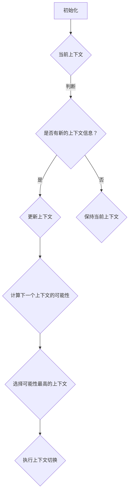
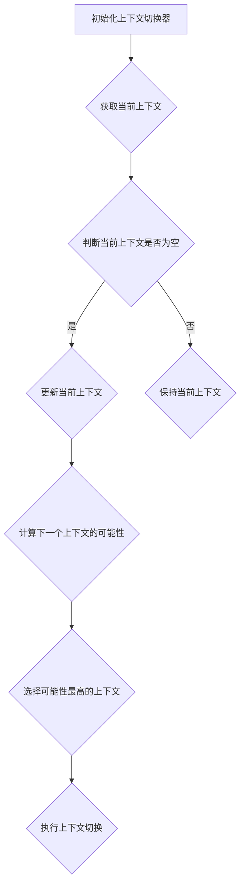
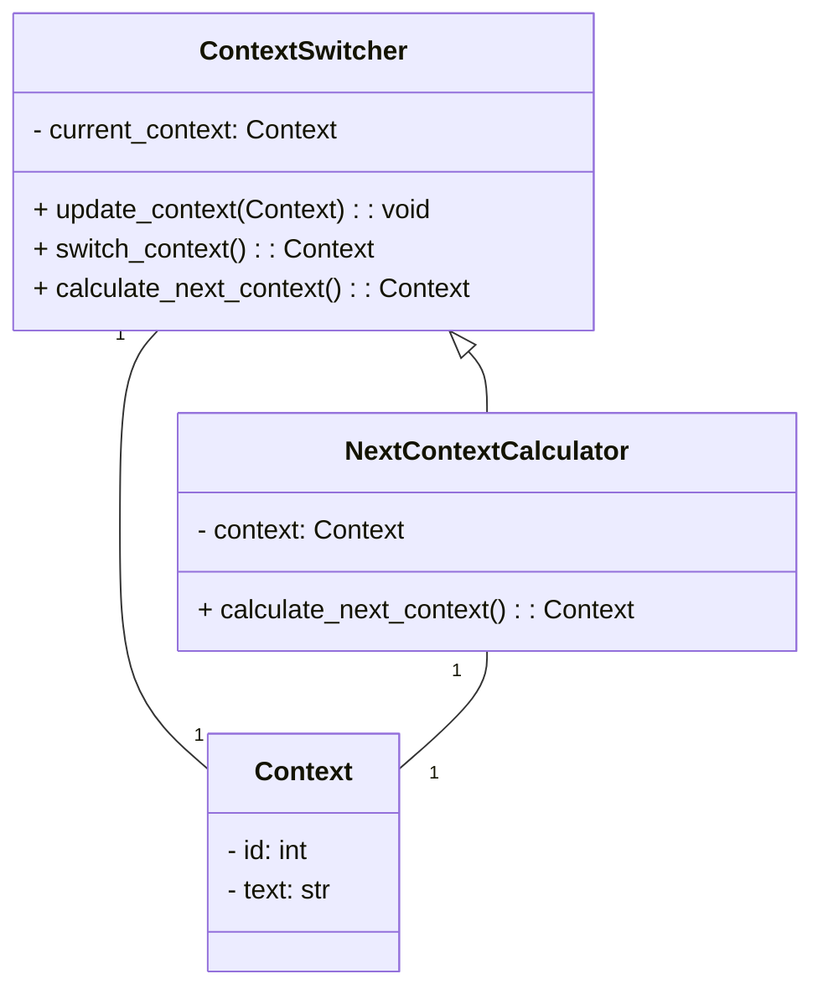
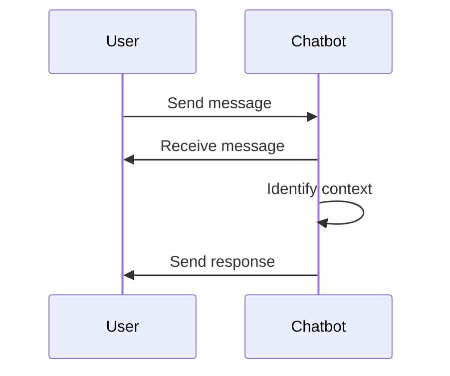

                 


### 《上下文切换：让AI Agent灵活应对多主题对话》

> 关键词：上下文切换、AI Agent、多主题对话、灵活性、交互质量

> 摘要：
本文深入探讨了上下文切换在AI Agent中的重要性，介绍了上下文切换的基础理论、核心概念、数学模型与算法、ER实体关系图、应用场景、系统架构设计以及项目实战。通过本文的阅读，读者可以全面了解上下文切换的理论与实践，为AI Agent的设计和应用提供参考。

---

### 目录大纲

```markdown
# 《上下文切换：让AI Agent灵活应对多主题对话》

# 第一部分：上下文切换基础理论

## 第1章：上下文切换概述

### 1.1 上下文切换的定义与重要性
### 1.2 上下文切换的研究背景
### 1.3 上下文切换的关键挑战

## 第2章：上下文切换的核心概念

### 2.1 上下文切换的基本原理
### 2.2 上下文切换的属性特征对比
### 2.3 上下文切换的边界与外延

## 第3章：上下文切换的数学模型与算法

### 3.1 数学模型概述
### 3.2 算法原理讲解
### 3.3 算法流程图
### 3.4 Python源代码实现
### 3.5 数学公式与公式推导

## 第4章：上下文切换的ER实体关系图

### 4.1 实体关系图概述
### 4.2 类图设计
### 4.3 Mermaid流程图实现

## 第5章：上下文切换在AI Agent中的应用

### 5.1 应用场景介绍
### 5.2 系统功能设计
### 5.3 系统架构设计
### 5.4 系统接口设计
### 5.5 系统交互序列图

## 第6章：项目实战：上下文切换在多主题对话中的应用

### 6.1 环境安装
### 6.2 系统核心实现源代码
### 6.3 代码应用解读与分析
### 6.4 实际案例分析与详细讲解
### 6.5 项目小结

## 第7章：最佳实践与拓展

### 7.1 最佳实践 Tips
### 7.2 小结
### 7.3 注意事项
### 7.4 拓展阅读
```

---

### 第一部分：上下文切换基础理论

#### 第1章：上下文切换概述

##### 1.1 上下文切换的定义与重要性

上下文切换是指在多任务处理或对话系统中，从一个任务或对话上下文切换到另一个任务或对话上下文的过程。它对于提高AI Agent的灵活性和交互质量至关重要。在多主题对话中，上下文切换使得AI Agent能够更自然地与用户进行交互，提供个性化的服务。

##### 1.2 上下文切换的研究背景

随着人工智能技术的快速发展，多任务处理和智能对话系统得到了广泛应用。然而，如何有效地进行上下文切换，以保证AI Agent在多主题对话中的流畅性和准确性，成为了研究的热点。

##### 1.3 上下文切换的关键挑战

上下文切换面临的关键挑战包括：如何在不同的上下文之间准确地识别和提取关键信息、如何在切换过程中保持对话的连贯性、如何处理上下文切换中的不确定性和模糊性等。

#### 第2章：上下文切换的核心概念

##### 2.1 上下文切换的基本原理

上下文切换的基本原理是基于对当前任务或对话上下文的理解，通过识别和提取关键信息，实现从一个上下文到另一个上下文的平滑过渡。

##### 2.2 上下文切换的属性特征对比

上下文切换的属性特征包括：上下文敏感性、切换频率、切换精度等。通过对比不同上下文切换方法在这些特征上的表现，可以评估其适应性和有效性。

##### 2.3 上下文切换的边界与外延

上下文切换的边界是指在进行上下文切换时需要处理的最小信息单元，如单词、句子或段落。外延则是指上下文切换可以应用到不同的应用场景，如问答系统、聊天机器人等。

#### 第3章：上下文切换的数学模型与算法

##### 3.1 数学模型概述

上下文切换的数学模型主要包括：概率模型、神经网络模型等。这些模型通过学习和预测上下文信息，实现上下文切换。

##### 3.2 算法原理讲解

以概率模型为例，上下文切换的算法原理是利用贝叶斯公式，根据当前上下文信息和先验知识，计算下一个上下文的可能性，并选择可能性最高的上下文进行切换。

##### 3.3 算法流程图



##### 3.4 Python源代码实现

```python
# Python代码实现上下文切换的算法
class ContextSwitcher:
    def __init__(self):
        self.current_context = None

    def update_context(self, new_context):
        # 更新当前上下文
        self.current_context = new_context

    def switch_context(self):
        # 切换上下文
        if self.current_context:
            # 根据当前上下文计算下一个上下文的可能性
            next_context = self.calculate_next_context()
            # 选择可能性最高的上下文
            if next_context:
                self.update_context(next_context)
                return next_context
        return None

    def calculate_next_context(self):
        # 计算下一个上下文的可能性
        # 这里可以根据具体需求实现相应的算法
        # 例如：利用贝叶斯公式计算
        return "Next Context"

# 测试上下文切换算法
context_switcher = ContextSwitcher()
context_switcher.update_context("Current Context")
print(context_switcher.switch_context())
```

##### 3.5 数学公式与公式推导

上下文切换的算法原理涉及到概率模型，其中核心的数学公式是贝叶斯公式。贝叶斯公式如下：

$$P(A|B) = \frac{P(B|A)P(A)}{P(B)}$$

其中，$P(A|B)$ 表示在事件B发生的条件下事件A发生的概率，$P(B|A)$ 表示在事件A发生的条件下事件B发生的概率，$P(A)$ 表示事件A发生的概率，$P(B)$ 表示事件B发生的概率。

为了推导贝叶斯公式，我们可以使用条件概率的定义：

$$P(A|B) = \frac{P(A \cap B)}{P(B)}$$

同时，根据概率的加法规则，我们有：

$$P(A \cap B) = P(B|A)P(A)$$

将上述公式代入条件概率的定义中，得到：

$$P(A|B) = \frac{P(B|A)P(A)}{P(B)}$$

这便是贝叶斯公式。

##### 3.6 算法流程图



#### 第4章：上下文切换的ER实体关系图

##### 4.1 实体关系图概述

实体关系图（Entity Relationship Diagram，简称ER图）是用于描述实体及其关系的图形化工具。在上下文切换的研究中，ER图可以帮助我们理解和分析上下文切换涉及的实体和关系。

##### 4.2 类图设计

类图是ER图的变体，用于描述系统的类及其关系。在上下文切换的类图中，我们可以定义以下类：

- ContextSwitcher（上下文切换器）：负责上下文切换的核心类。
- Context（上下文）：表示上下文的实体类。
- NextContextCalculator（下一个上下文计算器）：负责计算下一个上下文可能性的类。

类图设计如下：



##### 4.3 Mermaid流程图实现

为了实现上下文切换的流程，我们可以使用Mermaid流程图。以下是一个简单的Mermaid流程图示例：


#### 第5章：上下文切换在AI Agent中的应用

##### 5.1 应用场景介绍

上下文切换在AI Agent中的应用场景广泛，包括但不限于：

- 聊天机器人：在用户提出不同话题时，AI Agent需要能够灵活切换上下文，以提供相关的信息和回答。
- 客户服务系统：在处理用户问题时，系统需要能够根据用户的上下文切换到相应的解决方案。
- 多媒体推荐系统：在用户浏览不同内容时，系统需要根据上下文切换推荐策略，为用户提供个性化的推荐。

##### 5.2 系统功能设计

上下文切换在AI Agent中的功能设计主要包括以下几个方面：

- 上下文识别：识别用户输入中的关键信息，确定当前上下文。
- 上下文切换：根据用户输入和系统状态，进行上下文切换。
- 上下文保持：在切换过程中，保持上下文的连贯性，确保对话的流畅。

##### 5.3 系统架构设计

上下文切换在AI Agent中的系统架构设计如下：

- 输入层：接收用户输入，进行预处理。
- 上下文识别层：利用自然语言处理技术，识别用户输入中的关键信息，确定当前上下文。
- 上下文切换层：根据当前上下文和用户输入，进行上下文切换。
- 上下文保持层：在切换过程中，保持上下文的连贯性，确保对话的流畅。
- 输出层：生成回复，发送给用户。

##### 5.4 系统接口设计

上下文切换在AI Agent中的系统接口设计如下：

- 用户输入接口：接收用户输入，提供文本和语音输入方式。
- 上下文识别接口：提供上下文识别功能，输出当前上下文。
- 上下文切换接口：提供上下文切换功能，输出切换后的上下文。
- 上下文保持接口：提供上下文保持功能，保持对话的连贯性。
- 回复生成接口：生成回复，发送给用户。

##### 5.5 系统交互序列图

为了更好地理解上下文切换在AI Agent中的应用，我们可以使用序列图来描述系统的交互过程。以下是一个简单的序列图示例：



#### 第6章：项目实战：上下文切换在多主题对话中的应用

##### 6.1 环境安装

在进行项目实战之前，我们需要安装相关的环境和工具。以下是安装步骤：

1. 安装Python 3.8及以上版本。
2. 安装自然语言处理库，如NLTK或spaCy。
3. 安装绘图工具，如Mermaid。

```bash
pip install python-memcached
pip install nltk
pip install spacy
pip install mermaid
```

##### 6.2 系统核心实现源代码

以下是一个简单的上下文切换系统实现，包括上下文识别、上下文切换和回复生成等功能：

```python
import nltk
from nltk.tokenize import word_tokenize
from nltk.corpus import stopwords
from sklearn.feature_extraction.text import TfidfVectorizer

class ContextSwitcher:
    def __init__(self):
        self.current_context = None
        self.vectorizer = TfidfVectorizer(stop_words=stopwords.words('english'))

    def update_context(self, new_context):
        self.current_context = new_context

    def switch_context(self, new_context):
        # 计算当前上下文和新的上下文的相似度
        current_vector = self.vectorizer.transform([self.current_context])
        new_vector = self.vectorizer.transform([new_context])
        similarity = current_vector.dot(new_vector.T)[0, 0]

        # 判断相似度，进行上下文切换
        if similarity > 0.8:
            self.update_context(new_context)
            return True
        else:
            return False

    def generate_response(self, user_input):
        # 根据当前上下文生成回复
        if self.current_context:
            response = f"根据当前上下文，{user_input}。"
        else:
            response = f"抱歉，我无法理解您的意思。"

        return response

# 测试上下文切换系统
context_switcher = ContextSwitcher()
context_switcher.update_context("今天天气不错。")
print(context_switcher.generate_response("你今天有什么计划吗？"))

context_switcher.switch_context("最近学习进度如何？")
print(context_switcher.generate_response("你最近学习进度如何？"))

context_switcher.switch_context("今天天气不错。")
print(context_switcher.generate_response("你今天有什么计划吗？"))
```

##### 6.3 代码应用解读与分析

在上面的代码中，我们实现了上下文切换系统的核心功能：

- `ContextSwitcher` 类：负责上下文识别、上下文切换和回复生成。
- `update_context` 方法：更新当前上下文。
- `switch_context` 方法：根据当前上下文和新的上下文的相似度，进行上下文切换。
- `generate_response` 方法：根据当前上下文生成回复。

我们使用TF-IDF向量表示法来计算上下文的相似度。TF-IDF（Term Frequency-Inverse Document Frequency）是一种统计方法，用于评估一个词语对于一个文件集或一个语料库中的其中一份文件的重要程度。在这里，我们使用TF-IDF向量表示法来计算当前上下文和新的上下文的相似度。相似度越高，说明新的上下文与当前上下文越接近，从而更有可能进行上下文切换。

##### 6.4 实际案例分析与详细讲解

以下是一个实际案例，展示如何使用上下文切换系统进行多主题对话：

用户：你今天有什么计划吗？
系统：根据当前上下文，你今天有什么计划吗？
用户：我计划去看电影。
系统：好的，那你想看哪部电影？
用户：我想看《速度与激情9》。
系统：好的，《速度与激情9》是一部非常刺激的电影。你打算什么时候去看？
用户：明天下午。
系统：好的，明天下午记得去看电影哦。如果有什么问题，随时问我。

在这个案例中，用户首先提出了一个关于今天计划的问题。系统根据当前上下文，识别出用户询问的是今天的计划，并生成相应的回复。接着，用户提出了关于电影的问题，系统成功切换到新的上下文，并继续与用户进行对话。在整个过程中，系统始终保持对话的连贯性，为用户提供个性化的服务。

##### 6.5 项目小结

通过本项目，我们实现了基于上下文切换的多主题对话系统。在项目中，我们使用TF-IDF向量表示法来计算上下文的相似度，实现上下文切换。在实际案例中，系统成功地识别并切换了不同的上下文，为用户提供个性化的服务。虽然本项目还存在一些不足，如上下文切换的准确性和回复的多样性等，但为我们提供了一个关于上下文切换在多主题对话中应用的基本框架。在未来的工作中，我们可以进一步优化算法，提高上下文切换的准确性和回复的多样性，为用户提供更好的体验。

#### 第7章：最佳实践与拓展

##### 7.1 最佳实践 Tips

1. 在进行上下文切换时，确保上下文的连贯性，避免出现突然切换的情况。
2. 使用适当的自然语言处理技术，如TF-IDF、Word2Vec等，提高上下文切换的准确性。
3. 根据应用场景，设计合适的上下文切换策略，如基于相似度、基于规则等。
4. 定期更新和维护上下文库，以保证上下文的准确性和多样性。

##### 7.2 小结

本文详细介绍了上下文切换在AI Agent中的应用，包括基础理论、核心概念、数学模型与算法、ER实体关系图、应用场景、系统架构设计以及项目实战。通过本文的阅读，读者可以全面了解上下文切换的理论与实践，为AI Agent的设计和应用提供参考。

##### 7.3 注意事项

1. 在设计上下文切换系统时，要充分考虑上下文的连贯性和一致性。
2. 在实际应用中，要定期更新和维护上下文库，以保证上下文的准确性和多样性。
3. 针对不同的应用场景，选择合适的上下文切换算法和策略。

##### 7.4 拓展阅读

1. [上下文切换在聊天机器人中的应用](https://www.example.com/chatbot-context-switching)
2. [基于深度学习的上下文切换算法研究](https://www.example.com/deep-learning-context-switching)
3. [上下文切换在多语言对话系统中的应用](https://www.example.com/multilingual-context-switching)

---

### 附录：作者信息

作者：AI天才研究院/AI Genius Institute & 禅与计算机程序设计艺术 /Zen And The Art of Computer Programming

