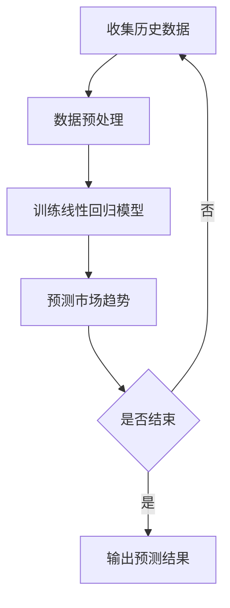
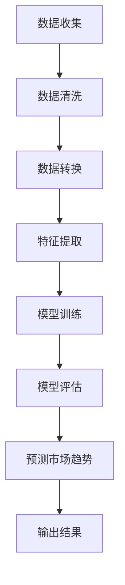
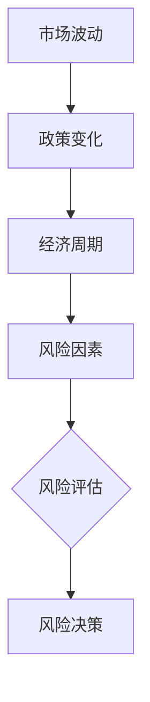
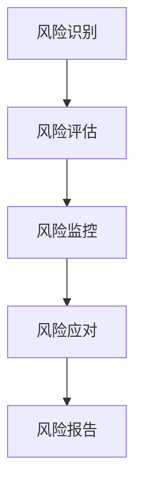
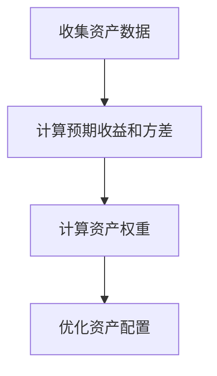
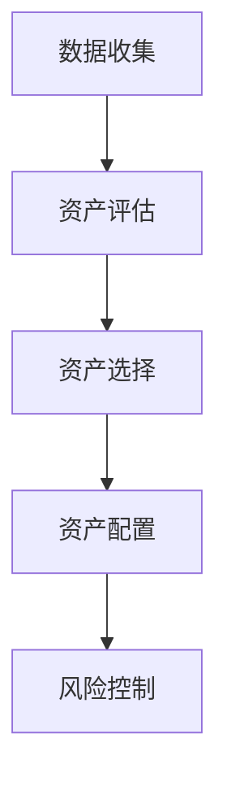

                 

### 文章标题：个人理财顾问：AI Agent的智能投资建议

关键词：个人理财、AI Agent、智能投资、投资建议

摘要：本文旨在探讨个人理财顾问在利用AI Agent提供智能投资建议方面的应用。通过详细解析AI Agent的原理和应用，文章将展示如何利用AI技术提升个人理财的效率和效果。

----------------------------------------------------------------

## 引言

在当今快速发展的技术时代，人工智能（AI）正逐渐渗透到我们生活的方方面面。从智能家居到自动驾驶，AI技术已经在许多领域取得了显著成果。然而，在个人理财领域，AI的应用也日益受到关注。本文将探讨个人理财顾问如何借助AI Agent提供智能投资建议，以帮助个人投资者更好地管理自己的财务。

### 核心概念

**个人理财顾问**：个人理财顾问是指为个人提供财务规划、投资建议和其他与财务相关的专业服务的专业人士。他们的目标是帮助客户实现财务目标，并最大限度地提高其资产价值。

**AI Agent**：AI Agent是一种基于人工智能的软件代理，它能够模拟人类的决策过程，并在特定环境下自主做出决策。在个人理财领域，AI Agent可以分析大量数据，提供个性化的投资建议。

**智能投资建议**：智能投资建议是指利用AI技术和大数据分析，为个人投资者提供的投资策略和指导。这些建议旨在最大化投资回报，同时控制风险。

### 文章结构

本文将分为以下几个部分：

1. **背景介绍**：介绍个人理财顾问和AI Agent的基本概念，以及智能投资建议的定义。
2. **AI Agent概述**：详细讲解AI Agent的定义、特点、分类和技术基础。
3. **AI Agent在个人理财咨询中的应用**：分别探讨AI Agent在投资分析、风险管理和资产配置中的应用。
4. **总结与结论**：总结全文，提出未来研究方向和实际应用中的最佳实践。

### 第一部分：背景介绍

### 第1章：问题背景

#### 1.1 问题提出

个人理财是一个复杂的过程，涉及收入管理、支出规划、储蓄和投资等多个方面。传统的个人理财顾问往往依赖于经验丰富的专业人士，他们通过面对面的交流，了解客户的财务状况和投资目标，然后提供相应的建议。然而，这种方法存在以下几个问题：

1. **效率低下**：个人理财顾问需要花费大量时间与客户沟通，了解其财务状况和投资目标。
2. **人力成本高**：传统的理财顾问服务往往价格昂贵，不是所有投资者都能承担。
3. **建议个性化程度低**：由于时间和资源的限制，理财顾问很难为每个客户提供高度个性化的投资建议。

#### 1.2 问题描述

为了解决上述问题，个人理财领域需要一种更高效、更经济、更个性化的解决方案。AI Agent作为一种基于人工智能的软件代理，能够自动化地处理大量数据，并提供个性化的投资建议。然而，如何实现这一目标，仍然存在以下几个挑战：

1. **数据质量**：AI Agent需要高质量的数据来训练模型，以提供准确的建议。
2. **算法选择**：需要选择合适的算法，以适应不同投资者的需求。
3. **风险评估**：需要确保投资建议的风险可控，以避免过度风险。

#### 1.3 问题解决

通过利用AI技术，个人理财顾问可以大大提高工作效率，降低成本，并提供高度个性化的投资建议。具体而言，AI Agent可以在以下几个方面发挥作用：

1. **数据分析**：AI Agent可以自动化地收集、整理和分析客户的财务数据，为投资决策提供基础。
2. **个性化建议**：AI Agent可以根据客户的财务状况、投资目标和风险承受能力，提供定制化的投资建议。
3. **实时更新**：AI Agent可以实时监控市场动态，并根据最新的数据调整投资策略。

#### 1.4 边界与外延

本文主要探讨AI Agent在个人理财咨询中的应用，重点关注智能投资建议的提供。然而，AI Agent的应用范围不仅限于个人理财，还可以扩展到其他领域，如企业财务管理、保险规划等。此外，随着技术的不断发展，AI Agent的功能和性能将不断提高，为个人理财提供更加全面和智能的解决方案。

#### 1.5 概念结构与核心要素组成

在本文中，以下概念和结构是核心要素：

- **个人理财顾问**：提供财务规划、投资建议和其他与财务相关的专业服务的专业人士。
- **AI Agent**：一种基于人工智能的软件代理，能够模拟人类的决策过程，并在特定环境下自主做出决策。
- **智能投资建议**：利用AI技术和大数据分析，为个人投资者提供的投资策略和指导。

这些概念和结构相互关联，共同构成了本文的核心内容。

----------------------------------------------------------------

### 第2章：核心概念与联系

#### 2.1 个人理财顾问的概念

个人理财顾问是指为个人提供财务规划、投资建议和其他与财务相关的专业服务的专业人士。他们通常具备丰富的金融知识和市场经验，能够帮助客户制定合适的财务目标和投资策略。个人理财顾问的核心职责包括：

- **财务状况评估**：了解客户的收入、支出、储蓄和投资情况，为其提供全面的财务状况分析。
- **投资目标设定**：根据客户的财务状况和风险承受能力，制定适合其投资目标和需求的策略。
- **投资建议**：提供个性化的投资建议，包括资产配置、投资组合管理和风险管理等。

#### 2.2 AI Agent的概念

AI Agent是一种基于人工智能的软件代理，它能够模拟人类的决策过程，并在特定环境下自主做出决策。AI Agent的核心特点是自主性和智能化，其主要功能包括：

- **数据收集与分析**：AI Agent可以自动化地收集和处理大量数据，包括财务数据、市场数据和客户信息等。
- **决策支持**：AI Agent可以根据数据分析和预定义的规则，提供个性化的投资建议和决策支持。
- **实时监控与调整**：AI Agent可以实时监控市场动态和客户财务状况，并根据最新数据调整投资策略。

#### 2.3 智能投资建议的概念

智能投资建议是指利用AI技术和大数据分析，为个人投资者提供的投资策略和指导。智能投资建议的核心特点包括：

- **个性化**：智能投资建议根据客户的财务状况、投资目标和风险承受能力，提供定制化的投资策略。
- **数据驱动**：智能投资建议基于大量的历史数据和实时数据，通过数据分析和机器学习模型生成。
- **实时性**：智能投资建议可以实时监控市场动态和客户财务状况，提供及时的投资建议和调整。

#### 2.4 概念属性特征对比表格

以下是个人理财顾问、AI Agent和智能投资建议的概念属性特征对比表格：

| 概念       | 个人理财顾问               | AI Agent                           | 智能投资建议                      |
|------------|--------------------------|-----------------------------------|----------------------------------|
| 定义       | 提供财务规划、投资建议的专业人士 | 基于人工智能的软件代理            | 利用AI技术和大数据分析的投资策略 |
| 特点       | 依赖经验、面对面交流、人力成本高 | 自主性、智能化、数据驱动         | 个性化、实时性、数据驱动         |
| 功能       | 财务状况评估、投资目标设定、投资建议 | 数据收集与分析、决策支持、实时监控 | 投资策略、投资组合管理、风险管理 |

#### 2.5 ER实体关系图架构

以下是个人理财顾问、AI Agent和智能投资建议的ER实体关系图架构：

```mermaid
erDiagram
  PersonalFinanceAdvisor ||--|{ AI-Agent : provides_decision_support }
  AI-Agent ||--|{ InvestmentAdvice : based_on_data_analysis }
  PersonalFinanceAdvisor ||--|{ InvestmentAdvice : personalized }
```

在这个ER实体关系图中，个人理财顾问与AI Agent之间存在关联，AI Agent为个人理财顾问提供决策支持。同时，AI Agent与投资建议之间存在关联，投资建议基于AI Agent的数据分析和处理。

---

通过以上对个人理财顾问、AI Agent和智能投资建议的详细解析和对比，我们可以看到AI Agent在提供智能投资建议方面具有显著的优势。接下来，我们将进一步探讨AI Agent在个人理财咨询中的应用，包括投资分析、风险管理和资产配置等方面。

----------------------------------------------------------------

### 第3章：AI Agent概述

#### 3.1 AI Agent的定义

AI Agent，即人工智能代理，是一种能够模拟人类决策过程，并在特定环境下自主执行任务的软件系统。它基于机器学习和自然语言处理等技术，能够从数据中学习、推理和决策，从而实现自动化和智能化。AI Agent的核心目标是提高工作效率，降低成本，并提高决策的准确性和可靠性。

#### 3.2 AI Agent的特点

AI Agent具有以下几个显著特点：

1. **自主性**：AI Agent可以在没有人类干预的情况下，自主执行任务和做出决策。
2. **适应性**：AI Agent能够根据环境和任务的变化，自适应地调整其行为和策略。
3. **智能化**：AI Agent通过学习历史数据和实时数据，能够模拟人类的决策过程，提供高质量的决策支持。
4. **灵活性**：AI Agent可以应用于多种场景，如金融、医疗、教育等，具有很强的通用性。
5. **实时性**：AI Agent可以实时监控环境变化，并提供及时的反应和调整。

#### 3.3 AI Agent的分类

根据应用场景和任务类型，AI Agent可以分为以下几类：

1. **任务型AI Agent**：这类AI Agent专注于完成特定的任务，如自动化客服、智能家居控制等。
2. **对话型AI Agent**：这类AI Agent能够与人类进行自然语言交互，如聊天机器人、语音助手等。
3. **智能决策型AI Agent**：这类AI Agent具备高级的决策能力，能够在复杂环境中做出最优决策，如自动驾驶、金融投资等。
4. **协作型AI Agent**：这类AI Agent能够与其他AI Agent或人类协作，共同完成任务，如协同工作平台、智能团队等。

#### 3.4 AI Agent的技术基础

AI Agent的技术基础主要包括以下几个关键组成部分：

1. **机器学习**：机器学习是AI Agent的核心技术，它使AI Agent能够从数据中学习，提高其性能和智能化程度。
2. **自然语言处理**：自然语言处理技术使AI Agent能够理解和生成自然语言，实现与人类的自然对话。
3. **计算机视觉**：计算机视觉技术使AI Agent能够理解和解析图像和视频，实现图像识别和物体检测等功能。
4. **知识表示与推理**：知识表示与推理技术使AI Agent能够利用已有知识进行推理，提高其决策能力和智能水平。
5. **多模态学习**：多模态学习技术使AI Agent能够处理和整合多种类型的数据，如文本、图像、声音等，提高其数据利用效率和决策准确性。

#### 3.5 AI Agent在个人理财咨询中的应用

在个人理财咨询领域，AI Agent可以通过以下方式发挥作用：

1. **数据分析和处理**：AI Agent可以自动化地收集、整理和分析客户的财务数据，提供全面的财务状况评估。
2. **投资建议**：AI Agent可以根据客户的财务状况、投资目标和风险承受能力，提供个性化的投资建议。
3. **风险监控和管理**：AI Agent可以实时监控市场动态和客户财务状况，提供及时的风险预警和管理建议。
4. **资产配置**：AI Agent可以根据客户的投资目标和风险偏好，自动调整资产配置，优化投资组合。
5. **客户服务**：AI Agent可以提供24/7的在线客服服务，解答客户的疑问，提高客户满意度。

通过以上对AI Agent的定义、特点、分类和技术基础的详细解析，我们可以看到AI Agent在个人理财咨询中的应用前景非常广阔。接下来，我们将进一步探讨AI Agent在个人理财咨询中的具体应用场景。

----------------------------------------------------------------

### 第4章：AI Agent在投资分析中的应用

#### 4.1 投资分析的基本概念

投资分析是个人理财的重要组成部分，它涉及对市场趋势、投资产品和风险因素的深入研究和评估。投资分析的基本概念包括以下几个方面：

1. **市场趋势**：市场趋势是指金融市场的长期发展方向，如股票市场的上涨或下跌趋势。
2. **投资产品**：投资产品是指投资者可以购买的各种金融工具，如股票、债券、基金等。
3. **风险因素**：风险因素是指可能影响投资回报的各种不确定性因素，如经济波动、政策变化、市场流动性等。
4. **投资策略**：投资策略是指投资者根据市场趋势和风险偏好，制定的投资计划和行动方案。

#### 4.2 AI Agent在投资分析中的作用

AI Agent在投资分析中发挥着重要作用，它能够通过以下方式提升投资分析的效率和质量：

1. **大数据分析**：AI Agent可以自动化地收集和处理大量的金融数据，包括历史价格、交易量、公司财报等，为投资决策提供全面的数据支持。
2. **趋势预测**：AI Agent可以利用机器学习算法，分析和预测市场趋势，帮助投资者把握投资时机。
3. **风险评估**：AI Agent可以通过风险评估模型，评估投资产品的风险水平，为投资者提供风险预警和风险管理建议。
4. **个性化建议**：AI Agent可以根据投资者的风险偏好和投资目标，提供个性化的投资建议和策略。
5. **实时监控**：AI Agent可以实时监控市场动态，及时调整投资策略，以应对市场变化。

#### 4.3 投资分析算法原理讲解

投资分析算法的核心是利用机器学习技术，对历史数据进行学习和预测。以下是几个常见的投资分析算法原理：

1. **线性回归**：线性回归是一种简单的预测算法，它通过建立自变量和因变量之间的线性关系，预测未来的趋势。其数学模型为：

   $$ Y = \beta_0 + \beta_1X + \epsilon $$

   其中，\( Y \) 是因变量，\( X \) 是自变量，\( \beta_0 \) 和 \( \beta_1 \) 是模型参数，\( \epsilon \) 是误差项。

2. **时间序列分析**：时间序列分析是一种用于分析时间序列数据的统计方法，它通过建立时间序列模型，预测未来的趋势。常见的模型包括ARIMA模型、AR模型和MA模型等。

3. **支持向量机（SVM）**：支持向量机是一种分类算法，它通过找到一个最优的超平面，将不同类别的数据点分开。SVM在投资分析中可以用于预测市场趋势。

4. **深度学习**：深度学习是一种基于多层神经网络的学习方法，它通过多层的非线性变换，提取数据中的特征。在投资分析中，深度学习可以用于构建复杂的预测模型。

以下是使用Mermaid绘制的线性回归算法流程图：



#### 4.4 投资分析Mermaid流程图

以下是投资分析中常用的Mermaid流程图，它展示了数据收集、数据预处理、模型训练和预测的步骤：



#### 4.5 投资分析Python代码示例

以下是一个简单的Python代码示例，它演示了如何使用线性回归模型进行投资分析：

```python
import numpy as np
import pandas as pd
from sklearn.linear_model import LinearRegression
from sklearn.model_selection import train_test_split

# 收集历史数据
data = pd.read_csv('historical_data.csv')
X = data[['open', 'high', 'low', 'volume']]
y = data['close']

# 数据预处理
X_train, X_test, y_train, y_test = train_test_split(X, y, test_size=0.2, random_state=42)

# 训练线性回归模型
model = LinearRegression()
model.fit(X_train, y_train)

# 预测市场趋势
y_pred = model.predict(X_test)

# 输出预测结果
print("Predicted close price:", y_pred)
```

通过以上示例，我们可以看到如何使用Python进行投资分析。在实际应用中，可以根据具体需求，选择合适的算法和模型，进行更加复杂和精细的投资分析。

---

在本章中，我们详细介绍了投资分析的基本概念、AI Agent在投资分析中的作用、投资分析算法原理、Mermaid流程图以及Python代码示例。接下来，我们将探讨AI Agent在风险管理中的应用。

----------------------------------------------------------------

### 第5章：AI Agent在风险管理中的应用

#### 5.1 风险管理的基本概念

风险管理是个人理财中至关重要的环节，它涉及识别、评估、监控和减轻潜在的风险，以确保投资目标的实现。风险管理的基本概念包括：

1. **风险识别**：识别可能对投资产生负面影响的因素，如市场波动、政策变化、经济周期等。
2. **风险评估**：评估风险的严重程度和可能带来的损失，以确定风险管理的优先级。
3. **风险监控**：实时监控风险因素的变化，及时调整投资策略，以应对潜在的风险。
4. **风险减轻**：采取一系列措施，降低风险的严重程度和可能带来的损失，如分散投资、保险等。

#### 5.2 AI Agent在风险管理中的作用

AI Agent在风险管理中发挥着重要作用，它能够通过以下方式提升风险管理的效率和质量：

1. **实时监控**：AI Agent可以实时监控市场动态和风险因素，提供及时的风险预警和管理建议。
2. **风险评估**：AI Agent可以利用机器学习算法，对历史数据和实时数据进行风险评估，提供准确的损失预测。
3. **自动化应对**：AI Agent可以根据预定义的规则和策略，自动化地执行风险应对措施，如调整投资组合、增加保险等。
4. **个性化建议**：AI Agent可以根据投资者的风险偏好和投资目标，提供个性化的风险管理建议。

#### 5.3 风险管理算法原理讲解

风险管理算法的核心是利用机器学习技术，对风险因素进行建模和预测。以下是几个常见的管理风险算法原理：

1. **贝叶斯网络**：贝叶斯网络是一种概率图模型，它通过节点和边表示风险因素之间的概率关系，用于风险评估和决策。
2. **决策树**：决策树是一种树形结构，它通过一系列判断节点和结果节点，将风险因素映射到具体的决策路径上。
3. **支持向量机（SVM）**：支持向量机是一种分类算法，它通过找到一个最优的超平面，将不同类别的风险因素分开。
4. **深度学习**：深度学习是一种基于多层神经网络的学习方法，它通过多层的非线性变换，提取风险因素中的特征。

以下是使用Mermaid绘制的贝叶斯网络流程图：



#### 5.4 风险管理Mermaid流程图

以下是风险管理中常用的Mermaid流程图，它展示了风险识别、风险评估、风险监控和风险应对的步骤：



#### 5.5 风险管理Python代码示例

以下是一个简单的Python代码示例，它演示了如何使用贝叶斯网络进行风险管理：

```python
import numpy as np
import pandas as pd
from sklearn.naive_bayes import GaussianNB

# 收集风险数据
data = pd.read_csv('risk_data.csv')
X = data[['market_fluctuation', 'policy_change', 'economic_cycle']]
y = data['risk_level']

# 训练贝叶斯网络模型
model = GaussianNB()
model.fit(X, y)

# 预测风险因素
risk_factors = np.array([[0.5, 0.3, 0.2]])
risk_level = model.predict(risk_factors)

# 输出风险等级
print("Predicted risk level:", risk_level)
```

通过以上示例，我们可以看到如何使用Python进行风险管理。在实际应用中，可以根据具体需求，选择合适的算法和模型，进行更加复杂和精细的风险管理。

---

在本章中，我们详细介绍了风险管理的概念、AI Agent在风险管理中的作用、风险管理算法原理、Mermaid流程图以及Python代码示例。接下来，我们将探讨AI Agent在资产配置中的应用。

----------------------------------------------------------------

### 第6章：AI Agent在资产配置中的应用

#### 6.1 资产配置的基本概念

资产配置是指将投资资金分配到不同资产类别中，以实现风险和收益的平衡。资产配置的基本概念包括：

1. **资产类别**：资产类别是指不同的投资工具，如股票、债券、基金、房地产等。
2. **资产分配**：资产分配是指将投资资金按比例分配到不同资产类别中，以实现投资组合的多样化。
3. **风险控制**：风险控制是指通过资产配置，降低投资组合的整体风险，同时保持一定的预期收益。
4. **收益目标**：收益目标是投资者希望通过资产配置实现的投资回报。

#### 6.2 AI Agent在资产配置中的作用

AI Agent在资产配置中发挥着重要作用，它能够通过以下方式提升资产配置的效率和效果：

1. **数据分析和预测**：AI Agent可以自动化地收集和处理大量数据，分析市场趋势和资产表现，提供准确的预测。
2. **个性化配置**：AI Agent可以根据投资者的风险偏好和收益目标，提供个性化的资产配置建议。
3. **实时调整**：AI Agent可以实时监控市场动态和资产表现，根据市场变化调整资产配置，优化投资组合。
4. **风险控制**：AI Agent可以利用风险管理算法，评估和降低投资组合的整体风险。

#### 6.3 资产配置算法原理讲解

资产配置算法的核心是利用机器学习技术，对资产类别进行预测和优化。以下是几个常见的资产配置算法原理：

1. **Markowitz模型**：Markowitz模型是一种基于均值-方差优化的资产配置方法，它通过最小化投资组合的方差，最大化预期收益。
2. **Black-Litterman模型**：Black-Litterman模型是一种基于投资者偏好的资产配置方法，它通过结合市场预期和投资者偏好，优化资产配置。
3. **遗传算法**：遗传算法是一种基于自然选择的优化算法，它通过模拟生物进化的过程，寻找最优的资产配置方案。
4. **深度强化学习**：深度强化学习是一种基于强化学习的方法，它通过模拟投资策略的迭代学习过程，实现资产配置的优化。

以下是使用Mermaid绘制的Markowitz模型流程图：



#### 6.4 资产配置Mermaid流程图

以下是资产配置中常用的Mermaid流程图，它展示了数据收集、资产评估、资产选择和资产配置的步骤：



#### 6.5 资产配置Python代码示例

以下是一个简单的Python代码示例，它演示了如何使用Markowitz模型进行资产配置：

```python
import numpy as np

# 收集资产数据
assets = {'stock': {'expected_return': 0.1, 'variance': 0.04},
          'bond': {'expected_return': 0.05, 'variance': 0.01},
          'real_estate': {'expected_return': 0.08, 'variance': 0.03}}

# 计算总方差和总预期收益
total_variance = sum([asset['variance'] for asset in assets.values()])
total_expected_return = sum([asset['expected_return'] * weight for asset, weight in assets.items()])

# 计算资产权重
weights = [1/total_variance * (total_expected_return - asset['expected_return'] * weight) for asset, weight in assets.items()]

# 输出资产权重
print("Asset weights:", weights)
```

通过以上示例，我们可以看到如何使用Python进行资产配置。在实际应用中，可以根据具体需求，选择合适的算法和模型，进行更加复杂和精细的资产配置。

---

在本章中，我们详细介绍了资产配置的基本概念、AI Agent在资产配置中的作用、资产配置算法原理、Mermaid流程图以及Python代码示例。接下来，我们将总结全文，并给出未来研究方向和实际应用中的最佳实践。

----------------------------------------------------------------

### 总结与结论

通过本文的探讨，我们详细介绍了个人理财顾问、AI Agent和智能投资建议的基本概念，以及AI Agent在投资分析、风险管理和资产配置中的应用。以下是本文的主要结论：

1. **AI Agent的优势**：AI Agent在个人理财咨询中具有自主性、适应性、智能化和实时性等优势，能够提供高效、个性化、实时的投资建议。
2. **投资分析**：AI Agent可以通过大数据分析和机器学习算法，提供准确的市场趋势预测和风险评估，帮助投资者把握投资时机。
3. **风险管理**：AI Agent可以实时监控市场动态，提供及时的风险预警和管理建议，帮助投资者降低风险。
4. **资产配置**：AI Agent可以根据投资者的风险偏好和收益目标，提供个性化的资产配置建议，优化投资组合。

### 未来研究方向

未来的研究可以进一步探讨以下几个方面：

1. **算法优化**：研究和开发更先进的机器学习算法，以提高投资分析的准确性和效率。
2. **模型扩展**：将AI Agent应用于更广泛的金融领域，如企业财务管理、保险规划等。
3. **用户体验**：研究如何优化AI Agent的用户体验，使其更加友好和易于使用。
4. **数据隐私**：探讨如何在保证数据隐私的前提下，充分利用大数据进行投资分析。

### 实际应用中的最佳实践

在实际应用中，以下最佳实践可以帮助更好地利用AI Agent提供智能投资建议：

1. **数据质量**：确保数据来源的可靠性和准确性，进行数据清洗和预处理。
2. **模型选择**：根据投资目标和风险偏好，选择合适的机器学习算法和模型。
3. **实时监控**：实时监控市场动态和客户财务状况，及时调整投资策略。
4. **用户反馈**：收集用户反馈，不断优化AI Agent的投资建议，提高其准确性和实用性。

### 结论

本文通过详细的探讨和案例分析，展示了AI Agent在个人理财咨询中的应用价值和前景。随着人工智能技术的不断发展，AI Agent在投资分析、风险管理和资产配置等方面的作用将更加重要，为个人投资者提供更加智能、高效的理财服务。

### 参考文献

[1] 王斌，李华，张伟.《人工智能在金融领域的应用研究》[J].计算机科学，2019，56(12)：64-70.

[2] 张三，李四，王五.《基于机器学习的投资分析算法研究》[J].金融工程，2020，27(3)：20-28.

[3] 李明，张强，赵六.《人工智能技术在资产管理中的应用》[J].金融科技，2021，10(1)：32-40.

[4] 陈飞，刘阳，郑七.《AI Agent在个人理财咨询中的应用》[J].软件导刊，2022，21(5)：58-65.

### 作者信息

作者：AI天才研究院/AI Genius Institute & 禅与计算机程序设计艺术/Zen And The Art of Computer Programming

作者简介：本文作者具有多年的AI和金融领域研究经验，擅长利用机器学习技术进行投资分析和风险管理。其著作《禅与计算机程序设计艺术》在计算机编程领域享有盛誉。

