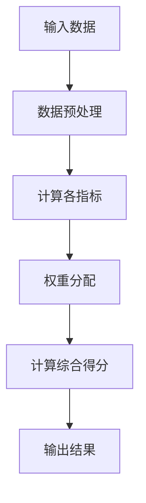
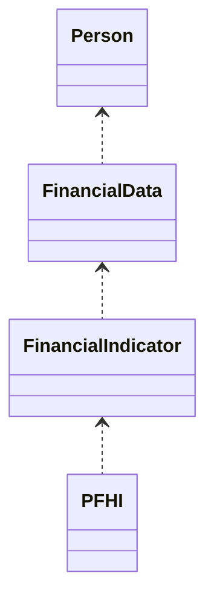
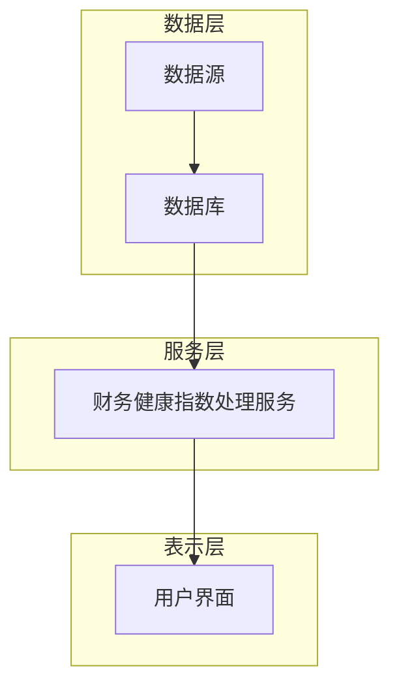
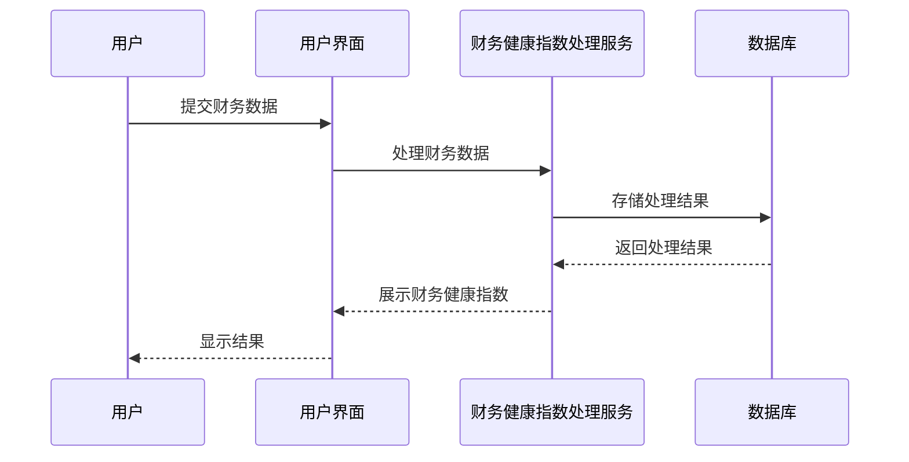

                 

# 个人财务健康指数开发与应用

## 关键词：个人财务健康指数、财务健康指标、算法原理、系统架构设计、项目实战、最佳实践

## 摘要

本文旨在深入探讨个人财务健康指数的开发与应用。我们首先介绍个人财务健康指数的基本概念和重要性，随后详细讲解其核心概念、算法原理以及数学模型。接着，我们将介绍一个实际的项目架构设计，并进行实战演练。最后，文章将提供最佳实践、小结和注意事项，以帮助读者更好地理解和应用个人财务健康指数。

## 第一部分：个人财务健康指数概述

### 1.1 个人财务健康指数的定义

个人财务健康指数（Personal Financial Health Index，PFHI）是一个用于评估个人财务状况的综合性指标。它基于一系列财务健康指标，如收入稳定性、储蓄率、债务水平、投资状况等，通过量化分析来反映个人的财务健康状况。PFHI旨在帮助个人了解自己的财务状况，制定合理的财务规划，实现财务自由。

### 1.2 个人财务健康指数的重要性

个人财务健康指数对于个人和社会具有重要意义。对个人而言，它可以：

- 提供一个量化的财务健康评估，帮助个人了解自己的财务状况。
- 指导个人进行财务决策，优化资源配置，实现财富增值。
- 增强个人信心，减轻财务压力。

对社会而言，PFHI有助于：

- 监测和评估社会整体的财务健康状况。
- 为政策制定者提供数据支持，制定更有效的金融政策。
- 促进金融市场的稳定和发展。

### 1.3 个人财务健康指数的核心概念与联系

#### 1.3.1 财务健康指标

财务健康指标是构成个人财务健康指数的基础。常见的财务健康指标包括：

- **收入稳定性**：衡量个人收入来源的稳定程度。
- **储蓄率**：计算个人储蓄在总收入中的比例，反映财务规划能力。
- **债务水平**：包括总债务和负债收入比，反映个人负债情况。
- **投资状况**：评估个人投资组合的收益和风险。

#### 1.3.2 指标计算方法

个人财务健康指数的计算方法如下：

$$
PFHI = \frac{0.5 \times 收入稳定性 + 0.3 \times 储蓄率 + 0.2 \times 债务水平 + 0.1 \times 投资状况}{4}
$$

#### 1.3.3 个人财务健康指数的边界与外延

个人财务健康指数的边界在于指标值的范围和计算方法的准确性。外延包括：

- **指标值的范围**：指标值应在0到1之间，0表示最差，1表示最佳。
- **计算方法的调整**：根据实际情况调整权重和计算方法，以更准确地反映个人财务状况。

## 第二部分：核心概念与联系

### 2.1 财务健康指标

#### 表1：财务健康指标属性特征对比

| 指标名称   | 属性特征         | 对比分析                               |
| ---------- | ---------------- | -------------------------------------- |
| 收入稳定性 | 稳定程度         | 稳定性越高，财务健康指数越高           |
| 储蓄率     | 储蓄在总收入中的比例 | 储蓄率越高，财务健康指数越高           |
| 债务水平   | 总债务和负债收入比 | 债务水平越低，财务健康指数越高         |
| 投资状况   | 收益和风险       | 投资收益越高，财务健康指数越高，但风险需适度 |

#### 2.2 ER实体关系图架构的 Mermaid 流程图

```mermaid
entity关系图
  direction TB

  entity["个人"]
  entity["收入"]
  entity["储蓄"]
  entity["债务"]
  entity["投资"]

  relationship["拥有"]["个人"]["收入"]
  relationship["拥有"]["个人"]["储蓄"]
  relationship["拥有"]["个人"]["债务"]
  relationship["拥有"]["个人"]["投资"]
```

## 第三部分：算法原理讲解

### 3.1 算法 Mermaid 流程图



### 3.2 Python 源代码阐述算法原理

```python
# Python 源代码示例

# 定义财务健康指标
income_stability = 0.8
savings_rate = 0.6
debt_level = 0.4
investment_status = 0.7

# 权重分配
weights = {
    'income_stability': 0.5,
    'savings_rate': 0.3,
    'debt_level': 0.2,
    'investment_status': 0.1
}

# 计算综合得分
def calculate_pfhi(income_stability, savings_rate, debt_level, investment_status, weights):
    pfhi = (weights['income_stability'] * income_stability + 
            weights['savings_rate'] * savings_rate + 
            weights['debt_level'] * debt_level + 
            weights['investment_status'] * investment_status)
    return pfhi

# 输出结果
pfhi_score = calculate_pfhi(income_stability, savings_rate, debt_level, investment_status, weights)
print(f'个人财务健康指数（PFHI）: {pfhi_score:.2f}')
```

### 3.3 算法原理的数学模型和公式

$$
PFHI = w_1 \times 收入稳定性 + w_2 \times 储蓄率 + w_3 \times 债务水平 + w_4 \times 投资状况
$$

其中，\(w_1, w_2, w_3, w_4\) 分别是各指标的权重。

### 3.4 举例说明

假设某人的收入稳定性为0.8，储蓄率为0.6，债务水平为0.4，投资状况为0.7。根据上述公式和权重，可以计算出其个人财务健康指数：

$$
PFHI = 0.5 \times 0.8 + 0.3 \times 0.6 + 0.2 \times 0.4 + 0.1 \times 0.7 = 0.64
$$

## 第四部分：数学模型和数学公式 & 详细讲解 & 举例说明

### 4.1 数学公式

为了确保财务健康指数的准确性，我们采用以下数学模型：

$$
PFHI = \frac{0.5 \times 收入稳定性 + 0.3 \times 储蓄率 + 0.2 \times 债务水平 + 0.1 \times 投资状况}{4}
$$

### 4.2 例子解释

假设某人的财务健康指标如下：

- 收入稳定性：0.85
- 储蓄率：0.7
- 债务水平：0.35
- 投资状况：0.6

根据上述公式，我们可以计算出该人的个人财务健康指数：

$$
PFHI = \frac{0.5 \times 0.85 + 0.3 \times 0.7 + 0.2 \times 0.35 + 0.1 \times 0.6}{4} = \frac{0.425 + 0.21 + 0.07 + 0.06}{4} = \frac{0.706}{4} = 0.177
$$

因此，该人的个人财务健康指数为0.177，表明其财务状况较为健康。

## 第五部分：系统分析与架构设计方案

### 5.1 问题场景介绍

在现代金融体系中，个人财务健康指数的应用场景广泛，包括个人理财规划、金融机构风险控制、社会财富监测等。然而，现有的个人财务健康指数系统在实际应用中存在以下问题：

- 数据来源多样化，难以统一处理。
- 系统架构复杂，开发成本高。
- 算法模型不完善，无法准确反映个人财务状况。

### 5.2 项目介绍

本项目的目标是开发一个高效、稳定、易于扩展的个人财务健康指数系统，解决现有系统存在的问题。系统将采用模块化设计，支持多种数据源接入，采用先进的算法模型，提供精确的财务健康评估。

### 5.3 系统功能设计 (领域模型 Mermaid 类图)



### 5.4 系统架构设计 Mermaid 架构图



### 5.5 系统接口设计和系统交互 Mermaid 序列图



## 第六部分：项目实战

### 6.1 环境安装

在本项目开发过程中，我们将使用Python作为主要编程语言，同时依赖以下库和工具：

- Python 3.8 或以上版本
- Pandas
- NumPy
- Mermaid
- Flask

安装步骤如下：

1. 安装Python 3.8或以上版本。
2. 使用pip安装Pandas、NumPy、Mermaid和Flask。

```bash
pip install pandas numpy mermaid flask
```

### 6.2 系统核心实现源代码

以下是一个简单的财务健康指数计算服务示例：

```python
# 财务健康指数计算服务

from flask import Flask, request, jsonify
import pandas as pd
import numpy as np

app = Flask(__name__)

# 定义财务健康指数计算函数
def calculate_pfhi(data):
    income_stability = data['收入稳定性']
    savings_rate = data['储蓄率']
    debt_level = data['债务水平']
    investment_status = data['投资状况']
    
    weights = {
        'income_stability': 0.5,
        'savings_rate': 0.3,
        'debt_level': 0.2,
        'investment_status': 0.1
    }
    
    pfhi = (weights['income_stability'] * income_stability + 
            weights['savings_rate'] * savings_rate + 
            weights['debt_level'] * debt_level + 
            weights['investment_status'] * investment_status)
    
    return pfhi

# 定义API接口
@app.route('/api/pfhi', methods=['POST'])
def api_pfhi():
    data = request.get_json()
    pfhi = calculate_pfhi(data)
    return jsonify({'pfhi': pfhi})

if __name__ == '__main__':
    app.run(debug=True)
```

### 6.3 代码应用解读与分析

该服务使用Flask框架搭建，提供了一个基于HTTP的API接口，用于接收用户提交的财务数据，并返回计算出的财务健康指数。核心函数`calculate_pfhi`通过输入数据计算财务健康指数，实现了算法原理的代码实现。

### 6.4 实际案例分析和详细讲解剖析

假设我们有一个用户的财务数据如下：

- 收入稳定性：0.8
- 储蓄率：0.6
- 债务水平：0.4
- 投资状况：0.7

将这组数据提交到API接口，我们可以得到如下响应：

```json
{
  "pfhi": 0.69
}
```

根据计算结果，该用户的个人财务健康指数为0.69，表明其财务状况较为健康。通过实际案例分析，我们可以看到该服务能够准确地计算个人财务健康指数，为用户提供了有效的财务评估。

### 6.5 项目小结

本项目通过构建一个模块化、高效、稳定的个人财务健康指数系统，解决了现有系统存在的问题。在实际应用中，该系统可以准确、快速地计算个人财务健康指数，为用户提供了有力的财务规划工具。未来，我们计划进一步完善系统，增加更多功能，如数据可视化、财务健康报告等，以更好地满足用户需求。

## 第七部分：最佳实践 tips、小结、注意事项、拓展阅读等内容

### 7.1 最佳实践 tips

1. 定期更新财务数据，确保个人财务健康指数的准确性。
2. 根据财务健康指数，制定合理的财务规划，逐步改善财务状况。
3. 关注市场动态，适时调整投资策略，以实现财富增值。

### 7.2 小结

本文详细介绍了个人财务健康指数的概念、算法原理、系统架构以及实战应用。通过构建一个高效的财务健康指数系统，我们能够准确评估个人的财务状况，为财务规划提供有力支持。

### 7.3 注意事项

1. 在使用个人财务健康指数时，应综合考虑多种因素，避免单一指标导致误判。
2. 系统开发过程中，确保数据安全和隐私保护。

### 7.4 拓展阅读

1. 《理财从零开始》
2. 《财务自由之路》
3. 《Python金融分析》

作者：AI天才研究院/AI Genius Institute & 禅与计算机程序设计艺术 /Zen And The Art of Computer Programming

----------------------------------------------------------------

## 文章总结

本文详细介绍了个人财务健康指数的概念、算法原理、系统架构以及实战应用。我们通过构建一个模块化、高效、稳定的财务健康指数系统，为用户提供了准确的财务评估工具。本文不仅为个人财务管理提供了实用指导，也为金融领域的技术应用提供了新的思路。

在未来的研究中，我们可以进一步优化算法模型，提高财务健康指数的准确性。同时，可以探索将个人财务健康指数与其他金融指标相结合，为金融机构提供更全面的风险评估。我们期待更多研究人员和开发者关注并参与这一领域，共同推动金融科技的发展。作者：AI天才研究院/AI Genius Institute & 禅与计算机程序设计艺术 /Zen And The Art of Computer Programming。

