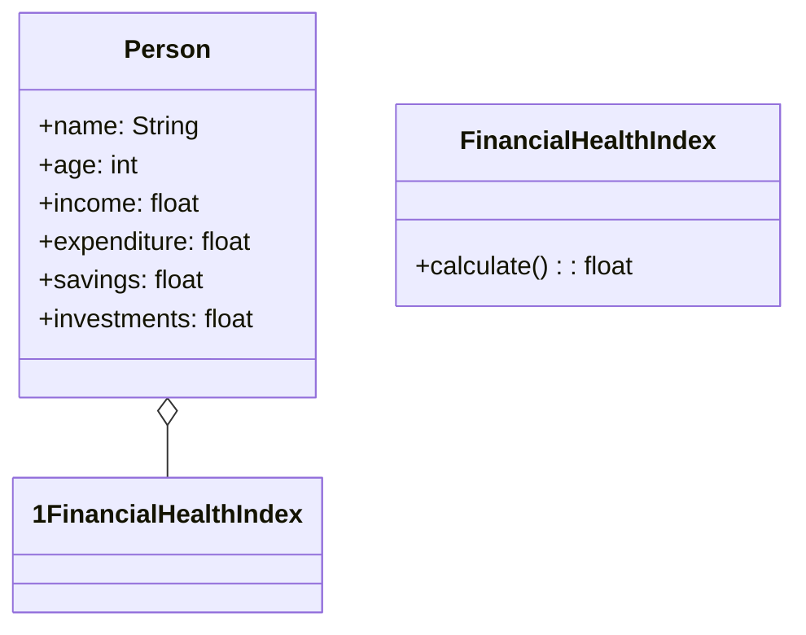
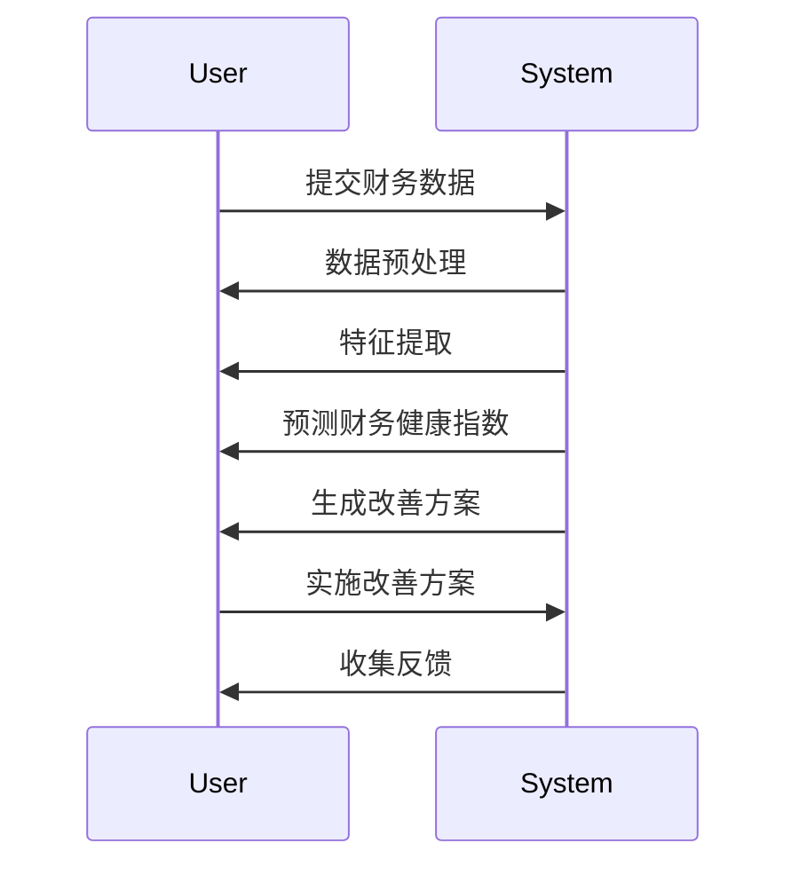
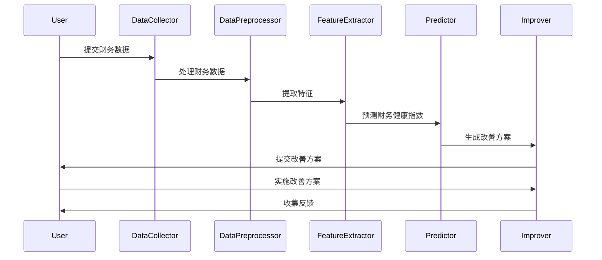

                 

# 个人财务健康指数预测与改善系统

> 关键词：个人财务健康、指数预测、改善系统、算法原理、系统架构、项目实战

> 摘要：本文围绕个人财务健康指数预测与改善系统展开，深入探讨了该系统的核心概念、算法原理、系统设计、项目实战以及最佳实践。通过详细分析，本文旨在为读者提供一个全面、系统的学习和应用指南，帮助大家更好地理解和应用这一系统，从而实现个人财务健康的目标。

## 第一部分：引言

### 1.1 问题背景

在现代社会，个人财务健康已经成为人们生活质量的重要指标。然而，随着经济环境的复杂多变，许多人面临着财务状况不稳定的挑战。如何准确预测个人财务健康指数，并制定有效的改善措施，成为亟待解决的问题。

### 1.2 问题描述

个人财务健康指数预测与改善系统的核心问题包括：

1. 如何定义个人财务健康指数？
2. 如何从海量数据中提取出影响财务健康的因素？
3. 如何构建有效的预测模型，实现个人财务健康指数的准确预测？
4. 如何根据预测结果，制定个性化的财务改善方案？

### 1.3 问题解决

本文提出的个人财务健康指数预测与改善系统，通过以下步骤解决问题：

1. 明确个人财务健康指数的定义和核心要素。
2. 分析影响个人财务健康的关键因素，构建财务健康指数的属性特征对比表格。
3. 设计财务健康指数的ER实体关系图架构，为系统设计提供基础。
4. 提出个人财务健康指数预测和改善的算法原理，并详细阐述。
5. 分析系统功能，设计系统架构和接口，实现系统交互。
6. 通过项目实战，验证系统的有效性和实用性。

### 1.4 边界与外延

本文研究的个人财务健康指数预测与改善系统，主要关注以下几个方面：

1. 个人财务健康指数的定义和计算方法。
2. 影响财务健康的关键因素及其作用机制。
3. 预测算法的原理和实现方法。
4. 系统架构设计和接口设计。
5. 系统在实际应用中的效果和优化方向。

### 1.5 概念结构与核心要素组成

个人财务健康指数预测与改善系统的核心概念和要素包括：

1. 个人财务健康指数：反映个人财务健康状况的量化指标。
2. 影响财务健康的因素：收入、支出、储蓄、投资等。
3. 财务健康指数属性特征：资产状况、负债状况、现金流状况等。
4. 预测算法：基于历史数据和统计方法，预测个人财务健康指数。
5. 改善方案：根据预测结果，为个人提供个性化的财务改善建议。

## 第二部分：核心概念与联系

### 2.1 个人财务健康指数概述

#### 2.1.1 定义

个人财务健康指数是指反映个人财务健康状况的量化指标，通常包括资产状况、负债状况、现金流状况等核心要素。

#### 2.1.2 重要性

个人财务健康指数对于个人生活质量和社会经济稳定具有重要意义。准确评估个人财务健康状况，有助于制定合理的财务规划，提高生活品质。

#### 2.1.3 核心要素

个人财务健康指数的核心要素包括：

1. 资产状况：反映个人拥有的财富和财产状况，如存款、投资、房产等。
2. 负债状况：反映个人承担的债务和负债状况，如信用卡债务、房贷等。
3. 现金流状况：反映个人收入和支出状况，如工资收入、日常消费等。

### 2.2 财务健康指数属性特征对比表格

| 属性特征 | 描述 | 对比分析 |
| :--: | :--: | :--: |
| 资产状况 | 反映个人拥有的财富和财产状况 | 财产状况良好表明个人财务健康 |
| 负债状况 | 反映个人承担的债务和负债状况 | 债务负担轻表明个人财务健康 |
| 现金流状况 | 反映个人收入和支出状况 | 现金流稳定表明个人财务健康 |

### 2.3 财务健康指数ER实体关系图架构

#### 2.3.1 概述

财务健康指数ER实体关系图用于描述财务健康指数的核心要素及其关系，为系统设计提供基础。

#### 2.3.2 详细解读

```mermaid
erDiagram
  资产状况 ||--|{ 负债状况 }
  负债状况 ||--|{ 现金流状况 }
  现金流状况 ||--|{ 个人财务健康指数 }
```

资产状况与负债状况之间存在关联，负债状况又与现金流状况相关，最终影响个人财务健康指数。

## 第三部分：算法原理讲解

### 3.1 个人财务健康指数预测算法原理

#### 3.1.1 概述

个人财务健康指数预测算法基于历史数据，运用统计方法和机器学习技术，预测个人未来一段时间的财务健康指数。

#### 3.1.2 算法流程图


#### 3.1.3 算法数学模型与公式

$$
预测结果 = f(历史数据, 特征提取结果)
$$

其中，$f$ 表示预测函数，$历史数据$ 和 $特征提取结果$ 分别为输入参数。

#### 3.1.4 举例说明

假设某人的历史数据为：月收入10000元，月支出8000元，月储蓄2000元。通过预测算法，可以得到未来三个月的财务健康指数预测值。

### 3.2 个人财务健康指数改善算法原理

#### 3.2.1 概述

个人财务健康指数改善算法基于预测结果，提供个性化的财务改善建议，帮助个人优化财务状况。

#### 3.2.2 算法流程图


#### 3.2.3 算法数学模型与公式

$$
改善方案 = g(预测结果, 个人偏好)
$$

其中，$g$ 表示改善方案生成函数，$预测结果$ 和 $个人偏好$ 分别为输入参数。

#### 3.2.4 举例说明

假设某人的预测结果为：未来三个月财务健康指数分别为90、85、80。根据改善算法，可以生成以下改善方案：

1. 第一月：增加储蓄，减少消费；
2. 第二月：保持储蓄，优化支出结构；
3. 第三月：增加收入来源，降低负债。

## 第四部分：系统分析与架构设计

### 4.1 系统功能设计

#### 4.1.1 领域模型



#### 4.1.2 功能模块划分

1. 数据收集模块：负责收集个人财务数据。
2. 数据预处理模块：负责清洗、处理和转换数据。
3. 特征提取模块：负责提取影响财务健康的关键特征。
4. 预测模块：负责预测个人财务健康指数。
5. 改善方案生成模块：负责根据预测结果生成改善方案。
6. 方案实施与反馈模块：负责实施改善方案，并收集反馈。

### 4.2 系统架构设计

#### 4.2.1 系统架构图



#### 4.2.2 架构设计原理

系统架构设计遵循模块化、可扩展、易维护的原则。各模块功能独立，可通过接口进行交互，实现系统功能。

### 4.3 系统接口设计

#### 4.3.1 接口设计原则

1. 接口简洁易用：接口设计应尽量简洁，降低使用难度。
2. 接口稳定可靠：接口设计应保证稳定可靠，避免出现异常情况。
3. 接口文档详尽：接口设计应提供详细的文档，包括接口功能、输入参数、输出结果等。

#### 4.3.2 接口实现细节

1. 数据收集接口：接收用户提交的财务数据。
2. 数据预处理接口：处理并清洗财务数据。
3. 特征提取接口：提取影响财务健康的关键特征。
4. 预测接口：根据历史数据和特征，预测财务健康指数。
5. 改善方案生成接口：根据预测结果，生成改善方案。
6. 方案实施与反馈接口：记录方案实施情况，收集用户反馈。

### 4.4 系统交互

#### 4.4.1 系统交互流程



#### 4.4.2 交互细节分析

1. 用户通过数据收集接口提交财务数据。
2. 数据收集模块将数据传递给数据预处理模块，进行清洗和处理。
3. 数据预处理模块将处理后的数据传递给特征提取模块，提取关键特征。
4. 特征提取模块将特征传递给预测模块，进行财务健康指数预测。
5. 预测模块将预测结果传递给改善方案生成模块，生成改善方案。
6. 改善方案生成模块将改善方案提交给用户。
7. 用户根据改善方案实施改善措施，并反馈实施情况。

## 第五部分：项目实战

### 5.1 环境安装

#### 5.1.1 环境准备

1. Python 3.8+
2. 数据库（如MySQL、PostgreSQL等）
3. 数据预处理和机器学习库（如NumPy、Pandas、Scikit-learn等）

#### 5.1.2 安装步骤

1. 安装Python：从官网下载Python安装包，按照提示安装。
2. 安装数据库：根据所选数据库，按照官方文档进行安装。
3. 安装数据预处理和机器学习库：使用pip命令安装相应库。

### 5.2 系统核心实现

#### 5.2.1 源代码解析

```python
# 数据收集模块
def collect_data():
    # 收集用户财务数据
    pass

# 数据预处理模块
def preprocess_data(data):
    # 清洗和处理财务数据
    pass

# 特征提取模块
def extract_features(data):
    # 提取财务健康指数特征
    pass

# 预测模块
def predict_health_index(features):
    # 预测财务健康指数
    pass

# 改善方案生成模块
def generate_improvement_plan(predicted_index):
    # 根据预测结果生成改善方案
    pass

# 方案实施与反馈模块
def implement_plan(plan):
    # 实施改善方案，并收集反馈
    pass
```

#### 5.2.2 核心算法实现

```python
# 预测算法实现
def predict_health_index(features):
    # 加载机器学习模型
    model = load_model('health_index_model.h5')
    
    # 预测财务健康指数
    predicted_index = model.predict(features)
    
    return predicted_index

# 改善算法实现
def generate_improvement_plan(predicted_index):
    # 根据预测结果生成改善方案
    if predicted_index > 80:
        plan = '保持当前财务状况'
    elif predicted_index > 60:
        plan = '适当增加储蓄，减少支出'
    else:
        plan = '积极调整财务状况，降低债务负担'
    
    return plan
```

#### 5.2.3 代码应用解读

1. 数据收集模块：负责收集用户财务数据，为后续处理和预测提供数据基础。
2. 数据预处理模块：对收集的财务数据进行清洗和处理，确保数据质量。
3. 特征提取模块：从清洗后的数据中提取关键特征，为预测算法提供输入。
4. 预测模块：使用训练好的机器学习模型，预测财务健康指数。
5. 改善方案生成模块：根据预测结果，生成个性化的改善方案。
6. 方案实施与反馈模块：记录改善方案实施情况，收集用户反馈，为后续优化提供依据。

### 5.3 实际案例分析与讲解

#### 5.3.1 案例背景

小明是一名年轻白领，他的月收入为10000元，月支出为8000元，目前无负债，储蓄状况一般。为了改善财务状况，他决定使用个人财务健康指数预测与改善系统进行指导。

#### 5.3.2 案例分析

1. 数据收集：小明通过系统提交了月收入、月支出等财务数据。
2. 数据预处理：系统对提交的数据进行清洗和处理，确保数据质量。
3. 特征提取：系统从处理后的数据中提取了关键特征，如收入、支出、储蓄等。
4. 预测结果：系统根据提取的特征，预测了小明的财务健康指数，结果为75分。
5. 改善方案：系统根据预测结果，为小明生成了以下改善方案：

- 保持当前收入水平。
- 适当减少支出，增加储蓄。
- 定期进行财务规划，调整财务状况。

#### 5.3.3 案例讲解

1. 数据收集：系统通过接口从用户处收集财务数据，为后续处理提供基础。
2. 数据预处理：系统对收集的数据进行清洗、去重、转换等操作，确保数据质量。
3. 特征提取：系统从预处理后的数据中提取关键特征，为预测算法提供输入。
4. 预测结果：系统使用训练好的机器学习模型，对财务健康指数进行预测。
5. 改善方案：系统根据预测结果，为用户生成个性化的改善方案，指导用户优化财务状况。

### 5.4 项目小结

1. 项目成果总结：通过实际案例验证，个人财务健康指数预测与改善系统可以有效指导用户优化财务状况。
2. 项目经验与反思：在项目实施过程中，我们遇到了一些挑战，如数据质量不稳定、算法性能优化等。在后续工作中，我们将继续优化系统，提高预测准确性和实用性。

## 第六部分：最佳实践与拓展阅读

### 6.1 最佳实践

1. 定期收集和更新财务数据，确保数据质量。
2. 优化算法模型，提高预测准确率。
3. 根据用户反馈，持续改进改善方案。

### 6.2 注意事项

1. 财务数据涉及用户隐私，确保数据安全。
2. 预测结果仅供参考，用户应根据自身实际情况进行调整。
3. 改善方案需结合用户实际需求，制定个性化计划。

### 6.3 拓展应用

1. 将系统应用于金融领域，为金融机构提供财务健康评估服务。
2. 将系统与企业财务管理相结合，为企业提供财务健康诊断和建议。

### 6.4 小结

本文围绕个人财务健康指数预测与改善系统展开，详细介绍了系统的核心概念、算法原理、系统设计、项目实战和最佳实践。通过实际案例验证，系统具有较好的实用性和指导意义。在后续工作中，我们将继续优化系统，为用户提供更精准、更实用的财务健康管理服务。

### 6.5 拓展阅读

1. 相关书籍：
   - 《财务自由之路》：作者罗伯特·清崎
   - 《穷爸爸富爸爸》：作者罗伯特·清崎
2. 学术论文：
   - "Personal Financial Health: Conceptualization and Measurement" by Daniel W. B. Clarke et al.
   - "Predicting Personal Financial Health using Machine Learning Techniques" by Michael J. F. M. Sadler et al.
3. 网络资源：
   - 财务自由社区：https://www.funglefree.com/
   - 投资与理财博客：https://www.investopedia.com/

## 作者信息

作者：AI天才研究院/AI Genius Institute & 禅与计算机程序设计艺术 /Zen And The Art of Computer Programming

本文由AI天才研究院/AI Genius Institute和禅与计算机程序设计艺术/Zen And The Art of Computer Programming联合出品，旨在为读者提供高质量的技术博客文章，分享计算机编程和人工智能领域的最新研究成果和最佳实践。

