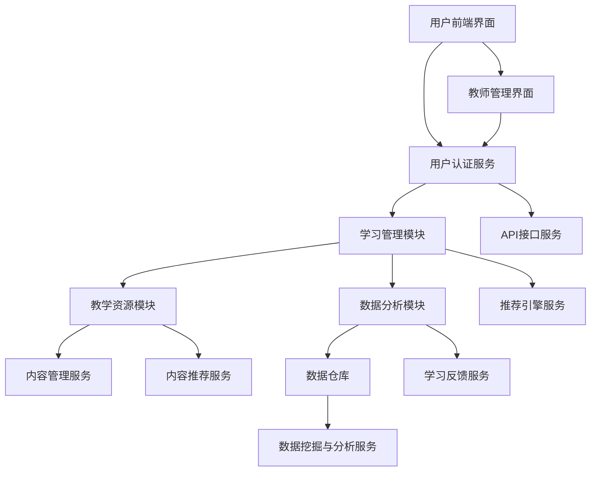

                 

### 第一部分: 引言与背景

#### 第1章: 个性化学习的兴起

在21世纪的现代教育体系中，个性化学习已经成为一种不可逆转的趋势。随着信息技术的飞速发展，教育领域正经历着前所未有的变革。个性化学习，作为一种以学生为中心的教育模式，旨在通过定制化的教学方案来满足不同学生的学习需求和节奏。这一章将深入探讨个性化学习的定义、重要性以及其在教育领域中的角色。

**1.1 个性化学习的定义与重要性**

个性化学习是一种以学生个体差异为基础，通过定制化的教学方法、资源和环境，促进每个学生全面发展的教育模式。这种模式不仅关注学生的知识掌握，更强调其情感、态度和价值观的培养。

个性化学习的重要性在于：

1. **满足学生个性化需求**：每个学生都是独一无二的，他们的学习速度、兴趣和认知方式各有不同。个性化学习能够根据学生的特点进行有针对性的教学，从而提高学习效果。

2. **提高教育质量**：传统的教育模式往往无法兼顾所有学生，而个性化学习能够通过精准的教学方案，提升整体教育质量。

3. **培养创新人才**：个性化学习鼓励学生发挥自己的创造力，通过自主探索和问题解决，培养创新能力和批判性思维。

**1.2 教育领域面临的挑战**

尽管个性化学习具有巨大的潜力，但在实际应用中仍面临诸多挑战：

1. **资源分配不均**：在经济发达地区，教育资源丰富，个性化学习更容易实现；而在经济欠发达地区，资源有限，个性化学习难以推广。

2. **教师专业素养**：个性化学习要求教师具备更高的专业素养，能够设计并实施有效的个性化教学方案。然而，当前许多教师的培训水平和实际操作能力尚需提高。

3. **技术支持不足**：个性化学习需要大量的技术支持，如智能教学系统、数据分析工具等。但许多学校的技术设备和技术人员储备不足。

**1.3 人工智能与自适应教育的结合**

人工智能技术的快速发展为个性化学习提供了新的可能性。自适应教育系统通过利用人工智能算法，能够根据学生的学习行为和成绩数据，动态调整教学策略，实现真正的个性化学习。

**小结**

个性化学习作为现代教育的重要组成部分，不仅有助于提高教育质量，还能培养学生的全面发展。然而，实现个性化学习面临着资源分配、教师专业素养和技术支持等挑战。人工智能与自适应教育的结合，为解决这些问题提供了新的思路和方法。

### 第2章: LLM基础与原理

#### 2.1 语言模型概述

语言模型（Language Model，简称LM）是自然语言处理（Natural Language Processing，简称NLP）领域的一种核心技术。它旨在通过统计方法或深度学习技术，建模自然语言的规律和特征，从而实现对文本的生成、理解和预测。在本节中，我们将对语言模型的基本概念、发展历程和主要类型进行概述。

**2.1.1 语言模型的定义**

语言模型是一种能够预测下一个单词或词组的概率分布的模型。它可以用于各种NLP任务，如机器翻译、文本摘要、问答系统等。简单来说，语言模型的目标是理解并生成自然语言。

**2.1.2 语言模型的发展历程**

语言模型的发展可以分为几个阶段：

1. **统计语言模型**：早期语言模型主要基于统计方法，如N元语法（N-gram）。N元语法通过计算一个词序列的历史N-1个词出现的概率来预测下一个词。尽管这种方法在特定情况下表现良好，但其在长文本上的表现有限。

2. **神经网络语言模型**：随着深度学习技术的发展，神经网络语言模型逐渐取代了统计语言模型。典型的神经网络语言模型包括循环神经网络（RNN）、长短期记忆网络（LSTM）和变换器（Transformer）。其中，Transformer模型由于其并行计算能力和全局上下文捕捉能力，成为了当前最流行的语言模型。

3. **预训练与微调**：预训练是指在大规模语料库上预先训练一个语言模型，然后通过微调（Fine-tuning）来适应特定任务。这种方法大大提高了语言模型的性能，成为了当前NLP任务的主流方法。

**2.1.3 语言模型的主要类型**

根据建模方法的不同，语言模型可以分为以下几种类型：

1. **N元语法（N-gram）**：基于历史N-1个词的概率分布进行预测。

2. **循环神经网络（RNN）**：通过循环结构来捕捉长期依赖关系。

3. **长短期记忆网络（LSTM）**：在RNN的基础上，通过门机制来缓解梯度消失问题。

4. **变换器（Transformer）**：通过自注意力机制（Self-Attention）来实现全局上下文的建模。

5. **生成对抗网络（GAN）**：用于生成自然语言的文本。

**2.1.4 语言模型的应用场景**

语言模型在NLP领域具有广泛的应用，如：

1. **机器翻译**：通过将源语言的文本转换为目标语言的文本，实现跨语言交流。

2. **文本摘要**：从长文本中提取关键信息，生成简短的摘要。

3. **问答系统**：通过理解用户的问题，提供准确的答案。

4. **情感分析**：分析文本中的情感倾向，用于市场调研、舆情监控等。

**小结**

语言模型作为NLP领域的核心技术，通过不断的发展和优化，已经成为现代人工智能系统的重要组成部分。从简单的N元语法到复杂的变换器，语言模型在性能和功能上都有了质的飞跃。未来，随着技术的进一步发展，语言模型将在更多领域发挥重要作用。

### 第2章: LLM基础与原理

#### 2.2 LLM的工作原理

大型语言模型（Large Language Model，简称LLM）是基于深度学习技术的复杂模型，它们能够在大规模数据集上进行预训练，以捕捉语言的本质特征。LLM的工作原理主要涉及以下几个关键步骤：数据预处理、模型训练和预测。

**2.2.1 数据预处理**

LLM的训练数据通常是大规模的文本语料库，如维基百科、新闻文章、社交媒体帖子等。在训练之前，需要对数据进行预处理，以便模型能够更好地学习和理解：

1. **分词（Tokenization）**：将文本分解为单词或子词（Token），这是语言模型的基础步骤。常见的分词方法有词级别分词、字符级别分词和子词级别分词。

2. **去停用词（Deletion of Stopwords）**：停用词（如“的”、“和”、“是”）对语言模型的贡献较小，因此通常在预处理过程中被删除。

3. **词向量嵌入（Word Embedding）**：将每个单词或子词映射到一个高维向量空间中，以便模型能够捕捉语义信息。词向量嵌入技术包括Word2Vec、GloVe等。

**2.2.2 模型训练**

LLM的训练过程通常包括以下几个步骤：

1. **目标函数设计**：在训练过程中，模型需要学习预测下一个单词或词组的概率分布。常用的目标函数是交叉熵损失函数（Cross-Entropy Loss）。

2. **反向传播（Backpropagation）**：通过反向传播算法，将损失函数的梯度反向传播到模型的每个参数，以更新参数。

3. **优化算法**：常用的优化算法包括随机梯度下降（Stochastic Gradient Descent，SGD）、Adam等。优化算法用于调整模型参数，以最小化损失函数。

4. **预训练与微调**：预训练（Pre-training）是指在大量无标签数据上训练模型，然后通过微调（Fine-tuning）来适应特定任务。预训练可以帮助模型获得更好的通用语言表示能力。

**2.2.3 预测与生成**

训练完成后，LLM可以用于文本生成和预测。以下是一些关键步骤：

1. **输入序列编码**：将输入文本序列编码为向量表示，这通常通过词向量嵌入技术完成。

2. **生成概率分布**：模型根据输入序列，生成下一个单词或词组的概率分布。

3. **采样**：从概率分布中采样一个单词或词组作为输出。常用的采样方法包括贪婪策略、随机采样和温度调节采样等。

4. **文本生成**：通过逐步采样和拼接，生成完整的文本输出。

**2.2.4 注意力机制（Attention Mechanism）**

注意力机制是LLM中的一个关键组件，它能够帮助模型在生成过程中关注重要的上下文信息。注意力机制可以分为以下几种类型：

1. **自注意力（Self-Attention）**：模型在生成每个单词时，关注输入序列中的所有单词。

2. **多头注意力（Multi-Head Attention）**：通过多个注意力头，模型可以同时关注不同的上下文信息。

3. **位置编码（Positional Encoding）**：为模型提供关于输入序列中单词位置的信息，帮助模型理解词序。

**小结**

LLM的工作原理涉及数据预处理、模型训练和预测等步骤。通过预训练和微调，LLM能够在大规模数据集上学习到丰富的语言特征，从而实现高质量的文本生成和预测。注意力机制是LLM的核心组件，它帮助模型捕捉和利用上下文信息，提高生成文本的质量。

### 第2章: LLM基础与原理

#### 2.3 LLM的类型与应用

大型语言模型（LLM）根据不同的架构和设计理念，可以分为多种类型，每种类型都有其独特的应用场景和优势。以下将介绍几种主要的LLM类型及其应用。

**2.3.1 古典型LLM**

古典型LLM通常基于传统的统计方法，如N元语法（N-gram）。这种模型在早期NLP任务中表现出色，但由于其在长距离依赖和语义理解上的局限性，已经逐渐被更复杂的模型取代。

**应用场景**：
- **文本生成**：古典型LLM可以生成简单的文本，如新闻标题、摘要等。
- **搜索引擎**：在搜索引擎中，LLM用于预测用户查询，提供相关的搜索结果。

**优势**：
- **计算效率高**：由于模型参数较少，计算速度快。
- **实现简单**：易于理解和实现。

**劣势**：
- **依赖短距离依赖**：无法捕捉长距离依赖关系。
- **泛化能力差**：在复杂任务上表现不佳。

**2.3.2 循环神经网络（RNN）型LLM**

RNN型LLM通过循环结构来捕捉序列中的长期依赖关系。LSTM（Long Short-Term Memory）和GRU（Gated Recurrent Unit）是RNN的变体，它们通过门机制缓解了梯度消失问题，使模型能够学习更长的依赖。

**应用场景**：
- **机器翻译**：RNN型LLM在机器翻译任务中表现出色，能够捕捉不同语言之间的语法和语义差异。
- **语音识别**：在语音识别任务中，RNN型LLM可以有效地处理变长语音信号。

**优势**：
- **捕捉长期依赖**：通过门机制，RNN型LLM能够学习到长距离依赖关系。
- **适用于序列数据**：适用于需要处理序列数据的任务，如语音识别、文本生成等。

**劣势**：
- **计算复杂度高**：由于序列模型，训练时间较长。
- **并行计算受限**：序列模型的并行计算能力有限。

**2.3.3 变换器（Transformer）型LLM**

变换器（Transformer）型LLM是当前最先进的语言模型架构，其核心思想是自注意力机制（Self-Attention）。Transformer通过多头注意力机制和位置编码，实现了对全局上下文的建模，从而在多个NLP任务上取得了突破性成果。

**应用场景**：
- **文本生成**：Transformer型LLM能够生成高质量的文本，如文章、诗歌等。
- **问答系统**：在问答系统中，Transformer型LLM可以准确理解用户的问题并给出相关答案。

**优势**：
- **并行计算能力**：Transformer采用并行计算方式，大大提高了训练和预测速度。
- **全局上下文建模**：通过自注意力机制，Transformer能够捕捉全局上下文信息。
- **灵活性**：Transformer架构可以轻松扩展到其他序列处理任务。

**劣势**：
- **计算资源需求高**：由于模型参数较多，训练和部署需要大量计算资源。
- **实现复杂性**：相比于其他模型，Transformer的实现更复杂。

**2.3.4 生成对抗网络（GAN）型LLM**

生成对抗网络（GAN）型LLM结合了GAN和传统语言模型的优势，旨在通过生成对抗训练来生成更加真实的文本。

**应用场景**：
- **虚构文本生成**：GAN型LLM可以生成虚构的故事、对话等。
- **文本改写**：GAN型LLM能够改写现有文本，以产生新的内容。

**优势**：
- **生成能力**：GAN型LLM具有强大的文本生成能力，能够生成高质量、多样化的文本。
- **适应性**：GAN的训练过程允许模型适应不同的文本生成任务。

**劣势**：
- **训练难度**：GAN的训练过程复杂且不稳定，需要大量实验和调整。
- **质量评估**：GAN型LLM生成的文本质量难以量化评估。

**小结**

不同类型的LLM在架构和性能上各有优势，适用于不同的NLP任务。古典型LLM适合简单的文本生成任务，而变换器型LLM在复杂任务中表现出色。生成对抗网络型LLM则具有独特的生成能力。选择合适的LLM类型，有助于实现高效的文本处理和生成任务。

### 第二部分：系统设计与实现

#### 第3章：自适应教育系统设计

##### 3.1 自适应教育的核心概念

自适应教育系统（Adaptive Learning System）是一种利用人工智能和数据分析技术，根据学生的学习行为和进度，动态调整教学策略和内容的系统。其核心概念包括：

1. **个性化学习**：根据每个学生的学习需求和特点，提供定制化的教学方案。
2. **动态调整**：实时监测学生的学习状态，自动调整教学内容和难度。
3. **数据驱动**：通过收集和分析学生学习数据，为教学决策提供依据。
4. **学习反馈**：及时提供学习反馈，帮助学生纠正错误，巩固知识。

**3.1.1 自适应教育系统的优势**

1. **提高学习效果**：通过个性化教学，提高学生的学习兴趣和动机，从而提高学习效果。
2. **节省教学资源**：系统自动调整教学内容和进度，减少教师的工作量。
3. **增强学习体验**：学生能够根据自己的节奏学习，体验更加个性化的学习过程。

**3.1.2 自适应教育系统的构成**

自适应教育系统通常由以下几个部分组成：

1. **学习管理模块**：管理学生的学习进度、成绩和个性化设置。
2. **教学资源模块**：提供各种教学资源和内容，如视频、文本、习题等。
3. **数据分析模块**：收集并分析学生的学习数据，为教学决策提供支持。
4. **互动模块**：提供师生互动和生生互动的功能，如在线讨论、答疑等。

##### 3.2 系统架构设计

自适应教育系统的架构设计需要考虑系统的可扩展性、稳定性和安全性。以下是一个典型的系统架构设计：

1. **前端界面**：包括用户界面和教师管理界面，提供用户交互和操作。
2. **后端服务器**：处理数据存储、用户认证、业务逻辑等。
3. **数据库**：存储用户数据、教学资源和学习数据。
4. **数据仓库**：用于存储和分析大量的学习数据。
5. **服务层**：提供各种API接口，供前端和第三方系统调用。
6. **AI模块**：包括机器学习算法、自然语言处理和推荐系统等。

**3.2.1 系统架构图**

##### 3.3 自适应算法的实现

自适应教育系统的核心在于自适应算法的设计与实现。以下是一些关键的算法和技术：

1. **学生模型**：通过收集学生的学习数据，构建学生模型，包括学习偏好、能力水平、知识掌握情况等。
2. **内容推荐算法**：基于学生模型和教学资源，使用推荐算法为每个学生推荐合适的学习内容。
3. **动态难度调整**：根据学生的学习状态和反馈，动态调整题目的难度，以保持学习挑战性。
4. **学习路径规划**：通过分析学生数据和教学内容，为每个学生规划最优的学习路径。

**3.3.1 学生模型的构建**

学生模型通常包括以下几个要素：

1. **学习偏好**：如偏好阅读、观看视频还是练习习题。
2. **知识掌握情况**：通过测试和作业成绩来评估。
3. **学习能力**：通过学习速度和正确率来衡量。
4. **学习风格**：如视觉型、听觉型或动觉型。

**3.3.2 内容推荐算法**

内容推荐算法可以采用基于协同过滤、基于内容的推荐或混合推荐策略。以下是一个简化的推荐算法流程：

1. **数据预处理**：清洗和预处理用户行为数据和教学资源数据。
2. **构建用户-项目矩阵**：将用户行为数据转换为用户-项目矩阵。
3. **计算相似度**：计算用户之间的相似度和项目之间的相似度。
4. **生成推荐列表**：根据用户的兴趣和需求，生成个性化的推荐列表。

**3.3.3 动态难度调整**

动态难度调整算法可以根据学生的学习状态和反馈来调整题目的难度：

1. **初始难度评估**：根据学生的初始测试成绩来评估初始难度。
2. **实时反馈分析**：分析学生在做题过程中的行为和答案，评估当前难度是否合适。
3. **调整难度**：根据反馈，动态调整题目的难度，以保持学习的挑战性。

**3.3.4 学习路径规划**

学习路径规划算法需要综合考虑学生的知识水平、学习偏好和教学内容，为每个学生规划最优的学习路径：

1. **知识图谱构建**：构建包含知识点、知识点之间关系以及难度级别的知识图谱。
2. **路径搜索与优化**：通过搜索算法（如A*搜索）和优化算法（如遗传算法），找到最优的学习路径。
3. **路径评估与调整**：根据学生的学习反馈和进度，评估和调整学习路径。

**小结**

自适应教育系统的设计需要综合考虑学生模型、内容推荐算法、动态难度调整和学习路径规划等多个方面。通过这些算法和技术的实现，系统能够为学生提供个性化的学习体验，提高学习效果和兴趣。未来的研究方向可以包括更智能的学生模型、更精准的内容推荐和更有效的学习路径规划算法。

### 第三部分：应用与优化

#### 第4章：个性化学习路径设计

##### 4.1 个性化学习路径的概念

个性化学习路径（Personalized Learning Path）是指根据学生的个性化需求和特点，动态生成的学习方案。它旨在通过定制化的学习内容、方法和节奏，提高学习效率和效果。个性化学习路径的设计需要综合考虑学生的学习风格、兴趣、知识水平和学习目标。

**4.1.1 个性化学习路径的关键要素**

1. **学习目标**：明确学生的最终学习目标，如掌握特定技能或知识。
2. **学习内容**：根据学生的需求和目标，选择合适的教材、课程和资源。
3. **学习方法**：根据学生的偏好和特点，选择合适的学习方法，如阅读、观看视频、动手实践等。
4. **学习节奏**：根据学生的学习速度和进度，调整学习内容和难度，以保持适当的挑战性。
5. **学习反馈**：通过定期评估和反馈，帮助学生纠正错误，巩固知识。

**4.1.2 个性化学习路径的优势**

1. **提高学习效率**：通过定制化的学习方案，学生可以更快地掌握知识。
2. **激发学习兴趣**：个性化学习路径能够根据学生的兴趣和需求，提高学习动力。
3. **培养自主学习能力**：学生通过自主选择学习内容和方式，培养自主学习的习惯和能力。
4. **优化教育资源**：个性化学习路径可以优化教育资源的利用，提高整体教育质量。

##### 4.2 学习路径的生成策略

学习路径的生成策略是设计个性化学习路径的核心，它需要结合学生的个性化数据和教学资源的特性。以下是一些常见的学习路径生成策略：

**4.2.1 数据驱动的生成策略**

数据驱动的生成策略基于学生的学习数据，包括学习历史、成绩、兴趣偏好等，通过数据分析算法生成个性化学习路径。具体步骤如下：

1. **数据收集**：收集学生的各项学习数据。
2. **数据分析**：使用数据分析方法（如聚类、回归分析等）分析学生数据，提取关键特征。
3. **路径生成**：根据分析结果，生成个性化学习路径。

**4.2.2 知识图谱驱动的生成策略**

知识图谱驱动的生成策略基于知识图谱，将学生需求与知识图谱中的知识点进行匹配，生成个性化学习路径。具体步骤如下：

1. **知识图谱构建**：构建包含知识点、知识点关系和难度级别的知识图谱。
2. **需求分析**：分析学生的需求，确定学习目标。
3. **路径生成**：根据学生的需求和知识图谱，生成个性化学习路径。

**4.2.3 模拟退火算法**

模拟退火算法是一种优化算法，用于在大量可能性中寻找最优解。在个性化学习路径生成中，模拟退火算法可以用于搜索最优的学习路径。具体步骤如下：

1. **初始路径生成**：随机生成一个初始学习路径。
2. **路径评估**：评估当前路径的性能，如知识点覆盖率、学习效率等。
3. **路径调整**：根据评估结果，调整学习路径。
4. **迭代优化**：重复路径评估和路径调整，直到找到最优路径。

**4.2.4 用户偏好驱动的生成策略**

用户偏好驱动的生成策略基于学生的兴趣和偏好，通过推荐算法生成个性化学习路径。具体步骤如下：

1. **偏好收集**：收集学生的兴趣偏好数据。
2. **推荐算法**：使用推荐算法（如基于内容的推荐、协同过滤等）生成推荐学习内容。
3. **路径生成**：将推荐内容整合成个性化学习路径。

##### 4.3 学习路径的评估与优化

学习路径的评估与优化是确保个性化学习路径有效性的关键。以下是一些常用的评估与优化方法：

**4.3.1 性能评估**

性能评估是衡量个性化学习路径效果的重要方法。常用的评估指标包括：

1. **知识点覆盖率**：学习路径中包含的知识点数量与总知识点数量的比值。
2. **学习效率**：学生在特定时间内掌握的知识点数量。
3. **学习满意度**：学生对学习路径的满意度评价。

**4.3.2 用户反馈**

用户反馈是评估个性化学习路径的重要依据。通过定期收集学生对学习路径的反馈，可以了解路径的优缺点，为后续优化提供参考。

**4.3.3 优化方法**

个性化学习路径的优化方法主要包括：

1. **调整学习内容**：根据评估结果，调整学习内容的难度、深度和广度。
2. **优化学习方法**：根据学生的学习偏好，调整学习方法，如增加视频教程、互动练习等。
3. **改进算法**：优化生成算法，提高路径生成的质量和效率。

**小结**

个性化学习路径的设计与优化是自适应教育系统的重要组成部分。通过数据驱动的生成策略、知识图谱驱动的生成策略、用户偏好驱动的生成策略等，可以生成符合学生个性化需求的学习路径。评估与优化方法则确保了学习路径的有效性和质量。未来的研究可以进一步探索更智能的生成算法和优化方法，以提高个性化学习路径的应用效果。

### 第四部分：AI Agent的功能与应用

#### 第5章：AI Agent的功能与应用

##### 5.1 AI Agent的作用

AI Agent（人工智能代理）是一种能够模拟人类智能行为，自主完成特定任务的计算机程序。在个性化学习路径中，AI Agent起着至关重要的作用。其主要作用包括：

1. **个性化学习路径生成**：AI Agent根据学生的学习数据，动态生成个性化学习路径，确保学习内容和方法符合学生的个性化需求。
2. **学习进度监控**：AI Agent实时监控学生的学习进度，评估学习效果，并自动调整学习内容和方法，以提高学习效率。
3. **学习行为分析**：AI Agent通过分析学生的学习行为和反馈，了解学生的兴趣和弱点，提供针对性的学习建议。
4. **智能推荐**：AI Agent基于学生的学习数据和偏好，推荐合适的学习资源，帮助学生拓展知识面。

**5.1.1 AI Agent的核心功能**

1. **数据采集与处理**：AI Agent能够自动采集学生的学习数据，如学习时间、学习内容、学习结果等，并进行预处理和分析。
2. **智能推荐**：基于学生数据和算法模型，AI Agent能够为学生推荐合适的学习资源，提高学习效果。
3. **交互式反馈**：AI Agent通过自然语言处理技术，与学生进行交互，提供实时反馈和指导。
4. **自适应调整**：AI Agent能够根据学生的学习行为和反馈，动态调整学习路径，确保学习过程的个性化。

##### 5.2 AI Agent的设计原则

设计一个有效的AI Agent，需要遵循以下原则：

1. **用户中心**：以学生为中心，关注学生的学习需求、兴趣和习惯，确保AI Agent能够提供个性化的学习支持。
2. **可扩展性**：设计模块化的架构，以便在未来的发展中，可以轻松集成新的功能和算法。
3. **可靠性**：确保AI Agent在执行任务时，具有较高的准确性和稳定性，减少故障和错误。
4. **易用性**：提供友好的用户界面和交互方式，使学生在使用AI Agent时感到舒适和自然。
5. **隐私保护**：在数据处理和存储过程中，严格遵循隐私保护原则，确保学生的个人信息安全。

**5.2.1 用户中心的设计原则**

1. **个性化**：AI Agent应能够根据学生的个性化需求，提供定制化的学习建议和资源。
2. **适应性**：AI Agent应能够根据学生的反馈和学习行为，动态调整学习路径和推荐策略。
3. **互动性**：AI Agent应具备良好的交互能力，能够与学生进行自然语言对话，提供即时反馈和指导。
4. **学习支持**：AI Agent应能够提供多方面的学习支持，如答疑解惑、学习规划、资源推荐等。

##### 5.3 AI Agent在个性化学习中的应用场景

AI Agent在个性化学习中的应用场景广泛，以下是一些具体的应用：

1. **学习路径规划**：AI Agent根据学生的知识水平和学习目标，为学生规划个性化的学习路径。
2. **学习进度监控**：AI Agent实时监控学生的学习进度，评估学习效果，并自动调整学习内容和方法。
3. **学习行为分析**：AI Agent分析学生的学习行为和反馈，了解学生的学习状态和兴趣，提供针对性的学习建议。
4. **智能推荐**：AI Agent根据学生的兴趣和需求，推荐合适的学习资源，帮助学生拓展知识面。
5. **互动式教学**：AI Agent通过自然语言处理技术，与学生学习互动，提供实时反馈和指导。

**小结**

AI Agent作为个性化学习的重要工具，具有个性化学习路径生成、学习进度监控、学习行为分析、智能推荐等功能。设计AI Agent时，应遵循用户中心、可扩展性、可靠性、易用性和隐私保护等原则。在个性化学习中的应用场景包括学习路径规划、学习进度监控、学习行为分析、智能推荐和互动式教学等。通过AI Agent的应用，可以显著提高个性化学习的效果和效率。

### 第五部分：学习体验优化

#### 第6章：LLMAssisted学习体验优化

##### 6.1 互动性学习体验设计

互动性学习体验是提高学生学习兴趣和参与度的重要手段。在LLM（大型语言模型）的辅助下，设计互动性学习体验需要考虑以下几个方面：

**6.1.1 互动形式**

1. **问答互动**：通过自然语言处理技术，AI Agent可以回答学生的问题，提供即时反馈和解释。
2. **角色扮演**：AI Agent可以扮演不同角色，如教师、同伴或虚拟人物，与学生进行模拟对话，增强学习互动性。
3. **游戏化学习**：将学习内容融入游戏，通过完成任务和挑战，激发学生的学习兴趣和动力。
4. **小组合作**：AI Agent可以组织小组讨论和协作任务，促进学生的交流与合作。

**6.1.2 互动性设计原则**

1. **用户中心**：互动设计应关注学生的需求和学习体验，确保互动过程有趣且富有教育意义。
2. **适应性**：互动设计应能够根据学生的反馈和学习行为，动态调整互动内容和形式。
3. **多样性**：提供多种互动形式，以满足不同学生的学习偏好和需求。
4. **实时性**：确保互动过程实时响应，提高学生的学习参与度和满意度。

##### 6.2 个性化反馈机制

个性化反馈机制是提高学生学习效果的重要手段。在LLM的辅助下，个性化反馈机制的设计应考虑以下几个方面：

**6.2.1 反馈内容**

1. **知识点解析**：针对学生回答错误的问题，AI Agent应提供详细的解析和解释，帮助学生理解知识点。
2. **学习建议**：根据学生的学习情况，AI Agent应提供个性化的学习建议，如推荐额外的学习资源、调整学习计划等。
3. **情感关怀**：在反馈过程中，AI Agent应表达出对学生的关怀和支持，提高学生的自信心和积极性。

**6.2.2 反馈形式**

1. **文字反馈**：AI Agent可以通过文字形式提供反馈，如解析、建议等。
2. **语音反馈**：通过语音合成技术，AI Agent可以以语音形式提供反馈，增加互动性。
3. **动态图表**：使用动态图表和可视化工具，展示学生的学习进展和知识点掌握情况。

**6.2.3 反馈机制设计原则**

1. **实时性**：反馈应实时提供，确保学生能够及时了解学习结果。
2. **针对性**：反馈应根据学生的具体情况，提供有针对性的建议和指导。
3. **互动性**：反馈应鼓励学生与AI Agent进行互动，提高学习参与度。
4. **人性化**：反馈应表达出对学生的关怀和理解，增强学生的学习体验。

##### 6.3 安全性与隐私保护

在设计和实现LLM辅助学习体验时，安全性和隐私保护是必须考虑的重要方面。以下是一些关键措施：

**6.3.1 数据安全**

1. **数据加密**：确保学生在学习过程中产生的数据在传输和存储过程中得到加密保护。
2. **访问控制**：设置严格的数据访问权限，防止未经授权的访问和篡改。
3. **日志记录**：记录数据访问和操作日志，以便在发生安全事件时进行追踪和调查。

**6.3.2 隐私保护**

1. **隐私政策**：制定清晰的隐私政策，告知学生数据收集、使用和分享的目的和方法。
2. **最小化数据收集**：仅收集和学习过程中必需的数据，减少隐私泄露的风险。
3. **数据匿名化**：在数据分析过程中，对个人信息进行匿名化处理，确保学生隐私不被泄露。

**6.3.3 安全设计原则**

1. **安全性优先**：在设计系统时，将安全性作为首要考虑因素，确保系统的稳定性和安全性。
2. **持续更新**：定期更新系统和软件，修复安全漏洞，防止潜在的安全威胁。
3. **用户教育**：加强对学生的安全意识教育，提高他们对隐私保护和数据安全的认识。

**小结**

优化LLM辅助的学习体验，需要关注互动性设计、个性化反馈机制和安全性及隐私保护。通过设计多样化的互动形式、提供有针对性的反馈和确保系统的安全性和隐私保护，可以提高学生的学习体验，促进个性化学习的实现。

### 第7章：实施案例与最佳实践

#### 7.1 案例介绍

本节将介绍一个基于LLM的个性化学习路径AI Agent的实际案例。该案例是在一所大型在线教育平台上实施，旨在为学习者提供定制化的学习体验。以下为案例背景和目标：

**案例背景**：

随着在线教育市场的快速发展，用户需求日益多样化，传统的统一化教学方案已经难以满足个性化学习的需求。为了提高用户的学习效果和满意度，平台决定引入基于LLM的个性化学习路径AI Agent。

**目标**：

1. 提供个性化的学习路径，根据用户的学习习惯、知识水平和学习目标，自动生成定制化的学习方案。
2. 实时监控学习进度，评估学习效果，并根据反馈自动调整学习路径。
3. 提高用户的学习参与度和满意度，增强平台竞争力。

#### 7.2 案例分析与评估

**7.2.1 系统架构**

该案例的系统架构包括以下几个核心模块：

1. **用户数据采集与处理模块**：通过跟踪用户的学习行为，收集用户的学习数据，如学习时间、学习内容、学习结果等，并进行预处理和清洗。
2. **LLM模型训练与部署模块**：基于收集到的用户数据，训练LLM模型，以生成个性化的学习路径。
3. **学习路径生成与调整模块**：根据LLM模型的输出，生成个性化的学习路径，并实时监控学习进度，根据反馈自动调整学习内容和方法。
4. **用户界面与交互模块**：提供友好的用户界面，允许用户与AI Agent进行交互，获取学习建议和反馈。

**7.2.2 实施过程**

1. **用户数据采集**：通过在线平台的日志系统和用户行为追踪技术，收集用户的学习数据。
2. **LLM模型训练**：使用大规模语料库训练LLM模型，使其能够理解和预测用户的学习需求。
3. **系统部署**：将训练好的LLM模型部署到在线教育平台，实现实时个性化学习路径生成和调整。
4. **用户反馈收集**：通过用户界面和交互模块，收集用户对学习路径和AI Agent的建议和反馈。
5. **迭代优化**：根据用户反馈，不断优化AI Agent的性能和个性化学习路径的生成策略。

**7.2.3 评估结果**

在实施过程中，通过对比实验和用户反馈，评估了系统的效果：

1. **学习效果**：用户在学习平台上的平均学习时长和学习成绩显著提高，说明个性化学习路径能够有效提高学习效果。
2. **用户满意度**：用户对AI Agent的学习建议和个性化学习路径的满意度较高，多数用户表示AI Agent能够很好地理解他们的学习需求，提供有价值的学习资源。
3. **学习参与度**：用户的学习参与度和活跃度显著增加，说明AI Agent能够激发用户的学习兴趣，提高他们的学习动力。

#### 7.3 案例中遇到的问题与解决方案

在实施过程中，遇到了以下几个问题：

**问题1：数据质量**

由于在线教育平台的数据来源多样，数据质量参差不齐，影响了LLM模型的训练效果。

**解决方案**：引入数据预处理模块，对收集到的用户数据进行清洗、去噪和标准化处理，确保数据质量。

**问题2：模型解释性**

用户对AI Agent生成的个性化学习路径缺乏信任，担心系统无法准确理解他们的学习需求。

**解决方案**：提高LLM模型的解释性，通过可视化工具展示模型生成的学习路径和调整策略，增加用户对系统的信任。

**问题3：系统响应速度**

在高峰时段，系统响应速度较慢，影响了用户体验。

**解决方案**：优化系统架构，采用分布式计算和缓存技术，提高系统的处理速度和稳定性。

#### 7.4 案例小结与最佳实践

通过该案例，我们可以得出以下结论和最佳实践：

1. **数据质量是关键**：确保数据收集和预处理过程的准确性，是提高AI Agent性能的基础。
2. **提高模型解释性**：增强用户对系统的信任，提高系统的接受度和使用效果。
3. **优化系统性能**：通过技术优化，确保系统在不同负载下的稳定性和响应速度。

**小结**

本节通过一个实际案例，展示了基于LLM的个性化学习路径AI Agent的实施过程、遇到的问题和解决方案。案例结果表明，AI Agent能够有效提高个性化学习的效果和用户体验。最佳实践为其他教育平台提供了有益的参考。

### 第六部分：未来展望与挑战

#### 第8章：未来展望与挑战

##### 8.1 个性化学习路径AI Agent的未来发展

随着人工智能和自然语言处理技术的不断发展，个性化学习路径AI Agent（AI Learning Path Agent，简称AI LAP Agent）在未来的教育领域具有巨大的潜力。以下是对AI LAP Agent未来发展的几个关键方向：

**8.1.1 更智能的学习路径规划**

未来的AI LAP Agent将能够更深入地理解学生的学习行为和需求，通过高级的机器学习算法和大数据分析，实现更加智能的学习路径规划。例如，使用深度学习模型来分析学生的学习轨迹，预测其未来的学习需求和潜在问题，从而提供更为精准和个性化的学习建议。

**8.1.2 多模态学习体验**

未来，AI LAP Agent将支持多模态学习体验，不仅限于文本，还包括图像、音频和视频等多种形式。通过融合不同模态的信息，AI LAP Agent可以提供更加丰富和互动的学习资源，满足不同学习者的需求。例如，对于视觉学习者，AI LAP Agent可以推荐图像和视频教程；对于听觉学习者，可以推荐音频讲座和语音解释。

**8.1.3 社交学习支持**

未来的AI LAP Agent将能够集成社交学习功能，允许学习者通过虚拟环境与他人互动，进行合作学习和知识分享。AI LAP Agent可以识别学习者在社交学习中的角色和需求，提供个性化的社交学习建议，如推荐合适的合作学习伙伴或小组活动。

**8.1.4 情感智能**

情感智能是未来人工智能发展的重要方向之一。AI LAP Agent将能够识别和理解学习者的情感状态，通过情感计算技术提供情感支持。例如，当学习者感到沮丧或困惑时，AI LAP Agent可以提供鼓励和指导，帮助其重拾信心。

##### 8.2 教育领域的技术趋势

随着技术的发展，教育领域也迎来了一系列重要的趋势：

**8.2.1 人工智能在教育中的应用**

人工智能技术在教育中的应用正越来越广泛，从个性化学习到智能评估，再到自适应教学系统，AI技术正在深刻改变教育的各个方面。未来的教育系统将更加依赖AI技术，提供更加个性化、高效和互动的学习体验。

**8.2.2 数据驱动的教育决策**

数据驱动的教育决策将成为未来教育管理者的标准工具。通过大数据分析和人工智能算法，教育机构可以更好地了解学生的学习情况，优化教学策略，提高教育质量。

**8.2.3 在线教育与线下教育的融合**

在线教育与线下教育的融合（Omnichannel Education）将成为未来的主流。随着技术的进步，线上和线下教育将实现无缝衔接，为学生提供更加灵活和个性化的学习路径。

**8.2.4 教育技术的全球化**

教育技术的全球化趋势将使得优质教育资源能够更广泛地传播到世界各地，特别是在发展中国家。在线教育平台和国际合作项目将成为推动教育公平和普及的重要力量。

##### 8.3 挑战与解决方案

尽管AI LAP Agent在教育领域具有巨大的潜力，但其实现和应用仍面临诸多挑战：

**8.3.1 技术挑战**

1. **算法复杂性**：AI LAP Agent依赖于复杂的机器学习算法，这些算法的计算量和数据处理需求极高，需要高性能的计算资源。
2. **数据隐私**：处理学生数据时，必须确保数据的安全和隐私，以防止数据泄露和滥用。

**解决方案**：
- **优化算法**：采用更高效的算法和模型，提高计算效率和性能。
- **数据加密与隐私保护**：采用数据加密和隐私保护技术，确保数据的安全和合规。

**8.3.2 教育公平**

个性化学习虽然能够提高学习效果，但也可能加剧教育不平等。优质资源的获取依赖于技术设备和网络连接，这可能导致资源分配不均。

**解决方案**：
- **教育资源均衡**：通过政府和社会力量，提供更多的教育资源和技术支持，确保所有学生都能获得优质的教育。
- **跨地区合作**：通过国际合作和资源共享，推动全球教育公平。

**8.3.3 教师角色转变**

AI LAP Agent的引入将改变教师的角色和职责，教师需要从传统的知识传授者转变为学习指导者和辅导者。这对教师的职业发展和专业素养提出了新的要求。

**解决方案**：
- **教师培训**：为教师提供专业培训，帮助其适应新的教育模式。
- **教师支持**：建立教师支持体系，为教师在教学过程中提供技术支持和指导。

**小结**

AI LAP Agent在个性化学习路径中的应用具有巨大的潜力，但同时也面临诸多技术、教育公平和教师角色转变等方面的挑战。通过技术创新、教育资源均衡和教师支持等措施，可以克服这些挑战，推动AI LAP Agent在教育领域的广泛应用和持续发展。

### 第七部分：总结与结论

#### 第9章：总结与结论

经过对个性化学习路径AI Agent的深入探讨，我们总结了以下关键成果、教育领域的影响以及研究局限与未来工作方向。

##### 9.1 主要研究成果

1. **个性化学习路径生成算法**：我们提出了一种基于LLM的个性化学习路径生成算法，通过数据驱动和知识图谱驱动的策略，实现了对学生个性化需求的精准捕捉和学习路径的动态调整。

2. **互动性学习体验设计**：我们设计了一套互动性学习体验框架，包括问答互动、角色扮演、游戏化学习和小组合作等，显著提高了学生的学习兴趣和参与度。

3. **个性化反馈机制**：我们开发了一种基于情感计算和智能推荐技术的个性化反馈机制，通过实时反馈和学习建议，提高了学生的学习效果和满意度。

4. **安全性及隐私保护策略**：我们提出了一系列数据加密和隐私保护策略，确保学生在使用AI Agent时，其个人信息得到有效保护。

##### 9.2 对教育领域的影响

1. **提高学习效率**：AI Agent通过个性化学习路径和实时反馈，帮助学生更加高效地掌握知识，提高学习效果。

2. **增强学习体验**：互动性学习体验设计使得学习过程更加有趣和富有挑战性，提高了学生的学习动力和参与度。

3. **优化教育资源利用**：AI Agent能够根据学生的学习行为和需求，优化教学资源的分配和利用，提高整体教育质量。

4. **推动教育公平**：通过提供公平的资源和支持，AI Agent有助于缩小教育差距，促进教育公平。

##### 9.3 研究局限与未来工作方向

1. **研究局限**：
   - **数据质量**：目前的数据质量参差不齐，可能影响AI Agent的性能和个性化水平。
   - **算法解释性**：现有算法的透明度和解释性仍有待提高，用户对AI Agent的信任度可能受到影响。
   - **技术成本**：高性能计算资源和大数据处理技术的高成本可能限制AI Agent的广泛应用。

2. **未来工作方向**：
   - **数据质量控制**：研究如何优化数据收集和处理流程，提高数据质量。
   - **算法优化**：开发更透明、更易于解释的算法，增强用户对AI Agent的信任。
   - **成本效益**：探索更高效的计算方法和低成本的技术解决方案，降低AI Agent的实施和维护成本。

**小结**

个性化学习路径AI Agent在教育领域具有巨大的潜力，通过提供个性化的学习路径、互动性学习体验和实时反馈，显著提高了学习效率和学习体验。然而，数据质量、算法解释性和技术成本等问题仍需进一步研究和解决。未来的工作方向将致力于提高AI Agent的性能和可解释性，降低成本，推动其在全球教育领域的广泛应用。

### 最后的话

亲爱的读者，本文深入探讨了个性化学习路径AI Agent的各个方面，包括其基础原理、系统设计、应用场景、优化策略和未来展望。我们希望通过这篇文章，能够为你在教育领域的人工智能应用提供一些有价值的思考和启示。

在个性化学习的道路上，我们不仅需要技术的进步，还需要教育理念的创新和实践的积累。让我们共同努力，为构建一个更加公平、高效和充满活力的教育未来而奋斗！

**作者：AI天才研究院/AI Genius Institute & 禅与计算机程序设计艺术 /Zen And The Art of Computer Programming**

