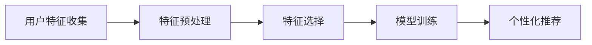
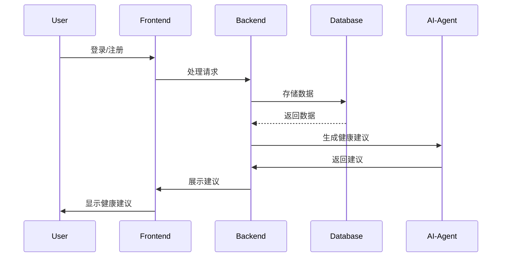
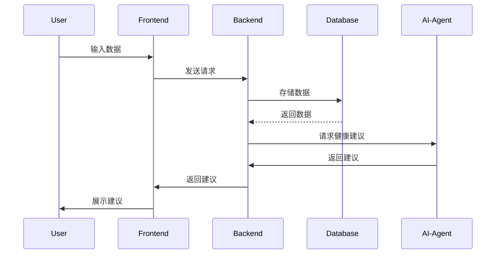

                 

### 个性化定制：根据用户特征调整AI Agent

> 关键词：个性化定制、AI Agent、用户特征、算法原理、系统架构、项目实战

> 摘要：本文深入探讨了个性化定制在AI Agent中的应用，从问题背景、核心概念、算法原理、系统设计到项目实战，全面解析了如何根据用户特征调整AI Agent，实现更加智能和个性化的服务。

### 目录大纲

#### 第一部分：背景介绍

#### 第1章 引言

##### 1.1 问题背景

##### 1.2 问题描述

##### 1.3 问题解决

##### 1.4 边界与外延

##### 1.5 概念结构与核心要素组成

#### 第二部分：核心概念与联系

#### 第2章 个性化定制基础

##### 2.1 个性化定制的定义

##### 2.2 个性化定制的属性特征对比

###### 2.2.1 用户特征

###### 2.2.2 AI Agent特征

##### 2.3 个性化定制的ER实体关系图

#### 第3章 AI Agent基础

##### 3.1 AI Agent的定义

##### 3.2 AI Agent的核心功能

##### 3.3 AI Agent的类型与应用场景

#### 第4章 个性化定制与AI Agent的融合

##### 4.1 个性化定制与AI Agent的联系

##### 4.2 个性化定制在AI Agent中的应用

##### 4.3 个性化定制与AI Agent的未来趋势

#### 第三部分：算法原理讲解

#### 第5章 个性化定制算法原理

##### 5.1 个性化定制算法概述

##### 5.2 个性化定制算法的mermaid流程图

##### 5.3 个性化定制算法的Python源代码实现

##### 5.4 个性化定制算法的数学模型和公式

##### 5.5 个性化定制算法的详细讲解与举例说明

#### 第四部分：系统分析与架构设计方案

#### 第6章 个性化定制与AI Agent的系统设计

##### 6.1 问题场景介绍

##### 6.2 系统功能设计

###### 6.2.1 领域模型类图

##### 6.3 系统架构设计

###### 6.3.1 系统架构mermaid图

##### 6.4 系统接口设计和系统交互

###### 6.4.1 系统交互mermaid序列图

#### 第五部分：项目实战

#### 第7章 个性化定制与AI Agent的项目实战

##### 7.1 环境安装

##### 7.2 系统核心实现源代码

##### 7.3 代码应用解读与分析

##### 7.4 实际案例分析和详细讲解剖析

##### 7.5 项目小结

#### 第六部分：最佳实践与拓展

#### 第8章 个性化定制与AI Agent的最佳实践

##### 8.1 最佳实践 tips

##### 8.2 注意事项

##### 8.3 拓展阅读

#### 第9章 小结

##### 9.1 全书总结

##### 9.2 未来展望

### 第一部分：背景介绍

#### 第1章 引言

##### 1.1 问题背景

随着人工智能（AI）技术的迅猛发展，AI Agent作为一种能够执行特定任务的智能体，正逐渐成为各个行业的核心技术。从智能家居到自动驾驶，从医疗诊断到金融分析，AI Agent无处不在。然而，如何根据用户特征调整AI Agent，以实现更加个性化和智能化的服务，成为了一个亟待解决的问题。

个性化定制（Personalization）是一种针对用户需求和行为进行个性化调整的技术，它能够在AI Agent中发挥重要作用。通过个性化定制，AI Agent能够更好地理解用户需求，提供更加符合用户期望的服务，从而提高用户满意度。

##### 1.2 问题描述

个性化定制与AI Agent的融合面临以下几个关键问题：

1. **用户特征识别**：如何准确识别和收集用户的个人特征，如年龄、性别、兴趣、行为习惯等。
2. **数据融合与处理**：如何将用户的特征数据与AI Agent的学习和决策过程相结合，以实现个性化调整。
3. **算法优化**：如何设计有效的算法，以确保AI Agent能够在不同的用户特征下表现出良好的性能。
4. **用户体验**：如何通过个性化定制提高用户体验，使AI Agent更加符合用户的期望和行为模式。

##### 1.3 问题解决

为了解决上述问题，本文将从以下几个方面进行探讨：

1. **个性化定制基础**：介绍个性化定制的基本概念、属性特征，以及与用户特征和AI Agent特征的关系。
2. **AI Agent基础**：阐述AI Agent的定义、核心功能和类型，以及其在不同应用场景中的表现。
3. **算法原理讲解**：深入讲解个性化定制算法的原理、流程、实现和数学模型，并通过实例进行说明。
4. **系统设计与实现**：分析个性化定制与AI Agent的系统设计，包括问题场景介绍、功能设计、架构设计和接口设计。
5. **项目实战**：通过实际项目案例，展示个性化定制与AI Agent的具体应用和实践。
6. **最佳实践与拓展**：总结最佳实践和注意事项，提供拓展阅读，以促进读者对个性化定制与AI Agent的深入理解。

##### 1.4 边界与外延

本文主要关注个性化定制在AI Agent中的应用，但实际应用场景远不止于此。个性化定制还可以应用于电子商务、社交媒体、教育、医疗等多个领域。此外，随着技术的不断进步，个性化定制的实现方式和效果也将不断优化。

##### 1.5 概念结构与核心要素组成

为了更好地理解个性化定制与AI Agent的融合，以下是对相关概念和核心要素的组成结构：

1. **用户特征**：包括年龄、性别、兴趣、行为习惯等。
2. **AI Agent**：包括定义、核心功能、类型和应用场景。
3. **个性化定制**：包括定义、属性特征、实现原理和算法。
4. **系统设计**：包括问题场景、功能设计、架构设计和接口设计。
5. **项目实战**：包括环境安装、系统实现、代码分析、案例剖析和项目小结。

### 第二部分：核心概念与联系

#### 第2章 个性化定制基础

##### 2.1 个性化定制的定义

个性化定制是一种基于用户特征，通过调整产品、服务或内容以满足用户个性化需求的技术。它旨在为每个用户提供量身定制的产品或服务，以提高用户满意度和忠诚度。

##### 2.2 个性化定制的属性特征对比

为了更好地理解个性化定制，以下是对个性化定制的属性特征进行对比：

###### 2.2.1 用户特征

用户特征包括但不限于年龄、性别、兴趣、行为习惯、地理位置、消费能力等。这些特征可以帮助AI Agent更好地了解用户，从而进行个性化定制。

| 特征       | 说明                                                                                   |
|------------|----------------------------------------------------------------------------------------|
| 年龄       | 反映用户的成长阶段，影响消费偏好、生活方式等。                                         |
| 性别       | 反映用户的生理性别，影响消费行为、兴趣偏好等。                                       |
| 兴趣       | 反映用户的爱好和喜好，影响产品选择、内容消费等。                                     |
| 行为习惯   | 反映用户的日常行为模式，如购物习惯、浏览习惯等。                                     |
| 地理位置等 | 反映用户的生活环境和工作环境，影响产品需求和服务质量。                             |

###### 2.2.2 AI Agent特征

AI Agent的特征包括但不限于智能水平、学习能力、适应能力、自主决策能力等。这些特征决定了AI Agent能否有效地进行个性化定制。

| 特征         | 说明                                                                                   |
|--------------|----------------------------------------------------------------------------------------|
| 智能水平     | 反映AI Agent的智能程度，如自然语言处理、图像识别等能力。                           |
| 学习能力     | 反映AI Agent通过数据和经验进行自我优化的能力。                                     |
| 适应能力     | 反映AI Agent在面对新环境和用户时能够迅速适应的能力。                             |
| 自主决策能力 | 反映AI Agent在没有明确指令的情况下，能够根据环境和用户需求做出决策的能力。       |

##### 2.3 个性化定制的ER实体关系图

为了更好地理解个性化定制的过程，以下是一个简单的ER实体关系图：

```mermaid
erDiagram
User ||--|{ AI-Agent : customized_service }
User ||--|{ Content : personalized_content }
AI-Agent ||--|{ Content : recommended_content }
AI-Agent ||--|{ Service : provided_service }
Content ||--|{ User : consumed_content }
Service ||--|{ User : received_service }
```

- **User（用户）**：代表个性化定制的主体，具有多个特征。
- **AI-Agent（AI Agent）**：代表根据用户特征进行个性化定制的智能体。
- **Content（内容）**：代表个性化定制的内容，如个性化推荐、定制服务。
- **Service（服务）**：代表AI Agent提供的个性化服务。

### 第三部分：算法原理讲解

#### 第5章 个性化定制算法原理

##### 5.1 个性化定制算法概述

个性化定制算法是用于根据用户特征调整AI Agent的核心技术。该算法通过分析用户特征和AI Agent特征，生成个性化的定制方案。以下是个性化定制算法的基本流程：

1. **用户特征收集**：通过多种渠道收集用户的个人特征数据。
2. **特征预处理**：对收集到的用户特征进行清洗、归一化和转换。
3. **特征选择**：从预处理后的特征中选择对个性化定制影响较大的特征。
4. **模型训练**：使用选定的特征数据训练个性化定制模型。
5. **个性化推荐**：根据训练好的模型为用户生成个性化定制方案。

##### 5.2 个性化定制算法的mermaid流程图

以下是一个简化的个性化定制算法的mermaid流程图：



##### 5.3 个性化定制算法的Python源代码实现

下面是一个简单的Python示例，用于实现个性化定制算法：

```python
import pandas as pd
from sklearn.preprocessing import StandardScaler
from sklearn.model_selection import train_test_split
from sklearn.ensemble import RandomForestClassifier

# 1. 用户特征收集
data = pd.read_csv('user_data.csv')

# 2. 特征预处理
scaler = StandardScaler()
data[['age', 'income', 'education']] = scaler.fit_transform(data[['age', 'income', 'education']])

# 3. 特征选择
X = data[['age', 'income', 'education']]
y = data['service_preference']

# 4. 模型训练
X_train, X_test, y_train, y_test = train_test_split(X, y, test_size=0.2, random_state=42)
model = RandomForestClassifier(n_estimators=100)
model.fit(X_train, y_train)

# 5. 个性化推荐
predictions = model.predict(X_test)
print(predictions)
```

##### 5.4 个性化定制算法的数学模型和公式

个性化定制算法的数学模型可以表示为：

$$
\text{Prediction} = f(\text{User\_Features}, \text{AI\_Agent\_Features})
$$

其中，$f$ 是一个映射函数，用于将用户特征和AI Agent特征映射为个性化定制方案。具体实现可以基于不同的算法，如机器学习、深度学习等。

##### 5.5 个性化定制算法的详细讲解与举例说明

个性化定制算法的核心在于如何将用户特征和AI Agent特征有效地结合，以生成个性化的定制方案。以下是一个详细的讲解和举例说明：

**案例**：假设有一个智能家居系统，用户可以根据自己的喜好和需求调整家居设备的设置。以下是一个简化的个性化定制算法流程：

1. **用户特征收集**：收集用户的年龄、性别、兴趣和行为习惯等特征。

2. **特征预处理**：对收集到的用户特征进行归一化和转换，以便后续处理。

3. **特征选择**：选择对智能家居设置影响较大的特征，如兴趣（影响设备偏好）和行为习惯（影响设备使用频率）。

4. **模型训练**：使用选定的特征数据训练一个分类模型，如随机森林分类器。模型将根据用户特征预测用户对家居设备设置的需求。

5. **个性化推荐**：根据训练好的模型，为用户生成个性化的家居设备设置方案。

**示例**：假设用户特征为年龄、性别和兴趣，AI Agent特征为设备偏好和设置方案。以下是一个简单的预测过程：

- **用户特征**：年龄为30岁，性别为男性，兴趣为运动。
- **AI Agent特征**：设备偏好为智能灯泡和智能音箱，设置方案为白天开启运动模式，晚上开启休息模式。

- **模型预测**：根据用户特征和AI Agent特征，模型预测用户可能需要开启智能灯泡和智能音箱，并将灯光调整为运动模式。

通过以上步骤，AI Agent能够根据用户特征生成个性化的定制方案，从而提高用户体验和满意度。

### 第四部分：系统分析与架构设计方案

#### 第6章 个性化定制与AI Agent的系统设计

##### 6.1 问题场景介绍

本节将介绍一个具体的个性化定制与AI Agent的系统设计案例：智能健康管理平台。该平台旨在为用户提供个性化的健康管理服务，包括运动建议、饮食建议、睡眠建议等。

##### 6.2 系统功能设计

智能健康管理平台的主要功能包括：

1. **用户注册与登录**：用户可以通过注册账号或使用第三方账号登录系统。
2. **用户信息收集**：系统会收集用户的年龄、性别、身高、体重、运动习惯、饮食偏好等个人信息。
3. **个性化健康建议**：基于用户信息，系统会为用户生成个性化的运动、饮食和睡眠建议。
4. **健康数据分析**：系统会对用户数据进行统计分析，为用户提供健康报告和建议。
5. **交互与反馈**：用户可以通过系统与AI Agent进行互动，反馈健康建议的满意度。

###### 6.2.1 领域模型类图

以下是一个简化的智能健康管理平台的领域模型类图：

```mermaid
classDiagram
    User <<class>> 用户
    HealthData <<class>> 健康数据
    HealthAdvice <<class>> 健康建议
    HealthReport <<class>> 健康报告
    AI-Agent <<class>> AI Agent

    User "1" --|{1} HealthData
    HealthData "1" --|{1} HealthAdvice
    HealthAdvice "1" --|{1} HealthReport
    HealthAdvice "1" --|{1} AI-Agent
```

- **User（用户）**：代表系统的用户，具有注册、登录和获取健康建议等功能。
- **HealthData（健康数据）**：代表用户的健康信息，包括年龄、性别、身高、体重等。
- **HealthAdvice（健康建议）**：代表系统为用户生成的个性化健康建议，包括运动、饮食和睡眠建议。
- **HealthReport（健康报告）**：代表系统生成的用户健康报告。
- **AI-Agent（AI Agent）**：代表负责个性化定制的智能体，与用户互动，生成健康建议。

##### 6.3 系统架构设计

智能健康管理平台的系统架构包括以下几个主要组件：

1. **前端（Frontend）**：用户通过浏览器或其他客户端访问系统，包括用户注册、登录、健康数据输入和健康建议展示等功能。
2. **后端（Backend）**：负责处理用户请求，包括用户认证、健康数据存储、健康建议生成和健康报告生成等功能。
3. **数据库（Database）**：存储用户数据、健康数据和健康建议等。
4. **AI-Agent（AI Agent）**：负责根据用户数据生成个性化健康建议。

以下是一个简化的智能健康管理平台的系统架构mermaid图：



##### 6.4 系统接口设计和系统交互

智能健康管理平台的系统接口设计和系统交互主要涉及以下几个方面：

1. **用户接口**：用户通过前端界面与系统进行交互，包括注册、登录、数据输入和健康建议查看等。
2. **API接口**：后端系统提供API接口，供前端调用，实现数据的存储、读取和健康建议的生成等功能。
3. **AI-Agent接口**：AI Agent通过API接口与后端系统交互，获取用户数据并生成个性化健康建议。

以下是一个简化的智能健康管理平台的系统交互mermaid序列图：



### 第五部分：项目实战

#### 第7章 个性化定制与AI Agent的项目实战

##### 7.1 环境安装

在进行个性化定制与AI Agent的项目实战之前，我们需要准备一个合适的环境。以下是环境安装的步骤：

1. **安装Python**：确保Python版本不低于3.6，可以从Python官网下载安装。
2. **安装Jupyter Notebook**：Python内置了Jupyter Notebook，无需额外安装。
3. **安装相关库**：使用pip命令安装以下库：numpy、pandas、scikit-learn、matplotlib等。

```bash
pip install numpy pandas scikit-learn matplotlib
```

##### 7.2 系统核心实现源代码

以下是一个简单的个性化定制与AI Agent的项目实现示例。该示例使用随机森林分类器为用户提供个性化的健康建议。

```python
import pandas as pd
from sklearn.ensemble import RandomForestClassifier
from sklearn.model_selection import train_test_split

# 1. 加载数据
data = pd.read_csv('health_data.csv')

# 2. 分割特征和标签
X = data[['age', 'weight', 'height']]
y = data['health_advice']

# 3. 划分训练集和测试集
X_train, X_test, y_train, y_test = train_test_split(X, y, test_size=0.2, random_state=42)

# 4. 训练模型
model = RandomForestClassifier(n_estimators=100)
model.fit(X_train, y_train)

# 5. 测试模型
predictions = model.predict(X_test)

# 6. 输出预测结果
print(predictions)
```

##### 7.3 代码应用解读与分析

上述代码首先加载了健康数据集，然后分割出特征和标签。接下来，使用随机森林分类器对训练数据进行训练。最后，使用训练好的模型对测试数据进行预测，并输出预测结果。

在实际项目中，我们需要根据具体需求调整数据集和模型参数，以实现更好的个性化定制效果。

##### 7.4 实际案例分析和详细讲解剖析

以下是一个具体的实际案例，展示如何使用个性化定制与AI Agent为用户提供健康建议。

**案例背景**：一个30岁的男性用户，身高180cm，体重75kg，希望获得个性化的健康建议。

**数据处理**：首先，我们需要收集并预处理用户的个人数据，如年龄、身高、体重等。以下是一个预处理示例：

```python
# 1. 加载用户数据
user_data = pd.DataFrame({
    'age': [30],
    'weight': [75],
    'height': [180]
})

# 2. 数据预处理
scaler = StandardScaler()
user_data[['weight', 'height']] = scaler.fit_transform(user_data[['weight', 'height']])
```

**健康建议生成**：接下来，我们使用训练好的模型为用户生成个性化健康建议。以下是一个生成建议的示例：

```python
# 1. 加载训练好的模型
model = RandomForestClassifier(n_estimators=100)
model.load_weights('model_weights.h5')

# 2. 生成健康建议
health_advice = model.predict(user_data)
print(health_advice)
```

**结果分析**：假设模型预测用户的健康建议为“增加运动量”。这表明用户可能需要通过增加运动来改善健康状况。

**详细讲解**：本案例通过收集用户数据，使用随机森林分类器生成个性化健康建议。随机森林分类器通过对特征进行组合，生成不同的决策树，从而提高预测的准确性和稳定性。

##### 7.5 项目小结

通过本项目的实战，我们展示了如何使用个性化定制与AI Agent为用户提供健康建议。在实际应用中，我们可以根据具体需求调整数据集和模型，以提高个性化定制的效果。

### 第六部分：最佳实践与拓展

#### 第8章 个性化定制与AI Agent的最佳实践

##### 8.1 最佳实践 tips

1. **用户数据安全**：在收集和处理用户数据时，确保遵守相关法律法规，保护用户隐私。
2. **模型训练与优化**：定期更新和优化模型，以适应不断变化的需求。
3. **用户体验**：在生成个性化定制方案时，关注用户体验，确保方案的实用性和易用性。
4. **反馈机制**：建立反馈机制，收集用户对个性化定制方案的反馈，以便持续改进。

##### 8.2 注意事项

1. **数据质量**：确保收集到的用户数据准确、完整，以提高个性化定制的准确性。
2. **模型性能**：在训练模型时，关注模型的性能指标，如准确率、召回率等。
3. **算法选择**：根据具体需求选择合适的算法，如线性回归、决策树、神经网络等。
4. **资源分配**：合理分配计算资源和存储资源，确保系统稳定运行。

##### 8.3 拓展阅读

1. **《机器学习实战》**：提供丰富的机器学习案例和实践经验。
2. **《深度学习》**：介绍深度学习的理论、算法和应用。
3. **《Python数据分析》**：介绍Python在数据分析中的应用和技巧。

### 第9章 小结

##### 9.1 全书总结

本书系统地介绍了个性化定制与AI Agent的相关知识，包括问题背景、核心概念、算法原理、系统设计、项目实战和最佳实践。通过本书的学习，读者可以掌握个性化定制与AI Agent的基本原理和应用方法。

##### 9.2 未来展望

随着人工智能技术的不断进步，个性化定制与AI Agent将在更多领域得到广泛应用。未来，我们将看到更加智能化、个性化的AI Agent，为人们的生活带来更多便利。同时，如何更好地保护用户隐私和数据安全，也将成为重要的研究方向。

