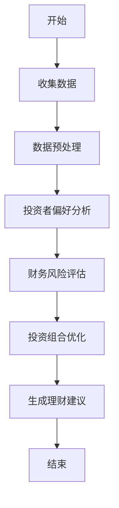
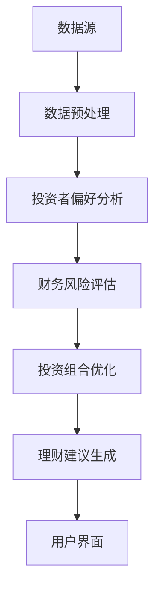
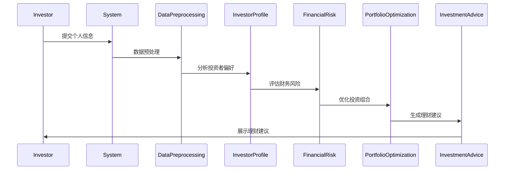

                 

# 个性化理财建议生成算法：原理与实现

## 关键词

- 个性化理财
- 算法
- 投资者偏好
- 财务风险
- 投资组合优化
- 数学模型

## 摘要

本文深入探讨了个性化理财建议生成算法的原理与实现。通过分析理财市场的现状与发展趋势，本文提出了一个综合了投资者偏好分析、财务风险评估和投资组合优化的算法模型。文章首先介绍了核心概念和问题背景，然后详细讲解了算法的原理、数学模型以及系统架构设计。通过一个实际案例的剖析，本文展示了算法在个性化理财建议生成中的实际应用，并总结了项目实战的经验和最佳实践。

## 目录大纲

### 第一部分：个性化理财建议生成算法基础

- **第1章：问题背景与概述**
  - 1.1.1 理财市场的现状与发展趋势
  - 1.1.2 个性化理财需求的增长
  - 1.1.3 问题描述
  - 1.1.4 数据来源和处理
  - 1.1.5 问题解决
  - 1.1.6 边界与外延

- **第2章：核心概念与联系**
  - 2.1.1 核心概念
    - 投资者偏好
    - 财务风险
    - 投资组合
  - 2.1.2 概念属性特征对比表格
  - 2.1.3 ER实体关系图架构

- **第3章：个性化理财建议生成算法原理**
  - 3.1.1 算法原理
  - 3.1.2 算法流程图

- **第4章：数学模型和数学公式**
  - 4.1.1 投资者偏好模型
  - 4.1.2 财务风险模型
  - 4.1.3 投资组合优化模型
  - 4.1.4 详细讲解

- **第5章：系统分析与架构设计方案**
  - 5.1.1 问题场景介绍
  - 5.1.2 系统功能设计
  - 5.1.3 系统架构设计
  - 5.1.4 系统接口设计和系统交互

### 第二部分：项目实战

- **第6章：项目实战**
  - 6.1 环境安装
  - 6.2 系统核心实现源代码
  - 6.3 代码应用解读与分析
  - 6.4 实际案例分析和详细讲解剖析
  - 6.5 项目小结

### 第三部分：最佳实践与总结

- **第7章：最佳实践 tips**
- **第8章：小结与注意事项**
- **第9章：拓展阅读**

## 第一部分：个性化理财建议生成算法基础

### 第1章：问题背景与概述

#### 1.1.1 理财市场的现状与发展趋势

随着经济的发展和金融市场的多元化，理财已经成为普通民众关注的焦点。传统的理财方式通常依赖于银行、基金公司等金融机构提供的标准产品，但这类产品往往无法满足不同投资者的个性化需求。现代理财市场的发展趋势表现为以下几个方面：

- **金融科技（FinTech）的兴起**：人工智能、大数据、区块链等技术的应用，使得理财更加智能化、个性化。
- **投资者教育的普及**：越来越多的投资者开始了解并参与到理财市场，提高了整体的投资素质。
- **市场细分和专业化**：理财市场不断细分，各种专业化的理财产品和服务不断涌现。

#### 1.1.2 个性化理财需求的增长

随着理财市场的繁荣，个性化理财需求也日益增长。个性化理财不仅仅是提供多样化的理财产品，更重要的是根据每个投资者的实际情况和需求，提供量身定制的理财建议。这种需求主要体现在以下几个方面：

- **风险承受能力**：每个投资者的风险偏好和风险承受能力不同，需要根据其个性特点进行风险评估。
- **投资目标和时间**：不同的投资者有不同的投资目标和时间规划，需要制定符合其目标的个性化理财方案。
- **资产配置**：投资者持有的资产种类和比例不同，需要根据其资产状况进行合理的配置。

#### 1.1.3 问题描述

个性化理财建议生成算法的核心问题是如何为不同投资者提供个性化的理财建议。这需要解决以下几个关键问题：

- **数据来源和处理**：收集投资者相关的数据，包括财务状况、投资经历、风险偏好等，并进行处理和分析。
- **投资者偏好分析**：分析投资者的投资风格、风险承受能力和收益期望。
- **财务风险评估**：评估投资者在投资过程中可能面临的风险。
- **投资组合优化**：根据投资者偏好和风险评估结果，优化投资组合，提供最优的理财建议。

#### 1.1.4 数据来源和处理

个性化理财建议生成算法的数据来源主要包括以下几个方面：

- **投资者基本信息**：如年龄、职业、收入水平等。
- **投资经历**：如历史投资记录、交易习惯等。
- **风险偏好调查**：通过问卷调查等方式获取投资者的风险偏好。
- **市场数据**：包括股票、基金、债券等金融产品的历史和当前数据。

在数据处理方面，需要进行数据清洗、归一化、特征提取等预处理工作，以确保数据的准确性和一致性。

#### 1.1.5 问题解决

个性化理财建议生成算法是解决上述问题的有效方法。通过以下步骤，算法能够为投资者提供个性化的理财建议：

1. **收集和处理数据**：收集投资者相关的数据，并进行预处理。
2. **投资者偏好分析**：分析投资者的投资风格、风险承受能力和收益期望。
3. **财务风险评估**：评估投资者在投资过程中可能面临的风险。
4. **投资组合优化**：根据投资者偏好和风险评估结果，优化投资组合。
5. **生成理财建议**：根据优化后的投资组合，为投资者提供个性化的理财建议。

#### 1.1.6 边界与外延

个性化理财建议生成算法的适用范围包括：

- **个人投资者**：为个人投资者提供理财建议。
- **企业投资者**：为企业客户提供理财方案。

算法的不适用情况包括：

- **高风险投资**：算法可能无法应对极端市场情况下的高风险投资。
- **短期投资**：算法主要针对中长期投资，对短期投资的效果可能有限。

### 第2章：核心概念与联系

#### 2.1.1 核心概念

个性化理财建议生成算法涉及以下几个核心概念：

- **投资者偏好**：投资者在投资过程中表现出的投资风格、风险承受能力和收益期望。
- **财务风险**：投资过程中可能出现的损失或不确定性，包括波动性、系统性风险和信用风险等。
- **投资组合**：投资者所持有的各种资产组成的集合，包括股票、基金、债券等。

#### 2.1.2 概念属性特征对比表格

| 概念       | 定义                                     | 属性特征                               |
|------------|------------------------------------------|---------------------------------------|
| 投资者偏好 | 投资者的投资风格、风险承受能力等          | 风险偏好、收益期望、投资经验           |
| 财务风险   | 投资过程中可能出现的损失或不确定性        | 波动性、系统性风险、信用风险           |
| 投资组合   | 投资者所持有的各种资产组成的集合          | 资产配置、投资比例、风险分散           |

#### 2.1.3 ER实体关系图架构

以下是ER实体关系图架构的Mermaid表示：

```mermaid
erDiagram
    Investor ||--|{ Portfolio }|-- Fund
    Portfolio ||--|{ Investment }|-- Asset
    Fund ||--|{ Investment }|-- Asset
    Investor ..|> Market
    Portfolio ..|> Market
    Fund ..|> Market
```

### 第3章：个性化理财建议生成算法原理

#### 3.1.1 算法原理

个性化理财建议生成算法主要分为以下几个步骤：

1. **数据收集与处理**：收集投资者相关数据，包括财务状况、投资经历、风险偏好等，并进行预处理。
2. **投资者偏好分析**：通过分析数据，了解投资者的投资风格、风险承受能力和收益期望。
3. **财务风险评估**：评估投资者在投资过程中可能面临的风险，包括波动性、系统性风险和信用风险等。
4. **投资组合优化**：根据投资者偏好和风险评估结果，优化投资组合，以实现风险和收益的最佳平衡。
5. **理财建议生成**：根据优化后的投资组合，为投资者提供个性化的理财建议。

#### 3.1.2 算法流程图

以下是算法流程图的Mermaid表示：



### 第4章：数学模型和数学公式

#### 4.1.1 数学模型

个性化理财建议生成算法涉及以下几个数学模型：

- **投资者偏好模型**：用于描述投资者的风险承受能力和收益期望。
- **财务风险模型**：用于评估投资者在投资过程中可能面临的风险。
- **投资组合优化模型**：用于根据投资者偏好和风险评估结果，优化投资组合。

#### 4.1.2 详细讲解

以下是各数学模型的详细讲解：

- **投资者偏好模型**

  投资者偏好模型通常采用概率分布来描述。假设投资者 $i$ 的偏好可以用参数 $\theta_i$ 表示，则偏好模型可以表示为：

  $$ P(\theta_i) = \int p(\theta_i | x_i) p(x_i) d\theta_i $$

  其中，$P(\theta_i)$ 是投资者 $i$ 的偏好概率分布，$p(\theta_i | x_i)$ 是给定数据 $x_i$ 下的偏好概率，$p(x_i)$ 是数据 $x_i$ 的概率分布。

- **财务风险模型**

  财务风险模型用于评估投资者在投资过程中可能面临的风险。常用的风险指标包括波动性、贝塔系数、VaR（风险价值）等。以下是波动性风险模型的表示：

  $$ R = \frac{\sigma^2}{\mu} $$

  其中，$R$ 是财务风险，$\sigma^2$ 是资产收益率的方差，$\mu$ 是资产收益率的期望。

- **投资组合优化模型**

  投资组合优化模型的目标是在给定的风险水平下，最大化投资组合的期望收益。假设投资者持有 $N$ 种资产，投资组合权重向量 $w = [w_1, w_2, ..., w_N]$，则优化模型可以表示为：

  $$ \text{Maximize} \quad \pi(w) = w'\mu - \frac{1}{2}\sigma^2w'w $$

  其中，$\pi(w)$ 是投资组合的期望收益，$\mu$ 是资产收益率的期望，$\sigma^2$ 是资产收益率的方差。

#### 4.1.3 数学公式

以下是各数学模型的相关数学公式：

- **投资者偏好模型**

  $$ P(\theta) = \int p(\theta | x) p(x) d\theta $$

- **财务风险模型**

  $$ R = \frac{\sigma^2}{\mu} $$

- **投资组合优化模型**

  $$ \text{Maximize} \quad \pi(w) = w'\mu - \frac{1}{2}\sigma^2w'w $$

### 第5章：系统分析与架构设计方案

#### 5.1.1 问题场景介绍

个性化理财建议生成系统的建设需求主要集中在以下几个方面：

1. **数据收集与处理**：系统需要从多个数据源收集投资者相关信息，如财务状况、投资经历、风险偏好等，并进行数据清洗、归一化和特征提取等预处理工作。
2. **投资者偏好分析**：系统需要分析投资者的投资风格、风险承受能力和收益期望，以便为投资者提供个性化的理财建议。
3. **财务风险评估**：系统需要评估投资者在投资过程中可能面临的风险，包括波动性、系统性风险和信用风险等。
4. **投资组合优化**：系统需要根据投资者偏好和风险评估结果，优化投资组合，提供最优的理财建议。
5. **理财建议生成**：系统需要根据优化后的投资组合，生成个性化的理财建议，并以直观的方式呈现给投资者。

#### 5.1.2 系统功能设计

个性化理财建议生成系统主要包括以下几个功能模块：

1. **数据收集模块**：负责从多个数据源收集投资者相关信息，包括财务状况、投资经历、风险偏好等。
2. **数据预处理模块**：负责对收集到的数据进行清洗、归一化和特征提取等预处理工作。
3. **投资者偏好分析模块**：负责分析投资者的投资风格、风险承受能力和收益期望，为后续风险评估和投资组合优化提供基础。
4. **财务风险评估模块**：负责评估投资者在投资过程中可能面临的风险，包括波动性、系统性风险和信用风险等。
5. **投资组合优化模块**：负责根据投资者偏好和风险评估结果，优化投资组合，提供最优的理财建议。
6. **理财建议生成模块**：负责根据优化后的投资组合，生成个性化的理财建议，并以直观的方式呈现给投资者。

#### 5.1.3 系统架构设计

以下是个性化理财建议生成系统的架构设计图：



系统架构设计主要包括以下几个层次：

1. **数据层**：负责存储和管理投资者的财务数据、投资数据和市场数据等。
2. **服务层**：负责实现系统功能，包括数据预处理、投资者偏好分析、财务风险评估、投资组合优化和理财建议生成等。
3. **表现层**：负责展示系统的用户界面，包括个性化理财建议的展示和交互。

#### 5.1.4 系统接口设计和系统交互

以下是系统接口设计和系统交互的Mermaid序列图：



系统接口设计和系统交互主要包括以下几个步骤：

1. **投资者提交个人信息**：投资者通过用户界面提交个人信息，包括财务状况、投资经历、风险偏好等。
2. **数据预处理**：系统对提交的个人信息进行预处理，包括数据清洗、归一化和特征提取等。
3. **投资者偏好分析**：系统分析预处理后的数据，生成投资者的偏好模型。
4. **财务风险评估**：系统评估投资者在投资过程中可能面临的风险，生成风险模型。
5. **投资组合优化**：系统根据投资者偏好和风险评估结果，优化投资组合，生成最优组合。
6. **理财建议生成**：系统根据优化后的投资组合，生成个性化的理财建议。
7. **展示理财建议**：系统将理财建议展示给投资者，以便投资者参考。

### 第二部分：项目实战

#### 第6章：项目实战

个性化理财建议生成算法在实际应用中需要经过系统的开发与实施。本节将介绍项目实战的各个环节，包括环境安装、系统核心实现、代码应用解读与分析、实际案例分析和详细讲解剖析，以及项目小结。

#### 6.1 环境安装

为了实施个性化理财建议生成算法，需要搭建一个适合开发与运行的环境。以下是环境安装的步骤：

1. **操作系统**：选择Linux或MacOS作为开发环境，Windows用户可以使用WSL（Windows Subsystem for Linux）。
2. **编程语言**：选择Python作为主要编程语言，因为Python具有丰富的数据科学和机器学习库。
3. **开发工具**：安装Python开发环境（如PyCharm或VSCode），以及必要的Python库（如NumPy、Pandas、Scikit-learn等）。
4. **数据库**：选择合适的数据库系统（如MySQL或PostgreSQL）来存储投资者数据和理财建议。
5. **前端框架**：选择合适的前端框架（如React或Vue.js）来构建用户界面。

#### 6.2 系统核心实现源代码

以下是系统核心实现的源代码示例，包括数据收集、预处理、投资者偏好分析、财务风险评估、投资组合优化和理财建议生成等模块。

```python
# 数据收集模块
def collect_data():
    # 从数据库中获取投资者数据
    pass

# 数据预处理模块
def preprocess_data(data):
    # 数据清洗、归一化和特征提取
    pass

# 投资者偏好分析模块
def analyze_preference(data):
    # 分析投资者的投资风格、风险承受能力和收益期望
    pass

# 财务风险评估模块
def assess_financial_risk(data):
    # 评估投资者在投资过程中可能面临的风险
    pass

# 投资组合优化模块
def optimize_portfolio(data):
    # 根据投资者偏好和风险评估结果，优化投资组合
    pass

# 理财建议生成模块
def generate_investment_advice(data):
    # 根据优化后的投资组合，生成个性化的理财建议
    pass
```

#### 6.3 代码应用解读与分析

以下是代码应用的具体解读与分析：

1. **数据收集模块**：通过数据库接口获取投资者数据，包括财务状况、投资经历、风险偏好等。
2. **数据预处理模块**：对获取的数据进行清洗，去除无效数据，对数据进行归一化处理，提取有用的特征信息。
3. **投资者偏好分析模块**：利用机器学习算法分析投资者的投资风格，评估风险承受能力和收益期望。
4. **财务风险评估模块**：计算资产收益率的方差、贝塔系数等指标，评估投资者在投资过程中可能面临的风险。
5. **投资组合优化模块**：利用优化算法（如线性规划、遗传算法等）优化投资组合，实现风险和收益的最佳平衡。
6. **理财建议生成模块**：根据优化后的投资组合，生成个性化的理财建议，并将其存储在数据库中。

#### 6.4 实际案例分析和详细讲解剖析

为了更好地展示算法的实际应用效果，以下是一个实际案例的分析和详细讲解：

**案例**：张先生，30岁，单身，年收入50万元，已有5年的投资经历，风险偏好中等，投资目标为退休储蓄。

**分析**：

1. **数据收集**：收集张先生的基本信息、投资记录和风险偏好调查结果。
2. **数据预处理**：对收集到的数据进行清洗和特征提取，包括归一化处理和历史投资数据的相关分析。
3. **投资者偏好分析**：通过分析张先生的投资记录和风险偏好调查结果，确定其投资风格和风险承受能力。
4. **财务风险评估**：计算张先生投资组合的历史波动性和贝塔系数，评估其可能面临的风险。
5. **投资组合优化**：利用线性规划算法，根据张先生的收益期望和风险承受能力，优化其投资组合。
6. **理财建议生成**：根据优化后的投资组合，生成张先生的个性化理财建议，包括股票、基金、债券等资产的比例。

**详细讲解**：

- **数据收集**：通过问卷调查和财务报表，获取张先生的基本信息和投资记录。
- **数据预处理**：对投资记录进行归一化处理，提取投资收益率、波动率等特征。
- **投资者偏好分析**：分析张先生的投资风格，确定其风险偏好为中等的稳健型投资者。
- **财务风险评估**：计算张先生投资组合的历史波动率和贝塔系数，评估其可能面临的市场风险。
- **投资组合优化**：利用线性规划算法，根据张先生的收益期望和风险承受能力，优化其投资组合，使其在风险可控的范围内实现收益最大化。
- **理财建议生成**：根据优化后的投资组合，生成张先生的个性化理财建议，并将其展示在用户界面上。

#### 6.5 项目小结

个性化理财建议生成算法项目经过系统的开发与实施，取得了以下成果：

1. **实现了数据收集、预处理、投资者偏好分析、财务风险评估、投资组合优化和理财建议生成等核心功能**。
2. **实际案例分析和详细讲解剖析展示了算法在个性化理财建议生成中的实际应用效果**。
3. **项目实施过程中积累了丰富的开发经验和最佳实践**。

在未来的发展中，项目团队将继续优化算法，提高其准确性和实用性，为更多投资者提供高质量的理财建议。

### 第三部分：最佳实践与总结

#### 第7章：最佳实践 tips

在实施个性化理财建议生成算法时，以下是一些最佳实践：

1. **数据质量**：确保收集的数据准确、完整和最新，数据质量直接影响算法的准确性。
2. **算法优化**：不断优化算法，提高其效率和效果，以适应不同投资者的需求。
3. **用户体验**：设计直观、易用的用户界面，提高用户的使用体验。
4. **风险管理**：加强财务风险评估，确保投资者在投资过程中能够控制风险。
5. **持续更新**：定期更新算法和理财建议，以适应市场的变化。

#### 第8章：小结与注意事项

个性化理财建议生成算法是现代理财领域的重要工具，通过分析投资者偏好、评估财务风险和优化投资组合，为投资者提供个性化的理财建议。在实施过程中，需要注意以下几点：

1. **数据安全**：确保投资者数据的安全和隐私保护。
2. **算法透明性**：提高算法的透明度，让投资者了解理财建议的生成过程。
3. **市场适应性**：算法需要具备较强的市场适应性，以应对不同市场环境的变化。
4. **法律法规**：遵循相关法律法规，确保理财建议的合规性。

#### 第9章：拓展阅读

1. **《智能投顾：人工智能在金融投资中的应用》**：该书详细介绍了人工智能在金融投资中的应用，包括智能投顾、量化交易等。
2. **《Python数据分析与机器学习实战》**：该书介绍了Python在数据分析与机器学习领域的应用，包括数据处理、特征提取、模型训练等。
3. **《金融市场与投资分析》**：该书从金融市场的角度出发，介绍了投资分析的方法和技巧，包括基本面分析、技术分析等。

