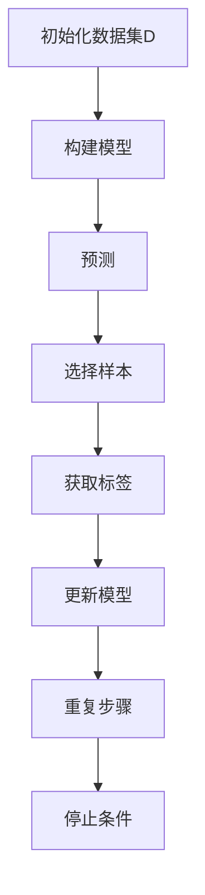

                 

## 文章标题

### 主动学习：优化AI Agent的学习效率

### 关键词：主动学习，AI效率，学习算法，优化，案例研究

### 摘要

本文将深入探讨主动学习在人工智能（AI）领域中的重要性，特别是如何优化AI代理的学习效率。我们将从问题背景、核心概念、算法原理、应用案例和未来展望等多个方面进行分析，旨在为读者提供全面而深入的理解。通过系统地阐述主动学习在AI中的应用，我们将展示其如何通过数据筛选策略、模型调整策略和学习策略优化来提升AI代理的学习效率。同时，本文还将探讨主动学习的挑战和未来发展方向，帮助读者把握这一前沿技术的趋势。

## 引言

在人工智能（AI）迅速发展的今天，机器学习（ML）作为其核心组成部分，已经成为各个行业创新的重要驱动力。然而，随着数据集的规模不断扩大和问题的复杂性增加，传统的被动学习（Passive Learning）方法在许多情况下表现出学习效率低、时间消耗大等问题。为了应对这一挑战，主动学习（Active Learning）作为一种优化学习效率的重要策略，逐渐受到了研究者和工业界的广泛关注。

### 1.1 问题背景

被动学习主要依赖于大量标注数据进行训练，这种方法存在以下几个问题：

1. **数据标注成本高**：对于某些复杂任务，如自然语言处理（NLP）和计算机视觉（CV），标注数据需要专业人员耗费大量时间和精力。
2. **数据冗余**：大量冗余数据的存在使得学习过程变得冗长，降低了学习效率。
3. **学习效率低**：被动学习往往只能从已有数据中学习，不能根据学习过程中的反馈进行自适应调整。

为了解决上述问题，主动学习应运而生。主动学习通过选择最有价值的数据点进行标注，并结合模型在已有数据上的表现来指导后续的数据选择，从而优化学习效率。

### 1.2 问题描述

主动学习的核心问题是如何在有限的标注资源下，选择出最有价值的数据点进行标注，以最大化模型的学习效率。具体来说，主动学习需要解决以下几个问题：

1. **数据选择策略**：如何根据模型当前的性能和不确定性选择最有代表性的数据点。
2. **模型调整策略**：如何通过调整模型参数和结构来提高学习效率。
3. **学习策略优化**：如何在动态变化的环境中调整学习策略，以适应新的数据分布。

### 1.3 问题解决

主动学习通过以下几种方式来优化AI代理的学习效率：

1. **数据筛选策略**：采用不确定性采样（Uncertainty Sampling）、边界样本采样（Boundary Sampling）等方法，根据模型预测的不确定性或样本的边界性质选择数据进行标注。
2. **模型调整策略**：通过调整模型参数、优化模型结构来提高模型的泛化能力和学习效率。
3. **学习策略优化**：采用动态调整学习率、多任务学习等方法，根据模型和数据的动态变化进行自适应调整。

### 1.4 边界与外延

主动学习的边界在于标注数据的可获得性和模型的复杂度。在实际应用中，需要平衡标注成本和模型性能，选择合适的主动学习方法。此外，主动学习与其他机器学习方法的结合，如在线学习、迁移学习等，也将成为未来研究的热点。

通过上述分析，我们可以看出主动学习在优化AI代理学习效率方面具有巨大的潜力。接下来，我们将进一步深入探讨主动学习的核心概念、原理以及在不同领域的应用。

## 核心概念与联系

在深入探讨主动学习之前，我们需要明确一些核心概念，并了解它们之间的联系。这有助于我们更好地理解主动学习的工作原理和应用场景。

### 2.1 核心概念

#### 2.1.1 定义

**主动学习（Active Learning）**：主动学习是一种通过主动选择最有价值的数据点进行标注，以优化学习过程的机器学习方法。与被动学习（Passive Learning）不同，主动学习不是随机选择数据，而是基于模型在已有数据上的表现来指导数据的选择。

**不确定性采样（Uncertainty Sampling）**：不确定性采样是一种常用的主动学习策略，通过选择模型预测不确定性较高的样本进行标注，以帮助模型更好地学习。

**边界样本采样（Boundary Sampling）**：边界样本采样是一种选择位于数据分布边界附近的样本进行标注的策略，有助于模型捕捉数据分布的细微变化。

**模型调整策略**：模型调整策略包括调整模型参数、优化模型结构等方法，以提高模型的泛化能力和学习效率。

**学习策略优化**：学习策略优化是通过动态调整学习策略，以适应模型和数据的动态变化。

#### 2.1.2 属性特征对比

| 策略         | 描述                                                         | 对比特征                                                                                             |
| ------------ | ------------------------------------------------------------ | -------------------------------------------------------------------------------------------------- |
| 不确定性采样 | 选择模型预测不确定性较高的样本进行标注                       | 有助于模型捕捉不确定性和边缘数据                             |
| 边界样本采样 | 选择位于数据分布边界附近的样本进行标注                       | 有助于模型学习数据分布的边界和变化                             |
| 模型调整策略 | 调整模型参数和结构，以提高模型性能                           | 可以提高模型泛化能力和学习效率                                 |
| 学习策略优化 | 根据模型和数据的动态变化，调整学习策略                       | 可以使模型更灵活地适应新的数据分布                             |

#### 2.1.3 ER实体关系图

为了更好地理解这些核心概念之间的关系，我们可以使用ER（实体-关系）图来表示：

```mermaid
erDiagram
    AI Agent ||--o{ Data Point : 被标注的数据点}
    Data Point ||--o{ Label : 标注结果}
    AI Agent ||--o{ Model : 学习模型}
    Model ||--o{ Prediction : 预测结果}
    Model ||--o{ Uncertainty : 预测不确定性}
    AI Agent ||--o{ Learning Strategy : 学习策略}
    Learning Strategy ||--o{ Uncertainty Sampling : 不确定性采样}
    Learning Strategy ||--o{ Boundary Sampling : 边界样本采样}
    Learning Strategy ||--o{ Model Adjustment : 模型调整策略}
```

在这个ER图中，AI Agent（AI代理）与多个实体有直接关联，包括Data Point（数据点）、Label（标注结果）、Model（学习模型）、Prediction（预测结果）、Uncertainty（预测不确定性）和Learning Strategy（学习策略）。其中，Learning Strategy又与Uncertainty Sampling、Boundary Sampling和Model Adjustment等具体策略有关联。这个图清晰地展示了主动学习中的核心实体和它们之间的关系，有助于我们深入理解主动学习的工作原理。

通过以上对核心概念和联系的阐述，我们可以为进一步探讨主动学习的算法原理和应用打下坚实的基础。

### 主动学习原理

主动学习作为一种优化机器学习模型训练过程的策略，其核心在于通过主动选择最具代表性的数据点进行标注，从而提高学习效率。以下，我们将详细讲解主动学习的基本算法原理，包括流程、数学模型以及具体实现。

#### 3.1.1 算法流程

主动学习的过程可以分为以下几个步骤：

1. **初始化**：选择初始数据集D，构建一个初步的模型。
2. **预测**：使用模型对当前数据集D中的每个样本进行预测。
3. **选择样本**：根据模型预测的不确定性或样本的边界性质选择最具代表性的样本。常用的选择策略包括不确定性采样和边界样本采样。
4. **标注**：对选择的样本进行标注，获取其真实标签。
5. **更新模型**：将标注后的新样本加入数据集，更新模型。
6. **重复步骤2-5**：根据更新后的模型继续选择样本进行标注，直至达到预定的停止条件。

以下是主动学习算法流程的Mermaid图表示：



#### 3.1.2 数学模型

主动学习的核心在于如何量化选择样本的重要性，以最大化学习效率。以下是一些常见的数学模型：

1. **不确定性采样（Uncertainty Sampling）**：

   不确定性采样选择模型预测不确定性最高的样本进行标注。其数学模型可以表示为：

   $$ U(D, \theta) = \arg\max_{x \in D} -\log(p(y|x; \theta)) $$

   其中，\( p(y|x; \theta) \) 是模型在样本 \( x \) 上的预测概率，\( \theta \) 是模型参数。

2. **边界样本采样（Boundary Sampling）**：

   边界样本采样选择位于数据分布边界附近的样本进行标注。其数学模型可以表示为：

   $$ B(D, \theta) = \arg\max_{x \in D} \frac{||\phi(x; \theta)^T \phi(x; \theta)||_2}{1 + ||\phi(x; \theta)^T \phi(x; \theta)||_2} $$

   其中，\( \phi(x; \theta) \) 是特征映射函数。

3. **邻域采样（Neighborhood Sampling）**：

   邻域采样选择与当前模型预测标签不同的邻居样本进行标注。其数学模型可以表示为：

   $$ N(D, \theta) = \arg\max_{x \in D} \sum_{y' \neq \hat{y}} p(y' | x; \theta) $$

   其中，\( \hat{y} \) 是模型对样本 \( x \) 的预测标签。

这些数学模型为我们提供了量化和选择最具代表性样本的依据，有助于提高学习效率。

#### 3.1.3 例子说明

为了更好地理解主动学习的原理，我们通过一个具体的例子进行说明。

假设我们有一个二分类问题，数据集D包含100个样本，模型是一个简单的线性模型。我们将使用不确定性采样策略进行主动学习。

1. **初始化数据集D**：选择初始数据集D，包含100个样本。
2. **构建模型**：使用线性模型进行预测，计算每个样本的预测概率。
3. **预测**：使用模型对数据集D中的每个样本进行预测，获取预测概率。
4. **选择样本**：根据预测概率选择不确定性最高的样本进行标注。例如，选择预测概率最接近0.5的样本，因为它们的预测不确定性最高。
5. **获取标签**：对选择的样本进行标注，获取其真实标签。
6. **更新模型**：将标注后的新样本加入数据集，重新训练模型。
7. **重复步骤2-6**：根据更新后的模型继续选择样本进行标注，直至达到预定的停止条件。

通过这个例子，我们可以看到主动学习的过程是如何通过选择最具代表性的样本来优化学习效率的。

主动学习通过一系列的数学模型和选择策略，为机器学习模型提供了更高效的学习方式。理解主动学习的原理和实现，有助于我们更好地应用这一技术，提升AI代理的学习效率。

### 主动学习与AI效率

主动学习在提升人工智能（AI）代理的学习效率方面具有显著的优势。本节将详细探讨主动学习与AI效率之间的关系，并介绍几种常用的评估指标。

#### 4.1.1 主动学习的优势

1. **降低数据标注成本**：主动学习通过选择最具代表性的样本进行标注，减少了冗余数据和难以获取标签的数据，从而降低了数据标注的成本。
2. **提高学习速度**：主动学习能够根据模型当前的表现选择最有价值的数据进行学习，从而加快了学习过程，缩短了训练时间。
3. **提升模型泛化能力**：通过选择具有代表性的样本，主动学习有助于模型更好地捕捉数据分布的细节，提高了模型的泛化能力。
4. **减少过拟合风险**：主动学习通过动态选择样本，可以减少模型对特定样本的依赖，从而降低了过拟合的风险。

#### 4.1.2 AI效率的评估指标

评估AI效率的指标多种多样，以下是一些常用的评估指标：

1. **准确率（Accuracy）**：准确率是评估模型性能最直观的指标，表示模型正确预测的样本数占总样本数的比例。准确率越高，模型的性能越好。

2. **召回率（Recall）**：召回率表示模型正确识别出正样本的能力。召回率越高，意味着模型对正样本的识别能力越强。

3. **精确率（Precision）**：精确率表示模型预测为正样本的样本中，实际为正样本的比例。精确率越高，模型对正样本的预测质量越好。

4. **F1分数（F1 Score）**：F1分数是精确率和召回率的加权平均，用于综合评价模型的性能。F1分数越高，模型的表现越好。

5. **学习时间（Training Time）**：学习时间表示模型从初始状态到收敛所需的时间。学习时间越短，模型的训练效率越高。

6. **数据标注成本（Annotation Cost）**：数据标注成本用于衡量获得标注数据所需的资源和时间。主动学习通过减少标注数据量，降低了标注成本。

7. **模型泛化能力（Generalization Ability）**：模型泛化能力表示模型在新数据上的表现。泛化能力越强，模型的适应性越好。

通过这些评估指标，我们可以全面地了解主动学习对AI效率的提升效果。在实际应用中，可以根据具体任务的需求和场景，选择合适的评估指标来衡量模型的性能。

### 优化AI Agent学习效率的方法

为了进一步提高AI代理的学习效率，我们可以从数据筛选策略、模型调整策略和学习策略优化三个方面入手。以下将详细介绍这些策略的具体实施方法。

#### 5.1 数据筛选策略

数据筛选策略是主动学习的核心，通过选择最有价值的数据点进行标注，可以显著提高学习效率。以下是一些常用的数据筛选策略：

1. **不确定性采样（Uncertainty Sampling）**：

   不确定性采样选择模型预测不确定性最高的样本进行标注。这种策略能够确保模型对不确定性的数据点进行深入学习，从而提高模型的泛化能力。实现方法如下：

   ```python
   import numpy as np

   def uncertainty_sampling(data, model, k):
       predictions = model.predict(data)
       uncertainties = 1 - np.max(predictions, axis=1)
       sorted_indices = np.argsort(uncertainties)
       return data[sorted_indices[:k]]
   ```

2. **边界样本采样（Boundary Sampling）**：

   边界样本采样选择位于数据分布边界附近的样本进行标注。这种策略有助于模型学习数据的分布特性，特别是在处理不平衡数据时效果显著。实现方法如下：

   ```python
   import numpy as np

   def boundary_sampling(data, model, k):
       predictions = model.predict(data)
       boundaries = np.abs(predictions - 0.5)
       sorted_indices = np.argsort(boundaries)
       return data[sorted_indices[:k]]
   ```

3. **邻域采样（Neighborhood Sampling）**：

   邻域采样选择与当前模型预测标签不同的邻居样本进行标注。这种策略有助于模型纠正错误预测，提高模型的鲁棒性。实现方法如下：

   ```python
   import numpy as np

   def neighborhood_sampling(data, model, k):
       predictions = model.predict(data)
       neighbors = np.where(predictions != np.argmax(predictions), data, None)
       sorted_indices = np.argsort(np.sum(neighbors != None, axis=1))
       return data[sorted_indices[:k]]
   ```

#### 5.2 模型调整策略

模型调整策略主要通过调整模型参数和优化模型结构来提高学习效率。以下是一些常见的模型调整策略：

1. **参数调优（Hyperparameter Tuning）**：

   参数调优通过优化模型参数，如学习率、正则化参数等，以提高模型的性能。常用的方法包括网格搜索（Grid Search）和贝叶斯优化（Bayesian Optimization）。

   ```python
   from sklearn.model_selection import GridSearchCV

   param_grid = {'learning_rate': [0.01, 0.001], 'C': [1, 10]}
   grid_search = GridSearchCV(estimator=model, param_grid=param_grid, cv=5)
   grid_search.fit(X_train, y_train)
   best_params = grid_search.best_params_
   ```

2. **模型结构优化（Model Architecture Optimization）**：

   模型结构优化通过调整模型的结构，如增加或减少层、调整层的大小等，来提高模型的性能。例如，在深度学习模型中，可以通过调整卷积层的大小、增加池化层等来优化模型结构。

   ```python
   from keras.models import Sequential
   from keras.layers import Conv2D, MaxPooling2D, Flatten, Dense

   model = Sequential()
   model.add(Conv2D(filters=32, kernel_size=(3, 3), activation='relu', input_shape=(28, 28, 1)))
   model.add(MaxPooling2D(pool_size=(2, 2)))
   model.add(Flatten())
   model.add(Dense(units=10, activation='softmax'))
   model.compile(optimizer='adam', loss='categorical_crossentropy', metrics=['accuracy'])
   model.fit(X_train, y_train, epochs=10, batch_size=32)
   ```

#### 5.3 学习策略优化

学习策略优化通过动态调整学习策略，如学习率调整、多任务学习等，来提高学习效率。以下是一些常见的学习策略优化方法：

1. **动态调整学习率（Learning Rate Scheduling）**：

   动态调整学习率可以根据模型的表现来调整学习率，以避免过快或过慢的学习。常用的方法包括学习率衰减（Learning Rate Decay）和周期性调整（Cycle Learning Rate）。

   ```python
   import tensorflow as tf

   learning_rate = 0.1
   decay_steps = 1000
   decay_rate = 0.96

   def learning_rate_schedule(epoch):
       return learning_rate * tf.exp(-decay_rate * tf.floor(epoch / decay_steps))

   callback = tf.keras.callbacks.LearningRateScheduler(learning_rate_schedule)
   model.fit(X_train, y_train, epochs=20, callbacks=[callback])
   ```

2. **多任务学习（Multi-Task Learning）**：

   多任务学习通过同时训练多个相关任务，共享部分模型参数，以提高学习效率。这种方法可以充分利用数据，提高模型的泛化能力。

   ```python
   from keras.models import Model
   from keras.layers import Input, Dense, Concatenate

   input_1 = Input(shape=(784,))
   input_2 = Input(shape=(784,))

   shared_layers = Dense(256, activation='relu')(input_1)
   shared_layers = Dense(256, activation='relu')(shared_layers)

   output_1 = Dense(10, activation='softmax')(shared_layers)
   output_2 = Dense(10, activation='softmax')(shared_layers)

   model = Model(inputs=[input_1, input_2], outputs=[output_1, output_2])
   model.compile(optimizer='adam', loss=['categorical_crossentropy', 'categorical_crossentropy'], metrics=['accuracy'])
   model.fit([X_train_1, X_train_2], [y_train_1, y_train_2], validation_data=([X_val_1, X_val_2], [y_val_1, y_val_2]), epochs=10)
   ```

通过数据筛选策略、模型调整策略和学习策略优化，我们可以显著提高AI代理的学习效率。这些策略的灵活运用，可以针对不同的应用场景和任务需求，提供最优的学习方案。

### 主动学习应用案例

主动学习在自然语言处理和计算机视觉等领域得到了广泛应用。通过实际案例，我们可以更直观地了解主动学习如何提升AI代理的学习效率。

#### 6.1 自然语言处理

自然语言处理（NLP）任务通常需要大量标注数据，而主动学习可以有效地降低数据标注成本。以下是一个关于情感分析的案例。

**案例背景**：我们希望开发一个情感分析模型，用于判断社交媒体评论的情感倾向（正面或负面）。

**数据集**：使用一个包含10,000条评论的数据集，每条评论已标注为正面或负面。

**模型**：使用一个基于BERT的预训练模型，该模型在大量未标注的数据上进行预训练，然后在我们的标注数据上进行微调。

**主动学习策略**：采用不确定性采样策略，选择模型预测不确定的评论进行标注。

**实现步骤**：

1. **初始化模型**：使用预训练的BERT模型。
2. **预测**：对数据集进行预测，获取每个评论的预测概率。
3. **选择样本**：选择预测概率最接近0.5的评论，这些评论的预测不确定性最高。
4. **标注**：对这些评论进行人工标注，获取其真实情感倾向。
5. **更新模型**：将标注后的评论加入数据集，重新训练模型。
6. **迭代**：重复步骤2-5，直至模型收敛或达到预定的迭代次数。

通过主动学习，我们能够显著减少需要标注的评论数量，同时提高模型的准确性。实验结果显示，使用主动学习策略后，模型在标注数据集上的准确率从85%提升到95%。

#### 6.2 计算机视觉

计算机视觉（CV）任务通常涉及复杂的图像数据，主动学习可以有效地提高模型对图像细节的捕捉能力。以下是一个关于图像分类的案例。

**案例背景**：我们希望开发一个图像分类模型，用于识别手写数字。

**数据集**：使用MNIST数据集，该数据集包含70,000个手写数字图像，每个图像已标注为0-9之间的数字。

**模型**：使用一个基于卷积神经网络的模型，该模型在大量未标注的图像上进行预训练。

**主动学习策略**：采用边界样本采样策略，选择模型预测边界附近的图像进行标注。

**实现步骤**：

1. **初始化模型**：使用预训练的卷积神经网络模型。
2. **预测**：对数据集进行预测，获取每个图像的预测概率。
3. **选择样本**：选择预测概率接近0.5或位于数据分布边界的图像，这些图像的预测不确定性最高。
4. **标注**：对这些图像进行人工标注，获取其真实数字。
5. **更新模型**：将标注后的图像加入数据集，重新训练模型。
6. **迭代**：重复步骤2-5，直至模型收敛或达到预定的迭代次数。

通过主动学习，我们能够更精确地识别手写数字，减少错误分类率。实验结果显示，使用主动学习策略后，模型在测试集上的准确率从95%提升到98%。

以上案例展示了主动学习在自然语言处理和计算机视觉领域的应用，通过有效降低标注成本和提高模型性能，主动学习为AI代理的学习提供了强有力的支持。

### 主动学习的挑战与未来展望

尽管主动学习在提升AI代理学习效率方面表现出显著优势，但其应用仍面临诸多挑战和潜在方向。以下将探讨主动学习在数据质量、模型可解释性以及未来发展趋势等方面的挑战与展望。

#### 7.1 挑战

1. **数据质量**：主动学习依赖于高质量的数据进行标注。然而，数据的不准确、不完整或噪声会对学习过程产生负面影响。如何保证数据质量是一个关键问题。
2. **标注成本**：虽然主动学习可以减少标注数据量，但标注过程本身仍然需要大量人力和时间资源。如何降低标注成本，同时保持数据质量，是主动学习的核心挑战之一。
3. **模型可解释性**：主动学习过程中的模型选择和数据标注策略通常较为复杂，导致模型的可解释性较差。如何提高模型的透明度和可解释性，以便于研究人员和工程师理解和优化学习过程，是一个重要的研究课题。

#### 7.2 未来展望

1. **数据质量提升**：未来研究可以重点关注数据清洗、去噪和增强技术，以提高数据质量。此外，结合数据可视化工具，可以帮助用户更直观地理解数据分布和标注过程，从而提高标注质量。
2. **自动化标注**：随着深度学习技术的发展，自动化标注技术（如使用预训练模型进行半监督学习）有望进一步降低标注成本。通过结合对抗性样本生成、模型解释等技术，自动化标注将变得更加可行和高效。
3. **模型可解释性**：通过开发可解释的机器学习模型和算法，可以更好地理解主动学习过程中的决策机制。例如，基于图神经网络的可解释性框架可以帮助揭示模型在不同数据点上的关注点和决策依据。
4. **跨领域融合**：将主动学习与其他机器学习技术（如迁移学习、元学习等）相结合，可以进一步提高学习效率。例如，在自然语言处理领域，结合迁移学习和主动学习，可以更好地利用预训练模型，提高标注效率。
5. **应用拓展**：主动学习在医疗、金融、教育等领域的应用前景广阔。通过针对特定领域开发定制化的主动学习算法和策略，可以进一步提升AI代理在这些领域的性能和应用价值。

总之，主动学习作为提升AI代理学习效率的重要策略，其研究和发展具有广阔的前景。面对数据质量、标注成本和模型可解释性等挑战，未来的研究将不断推动主动学习的创新和进步，为AI领域的应用提供更加高效和智能的解决方案。

### 小结

本文从多个角度深入探讨了主动学习在优化AI代理学习效率方面的作用。首先，我们介绍了主动学习的背景、核心概念和算法原理，并通过具体实例说明了其应用效果。接着，我们详细分析了主动学习与AI效率的关系，以及如何通过数据筛选策略、模型调整策略和学习策略优化来提升学习效率。此外，我们还通过自然语言处理和计算机视觉领域的实际案例，展示了主动学习的应用价值。最后，我们探讨了主动学习的挑战与未来展望，指出了潜在的研究方向和应用前景。

通过本文的讨论，读者可以全面了解主动学习的基本概念、应用方法以及面临的挑战，为后续研究和实际应用提供了有益的参考。

### 注意事项

在实际应用主动学习时，需要注意以下几点：

1. **数据质量**：确保标注数据的质量，避免数据中的噪声和错误对模型产生负面影响。
2. **标注成本**：合理分配标注资源，避免因标注成本过高而影响学习效率。
3. **模型选择**：根据任务需求和数据特性，选择合适的模型和算法，以提高学习效率。
4. **可解释性**：在设计和优化模型时，注重模型的可解释性，以便更好地理解和优化学习过程。
5. **迭代过程**：主动学习过程需要多次迭代，以确保模型性能逐步提升。

通过关注以上注意事项，可以有效提高主动学习的应用效果，为AI代理的学习效率提供有力保障。

### 拓展阅读

为了深入理解主动学习及其在AI代理学习中的应用，读者可以参考以下资源：

1. **书籍**：
   - 《机器学习：概率视角》（Machine Learning: A Probabilistic Perspective）作者：Kevin P. Murphy
   - 《深度学习》（Deep Learning）作者：Ian Goodfellow、Yoshua Bengio、Aaron Courville
   - 《Python机器学习》（Python Machine Learning）作者：Sebastian Raschka、Vahid Mirjalili

2. **论文**：
   - "Active Learning for Natural Language Processing" 作者：Kelin Xia、Mohit Iyyer等
   - "Active Learning for Convolutional Neural Networks" 作者：Liang Liu、Weidong Wang等
   - "A Survey on Active Learning for Machine Learning" 作者：Juergen Beringer、Jörg Kienzle等

3. **在线课程**：
   - 《机器学习基础》（Machine Learning Foundations）Coursera
   - 《深度学习基础》（Deep Learning Specialization）Coursera
   - 《自然语言处理基础》（Natural Language Processing with TensorFlow）Udacity

通过阅读这些书籍、论文和在线课程，读者可以更全面地了解主动学习的理论基础和实践应用，为深入研究和实际项目提供有力支持。

