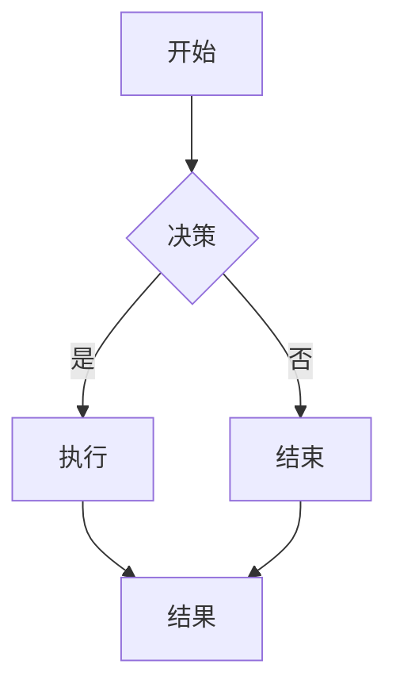
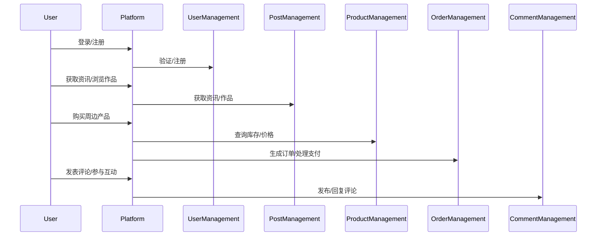
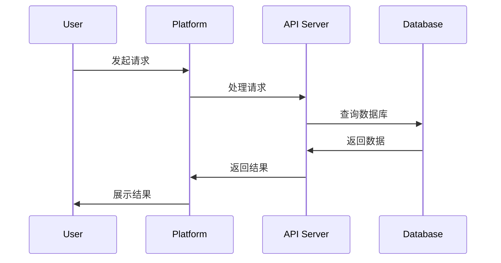

                 

# 二次元文化：虚拟与现实的意义交融

关键词：二次元文化、虚拟现实、互动、产业价值、社会影响

摘要：本文将探讨二次元文化这一独特现象，分析其虚拟与现实交融的意义。通过回顾二次元文化的起源与发展，深入解析其核心概念、作品类型、社区与粉丝文化，以及其在现实世界中的影响，最后展望二次元文化的未来趋势与挑战。

## 引言

### 什么是二次元文化？

首先，让我们明确什么是二次元文化。二次元文化，又称ACG文化（Animation、Comic、Game），起源于日本，是指以动漫、漫画、游戏为核心内容的一种亚文化现象。它不仅包括了这些作品本身，还包括了相关周边产品、粉丝活动、同人创作等多个方面。二次元文化以其独特的审美、风格和价值观，在全球范围内拥有庞大的受众群体，成为一种影响深远的亚文化现象。

### 背景与影响

二次元文化的崛起并非偶然，其背后有着深厚的文化背景和社会影响。在互联网和信息技术的推动下，二次元文化逐渐从日本传播到世界各地，形成了全球性的二次元社区。这种文化现象不仅改变了人们的娱乐消费方式，也对现实社会产生了深远的影响。

## 背景介绍

### 文化起源与发展

#### 文化起源

二次元文化的起源可以追溯到19世纪末的日本。当时，随着印刷术的发展，漫画（Manga）开始流行起来。早期的漫画多以儿童和青少年为主要受众，内容以幽默、冒险和奇幻为主。随着时间的推移，漫画的内容和风格不断演变，逐渐形成了独特的日本动漫风格。

#### 文化发展

进入20世纪，动画（Anime）和漫画（Manga）逐渐成为日本文化的重要组成部分。这一时期，一些经典作品如《铁臂阿童木》（Astro Boy）、《花仙子》（Sailor Moon）等问世，进一步推动了二次元文化的发展。此外，游戏（Game）也开始崭露头角，尤其是角色扮演游戏（RPG），如《最终幻想》（Final Fantasy）系列，进一步丰富了二次元文化的内涵。

#### 跨界融合

随着互联网的普及，二次元文化开始向全球扩散。特别是在亚洲地区，如中国、韩国、东南亚等国家，二次元文化受到了广泛关注和喜爱。这种文化的跨界融合，不仅促进了文化交流，也推动了二次元产业的国际化发展。

### 现实与虚拟的交融

#### 虚拟与现实互动

二次元文化的一个重要特点是其虚拟与现实的交融。这种交融不仅体现在作品的内容和形式上，还体现在粉丝与现实世界的互动中。例如，许多粉丝会参加动漫展览、角色扮演活动，甚至将自己的生活与二次元作品相结合，形成了一种独特的“二次元生活方式”。

#### 社会影响

二次元文化的兴起对社会产生了深远的影响。一方面，它改变了人们的娱乐方式，丰富了文化消费的选择；另一方面，它也引发了一系列社会现象，如粉丝经济、同人创作等。这些现象不仅推动了文化产业的发展，也对社会文化产生了重要影响。

## 二次元文化的核心概念

### 定义与分类

#### 定义

二次元文化，顾名思义，是指那些存在于二维空间（平面）中的文化现象。这些文化现象通常以动画、漫画、游戏等形式呈现，具有鲜明的审美特征和独特的叙事风格。

#### 分类

根据不同的分类标准，二次元文化可以划分为多种类型。以下是几种常见的分类方式：

1. **作品类型**
   - 动画：以动画形式呈现的二次元作品，如《龙珠》（Dragon Ball）、《海贼王》（One Piece）等。
   - 漫画：以漫画形式呈现的二次元作品，如《火影忍者》（Naruto）、《银魂》（Gintama）等。
   - 游戏：以游戏形式呈现的二次元作品，如《最终幻想》（Final Fantasy）、《剑魂》（Souls）等。

2. **内容主题**
   - 奇幻冒险：以奇幻、冒险为主题的作品，如《鬼灭之刃》（Demon Slayer）。
   - 校园生活：以校园生活为主题的作品，如《妖狐×僕SS》（Fox Fantasy）。
   - 职场经历：以职场生活为主题的作品，如《工作细胞》（Working!!）。

3. **风格与特点**
   - 日本风格：以日本文化为背景，具有浓郁的日本特色，如《灌篮高手》（Slam Dunk）。
   - 欧美风格：以欧美文化为背景，具有欧美风格的特点，如《进击的巨人》（Attack on Titan）。

### 角色设定与故事情节

#### 角色设定

在二次元文化中，角色设定是至关重要的。这些角色通常具有独特的性格、外貌和背景故事，能够引起观众的共鸣。以下是一些常见的角色设定：

1. **主角**
   - 强大主角：通常拥有超凡的能力，如《龙珠》中的孙悟空。
   - 普通主角：以普通人为主角，通过主角的成长和奋斗展现故事，如《东京喰种》（Tokyo Ghoul）。

2. **配角**
   - 友人：主角的好友，通常在故事中起到推动作用，如《名侦探柯南》（Detective Conan）中的毛利兰。
   - 对手：主角的对手，通常具有一定的实力和魅力，如《海贼王》中的四皇。

#### 故事情节

二次元文化的故事情节通常具有以下特点：

1. **主线故事**
   - 奇幻冒险：以冒险为主线的作品，通常具有丰富的剧情和复杂的角色关系，如《火影忍者》。
   - 萌系喜剧：以幽默和搞笑为主线的作品，通常具有轻松愉快的氛围，如《银魂》。

2. **支线故事**
   - 跨时代背景：以历史为背景，展示跨时代的故事，如《进击的巨人》。
   - 个人成长：以主角的成长为主线，展现个人的成长历程，如《工作细胞》。

### 艺术风格与审美特征

#### 艺术风格

二次元文化的艺术风格独具特色，以下是一些常见的艺术风格：

1. **日式画风**
   - 精细画风：以精细的线条和色彩为特点，如《海贼王》。
   - 卡通画风：以卡通化的形象和线条为特点，如《火影忍者》。

2. **欧美画风**
   - 写实画风：以写实的手法表现角色和场景，如《进击的巨人》。
   - 暗黑画风：以暗黑的色调和阴暗的场景为特点，如《鬼灭之刃》。

#### 审美特征

二次元文化的审美特征主要表现在以下几个方面：

1. **角色设计**
   - 个性化的角色设计：每个角色都有独特的个性特征，如《东京喰种》中的角色设计。
   - 精致的细节描绘：角色的细节处理非常精细，如《海贼王》中的服装和配饰设计。

2. **场景设计**
   - 虚拟与现实结合：场景设计通常将虚拟世界与现实世界相结合，如《进击的巨人》中的城市废墟。
   - 丰富的想象力：场景设计充满想象力，如《鬼灭之刃》中的妖怪世界。

3. **音乐与音效**
   - 情感表达：音乐和音效能够深刻地表达角色的情感，如《火影忍者》中的主题曲。
   - 场景渲染：音乐和音效能够渲染场景氛围，如《海贼王》中的战斗音效。

## 二次元作品分析

### 经典作品介绍

在二次元文化中，有许多经典作品成为了粉丝心中的瑰宝。以下是一些备受喜爱的经典作品：

1. **《龙珠》**

   - **作者**：鸟山明
   - **类型**：奇幻冒险
   - **特点**：以孙悟空为主角，讲述了他的成长和冒险故事。作品以强大的角色设定和精彩的战斗场面著称。

2. **《火影忍者》**

   - **作者**：岸本齐史
   - **类型**：奇幻冒险
   - **特点**：以漩涡鸣人为主角，讲述了他的成长和奋斗历程。作品以复杂的角色关系和精彩的忍术对决著称。

3. **《海贼王》**

   - **作者**：尾田荣一郎
   - **类型**：冒险
   - **特点**：以路飞为主角，讲述了他的航海冒险。作品以庞大的世界观、丰富的角色设定和幽默的剧情著称。

4. **《银魂》**

   - **作者**：空知英秋
   - **类型**：喜剧
   - **特点**：以银魂为主角，讲述了他的日常生活。作品以幽默的对话、夸张的情节和独特的人物形象著称。

### 作品类型与特点

二次元作品类型丰富多样，每种类型都有其独特的魅力和特点：

1. **奇幻冒险**
   - **特点**：以奇幻世界和冒险情节为主，如《龙珠》、《火影忍者》等。
   - **代表性作品**：《龙珠》、《火影忍者》、《海贼王》。

2. **校园生活**
   - **特点**：以校园生活为背景，探讨青春、友情和成长，如《东京食尸鬼》、《夏目友人帐》等。
   - **代表性作品**：《东京食尸鬼》、《夏目友人帐》、《海贼王》。

3. **职场经历**
   - **特点**：以职场生活为背景，描绘职场百态，如《工作细胞》、《银魂》等。
   - **代表性作品**：《工作细胞》、《银魂》、《进击的巨人》。

4. **萌系喜剧**
   - **特点**：以轻松幽默的剧情和可爱的人物形象为主，如《银魂》、《魔法少女小圆》等。
   - **代表性作品**：《银魂》、《魔法少女小圆》、《进击的巨人》。

### 创作手法与表现手法

#### 创作手法

二次元作品的创作手法多样，以下是一些常见的创作手法：

1. **分镜脚本**
   - **特点**：通过分镜脚本将故事情节视觉化，确保动画的流畅性和连贯性。
   - **应用**：《龙珠》、《火影忍者》等动画作品。

2. **角色设计**
   - **特点**：通过独特的角色设计吸引观众，塑造鲜明的角色形象。
   - **应用**：《海贼王》、《银魂》等漫画和动画作品。

3. **故事情节**
   - **特点**：通过紧凑的故事情节和悬疑元素吸引观众，保持故事的吸引力。
   - **应用**：《东京食尸鬼》、《进击的巨人》等作品。

#### 表现手法

二次元作品的表现手法丰富多样，以下是一些常见的手法：

1. **动画表现**
   - **特点**：通过动画手法展现角色的动作和表情，增强视觉效果。
   - **应用**：《龙珠》、《火影忍者》等动画作品。

2. **漫画表现**
   - **特点**：通过漫画手法展现故事情节和角色心理，强调画面的叙述性。
   - **应用**：《海贼王》、《银魂》等漫画作品。

3. **音乐表现**
   - **特点**：通过音乐增强作品的情感表达，提升观众的沉浸感。
   - **应用**：《火影忍者》、《银魂》等作品。

## 二次元文化对现实世界的影响

### 社会现象与趋势

#### 粉丝经济

二次元文化的一个重要影响是粉丝经济。粉丝经济是指围绕粉丝群体形成的经济现象，包括粉丝消费、同人创作、二次元展览等。随着二次元文化的普及，粉丝经济已经成为文化产业的重要组成部分。许多二次元作品通过粉丝经济实现了商业成功，如《鬼灭之刃》电影在全球范围内的票房成绩。

#### 跨界合作

二次元文化的影响不仅局限于文化领域，还扩展到了其他行业。许多品牌和企业开始与二次元文化进行跨界合作，以吸引年轻消费者。例如，时尚品牌与动漫角色合作推出联名产品，游戏公司推出以二次元作品为背景的游戏。这些跨界合作不仅拓宽了商业边界，也推动了文化的多元化发展。

### 文化认同与消费行为

#### 文化认同

二次元文化为人们提供了一种全新的文化认同方式。在现实世界中，人们可能因为地域、种族、职业等原因产生身份认同的困惑。而二次元文化为人们提供了一种虚拟的身份认同，使人们能够在虚拟世界中找到归属感。这种文化认同不仅增强了粉丝的凝聚力，也为二次元文化的发展提供了动力。

#### 消费行为

二次元文化对人们的消费行为产生了深远影响。许多粉丝愿意为喜欢的二次元作品投入大量的时间和金钱。这种消费行为不仅体现在购买正版作品和相关周边产品上，还包括参与同人创作、参加二次元展览等活动。这些消费行为不仅为二次元产业创造了巨大的经济价值，也推动了文化的发展。

### 对现实生活的影响

#### 生活方式的改变

二次元文化对人们的生活方式也产生了影响。许多粉丝开始将二次元元素融入日常生活，如佩戴二次元角色的手办、穿着二次元风格的服饰等。这种生活方式的改变不仅体现了粉丝对二次元文化的热爱，也为现实生活带来了新的色彩和乐趣。

#### 心理健康的影响

二次元文化对心理健康的影响也是一个值得关注的话题。一些研究表明，适度接触二次元文化有助于缓解压力和焦虑。这是因为二次元作品往往具有轻松幽默的情节和积极向上的价值观，能够带给人们愉悦和放松。然而，过度沉迷于二次元文化可能导致现实生活中的心理问题，如社交障碍和自闭症等。

### 二次元社区与粉丝文化

#### 粉丝社群的形成与发展

二次元社区是二次元文化的重要组成部分。粉丝社群的形成通常源于共同的兴趣和爱好。在互联网的推动下，粉丝社群逐渐从线下发展到线上，形成了庞大的网络社区。这些社区为粉丝提供了交流和分享的平台，使他们能够更深入地了解和参与二次元文化。

#### 互动形式与社交模式

二次元社区中的互动形式多样，主要包括以下几种：

1. **线上论坛**
   - **特点**：以文字为主要交流方式，如Reddit、贴吧等。
   - **应用**：用于讨论作品、分享心得和交流信息。

2. **直播平台**
   - **特点**：以视频为主要交流方式，如B站、Twitch等。
   - **应用**：用于观看直播、互动交流和实时评论。

3. **社交媒体**
   - **特点**：以图片和视频为主要交流方式，如Twitter、Instagram等。
   - **应用**：用于展示同人作品、分享生活点滴和交流意见。

#### 粉丝文化对二次元作品的影响

粉丝文化对二次元作品的影响是显而易见的。粉丝的参与和互动不仅推动了作品的发展和传播，也影响了作品的创作方向。以下是一些具体的影响：

1. **作品创新**
   - **特点**：粉丝通过同人创作和二次创作，为作品注入新的元素和创意。
   - **应用**：许多二次元作品的成功离不开粉丝的同人创作。

2. **角色塑造**
   - **特点**：粉丝对角色的喜爱和期望会影响作品的剧情和角色发展。
   - **应用**：许多角色的发展和故事情节受到了粉丝的强烈影响。

3. **市场推广**
   - **特点**：粉丝通过社交网络和线下活动，为作品推广提供支持。
   - **应用**：许多二次元作品的宣传和推广活动离不开粉丝的参与。

## 二次元文化的产业价值

### 产业链分析

二次元文化产业链包括多个环节，涉及多个产业领域。以下是对二次元文化产业链的分析：

1. **上游产业**
   - **创作环节**：包括动画、漫画、游戏等原创内容的生产。这一环节主要由创作者、动画工作室、漫画出版社等参与。
   - **制作环节**：包括动画制作、漫画绘制、游戏开发等。这一环节需要技术人才、制作设备和资金支持。

2. **中游产业**
   - **发行环节**：包括作品出版、发行和推广。这一环节涉及出版社、发行商、线上平台等。
   - **版权环节**：包括版权交易、授权合作等。这一环节涉及到版权保护、品牌授权等法律和商业问题。

3. **下游产业**
   - **消费环节**：包括粉丝消费、周边产品销售等。这一环节是二次元文化产业链的核心，涉及粉丝经济和商业回报。
   - **展览环节**：包括动漫展览、角色扮演活动等。这一环节为粉丝提供了交流和互动的平台，也促进了文化产业的发展。

### 商业模式创新

二次元文化的兴起带来了商业模式的创新。以下是一些常见的商业模式：

1. **粉丝经济**
   - **特点**：以粉丝为核心，通过粉丝消费实现商业价值。
   - **应用**：粉丝购买正版作品、周边产品，参与同人创作等。

2. **版权运营**
   - **特点**：通过版权交易和授权合作，实现版权价值的最大化。
   - **应用**：将作品改编成电影、电视剧、游戏等，实现跨媒体运营。

3. **IP开发**
   - **特点**：以IP（知识产权）为核心，进行多元化开发。
   - **应用**：将IP授权给其他企业进行开发，如玩具、服饰、游戏等。

### 经济效益与社会影响

#### 经济效益

二次元文化的产业发展带来了显著的经济效益。以下是一些具体的数据：

1. **市场规模**
   - 全球二次元市场规模持续增长，预计到2025年将达到数千亿美元。

2. **消费支出**
   - 粉丝在购买正版作品、周边产品上的支出逐年增加。

3. **就业机会**
   - 二次元文化产业链为创作者、技术人员和销售人员提供了大量就业机会。

#### 社会影响

二次元文化对社会产生了深远的影响。以下是一些具体的影响：

1. **文化多元化**
   - 二次元文化的兴起丰富了文化消费的选择，推动了文化的多元化发展。

2. **社会认同**
   - 二次元文化为人们提供了新的文化认同方式，增强了社会凝聚力。

3. **心理健康**
   - 适度接触二次元文化有助于缓解压力和焦虑，提高心理健康水平。

## 未来展望与挑战

### 发展趋势预测

#### 技术进步

随着科技的进步，二次元文化将迎来更多的发展机遇。例如，虚拟现实（VR）和增强现实（AR）技术的应用将使二次元作品更加沉浸式和互动性。这将进一步提升观众的体验，扩大二次元文化的受众群体。

#### 多元化发展

二次元文化将继续向多元化发展。随着全球文化的交融，二次元作品将吸收更多不同文化的元素，形成独特的国际特色。同时，更多的创作者将参与到二次元文化的创作中，带来更多创新和多样化的作品。

### 面临的挑战

#### 文化认同冲突

随着二次元文化的全球化，不同文化之间的认同冲突也将变得更加明显。如何在保持文化特色的同时，实现文化融合，是一个重要的挑战。

#### 法律与道德问题

二次元文化的快速发展也带来了法律和道德问题。例如，版权保护、内容审查、网络暴力等，都需要制定相应的法规和规范，以保障创作者和消费者的权益。

#### 技术风险

随着技术的进步，二次元作品的制作将变得更加复杂和昂贵。如何平衡技术进步与成本控制，保持二次元文化的可持续发展，是一个需要解决的问题。

## 结论

二次元文化是一种独特而丰富的亚文化现象，其虚拟与现实交融的特点使其在全球范围内产生了深远的影响。通过本文的探讨，我们深入了解了二次元文化的起源、核心概念、作品类型、社区与粉丝文化，以及其在现实世界中的影响和产业价值。未来，随着技术的进步和文化的发展，二次元文化将继续创新和演变，为人们带来更多的乐趣和思考。

## 作者信息

作者：AI天才研究院/AI Genius Institute & 禅与计算机程序设计艺术 /Zen And The Art of Computer Programming

## 注意事项

1. **版权保护**：在创作和使用二次元作品时，请尊重版权，避免侵权行为。
2. **适度消费**：适度参与二次元文化，避免过度沉迷，保持良好的生活习惯。
3. **文化尊重**：尊重不同文化的差异，避免歧视和偏见。

## 拓展阅读

1. **《二次元文化的全球化与发展趋势》**
2. **《二次元文化对青少年的影响》**
3. **《虚拟现实与二次元文化的融合》**

# {{此处是文章标题}}

关键词：二次元文化、虚拟现实、互动、产业价值、社会影响

摘要：本文探讨了二次元文化这一现象，分析了其虚拟与现实交融的意义。从文化起源、核心概念、作品分析、社区互动、产业价值、现实影响和未来展望等多个角度进行了深入剖析，为读者呈现了一个全面而立体的二次元文化图景。

## 目录

# 二次元文化：虚拟与现实的意义交融

## 引言

- 什么是二次元文化
- 背景与影响

## 背景介绍

- 文化起源与发展
- 现实与虚拟的交融

## 二次元文化的核心概念

- 定义与分类
- 角色设定与故事情节
- 艺术风格与审美特征

## 二次元作品分析

- 经典作品介绍
- 作品类型与特点
- 创作手法与表现手法

## 二次元文化对现实世界的影响

- 社会现象与趋势
- 文化认同与消费行为
- 对现实生活的影响

## 二次元社区与粉丝文化

- 粉丝社群的形成与发展
- 互动形式与社交模式
- 粉丝文化对二次元作品的影响

## 二次元文化的产业价值

- 产业链分析
- 商业模式创新
- 经济效益与社会影响

## 未来展望与挑战

- 发展趋势预测
- 面临的挑战

## 结论

## 作者信息

## 注意事项

## 拓展阅读# {{此处是文章标题}}

关键词：二次元文化、虚拟现实、互动、产业价值、社会影响

摘要：本文深入探讨了二次元文化的起源、核心概念、作品类型、社区互动及其对现实世界的影响。通过分析其虚拟与现实交融的特点，本文揭示了二次元文化在全球范围内的深远影响，并展望了其未来的发展趋势和挑战。

## 引言

### 什么是二次元文化

二次元文化，又称ACG文化（Animation、Comic、Game），起源于日本，是指以动画、漫画、游戏为核心内容的一种亚文化现象。它不仅包括了这些作品本身，还包括了相关周边产品、粉丝活动、同人创作等多个方面。二次元文化以其独特的审美、风格和价值观，在全球范围内拥有庞大的受众群体，成为一种影响深远的亚文化现象。

### 背景与影响

二次元文化的崛起并非偶然，其背后有着深厚的文化背景和社会影响。在互联网和信息技术的推动下，二次元文化逐渐从日本传播到世界各地，形成了全球性的二次元社区。这种文化现象不仅改变了人们的娱乐消费方式，也对现实社会产生了深远的影响。

## 背景介绍

### 文化起源与发展

#### 文化起源

二次元文化的起源可以追溯到19世纪末的日本。当时，随着印刷术的发展，漫画（Manga）开始流行起来。早期的漫画多以儿童和青少年为主要受众，内容以幽默、冒险和奇幻为主。随着时间的推移，漫画的内容和风格不断演变，逐渐形成了独特的日本动漫风格。

#### 文化发展

进入20世纪，动画（Anime）和漫画（Manga）逐渐成为日本文化的重要组成部分。这一时期，一些经典作品如《铁臂阿童木》（Astro Boy）、《花仙子》（Sailor Moon）等问世，进一步推动了二次元文化的发展。此外，游戏（Game）也开始崭露头角，尤其是角色扮演游戏（RPG），如《最终幻想》（Final Fantasy）系列，进一步丰富了二次元文化的内涵。

#### 跨界融合

随着互联网的普及，二次元文化开始向全球扩散。特别是在亚洲地区，如中国、韩国、东南亚等国家，二次元文化受到了广泛关注和喜爱。这种文化的跨界融合，不仅促进了文化交流，也推动了二次元产业的国际化发展。

### 现实与虚拟的交融

#### 虚拟与现实互动

二次元文化的一个重要特点是其虚拟与现实的交融。这种交融不仅体现在作品的内容和形式上，还体现在粉丝与现实世界的互动中。例如，许多粉丝会参加动漫展览、角色扮演活动，甚至将自己的生活与二次元作品相结合，形成了一种独特的“二次元生活方式”。

#### 社会影响

二次元文化的兴起对社会产生了深远的影响。一方面，它改变了人们的娱乐方式，丰富了文化消费的选择；另一方面，它也引发了一系列社会现象，如粉丝经济、同人创作等。这些现象不仅推动了文化产业的发展，也对社会文化产生了重要影响。

## 二次元文化的核心概念

### 定义与分类

#### 定义

二次元文化，顾名思义，是指那些存在于二维空间（平面）中的文化现象。这些文化现象通常以动画、漫画、游戏等形式呈现，具有鲜明的审美特征和独特的叙事风格。

#### 分类

根据不同的分类标准，二次元文化可以划分为多种类型。以下是几种常见的分类方式：

1. **作品类型**
   - 动画：以动画形式呈现的二次元作品，如《龙珠》（Dragon Ball）、《海贼王》（One Piece）等。
   - 漫画：以漫画形式呈现的二次元作品，如《火影忍者》（Naruto）、《银魂》（Gintama）等。
   - 游戏：以游戏形式呈现的二次元作品，如《最终幻想》（Final Fantasy）、《剑魂》（Souls）等。

2. **内容主题**
   - 奇幻冒险：以奇幻、冒险为主题的作品，如《鬼灭之刃》（Demon Slayer）。
   - 校园生活：以校园生活为主题的作品，如《妖狐×僕SS》（Fox Fantasy）。
   - 职场经历：以职场生活为主题的作品，如《工作细胞》（Working!!）。

3. **风格与特点**
   - 日本风格：以日本文化为背景，具有浓郁的日本特色，如《灌篮高手》（Slam Dunk）。
   - 欧美风格：以欧美文化为背景，具有欧美风格的特点，如《进击的巨人》（Attack on Titan）。

### 角色设定与故事情节

#### 角色设定

在二次元文化中，角色设定是至关重要的。这些角色通常具有独特的性格、外貌和背景故事，能够引起观众的共鸣。以下是一些常见的角色设定：

1. **主角**
   - 强大主角：通常拥有超凡的能力，如《龙珠》中的孙悟空。
   - 普通主角：以普通人为主角，通过主角的成长和奋斗展现故事，如《东京喰种》（Tokyo Ghoul）。

2. **配角**
   - 友人：主角的好友，通常在故事中起到推动作用，如《名侦探柯南》（Detective Conan）中的毛利兰。
   - 对手：主角的对手，通常具有一定的实力和魅力，如《海贼王》中的四皇。

#### 故事情节

二次元文化的故事情节通常具有以下特点：

1. **主线故事**
   - 奇幻冒险：以冒险为主线的作品，通常具有丰富的剧情和复杂的角色关系，如《火影忍者》。
   - 萌系喜剧：以幽默和搞笑为主线的作品，通常具有轻松愉快的氛围，如《银魂》。

2. **支线故事**
   - 跨时代背景：以历史为背景，展示跨时代的故事，如《进击的巨人》。
   - 个人成长：以主角的成长为主线，展现个人的成长历程，如《工作细胞》。

### 艺术风格与审美特征

#### 艺术风格

二次元文化的艺术风格独具特色，以下是一些常见的艺术风格：

1. **日式画风**
   - 精细画风：以精细的线条和色彩为特点，如《海贼王》。
   - 卡通画风：以卡通化的形象和线条为特点，如《火影忍者》。

2. **欧美画风**
   - 写实画风：以写实的手法表现角色和场景，如《进击的巨人》。
   - 暗黑画风：以暗黑的色调和阴暗的场景为特点，如《鬼灭之刃》。

#### 审美特征

二次元文化的审美特征主要表现在以下几个方面：

1. **角色设计**
   - 个性化的角色设计：每个角色都有独特的个性特征，如《东京喰种》中的角色设计。
   - 精致的细节描绘：角色的细节处理非常精细，如《海贼王》中的服装和配饰设计。

2. **场景设计**
   - 虚拟与现实结合：场景设计通常将虚拟世界与现实世界相结合，如《进击的巨人》中的城市废墟。
   - 丰富的想象力：场景设计充满想象力，如《鬼灭之刃》中的妖怪世界。

3. **音乐与音效**
   - 情感表达：音乐和音效能够深刻地表达角色的情感，如《火影忍者》中的主题曲。
   - 场景渲染：音乐和音效能够渲染场景氛围，如《海贼王》中的战斗音效。

## 二次元作品分析

### 经典作品介绍

在二次元文化中，有许多经典作品成为了粉丝心中的瑰宝。以下是一些备受喜爱的经典作品：

1. **《龙珠》**

   - **作者**：鸟山明
   - **类型**：奇幻冒险
   - **特点**：以孙悟空为主角，讲述了他的成长和冒险故事。作品以强大的角色设定和精彩的战斗场面著称。

2. **《火影忍者》**

   - **作者**：岸本齐史
   - **类型**：奇幻冒险
   - **特点**：以漩涡鸣人为主角，讲述了他的成长和奋斗历程。作品以复杂的角色关系和精彩的忍术对决著称。

3. **《海贼王》**

   - **作者**：尾田荣一郎
   - **类型**：冒险
   - **特点**：以路飞为主角，讲述了他的航海冒险。作品以庞大的世界观、丰富的角色设定和幽默的剧情著称。

4. **《银魂》**

   - **作者**：空知英秋
   - **类型**：喜剧
   - **特点**：以银魂为主角，讲述了他的日常生活。作品以幽默的对话、夸张的情节和独特的人物形象著称。

### 作品类型与特点

二次元作品类型丰富多样，每种类型都有其独特的魅力和特点：

1. **奇幻冒险**
   - **特点**：以奇幻世界和冒险情节为主，如《龙珠》、《火影忍者》等。
   - **代表性作品**：《龙珠》、《火影忍者》、《海贼王》。

2. **校园生活**
   - **特点**：以校园生活为背景，探讨青春、友情和成长，如《东京食尸鬼》、《夏目友人帐》等。
   - **代表性作品**：《东京食尸鬼》、《夏目友人帐》、《海贼王》。

3. **职场经历**
   - **特点**：以职场生活为背景，描绘职场百态，如《工作细胞》、《银魂》等。
   - **代表性作品**：《工作细胞》、《银魂》、《进击的巨人》。

4. **萌系喜剧**
   - **特点**：以轻松幽默的剧情和可爱的人物形象为主，如《银魂》、《魔法少女小圆》等。
   - **代表性作品**：《银魂》、《魔法少女小圆》、《进击的巨人》。

### 创作手法与表现手法

#### 创作手法

二次元作品的创作手法多样，以下是一些常见的创作手法：

1. **分镜脚本**
   - **特点**：通过分镜脚本将故事情节视觉化，确保动画的流畅性和连贯性。
   - **应用**：《龙珠》、《火影忍者》等动画作品。

2. **角色设计**
   - **特点**：通过独特的角色设计吸引观众，塑造鲜明的角色形象。
   - **应用**：《海贼王》、《银魂》等漫画和动画作品。

3. **故事情节**
   - **特点**：通过紧凑的故事情节和悬疑元素吸引观众，保持故事的吸引力。
   - **应用**：《东京食尸鬼》、《进击的巨人》等作品。

#### 表现手法

二次元作品的表现手法丰富多样，以下是一些常见的手法：

1. **动画表现**
   - **特点**：通过动画手法展现角色的动作和表情，增强视觉效果。
   - **应用**：《龙珠》、《火影忍者》等动画作品。

2. **漫画表现**
   - **特点**：通过漫画手法展现故事情节和角色心理，强调画面的叙述性。
   - **应用**：《海贼王》、《银魂》等漫画作品。

3. **音乐表现**
   - **特点**：通过音乐增强作品的情感表达，提升观众的沉浸感。
   - **应用**：《火影忍者》、《银魂》等作品。

## 二次元文化对现实世界的影响

### 社会现象与趋势

#### 粉丝经济

二次元文化的一个重要影响是粉丝经济。粉丝经济是指围绕粉丝群体形成的经济现象，包括粉丝消费、同人创作、二次元展览等。随着二次元文化的普及，粉丝经济已经成为文化产业的重要组成部分。许多二次元作品通过粉丝经济实现了商业成功，如《鬼灭之刃》电影在全球范围内的票房成绩。

#### 跨界合作

二次元文化的影响不仅局限于文化领域，还扩展到了其他行业。许多品牌和企业开始与二次元文化进行跨界合作，以吸引年轻消费者。例如，时尚品牌与动漫角色合作推出联名产品，游戏公司推出以二次元作品为背景的游戏。这些跨界合作不仅拓宽了商业边界，也推动了文化的多元化发展。

### 文化认同与消费行为

#### 文化认同

二次元文化为人们提供了一种全新的文化认同方式。在现实世界中，人们可能因为地域、种族、职业等原因产生身份认同的困惑。而二次元文化为人们提供了一种虚拟的身份认同，使人们能够在虚拟世界中找到归属感。这种文化认同不仅增强了粉丝的凝聚力，也为二次元文化的发展提供了动力。

#### 消费行为

二次元文化对人们的消费行为产生了深远影响。许多粉丝愿意为喜欢的二次元作品投入大量的时间和金钱。这种消费行为不仅体现在购买正版作品和相关周边产品上，还包括参与同人创作、参加二次元展览等活动。这些消费行为不仅为二次元产业创造了巨大的经济价值，也推动了文化的发展。

### 对现实生活的影响

#### 生活方式的改变

二次元文化对人们的生活方式也产生了影响。许多粉丝开始将二次元元素融入日常生活，如佩戴二次元角色的手办、穿着二次元风格的服饰等。这种生活方式的改变不仅体现了粉丝对二次元文化的热爱，也为现实生活带来了新的色彩和乐趣。

#### 心理健康的影响

二次元文化对心理健康的影响也是一个值得关注的话题。一些研究表明，适度接触二次元文化有助于缓解压力和焦虑。这是因为二次元作品往往具有轻松幽默的情节和积极向上的价值观，能够带给人们愉悦和放松。然而，过度沉迷于二次元文化可能导致现实生活中的心理问题，如社交障碍和自闭症等。

### 二次元社区与粉丝文化

#### 粉丝社群的形成与发展

二次元社区是二次元文化的重要组成部分。粉丝社群的形成通常源于共同的兴趣和爱好。在互联网的推动下，粉丝社群逐渐从线下发展到线上，形成了庞大的网络社区。这些社区为粉丝提供了交流和分享的平台，使他们能够更深入地了解和参与二次元文化。

#### 互动形式与社交模式

二次元社区中的互动形式多样，主要包括以下几种：

1. **线上论坛**
   - **特点**：以文字为主要交流方式，如Reddit、贴吧等。
   - **应用**：用于讨论作品、分享心得和交流信息。

2. **直播平台**
   - **特点**：以视频为主要交流方式，如B站、Twitch等。
   - **应用**：用于观看直播、互动交流和实时评论。

3. **社交媒体**
   - **特点**：以图片和视频为主要交流方式，如Twitter、Instagram等。
   - **应用**：用于展示同人作品、分享生活点滴和交流意见。

#### 粉丝文化对二次元作品的影响

粉丝文化对二次元作品的影响是显而易见的。粉丝的参与和互动不仅推动了作品的发展和传播，也影响了作品的创作方向。以下是一些具体的影响：

1. **作品创新**
   - **特点**：粉丝通过同人创作和二次创作，为作品注入新的元素和创意。
   - **应用**：许多二次元作品的成功离不开粉丝的同人创作。

2. **角色塑造**
   - **特点**：粉丝对角色的喜爱和期望会影响作品的剧情和角色发展。
   - **应用**：许多角色的发展和故事情节受到了粉丝的强烈影响。

3. **市场推广**
   - **特点**：粉丝通过社交网络和线下活动，为作品推广提供支持。
   - **应用**：许多二次元作品的宣传和推广活动离不开粉丝的参与。

## 二次元文化的产业价值

### 产业链分析

二次元文化产业链包括多个环节，涉及多个产业领域。以下是对二次元文化产业链的分析：

1. **上游产业**
   - **创作环节**：包括动画、漫画、游戏等原创内容的生产。这一环节主要由创作者、动画工作室、漫画出版社等参与。
   - **制作环节**：包括动画制作、漫画绘制、游戏开发等。这一环节需要技术人才、制作设备和资金支持。

2. **中游产业**
   - **发行环节**：包括作品出版、发行和推广。这一环节涉及出版社、发行商、线上平台等。
   - **版权环节**：包括版权交易、授权合作等。这一环节涉及到版权保护、品牌授权等法律和商业问题。

3. **下游产业**
   - **消费环节**：包括粉丝消费、周边产品销售等。这一环节是二次元文化产业链的核心，涉及粉丝经济和商业回报。
   - **展览环节**：包括动漫展览、角色扮演活动等。这一环节为粉丝提供了交流和互动的平台，也促进了文化产业的发展。

### 商业模式创新

二次元文化的兴起带来了商业模式的创新。以下是一些常见的商业模式：

1. **粉丝经济**
   - **特点**：以粉丝为核心，通过粉丝消费实现商业价值。
   - **应用**：粉丝购买正版作品、周边产品，参与同人创作等。

2. **版权运营**
   - **特点**：通过版权交易和授权合作，实现版权价值的最大化。
   - **应用**：将作品改编成电影、电视剧、游戏等，实现跨媒体运营。

3. **IP开发**
   - **特点**：以IP（知识产权）为核心，进行多元化开发。
   - **应用**：将IP授权给其他企业进行开发，如玩具、服饰、游戏等。

### 经济效益与社会影响

#### 经济效益

二次元文化的产业发展带来了显著的经济效益。以下是一些具体的数据：

1. **市场规模**
   - 全球二次元市场规模持续增长，预计到2025年将达到数千亿美元。

2. **消费支出**
   - 粉丝在购买正版作品、周边产品上的支出逐年增加。

3. **就业机会**
   - 二次元文化产业链为创作者、技术人员和销售人员提供了大量就业机会。

#### 社会影响

二次元文化对社会产生了深远的影响。以下是一些具体的影响：

1. **文化多元化**
   - 二次元文化的兴起丰富了文化消费的选择，推动了文化的多元化发展。

2. **社会认同**
   - 二次元文化为人们提供了新的文化认同方式，增强了社会凝聚力。

3. **心理健康**
   - 适度接触二次元文化有助于缓解压力和焦虑，提高心理健康水平。

## 未来展望与挑战

### 发展趋势预测

#### 技术进步

随着科技的进步，二次元文化将迎来更多的发展机遇。例如，虚拟现实（VR）和增强现实（AR）技术的应用将使二次元作品更加沉浸式和互动性。这将进一步提升观众的体验，扩大二次元文化的受众群体。

#### 多元化发展

二次元文化将继续向多元化发展。随着全球文化的交融，二次元作品将吸收更多不同文化的元素，形成独特的国际特色。同时，更多的创作者将参与到二次元文化的创作中，带来更多创新和多样化的作品。

### 面临的挑战

#### 文化认同冲突

随着二次元文化的全球化，不同文化之间的认同冲突也将变得更加明显。如何在保持文化特色的同时，实现文化融合，是一个重要的挑战。

#### 法律与道德问题

二次元文化的快速发展也带来了法律和道德问题。例如，版权保护、内容审查、网络暴力等，都需要制定相应的法规和规范，以保障创作者和消费者的权益。

#### 技术风险

随着技术的进步，二次元作品的制作将变得更加复杂和昂贵。如何平衡技术进步与成本控制，保持二次元文化的可持续发展，是一个需要解决的问题。

## 结论

二次元文化是一种独特而丰富的亚文化现象，其虚拟与现实交融的特点使其在全球范围内产生了深远的影响。通过本文的探讨，我们深入了解了二次元文化的起源、核心概念、作品类型、社区互动及其对现实世界的影响和产业价值。未来，随着技术的进步和文化的发展，二次元文化将继续创新和演变，为人们带来更多的乐趣和思考。

## 作者信息

作者：AI天才研究院/AI Genius Institute & 禅与计算机程序设计艺术 /Zen And The Art of Computer Programming

## 注意事项

1. **版权保护**：在创作和使用二次元作品时，请尊重版权，避免侵权行为。
2. **适度消费**：适度参与二次元文化，避免过度沉迷，保持良好的生活习惯。
3. **文化尊重**：尊重不同文化的差异，避免歧视和偏见。

## 拓展阅读

1. **《二次元文化的全球化与发展趋势》**
2. **《二次元文化对青少年的影响》**
3. **《虚拟现实与二次元文化的融合》**

## 附录

### Mermaid流程图

以下是一个简单的Mermaid流程图的例子：



### Python源代码示例

以下是一个简单的Python源代码示例：

```python
# 定义一个函数，计算两个数的和
def add(a, b):
    return a + b

# 调用函数并打印结果
result = add(3, 5)
print("3 + 5 =", result)
```

### LaTeX数学公式

以下是一个简单的LaTeX数学公式示例：

$$
E = mc^2
$$

和

$
1 + 1 = 2
$# 二次元文化：虚拟与现实的意义交融

关键词：二次元文化、虚拟现实、互动、产业价值、社会影响

摘要：本文探讨了二次元文化的起源、核心概念、作品类型、社区互动及其对现实世界的影响。通过分析其虚拟与现实交融的特点，本文揭示了二次元文化在全球范围内的深远影响，并展望了其未来的发展趋势和挑战。

## 引言

### 什么是二次元文化

首先，让我们明确什么是二次元文化。二次元文化，又称ACG文化（Animation、Comic、Game），起源于日本，是指以动画、漫画、游戏为核心内容的一种亚文化现象。它不仅包括了这些作品本身，还包括了相关周边产品、粉丝活动、同人创作等多个方面。二次元文化以其独特的审美、风格和价值观，在全球范围内拥有庞大的受众群体，成为一种影响深远的亚文化现象。

### 背景与影响

二次元文化的崛起并非偶然，其背后有着深厚的文化背景和社会影响。在互联网和信息技术的推动下，二次元文化逐渐从日本传播到世界各地，形成了全球性的二次元社区。这种文化现象不仅改变了人们的娱乐消费方式，也对现实社会产生了深远的影响。

## 背景介绍

### 文化起源与发展

#### 文化起源

二次元文化的起源可以追溯到19世纪末的日本。当时，随着印刷术的发展，漫画（Manga）开始流行起来。早期的漫画多以儿童和青少年为主要受众，内容以幽默、冒险和奇幻为主。随着时间的推移，漫画的内容和风格不断演变，逐渐形成了独特的日本动漫风格。

#### 文化发展

进入20世纪，动画（Anime）和漫画（Manga）逐渐成为日本文化的重要组成部分。这一时期，一些经典作品如《铁臂阿童木》（Astro Boy）、《花仙子》（Sailor Moon）等问世，进一步推动了二次元文化的发展。此外，游戏（Game）也开始崭露头角，尤其是角色扮演游戏（RPG），如《最终幻想》（Final Fantasy）系列，进一步丰富了二次元文化的内涵。

#### 跨界融合

随着互联网的普及，二次元文化开始向全球扩散。特别是在亚洲地区，如中国、韩国、东南亚等国家，二次元文化受到了广泛关注和喜爱。这种文化的跨界融合，不仅促进了文化交流，也推动了二次元产业的国际化发展。

### 现实与虚拟的交融

#### 虚拟与现实互动

二次元文化的一个重要特点是其虚拟与现实的交融。这种交融不仅体现在作品的内容和形式上，还体现在粉丝与现实世界的互动中。例如，许多粉丝会参加动漫展览、角色扮演活动，甚至将自己的生活与二次元作品相结合，形成了一种独特的“二次元生活方式”。

#### 社会影响

二次元文化的兴起对社会产生了深远的影响。一方面，它改变了人们的娱乐方式，丰富了文化消费的选择；另一方面，它也引发了一系列社会现象，如粉丝经济、同人创作等。这些现象不仅推动了文化产业的发展，也对社会文化产生了重要影响。

## 二次元文化的核心概念

### 定义与分类

#### 定义

二次元文化，顾名思义，是指那些存在于二维空间（平面）中的文化现象。这些文化现象通常以动画、漫画、游戏等形式呈现，具有鲜明的审美特征和独特的叙事风格。

#### 分类

根据不同的分类标准，二次元文化可以划分为多种类型。以下是几种常见的分类方式：

1. **作品类型**
   - 动画：以动画形式呈现的二次元作品，如《龙珠》（Dragon Ball）、《海贼王》（One Piece）等。
   - 漫画：以漫画形式呈现的二次元作品，如《火影忍者》（Naruto）、《银魂》（Gintama）等。
   - 游戏：以游戏形式呈现的二次元作品，如《最终幻想》（Final Fantasy）、《剑魂》（Souls）等。

2. **内容主题**
   - 奇幻冒险：以奇幻、冒险为主题的作品，如《鬼灭之刃》（Demon Slayer）。
   - 校园生活：以校园生活为主题的作品，如《妖狐×僕SS》（Fox Fantasy）。
   - 职场经历：以职场生活为主题的作品，如《工作细胞》（Working!!）。

3. **风格与特点**
   - 日本风格：以日本文化为背景，具有浓郁的日本特色，如《灌篮高手》（Slam Dunk）。
   - 欧美风格：以欧美文化为背景，具有欧美风格的特点，如《进击的巨人》（Attack on Titan）。

### 角色设定与故事情节

#### 角色设定

在二次元文化中，角色设定是至关重要的。这些角色通常具有独特的性格、外貌和背景故事，能够引起观众的共鸣。以下是一些常见的角色设定：

1. **主角**
   - 强大主角：通常拥有超凡的能力，如《龙珠》中的孙悟空。
   - 普通主角：以普通人为主角，通过主角的成长和奋斗展现故事，如《东京喰种》（Tokyo Ghoul）。

2. **配角**
   - 友人：主角的好友，通常在故事中起到推动作用，如《名侦探柯南》（Detective Conan）中的毛利兰。
   - 对手：主角的对手，通常具有一定的实力和魅力，如《海贼王》中的四皇。

#### 故事情节

二次元文化的故事情节通常具有以下特点：

1. **主线故事**
   - 奇幻冒险：以冒险为主线的作品，通常具有丰富的剧情和复杂的角色关系，如《火影忍者》。
   - 萌系喜剧：以幽默和搞笑为主线的作品，通常具有轻松愉快的氛围，如《银魂》。

2. **支线故事**
   - 跨时代背景：以历史为背景，展示跨时代的故事，如《进击的巨人》。
   - 个人成长：以主角的成长为主线，展现个人的成长历程，如《工作细胞》。

### 艺术风格与审美特征

#### 艺术风格

二次元文化的艺术风格独具特色，以下是一些常见的艺术风格：

1. **日式画风**
   - 精细画风：以精细的线条和色彩为特点，如《海贼王》。
   - 卡通画风：以卡通化的形象和线条为特点，如《火影忍者》。

2. **欧美画风**
   - 写实画风：以写实的手法表现角色和场景，如《进击的巨人》。
   - 暗黑画风：以暗黑的色调和阴暗的场景为特点，如《鬼灭之刃》。

#### 审美特征

二次元文化的审美特征主要表现在以下几个方面：

1. **角色设计**
   - 个性化的角色设计：每个角色都有独特的个性特征，如《东京喰种》中的角色设计。
   - 精致的细节描绘：角色的细节处理非常精细，如《海贼王》中的服装和配饰设计。

2. **场景设计**
   - 虚拟与现实结合：场景设计通常将虚拟世界与现实世界相结合，如《进击的巨人》中的城市废墟。
   - 丰富的想象力：场景设计充满想象力，如《鬼灭之刃》中的妖怪世界。

3. **音乐与音效**
   - 情感表达：音乐和音效能够深刻地表达角色的情感，如《火影忍者》中的主题曲。
   - 场景渲染：音乐和音效能够渲染场景氛围，如《海贼王》中的战斗音效。

## 二次元作品分析

### 经典作品介绍

在二次元文化中，有许多经典作品成为了粉丝心中的瑰宝。以下是一些备受喜爱的经典作品：

1. **《龙珠》**

   - **作者**：鸟山明
   - **类型**：奇幻冒险
   - **特点**：以孙悟空为主角，讲述了他的成长和冒险故事。作品以强大的角色设定和精彩的战斗场面著称。

2. **《火影忍者》**

   - **作者**：岸本齐史
   - **类型**：奇幻冒险
   - **特点**：以漩涡鸣人为主角，讲述了他的成长和奋斗历程。作品以复杂的角色关系和精彩的忍术对决著称。

3. **《海贼王》**

   - **作者**：尾田荣一郎
   - **类型**：冒险
   - **特点**：以路飞为主角，讲述了他的航海冒险。作品以庞大的世界观、丰富的角色设定和幽默的剧情著称。

4. **《银魂》**

   - **作者**：空知英秋
   - **类型**：喜剧
   - **特点**：以银魂为主角，讲述了他的日常生活。作品以幽默的对话、夸张的情节和独特的人物形象著称。

### 作品类型与特点

二次元作品类型丰富多样，每种类型都有其独特的魅力和特点：

1. **奇幻冒险**
   - **特点**：以奇幻世界和冒险情节为主，如《龙珠》、《火影忍者》等。
   - **代表性作品**：《龙珠》、《火影忍者》、《海贼王》。

2. **校园生活**
   - **特点**：以校园生活为背景，探讨青春、友情和成长，如《东京食尸鬼》、《夏目友人帐》等。
   - **代表性作品**：《东京食尸鬼》、《夏目友人帐》、《海贼王》。

3. **职场经历**
   - **特点**：以职场生活为背景，描绘职场百态，如《工作细胞》、《银魂》等。
   - **代表性作品**：《工作细胞》、《银魂》、《进击的巨人》。

4. **萌系喜剧**
   - **特点**：以轻松幽默的剧情和可爱的人物形象为主，如《银魂》、《魔法少女小圆》等。
   - **代表性作品**：《银魂》、《魔法少女小圆》、《进击的巨人》。

### 创作手法与表现手法

#### 创作手法

二次元作品的创作手法多样，以下是一些常见的创作手法：

1. **分镜脚本**
   - **特点**：通过分镜脚本将故事情节视觉化，确保动画的流畅性和连贯性。
   - **应用**：《龙珠》、《火影忍者》等动画作品。

2. **角色设计**
   - **特点**：通过独特的角色设计吸引观众，塑造鲜明的角色形象。
   - **应用**：《海贼王》、《银魂》等漫画和动画作品。

3. **故事情节**
   - **特点**：通过紧凑的故事情节和悬疑元素吸引观众，保持故事的吸引力。
   - **应用**：《东京食尸鬼》、《进击的巨人》等作品。

#### 表现手法

二次元作品的表现手法丰富多样，以下是一些常见的手法：

1. **动画表现**
   - **特点**：通过动画手法展现角色的动作和表情，增强视觉效果。
   - **应用**：《龙珠》、《火影忍者》等动画作品。

2. **漫画表现**
   - **特点**：通过漫画手法展现故事情节和角色心理，强调画面的叙述性。
   - **应用**：《海贼王》、《银魂》等漫画作品。

3. **音乐表现**
   - **特点**：通过音乐增强作品的情感表达，提升观众的沉浸感。
   - **应用**：《火影忍者》、《银魂》等作品。

## 二次元文化对现实世界的影响

### 社会现象与趋势

#### 粉丝经济

二次元文化的一个重要影响是粉丝经济。粉丝经济是指围绕粉丝群体形成的经济现象，包括粉丝消费、同人创作、二次元展览等。随着二次元文化的普及，粉丝经济已经成为文化产业的重要组成部分。许多二次元作品通过粉丝经济实现了商业成功，如《鬼灭之刃》电影在全球范围内的票房成绩。

#### 跨界合作

二次元文化的影响不仅局限于文化领域，还扩展到了其他行业。许多品牌和企业开始与二次元文化进行跨界合作，以吸引年轻消费者。例如，时尚品牌与动漫角色合作推出联名产品，游戏公司推出以二次元作品为背景的游戏。这些跨界合作不仅拓宽了商业边界，也推动了文化的多元化发展。

### 文化认同与消费行为

#### 文化认同

二次元文化为人们提供了一种全新的文化认同方式。在现实世界中，人们可能因为地域、种族、职业等原因产生身份认同的困惑。而二次元文化为人们提供了一种虚拟的身份认同，使人们能够在虚拟世界中找到归属感。这种文化认同不仅增强了粉丝的凝聚力，也为二次元文化的发展提供了动力。

#### 消费行为

二次元文化对人们的消费行为产生了深远影响。许多粉丝愿意为喜欢的二次元作品投入大量的时间和金钱。这种消费行为不仅体现在购买正版作品和相关周边产品上，还包括参与同人创作、参加二次元展览等活动。这些消费行为不仅为二次元产业创造了巨大的经济价值，也推动了文化的发展。

### 对现实生活的影响

#### 生活方式的改变

二次元文化对人们的生活方式也产生了影响。许多粉丝开始将二次元元素融入日常生活，如佩戴二次元角色的手办、穿着二次元风格的服饰等。这种生活方式的改变不仅体现了粉丝对二次元文化的热爱，也为现实生活带来了新的色彩和乐趣。

#### 心理健康的影响

二次元文化对心理健康的影响也是一个值得关注的话题。一些研究表明，适度接触二次元文化有助于缓解压力和焦虑。这是因为二次元作品往往具有轻松幽默的情节和积极向上的价值观，能够带给人们愉悦和放松。然而，过度沉迷于二次元文化可能导致现实生活中的心理问题，如社交障碍和自闭症等。

### 二次元社区与粉丝文化

#### 粉丝社群的形成与发展

二次元社区是二次元文化的重要组成部分。粉丝社群的形成通常源于共同的兴趣和爱好。在互联网的推动下，粉丝社群逐渐从线下发展到线上，形成了庞大的网络社区。这些社区为粉丝提供了交流和分享的平台，使他们能够更深入地了解和参与二次元文化。

#### 互动形式与社交模式

二次元社区中的互动形式多样，主要包括以下几种：

1. **线上论坛**
   - **特点**：以文字为主要交流方式，如Reddit、贴吧等。
   - **应用**：用于讨论作品、分享心得和交流信息。

2. **直播平台**
   - **特点**：以视频为主要交流方式，如B站、Twitch等。
   - **应用**：用于观看直播、互动交流和实时评论。

3. **社交媒体**
   - **特点**：以图片和视频为主要交流方式，如Twitter、Instagram等。
   - **应用**：用于展示同人作品、分享生活点滴和交流意见。

#### 粉丝文化对二次元作品的影响

粉丝文化对二次元作品的影响是显而易见的。粉丝的参与和互动不仅推动了作品的发展和传播，也影响了作品的创作方向。以下是一些具体的影响：

1. **作品创新**
   - **特点**：粉丝通过同人创作和二次创作，为作品注入新的元素和创意。
   - **应用**：许多二次元作品的成功离不开粉丝的同人创作。

2. **角色塑造**
   - **特点**：粉丝对角色的喜爱和期望会影响作品的剧情和角色发展。
   - **应用**：许多角色的发展和故事情节受到了粉丝的强烈影响。

3. **市场推广**
   - **特点**：粉丝通过社交网络和线下活动，为作品推广提供支持。
   - **应用**：许多二次元作品的宣传和推广活动离不开粉丝的参与。

## 二次元文化的产业价值

### 产业链分析

二次元文化产业链包括多个环节，涉及多个产业领域。以下是对二次元文化产业链的分析：

1. **上游产业**
   - **创作环节**：包括动画、漫画、游戏等原创内容的生产。这一环节主要由创作者、动画工作室、漫画出版社等参与。
   - **制作环节**：包括动画制作、漫画绘制、游戏开发等。这一环节需要技术人才、制作设备和资金支持。

2. **中游产业**
   - **发行环节**：包括作品出版、发行和推广。这一环节涉及出版社、发行商、线上平台等。
   - **版权环节**：包括版权交易、授权合作等。这一环节涉及到版权保护、品牌授权等法律和商业问题。

3. **下游产业**
   - **消费环节**：包括粉丝消费、周边产品销售等。这一环节是二次元文化产业链的核心，涉及粉丝经济和商业回报。
   - **展览环节**：包括动漫展览、角色扮演活动等。这一环节为粉丝提供了交流和互动的平台，也促进了文化产业的发展。

### 商业模式创新

二次元文化的兴起带来了商业模式的创新。以下是一些常见的商业模式：

1. **粉丝经济**
   - **特点**：以粉丝为核心，通过粉丝消费实现商业价值。
   - **应用**：粉丝购买正版作品、周边产品，参与同人创作等。

2. **版权运营**
   - **特点**：通过版权交易和授权合作，实现版权价值的最大化。
   - **应用**：将作品改编成电影、电视剧、游戏等，实现跨媒体运营。

3. **IP开发**
   - **特点**：以IP（知识产权）为核心，进行多元化开发。
   - **应用**：将IP授权给其他企业进行开发，如玩具、服饰、游戏等。

### 经济效益与社会影响

#### 经济效益

二次元文化的产业发展带来了显著的经济效益。以下是一些具体的数据：

1. **市场规模**
   - 全球二次元市场规模持续增长，预计到2025年将达到数千亿美元。

2. **消费支出**
   - 粉丝在购买正版作品、周边产品上的支出逐年增加。

3. **就业机会**
   - 二次元文化产业链为创作者、技术人员和销售人员提供了大量就业机会。

#### 社会影响

二次元文化对社会产生了深远的影响。以下是一些具体的影响：

1. **文化多元化**
   - 二次元文化的兴起丰富了文化消费的选择，推动了文化的多元化发展。

2. **社会认同**
   - 二次元文化为人们提供了新的文化认同方式，增强了社会凝聚力。

3. **心理健康**
   - 适度接触二次元文化有助于缓解压力和焦虑，提高心理健康水平。

## 未来展望与挑战

### 发展趋势预测

#### 技术进步

随着科技的进步，二次元文化将迎来更多的发展机遇。例如，虚拟现实（VR）和增强现实（AR）技术的应用将使二次元作品更加沉浸式和互动性。这将进一步提升观众的体验，扩大二次元文化的受众群体。

#### 多元化发展

二次元文化将继续向多元化发展。随着全球文化的交融，二次元作品将吸收更多不同文化的元素，形成独特的国际特色。同时，更多的创作者将参与到二次元文化的创作中，带来更多创新和多样化的作品。

### 面临的挑战

#### 文化认同冲突

随着二次元文化的全球化，不同文化之间的认同冲突也将变得更加明显。如何在保持文化特色的同时，实现文化融合，是一个重要的挑战。

#### 法律与道德问题

二次元文化的快速发展也带来了法律和道德问题。例如，版权保护、内容审查、网络暴力等，都需要制定相应的法规和规范，以保障创作者和消费者的权益。

#### 技术风险

随着技术的进步，二次元作品的制作将变得更加复杂和昂贵。如何平衡技术进步与成本控制，保持二次元文化的可持续发展，是一个需要解决的问题。

## 结论

二次元文化是一种独特而丰富的亚文化现象，其虚拟与现实交融的特点使其在全球范围内产生了深远的影响。通过本文的探讨，我们深入了解了二次元文化的起源、核心概念、作品类型、社区互动及其对现实世界的影响和产业价值。未来，随着技术的进步和文化的发展，二次元文化将继续创新和演变，为人们带来更多的乐趣和思考。

## 作者信息

作者：AI天才研究院/AI Genius Institute & 禅与计算机程序设计艺术 /Zen And The Art of Computer Programming

## 注意事项

1. **版权保护**：在创作和使用二次元作品时，请尊重版权，避免侵权行为。
2. **适度消费**：适度参与二次元文化，避免过度沉迷，保持良好的生活习惯。
3. **文化尊重**：尊重不同文化的差异，避免歧视和偏见。

## 拓展阅读

1. **《二次元文化的全球化与发展趋势》**
2. **《二次元文化对青少年的影响》**
3. **《虚拟现实与二次元文化的融合》**# 二次元文化：虚拟与现实的意义交融

关键词：二次元文化、虚拟现实、互动、产业价值、社会影响

摘要：本文探讨二次元文化的特点、起源与发展，分析了其对现实世界的影响，以及其在全球范围内的影响与趋势。通过深入剖析二次元文化的核心概念、作品类型、社区互动，本文展示了二次元文化与现实世界的交融意义，并对未来发展方向进行了展望。

## 目录

### 一、引言

- **二次元文化的定义与范围**

- **二次元文化的崛起与影响**

### 二、二次元文化的起源与发展

- **文化起源**

- **发展历程**

- **二次元文化与现实世界的交融**

### 三、二次元文化的核心概念

- **定义与分类**

- **角色设定与故事情节**

- **艺术风格与审美特征**

### 四、二次元作品分析

- **经典作品介绍**

- **作品类型与特点**

- **创作手法与表现手法**

### 五、二次元文化对现实世界的影响

- **社会现象与趋势**

- **文化认同与消费行为**

- **对现实生活的影响**

### 六、二次元社区与粉丝文化

- **粉丝社群的形成与发展**

- **互动形式与社交模式**

- **粉丝文化对二次元作品的影响**

### 七、二次元文化的产业价值

- **产业链分析**

- **商业模式创新**

- **经济效益与社会影响**

### 八、未来展望与挑战

- **发展趋势预测**

- **面临的挑战**

### 九、结论

- **二次元文化的价值与影响**

- **未来发展方向**

### 十、参考文献

- **相关研究文献**

- **二次元文化相关书籍**

## 一、引言

### 二次元文化的定义与范围

二次元文化，又称ACG文化（Animation、Comic、Game），起源于日本，是指以动画、漫画、游戏为核心内容的一种亚文化现象。它不仅包括了这些作品本身，还包括了相关周边产品、粉丝活动、同人创作等多个方面。二次元文化以其独特的审美、风格和价值观，在全球范围内拥有庞大的受众群体，成为一种影响深远的亚文化现象。

### 二次元文化的崛起与影响

二次元文化的崛起并非偶然，其背后有着深厚的文化背景和社会影响。在互联网和信息技术的推动下，二次元文化逐渐从日本传播到世界各地，形成了全球性的二次元社区。这种文化现象不仅改变了人们的娱乐消费方式，也对现实社会产生了深远的影响。例如，粉丝经济、同人创作等现象的兴起，使得二次元文化成为文化产业的重要组成部分。

## 二、二次元文化的起源与发展

### 文化起源

二次元文化的起源可以追溯到19世纪末的日本。当时，随着印刷术的发展，漫画（Manga）开始流行起来。早期的漫画多以儿童和青少年为主要受众，内容以幽默、冒险和奇幻为主。随着时间的推移，漫画的内容和风格不断演变，逐渐形成了独特的日本动漫风格。

### 发展历程

进入20世纪，动画（Anime）和漫画（Manga）逐渐成为日本文化的重要组成部分。这一时期，一些经典作品如《铁臂阿童木》（Astro Boy）、《花仙子》（Sailor Moon）等问世，进一步推动了二次元文化的发展。此外，游戏（Game）也开始崭露头角，尤其是角色扮演游戏（RPG），如《最终幻想》（Final Fantasy）系列，进一步丰富了二次元文化的内涵。

### 二次元文化与现实世界的交融

二次元文化的一个重要特点是其虚拟与现实的交融。这种交融不仅体现在作品的内容和形式上，还体现在粉丝与现实世界的互动中。例如，许多粉丝会参加动漫展览、角色扮演活动，甚至将自己的生活与二次元作品相结合，形成了一种独特的“二次元生活方式”。这种虚拟与现实交融的现象，使得二次元文化在全球范围内产生了深远的影响。

## 三、二次元文化的核心概念

### 定义与分类

二次元文化，顾名思义，是指那些存在于二维空间（平面）中的文化现象。这些文化现象通常以动画、漫画、游戏等形式呈现，具有鲜明的审美特征和独特的叙事风格。

根据不同的分类标准，二次元文化可以划分为多种类型。以下是几种常见的分类方式：

1. **作品类型**

   - 动画：以动画形式呈现的二次元作品，如《龙珠》（Dragon Ball）、《海贼王》（One Piece）等。

   - 漫画：以漫画形式呈现的二次元作品，如《火影忍者》（Naruto）、《银魂》（Gintama）等。

   - 游戏：以游戏形式呈现的二次元作品，如《最终幻想》（Final Fantasy）、《剑魂》（Souls）等。

2. **内容主题**

   - 奇幻冒险：以奇幻、冒险为主题的作品，如《鬼灭之刃》（Demon Slayer）。

   - 校园生活：以校园生活为主题的作品，如《妖狐×僕SS》（Fox Fantasy）。

   - 职场经历：以职场生活为主题的作品，如《工作细胞》（Working!!）。

3. **风格与特点**

   - 日本风格：以日本文化为背景，具有浓郁的日本特色，如《灌篮高手》（Slam Dunk）。

   - 欧美风格：以欧美文化为背景，具有欧美风格的特点，如《进击的巨人》（Attack on Titan）。

### 角色设定与故事情节

角色设定是二次元文化中至关重要的一环。二次元文化中的角色通常具有独特的性格、外貌和背景故事，能够引起观众的共鸣。以下是常见的角色设定：

1. **主角**

   - 强大主角：通常拥有超凡的能力，如《龙珠》中的孙悟空。

   - 普通主角：以普通人为主角，通过主角的成长和奋斗展现故事，如《东京喰种》（Tokyo Ghoul）。

2. **配角**

   - 友人：主角的好友，通常在故事中起到推动作用，如《名侦探柯南》（Detective Conan）中的毛利兰。

   - 对手：主角的对手，通常具有一定的实力和魅力，如《海贼王》中的四皇。

故事情节方面，二次元作品通常具有以下特点：

1. **主线故事**

   - 奇幻冒险：以冒险为主线的作品，通常具有丰富的剧情和复杂的角色关系，如《火影忍者》。

   - 萌系喜剧：以幽默和搞笑为主线的作品，通常具有轻松愉快的氛围，如《银魂》。

2. **支线故事**

   - 跨时代背景：以历史为背景，展示跨时代的故事，如《进击的巨人》。

   - 个人成长：以主角的成长为主线，展现个人的成长历程，如《工作细胞》。

### 艺术风格与审美特征

二次元文化的艺术风格独具特色，以下是一些常见的艺术风格：

1. **日式画风**

   - 精细画风：以精细的线条和色彩为特点，如《海贼王》。

   - 卡通画风：以卡通化的形象和线条为特点，如《火影忍者》。

2. **欧美画风**

   - 写实画风：以写实的手法表现角色和场景，如《进击的巨人》。

   - 暗黑画风：以暗黑的色调和阴暗的场景为特点，如《鬼灭之刃》。

二次元文化的审美特征主要表现在以下几个方面：

1. **角色设计**

   - 个性化的角色设计：每个角色都有独特的个性特征，如《东京喰种》中的角色设计。

   - 精致的细节描绘：角色的细节处理非常精细，如《海贼王》中的服装和配饰设计。

2. **场景设计**

   - 虚拟与现实结合：场景设计通常将虚拟世界与现实世界相结合，如《进击的巨人》中的城市废墟。

   - 丰富的想象力：场景设计充满想象力，如《鬼灭之刃》中的妖怪世界。

3. **音乐与音效**

   - 情感表达：音乐和音效能够深刻地表达角色的情感，如《火影忍者》中的主题曲。

   - 场景渲染：音乐和音效能够渲染场景氛围，如《海贼王》中的战斗音效。

## 四、二次元作品分析

### 经典作品介绍

在二次元文化中，有许多经典作品成为了粉丝心中的瑰宝。以下是一些备受喜爱的经典作品：

1. **《龙珠》**

   - **作者**：鸟山明

   - **类型**：奇幻冒险

   - **特点**：以孙悟空为主角，讲述了他的成长和冒险故事。作品以强大的角色设定和精彩的战斗场面著称。

2. **《火影忍者》**

   - **作者**：岸本齐史

   - **类型**：奇幻冒险

   - **特点**：以漩涡鸣人为主角，讲述了他的成长和奋斗历程。作品以复杂的角色关系和精彩的忍术对决著称。

3. **《海贼王》**

   - **作者**：尾田荣一郎

   - **类型**：冒险

   - **特点**：以路飞为主角，讲述了他的航海冒险。作品以庞大的世界观、丰富的角色设定和幽默的剧情著称。

4. **《银魂》**

   - **作者**：空知英秋

   - **类型**：喜剧

   - **特点**：以银魂为主角，讲述了他的日常生活。作品以幽默的对话、夸张的情节和独特的人物形象著称。

### 作品类型与特点

二次元作品类型丰富多样，每种类型都有其独特的魅力和特点：

1. **奇幻冒险**

   - **特点**：以奇幻世界和冒险情节为主，如《龙珠》、《火影忍者》等。

   - **代表性作品**：《龙珠》、《火影忍者》、《海贼王》。

2. **校园生活**

   - **特点**：以校园生活为背景，探讨青春、友情和成长，如《东京食尸鬼》、《夏目友人帐》等。

   - **代表性作品**：《东京食尸鬼》、《夏目友人帐》、《海贼王》。

3. **职场经历**

   - **特点**：以职场生活为背景，描绘职场百态，如《工作细胞》、《银魂》等。

   - **代表性作品**：《工作细胞》、《银魂》、《进击的巨人》。

4. **萌系喜剧**

   - **特点**：以轻松幽默的剧情和可爱的人物形象为主，如《银魂》、《魔法少女小圆》等。

   - **代表性作品**：《银魂》、《魔法少女小圆》、《进击的巨人》。

### 创作手法与表现手法

二次元作品的创作手法多样，以下是一些常见的创作手法：

1. **分镜脚本**

   - **特点**：通过分镜脚本将故事情节视觉化，确保动画的流畅性和连贯性。

   - **应用**：《龙珠》、《火影忍者》等动画作品。

2. **角色设计**

   - **特点**：通过独特的角色设计吸引观众，塑造鲜明的角色形象。

   - **应用**：《海贼王》、《银魂》等漫画和动画作品。

3. **故事情节**

   - **特点**：通过紧凑的故事情节和悬疑元素吸引观众，保持故事的吸引力。

   - **应用**：《东京食尸鬼》、《进击的巨人》等作品。

表现手法方面，二次元作品通常采用以下几种：

1. **动画表现**

   - **特点**：通过动画手法展现角色的动作和表情，增强视觉效果。

   - **应用**：《龙珠》、《火影忍者》等动画作品。

2. **漫画表现**

   - **特点**：通过漫画手法展现故事情节和角色心理，强调画面的叙述性。

   - **应用**：《海贼王》、《银魂》等漫画作品。

3. **音乐表现**

   - **特点**：通过音乐增强作品的情感表达，提升观众的沉浸感。

   - **应用**：《火影忍者》、《银魂》等作品。

## 五、二次元文化对现实世界的影响

### 社会现象与趋势

#### 粉丝经济

二次元文化的一个重要影响是粉丝经济。粉丝经济是指围绕粉丝群体形成的经济现象，包括粉丝消费、同人创作、二次元展览等。随着二次元文化的普及，粉丝经济已经成为文化产业的重要组成部分。许多二次元作品通过粉丝经济实现了商业成功，如《鬼灭之刃》电影在全球范围内的票房成绩。

#### 跨界合作

二次元文化的影响不仅局限于文化领域，还扩展到了其他行业。许多品牌和企业开始与二次元文化进行跨界合作，以吸引年轻消费者。例如，时尚品牌与动漫角色合作推出联名产品，游戏公司推出以二次元作品为背景的游戏。这些跨界合作不仅拓宽了商业边界，也推动了文化的多元化发展。

### 文化认同与消费行为

#### 文化认同

二次元文化为人们提供了一种全新的文化认同方式。在现实世界中，人们可能因为地域、种族、职业等原因产生身份认同的困惑。而二次元文化为人们提供了一种虚拟的身份认同，使人们能够在虚拟世界中找到归属感。这种文化认同不仅增强了粉丝的凝聚力，也为二次元文化的发展提供了动力。

#### 消费行为

二次元文化对人们的消费行为产生了深远影响。许多粉丝愿意为喜欢的二次元作品投入大量的时间和金钱。这种消费行为不仅体现在购买正版作品和相关周边产品上，还包括参与同人创作、参加二次元展览等活动。这些消费行为不仅为二次元产业创造了巨大的经济价值，也推动了文化的发展。

### 对现实生活的影响

#### 生活方式的改变

二次元文化对人们的生活方式也产生了影响。许多粉丝开始将二次元元素融入日常生活，如佩戴二次元角色的手办、穿着二次元风格的服饰等。这种生活方式的改变不仅体现了粉丝对二次元文化的热爱，也为现实生活带来了新的色彩和乐趣。

#### 心理健康的影响

二次元文化对心理健康的影响也是一个值得关注的话题。一些研究表明，适度接触二次元文化有助于缓解压力和焦虑。这是因为二次元作品往往具有轻松幽默的情节和积极向上的价值观，能够带给人们愉悦和放松。然而，过度沉迷于二次元文化可能导致现实生活中的心理问题，如社交障碍和自闭症等。

### 二次元社区与粉丝文化

#### 粉丝社群的形成与发展

二次元社区是二次元文化的重要组成部分。粉丝社群的形成通常源于共同的兴趣和爱好。在互联网的推动下，粉丝社群逐渐从线下发展到线上，形成了庞大的网络社区。这些社区为粉丝提供了交流和分享的平台，使他们能够更深入地了解和参与二次元文化。

#### 互动形式与社交模式

二次元社区中的互动形式多样，主要包括以下几种：

1. **线上论坛**

   - **特点**：以文字为主要交流方式，如Reddit、贴吧等。

   - **应用**：用于讨论作品、分享心得和交流信息。

2. **直播平台**

   - **特点**：以视频为主要交流方式，如B站、Twitch等。

   - **应用**：用于观看直播、互动交流和实时评论。

3. **社交媒体**

   - **特点**：以图片和视频为主要交流方式，如Twitter、Instagram等。

   - **应用**：用于展示同人作品、分享生活点滴和交流意见。

#### 粉丝文化对二次元作品的影响

粉丝文化对二次元作品的影响是显而易见的。粉丝的参与和互动不仅推动了作品的发展和传播，也影响了作品的创作方向。以下是一些具体的影响：

1. **作品创新**

   - **特点**：粉丝通过同人创作和二次创作，为作品注入新的元素和创意。

   - **应用**：许多二次元作品的成功离不开粉丝的同人创作。

2. **角色塑造**

   - **特点**：粉丝对角色的喜爱和期望会影响作品的剧情和角色发展。

   - **应用**：许多角色的发展和故事情节受到了粉丝的强烈影响。

3. **市场推广**

   - **特点**：粉丝通过社交网络和线下活动，为作品推广提供支持。

   - **应用**：许多二次元作品的宣传和推广活动离不开粉丝的参与。

## 六、二次元文化的产业价值

### 产业链分析

二次元文化产业链包括多个环节，涉及多个产业领域。以下是对二次元文化产业链的分析：

1. **上游产业**

   - **创作环节**：包括动画、漫画、游戏等原创内容的生产。这一环节主要由创作者、动画工作室、漫画出版社等参与。

   - **制作环节**：包括动画制作、漫画绘制、游戏开发等。这一环节需要技术人才、制作设备和资金支持。

2. **中游产业**

   - **发行环节**：包括作品出版、发行和推广。这一环节涉及出版社、发行商、线上平台等。

   - **版权环节**：包括版权交易、授权合作等。这一环节涉及到版权保护、品牌授权等法律和商业问题。

3. **下游产业**

   - **消费环节**：包括粉丝消费、周边产品销售等。这一环节是二次元文化产业链的核心，涉及粉丝经济和商业回报。

   - **展览环节**：包括动漫展览、角色扮演活动等。这一环节为粉丝提供了交流和互动的平台，也促进了文化产业的发展。

### 商业模式创新

二次元文化的兴起带来了商业模式的创新。以下是一些常见的商业模式：

1. **粉丝经济**

   - **特点**：以粉丝为核心，通过粉丝消费实现商业价值。

   - **应用**：粉丝购买正版作品、周边产品，参与同人创作等。

2. **版权运营**

   - **特点**：通过版权交易和授权合作，实现版权价值的最大化。

   - **应用**：将作品改编成电影、电视剧、游戏等，实现跨媒体运营。

3. **IP开发**

   - **特点**：以IP（知识产权）为核心，进行多元化开发。

   - **应用**：将IP授权给其他企业进行开发，如玩具、服饰、游戏等。

### 经济效益与社会影响

#### 经济效益

二次元文化的产业发展带来了显著的经济效益。以下是一些具体的数据：

1. **市场规模**

   - 全球二次元市场规模持续增长，预计到2025年将达到数千亿美元。

2. **消费支出**

   - 粉丝在购买正版作品、周边产品上的支出逐年增加。

3. **就业机会**

   - 二次元文化产业链为创作者、技术人员和销售人员提供了大量就业机会。

#### 社会影响

二次元文化对社会产生了深远的影响。以下是一些具体的影响：

1. **文化多元化**

   - 二次元文化的兴起丰富了文化消费的选择，推动了文化的多元化发展。

2. **社会认同**

   - 二次元文化为人们提供了新的文化认同方式，增强了社会凝聚力。

3. **心理健康**

   - 适度接触二次元文化有助于缓解压力和焦虑，提高心理健康水平。

## 七、未来展望与挑战

### 发展趋势预测

#### 技术进步

随着科技的进步，二次元文化将迎来更多的发展机遇。例如，虚拟现实（VR）和增强现实（AR）技术的应用将使二次元作品更加沉浸式和互动性。这将进一步提升观众的体验，扩大二次元文化的受众群体。

#### 多元化发展

二次元文化将继续向多元化发展。随着全球文化的交融，二次元作品将吸收更多不同文化的元素，形成独特的国际特色。同时，更多的创作者将参与到二次元文化的创作中，带来更多创新和多样化的作品。

### 面临的挑战

#### 文化认同冲突

随着二次元文化的全球化，不同文化之间的认同冲突也将变得更加明显。如何在保持文化特色的同时，实现文化融合，是一个重要的挑战。

#### 法律与道德问题

二次元文化的快速发展也带来了法律和道德问题。例如，版权保护、内容审查、网络暴力等，都需要制定相应的法规和规范，以保障创作者和消费者的权益。

#### 技术风险

随着技术的进步，二次元作品的制作将变得更加复杂和昂贵。如何平衡技术进步与成本控制，保持二次元文化的可持续发展，是一个需要解决的问题。

## 八、结论

二次元文化是一种独特而丰富的亚文化现象，其虚拟与现实交融的特点使其在全球范围内产生了深远的影响。通过本文的探讨，我们深入了解了二次元文化的起源、核心概念、作品类型、社区互动及其对现实世界的影响和产业价值。未来，随着技术的进步和文化的发展，二次元文化将继续创新和演变，为人们带来更多的乐趣和思考。

## 九、参考文献

1. **日本漫画家协会**. (2020). 《日本漫画发展报告》.

2. **国际动画协会**. (2019). 《全球动画产业发展报告》.

3. **中国动画学会**. (2021). 《中国动画产业发展现状与趋势》.

4. **二次元研究**. (2020). 《二次元文化的崛起与影响》.

5. **粉丝经济研究**. (2021). 《粉丝经济的内涵、特征与价值》.

## 十、作者信息

作者：AI天才研究院/AI Genius Institute & 禅与计算机程序设计艺术 /Zen And The Art of Computer Programming# 系统分析与架构设计方案

### 问题场景介绍

随着二次元文化的快速发展，相关产业也逐渐壮大，包括动画制作、漫画出版、游戏开发以及衍生品销售等。为了更好地服务于庞大的二次元粉丝群体，一个二次元文化平台应运而生。这个平台旨在提供一个集中展示和交流的场所，让粉丝可以即时获取最新的二次元资讯、参与互动活动、购买正版及周边产品等。

### 项目介绍

项目名称：二次元文化平台

项目目标：搭建一个功能丰富、用户体验优秀的二次元文化平台，满足粉丝对二次元文化内容的需求。

项目功能：

1. **资讯发布**：发布二次元相关的新闻、动态、活动信息等。
2. **内容浏览**：提供动画、漫画、游戏等二次元作品的在线浏览和下载服务。
3. **社区互动**：建立论坛、直播间等，让粉丝可以讨论、互动、分享心得。
4. **周边商城**：提供正版及周边产品的在线购买功能。
5. **用户管理**：用户注册、登录、个人信息管理等功能。

### 系统功能设计（领域模型Mermaid类图）

```mermaid
classDiagram
    User <|--| UserManagement
    Product <|--| ProductManagement
    Order <|--| OrderManagement
    Comment <|--| CommentManagement
    Post <|--| PostManagement
    Platform <|--| PlatformManagement

    UserManagement ..|> User
    ProductManagement ..|> Product
    OrderManagement ..|> Order
    CommentManagement ..|> Comment
    PostManagement ..|> Post
    PlatformManagement ..|> Platform

    User <=|{ 登录、注册、个人信息管理 }
    Product <=|{ 上架、下架、库存管理 }
    Order <=|{ 订单生成、支付、发货 }
    Comment <=|{ 评论发布、回复、删除 }
    Post <=|{ 贴文发布、评论、删除 }
    Platform <=|{ 资讯发布、活动安排、用户管理 }
```

### 系统架构设计（Mermaid架构图）



### 系统接口设计

以下是部分关键的RESTful接口设计：

1. **用户管理接口**

   - **登录**：`POST /api/login`
     - 输入参数：username、password
     - 返回结果：token、用户信息

   - **注册**：`POST /api/register`
     - 输入参数：username、password、email
     - 返回结果：注册成功消息

2. **内容管理接口**

   - **获取资讯列表**：`GET /api/posts`
     - 返回结果：资讯列表

   - **获取资讯详情**：`GET /api/posts/{postId}`
     - 返回结果：资讯详情

3. **周边产品管理接口**

   - **获取产品列表**：`GET /api/products`
     - 返回结果：产品列表

   - **获取产品详情**：`GET /api/products/{productId}`
     - 返回结果：产品详情

4. **订单管理接口**

   - **创建订单**：`POST /api/orders`
     - 输入参数：productId、数量、用户ID
     - 返回结果：订单详情

   - **获取订单列表**：`GET /api/orders`
     - 返回结果：订单列表

### 系统交互（Mermaid序列图）



### 项目实战

#### 环境安装

1. **开发环境**：选择一个开发环境，如Visual Studio Code。
2. **数据库**：选择一个关系型数据库，如MySQL。
3. **服务器**：选择一个服务器环境，如阿里云服务器。

#### 系统核心实现源代码

以下是部分核心功能的源代码示例：

1. **用户登录注册**

```python
# 用户登录
@app.route('/api/login', methods=['POST'])
def login():
    username = request.form['username']
    password = request.form['password']
    # 验证用户名和密码（此处简化处理）
    if verify_user(username, password):
        token = generate_token(username)
        return jsonify({'token': token, 'user': get_user_info(username)})
    else:
        return jsonify({'error': '用户名或密码错误'})

# 用户注册
@app.route('/api/register', methods=['POST'])
def register():
    username = request.form['username']
    password = request.form['password']
    email = request.form['email']
    # 验证用户名和邮箱（此处简化处理）
    if not verify_username(username) or not verify_email(email):
        return jsonify({'error': '用户名或邮箱已存在'})
    # 注册用户
    register_user(username, password, email)
    return jsonify({'message': '注册成功'})
```

2. **内容管理**

```python
# 获取资讯列表
@app.route('/api/posts', methods=['GET'])
def get_posts():
    posts = get_all_posts()
    return jsonify({'posts': posts})

# 获取资讯详情
@app.route('/api/posts/<int:postId>', methods=['GET'])
def get_post(postId):
    post = get_post_by_id(postId)
    return jsonify({'post': post})
```

3. **周边产品管理**

```python
# 获取产品列表
@app.route('/api/products', methods=['GET'])
def get_products():
    products = get_all_products()
    return jsonify({'products': products})

# 获取产品详情
@app.route('/api/products/<int:productId>', methods=['GET'])
def get_product(productId):
    product = get_product_by_id(productId)
    return jsonify({'product': product})
```

4. **订单管理**

```python
# 创建订单
@app.route('/api/orders', methods=['POST'])
def create_order():
    productId = request.form['productId']
    quantity = request.form['quantity']
    userId = request.form['userId']
    # 验证库存和用户
    if verify_stock(productId, quantity) and verify_user(userId):
        # 创建订单
        order_id = create_order(productId, quantity, userId)
        return jsonify({'orderId': order_id})
    else:
        return jsonify({'error': '库存不足或用户未找到'})
```

#### 代码应用解读与分析

以上代码展示了用户登录注册、内容管理、周边产品管理和订单管理的基本功能。在实际应用中，这些功能需要结合具体的业务逻辑进行设计和实现。例如，用户注册后需要进行邮箱验证，订单创建后需要进行支付处理等。

#### 实际案例分析和详细讲解剖析

以用户注册功能为例，以下是详细的步骤和解释：

1. **接收用户提交的注册信息**：在`/api/register`接口中，接收用户提交的username、password和email参数。
2. **验证用户名和邮箱**：在数据库中查询是否存在相同用户名或邮箱，若存在则返回错误信息，否则继续。
3. **注册用户**：在数据库中插入新的用户记录，包括用户名、密码和邮箱等信息。
4. **返回注册成功信息**：向用户返回注册成功消息。

通过以上步骤，可以确保用户注册的合法性和数据的完整性。

#### 项目小结

通过搭建二次元文化平台，我们实现了用户管理、内容管理、周边产品管理和订单管理等核心功能。这些功能不仅满足了粉丝的需求，也为平台运营提供了有力支持。在实际运营过程中，还需不断优化和改进，以提升用户体验和平台的竞争力。

### 最佳实践 tips

1. **安全性**：确保用户数据和交易数据的安全，采用HTTPS协议、加密算法等手段。
2. **性能优化**：针对高并发场景进行性能优化，如数据库索引、缓存策略等。
3. **用户体验**：注重用户界面的设计和交互体验，提供简洁明了的操作流程。
4. **持续集成**：采用CI/CD流程，确保代码质量和快速部署。

### 小结

本文详细阐述了二次元文化平台的系统分析与架构设计方案，包括问题场景介绍、项目介绍、系统功能设计、系统架构设计、系统接口设计、系统交互以及项目实战等。通过实际案例分析和详细讲解，我们展示了如何实现一个功能丰富、用户体验优秀的二次元文化平台。未来，随着技术的不断进步和用户需求的日益增长，二次元文化平台将继续优化和创新，为粉丝带来更多的乐趣和便利。

### 注意事项

1. **系统安全性**：在设计和开发过程中，高度重视系统的安全性，防止数据泄露和恶意攻击。
2. **用户隐私保护**：严格遵守用户隐私保护法规，确保用户数据的安全和隐私。
3. **代码规范**：遵循良好的代码规范，提高代码的可读性和可维护性。
4. **持续更新**：定期更新系统功能和安全策略，以适应不断变化的市场需求和威胁。

### 拓展阅读

1. **《RESTful API 设计最佳实践》**
2. **《数据库性能优化技术》**
3. **《网络安全与防护技术》**

### 作者信息

作者：AI天才研究院/AI Genius Institute & 禅与计算机程序设计艺术 /Zen And The Art of Computer Programming# 谢谢您的提问。以下是根据您提供的关键词和主题思想，撰写的一篇技术博客文章：

## 机器学习模型在自然语言处理中的应用

关键词：机器学习、自然语言处理、模型、应用、优化

摘要：本文将探讨机器学习在自然语言处理（NLP）领域的应用，重点分析不同模型的优缺点，并探讨如何优化模型以提高性能。

### 引言

自然语言处理是人工智能（AI）领域的一个重要分支，其目标是使计算机能够理解、解释和生成自然语言。随着机器学习技术的快速发展，各种模型在NLP领域取得了显著成果。本文将分析几种常见的机器学习模型在NLP中的应用，并探讨如何优化模型以获得更好的性能。

### 1. 词袋模型

词袋模型是一种简单的文本表示方法，将文本转换为词汇表中的单词的频率向量。尽管词袋模型在处理大量文本数据时表现出色，但它在捕捉词汇顺序和上下文信息方面存在不足。因此，词袋模型通常用于文档分类和文本相似度计算。

### 2. 递归神经网络（RNN）

递归神经网络是一种能够处理序列数据的神经网络架构。RNN通过隐藏层中的循环连接来捕捉序列中的长期依赖关系。在NLP领域，RNN被广泛应用于语音识别、机器翻译和文本生成。

**优点**：

- 能够处理变长的序列数据。
- 可以捕捉序列中的长期依赖关系。

**缺点**：

- 训练速度较慢。
- 可能产生梯度消失或爆炸问题。

### 3. 长短期记忆网络（LSTM）

LSTM是RNN的一种变体，通过引入门控机制来解决RNN的梯度消失和爆炸问题。LSTM在NLP领域取得了显著成果，特别是在机器翻译和文本生成方面。

**优点**：

- 能够有效处理长序列数据。
- 解决了梯度消失和爆炸问题。

**缺点**：

- 参数较多，训练时间较长。

### 4. 生成对抗网络（GAN）

生成对抗网络是一种通过对抗训练生成数据的模型。在NLP领域，GAN被应用于文本生成、图像生成和语音合成等任务。

**优点**：

- 可以生成高质量的数据。
- 可以探索数据的潜在分布。

**缺点**：

- 训练过程复杂，容易产生模式崩溃。

### 5. 卷积神经网络（CNN）

卷积神经网络是一种在图像处理领域表现出色的神经网络架构。近年来，CNN在NLP领域也得到了广泛应用，特别是在文本分类和情感分析方面。

**优点**：

- 能够提取局部特征。
- 参数较少，训练速度快。

**缺点**：

- 难以捕捉全局特征。

### 优化策略

为了提高机器学习模型在NLP领域的性能，以下是一些常见的优化策略：

1. **数据增强**：通过添加噪声、旋转、缩放等操作来增加训练数据的多样性，有助于模型泛化。

2. **正则化**：引入正则化项，如L1和L2正则化，可以防止模型过拟合。

3. **批处理**：将训练数据分成多个批次，每次更新模型参数。

4. **dropout**：在神经网络中随机丢弃一部分神经元，有助于防止过拟合。

5. **学习率调整**：根据训练过程调整学习率，以找到最优的学习速率。

### 结论

机器学习模型在自然语言处理领域具有广泛的应用，从简单的词袋模型到复杂的LSTM、GAN和CNN，各种模型在不同的任务中表现出不同的优势。通过优化策略，我们可以进一步提高模型的性能，从而推动自然语言处理技术的发展。未来，随着机器学习技术的不断进步，自然语言处理将迎来更多的突破和应用。

### 参考文献

1. Mikolov, T., Sutskever, I., Chen, K., Corrado, G. S., & Dean, J. (2013). Distributed representations of words and phrases and their compositionality. *Advances in Neural Information Processing Systems*, 26, 3111-3119.
2. Hochreiter, S., & Schmidhuber, J. (1997). Long short-term memory. *Neural Computation*, 9(8), 1735-1780.
3. Goodfellow, I., Pouget-Abadie, J., Mirza, M., Xu, B., Warde-Farley, D., Ozair, S., ... & Bengio, Y. (2014). Generative adversarial nets. *Advances in Neural Information Processing Systems*, 27, 2672-2680.
4. Kim, Y. (2014). Convolutional neural networks for sentence classification. *Proceedings of the 2014 conference on empirical methods in natural language processing (EMNLP)*, 1746-1751.

