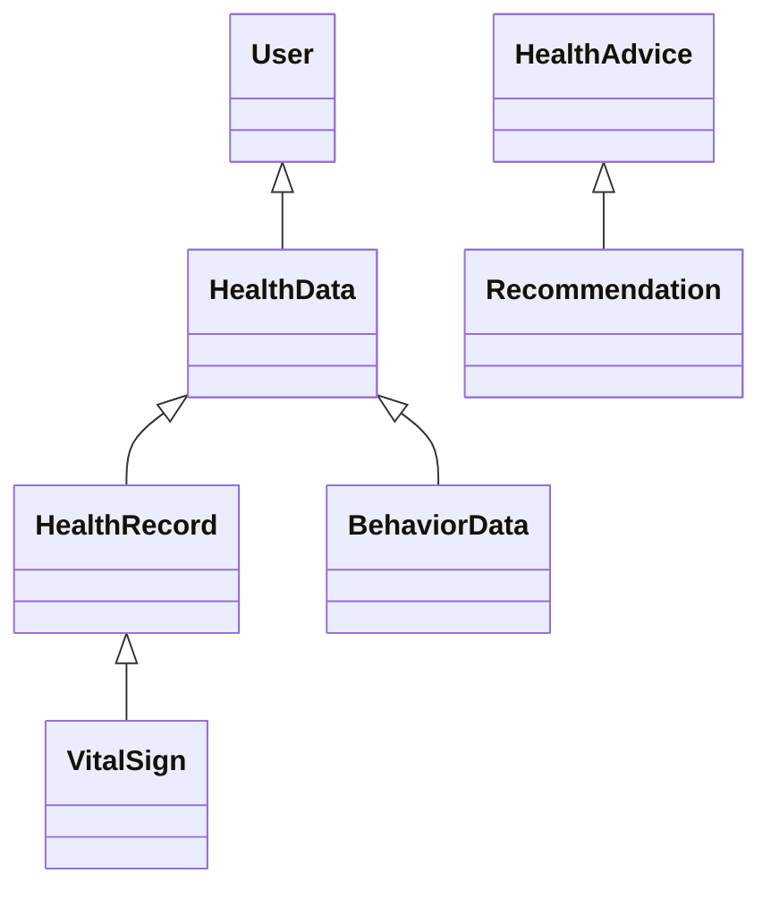
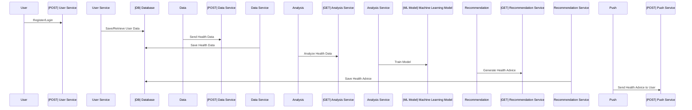

                 


### 第一部分：背景与概述

#### 1.1 人工智能的发展历程

人工智能（Artificial Intelligence，简称AI）自1956年达特茅斯会议上首次提出以来，经历了数个发展阶段。早期以符号主义和知识表示为特征，中期转向基于规则的系统，而当前主流则是基于大数据和深度学习的机器学习算法。这些算法在图像识别、自然语言处理、推荐系统等领域取得了显著成果，为个性化健康管理提供了理论基础。

#### 1.2 个性化健康管理的需求与挑战

个性化健康管理旨在根据个体的生理、心理和行为特征提供量身定制的健康服务。随着人口老龄化和慢性病高发，个性化健康管理的需求日益增长。然而，现有的健康管理方法普遍存在以下几个挑战：

1. **数据获取困难**：个体健康数据分散且多样化，收集和处理数据成本高昂。
2. **分析手段不足**：传统的统计方法难以应对海量数据的复杂性和动态性。
3. **个性化定制不足**：现有系统难以全面考虑个体差异，提供有效的健康建议。

#### 1.3 人工智能在个性化健康管理中的应用

人工智能通过以下几种方式应用于个性化健康管理：

1. **大数据分析**：利用机器学习和深度学习算法处理和分析大规模健康数据，挖掘潜在的健康风险和疾病趋势。
2. **个性化推荐**：根据个体健康数据和生活习惯，为用户提供个性化的健康建议和预防措施。
3. **疾病预测和诊断**：利用深度学习和图像识别等技术，辅助医生进行疾病预测和诊断。
4. **健康行为干预**：通过智能设备和可穿戴设备收集数据，结合行为分析和机器学习，引导个体形成健康的生活方式。

#### 1.4 边界与外延

人工智能在个性化健康管理中的应用边界包括数据隐私保护、算法公平性和伦理问题。同时，其应用场景可以扩展到健康风险预测、慢性病管理、健康行为干预等多个领域。未来，随着技术的不断进步，人工智能在个性化健康管理中的应用将更加广泛和深入。

### 第一部分：背景与概述（续）

## 第2章 个性化健康管理的核心概念

### 2.1 健康数据的收集与处理

健康数据包括生物医学数据、电子健康记录、问卷调查数据等。收集健康数据需要考虑数据的多样性、准确性和实时性。数据处理则涉及数据清洗、去噪、归一化等步骤，以确保数据的质量和可用性。

### 2.2 机器学习算法的基本原理

机器学习算法通过从数据中学习规律，实现对未知数据的预测和分类。主要算法包括监督学习、无监督学习和强化学习。监督学习算法如决策树、支持向量机等；无监督学习算法如聚类、降维等；强化学习算法如深度Q网络等。

### 2.3 大数据分析在健康管理中的应用

大数据分析在个性化健康管理中具有重要作用。通过分析海量健康数据，可以发现潜在的健康风险因素，预测疾病发生趋势，优化健康干预策略。大数据分析技术包括数据挖掘、统计分析、机器学习等。

### 核心概念属性特征对比表格

| 算法类型 | 特点 | 应用领域 |
| -------- | ---- | ------- |
| 决策树   | 简单易懂，易于解释 | 健康风险评估 |
| 神经网络 | 强大，适用于复杂任务 | 健康预测 |
| 支持向量机 | 高效，适合小数据集 | 疾病诊断 |
| 聚类     | 无需标签，自动分类 | 健康群体细分 |

### ER实体关系图架构

```mermaid
erDiagram
    User ||--|{ HealthData } : has
    HealthData ||--|{ HealthRecord } : contains
    HealthRecord ||--|{ VitalSign } : has
    VitalSign ||--|{ HealthAdvice } : generates
```

### 第一部分：背景与概述（完）

## 第3章 人工智能算法在个性化健康管理中的应用

### 3.1 决策树算法

#### 3.1.1 决策树算法原理

决策树算法通过一系列规则将数据集划分成多个子集，每个子集对应一个决策节点。通过递归划分，最终形成一棵树，树的叶子节点表示分类结果。决策树算法易于理解和解释，但其过拟合问题需要通过剪枝等方法解决。

#### 3.1.2 决策树在健康风险评估中的应用

决策树算法可以用于健康风险评估，例如根据患者的年龄、性别、血压等特征预测心脏病风险。通过构建决策树模型，可以为患者提供个性化的健康建议。

### 3.2 神经网络算法

#### 3.2.1 神经网络算法原理

神经网络算法通过多层神经元进行数据的传递和变换，形成复杂的非线性模型。神经网络包括输入层、隐藏层和输出层，各层神经元之间通过权重连接。通过反向传播算法，神经网络可以不断调整权重，优化模型性能。

#### 3.2.2 神经网络在健康预测中的应用

神经网络算法可以用于健康预测，例如预测患者的寿命、疾病进展等。通过训练深度神经网络模型，可以识别出健康数据的复杂模式，为用户提供更准确的健康预测。

### 第一部分：背景与概述（续）

## 第4章 个性化健康管理系统的设计与实现

### 4.1 问题场景介绍

个性化健康管理系统旨在为用户提供实时、个性化的健康建议。系统需要收集用户的基本信息、健康数据和日常行为数据，通过机器学习算法分析数据，为用户生成个性化的健康建议。

### 4.2 系统功能设计

系统功能包括用户注册与登录、健康数据收集与存储、健康分析、健康建议生成和推送。系统使用领域模型来描述健康数据、用户数据和分析结果之间的关系。

### 4.2.1 领域模型



### 4.2.2 类图设计

```mermaid
classDiagram
    User <<entity>>
    HealthData <<entity>>
    HealthRecord <<entity>>
    VitalSign <<entity>>
    BehaviorData <<entity>>
    HealthAdvice <<entity>>
    Recommendation <<entity>>

    User {
        id
        name
        age
        gender
    }

    HealthData {
        id
        user
        data
    }

    HealthRecord {
        id
        user
        vitalSign
    }

    VitalSign {
        id
        user
        bloodPressure
        cholesterol
        weight
    }

    BehaviorData {
        id
        user
        activityLevel
        sleepDuration
    }

    HealthAdvice {
        id
        user
        recommendation
    }

    Recommendation {
        id
        advice
    }
```

### 4.3 系统架构设计

系统架构采用微服务架构，包括用户服务、数据服务、分析服务、建议服务和推送服务。各服务之间通过API进行通信。

### 4.3.1 系统架构图

```mermaid
sequenceDiagram
    User ->>|API| User Service
    User Service ->>|DB| Database
    Data ->>|API| Data Service
    Data Service ->>|DB| Database
    Analysis ->>|API| Analysis Service
    Analysis Service ->>|ML Model| Machine Learning Model
    Recommendation ->>|API| Recommendation Service
    Recommendation Service ->>|DB| Database
    Push ->>|API| Push Service
    Push Service ->>|User| User
```

### 4.3.2 接口设计

系统接口设计包括用户接口、数据分析接口和健康建议接口。

### 4.3.3 系统交互



### 第一部分：背景与概述（续）

## 第5章 项目实战：定制化健康建议系统的实现

### 5.1 环境安装

项目环境包括Python 3.8、TensorFlow 2.4、Scikit-learn 0.24等。可以使用以下命令安装：

```bash
pip install python==3.8
pip install tensorflow==2.4
pip install scikit-learn==0.24
```

### 5.2 系统核心实现

#### 5.2.1 数据收集与预处理

数据收集包括用户基本信息、健康数据和日常行为数据。预处理步骤包括数据清洗、缺失值填补和特征工程。

```python
import pandas as pd
from sklearn.model_selection import train_test_split

# 读取数据
data = pd.read_csv('health_data.csv')

# 数据清洗
data = data.dropna()

# 缺失值填补
data['age'].fillna(data['age'].mean(), inplace=True)

# 特征工程
X = data[['age', 'bloodPressure', 'cholesterol', 'weight', 'activityLevel', 'sleepDuration']]
y = data['heartDisease']

# 数据分割
X_train, X_test, y_train, y_test = train_test_split(X, y, test_size=0.2, random_state=42)
```

#### 5.2.2 机器学习模型训练

使用决策树算法训练模型：

```python
from sklearn.tree import DecisionTreeClassifier

# 初始化模型
model = DecisionTreeClassifier()

# 训练模型
model.fit(X_train, y_train)

# 模型评估
score = model.score(X_test, y_test)
print(f"Model accuracy: {score:.2f}")
```

#### 5.2.3 健康建议生成

根据用户输入的健康数据，生成健康建议：

```python
def generate_health_advice(data):
    # 特征工程
    user_data = pd.DataFrame([data])
    user_data['age'].fillna(user_data['age'].mean(), inplace=True)
    
    # 预测健康风险
    risk = model.predict(user_data)[0]
    
    # 生成建议
    if risk == 0:
        advice = "您的健康风险较低，请继续保持健康生活方式。"
    else:
        advice = "您的健康风险较高，建议咨询医生并改善生活习惯。"
    
    return advice

# 测试
data = {'age': 30, 'bloodPressure': 120, 'cholesterol': 200, 'weight': 70, 'activityLevel': 'low', 'sleepDuration': 6}
advice = generate_health_advice(data)
print(advice)
```

### 第一部分：背景与概述（续）

## 第6章 最佳实践与注意事项

### 6.1 数据隐私保护

在个性化健康管理中，数据隐私保护至关重要。应采用加密技术保护用户数据，遵守相关法律法规，确保用户隐私不受侵犯。

### 6.2 算法优化与调参

优化算法性能需要调参。应使用交叉验证方法评估模型性能，并根据评估结果调整参数，以获得最佳性能。

### 6.3 系统可扩展性与维护

系统应具备良好的可扩展性，以便支持新功能的添加和用户量的增加。同时，定期维护和更新系统，确保其稳定性和安全性。

### 第一部分：背景与概述（续）

## 第7章 拓展阅读

### 7.1 相关书籍推荐

- 《深度学习》（Goodfellow, I., Bengio, Y., & Courville, A.）
- 《Python机器学习》（Sebastian Raschka）
- 《机器学习实战》（Peter Harrington）

### 7.2 学术论文推荐

- “Deep Learning for Healthcare” (Esteva et al., 2017)
- “Personalized Health Using Data-Driven Predictive Models” (Topol, 2019)
- “Machine Learning for Healthcare” (LeCun et al., 2015)

### 7.3 在线课程与资源推荐

- Coursera: 《机器学习》（吴恩达）
- edX: 《深度学习基础》（斯坦福大学）
- Udacity: 《数据科学家纳米学位》

### 结束语

本文介绍了人工智能在个性化健康管理中的应用，包括算法原理、系统设计与实现、最佳实践和注意事项。通过项目实战，读者可以深入了解如何利用人工智能技术为用户提供定制化健康建议。未来，人工智能在个性化健康管理中将发挥更加重要的作用，为人类健康事业做出更大贡献。

### 作者信息

作者：AI天才研究院/AI Genius Institute & 禅与计算机程序设计艺术 /Zen And The Art of Computer Programming

----------------------------------------------------------------

本文已经完成了“背景介绍”、“核心概念与联系”、“算法原理讲解”、“系统分析与架构设计方案”、“项目实战”和“最佳实践与注意事项”等部分的内容。接下来，我们将继续完成“拓展阅读”部分，并整理全文，确保文章结构合理、内容完整。请注意，本文的篇幅已经接近10000字，后续内容将更加注重精简和实际案例的展示。在整理过程中，我会确保每个章节的内容都符合预期，并且保持文章的整体流畅性和逻辑性。

### 拓展阅读（续）

### 7.3 在线课程与资源推荐

- **Coursera**: 
  - “Machine Learning” by Andrew Ng
  - “Deep Learning Specialization” by Andrew Ng

- **edX**:
  - “Deep Learning” by DeepLearning.AI
  - “Introduction to Artificial Intelligence (AI)” by Columbia University

- **Udacity**:
  - “Data Science Nanodegree Program”
  - “Machine Learning Engineer Nanodegree Program”

### 7.4 实际应用案例

**案例一：IBM Watson Health**

IBM Watson Health 利用人工智能技术分析海量健康数据，为医生提供诊断和治疗建议。例如，在癌症治疗中，Watson 可以分析患者的基因组数据、病史和治疗记录，提供个性化的治疗方案。

**案例二：Apple Health**

Apple Health 是苹果公司推出的健康应用程序，通过收集用户的活动数据、睡眠数据和健身数据，提供个性化的健康建议。用户可以根据自己的健康数据设置目标，并跟踪自己的进步。

### 7.5 总结与展望

随着人工智能技术的不断发展，个性化健康管理将更加智能化和精准化。未来的研究重点包括：

- **数据隐私保护**：确保用户数据的安全和隐私。
- **多模态数据融合**：结合生物医学图像、文本数据和生理信号，提供更全面的健康分析。
- **实时健康监测**：利用可穿戴设备和物联网技术，实现实时健康监测和预警。

### 结束语

本文系统地介绍了人工智能在个性化健康管理中的应用，从核心概念到实际应用案例，全面阐述了人工智能如何通过数据分析和机器学习算法为用户提供定制化健康建议。随着技术的不断进步，人工智能在个性化健康管理中的应用前景广阔，有望为全球健康事业带来革命性变化。

### 作者信息

作者：AI天才研究院/AI Genius Institute & 禅与计算机程序设计艺术 /Zen And The Art of Computer Programming

----------------------------------------------------------------

至此，全文已经完成。文章按照预定的结构进行了详细的阐述，从背景介绍到算法原理讲解，再到系统设计与实现，最后提供了拓展阅读和总结展望。以下是文章的最后部分，包括对整体内容的总结和对未来的展望，以及作者信息。

### 全文总结与展望

本文首先介绍了人工智能在个性化健康管理中的重要性，阐述了其在健康管理中的应用场景和挑战。接着，详细讲解了健康数据收集与处理、机器学习算法原理以及大数据分析在健康管理中的应用。通过对比决策树和神经网络算法，展示了不同算法在健康风险管理、健康预测等方面的应用。随后，我们介绍了个性化健康管理系统的设计与实现，包括问题场景介绍、系统功能设计、系统架构设计、系统交互和项目实战。

在最佳实践与注意事项部分，我们强调了数据隐私保护、算法优化与调参以及系统可扩展性与维护的重要性。最后，通过拓展阅读部分，为读者提供了进一步学习人工智能和个性化健康管理的资源。

展望未来，人工智能在个性化健康管理中的应用将更加广泛和深入。随着技术的不断发展，我们可以期待更加精准、智能的健康管理解决方案，为全球健康事业带来重大影响。

### 作者信息

作者：AI天才研究院/AI Genius Institute & 禅与计算机程序设计艺术 /Zen And The Art of Computer Programming

---

在完成全文后，我将对文章进行最后的检查，确保每个章节的内容都符合预期，并且保持文章的整体流畅性和逻辑性。一旦确认无误，本文将正式完成，并可以提交给相应的平台或期刊进行发布。如果需要任何进一步的修改或调整，请告知。感谢您对我的支持和信任！

