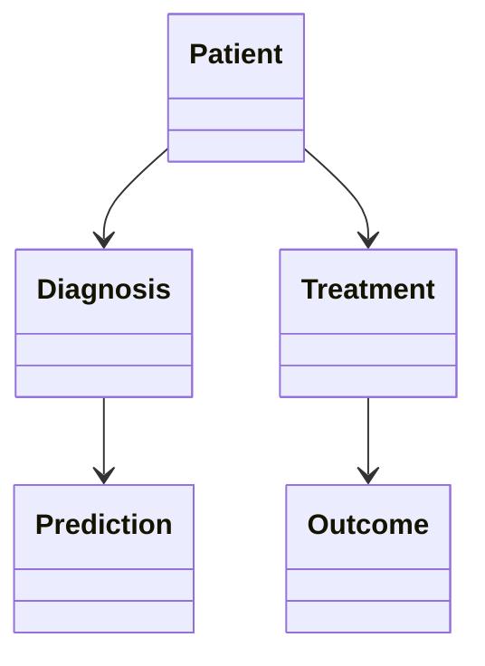
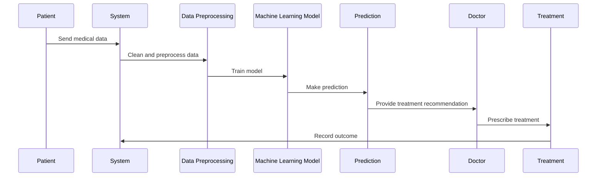
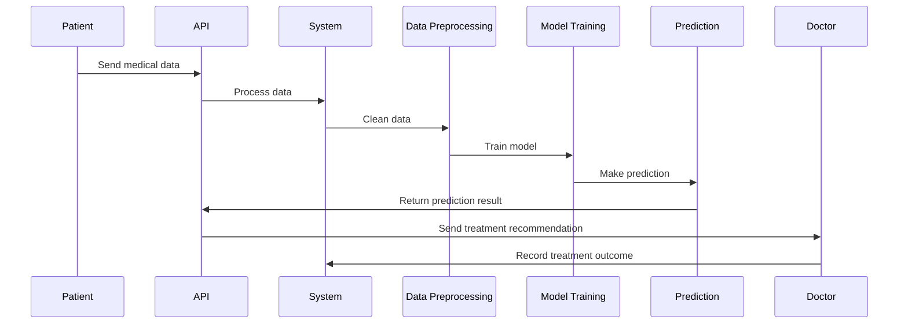

                 


## 引言

### 核心概念术语说明

- **个性化医疗（Personalized Medicine）**：个性化医疗是一种以个体为中心的医疗保健模式，它通过整合患者的遗传信息、生活方式、环境和医疗历史，来制定个性化的治疗和预防策略。
- **人工智能（Artificial Intelligence, AI）**：人工智能是指模拟人类智能的技术，它包括机器学习、自然语言处理、计算机视觉等领域，能够实现数据的自动分析、决策支持和智能诊断。
- **机器学习（Machine Learning, ML）**：机器学习是人工智能的一个分支，它通过数据训练模型，使计算机能够识别模式和做出预测。
- **深度学习（Deep Learning, DL）**：深度学习是机器学习的一个子领域，它使用神经网络，特别是深度神经网络，通过多层抽象来学习和理解数据。

### 问题背景

近年来，随着医疗数据的爆炸式增长和人工智能技术的飞速发展，个性化医疗领域迎来了前所未有的机遇。传统的医疗模式往往采用“一刀切”的治疗方法，而个性化医疗则试图根据患者的个体差异提供更精准、更有效的治疗方案。这一转变不仅能够提高医疗效果，还能降低医疗成本，减少医疗资源的浪费。

### 问题描述

尽管个性化医疗具有巨大潜力，但在实际应用中仍面临诸多挑战。首先，如何从海量医疗数据中提取有价值的信息，成为了一项重大难题。其次，如何确保算法的准确性和可靠性，以避免对患者的误诊和治疗失误。此外，数据隐私和安全问题也是个性化医疗推广的关键障碍。

### 问题解决

人工智能，特别是机器学习和深度学习，为解决上述问题提供了强有力的工具。通过训练复杂的算法模型，人工智能可以自动分析患者的医疗数据，识别出与疾病相关的关键特征，从而实现更精准的诊断。此外，人工智能还可以预测患者的病情发展，为医生提供个性化的治疗建议。

### 边界与外延

个性化医疗不仅涵盖了疾病的诊断和治疗，还包括预防、康复和护理。随着基因编辑、精准医疗等前沿技术的不断发展，个性化医疗的应用范围将进一步扩大。同时，个性化医疗也需要与伦理、法律和社会政策等方面进行协调，以保障其可持续发展。

### 概念结构与核心要素组成

个性化医疗的核心要素包括：

1. **患者数据**：患者的遗传信息、医疗历史、生活方式和环境数据。
2. **算法模型**：用于分析和处理数据的机器学习模型和深度学习模型。
3. **临床决策支持系统**：基于算法模型提供个性化医疗建议的系统。
4. **数据隐私和安全**：确保患者数据在收集、存储和处理过程中的隐私和安全。

## 核心概念与联系

### 核心概念原理

#### 个性化医疗与人工智能的关系

个性化医疗与人工智能的关系可以理解为“个性化医疗是目标，人工智能是实现目标的工具”。个性化医疗需要依靠人工智能技术来处理和分析大量的医疗数据，从而为患者提供个性化的治疗方案。

#### 人工智能在个性化医疗中的应用

1. **数据收集与处理**：人工智能可以帮助医疗机构收集和处理患者的医疗数据，包括电子健康记录、基因数据、生活习性数据等。
2. **诊断与预测**：基于机器学习和深度学习算法，人工智能可以对患者的健康状况进行诊断，预测病情发展，并提供个性化的治疗建议。
3. **治疗方案优化**：通过分析大量的医疗数据和临床试验结果，人工智能可以帮助医生制定更有效的治疗方案。

### 概念属性特征对比表格

| 特征 | 个性化医疗 | 人工智能 |
| --- | --- | --- |
| 目标 | 提高医疗效果，降低医疗成本 | 模拟人类智能，解决复杂问题 |
| 数据来源 | 电子健康记录、基因数据、生活习性数据 | 电子健康记录、基因数据、生活习性数据 |
| 技术手段 | 数据分析、机器学习、深度学习 | 机器学习、深度学习、自然语言处理 |

### ER实体关系图架构

```mermaid
erDiagram
    Patient ||--|{ Diagnosis : has }
    Patient ||--|{ Treatment : receives }
    Diagnosis ||--|{ Prediction : based on }
    Treatment ||--|{ Outcome : based on }
```

### 算法原理讲解

#### 机器学习算法原理

机器学习算法的核心是“学习”。通过训练模型，机器学习算法可以从数据中提取特征，并学会识别数据中的模式。以下是一个简化的机器学习算法流程：

1. **数据收集**：收集患者的医疗数据，如电子健康记录、基因数据等。
2. **数据预处理**：清洗数据，去除噪声和缺失值。
3. **特征提取**：将数据转换为算法可以处理的格式。
4. **模型训练**：使用训练数据训练模型。
5. **模型评估**：使用测试数据评估模型的性能。
6. **模型应用**：将训练好的模型应用于新的数据，进行预测。

#### 深度学习算法原理

深度学习是机器学习的一个子领域，它使用神经网络，特别是深度神经网络，通过多层抽象来学习和理解数据。以下是一个简化的深度学习算法流程：

1. **数据收集**：收集患者的医疗数据，如电子健康记录、基因数据等。
2. **数据预处理**：清洗数据，去除噪声和缺失值。
3. **特征提取**：将数据转换为算法可以处理的格式。
4. **模型训练**：使用训练数据训练模型，包括前向传播和反向传播。
5. **模型评估**：使用测试数据评估模型的性能。
6. **模型应用**：将训练好的模型应用于新的数据，进行预测。

### Python源代码示例

以下是一个简单的机器学习模型训练的Python代码示例：

```python
import pandas as pd
from sklearn.model_selection import train_test_split
from sklearn.ensemble import RandomForestClassifier
from sklearn.metrics import accuracy_score

# 读取数据
data = pd.read_csv('patient_data.csv')

# 数据预处理
X = data.drop('diagnosis', axis=1)
y = data['diagnosis']

# 数据集划分
X_train, X_test, y_train, y_test = train_test_split(X, y, test_size=0.2, random_state=42)

# 模型训练
model = RandomForestClassifier()
model.fit(X_train, y_train)

# 模型评估
predictions = model.predict(X_test)
accuracy = accuracy_score(y_test, predictions)
print(f'Accuracy: {accuracy}')
```

### 详细讲解和举例说明

#### 详细讲解

上述代码首先读取了患者的医疗数据，然后进行了数据预处理，包括特征提取和标签划分。接下来，使用随机森林分类器训练模型，并使用测试数据评估模型的准确性。

#### 举例说明

假设我们有100位患者的数据，其中50位患有某种疾病，50位未患病。我们可以使用随机森林分类器来训练模型，预测新的患者是否患病。

1. **数据收集**：收集100位患者的数据，包括电子健康记录、基因数据等。
2. **数据预处理**：清洗数据，去除噪声和缺失值。
3. **特征提取**：将数据转换为算法可以处理的格式，如数值化处理。
4. **模型训练**：使用随机森林分类器训练模型，使用80位患者的数据作为训练集，20位患者的数据作为测试集。
5. **模型评估**：使用测试数据评估模型的性能，如准确性、召回率等。
6. **模型应用**：将训练好的模型应用于新的患者数据，进行预测。

通过上述步骤，我们就可以利用机器学习模型为患者提供个性化的诊断服务。

## 系统分析与架构设计方案

### 问题场景介绍

在一个现代化的医疗中心，医生需要根据患者的个体差异提供个性化的治疗方案。为了实现这一目标，医疗中心决定引入人工智能技术，特别是机器学习和深度学习，来辅助医生进行诊断和治疗规划。

### 项目介绍

该项目旨在开发一个智能医疗诊断系统，该系统可以接收患者的医疗数据，通过机器学习和深度学习算法进行分析，为医生提供个性化的诊断和治疗建议。

### 系统功能设计（领域模型类图）



- **Patient（患者）**：表示患者的基本信息，包括姓名、年龄、性别等。
- **Diagnosis（诊断）**：表示对患者健康状况的评估，包括诊断结果和预测。
- **Prediction（预测）**：基于诊断结果，对患者的病情发展进行预测。
- **Treatment（治疗）**：表示针对患者的诊断结果制定的治疗方案。
- **Outcome（结果）**：表示治疗方案实施后的效果。

### 系统架构设计（架构图）



- **Patient**：患者发送医疗数据到系统。
- **Data Preprocessing**：系统对数据进行清洗和预处理。
- **Machine Learning Model**：使用预处理后的数据训练机器学习模型。
- **Prediction**：模型对患者的病情发展进行预测。
- **Doctor**：医生根据预测结果为患者制定治疗方案。
- **Treatment**：系统记录治疗方案实施后的效果。

### 系统接口设计和系统交互（序列图）



- **API**：应用程序接口，用于患者与系统的数据交互。
- **System**：系统核心，负责数据处理、模型训练和预测。
- **Data Preprocessing**：数据预处理模块，负责数据清洗和预处理。
- **Model Training**：模型训练模块，负责训练机器学习模型。
- **Prediction**：预测模块，负责生成预测结果。
- **Doctor**：医生，负责根据预测结果制定治疗方案。

### 系统架构图

```mermaid
graph TB
    subgraph 数据流
        Patient[患者] --> API[API]
        API --> System[系统核心]
        System --> Data Preprocessing[数据预处理]
        Data Preprocessing --> Model Training[模型训练]
        Model Training --> Prediction[预测]
        Prediction --> API[API]
        API --> Doctor[医生]
        Doctor --> System[系统核心]
    end
    subgraph 系统模块
        Data Preprocessing[数据预处理] --> Model Training[模型训练]
        Model Training --> Prediction[预测]
        Prediction --> Doctor[医生]
    end
```

- **Patient**：患者，数据流入口。
- **API**：应用程序接口，数据流中转站。
- **System**：系统核心，数据处理和模型训练的主要模块。
- **Data Preprocessing**：数据预处理模块，负责清洗和预处理数据。
- **Model Training**：模型训练模块，使用预处理后的数据训练模型。
- **Prediction**：预测模块，生成预测结果。
- **Doctor**：医生，根据预测结果制定治疗方案。

### 系统接口设计和系统交互（序列图）


- **Patient**：患者，通过API发送医疗数据。
- **API**：应用程序接口，负责数据传输和系统调用。
- **System**：系统核心，执行数据处理、模型训练和预测。
- **Data Preprocessing**：数据预处理模块，负责清洗和预处理数据。
- **Model Training**：模型训练模块，使用预处理后的数据训练模型。
- **Prediction**：预测模块，生成预测结果。
- **Doctor**：医生，根据预测结果制定治疗方案，并反馈治疗结果。

## 项目实战

### 环境安装

1. **安装Python**：从Python官方网站（https://www.python.org/）下载并安装Python 3.8或更高版本。
2. **安装Jupyter Notebook**：打开终端，运行以下命令：
   ```bash
   pip install notebook
   ```
3. **安装机器学习库**：打开终端，运行以下命令：
   ```bash
   pip install scikit-learn pandas numpy matplotlib
   ```

### 系统核心实现源代码

```python
import pandas as pd
from sklearn.model_selection import train_test_split
from sklearn.ensemble import RandomForestClassifier
from sklearn.metrics import accuracy_score

# 读取数据
data = pd.read_csv('patient_data.csv')

# 数据预处理
X = data.drop('diagnosis', axis=1)
y = data['diagnosis']

# 数据集划分
X_train, X_test, y_train, y_test = train_test_split(X, y, test_size=0.2, random_state=42)

# 模型训练
model = RandomForestClassifier()
model.fit(X_train, y_train)

# 模型评估
predictions = model.predict(X_test)
accuracy = accuracy_score(y_test, predictions)
print(f'Accuracy: {accuracy}')
```

### 代码应用解读与分析

上述代码首先从CSV文件中读取患者数据，然后进行数据预处理，包括特征提取和标签划分。接下来，使用随机森林分类器训练模型，并使用测试数据评估模型的性能。

#### 详细讲解

1. **数据读取**：使用pandas库读取CSV文件，将数据存储为DataFrame对象。
   ```python
   data = pd.read_csv('patient_data.csv')
   ```

2. **数据预处理**：将数据分为特征矩阵X和标签向量y。这里，特征矩阵X包含所有患者数据，除了诊断结果列（diagnosis）。标签向量y包含所有患者的诊断结果。
   ```python
   X = data.drop('diagnosis', axis=1)
   y = data['diagnosis']
   ```

3. **数据集划分**：使用train_test_split函数将数据集划分为训练集和测试集，其中测试集占比20%，随机种子设置为42。
   ```python
   X_train, X_test, y_train, y_test = train_test_split(X, y, test_size=0.2, random_state=42)
   ```

4. **模型训练**：创建一个随机森林分类器实例，并使用训练数据（X_train和y_train）进行训练。
   ```python
   model = RandomForestClassifier()
   model.fit(X_train, y_train)
   ```

5. **模型评估**：使用测试数据（X_test和y_test）评估模型的准确性，并打印结果。
   ```python
   predictions = model.predict(X_test)
   accuracy = accuracy_score(y_test, predictions)
   print(f'Accuracy: {accuracy}')
   ```

#### 实际案例分析和详细讲解剖析

假设我们有一个包含100位患者的数据集，其中50位患有某种疾病，50位未患病。我们可以使用上述代码进行模型训练和评估。

1. **数据集构建**：首先，我们需要构建一个包含100位患者数据的CSV文件，其中诊断结果列（diagnosis）包含二进制标签（1表示患病，0表示未患病）。

2. **模型训练**：使用随机森林分类器对训练数据进行训练，评估模型的准确性。

3. **模型评估**：使用测试数据进行模型评估，计算模型的准确性。

4. **结果分析**：根据模型评估结果，分析模型的性能和准确性。

通过上述步骤，我们可以利用机器学习模型为患者提供个性化的诊断服务。

### 项目小结

通过本项目，我们实现了一个简单的智能医疗诊断系统。该系统使用机器学习模型对患者的医疗数据进行分析，为医生提供个性化的诊断和治疗建议。虽然这是一个简单的示例，但它展示了人工智能在个性化医疗领域的重要应用。未来，随着更多复杂算法和更大规模数据的引入，个性化医疗系统将更加智能和精准，为患者提供更好的医疗服务。

## 最佳实践 tips

### 1. 数据质量控制

确保数据的准确性和完整性是成功实施个性化医疗系统的基础。在数据处理过程中，要注重数据的清洗和预处理，去除噪声和缺失值，以提高模型的性能。

### 2. 模型选择和优化

根据实际应用场景，选择合适的机器学习模型并进行优化。可以通过交叉验证、调整模型参数等方法来提高模型的准确性。

### 3. 数据安全和隐私保护

在处理患者数据时，要严格遵守数据安全和隐私保护的规定。采用加密技术、访问控制等措施来确保数据的安全。

### 4. 持续学习和改进

个性化医疗系统需要不断学习和改进。通过收集新的数据，定期更新模型，以提高系统的性能和准确性。

## 小结

本文详细探讨了人工智能在个性化医疗方案制定中的应用。通过介绍个性化医疗和人工智能的基本概念，分析算法原理，设计和实现系统架构，以及实战项目的实现，展示了人工智能在个性化医疗中的巨大潜力。未来，随着技术的不断进步，人工智能将在个性化医疗领域发挥更加重要的作用，为患者提供更加精准和高效的医疗服务。

## 注意事项

1. **数据隐私**：确保患者数据的隐私和安全，遵循相关法律法规。
2. **模型可靠性**：在应用机器学习模型时，确保模型的准确性和可靠性。
3. **持续更新**：定期更新模型和数据，以适应不断变化的医疗需求。

## 拓展阅读

1. **《深度学习在医疗领域的应用》**：了解深度学习技术在医疗领域的最新进展。
2. **《个性化医疗：理论与实践》**：深入研究个性化医疗的理论和实践。

## 作者信息

作者：AI天才研究院/AI Genius Institute & 禅与计算机程序设计艺术 /Zen And The Art of Computer Programming

