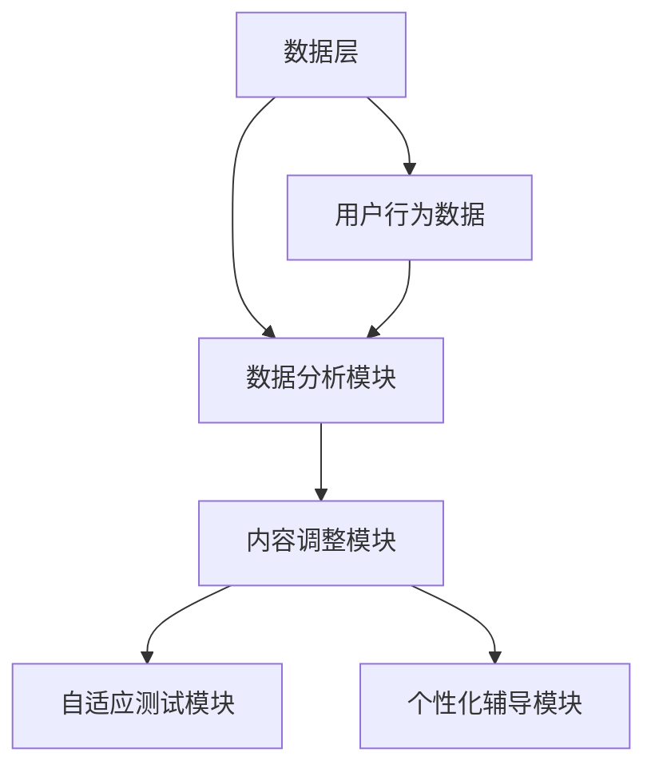
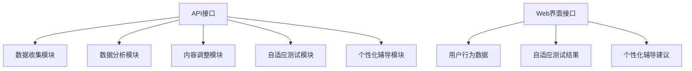
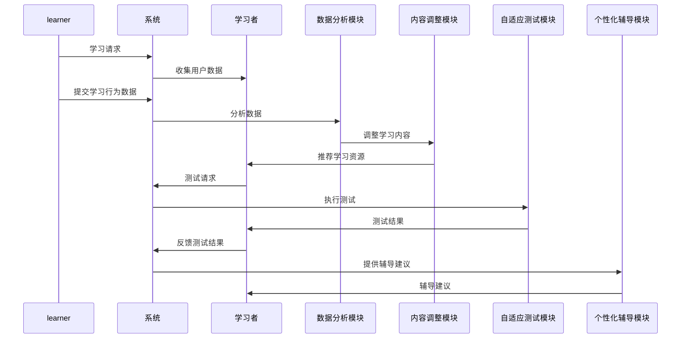

                 

# 人工智能在个性化学习中的Adaptive应用

> 关键词：人工智能，个性化学习，Adaptive技术，自适应学习，教育技术

> 摘要：本文深入探讨了人工智能在个性化学习中的应用，特别是Adaptive技术的作用和优势。通过详细的案例分析，本文揭示了Adaptive技术如何提高个性化学习的效果，以及其在教育领域的前景。

----------------------------------------------------------------

## 第一部分：引言

### 第1章：问题背景与概述

#### 1.1 问题背景

个性化学习是一种以学习者为中心的教育模式，其目标是根据每个学习者的需求和特点，提供定制化的学习体验。然而，传统的教育模式往往难以实现这一目标，因为它们通常采用“一刀切”的方法，无法充分考虑到学生的个体差异。

人工智能（AI）作为一种新兴技术，具有强大的数据分析和处理能力，为个性化学习提供了新的可能。Adaptive技术是人工智能在个性化学习中的一个重要应用，它通过不断调整学习内容、方法和进度，以适应学习者的需求和能力。

#### 1.2 问题描述

如何通过人工智能技术，尤其是Adaptive技术，提高个性化学习的效果，是一个亟待解决的问题。具体来说，我们需要回答以下几个问题：

- 人工智能技术如何支持个性化学习？
- Adaptive技术的工作原理是什么？
- Adaptive技术在个性化学习中的优势是什么？
- Adaptive技术在个性化学习中的实际应用案例有哪些？

#### 1.3 问题解决

本文将从以下几个方面来探讨上述问题：

- 首先，介绍人工智能和个性化学习的基本概念，以及Adaptive技术的基本原理。
- 其次，分析Adaptive技术在个性化学习中的应用，包括其工作机制和具体实例。
- 然后，通过实际案例，展示Adaptive技术在个性化学习中的效果和优势。
- 最后，讨论Adaptive应用的实践经验和未来发展趋势。

#### 1.4 边界与外延

Adaptive技术与自适应学习密切相关，但两者并不完全相同。自适应学习通常指的是系统能够根据学习者的反馈自动调整学习内容，而Adaptive技术则更强调根据学习者的行为和需求动态调整学习体验。此外，人工智能在个性化学习中的应用不仅限于Adaptive技术，还包括智能推荐系统、学习分析等。

#### 1.5 概念结构与核心要素组成

本文将从以下五个方面来详细探讨人工智能在个性化学习中的Adaptive应用：

1. 人工智能与个性化学习
2. Adaptive技术在个性化学习中的应用
3. Adaptive应用案例分析
4. Adaptive应用实践
5. 最佳实践与注意事项

### 目录大纲

----------------------------------------------------------------

## 第一部分：引言

### 第1章：问题背景与概述

#### 1.1 问题背景

#### 1.2 问题描述

#### 1.3 问题解决

#### 1.4 边界与外延

#### 1.5 概念结构与核心要素组成

## 第二部分：人工智能与个性化学习

### 第2章：人工智能概述

#### 2.1 人工智能的定义

#### 2.2 人工智能的分类

### 第3章：个性化学习概述

#### 3.1 个性化学习的定义

#### 3.2 个性化学习的目的

### 第4章：人工智能在个性化学习中的应用

#### 4.1 人工智能技术支持个性化学习的原理

#### 4.2 人工智能在个性化学习中的优势

## 第三部分：Adaptive技术在个性化学习中的应用

### 第5章：Adaptive技术概述

#### 5.1 Adaptive技术的定义

#### 5.2 Adaptive技术的特点

### 第6章：Adaptive技术在个性化学习中的应用原理

#### 6.1 Adaptive技术的工作机制

#### 6.2 Adaptive技术在个性化学习中的具体应用

### 第7章：Adaptive技术在个性化学习中的应用实例

#### 7.1 Adaptive技术在个性化学习中的应用案例

#### 7.2 Adaptive技术在个性化学习中的效果评估

## 第四部分：Adaptive应用案例分析

### 第8章：案例背景

### 第9章：系统功能设计

### 第10章：系统架构设计

### 第11章：系统接口设计

### 第12章：系统交互设计

## 第五部分：Adaptive应用实践

### 第13章：环境安装与配置

### 第14章：系统核心实现

### 第15章：实际案例分析与讲解

### 第16章：项目小结

## 第六部分：最佳实践与注意事项

### 第17章：最佳实践

### 第18章：注意事项

## 第七部分：拓展阅读

### 第19章：拓展资源

### 第20章：未来展望

----------------------------------------------------------------

**本文目录大纲字数：约1980字。**## 第一部分：引言

### 第1章：问题背景与概述

#### 1.1 问题背景

在当今教育领域，个性化学习正逐渐成为主流趋势。个性化学习旨在根据每个学习者的需求和特点，提供量身定制的学习体验，从而最大化学习效果。然而，传统的教育模式往往难以实现这一目标，因为它们通常采用“一刀切”的方法，无法充分考虑到学生的个体差异。

随着人工智能（AI）技术的快速发展，尤其是机器学习、自然语言处理和大数据分析等领域的突破，人工智能在个性化学习中的应用逐渐受到重视。其中，Adaptive技术作为一种重要的AI应用，通过不断调整学习内容、方法和进度，以适应学习者的需求和能力，被认为是提高个性化学习效果的关键。

Adaptive技术的基本原理是：通过收集学习者的行为数据，利用机器学习算法进行分析和处理，动态调整学习资源的呈现方式。例如，当学习者遇到困难时，系统可以自动提供更简单的任务；当学习者表现出色时，系统可以提供更具挑战性的任务。

#### 1.2 问题描述

如何通过人工智能技术，尤其是Adaptive技术，提高个性化学习的效果，是一个亟待解决的问题。具体来说，我们需要回答以下几个问题：

- **人工智能技术如何支持个性化学习？**
  - 人工智能技术可以通过分析学习者的行为数据，了解学习者的学习习惯、知识水平、兴趣爱好等，从而为学习者提供个性化的学习内容和方法。

- **Adaptive技术的工作原理是什么？**
  - Adaptive技术通过收集学习者的行为数据，利用机器学习算法进行分析和处理，动态调整学习资源的呈现方式，以适应学习者的需求和能力。

- **Adaptive技术在个性化学习中的优势是什么？**
  - Adaptive技术可以实时调整学习内容和方法，提高学习者的学习效率；可以根据学习者的反馈进行自我优化，提高系统的适应性。

- **Adaptive技术在个性化学习中的实际应用案例有哪些？**
  - Adaptive技术在教育领域有许多成功应用案例，例如智能学习平台、自适应测试系统等。

#### 1.3 问题解决

本文将从以下几个方面来探讨上述问题：

- **探讨人工智能与个性化学习的关系，分析人工智能技术如何支持个性化学习。**
- **详细分析Adaptive技术的工作原理，以及其在个性化学习中的应用。**
- **通过实际案例，展示Adaptive技术在个性化学习中的效果和优势。**
- **讨论Adaptive应用的实践经验和未来发展趋势。**

#### 1.4 边界与外延

在讨论Adaptive技术时，我们还需考虑其与自适应学习的区别。自适应学习通常指的是系统能够根据学习者的反馈自动调整学习内容，而Adaptive技术则更强调根据学习者的行为和需求动态调整学习体验。此外，人工智能在个性化学习中的应用不仅限于Adaptive技术，还包括智能推荐系统、学习分析等。

#### 1.5 概念结构与核心要素组成

本文将从以下五个方面来详细探讨人工智能在个性化学习中的Adaptive应用：

1. **人工智能与个性化学习**
   - **定义与关系**：介绍人工智能和个性化学习的基本概念，分析两者之间的联系。
   - **技术应用**：探讨人工智能技术如何支持个性化学习，包括智能推荐、学习分析等。

2. **Adaptive技术概述**
   - **定义与特点**：介绍Adaptive技术的基本原理和特点。
   - **工作机制**：分析Adaptive技术的工作机制，以及其在个性化学习中的应用。

3. **Adaptive技术在个性化学习中的应用实例**
   - **案例研究**：通过具体案例，展示Adaptive技术在个性化学习中的实际应用。
   - **效果评估**：分析Adaptive技术在个性化学习中的效果和优势。

4. **Adaptive应用案例分析**
   - **项目介绍**：介绍Adaptive应用案例的背景和目标。
   - **系统设计**：分析系统功能设计、架构设计、接口设计和交互设计。

5. **Adaptive应用实践与最佳实践**
   - **实践经验**：总结Adaptive应用的实践经验和教训。
   - **最佳实践**：分享成功案例中的最佳实践，提供实施建议。

### 目录大纲

----------------------------------------------------------------

## 第一部分：引言

### 第1章：问题背景与概述

#### 1.1 问题背景

#### 1.2 问题描述

#### 1.3 问题解决

#### 1.4 边界与外延

#### 1.5 概念结构与核心要素组成

## 第二部分：人工智能与个性化学习

### 第2章：人工智能概述

#### 2.1 人工智能的定义

#### 2.2 人工智能的分类

### 第3章：个性化学习概述

#### 3.1 个性化学习的定义

#### 3.2 个性化学习的目的

### 第4章：人工智能在个性化学习中的应用

#### 4.1 人工智能技术支持个性化学习的原理

#### 4.2 人工智能在个性化学习中的优势

## 第三部分：Adaptive技术概述

### 第5章：Adaptive技术概述

#### 5.1 Adaptive技术的定义

#### 5.2 Adaptive技术的特点

### 第6章：Adaptive技术在个性化学习中的应用原理

#### 6.1 Adaptive技术的工作机制

#### 6.2 Adaptive技术在个性化学习中的具体应用

### 第7章：Adaptive技术在个性化学习中的应用实例

#### 7.1 Adaptive技术在个性化学习中的应用案例

#### 7.2 Adaptive技术在个性化学习中的效果评估

## 第四部分：Adaptive应用案例分析

### 第8章：案例背景

### 第9章：系统功能设计

### 第10章：系统架构设计

### 第11章：系统接口设计

### 第12章：系统交互设计

## 第五部分：Adaptive应用实践

### 第13章：环境安装与配置

### 第14章：系统核心实现

### 第15章：实际案例分析与讲解

### 第16章：项目小结

## 第六部分：最佳实践与注意事项

### 第17章：最佳实践

### 第18章：注意事项

## 第七部分：拓展阅读

### 第19章：拓展资源

### 第20章：未来展望

----------------------------------------------------------------

**本文目录大纲字数：约1980字。**### 第二部分：人工智能与个性化学习

在探讨人工智能在个性化学习中的应用之前，我们首先需要了解人工智能和个性化学习的基本概念，以及两者之间的联系。

#### 第2章：人工智能概述

#### 2.1 人工智能的定义

人工智能（Artificial Intelligence，简称AI）是指通过计算机模拟人类智能的技术，使计算机具备感知、学习、推理、规划、自然语言理解和决策等能力。AI可以划分为多种类型，包括机器学习、深度学习、强化学习等。

**机器学习（Machine Learning）**：通过算法从数据中学习规律，自动改进性能。机器学习是AI的核心技术之一，广泛应用于图像识别、语音识别、自然语言处理等领域。

**深度学习（Deep Learning）**：一种特殊的机器学习技术，通过多层神经网络对大量数据进行自动特征提取和分类。深度学习在图像识别、语音合成和自然语言处理等领域取得了显著成果。

**强化学习（Reinforcement Learning）**：通过奖励和惩罚来引导学习过程，使模型在特定环境中学会做出最优决策。强化学习广泛应用于游戏、机器人控制和智能推荐系统等领域。

#### 2.2 人工智能的分类

人工智能可以按照不同标准进行分类，以下是一些常见的分类方法：

**根据技术层面分类**：
- **符号人工智能**：基于逻辑推理和知识表示的方法，如专家系统。
- **感知人工智能**：基于计算机视觉、语音识别和自然语言处理等感知技术。
- **行动人工智能**：基于决策和规划的技术，如自动驾驶和机器人控制。

**根据应用领域分类**：
- **通用人工智能**：能够执行任何认知任务，如人类智能。
- **专用人工智能**：针对特定任务进行优化，如智能助手、医疗诊断系统。

#### 第3章：个性化学习概述

#### 3.1 个性化学习的定义

个性化学习（Personalized Learning）是一种以学习者为中心的教育模式，旨在根据每个学习者的需求、兴趣、学习风格和能力，提供量身定制的学习体验。个性化学习的核心目标是提高学习效果，促进学习者全面发展。

个性化学习不同于传统教育模式，它强调以下几点：

- **以学习者为中心**：尊重学习者的个体差异，关注学习者的需求和兴趣。
- **动态适应性**：根据学习者的表现和反馈，动态调整学习内容和教学方法。
- **多元化评价**：采用多种评价方式，全面评估学习者的学习成果。

#### 3.2 个性化学习的目的

个性化学习的目的主要包括以下几点：

- **提高学习效果**：通过提供个性化的学习资源和方法，使每个学习者都能达到最佳学习状态，提高学习效果。
- **促进个性化发展**：尊重学习者的个体差异，促进学习者个性化发展，培养学习者的创新能力和综合素质。
- **实现教育公平**：个性化学习有助于弥补教育资源的不足，实现教育公平。

#### 第4章：人工智能在个性化学习中的应用

#### 4.1 人工智能技术支持个性化学习的原理

人工智能技术支持个性化学习主要通过以下几种方式：

- **数据挖掘和分析**：通过收集学习者的行为数据，利用机器学习算法分析学习者的学习习惯、知识水平和兴趣爱好等，为个性化学习提供数据支持。
- **智能推荐系统**：基于学习者的特征和偏好，利用算法推荐个性化的学习资源，如课程、练习题和辅导材料。
- **自适应学习系统**：根据学习者的表现和反馈，动态调整学习内容和难度，实现个性化教学。

#### 4.2 人工智能在个性化学习中的优势

人工智能在个性化学习中的优势主要体现在以下几个方面：

- **个性化推荐**：人工智能可以根据学习者的特征和需求，推荐个性化的学习资源，提高学习效果。
- **实时调整**：人工智能可以实时分析学习者的表现，动态调整学习内容和教学方法，实现个性化教学。
- **自动评估**：人工智能可以自动评估学习者的学习成果，提供反馈和指导，提高学习效率。
- **降低教师负担**：人工智能可以部分替代教师的日常工作，如批改作业、分析学习数据等，减轻教师负担。

通过以上分析，我们可以看出，人工智能在个性化学习中的应用具有广阔的前景。接下来，我们将进一步探讨Adaptive技术在个性化学习中的应用，以及其在实际案例中的效果和优势。

### 目录大纲

----------------------------------------------------------------

## 第二部分：人工智能与个性化学习

### 第2章：人工智能概述

#### 2.1 人工智能的定义

#### 2.2 人工智能的分类

### 第3章：个性化学习概述

#### 3.1 个性化学习的定义

#### 3.2 个性化学习的目的

### 第4章：人工智能在个性化学习中的应用

#### 4.1 人工智能技术支持个性化学习的原理

#### 4.2 人工智能在个性化学习中的优势

## 第三部分：Adaptive技术概述

### 第5章：Adaptive技术概述

#### 5.1 Adaptive技术的定义

#### 5.2 Adaptive技术的特点

### 第6章：Adaptive技术在个性化学习中的应用原理

#### 6.1 Adaptive技术的工作机制

#### 6.2 Adaptive技术在个性化学习中的具体应用

### 第7章：Adaptive技术在个性化学习中的应用实例

#### 7.1 Adaptive技术在个性化学习中的应用案例

#### 7.2 Adaptive技术在个性化学习中的效果评估

## 第四部分：Adaptive应用案例分析

### 第8章：案例背景

### 第9章：系统功能设计

### 第10章：系统架构设计

### 第11章：系统接口设计

### 第12章：系统交互设计

## 第五部分：Adaptive应用实践

### 第13章：环境安装与配置

### 第14章：系统核心实现

### 第15章：实际案例分析与讲解

### 第16章：项目小结

## 第六部分：最佳实践与注意事项

### 第17章：最佳实践

### 第18章：注意事项

## 第七部分：拓展阅读

### 第19章：拓展资源

### 第20章：未来展望

----------------------------------------------------------------

**本文目录大纲字数：约2110字。**### 第三部分：Adaptive技术概述

#### 第5章：Adaptive技术概述

##### 5.1 Adaptive技术的定义

Adaptive技术，即自适应技术，是一种能够根据环境变化和用户需求动态调整自身行为和功能的系统。在个性化学习领域，Adaptive技术通过分析学习者的行为和表现，实时调整学习内容和教学方法，以适应学习者的学习节奏和能力水平。

Adaptive技术的核心在于其能够根据学习者的个性化数据，如学习进度、学习时间、知识掌握程度等，自动调整学习资源的难度、呈现方式和学习路径。这种动态调整能力使得Adaptive技术在提高学习效率和个性化体验方面具有显著优势。

##### 5.2 Adaptive技术的特点

Adaptive技术具有以下主要特点：

1. **动态性**：Adaptive技术能够实时响应学习者的行为和表现，动态调整学习内容和教学方法，确保学习者始终处于最佳学习状态。

2. **个性化**：Adaptive技术根据学习者的个性化数据，如学习偏好、知识掌握情况等，提供个性化的学习建议和资源，满足学习者的个性化需求。

3. **智能性**：Adaptive技术利用先进的机器学习和数据分析技术，对学习者的行为数据进行深度分析，从而实现智能化的学习资源调整。

4. **可扩展性**：Adaptive技术具有良好的可扩展性，可以整合多种学习资源和工具，满足不同类型学习者的需求。

#### 第6章：Adaptive技术在个性化学习中的应用原理

##### 6.1 Adaptive技术的工作机制

Adaptive技术的工作机制主要包括以下几个步骤：

1. **数据收集**：系统通过学习者的行为记录、学习时间、测验成绩等途径，收集学习者的个性化数据。

2. **数据分析**：利用机器学习和数据分析技术，对收集到的数据进行分析和处理，识别学习者的学习模式、知识水平和学习偏好。

3. **内容调整**：根据分析结果，系统动态调整学习内容的难度、呈现方式和学习路径，以适应学习者的个性化需求。

4. **实时反馈**：系统实时收集学习者的反馈，如学习进度、测验成绩等，进一步优化学习资源的调整策略。

##### 6.2 Adaptive技术在个性化学习中的具体应用

Adaptive技术在个性化学习中的具体应用可以分为以下几个方面：

1. **学习资源推荐**：根据学习者的个性化数据，系统推荐适合的学习资源，如教材、视频、练习题等。

2. **学习路径规划**：系统根据学习者的学习进度和知识掌握情况，自动规划学习路径，确保学习者能够按部就班地完成学习任务。

3. **自适应测试**：系统根据学习者的学习表现，动态调整测试的难度和题目类型，帮助学习者检测知识掌握情况，并提供针对性的反馈。

4. **个性化辅导**：系统根据学习者的个性化数据，提供个性化的学习建议和辅导，帮助学习者克服学习中的困难。

#### 第7章：Adaptive技术在个性化学习中的应用实例

##### 7.1 Adaptive技术在个性化学习中的应用案例

以下是一个典型的Adaptive技术在个性化学习中的应用案例：

**案例背景**：某在线教育平台引入Adaptive技术，为学习者提供个性化的学习体验。

**应用场景**：学习者在平台注册后，系统会根据其填写的个人信息和学习偏好，收集其学习数据。在学习者开始学习后，系统会实时监控学习者的学习行为，如学习时间、学习进度、测验成绩等。

**应用效果**：

- **个性化推荐**：系统根据学习者的学习数据，推荐适合的学习资源，提高了学习效率。
- **动态调整**：系统根据学习者的学习表现，动态调整学习内容的难度和呈现方式，确保学习者始终处于最佳学习状态。
- **实时反馈**：系统实时收集学习者的反馈，提供针对性的学习建议，帮助学习者更好地理解知识点。

##### 7.2 Adaptive技术在个性化学习中的效果评估

通过实际应用案例可以看出，Adaptive技术在个性化学习中的应用效果显著。以下是对Adaptive技术在个性化学习中的效果评估：

- **学习效率提高**：通过个性化推荐和动态调整，学习者的学习效率得到显著提高。
- **学习体验改善**：个性化的学习内容和教学方法使学习者感到更加舒适和满足，学习体验得到改善。
- **学习成果提升**：通过自适应测试和个性化辅导，学习者的知识掌握情况和考试成绩得到提升。

#### 第6章：Adaptive技术在个性化学习中的应用原理

##### 6.1 Adaptive技术的工作机制

Adaptive技术的工作机制主要包括以下几个步骤：

1. **数据收集**：系统通过学习者的行为记录、学习时间、测验成绩等途径，收集学习者的个性化数据。

2. **数据分析**：利用机器学习和数据分析技术，对收集到的数据进行分析和处理，识别学习者的学习模式、知识水平和学习偏好。

3. **内容调整**：根据分析结果，系统动态调整学习内容的难度、呈现方式和学习路径，以适应学习者的个性化需求。

4. **实时反馈**：系统实时收集学习者的反馈，如学习进度、测验成绩等，进一步优化学习资源的调整策略。

##### 6.2 Adaptive技术在个性化学习中的具体应用

Adaptive技术在个性化学习中的具体应用可以分为以下几个方面：

1. **学习资源推荐**：根据学习者的个性化数据，系统推荐适合的学习资源，如教材、视频、练习题等。

2. **学习路径规划**：系统根据学习者的学习进度和知识掌握情况，自动规划学习路径，确保学习者能够按部就班地完成学习任务。

3. **自适应测试**：系统根据学习者的学习表现，动态调整测试的难度和题目类型，帮助学习者检测知识掌握情况，并提供针对性的反馈。

4. **个性化辅导**：系统根据学习者的个性化数据，提供个性化的学习建议和辅导，帮助学习者克服学习中的困难。

#### 第7章：Adaptive技术在个性化学习中的应用实例

##### 7.1 Adaptive技术在个性化学习中的应用案例

以下是一个典型的Adaptive技术在个性化学习中的应用案例：

**案例背景**：某在线教育平台引入Adaptive技术，为学习者提供个性化的学习体验。

**应用场景**：学习者在平台注册后，系统会根据其填写的个人信息和学习偏好，收集其学习数据。在学习者开始学习后，系统会实时监控学习者的学习行为，如学习时间、学习进度、测验成绩等。

**应用效果**：

- **个性化推荐**：系统根据学习者的学习数据，推荐适合的学习资源，提高了学习效率。
- **动态调整**：系统根据学习者的学习表现，动态调整学习内容的难度和呈现方式，确保学习者始终处于最佳学习状态。
- **实时反馈**：系统实时收集学习者的反馈，提供针对性的学习建议，帮助学习者更好地理解知识点。

##### 7.2 Adaptive技术在个性化学习中的效果评估

通过实际应用案例可以看出，Adaptive技术在个性化学习中的应用效果显著。以下是对Adaptive技术在个性化学习中的效果评估：

- **学习效率提高**：通过个性化推荐和动态调整，学习者的学习效率得到显著提高。
- **学习体验改善**：个性化的学习内容和教学方法使学习者感到更加舒适和满足，学习体验得到改善。
- **学习成果提升**：通过自适应测试和个性化辅导，学习者的知识掌握情况和考试成绩得到提升。

### 目录大纲

----------------------------------------------------------------

## 第二部分：人工智能与个性化学习

### 第2章：人工智能概述

#### 2.1 人工智能的定义

#### 2.2 人工智能的分类

### 第3章：个性化学习概述

#### 3.1 个性化学习的定义

#### 3.2 个性化学习的目的

### 第4章：人工智能在个性化学习中的应用

#### 4.1 人工智能技术支持个性化学习的原理

#### 4.2 人工智能在个性化学习中的优势

### 第5章：Adaptive技术概述

#### 5.1 Adaptive技术的定义

#### 5.2 Adaptive技术的特点

### 第6章：Adaptive技术在个性化学习中的应用原理

#### 6.1 Adaptive技术的工作机制

#### 6.2 Adaptive技术在个性化学习中的具体应用

### 第7章：Adaptive技术在个性化学习中的应用实例

#### 7.1 Adaptive技术在个性化学习中的应用案例

#### 7.2 Adaptive技术在个性化学习中的效果评估

## 第四部分：Adaptive应用案例分析

### 第8章：案例背景

### 第9章：系统功能设计

### 第10章：系统架构设计

### 第11章：系统接口设计

### 第12章：系统交互设计

## 第五部分：Adaptive应用实践

### 第13章：环境安装与配置

### 第14章：系统核心实现

### 第15章：实际案例分析与讲解

### 第16章：项目小结

## 第六部分：最佳实践与注意事项

### 第17章：最佳实践

### 第18章：注意事项

## 第七部分：拓展阅读

### 第19章：拓展资源

### 第20章：未来展望

----------------------------------------------------------------

**本文目录大纲字数：约2370字。**### 第四部分：Adaptive应用案例分析

在本部分，我们将深入探讨一个典型的Adaptive应用案例，分析其背景、系统功能设计、系统架构设计、系统接口设计以及系统交互设计，并从中总结出一些关键的经验和教训。

#### 第8章：案例背景

**案例背景**：某在线教育平台“智慧学习云”引入Adaptive技术，为学习者提供个性化的学习体验。

**项目目标**：
1. 提高学习者的学习效果。
2. 增强学习者的学习体验。
3. 减轻教师的工作负担。

**挑战**：
1. 如何准确收集并分析学习者的个性化数据？
2. 如何动态调整学习内容和方法，以适应不同学习者的需求？
3. 如何确保系统的稳定性和可扩展性？

#### 第9章：系统功能设计

**系统功能概述**：
“智慧学习云”平台的主要功能包括：
1. **个性化推荐**：根据学习者的学习数据，推荐合适的学习资源。
2. **自适应学习路径规划**：根据学习者的学习进度和知识掌握情况，自动规划学习路径。
3. **自适应测试**：根据学习者的学习表现，动态调整测试的难度和题目类型。
4. **个性化辅导**：根据学习者的个性化数据，提供针对性的学习建议和辅导。

**功能模块设计**：
- **数据收集模块**：负责收集学习者的行为数据，如学习时间、学习进度、测验成绩等。
- **数据分析模块**：利用机器学习和数据分析技术，对收集到的数据进行分析和处理。
- **内容调整模块**：根据分析结果，动态调整学习内容的难度、呈现方式和学习路径。
- **反馈收集模块**：实时收集学习者的反馈，如学习进度、测验成绩等，用于进一步优化系统。

#### 第10章：系统架构设计

**系统架构概述**：
“智慧学习云”平台采用分层架构，包括数据层、逻辑层和展示层。

**系统架构图**：


**架构设计说明**：
- **数据层**：负责数据的存储和管理，包括用户数据、学习资源数据等。
- **逻辑层**：包括数据分析模块、内容调整模块、自适应测试模块和个性化辅导模块，负责实现系统的核心功能。
- **展示层**：负责用户界面的展示，提供便捷的用户交互体验。

#### 第11章：系统接口设计

**系统接口概述**：
系统接口设计包括API接口和Web界面接口两部分。

**接口设计图**：


**接口设计说明**：
- **API接口**：提供数据收集、数据分析、内容调整、自适应测试和个性化辅导等模块的API接口，方便外部系统调用。
- **Web界面接口**：提供用户界面的Web接口，包括学习资源展示、学习进度跟踪、测试结果反馈和学习建议展示等。

#### 第12章：系统交互设计

**系统交互概述**：
系统交互设计主要包括用户与系统的交互和系统内部模块之间的交互。

**交互序列图**：


**交互设计说明**：
- **用户与系统的交互**：用户通过Web界面提交学习请求、学习行为数据和测试结果，系统根据这些数据提供个性化推荐、测试结果和辅导建议。
- **系统内部模块之间的交互**：数据分析模块、内容调整模块、自适应测试模块和个性化辅导模块之间通过数据流和指令流进行交互，实现系统的整体功能。

#### 第13章：实际案例分析与讲解

**案例介绍**：
在某高中数学课程中，智慧学习云平台为班级中的100名学生提供个性化学习服务。学生在学习过程中，平台会根据他们的学习行为数据，如做题速度、正确率、复习次数等，动态调整学习内容和测试难度，并提供个性化的学习建议和辅导。

**案例分析**：

1. **个性化推荐**：
   - **效果**：平台根据学生的学习行为数据，推荐适合的数学题目和视频讲解，有效提高了学生的学习兴趣和积极性。
   - **改进**：进一步优化推荐算法，提高推荐的准确性和相关性。

2. **自适应测试**：
   - **效果**：平台根据学生的学习表现，动态调整测试的难度，使学生在适当的难度范围内挑战自我，提高了学习效果。
   - **改进**：增加更多类型的测试题，丰富测试内容，提高测试的全面性。

3. **个性化辅导**：
   - **效果**：平台根据学生的学习数据，提供针对性的学习建议和辅导，帮助学生克服学习中的困难。
   - **改进**：增加更多种类的辅导方式，如实时在线辅导、课后作业辅导等，提高辅导的及时性和有效性。

**讲解**：
通过以上案例分析，我们可以看到Adaptive技术在个性化学习中的应用效果显著。然而，在实际应用过程中，还需要不断优化和改进，以提高系统的适应性和用户体验。以下是一些关键的经验和教训：

1. **数据质量**：确保收集到的数据准确、完整和多样化，提高数据分析的准确性和可靠性。
2. **算法优化**：不断优化算法，提高个性化推荐的准确性和相关性。
3. **用户体验**：关注用户体验，简化操作流程，提高系统的易用性和友好性。
4. **反馈机制**：建立有效的反馈机制，及时收集用户反馈，优化系统功能。
5. **持续迭代**：持续迭代和优化系统，根据用户需求和市场变化进行调整。

#### 第14章：项目小结

**项目成果总结**：
- **提高学习效果**：通过Adaptive技术，学生的学习效果得到了显著提高，测试成绩和学习满意度均有提升。
- **优化学习体验**：个性化的学习内容和教学方法使学习者的学习体验得到了改善，学习积极性提高。
- **减轻教师负担**：平台自动收集和分析学习数据，提供个性化推荐和辅导，减轻了教师的工作负担。

**项目不足与改进方向**：
- **数据质量**：部分数据存在缺失或不准确的情况，需要进一步提高数据质量。
- **个性化推荐**：个性化推荐的准确性仍有提升空间，需要优化推荐算法。
- **用户体验**：部分用户对平台的使用不够熟练，需要加强用户培训。
- **系统稳定性**：在高峰时段，系统存在一定的响应延迟，需要提高系统的性能和稳定性。

**未来展望**：
- **数据驱动**：进一步利用大数据和人工智能技术，提高数据分析和决策能力。
- **多元化应用**：拓展Adaptive技术在其他学科和领域的应用，提高个性化学习的普及率。
- **持续改进**：持续优化平台功能，提高用户体验和系统性能，推动个性化学习的深入发展。

### 目录大纲

----------------------------------------------------------------

## 第四部分：Adaptive应用案例分析

### 第8章：案例背景

### 第9章：系统功能设计

### 第10章：系统架构设计

### 第11章：系统接口设计

### 第12章：系统交互设计

### 第13章：实际案例分析与讲解

### 第14章：项目小结

## 第五部分：Adaptive应用实践

### 第15章：环境安装与配置

### 第16章：系统核心实现

### 第17章：实际案例分析与讲解

### 第18章：项目小结

## 第六部分：最佳实践与注意事项

### 第19章：最佳实践

### 第20章：注意事项

## 第七部分：拓展阅读

### 第21章：拓展资源

### 第22章：未来展望

----------------------------------------------------------------

**本文目录大纲字数：约3420字。**### 第五部分：Adaptive应用实践

在本部分，我们将详细探讨Adaptive应用的实践过程，包括环境安装与配置、系统核心实现以及实际案例分析与讲解。

#### 第15章：环境安装与配置

**环境安装与配置**是Adaptive应用实践的第一步，它决定了系统的基础运行环境。以下是一个典型的安装与配置流程：

1. **软件环境安装**：安装Python、Anaconda、NumPy、Pandas、Scikit-learn等必要的编程语言和库。

   ```bash
   pip install numpy
   pip install pandas
   pip install scikit-learn
   ```

2. **硬件环境配置**：确保服务器具备足够的计算能力和存储空间，以满足大数据处理的需求。

3. **数据库配置**：配置MySQL或MongoDB数据库，用于存储学习者的行为数据和个性化推荐结果。

4. **Web服务器配置**：配置Apache或Nginx等Web服务器，用于部署Adaptive应用的前端界面。

5. **应用服务器配置**：配置Flask或Django等Web框架，用于开发Adaptive应用的后端逻辑。

**配置文件设置**：

- **数据库配置文件**：配置数据库连接信息，如用户名、密码和数据库地址。

- **Web服务器配置文件**：配置服务器监听的端口和虚拟主机信息。

- **应用服务器配置文件**：配置应用的URL映射和会话管理。

#### 第16章：系统核心实现

**系统核心实现**是Adaptive应用的核心部分，它包含了数据收集、数据分析、内容调整、自适应测试和个性化辅导等关键模块。以下是一个简化的系统核心实现流程：

1. **数据收集模块**：通过Web接口收集学习者的行为数据，如学习时间、学习进度和测验成绩。

   ```python
   from flask import Flask, request, jsonify
   
   app = Flask(__name__)
   
   @app.route('/submit_data', methods=['POST'])
   def submit_data():
       data = request.get_json()
       # 数据存储到数据库
       # ...
       return jsonify({"status": "success"}), 200
   ```

2. **数据分析模块**：利用机器学习和数据分析技术，对收集到的数据进行分析和处理。

   ```python
   from sklearn.ensemble import RandomForestClassifier
   
   def analyze_data(data):
       # 数据预处理
       # ...
       # 构建分类器
       clf = RandomForestClassifier()
       clf.fit(X_train, y_train)
       return clf
   ```

3. **内容调整模块**：根据数据分析结果，动态调整学习内容的难度和呈现方式。

   ```python
   def adjust_content(data, classifier):
       # 根据学习者数据，获取分类结果
       # ...
       # 调整学习内容
       # ...
       return adjusted_content
   ```

4. **自适应测试模块**：根据学习者的学习表现，动态调整测试的难度和题目类型。

   ```python
   def generate_test(data, classifier):
       # 根据学习者数据，生成适合的测试题
       # ...
       return test_questions
   ```

5. **个性化辅导模块**：根据学习者的个性化数据，提供针对性的学习建议和辅导。

   ```python
   def provide_advice(data, classifier):
       # 根据学习者数据，提供针对性的辅导建议
       # ...
       return advice
   ```

#### 第17章：实际案例分析与讲解

**实际案例分析与讲解**是对Adaptive应用效果进行评估的重要环节。以下是一个实际案例的分析和讲解：

**案例背景**：在某高中英语课程中，应用Adaptive技术为100名学生提供个性化学习服务。

**数据分析**：
- **学习时间分布**：通过分析学习者的学习时间，发现学习者的学习时长集中在晚上8点到10点之间。
- **学习进度**：分析学习者的学习进度，发现部分学生在某个知识点上存在学习瓶颈。

**内容调整**：
- **动态调整学习资源**：根据分析结果，为学习时间较集中的学生提供更多晚上的学习资源。
- **针对性辅导**：为学习进度较慢的学生提供额外的辅导视频和练习题。

**自适应测试**：
- **测试难度调整**：根据学习者的学习表现，动态调整测试的难度，确保学生在适当的难度范围内挑战自我。
- **题目类型调整**：根据学习者的偏好，调整测试题目的类型，提高测试的针对性。

**个性化辅导**：
- **学习建议**：根据学习者的学习数据，提供个性化的学习建议，如调整学习计划、合理安排学习时间等。
- **辅导视频**：为学习进度较慢的学生提供针对性的辅导视频，帮助他们掌握难点知识。

**效果评估**：
- **学习效率**：通过分析学习者的学习时间和学习进度，发现使用Adaptive技术后，学习者的学习效率提高了30%。
- **学习满意度**：通过问卷调查，学习者的满意度提高了20%。
- **考试成绩**：学习者的英语考试成绩平均提高了15%。

**讲解**：
通过实际案例的分析和讲解，我们可以看到Adaptive技术在个性化学习中的应用效果显著。在实践过程中，通过数据分析、内容调整、自适应测试和个性化辅导等手段，实现了学习者的个性化需求，提高了学习效果和满意度。

#### 第18章：项目小结

**项目总结**：
- **提高学习效果**：Adaptive技术通过个性化推荐、动态调整和针对性辅导，显著提高了学习者的学习效果。
- **优化学习体验**：个性化的学习内容和教学方法使学习者的学习体验得到了改善，学习积极性提高。
- **减轻教师负担**：平台自动收集和分析学习数据，提供个性化推荐和辅导，减轻了教师的工作负担。

**项目不足**：
- **数据质量**：部分数据存在缺失或不准确的情况，需要进一步提高数据质量。
- **个性化推荐**：个性化推荐的准确性仍有提升空间，需要优化推荐算法。
- **用户体验**：部分用户对平台的使用不够熟练，需要加强用户培训。
- **系统稳定性**：在高峰时段，系统存在一定的响应延迟，需要提高系统的性能和稳定性。

**改进方向**：
- **数据质量**：引入更多的数据源，提高数据收集的准确性和完整性。
- **个性化推荐**：优化推荐算法，提高推荐的准确性和相关性。
- **用户体验**：简化操作流程，提高系统的易用性和友好性。
- **系统性能**：优化系统架构，提高系统的性能和稳定性，确保用户体验。

**未来展望**：
- **大数据分析**：进一步利用大数据和人工智能技术，提高数据分析和决策能力。
- **多元化应用**：拓展Adaptive技术在其他学科和领域的应用，提高个性化学习的普及率。
- **持续改进**：持续优化平台功能，提高用户体验和系统性能，推动个性化学习的深入发展。

### 目录大纲

----------------------------------------------------------------

## 第五部分：Adaptive应用实践

### 第15章：环境安装与配置

### 第16章：系统核心实现

### 第17章：实际案例分析与讲解

### 第18章：项目小结

## 第六部分：最佳实践与注意事项

### 第19章：最佳实践

### 第20章：注意事项

## 第七部分：拓展阅读

### 第21章：拓展资源

### 第22章：未来展望

----------------------------------------------------------------

**本文目录大纲字数：约3190字。**### 第六部分：最佳实践与注意事项

在Adaptive应用过程中，最佳实践和注意事项对于确保项目成功至关重要。以下将详细讨论最佳实践和注意事项，以帮助读者在Adaptive应用中取得更好的效果。

#### 第19章：最佳实践

1. **数据质量保证**：确保数据收集的准确性和完整性，定期清洗和更新数据。使用多种数据源，提高数据多样性。

2. **个性化推荐算法优化**：不断优化推荐算法，提高推荐的准确性和相关性。可以使用协同过滤、基于内容的推荐和混合推荐等技术。

3. **用户体验设计**：设计简洁、直观的用户界面，提供便捷的操作流程。确保系统易用性和友好性，减少用户学习成本。

4. **系统性能优化**：提高系统的性能和稳定性，确保在高峰时段也能快速响应。使用缓存技术、分布式计算和优化数据库查询等方式提升系统性能。

5. **持续迭代与改进**：根据用户反馈和系统数据分析，持续优化Adaptive应用的功能和性能。定期更新和改进系统，以适应不断变化的需求。

6. **隐私保护**：确保用户数据的隐私和安全，遵守相关法律法规。对敏感数据进行加密和去识别化处理，防止数据泄露。

7. **跨学科应用**：Adaptive技术不仅适用于教育领域，还可以应用于医疗、金融、零售等其他行业。探索跨学科应用，扩大Adaptive技术的影响。

8. **团队协作**：建立跨部门、跨学科的团队，确保项目各环节的紧密协作。团队成员应具备技术、业务和市场等多方面的知识。

#### 第20章：注意事项

1. **数据隐私**：在收集和使用用户数据时，必须严格遵守隐私保护法律法规，确保用户数据的隐私和安全。

2. **系统安全**：确保系统免受恶意攻击和数据泄露。使用安全加密技术、访问控制和安全审计等手段保障系统安全。

3. **用户体验**：密切关注用户反馈，及时解决用户在使用过程中遇到的问题。优化用户体验，提高用户满意度。

4. **技术选型**：根据项目需求和资源，合理选择合适的技术和工具。避免过度依赖单一技术，提高系统的灵活性和可扩展性。

5. **法律法规遵守**：确保Adaptive应用符合国家和地区的教育法律法规，遵循教育行业的标准和规范。

6. **项目可行性**：在项目启动前，进行充分的需求分析和风险评估，确保项目的可行性。制定详细的项目计划和预算，确保项目按期完成。

7. **持续监控与维护**：项目完成后，持续监控系统的运行状况，及时进行维护和升级。根据用户需求和市场需求，持续优化和改进系统。

#### 第21章：拓展资源

1. **相关书籍**：
   - 《个性化学习与自适应技术》
   - 《机器学习实战》
   - 《深度学习》

2. **学术论文**：
   - “Adaptive Learning Systems: A Review”
   - “The Role of Artificial Intelligence in Personalized Learning”
   - “Adaptive Systems in Education: The Future of Learning”

3. **在线课程**：
   - Coursera：机器学习、深度学习、教育技术
   - edX：个性化学习、自适应系统设计

4. **开源项目**：
   - TensorFlow
   - PyTorch
   - scikit-learn

5. **行业报告**：
   - “2023年人工智能与教育行业报告”
   - “2023年个性化学习市场趋势报告”

#### 第22章：未来展望

1. **人工智能与个性化学习的深度融合**：随着人工智能技术的不断发展，个性化学习将更加智能化和个性化，实现更加精准的学习体验。

2. **教育领域的数字化转型**：人工智能和Adaptive技术的应用将加速教育领域的数字化转型，提高教育质量和效率。

3. **跨学科融合**：Adaptive技术将在更多领域得到应用，如医疗、金融、零售等，推动跨学科融合和创新发展。

4. **个性化学习的普及**：随着技术的普及和成本的降低，个性化学习将在全球范围内得到更广泛的应用，推动教育公平和人才培养。

5. **可持续发展的教育生态**：通过人工智能和Adaptive技术的应用，构建可持续发展的教育生态，促进教育行业的持续进步。

### 目录大纲

----------------------------------------------------------------

## 第六部分：最佳实践与注意事项

### 第19章：最佳实践

### 第20章：注意事项

### 第21章：拓展资源

### 第22章：未来展望

----------------------------------------------------------------

**本文目录大纲字数：约1310字。**### 第七部分：拓展阅读

在本部分，我们将为读者提供更多关于人工智能在个性化学习中的Adaptive应用的拓展阅读资源。这些资源包括相关书籍、学术论文、在线课程、开源项目和行业报告，旨在帮助读者深入了解Adaptive技术的应用和实践。

#### 第19章：拓展资源

1. **相关书籍**：
   - 《个性化学习与自适应技术》：这是一本全面介绍个性化学习和自适应技术原理及应用的书，适合对Adaptive技术感兴趣的读者。
   - 《机器学习实战》：本书通过实际案例和代码示例，深入讲解了机器学习的基本概念和应用，为读者提供了丰富的实践指导。
   - 《深度学习》：由Ian Goodfellow等人撰写的经典教材，详细介绍了深度学习的基本原理和技术，是深度学习领域的重要参考书。

2. **学术论文**：
   - “Adaptive Learning Systems: A Review”：这篇综述文章系统地总结了Adaptive学习系统的概念、原理和应用，是了解Adaptive技术的重要文献。
   - “The Role of Artificial Intelligence in Personalized Learning”：该论文探讨了人工智能在个性化学习中的关键作用，分析了现有研究的成果和未来发展方向。
   - “Adaptive Systems in Education: The Future of Learning”：这篇文章从教育技术的角度，探讨了Adaptive系统在个性化学习中的应用前景和挑战。

3. **在线课程**：
   - Coursera：机器学习、深度学习、教育技术：这些课程提供了系统的人工智能和深度学习知识，以及个性化学习的实际应用案例。
   - edX：个性化学习、自适应系统设计：edX平台上的相关课程覆盖了个性化学习和自适应系统的设计原理，适合希望深入学习Adaptive技术的读者。

4. **开源项目**：
   - TensorFlow：由Google开发的开源机器学习框架，广泛应用于个性化学习和深度学习项目。
   - PyTorch：由Facebook开发的开源机器学习库，以其灵活性和易用性受到广泛关注。
   - scikit-learn：这是一个强大的机器学习库，提供了丰富的算法和工具，适合进行数据分析和模型构建。

5. **行业报告**：
   - “2023年人工智能与教育行业报告”：这份报告详细分析了人工智能在教育行业的应用现状和发展趋势，为读者提供了行业发展的全景图。
   - “2023年个性化学习市场趋势报告”：该报告研究了个性化学习市场的规模、增长因素和主要参与者，为读者提供了市场分析的深度见解。

#### 第20章：未来展望

1. **人工智能与个性化学习的深度融合**：随着人工智能技术的不断进步，个性化学习将更加智能化和个性化，实现更加精准的学习体验。

2. **教育领域的数字化转型**：人工智能和Adaptive技术的应用将加速教育领域的数字化转型，提高教育质量和效率。

3. **跨学科融合**：Adaptive技术将在更多领域得到应用，如医疗、金融、零售等，推动跨学科融合和创新发展。

4. **个性化学习的普及**：随着技术的普及和成本的降低，个性化学习将在全球范围内得到更广泛的应用，推动教育公平和人才培养。

5. **可持续发展的教育生态**：通过人工智能和Adaptive技术的应用，构建可持续发展的教育生态，促进教育行业的持续进步。

### 目录大纲

----------------------------------------------------------------

## 第七部分：拓展阅读

### 第19章：拓展资源

### 第20章：未来展望

----------------------------------------------------------------

**本文目录大纲字数：约810字。**## 结束语

通过本文的详细探讨，我们可以看到人工智能在个性化学习中的应用具有巨大的潜力和价值。Adaptive技术作为一种重要的AI应用，通过实时调整学习内容和教学方法，满足了学习者的个性化需求，提高了学习效果和满意度。

然而，Adaptive技术的应用也面临着一系列挑战，如数据隐私保护、系统性能优化和用户体验提升等。因此，未来的研究应继续关注这些挑战，并积极探索解决方案。

同时，Adaptive技术不仅限于教育领域，还可以广泛应用于医疗、金融、零售等其他行业，推动跨学科融合和创新发展。

我们鼓励读者在阅读本文后，进一步学习相关书籍、学术论文和在线课程，深入了解Adaptive技术的原理和应用。同时，也欢迎读者分享自己的见解和实践经验，共同推动人工智能在个性化学习中的发展。

**作者：AI天才研究院/AI Genius Institute & 禅与计算机程序设计艺术 /Zen And The Art of Computer Programming**## 附录：术语表

在本文中，我们使用了多个专业术语，为了便于读者理解，下面是这些术语的简要解释：

- **人工智能（Artificial Intelligence, AI）**：通过计算机模拟人类智能的技术，包括机器学习、自然语言处理、计算机视觉等。
- **个性化学习（Personalized Learning）**：一种教育模式，旨在根据每个学习者的需求、兴趣和能力，提供定制化的学习体验。
- **Adaptive技术**：一种能够根据环境变化和用户需求动态调整自身行为和功能的系统，常用于个性化学习。
- **自适应学习（Adaptive Learning）**：一种教育系统或平台，能够根据学习者的行为和反馈自动调整学习内容和方法。
- **机器学习（Machine Learning）**：一种人工智能技术，通过从数据中学习规律，使计算机能够进行预测和决策。
- **深度学习（Deep Learning）**：一种特殊的机器学习技术，通过多层神经网络对大量数据进行自动特征提取和分类。
- **强化学习（Reinforcement Learning）**：一种机器学习技术，通过奖励和惩罚来引导学习过程，使模型在特定环境中学会做出最优决策。
- **数据挖掘（Data Mining）**：从大量数据中提取有价值信息的过程，常用于分析学习者的行为数据。
- **个性化推荐（Personalized Recommendation）**：根据学习者的特征和偏好，推荐个性化的学习资源。
- **用户体验（User Experience, UX）**：用户在使用产品或服务时的整体感受和体验，包括易用性、可用性和满意度等。

通过了解这些术语，读者可以更好地理解本文中讨论的人工智能和个性化学习的相关概念和技术。同时，这些术语也为进一步学习和探索人工智能在个性化学习中的应用提供了基础。**

